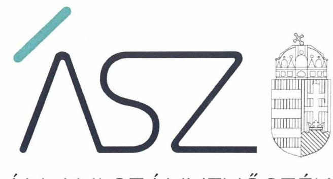
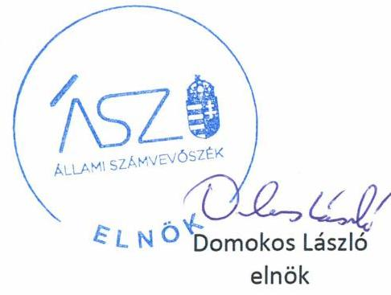

ÁLLAMI SZÁMVEVŐSZÉK

# JELENTÉS 

## Nem állami humánszolgáltatók ellenőrzése

A köznevelési humánszolgáltatást nyújtó intézmények, szolgáltatók államháztartáson kívüli fenntartói központi költségvetésből kapott támogatásai felhasználásának ellenőrzése Szabad Waldorf Nevelésért Alapítvány

2020
20114
www.asz.hu

---

ÁLLAMI SZÁMVEVŐSZÉK

# JELENTÉS 

## Nem állami humánszolgáltatók ellenőrzése

A köznevelési humánszolgáltatást nyújtó intézmények, szolgáltatók államháztartáson kívüli fenntartói központi költségvetésből kapott támogatásai felhasználásának ellenőrzése Szabad Waldorf Nevelésért Alapítvány
2020. 7. hó 8. nap

20114
www.asz.hu

---

# AZ ELLENŐRZÉST FELÜGYELTE: 

KLINGA LÁSZLÓ felügyeleti vezető

## AZ ELLENŐRZÉST VEZETTE ÉS A VÉGREHAJTÁSÁÉRT FELELŐS:

SALAMIN VIKTOR ellenőrzésvezető

## A PROGRAM ÖSSZEÁLLÍTÁSÁÉRT FELELŐS:

FEKETE-NAGY ANDRÁS GÁBOR ellenőrzési program készítéséért felelős vezető

IKTATÓSZÁM: EL-2744-001/2020
TÉMASZÁM: 2523
ELLENŐRZÉS-AZONOSÍTÓ SZÁM: V086705

---

# TARTALOMJEGYZÉK 

■ ÖSSZEGZÉS ..... 5
■ AZ ELLENŐRZÉS CÉLJA ..... 6
■ AZ ELLENŐRZÉS TERÜLETE ..... 7
■ AZ ELLENŐRZÉS HÁTTERE, INDOKOLTSÁGA ..... 8
■ A JELENTÉS LÉNYEGES KÉRDÉSKÖREI ..... 9
■ AZ ELLENŐRZÉS HATÓKÖRE ÉS MÓDSZEREI ..... 10
■ MEGÁLLAPÍTÁSOK ..... 12
■ MELLÉKLETEK ..... 15
I. sz. melléklet: Értelmező szótár ..... 15
■ FÜGGELÉK: ÉSZREVÉTELEK ..... 17
■ RÖVIDÍTÉSEK JEGYZÉKE ..... 19

---

.

---

# ÖSSZEGZÉS 

A solymári székhelyű Szabad Waldorf Nevelésért Alapítvány köznevelési közfeladata ellátása során 2016-2018. években megteremtette a szabályszerű közpénzfelhasználás feltételeit és biztosította a támogatások felhasználásának elszámoltathatóságát és átláthatóságát.

## Az ellenőrzés társadalmi indokoltsága

A köznevelési feladatok ellátása az Alaptörvényben meghatározott, a társadalom szempontjából fontos tevékenység. Jogszabályok teszik lehetővé, hogy államháztartáson kívüli szervezetek - így például az egyházi fenntartók, alapítványok, gazdasági társaságok, egyesületek - által fenntartott intézmények is végezzenek köznevelési feladatokat. Mindehhez a központi költségvetés évente jelentős összegű támogatással járul hozzá. Az államháztartáson kívüli, humánszolgáltatást végző intézmények az igényelt közpénzekből társadalmilag hasznos, közösségteremtő, közérdekű, illetve közhasznú tevékenységet végeznek, illetve közfeladatokat látnak el.

Az intézményfenntartók ellenőrzésével az Állami Számvevőszék hozzájárul ahhoz, hogy ezen közpénzeket az államháztartáson kívüli szervezetek is ellenőrizhető, átlátható és elszámoltatható módon használják fel a közfeladatok ellátása során. Az ellenőrzések célja továbbá, hogy a nyilvánosság és az igénybevevők megfelelő tájékoztatást kapjanak az államháztartáson kívüli közfeladatot ellátók működéséről.

Az ÁSZ ellenőrzése arra ad választ, hogy az intézményfenntartó arra használta-e fel a közpénzeket, amire igényelte.

A szabályszerű gazdálkodás elengedhetetlen a közfeladat ellátás szakmai céljainak megvalósításához, valamint a társadalmi közbizalom fenntartásához.

## Főbb megállapítások, következtetések, javaslatok

A Szabad Waldorf Nevelésért Alapítvány a 2016-2018. években szabályszerű működési- és gazdálkodási környezet kialakításával megteremtette a költségvetési támogatások átlátható, elszámoltatható igénybevételének, felhasználásának feltételeit.

A Szabad Waldorf Nevelésért Alapítvány az átvállalt köznevelési humánszolgáltatási közfeladathoz biztosított költségvetési támogatásokat szabályszerűen fordította a humánszolgáltató intézményei működtetésére.

A Szabad Waldorf Nevelésért Alapítvány a 2016-2018. években köznevelési intézményei működtetéséhez felhasznált közpénzekre vonatkozó gazdálkodásával elszámolt.

---

# AZ ELLENŐRZÉS CÉLJA

**AZ ELLENŐRZÉS CÉLJA** annak értékelése volt, hogy a Szabad Waldorf Nevelésért Alapítvány – mint nem állami, nem önkormányzati köznevelési intézmény fenntartója – központi költségvetésből kapott támogatásainak felhasználása szabályszerű volt-e.

---

# AZ ELLENŐRZÉS TERÜLETE 

## Szabad Waldorf Nevelésért Alapítvány

A SZABAD WALDORF NEVELÉSÉRT ALAPÍTVÁNY 1994. október 8-án jött létre azzal a céllal, hogy segítse a Solymáron és körzetében (beleértve Budapestet is) működő Waldorf intézményeket és szülői közösségeket pedagógiai céljaik elérésében, a nevelés, az oktatás, képességfejlesztés, az ismeretterjesztés és kulturális tevékenység folytatásában.

A Fenntartó ${ }^{1}$ legfőbb szerve az ellenőrzött időszakban a Kuratórium ${ }^{2}$ volt, melynek létszáma 2017. december 29-étől hét tagról három tagra csökkent. A Fenntartót a Kuratórium elnöke képviselte, személye az ellenőrzött időszakban nem változott. A Fenntartó felügyelő bizottságot működtetett, melynek létszáma négy főről három főre csökkent az ellenőrzött időszakban.

A Fenntartó által ellátott közfeladatok: köznevelési intézmény alapítása és fenntartása, óvodai ellátás, általános iskolai, gimnáziumi nevelés-oktatás, alapfokú művészetoktatás, fejlesztő nevelés-oktatás az együtt nevelhető, oktatható sajátos nevelési igényű gyerekek esetében, valamint pedagógiai-szakmai szolgáltatás voltak. A Fenntartó az alaptevékenységén kívül az ellenőrzött időszakban vállalkozási tevékenységet is folytatott.

A Fenntartó a Fészek Waldorf Általános Iskola, Gimnázium és Alapfokú Művészeti Iskolát, valamint a Solymári Waldorf Óvodát tartotta fenn, előbbi a székhelyen kívül két telephellyel is rendelkezett. Az ellenőrzött időszakban az engedélyezett maximális létszám az iskola esetében 413 fő, az óvoda esetében 50 fő volt. A Fenntartó mindkét székhely intézménye önálló jogi személyként működött. A Fenntartó a köznevelési feladat ellátására a Magyar Államkincstár adatai szerint a 2016. évben 185,7 millió Ft, a 2017. évben 204,1 millió Ft, a 2018. évben 204,0 millió Ft támogatásban részesült.

A Fenntartó könyvvizsgálatra a Civilszr. ${ }^{3}$ előírása alapján nem volt kötelezett, könyvvizsgálót nem bízott meg.

---

# AZ ELLENŐRZÉS HÁTTERE, INDOKOLTSÁGA 

A köznevelési és szociális feladatokat ellátó nem állami intézményfenntartók részére közfeladataik ellátására évente jelentős összegű pénzügyi támogatást biztosítottak a mindenkori költségvetési törvények a bennük megfogalmazott feltételek mellett. A köznevelési és szociális feladatokra felhasználható állami támogatások előirányzata a 2016 - 2018. években 846 Mrd Ft volt. A 2013. évben jelentős változások következtek be a normatív finanszírozás rendszerében. Az Országgyűlés elfogadta a nemzeti köznevelésről szóló 2011. évi CXC. törvényt, amely jelentősen átalakította a korábbi finanszírozási rendszert 2013. szeptemberétől.

Az ÁSZ stratégiájában foglaltak alapján is indokolt az ellenőrzés, amely a társadalom számára jelzi, hogy a közpénz államháztartáson kívüli felhasználása sem maradhat ellenőrizetlenül. Az államháztartáson kívülre nyújtott költségvetési támogatások ellenőrzésével az ÁSZ hozzájárul ahhoz, hogy a közpénzeket a nem állami fenntartók átlátható módon használják fel a közfeladatok ellátására kötött szerződésekben vállalt kötelezettségek teljesítése érdekében. Az ÁSZ az ellenőrzés javaslataival hozzájárulhat az említett rendszerek szabályszerű támogatás-felhasználásához, javíthatja a társadalmi gazdasági döntések megalapozottságát, amely a „jól irányított állam" feltétele.

---

# A JELENTÉS LÉNYEGES KÉRDÉSKÖREI 

1. A köznevelési közfeladatot ellátó államháztartáson kívüli fenntartó szabályszerű működési- és gazdálkodási környezet kialakításával megteremtette-e a költségvetési támogatások átlátható, elszámoltatható igénybevételének, felhasználásának feltételeit?
2. Az államháztartáson kívüli fenntartó az átvállalt köznevelési közfeladathoz biztosított költségvetési támogatásokat szabályszerűen fordította-e a humánszolgáltató intézményei működtetésére?
3. Az államháztartáson kívüli fenntartó a köznevelési intézményei működtetéséhez felhasznált közpénzekre vonatkozó gazdálkodásával a nyilvánosság előtt elszámolt-e, ennek érdekében ellenőrzési, értékelési és a külső ellenőrzésekkel kapcsolatos intézkedési feladatait szabályszerűen látta-e el?

---

# AZ ELLENŐRZÉS HATÓKÖRE ÉS MÓDSZEREI 

## Az ellenőrzés típusa

Megfelelőségi ellenőrzés.

## Az ellenőrzött időszak

A 2016. január 1-je és 2018. december 31-e közötti időszak.

## Az ellenőrzés tárgya

A köznevelési humánszolgáltatási közfeladatokat ellátó államháztartáson kívüli fenntartó közfeladatainak ellátásához a központi költségvetésből kapott támogatások felhasználása.

## Az ellenőrzött szervezet

Szabad Waldorf Nevelésért Alapítvány

## Az ellenőrzés jogalapja

Az ellenőrzés jogszabályi alapját az ÁSZ tv. ${ }^{4}$ 1. § (3) bekezdése, 5. § (3) bekezdésében foglalt előírások adják.

## Az ellenőrzés módszerei

Az ÁSZ az ellenőrzést az ellenőrzési program szempontjai, kérdései, az ellenőrzött időszakban hatályos jogszabályok alapján, a nemzetközi standardokat irányadónak tekintve, az ellenőrzés szakmai szabályok és módszertanok figyelembe vételével végezte. A közpénzekkel való felelős gazdálkodás segítésére irányuló javaslatok kidolgozásakor a hatályos jogszabályok voltak az irányadóak.

Az ellenőrzés ideje alatt az ellenőrzött szervezettel történő kapcsolattartást az ÁSZ SZMSZ5-ének vonatkozó előírása biztosította.

Az ellenőrzési kérdések megválaszolásához szükséges bizonyítékok megszerzése az ellenőrzött által rendelkezésre bocsátott dokumentumokra, adatokra alapozva megfigyelés, szemle (szemrevételezés), kérdésfeltevés (információkérés), valamint elemző eljárással történt.

Az ellenőrzési bizonyítékként felhasználható adatforrások közé tartoztak egyrészt az ellenőrzési program részletes szempontjainál felsorolt

---

adatforrások, másrészt minden - az ellenőrzés folyamán feltárt, az ellenőrzés szempontjából információt tartalmazó - dokumentum.

Az ellenőrzés lefolytatásához az ellenőrzött szervezet a kitöltött tanúsítványok, valamint az ÁSZ által kért dokumentumok elektronikus úton való megküldésével szolgáltatott adatokat, információkat. Az így rendelkezésre bocsátott adatok, információk és a tanúsítványok adatai valódiságának kontrollja az ellenőrzés keretében történt.

Az ÁSZ az ellenőrzést a köznevelési célú központi költségvetési támogatások igénylésével, felhasználásával, elszámolásával kapcsolatos feladatokat ellátó államháztartáson kívüli fenntartóknál/szervezeteinél végezte.

A köznevelési humánszolgáltatások központi költségvetési támogatásaival kapcsolatos, államháztartáson kívüli fenntartó jogszabályokban előírt feladatai betartása, továbbá a központi költségvetési támogatások szabályszerű nyilvántartása került ellenőrzésre a fenntartónál rendelkezésre álló nyilvántartások, beszámolók és egyéb dokumentumok alapján. Az ellenőrzés nem terjedt ki a köznevelési humánszolgáltatások központi költségvetési támogatásai igénylése, módosítása, elszámolása valódiságának, megalapozottságának, helyességének - sem a fenntartónál, sem a székhely intézményeinél való - értékelésére (mivel ennek felülvizsgálata, ellenőrzése a finanszírozó jogszabályban előírt feladata, határozatai kiadása előtt). Továbbá nem terjedt ki az ellenőrzés e források, intézmények általi szabályszerű felhasználásának értékelésére.

---

# MEGÁLLAPÍTÁSOK 

## 1. A köznevelési közfeladatot ellátó államháztartáson kívüli fenntartó szabályszerű működési- és gazdálkodási környezet kialakításával megteremtette-e a költségvetési támogatások átlátható, elszámoltatható igénybevételének, felhasználásának feltételeit?

Összegző megállapítás

A Fenntartó a 2016-2018. években a szabályszerű működési- és gazdálkodási környezet kialakításával megteremtette a költségvetési támogatások átlátható, elszámoltatható igénybevételének, felhasználásának feltételeit.

A Fenntartó meghatározta a humánszolgáltatást végző intézmények alapfeladatait, működése kereteit, gondoskodott nyilvántartásba vételükről. A Fenntartó az Nkt. ${ }^{6}$ előírása szerint rendelkezett közoktatási közfeladat ellátására vonatkozó működési engedéllyel, jóváhagyta az intézmények házirendjét, SZMSZ1-2 ${ }^{7}$-ét, meghatározta költségvetésüket. A Fenntartó rendelkezett alapítói okirattal ${ }^{8}{ }_{1-2}$, amely tartalmazta a jogszabályban előírt kötelező tartalmi elemeket.

A Fenntartó Számv. tv. ${ }^{9}$-ben foglaltaknak megfelelően rendelkezett számviteli politikával és annak keretében elkészítendő belső szabályzatokkal, továbbá elkészítette számlarendjét, kialakította a közfeladatokra kapott költségvetési támogatások felhasználása elkülönített nyilvántartásának kereteit.

## 2. Az államháztartáson kívüli fenntartó az átvállalt köznevelési közfeladathoz biztosított költségvetési támogatásokat szabályszerűen fordította-e a humánszolgáltató intézményei működtetésére?

Összegző megállapítás

A Fenntartó a 2016-2018. években az átvállalt köznevelési közfeladathoz biztosított költségvetési támogatásokat szabályszerűen fordította a humánszolgáltató intézményei működtetésére.

A Fenntartó a közfeladatokhoz rendelt költségvetési támogatások szabályszerű nyilvántartásának és felhasználásának feltételeit kialakította.

A költségvetési támogatásokat a Fenntartó - az Nkt.vhr. ${ }^{10}$ előírásával összhangban - alapfeladatonkénti bontásban elkülönítetten tartotta nyilván, a támogatásokat a jogszabályban meghatározott határidőben, 15 napon belül átadta intézményei ${ }^{11}$ részére.

---

A Fenntartó a támogatások felhasználása tekintetében vezetett nyilvántartásaival biztosította a szabályszerű gazdálkodási környezetet, ezzel igazolta a cél szerinti felhasználást.

# 3. Az államháztartáson kívüli fenntartó a köznevelési intézményei működtetéséhez felhasznált közpénzekre vonatkozó gazdálkodásával a nyilvánosság előtt elszámolt-e, ennek érdekében ellenőrzési, értékelési és a külső ellenőrzésekkel kapcsolatos intézkedési feladatait szabályszerűen látta-e el? 

Összegző megállapítás

A Fenntartó a 2016-2018. években a felhasznált közpénzekre vonatkozó gazdálkodásával elszámolt, ellenőrzési, értékelési és külső ellenőrzésekkel kapcsolatos intézkedési feladatait szabályszerűen látta el.

A Fenntartó a Számv. tv. szerinti beszámolási és könyvvezetési kötelezettségét teljesítette. A Fenntartó 2016-ban a Civilszr. ${ }^{12}$, 2017-2018-ban a Civilszr. ${ }_{2}$ előírásainak megfelelően kettős könyvvitellel alátámasztott egyszerűsített éves beszámolót, továbbá a Civil tv. ${ }^{13}$ előírásainak megfelelően közhasznúsági mellékletet készített, közzétételi kötelezettségének eleget tett.

A Fenntartó az Nkt. előírása szerint minden évben ellenőrizte az intézményeknél a köznevelési feladat ellátását, valamint értékelte a pedagógiai-szakmai munka eredményességét. A külső ellenőrzésekkel kapcsolatos intézkedési feladatait szabályszerűen látta el.

---

.

---

# MELLÉKLETEK 

- I. SZ. MELLÉKLET: ÉRTELMEZŐ SZÓTÁR
civil szervezet
humánszolgáltatás
költségvetési támogatás
köznevelési közfeladat
köznevelési intézmény

A civil szervezet a civil társaság, a Magyarországon nyilvántartásba vett egyesület (a párt, a szakszervezet és a kölcsönös biztosító egyesület kivételével), a közalapítvány és a pártalapítvány kivételével az alapítvány (Civil tv. 6. § (1)-(2) bekezdései)
Külön törvényben meghatározott szociális, gyermekjóléti, gyermekvédelmi, közoktatási, felsőoktatási, kulturális közfeladatok (2015. évi
 Kvtv. 43. § (1), (4) bekezdés, 1. számú melléklet XX/20/2/3. jogcím csoport, 19. alcím, 2016. évi Kvtv. 41. § (1), (4) bekezdés, 1. számú melléklet XX/20/2/3. jogcím csoport, 19. alcím, 2017. évi Kvtv. 41. § (1), (4) bekezdés, 1. számú melléklet XX/20/2/3. jogcím csoport, 19. alcím)

A társadalombiztosítás pénzügyi alapjai kivételével az államháztartás központi alrendszeréből ellenérték nélkül, pénzben nyújtott támogatások, ide nem értve
f) a szociális igazgatásról és szociális ellátásokról szóló törvény, valamint a gyermekek védelméről és a gyámügyi igazgatásról szóló törvény szerinti pénzbeli és természetbeni szociális és gyermekvédelmi ellátásokat (Áht. 1. § 14. pont)
A költségvetési törvényben megállapított támogatás többek között: Átlagbéralapú támogatást állapít meg a nevelési-oktatási, valamint pedagógiai szakszolgálati intézményt fenntartó nemzetiségi önkormányzat, az egyházi és magán köznevelési intézmény fenntartója részére az általuk fenntartott nevelési-oktatási intézményben, továbbá pedagógiai szakszolgálati intézményben pedagógus és - a (3) bekezdés kivételével - a nevelő-oktató munkát közvetlenül segítő munkakörben foglalkoztatottak után a 7. melléklet I. pontjában meghatározott jogosultak után, az őket ott megillető mértékek szerint. Működési támogatást állapít meg a nemzetiségi önkormányzat vagy az egyházi jogi személy által fenntartott nevelési-oktatási intézményekben ellátott, továbbá a pedagógiai szakszolgálati intézményekben gyógypedagógiai tanácsadásban, korai fejlesztésben, oktatásban és gondozásban, valamint a fejlesztő nevelésben részt vevő gyermekekre, tanulókra tekintettel a nemzetiségi önkormányzat és a bevett egyház részére a 7. melléklet II. pontja szerint (2015. évi Kvtv., 2016. évi Kvtv., 2017. évi Kvtv.)
A köznevelési intézmény alapító okiratában foglalt feladat: óvodai nevelés, nemzetiséghez tartozók óvodai nevelése, általános iskolai nevelés-oktatás, nemzetiséghez tartozók általános iskolai nevelése-oktatása, kollégiumi ellátás, nemzetiségi kollégiumi ellátás, gimnáziumi nevelés-oktatás, szakközépiskolai nevelés-oktatás, szakiskolai nevelés-oktatás, nemzetiségi gimnáziumi nevelés-oktatása, nemzetiségi szakközépiskolai nevelés-oktatása, nemzetiségi szakiskolai nevelés-oktatása, Köznevelési Hídprogramok keretében folyó nevelés-oktatás, felnőttoktatás, alapfokú művészetoktatás, fejlesztő nevelés, fejlesztő nevelés-oktatás, pedagógiai szakszolgálati feladat, a többi gyermekkel, tanulóval együtt nevelhető, oktatható sajátos nevelési igényű gyermekek, tanulók óvodai nevelése és iskolai nevelése-oktatása, azoknak a sajátos nevelési igényű gyermekeknek, tanulóknak az óvodai, iskolai, kollégiumi ellátása, akik a többi gyermekkel, tanulóval nem foglalkoztathatók együtt, a gyermekgyógyüdülőkben, egészségügyi intézményekben, rehabilitációs intézményekben tartós gyógykezelés alatt álló gyermekek tankötelezettségének teljesítéséhez szükséges oktatás, pedagógiai-szakmai szolgáltatás. (Nkt. 4. § 14a.)
A nevelési-oktatási intézmény, pedagógiai szakszolgálati intézmény, pedagógiaiszakmai szolgáltatást nyújtó intézmény.

---

székhely
telephely
nem állami, nem önkormányzati (államháztartáson kívüli) intézmény fenntartó

Az alapító okiratban, szakmai alapdokumentumban meghatározott, a köznevelési intézmény alapfeladatának ellátását szolgáló feladat ellátási hely, ahol képviseleti jogának gyakorlására jogosult vezetőjének munkahelye található. (Nkt. 4. § 27. pont) A székhelyen kívül működő feladat ellátási hely. (Nkt. 4. § 34. pont)
A köznevelési közfeladatokat/humánszolgáltatásokat ellátó Intézményt fenntartó egyházi jogi személy, társadalmi szervezet, alapítvány, közalapítvány, civil szervezet, országos nemzetiségi önkormányzat, nonprofit gazdasági társaság, gazdasági társaság és a humánszolgáltatást alaptevékenységként végző, Szja tv. hatálya alá tartozó egyéni vállalkozó. (2015. évi Kvtv. 43. § (1) bekezdés, 2016. évi Kvtv. 41. § (1), bekezdés, 2017. évi Kvtv. 41. § (1) bekezdés)

---

# FÜGGELÉK: ÉSZREVÉTELEK 

A jelentéstervezetet a Számvevőszék 15 napos észrevételezésre megküldte az ellenőrzött szervezetek vezetőinek az ÁSZ tv. 29. § (1) bekezdése előírásának megfelelően.

A Szabad Waldorf Nevelésért Alapítvány kuratóriumi elnöke a jelentéstervezetre nem tett észrevételt.

[^0]
[^0]:    * 29. § (1) Az Állami Számvevőszék az ellenőrzési megállapításait megküldi az ellenőrzött szervezet vezetőjének vagy az általa megbízott személynek, és annak, akinek személyes felelősségét állapította meg.
    (2) Az ellenőrzött szervezet vezetője és a felelősként megjelölt személy az ellenőrzés megállapításaira tizenöt napon belül írásban észrevételt tehet.
    (3) Az Állami Számvevőszék az észrevételre a beérkezésétől számított harminc napon belül írásban válaszol. A figyelembe nem vett észrevételeket köteles a jelentésben feltüntetni, és megindokolni, hogy azokat miért nem fogadta el.

---

.

---

# RÖVIDÍTÉSEK JEGYZÉKE 

${ }^{1}$ Fenntartó
${ }^{2}$ Kuratórium
${ }^{3}$ Civilszr. 2
${ }^{4}$ Ász tv.
${ }^{5}$ ÁSZ SZMSZ
${ }^{6} \mathrm{Nkt}$.
${ }^{7}$ SZMSZ ${ }_{1-2}$
${ }^{8}$ alapító okirat ${ }_{1}$
alapító okirat ${ }_{2}$
${ }^{9}$ Számv. tv.
${ }^{10}$ Nkt.vhr.
${ }^{11}$ Intézmények
${ }^{12}$ Civilszr. 1
${ }^{13}$ Civil tv.

Szabad Waldorf Nevelésért Alapítvány
Szabad Waldorf Nevelésért Alapítvány Kuratóriuma
479/2016. (XII. 28.) Korm. rendelet a számviteli törvény szerinti egyes egyéb szervezetek beszámoló készítési és könyvvezetési kötelezettségének sajátosságairól
az Állami Számvevőszékről szóló 2011. évi LXVI. törvény
az Állami Számvevőszék elnökének 3/2019. (XII. 23.) ÁSZ utasítása az Állami Számvevőszék Szervezeti és Működési Szabályzatáról (hatályos: 2020. január 1-jétől)
A nemzeti köznevelésről szóló 2011. évi CXC. törvény
SZMSZ ${ }_{1}$ az Iskola Szervezeti és Működési Szabályzata (hatályos: 2016. március 1-jétől)
SZMSZ ${ }_{2}$ az Óvoda Szervezeti és Működési Szabályzata (hatályos: 2016. május 30-ától, módosult 2018. április 17-én)
Szabad Waldorf Nevelésért Alapítvány Alapító okirata (hatályos: 2013. július 29-étől)
Szabad Waldorf Nevelésért Alapítvány Alapító okirata (hatályos: 2017. december 29-étől)
a számvitelről szóló 2000. évi C. törvény
229/2012. (VIII. 28.) Korm. rendelet a nemzeti köznevelésről szóló törvény végrehajtásáról
Fészek Waldorf Általános Iskola, Gimnázium és Alapfokú Művészeti Iskola, valamint Solymári Waldorf Óvoda
224/2000. (XII. 19.) Korm. rendelet a számviteli törvény szerinti egyes egyéb szervezetek beszámoló készítési és könyvvezetési kötelezettségének sajátosságairól
Az egyesülési jogról, a közhasznú jogállásról, valamint a civil szervezetek működéséről és támogatásáról szóló 2011. évi CLXXV. törvény

---

# ASZ 

ÁLLAMI SZÁMVEVŐSZÉK
1052 Budapest, Apáczai Cs. J. u. 10. I 1364 Budapest 4. Pf. 54 TEL: +36 14849100
email: szamvevoszek@asz.hu
web: www.asz.hu | www.aszhirportal.hu
