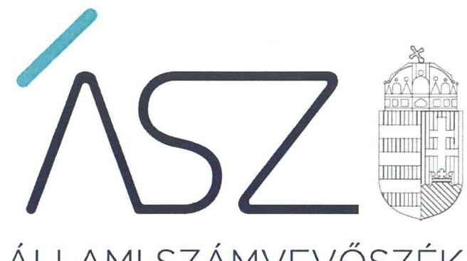
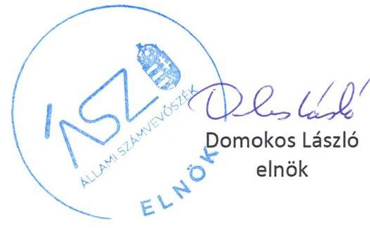

ÁLLAMI SZÁMVEVŐSZÉK

# JELENTÉS 

## Nem állami humánszolgáltatók ellenőrzése

A szociális humánszolgáltatást nyújtó intézmények, szolgáltatók államháztartáson kívüli fenntartói központi költségvetésből kapott támogatásai felhasználásának ellenőrzése – "Geronto-MED 2005" Egészségügyi Szolgáltató
Közhasznú Nonprofit Korlátolt Felelősségű Társaság
2020.

20116
www.asz.hu

---

ÁLLAMI SZÁMVEVŐSZÉK

# JELENTÉS

## Nem állami humánszolgáltatók ellenőrzése

A szociális humánszolgáltatást nyújtó intézmények, szolgáltatók államháztartáson kívüli fenntartói központi költségvetésből kapott támogatásai felhasználásának ellenőrzése – "Geronto-MED 2005" Egészségügyi Szolgáltató Közhasznú Nonprofit Korlátolt Felelősségű Társaság

2020. 08. hó 27. nap

20116
www.asz.hu

---

# AZ ELLENŐRZÉST FELÜGYELTE: 

MAROZSÁN LÁSZLÓNÉ felügyeleti vezető

## AZ ELLENŐRZÉST VEZETTE ÉS A VÉGREHAJTÁSÁÉRT FELELŐS:

SIPOSNÉ DÓCZI KLÁRA IBOLYA ellenőrzésvezető

## A PROGRAM ÖSSZEÁLLÍTÁSÁÉRT FELELŐS:

FEKETE-NAGY ANDRÁS GÁBOR ellenőrzési program elkészítéséért felelős vezető

TÓTPÁL SZABOLCS ellenőrzési program elkészítéséért felelős vezető

## IKTATÓSZÁM: EL-2746-001/2020

TÉMASZÁM: 2491
ELLENŐRZÉS-AZONOSÍTÓ SZÁM: V083574 ÉS V0867078

---

# TARTALOMJEGYZÉK 

- ÖSSZEGZÉS ..... 5
- AZ ELLENŐRZÉS CÉLJA ..... 6
- AZ ELLENŐRZÉS TERÜLETE ..... 7
- AZ ELLENŐRZÉS HÁTTERE, INDOKOLTSÁGA ..... 8
- AZ ELLENŐRZÉS LÉNYEGES KÉRDÉSKÖREI ..... 9
- AZ ELLENŐRZÉS HATÓKÖRE ÉS MÓDSZEREI ..... 10
- MELLÉKLETEK ..... 13
I. sz. melléklet: Értelmező szótár ..... 13
- FÜGGELÉK: ÉSZREVÉTELEK ..... 15
- RÖVIDÍTÉSEK JEGYZÉKE ..... 19

---

.

---

# ÖSSZEGZÉS 

A balatonföldvári székhelyű „Geronto-MED 2005"Egészségügyi Szolgáltató Közhasznú Nonprofit Korlátolt Felelősségű Társaság a 2015-2018. években nem biztosította a szociális humánszolgáltatási közfeladatok ellátására kapott költségvetési támogatások felhasználásának ellenőrizhetőségét.

## Az ellenőrzés társadalmi indokoltsága

A szociális gondoskodást igénylők védelme, illetve a köznevelési feladatok ellátása az Alaptörvényben meghatározott, a társadalom szempontjából fontos tevékenységek. Jogszabályok teszik lehetővé, hogy államháztartáson kívüli szervezetek - így például az egyházi fenntartók, alapítványok, gazdasági társaságok, egyesületek - által fenntartott intézmények is végezzenek köznevelési, szociális és gyermekvédelmi feladatokat. Mindehhez a központi költségvetés évente jelentős összegű támogatással járul hozzá. Az államháztartáson kívüli, humánszolgáltatást végző intézmények az igényelt közpénzekből társadalmilag hasznos, közösségteremtő, közérdekű, illetve közhasznú tevékenységet végeznek, illetve közfeladatokat látnak el.

Az intézményfenntartók ellenőrzésével az Állami Számvevőszék hozzájárul ahhoz, hogy ezen közpénzeket az államháztartáson kívüli szervezetek is ellenőrizhető, átlátható és elszámoltatható módon használják fel a közfeladatok ellátása során. Az ellenőrzések célja továbbá, hogy a nyilvánosság és az igénybevevők megfelelő tájékoztatást kapjanak az államháztartáson kívüli közfeladatot ellátók működéséről.

Az ÁSZ ellenőrzései arra adnak választ, hogy az intézményfenntartók arra használták-e fel a közpénzeket, amire igényelték.

A szabályszerű gazdálkodás elengedhetetlen a közfeladat ellátás szakmai céljainak megvalósításához, valamint a társadalmi közbizalom fenntartásához.

## Megállapítások, következtetések

A „Geronto-MED 2005"Egészségügyi Szolgáltató Közhasznú Nonprofit Korlátolt Felelősségű Társaság az ellenőrzött 2015-2018. években egy nem önálló intézményben ${ }^{1}$ látta el idősek részére az ápolást, gondozást nyújtó intézményi ellátás szociális feladatát. A Fenntartó² a költségvetési támogatás felhasználását, a Fenntartó és az intézmény gazdálkodását könyvviteli nyilvántartásában nem különítette el.

A fentiek alapján a Fenntartó a 2015-2018 években a szociális humánszolgáltatási közfeladat ellátására kapott költségvetési támogatás felhasználásának a Számv. tv. ${ }^{3}$ 161/A § (2) bekezdésében előírt ellenőrizhetőségét nem biztosította. Mivel az Atr. ${ }^{4} 16 . \S$ (1) bekezdésében foglalt szabályozás ellenére nem gondoskodott arról, hogy a költségvetési támogatások felhasználásának, a Fenntartó és a nem önállóan gazdálkodó intézménye gazdálkodásának elkülönített elszámolására az adatok rendelkezésre álljanak.

A Fenntartó mindezek alapján az Alaptörvény 39. cikk (2) bekezdésében foglaltak ellenére nem biztosította a felhasznált közpénzekre vonatkozó gazdálkodása átláthatóságát. Ezáltal a Fenntartó nem igazolta, hogy a közpénzt a szociális humánszolgáltatási közfeladatra fordította.

---

# AZ ELLENŐRZÉS CÉLJA

**AZ ELLENŐRZÉS CÉLJA** annak értékelése volt, hogy a nem állami, nem önkormányzati szociális intézmények fenntartói központi költségvetésből kapott támogatásainak felhasználása szabályszerű volt-e.

---

# AZ ELLENŐRZÉS TERÜLETE 

## „Geronto-Med 2005" Egészségügyi Szolgáltató Közhasznú Nonprofit Korlátolt Felelősségű Társaság, mint intézményfenntartó

A balatonföldvári székhelyű „Geronto-MED 2005" Egészségügyi Szolgáltató Közhasznú Nonprofit Korlátolt Felelősségű Társaság 2009. június 18-án három millió forint jegyzett tőkével jött létre a 2005-ben alakult közhasznú társaság jogutódjaként. Tagjai belföldi magánszemélyek, döntéshozó szerve a taggyűlés volt. Az ellenőrzött időszakban az ügyvezető személye nem változott.

A Társasági szerződés ${ }^{5}$ rendelkezése alapján a Társaságnál három főből álló felügyelő bizottság működött, a Számv. tv. alapján könyvvizsgálatra nem volt kötelezett. A Társaság ${ }^{6}$ az ellenőrzött időszakban közhasznú jogállással rendelkezett.

A közhasznú feladatellátását a Fenntartó nem önálló jogi személy Intézmény útján végezte. Tevékenységéhez kapcsolódóan Balatonföldvár Város Önkormányzatával ellátási szerződést kötött. A Fenntartó részére a szociális humánszolgáltatási feladat ellátásához a központi költségvetésből biztosított támogatás a Magyar Államkincstár adatai szerint a 2015-2018. időszakban 348,5 M Ft volt.

---

# AZ ELLENŐRZÉS HÁTTERE, INDOKOLTSÁGA 

A szociális feladatokat ellátó nem állami intézményfenntartók részére közfeladataik ellátására évente jelentős összegű pénzügyi támogatást biztosítottak a mindenkori költségvetési törvények a bennük megfogalmazott feltételek mellett. A felhasználható állami támogatások a Költségvetési törvényekben ${ }^{7}$ a 2015-2018. években a szociális ágazatra vonatkozóan 360 milliárd forint előirányzatot határoztak meg.

Az ÁSZ ${ }^{8}$ a stratégiájában célul tűzte ki, hogy az államháztartáson kívülre nyújtott költségvetési támogatások ellenőrzésével hozzájárul ahhoz, hogy a közpénzeket az államháztartáson kívüli szervezetek is átlátható módon használják fel a közfeladatok szerződésben vállalt ellátása érdekében. Az ÁSZ stratégiájában foglaltak alapján is indokolt az ellenőrzés, amely a társadalom számára jelzi, hogy a közpénz államháztartáson kívüli felhasználása sem maradhat ellenőrizetlenül. Az államháztartáson kívülre nyújtott költségvetési támogatások ellenőrzésével az ÁSZ hozzájárul ahhoz, hogy a közpénzeket a nem állami humán fenntartók átlátható módon használják fel a közfeladatok ellátására kötött szerződésekben vállalt kötelezettségek teljesítése érdekében. Az ellenőrzés javaslataival hozzájárulhat az említett rendszerek szabályszerű támogatás felhasználásához, javíthatja a társadalmi-gazdasági döntések megalapozottságát, amely a „jól irányított állam működésének" feltétele.

---

# AZ ELLENŐRZÉS LÉNYEGES KÉRDÉSKÖREI 

1. A szociális humánszolgáltató közfeladatot ellátó fenntartó szabályszerű működési - és gazdálkodási környezet kialakításával megteremtette-e a költségvetési támogatások átlátható, elszámoltatható igénybevételének, felhasználásának feltételeit?
2. Az államháztartáson kívüli fenntartó az átvállalt szociális humánszolgáltatási közfeladathoz biztosított költségvetési támogatásokat szabályszerűen fordította-e a humánszolgáltató intézménye működtetésére?
3. Az államháztartáson kívüli fenntartó szociális humánszolgáltató intézménye működtetéséhez felhasznált közpénzekre vonatkozó gazdálkodásával a nyilvánosság előtt elszámolt-e, ennek érdekében ellenőrzési, értékelési és a külső ellenőrzésekkel kapcsolatos intézkedési feladatait szabályszerűen látta-e el?

---

# AZ ELLENŐRZÉS HATÓKÖRE ÉS MÓDSZEREI 

## Az ellenőrzés típusa

Megfelelőségi ellenőrzés.

## Az ellenőrzött időszak

A 2015. január 1-je és 2018. december 31-e közötti időszak.

## Az ellenőrzés tárgya

Az ellenőrzés a szociális humánszolgáltatási közfeladatokat ellátó államháztartáson kívüli fenntartók humánszolgáltatási közfeladatai ellátásához a központi költségvetésből kapott támogatásaik humánszolgáltatási közfeladatokra való fenntartó általi felhasználása szabályszerűségének értékelésére terjedt ki.

## Az ellenőrzött szervezet

„Geronto-MED 2005" Egészségügyi Szolgáltató Közhasznú Nonprofit Korlátolt Felelősségű Társaság mint intézményfenntartó

## Az ellenőrzés jogalapja

Az ellenőrzés jogszabályi alapját az ÁSZ tv. ${ }^{9} 1 . \S$ (3) bekezdés, valamint az 5. § (3) bekezdésében foglalt előírások adták.

## Az ellenőrzés módszerei

Az ellenőrzést az ellenőrzési program annak szempontjai, kérdései, az ellenőrzött időszakban hatályos jogszabályok, a nemzetközi standardokat irányadónak tekintve, az ellenőrzés szakmai szabályok és módszertanok figyelembe vételével rendelte elvégezni. A közpénzekkel való felelős gazdálkodás segítésére irányuló javaslatok kidolgozásakor a hatályos jogszabályok az irányadók.

Az ellenőrzés ideje alatt az ellenőrzött szervezettel történő kapcsolattartást az ÁSZ SZMSZ ${ }^{10}$-ének vonatkozó előírásai alapján biztosította az ÁSZ.

---

Az ellenőrzési kérdések megválaszolásához szükséges bizonyítékok megszerzése az ellenőrzött által rendelkezésre bocsátott dokumentumokra, adatokra alapozva elemző eljárással történt.

Az ellenőrzési bizonyítékként felhasználható adatforrások közé tartoztak egyrészt az ellenőrzési program részletes szempontjainál felsorolt adatforrások, másrészt minden - az ellenőrzés folyamán feltárt, az ellenőrzés szempontjából információt tartalmazó - dokumentum.

Az ellenőrzés lefolytatásához az ellenőrzött szervezet a kitöltött tanúsítványok, valamint az ÁSZ által kért dokumentumok elektronikus úton való megküldésével szolgáltatott adatokat, információkat. Az így rendelkezésre bocsátott adatok, információk és a tanúsítványok adatai valódiságának kontrollja az ellenőrzés keretében történt.

A szociális humánszolgáltatások központi költségvetési támogatásaival kapcsolatos, államháztartáson kívüli fenntartó jogszabályokban előírt feladatai betartását, továbbá a központi költségvetési támogatások szabályszerű nyilvántartását ellenőrizte az ÁSZ a Fenntartónál rendelkezésre álló nyilvántartások, beszámolók és egyéb dokumentumok alapján. Az ellenőrzés nem terjedt ki a szociális humánszolgáltatások központi költségvetési támogatásai igénylése, módosítása, elszámolása valódiságának, megalapozottságának, helyességének értékelésére (mivel ennek felülvizsgálata, ellenőrzése a finanszírozó jogszabályban előírt feladata, határozatai kiadása előtt). Továbbá nem terjedt ki az ellenőrzés e források szabályszerű felhasználásának értékelésére.

---

.

---

# MELLÉKLETEK 

- I. SZ. MELLÉKLET: ÉRTELMEZŐ SZÓTÁR
humánszolgáltatás
kültségvetési támogatás
nem állami, nem önkormányzati (államháztartáson kívüli) intézmény fenntartó
székhely intézmény
telephely

Külön törvényben meghatározott szociális, gyermekjóléti, gyermekvédelmi, közoktatási, felsőoktatási, kulturális közfeladatok (2014. évi Kvtv. 34. § (1), (4) bekezdés, 1. számú melléklet XX/20/2. alcím, 19. alcím, 2015. évi Kvtv. 43. § (1), (4) bekezdés, 1. számú melléklet XX/20/2/3. jogcím csoport, 19. alcím, 2016. évi Kvtv. 41. § (1), (4) bekezdés, 1. számú melléklet XX/20/2/3. jogcím csoport, 19. alcím).
a társadalombiztosítás pénzügyi alapjai kivételével az államháztartás központi alrendszeréből ellenérték nélkül, pénzben nyújtott támogatások (Áht. ${ }^{11} 1 . \S 14$. pont)
A költségvetési törvényekben (2014. évi C. törvény 42-43. §, 2015. évi C. törvény 40-41. §) megállapított támogatás. Például a 2015. évi C. törvény 40-41. § szerint többek között: Az Országgyűlés a szociális, gyermekjóléti, gyermekvédelmi közfeladatot ellátó intézményt, szolgáltatást fenntartó egyházi jogi személy, civil szervezet, közalapítvány, országos nemzetiségi önkormányzat, települési vagy területi nemzetiségi önkormányzat, gazdasági társaság, és a humánszolgáltatást alaptevékenységként végző, az Szja tv. ${ }^{12}$ hatálya alá tartozó egyéni vállalkozó (a továbbiakban együtt: nem állami szociális fenntartó) részére támogatást állapít meg a következők szerint: a támogatás a nem állami szociális fenntartót a települési önkormányzatok 2. melléklet III. pont 3. alpont c)-k) pontjában és III. pont 5. alpont a) pontjában meghatározott támogatásaival azonos jogcímeken, összegben és feltételek mellett illeti meg.
A szociális, gyermekjóléti és gyermekvédelmi közfeladatokat/humánszolgáltatásokat ellátó intézményt fenntartó egyházi jogi személy, társadalmi szervezet, alapítvány, közalapítvány, civil szervezet, országos nemzetiségi önkormányzat, nonprofit gazdasági társaság, gazdasági társaság és a humánszolgáltatást alaptevékenységként végző, Szja tv. hatálya alá tartozó egyéni vállalkozó. (2014. évi Kvtv. 33. §, 34. § (1), (4) bekezdés, 2015. évi Kvtv. 42. §, 43. § (1), (4) bekezdés, 2016. évi Kvtv. 40. §, 41. § (1), (4) bekezdés, 2017. évi Kvtv. 41. § (1), (4))
a szolgáltató székhelye, azaz a szolgáltató központi ügyintézésének helye, függetlenül attól, hogy használják-e szolgáltatás nyújtására (Sznyvhr. ${ }^{13}$ 1.§ k) pont) (hatályos: 2013. december 1-től)
a szolgáltató székhelyétől különböző, szolgáltató/intézmény használatában álló hely, a szociális humánszolgáltatáshoz használt, bejegyzett hely. (Sznyvhr. 1.§ l) pont) (hatályos: 2015. január 1-től)

---

.

---

# FÜGGELÉK: ÉSZREVÉTELEK 

A jelentéstervezetet a Számvevőszék 15 napos észrevételezésre megküldte az ellenőrzött szervezet vezetőjének az ÁSZ tv. 29. § (1) bekezdése előírásának megfelelően.

A ,,Geronto-MED 2005" Egészségügyi Szolgáltató Közhasznú Nonprofit Korlátolt Felelősségű Társaság ügyvezetője a jelentéstervezet megállapításaira észrevételt tett.
Az ÁSZ tv. 29. § (3) bekezdésével összhangban az Állami Számvevőszék a Függelékben feltünteti az ellenőrzés megállapításaival kapcsolatban tett, figyelembe nem vett észrevételeket, és megindokolja, hogy azokat miért nem fogadta el.

[^0]
[^0]:    * 29. § (1) Az Állami Számvevőszék az ellenőrzési

 megállapításait megküldi az ellenőrzött szervezet vezetőjének vagy az általa megbízott személynek, és annak, akinek személyes felelősségét állapította meg.
    (2) Az ellenőrzött szervezet vezetője és a felelősként megjelölt személy az ellenőrzés megállapításaira tizenöt napon belül írásban észrevételt tehet.
    (3) Az Állami Számvevőszék az észrevételre a beérkezésétől számított harminc napon belül írásban válaszol. A figyelembe nem vett észrevételeket köteles a jelentésben feltüntetni, és megindokolni, hogy azokat miért nem fogadta el.

---

# A „Geronto-MED 2005" Egészségügyi Szolgáltató Közhasznú Nonprofit Korlátolt Felelősségű Társaság (továbbiakban: Fenntartó) ügyvezetője által a 2020. május 7-én kelt levélben tett észrevételek és azok kezelésének indokolása: 

A Fenntartó ügyvezetője észrevételében jelezte, hogy a jelentéstervezet összegzésében leírtakat nem tudják elfogadni, mert a Fenntartó megalakulása óta kizárólag idősek részére bentlakásos gondozási és ápolási feladatokat végez. A Fenntartó semmilyen más, nem szociális humán szolgáltatási közfeladatok hatókörébe tartozó tevékenységet nem végez, így ezekkel kapcsolatban felmerült árbevétele és költsége sem keletkezett. A Fenntartó és az Iris Ápolási Intézet I. (továbbiakban: Intézmény) egy és ugyanaz a gazdálkodási egység. A Fenntartónak a szociális humán szolgáltatási feladatokat végző alkalmazottakon kívül más munkavállalója nincs, a Fenntartó ügyvezetője megbízási jogviszony alapján „0" forintért látja el ügyvezetői feladatait. A Fenntartó ügyvezetőjének észrevétele szerint az egyházi és nem állami fenntartású szociális, gyermekjóléti és gyermekvédelmi szolgáltatók, intézmények és hálózatok állami támogatásáról szóló 489/2013. (XII. 18.) Korm. rendelet (továbbiakban: Atr.) 16. § (1) bekezdésében foglaltak szerint gondoskodtak arról, hogy a költségvetési támogatások felhasználása a Fenntartó és a nem önállóan gazdálkodó Intézménye gazdálkodásának elkülönített elszámolására az adatok rendelkezésre álljanak, ugyanis a főkönyvi kivonatban a Fenntartó befolyt árbevétele 0 forint, a Fenntartó felhasznált költsége 0 forint.

A Fenntartó ügyvezetője észrevételében kiemelte, hogy a Fenntartó 2005-től 2018. december 31-ig egy Intézményben végezte a szociális humán szolgáltatói közfeladatait, ezért árbevételeit és költségeit is ennek megfelelően tartotta nyilván. Leírta továbbá, hogy az Állami Számvevőszék (továbbiakban: ÁSZ) rendelkezésére bocsátott részletes főkönyvi kivonatok és a kapott támogatások felhasználásáról kitöltött táblázatokból egyértelműen kiderül, hogy az éves szintű támogatási összegek az alkalmazottak bérét, és annak járulékait, valamint a felhasznált gyógyszer és élelmiszer költségeket sem fedezték. A Fenntartó ügyvezetőjének véleménye szerint a rendelkezésre bocsátott mérlegek, főkönyvi kivonatok és a támogatások felhasználásának bemutatására kitöltött táblázatok tanúsága szerint a Fenntartó 2015-2018. években a szociális humán szolgáltatási közfeladatokra kapott állami támogatásokkal, közpénzekkel átláthatóan gazdálkodott és azokkal elszámolt, azokat bizonyíthatóan a szociális humán szolgáltatási közfeladatra fordította.

Észrevételére válaszolva az ÁSZ tájékoztatta a Fenntartó ügyvezetőjét, hogy az ÁSZ a 2015-2018. évek viszonylatában az ellenőrzés során többek között a költségvetési támogatások elkülönített nyilvántartását igazoló, alátámasztó dokumentumokat (főkönyvi és analitikus nyilvántartások) kérte beküldeni az EL-1383-003/2018. és az EL-1383038/2019. iktatószámú adatbekérő levelek 2. számú mellékletének adott soraiban. Az érintett, kért dokumentumkörhöz az adatbekérés során a 2015-2017. évi fenntartói főkönyvi kivonatokat, a 2015-2017. évekre vonatkozóan a támogatások analitikája/nyilvántartása elnevezésű dokumentumokat, a 2018. évre vonatkozóan a fenntartói főkönyvi kivonatot, éves beszámolót, a számviteli politikát, pénzkezelési, értékelési és leltározási és selejtezési szabályzatot küldték meg az ÁSZ részére. A Fenntartó ügyvezetője a 2019. január 15-én és 2019. október 16-án kelt nyilatkozataiban kijelentette, hogy az ÁSZ részére átadott dokumentumok, adatok megbízhatóak, és a bekért adatokra, dokumentumokra vonatkozóan teljes körű információt tartalmaznak.

Az adatszolgáltatás során beküldött főkönyvi kivonatok, mérlegek és az észrevételében hivatkozott, a fenntartó által kapott támogatások felhasználásáról kitöltött táblázatok ismételt felülvizsgálata során megállapításra került, hogy a Fenntartó a kapott költségvetési támogatásokat bevételként elkülönítetten kezelte, azonban a támogatások felhasználásának elkülönítését a számviteli rendjében nem biztosította. Az ellenőrzés rendelkezésére bocsátott főkönyvi kivonatok nem támasztják alá a Fenntartó ügyvezetőjének azon kijelentését, miszerint a Fenntartó az ellenőrzött években nem tett szert árbevételre és nem használt fel költséget. A főkönyvi kivonatok alapján megállapítható, hogy a Fenntartónak a 2015-2018. években belföldi értékesítésből (alaptevékenység nettó árbevétele) és szolgáltatásnyújtásból (humán egészségügyi szolgáltatás árbevétele) is származott árbevétele. A Fenntartó főkönyvi kivonataiban rögzített számlaszámok, azok megnevezései - a jogszabályok által előírt alábontás, részletezés hiányában - nem igazolják, hogy ezen árbevételek nem fenntartói bevételek, illetve az elszámolt költségek csak az Intézmény tevékenységéhez kapcsolódnak. Ezáltal az ellenőrzés rendelkezésére bocsátott dokumentumokból az volt megállapítható, hogy a Fenntartó az Atr. 16. § (1) bekezdés előírása ellenére számviteli rendjében nem kezelte elkülönítetten saját

---

és nem önállóan gazdálkodó Intézménye gazdálkodását.
Az ÁSZ tájékoztatta továbbá a Fenntartó ügyvezetőjét, hogy a közpénzekre vonatkozó gazdálkodás átláthatóságának, a közpénzek rendeltetésszerű felhasználásának igazolásához, nem elegendő a főkönyvi kivonatból annak kiderülni, hogy a támogatási összeg nagyságrendileg kisebb, mint az alkalmazottak bére, járulékai, gyógyszer és élelmiszerköltség - ahogy ezt észrevételében leírta. A támogatás felhasználását, a Fenntartó és Intézmény bevételeit és költségét egyértelműen megjelölve, elkülönítve kell kimutatni a számviteli nyilvántartásokban, mivel a Számv. tv. 161/A § (2) bekezdése előírja, hogy a közpénzek felhasználásának és a köztulajdon használatának nyilvánossága és ellenőrizhetősége érdekében a gazdálkodó nyilvántartási (könyvvezetési) rendszerét köteles oly módon továbrészletezni, hogy abból a vonatkozó külön jogszabályban - jelen esetben az Atr. - meghatározott adatok rendelkezésre álljanak.

A fent leírtakra tekintettel az ÁSZ az észrevételt nem fogadta el, a jelentéstervezet módosítása nem volt indokolt.

---

.

---

# RÖVIDÍTÉSEK JEGYZÉKE 

${ }^{1}$ Intézmény
${ }^{2}$ Fenntartó
${ }^{3}$ Számv. tv.
${ }^{4}$ Atr.
${ }^{5}$ Társasági szerződés
${ }^{6}$ Társaság
${ }^{7}$ Költségvetési törvények
${ }^{8}$ ÁSZ
${ }^{9}$ ÁSZ tv.
${ }^{10}$ ÁSZ SZMSZ
${ }^{11}$ Áht.
${ }^{12}$ Szja. tv.
${ }^{13}$ Sznyvhr.

IRIS Ápolási Otthon
„Geronto-Med 2005" Egészségügyi Szolgáltató Közhasznú Nonprofit Korlátolt Felelősségű Társaság
2000. évi C törvény a számvitelről (hatályos 2001. január 1-től)
489/2013. (XII. 18.) Korm. rendelet az egyházi és nem állami fenntartású szociális, gyermekjóléti és gyermekvédelmi szolgáltatók, intézmények és hálózatok állami támogatásáról
„Geronto-Med 2005" Egészségügyi Szolgáltató Közhasznú Nonprofit Korlátolt Felelősségű Társaság módosított, az alap rendelkezéseket is tartalmazó, egységes szerkezetbe foglalt, 2014. május 27. napján kelt Társasági szerződése „Geronto-Med 2005" Egészségügyi Szolgáltató Közhasznú Nonprofit Korlátolt Felelősségű Társaság
2014. évi C. törvény Magyarország 2015. évi központi költségvetéséről, 2015. évi C. törvény Magyarország 2016. évi központi költségvetéséről, 2016. évi XC. törvény Magyarország 2017. évi központi költségvetéséről 2017. évi C. törvény Magyarország 2018. évi központi költségvetéséről Állami Számvevőszék
2011. évi LXVI. törvény az Állami Számvevőszékről (hatályos: 2011 július 1-től) az Állami Számvevőszék Szervezeti és Működési Szabályzata 2011. évi CXCV. törvény az államháztartásról (hatályos: 2011. december 31-től) 1995. évi CXVII. törvény a személyi jövedelemadóról (hatályos 1996. január 1-től) 369/2013. (X. 24.) Korm. rendelet a szociális, gyermekjóléti és gyermekvédelmi szolgáltatók, intézmények és hálózatok hatósági nyilvántartásáról és ellenőrzéséről (hatályos 2013. december 1-jétől)

---

# ASZ 

ÁLLAMI SZÁMVEVŐSZÉK
1052 Budapest, Apáczai Cs. J. u. 10. I 1364 Budapest 4. Pf. 54 TEL: +36 14849100
email: szamvevoszek@asz.hu
web: www.asz.hu | www.aszhirportal.hu

