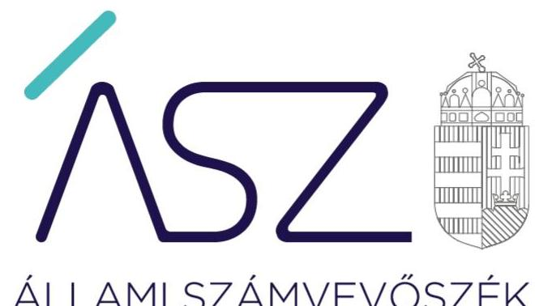
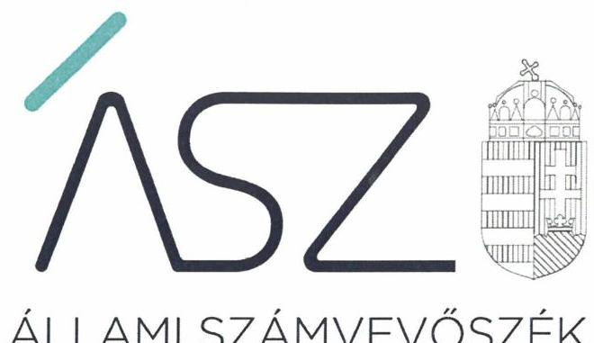
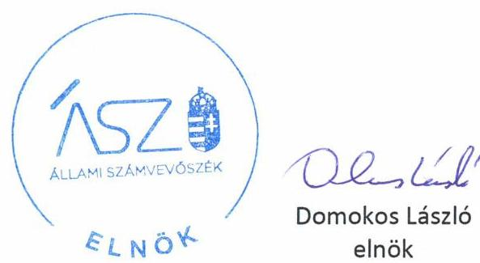
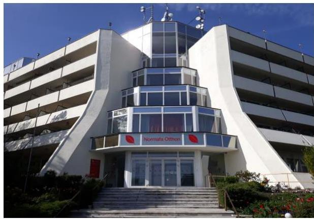

ÁLLAMI SZÁMVEVŐSZÉK

# JELENTÉS 

## Nem állami humánszolgáltatók ellenőrzése

A szociális humánszolgáltatást nyújtó intézmények, szolgáltatók államháztartáson kívüli fenntartói központi költségvetésből kapott támogatásai felhasználásának ellenőrzése NORMAFA Idősek Otthona Közhasznú Nonprofit Korlátolt Felelősségű Társaság
2020.

20117
www.asz.hu

---

ÁLLAMI SZÁMVEVŐSZÉK

# JELENTÉS 

## Nem állami humánszolgáltatók ellenőrzése

A szociális humánszolgáltatást nyújtó intézmények, szolgáltatók államháztartáson kívüli fenntartói központi költségvetésből kapott támogatásai felhasználásának ellenőrzése NORMAFA Idősek Otthona Közhasznú Nonprofit Korlátolt Felelősségű Társaság
2020. 

O6. hó 30 nap

20117
www.asz.hu

---

# AZ ELLENŐRZÉST FELÜGYELTE: 

VARGA EDIT felügyeleti vezető

## AZ ELLENŐRZÉST VEZETTE ÉS A VÉGREHAJTÁSÁÉRT FELELŐS:

DR. TÓTH VIKTÓRIA ellenőrzésvezető

## A PROGRAM ÖSSZEÁLLÍTÁSÁÉRT FELELŐS:

TÓTPÁL SZABOLCS osztályvezető
FEKETE-NAGY ANDRÁS GÁBOR projektvezető

IKTATÓSZÁM: EL-2747-001/2020
TÉMASZÁM: 2491
ELLENŐRZÉS-AZONOSÍTÓ SZÁM: V083554, V0867062

---

# TARTALOMJEGYZÉK 

■ ÖSSZEGZÉS ..... 5
■ AZ ELLENŐRZÉS CÉLJA ..... 6
■ AZ ELLENŐRZÉS TERÜLETE ..... 7
■ AZ ELLENŐRZÉS HÁTTERE, INDOKOLTSÁGA ..... 8
■ AZ ELLENŐRZÉS KÉRDÉSKÖREI ..... 9
■ AZ ELLENŐRZÉS HATÓKÖRE ÉS MÓDSZEREI ..... 10
■ MELLÉKLET ..... 13
I. sz. melléklet: Értelmező szótár ..... 13
■ FÜGGELÉK: ÉSZREVÉTELEK ..... 15
■ RÖVIDÍTÉSEK JEGYZÉKE ..... 17

---

.

---

# ÖSSZEGZÉS 

A budapesti székhelyű NORMAFA Idősek Otthona Közhasznú Nonprofit Korlátolt Felelősségű Társaság a 2015-2018. években nem biztosította a szociális humánszolgáltatási közfeladatok ellátására kapott költségvetési támogatások felhasználásának ellenőrizhetőségét.

## Az ellenőrzés társadalmi indokoltsága

A szociális gondoskodást igénylők védelme, illetve a köznevelési feladatok ellátása az Alaptörvényben meghatározott, a társadalom szempontjából fontos tevékenységek. Jogszabályok teszik lehetővé, hogy államháztartáson kívüli szervezetek - így például az egyházi fenntartók, alapítványok, gazdasági társaságok, egyesületek - által fenntartott intézmények is végezzenek köznevelési, szociális és gyermekvédelmi feladatokat. Mindehhez a központi költségvetés évente jelentős összegű támogatással járul hozzá. Az államháztartáson kívüli, humánszolgáltatást végző intézmények az igényelt közpénzekből társadalmilag hasznos, közösségteremtő, közérdekű, illetve közhasznú tevékenységet végeznek, illetve közfeladatokat látnak el.

Az intézményfenntartók ellenőrzésével az Állami Számvevőszék hozzájárul ahhoz, hogy ezen közpénzeket az államháztartáson kívüli szervezetek is ellenőrizhető, átlátható és elszámoltatható módon használják fel a közfeladatok ellátása során. Az ellenőrzések célja továbbá, hogy a nyilvánosság és az igénybevevők megfelelő tájékoztatást kapjanak az államháztartáson kívüli közfeladatot ellátók működéséről. Az ÁSZ ellenőrzései arra adnak választ, hogy az intézményfenntartók arra használták-e fel a közpénzeket, amire igényelték.

A szabályszerű gazdálkodás elengedhetetlen a közfeladat ellátás szakmai céljainak megvalósításához, valamint a társadalmi közbizalom fenntartásához.

## Megállapítások, következtetések

A budapesti székhelyű NORMAFA Idősek Otthona Közhasznú Nonprofit Kft., mint Fenntartó ${ }^{1}$ a 2015-2018. években szociális humánszolgáltatási közfeladatait nem önállóan gazdálkodó intézményében ${ }^{2}$ látta el. Az intézménye által ellátott közfeladatok az idősek otthonában nyújtott átlagos szintű ellátás és a demens betegek ellátása volt. A Fenntartó az ellenőrzött időszakban a könyvvezetésében a kapott költségvetési támogatások felhasználását a jogszabályok által előírt módon nem különítette el, valamint a könyvvezetésében a Fenntartó és intézménye közötti, valamint az intézménye által ellátott közfeladatok szerinti bontásban nem rögzítette.

A Fenntartó a 2015-2018. években a szociális humánszolgáltatási közfeladat ellátására kapott költségvetési támogatás felhasználásának a Számv. tv. ${ }^{3}$ 161/A. § (2) bekezdésében előírt ellenőrizhetőségét nem biztosította. Mivel az Atr. ${ }^{4}$ 16. § (1) bekezdésében foglalt szabályozás ellenére nem gondoskodott arról, hogy a költségvetési támogatások felhasználásának a Fenntartó és a nem önállóan gazdálkodó intézménye gazdálkodásának elkülönített, feladatonkénti bontásban történő elszámolására az adatok rendelkezésre álljanak.

A Fenntartó mindezek alapján az Alaptörvény 39. cikk (2) bekezdésében foglaltak ellenére nem biztosította a felhasznált közpénzekre vonatkozó gazdálkodása átláthatóságát.

Ezáltal a Fenntartó nem igazolta, hogy a közpénzt a szociális humánszolgáltatási közfeladatra fordította.

---

# AZ ELLENŐRZÉS CÉLJA

**AZ ELLENŐRZÉS CÉLJA** annak értékelése volt, hogy a nem állami, nem önkormányzati szociális intézmények fenntartói központi költségvetésből kapott támogatásainak felhasználása szabályszerű volt-e.

---

# **AZ ELLENŐRZÉS TERÜLETE**

## **NORMAFA Idősek Otthona Közhasznú Nonprofit Kft.**

A Fenntartó budapesti székhelyű gazdasági társaság, főtevékenysége idősek, fogyatékosok bentlakásos ellátása. További közhasznú tevékenysége volt az egyéb humán-egészségügyi ellátás és az idősek, fogyatékosok szociális ellátása bentlakás nélkül.

A Fenntartónak két, önálló képviseleti joggal rendelkező ügyvezetője volt, személyükben az ellenőrzött időszakban változás nem történt.

A Fenntartó 2007-től működtetett nem önállóan gazdálkodó szociális intézményt Normafa Idősek Otthona néven, a Fenntartó budapesti székhelyén. Az Intézmény által nyújtott szolgáltatások voltak:

- ápolást, gondozást nyújtó intézményi ellátás – idősek otthona, engedélyezett férőhely szám 120 fő átlagos szintű férőhely;
- átmeneti elhelyezést nyújtó intézményi ellátás – időskorúak gondozóháza, engedélyezett férőhely szám 30 fő (demens betegek ellátása).

A tényleges ellátotti létszám 2015-2018. években összesen 91-94 fő/év között alakult.

A Fenntartó bevételei meghatározó részben az ellátottak személyi térítési díjaiból származtak. Az ellenőrzött években központi költségvetésből származó támogatás összegét az 1. táblázat tartalmazza.

|  Megnevezés | 2015. | 2016. | 2017. | 2018.  |
| --- | --- | --- | --- | --- |
|  Központi költségvetésből támogatás (millió Ft) | 66,0 | 70,6 | 74,4 | 84,7  |

*Forrás: Magyar Államkincstár*

---

# AZ ELLENŐRZÉS HÁTTERE, INDOKOLTSÁGA 

A szociális feladatokat ellátó nem állami intézményfenntartók részére közfeladataik ellátására évente jelentős összegű pénzügyi támogatást biztosítottak a mindenkori költségvetési törvények a bennük megfogalmazott feltételek mellett. A felhasználható állami támogatások a Kvtv. 1,2,3,4-ekben ${ }^{5}$ a 2015-2018. években a szociális ágazatra vonatkozóan 360 Mrd Ft előirányzatot határoztak meg. A 2013. évben jelentős változások következtek be a normatív finanszírozás rendszerében. Az Országgyűlés elfogadta a nemzeti köznevelésről szóló 2011. évi CXC. törvényt, amely jelentősen átalakította a korábbi finanszírozási rendszert 2013 szeptemberétől. Az ellenőrzések indokoltságát az is alátámasztja, hogy az ÁSZ ${ }^{6}$ számos szervezetet még nem ellenőrzött ezen a területen.

Az ÁSZ a stratégiájában célul tűzte ki, hogy az államháztartáson kívülre nyújtott költségvetési támogatások ellenőrzésével hozzájárul ahhoz, hogy a közpénzeket az államháztartáson kívüli szervezetek is átlátható módon használják fel a közfeladatok szerződésben vállalt ellátása érdekében. Az ÁSZ stratégiájában foglaltak alapján is indokolt az ellenőrzés, amely a társadalom számára jelzi, hogy a közpénz államháztartáson kívüli felhasználása sem maradhat ellenőrizetlenül. Az államháztartáson kívülre nyújtott költségvetési támogatások ellenőrzésével az ÁSZ hozzájárul ahhoz, hogy a közpénzeket a nem állami humán fenntartók átlátható módon használják fel a közfeladatok ellátására kötött szerződésekben vállalt kötelezettségek teljesítése érdekében. Az ellenőrzés javaslataival hozzájárulhat az említett rendszerek szabályszerű támogatás felhasználásához, javíthatja a társa-dalmi-gazdasági döntések megalapozottságát, amely a „jól irányított állam működésének" feltétele.

---

# AZ ELLENŐRZÉS KÉRDÉSKÖREI 

1. A szociális humánszolgáltató közfeladatot ellátó államháztartáson kívüli fenntartó szabályszerű müködési - és gazdálkodási környezet kialakításával megteremtette-e a költségvetési támogatások átlátható, elszámoltatható igénybevételének, felhasználásának feltételeit?
2. Az államháztartáson kívüli fenntartó az átvállalt szociális humánszolgáltatási közfeladathoz biztositott költségvetési támogatásokat szabályszerűen fordította-e a humánszolgáltató intézménye müködtetésére?
3. Az államháztartáson kívüli fenntartó a szociális humánszolgáltató intézménye müködtetéséhez felhasznált közpénzekre vonatkozó gazdálkodásával a nyilvánosság előtt elszámolt-e, ennek érdekében ellenőrzési, értékelési és a külső ellenőrzésekkel kapcsolatos intézkedési feladatait szabályszerűen látta-e el?

---

# AZ ELLENŐRZÉS HATÓKÖRE ÉS MÓDSZEREI 

## Az ellenőrzés típusa

Megfelelőségi ellenőrzés.

## Az ellenőrzött időszak

A 2015. január 1-je és 2018. december 31-e közötti időszak.

## Az ellenőrzés tárgya

Az ellenőrzés a szociális humánszolgáltatási közfeladatokat ellátó államháztartáson kívüli fenntartó humánszolgáltatási közfeladatai ellátásához a központi költségvetésből kapott támogatásai humánszolgáltatási közfeladatokra való Fenntartó általi felhasználása szabályszerűségének értékelésére terjedt ki.

## Az ellenőrzött szervezet

NORMAFA Idősek Otthona Közhasznú Nonprofit Kft., mint intézményfenntartó

## Az ellenőrzés jogalapja

Az ellenőrzés jogszabályi alapját az ÁSZ tv. ${ }^{7}$ 1. § (3) bekezdése, 5. § (3) bekezdésében foglalt előírások adták.

## Az ellenőrzés módszerei

Az ellenőrzést az ellenőrzési program annak szempontjai, kérdései, az ellenőrzött Időszakban hatályos jogszabályok, a nemzetközi standardokat irányadónak tekintve, az ellenőrzés szakmai szabályok és módszertanok figyelembevételével rendelte elvégezni.

Az ellenőrzés ideje alatt az ellenőrzött szervezettel történő kapcsolattartást az ÁSZ SZMSZ ${ }^{\circledR}$-ének vonatkozó előírásai alapján biztosította az ÁSZ.

Az ellenőrzési kérdések megválaszolásához szükséges bizonyítékok megszerzése az ellenőrzött által rendelkezésre bocsátott dokumentumokra, adatokra alapozva megfigyelés, szemle (szemrevételezés), kérdésfeltevés (információkérés), valamint elemző eljárással történt.

---

Az ellenőrzési bizonyítékként felhasználható adatforrások közé tartoztak egyrészt a szakmai program részletes szempontjainál felsorolt adatforrások, másrészt minden - az ellenőrzés folyamán feltárt, az ellenőrzés szempontjából információt tartalmazó - dokumentum.

Az ellenőrzés lefolytatásához az ellenőrzött szervezet a kitöltött tanúsítványok, valamint az ÁSZ által kért dokumentumok elektronikus úton való megküldésével szolgáltatott adatokat, információkat. Az így rendelkezésre bocsátott adatok, információk és a tanúsítványok adatai valódiságának kontrollja az ellenőrzés keretében történt.

Az egységes értelmezést az ellenőrzési program mellékletét képező fogalomtár és rövidítésjegyzék támogatatta.

Az ellenőrzést alapvetően a központi költségvetési támogatások igénylésével, módosításával, felhasználásával, elszámolásával kapcsolatos feladatokat ellátó államháztartáson kívüli fenntartóknál/szervezeteinél végezte az ÁSZ.

A szociális humánszolgáltatások központi költségvetési támogatásaival kapcsolatos, államháztartáson kívüli fenntartó jogszabályokban előírt feladatai betartását, továbbá a központi költségvetési támogatások szabályszerű nyilvántartását ellenőrizte az ÁSZ a Fenntartónál rendelkezésre álló nyilvántartások, beszámolók és egyéb dokumentumok alapján. Az ellenőrzés nem terjedt ki a szociális humánszolgáltatások központi költségvetési támogatásai igénylése, módosítása, elszámolása valódiságának, megalapozottságának, helyességének - sem a fenntartónál, sem a székhely intézményénél való - értékelésére (mivel ennek felülvizsgálata, ellenőrzése a finanszírozó jogszabályban előírt feladata, határozatai kiadása előtt). Továbbá nem terjedt ki az ellenőrzés e források intézmények általi szabályszerű felhasználásának értékelésére.

---

.

---

# MELLÉKLET 

- I. SZ. MELLÉKLET: ÉRTELMEZŐ SZÓTÁR
humánszolgáltatás
költségvetési támogatás
nem állami, nem önkormányzati (államháztartáson kívüli) intézmény fenntartó
székhely intézmény

Külön törvényben meghatározott szociális, gyermekjóléti, gyermekvédelmi, közoktatási, felsőoktatási, kulturális közfeladatok (2014. évi Kvtv. 34. § (1), (4) bekezdés, 1. számú melléklet XX/20/2. alcím, 19. alcím, 2015. évi Kvtv. 43. § (1), (4) bekezdés, 1. számú melléklet XX/20/2/3. jogcím csoport, 19. alcím, 2016. évi Kvtv. 41. § (1), (4) bekezdés, 1. számú melléklet XX/20/2/3. jogcím csoport, 19. alcím).
a társadalombiztosítás pénzügyi alapjai kivételével az államháztartás központi alrendszeréből ellenérték nélkül, pénzben nyújtott támogatások (Áht. 1. § 14. pont)
A költségvetési törvényekben (2013. évi CCXXX. törvény 33-34. §, 2014. évi C. törvény 42-43. §, 2015. évi C. törvény 40-41. §) megállapított támogatás. Például a 2015. évi C. törvény 40-41. § szerint többek között: Az Országgyűlés a szociális, gyermekjóléti, gyermekvédelmi közfeladatot ellátó intézményt, szolgáltatást fenntartó egyházi jogi személy, civil szervezet, közalapítvány, országos nemzetiségi önkormányzat, települési vagy területi nemzetiségi önkormányzat, gazdasági társaság, és a humánszolgáltatást alaptevékenységként végző, az Szja tv. hatálya alá tartozó egyéni vállalkozó (a továbbiakban együtt: nem állami szociális fenntartó) részére támogatást állapít meg a következők szerint: a támogatás a nem állami szociális fenntartót a települési önkormányzatok 2. melléklet III. pont 3. alpont c)-k) pontjában és III. pont 5. alpont a) pontjában meghatározott támogatásaival azonos jogcímeken, összegben és feltételek mellett illeti meg. A szociális, gyermekjóléti és gyermekvédelmi közfeladatokat/humánszolgáltatásokat ellátó intézményt fenntartó egyházi jogi személy, társadalmi szervezet, alapítvány, közalapítvány, civil szervezet, országos nemzetiségi önkormányzat, nonprofit gazdasági társaság, gazdasági társaság és a humánszolgáltatást alaptevékenységként végző, Szja tv. hatálya alá tartozó egyéni vállalkozó. (2013. évi Kvtv. 35. § (1), (3) bekezdés, 2014. évi Kvtv. 33. §, 34. § (1), (4) bekezdés, 2015. évi Kvtv. 42. §, 43. § (1), (4) bekezdés, 2016. évi Kvtv. 40. §, 41. § (1), (4) bekezdés, 2017. évi Kvtv. 41. § (1), (4))
a szolgáltató székhelye, azaz a szolgáltató központi ügyintézésének helye, függetlenül attól, hogy használják-e szolgáltatás nyújtására (Sznyvhr. 1.§ k) pont) (hatályos: 2013. december 1-től)

---

.

---

# FÜGGELÉK: ÉSZREVÉTELEK 

A jelentéstervezetet a Számvevőszék 15 napos észrevételezésre megküldte az ellenőrzött szervezet vezetőjének az ÁSZ tv. 29. §* (1) bekezdése előírásának megfelelően.

A NORMAFA Idősek Otthona Közhasznú Nonprofit Kft. ügyvezetője a jelentéstervezet megállapításaira észrevételt tett.
Az ÁSZ tv. 29. § (3) bekezdésével összhangban az Állami Számvevőszék a Függelékben feltünteti az ellenőrzés megállapításaival kapcsolatban tett, figyelembe nem vett észrevételeket, és megindokolja, hogy azokat miért nem fogadta el.

[^0]
[^0]:    * 29. § (1) Az Állami Számvevőszék az ellenőrzési megállapításait megküldi az ellenőrzött szervezet vezetőjének vagy az általa megbízott személynek, és annak, akinek személyes felelősségét állapította meg.
    (2) Az ellenőrzött szervezet vezetője és a felelősként megjelölt személy az ellenőrzés megállapításaira tizenöt napon belül írásban észrevételt tehet.
    (3) Az Állami Számvevőszék az észrevételre a beérkezésétől számított harminc napon belül írásban válaszol. A figyelembe nem vett észrevételeket köteles a jelentésben feltüntetni, és megindokolni, hogy azokat miért nem fogadta el.

---

# A NORMAFA Idősek Otthona Közhasznú Nonprofit Kft. (továbbiakban: Fenntartó) ügyvezetője által a 2020. május 19-én kelt levélben tett észrevételek és azok kezelésének indokolása: 

A Fenntartó ügyvezetője észrevételében leírta, hogy a jelentéstervezet helyesen tartalmazza az intézményre vonatkozó ténybeli adatokat. A NORMAFA Idősek Otthona Közhasznú Nonprofit Korlátolt Felelősségű Társaság (továbbiakban: Fenntartó) és intézménye, a Normafa Idősek Otthona 2007. évtől látja el az időskorú személyek szociális ellátását, a gondozottak által befizetett térítési díjak, állami normatív támogatások és vállalkozási bevételei felhasználásával. 2008. évtől folyamatosan és az előírt határidőben benyújtotta az elszámolását a Magyar Államkincstár felé a kapott támogatások jogszerú felhasználásáról és ezen elszámolásokat a Magyar Államkincstár mindig elfogadta, a normatív állami támogatások jogszerú felhasználására vonatkozó kétely eddig fel sem merült. A Fenntartó ügyvezetője észrevételében jelezte, hogy az elszámolásokat a Magyar Államkincstár revizorai számos alkalommal ellenőrizték és a támogatások jogszerú felhasználása kapcsán megállapításokat eddig nem tettek. A Fenntartó - és a nem önállóan működő Normafa Idősek Otthona szociális intézménye - együttesen vezetett könyvviteli nyilvántartásainak hiányossága körében tett megállapítások a 2015-2018. évek vonatkozásában megfelelnek a valóságnak, azonban a Fenntartó 2019. évben már több intézkedést tett ezen hiányosságok megszüntetésére és a költségvetési támogatások még átláthatóbbá tétele érdekében. Ezen munkák eredményeként elkészített könyvvezetési dokumentumokat az Állami Számvevőszék EL-1234-084/2020 iktatószámú - a vagyonmegóvási eljárás kilátásba helyezéséről az ügyvezetőt értesítő - levelére írt válaszleveléhez csatolta a Fenntartó. A Fenntartó ügyvezetője kérte a fentiek figyelembe vételét és a Fenntartó múködésének jogszerútlenségére tett megállapítások korrigálását.

A Fenntartó ügyvezetőjét tájékoztattuk, hogy az Állami Számvevőszék (továbbiakban: ÁSZ) az ellenőrzés során kizárólag az adatszolgáltatásra rendelkezésre álló - az Állami Számvevőszékről szóló 2011. évi LXVI. törvény (továbbiakban: ÁSZ tv.) 28. § (2) bekezdés szerinti - határidőn belül beérkezett dokumentumokat veszi figyelembe. A törvényes határidőn túl - így a vagyonmegóvási eljárás kilátásba helyezéséről tájékoztató levélre küldött válaszlevél mellékleteként - megküldött dokumentumokat az ÁSZ a tárgyi megállapítások megtételéhez nem veszi figyelembe, azokat külön ügymenetben értékeli.

Az ÁSZ tv. 28. § (2) bekezdése szerint, a közremúködésre felhívott szervezet az ÁSZ részére - annak kérésére soron kívül, de legkésőbb öt munkanapon belül - az ellenőrzés tervezhetősége, meghatározása, illetve lefolytatása érdekében szükséges adatokat és dokumentumokat rendelkezésre bocsátja, illetve a kapcsolódó tájékoztatást köteles megadni. Az ellenőrzéshez a Fenntartó az ÁSZ 2019. január 11-én kelt, EL-1234-006/2018. iktatószámú adatbekérő levelünk 2. számú melléklet Dokumentumok jegyzéke részében bekért, az ÁSZ részére a 2019. január 14-én kelt teljességi és hitelességi nyilatkozattal megküldött dokumentumok felülvizsgálata alapján megállapítottuk, hogy a Fenntartó az egyházi és nem állami fenntartású szociális, gyermekjóléti és gyermekvédelmi szolgáltatók, intézmények és hálózatok állami támogatásáról szóló 489/2013. (XII. 18.) Korm. rendelet 16. § (1) bekezdésében előírtak ellenére a számviteli rendjében nem különítette el a saját és humánszolgáltatást végző intézménye gazdálkodására vonatkozó tételeket, valamint könyvvezetésében a költségvetési támogatások felhasználását feladatonkénti bontásban, elkülönítetten nem mutatta ki.

A Fenntartó ügyvezetője a 2015 - 2018. évekre vonatkozóan a megállapítást észrevételében nem vitatta, az ellenőrzési időszakot követő időszak intézkedéseiről számolt be.

A fentiekre tekintettel az észrevételt nem fogadtuk el, a jelentéstervezet megállapításának módosítása nem volt indokolt.

---

# RÖVIDÍTÉSEK JEGYZÉKE 

${ }^{1}$ Fenntartó
${ }^{2}$ Intézmény
${ }^{3}$ Számv. tv.
${ }^{4}$ Atr.
${ }^{5}$ Kvtv. $1,2,3,4$
${ }^{6}$ ÁSZ
${ }^{7}$ ÁSZ tv.
${ }^{8}$ ÁSZ SZMSZ

NORMAFA Idősek Otthona Közhasznú Nonprofit Korlátolt Felelősségű Társaság Normafa Idősek Otthona
2000. évi C. törvény a számvitelről

489/2013. (XII. 18.) Korm. rendelet az egyházi és nem állami fenntartású szociális, gyermekjóléti és gyermekvédelmi szolgáltatók, intézmények és hálózatok állami támogatásokról (hatályos 2014. január 1-jétől)
Kvtv.1: Magyarország 2015. évi központi költségvetéséről szóló 2014. évi C. törvény (hatályos: 2015. január 1-jétől 2018. december 31-éig)
Kvtv.2: Magyarország 2016. évi központi költségvetéséről szóló 2015. évi C. törvény (hatályos: 2015. július 4-étől)
Kvtv.3: Magyarország 2017. évi központi költségvetéséről szóló 2016. évi XC. törvény (hatályos: 2016. november 1-jétől)
Kvtv.4: Magyarország 2018. évi központi költségvetéséről szóló 2017. évi C. törvény (hatályos: 2017. november 1-jétől)
Állami Számvevőszék
2011. évi LXVI. törvény az Állami Számvevőszékről
az Állami Számvevőszék Szervezeti és Működési Szabályzata

---

# ASZ 

ALLAMI SZAMVEVOSZEK
1052 Budapest, Apáczai Cs. J. u. 10. I 1364 Budapest 4. Pf. 54 TEL: +36 14849100
email: szamvevoszek@asz.hu
web: www.asz.hu | www.aszhirportal.hu