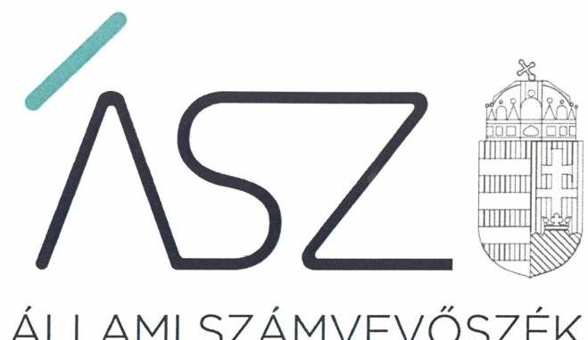
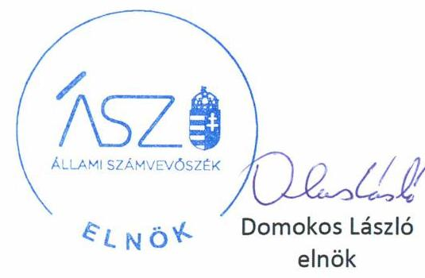

ÁLLAMI SZÁMVEVŐSZÉK

# JELENTÉS 

## Nem állami humánszolgáltatók ellenőrzése

A szociális humánszolgáltatást nyújtó intézmények, szolgáltatók államháztartáson kívüli fenntartói központi költségvetésből kapott támogatásai felhasználásának ellenőrzése Oltalom Karitatív Egyesület
2020.

20118
www.asz.hu

---

ÁLLAMI SZÁMVEVŐSZÉK

# JELENTÉS 

## Nem állami humánszolgáltatók ellenőrzése

A szociális humánszolgáltatást nyújtó intézmények, szolgáltatók államháztartáson kívüli fenntartói központi költségvetésből kapott támogatásai felhasználásának ellenőrzése Oltalom Karitatív Egyesület
2020.  OG hó 30. nap

20118
www.asz.hu

---

# AZ ELLENŐRZÉST FELÜGYELTE: 

VARGA EDIT felügyeleti vezető

## AZ ELLENŐRZÉST VEZETTE ÉS A VÉGREHAJTÁSÁÉRT FELELŐS:

HOFMEISTER LÁSZLÓ ellenőrzésvezető

## A PROGRAM ÖSSZEÁLLÍTÁSÁÉRT FELELŐS:

FEKETE-NAGY ANDRÁS GÁBOR felelős vezető
TÓTPÁL SZABOLCS osztályvezető

IKTATÓSZÁM: EL-2749-001/2020
TÉMASZÁM: 2491
ELLENŐRZÉS-AZONOSÍTÓ SZÁM: V083595, V0867118
Jelentéseink az Országgyűlés számítógépes hálózatán és az interneten a www.asz.hu címen is olvashatóak.

---

# TARTALOMJEGYZÉK 

■ ÖSSZEGZÉS ..... 5
■ AZ ELLENŐRZÉS CÉLJA ..... 6
■ AZ ELLENŐRZÉS TERÜLETE ..... 7
■ AZ ELLENŐRZÉS HÁTTERE, INDOKOLTSÁGA ..... 8
■ AZ ELLENŐRZÉS KÉRDÉSKÖREI ..... 9
■ AZ ELLENŐRZÉS HATÓKÖRE ÉS MÓDSZEREI ..... 10
■ MELLÉKLETEK ..... 13
I. sz. melléklet: Értelmező szótár ..... 13
■ FÜGGELÉKEK ..... 15
I. sz. függelék a jelentéshez ..... 15
II. sz. függelék: Észrevételek ..... 16
■ RÖVIDÍTÉSEK JEGYZÉKE ..... 21

---

.

---

# ÖSSZEGZÉS 

A budapesti székhelyű Oltalom Karitatív Egyesület a 2015-2018. években nem biztosította a szociális humánszolgáltatási közfeladatok ellátására kapott költségvetési támogatások felhasználásának ellenőrizhetőségét, valamint a költségvetési támogatások felhasználásának elszámoltathatóságát.

## Az ellenőrzés társadalmi indokoltsága

A szociális gondoskodást igénylők védelme, illetve a köznevelési feladatok ellátása az Alaptörvényben meghatározott, a társadalom szempontjából fontos tevékenységek. Jogszabályok teszik lehetővé, hogy államháztartáson kívüli szervezetek - így például az egyházi fenntartók, alapítványok, gazdasági társaságok, egyesületek - által fenntartott intézmények is végezzenek köznevelési, szociális és gyermekvédelmi feladatokat. Mindehhez a központi költségvetés évente jelentős összegű támogatással járul hozzá. Az államháztartáson kívüli, humánszolgáltatást végző intézmények az igényelt közpénzekből társadalmilag hasznos, közösségteremtő, közérdekű, illetve közhasznú tevékenységet végeznek, illetve közfeladatokat látnak el.

Az intézményfenntartók ellenőrzésével az Állami Számvevőszék hozzájárul ahhoz, hogy ezen közpénzeket az államháztartáson kívüli szervezetek is ellenőrizhető, átlátható és elszámoltatható módon használják fel a közfeladatok ellátása során. Az ellenőrzések célja továbbá, hogy a nyilvánosság és az igénybevevők megfelelő tájékoztatást kapjanak az államháztartáson kívüli közfeladatot ellátók működéséről.

Az ÁSZ ellenőrzései arra adnak választ, hogy az intézményfenntartók arra használták-e fel a közpénzeket, amire igényelték.

A szabályszerű gazdálkodás elengedhetetlen a közfeladat ellátás szakmai céljainak megvalósításához, valamint a társadalmi közbizalom fenntartásához.

## Megállapítások, következtetések

A budapesti székhelyű Oltalom Karitatív Egyesület, mint Fenntartó ${ }^{1}$ a 2015-2018. években szociális humánszolgáltatási közfeladatait nem önállóan gazdálkodó intézményeiben látta el. Az intézményei által ellátott közfeladatok a családi bölcsőde, a hajléktalan személyek átmeneti szállásának működtetése, valamint a családok átmeneti otthonának, átmeneti ellátásának biztosítása volt. A Fenntartó a könyvvezetésében a kapott költségvetési támogatások felhasználását a jogszabályok által előírt módon nem különítette el, valamint a Fenntartó és intézményei közötti, valamint az intézményei által ellátott közfeladatok szerinti bontásban nem rögzítette.

A 2015-2017. évre vonatkozóan a számviteli szabályzatok, valamint 2018. évre vonatkozóan az elkülönített nyilvántartás hiányában az Oltalom Karitatív Egyesület a 2015-2018. években a szociális humánszolgáltatási közfeladatok ellátására kapott költségvetési támogatás felhasználásának a Számv. tv. ${ }^{2}$ 161/A. § (2) bekezdésében előírt ellenőrizhetőségét nem biztosította. Mivel az Atr. ${ }^{3}$ 16. § (1) bekezdésben foglalt szabályozás ellenére nem gondoskodott arról, hogy a költségvetési támogatások felhasználásának az Oltalom Karitatív Egyesület és a nem önállóan gazdálkodó intézményei gazdálkodásának elkülönített, feladatonkénti bontásban történő elszámolásához az adatok rendelkezésre álljanak.

A Fenntartó a Civil tv. 28. § (1) bekezdésében és a Számv. tv. 4. § (1) bekezdésében meghatározottak ellenére a 2015-2018. évi beszámoló készítési kötelezettségének nem tett eleget, ezáltal nem biztosította a költségvetési támogatások felhasználásának elszámoltathatóságát.

Az Oltalom Karitatív Egyesület mindezek alapján az Alaptörvény 39. cikk (2) bekezdésében foglaltak ellenére nem biztosította a felhasznált közpénzekre vonatkozó gazdálkodása átláthatóságát.

Ezáltal a Fenntartó nem igazolta, hogy a közpénzt a szociális humánszolgáltatási közfeladat ellátására fordította.

---

# AZ ELLENŐRZÉS CÉLJA

**AZ ELLENŐRZÉS CÉLJA** annak értékelése volt, hogy a nem állami, nem önkormányzati szociális intézmények fenntartói központi költségvetésből kapott támogatásainak felhasználása szabályszerű volt-e.

---

# **AZ ELLENŐRZÉS TERÜLETE**

## **Oltalom Karitatív Egyesület**

A budapesti székhelyű Oltalom Karitatív Egyesület 1989-ben került megalapításra, közhasznúsági jogállását a 2015. évben szerezte meg. Célja a társadalom perifériájára jutott emberek támogatása, valamint a közvélemény figyelmének és szolidaritásának felkeltése.

A Fenntartó döntéshozó szerve a Közgyűlés, ügyvezető szerve az öt főből álló elnökség volt. A működés és gazdálkodás ellenőrzésére háromtagú felügyelőbizottságot hoztak létre.

A Fenntartó a szociális feladataira két helyszínen lévő, nem önálló jogi személyiséggel rendelkező intézmény, továbbá egy családi bölcsőde után részesült költségvetési támogatásban.

A Fenntartó a szociális feladatellátáshoz a MÁK adatai alapján a 2015. évben 48,7 M Ft, a 2016. évben 51,5 M Ft, a 2017. évben 64,5 M Ft, a 2018. évben 71,2 M Ft költségvetési támogatásban részesült.

---

# AZ ELLENŐRZÉS HÁTTERE, INDOKOLTSÁGA 

A szociális feladatokat ellátó nem állami intézményfenntartók részére közfeladataik ellátására évente jelentős összegű pénzügyi támogatást biztosítottak a mindenkori költségvetési törvények a bennük megfogalmazott feltételek mellett. A felhasználható állami támogatások Kvtv.-ek ${ }_{1,2,3,4}{ }^{7}$ szerinti előirányzata 2015-2018. években együtt 360 Mrd Ft volt. A 2013. évben jelentős változások következtek be a normatív finanszírozás rendszerben. Az Országgyűlés módosította a szociális igazgatásról és szociális ellátásokról szóló 1993. évi III. törvényt, amely - többek között - 2012. január 1-jei hatállyal megfogalmazta a finanszírozási rendszerbe történő befogadással összefüggő szabályokat. A területen új feladatfinanszírozási forma (átlagbéralapú támogatás) jelent meg, amely az államháztartáson kívüli intézményfenntartókra is vonatkozik. Az ellenőrzések indokoltságát az is alátámasztja, hogy az ÁSZ ${ }^{8}$ számos szervezetet még nem ellenőrzött ezen a területen.

Az ÁSZ stratégiájában foglaltak alapján is indokolt az ellenőrzés, amely a társadalom számára jelzi, hogy a közpénz államháztartáson kívüli felhasználása sem maradhat ellenőrizetlenül. Az államháztartáson kívülre nyújtott költségvetési támogatások ellenőrzésével az ÁSZ hozzájárul ahhoz, hogy a közpénzeket a nem állami humán fenntartók átlátható módon használják fel a közfeladatok ellátására kötött szerződésekben vállalt kötelezettségek teljesítése érdekében. Az ellenőrzés javaslataival hozzájárulhat az említett rendszerek szabályszerű támogatás felhasználásához, javíthatja a társadalmi-gazdasági döntések megalapozottságát, amely a „jól irányított állam működésének" feltétele.

---

# AZ ELLENŐRZÉS KÉRDÉSKÖREI 

1. A szociális humánszolgáltató közfeladatot ellátó államháztartáson kívüli fenntartó szabályszerű működési - és gazdálkodási környezet kialakításával megteremtette-e a költségvetési támogatások átlátható, elszámoltatható igénybevételének, felhasználásának feltételeit?
2. Az államháztartáson kívüli fenntartó az átvállalt szociális humánszolgáltatási közfeladathoz biztosított költségvetési támogatásokat szabályszerűen fordította-e a humánszolgáltató intézményei működtetésére?
3. Az államháztartáson kívüli fenntartó a szociális humánszolgáltató intézményei működtetéséhez felhasznált közpénzekre vonatkozó gazdálkodásával a nyilvánosság előtt elszámolt-e, ennek érdekében ellenőrzési, értékelési és a külső ellenőrzésekkel kapcsolatos intézkedési feladatait szabályszerűen látta-e el?

---

# AZ ELLENŐRZÉS HATÓKÖRE ÉS MÓDSZEREI 

## Az ellenőrzés típusa

Megfelelőségi ellenőrzés.

## Az ellenőrzött időszak

A 2015. január 1-je és 2018. december 31-e közötti időszak.

## Az ellenőrzés tárgya

Az ellenőrzés a szociális humánszolgáltatási közfeladatokat ellátó államháztartáson kívüli fenntartók humánszolgáltatási közfeladatai ellátásához a központi költségvetésből kapott támogatásaik humánszolgáltatási közfeladatokra való fenntartó általi felhasználása szabályszerűségének értékelésére terjedt ki.

## Az ellenőrzött szervezet

Oltalom Karitatív Egyesület

## Az ellenőrzés jogalapja

Az ellenőrzés jogszabályi alapját az ÁSZ tv. ${ }^{9} 1 . \S$ (3) bekezdése, 5. § (3) bekezdésében foglalt előírások adták.

## Az ellenőrzés módszerei

Az ellenőrzést az ellenőrzési program annak szempontjai, kérdései, az ellenőrzött időszakban hatályos jogszabályok, a nemzetközi standardokat irányadónak tekintve, az ellenőrzés szakmai szabályok és módszertanok figyelembevételével rendelte elvégezni.

Az ellenőrzés ideje alatt az ellenőrzött szervezettel történő kapcsolattartást az ÁSZ SZMSZ ${ }^{10}$-ének vonatkozó előírásai alapján biztosította az ÁSZ.

Az ellenőrzési kérdések megválaszolásához szükséges bizonyítékok megszerzése az ellenőrzött által rendelkezésre bocsátott dokumentumokra, adatokra alapozva elemző eljárással történt.

---

Az ellenőrzési bizonyítékként felhasználható adatforrások közé tartoztak egyrészt a szakmai program részletes szempontjainál felsorolt adatforrások, másrészt minden - az ellenőrzés folyamán feltárt, az ellenőrzés szempontjából információt tartalmazó - dokumentum.

Az ellenőrzés lefolytatásához az ellenőrzött szervezet a kitöltött tanúsítványok, valamint az ÁSZ által kért dokumentumok elektronikus úton való megküldésével szolgáltatott adatokat, információkat. Az így rendelkezésre bocsátott adatok, információk és a tanúsítványok adatai valódiságának kontrollja az ellenőrzés keretében történt.

Az egységes értelmezést az ellenőrzési program mellékletét képező fogalomtár és rövidítésjegyzék támogatta.

Az ellenőrzést alapvetően a szociális humánszolgáltatások esetében a központi költségvetési támogatások igénylésével, módosításával, felhasználásával, elszámolásával kapcsolatos feladatokat ellátó államháztartáson kívüli fenntartónál végezte az ÁSZ.

A szociális humánszolgáltatások központi költségvetési támogatásaival kapcsolatos, államháztartáson kívüli fenntartó jogszabályokban előírt feladatai betartását, továbbá a központi költségvetési támogatások szabályszerű nyilvántartását ellenőrizte az ÁSZ a fenntartónál rendelkezésre álló nyilvántartások, beszámolók és egyéb dokumentumok alapján. Az ellenőrzés nem terjedt ki a szociális humánszolgáltatások központi költségvetési támogatásai igénylése, módosítása, elszámolása valódiságának, megalapozottságának, helyességének - sem a fenntartónál, sem a székhely intézményeinél való - értékelésére (mivel ennek felülvizsgálata, ellenőrzése a finanszírozó jogszabályban előírt feladata, határozatai kiadása előtt). Továbbá nem terjedt ki az ellenőrzés e források, intézmények általi szabályszerű felhasználásának értékelésére.

---

.

---

# MELLÉKLETEK 

- I. SZ. MELLÉKLET: ÉRTELMEZŐ SZÓTÁR
humánszolgáltatás
költségvetési támogatás
nem állami, nem önkormányzati (államháztartáson kívüli) intézmény fenntartó
székhely intézmény

Külön törvényben meghatározott szociális, gyermekjóléti, gyermekvédelmi, közoktatási, felsőoktatási, kulturális közfeladatok (2014. évi Kvtv. 34. § (1), (4) bekezdés, 1. számú melléklet XX/20/2. alcím, 19. alcím, 2015. évi Kvtv. 43. § (1), (4) bekezdés, 1. számú melléklet XX/20/2/3. jogcím csoport, 19. alcím, 2016. évi Kvtv. 41. § (1), (4) bekezdés, 1. számú melléklet XX/20/2/3. jogcím csoport, 19. alcím, 2017. évi Kvtv. 41. § (1), (4) bekezdés, 1. számú melléklet XX/20/2/3. jogcím csoport, 19. alcím).
A társadalombiztosítás pénzügyi alapjai kivételével az államháztartás központi alrendszeréből ellenérték nélkül, pénzben nyújtott támogatások (Áht. 1. § 14. pont)
A költségvetési törvényben (2016. évi XC. törvény 40. §) megállapított támogatás többek között: Átlagbéralapú támogatást állapít meg a nevelési-oktatási, valamint pedagógiai szakszolgálati intézményt fenntartó nemzetiségi önkormányzat, az egyházi és magán köznevelési intézmény fenntartója részére az általuk fenntartott nevelési-oktatási intézményben, továbbá pedagógiai szakszolgálati intézményben pedagógus és - a (3) bekezdés kivételével - a nevelő-oktató munkát közvetlenül segítő munkakörben foglalkoztatottak után a 7. melléklet I. pontjában meghatározott jogosultak után, az őket ott megillető mértékek szerint. Működési támogatást állapít meg a nemzetiségi önkormányzat vagy az egyházi jogi személy által fenntartott nevelési-oktatási intézményekben ellátott, továbbá a pedagógiai szakszolgálati intézményekben gyógypedagógiai tanácsadásban, korai fejlesztésben, oktatásban és gondozásban, valamint a fejlesztő nevelésben részt vevő gyermekekre, tanulókra tekintettel a nemzetiségi önkormányzat és a bevett egyház részére a 7. melléklet II. pontja szerint.
A szociális, gyermekjóléti és gyermekvédelmi közfeladatokat /humánszolgáltatásokat ellátó intézményt fenntartó egyházi jogi személy, társadalmi szervezet, alapítvány, közalapítvány, civil szervezet, országos nemzetiségi önkormányzat, nonprofit gazdasági társaság, gazdasági társaság és a humánszolgáltatást alaptevékenységként végző, Szja tv. hatálya alá tartozó egyéni vállalkozó. (2017. évi Kvtv. 41. § (1), (4) bekezdés
a szolgáltató székhelye, azaz a szolgáltató központi ügyintézésének helye, függetlenül attól, hogy használják-e
 szolgáltatás nyújtására (Sznyvhr. 1.§ k) pont) (hatályos: 2013. december 1-től)

---

.

---

# FÜGGELÉKEK 

- I. SZ. FÜGGELÉK A JELENTÉSHEZ

Az Állami Számvevőszék az ellenőrzések során feltárt tényekhez kapcsolódó további körülmények tisztázására eszközrendszerrel nem rendelkezik. Amennyiben az ellenőrzésen túlmutatóan indokoltnak látszik az ellenőrzés során feltárt körülmények további vizsgálata, az Állami Számvevőszék törvényi felhatalmazás alapján az ellenőrzés által feltárt körülményeket továbbítja a hatáskörrel rendelkező szervnek a szükséges intézkedések megtétele, eljárások lefolytatása érdekében.

Az Oltalom Karitatív Egyesület (továbbiakban: Fenntartó) részére szociális közfeladat ellátásra a Magyar Államkincstár által biztosított költségvetési támogatások összege a 2015. évben 48,7 M Ft, 2016. évben 51,5 M Ft, 2017. évben 64,5 M Ft, 2018. évben pedig 71,2 M Ft volt.

A Fenntartó 2015-2018. években a Civil tv. 28.§ (1) bekezdésében és a Számv. tv. 4. § (1) bekezdésében előírt éves beszámoló készítési kötelezettségének - figyelemmel a Számv. tv. 20. § (6) bekezdésében foglaltakra - nem tett eleget.

Ennek hiányában a működéséről, vagyoni, pénzügyi és jövedelmi helyzetéről a Számv. tv. előírásai szerinti megbízható, valós összképet és a közfeladatokra kapott költségvetési támogatások elszámolásának hitelességét nem biztosította. A beszámolóként közzétett adatai nem megbízhatóak.
Az eset konkrét körülményeinek feltárására az illetékes törvényszék rendelkezik hatáskörrel.

---

A jelentéstervezetet a Számvevőszék 15 napos észrevételezésre megküldte az ellenőrzött szervezetek vezetőinek az ÁSZ tv. 29. § (1) bekezdése előírásának megfelelően.

Az Oltalom Karitatív Egyesület elnöke a jelentéstervezet megállapításaira észrevételt tett. Az ÁSZ tv. 29. § (3) bekezdésével összhangban az Állami Számvevőszék a Függelékben feltünteti az ellenőrzés megállapításaival kapcsolatban tett, figyelembe nem vett észrevételeket, és megindokolja, hogy azokat miért nem fogadta el.

[^0]
[^0]:    * 29. § (1) Az Állami Számvevőszék az ellenőrzési megállapításait megküldi az ellenőrzött szervezet vezetőjének vagy az általa megbízott személynek, és annak, akinek személyes felelősségét állapította meg.
    (2) Az ellenőrzött szervezet vezetője és a felelősként megjelölt személy az ellenőrzés megállapításaira tizenöt napon belül írásban észrevételt tehet.
    (3) Az Állami Számvevőszék az észrevételre a beérkezésétől számított harminc napon belül írásban válaszol. A figyelembe nem vett észrevételeket köteles a jelentésben feltüntetni, és megindokolni, hogy azokat miért nem fogadta el.

---

Az Oltalom Karitatív Egyesület (továbbiakban: Fenntartó) elnöke által a G-480/2020. iktatószámú, 2020. május 21-én kelt levélben tett észrevételek és azok kezelésének indokolása:

# 1) Az ÁSZ adatbekérésével és a Fenntartó működésével kapcsolatban tett általános észrevétel 

A Fenntartó elnöke észrevételében hívta fel a figyelmet az ÁSZ adatbekérésének körülményeire, vitatva a vonatkozó jogszabályi előírásoknak való megfelelőségét, továbbá vitatta az ÁSZ azon gyakorlatát, hogy a jelentéstervezet megállapításainak megtétele során a részükre visszaküldött dokumentumokat nem-létezőként kezelte.

A fentiekkel kapcsolatban tájékoztattuk a Fenntartó elnökét, hogy az általa 2019. január 28-án és 2019. október 24-én, illetve az általa meghatalmazott gazdasági igazgató által 2019. november 27-én kiállított teljességi és hitelességi nyilatkozatokban az átadott dokumentumok, adatok hitelességéért, valódiságáért, hiánytalanságáért és hatályosságáért teljes felelősséget vállaltak. Az ÁSZ ellenőrzési megállapításait az ellenőrzési adatszolgáltatás során a részére törvényi határidőben rendelkezésre bocsátott hiteles dokumentumokra alapozva fogalmazza meg. Az ellenőrzött időszak vonatkozásában az adatkérés során kizárólag olyan dokumentumok bekérése történt, amelyekkel Önöknek jogszabályi előírások alapján rendelkezni kellett. Az Állami Számvevőszékről szóló 2011. évi LXVI. törvény (továbbiakban: ÁSZ tv.) 28. § (2) bekezdése alapján az ellenőrzött szervezet köteles soron kívül, de legkésőbb öt munkanapon belül a szükséges adatokat és dokumentumokat rendelkezésre bocsátani. Az ÁSZ tv. nem nevesíti a hiánypótlási lehetőséget, így az ÁSZ az ellenőrzés során kizárólag az adatszolgáltatásra rendelkezésre álló határidőn belül beérkezett dokumentumokat veszi figyelembe. A bekért dokumentumok visszaküldésével kapcsolatban tájékoztatom, hogy az ÁSZ az ellenőrzéseit az ÁSZ tv. előírásai szerint végzi, az ÁSZ tv. 23. § (1) bekezdése alapján az ÁSZ maga alakítja ki az általa végzett ellenőrzések szakmai szabályait, módszereit és a kialakított szabályokat nyilvánosságra hozza. Az ellenőrzéshez fel nem használt dokumentumok visszaküldéséhez sem az ÁSZ tv., sem pedig a kialakított módszertan nem rendel határidőt.

A Fenntartó elnöke levelében többször említést tesz arra vonatkozóan, hogy az ÁSZ nem fogadta be az általuk késedelmesen beküldött dokumentumokat és visszaküldte, ugyanakkor az EL-1413-043/2020. iktatószámú vagyonmegóvási intézkedés kilátásba helyezésével kapcsolatos levélben újra bekérte azokat.

Erre vonatkozóan tájékoztattuk a Fenntartó elnökét, hogy az ÁSZ az EL-1413-003/2018. iktatószámú adatbekérő levélben a 2015-2017. évek viszonylatában-, az EL-1413-021/2019. és EL-1413-022/2019. iktatószámú adatbekérő levelekben pedig a 2018. év viszonylatában kérte be a dokumentumokat. Az EL-1413-043/2020. iktatószámú vagyonmegóvási intézkedés kilátásba helyezésével kapcsolatos levélben kért, 2019. évre vonatkozó dokumentumok értékelésével pedig az az ÁSZ célja, hogy arról győződjön meg, hogy a korábban megállapított jogszabályellenes gyakorlatot az ellenőrzött szervezet megszüntette-e, és az hitelt érdemlően tudja-e bizonyítani.

Fentiekre tekintettel az észrevételeket nem fogadtuk el, így a jelentéstervezet megállapításainak módosítása nem volt indokolt.

## 2) A számviteli szabályzatok hiányával kapcsolatban tett észrevétel (Jelentéstervezet Megállapítások, következtetések részének 2. bekezdése)

A Fenntartó elnöke észrevételében jelezte, hogy nem ért egyet a jelentéstervezet azon megállapításával, hogy a 2015-2017. évre vonatkozóan a számviteli szabályzatokkal (számviteli politika, eszközök és források leltárkészítési és leltározási szabályzata, eszközök és források értékelési szabályzata, pénzkezelési szabályzat) nem rendelkeztek. Álláspontja szerint az ellenőrzés alá vont időszak vonatkozásában a kérdéses szabályzatokat papír alapon rendelkezésre bocsájtották, de azokat az ÁSZ visszaküldte.

Tájékoztattuk a Fenntartó elnökét, hogy az EL-1413-001/2018. iktatószámú adatbekérő levélben kértük 2015-2017. évek viszonylatában a számviteli politika és az ennek keretében kialakítandó szabályozatok (eszközök és források leltárkészítési és leltározási szabályzata, eszközök és források értékelési szabályzata, pénzkezelési szabályzat) átadását. A 2019. január 28-án kelt teljességi és hitelességi nyilatkozattal alátámasztott módon a 2015-2017. években hatályos

---

számviteli politika, eszközök és források leltárkészítési és leltározási szabályzata, eszközök és források értékelési szabályzata, pénzkezelési szabályzat átadására nem került sor. Az adatszolgáltatásra nyitva álló határidőn túl benyújtott papír alapú számviteli szabályzatokat az ÁSZ nem értékelte. Az ÁSZ tv. nem nevesíti a hiánypótlási lehetőséget, így az ÁSZ az ellenőrzés során kizárólag az adatszolgáltatásra rendelkezésre álló - ÁSZ tv. 28. § (2) bekezdés szerinti - határidőn belül beérkezett dokumentumokat veszi figyelembe, ellenőrzési megállapításait azokra alapozva fogalmazza meg.

Fentiekre tekintettel az észrevételt nem fogadtuk el, így a jelentéstervezet megállapításainak módosítása nem volt indokolt.

# 3) A kapott támogatások elkülönített nyilvántartásának hiányával kapcsolatban tett észrevétel (Jelentéstervezet Megállapítások, következtetések részének 1-2. bekezdése) 

A Fenntartó elnöke vitatta a jelentéstervezet azon megállapítását, hogy a Fenntartó nem különítette el a humánszolgáltatást végző intézményei gazdálkodását és a támogatások felhasználását. Álláspontja szerint a vonatkozó jogszabályok nem írják elő, hogy a továbbrészletezést a főkönyvi számlákon kell megtenni. Előadta, hogy a könyvelési rendszerük képes tovább részletezni az adatokat.

Tájékoztattuk a Fenntartó elnökét, hogy az EL-1413-003/2018. iktatószámú adatbekérő levélben kértük 2015-2017. évek viszonylatában az év végi zárás előtti és zárás utáni főkönyvi kivonatok, valamint a költségvetési támogatások elkülönített nyilvántartását igazoló dokumentumok, főkönyvi és analitikus nyilvántartások átadását. A 2019. január 28-án kelt teljességi és hitelességi nyilatkozattal alátámasztott módon a 2015., 2016. és 2017. évre vonatkozóan sem főkönyvi kivonatok sem más kapcsolódó nyilvántartás átadására nem került sor.

Az EL-1413-021/2019. és EL-1413-022/2019. iktatószámú adatbekérő levelekben kértük 2018. év viszonylatában az év végi zárás előtti és zárás utáni főkönyvi kivonatok, valamint a költségvetési támogatások (és felhasználásuk) elkülönített nyilvántartását igazoló dokumentumok, főkönyvi és analitikus nyilvántartások átadását. A 2019. október 24-én és a 2019. november 27-én kelt teljességi és hitelességi nyilatkozatokkal alátámasztott módon csak a Fenntartó, valamint a három közül egy fenntartott intézménye 2018. évi főkönyvi kivonatának átadására került sor. Mindezek alapján a Fenntartó nem igazolta, hogy az egyházi és nem állami fenntartású szociális, gyermekjóléti és gyermekvédelmi szolgáltatók, intézmények és hálózatok állami támogatásáról szóló 489/2013. (XII. 18.) Korm. rendelet előírásainak megfelelően gondoskodott arról, hogy a költségvetési támogatások felhasználásának elkülönített, feladatonkénti bontásban történő elszámolásához az adatok rendelkezésre álljanak.

A 2019. január 28-án, a 2019. október 24-én és a 2019. november 27-én kelt teljességi és hitelességi nyilatkozatokban az átadott dokumentumok, adatok hitelességéért, valódiságáért, hiánytalanságáért és hatályosságáért teljes felelősséget vállaltak. Az Állami Számvevőszék ellenőrzési megállapításait az ellenőrzési adatszolgáltatás során a részére törvényi határidőben rendelkezésre bocsátott hiteles dokumentumokra alapozva fogalmazza meg.

Fentiekre tekintettel az észrevételt nem fogadtuk el, így a jelentéstervezet megállapításainak módosítása nem volt indokolt.

## 4) A számviteli beszámolók hiányával kapcsolatban tett észrevétel (Jelentéstervezet Megállapítások, következtetések részének 3. bekezdése)

A Fenntartó elnöke észrevételében jelezte, hogy nem ért egyet a jelentéstervezet azon megállapításával, hogy a Fenntartó 2015-2018. években nem tett eleget a beszámoló készítési kötelezettségének. Ennek alátámasztására kifejtette, hogy a Fenntartó ezen kötelességének a nyilvántartását végző Fővárosi Törvényszék honlapján keresztül tett eleget, amelynek igazolására becsatolták a beszámolók beküldéséről az Országos Bírósági Hivatal által kiállított nyugtákat.

Tájékoztattuk a Fenntartó elnökét, hogy az EL-1413-001/2018. és EL-1413-021/2019. iktatószámú adatbekérő levelekben kértük 2015-2018. évek vonatkozásában a Fenntartó számviteli beszámolóinak átadását. A 2019. január 28-án és 2019. október 24-én kelt teljességi és hitelességi nyilatkozatokkal alátámasztott módon a 2015., 2017. és 2018.

---

évekre vonatkozóan aláírás nélküli, nem hiteles dokumentumok kerültek benyújtásra, 2016. év tekintetében egyáltalán nem került kapcsolódó dokumentum benyújtásra.

Az adatbekérő levelek 2. melléklete hangsúlyozta, hogy az ellenőrzött időszakra vonatkozóan az aláírt és hiteles dokumentumokat szükséges az adatszolgáltatási felületre feltölteni, így álláspontunk szerint egyértelmű volt, hogy nem aláírás nélküli beszámolót kell az adatszolgáltatás során átadni.

A számviteli törvény szerinti egyes egyéb szervezetek beszámolókészítési és könyvvezetési kötelezettségének sajátosságairól szóló 224/2000. (XII. 19.) Korm. rendelet 6. § (1) bekezdése, valamint a számviteli törvény szerinti egyes egyéb szervezetek beszámoló készítési és könyvvezetési kötelezettségének sajátosságairól szóló 479/2016. (XII. 28.) Korm. rendelet 7. § (1) bekezdése értelmében a civil szervezetek a Számv. tv. és a fenti rendeletekben meghatározottak szerint voltak kötelesek az ellenőrzött időszakban beszámolót készíteni. A számvitelről szóló 2000. évi C. törvény (továbbiakban: Számv. tv.) 20. § (6) bekezdése előírja az egyszerűsített éves beszámoló aláírási kötelezettségét.
A 2019. január 28-án és a 2019. október 24-én kelt teljességi és hitelességi nyilatkozatokban az átadott dokumentumok, adatok hitelességéért, valódiságáért, hiánytalanságáért és hatályosságáért teljes felelősséget vállaltak. Az Állami Számvevőszék ellenőrzési megállapításait az ellenőrzési adatszolgáltatás során a részére törvényi határidőben rendelkezésre bocsátott hiteles dokumentumokra alapozva fogalmazza meg.

Fentiekre tekintettel az észrevételt nem fogadtuk el, így a jelentéstervezet megállapításainak módosítása nem volt indokolt.
5) Az alapítás körülményeivel kapcsolatban tett észrevétel (Jelentéstervezet Ellenőrzés területe részének 1. mondata)

A Fenntartó elnöke észrevételében jelezte, hogy nem tényszerű a jelentéstervezet a Fenntartó alapításának körülményeit ismertető mondata, mivel az alapításra nem egy magánszemély részvételével került sor.

Tájékoztattuk a Fenntartó elnökét, hogy kapcsolódó észrevétele megalapozott, amelyre való tekintettel a jelentéstervezet kapcsolódó mondata módosításra került.
6)
 A jelentéstervezet helyszíni ellenőrzéssel, verifikációval kapcsolatos utalására tett észrevétel (Jelentéstervezet Az ellenőrzés módszereit ismertető részének 6. és 7. bekezdése)

A Fenntartó elnöke észrevételében jelezte, hogy a jelentéstervezet tévesen rögzítette, hogy helyszíni ellenőrzésre, verifikálásra került sor, mivel ennek lefolytatásáról nincsen tudomásuk, illetve kapcsolódó jegyzőkönyvet nem kaptak kézhez.

Tájékoztattuk a Fenntartó elnökét, hogy kapcsolódó észrevétele megalapozott, mivel jelen ellenőrzés keretében valóban nem került sor helyszíni ellenőrzésre, verifikációra, így a jelentéstervezet vonatkozó része módosításra került.

---

.

---

# RÖVIDÍTÉSEK JEGYZÉKE 

${ }^{1}$ Fenntartó
${ }^{2}$ Számv. tv.
${ }^{3}$ Atr.
${ }^{4}$ intézmény
${ }^{5}$ családi bölcsőde
${ }^{6}$ MÁK
${ }^{7}$ Kvtv. 1,2,3,4
${ }^{8}$ ÁSZ
${ }^{9}$ ÁSZ tv.
${ }^{10}$ ÁSZ SZMSZ

Oltalom Karitatív Egyesület
2000. évi C. törvény a számvitelről (hatályos: 2001. január 1-jétől)

489/2013. (XII. 18.) Korm. rendelet az egyházi és nem állami fenntartású szociális, gyermekjóléti és gyermekvédelmi szolgáltatók, intézmények és hálózatok állami támogatásáról (hatályos: 2014. január 1-jétől)
Női Átmeneti Szálló
Családok Átmeneti Otthona
Susanna Wesley „Csimoták" Családi Bölcsőde Hálózat
Magyar Államkincstár
Kvtv.1: Magyarország 2015. évi központi költségvetéséről szóló 2014. évi C. törvény (hatályos: 2015. január 1-jétől 2018. december 31-éig)
Kvtv.2: Magyarország 2016. évi központi költségvetéséről szóló 2015. évi C. törvény (hatályos: 2015. július 4-étől)
Kvtv.3: Magyarország 2017. évi központi költségvetéséről szóló 2016. évi XC. törvény (hatályos: 2016. november 1-jétől)
Kvtv.4: Magyarország 2018. évi központi költségvetéséről szóló 2017. évi C. törvény (hatályos: 2017. november 1-jétől)
Állami Számvevőszék
2011. évi LXVI. törvény az Állami Számvevőszékről
az Állami Számvevőszék Szervezeti és Működési Szabályzata

---

# 1052 

1052 Budapest, Apáczai Cs. J. u. 10. I 1364 Budapest 4. Pf. 54 TEL: +36 14849100
email: szamvevoszek@asz.hu
web: www.asz.hu | www.aszhirportal.hu
