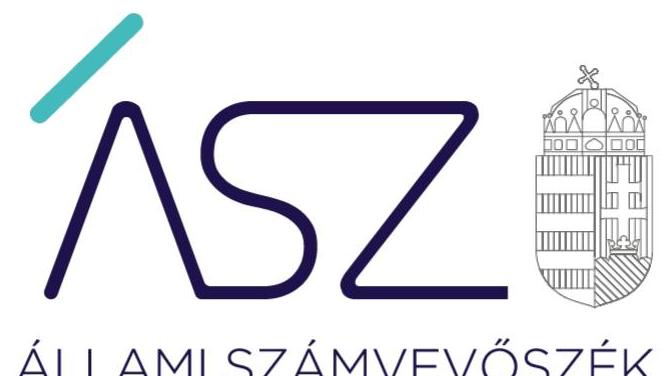
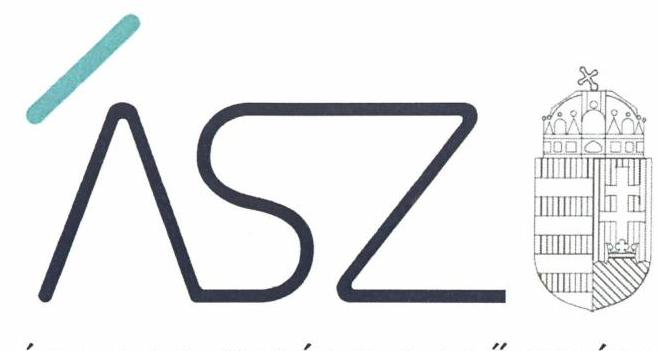
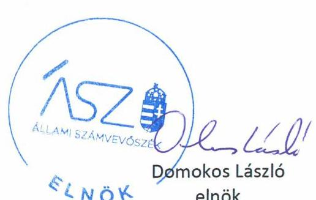

ÁLLAMI SZÁMVEVŐSZÉK

# JELENTÉS 

## Nem állami humánszolgáltatók ellenőrzése

A köznevelési humánszolgáltatást nyújtó intézmények, szolgáltatók államháztartáson kívüli fenntartói központi költségvetésből kapott támogatásai felhasználásának ellenőrzése "Pill-Art" Művészetoktatási Nonprofit Korlátolt Felelősségű Társaság
2020.

20120
www.asz.hu

---

ÁLLAMI SZÁMVEVŐSZÉK

# JELENTÉS 

## Nem állami humánszolgáltatók ellenőrzése

A köznevelési humánszolgáltatást nyújtó intézmények, szolgáltatók államháztartáson kívüli fenntartói központi költségvetésből kapott támogatásai felhasználásának ellenőrzése "Pill-Art" Művészetoktatási Nonprofit Korlátolt Felelősségű Társaság
2020. 1. hó 08. nap

20120
www.asz.hu

---

# AZ ELLENŐRZÉST FELÜGYELTE: 

KAKAS SÁNDOR felügyeleti vezető

## AZ ELLENŐRZÉST VEZETTE ÉS A VÉGREHAJTÁSÁÉRT FELELŐS:

RÁCZKEVI KATALIN ellenőrzésvezető

## A PROGRAM ÖSSZEÁLLÍTÁSÁÉRT FELELŐS:

FEKETE-NAGY ANDRÁS GÁBOR ellenőrzési program készítéséért felelős vezető

IKTATÓSZÁM: EL-2759-001/2020.
TÉMASZÁM: 2523
ELLENŐRZÉS-AZONOSÍTÓ SZÁM: V086717

---

# TARTALOMJEGYZÉK 

- ÖSSZEGZÉS ..... 5
- AZ ELLENŐRZÉS CÉLJA ..... 6
- AZ ELLENŐRZÉS TERÜLETE ..... 7
- AZ ELLENŐRZÉS HÁTTERE, INDOKOLTSÁGA ..... 8
- A JELENTÉS LÉNYEGES KÉRDÉSKÖREI ..... 9
- AZ ELLENŐRZÉS HATÓKÖRE ÉS MÓDSZEREI ..... 10
- MEGÁLLAPÍTÁSOK ..... 12
- JAVASLATOK ..... 14
- MELLÉKLETEK ..... 15
I. sz. melléklet: Értelmező szótár ..... 15
- FÜGGELÉK: ÉSZREVÉTELEK ..... 17
- RÖVIDÍTÉSEK JEGYZÉKE ..... 19

---

.

---

# ÖSSZEGZÉS 

A székesfehérvári székhelyű "Pill-Art" Művészetoktatási Nonprofit Korlátolt Felelősségű Társaság, mint intézményfenntartó a közfeladat szabályszerű ellátásának feltételeit kialakította. A köznevelési közfeladathoz biztosított központi költségvetési támogatások felhasználásánál biztosította az elszámoltathatóságot. Beszámolási kötelezettségének 2016-2018. évben eleget tett.

## Az ellenőrzés társadalmi indokoltsága

A szociális gondoskodást igénylők védelme, illetve a köznevelési feladatok ellátása az Alaptörvényben meghatározott, a társadalom szempontjából fontos tevékenységek. Jogszabályok teszik lehetővé, hogy államháztartáson kívüli szervezetek - így például az egyházi fenntartók, alapítványok, gazdasági társaságok, egyesületek - által fenntartott intézmények is végezzenek köznevelési, szociális és gyermekvédelmi feladatokat. Mindehhez a központi költségvetés évente jelentős összegű támogatással járul hozzá. Az államháztartáson kívüli, humánszolgáltatást végző intézmények az igényelt közpénzekből társadalmilag hasznos, közösségteremtő, közérdekű, illetve közhasznú tevékenységet végeznek, illetve közfeladatokat látnak el.

Az intézményfenntartók ellenőrzésével az Állami Számvevőszék hozzájárul ahhoz, hogy ezen közpénzeket az államháztartáson kívüli szervezetek is ellenőrizhető, átlátható és elszámoltatható módon használják fel a közfeladatok ellátása során. Az ellenőrzések célja továbbá, hogy a nyilvánosság és az igénybevevők megfelelő tájékoztatást kapjanak az államháztartáson kívüli közfeladatot ellátók működéséről.

Az ÁSZ ellenőrzései arra adnak választ, hogy az intézményfenntartók arra használták-e fel a közpénzeket, amire igényelték.

A szabályszerű gazdálkodás elengedhetetlen a közfeladat ellátás szakmai céljainak megvalósításához, valamint a társadalmi közbizalom fenntartásához.

## Főbb megállapítások, következtetések, javaslatok

A "Pill-Art" Művészetoktatási Nonprofit Kft. a köznevelési közfeladatok ellátásának szervezeti kereteit és szabályszerű gazdálkodásának feltételeit kialakította, ezzel a költségvetési támogatások átlátható felhasználásának feltételeit biztosította.

A Fenntartó a köznevelési közfeladat ellátására kapott költségvetési támogatásról elkülönített nyilvántartást vezetett, a köznevelési közfeladathoz biztosított költségvetési támogatásokat szabályszerűen fordította az intézménye működtetésére.

A Fenntartó az ellenőrzött időszakban számviteli beszámolóit elkészítette, az elszámoltathatóság és átláthatóság biztosított volt.

Az ellenőrzés megállapításai alapján az Állami Számvevőszék a "Pill-Art" Művészetoktatási Nonprofit Korlátolt Felelősségű Társaság ügyvezetője részére egy javaslatot fogalmazott meg, amelyre az érintettnek 30 napon belül intézkedési tervet kell készítenie.

---

# AZ ELLENŐRZÉS CÉLJA 

AZ ELLENŐRZÉS CÉLJA annak értékelése volt, hogy a "Pill-Art" Művészetoktatási Nonprofit Kft., mint nem állami, nem önkormányzati köznevelési intézményfenntartó központi költségvetésből kapott támogatásainak felhasználása szabályszerű volt-e.

---

# AZ ELLENŐRZÉS TERÜLETE 

## "Pill-Art" Művészetoktatási Nonprofit Kft., mint intézményfenntartó

A székesfehérvári székhelyű "Pill-Art" Művészetoktatási Nonprofit Kft.-t öt magánszemély alapította. A Fenntartó ${ }^{1}$ bejegyzésére 2009. június 15-én került sor közhasznú jogállású szervezetként, alapfeladata a társasági szerződése ${ }^{2}$ alapján alapfokú művészetoktatás volt.

A Fenntartó önálló jogi személyiségű intézményében ${ }^{3}$ székesfehérvári székhelyén, továbbá 17, illetve 2017. szeptember 1-től 19 telephelyén közfeladatként alapfokú művészeti oktatási tevékenységet végzett. Az Intézmény önállóan gazdálkodott a 2016-2018. években.

Fenntartó képviseletére az ügyvezető volt jogosult, személye az ellenőrzött időszakban nem változott. A Fenntartó legfőbb szerve a taggyűlés ${ }^{4}$ volt. A Fenntartónál három tagú felügyelőbizottság működött.

A Fenntartó kettős könyvvitellel alátámasztott egyszerűsített éves beszámolót készített 2016-2018. években, a számviteli beszámolók könyvvizsgálati kötelezettsége nem állt fenn.

A Fenntartó részére köznevelési közfeladat ellátásra a Magyar Államkincstár által biztosított költségvetési támogatások összege 2016. évben 128,7 millió Ft, 2017. évben 148,6 millió Ft, 2018. évben 149,0 millió Ft volt.

---

# AZ ELLENŐRZÉS HÁTTERE, INDOKOLTSÁGA 

A köznevelési feladatokat ellátó nem állami intézményfenntartók részére közfeladataik ellátására évente jelentős összegű pénzügyi támogatást biztosítottak a mindenkori költségvetési törvények a bennük megfogalmazott feltételek mellett.

Az ÁSZ ${ }^{5}$ stratégiájában foglaltak alapján is indokolt az ellenőrzés, amely a társadalom számára jelzi, hogy a közpénz államháztartáson kívüli felhasználása sem maradhat ellenőrizetlenül. Az államháztartáson kívülre nyújtott költségvetési támogatások ellenőrzésével az ÁSZ hozzájárul ahhoz, hogy a közpénzeket a nem állami humán fenntartók átlátható módon használják fel a közfeladatok ellátására kötött szerződésekben vállalt kötelezettségek teljesítése érdekében. Az ellenőrzés javaslataival hozzájárulhat az említett rendszerek szabályszerű támogatás felhasználásához, javíthatja a társadalmi-gazdasági döntések megalapozottságát, amely a „jól irányított állam" működéséhez járul hozzá.

---

# A JELENTÉS LÉNYEGES KÉRDÉSKÖREI 

1. A köznevelési humánszolgáltató közfeladatot ellátó államháztartáson kívüli fenntartó szabályszerű működési- és gazdálkodási környezet kialakításával megteremtette-e a költségvetési támogatások átlátható, elszámoltatható igénybevételének, felhasználásának feltételeit?
2. Az államháztartáson kívüli fenntartó az átvállalt köznevelési humánszolgáltatási közfeladathoz biztosított költségvetési támogatásokat szabályszerűen fordította-e a humánszolgáltató intézménye működtetésére?
3. Az államháztartáson kívüli fenntartó a köznevelési humánszolgáltató intézménye működtetéséhez felhasznált közpénzekre vonatkozó gazdálkodásával a nyilvánosság előtt elszámolt-e, ennek érdekében ellenőrzési, értékelési és a külső ellenőrzésekkel kapcsolatos intézkedési feladatait szabályszerűen látta-e el?

---

# AZ ELLENŐRZÉS HATÓKÖRE ÉS MÓDSZEREI 

## Az ellenőrzés típusa

Megfelelőségi ellenőrzés.

## Az ellenőrzött időszak

A 2016. január 1-je és 2018. december 31-e közötti időszak azon évei, amelyben nem állami, nem önkormányzati fenntartó - köznevelési közfeladat-ellátásra az államháztartásból támogatást kapott és/vagy használt fel.

## Az ellenőrzés tárgya

Az ellenőrzés a köznevelési humánszolgáltatási közfeladatokat ellátó államháztartáson kívüli fenntartók humánszolgáltatási közfeladatai ellátásához a központi költségvetésből kapott támogatásaik humánszolgáltatási közfeladatokra való fenntartó általi felhasználása szabályszerűségének értékelésére terjedt ki.

## Az ellenőrzött szervezet

"Pill-Art" Művészetoktatási Nonprofit Korlátolt Felelősségű Társaság

## Az ellenőrzés jogalapja

Az ellenőrzés jogszabályi alapját az ÁSZ tv. ${ }^{6}$ 1. § (3) bekezdésében, valamint az 5. § (3) bekezdésében foglalt előírások adják.

## Az ellenőrzés módszerei

Az ellenőrzést az ellenőrzési program annak szempontjai, kérdései, az ellenőrzött időszakban hatályos jogszabályok, a nemzetközi standardokat irányadónak tekintve, az ellenőrzés szakmai szabályok és módszertanok figyelembe vételével rendelte elvégezni. A közpénzekkel való felelős gazdálkodás segítésére irányuló javaslatok kidolgozásakor a hatályos jogszabályok voltak az irányadóak.

Az ellenőrzés ideje alatt az ellenőrzött szervezettel történő kapcsolattartást az ÁSZ SZMSZ7-ének vonatkozó előírásai alapján biztosította az ÁSZ.

---

Az ellenőrzési kérdések megválaszolásához szükséges bizonyítékok megszerzése az ellenőrzött által rendelkezésre bocsátott dokumentumokra, adatokra alapozva megfigyelés, szemle (szemrevételezés), kérdésfeltevés (információkérés), valamint elemző eljárással történt.

Az ellenőrzési bizonyítékként felhasználható adatforrások közé tartoztak egyrészt az ellenőrzési program részletes szempontjainál felsorolt adatforrások, másrészt minden - az ellenőrzés folyamán feltárt, az ellenőrzés szempontjából információt tartalmazó - dokumentum.

Az ellenőrzés lefolytatásához az ellenőrzött szervezet a kitöltött tanúsítványok, valamint az ÁSZ által kért dokumentumok elektronikus úton való megküldésével szolgáltatott adatokat, információkat. Az így rendelkezésre bocsátott adatok, információk és a tanúsítványok adatai valódiságának kontrollja az ellenőrzés keretében történt.

Az egységes értelmezést az ellenőrzési program mellékletét képező fogalomtár és rövidítésjegyzék támogatta.

Az ellenőrzést alapvetően a köznevelési humánszolgáltatások esetében a központi költségvetési támogatások igénylésével, módosításával, felhasználásával, elszámolásával kapcsolatos feladatokat ellátó államháztartáson kívüli fenntartóknál/szervezeteinél végezte az ÁSZ.

A köznevelési humánszolgáltatások központi költségvetési támogatásaival kapcsolatos, államháztartáson kívüli fenntartó jogszabályokban előírt feladatai betartását, továbbá a központi költségvetési támogatások szabályszerű nyilvántartását ellenőrizte az ÁSZ a Fenntartónál rendelkezésre álló nyilvántartások, beszámolók és egyéb dokumentumok alapján.

Az ellenőrzés nem terjedt ki a köznevelési humánszolgáltatások központi költségvetési támogatásai igénylése, módosítása, elszámolása valódiságának, megalapozottságának, helyességének - sem a fenntartónál, sem a székhely intézményeinél való - értékelésére (mivel ennek felülvizsgálata, ellenőrzése a finanszírozó jogszabályban előírt feladata, határozatai kiadása előtt). Továbbá nem terjedt ki az ellenőrzés e források intézmények általi szabályszerű felhasználásának értékelésére.

---

# MEGÁLLAPÍTÁSOK 

## 1. A köznevelési humánszolgáltató közfeladatot ellátó államháztartáson kívüli fenntartó szabályszerű működési- és gazdálkodási környezet kialakításával megteremtette-e a költségvetési támogatások átlátható, elszámoltatható igénybevételének, felhasználásának feltételeit?

Összegző megállapítás

A köznevelési közfeladatot ellátó Fenntartó a szabályszerű működési- és gazdálkodási környezet kialakításával megteremtette a költségvetési támogatások átlátható, elszámoltatható igénybevételének, felhasználásának feltételeit.

A Fenntartó rendelkezett a Ptk. ${ }^{8}$ előírásának megfelelően társasági szerződéssel. A Fenntartó a jogszabályi előírásoknak megfelelő Alapító okiratban ${ }^{9}$ meghatározta a fenntartott intézmény alapfeladatát és működésének kereteit, valamint jóváhagyta az intézmény pedagógiai programját ${ }^{10}$, házirendjét ${ }^{11}$ és SZMSZ ${ }^{12}$-ét.

Fenntartó rendelkezett az ellenőrzött időszakban hatályos, a Számv. tv. ${ }^{13}$ előírásainak megfelelő Számviteli politikával ${ }^{14}$, Leltározási szabályzattal ${ }^{15}$, Értékelési szabályzattal ${ }^{16}$, Pénzkezelési szabályzattal ${ }^{17}$. A továbbutalási céllal kapott támogatás elszámolását a Számlarendjében ${ }^{18}$ meghatározta.

A Fenntartó az Nktv. ${ }^{19}$ 83. § 2) bekezdés c) pontja előírásainak ellenére nem határozta meg az Intézmény által kérhető térítési díj és tandíj megállapításának szabályait, a szociális alapon adható kedvezmények feltételeit.

## 2. Az államháztartáson kívüli fenntartó az átvállalt köznevelési humánszolgáltatási közfeladathoz biztosított költségvetési támogatásokat szabályszerűen fordította-e a humánszolgáltató intézménye működtetésére?

Összegző megállapítás

A Fenntartó a köznevelési közfeladathoz biztosított költségvetési támogatásokat a 2016., 2017. és 2018. évben szabályszerűen fordította az intézménye működtetésére.

A Fenntartó 2016-2017-2018. években a központi költségvetési támogatásokat a Kvtv. ${ }_{1-3}{ }^{20}$ előírásai alapján önálló jogi személyiséggel rendelkező intézményének 15 napon belül teljes összegben átadta.

---

Az ellenőrzött időszakban a Fenntartó az alapfeladatára kapott költségvetési támogatás felhasználását könyvvezetésében a Nkt. vhr. ${ }^{21}$ előírásainak megfelelően alapfeladatonkénti bontásban, elkülönítetten és naprakészen tartotta nyilván.
3. Az államháztartáson kívüli fenntartó a köznevelési humánszolgáltató intézménye működtetéséhez felhasznált közpénzekre vonatkozó gazdálkodásával a nyilvánosság előtt elszámolt-e, ennek érdekében ellenőrzési, értékelési és a külső ellenőrzésekkel kapcsolatos intézkedési feladatait szabályszerűen látta-e el?

| Összegző megállapítás | A Fenntartó a közfeladatot ellátó intézménye   működtetéséhez felhasznált közpénzekre vonatkozó   gazdálkodásával a nyilvánosság előtt 2016-2018. években   elszámolt. |
| :--: | :--: |

A Fenntartó 2016-2018. évre a Számv. tv. előírásainak megfelelő egyszerűsített éves beszámolókat elkészítette, gazdálkodásával a nyilvánosság előtt elszámolt.

---

# JAVASLATOK 

Az ÁSZ tv. 33. § (1) bekezdésében foglaltak értelmében az ellenőrzött szervezet vezetője köteles a jelentésben foglalt megállapításokhoz kapcsolódó intézkedési tervet összeállítani és azt a jelentés kézhezvételétől számított 30 napon belül az ÁSZ részére megküldeni. Amennyiben az ellenőrzött szervezet vezetője nem küldi meg határidőben az intézkedési tervet, vagy továbbra sem elfogadható intézkedési tervet küld, az Állami Számvevőszék elnöke az ÁSZ tv. 33. § (3) bekezdése a) és b) pontjaiban foglaltakat érvényesítheti.

## a "Pill-Art" Művészetoktatási Nonprofit Korlátolt Felelősségű Társaság ügyvezetőjének

1. Határozza meg a köznevelési intézménye által kérhető térítési díj és tandíj megállapításának szabályait, a szociális alapon adható kedvezmények feltételeit a jogszabályi előírások szerint.
(1. sz. megállapítás 3. bekezdése alapján)

---

# MELLÉKLETEK 

- I. SZ. MELLÉKLET: ÉRTELMEZŐ SZÓTÁR
humánszolgáltatás
költségvetési támogatás
nem állami, nem
önkormányzati
(államháztartáson

 kívül)
intézmény fenntartó

Külön törvényben meghatározott szociális, gyermekjóléti, gyermekvédelmi, közoktatási, felsőoktatási, kulturális közfeladatok (2014. évi Kvtv. 34. § (1), (4) bekezdés, 1. számú melléklet XX/20/2. alcím, 19. alcím, 2015. évi Kvtv. 43. § (1), (4) bekezdés, 1. számú melléklet XX/20/2/3. jogcím csoport, 19. alcím, 2016. évi Kvtv. 41. § (1), (4) bekezdés, 1. számú melléklet XX/20/2/3. jogcím csoport, 19. alcím.

A társadalombiztosítás pénzügyi alapjai kivételével az államháztartás központi alrendszeréből ellenérték nélkül, pénzben nyújtott támogatások (Áht. 22. § 14. pont). A költségvetési törvényekben (2013. évi CCXXX. törvény 33-34. §, 2014. évi C. törvény 42-43. §, 2015. évi C. törvény 40-41. §) megállapított támogatás. Például a 2015. évi C. törvény 40-41. § szerint többek között: Az Országgyűlés a szociális, gyermekjóléti, gyermekvédelmi közfeladatot ellátó intézményt, szolgáltatást fenntartó egyházi jogi személy, civil szervezet, közalapítvány, országos nemzetiségi önkormányzat, települési vagy területi nemzetiségi önkormányzat, gazdasági társaság, és a humánszolgáltatást alaptevékenységként végző, az Szja tv. hatálya alá tartozó egyéni vállalkozó (a továbbiakban együtt: nem állami szociális fenntartó) részére támogatást állapít meg a következők szerint: a támogatás a nem állami szociális fenntartót a települési önkormányzatok 2. melléklet III. pont 3. alpont c)-k) pontjában és III. pont 5. alpont a) pontjában meghatározott támogatásaival azonos jogcímeken, összegben és feltételek mellett illeti meg.
A szociális, gyermekjóléti és gyermekvédelmi közfeladatokat /humánszolgáltatásokat ellátó intézményt fenntartó egyházi jogi személy, társadalmi szervezet, alapítvány, közalapítvány, civil szervezet, országos nemzetiségi önkormányzat, nonprofit gazdasági társaság, gazdasági társaság és a humánszolgáltatást alaptevékenységként végző, Szja tv. hatálya alá tartozó egyéni vállalkozó. (2013. évi Kvtv. 35. § (1), (3) bekezdés, 2014. évi Kvtv. 33. §, 34. § (1), (4) bekezdés, 2015. évi Kvtv. 42. §, 43. § (1), (4) bekezdés, 2016. évi Kvtv. 40. §, 41. § (1), (4) bekezdés, 2017. évi Kvtv. 41. § (1), (4))

---

.

---

# FÜGGELÉK: ÉSZREVÉTELEK 

A jelentéstervezetet a Számvevőszék 15 napos észrevételezésre megküldte az ellenőrzött szervezet vezetőjének az ÁSZ tv. 29. § (1) bekezdése előírásának megfelelően.

A "Pill-Art" Művészetoktatási Nonprofit Korlátolt Felelősségű Társaság ügyvezetője a jelentéstervezet megállapításaira nem tett észrevételt.

[^0]
[^0]:    * 29. § (1) Az Állami Számvevőszék az ellenőrzési megállapításait megküldi az ellenőrzött szervezet vezetőjének vagy az általa megbízott személynek, és annak, akinek személyes felelősségét állapította meg.
    (2) Az ellenőrzött szervezet vezetője és a felelősként megjelölt személy az ellenőrzés megállapításaira tizenöt napon belül írásban észrevételt tehet.
    (3) Az Állami Számvevőszék az észrevételre a beérkezésétől számított harminc napon belül írásban válaszol. A figyelembe nem vett észrevételeket köteles a jelentésben feltüntetni, és megindokolni, hogy azokat miért nem fogadta el.

---

.

---

# RÖVIDÍTÉSEK JEGYZÉKE 

${ }^{1}$ Fenntartó
${ }^{2}$ társasági szerződés
${ }^{3}$ Intézmény
${ }^{4}$ taggyülés
${ }^{5}$ ÁSZ
${ }^{6}$ ÁSZ tv.
${ }^{7}$ ÁSZ SZMSZ
${ }^{8}$ Ptk.
${ }^{9}$ Alapító okirat
${ }^{10}$ pedagógiai program
${ }^{11}$ házirend
${ }^{12}$ intézményi SZMSZ
${ }^{13}$ Számv. tv.
${ }^{14}$ Számviteli politika
${ }^{15}$ Leltározási szabályzat
${ }^{16}$ Értékelési szabályzat
${ }^{17}$ Pénzkezelési szabályzat
${ }^{18}$ Számlarend
${ }^{19} \mathrm{Nktv}$.
${ }^{20} \mathrm{Kvtv} \cdot{ }_{1-3}$
${ }^{21} \mathrm{Nkt}$. vhr.
${ }^{22}$ Áht.
"Pill-Art" Művészetoktatási Nonprofit Korlátolt Felelősségű Társaság
"Pill-Art" Művészetoktatási Nonprofit Korlátolt Felelősségű Társaság társasági szerződése
Csitáry Emil Művészeti Műhely Alapfokú Művészeti Iskola
"Pill-Art" Művészetoktatási Nonprofit Korlátolt Felelősségű Társaság taggyűlése
Állami Számvevőszék
az Állami Számvevőszékről szóló LXVI. törvény
Állami Számvevőszék Szervezeti és Működési Szabályzata
2013. évi V. törvény a Polgári Törvénykönyvről (hatályos: 2014. március 15-től)

Csitáry Emil Művészeti Műhely Alapfokú Művészeti Iskola Alapító okirata
Csitáry Emil Művészeti Műhely Alapfokú Művészeti Iskola Pedagógiai program
Csitáry Emil Művészeti Műhely Alapfokú Művészeti Iskola Házirendje
Csitáry Emil Művészeti Műhely Alapfokú Művészeti Iskola Szervezeti és működési szabályzata
2000. évi C. törvény a számvitelről
"Pill-Art" Művészetoktatási Nonprofit Korlátolt Felelősségű Társaság Számviteli politikája (hatályos: 2016. január 1-től)
"Pill-Art" Művészetoktatási Nonprofit Korlátolt Felelősségű Társaság leltározási szabályzata (hatályos: 2016. január 1-től)
"Pill-Art" Művészetoktatási Nonprofit Korlátolt Felelősségű Társaság Értékelési szabályzata (hatályos: 2016. január 1-től)
"Pill-Art" Művészetoktatási Nonprofit Korlátolt Felelősségű Társaság Pénzkezelési szabályzat (hatályos: 2016. január 1-től)
"Pill-Art" Művészetoktatási Nonprofit Korlátolt Felelősségű Társaság Számlarendje (hatályos: 2016. január 1-től)
a nemzeti köznevelésről szóló CXC. tv.
Kvtv. 1: 2015. évi C. törvény Magyarország 2016. évi költségvetéséről; Kvtv. 2: 2016. évi XC. törvény Magyarország 2017. évi költségvetéséről; Kvtv. 3: 2017. évi C. törvény Magyarország 2018. évi költségvetéséről

229/2012. (VIII. 28.) Korm. rendelet a nemzeti köznevelésről szóló törvény végrehajtásáról
2011. évi CXCV. törvény az államháztartásról (hatályos: 2011. december 31-étől)

---

# ÁSZ 

ÁLLAMI SZÁMVEVŐSZÉK
1052 Budapest, Apáczai Cs. u. 10. I 1364 Budapest 4. Pf. 54 TEL: +36 14849100
email: szamvevoszek@asz.hu
web: www.asz.hu | www.aszhirportal.hu
