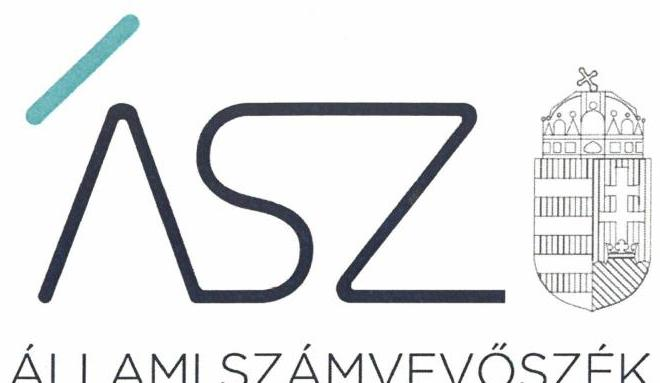
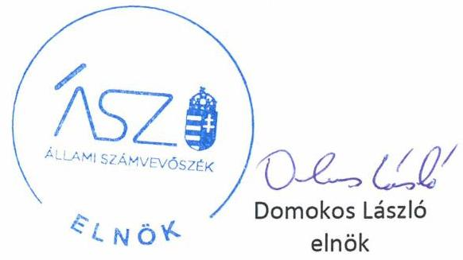

ÁLLAMI SZÁMVEVŐSZÉK

# JELENTÉS 

## Nem állami humánszolgáltatók ellenőrzése

A szociális humánszolgáltatást nyújtó intézmények, szolgáltatók államháztartáson kívüli fenntartói központi költségvetésből kapott támogatásai felhasználásának ellenőrzése – Megoldás Közhasznú Egyesület

2020
20121
www.asz.hu

---

ÁLLAMI SZÁMVEVŐSZÉK

# JELENTÉS

## Nem állami humánszolgáltatók ellenőrzése

A szociális humánszolgáltatást nyújtó intézmények, szolgáltatók államháztartáson kívüli fenntartói központi költségvetésből kapott támogatásai felhasználásának ellenőrzése – Megoldás Közhasznú Egyesület

2020. 06. 30.

2012. 12. www.asz.hu

---

# AZ ELLENŐRZÉST FELÜGYELTE: 

KLINGA LÁSZLÓ felügyeleti vezető

## AZ ELLENŐRZÉST VEZETTE ÉS A VÉGREHAJTÁSÁÉRT FELELŐS:

MOLNÁR ZSUZSANNA ellenőrzésvezető

## A PROGRAM ÖSSZEÁLLÍTÁSÁÉRT FELELŐS:

FEKETE-NAGY ANDRÁS GÁBOR ellenőrzési program készítéséért felelős vezető

TÓTPÁL SZABOLCS osztályvezető

IKTATÓSZÁM: EL-2760-001/2020.
TÉMASZÁM: 2491
ELLENŐRZÉS-AZONOSÍTÓ SZÁM: V083533; V0867115

---

# TARTALOMJEGYZÉK 

- ÖSSZEGZÉS ..... 5
- AZ ELLENŐRZÉS CÉLJA ..... 6
- AZ ELLENŐRZÉS TERÜLETE ..... 7
- AZ ELLENŐRZÉS HÁTTERE, INDOKOLTSÁGA ..... 8
- A JELENTÉS LÉNYEGES KÉRDÉSKÖREI ..... 9
- AZ ELLENŐRZÉS HATÓKÖRE ÉS MÓDSZEREI ..... 10
MELLÉKLETEK ..... 13
I. sz. melléklet: Értelmező szótár ..... 13
- FÜGGELÉK: ÉSZREVÉTELEK ..... 15
- RÖVIDÍTÉSEK JEGYZÉKE ..... 17

---

.

---

# ÖSSZEGZÉS 

A kisvárdai székhelyű Megoldás Közhasznú Egyesület mint intézményfenntartó a 2015-2018. években nem biztosította a szociális humánszolgáltatási közfeladat ellátására kapott költségvetési támogatások felhasználásának ellenőrizhetőségét.

## Az ellenőrzés társadalmi indokoltsága

A szociális gondoskodást igénylők védelme, illetve a köznevelési feladatok ellátása az Alaptörvényben ${ }^{1}$ meghatározott, a társadalom szempontjából fontos tevékenységek. Jogszabályok teszik lehetővé, hogy államháztartáson kívüli szervezetek - így például az egyházi fenntartók, alapítványok, gazdasági társaságok, egyesületek - által fenntartott intézmények is végezzenek köznevelési, szociális és gyermekvédelmi feladatokat. Mindehhez a központi költségvetés évente jelentős összegű támogatással járul hozzá. Az államháztartáson kívüli, humánszolgáltatást végző intézmények az igényelt közpénzekből társadalmilag hasznos, közösségteremtő, közérdekű, illetve közhasznú tevékenységet végeznek, illetve közfeladatokat látnak el.

Az intézményfenntartók ellenőrzésével az Állami Számvevőszék hozzájárul ahhoz, hogy ezen közpénzeket az államháztartáson kívüli szervezetek is ellenőrizhető, átlátható és elszámoltatható módon használják fel a közfeladatok ellátása során. Az ellenőrzések célja továbbá, hogy a nyilvánosság és az igénybevevők megfelelő tájékoztatást kapjanak az államháztartáson kívüli közfeladatot ellátók működéséről.

Az ÁSZ ellenőrzései arra adnak választ, hogy az intézményfenntartók arra használták-e fel a közpénzeket, amire igényelték.

A szabályszerű gazdálkodás elengedhetetlen a közfeladat ellátás szakmai céljainak megvalósításához, valamint a társadalmi közbizalom fenntartásához.

## Megállapítások, következtetések

A Fenntartó ${ }^{2}$ a 2015-2018. években a szociális humánszolgáltatási közfeladat ellátására kapott költségvetési támogatás felhasználásának a Számv. tv. ${ }^{3}$ 161/A § (2) bekezdésében előírt ellenőrizhetőségét nem biztosította. Mivel az Atr. ${ }^{4}$ 16. § (1) bekezdésében foglalt szabályozás ellenére nem gondoskodott arról, hogy a költségvetési támogatások felhasználásának, a Fenntartó és a nem önállóan gazdálkodó intézményei gazdálkodásának elkülönített, feladatonkénti bontásban történő elszámolására az adatok rendelkezésre álljanak.

A Megoldás Közhasznú Egyesület a 2015-2018. években szociális humánszolgáltatási közfeladatait nem önállóan gazdálkodó intézményében látta el. A Fenntartó az ellenőrzött időszakban jogszabályban előírtak ellenére könyvvezetési rendszerében a Fenntartó és a humán szolgáltatást végző intézményének gazdálkodását nem különítette el. A Fenntartó az ellenőrzött időszakban könyvvezetésében a kapott költségvetési támogatás felhasználását az intézménye által ellátott négy feladat - pszichiátriai betegek nappali intézményének működtetése és a fogyatékos személyek nappali ellátása, támogató szolgálat működtetése, közösségi pszichiátriai ellátás és fejlesztő-felkészítő foglalkoztatás - szerint nem bontotta meg.

A Fenntartó mindezek alapján az Alaptörvény 39. cikk (2) bekezdésében foglaltak ellenére a felhasznált közpénzekre vonatkozó gazdálkodása átláthatóságát nem biztosította.

Ezáltal a Fenntartó nem igazolta, hogy a közpénzt a szociális humánszolgáltatási közfeladatra fordította.

---

# AZ ELLENŐRZÉS CÉLJA

**AZ ELLENŐRZÉS CÉLJA** annak értékelése volt, hogy a nem állami, nem önkormányzati szociális intézmények fenntartói központi költségvetésből kapott támogatásainak felhasználása szabályszerű volt-e.

---

# **AZ ELLENŐRZÉS TERÜLETE**

## **Megoldás Közhasznú Egyesület, mint intézményfenntartó**

A Megoldás Közhasznú Egyesület 2004-ben jött létre Kisvárdán. Célja az emberek életkörülményeinek és életfelfogásának
javítása, elsősorban a fogyatékkal élők és pszichiátriai betegek
számára végzett könnyítő, segítő tevékenység.

A Fenntartó közhasznú jogállású szervezet volt, vállalkozási
tevékenységet 2015-2018. években nem folytatott.

Döntéshozó szerve a közgyűlés⁵ volt. A Fenntartó képvise-
leti jogát az elnök gyakorolta, akinek személye 2018. február 6-
tól megváltozott.

A Fenntartó szociális közfeladatait önálló jogi személyiség-
gel nem rendelkező intézménye⁶ révén látta el.

A Megoldás Szociális Szolgáltató Központ kisvárdai székhe-
lyén kívül vásárosnaményi telephelyén végezte feladatait. A
pszichiátriai betegek nappali intézményének működtetése és a fogyatékos
személyek nappali ellátása mellett, támogató szolgálatot működtetett, köz-
össégi pszichiátriai ellátást és fejlesztő-felkészítő foglalkoztatást biztosí-
tott az ellátottak számára.

A Fenntartó közfeladatok ellátására a MÁK⁷ adatszolgáltatása alapján
2015. évben 74,1 millió forint, 2016. évben 121,4 millió forint, 2017. évben
129,7 millió forint, 2018-ban pedig 141,0 millió forint költségvetési támo-
gatást igényelt.

---

# AZ ELLENŐRZÉS HÁTTERE, INDOKOLTSÁGA 

A szociális feladatokat ellátó nem állami intézményfenntartók részére közfeladataik ellátására évente jelentős összegű pénzügyi támogatást biztosítottak a mindenkori költségvetési törvények a bennük megfogalmazott feltételek mellett. A szociális feladatokat ellátó nem állami intézményfenntartók részére közfeladataik ellátására évente jelentős összegű pénzügyi támogatást biztosítottak a mindenkori költségvetési törvények a bennük megfogalmazott feltételek mellett. A felhasználható állami támogatásokra a mindenkori költségvetési törvények a 2015-2018. években a szociális ágazatra vonatkozóan 360 Mrd Ft előirányzatot határoztak meg.

Az ÁSZ ${ }^{8}$ stratégiájában foglaltak alapján is indokolt az ellenőrzés, amely a társadalom számára jelzi, hogy a közpénz államháztartáson kívüli felhasználása sem maradhat ellenőrizetlenül. Az államháztartáson kívülre nyújtott költségvetési támogatások ellenőrzésével az ÁSZ hozzájárul ahhoz, hogy a közpénzeket a nem állami humán fenntartók átlátható módon használják fel a közfeladatok ellátására kötött szerződésekben vállalt kötelezettségek teljesítése érdekében. Az ellenőrzés javaslataival hozzájárulhat az említett rendszerek szabályszerű támogatás felhasználásához, javíthatja a társadalmi-gazdasági döntések megalapozottságát, amely a „jól irányított állam" működéséhez járul hozzá.

A holisztikus megközelítés jegyében az ellenőrzés keretében egyedi kockázatelemzés alapján kiválasztott fenntartóknál és intézményeiknél értékeljük az államháztartáson kívüli szociális tevékenységhez kapcsolódó támogatások felhasználásának megfelelőségét.

---

# A JELENTÉS LÉNYEGES KÉRDÉSKÖREI 

1. A szociális humánszolgáltató közfeladatot ellátó államháztartáson kívüli fenntartó szabályszerű működési - és gazdálkodási környezet kialakításával megteremtette-e a költségvetési támogatások átlátható, elszámoltatható igénybevételének, felhasználásának feltételeit?
2. Az államháztartáson kívüli fenntartó az átvállalt szociális humánszolgáltatási közfeladathoz biztosított költségvetési támogatásokat szabályszerűen fordította-e a humánszolgáltató intézménye/i működtetésére?
3. Az államháztartáson kívüli fenntartó a szociális humánszolgáltató intézménye/i működtetéséhez felhasznált közpénzekre vonatkozó gazdálkodásával a nyilvánosság előtt elszámolt-e, ennek érdekében ellenőrzési, értékelési és a külső ellenőrzésekkel kapcsolatos intézkedési feladatait szabályszerűen látta-e el?

---

# AZ ELLENŐRZÉS HATÓKÖRE ÉS MÓDSZEREI 

## Az ellenőrzés típusa

Megfelelőségi ellenőrzés.

## Az ellenőrzött időszak

A 2015. január 1-je és 2018. december 31-e közötti időszak.

## Az ellenőrzés tárgya

Az ellenőrzés a szociális humánszolgáltatási közfeladatokat ellátó államháztartáson kívüli fenntartó, humánszolgáltatási közfeladatai ellátásához a központi költségvetésből kapott támogatásaik humánszolgáltatási közfeladatokra való fenntartó általi felhasználása szabályszerűségének értékelésére terjedt ki.

## Az ellenőrzött szervezet

A Megoldás Közhasznú Egyesület, mint intézményfenntartó.

## Az ellenőrzés jogalapja

Az ellenőrzés jogszabályi alapját az ÁSZ tv. 1. § (3) bekezdésében, az 5. § (3) bekezdésében foglalt előírások adták.

## Az ellenőrzés módszerei

Az ellenőrzést az ellenőrzési program annak szempontjai, kérdései, az ellenőrzött időszakban hatályos jogszabályok, a nemzetközi standardokat irányadónak tekintve, az ellenőrzés szakmai szabályok és módszertanok figyelembevételével rendelte elvégezni. A közpénzekkel való felelős gazdálkodás segítésére irányuló javaslatok kidolgozásakor a hatályos jogszabályok voltak az irányadóak.

Az ellenőrzés ideje alatt az ellenőrzött szervezettel történő kapcsolattartást az ÁSZ SZMSZ ${ }^{\circledR}$-ének vonatkozó előírásai alapján biztosította az ÁSZ. Az ellenőrzési kérdések megválaszolásához szükséges bizonyítékok megszerzése az ellenőrzött által rendelkezésre bocsátott dokumentumokra, adatokra alapozva megfigyelés, szemle (szemrevételezés), kérdésfeltevés

---

(információkérés), valamint elemző eljárással történt. Az ellenőrzési bizonyítékként felhasználható adatforrások közé tartoztak egyrészt a szakmai program részletes szempontjainál felsorolt adatforrások, másrészt minden - az ellenőrzés folyamán feltárt, az ellenőrzés szempontjából információt tartalmazó - dokumentum.

Az ellenőrzés lefolytatásához az ellenőrzött szervezet a kitöltött tanúsítványok, valamint az ÁSZ által kért dokumentumok elektronikus úton való megküldésével szolgáltatott adatokat, információkat. Az így rendelkezésre bocsátott adatok, információk és a tanúsítványok adatai valódiságának kontrollja az ellenőrzés keretében történt.

Az egységes értelmezést támogatja a jelentés mellékletét képező értelmező szótár és a rövidítésjegyzék.

A szociális humánszolgáltatások központi költségvetési támogatásaival kapcsolatos, államháztartáson kívüli fenntartó jogszabályokban előírt feladatai betartását, továbbá a központi költségvetési támogatások szabályszerű nyilvántartását ellenőrizte az ÁSZ a fenntartónál rendelkezésre álló nyilvántartások, beszámolók és egyéb dokumentumok alapján. Az ellenőrzés nem terjedt ki a szociális humánszolgáltatások központi költségvetési támogatásai igénylése, módosítása, elszámolása valódiságának, megalapozottságának, helyességének - sem a fenntartónál, sem a székhely intézményeinél való - értékelésére (mivel ennek felülvizsgálata, ellenőrzése a finanszírozó jogszabályban előírt feladata, határozatai kiadása előtt). Továbbá nem terjedt ki az ellenőrzés e források, intézmények általi szabályszerű felhasználásának értékelésére.

---

.

---

# MELLÉKLETEK 

## I. SZ. MELLÉKLET: ÉRTELMEZŐ SZÓTÁR

költségvetési támogatás
nem állami, nem önkormányzati (államháztartáson kívüli) intézmény fenntartó
székhely intézmény
telephely
a társadalombiztosítás pénzügyi alapjai kivételével az államháztartás központi alrendszeréből ellenérték nélkül, pénzben nyújtott támogatások (Áht. 1. § 14. pont) A költségvetési törvényekben (2014. évi C. törvény 42-43. §, 2015. évi C. törvény 40-41. §, 2016. évi XC. törvény 41. §) megállapított támogatás. Például a 2015. évi C. törvény 40-41. § szerint többek között: Az Országgyűlés a szociális, gyermekjóléti, gyermekvédelmi közfeladatot ellátó intézményt, szolgáltatást fenntartó egyházi jogi személy, civil szervezet, közalapítvány, országos nemzetiségi önkormányzat, települési vagy területi nemzetiségi önkormányzat, gazdasági társaság, és a humánszolgáltatást alaptevékenységként végző, az Szja tv. hatálya alá tartozó egyéni vállalkozó (a továbbiakban együtt: nem állami szociális fenntartó) részére támogatást állapít meg a következők szerint: a támogatás a nem állami szociális fenntartót a települési önkormányzatok 2. melléklet III. pont 3. alpont c)-k) pontjában és III. pont 5. alpont a) pontjában meghatározott támogatásaival azonos jogcímeken, összegben és feltételek mellett illeti meg.
A szociális, gyermekjóléti és gyermekvédelmi közfeladatokat /humánszolgáltatásokat ellátó intézményt fenntartó egyházi jogi személy, társadalmi szervezet, alapítvány, közalapítvány, civil szervezet, országos nemzetiségi önkormányzat, nonprofit gazdasági társaság, gazdasági társaság és a humánszolgáltatást alaptevékenységként végző, Szja tv. hatálya alá tartozó egyéni vállalkozó. (2013. évi Kvtv. 35. § (1), (3) bekezdés, 2014. évi Kvtv. 33. §, 34. § (1), (4) bekezdés, 2015. évi Kvtv. 42. §, 43. § (1), (4) bekezdés, 2016. évi Kvtv. 40. §, 41. § (1), (4) bekezdés, 2017. évi Kvtv. 41. § (1), (4))

A szolgáltató székhelye, azaz a szolgáltató központi ügyintézésének helye, függetlenül attól, hogy használják-e szolgáltatás nyújtására (Sznyvhr. ${ }^{10} 1 . \S$ k) pont) (hatályos: 2013. december 1-től)

A szolgáltató székhelyétől különböző, szolgáltató/intézmény használatában álló hely, a szociális humánszolgáltatáshoz használt, bejegyzett hely. (Sznyvhr. 1.§ l) pont) (hatályos: 2015. január 1-től)

---

.

---

# FÜGGELÉK: ÉSZREVÉTELEK 

A jelentéstervezetet a Számvevőszék 15 napos észrevételezésre megküldte az ellenőrzött szervezet vezetőjének az ÁSZ tv. 29. § (1) bekezdése előírásának megfelelően.

A Megoldás Közhasznú Egyesület elnöke a jelentéstervezet megállapításaira írásban észrevételt tett.
Az ÁSZ tv. 29. § (3) bekezdésével összhangban az ÁSZ a Függelékben feltünteti az ellenőrzés megállapításaival kapcsolatban tett, figyelembe nem vett észrevételeket, és megindokolja, hogy azokat miért nem fogadta el.

A jelentéstervezet összegzésében, valamint a megállapítások, következtetések részben szereplő megállapításokra

 vonatkozó észrevétel
Elnök úr/hölgy észrevételében jelezte, hogy az Állami Számvevőszék (továbbiakban: ÁSZ) adatbekérési projektjének menetével és az ahhoz kapcsolódó program használatával először találkozott a Megoldás Közhasznú Egyesület (továbbiakban: Fenntartó). A nagy mennyiségű dokumentáció feltöltése során az alapfeladatra kapott összes támogatás felhasználását tartalmazó dokumentum került feltöltésre, elmaradt azon dokumentumok csatolása (munkaszámonként vezetett főkönyvi kivonatok), melyek egyértelműen bizonyították volna, hogy a Fenntartó (a számviteli és a civil törvényben meghatározottak szerint) a kapott költségvetési támogatás felhasználását az intézmény által ellátott feladatok szerinti bontásban, egymástól elkülönítetten használja fel és tartja nyilván. A Fenntartó a következő alapszolgáltatási feladatokat látta el: támogató szolgáltatás, pszichiátriai betegek részére nyújtott közösségi alapellátás, kettő pszichiátriai betegek nappali intézménye, kettő fogyatékos személyek nappali ellátása és fejlesztő foglalkoztatás. Az ellátási formák (feladatok) gazdálkodását a főkönyvben külön munkaszámokon rögzítik, ezért nem kapcsolódik hozzá külön analitikus nyilvántartás. A Fenntartó a pályázati forrásokból kapott bevételeit és azok ráfordításait (kiadásait, költségeit) is külön munkaszámokon, elkülönítetten könyveli. A Fenntartó gazdálkodására vonatkozó bevételek és kiadások elkülönítetten kerülnek könyvelésre.

Az ÁSZ a 2015-2017. évekre vonatkozóan az EL-1173-008/2019. iktatószámú adatbekérő levél 2. számú mellékletének 10. sorában bekérte az év végi zárás előtti és zárás utáni főkönyvi kivonatokat, a 34. sorában pedig a költségvetési támogatások elkülönített nyilvántartását igazoló dokumentumokat, főkönyvi és analitikus nyilvántartásokat a fenntartónál, illetve az önálló költségvetéssel rendelkező székhely intézmény/eknél. Az EL-1173-021/2019. iktatószámú adatbekérő levél 2. számú mellékletének 1.1. sorában került bekérésre a kapott támogatás 2018. évre vonatkozó elkülönített

[^0]
[^0]:    * 29. § (1) Az Állami Számvevőszék az ellenőrzési megállapításait megküldi az ellenőrzött szervezet vezetőjének vagy az általa megbízott személynek, és annak, akinek személyes felelősségét állapította meg.
    (2) Az ellenőrzött szervezet vezetője és a felelősként megjelölt személy az ellenőrzés megállapításaira tizenöt napon belül írásban észrevételt tehet.
    (3) Az Állami Számvevőszék az észrevételre a beérkezésétől számított harminc napon belül írásban válaszol. A figyelembe nem vett észrevételeket köteles a jelentésben feltüntetni, és megindokolni, hogy azokat miért nem fogadta el.

---

nyilvántartását alátámasztó dokumentum, 1.3. sorában pedig 2018. évre vonatkozóan a kapott támogatás felhasználásának 2018. évre vonatkozó elkülönített nyilvántartását alátámasztó dokumentum.

Elnök úr/hölgy észrevételével érintett, bekért dokumentum-körhöz 2015-2017. évek és 2018. év vonatkozásában a Fenntartó összesített főkönyvi kivonatait bocsátották az ÁSZ rendelkezésére az ellenőrzés során. A jelzett főkönyvi kivonatok felülvizsgálata során megállapítottam, hogy azok, ahogy azt Elnök úr/hölgy észrevételében is elismerte, nem tartalmazzák feladatonként elkülönítetten a költségvetési támogatások felhasználását, továbbá a Fenntartó és a nem önállóan gazdálkodó intézményei gazdálkodásának adatait. Az ellenőrzés során becsatolt főkönyvi kivonatokban szereplő főkönyvi számlák elnevezése és alábontása nem támasztja alá 2015-2018. évekre vonatkozóan a támogatások felhasználásának, továbbá a Fenntartó és a nem önállóan gazdálkodó intézményei gazdálkodásának elkülönített nyilvántartását. Elnök úr/hölgy 2019. január 15-én és 2019. október 18-án kelt teljességi és hitelességi nyilatkozataiban kijelentette, hogy az ÁSZ részére átadott dokumentumok, adatok megbízhatóak, és a bekért adatokra, dokumentumokra vonatkozóan teljes körű információt tartalmaznak.

Fentiek alapján megállapítást nyert, hogy a Fenntartó az Atr. 16. § (1) bekezdés előírása ellenére nem gondoskodott arról, hogy a költségvetési támogatások felhasználásának, a Fenntartó és a nem önállóan gazdálkodó intézményei gazdálkodásának elkülönített elszámolására az adatok rendelkezésre álljanak. Tájékoztatom Elnök úr/hölgyet, hogy a támogatás felhasználását, a Fenntartó és a nem önállóan gazdálkodó intézményei bevételeit és költségeit egyértelműen megjelölve, elkülönítve kell kimutatni a számviteli nyilvántartásokban, mivel a számvitelről szóló 2000. évi C. törvény 161/A § (2) bekezdése előírja, hogy a közpénzek felhasználásának és a köztulajdon használatának nyilvánossága és ellenőrizhetősége érdekében a gazdálkodó nyilvántartási (könyvvezetési) rendszerét köteles oly módon továbrészletezni, hogy abból a vonatkozó külön jogszabályban - jelen esetben az Atr. - meghatározott adatok rendelkezésre álljanak.

Tájékoztatom továbbá Elnök úr/hölgyet, hogy az ÁSZ megállapításait az ÁSZ felhívására - az Állami Számvevőszékről szóló 2011. évi LXVI. törvény 28. § (2) bekezdésben meghatározott adatszolgáltatási időszakon belül megküldött és a teljességi és hitelességi nyilatkozatban szereplő dokumentumokra alapozza.

A fent leírtakra tekintettel az észrevételt nem fogadjuk el, a jelentéstervezet módosítása nem indokolt.

---

# RÖVIDÍTÉSEK JEGYZÉKE 

${ }^{1}$ Alaptörvény
${ }^{2}$ Fenntartó
${ }^{3}$ Számv. tv.
${ }^{4}$ Atr.
${ }^{5}$ közgyülés
${ }^{6}$ intézmény
${ }^{7}$ MÁK
${ }^{8}$ ÁSZ
${ }^{9}$ ÁSZ SZMSZ
${ }^{10}$ Sznyvhr.

Magyarország Alaptörvénye (2011. április 25.) (hatályos: 2012. január 1-jétől)
Megoldás Közhasznú Egyesület
2000. évi C törvény a számvitelről (hatályos: 2000. január 1-jétől)
489/2013. (XII. 18.) Korm. rendelet az egyházi és nem állami fenntartású szociális, gyermekjóléti és gyermekvédelmi szolgáltatók, intézmények és hálózatok állami támogatásáról (hatályos: 2014. január 1-jétől)
Megoldás Közhasznú Egyesület Közgyűlése
Megoldás Szociális Szolgáltató Központ, Kisvárda, József Attila u. 58.
Magyar Államkincstár
Állami Számvevőszék
Állami Számvevőszék Szervezeti és Működési Szabályzata
369/2013. (X.24.) Korm. rendelet a szociális, gyermekjóléti és gyermekvédelmi szolgáltatók, intézmények és hálózatok hatósági nyilvántartásáról és ellenőrzéséről (hatályos: 2013. december 1-jétől)

---

# ASZ 

ALLAMI SZAMVEVOSZEK
1052 Budapest, Apáczai Cs. J. u. 10. I 1364 Budapest 4. Pf. 54 TEL: +36 14849100
email: szamvevoszek@asz.hu
web: www.asz.hu | www.aszhirportal.hu
