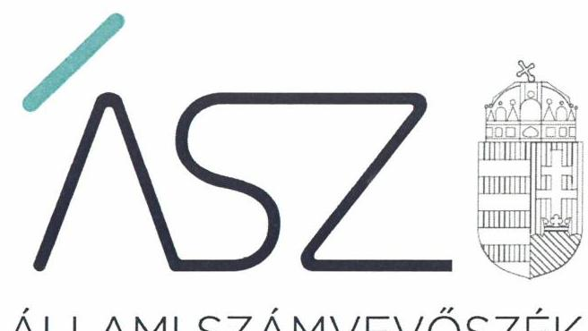
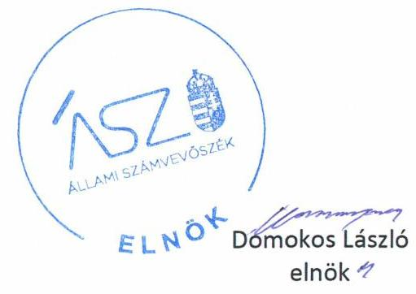
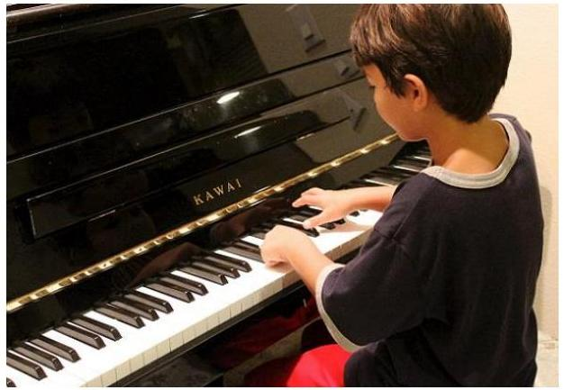

ÁLLAMI SZÁMVEVŐSZÉK

# JELENTÉS 

## Nem állami humánszolgáltatók ellenőrzése

A köznevelési humánszolgáltatást nyújtó intézmények államháztartáson kívüli fenntartói központi költségvetésből kapott támogatásai felhasználásának ellenőrzése PENTA Oktatási- és Művészetoktatási Közhasznú Nonprofit Korlátolt Felelősségű Társaság
2020.

20123
www.asz.hu

---

ÁLLAMI SZÁMVEVŐSZÉK

# JELENTÉS 

## Nem állami humánszolgáltatók ellenőrzése

A köznevelési humánszolgáltatást nyújtó intézmények államháztartáson kívüli fenntartói központi költségvetésből kapott támogatásai felhasználásának ellenőrzése PENTA Oktatási- és Művészetoktatási Közhasznú Nonprofit Korlátolt Felelősségű Társaság
2020. 07. 08.

20123
www.asz.hu

---

# AZ ELLENŐRZÉST FELÜGYELTE: 

MAROZSÁN LÁSZLÓNÉ felügyeleti vezető

## AZ ELLENŐRZÉST VEZETTE ÉS A VÉGREHAJTÁSÁÉRT FELELŐS:

KISS ISTVÁN GYÖRGY ellenőrzésvezető

## A PROGRAM ÖSSZEÁLLÍTÁSÁÉRT FELELŐS:

FEKETE-NAGY ANDRÁS GÁBOR ellenőrzési program készítéséért felelős vezető

IKTATÓSZÁM: EL-2758-001/2020.
TÉMASZÁM: 2523
ELLENŐRZÉS-AZONOSÍTÓ SZÁM: V086703

---

# TARTALOMJEGYZÉK 

- ÖSSZEGZÉS ..... 5
- AZ ELLENŐRZÉS CÉLJA ..... 6
- AZ ELLENŐRZÉS TERÜLETE ..... 7
- AZ ELLENŐRZÉS HÁTTERE, INDOKOLTSÁGA ..... 8
- A JELENTÉS LÉNYEGES KÉRDÉSKÖREI ..... 9
- AZ ELLENŐRZÉS HATÓKÖRE ÉS MÓDSZEREI ..... 10
- MEGÁLLAPÍTÁSOK ..... 12
- MELLÉKLETEK ..... 15
I. sz. melléklet: Értelmező szótár ..... 15
- FÜGGELÉK: ÉSZREVÉTELEK ..... 17
- RÖVIDÍTÉSEK JEGYZÉKE ..... 19

---

.

---

# ÖSSZEGZÉS 

A nyíregyházi székhelyű PENTA Oktatási- és Művészetoktatási Közhasznú Nonprofit Korlátolt Felelősségű Társaság a 2016-2018. években a köznevelési közfeladatok ellátására kapott költségvetési támogatások felhasználásának elszámoltathatóságát, átláthatóságát biztosította, a támogatást köznevelési intézménye működtetésére fordította.

## Az ellenőrzés társadalmi indokoltsága

A szociális gondoskodást igénylők védelme, illetve a köznevelési feladatok ellátása az Alaptörvényben meghatározott, a társadalom szempontjából fontos tevékenységek. Jogszabályok teszik lehetővé, hogy államháztartáson kívüli szervezetek - így például az egyházi fenntartók, alapítványok, gazdasági társaságok, egyesületek - által fenntartott intézmények is végezzenek köznevelési, szociális és gyermekvédelmi feladatokat. Mindehhez a központi költségvetés évente jelentős összegű támogatással járul hozzá. Az államháztartáson kívüli, humánszolgáltatást végző intézmények az igényelt közpénzekből társadalmilag hasznos, közösségteremtő, közérdekű, illetve közhasznú tevékenységet végeznek, illetve közfeladatokat látnak el.

Az intézményfenntartók ellenőrzésével az Állami Számvevőszék hozzájárul ahhoz, hogy ezen közpénzeket az államháztartáson kívüli szervezetek is ellenőrizhető, átlátható és elszámoltatható módon használják fel a közfeladatok ellátása során. Az ellenőrzések célja továbbá, hogy a nyilvánosság és az igénybevevők megfelelő tájékoztatást kapjanak az államháztartáson kívüli közfeladatot ellátók működéséről.

Az ÁSZ ellenőrzései arra adnak választ, hogy az intézményfenntartók arra használták-e fel a közpénzeket, amire igényelték.

A szabályszerű gazdálkodás elengedhetetlen a közfeladat ellátás szakmai céljainak megvalósításához, valamint a társadalmi közbizalom fenntartásához.

## Főbb megállapítások, következtetések

A köznevelési közfeladatot ellátó PENTA Oktatási- és Művészetoktatási Közhasznú Nonprofit Korlátolt Felelősségű Társaság az ellenőrzött időszakban rendelkezett a jogszabályokban előírt szabályszerű működési és gazdálkodási környezettel, így biztosította a költségvetési támogatások igénybevételének, felhasználásának feltételeit.

A PENTA Oktatási- és Művészetoktatási Közhasznú Nonprofit Korlátolt Felelősségű Társaság a köznevelési közfeladathoz nyújtott költségvetési támogatásokat a jogszabályokban előírt elkülönített módon tartotta nyilván, így biztosította a kapott és felhasznált költségvetési támogatások ellenőrizhetőségét. A kapott költségvetési támogatásokat szabályszerűen a köznevelési intézménye működtetésére fordította.

A PENTA Oktatási- és Művészetoktatási Közhasznú Nonprofit Korlátolt Felelősségű Társaság köznevelési intézménye működtetéséhez felhasznált közpénzekre vonatkozó gazdálkodásával a nyilvánosság előtt elszámolt.

---

# AZ ELLENŐRZÉS CÉLJA

**AZ ELLENŐRZÉS CÉLJA** annak értékelése volt, hogy a nem állami, nem önkormányzati köznevelési intézmények fenntartói központi költségvetésből kapott támogatásainak felhasználása szabályszerű volt-e.

---

# **AZ ELLENŐRZÉS TERÜLETE**

## **PENTA Oktatási- és Művészetoktatási Közhasznú Nonprofit Korlátolt Felelősségű Társaság**

A nyíregyházi székhelyű PENTA Oktatási- és Művészetoktatási Közhasznú Nonprofit Korlátolt Felelősségű Társaság 2008. június 2-án jött létre a PENTA Oktatási- és Művészetoktatási Közhasznú Társaság jogutódjaként. A Fenntartó1-t 5 fő magánszemély alapította.

A 2016-2018. években a Fenntartó közhasznú tevékenysége az alapfokú művészeti oktatási intézmény fenntartása, nevelés és oktatás, képességfejlesztés, ismeretterjesztés, kulturális tevékenység és kulturális örökség megóvása volt. Az ellenőrzött időszakban a Fenntartónak egy köznevelési közfeladatot ellátó Intézménye2 volt. Az Intézmény Nkt.tv.3 szerinti alapfeladata az alapfokú művészetoktatás volt, aminek keretében 13 telephelyen végzett zeneoktatást.

A Fenntartó a Magyar Államkincstár adatai szerint köznevelési közfeladat ellátására 2016-ban 220,4 M Ft, 2017-ben 240,6 M Ft, 2018-ban 242,8 M Ft költségvetési támogatásban részesült.

---

# AZ ELLENŐRZÉS HÁTTERE, INDOKOLTSÁGA 

A köznevelési feladatokat ellátó nem állami intézményfenntartók részére közfeladataik ellátására évente jelentős összegű pénzügyi támogatást biztosítottak a mindenkori költségvetési törvények a bennük megfogalmazott feltételek mellett. A felhasználható állami támogatások a Kvtv ${ }^{4}$ - ek szerint a 2016-2018. években a köznevelési ágazatra vonatkozóan 574 Mrd Ft előirányzatot határoztak meg.

Az ÁSZ ${ }^{5}$ a stratégiájában célul tűzte ki, hogy az államháztartáson kívülre nyújtott költségvetési támogatások ellenőrzésével hozzájárul ahhoz, hogy a közpénzeket az államháztartáson kívüli szervezetek is átlátható módon használják fel a közfeladatok szerződésben vállalt ellátása érdekében. Az ÁSZ stratégiájában foglaltak alapján is indokolt az ellenőrzés, amely a társadalom számára jelzi, hogy a közpénz államháztartáson kívüli felhasználása sem maradhat ellenőrizetlenül. Az államháztartáson kívülre nyújtott költségvetési támogatások ellenőrzésével az ÁSZ hozzájárul ahhoz, hogy a közpénzeket a nem állami humán fenntartók átlátható módon használják fel a közfeladatok ellátására kötött szerződésekben vállalt kötelezettségek teljesítése érdekében.

---

# A JELENTÉS LÉNYEGES KÉRDÉSKÖREI 

1. A köznevelési közfeladatot ellátó államháztartáson kívüli fenntartó szabályszerű működési és gazdálkodási környezet kialakításával megteremtette-e a költségvetési támogatások átlátható, elszámoltatható igénybevételének, felhasználásának feltételeit?
2. Az államháztartáson kívüli fenntartó az átvállalt köznevelési humánszolgáltatási közfeladathoz biztosított költségvetési támogatásokat szabályszerűen fordította-e a humánszolgáltató intézménye működtetésére?
3. Az államháztartáson kívüli fenntartó a köznevelési intézménye működtetéséhez felhasznált közpénzekre vonatkozó gazdálkodásával a nyilvánosság előtt elszámolt-e, ennek érdekében ellenőrzési, értékelési és a külső ellenőrzésekkel kapcsolatos intézkedési feladatait szabályszerűen látta-e el?

---

# AZ ELLENŐRZÉS HATÓKÖRE ÉS MÓDSZEREI 

## Az ellenőrzés típusa

Megfelelőségi ellenőrzés.

## Az ellenőrzött időszak

A 2016. január 1. és 2018. december 31. közötti időszak.

## Az ellenőrzés tárgya

Az ellenőrzés a köznevelési humánszolgáltatási közfeladatokat ellátó államháztartáson kívüli fenntartók humánszolgáltatási közfeladatai ellátásához a központi költségvetésből kapott támogatásaik humánszolgáltatási közfeladatokra való fenntartó általi felhasználása szabályszerűségének értékelésére terjedt ki.

## Az ellenőrzött szervezet

PENTA Oktatási- és Művészetoktatási Közhasznú Nonprofit Korlátolt Felelősségű Társaság

## Az ellenőrzés jogalapja

Az ellenőrzés jogszabályi alapját az ÁSZ tv. ${ }^{6}$ 1. § (3) bekezdése, 5. § (3) bekezdésben foglalt előírások adják.

## Az ellenőrzés módszerei

Az ellenőrzést az ellenőrzési program annak szempontjai, kérdései, az ellenőrzött időszakban hatályos jogszabályok, a nemzetközi standardokat irányadónak tekintve, az ellenőrzés szakmai szabályok és módszertanok figyelembevételével rendelte elvégezni. A közpénzekkel való felelős gazdálkodás segítésére irányuló javaslatok kidolgozásakor a hatályos jogszabályok az irányadóak.

Az ellenőrzés ideje alatt az ellenőrzött szervezettel történő kapcsolattartást az ÁSZ SZMSZ ${ }^{7}$-ének vonatkozó előírásai alapján biztosította az ÁSZ.

---

Az ellenőrzési kérdések megválaszolásához szükséges bizonyítékok megszerzése az ellenőrzött által rendelkezésre bocsátott dokumentumokra, adatokra alapozva megfigyelés, kérdésfeltevés (információkérés), valamint elemző eljárással történt.

Az ellenőrzési bizonyítékként felhasználható adatforrások közé tartoztak egyrészt az ellenőrzési program részletes szempontjainál felsorolt adatforrások, másrészt minden - az ellenőrzés folyamán feltárt, az ellenőrzés szempontjából információt tartalmazó - dokumentum.

Az ellenőrzés lefolytatásához az ellenőrzött szervezet a kitöltött tanúsítványok, valamint az ÁSZ által kért dokumentumok elektronikus úton való megküldésével szolgáltatott adatokat, információkat. Az így rendelkezésre bocsátott adatok, információk és a tanúsítványok adatai valódiságának kontrollja az ellenőrzés keretében történt.

Az egységes értelmezést az ellenőrzési program mellékletét képező fogalomtár és rövidítésjegyzék támogatta.

Az ellenőrzést alapvetően a köznevelési humánszolgáltatások esetében a központi költségvetési támogatások igénylésével, módosításával, felhasználásával, elszámolásával kapcsolatos feladatokat ellátó államháztartáson kívüli fenntartóknál végezte az ÁSZ.

A köznevelési humánszolgáltatások központi költségvetési támogatásaival kapcsolatos, államháztartáson kívüli fenntartó jogszabályokban előírt feladatai betartását, továbbá a központi költségvetési támogatások szabályszerű nyilvántartását ellenőrizte az ÁSZ a Fenntartónál rendelkezésre álló nyilvántartások, beszámolók és egyéb dokumentumok alapján. Az ellenőrzés nem terjedt ki a köznevelési humánszolgáltatások központi költségvetési támogatásai igénylése, módosítása, elszámolása valódiságának, megalapozottságának, helyességének - sem a fenntartónál, sem a székhely intézményeinél való - értékelésére (mivel ennek felülvizsgálata, ellenőrzése a finanszírozó jogszabályban előírt feladata, határozatai kiadása előtt). Továbbá nem terjedt ki az ellenőrzés e források intézmények általi szabályszerű felhasználásának értékelésére.

---

# MEGÁLLAPÍTÁSOK 

## 1. A köznevelési közfeladatot ellátó államháztartáson kívüli fenntartó szabályszerű működési és gazdálkodási környezet kialakításával megteremtette-e a költségvetési támogatások átlátható, elszámoltatható igénybevételének, felhasználásának feltételeit?

Összegző megállapítás

A köznevelési közfeladatot ellátó fenntartó szabályszerű működési és gazdálkodási környezet kialakításával megteremtette a költségvetési támogatások szabályszerű felhasználásának a feltételeit.

A Fenntartó rendelkezett jogszabály szerinti társasági szerződés ${ }^{8}$-sel. A Fenntartó szervezeti felépítését, működési rendjét a társasági szerződés és az SZMSZ ${ }^{9}$ szabályozta.

A Fenntartó számviteli politika ${ }^{10}$-ban rögzítette a gazdálkodó adottságainak, körülményeinek leginkább megfelelő eljárásokat, módszereket. A Fenntartó rendelkezett, eszközök és források leltározási és leltárkészítési szabályzat ${ }^{11}$-ával, eszközök és források értékelési szabályzat ${ }^{12}$-ával, pénzkezelési szabályzat ${ }^{13}$-tal, valamint elkészítette a számlarendet.

## 2. Az államháztartáson kívüli fenntartó az átvállalt köznevelési humánszolgáltatási közfeladathoz biztosított költségvetési támogatásokat szabályszerűen fordította-e a humánszolgáltató intézménye működtetésére?

Összegző megállapítás

A Fenntartó a köznevelési közfeladathoz biztosított költségvetési támogatásokat szabályszerűen fordította a humánszolgáltató intézménye működtetésére.

A Fenntartó biztosította a köznevelési intézménye működésének pénzügyi feltételeit, az intézménye költségvetési terveit és térítési díj szabályzatát meghatározta.

A Fenntartó a kapott támogatásokat elkülönített főkönyvi számlán kezelte számviteli rendjében. A Fenntartó a támogatásokat teljes összegben, az előírt határnapon belül továbbutalta az Intézményének. A Fenntartó a költségvetési támogatások felhasználásának Számv.tv. ${ }^{14}$ szerinti elkülönített nyilvántartását kialakította, a főkönyvi számla alábontása alkalmas volt arra, hogy az Nkt.vhr. ${ }^{15}$ által előírt cél szerinti felhasználást igazolja.

---

# 3. Az államháztartáson kívüli fenntartó a köznevelési intézménye működtetéséhez felhasznált közpénzekre vonatkozó gazdálkodásával a nyilvánosság előtt elszámolt-e, ennek érdekében ellenőrzési, értékelési és a külső ellenőrzésekkel kapcsolatos intézkedési feladatait szabályszerűen látta-e el? 

Összegző megállapítás

A Fenntartó a köznevelési intézménye működtetéséhez felhasznált közpénzekre vonatkozó gazdálkodásával a nyilvánosság előtt szabályszerűen elszámolt, az ellenőrzési és értékelési feladatait ellátta.

A Fenntartó a 2016-2018. évi egyszerűsített éves beszámolóit elkészítette, az előírt határidőn belül letétbe helyezte és közzétette.

A Fenntartó képviselője az Intézménynél évente ellenőrizte az intézmény pénzügyi gazdálkodását, számviteli fegyelmét, a támogatás igénylésének törvényességét, felhasználásának szabályosságát, valamint értékelte a szakmai munka eredményességét.

---

.

---

# MELLÉKLETEK 

- I. SZ. MELLÉKLET: ÉRTELMEZŐ SZÓTÁR
humánszolgáltatás
külön törvényben meghatározott szociális, gyermekjóléti, gyermekvédelmi, közoktatási, felsőoktatási, kulturális közfeladatok (2015. évi Kvtv. 43. § (1), (4) bekezdés, 1. számú melléklet XX/20/2/3. jogcím csoport, 19. alcím, 2016. évi Kvtv. 41. § (1), (4) bekezdés, 1. számú melléklet XX/20/2/3. jogcím csoport, 19. alcím, 2017. évi Kvtv. 41. § (1), (4) bekezdés, 1. számú melléklet XX/20/2/3. jogcím csoport, 19. alcím)
költségvetési támogatás a társadalombiztosítás pénzügyi alapjai kivételével az államháztartás központi alrendszeréből ellenérték nélkül, pénzben nyújtott támogatások, ide nem értve
f) a szociális igazgatásról és szociális ellátásokról szóló törvény, valamint a gyermekek védelméről és a gyámügyi igazgatásról szóló törvény szerinti pénzbeli és természetbeni szociális és gyermekvédelmi ellátásokat (Áht. ${ }^{16}$ 1. § 14. pont)
A költségvetési törvényekben (2015.évi C. törvény 40.§, 2016. évi XC. törvény 40. §, 2017. évi C. törvény 40. §) megállapított támogatás többek között: átlagbéralapú támogatás, működési támogatás, tankönyvtámogatás, a gyermek-, tanulói étkeztetéshez nyújtott támogatás.
köznevelési közfeladat
A köznevelési intézmény

 alapító okiratában foglalt feladat: óvodai nevelés, nemzetiséghez tartozók óvodai nevelése, általános iskolai nevelés-oktatás, nemzetiséghez tartozók általános iskolai nevelése-oktatása, kollégiumi ellátás, nemzetiségi kollégiumi ellátás, gimnáziumi nevelés-oktatás, szakközépiskolai nevelés-oktatás, szakiskolai nevelés-oktatás, nemzetiségi gimnáziumi nevelés-oktatás, nemzetiségi szakközépiskolai nevelés-oktatás, nemzetiségi szakiskolai nevelés-oktatás, Köznevelési Hídprogramok keretében folyó nevelés-oktatás, felnőttoktatás, alapfokú művészetoktatás, fejlesztő nevelés, fejlesztő nevelés-oktatás, pedagógiai szakszolgálati feladat, a többi gyermekkel, tanulóval együtt nevelhető, oktatható sajátos nevelési igényű gyermekek, tanulók óvodai nevelése és iskolai nevelése-oktatása, azoknak a sajátos nevelési igényű gyermekeknek, tanulóknak az óvodai, iskolai, kollégiumi ellátása, akik a többi gyermekkel, tanulóval nem foglalkoztathatók együtt, a gyermekgyógyüdülőkben, egészségügyi intézményekben, rehabilitációs intézményekben tartós gyógykezelés alatt álló gyermekek tankötelezettségének teljesítéséhez szükséges oktatás, pedagógiai-szakmai szolgáltatás.
köznevelési intézmény
nem állami, nem önkormányzati (államháztartáson kívüli) intézmény fenntartó
telephely
A nevelési-oktatási intézmény, pedagógiai szakszolgálati intézmény, pedagógiai-szakmai szolgáltatást nyújtó intézmény.
A köznevelési közfeladatokat/humánszolgáltatásokat ellátó intézményt fenntartó egyházi jogi személy, társadalmi szervezet, alapítvány, közalapítvány, civil szervezet, országos nemzetiségi önkormányzat, nonprofit gazdasági társaság, gazdasági társaság és a humánszolgáltatást alaptevékenységként végző, Szja tv. hatálya alá tartozó egyéni vállalkozó.
(2015. évi Kvtv. 43. § (1) bekezdés, 2016. évi Kvtv. 41. § (1), bekezdés, 2017. évi Kvtv. 41. § (1) bekezdés)
a székhelyen kívül működő feladatellátási hely

---

.

---

# FÜGGELÉK: ÉSZREVÉTELEK 

A jelentéstervezetet a Számvevőszék 15 napos észrevételezésre megküldte az ellenőrzött szervezet vezetőjének az ÁSZ tv. 29. § (1) bekezdése előírásának megfelelően.

A PENTA Oktatási- és Művészetoktatási Közhasznú Nonprofit Korlátolt Felelősségű Társaság ügyvezetője a jelentéstervezet megállapításaira nem tett észrevételt.

[^0]
[^0]:    * 29. § (1) Az Állami Számvevőszék az ellenőrzési megállapításait megküldi az ellenőrzött szervezet vezetőjének vagy az általa megbízott személynek, és annak, akinek személyes felelősségét állapította meg.
    (2) Az ellenőrzött szervezet vezetője és a felelősként megjelölt személy az ellenőrzés megállapításaira tizenöt napon belül írásban észrevételt tehet.
    (3) Az Állami Számvevőszék az észrevételre a beérkezésétől számított harminc napon belül írásban válaszol. A figyelembe nem vett észrevételeket köteles a jelentésben feltüntetni, és megindokolni, hogy azokat miért nem fogadta el.

---

.

---

# RÖVIDÍTÉSEK JEGYZÉKE 

${ }^{1}$ Fenntartó
${ }^{2}$ Intézmény
${ }^{3} \mathrm{Nkt}$.
${ }^{4}$ Kvtv.
${ }^{5}$ ÁSZ
${ }^{6}$ ÁSZ törvény
${ }^{7}$ ÁSZ SZMSZ
${ }^{8}$ társasági szerződés
${ }^{9}$ SZMSZ
${ }^{10}$ számviteli politika
${ }^{11}$ eszközök és források leltárkészítési leltározási szabályzat
${ }^{12}$ eszközök és források értékelési szabályzat
${ }^{13}$ pénzkezelési szabályzat
${ }^{14}$ Számv.tv.
${ }^{15} \mathrm{Nkt} . \mathrm{vhr}$.
${ }^{16}$ Áht.

PENTA Oktatási- és Művészetoktatási Közhasznú Nonprofit Korlátolt Felelősségű Társaság, székhelye: Nyíregyháza, Csillag utca 46/a.
Muzsika Zeneiskola Alapfokú Művészeti Iskola székhelye: Nyíregyháza, Csillag utca 46/a.
2011. évi CXC. törvény a nemzeti köznevelésről, (hatályos 2012. szeptember 1-től)
Magyarország 2015. évi központi költségvetéséről szóló 2014. évi C. törvény (hatályos: 2015. január 1. és 2018. december 31. között)
Magyarország 2016. évi központi költségvetéséről szóló 2015. évi C. törvény (hatályos: 2016. január 1. és 2019. december 31. között)
Magyarország 2017. évi központi költségvetéséről szóló 2016. évi XC. törvény (hatályos: 2016. november 1-től)
Magyarország 2018. évi központi költségvetéséről szóló 2017. évi C. törvény (hatályos 2017.november 1.-től)
Állami Számvevőszék
az Állami Számvevőszékről szóló 2011. évi LXVI. törvény (hatályos:2011. július 1-jétől)
Állami Számvevőszék Szervezeti és Működési Szabályzata
Társaság létesítő okirata
PENTA Oktatási- és Művészetoktatási Közhasznú Nonprofit Korlátolt Felelősségű Társaság Szervezeti és működési szabályzata, hatályos 2008. december 19-től
PENTA Oktatási- és Művészetoktatási Közhasznú Nonprofit Korlátolt Felelősségű Társaság számviteli politika (hatályos 2016. január 1-jétől)
PENTA Oktatási- és Művészetoktatási Közhasznú Nonprofit Korlátolt Felelősségű Társaság Eszközök és források leltárkészítési és leltározási szabályzat (hatályos: 2015. december 1-jétől)
PENTA Oktatási- és Művészetoktatási Közhasznú Nonprofit Korlátolt Felelősségű Társaság Eszközök és források értékelési szabályzat (hatályos: 2015. december 1-jétől)
PENTA Oktatási- és Művészetoktatási Közhasznú Nonprofit Korlátolt Felelősségű Társaság Pénzkezelési szabályzat (hatályos: 2015. december 1-jétől)
2000. évi C. törvény a számvitelről (hatályos: 2000. január 1-jétől)

229/2012. (VIII.28) Korm. rendelet a nemzeti köznevelésről szóló törvény végrehajtásáról (hatályos 2012. szeptember 1-jétől)
2011. évi CXCV. törvény az államháztartásról (hatályos: 2011. december 31-től)

---

# ÁSZ 

ÁLLAMI SZÁMVEVŐSZÉK
1052 Budapest, Apáczai Cs. J. u. 10. I 1364 Budapest 4. Pf. 54 TEL: +36 14849100
email: szamvevoszek@asz.hu
web: www.asz.hu | www.aszhirportal.hu
