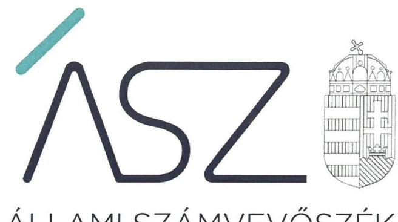
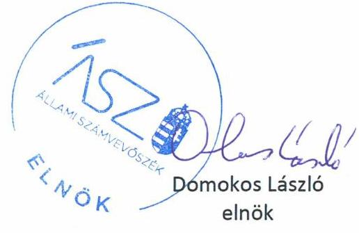
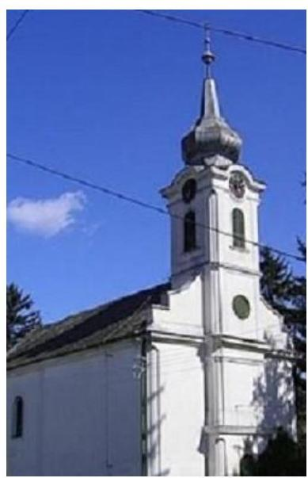

ÁLLAMI SZÁMVEVŐSZÉK

# JELENTÉS 

## Nem állami humánszolgáltatók ellenőrzése

A szociális humánszolgáltatást nyújtó intézmények, szolgáltatók államháztartáson kívüli fenntartói központi költségvetésből kapott támogatásai felhasználásának ellenőrzése -

Mohács-Kölked Református Társegyházközség
2020.

20124
www.asz.hu

---

ÁLLAMI SZÁMVEVŐSZÉK

# JELENTÉS 

## Nem állami humánszolgáltatók ellenőrzése

A szociális humánszolgáltatást nyújtó intézmények, szolgáltatók államháztartáson kívüli fenntartói központi költségvetésből kapott támogatásai felhasználásának ellenőrzése - Mohács-Kölked Református Társegyházközség
2020. 06. hó 30. nap

20124
www.asz.hu

---

# AZ ELLENŐRZÉST FELÜGYELTE: 

VARGA EDIT felügyeleti vezető

## AZ ELLENŐRZÉST VEZETTE ÉS A VÉGREHAJTÁSÁÉRT FELELŐS:

DR. GYŐRI GABRIELLA MÁRTA ellenőrzésvezető
NAGY ADRIENN ellenőrzésvezető
VALASTYÁNNÉ DR. VÍZHÁNYÓ JÚLIA ellenőrzésvezető

## A PROGRAM ÖSSZEÁLLÍTÁSÁÉRT FELELŐS:

TÓTPÁL SZABOLCS osztályvezető
FEKETE-NAGY ANDRÁS GÁBOR ellenőrzési program készítéséért felelős vezető

Jelentéseink az Országgyűlés számítógépes hálózatán és az interneten a www.asz.hu címen is olvashatóak.

IKTATÓSZÁM: EL-2755-001/2020.
TÉMASZÁM: 2491
ELLENŐRZÉS-AZONOSÍTÓ SZÁM: V083566, V0867129

---

# TARTALOMJEGYZÉK 

■ ÖSSZEGZÉS ..... 5
■ AZ ELLENŐRZÉS CÉLJA ..... 6
■ AZ ELLENŐRZÉS TERÜLETE ..... 7
■ AZ ELLENŐRZÉS HÁTTERE, INDOKOLTSÁGA ..... 8
■ AZ ELLENŐRZÉS KÉRDÉSKÖREI ..... 9
■ AZ ELLENŐRZÉS HATÓKÖRE ÉS MÓDSZEREI ..... 10
■ MELLÉKLETEK ..... 13
I. sz. melléklet: Értelmező szótár ..... 13
■ FÜGGELÉK: ÉSZREVÉTELEK ..... 15
■ RÖVIDÍTÉSEK JEGYZÉKE ..... 17

---

.

---

# ÖSSZEGZÉS 

A Mohács-Kölked Református Társegyházközség a 2015-2018. években nem biztosította a szociális humánszolgáltatási közfeladatok ellátására kapott költségvetési támogatások felhasználásának ellenőrizhetőségét.

## Az ellenőrzés társadalmi indokoltsága

A szociális gondoskodást igénylők védelme, illetve a köznevelési feladatok ellátása az Alaptörvényben meghatározott, a társadalom szempontjából fontos tevékenységek. Jogszabályok teszik lehetővé, hogy államháztartáson kívüli szervezetek - így például az egyházi fenntartók, alapítványok, gazdasági társaságok, egyesületek - által fenntartott intézmények is végezzenek köznevelési, szociális és gyermekvédelmi feladatokat. Mindehhez a központi költségvetés évente jelentős összegű támogatással járul hozzá. Az államháztartáson kívüli, humánszolgáltatást végző intézmények az igényelt közpénzekből társadalmilag hasznos, közösségteremtő, közérdekű, illetve közhasznú tevékenységet végeznek, illetve közfeladatokat látnak el.

Az intézményfenntartók ellenőrzésével az Állami Számvevőszék hozzájárul ahhoz, hogy ezen közpénzeket az államháztartáson kívüli szervezetek is ellenőrizhető, átlátható és elszámoltatható módon használják fel a közfeladatok ellátása során. Az ellenőrzések célja továbbá, hogy a nyilvánosság és az igénybevevők megfelelő tájékoztatást kapjanak az államháztartáson kívüli közfeladatot ellátók működéséről.

Az ÁSZ ellenőrzései arra adnak választ, hogy az intézményfenntartók arra használták-e fel a közpénzeket, amire igényelték.

A szabályszerű gazdálkodás elengedhetetlen a közfeladat ellátás szakmai céljainak megvalósításához, valamint a társadalmi közbizalom fenntartásához.

## Megállapítások, következtetések

A Mohács-Kölked Református Társegyházközség, mint Fenntartó ${ }^{1}$ a 2015-2018. években szociális humánszolgáltatási közfeladatait önállóan gazdálkodó intézményeiben² látta el. Az intézményei által ellátott közfeladatok a fogyatékos személyek nappali intézményi ellátása; 40\%-os nappali intézményi ellátása; otthona működtetése, továbbá hajléktalan személyek átmeneti szállásának; nappali intézményi ellátásának biztosítása; pszichiátriai betegek otthona; 2016-tól támogató szolgálat működtetése; valamint támogatott lakhatás biztosítása fogyatékos személyek részére; és pszichiátriai betegek részére. A Fenntartó az ellenőrzött időszakban a könyvvezetésében a kapott költségvetési támogatások felhasználását a jogszabályok által előírt módon nem különítette el, a könyvvezetésében az intézményei által ellátott közfeladatok szerinti bontásban nem rögzítette.

A Fenntartó a 2015-2018. években a szociális humánszolgáltatási közfeladat ellátására kapott költségvetési támogatás felhasználásának a Számv. tv. ${ }^{3}$ 161/A §. (2) bekezdésében előírt ellenőrizhetőségét nem biztosította. Mivel az Atr. ${ }^{4}$ 16. § (1) bekezdésében foglalt szabályozás ellenére nem gondoskodott arról, hogy a költségvetési támogatások felhasználásának feladatonkénti bontásban történő elszámolásáról, illetve az egyházi kiegészítő támogatásnak a többi támogatástól elkülönített kezeléséről az adatok rendelkezésre álljanak.

Ezáltal a Fenntartó nem igazolta, hogy a közpénzt a szociális humánszolgáltatási közfeladatra fordította.
A Mohács-Kölked Református Társegyházközség lelkipásztora az ellenőrzés ideje alatt, az észrevételezési folyamat során intézkedést rendelt el a jogszabálysértő gyakorlat jövőbeli megszüntetéséről. Intézkedési tervet készített a könyvvezetési rendszer jogszabályi előírásoknak megfelelő vezetésére és a szociális humánszolgáltatási közfeladatok ellátására kapott költségvetési támogatások felhasználásának feladatonkénti bontásban történő, elkülönített kimutatásának elkészítésére.

---

# AZ ELLENŐRZÉS CÉLJA

**AZ ELLENŐRZÉS CÉLJA** annak értékelése volt, hogy a nem állami, nem önkormányzati szociális intézmények fenntartói központi költségvetésből kapott támogatásainak felhasználása szabályszerű volt-e.

---

# **AZ ELLENŐRZÉS TERÜLETE**

## **Mohács-Kölked Református Társegyházközség**

A Magyarországi Református Egyházat – mely az Ehtv.5 szerint bevett egyház - négy egyházkerület alkotja: Dunamellék; Dunántúl; Tiszáninnen; Tiszántúl. A Mohács – Kölked Református Társegyházközség a Dunamelléki Egyházkerületen belül a Baranyai Református Egyházmegyéhez tartozik.

A Mohács – Kölked Református Társegyházközség az Ehtv. és a Belső egyházi alkotmány,6 valamint az egyházfőhatósági igazolás alapján a Magyarországi Református Egyházon belül működő önálló jogi személy, döntéshozó szervezete a presbitérium volt, képviseletét a lelkipásztor és a gondnok látta el.

A Fenntartó Mohács Önkormányzatával, illetve a Mohácsi Többcélú Kistérségi Társulással kötött ellátási szerződések7 alapján kettő önállóan gazdálkodó székhely intézményt működtetett. A Fenntartó vállalkozási tevékenységet nem végzett.

A Fenntartó a szociális humánszolgáltatási feladatok ellátásához – a Magyar Államkincstár adatszolgáltatása alapján - a 2015. évben 331,3 M Ft, a 2016. évben 343,7 M Ft, a 2017. évben 375,4 M Ft, a 2018. évben 412,0 M Ft költségvetési támogatásban részesült.

---

# AZ ELLENŐRZÉS HÁTTERE, INDOKOLTSÁGA 

A szociális feladatokat ellátó nem állami intézményfenntartók részére közfeladataik ellátására évente jelentős összegű pénzügyi támogatást biztosítottak a mindenkori költségvetési törvények a bennük megfogalmazott feltételek mellett. A felhasználható állami támogatások a Kvtv. 1, 2, 3, 4-ekben ${ }^{8}$ a 2015-2018. években a szociális ágazatra vonatkozóan 360 Mrd Ft előirányzatot határoztak meg. A 2013. évben jelentős változások következtek be a normatív finanszírozás rendszerében. Módosították a szociális igazgatásról és szociális ellátásokról szóló 1993. évi III. törvényt, amely - többek között - 2012. január 1-jei hatállyal megfogalmazta a finanszírozási rendszerbe történő befogadással összefüggő szabályokat. Az ellenőrzések indokoltságát az is alátámasztja, hogy az ÁSZ ${ }^{9}$ számos szervezetet még nem ellenőrzött ezen a területen.

Az ÁSZ stratégiájában foglaltak alapján is indokolt az ellenőrzés, amely a társadalom számára jelzi, hogy a közpénz államháztartáson kívüli felhasználása sem maradhat ellenőrizetlenül. Az államháztartáson kívülre nyújtott költségvetési támogatások ellenőrzésével az ÁSZ hozzájárul ahhoz, hogy a közpénzeket a nem állami humán fenntartók átlátható módon használják fel a közfeladatok ellátására kötött szerződésekben vállalt kötelezettségek teljesítése érdekében. Az ellenőrzés javaslataival hozzájárulhat az említett rendszerek szabályszerű támogatás felhasználásához, javíthatja a társadalmi-gazdasági döntések megalapozottságát, amely a „jól irányított állam működésének" feltétele.

---

# AZ ELLENŐRZÉS KÉRDÉSKÖREI 

1. A szociális humánszolgáltató közfeladatot ellátó államháztartáson kívüli fenntartó szabályszerű működési - és gazdálkodási környezet kialakításával megteremtette-e a költségvetési támogatások átlátható, elszámoltatható igénybevételének, felhasználásának feltételeit?
2. Az államháztartáson kívüli fenntartó az átvállalt szociális humánszolgáltatási közfeladathoz biztosított költségvetési támogatásokat szabályszerűen fordította-e a humánszolgáltató intézményei működtetésére?
3. Az államháztartáson kívüli fenntartó a szociális humánszolgáltató intézményei működtetéséhez felhasznált közpénzekre vonatkozó gazdálkodásával a nyilvánosság előtt elszámolt-e, ennek érdekében ellenőrzési, értékelési és a külső ellenőrzésekkel kapcsolatos intézkedési feladatait szabályszerűen látta-e el?

---

# AZ ELLENŐRZÉS HATÓKÖRE ÉS MÓDSZEREI 

## Az ellenőrzés típusa

Megfelelőségi ellenőrzés.

## Az ellenőrzött időszak

A 2015. január 1-je és 2018. december 31-e közötti időszak.

## Az ellenőrzés tárgya

Az ellenőrzés a szociális humánszolgáltatási közfeladatokat ellátó államháztartáson kívüli fenntartó humánszolgáltatási közfeladatai ellátásához a központi költségvetésből kapott támogatásai humánszolgáltatási közfeladatokra való Fenntartó általi felhasználása szabályszerűségének értékelésére terjedt ki.

## Az ellenőrzött szervezet

Mohács-Kölked Református Társegyházközség, mint intézményfenntartó

## Az ellenőrzés jogalapja

Az ellenőrzés jogszabályi alapját az ÁSZ tv. ${ }^{10} 1. \S$ (3) bekezdése, valamint az 5. § (11) c) pontjában foglalt előírások adták.

## Az ellenőrzés módszerei

Az ellenőrzést az ellenőrzési program annak szempontjai, kérdései, az ellenőrzött időszakban hatályos jogszabályok, a nemzetközi standardokat irányadónak tekintve, az ellenőrzés szakmai szabályok és módszertanok figyelembevételével rendelte elvégezni.

Az ellenőrzés ideje alatt az ellenőrzött szervezettel történő kapcsolattartást az ÁSZ SZMSZ ${ }^{11}$-ének vonatkozó előírásai alapján biztosította az ÁSZ.

Az ellenőrzési kérdések megválaszolásához szükséges bizonyítékok megszerzése az ellenőrzött által rendelkezésre bocsátott dokumentumokra, adatokra alapozva elemző eljárással történt.

---

Az ellenőrzési bizonyítékként felhasználható adatforrások közé tartoztak egyrészt a szakmai program részletes szempontjainál felsorolt adatforrások, másrészt minden - az ellenőrzés folyamán feltárt, az ellenőrzés szempontjából információt tartalmazó - dokumentum.

Az ellenőrzés lefolytatásához az ellenőrzött szervezet a kitöltött tanúsítványok, valamint az ÁSZ által kért dokumentumok elektronikus úton való megküldésével szolgáltatott adatokat, információkat. Az így rendelkezésre bocsátott adatok, információk és a tanúsítványok adatai valódiságának kontrollja az ellenőrzés keretében történt.

Az egységes értelmezést az ellenőrzési program mellékletét képező fogalomtár és rövidítésjegyzék támogatta.

Az ellenőrzést alapvetően a szociális humánszolgáltatások esetében a központi költségvetési támogatások igénylésével, módosításával, felhasználásával, elszámolásával kapcsolatos feladatokat ellátó államháztartáson kívüli fenntartóknál/szervezeteinél végezte az ÁSZ.

A szociális humánszolgáltatások központi költségvetési támogatásaival kapcsolatos, államháztartáson kívüli fenntartó jogszabályokban előírt feladatai betartását, továbbá a központi költségvetési támogatások szabályszerű nyilvántartását ellenőrizte az ÁSZ a fenntartónál rendelkezésre álló nyilvántartások, beszámolók és egyéb dokumentumok alapján. Az ellenőrzés nem terjedt ki a szociális humánszolgáltatások központi költségvetési támogatásai igénylése, módosítása, elszámolása valódiságának, megalapozottságának, helyességének - sem a fenntartónál, sem a székhely intézményénél való - értékelésére (mivel ennek felülvizsgálata, ellenőrzése a finanszírozó jogszabályban előírt feladata, határozatai kiadása előtt). Továbbá nem terjedt ki az ellenőrzés e források, intézmények általi szabályszerű felhasználásának értékelésére.

---

.

---

# MELLÉKLETEK 

- I. SZ. MELLÉKLET: ÉRTELMEZŐ SZÓTÁR
bevett egyház az Országgyűlés által elismert egyház (Ehtv. 6. §(1)), illetve 2019.04.15-től a bevett egyház az olyan bejegyzett egyház, amellyel az állam a közösségi célok érdekében történő együttműködésről átfogó megállapodást kötött. (Ehtv. 9/G. §(1))
egyházi fenntartó
egyházkerület
egyházmegye
humánszolgáltatás
külön törvényben meghatározott szociális, gyermekjóléti, gyermekvédelmi, közoktatási, felsőoktatási, kulturális közfeladatok (2015. évi Kvtv. 43. § (1), (4) bekezdés, 1. melléklet XX/20/2/3. jogcím csoport, 19. alcím, 2016. évi Kvtv. 41. § (1), (4) bekezdés, 1. melléklet XX/20/2/3. jogcím csoport, 19. alcím, 2017. évi Kvtv. 41. § (1), (4) bekezdés, 1. melléklet XX/20/2/3. jogcím csoport, 19. alcím, 2018. évi Kvtv. 41. § (1), (4) bekezdés 1. melléklet XX/20/2/3. jogcím csoport)
költségvetési támogatás A társadalombiztosítás pénzügyi alapjai kivételével az államháztartás központi alrendszeréből ellenérték nélkül, pénzben nyújtott támogatások. (Áht. 1. § 14. pont)
A költségvetési törvényekben (2015. évi Kvtv. 42-43. §, 2016. évi Kvtv. 40-41. §, 2017. évi Kvtv. 40-41. §, 2018. évi Kvtv. 40-41. §) megállapított támogatás. Például a 2016. évi Kvtv. 40-41. § szerint többek között: Az Országgyűlés a szociális, gyermekjóléti, gyermekvédelmi közfeladatot ellátó intézményt, szolgáltatást fenntartó egyházi jogi személy, civil szervezet, közalapítvány, országos nemzetiségi önkormányzat, települési vagy területi nemzetiségi önkormányzat, gazdasági társaság, és a humánszolgáltatást alaptevékenységként végző, az Szja tv. hatálya alá tartozó egyéni vállalkozó (a továbbiakban együtt: nem állami szociális fenntartó) részére támogatást állapít meg a következők szerint: a támogatás a nem állami szociális fenntartót a települési önkormányzatok 2. melléklet III. pont 3. alpont c)-k) pontjában és III. pont 5. alpont a) pontjában meghatározott támogatásaival azonos jogcímeken, összegben és feltételek mellett illeti meg.
nem állami, nem önkormányzati (államháztartáson kívüli) intézményt fenntartó egyházi jogi személy, társadalmi szervezet, alapítvány, közalapítvány, civil szervezet, országos nemzetiségi önkormányzat, nonprofit gazdasági társaság, gazdasági társaság és
presbitérium
székhely intézmény
társegyházközség

 a humánszolgáltatást alaptevékenységként végző, Szja tv. hatálya alá tartozó egyéni vállalkozó. (2015. évi Kvtv. 42. §, 43. § (1), (4) bekezdés, 2016. évi Kvtv. 40. §, 41. § (1), (4) bekezdés, 2017. évi Kvtv. 41. § (1), (4), 2018. évi Kvtv. 41. § (1), (4) bekezdés)
A presbitérium az egyházközség vezető testülete. (Magyarországi Református Egyház 1994. évi II. törvény 50. §)
a szolgáltató székhelye, azaz a szolgáltató központi ügyintézésének helye, függetlenül attól, hogy használják-e szolgáltatás nyújtására (Sznyvhr 12. 1.§ k) pont)
Az egyházközség az egyház tagjainak egy meghatározott területen élő és az egyházi törvény szerint szervezett gyülekezete. A társegyházközség két vagy több közel fekvő helységben levő egyházrészből áll. A társegyházközség jogi személy. (Magyarországi Református Egyház 1994. évi II. törvény 13. § (1), 15. §(1) 45. §)

---

.

---

# FÜGGELÉK: ÉSZREVÉTELEK 

A jelentéstervezetet a Számvevőszék 15 napos észrevételezésre megküldte az ellenőrzött szervezet vezetőjének az ÁSZ tv. 29. § (1) bekezdése előírásának megfelelően.

A Mohács-Kölked Református Társegyházközség lelkipásztora a jelentéstervezet megállapításaira írásban észrevételt tett.
Az ÁSZ tv. 29. § (3) bekezdésével összhangban az ÁSZ a Függelékben feltünteti az ellenőrzés megállapításaival kapcsolatban tett, figyelembe nem vett észrevételeket, és megindokolja, hogy azokat miért nem fogadta el.

[^0]
[^0]:    * 29. § (1) Az Állami Számvevőszék az ellenőrzési megállapításait megküldi az ellenőrzött szervezet vezetőjének vagy az általa megbízott személynek, és annak, akinek személyes felelősségét állapította meg.
    (2) Az ellenőrzött szervezet vezetője és a felelősként megjelölt személy az ellenőrzés megállapításaira tizenöt napon belül írásban észrevételt tehet.
    (3) Az Állami Számvevőszék az észrevételre a beérkezésétől számított harminc napon belül írásban válaszol. A figyelembe nem vett észrevételeket köteles a jelentésben feltüntetni, és megindokolni, hogy azokat miért nem fogadta el.

---

A Mohács-Kölked Református Társegyházközség lelkipásztorának az ellenőrzés megállapításaival kapcsolatban, írásban tett, figyelembe nem vett észrevétele és annak indoklása.
Az észrevétel szerint a Mohács-Kölked Református Társegyházközség (továbbiakban: Fenntartó) tekintetében a számvitelről szóló 2000. évi C. törvény (továbbiakban: Számv. tv.) 14. § (3) bekezdésében előírtaknak megfelelő számviteli politikát, továbbá a Számv. tv. 14. § (5) bekezdés a), b) és d) pontjainak előírása szerinti eszközök és források leltárkészítési és leltározási szabályzatát, az eszközök és források értékelési szabályzatát, valamint a pénzkezelési szabályzatot elkészítik 2020. augusztus 15-ei határidővel. Továbbá a Fenntartó vonatkozásában az egyházi és nem állami fenntartású szociális, gyermekjóléti és gyermekvédelmi szolgáltatók, intézmények és hálózatok állami támogatásáról szóló 489/2013 (XII.18.) Korm. rendelet 16. § (1) bekezdés előírása szerinti, a költségvetési támogatások felhasználásának feladatonkénti bontásban történő, elkülönített kimutatást elkészítik és folyamatosan vezetik az intézkedési terv hatályba lépésétől.
Lelkipásztor úr egy levélben küldte meg a jelentéstervezetre tett észrevételét és az EL-1317-072/2020. iktatószámú, figyelemfelhívó levélre adott válaszát, amelyben az ellenőrzött időszakon túli, 2020. augusztusi időszakban, illetve az intézkedési terv hatályba lépésétől tervezett jövőbeni intézkedésekről számolt be. A jövőbeni tervezett intézkedésről adott tájékoztatását az Állami Számvevőszék külön ügymenetben értékeli.
Lelkipásztor úr levelében az Állami Számvevőszék ellenőrzési megállapításait nem vitatta.
A fentiekre tekintettel, a jelentéstervezet megállapítása helytálló, módosítása nem indokolt.

---

# RÖVIDÍTÉSEK JEGYZÉKE 

${ }^{1}$ Fenntartó
${ }^{2}$ intézmények
${ }^{3}$ Számv.tv.
${ }^{4}$ Atr.
${ }^{5}$ Ehtv.
${ }^{6}$ Belső egyházi alkotmány
${ }^{7}$ ellátási szerződések
${ }^{8}$ Kvtv.1,2,3,4
${ }^{9}$ ÁSZ
${ }^{10}$ ÁSZ tv.
${ }^{11}$ ÁSZ SZMSZ
${ }^{12}$ Sznyvhr

Mohács-Kölked Református Társegyházközség
Mohács-Kölked Református Társegyházközség Pándy Kálmán Otthona, Mohács-Kölked Református Társegyházközség Hajléktalanokat Ellátó Központ
2000. évi C. törvény a számvitelről

489/2013 (XII.18.) Korm. rendelet az egyházi és nem állami fenntartású szociális, gyermekjóléti és gyermekvédelmi szolgáltatók, intézmények és hálózatok állami támogatásáról
A lelkiismereti és vallásszabadság jogáról, valamint az egyházak, vallásfelekezetek és vallási közösségek jogállásáról szóló 2011. évi CCVI. törvény
Magyarországi Református Egyház Alkotmányáról és Kormányzatáról szóló 1994. évi II. törvény
a Mohács Város Önkormányzatával megkötött 2002. szeptember 20-i és 2003. május 15-i; valamint a Mohácsi Többcélú Kistérségi Társulással 2005. december 01-jén kötött ellátási szerződések (Hajléktalanokat Ellátó Központ); és a Mohács Város Önkormányzatával megkötött 2014. december 05-i keltezésű ellátási szerződés (Pándy Kálmán Otthon)
Kvtv.1: Magyarország 2015. évi központi költségvetéséről szóló 2014. évi C. törvény (hatályos: 2015. január 1-jétől 2018. december 31-éig)
Kvtv.2: Magyarország 2016. évi központi költségvetéséről szóló 2015. évi C. törvény (hatályos: 2015. július 4-étől)
Kvtv.3: Magyarország 2017. évi központi költségvetéséről szóló 2016. évi XC. törvény (hatályos: 2016. november 1-jétől)
Kvtv.4: Magyarország 2018. évi központi költségvetéséről szóló 2017. évi C. törvény (hatályos: 2017. november 1-jétől)
Állami Számvevőszék
2011. évi LXVI. törvény az Állami Számvevőszékről
az Állami Számvevőszék Szervezeti és Működési Szabályzata
369/2013. (X. 24.) Korm. rendelet a szociális, gyermekjóléti és gyermekvédelmi szolgáltatók, intézmények és hálózatok hatósági nyilvántartásáról és ellenőrzéséről

---

# ÁSZ 

ÁLLAMI SZÁMVEVŐSZÉK
1052 Budapest, Apáczai Cs. J. u. 10. I 1364 Budapest 4. Pf. 54
TEL: +36 14849100
email: szamvevoszek@asz.hu
web: www.asz.hu | www.aszhirportal.hu
