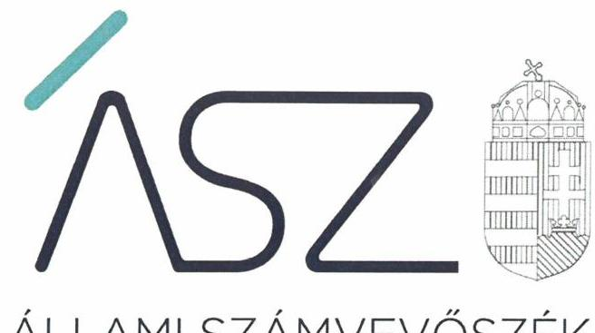
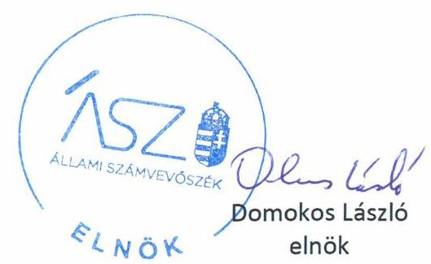

ÁLLAMI SZÁMVEVŐSZÉK

# JELENTÉS 

## Nem állami humánszolgáltatók ellenőrzése

A szociális humánszolgáltatást nyújtó intézmények, szolgáltatók államháztartáson kívüli fenntartói központi költségvetésből kapott támogatásai felhasználásának ellenőrzése Nyírségi Református Egyházmegye
2020.

20125
www.asz.hu

---

ÁLLAMI SZÁMVEVŐSZÉK

# JELENTÉS 

## Nem állami humánszolgáltatók ellenőrzése

A szociális humánszolgáltatást nyújtó intézmények, szolgáltatók államháztartáson kívüli fenntartói központi költségvetésből kapott támogatásai felhasználásának ellenőrzése Nyírségi Református Egyházmegye
2020. 07 hó 08 nap

20125
www.asz.hu

---

# AZ ELLENŐRZÉST FELÜGYELTE: 

KLINGA LÁSZLÓ felügyeleti vezető

## AZ ELLENŐRZÉST VEZETTE ÉS A VÉGREHAJTÁSÁÉRT FELELŐS:

MOLNÁR ZSUZSANNA ellenőrzésvezető

## A PROGRAM ÖSSZEÁLLÍTÁSÁÉRT FELELŐS:

TÓTPÁL SZABOLCS osztályvezető
FEKETE-NAGY ANDRÁS GÁBOR ellenőrzési program készítéséért felelős vezető

IKTATÓSZÁM: EL-2756-001/2020.
TÉMASZÁM: 2491
ELLENŐRZÉS-AZONOSÍTÓ SZÁM: V083571, V0867099

---

# TARTALOMJEGYZÉK 

- ÖSSZEGZÉS ..... 5
- AZ ELLENŐRZÉS CÉLJA ..... 6
- AZ ELLENŐRZÉS TERÜLETE ..... 7
- AZ ELLENŐRZÉS HÁTTERE, INDOKOLTSÁGA ..... 8
- A JELENTÉS LÉNYEGES KÉRDÉSKÖREI ..... 9
- AZ ELLENŐRZÉS HATÓKÖRE ÉS MÓDSZEREI ..... 10
- MEGÁLLAPÍTÁSOK ..... 12
- MELLÉKLETEK ..... 14
I. sz. melléklet: Értelmező szótár ..... 14
- FÜGGELÉK: ÉSZREVÉTELEK ..... 15
- RÖVIDÍTÉSEK JEGYZÉKE ..... 17

---

.

---

# ÖSSZEGZÉS 

A nyíregyházi székhelyű Nyírségi Református Egyházmegye 2015-2018. években szabályszerűen fordította a szociális humánszolgáltatási közfeladatok ellátására kapott költségvetési támogatásokat intézményei müködtetésére.

## Az ellenőrzés társadalmi indokoltsága

A szociális gondoskodást igénylők védelme, illetve a köznevelési feladatok ellátása az Alaptörvényben meghatározott, a társadalom szempontjából fontos tevékenységek. Jogszabályok teszik lehetővé, hogy államháztartáson kívüli szervezetek - így például az egyházi fenntartók, alapítványok, gazdasági társaságok, egyesületek - által fenntartott intézmények is végezzenek köznevelési, szociális és gyermekvédelmi feladatokat. Mindehhez a központi költségvetés évente jelentős összegű támogatással járul hozzá. Az államháztartáson kívüli, humánszolgáltatást végző intézmények az igényelt közpénzekből társadalmilag hasznos, közösségteremtő, közérdekű, illetve közhasznú tevékenységet végeznek, illetve közfeladatokat látnak el.

Az intézményfenntartók ellenőrzésével az Állami Számvevőszék hozzájárul ahhoz, hogy ezen közpénzeket az államháztartáson kívüli szervezetek is ellenőrizhető, átlátható és elszámoltatható módon használják fel a közfeladatok ellátása során. Az ellenőrzések célja továbbá, hogy a nyilvánosság és az igénybevevők megfelelő tájékoztatást kapjanak az államháztartáson kívüli közfeladatot ellátók múködéséről.

Az ÁSZ ellenőrzései arra adnak választ, hogy az intézményfenntartók arra használták-e fel a közpénzeket, amire igényelték.

A szabályszerű gazdálkodás elengedhetetlen a közfeladat ellátás szakmai céljainak megvalósításához, valamint a társadalmi közbizalom fenntartásához.

## Főbb megállapítások, következtetések

A Nyírségi Református Egyházmegye, mint szociális humánszolgáltató közfeladatot ellátó intézmények fenntartója a 2015-2018. években kialakította szabályszerű működési és gazdálkodási környezetét. Biztosította a szociális közfeladat ellátásához kapott költségvetési támogatások elszámolásának szabályszerűségét, megteremtve ezzel a költségvetési támogatások átlátható és elszámoltatható felhasználásának feltételeit.
Kialakította a támogatások felhasználásának elkülönített nyilvántartási rendszerét, nyilvántartásai igazolták, hogy a támogatásokat 2015-2018. években szabályszerűen fordította intézményei működtetésére.

A törvényi előírásoknak megfelelően eleget tett a 2015-2018. években beszámoló készítési kötelezettségének, intézményei működtetéséhez felhasznált közpénzekre vonatkozó gazdálkodásával elszámolt.

---

# AZ ELLENŐRZÉS CÉLJA

**AZ ELLENŐRZÉS CÉLJA** annak értékelése volt, hogy a nem állami, nem önkormányzati szociális intézmények fenntartói központi költségvetésből kapott támogatásainak felhasználása szabályszerű volt-e.

---

# AZ ELLENŐRZÉS TERÜLETE 

## Nyírségi Református Egyházmegye mint intézményfenntartó

A nyíregyházi székhelyű Nyírségi Református Egyházmegye a Magyarországi Református Egyház önálló egyházi jogi személye.

A Fenntartó ${ }^{1}$ 2015-2017. évek között egy, 2018-ban két intézményt ${ }^{2}$ tartott fenn. A Nyírségi Református Egyházmegye Idősek Otthonát Ibrányban két telephelyen, a Tiborszállási Református Idősek Otthonát Tiborszálláson működtette. Az ibrányi idősotthon összesen 71, a tiborszállási idősotthon pedig 95, 2018. május 1-jétől 100 férőhellyel múködött. A Fenntartó az Önkormányzattal³ 2003-ban és az SZGYF-fel ${ }^{4}$ 2018-ban megkötött feladat ellátási megállapodások ${ }^{5}$ alapján idősek bentlakásos ellátását, szociális étkeztetést, házi segítségnyújtást, időskorúak nappali ellátását biztosította, illetve időskorúak gondozóházát múködtette költségvetési támogatás igénybevételével.

Az intézmények önálló jogi személyként múködtek.
A Fenntartó képviseletére az esperes ${ }^{6}$ és az egyházmegyei gondnok ${ }^{7}$ együttesen voltak jogosultak. A Fenntartó képviseletére jogosultak személyében az ellenőrzés időszakában változás nem történt.
A Fenntartó az ellenőrzött időszakban vállalkozási tevékenységet nem folytatott.

A Fenntartó szociális közfeladatok ellátására a MÁK ${ }^{8}$ adatszolgáltatása alapján 2015. évre 103,3 millió Ft, 2016. évre 102,7 millió Ft, 2017. évre 115,8 millió Ft, 2018. évre pedig 270,6 millió Ft költségvetési támogatásban részesült.

---

# **AZ ELLENŐRZÉS HÁTTERE, INDOKOLTSÁGA**

A szociális feladatokat ellátó nem állami intézményfenntartók részére közfeladataik ellátására évente jelentős összegű pénzügyi támogatást biztosítottak a mindenkori költségvetési törvények a bennük megfogalmazott feltételek mellett. A felhasználható állami támogatások a Kvtv.149-ekben a 2015–2018. években a szociális ágazatra vonatkozóan 360 Mrd Ft előirányzatot határoztak meg.

Az ÁSZ10 stratégiájában foglaltak alapján is indokolt az ellenőrzés, amely a társadalom számára jelzi, hogy a közpénz államháztartáson kívüli felhasználása sem maradhat ellenőrizetlenül. Az államháztartáson kívülre nyújtott költségvetési támogatások ellenőrzésével az ÁSZ hozzájárul ahhoz, hogy a közpénzeket a nem állami humán fenntartók átlátható módon használják fel a közfeladatok ellátására kötött szerződésekben vállalt kötelezettségek teljesítése érdekében. Az ellenőrzés javaslataival hozzájárulhat az említett rendszerek szabályszerű támogatás felhasználásához, javíthatja a társadalmi-gazdasági döntések megalapozottságát, amely a *„jól irányított állam”* működéséhez járul hozzá.

---

# A JELENTÉS LÉNYEGES KÉRDÉSKÖREI 

1. A szociális humánszolgáltató közfeladatot ellátó államháztartáson kívüli fenntartó szabályszerű müködési - és gazdálkodási környezet kialakításával megteremtette-e a költségvetési támogatások elszámoltatható igénybevételének, felhasználásának feltételeit?
2. A fenntartó az átvállalt szociális humánszolgáltatási közfeladathoz biztositott költségvetési támogatásokat szabályszerűen for-ditotta-e intézményei müködtetésére? Intézményei müködtetéséhez felhasznált közpénzekre vonatkozó gazdálkodásával elszá-molt-e, ennek érdekében ellenőrzési és a külső ellenőrzésekkel kapcsolatos intézkedési feladatait szabályszerűen látta-e el?

---

# AZ ELLENŐRZÉS HATÓKÖRE ÉS MÓDSZEREI 

## Az ellenőrzés típusa

Megfelelőségi ellenőrzés.

## Az ellenőrzött időszak

A 2015. január 1-je és 2018. december 31-e közötti időszak. 2019. január 1-jétől az utolsó helyszíni szemle időpontjáig (2019. szeptember 26-ig) tartó időszak.

## Az ellenőrzés tárgya

Az ellenőrzés a szociális humánszolgáltatási közfeladatokat ellátó államháztartáson kívüli fenntartók humánszolgáltatási közfeladatai ellátásához a központi költségvetésből kapott támogatásaik humánszolgáltatási közfeladatokra való fenntartó általi felhasználása szabályszerűségének értékelésére terjed ki.

## Az ellenőrzött szervezet

Nyírségi Református Egyházmegye, mint intézményfenntartó.

## Az ellenőrzés jogalapja

Az ellenőrzés jogszabályi alapját az ÁSZ tv. 1. § (3) bekezdésében, az 5. § (3) bekezdésében, valamint az 5 §. (11) bekezdés c) pontjában foglalt előírások adták.

## Az ellenőrzés módszerei

Az ellenőrzést az ellenőrzési program annak szempontjai, kérdései, az ellenőrzött időszakban hatályos jogszabályok, a nemzetközi standardokat irányadónak tekintve, az ellenőrzés szakmai szabályok és módszertanok figyelembevételével rendelte elvégezni.

Az ellenőrzés ideje alatt az ellenőrzött szervezettel történő kapcsolattartás az ÁSZ SZMSZ ${ }^{11}$-ének vonatkozó előírásai alapján történt.

---

Az ellenőrzési kérdések megválaszolásához szükséges bizonyítékok megszerzése az ellenőrzött által rendelkezésre bocsátott dokumentumokra, adatokra alapozva megfigyelés, szemle (szemrevételezés), kérdésfeltevés (információkérés), valamint elemző eljárással történt.

Az ellenőrzési bizonyítékként felhasználható adatforrások közé tartoztak egyrészt az ellenőrzési program részletes szempontjainál felsorolt adatforrások, másrészt minden - az ellenőrzés folyamán feltárt, az ellenőrzés szempontjából információt tartalmazó - dokumentum.

Az ellenőrzés lefolytatásához az ellenőrzött szervezet a kitöltött tanúsítványok, valamint az ÁSZ által kért dokumentumok elektronikus úton való megküldésével szolgáltatott adatokat, információkat. Az így rendelkezésre bocsátott adatok, információk és a tanúsítványok adatai valódiságának kontrollja az ellenőrzés keretében történt. A fenntartott intézményeknél helyszíni szemle keretében győződött meg a tényleges feladatellátásról. (verifikáció)

A szociális humánszolgáltatások központi költségvetési támogatásaival kapcsolatos, államháztartáson kívüli fenntartó jogszabályokban előírt feladatai betartását, továbbá a központi költségvetési támogatások szabályszerű nyilvántartását ellenőrizte az ÁSZ a fenntartónál rendelkezésre álló nyilvántartások, beszámolók és egyéb dokumentumok alapján.

Az ellenőrzés nem terjedt ki a szociális humánszolgáltatások központi költségvetési támogatásai igénylése, módosítása, elszámolása valódiságának, megalapozottságának, helyességének - sem a fenntartónál, sem a székhely intézményeinél való - értékelésére (mivel ennek felülvizsgálata, ellenőrzése a finanszírozó jogszabályban előírt feladata, határozatai kiadása előtt). Továbbá nem terjedt ki az ellenőrzés e források, intézmények általi szabályszerű felhasználásának értékelésére.

---

# MEGÁLLAPÍTÁSOK 

## 1. A szociális humánszolgáltató közfeladatot ellátó államháztartáson kívüli fenntartó szabályszerű múködési - és gazdálkodási környezet kialakításával megteremtette-e a költségvetési támogatások elszámoltatható igénybevételének, felhasználásának feltételeit?

Összegző megállapítás

A Fenntartó a 2015-2018. években szabályszerű múködési - és gazdálkodási környezetet alakított ki, ezáltal megteremtette a költségvetési támogatások elszámoltatható igénybevételének, felhasználásának feltételeit. Intézményei múködési kereteinek szabályszerű kialakításáról gondoskodott.

A Fenntartó rendelkezett Alapító okirattal ${ }^{12}$, amelyben a jogszabály által előírt kötelező tartalmi elemeken kívül meghatározta szervezeti felépítését, múködési rendjét, a felelősségi és hatásköröket és azok gyakorlásának módját, továbbá a helyettesítés rendjét is. A Fenntartó közfeladat ellátásának szervezeti keretei, irányítási rendszere, illetve annak múködése - a jogszabályi előírások szerint - meghatározásra kerültek belső egyházi alkotmányban ${ }^{13}$.

A Fenntartó törvényi előírás alapján rendelkezett számviteli politikával ${ }^{14}$ és elkészítette az eszközök és a források leltárkészítési és leltározási szabályzatát ${ }^{15}$, az eszközök és a források értékelési szabályzatát ${ }^{16}$, valamint pénzkezelési szabályzatát ${ }^{17}$.

A Fenntartó intézményei tevékenységét, könyvvezetési és beszámolókészítési kötelezettségét a jogszabályi előírások szerint meghatározta, szervezetének és múködési szabályainak kialakításáról gondoskodott. Meghatározta a jogszabályok előírása szerint az intézményi térítési díjakat.

---

# 2. A fenntartó az átvállalt szociális humánszolgáltatási közfeladathoz biztosított költségvetési támogatásokat szabályszerűen for-dította-e intézményei múködtetésére? Intézményei múködtetéséhez felhasznált közpénzekre vonatkozó gazdálkodásával el-számolt-e, ennek érdekében ellenőrzési és a külső ellenőrzésekkel kapcsolatos intézkedési feladatait szabályszerűen látta-e el? 

Összegző megállapítás

A Fenntartó a szociális közfeladat ellátására 2015-2018. években kapott támogatásokat szabályszerűen fordította intézményei múködtetésére. A felhasznált közpénzekre vonatkozó gazdálkodásával elszámolt.

A Fenntartó a szociális közfeladat ellátására 2015-2018. években kapott támogatások teljes összegét a törvény által előírt határidőben átadta intézményeinek. A szociális közfeladat ellátására továbbutalási céllal kapott támogatásokat intézményenként a jogszabályi előírások alapján elkülönítve tartotta nyilván.

A Fenntartó minden évben elfogadta intézményei gazdálkodásáról szóló beszámolóit.

A Fenntartó intézményeinél 2016-ban a Kormányhivatal ${ }^{18}$ és a SzSzBM RFK ${ }^{19}$ által, 2017-ben a Kormányhivatal által, valamint 2018-ban a katasztrófavédelmi hatóság ${ }^{20}$ által lefolytatott ellenőrzésekhez kapcsolódó intézkedési kötelezettségének eleget tett.

A Fenntartó törvényben előírt beszámolási kötelezettségének a 2015-2018. években számviteli beszámolói elkészítésével eleget tett.

---

# MELLÉKLETEK 

- I. SZ. MELLÉKLET: ÉRTELMEZŐ SZÓTÁR
humánszolgáltatás
költségvetési támogatás
nem állami, nem önkormányzati (államháztartáson kívüli) intézmény fenntartó

Külön törvényben meghatározott szociális, gyermekjóléti, gyermekvédelmi, közoktatási, felsőoktatási, kulturális közfeladatok (2014. évi Kvtv. 34. § (1), (4) bekezdés, 1. számú melléklet XX/20/2. alcím, 19. alcím, 2015. évi Kvtv. 43. § (1), (4) bekezdés, 1. számú melléklet XX/20/2/3. jogcím csoport, 19. alcím, 2016. évi Kvtv. 41. § (1), (4) bekezdés, 1. számú melléklet XX/20/2/3. jogcím csoport, 19. alcím, 2017. évi Kvtv. 41. § (1) bekezdés, 1. számú melléklet XX/20/2/3. jogcím csoport, 19. alcím)

A társadalombiztosítás pénzügyi alapjai kivételével az államháztartás központi alrendszeréből ellenérték nélkül, pénzben nyújtott támogatások (Áht. ${ }^{21}$ 1. § 14. pont) A költségvetési törvényekben (2014. évi C. törvény 42-43. §, 2015. évi C. törvény 4041. §, 2016. évi XC. törvény 40-41. §, 2017. évi C. törvény 40-41. §) megállapított támogatás.
A köznevelési közfeladatokat/humánszolgáltatásokat ellátó intézményt fenntartó egyházi jogi személy, társadalmi szervezet, alapítvány, közalapítvány, civil szervezet, országos nemzetiségi önkormányzat, nonprofit gazdasági társaság, gazdasági társaság és a humánszolgáltatást alaptevékenységként végző, Szja tv. ${ }^{22}$ hatálya alá tartozó egyéni vállalkozó.
(2014. évi Kvtv. 43. § (1) bekezdés, 2015. évi Kvtv. 41. § (1), bekezdés, 2016. évi Kvtv. 41. § (1) bekezdés, 2017. évi Kvtv. 41. § (1) bekezdés)

---

# FÜGGELÉK: ÉSZREVÉTELEK 

A jelentéstervezetet a Számvevőszék 15 napos észrevételezésre megküldte az ellenőrzött szervezet vezetőinek az ÁSZ tv. 29. §* (1) bekezdése előírásának megfelelően.

A Nyírségi Református Egyházmegye esperese és egyházmegyei gondnoka írásban jelezte, hogy a jelentéstervezet megállapításaira észrevételt nem tesz.

[^0]
[^0]:    * 29. § (1) Az Állami Számvevőszék az ellenőrzési megállapításait megküldi az ellenőrzött szervezet vezetőjének vagy az általa megbízott személynek, és annak, akinek személyes felelősségét állapította meg.
    (2) Az ellenőrzött szervezet vezetője és a felelősként megjelölt személy az ellenőrzés megállapításaira tizenöt napon belül írásban észrevételt tehet.
    (3) Az Állami Számvevőszék az észrevételre a beérkezésétől számított harminc napon belül írásban válaszol. A figyelembe nem vett észrevételeket köteles a jelentésben feltüntetni, és megindokolni, hogy azokat miért nem fogadta el.

---

.

---

# RÖVIDÍTÉSEK JEGYZÉKE 

${ }^{1}$ Fenntartó
${ }^{2}$ intézmények ${ }_{1,2}$
${ }^{3}$ Önkormányzat
${ }^{4}$ SZGYF
${ }^{5}$ feladat ellátási megállapodások ${ }_{1,2}$

## ${ }^{6}$ esperes

${ }^{7}$ egyházmegyei gondnok
${ }^{8}$ MÁK
${ }^{9} \mathrm{Kvtv}_{-1-4}$

## ${ }^{10}$ ÁSZ

${ }^{11}$ SZMSZ
${ }^{12}$ alapító okirat
${ }^{13}$ belső egyházi alkotmány
${ }^{14}$ Egyházmegye Számviteli Politika
${ }^{15}$ eszközök és a források leltárkészítési és leltározási szabályzata
${ }^{16}$ eszközök és a források értékelési szabályzata
${ }^{17}$ pénzkezelési szabályzat
${ }^{18}$ Kormányhivatal
${ }^{19}$ SZSzBM RFK
${ }^{20}$ katasztrófavédelmi hatóság
${ }^{21}$ Áht.
${ }^{22}$ Szja tv.

Nyírségi Református Egyházmegye
1: Nyírségi Református Egyházmegye Idősek Otthona, Ibrány, Lehel utca 43-45. Telephelye: Ibrány, Lehel utca 47.
2: Tiborszállási Református Idősek Otthona, Tiborszállás, Vadaskert 1.
Ibrány Város Önkormányzata
Szociális és Gyermekvédelmi Főigazgatóság
1: Idősotthon fenntartói jogának átadásáról szóló, 2003. december 16. napján kelt megállapodás módosításokkal egységes szerkezetben (hatályos: 2016. november 28tól)
2: Keret megállapodás az SZGYF fenntartásában lévő Szabolcs-Szatmár-Bereg Megyei „Harmónia" Egyesített Szociális Intézmény által ellátott szociális szakosított ellátási feladatellátás-átvételéről (hatályos: 2018. január 1-jétől)
A Nyírségi Református Egyházmegye esperese
A Nyírségi Református Egyházmegye egyházmegyei gondnoka
Magyar Államkincstár
Kvtv.1: Magyarország 2015. évi központi költségvetéséről szóló 2014. évi C. törvény (hatályos: 2015. január 1-jétől 2018. december 31-éig)
Kvtv.2: Magyarország 2016. évi központi költségvetéséről szóló 2015. évi C. törvény (hatályos: 2015. július 4-étől)
Kvtv.3: Magyarország 2017. évi központi költségvetéséről szóló 2016. évi XC. törvény (hatályos: 2016. november 1-jétől)
Kvtv.4: Magyarország 2018. évi központi költségvetéséről szóló 2017. évi C. törvény (hatályos: 2017. november 1-jétől)
Állami Számvevőszék
Szervezeti és Működési Szabályzat
Szent Teréz Segítő Kezek Alapítvány az Időskorúak Gondozásáért Alapítvány Ala-pító Okirata a 2014. május 27-én kelt, valamint az azt megelőző módosításokkal egységes szerkezetben (hatályos 2014. május 27-től)
1994. évi II. törvény a Magyarországi Református Egyház Alkotmányáról és Kormányzatáról (hatályos: 1995. január 1-jétől)
Nyírségi Református Egyházmegye Számviteli Politika (hatályos 2014. december 18-tól)
Nyírségi Református Egyházmegye Leltározási szabályzat (hatályos 2014. december 18-tól)
Nyírségi Református Egyházmegye Eszközök és források értékelési szabályzat (hatályos 2014. december 18-tól)
Nyírségi Református Egyházmegye Pénzkezelési szabályzat (hatályos 2014. december 18-ától)
Szabolcs-Szatmár-Bereg Megyei Kormányhivatal
Szabolcs-Szatmár-Bereg Megyei Rendőrfőkapitányság Rendészeti Igazgatóság, Igazgatásrendészeti osztály
Szabolcs-Szatmár-Bereg Megyei Katasztrófavédelmi Igazgatóság Kisvárdai Katasztrófavédelmi Kirendeltsége
2011. évi CXCV. törvény az államháztartásról (hatályos: 2011. december 31-től)
1995. évi CXVII. törvény - a személyi jövedelemadóról (hatályos: 1996. január 1-jétől)

---

# ASZ 

ALLAMI SZAMVEVOSZEK
1052 Budapest, Apáczai Cs. J. u. 10. I 1364 Budapest 4. Pf. 54
TEL: +36 14849100
email: szamvevoszek@asz.hu
web: www.asz.hu | www.aszhirportal.hu