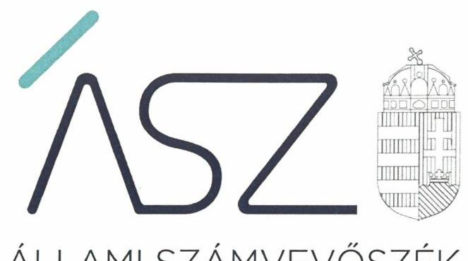
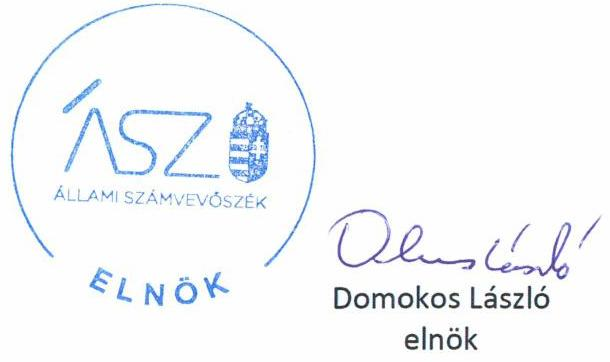
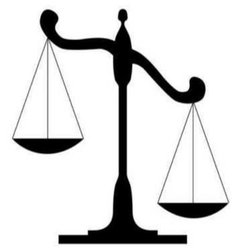
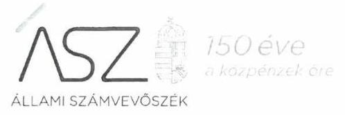
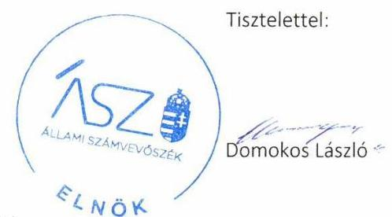
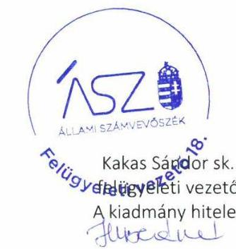

ÁLLAMI SZÁMVEVŐSZÉK

# JELENTÉS

A költségvetési támogatásban részesülő pártalapítványok 2017-2018. évi gazdálkodása törvényességének ellenőrzése

A Liberális Magyarországért Alapítvány

2020.

20128
www.asz.hu

---

ÁLLAMI SZÁMVEVŐSZÉK

# JELENTÉS

A költségvetési támogatásban részesülő pártalapítványok 2017-2018. évi gazdálkodása törvényességének ellenőrzése

A Liberális Magyarországért Alapítvány

2020. 07. hó 02. nap

20128
www.asz.hu

---

# AZ ELLENŐRZÉST FELÜGYELTE: 

KAKAS SÁNDOR felügyeleti vezető

## AZ ELLENŐRZÉST VEZETTE ÉS A VÉGREHAJTÁSÁÉRT FELELŐS:

GÁL MAGDOLNA ellenőrzésvezető

## A PROGRAM ÖSSZEÁLLÍTÁSÁÉRT FELELŐS:

BERTALAN RUDOLF GYULA projektvezető

## A TÉMÁHOZ KAPCSOLÓDÓ KORÁBBI SZÁMVEVŐSZÉKI JELENTÉSEK:

- címe: Jelentés - A költségvetési támogatásban részesülő pártalapítványok 2015-2016. évi gazdálkodása törvényességének ellenőrzése - A Liberális Magyarországért Alapítvány
- sorszáma: 18187

IKTATÓSZÁM: EL-2766-001/2020
TÉMASZÁM: 2521
ELLENŐRZÉS-AZONOSÍTÓ SZÁM: V086506

---

# TARTALOMJEGYZÉK 

■ ÖSSZEGZÉS ..... 5
■ AZ ELLENŐRZÉS CÉLJA ..... 6
■ AZ ELLENŐRZÉS TERÜLETE ..... 7
■ AZ ELLENŐRZÉS HÁTTERE, INDOKOLTSÁGA ..... 8
■ A JELENTÉS LÉNYEGES KÉRDÉSKÖREI ..... 9
■ AZ ELLENŐRZÉS HATÓKÖRE ÉS MÓDSZEREI ..... 10
■ MEGÁLLAPÍTÁSOK ..... 13
■ JAVASLATOK ..... 16
■ MELLÉKLETEK ..... 17
I. sz. melléklet: Értelmező szótár ..... 17
II. sz. melléklet a 18187. számú számvevőszéki jelentéshez kapcsolódó intézkedési terv végrehajtásának értékelése ..... 18
■ FÜGGELÉK: ÉSZREVÉTELEK ..... 21
■ RÖVIDÍTÉSEK JEGYZÉKE ..... 31

---

.

---

# ÖSSZEGZÉS 

A Liberális Magyarországért Alapítvány a 2017-2018. években a könyvvezetése és gazdálkodása során a vonatkozó törvényi rendelkezéseket nem tartotta be. A 2017-2018. évi egyszerüsített éves beszámolóit leltárral nem támasztotta alá, ezáltal nem biztosította az átlátható, elszámoltatható gazdálkodást.

## Az ellenőrzés társadalmi indokoltsága

A Párt tv. 9/A § (1) bekezdése alapján a politikai kultúra fejlesztése érdekében tudományos, ismeretterjesztő, kutatási, oktatási tevékenység folytatása céljából létrehozott pártalapítványok gazdálkodása törvényességének ellenőrzése - Pártalapítványi tv. 4. § (2) bekezdése értelmében - az ÁSZ¹ feladata. E törvény 4. § (4) bekezdése alapján az ÁSZ kétévente - kötelező jelleggel - ellenőrzi azoknak a pártalapítványoknak a gazdálkodását, amelyek állami költségvetési támogatásban részesültek.

Az ÁSZ, mint az Országgyűlés ellenőrző szerve a pártalapítványok gazdálkodása törvényességének/szabályszerúségének értékelésével hozzájárul ahhoz, hogy a társadalom objektív képet alkothasson a pártalapítványok működéséről. A jelentésben foglalt megállapítások, következtetések és javaslatok alapján a törvényalkotók konkrét lépéseket tehetnek a pártalapítványokra vonatkozó szabályozások megváltoztatása, átláthatóbbá, ellenőrizhetőbbé tétele irányába. Az ellenőrzött szervezetek szintjén a hiányosságok, szabálytalanságok feltárása, az ennek kapcsán megfogalmazott megállapítások elősegíthetik a pártalapítványok szabályszerű gazdálkodását.

Az ÁSZ stratégiájában megfogalmazta, hogy az államháztartáson kívülre nyújtott költségvetési támogatások és az ingyenes vagyonjuttatás ellenőrzésével hozzájárul ahhoz, hogy a közpénzeket a civil szervezetek is átlátható módon használják fel. A pártalapítványok gazdálkodása szabályszerűségének bemutatásával az ellenőrzés értékteremtő módon járul hozzá az ÁSZ stratégiai céljainak megvalósításához, a nyilvánosság megfelelő tájékoztatásához.

Az ÁSZ 2018. évben ellenőrizte a Pártalapítvány² 2015-2016. évi gazdálkodását.

## Főbb megállapítások, következtetések, javaslatok

A Liberális Magyarországért Alapítvány a 2017-2018. években a könyvvezetése és gazdálkodása során nem tartotta be a vonatkozó törvényi rendelkezéseket. A Liberális Magyarországért Alapítvány ráfordításainak elszámolása nem volt szabályszerű, a kiadásokat alátámasztó bizonylatok nem tartalmazták az utalványozó és a rendelkezés végrehajtását igazoló személy aláírását, az érintett könyvviteli számlákra történő hivatkozást. A Liberális Magyarországért Alapítvány 2018. évben gazdasági eseményt bizonylat nélkül rögzített a könyvviteli nyilvántartásba, a kötelezettségek között olyan tételeket mutatott ki, amelyek kifizetésre kerültek.

A Liberális Magyarországért Alapítvány egyszerűsített éves beszámolói nem feleltek meg a jogszabályi előírásoknak, az egyszerűsített éves beszámolók mérleg tételeinek alátámasztásához nem állított össze leltárt. A Liberális Magyarországért Alapítvány a 2017. évi tevékenységéről szóló éves jelentése közzétételi kötelezettségének nem tett eleget.

A Liberális Magyarországért Alapítvány a 2015-2016. évi gazdálkodás ellenőrzéséről szóló számvevőszéki jelentés alapján készített intézkedési tervét végrehajtotta.

Az Állami Számvevőszék a jelentésben foglalt megállapítások alapján a Liberális Magyarországért Alapítvány kuratóriumi elnöke részére öt javaslatot fogalmazott meg.

---

# AZ ELLENŐRZÉS CÉLJA 

Az ellenőrzés célja annak megállapítása volt, hogy a pártalapítvány törvényesen gazdálkodott-e, az éves számviteli beszámolók és a pártalapítvány tevékenységéről szóló éves jelentések a jogszabályi előírásoknak megfeleltek-e, a könyvvezetés és gazdálkodás során a vonatkozó jogszabályi rendelkezéseket és belső előírásokat betartották-e.

Az ellenőrzés célja továbbá annak értékelése volt, hogy az előző számvevőszéki jelentésben foglalt megállapításokkal összhangban készített intézkedési tervben meghatározott feladatokat az ellenőrzött szervezet végrehaj-totta-e.

---

# AZ ELLENŐRZÉS TERÜLETE 

## A Liberális Magyarországért Alapítvány

Az ellenőrzés a Párt tv. ${ }^{3}$ alapján a politikai kultúra fejlesztése érdekében tudományos, ismeretterjesztő, kutatási, oktatási tevékenység folytatása céljából, a Ptk. ${ }^{4}$ szerinti létesítő/alapító okiraton alapuló bírósági nyilvántartásba vétellel létrejött pártalapítványok gazdálkodására terjedt ki.

A pártalapítványok törvényes gazdálkodásának (könyvvezetése, beszámolása, jelentéstétele) szabályait alapvetően a Pártalapítványi tv. ${ }^{5}$-en túl, a Számv. tv. ${ }^{6}$ és annak a végrehajtási rendelete a Számviteli vhr. ${ }^{7}$ határozták meg.

Az utóellenőrzés az ÁSZ tv. ${ }^{8}$ 2011. július 1-jei hatálybalépését követően a pártalapítványnál 2018. évben végzett ellenőrzés alapján készített 18187. számú jelentésben foglalt megállapítások alapján készített intézkedési tervben foglaltak végrehajtásának ellenőrzésére terjedt ki.

A Magyar Liberális Párt - a Párt tv-ben és a Pártalapítványi tv-ben biztosított lehetőséggel élve - 2014. szeptember 29-én hozta létre A Liberális Magyarországért Alapítványt, amelyet a Szolnoki Törvényszék 16-01-0001190 számon, 2014. szeptember 30-án vett nyilvántartásba. Az induló vagyon összegét az Alapító ${ }^{9} 0,2$ millió Ft-ban határozta meg, mely az ellenőrzött időszakban nem változott.

Döntéshozó, képviselő és vagyonkezelő szerve a Kuratórium ${ }^{10}$ volt, amely az alapításkor és az ellenőrzött időszak végéig három választott tisztségviselőből állt.

A Pártalapítvány Alapító okirat ${ }^{11}$ szerinti célja a demokratikus értékek terjesztése és fenntartása, a liberális gondolat erősítése és támogatása, az alapvető emberi jogok és az egyéni szabadságjogok védelme.

A Pártalapítvány 2017.évben, valamint 2018. év első két negyedévében a Párt tv. 9/A. § (2)-(3) bekezdése alapján jogosult volt a költségvetésből juttatott támogatásra. A Pártalapítvány tevékenységének ellátásához a Kvtv. ${ }^{12}$-ben foglalt adatok alapján 2017.évben 4,3 millió Ft, a Kvtv. ${ }^{13}$, valamint a Kormány 124/2018 (V.25.) Korm. határozata ${ }^{14}$ alapján a 2018. évben 2,15 millió Ft költségvetési támogatásban részesült.

A Pártalapítvány az ellenőrzött időszakban nem volt más jogalany korlátlan felelősségű tagja, illetve nem létesített alapítványt és nem csatlakozott más alapítványhoz.

A Pártalapítvány az ellenőrzött időszakban gazdasági-vállalkozási tevékenységet nem végzett.

---

# AZ ELLENŐRZÉS HÁTTERE, INDOKOLTSÁGA 

Társadalmi elvárás a közpénzek értékelvű, rendeltetésszerű felhasználása, a közpénzekből nyújtott támogatások átláthatóságának megteremtése, amelyhez az ÁSZ az államháztartásból nyújtott támogatások ellenőrzésével kíván hozzájárulni. A Párt tv. 9/A § (1) bekezdése alapján a politikai kultúra fejlesztése érdekében tudományos, ismeretterjesztő, kutatási, oktatási tevékenység folytatása céljából létrehozott pártalapítványok gazdálkodása törvényességének ellenőrzése - Pártalapítványi tv. 4. § (2) bekezdése értelmében - az ÁSZ feladata. E törvény 4. § (4) bekezdése alapján az ÁSZ kétévente - kötelező jelleggel - ellenőrzi azoknak a pártalapítványoknak a gazdálkodását, amelyek állami költségvetési támogatásban részesültek.

Az ÁSZ, mint az Országgyűlés ellenőrző szerve a pártalapítványok gazdálkodása törvényességének/szabályszerűségének értékelésével hozzájárul ahhoz, hogy a társadalom objektív képet alkothasson a pártalapítványok működéséről. Az ellenőrzés eredményeinek célzott felhasználói a nyilvánosság, a jogalkotó, továbbá a pártalapítványok esetén azok alapítója és szervei. A jelentésben foglalt megállapítások, következtetések és javaslatok alapján a törvényalkotók konkrét lépéseket tehetnek a pártalapítványokra vonatkozó szabályozások megváltoztatása, átláthatóbbá, ellenőrizhetőbbé tétele irányába. Az ellenőrzött szervezetek szintjén a hiányosságok, szabálytalanságok feltárása, az ennek kapcsán megfogalmazott megállapítások elősegíthetik a pártalapítványok szabályszerű gazdálkodását.

Az ÁSZ tv. 33. § (1) bekezdése értelmében az ellenőrzött szervezet vezetője köteles a jelentésben foglalt megállapításokhoz kapcsolódó intézkedési tervet összeállítani, és azt a jelentés kézhezvételétől számított harminc napon belül az ÁSZ részére megküldeni.

Az ÁSZ tv. 33. § (6) bekezdése értelmében, amennyiben az ÁSZ elnöke az ellenőrzés során feltárt jogszabálysértő gyakorlat, illetve a vagyon rendeltetésellenes vagy pazarló felhasználásának megszüntetése érdekében figyelemfelhívó levéllel fordult az ellenőrzött szerv vezetőjéhez, az abban foglaltakat az ellenőrzött szerv vezetője köteles elbírálni, a megfelelő intézkedést megtenni és erről az ÁSZ elnökét értesíteni.

Az ÁSZ által befogadott intézkedési tervben foglaltak megvalósítását az ÁSZ törvény 33. § (7) bekezdésében foglaltak alapján - az ÁSZ utóellenőrzés keretében ellenőrizheti. Az utóellenőrzések keretében - az intézkedések értékelése során - az ÁSZ figyelembe veszi az ellenőrzött szervezetek működési feltételeiben, valamint a jogszabályi előírásokban bekövetkezett változásokat.

---

# A JELENTÉS LÉNYEGES KÉRDÉSKÖREI 

1. A Liberális Magyarországért Alapítvány gazdálkodásának törvényessége biztositott volt-e?
2. A Liberális Magyarországért Alapítvány könyvvezetése és gazdálkodása során a vonatkozó jogszabályi rendelkezéseket és belső elöírásokat betartották-e?
3. A Liberális Magyarországért Alapítvány tevékenységéről szóló éves jelentések, az éves számviteli beszámolók a jogszabályi elöírásoknak megfeleltek-e?
4. A Liberális Magyarországért Alapítvány az intézkedési tervben meghatározott feladatokat végrehajtotta-e?

---

# AZ ELLENŐRZÉS HATÓKÖRE ÉS MÓDSZEREI 

## Az ellenőrzés típusa

Szabályszerúségi ellenőrzés.

## Az ellenőrzött időszak

2017-2018. évek.
Az utóellenőrzés tekintetében a 18187. számú számvevőszéki jelentés közzétételének napjától (2018. július 30.) a kiértesítő levél keltéig (2019. október 29.) tartó időszak.

## Az ellenőrzés tárgya

Az ellenőrzés tárgyát képezi a pártalapítvány gazdálkodása, a könyvvezetés szabályozása és gyakorlata szabályszerűsége, az éves számviteli beszámolókra és az alapítvány tevékenységéről szóló éves jelentésekre vonatkozó kötelezettség teljesítése, valamint a gazdálkodáshoz kapcsolódó ellenőrzések javaslatainak hasznosítására irányuló tevékenység.

Az ellenőrzés kiterjedt minden olyan körülményre és adatra, amely az ÁSZ jogszabályban meghatározott feladatainak teljesítéséhez, valamint a program végrehajtása folyamán felmerült újabb összefüggések feltárásához szükséges.

## Az ellenőrzött szervezet

A Liberális Magyarországért Alapítvány

## Az ellenőrzés jogalapja

Az ÁSZ tv. 1. § (3) bekezdése, 5. § (3) bekezdése, 33. § (7) bekezdése, a Pártalapítványi tv. 4. § (2) és (4) bekezdései.

## Az ellenőrzés módszerei

Az ellenőrzést az ÁSZ az Ellenőrzési program szempontjai, az ellenőrzött időszakban hatályos jogszabályok, a jelen ellenőrzésre irányadó ÁSZ módszertan figyelembe vételével végezte el.

Az ellenőrzés ideje alatt az ellenőrzött szervezettel történő kapcsolattartás az ÁSZ SZMSZ ${ }^{15}$-ének vonatkozó előírásai alapján történt.

---

Az ellenőrzést az ÁSZ az ellenőrzött szervezet által rendelkezésre bocsátott dokumentumokra, adatokra alapozta. A rendelkezésre bocsátott adatok, információk kontrollja az ellenőrzés keretében történt. Az ellenőrzés céljának eléréséhez szükséges bizonyítékok megszerzése az egyes adatok közvetlen, részletes elemzésével történt a következő ellenőrzési eljárások alkalmazásával: mintavétel, valamint elemző eljárás.

Mintavétellel ellenőrizte az ÁSZ a pártalapítvány 2017. évi kiadásai, ráfordításai elszámolásának szabályszerűségét.

A pártalapítvány 2018. évi kiadásai, ráfordításai elszámolásának, valamint az alapítvány 2017-2018. évi beszámolóinál a mérlegtételek besorolása, év végi értékelése, azok leltárral való alátámasztottsága szabályszerűsége esetében tételes ellenőrzésre került sor.

A mintavétellel ellenőrzött területek esetében minden egyes tétel vonatkozásában a szabályszerűségre vonatkozó kérdéseket tett fel az ÁSZ. Szabályszerúnek minősült egy ellenőrzött területet, amennyiben 95\%-os bizonyossággal az ellenőrzött sokaságban az átlagos hibaarány legfeljebb 10\%, nem szabályszerűnek, amennyiben 10\%-nál magasabb arányt képviselt.

Abban az esetben, ha az ellenőrzött sokaság tekintetében a 10\%-os hibaarányhoz való viszony megítélésnek megbízhatósága nem érte el a 95\%ot, annak elérése érdekében az értékelést további szempontokkal egészítette ki az ÁSZ, és figyelembe vette a feltárt hibák értékét.

Az ellenőrzési bizonyítékként felhasználható adatforrások közé tartoztak egyrészt az Ellenőrzési program részletes szempontjainál felsorolt adatforrások, másrészt minden egyéb -az ellenőrzés folyamán - feltárt, az ellenőrzés szempontjából információt tartalmazó dokumentum.

Az ellenőrzés lefolytatásához az ellenőrzött a tanúsítványok kitöltésével, valamint az ÁSZ által kért dokumentumok elektronikus megküldésével szolgáltatott adatokat. Az így rendelkezésre bocsátott adatok, információk, a tanúsítványok adatai valódiságának kontrollja az ellenőrzés keretében történt.

Az utóellenőrzés megállapításait az ÁSZ rendelkezésére álló dokumentumok, valamint az ÁSZ adatbekérése szerint, az ellenőrzött szervezetek által elektronikusan rendelkezésre bocsátott dokumentumok, adatok alapján értékelte. Az ÁSZ az ellenőrzés során az intézkedési tervekben előírt feladatokat, azok végrehajthatósága, illetve végrehajtása szempontjából az alábbiak szerint értékelte:
„határidőben végrehajtott" a feladat, ha a teljesítés dokumentáltan, az intézkedési tervben elöirt határidőben és tartalommal megtörtént;
„határidőn túl végrehajtott" a feladat, ha annak teljesítése az intézkedési tervben meghatározott módon, de az abban előírt határidőn túl történt meg;
„nem végrehajtott" a feladat, ha a végrehajtás nem történt meg, vagy amennyiben a teljesítést/végrehajtást nem dokumentálták, dokumentumokkal nem tudták igazolni annak teljesítését;
„okafogyottá vált" a feladat, ha végrehajtására - meghatározott esemény bekövetkezése, továbbá külső körülmény, a múködést

---

érintő feltétel változása miatt - már nem volt szükség, illetve lehetőség, és egyértelműen megállapítható, hogy az intézkedést szükségessé tevő körülmény a jövőben nem fordulhat elő;
„nem időszerű" az a feladat, amelynek ellenőrzési időszakon belüli végrehajtására azért nem került (kerülhetett) sor, mert az intézkedés alapjául szolgáló esemény nem következett be, de annak jövőbeni előfordulása lehetséges, a végrehajtása nem volt esedékes, vagy a végrehajtás határideje még nem járt le.

---

# 1. A Liberális Magyarországért Alapítvány gazdálkodásának törvényessége biztosított volt-e? 

## Összegző megállapítás

A Pártalapítvány a gazdálkodásának szabályozási környezetét kialakította.

Az Alapító okirat a Párt tv., a Pártalapítványi tv. és a Ptk. rendelkezéseivel összhangban rögzítette az alapítványi célokat, fő tevékenységeket, a Pártalapítvány céljára rendelt vagyont - 0,2 millió Ft összegben - és annak felhasználási módját, a Kuratórium tagjainak kijelölését, a gazdálkodással kapcsolatos feladatokat, a döntési hatáskört és a képviseleti jog gyakorlását.

A Pártalapítvány kialakította a Számv. tv-ben előírt Számviteli politikát ${ }^{16}$, annak keretében elkészítette a Leltározási szabályzatot ${ }^{17}$, az Értékelési szabályzatot ${ }^{18}$ és a Pénzkezelési szabályzatot ${ }^{19}$, továbbá elkészítette a Számlarendjét ${ }^{20}$.

## 2. A Liberális Magyarországért Alapítvány könyvvezetése és gazdálkodása során a vonatkozó jogszabályi rendelkezéseket és belső előírásokat betartották-e?

## Összegző megállapítás

A Pártalapítvány a könyvvezetése és gazdálkodása során nem tartotta be a vonatkozó jogszabályi rendelkezéseket.

A Pártalapítvány ráfordításainak elszámolása 2017. és 2018. évben nem volt szabályszerű:
$\longrightarrow$ a kiadásokat alátámasztó bizonylatok nem feleltek meg a Számv. tv. 167. §. (1) bekezdés c) pontjában előírt követelménynek, mert nem tartalmazták az utalványozó és a rendelkezés végrehajtását igazoló személy aláírását, a Számv. tv. 167. § (1) bekezdés h) pontjában foglaltak ellenére a bizonylatokon nem tüntették fel valamennyi érintett könyvviteli számlára történő hivatkozást,
$\longrightarrow$ a Pártalapítvány a Számv. tv. 165. § (2) bekezdése ellenére 2018. évben gazdasági eseményt bizonylat nélkül rögzített a könyvviteli nyilvántartásba, mivel a könyvelés dátuma megelőzte a bizonylat kiállításának dátumát,
$\longrightarrow$ a Pártalapítvány 2018. évben a Számv. tv. 42. § (1) bekezdésében foglaltak ellenére a kötelezettségek (tartozások) között olyan tételeket mutatott ki, amelyek ellenértéke készpénzfizetési számlával igazoltan kifizetésre került,

---

$\longrightarrow$ a Pártalapítvány megsértette a Számv. tv. 18. §-ában foglalt előírást, mivel a 2018. évi egyszerűsített éves beszámolóban 2017. évben felmerült ráfordítást mutatott ki.
A Pártalapítvány az ellenőrzött időszakban harmadik fél részére támogatást nem nyújtott.

A Pártalapítvány a 2017-2018. években az alapító párt részére vagyoni hozzájárulást nem nyújtott.

# 3. A Liberális Magyarországért Alapítvány tevékenységéről szóló éves jelentések, az éves számviteli beszámolók a jogszabályi előírásoknak megfeleltek-e? 

## Összegző megállapítás

A Pártalapítvány egyszerűsített éves beszámolói nem feleltek meg a jogszabályi előírásoknak.

A Pártalapítvány a Számv. tv. 69. § (1) bekezdésének előírása ellenére a 2017. évi és 2018. évi egyszerűsített éves beszámolók mérleg tételeinek alátámasztásához nem állított össze leltárt.

A Számv. tv. 18. § előírása ellenére a Pártalapítvány 2017. évi és 2018. évi egyszerűsített éves beszámolói - a ráfordítások elszámolásával összefüggésben feltárt szabálytalanságok, valamint a leltár hiánya miatt - a Pártalapítvány vagyoni, pénzügyi és jövedelmi helyzetéről és azok változásáról nem mutattak megbízható és valós képet.

A Pártalapítvány leltárral, és szabályszerű könyvvezetéssel alá nem támasztott 2017. évi és 2018. évi egyszerűsített éves beszámolót helyezett letétbe és tett közzé.

A Pártalapítvány a Pártalapítványi tv. 3/A. § (5) előírása ellenére a 2017. évi tevékenységéről szóló éves jelentésének közzétételi kötelezettségét nem teljesítette, a 2018. évi éves jelentését közzétette.

## 4. A Liberális Magyarországért Alapítvány az intézkedési tervben meghatározott feladatokat végrehajtotta-e?

## Összegző megállapítás

A Pártalapítvány az intézkedési tervben rögzített feladatokat határidőben végrehajtotta.

A 18187. számú számvevőszéki jelentésben ${ }^{21}$ megfogalmazott intézkedést igénylő megállapításokhoz a Kuratórium által - az ÁSZ tv-ben rögzített határidőben - elkészített intézkedési tervben vállalt négy intézkedést az abban megjelölt határidőben végrehajtotta:
$\longrightarrow$ A Pártalapítvány intézkedett az Info tv. ${ }^{22}$-ben előírtak érvényre juttatásához szükséges eljárási szabályok kialakításáról, mert elkészítette és elfogadta az Adatvédelmi és Adatkezelési Szabályzatot ${ }^{23}$.
$\longrightarrow$ A Pártalapítvány intézkedett a Számv. tv-ben és Számviteli vhr ${ }_{2}$-ben előírt olyan nyilvántartási rendszer kialakításáról, amely a biztosítja, hogy a Pártalapítványi tv. előírásainak megfelelően a közpénzek felhasználásával kapcsolatos információk rendelkezésre álljanak.

---

- A Pártalapítvány intézkedett a Pártalapítvány tevékenységéről szóló 2018. évi jelentés Pártalapítványi tv. szerinti közzétételéről.
- A Pártalapítvány intézkedett a Számv. tv-ben előírt egyszerűsített éves beszámolók elkészítéséről.
Az intézkedési tervben meghatározott feladatokat, határidőket, felelősöket és a feladatok végrehajtását a II. számú melléklet mutatja be.

---

# JAVASLATOK 

Az ÁSZ tv. 33. § (1) bekezdésében foglaltak értelmében az ellenőrzött szervezet vezetője köteles a jelentésben foglalt megállapításokhoz kapcsolódó intézkedési tervet összeállítani és azt a jelentés kézhezvételétől számított 30 napon belül az ÁSZ részére megküldeni. Amennyiben az ellenőrzött szervezet vezetője nem küldi meg határidőben az intézkedési tervet, vagy továbbra sem elfogadható intézkedési tervet küld, az Állami Számvevőszék elnöke az ÁSZ tv. 33. § (3) bekezdése a) és b) pontjaiban foglaltakat érvényesítheti.

## A Liberális Magyarországért Alapítvány kuratóriumi elnökének

1. Gondoskodjon arról, hogy a kiadásokat alátámasztó bizonylatok megfeleljenek a Számv. tv. előírásainak.
(2. megállapítás 1. bekezdés 1. francia bekezdése alapján)
2. Gondoskodjon arról, hogy a számviteli nyilvántartásokba csak szabályszerűen kiállított bizonylat alapján kerüljenek adatok bejegyzésre a Számv. tv. előírásainak megfelelően.
(2. megállapítás 1. bekezdés 2. francia bekezdése alapján)
3. Gondoskodjon arról, hogy a kötelezettségek között a Számv. tv. előírásai szerinti tételek kerüljenek kimutatásra.
(2. megállapítás 1. bekezdés 3. francia bekezdése alapján)
4. Gondoskodjon arról, hogy a ráfordítások a Számv. tv. előírásai szerint kerüljenek kimutatásra a beszámolóban.
(2. megállapítás 1. bekezdés 4. francia bekezdése alapján)
5. Gondoskodjon a beszámolók mérlegtételeinek alátámasztásához a Számv. tv. előírásai szerinti leltár összeállításáról.
(3. megállapítás 1. bekezdése alapján)

---

# MELLÉKLETEK 

- I. SZ. MELLÉKLET: ÉRTELMEZŐ SZÓTÁR
alapítvány
gazdasági-vállalkozási tevékenység
költségvetésből juttatott/nyújtott forrás/támogatás
pártalapítvány

Az alapítvány az alapító által az alapító okiratban meghatározott tartós cél folyamatos megvalósítására létrehozott jogi személy. Az alapító az alapító okiratban meghatározza az alapítványnak juttatott vagyont és az alapítvány szervezetét. Alapítvány nem alapítható gaz-dasági-vállalkozási tevékenység folytatására. Az alapítvány az alapítványi cél megvalósításával közvetlenül összefüggő gazdasági tevékenység végzésére jogosult. Alapítvány nem lehet korlátlan felelősségű tagja más jogalanynak, nem létesíthet alapítványt és nem csatlakozhat alapítványhoz. (Forrás: Ptk. 3:378. §, 3:379. § (1) - (3) bekezdés)
A jövedelem- és vagyonszerzésre irányuló vagy azt eredményező, üzletszerűen végzett gazdasági tevékenység, kivéve az adomány (ajándék) elfogadását, a létesítő okiratban meghatározott cél szerinti tevékenységet (ideértve a közhasznú tevékenységet is), - 2015. november 28 -tól - a pénzeszközök betétbe, értékpapírba, társasági részesedésbe történő elhelyezését és az ingatlan megszerzését, használatának átengedését és átruházását. (Forrás: Ectv. 2. § 11. pont.)
a pártalapítványoknak a Párt tv. 9/A. § (1) bekezdése és a Pártalapítványi tv. 1. § előírásainak értelmében, az éves költségvetési törvények szerint - jellemzően az 1. számú melléklet I. Országgyűlés fejezet 9. Pártalapítványok támogatás címen - az állami költségvetésből juttatott forrás/támogatás.
az államháztartás központi alrendszeréből - a Tb alap kivételével - ellenérték nélkül, pénzben nyújtott költségvetési támogatás (Forrás: Áht ${ }^{24}$. 1. § 14. pont)
a politikai kultúra fejlesztése érdekében, tudományos, ismeretterjesztő, kutatási és oktatási tevékenység folytatása céljából pártok által létrehozott, külön jogszabályban - a Pártalapítványi tv. 1. § és 3. § (1) bekezdése - meghatározott, jogi személynek minősülő egyéb szervezet, speciális jogállású alapítvány (Forrás: Párt tv. 9/A. § (1) bekezdés, Pártalapítványi tv. 1. §, Ectv. 1. § (2) bekezdés, 2. § 6. c) pont, Számv. tv. 3. § (1) bekezdése 4. pont, Számviteli vhr. 2. § (1) bekezdés I) pont)

---

# II. SZ. MELLÉKLET A 18187. SZÁMÚ SZÁMVEVŐSZÉKI JELENTÉSHEZ KAPCSOLÓDÓ INTÉZKEDÉSI TERV VÉGREHAJTÁSÁNAK ÉRTÉKELÉSE

|  Sorszám | Intézkedési tervben meghatározott feladat | Az intézkedési tervben meghatározott határidő | Az intézkedési tervben meghatározott feladat felelőse | A feladat végrehajtása  |
| --- | --- | --- | --- | --- |
|  1. | Az Alapítvány kialakítja a törvényi előírások érvényre juttatásához szükséges eljárási szabályokat az Adat- és Titokvédelmi Szabályzatban. Az előírásoknak megfelelő szabályzat az eredeti intézkedési tervben meghatározott határidőre elkészült. | 2018. december 31. | Boruzs András elnök | A Pártalapítvány a 2018. december 13-ai kuratóriumi ülésen a 15/2018.sz határozattal elfogadta az Adatvédelmi és Adatkezelési Szabályzatot.  |
|  2. | Az Alapítvány a Számv. Tv. 161/A § (2) bekezdésében és a Számviteli vhr. ${ }^{25}$ 17. § (8) bekezdésében előírtaknak megfelelően gondoskodik a korábbi évekre is visszamenőlegesen és a jövőben is a nyilvántartási rendszer részletezéséről oly módon tovább, hogy abból a jelentésben a költségvetési támogatás felhasználása átlátható és ellenőrizhető legyen. A jelentésben a költségvetési támogatás felhasználására vonatkozó kimutatás sorainak megfelelően a könyvelő programban az egyes gazdasági eseményekhez hozzárendelésre kerülnek munkaszámok, amelyek segítségével a kimutatás részletezése egyértelműbben alátámasztható lesz.
A munkaszámok szerinti felosztás megfelelőségét évente egyszer ellenőrizni szükséges egy belső ellenőrzés keretein belül, amelynek felelőse az alapítvány elnöke. Erről a vizsgálatról jegyzőkönyv készül, amit az elnök aláírásával hitelesít. | 2019. március 31. | Boruzs András elnök | A Pártalapítvány a könyvelési rendszerben munkaszámok rögzítésével határozta meg a kimutatás részletezését.  |
|   | Minden év március 31-ig kötelező összehívni egy kuratóriumi ülést, ahol az előző pénzügyi év zárásának előzetes áttekintése zajlik le, a vizsgálatot eddig az időpontig el kell végezni. Az elnök ezen az ülésen köteles beszámolni a belső ellenőrzés eredményéről a kuratóriumi tagok felé. A feltárt hibák és hiányosságok kijavítását ezen ülésen szükséges elrendelni azzal, hogy a végleges éves beszámolót tárgyaló következő ülésig a javításokat el kell végezni. A 2014- 2017. évek utólagos | 2019. március 31. | Boruzs András elnök | A 2014- 2017. évek utólagos ellenőrzése az eredeti intézkedési tervnek megfelelően 2018. december 31-ig megtörtént. A 2018. évi könyvelés belső ellenőrzése 2019. február 12-én, majd a 2018. évi pénzügyi év zárásának előzetes áttekintése a 2019. március 5-i kuratóriumi ülésen megtörtént, a vonatkozó előterjesztést a Kuratórium 2/2019. sz. határozatában elfogadta. A 2019. május 29-i kuratóriumi ülésen elfogadták a 2018. évi beszámolót, a Pártalapítvány 2018. éves tevékenységéről készült jelentést.  |

---

|  Sorszám | Intézkedési tervben meghatározott feladat | Az intézkedési tervben meghatározott határidő | Az intézkedési tervben meghatározott feladat felelőse | A feladat végrehajtása  |
| --- | --- | --- | --- | --- |
|   |  | Határidőben végrehajtott feladatok |  |   |
|   | ellenőrzése az eredeti intézkedési tervnek megfelelően 2018.12.31-ig el lett végezve. |  |  | továbbá az Alapító részére készített beszámolót, melyet jegyzőkönyvben és a 6/2019. sz. határozatban rögzítettek.  |
|  3. | Az Alapítvány az ÁSZ ellenőrzési jelentésének keletkezési időpontjához képest a jelen kiegészített intézkedési terv elkészítésekor már rendelkezik működő honlappal www.aliberalismagyarorszagert.hu | 2019.június 30. | Boruzs András elnök | A Pártalapítvány a honlapját elkészítette, amelyet a Kuratórium elnökének 2019. január 16-i belső ellenőrzés keretében elvégzett ellenőrzése is rögzített.  |
|   | A két dátum között eltelt időben a 2014-2017. évekre vonatkozó Pártalapítványi tv. 3/A. § szerinti jelentés feltöltésre került a honlapra 2019.01.16-án. | 2019.június 30. | Boruzs András elnök | A 2014-2017. évi jelentések közzététele megtörtént, melyet a Kuratórium elnöke 2019. január 16-i belső ellenőrzése során dokumentált, mely szerint a 2014-2017. évekre vonatkozóan a Pártalapítványi tv. 3/A. §. szerinti jelentés honlapon való közzététele megtörtént.  |
|   | A 2018. évre és az azt követő évekre vonatkozó jelentések esetében pedig gondoskodni kell a határidőben történő közzétételről a Pártalapítványi tv. 3/A. § (5) bekezdésében előírtaknak megfelelően. | 2019.június 30. | Boruzs András elnök | A 2018. évi jelentést a honlapon 2019. június 24-én közzétették.  |
|   | Az alapítvány elnöke köteles ezen nyilvánosságra hozatal határidőben megtörténtét saját hatáskörben ellenőrizni a határidő napjáig. | 2019.június 30. | Boruzs András elnök | A Kuratórium elnöke a 2018. évi beszámoló határidőben történő közzétételét 2019. június 28-án belső ellenőrzés keretében ellenőrizte.  |
|   | A jelentés kuratóriumi elfogadását követően van lehetőség annak honlapon való közzétételére. | 2019.június 30. | Boruzs András elnök | A Kuratórium a 2018. évi beszámolót 2019. május 29-i ülésén a 6/2019. számú határozatával elfogadta. A jelentést a honlapon 2019. június 24-én tették közzé.  |
|   | Az elnök vagy az általa erre kijelölt személy köteles a honlap egy olyan állapotáról képernyőmentést készíteni, amelyen látható, hogy a jelentés közzé van téve és bárki számára letölthető állapotban van. Ennek a képfájlnak a készítési dátuma egyértelműen visszaellenőrizhető, ezáltal bizonyítható lesz az elnök számára is, hogy a feltöltés tényleg határidőben történt meg. Erről jegyzőkönyv készül, amit az elnök aláírásával hitelesít. | 2019.június 30. | Boruzs András elnök | A Kuratórium elnöke 2019. január 16-án valamint 2019. június 28-án belső ellenőrzés keretében ellenőrizte és rögzítette, hogy a 2014-2017. évekre vonatkozó számviteli beszámolókat és jelentéseket, illetve a 2018. évre vonatkozó számviteli beszámolót és jelentést a honlapra feltöltötték.  |

---

|  Sorszám | Intézkedési tervben meghatározott feladat | Az intézkedési tervben meghatározott határidő | Az intézkedési tervben meghatározott feladat felelőse | A feladat végrehajtása  |
| --- | --- | --- | --- | --- |
|  Határidőben végrehajtott feladatok |  |  |  |   |
|  4. | A számviteli beszámoló részét képező mérleg és eredmény-kimutatás aláírásra került a beszámoló elfogadásáról döntő kuratóriumi ülés napján az erre jogosult képviselő által, viszont nem ez a példány lett közzétéve. Az Alapítvány az ÁSZ ellenőrzési jelentésének keletkezési időpontjához képest a jelen kiegészített intézkedési terv elkészítésekor már újból közzétette az aláírt dokumentumokat is tartalmazó beszámolót, ezzel eleget téve a törvény szerinti beszámolási kötelezettségének. | 2019. május 31. | Boruzs András elnök | A Kuratórium elnökének aláírását tartalmazó 2017. évi beszámolót 2018. szeptember 25-én ismételten közzétették.  |
|   | Az aláírásra jogosult képviselő a jövőben a tárgyévet követő év május 31-ig a beszámolót elfogadó kuratóriumi ülésén írja alá a beszámolót, személyesen a kuratórium tagjai előtt. Ennek igazolására az ülés jegyzőkönyve egy olyan napirendi ponttal bővül, amiben az szerepel, hogy az elnök általi aláírás megtörtént. | 2019. május 31. | Boruzs András elnök | A Kuratórium elnöke a Pártalapítvány 2018. évi beszámolóját a Kuratórium tagjai előtt a 2019. május 29-i, a beszámolót elfogadó kuratóriumi ülésen aláírta, melyet jegyzőkönyvben és a 7/2019. sz. határozatban rögzítettek.  |

---

# FÜGGELÉK: ÉSZREVÉTELEK 

A jelentéstervezetet a Számvevőszék 15 napos észrevételezésre megküldte az ellenőrzött szervezet vezetőjének az ÁSZ tv. 29. §* (1) bekezdése előírásának megfelelően.

A Liberális Magyarországért Alapítvány kuratóriumának elnöke élt az ÁSZ tv. 29. § (2) bekezdésében foglalt észrevételezési jogával, a jelentéstervezet megállapításaira a törvényes határidőn belül észrevételt tett.
A Liberális Magyarországért Alapítvány kuratóriumi elnökének észrevételét és az arra adott választ a függelék tartalmazza.

[^0]
[^0]:    * 29. § (1) Az Állami Számvevőszék az ellenőrzési megállapításait megküldi az ellenőrzött szervezet vezetőjének vagy az általa megbízott személynek, és annak, akinek személyes felelősségét állapította meg.
    (2) Az ellenőrzött szervezet vezetője és a felelősként megjelölt személy az ellenőrzés megállapításaira tizenöt napon belül írásban észrevételt tehet.
    (3) Az Állami Számvevőszék az észrevételre a beérkezésétől számított harminc napon belül írásban válaszol. A figyelembe nem vett észrevételeket köteles a jelentésben feltüntetni, és megindokolni, hogy azokat miért nem fogadta el.

---

# Állami Számvevőszék   Kakas Sándor felügyeleti vezető részére 

1364 Budapest 4,
Pf.: 54.

## Tisztelt Állami Számvevőszék!

A Tisztelt Állami Számvevőszék (továbbiakban ÁSZ is) A Liberális Magyarországért Alapítvány (továbbiakban: Alapítvány) 2017-2018. évi gazdálkodása törvényességének ellenőrzéséről készült jelentéstervezetre (továbbiakban Jelentéstervezet) a 2011. évi LXVI. törvény (továbbiakban ÁSZ tv.) 29.§ (2) bekezdése alapján az alábbi észrevétellel kívánok élni.

Elsődlegesen jelzem, hogy az ÁSZ tv. 29.§-a az alábbit tartalmazza:
"(1) Az Állami Számvevöszék az ellenörzési megállapításait megküldi az ellenörzött szervezet vezetöjének vagy az általa megbizott személynek, és annak, akinek személyes felelösségét állapította meg.
(2) Az ellenörzött szervezet vezetöje és a felelősként megjelölt személy az ellenörzés megállapításaira tizenöt napon belül írásban észrevételt tehet.
(3) Az Állami Számvevöszék az észrevételre a beérkezésétől számított barminc napon belül írásban válaszol. A figyelembe nem vett észrevételeket köteles a jelentésben feltüntetni, és megindokolni, hogy azokat miért nem fogadta el."

A Jelentéstervezet 2020. május 7. napán került kézbesítő útján továbbításra az Alapítvány felé, így a 15 napos határidő betartásra került, az észrevételt az Alapítvány elnöke teszi meg.

## Megállapítás:

„a kiadásokat alátámasztó bizonylatok nem feleltek meg a Számv. tv. 167. § (1) bekezdés c) pontjában előírt követelményeknek, mert nem tartalmazták az utalványozó és a rendelkezés végrehajtását igazoló személy aláírását, a Számv. tv. 167. § (1) bekezdés h) pontjában foglaltak ellenére a bizonylatokon nem tüntették fel valamennyi érintett könyvviteli számlára történő hivatkozást,"
„a Pártalapítvány 2018. évben a Számv. tv. 42. § (1) bekezdésében foglaltak ellenére a kötelezettségek (tartozások) között olyan tételeket mutatott ki, amelyek ellenértéke készpénzfizetési számlával igazoltan kifizetésre került,"
Észrevétel:
A 2017. és 2018. évi könyvviteli szolgáltatások díjainak számlái az ÁSZ szerint már kifizetésre kerültek, azonban valójában ezek az ellenőrzési időszakban még nem lettek kiegyenlítve.
Az Alapítvány a készpénzzel vagy átutalással fizetendő számlákhoz kapcsolódó vásárlás/szolgáltatás teljesítését előzetesen a „TELJESÍTVE, KIFIZETHETŐ" pecséttel igazolja. A kérdéses könyvelési díj számlák esetén a szolgáltatás teljesítésre került, ezért a pecsét lenyomata is megtalálható a bizonylatokon.
Ezt követően a Számv. tv. 167. § (1) bekezdés c) pontjának megfelelően az utalványozásért felelős személy (Boruzs András elnök) aláírásával látja el a bizonylatot, ezzel elrendeli a kifizetést. A kifizetés megtörténtét pedig készpénzes számlák esetén a bizonylatra nyomott „FIZETVE" feliratú pecsétjével igazolja.
A kérdéses könyvelési számlák esetén csak az első, teljesítést igazoló pecsét látható a számlákon, sem az utalványozó aláírása, sem a kifizetést igazoló pecsét nem található meg rajtuk, tehát nem lettek pénzügyileg rendezve.

---

A számviteli szolgáltató esedékességkor kiállította a könyvelési szolgáltatási díj számláját. Az Alapítvány házipénztárában azonban nem állt rendelkezésre a díj kiegyenlítésére fedezet. Az Alapítvány a számlát befogadta és egyúttal tartozás elismerő nyilatkozatot állított ki a könyvviteli szolgáltató részére. A tartozás elismerő nyilatkozat alapján került a beszámolóban kötelezettségként kimutatásra a könyvelési díj. A tartozás pénzügyi rendezésére a 2018-as évet követően került sor. A könyvekben kimutatott kötelezettség (tartozás) a 2018. évben ezért valós képet mutat, azt az Alapítvány az éves beszámolójában helyesen szerepeltette.

A Számv. tv. 167. § (1) bekezdés h) pontjára vonatkozó ÁSZ megállapítás szerint a bizonylatokon nem lett feltüntetve valamennyi érintett könyvviteli számlára történő hivatkozás. A „bizonylatok" megfogalmazás nem fedi a valóságot, mert mindössze egy, a mintavétel során feltöltött számlán (Dol_18.pdf) nem található meg a kérdéses hivatkozás.

# Megállapítás: 

„a Pártalapítvány a Számv. tv. 165. § (2) bekezdése ellenére 2018. évben gazdasági eseményt bizonylat nélkül rögzített a könyvviteli nyilvántartásba, mivel a könyvelés dátuma megelőzte a bizonylat kiállításának dátumát,"
Észrevétel:
Az ellenőrzés rendelkezésére bocsátott 3_38_c_5-9_2018.xls elnevezésű fájlban a „Könyvelési dátum" oszlop befogadott költségszámlák esetében a számlán lévő teljesítési dátumot jelenti, nem a könyvviteli nyilvántartásokban történő rögzítés dátumát.
Az ÁSZ EL-1658-001/2019 iktatószámú adatbekérő levelének 3.38.c pontjában nem volt előírás arra vonatkozóan, hogy a könyvekben rögzítés időpontját milyen formában kell az ellenőrzés rendelkezésére bocsátani, illetve ezeket a dátumokat egyáltalán rendelkezésre kell-e bocsátani, ezért ezek a napok nem szerepelnek a feltöltött adatbázisban. A könyvelőprogram felépítéséből, rendszeréből fakadóan a „Könyvelési dátum" mező számlák esetében a számlán lévő teljesítési dátumot jelenti, pénztár könyvelése esetén a ki/befizetés dátumát, bankforgalom könyvelése esetén a bankszámlakivonaton az adott tételnél feltüntetett dátumot, stb.
A könyvelési program adatbázisa alapján készült a feltöltött Excel fájl. A 2017. évi könyvelési díj 2018.01.17. keltủ számlája esetében a végleges Excel adatbázisba tévesen került bejegyzésre a „Könyvelési dátum" oszlopban szereplő „2018.01.01." dátum. Valójában a könyvelési rendszerben ez a dátum a teljesítési dátummal megegyezően 2018.01.17, ez a helyes adat. Ennek igazolására mellékeljük a könyvelő által hitelesített könyvelői iktatókönyvből az erre a számlára vonatkozó bejegyzést. A könyvelő programból kiexportált nyers adatok Excel táblában történő összeállítása során történt technikai hibára vezethető vissza az abban szereplő téves dátum.
Az Alapítvány az ellenőrzési időszakban hatályos Bizonylati rendjének V. pontja szerint „A bizonylatok könyvviteli nyilvántartásokban történő rögzítésének időpontját időbélyegzővel kell igazolni a bizonylatokon." Tehát ez igazolja a rögzítés időpontját. Ez a pecsételt dátum 2018.02.06., a számla kiállításának dátuma pedig 2018.01.17., tehát a bizonylat már kiállításra került a könyvekben rögzítés előtt. Az ÁSZ részére átadott Dol_38.pdf megnevezésű feltöltésre került bizonylaton (melyet levelünkhöz csatolunk) is jól látszik ez a pecsételt dátum. Nem történhetett meg az ÁSZ által megállapított helyzet, miszerint a bizonylat rögzítése megelőzte annak kiállítását.
Az ezt megelőző, 2015-2016. évekre vonatkozó ÁSZ ellenőrzés során ugyanígy jártunk el, amelyre akkor nem tett megállapítást az ÁSZ. Az azóta eltelt időszakban a vonatkozó törvényi előírások, jogszabályok és az Alapítvány saját hatályos belső szabályzatai sem változtak, ezért véleményünk szerint az ÁSZ sem ítélheti meg, járhat el másképpen.

---

# Megállapítás: 

„a Pártalapítvány megsértette a Számv. tv. 18. §-ában foglalt előírást, mivel a 2018. évi egyszerúsített beszámolóban 2017. évben felmerült ráfordítást mutatott ki."

## Észrevétel:

A Számv. tv. 3. § (3) 3. pontja szerint: „Minden esetben jelentős összegű a hiba, ha a hiba feltárásának évében az ellenőrzések során - ugyanazon évet érintően - megállapított hibák, hibahatások eredményt, saját tőkét növelő-csökkentő, (előjeltől független) abszolút értékének együttes összege meghaladja az ellenőrzött üzleti év mérlegfőösszegének 2 százalékát, illetve ha a mérlegfőösszeg 2 százaléka nem haladja meg az 1 millió forintot, akkor az 1 millió forintot;"
Az ÁSZ megállapítással érintett 600 ezer Ft értékủ számla összege sem a 2017., sem a 2018. évben nem haladja meg a törvény értelmében az Alapítványra vonatkozó 1 millió Ft-os értékhatárt, ezért nem minősül jelentős összegű hibának, az egyszerűsített éves beszámolók valós képét nem befolyásolja.

## Megállapítás:

„A Pártalapítvány a Számv. tv. 69. § (1) bekezdésének előirása ellenére a 2017. évi és 2018. évi egyszerűsített éves beszámolók mérleg tételeinek alátámasztásához nem állított össze leltárt."

## Észrevétel:

Az Alapítvány összeállított leltárt a beszámolók mérlegtételeinek alátámasztásához. A mintavétel során az ellenőrzés rendelkezésére bocsátott tételeknél a feltöltött dokumentumok részét képezik:

- Az Alapítvány Leltározási szabályzatának 1.2.3.a.) pontja szerint a készpénzállomány leltározása mennyiségi felvétellel történik, amiről jegyzőkönyv készül. A Mérleg_01.pdf elnevezésű fájl második oldala tartalmazza ezt a jegyzőkönyvet a 2017. évi záróegyenlegre, a Mérleg_06.pdf elnevezésű fájl pedig a 2018. évi záróegyenlegre vonatkozóan.
- Az Alapítvány Leltározási szabályzatának 1.2.3.b.) pontja szerint egyeztetéssel is történhet a leltározás. Ez a módszer a mennyiségi felvétellel nem leltározható eszközöknél és forrásoknál alkalmazható. A Mérleg_02.pdf elnevezésű fájl második oldala tartalmazza ezt a bankszámla egyenlegre vonatkozó könyvelő által aláirt és pipával jelölt egyeztető lapot a 2017. évre vonatkozóan, a Mérleg_07.pdf elnevezésű fájl pedig a 2018-as évre vonatkozóan.
- Mérleg_03.pdf és Mérleg_08.pdf elnevezésű dokumentum a jegyzett tőke 2017. és 2018. évi egyeztetésére vonatkozóan
- Mérleg_04.pdf és Mérleg_09.pdf elnevezésű dokumentum a tőkeváltozás/eredmény 2017. és 2018. évi egyeztetésére vonatkozóan
- Mérleg_05.pdf és Mérleg_10.pdf elnevezésű dokumentum az eszközök és források egészére 2017. és 2018. évre vonatkozóan, az előzőekhez hasonlóan a könyvelő által hitelesítve.
Tehát az Alapítvány elvégezte a leltározási feladatokat, az ehhez kapcsolódó mennyiségi felvételi/egyeztetési dokumentumokat az ellenőrzés rendelkezésére bocsátotta az eljárás során. Levelünk mellékleteként ismételten küldjük a dokumentumokat.

## Megállapítás:

„A Számv. tv. 18. § előirása ellenére a Pártalapítvány 2017. évi és 2018. évi egyszerűsített éves beszámolói - a ráfordítások elszámolásával összefüggésben feltárt szabálytalanságok, valamint a leltár hiánya miatt - a Pártalapítvány vagyoni, pénzügyi és jövedelmi helyzetéről és azok változásáról nem mutattak megbízható és valós képet.
A Pártalapítvány leltárral, és szabályszerű könyvvezetéssel alá nem támasztott 2017. évi és 2018. évi egyszerűsített éves beszámolót helyezett letétbe és tett közzé."

---

# Észrevétel: 

A fenti, előző pontokban megfogalmazott észrevételeink alapján az ÁSZ összegző megállapításai nem állják meg a helyüket.
Az előző pontban már hivatkozott Számv. tv. 3. § (3) 3. pontja alapján az ÁSZ megállapításokkal érintett 660 ezer Ft nem minősül jelentős összegű hibának. Nem szükséges egy módosításokkal kiegészített beszámolót újból a Kuratórium elé terjeszteni, így letétbe helyezni és közzétenni sem.
A fentiek értelmében a megállapításokokat vitatjuk, azok megalapozottsága az észrevételünkben foglaltak alapján nem áll fenn.

Mindezen észrevételek alapján kérjük, hogy a Jelentéstervezet 2-3. pontjában leírt megállapításait felülvizsgálni és módosítani szíveskedjenek.

Mellékletek:

1. sz. melléklet: Tartozás elismerő nyilatkozat 2018.01.17.
2. sz. melléklet: Tartozás elismerő nyilatkozat 2018.12.31.
3. sz. melléklet: SBAEA 0203703 sorszámú számlára vonatkozó Iktatókönyv bejegyzés
4. sz. melléklet: Az ÁSZ rendszerébe korábban feltöltött Dol_38.pdf dokumentum másolata
5. sz. melléklet: Az ÁSZ rendszerébe korábban feltöltött Mérleg_01.pdf dokumentum másolata
6. sz. melléklet: Az ÁSZ rendszerébe korábban feltöltött Mérleg_02.pdf dokumentum másolata
7. sz. melléklet: Az ÁSZ rendszerébe korábban feltöltött Mérleg_03.pdf dokumentum másolata
8. sz. melléklet: Az ÁSZ rendszerébe korábban feltöltött Mérleg_04.pdf dokumentum másolata
9. sz. melléklet: Az ÁSZ rendszerébe korábban feltöltött Mérleg_05.pdf dokumentum másolata
10. sz. melléklet: Az ÁSZ rendszerébe korábban feltöltött Mérleg_06.pdf dokumentum másolata
11. sz. melléklet: Az ÁSZ rendszerébe korábban feltöltött Mérleg_07.pdf dokumentum másolata
12. sz. melléklet: Az ÁSZ rendszerébe korábban feltöltött Mérleg_08.pdf dokumentum másolata
13. sz. melléklet: Az ÁSZ rendszerébe korábban feltöltött Mérleg_09.pdf dokumentum másolata
14. sz. melléklet: Az ÁSZ rendszerébe korábban feltöltött Mérleg_10.pdf dokumentum másolata

Budapest, 2020. A Libraria Magyarországért Alapítvány
Szekhely: 5200 Bzoltuk, Kossáró utca 4.
Levokoki cím: 1051 Butzjent, Herzegtínhás utca 18.
Nyilváriatfőbb szám: 1190
Adószám: 18629739-1-16
Bohus a. Bánszámúszám: 18616001-00008077-69790005
Boruzs András elnök
A Liberális Magyarországért Alapítvány

---

Ikt. szám: EL-1658-029/2020.

Boruzs András Kálmán úr
kuratórium elnöke
A Liberális Magyarországért Alapítvány

# Szolnok 

Tisztelt Elnök Úr!
„A költségvetési támogatásban részesülő pártalapítványok 2017-2018. évi gazdálkodása törvényességének ellenőrzése - A Liberális Magyarországért Alapítvány" címmel készített számvevőszéki jelentéstervezetre tett, 2020. május 21-i keltezésű levelében megküldött észrevételeit köszönettel megkaptam.

Az Állami Számvevőszék észrevételekre vonatkozó álláspontjáról a felügyeleti vezető által készített részletes tájékoztatást csatoltan megküldöm.

Tájékoztatom Elnök urat, hogy a számvevőszéki jelentésben - az Állami Számvevőszékről szóló 2011. évi LXVI. törvény 29. § (3) bekezdése alapján - a figyelembe nem vett észrevételeket szerepeltetjük az elutasítás indokának feltüntetésével.
Budapest, 2020. 0 hónap 7 nap

Melléklet: Tájékoztatás az észrevétel kezeléséről

---

# Tájékoztatás   az észrevételek kezeléséről 

„A költségvetési támogatásban részesülő pártalapítványok 2017-2018. évi gazdálkodása törvényességének ellenőrzése - A Liberális Magyarországért Alapítvány" címú jelentéstervezetre (továbbiakban: jelentéstervezet) A Liberális Magyarországért Alapítvány (továbbiakban: Pártalapítvány) kuratóriuma elnökének a 2020. május 21-i keltezésű levelében megküldött észrevételeit áttekintettem. Az észrevételek kezeléséről az alábbi tájékoztatást adom.

## 1. A jelentéstervezet 2. sz. megállapítás 1. bekezdés 1. és 3. francia bekezdéseire vonatkozó észrevételek

Elnök úr észrevételében leírta, hogyan történik a Pártalapítványnál a készpénzzel vagy átutalással fizetendő számlákhoz kapcsolódó, teljesítés igazolás, utalványozás, kifizetés. Továbbá arról tájékoztat, hogy a számviteli szolgáltató az esedékességkor kiállította a könyvelési szolgáltatási díj számláját. A Pártalapítvány házipénztárában nem állt rendelkezésre a díj kiegyenlítésére fedezet. A Pártalapítvány a számlát befogadta és egyúttal tartozás elismerő nyilatkozatot állított ki a könyvviteli szolgáltató részére. A tartozás elismerő nyilatkozat alapján került a beszámolóban kötelezettségként kimutatásra a könyvelési díj. A tartozás pénzügyi rendezésére a 2018-as évet követően került sor. A könyvekben kimutatott kötelezettség (tartozás) a 2018. évben ezért valós képet mutat, azt a Pártalapítvány az éves beszámolójában helyesen szerepeltette. Elnök úr jelzi továbbá, hogy a mintavétel során egy feltöltött számlán nem található meg a könyvviteli számlára történő hivatkozás.
Az Állami Számvevőszék (továbbiakban: ÁSZ) az ellenőrzési megállapításait az adatszolgáltatás során a részére törvényi határidőben rendelkezésre bocsátott dokumentumokra alapozva fogalmazza meg.
Az ÁSZ az EL-1658-015/2019. iktatószámú adatbekérő levél 3. sz. mellékletében a kiválasztott mintatételekhez kapcsolódóan az anyag- és szolgáltatás beszerzési eljárással kapcsolatos dokumentumok, szerződések, számlák, a teljesítést igazoló bizonylatok, a pénzügyi kifizetést alátámasztó kiadási bizonylatok, bankértesítők, elszámolások, számviteli számlákra történő hivatkozást tartalmazó bizonylatokat kérte beküldeni.
Elnök úr által hivatkozott, az adatszolgáltatás során beküldött „Dol_38. pdf" megnevezésű dokumentum a 0203703 sorszámú, 2018. január 17-i keltezésű, 600 ezer Ft összegű, 2017. évi könyvelési díjról szóló készpénzfizetési számla, továbbá a "Dol_39.pdf" megnevezésű dokumentum a 0203708 sorszámú, 2018. december 31-i keltezésű, 60 ezer Ft összegű, 2018. évi könyvelési díjról szóló készpénzfizetési számla, valamint a számlákhoz kapcsolódó, könyvelésvezetői, könyvelési, számviteli feladatok ellátására szóló megbízási szerződés és módosítása.

---

A Pártalapítvány által az adatszolgáltatás során a törvényi határidőben az ÁSZ részére rendelkezésre bocsátott dokumentumokra alapozva az ellenőrzés megállapította, hogy a Pártalapítványnál nem szabályszerűen kiállított bizonylatok alapján kerültek rögzítésre a 2017. gazdasági évet érintő 600 ezer Ft összegű, valamint a 2018. évet érintő 60 ezer forint összegű könyvelési díjakról szóló 5293 sz. könyvelési szolgáltatás főkönyvi számlán elszámolt kiadások, mivel a számvitelről szóló 2000. évi C. törvény (továbbiakban: Számv. tv.) 167. § (1) c) és h) pont rendelkezései ellenére a bizonylatok nem tartalmazták a gazdasági műveletet elrendelő személy megjelölését, az utalványozó és a rendelkezés végrehajtását igazoló személy, valamint az érintett könyvviteli számlára történő hivatkozásokat.
A Pártalapítvány az adatszolgáltatás során Elnök úr észrevételében is hivatkozott készpénzfizetési számlákon kívül az ÁSZ részére további olyan dokumentumot nem adott át, ami arra utalna, hogy a készpénzfizetési számlák kiállításakor a kifizetés nem történt meg. Az észrevételéhez 1-2. sz. mellékletként csatolt „Tartozást elismerő nyilatkozat" dokumentumokat a Pártalapítvány az adatszolgáltatásra biztosított törvényi határidőben az ÁSZ részére nem küldte meg, ilyen dokumentumok felsorolását Elnök úr által aláírt 2019. december 12-i teljességi és hitelességi nyilatkozat sem tartalmaz, így azt az ÁSZ a tárgyi ellenőrzés során nem veszi figyelembe.
A dokumentumok felülvizsgálata során az ÁSZ megállapította, a 2017. és 2018. években a 2017. évi 30 db mintatételből 8 db esetében, a 2018. évi 20 db tételből 2 db tétel esetében a készpénzfizetési számlákon hiányzott a pénztárból történő kifizetésre vonatkozó könyvviteli számlára történő hivatkozás.
A fentiekre tekintettel az észrevételt nem fogadom el, a jelentéstervezet megállapításának módosítása nem indokolt.

# 2. A jelentéstervezet 2. sz. megállapítás 1. bekezdés 2. francia bekezdésére vonatkozó észrevétel 

Elnök úr észrevételében tájékoztatott arról, hogy az ellenőrzés rendelkezésére bocsátott 3_38_c_5-9_2018.xls elnevezésű fájlban a „Könyvelési dátum" oszlop befogadott költségszámlák esetében a számlán lévő teljesítési dátumot jelenti, nem a könyvviteli nyilvántartásokban történő rögzítés dátumát. A könyvelési program adatbázisa alapján készült a feltöltött Excel fájl. A 2017. évi könyvelési díj 2018.01.17. keltű számlája esetében a végleges Excel adatbázisba tévesen került bejegyzésre a „Könyvelési dátum" oszlopban szereplő „2018.01.01." dátum. A könyvelő programból kiexportált nyers adatok Excel táblában történő összeállítása során történt technikai hibára vezethető vissza az abban szereplő téves dátum.
Az ÁSZ az ellenőrzési megállapításait az adatszolgáltatás során a részére törvényi határidőben rendelkezésre bocsátott dokumentumokra alapozva fogalmazza meg. Az ÁSZ az EL-1658001/2019. iktatószámú adatbekérő levél 2. sz. melléklet 3.38. b. pontjában a 2017-2018. évek főkönyvi könyvelésének adatállományai évenként XLS vagy DBASE formátumban kérte megküldeni.
Elnök úr észrevételében nem vitatja, hanem megerősíti, hogy a Pártalapítvány által az adatszolgáltatás során az ÁSZ részére átadott adatok, dokumentumok alapján helyes az ÁSZ megállapítása. Tájékoztatom, hogy a törvényes határidőn túl, így a levele mellékleteként megküldött dokumentumokat az ÁSZ nem értékeli.

---

A fentiekre tekintettel az észrevételt nem fogadom el, a jelentéstervezet megállapításának módosítása nem indokolt.

# 3. A jelentéstervezet 2. sz. megállapítás 1. bekezdés 4. francia bekezdésére vonatkozó észrevétel 

Elnök úr észrevételében a Számv. tv. 3. § (3) bekezdés 3. pontját idézi. Jelzi, hogy az ÁSZ megállapítással érintett 600 ezer Ft értékű számla összege sem a 2017., sem a 2018. évben nem haladja meg a törvény értelmében az Pártalapítványra vonatkozó 1 millió Ft-os értékhatárt, ezért nem minősül jelentős összegű hibának, az egyszerűsített éves beszámolók valós képét nem befolyásolja.
Az ÁSZ ellenőrzés megállapította, hogy a Pártalapítvány 2018. évi beszámolójában a tevékenysége ráfordításaként kimutatott 3179 ezer Ft összegből 660 ezer Ft értékű kiadás - melyből 600 ezer Ft a 2017. évi könyvelési díj - felhasználásának kimutatása nem volt jogszerű, mivel a könyvviteli nyilvántartásban, olyan gazdasági eseményeket rögzítettek, melyeknek a jogosságát hiteles és megbízható bizonylattal nem alapozták meg. Elnök úr részére megküldött tárgyi számvevőszéki jelentéstervezet nem tartalmaz a Számv. tv. 3. § (3) bekezdés 3. pontjában meghatározott, jelentős összegű hibáról szóló megállapítást.
A fentiekre tekintettel az észrevételt nem fogadom el, a jelentéstervezet megállapításának módosítása nem indokolt.

## 4. A jelentéstervezet 3. sz. megállapítás 1. bekezdésére vonatkozó észrevétel

Elnök úr észrevételében jelzi, hogy a Pártalapítvány összeállított leltárt a beszámolók mérlegtételeinek alátámasztásához. A mintavétel során az ellenőrzés rendelkezésére bocsátott tételeknél a feltöltött dokumentumok a leltár részét képezik.
Az ÁSZ az EL-1658-001/2019. iktatószámú adatbekérő levél 2. sz. melléklet 2.32. pontjában a 20172018. évekre vonatkozó mérleg leltárral való alátámasztásának dokumentumait, többek között a leltározást elrendelő dokumentumokat (leltár utasítás, ütemterv, megbízások), az időszakonként elvégzendő mennyiségi felvételes leltározás végrehajtását alátámasztó dokumentumokat, a leltáreltérések jegyzőkönyveit, kiértékelés dokumentumait, a mérlegsorokat alátámasztó dokumentumokat, továbbá az egyeztetéses leltározási kötelezettségek végrehajtását alátámasztó dokumentumokat kérte beküldeni. Elnök úr a 2019. szeptember 23-i keltezésű nyilatkozatában az adatbekérő levél 2.32. a-e.) pontjaira vonatkozóan arról nyilatkozott, hogy a bekért dokumentumok az ellenőrzés alá vont időszakban nem relevánsak az Alapítványnál.
Elnök úr észrevételében hivatkozott, az ÁSZ részére benyújtott dokumentumokat az ÁSZ az EL-1658-015/2019. iktatószámú adatbekérő levél 3. sz. mellékletének b.) pontjában kérte beküldeni, a mérleget alátámasztó mintatételek értékeléséhez. Az észrevételében hivatkozott, az ÁSZ részére beküldött Mérleg1-Mérleg 10. pdf. dokumentumok nem igazolják, hogy a Pártalapítvány a mérleg tételeinek alátámasztásához - a Pártalapítvány meglévő eszközeit és forrásait mennyiségben és értékben tételesen, ellenőrizhető módon tartalmazó - leltárt állított össze.
A fentiekre tekintettel az észrevételt nem fogadom el, a jelentéstervezet megállapításának módosítása nem indokolt.

---

# 5. A jelentéstervezet 3. sz. megállapítás 2-3. bekezdéseire vonatkozó észrevétel 

Elnök úr észrevételében arról tájékoztat, hogy az előző pontokban megfogalmazott észrevételeik alapján az ÁSZ összegző megállapításai nem állják meg a helyüket. Az előző pontban már hivatkozott Számv. tv. 3. § (3) bekezdése 3. pontja alapján az ASZ megállapításokkal érintett 660 ezer Ft nem minősül jelentős összegű hibának. Nem szükséges egy módosításokkal kiegészített beszámolót újból a Kuratórium elé terjeszteni, így letétbe helyezni és közzétenni sem.
A fent leírtak alapján az ÁSZ ellenőrzés megállapította, hogy a Pártalapítványnál a könyvelési díjakról szóló, készpénzfizetési számlák költségként történő elszámolása és nyilvántartása nem volt szabályszerű, ezáltal 660 ezer forint összegű kiadást a 2018. évi beszámolóban nem jogosan szerepeltettek.
A beküldött dokumentumok alapján az ÁSZ megállapította, hogy a Pártalapítvány a 2017. és 2018. évi beszámolóját Számv. tv. 69. § (1) bekezdése ellenére leltárral nem támasztotta alá, így a Pártalapítvány 2017. évi és 2018. évi egyszerűsített éves beszámolói a Pártalapítvány vagyoni, pénzügyi és jövedelmi helyzetéről és azok változásáról nem mutattak megbízható és valós képet.
A fentiekre tekintettel az észrevételt nem fogadom el, a jelentéstervezet megállapításának módosítása nem indokolt.

Budapest, 2020. 96. hónap 24. nap

---

# RÖVIDÍTÉSEK JEGYZÉKE 

${ }^{1}$ ÁSZ
${ }^{2}$ Pártalapítvány
${ }^{3}$ Párt tv.
${ }^{4}$ Ptk.
${ }^{5}$ Pártalapítványi tv.
${ }^{6}$ Számv. tv
${ }^{7}$ Számviteli vhr. 3
${ }^{8}$ ÁSZ tv.
${ }^{9}$ Alapító
${ }^{10}$ Kuratórium
${ }^{11}$ Alapító okirat
${ }^{12} \mathrm{Kvtv}_{1}$
${ }^{13} \mathrm{Kvtv}_{2}$
${ }^{14}$ 124/2018 (V.25.) Korm. határozat
${ }^{15}$ ÁSZ SZMSZ
${ }^{16}$ Számviteli politika
${ }^{17}$ Leltározási szabályzat
${ }^{18}$ Értékelési szabályzat
${ }^{19}$ Pénzkezelési szabályzat
${ }^{20}$ Számlarend
${ }^{21} 18187$ számú számvevőszéki jelentés
${ }^{22}$ Info tv.
${ }^{23}$ Adatvédelmi és adatkezelési szabályzat
${ }^{24}$ Áht.

Állami Számvevőszék
A Liberális Magyarországért Alapítvány
Az 1989. évi XXXIII. törvény a pártok müködéséről és gazdálkodásáról
A 2013. évi V. törvény a Polgári Törvénykönyvről
A 2003. évi XLVII. törvény a pártok müködését segítő tudományos, ismeretterjesztő, kutatási, oktatási tevékenységet végző alapítványokról 2000. évi C. törvény a számvitelről

479/2016. (XII.28) Korm. rendelet a számviteli törvény szerinti egyes egyéb szervezetek beszámoló készítési és könyvvezetési kötelezettségének sajátosságairól (hatályos: 2017. január 1-től)
2011. évi LXVI. törvény az Állami Számvevőszékről

Magyar Liberális Párt
A Liberális Magyarországért Alapítvány Kuratóriuma
A Liberális Magyarországért Alapítvány alapító okirata
(hatályos: 2014. szeptember 29-től)
2016. évi XC. törvény - Magyarország 2017. évi központi költségvetéséről
2017. évi C. törvény - Magyarország 2018. évi központi költségvetéséről
a Kormány 124/2018 (V.25.) Korm. határozata a pártokat és a pártalapítványokat az országgyűlési képviselők 2018. évi általános választása eredményének megfelelően megillető támogatás mértékének meghatározásáról, valamint a támogatást szolgáló előirányzatok közötti átcsoportosításról
Állami Számvevőszék Szervezeti és Működési Szabályzata
A Liberális Magyarországért Alapítvány Számviteli politika
(hatályos: 2014. szeptember 30-tól)
A Liberális Magyarországért Alapítvány eszközök és a források leltárkészítési és leltározási szabályzata (hatályos: 2014. szeptember 30-tól)
A Liberális Magyarországért Alapítvány eszközök és a források értékelési szabályzata (hatályos: 2014. szeptember 30-tól 2018. március 05-ig)
A Liberális Magyarországért Alapítvány eszközök és a források értékelési szabályzata (hatályos: 2018. március 06-tól)
A Liberális Magyarországért Alapítvány Pénzkezelési szabályzata
(hatályos: 2014. szeptember 30-tól)
A Liberális Magyarországért Alapítvány számlarendje
(hatályos: 2014. szeptember 30-tól 2017. szeptember 11-ig)
A Liberális Magyarországért Alapítvány számlarendje
(hatályos: 2017. szeptember 12-től)
Jelentés - A költségvetési támogatásban részesülő pártalapítványok 2015-2016. évi gazdálkodása törvényességének ellenőrzése A Liberális Magyarországért Alapítvány
A 2011. évi CXII. törvény az információs önrendelkezési jogról és az információszabadságról
A Liberális Magyarországért Alapítvány Adatvédelmi és adatkezelési szabályzata (hatályos: 2018. december 13-tól)
2011. évi CXCV. törvény az államháztartásról

---

${ }^{25}$ Számviteli vhr. 1

224/2000. (XII. 19.) Korm. rendelet a számviteli törvény szerinti egyes egyéb szervezetek beszámoló készítési és könyvvezetési kötelezettségének sajátosságairól (hatályos: 2000. január 1-től 2016. december 31-ig)

---

# ASZ 

ALLAMI SZAMVEVOSZEK
1052 Budapest, Apáczai Cs. J. u. 10. I 1364 Budapest 4. Pf. 54 TEL: +36 14849100
email: szamvevoszek@asz.hu
web: www.asz.hu | www.aszhirportal.hu