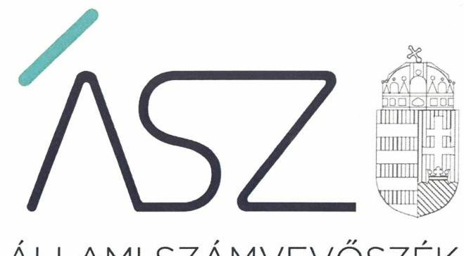
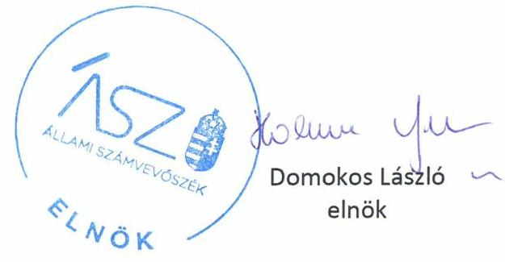
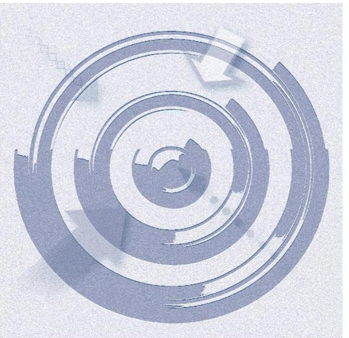
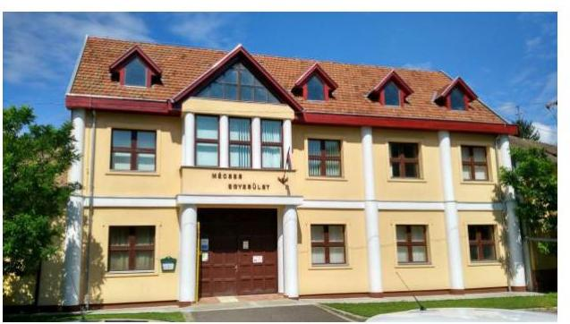

ÁLLAMI SZÁMVEVŐSZÉK

# JELENTÉS 

## Nem állami humánszolgáltatók ellenőrzése

A szociális humánszolgáltatást nyújtó intézmények, szolgáltatók államháztartáson kívüli fenntartói központi költségvetésből kapott támogatásai felhasználásának ellenőrzése – Mécses Szolgáló Közösség Egyesülete
2020.

20129
www.asz.hu

---

ÁLLAMI SZÁMVEVŐSZÉK

# JELENTÉS

## Nem állami humánszolgáltatók ellenőrzése

A szociális humánszolgáltatást nyújtó intézmények, szolgáltatók államháztartáson kívüli fenntartói központi költségvetésből kapott támogatásai felhasználásának ellenőrzése – Mécses Szolgáló Közösség Egyesülete

2020. 07. 24.

2012. 09. www.asz.hu

---

# AZ ELLENŐRZÉST FELÜGYELTE: 

KLINGA LÁSZLÓ felügyeleti vezető

## AZ ELLENŐRZÉST VEZETTE ÉS A VÉGREHAJTÁSÁÉRT FELELŐS:

DR. GÁL NÓRA ellenőrzésvezető

## A PROGRAM ÖSSZEÁLLÍTÁSÁÉRT FELELŐS:

TÓTPÁL SZABOLCS ellenőrzési program készítéséért felelős vezető
FEKETE-NAGY ANDRÁS GÁBOR ellenőrzési program készítéséért felelős vezető

IKTATÓSZÁM: EL-2765-001/2020.
TÉMASZÁM: 2491
ELLENŐRZÉS-AZONOSÍTÓ SZÁM: V083551, V0867114

---

# TARTALOMJEGYZÉK 

- ÖSSZEGZÉS ..... 5
- AZ ELLENŐRZÉS CÉLJA ..... 6
- AZ ELLENŐRZÉS TERÜLETE ..... 7
- AZ ELLENŐRZÉS HÁTTERE, INDOKOLTSÁGA ..... 8
- AZ ELLENŐRZÉS LÉNYEGES KÉRDÉSKÖREI ..... 9
- AZ ELLENŐRZÉS HATÓKÖRE ÉS MÓDSZEREI ..... 10
- MELLÉKLETEK ..... 12
I. sz. melléklet: Értelmező szótár ..... 12
- FÜGGELÉKEK ..... 13
I. sz. függelék a jelentéshez ..... 13
II. sz. függelék: Észrevételek ..... 14
- RÖVIDÍTÉSEK JEGYZÉKE ..... 17

---

.

---

# ÖSSZEGZÉS 

A mezőberényi Mécses Szolgáló Közösség Egyesülete, mint fenntartó a 2015-2018. években nem biztosította a szociális humánszolgáltatási közfeladatok ellátására kapott költségvetési támogatások felhasználásának ellenőrizhetőségét.

## Az ellenőrzés társadalmi indokoltsága

A szociális gondoskodást igénylők védelme, illetve a köznevelési feladatok ellátása az Alaptörvényben meghatározott, a társadalom szempontjából fontos tevékenységek. Jogszabályok teszik lehetővé, hogy államháztartáson kívüli szervezetek - így például az egyházi fenntartók, alapítványok, gazdasági társaságok, egyesületek - által fenntartott intézmények is végezzenek köznevelési, szociális és gyermekvédelmi feladatokat. Mindehhez a központi költségvetés évente jelentős összegű támogatással járul hozzá. Az államháztartáson kívüli, humánszolgáltatást végző intézmények az igényelt közpénzekből társadalmilag hasznos, közösségteremtő, közérdekű, illetve közhasznú tevékenységet végeznek, illetve közfeladatokat látnak el.

Az intézményfenntartók ellenőrzésével az Állami Számvevőszék hozzájárul ahhoz, hogy ezen közpénzeket az államháztartáson kívüli szervezetek is ellenőrizhető, átlátható és elszámoltatható módon használják fel a közfeladatok ellátása során. Az ellenőrzések célja továbbá, hogy a nyilvánosság és az igénybevevők megfelelő tájékoztatást kapjanak az államháztartáson kívüli közfeladatot ellátók működéséről.

Az ÁSZ ellenőrzései arra adnak választ, hogy az intézményfenntartók arra használták-e fel a közpénzeket, amire igényelték.

A szabályszerű gazdálkodás elengedhetetlen a közfeladat ellátás szakmai céljainak megvalósításához, valamint a társadalmi közbizalom fenntartásához.

## Megállapítások, következtetések

A Fenntartó a 2015-2017. években a gazdálkodására vonatkozó jogszabály által előírt könyvviteli nyilvántartás vezetése során nem különítette el minden szociális intézménye tekintetében a szociális feladatok ellátására kapott költségvetési támogatás felhasználását.

A Fenntartó az ÁSZ részére átadott dokumentumok teljeskörűségére vonatkozó nyilatkozata alapján a 2018. évben nem rendelkezett a szociális feladatok ellátására kapott költségvetési támogatás felhasználás elkülönített nyilvántartását alátámasztó dokumentummal.

A Fenntartó a 2015-2018. években a szociális humánszolgáltatási közfeladat ellátására kapott költségvetési támogatás felhasználásának a Számv. tv. ${ }^{1}$ 161/A.§ (2) bekezdésében előírt ellenőrizhetőségét nem biztosította. Mivel az Atr. ${ }^{2}$ 16. § (1) bekezdésében foglalt szabályozás ellenére nem gondoskodott arról, hogy a költségvetési támogatások felhasználásának, a Fenntartó és a nem önállóan gazdálkodó intézményei gazdálkodásának elkülönített, feladatonkénti bontásban történő elszámolására az adatok rendelkezésre álljanak. A Fenntartó mindezek alapján az Alaptörvény ${ }^{3}$ 39. cikk (2) bekezdésben foglaltak ellenére nem biztosította a felhasznált közpénzekre vonatkozó gazdálkodása átláthatóságát. Ezáltal a Fenntartó nem igazolta, hogy a közpénzt a szociális humánszolgáltatási közfeladatra fordította.

---

# AZ ELLENŐRZÉS CÉLJA

**AZ ELLENŐRZÉS CÉLJA** annak értékelése volt, hogy a nem állami, nem önkormányzati szociális intézmények fenntartói központi költségvetésből kapott támogatásainak felhasználása szabályszerű volt-e.

---

# AZ ELLENŐRZÉS TERÜLETE 

## Mécses Szolgáló Közösség Egyesülete

A mezőberényi Egyesület ${ }^{4}$ 2000. február 11-én alakult meg természetes személyek kezdeményezésére azzal a céllal, hogy az állami gondoskodásban felnövekedett, illetve fogyatékkal élő gyermekek és felnőttek életét segítse.

Közhasznú tevékenysége keretében fogyatékos személyek lakóotthoni ellátását, pszichiátriai betegek nappali ellátását, szociális étkeztetést, fejlesztő foglalkoztatást és munka-rehabilitációs szociális foglalkoztatást végzett az ellenőrzött időszakban.

A Fenntartó ${ }^{5}$ az ellenőrzés időszakában kilenc telephelyen folytatta tevékenységét. Az intézményei önálló jogi személyiséggel nem rendelkeztek.

A Fenntartó legfőbb szerve az ellenőrzött időszakban a Közgyűlés ${ }^{6}$ volt, képviseletére az ügyvezető volt jogosult, akinek személye az ellenőrzött időszakban nem változott. Az Alapszabály ${ }^{7}$ szerint az Egyesület működését és gazdálkodását három tagból álló Felügyelő Bizottság ellenőrizte.

A Fenntartó számára a Magyar Államkincstár 2015. évben 49,9 M Ft, 2016. évben 76,5 M Ft, 2017. évben 95,2 M Ft és 2018. évben 108,4 M Ft támogatást biztosított a központi költségvetésből.

---

# AZ ELLENŐRZÉS HÁTTERE, INDOKOLTSÁGA 

A szociális feladatokat ellátó nem állami intézményfenntartók részére közfeladataik ellátására évente jelentős összegű pénzügyi támogatást biztosítottak a mindenkori költségvetési törvények a bennük megfogalmazott feltételek mellett. A felhasználható állami támogatások a Kvtv. 1,2,3,4 ${ }^{8}$-ekben a 2015-2018. években a szociális ágazatra vonatkozóan 360 Mrd Ft előirányzatot határoztak meg.

Az ÁSZ ${ }^{9}$ stratégiájában foglaltak alapján is indokolt az ellenőrzés, amely a társadalom számára jelzi, hogy a közpénz államháztartáson kívüli felhasználása sem maradhat ellenőrizetlenül. Az államháztartáson kívülre nyújtott költségvetési támogatások ellenőrzésével az ÁSZ hozzájárul ahhoz, hogy a közpénzeket a nem állami humán fenntartók átlátható módon használják fel a közfeladatok ellátására kötött szerződésekben vállalt kötelezettségek teljesítése érdekében. Az ellenőrzés javaslataival hozzájárulhat az említett rendszerek szabályszerű támogatás felhasználásához, javíthatja a társadalmi-gazdasági döntések megalapozottságát, amely a „jól irányított állam" feltétele.

---

# AZ ELLENŐRZÉS LÉNYEGES KÉRDÉSKÖREI 

1. A szociális humánszolgáltató közfeladatot ellátó államháztartáson kívüli fenntartó szabályszerű működési- és gazdálkodási környezet kialakításával megteremtette-e a költségvetési támogatások átlátható, elszámoltatható igénybevételének, felhasználásának feltételeit?
2. Az államháztartáson kívüli fenntartó az átvállalt szociális humánszolgáltatási közfeladathoz biztosított költségvetési támogatásokat szabályszerűen fordította-e a humánszolgáltató intézménye/i működtetésére?
3. Az államháztartáson kívüli fenntartó a szociális humánszolgáltató intézménye/i működtetéséhez felhasznált közpénzekre vonatkozó gazdálkodásával a nyilvánosság előtt elszámolt-e, ennek érdekében ellenőrzési, értékelési és a külső ellenőrzésekkel kapcsolatos intézkedési feladatait szabályszerűen látta-e el?

---

# AZ ELLENŐRZÉS HATÓKÖRE ÉS MÓDSZEREI 

## Az ellenőrzés típusa

Megfelelőségi ellenőrzés.

## Az ellenőrzött időszak

A 2015. január 1-je és 2018. december 31-e közötti időszak.

## Az ellenőrzés tárgya

Az ellenőrzés a szociális humánszolgáltatási közfeladatokat ellátó államháztartáson kívüli fenntartók humánszolgáltatási közfeladatai ellátásához a központi költségvetésből kapott támogatásaik humánszolgáltatási közfeladatokra való fenntartó általi felhasználása szabályszerűségének értékelésére terjed ki.

## Az ellenőrzött szervezet

Mécses Szolgáló Közösség Egyesülete

## Az ellenőrzés jogalapja

Az ellenőrzés jogszabályi alapját az ÁSZ tv. ${ }^{10}$ 1. § (3) bekezdésében és 5. § (3) bekezdésében foglalt előírások adják.

## Az ellenőrzés módszerei

Az ellenőrzést az ellenőrzési program annak szempontjai, kérdései, az ellenőrzött időszakban hatályos jogszabályok, a nemzetközi standardokat irányadónak tekintve, az ellenőrzés szakmai szabályok és módszertanok figyelembevételével rendelte elvégezni.

Az ellenőrzés ideje alatt az ellenőrzött szervezettel történő kapcsolattartás az ÁSZ SZMSZ ${ }^{11}$-ének vonatkozó előírásai alapján történt.

Az ellenőrzési kérdések megválaszolásához szükséges bizonyítékok megszerzése az ellenőrzött által rendelkezésre bocsátott dokumentumokra, adatokra alapozva történt.

Az ellenőrzési bizonyítékként felhasználható adatforrások közé tartoztak egyrészt az ellenőrzési program részletes szempontjainál felsorolt

---

adatforrások, másrészt minden - az ellenőrzés folyamán feltárt, - az ellenőrzés szempontjából információt tartalmazó dokumentum.

Az ellenőrzés lefolytatásához az ellenőrzött szervezet a kitöltött tanúsítványok, valamint az ÁSZ által kért dokumentumok elektronikus úton való megküldésével szolgáltatott adatokat, információkat. Az így rendelkezésre bocsátott adatok, információk és a tanúsítványok adatai valódiságának kontrollja az ellenőrzés keretében megtörtént.

Az egységes értelmezést támogatja a program mellékletét képező fogalomtár és rövidítésjegyzék.

Az ellenőrzést alapvetően a szociális humánszolgáltatások esetében a központi költségvetési támogatások igénylésével, módosításával, felhasználásával, elszámolásával kapcsolatos feladatokat ellátó államháztartáson kívüli fenntartóknál végeztük.

A szociális humánszolgáltatások központi költségvetési támogatásaival kapcsolatos, államháztartáson kívüli fenntartó jogszabályokban előírt feladatai betartását, továbbá a központi költségvetési támogatások szabályszerű nyilvántartását ellenőrizte az ÁSZ a fenntartónál rendelkezésre álló nyilvántartások, beszámolók és egyéb dokumentumok alapján. Az ellenőrzés nem terjedt ki a szociális humánszolgáltatások központi költségvetési támogatásai igénylése, módosítása, elszámolása valódiságának, megalapozottságának, helyességének - sem a fenntartónál, sem a székhely intézményénél való - értékelésére (mivel ennek felülvizsgálata, ellenőrzése a finanszírozó jogszabályban előírt feladata, határozatai kiadása előtt). Továbbá nem terjedt ki az ellenőrzés e források szabályszerű felhasználásának értékelésére.

---

# MELLÉKLETEK 

- I. SZ. MELLÉKLET: ÉRTELMEZŐ SZÓTÁR
humánszolgáltatás
költségvetési támogatás
közfeladat
nem állami, nem önkormányzati (államháztartáson kívüli) intézmény fenntartó

Külön törvényekben meghatározott szociális, gyermekjóléti, gyermekvédelmi, közoktatási, felsőoktatási, kulturális közfeladatok.
A társadalombiztosítás pénzügyi alapjai kivételével az államháztartás központi alrendszeréből ellenérték nélkül, pénzben nyújtott támogatások (Áht. ${ }^{12}$ 1. § 14. pont) A költségvetési törvényekben (2014. évi C. törvény 42-43. §, 2015. évi C. törvény 40-41. §, 2016. évi XC. törvény 40-41. §) megállapított támogatás.
„Közfeladat a jogszabályokban meghatározott állami vagy önkormányzati feladat. ... A közfeladatok ellátásában államháztartáson kívüli szervezet jogszabályban meghatározott rendben közreműködhet." A közfeladatok meghatározó jogszabályban meg kell határozni a közfeladat ellátásának módját és egyidejűleg rendezni kell annak az ellátásához
szükséges pénzügyi fedezet biztosításáról. (Az államháztartásról szóló 2011. évi CXCV. törvény 3/A. § (1)-(3) bekezdés)
A szociális, gyermekjóléti és gyermekvédelmi közfeladatokat/humánszolgáltatásokat ellátó intézményt/szolgáltatót fenntartó egyházi jogi személy, társadalmi szervezet, alapítvány, közalapítvány, civil szervezet, országos nemzetiségi önkormányzat, nonprofit gazdasági társaság, gazdasági társaság és a humánszolgáltatást alaptevékenységként végző, Szja tv. ${ }^{13}$ hatálya alá tartozó egyéni vállalkozó. (2015. évi Kvtv. 42. §, 43. § (1) bekezdés, 2016. évi Kvtv. ${ }^{14}$ 40. §, 41. § (1) bekezdés, 2017. évi Kvtv. ${ }^{15} 40 . \S, 41 . \S$ (1) bekezdés)

---

# FÜGGELÉKEK 

- I. SZ. FÜGGELÉK A JELENTÉSHEZ

Az Állami Számvevőszék az ellenőrzések során feltárt tényekhez kapcsolódó további körülmények tisztázására eszközrendszerrel nem rendelkezik. Amennyiben az ellenőrzésen túlmutatóan indokoltnak látszik az ellenőrzés során feltárt körülmények további vizsgálata, az Állami Számvevőszék törvényi felhatalmazás alapján az ellenőrzés által feltárt körülményeket továbbítja a hatáskörrel rendelkező szervnek a szükséges intézkedések megtétele, eljárások lefolytatása érdekében.

A Mécses Szolgáló Közösség Egyesülete (a továbbiakban: Fenntartó) részére szociális közfeladat ellátásra a Magyar Államkincstár részéről biztosított költségvetési támogatások összege 2018-ban 108,4 M Ft volt.
A Fenntartó a 2018. év vonatkozásában a Számv. tv. 161/A. § (2) bekezdésének előírása ellenére nem gondoskodott a közpénzek felhasználásának ellenőrizhetősége érdekében a könyvvezetési rendszerének oly módon való továbbrészletezéséről, hogy abból az Atr. 16.§ (1) bekezdése szerinti kötelezettségnek eleget téve, a külön jogszabályban meghatározott a fenntartó és az intézménye gazdálkodásának elkülönített elszámolására, valamint feladatonkénti bontásban a támogatás-felhasználásra vonatkozó adatok rendelkezésre álljanak.

A Fenntartónál az elkülönített nyilvántartás vezetésének elmaradása miatt felmerült a támogatások nem rendeltetésszerű felhasználásának gyanúja. Ezáltal nem zárható ki, hogy a költségvetésből származó pénzeszközöket a jóváhagyott céltól eltérően használta fel.
Az eset konkrét körülményeinek feltárására a Magyar Államkincstár rendelkezik hatáskörrel.

---

A jelentéstervezetet a Számvevőszék 15 napos észrevételezésre megküldte az ellenőrzött szervezet vezetőjének az ÁSZ tv. 29. § (1) bekezdése előírásának megfelelően.

A Mécses Szolgáló Közösség Egyesülete ügyvezetője a jelentéstervezet megállapításaira írásban észrevételt tett.
Az ÁSZ tv. 29. § (3) bekezdésével összhangban az ÁSZ a Függelékben feltünteti az
 ellenőrzés megállapításaival kapcsolatban tett, figyelembe nem vett észrevételeket, és megindokolja, hogy azokat miért nem fogadta el.

[^0]
[^0]:    * 29. § (1) Az Állami Számvevőszék az ellenőrzési megállapításait megküldi az ellenőrzött szervezet vezetőjének vagy az általa megbízott személynek, és annak, akinek személyes felelősségét állapította meg.
    (2) Az ellenőrzött szervezet vezetője és a felelősként megjelölt személy az ellenőrzés megállapításaira tizenöt napon belül írásban észrevételt tehet.
    (3) Az Állami Számvevőszék az észrevételre a beérkezésétől számított harminc napon belül írásban válaszol. A figyelembe nem vett észrevételeket köteles a jelentésben feltüntetni, és megindokolni, hogy azokat miért nem fogadta el.

---

A Mécses Szolgáló Közösség Egyesülete ügyvezetőjének az ellenőrzés megállapításaival kapcsolatban, írásban tett, figyelembe nem vett észrevételei és azok indoklása.
Az észrevétel szerint a Mécses Szolgáló Közösség Egyesülete (továbbiakban: Fenntartó) elkülönített könyvelést vezet minden intézményére vonatkozóan a jogszabályi előírások alapján. A Fenntartó észrevétele szerint a szociális feladatok ellátására kapott költségvetési támogatás felhasználásának elkülönített nyilvántartását alátámasztó dokumentumokat a 2016-2017. évek vonatkozásában nem kérte be az Állami Számvevőszék (továbbiakban: ÁSZ), a 2018. évi adatszolgáltatási kötelezettségének pedig az előírt határidőn belül - az észrevételben részletezett okok miatt - nem tett eleget. A 2018. évi adatszolgáltatás kapcsán a Fenntartó ügyvezetője elektronikus levélben kérte az adatfeltöltés kezdő időpontjának módosítását (2019. október 15-ről 2019. október 17-re). Az ügyvezető észrevételéhez csatolta a 2018. évben hatályos számviteli politikát és annak keretében elkészített szabályzatokat, valamint a Fenntartó alapszabályát. Az észrevétel mellékleteként megküldte továbbá a 2018. évi beszámolót és kapcsolódó könyvviteli elszámolásokat, valamint a 2018. évi támogatások elszámolását tartalmazó kincstári adatlapot, társasági adóbevallást helyettesítő nyilatkozatot.

Az ÁSZ az ellenőrzései során az adatbekérési időszak alatt bekért, teljességi és hitelességi nyilatkozattal megküldött dokumentumok alapján teszi meg megállapításait.

- A 2015-2017. évek vonatkozásában az EL-1231-005/2018. iktatószámú adatbekérő levél 2. számú melléklet 34. sorában - az észrevételben leírtakkal ellentétben - bekérte az ÁSZ a „költségvetési támogatások elkülönített nyilvántartását igazoló dokumentumokat, főkönyvi és analitikus nyilvántartásokat a fenntartónál, illetve az önálló költségvetéssel rendelkező intézményeknél". A Fenntartó által teljességi és hitelességi nyilatkozattal megküldött dokumentumok (fenntartói, intézményi főkönyvi kivonatok) nem igazolták minden szociális intézmény tekintetében a szociális feladatok ellátására kapott költségvetési támogatás felhasználásának elkülönítését.
- A 2018. év vonatkozásában a Fenntartó által - helyszíni ellenőrzés alkalmával - tett teljességi és hitelességi nyilatkozat szerint nem rendelkezett a szociális feladatok ellátására kapott költségvetési támogatás felhasználás elkülönített nyilvántartását alátámasztó dokumentummal. Az adatok feltöltésére szolgáló Elektronikus Adatszolgáltatási Rendszer 2019. október 15. - 2019. október 21. közötti időszakban a Fenntartó számára nyitva állt, de adatfeltöltés nem történt, a dokumentumok postai úton történő megküldésére sem került sor. Az EL-1231-025/2019. iktatószámú adatbekérő levélben az Állami Számvevőszékről szóló 2011. évi LXVI. törvény 28. § (1)-(2) bekezdés szerinti adatszolgáltatást kértünk, amely nem írja elő az adatszolgáltatás módját, így nem zárja ki a papír alapon történő teljesítést. Az adatszolgáltatás elektronikus úton történő teljesítésének lehetőségét az adatbekérő levélben leírtaknak megfelelően a kötelezettség megkönnyítése, valamint költséghatékony megvalósítása érdekében biztosította az ÁSZ. Az utólag - észrevétel mellékleteként - megküldött dokumentumok figyelembe vételére nincs lehetőség.
Az észrevétel alapján a jelentéstervezet módosítása nem indokolt.

---

.

---

# RÖVIDÍTÉSEK JEGYZÉKE 

${ }^{1}$ Számv. tv.
${ }^{2}$ Atr.
${ }^{3}$ Alaptörvény
${ }^{4}$ Egyesület
${ }^{5}$ Fenntartó
${ }^{6}$ Közgyűlés
${ }^{7}$ Alapszabály
${ }^{8}$ Kvtv.1,2,3,4
${ }^{9}$ ÁSZ
${ }^{10}$ Ász tv.
${ }^{11}$ SZMSZ
${ }^{12}$ Áht.
${ }^{13}$ Szja tv.
${ }^{14}$ 2016. évi Kvtv.
${ }^{15}$ 2017. évi Kvtv.
2000. évi C. törvény a számvitelről

489/2013. (XII. 18.) Korm. rendelet az egyházi és nem állami fenntartású szociális, gyermekjóléti és gyermekvédelmi szolgáltatók, intézmények és hálózatok támogatásáról
Magyarország Alaptörvénye (2011. április 25.)
Mécses Szolgáló Közösség Egyesülete
Mécses Szolgáló Közösség Egyesülete
Mécses Szolgáló Közösség Egyesülete Közgyűlése
Mécses Szolgáló Közösség Egyesülete módosított és egységes szerkezetbe foglalt Alapszabálya
Kvtv.1: Magyarország 2015. évi központi költségvetéséről szóló 2014. évi C. törvény (hatályos: 2015. január 1-jétől 2018. december 31-éig)

Kvtv.2: Magyarország 2016. évi központi költségvetéséről szóló 2015. évi C. törvény (hatályos: 2015. július 4-étől)

Kvtv.3: Magyarország 2017. évi központi költségvetéséről szóló 2016. évi XC. törvény (hatályos: 2016. november 1-jétől)

Kvtv.4: Magyarország 2018. évi központi költségvetéséről szóló 2017. évi C. törvény (hatályos: 2017. november 1-jétől)

Állami Számvevőszék
2011. évi LXVI. törvény az Állami Számvevőszékről

Szervezeti és Működési Szabályzat
2011. évi CXCV. törvény az államháztartásról (hatályos: 2011. december 31-től)
1995. évi CXVII. törvény a személyi jövedelemadóról
2015. évi C. törvény Magyarország 2016. évi központi költségvetéséről
2016. évi XC. törvény Magyarország 2017. évi központi költségvetéséről

---

# ASZ 

ÁLLAMI SZÁMVEVŐSZÉK
1052 Budapest, Apáczai Cs. J. u. 10. I 1364 Budapest 4. Pf. 54 TEL: +36 14849100
email: szamvevoszek@asz.hu
web: www.asz.hu | www.aszhirportal.hu
