ÁLLAMI SZÁMVEVŐSZÉK

# JELENTÉS

Nemzeti Család- és Szociálpolitikai Alap ellenőrzése

2020.

20130
www.asz.hu

---

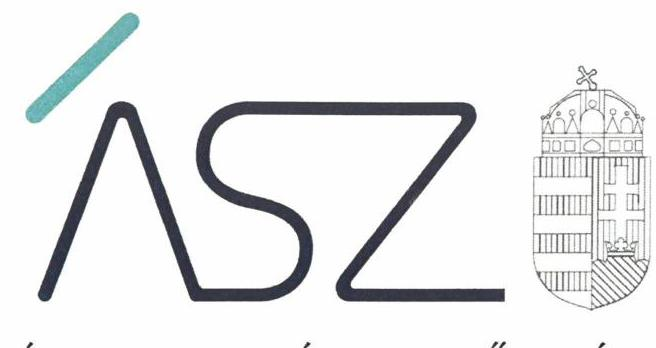

ÁLLAMI SZÁMVEVŐSZÉK

# JELENTÉS 

Nemzeti Család- és Szociálpolitikai Alap ellenőrzése

2020. 

07 hó 09 nap

20130
www.asz.hu
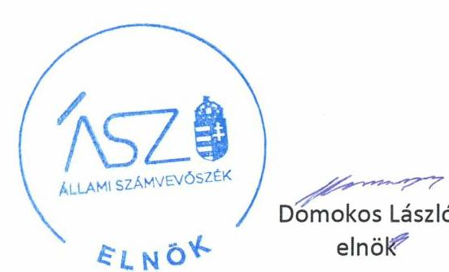

---

|  | AZ ELLENŐRZÉST FELÜGYELTE: |
| :--: | :--: |
|  | MAKKAI MÁRIA felügyeleti vezető |
|  | AZ ELLENŐRZÉST VEZETTE ÉS A VÉGREHAJTÁSÁÉRT FELELŐS: |
|  | NEMESVÁRI-HORTHY ESZTER ellenőrzésvezető |
|  | A PROGRAM ÖSSZEÁLLÍTÁSÁÉRT FELELŐS: |
|  | FEKETE-NAGY ANDRÁS GÁBOR felelős vezető |
|  | A TÉMÁHOZ KAPCSOLÓDÓ KORÁBBI SZÁMVEVŐSZÉKI JELENTÉSEK: |
| - címe: | A Magyar Államkincstár ellenőrzése - A Magyar Államkincstár közigazgatási hatósági tevékenységének, valamint központosított illetményszámfejtési rendszerének ellenőrzése |
| Jelentéseink az Országgyúlés számítógépes hálózatán és az interneten a www.asz.hu címen is olvashatóak. | 16043 |
|  | IKTATÓSZÁM: EL-2769-001/2020 |
|  | TÉMASZÁM: 2515 |
|  | ELLENŐRZÉS-AZONOSÍTÓ SZÁM: V0859 |

---

# TARTALOMJEGYZÉK 

■ ÖSSZEGZÉS ..... 5
■ AZ ELLENŐRZÉS CÉLJA ..... 6
■ AZ ELLENŐRZÉS TERÜLETE ..... 7
■ AZ ELLENŐRZÉS HÁTTERE, INDOKOLTSÁGA ..... 9
■ A JELENTÉS LÉNYEGES KÉRDÉSKÖREI ..... 10
■ AZ ELLENŐRZÉS HATÓKÖRE ÉS MÓDSZEREI ..... 11
■ MEGÁLLAPÍTÁSOK ..... 14
■ JAVASLATOK ..... 18
■ MELLÉKLETEK ..... 19
I. sz. melléklet: Értelmező szótár ..... 19
II. sz. melléklet: A Nemzeti Család- és Szociálpolitikai Alap jogcímei és az eljáró hatóságok ..... 20
III. sz. melléklet: Az ÁSZ ellenőrzés tárgyát képező jogcímek ..... 22
IV. sz. melléklet: Az ÁSZ ellenőrzés megállapításai ellenőrzött szervezetenként ..... 23
■ FÜGGELÉK: ÉSZREVÉTELEK ..... 25
■ RÖVIDÍTÉSEK JEGYZÉKE ..... 57

---

.

---

# ÖSSZEGZÉS 

A Nemzeti Család- és Szociálpolitikai Alap felhasználásában közreműködő Magyar Államkincstár és a fővárosi és megyei kormányhivatalok a működés kereteit kialakították. Az NCSSZA felhasználását támogató informatika rendszerek biztosították a megfelelő feladatellátást. A kormányhivataloknál az Állami Számvevőszék korábbi ellenőrzése eredményeként a hatósági ügyek intézése területén feltárt kockázatok csökkentek, a hatósági feladatok ellátása szabályszerű volt.
A támogatásokkal, ellátásokkal érintett megkérdezettek elégedettek voltak a Magyar Államkincstár és a kormányhivatalok feladatellátásának folyamatával, végrehajtásával.

## Az ellenőrzés társadalmi indokoltsága

A Nemzeti Család- és Szociálpolitika Alap Magyarország költségvetésében a pénzügyminiszter irányítása alatt álló központi kezelésű előirányzat, amely fedezetet nyújt a családi támogatásokra, a korhatár alatti ellátásokra, a jövedelempótló és jövedelemkiegészítő szociális támogatásokra, valamint egyéb különféle jogcímen adott térítésekre. Az Alapból 2017-ben 653,0 Mrd Ft, 2018-ban 642,8 Mrd Ft kiadást teljesítettek. Az NCSSZA-t érintő számvevőszéki ellenőrzések az Alap felhasználásával kapcsolatban szabálytalanságokat tártak fel. Az Alapból történő kifizetések kihatnak a családok, illetve a társadalom széles rétegeinek életminőségére, a jövedelmi egyenlőtlenségek kockázatának csökkentésére. A felhasznált közpénzek nagysága miatt is fontos társadalmi elvárás, hogy az Alap felhasználása szabályszerű legyen, ami növeli a közbizalmat. Mindez indokolta az NCSSZA felhasználásával kapcsolatos feladatellátásnak, a feladat- és hatásköri változások végrehajtása megfelelőségének több évet átfogó komplex ellenőrzését.

## Főbb megállapítások, következtetések, javaslatok

A Magyar Államkincstár és a fővárosi és megyei kormányhivatalok az NCSSZA felhasználásával összefüggő feladatellátás kereteit kialakították. Meghatározták szervezeti és működési szabályaikat, a feladatellátó szervezeti egységeik ügyrendjeit. A 2015-2018. évek között lezajlott feladat- és hatásköri változások végrehajtása szabályszerű volt.

A Kincstár és a kormányhivatalok NCSSZA felhasználásához kapcsolódó hatósági feladataikat 2017-2018. években szabályszerűen, a törvényi előírások betartásával látták el. Az ügyfelek által benyújtott kérelmeket határidőben elbírálták, az ügyfeleket a törvényi előírásban foglalt formájú és tartalmú határozatban értesítették. A feladataik ellátását támogató informatikai rendszerek - az azokba beépített kontrollok révén - biztosították a megfelelő feladatellátást. Az NCSSZA felhasználásához kapcsolódó feladatok ellátását támogató valamennyi elektronikus információs rendszer osztályba sorolását a kormányhivatalok nem végezték el, amely az elektronikus információs rendszerek és az azokban kezelt adatok megfelelő védelme érdekében szükséges.

A kormányhivataloknál az Állami Számvevőszék korábbi ellenőrzése eredményeként a hatósági ügyek intézése területén feltárt kockázatok csökkentek, a feladatellátás szabályozottsága javult.

A támogatásokkal, ellátásokkal érintett megkérdezettek döntő többsége elégedett volt a Kincstár és a kormányhivatalok feladatellátása folyamatával, végrehajtásával. A megkérdezettek jelentős hányadának a támogatások igénybevételéhez szükséges információk megszerzése nem okozott nehézséget, személyes ügyintézés esetében nagy többségük elégedett volt az ügyintéző segítőkészségével. A megkérdezettek döntő többségét 60 napon belül határozatban értesítették kérelme elbírálásáról. A megkérdezettek elenyésző része nyújtott be a határozat ellen fellebbezést.

Az ellenőrzés megállapításai alapján az Állami Számvevőszék a Borsod-Abaúj-Zemplén Megyei Kormányhivatal, a Tolna Megyei Kormányhivatal és a Zala Megyei Kormányhivatal kormánymegbízottja részére egy-egy, a Veszprém Megyei Kormányhivatal kormánymegbízottjának pedig kettő javaslatot fogalmazott meg, melyekre az érintetteknek 30 napon belül intézkedési tervet kell készíteniük.

---

# AZ ELLENŐRZÉS CÉLJA 

Az ellenőrzés célja annak értékelése volt, hogy a Nemzeti Család- és Szociálpolitikai Alap felhasználásához kapcsolódó feladatellátás szabályozott és szabályszerű volt-e, kialakítottak-e és működtettek-e megfelelő kontrollokat az előírások betartása érdekében, az informatikai rendszerek alkalmasak voltak-e a feladatok szabályszerű ellátásának biztosítására. A feladatok átadás-átvétele összhangban volt-e a jogszabályi előírásokkal. A feladatellátás folyamata és végrehajtása biztosította-e a támogatásokkal, ellátásokkal érintettek elégedettségét. Az ellenőrzés célja volt továbbá annak értékelése, hogy a kormányhivatalok végrehajtották-e a korábbi számvevőszéki jelentés - családtámogatási ellátásokkal összefüggő - megállapításaival összhangban készített intézkedési terveikben meghatározott feladatokat.

Teljesítmény-ellenőrzés keretében kerültek felmérésre az ellátásokkal érintettek kincstári és kormányhivatali feladatellátással kapcsolatos tapasztalatai, az ügyek bonyolításával, a folyósítással való megelégedettsége.

---

# AZ ELLENŐRZÉS TERÜLETE

## Nemzeti Család- és Szociálpolitikai Alap

Az NCSSZA¹ Magyarország költségvetésében a pénzügyminiszter irányítása alatt álló központi kezelésű előirányzat, amely 2012-ben jött létre. Az NCSSZA fedezetet nyújt a családi támogatásokra, a korhatár alatti ellátásokra, a jövedelempótló és jövedelemkiegészítő szociális támogatásokra, valamint egyéb különféle jogcímen adott térítésekre.

FELADATOKAT a támogatási kérelmek elbírálásával, a támogatások folyósításával kapcsolatban a Kincstár² és a fővárosi és megyei kormányhivatalok³ láttak el. Az egyes jogcímeket, az első és másodfokú hatóságokat, valamint a támogatást folyósító szervezetet a II. sz. melléklet mutatja be.

Az NCSSZA-ból 21 különböző jogcímen történt kifizetés 2017-ben 653,0 Mrd Ft, 2018-ban 642,8 Mrd Ft értékben. A jogosulatlanul igénybevett ellátások visszafizetéséből 2017-ben 1,6 Mrd Ft, 2018-ban 1,7 Mrd Ft bevétel származott. Az NCSSZA 2017-2018. évi teljesített kiadásainak és bevételeinek alakulását az 1. táblázat mutatja be.

1. táblázat

|  Az NCSSZA TELJESÍTETT KIADÁSAI ÉS BEVÉTELEI 2017-2018. (MRD Ft) |  |  |  |   |
| --- | --- | --- | --- | --- |
|  Évek | 2017. év |  | 2018. év |   |
|  Támogatások | teljesített kiadás | teljesített bevétel | teljesített kiadás | teljesített bevétel  |
|  NCSSZA támogatások | 653,0 | 1,6 | 642,8 | 1,7  |
|  ebből |  |  |  |   |
|  Családi támogatások | 407,1 | 1,4 | 402,7 | 1,5  |
|  Korhatár alatti ellátások | 94,7 | - | 92,8 | -  |
|  Jövedelempótló és jövedelemkiegészítő szociális ellátások | 124,4 | 0,2 | 122,2 | 0,2  |
|  Különféle jogcímen adott térítések | 26,8 | - | 25,1 | -  |

*Forrás: ÁSZ szerkesztés*

Az NCSSZA felhasználása vonatkozásában a jelen ellenőrzés a XX/21/1/1 családi támogatások és a XX/21/1/3 jövedelempótló és jövedelem kiegészítő szociális támogatások jogcímcsoportokban 15 jogcím ellenőrzésére terjedt ki, amelyek az NCSSZA jogcím kiadásainak 80%-át meghaladó részét tették ki 2017. és 2018. években. A 15 ellenőrzött jogcímet a III. sz. melléklet sorolja fel.

A SZAKMAI IRÁNYÍTÓ SZERVI FELADATOKAT az NCSSZA támogatások feladatköreinek gyakorlásával összefüggésben az emberi erőforrások minisztere, mint a szociál- és nyugdíjpolitikáért felelős, illetve a családpolitikáért felelős EMMI⁴ miniszter gyakorolta 2017-2018. években.

---

A FELADAT- ÉS HATÁSKÖRÖK a támogatások iránti igények elbírálására és folyósítására vonatkozóan 2015. és 2017. között többször módosultak. A feladat- és hatásköri változások az alábbiak voltak:
2015. április 1-jével a családi támogatásokkal - családi pótlékkal, anyasági támogatással, gyermekgondozást segítő ellátással, gyermeknevelési támogatással - és a fogyatékossági támogatással összefüggő feladatok a Kincstár területi szerveitől a fővárosi és megyei kormányhivatalok hatáskörébe kerültek, a másodfokú hatósági hatásköröket az ONYF⁵ látta el.
2017. január 1-jétől a családtámogatási igazgatási feladatokkal összefüggő folyósítási, követeléskezelési és végrehajtási feladatok, a hatósági döntést nem igénylő, kizárólag nemzetközi adatcserével vagy adatigazolással kapcsolatos feladatok, valamint az azokhoz kapcsolódó jogviszonyok tekintetében a kormányhivataloktól az ONYF vette át a közfeladatot.
2017. október 31. napjával az ONYF a Kincstárba történt beolvadással megszűnt. 2017. november 1-jétől a megszűnt ONYF központi szervének hatáskörébe tartozó közigazgatási hatósági ügyekben a Kincstár központi szerve, különös hatáskörű igazgatási szervének hatáskörébe tartozó közigazgatási hatósági ügyekben a Kincstár Nyugdíjfolyósító Igazgatósága jár el.

INFORMATIKAI RENDSZEREK támogatták az NCSSZA felhasználását - a kérelmek befogadását, elbírálását és a támogatások folyósítását - 2017-2018. években. A családi, a fogyatékossági támogatás, valamint a vakok személyi járadéka ügyekkel kapcsolatos feladatellátást a TÉBA rendszer támogatta. Az életkezdési támogatásra jogosult gyermekek nyilvántartását, kincstári számla vezetését, éves támogatás kiutalását és értesítő levelek készítését a Babakötvény informatikai rendszer támogatta. A jövedelempótló és jövedelemkiegészítő szociális ellátások - a fogyatékossági támogatás és vakok személyi járadéka támogatás kivételével - kifizető rendszere az úgynevezett NYUFUR volt. A járási szociális feladatok ellátását a kormányhivatalok többségénél a JWINSZOC rendszer, egyes kormányhivataloknál a KIMÉRA vagy a WebIKSZ rendszer támogatta.

---

# AZ ELLENŐRZÉS HÁTTERE, INDOKOLTSÁGA 

A Nemzeti Szociálpolitikai Alap a szociális ellátások egy meghatározott körét, valamint a Nyugdíjbiztosítási Alapból kikerülő, korai nyugdíjakat tartalmazza. E keretek között az NCSSZA a családi támogatásokat, a korhatár alatti ellátásokat, a jövedelempótló és jövedelemkiegészítő szociális támogatásokat, valamint egyéb különféle jogcímen adott térítéseket tartalmazza. Az Alap létrehozásával a koncepció az volt, hogy az ellátások számának csökkentése, az ellátórendszer egyszerűsítése révén áttekinthetőbb és kiszámíthatóbb rendszer jön létre, mivel az ellátások egy alapba tagozódnak. Az NCSSZA-t érintően az igénylésektől a folyósításig feladatot látnak el a kormányhivatalok, valamint a Magyar Államkincstár.

Az NCSSZA-ból 21 jogcímen történnek kifizetések. Az ellátásokkal, támogatásokkal kapcsolatos feladatok és hatáskörök a kifizetési jogcímek szerint sokrétűek, és az elmúlt időszakban többször változtak.

Az NCSSZA kiadásai a központi kezelésű előirányzatok kiadásainak megközelítőleg 15%-át teszi ki, az Alapból a társadalom valamennyi rétegét érintő ellátások kifizetése történik. Ezért az Alap szabályozásoknak megfelelő felhasználása, kezelése kiemelt jelentőségű a közpénzek szabályszerű, átlátható felhasználása szempontjából. Az NCSSZA-t érintő számvevőszéki ellenőrzések az Alap felhasználásával kapcsolatban szabálytalanságokat tártak fel. Mindez indokolja az NCSSZA felhasználásával kapcsolatos feladatellátásnak, a feladat- és hatásköri változások végrehajtása megfelelőségének több évet átfogó komplex ellenőrzését.

---

# A JELENTÉS LÉNYEGES KÉRDÉSKÖREI 

1.     - A Nemzeti Család- és Szociálpolitikai Alap felhasználásához kapcsolódó feladatellátás szabályozott volt-e, a kontrollok, valamint az informatikai rendszerek kialakítása és működtetése megfelelő volt-e?
2.     - A fővárosi és megyei kormányhivataloknál csökkentek-e az NCSSZA jogcímeivel kapcsolatos feladatellátás területén a korábbi ÁSZ ellenőrzés során feltárt kockázatok?
3.   
  - A feladatellátás folyamata és végrehajtása biztosította-e a támogatásokkal, ellátásokkal érintettek elégedettségét?

---

# AZ ELLENŐRZÉS HATÓKÖRE ÉS MÓDSZEREI 

## Az ellenőrzés típusa

Megfelelőségi és teljesítmény-ellenőrzés

## Az ellenőrzött időszak

Az NCSSZA felhasználásához kapcsolódó feladatellátás szabályai, a kontrollok kialakítása és működtetése, valamint a feladatellátást támogató informatikai rendszer megfelelőségi ellenőrzése tekintetében 2017-2018. évek.

Az NCSSZA felhasználásával összefüggő feladat- és hatásköri változások végrehajtásának megfelelősége tekintetében 2015-2018. évek.

A teljesítmény-ellenőrzés tekintetében a 2017. január 1-jétől az adatbekérő levél kézhezvételének napjáig terjedő időszak.

Az utóellenőrzésre vonatkozóan az utóellenőrzés alapját képező, az ÁSZ ${ }^{6}$ 16043-as számú, „A Magyar Államkincstár ellenőrzése - A Magyar Államkincstár közigazgatási hatósági tevékenységének, valamint központosított illetmény-számfejtési rendszerének ellenőrzése" című jelentés közzétételének napjától, 2016. március 30-tól az adatbekérő levél kézhezvételének napjáig tartó időszak.

## Az ellenőrzés tárgya

A megfelelőségi ellenőrzés keretében az NCSSZA felhasználása vonatkozásában a XX/21/1/1 családi támogatások és a XX/21/1/3 jövedelempótló és jövedelem-kiegészítő szociális támogatások jogcímcsoportokban a feladatellátás szabályozottsága, az azt támogató informatikai rendszerek és a kontrollok megfelelősége.

A 2015-2018. években lezajlott, feladatellátást érintő átalakulások és feladat-átadás-átvételek is ellenőrzésre kerültek.

A teljesítmény-ellenőrzés tárgya az ellátásokkal érintettek kincstári és kormányhivatali feladatellátással kapcsolatos tapasztalatai, az ügyek bonyolításával, a folyósítással való megelégedettsége.

A számvevőszéki jelentésben foglalt megállapításokhoz kapcsolódó - a kormányhivatalok által - készített intézkedési tervben foglaltak végrehajtásának ellenőrzése.

## Az ellenőrzött szervezet

Magyar Államkincstár, Budapest Főváros Kormányhivatala, Bács-Kiskun, Baranya, Békés, Borsod-Abaúj-Zemplén, Csongrád, Fejér, Győr-Moson-Sopron, Hajdú-Bihar, Heves, Jász-Nagykun-Szolnok, Komárom-Esztergom,

---

Nógrád, Pest, Somogy, Szabolcs-Szatmár-Bereg, Tolna, Vas, Veszprém, Zala Megyei Kormányhivatal.

# Az ellenőrzés jogalapja 

Az ellenőrzés jogalapját az ÁSZ tv. ${ }^{7}$ 1. § (3), 5. § (2) és 33. § (7) bekezdései képezték.

## Az ellenőrzés módszerei

Az ÁSZ az ellenőrzést az ellenőrzési program szempontjai, az ellenőrzött időszakban hatályos jogszabályok, a jelen ellenőrzésre irányadó ÁSZ módszertan figyelembe vételével és a nemzetközi standardokat irányadónak tekintve végezte.

Az ellenőrzés kiterjedt minden olyan körülményre és adatra, amely az ÁSZ jogszabályban meghatározott feladatainak teljesítéséhez, valamint a program végrehajtása folyamán felmerült újabb összefüggések feltárásához szükséges.

Az ellenőrzés ideje alatt az ellenőrzött szervezetekkel történő kapcsolattartást az ÁSZ az ÁSZ SZMSZ ${ }^{8}$-ének vonatkozó előírásai alapján biztosította.

Az ellenőrzés lefolytatásához az ellenőrzött szervezetek a tanúsítványok elektronikus kitöltésével, valamint az ÁSZ által kért dokumentumok elektronikus megküldésével szolgáltattak adatokat, amelyek valódiságát és teljes körűségét az ellenőrzött szervezetek vezetői által tett teljességi és hitelességi nyilatkozat igazolja. Az így rendelkezésre bocsátott adatok, információk kontrollja az ellenőrzés keretében történt.

Az ellenőrzési kérdések megválaszolásához szükséges bizonyítékok megszerzése a következő ellenőrzési eljárások alkalmazásával történt: megfigyelés, szemle (szemrevételezés), kérdésfeltevés (információkérés), mintavételezés, összehasonlítás, elemző eljárás. Az ellenőrzési bizonyítékként felhasználható adatforrások közé tartoztak az ellenőrzési programban felsorolt adatforrások, továbbá minden - az ellenőrzés folyamán - feltárt, az ellenőrzés szempontjából információkat tartalmazó dokumentum.

Az ÁSZ statisztikai módszereken alapuló mintavételt alkalmazott a kontrollok működtetésének ellenőrzésére. A mintatételek kiválasztása rétegzett véletlen mintavétel alkalmazásával történt. A 2017-2018. évi NCSSZA felhasználásához kapcsolódó feladatellátás és kontrollok működtetésének szabályszerűségét mintavétellel ellenőrizte az ÁSZ. A mintavétellel ellenőrzött területek esetében minden egyes tétel vonatkozásában a szabályszerűségre vonatkozó kérdéseket tett fel az ÁSZ, melyek eredménye összesítésre került. „Szabályszerűnek" értékelt az ÁSZ egy ellenőrzött területet, amennyiben 95%-os bizonyossággal a teljes sokaságban az átlagos hibaarány legfeljebb 10%, „nem szabályszerűnek", amennyiben 10%-nál magasabb arányt képviselt.

Az ellenőrzést a kérdésekre adott válaszok kiértékelésével, valamint a megjelölt adatforrások, a csatolt tanúsítványok felhasználásával, továbbá az adott időszakban hatályos jogszabályok figyelembe vételével folytatta le az ÁSZ.

---

A teljesítmény-ellenőrzés keretében az evaluáció módszerét alkalmazta az ÁSZ, amelynek célja az ellátást, támogatást, térítéseket igénybe vevők feladatellátásra vonatkozó tapasztalatai alapján az igénybe vevők elégedettségének a mérése volt. Az ellenőrzés lefolytatásához az ÁSZ közvélemény-kutatást végeztetett az NCSSZA ellátásokkal érintettek körében a kincstári és kormányhivatali feladatellátással kapcsolatos tapasztalatai, az ügyek bonyolításával, a folyósítással való megelégedettségének a mérésére. Az adatfelvételre 2019 decemberében került sor. A CATI-módszerrel ${ }^{9}$ támogatott, kérdőíves felmérés az NCSSZA-t érintően 2017. január 1-jétől az ellenőrzés megkezdéséig terjedő időszakban ügyet intézők körében 300 felnőtt korú személy megkérdezésével történt.

Az utóellenőrzés megállapításainak megfogalmazása az ÁSZ rendelkezésére álló dokumentumok, valamint az ÁSZ adatbekérése szerint, a rendelkezésre bocsátott dokumentumok, adatok alapján történt.

---

# 1. A Nemzeti Család- és Szociálpolitikai Alap felhasználásához kapcsolódó feladatellátás szabályozott volt-e, a kontrollok, valamint az informatikai rendszerek kialakítása és működtetése megfelelő volt-e? 

Összegző megállapítás

Az NCSZA felhasználásához kapcsolódó feladatellátás szabályozott volt. A kontrollok, valamint az informatikai rendszerek kialakítása és működtetése megfelelő volt.

Az NCSSZA feladatellátását végző szervezetek szabályozási kereteit, a feladatellátás szabályait 2017-2018. években kialakították.

1.2. számú megállapítás

A szervezetét, a feladatellátás részletes belső rendjét és módját az Áht. ${ }^{10}$ előírásai szerint a Kincstár SZMSZ ${ }^{11}$, illetve a Kormányhivatali SZMSZ ${ }^{12}$ állapította meg.

A szervezeti egységekre vonatkozó szabályokat a Kincstár és a kormányhivatalok 3 kivétellel az Áht. előírásaival összhangban az NCSSZA feladatok ellátásával foglalkozó szervezeti egységek ügyrendjeiben állapították meg. Három kormányhivatal az Áht. 10. § (5) bekezdése, valamint a Kormányhivatali SZMSZ 31. § (1) bekezdése előírása ellenére a szervezeti egységekre, azok működési rendjére vonatkozó szabályokat tartalmazó ügyrendjei nem terjedtek ki valamennyi szervezeti egységükre, ügyrendjeik nem tartalmazták az érintett szervezeti egységekre vonatkozó közös szabályokat, a kormánymegbízott által közvetlenül vezetett szervezeti egységek, valamint valamennyi járási hivatal ügyrendjét.

Informatikai biztonsági szabályzatukat a Kincstár és a kormányhivatalok két kivétellel az Ibtv. ${ }^{13}$ előírásaival összhangban kiadták. Két kormányhivatal az Ibtv. 11. § (1) bekezdés f) pontja előírása ellenére informatikai biztonsági szabályzatot nem adott ki.

Az 1.1. számú megállapítást alátámasztó megállapításokat ellenőrzött szervezetenként a IV. sz. melléklet 1. táblázata mutatja be.

Az NCSSZA felhasználásához kapcsolódó közigazgatási hatósági feladatok ellátása szabályszerű volt, a feladatellátást támogató informatikai rendszerek biztosították a megfelelő feladatellátást 2017-2018. években.

A feladatellátás szabályszerű volt. A támogatások folyósításáról a Ket. ${ }^{14}$ és az Ákr. ${ }^{15}$ előírásai szerinti formájú és tartalmú kérelmek alapján hozták meg a döntéseket. A meghozott határozatok a Ket. és az

---

Ákr. előírásai szerint tartalmazták a folyósítás, vagy a jogosultság kezdő időpontját, a támogatás összegét, a támogatásra jogosult személy lakcímét. A határozatot a Ket. és az Ákr. előírásaival összhangban az érintettekkel közölték, a kiutalt támogatás összege megegyezett a határozatban szereplő összeggel. A támogatások kiutalását határidőben teljesítették.

Az informatikai rendszerek az NCSSZA jogcímekkel kapcsolatos feladatellátást megfelelően támogatták. A TÉBA rendszer, a JWINSZOC rendszer, valamint a Babakötvény és a NYUFUR rendszer tartalmaztak a hibák kiküszöbölését célzó kontrollpontokat, amelyeket a feladatellátás során alkalmaztak.

A Kincstár az NCSSZA feladatok ellátását támogató elektronikus információs rendszereit az Ibtv. előírásaival összhangban biztonsági osztályba sorolta, annak eredményét informatikai biztonsági szabályzatban rögzítette.

A kormányhivatalok az NCSSZA feladatok ellátását szolgáló valamennyi informatikai rendszert - az Ibtv. 7. § (1) bekezdésének előírása ellenére - nem sorolták be biztonsági osztályba a bizalmasság, a sértetlenség és a rendelkezésre állás szempontjából.

# 1.3. számú megállapítás 

A feladatok átadás-átvétele, annak dokumentálása 2015-2017. években szabályszerű volt.

A Kincstár és az ONYF a 2015. április 1-jével megvalósuló feladat- és hatásköri változásokkal összefüggésben - összhangban a 73/2015. (III. 30.) Korm. rendelet ${ }^{16}$ előírásaival - a feladatok átadás-átvételének kérdéseit megállapodásban rögzítette.

A 2017. január 1-jétől a családtámogatási igazgatási feladatokkal összefüggő folyósítási, követeléskezelési és végrehajtási feladatok, a hatósági döntést nem igénylő, kizárólag nemzetközi adatcserével vagy adatigazolással kapcsolatos feladatok, valamint az azokhoz kapcsolódó jogviszonyok tekintetében az ONYF jogutódlása, a jogelőd szerv feladatainak jogszabály alapján történő átvétele - a 378/2016. (XII. 2.) Korm. rendelet ${ }^{17}$ - előírásaival összhangban valósult meg.

Az ONYF Kincstárba történő beolvadásához kapcsolódóan a Kincstár a megszűnt ONYF költségvetési beszámolóját a megszűnés napjára vonatkozóan az Áhsz. ${ }^{18}$ előírásaival összhangban elkészítette, főkönyvi kivonattal és leltárral alátámasztotta.

---

# 2. A fővárosi és megyei kormányhivataloknál csökkentek-e az NCSSZA jogcímeivel kapcsolatos feladatellátás területén a korábbi ÁSZ ellenőrzés során feltárt kockázatok? 

Összegző megállapítás

Az ÁSZ 16043-as jelentésének javaslataira készült intézkedési tervbe foglalt feladatok révén a fővárosi és megyei kormányhivataloknál csökkentek az NCSSZA jogcímekkel kapcsolatos feladatellátás területén a kockázatok.

Az NCSSZA jogcímeivel kapcsolatos feladatellátás területén a kockázatok lecsökkentek, a feladatellátás szabályozottsága javult.

A kormányhivataloknál a családtámogatási és fogyatékossági támogatásokkal kapcsolatos ügyek intézése során a Ket.-ben és az Ákr.-ben meghatározott előírásokkal összhangban történt a feladatellátás.

## 3. A feladatellátás folyamata és végrehajtása biztosította-e a támogatásokkal, ellátásokkal érintettek elégedettségét?

Összegző megállapítás

A támogatásokkal, ellátásokkal érintett megkérdezettek döntő többsége elégedett volt a Kincstár és a Kormányhivatalok által az NCSSZA támogatásokkal kapcsolatos feladatellátása folyamatával, végrehajtásával.

A megkérdezettek négyötöde összességében elégedett volt az NCSSZA ellenőrzött jogcímeivel kapcsolatos ügyintézéssel. A válaszadók elégedettségét az 1. ábra grafikonja mutatja be, 1-től 6-ig terjedő skálán, ahol a legrosszabb vélemény az 1-es, a legjobb vélemény a 6-os.

1. ábra

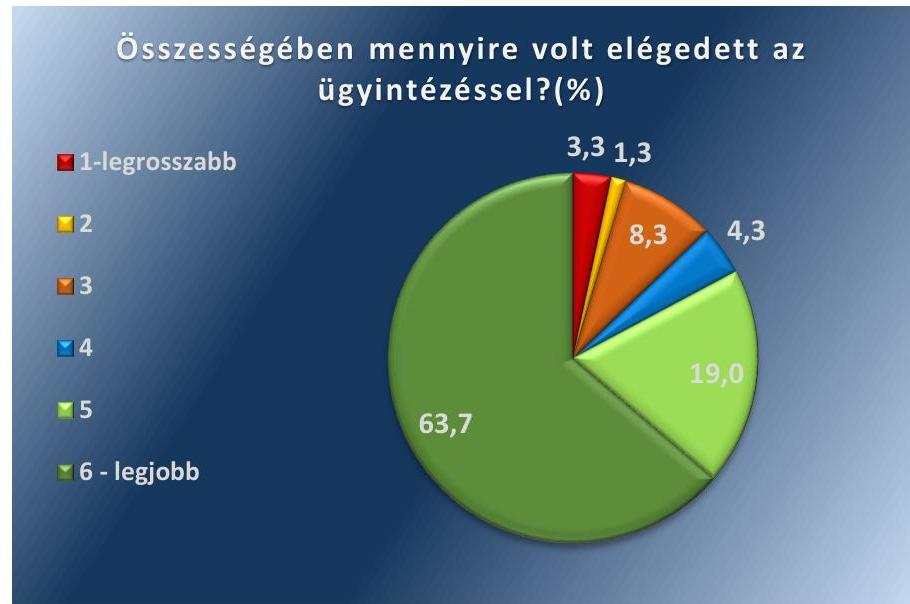

Forrás: ÁSZ szerkesztés kérdőíves felmérés alapján

---

A megkérdezettek jelentős hányadának, 83,3%-ának véleménye szerint a támogatások igénybevételéhez szükséges információk megszerzése nem okozott nehézséget. A legnépszerűbb információszerzési csatorna az internet volt, a megkérdezettek 36,3%-a az internetről tájékozódott, azonban továbbra is jelentős volt azok aránya (megkérdezettek 32,7%-a), akik a kérelmek beadásához szükséges feltételekről, a csatolandó dokumentumokról személyesen érdeklődtek a kormányhivataloknál. A rendelkezésre álló információk érthetőségével a megkérdezettek döntő többsége, 82,3%-a elégedett volt, a szükséges dokumentumok megszerzése során 88,3%-uk nem tapasztalt nehézséget.

A kérelmüket személyesen benyújtók 85,8%-a elégedett volt az ügyintéző segítőkészségével, a kérelmüket személyesen benyújtók közel felének, 43,7%-ának elegendő volt egy személyes megjelenés ahhoz, hogy ügyét elintézze.

A kérelem benyújtását követően az igénybevevők 36,7%-át hiánypótlásra szólította fel az első fokon eljáró hatóság. A hiánypótlási felhívásban foglaltak a megkérdezettek többségének, 80,0%-ának volt egyértelmű.

A kérelmek elbírálásáról a támogatást igénybevevők 85,0%-a a kérelem beadását követő 60 napon belül határozatban értesült. Az igénybevevők döntő többsége, 95,3%-a nem nyújtott be fellebbezést a határozat ellen.

---

# JAVASLATOK 

Az ÁSZ tv. 33. § (1) bekezdésében foglaltak értelmében az ellenőrzött szervezet vezetője köteles a jelentésben foglalt megállapításokhoz kapcsolódó intézkedési tervet összeállítani és azt a jelentés kézhezvételétől számított 30 napon belül az ÁSZ részére megküldeni. Amennyiben az ellenőrzött szervezet vezetője nem küldi meg határidőben az intézkedési tervet, vagy továbbra sem elfogadható intézkedési tervet küld, az Állami Számvevőszék elnöke az ÁSZ tv. 33. § (3) bekezdés a) és b) pontjaiban foglaltakat érvényesítheti.

## Borsod-Abaúj-Zemplén Megyei Kormányhivatal kormánymegbízottjának

1. Intézkedjen az Áht. és a Kormányhivatali SZMSZ előírásainak megfelelő egységes ügyrend kiadásáról.
(1.1. sz. megállapítás 2. bekezdés második mondata alapján)

## Tolna Megyei Kormányhivatal kormánymegbízottjának

1. Intézkedjen az Áht. és a Kormányhivatali SZMSZ előírásainak megfelelő egységes ügyrend kiadásáról.
(1.1. sz. megállapítás 2. bekezdés második mondata alapján)

## Veszprém Megyei Kormányhivatal kormánymegbízottjának

1. Intézkedjen az Áht. és a Kormányhivatali SZMSZ előírásainak megfelelő egységes ügyrend kiadásáról.
(1.1. sz. megállapítás 2. bekezdés második mondata alapján)
2. Intézkedjen az informatikai biztonsági szabályzat kiadásáról.
(1.1. sz. megállapítás
 3. bekezdés második mondata alapján)

## Zala Megyei Kormányhivatal kormánymegbízottjának

1. Intézkedjen az informatika biztonsági szabályzat kiadásáról.
(1.1. sz. megállapítás 3. bekezdés második mondata alapján)

---

# MELLÉKLETEK 

- I. SZ. MELLÉKLET: ÉRTELMEZŐ SZÓTÁR
biztonsági osztály
biztonsági osztályba sorolás
evaluáció
információ
intézkedési terv
jogalap nélkül felvett ellátás
jogosulatlanul igénybevett támogatás
Nemzeti Család- és Szociálpolitikai Alap felhasználása központi kezelésű előirányzat

Az elektronikus információs rendszer védelmének elvárt erőssége (Forrás: Ibtv. 1. § (1) bekezdés 11. pont).

A kockázatok alapján az elektronikus információs rendszer védelme elvárt erősségének meghatározása (Forrás: Ibtv. 1. § (1) bekezdés 12. pont).
A vonatkozó szakpolitika globális, rövid, valamint hosszú távú hatásának vizsgálata, továbbá az igénybevevőknek a közszolgáltatásra vonatkozó tapasztalatai alapján, az elégedettségüknek a mérése.

Bizonyos tényekről, tárgyakról vagy jelenségekről hozzáférhető formában megadott megfigyelés, tapasztalat vagy ismeret, amely valakinek a tudását, ismeretkészletét, annak rendezettségét megváltoztatja, átalakítja, alapvetően befolyásolja, bizonytalanságát csökkenti vagy megszünteti (Forrás: Ibtv. 1. § (1) bekezdés 25. pont).

Az ellenőrzési javaslatok alapján az ellenőrzött szervezet, szervezeti egység által készített intézkedések végrehajtásának ütemezése a végrehajtásáért felelős személyek és a vonatkozó határidők megjelölésével. (Bkr. 2. § k) pont)
Jogalap nélkül veszi igénybe az ellátást az a személy, aki arra nem jogosult, vagy kevesebb összegre jogosult, mint amelyet számára folyósítottak.(Forrás: Cst. ${ }^{19} 41 . \S$ (1) bekezdés, Fot tv. ${ }^{20}$ 23/E. § (4) bekezdés).
A jogszabálysértően, nem rendeltetésszerűen, vagy szerződésellenes módon felhasznált költségvetési támogatás. (Forrás: Ávr. ${ }^{21} 1 . \S$ e) pont).
A Nemzeti Család- és Szociálpolitikai Alapból történt kifizetések értendők az Alap felhasználásaként
A központi kezelésű előirányzatok az állam nevében beszedendő költségvetési bevételek és teljesítendő költségvetési kiadások elszámolására szolgálnak. (Forrás: Áht. 6/A. § (2) bekezdés)

---

# II. SZ. MELLÉKLET: A NEMZETI CSALÁD- ÉS SZOCIÁLPOLITIKAI ALAP JOGCÍMEI ÉS AZ ELIÁRÓ HATÓSÁGOK 

## NCSSZA TÁMOGATÁSOKKAL KAPCSOLATBAN FELADATELLÁTÁSBAN ELIÁRÓ HATÓSÁGOK 2017-2018. ÉVEKBEN

| Jogcímek | Elsőfokú hatóság /   ellátásra jogosultak | Másodfokú hatóság /   ellátásra jogosultak | Folyósító szerv |
| :--: | :--: | :--: | :--: |
| Családi támogatások |  |  |  |
| Családi pótlék   Anyasági támogatás   Gyermekgondozást segítő ellátás   Gyermeknevelési támogatás | fővárosi és megyei kormányhi-   vatal járási (fővárosi kerületi)   hivatala | Budapest Főváros   Kormányhivatala | Magyar Államkincstár |
| Gyermekek születésével kapcsolatos szabadság   megtérítése | Magyar Államkincstár | Magyar Államkincstár | Magyar Államkincstár |
| Életkezdési támogatás |  |  |  |
| Gyermektartásdíjak megelőlegezése | fővárosi és megyei kormányhi-   vatal járási (fővárosi kerületi)   hivatala | fővárosi és megyei   kormányhivatal | fővárosi és megyei kor-   mányhivatal |
| Jövedelempótló és jövedelemkiegészítő szociális ellátások |  |  |  |
| Átmeneti bányászjáradék, szénjárandóság kie-   egészítése és kereset-kiegészítése | Magyar Államkincstár | Magyar Államkincstár | Magyar Államkincstár |
| Fogyatékossági támogatás és a vakok személyi   járadéka | fővárosi és megyei kormányhi-   vatal járási (fővárosi kerületi)   hivatala | Budapest Főváros   Kormányhivatala | Magyar Államkincstár |
| Mezőgazdasági járadék   Házastársi pótlék   Egyéb támogatások (Cukorbetegek támogatása,   Lakbértámogatás) | - | - | Magyar Államkincstár |
| Politikai rehabilitációs és más nyugdíj-kiegészíté-   sek |  |  |  |
| - tartós időtartamú szabadságelvonást elszenve-   dettek részére járó juttatás | Magyar Államkincstár | Magyar Államkincstár |  |
| - nemzeti helytállásért elnevezésű pótlék | - Nemzeti Ellenállás Emléklappal, Nemzeti Ellenállásért   Emléklappal, illetve Szabad Magyarországért Emléklappal   kitüntetett |  |  |
| - Magyar Tudományos Akadémiai tiszteletdíj | - Magyar Tudományos Akadémia hazai tagja, Magyar Tu-   dományos Akadémia Doktora címmel rendelkező, illetve   akadémikus elhalálozása esetén hozzátartozója |  |  |
| - szépkorúak jubileumi juttatása | - a 90., a 95., a 100., a 105., a 110. és 115. életévüket be-   töltöttek |  |  |
| - nyugdíjkiegészítésnek megfelelő pótlék | - felnőtt világbajnokság egyéni, illetve csapatverseny szá-   mában világbajnoki címet szerzett személyek, „Miniszter-   elnöki elismerés a nemzeti ellenállási mozgalomban és né-   metellenes szabadságharcban szerzett érdemekért" kitün-   tetetteknek, a „Magyar Szabadság Érdemrend" 1948. dec-   ember 31-e előtti kitüntetetteknek, azokat a személyeket   is, akik a kitüntetést tudományos, sport, múvészeti vagy   más, a nemzet számára kiemelkedően hasznos munkássá-   guk elismeréseként kapták |  | Magyar Államkincstár |
| - Kiváló Művész, Érdemes Művész és Népmű-   vészet Mestere járadék | - „Magyar Népköztársaság Kiváló Művésze", a „Magyar   Köztársaság Kiváló Művésze", a „Magyar Népköztársaság   Érdemes Művésze", a Magyar Köztársaság Érdemes Művé-   sze" címben részesültek |  |  |
| - nemzeti gondozási díj | - kárpótlási hatóság határozata alapján |  |  |

---

| Jogcímek | Elsőfokú hatóság /   ellátásra jogosultak | Másodfokú hatóság /   ellátásra jogosultak | Folyósító szerv |
| :--: | :--: | :--: | :--: |
| Megváltozott munkaképességűek kereset-kiegé-   szítése | Komárom-Esztergom Megyei   Kormányhivatal Tatabányai Já-   rási Hivatala | Budapest Főváros   Kormányhivatala | Magyar Államkincstár |
| Járási szociális feladatok ellátása | fővárosi és megyei kormányhi-   vatal járási (fővárosi kerületi)   hivatala | fővárosi és megyei   kormányhivatal | fővárosi és megyei kor-   mányhivatal |

Forrás: Ász szerkesztés

---

1. családi pótlék,
2. anyasági támogatás,
3. gyermekgondozást segítő ellátás,
4. gyermeknevelési támogatás,
5. gyermekek születésével kapcsolatos szabadság megtérítése,
6. életkezdési támogatás,
7. gyermektartásdíjak megelőlegezése,
8. átmeneti bányászjáradék,
9. szénjárandóság kiegészítése és kereset kiegészítése,
10. mezőgazdasági járadék,
11. fogyatékossági támogatás és a vakok személyi járadéka,
12. politikai rehabilitációs és más nyugdíj-kiegészítések,
13. házastársi pótlék,
14. egyéb támogatások (Cukorbetegek támogatása, Lakbértámogatás), megváltozott munkaképességűek kereset kiegészítése,
15. járási szociális feladatok ellátása.

---

# 1. LÉNYEGES KÉRDÉSKÖR 1.1. SZÁMÚ MEGÁLLAPÍTÁS ELLENŐRZÖTT SZERVEZETENKÉNT 

1. táblázat

| Ellenőrzött szervezet neve | 1. lényeges kérdéskör 1.1. számú megállapítás   A szervezeti egységekre vonatkozó szabály-   szabályokat az Áht. 10. § (5) bekezdése   szerint ügyrendben szabályozta-e? |  |  | Az informatikai biztonsági szabály-   zatot az Ibtv. 11. § (1) bekezdés f)   pontja előírásával összhangban ki-   adta-e? |  |
| :--: | :--: | :--: | :--: | :--: | :--: |
|  | Igen. | Nem. | Igen. | Nem. |
| Magyar Államkincstár | Igen. |  | Igen. |  |
| Budapest Főváros Kormányhivatala | Igen. |  | Igen. |  |
| Bács-Kiskun Megyei Kormányhivatal | Igen. |  | Igen. |  |
| Baranya Megyei Kormányhivatal | Igen. |  | Igen. |  |
| Békés Megyei Kormányhivatal | Igen. |  | Igen. |  |
| Borsod-Abaúj-Zemplén Megyei Kormányhivatal | Igen. Miskolci Járási Hivatal. | Nem. | Igen. |  |
| Csongrád Megyei Kormányhivatal | Igen. |  | Igen. |  |
| Fejér Megyei Kormányhivatal | Igen. |  | Igen. |  |
| Győr-Moson-Sopron Megyei Kormányhivatal | Igen. |  | Igen. |  |
| Hajdú-Bihar Megyei Kormányhivatal | Igen. |  | Igen. |  |
| Heves Megyei Kormányhivatal | Igen. |  | Igen. |  |
| Jász-Nagykun-Szolnok Megyei Kormányhivatal | Igen. |  | Igen. |  |
| Komárom-Esztergom Megyei Kormányhivatal | Igen. |  | Igen. |  |
| Nógrád Megyei Kormányhivatal | Igen. |  | Igen. |  |
| Pest Megyei Kormányhivatal | Igen. |  | Igen. |  |
| Somogy Megyei Kormányhivatal | Igen. |  | Igen. |  |
| Szabolcs-Szatmár-Bereg Megyei Kormányhivatal | Igen. |  | Igen. |  |
| Tolna Megyei Kormányhivatal | Igen. Az érintett szervezeti egységekre vonatkozó közös szabályok. | Nem. | Igen. |  |
| Vas Megyei Kormányhivatal | Igen. |  | Igen. |  |
| Veszprém Megyei Kormányhivatal | Igen. Veszprémi Járási Hivatal. | Nem. |  | Nem. |
| Zala Megyei Kormányhivatal | Igen. |  |  | Nem. |

---

.

---

# FÜGGELÉK: ÉSZREVÉTELEK 

A jelentéstervezetet a Számvevőszék 15 napos észrevételezésre megküldte az ellenőrzött szervezetek vezetőinek az ÁSZ tv. 29. § (1) bekezdése előírásának megfelelően.

A Magyar Államkincstár, Budapest Főváros Kormányhivatala, a Baranya Megyei Kormányhivatal, a Békés Megyei Kormányhivatal, a Győr-Moson-Sopron Megyei Kormányhivatal, a Pest Megyei Kormányhivatal, a Somogy Megyei Kormányhivatal, a Szabolcs-Szatmár-Bereg Megyei Kormányhivatal nemleges észrevételt tett. Ezeket a függelékben szerepeltetjük.
A Borsod-Abaúj-Zemplén Megyei Kormányhivatal, a Heves Megyei Kormányhivatal, a Komárom-Esztergom Megyei Kormányhivatal, a Veszprém Megyei Kormányhivatal, a Zala Megyei Kormányhivatal észrevételét és az arra adott választ a függelék tartalmazza.
A Bács-Kiskun Megyei Kormányhivatal, a Csongrád Megyei Kormányhivatal, a Fejér Megyei Kormányhivatal, a Hajdú-Bihar Megyei Kormányhivatal, a Jász-Nagykun-Szolnok Megyei Kormányhivatal, a Nógrád Megyei Kormányhivatal, a Tolna Megyei Kormányhivatal, a Vas Megyei Kormányhivatal nem tett észrevételt.

[^0]
[^0]:    * 29. § (1) Az Állami Számvevőszék az ellenőrzési megállapításait megküldi az ellenőrzött szervezet vezetőjének vagy az általa megbízott személynek, és annak, akinek személyes felelősségét állapította meg.
    (2) Az ellenőrzött szervezet vezetője és a felelősként megjelölt személy az ellenőrzés megállapításaira tizenöt napon belül írásban észrevételt tehet.
    (3) Az Állami Számvevőszék az észrevételre a beérkezésétől számított harminc napon belül írásban válaszol. A figyelembe nem vett észrevételeket köteles a jelentésben feltüntetni, és megindokolni, hogy azokat miért nem fogadta el.

---

# Magyar   Államkincstár 

Iktatószám: BEKFO/35-15/2020.
Hiv. számok: EL-2010-341/2020.

Domokos László úr részére
elnök

Állami Számvevőszék
Budapest

Tárgy: „Nemzeti Család- és Szociálpolitikai Alap ellenőrzése" című jelentéstervezet észrevételezése

## Tisztelt Elnök Úr!

A „Nemzeti Család- és Szociálpolitikai Alap ellenőrzése" tárgyú vizsgálathoz kapcsolódó EL-2010-341/2020. iktatószámú jelentéstervezetet és annak EL-2010362/2020. iktatószámú kísérő levelét köszönettel megkaptuk. A jelentéstervezetet áttekintettük, az abban foglaltakkal kapcsolatban észrevételt nem fogalmaztunk meg.

Kérem tájékoztatásom szíves elfogadását.

Budapest, 2020. május 15.

Tisztelettel:
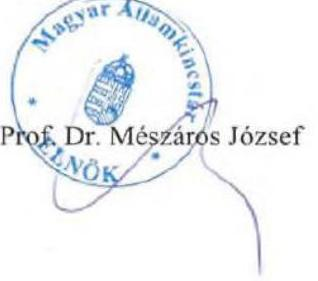

---

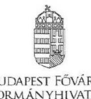

BUDAPEST FŐVÁROS
KORMÁNYHIVATALA

KORMÁNYMEGBIZOTT

Domokos László elnök úr
részére

Állami Számvevőszék
Budapest
Apáczai Csere János utca 10.
1052

Iktatószám: BP-08/200/00012-3/2020
Ügyintéző: Oroszné Tóth Zita
Telefonszám: (53) 795-309
E-mail: cstam.ceg@cst.bfkh.gov.hu
Tárgy: Nemzeti Család- és Szociálpolitikai Alap
ellenőrzése

Tisztelt Elnök Úr!

A „Nemzeti Család- és Szociálpolitikai Alap ellenőrzése" címen lefolytatott ellenőrzésről készült
jelentéstervezet Budapest Főváros Kormányhivatala számára nem fogalmazott meg intézkedési
javaslatot, így arra észrevételt nem kívánok tenni.

Budapest, 2020. május 15.

Tisztelettel:

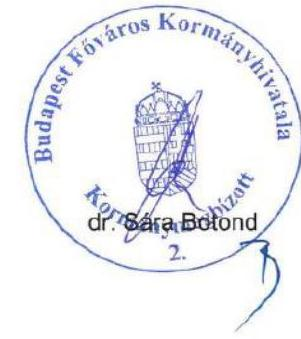

1139 Budapest, Tave u. 1/a-c. - 1364 Bp., Pf.: 234. - Telefonszám: +36 (1) 896-2441 - Fax: +36 (1) 237-4862
E-mail: kormanymegbizott@bfkh.gov.hu - Honlap: www.kormanyhivatal.hu

---

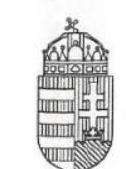

# BARANYA MEGYEI KORMÁNYHIVATAL 

## Domokos László elnök úr részére

## Állami Számvevőszék

Budapest 4.
Apáczai Csere János u. 10.
Pf. 54.
1364

Iktatószám: BA/8/00122-1/2/2020.
Tárgy: Az NCSSZA ellenőrzéséről szóló
jelentéstervezetre kormányhivatali
észrevétel tétele
Ügyintéző: Kaufmann Eszter
Elérhetőség: 72/507-064

## Tisztelt Elnök Úr!

Hivatkozással a 2020. május 5. napján postai úton érkezett EL-2010-362/2020. számú és a „Nemzeti Család- és Szociálpolitikai

 Alap ellenőrzése" címú jelentéstervezetet tartalmazó megkeresésére tájékoztatom, hogy a Baranya Megyei Kormányhivatal - az Állami Számvevőszékről szóló 2011. évi LXVI. törvény 29. § (2) bekezdése szerint - a jelentéstervezetben foglalt megállapításokra észrevételt nem kíván tenni.

Kérem tájékoztatásom szíves tudomásulvételét.

Pécs, 2020. május …,

Tisztelettel:
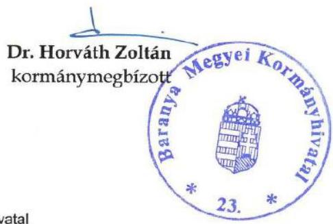

Baranya Megyei Kormányhivatal
7623 Pécs, József Attila u. 10. of: 7602 Pécs, Pf.: 405.
+36-72 507-001 & +36-72 507-012 〇 hivatal@baranya.gov.hu Honlap: www.bamkh.hu

---

# BÉKÉS MEGYEI KORMÁNYHIVATAL

|  Ügyiratszám: | BE/16/230-5/2020 | Tárgy: | a „Nemzeti Család- és Szociálpolitikai Alap ellenőrzése" címmel készített jelentéstervezet  |
| --- | --- | --- | --- |
|  Ügyintéző: | Gajdács Márta | Hiv.sz. | EL-2010-362/2020.  |
|  Telefon: | (66) 519-134 | Mell: | -  |
|  |   |   |   |

## Domokos László részére

elnök

## Állami Számvevőszék

## Budapest

Apáczai Csere János u. 10. 1052

## Tisztelt Elnök Úr!

Tájékoztatom, hogy az Állami Számvevőszék „Nemzeti Család- és Szociálpolitikai Alap ellenőrzése" című ellenőrzésével kapcsolatos jelentéstervezetet áttekintettük. A jelentéstervezetre nem kívánunk észrevételt tenni.

Békéscsaba, 2020. május 14.

Tisztelettel:

Dr. Takács Árpád kormánymegbízott

5600 Békéscsaba, Derkovits sor 2., Pf.: 389. Telefon: (+36 66) 622-000 Fax: (+36 66) 622-001 E-mail: vezeto@bekes.gov.hu Honlap: www.kormanyhivatal.hu/hu/bekes

Kér azonosító: KHIV BEK, Hivatali kapu: BEMKH, KRID: 202899335

---

# GYÖR-MOSON-SOPRON MEGYEI KORMÁNYHIVATAL 

Iktatószám: GY/13/32-15/2020.
Ügyintéző: dr. Kiss Viktória
Telefon: (96) 796 - 620

Tárgy: jelentéstervezet véleményezése
Melléklet: -
Hiv. szám: EL-2010-362/2020.

## Domokos László úr

elnök

## Állami Számvevőszék

## BUDAPEST

Apáczai Csere János u. 10.
1364

Tisztelettel Elnök Úr!

Hivatkozással az EL-2010-362/2020. iktatószámú levélben foglaltakra, tájékoztatom, hogy a Győr-Moson-Sopron Megyei Kormányhivatalt érintő „Nemzeti Család- és Szociálpolitikai Alap ellenőrzése" címmel készített számvevőszéki jelentéstervezetben foglaltakkal kapcsolatban a Kormányhivatal észrevételt nem kíván tenni.

Győr, 2020. május 19.

Tisztelettel
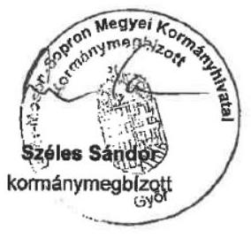

---

# PEST MEGYEI   KORMÁNYHIVATAL 

| Úgyiratszám: PE/080/01347-1/2020 | Tárgy: tájékoztatás |
| :-- | :-- |
| Úgyintéző: dr. Mekler Anikó | Hiv. szám: EL-2010-362/2020 |
| Telefon: 328-5889 | Melléklet: - |

## Domokos László részére

elnök

## Állami Számvevőszék

Budapest 4.
Pf. 54
1364

Tisztelt Elnök Úr!
ASZ0000001051

A "Nemzeti Család- és Szociálpolitikai Alap ellenőrzése" címmel készített számvevőszéki jelentéstervezettel kapcsolatban a Pest Megyei Kormányhivatal nem kíván észrevételt tenni.

A jelentéstervezet megállapításaiban foglaltakat a szabályzatok elkészítése, az eljárási rendek kialakítása, folyamatos karbantartása során kiemelt figyelemmel kezeljük.

Budapest, 2020. május … 4.
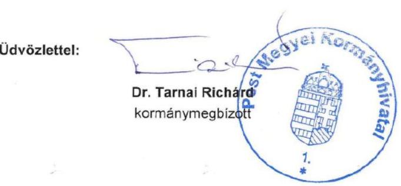

---

# SOMOGY MEGYEI KORMÁNYHIVATAL 

| Ikt.szám: | SO/CSTB/182-4/2020. | Tárgy: | Tájékoztatás számvevőszéki |
| :-- | :-- | :-- | :-- |
| Ügyintéző: | Sárdi Gabriella | Hiv.sz: | jelentéstervezethez   EL-2010-362/2020. |

## Domokos László

elnök

## Állami Számvevőszék

## BUDAPEST

Apáczai Csere János u. 10.
1052

## Tisztelt Elnök Úr!

Hivatkozva a fenti számú megkeresésére tájékoztatom, hogy a „Nemzeti Család- és Szociálpolitikai Alap ellenőrzése" címmel készített számvevőszéki jelentéshez észrevételt nem kívánunk tenni.

A számvevőszék vizsgálati anyagával kapcsolatban biztosított vélemény-nyilvántartási lehetőséget megköszönöm.

Kaposvár, 2020. május 12.
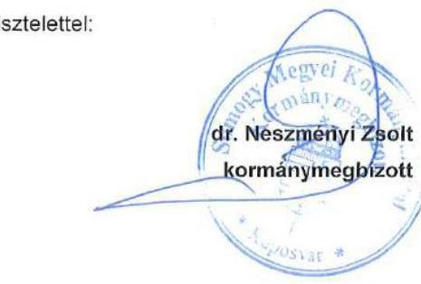

---

# SZABOLCS-SZATMAR-BEREG MEGYEI KORMÁNYHIVATAL 

KORMÁNYMEGBÍZOTT

## Domokos László   elnök úr

részére
Állami Számvevőszék
Budapest 4.
Pf. 54.
1364

Iktatószám: Sz/164/00245-2/2020.
Tárgy: A „Nemzeti Család- és
Szociálpolitikai Alap ellenőrzése" jelentéstervezetének észrevételezése

## Tisztelt Elnök Úr!

Köszönettel vettük az Állami Számvevőszék által a „Nemzeti Család- és Szociálpolitikai Alap ellenőrzése" jelentéstervezetének megállapításait, mely szerint 2017-2018. években

- a Nemzeti Család- és Szociálpolitikai Alap felhasználásában közreműködő fővárosi és megyei kormányhivatalok a működés kereteit kialakították,
- az NCSSZA felhasználását támogató informatikai rendszerek biztosították a megfelelő feladatellátást,
- az Állami Számvevőszék korábbi ellenőrzése eredményeként a hatósági ügyek intézése területén a feltárt kockázatokat csökkentették, a hatósági feladatok ellátása szabályszerű volt,
- a támogatásokkal, ellátásokkal érintett megkérdezettek elégedettek voltak a kormányhivatal feladatellátásának folyamatával, végrehajtásával.

A jelentéstervezetben az ellenőrzés megállapította, hogy a kormányhivatalok az NCSSZA feladatok ellátását szolgáló valamennyi informatikai rendszert - az Ibtv. 7. § (1) bekezdésének előírása ellenére - nem sorolták be biztonsági osztályba a bizalmasság, a sértetlenség és a rendelkezésre állás szempontjából, melyről figyelmeztető levélben tájékoztatta hivatalunkat.

A figyelmeztető levélre adott válaszunkban tájékoztattuk Tisztelt Elnök Urat, hogy a szükséges intézkedéseket hivatalunk megtette, mely szerint a Szabolcs-Szatmár-Bereg Megyei kormányhivatal valamennyi informatikai rendszerének az Ibtv. 7. § (1) bekezdésének előírásai szerint a bizalmasság, a sértetlenség és a rendelkezésre állás

---

szempontjából besorolta, és javaslatot tettünk az Informatikai Biztonsági Szabályzat elfogadására.

Nyíregyháza, 2020. május 18.

Tisztelettel:
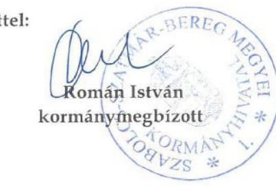

---

# Függelék: Észrevételek 

## BORSOD-ABAÚJ-ZEMPLÉN MEGYEI KORMÁNYHIVATAL

Iktatószám: BO/12/00130-6/2020.
Ügyintéző: Kozmáné
Telefon: 46 / 512-916

Tárgy: Észrevétel jelentéstervezetre
Hiv.sz.: EL-2010-362/2020.
Melléklet: -

## Állami Számvevőszék

## Budapest

Apáczai Csere János utca 10.
1052

## Tisztelt Elnök Úr!

A fenti hivatkozási számon megküldött levele mellékleteként érkezett, a „Nemzeti Család- és Szociálpolitikai Alap ellenőrzése" címmel készített számvevőszéki jelentéstervezetet megismertem, azzal kapcsolatosan az alábbi észrevételt teszem.

A jelentéstervezet Javaslatok fejezetében a Borsod-Abaúj-Zemplén Megyei Kormányhivatal kormánymegbízottja számára megfogalmazásra került, hogy intézkedjen az Áht. és a Kormányhivatali SZMSZ előírásainak megfelelő egységes ügyrend kiadásáról.

Ez a javaslat a jelentéstervezet Megállapítások című fejezetében szereplő 1.1. számú megállapítás második bekezdése alapján került megfogalmazásra, miszerint „Három kormányhivatal az Áht. 10. § (5) bekezdése, valamint a Kormányhivatali SZMSZ 31. § (1) bekezdése előírása ellenére a szervezeti egységekre, azok működési rendjére vonatkozó szabályokat tartalmazó ügyrendjei nem tartalmazzák az érintett szervezeti egységekre vonatkozó közös szabályokat, a kormánymegbízott által közvetlenül vezetett szervezeti egységek, valamint valamennyi járási hivatal ügyrendjét."

A javaslat és „Az ÁSZ ellenőrzés megállapításai ellenőrzött szervezetenként" elnevezésű IV. sz. melléklet táblázatos kimutatása szerint az Állami Számvevőszék a megállapításban foglalt három kormányhivatal közé sorolja a Borsod-Abaúj-Zemplén Megyei Kormányhivatalt is.

A fentiekkel kapcsolatosan tájékoztatom Elnök Urat, hogy a Borsod-Abaúj-Zemplén Megyei Kormányhivatal egységes ügyrendje a BO/10/00042-186/2017. illetve a BO/10/00053-68/2018. iktatószámon kiadásra került, ennek megfelelően a Kormányhivatal a vonatkozó jogszabályoknak

---

megfelelően folyamatosan rendelkezett/rendelkezik egységes ügyrenddel, mely a kormányhivatali honlapon is közzétételre került.

Az ellenőrzéshez nyújtott adatszolgáltatás során Tóth Marianna Programozási Vezető asszony EL-2010-014/2019. iktatószámú levele 2. számú mellékletének 1.3. pontjában foglalt előírásnak - a „támogatásokkal kapcsolatos feladatokat ellátó szervezeti egység ügyrendje" -megfelelően a Borsod-Abaúj-Zemplén Megyei Kormányhivatal egységes ügyrendjének - a feladatellátással érintett szervezeti egységre, a Miskolci Járási Hivatalra vonatkozó - kivonata, valamint a feladatellátáshoz kapcsolódó folyamatábrák és folyamatleírások kerültek az adatszolgáltatási felületre feltöltésre.

Az Állami Számvevőszék rendelkezésére bocsátott ügyrend kivonatok előlapján a „II. 21. melléklet" jelzés szerepel, az oldalszámozásukon is látszik, hogy 2017. évben ez a melléklet a 305-389, 2018-ban pedig a 298-379. oldalakat foglalta el.

Levelem mellékleteként - az Egységes Ügyrendek terjedelmére tekintettel - adathordozóra (CD) kiírva megküldöm a két hivatkozott dokumentumot.

Kérem Tisztelt Elnök Urat, hogy észrevételemet figyelembe venni, és ennek alapján a végleges számvevőszéki jelentés elkészítésekor a jelentéstervezet Borsod-Abaúj-Zemplén Megyei Kormányhivatalt érintő részeit (a Megállapítások és Javaslatok fejezetben, valamint a IV. sz. mellékletben) módosítani szíveskedjen.

Miskolc. 2020. május 15.

Tisztelettel:
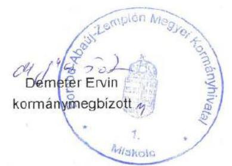

---

# 150 éve   a közzététel öröme 

Ikt. szám: EL-2010-393/2020.

Demeter Ervin úr
kormánymegbízott

Borsod-Abaúj-Zemplén Megyei Kormányhivatal

## Miskolc

Tisztelt Kormánymegbízott Úr!

A „Nemzeti Család- és Szociálpolitikai Alap ellenőrzése" címmel készített számvevőszéki jelentéstervezetre tett BO/12/00130-6/2020. iktatószámú észrevételét köszönettel megkaptam.

Az Állami Számvevőszék észrevételre vonatkozó álláspontjáról a felügyeleti vezető által készített részletes tájékoztatást mellékelten megküldöm.

Tájékoztatom Kormánymegbízott urat, hogy a számvevőszéki jelentésben - az Állami Számvevőszékről szóló 2011. évi LXVI. törvény 29. § (3) bekezdése alapján - a figyelembe nem vett észrevételt szerepeltetjük, annak indoklásával, hogy azt az Állami Számvevőszék miért nem fogadta el.

Budapest, 2020. 86 hó 46 nap

Melléklet: Tájékoztatás az észrevétel kezeléséről
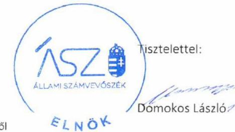

---

Melléklet
Ikt.szám: EL-2010-393/2020.

# Tájékoztatás   az észrevétel kezeléséről 

A „Nemzeti Család- és Szociálpolitikai Alap ellenőrzése" című jelentéstervezetre 2020. május 19-én érkezett észrevételt áttekintettük, annak kezelésével kapcsolatban a következő tájékoztatást adom.

Az észrevétel érinti a jelentéstervezet 1.1. számú megállapítás második bekezdését és az ez alapján megfogalmazott javaslatot. A megállapítás szerint „Három kormányhivatal az Áht. 10. § (5) bekezdése, valamint a Kormányhivatali SZMSZ 31. § (1) bekezdése előírása ellenére a szervezeti egységekre, azok működési rendjére vonatkozó szabályokat tartalmazó ügyrendjei nem terjedtek ki valamennyi szervezeti egységükre, ügyrendjeik nem tartalmazták az érintett szervezeti egységekre vonatkozó közös szabályokat, a kormánymegbízott által közvetlenül vezetett szervezeti egységek, valamint valamennyi járási hivatal ügyrendjét."

Az észrevétel szerint az ÁSZ részére nyújtott adatszolgáltatásban a Borsod-Abaúj-Zemplén Megyei Kormányhivatal egységes ügyrendjének a kivonata szerepelt figyelemmel arra, hogy az ÁSZ adatbekérése a támogatásokkal kapcsolatos feladatokat ellátó szervezeti egység ügyrendjére vonatkozott. Továbbá az észrevétel mellékleteként ennek igazolására becsatolta az egységes ügyrendet.

Tájékoztatom, hogy az Állami Számvevőszék minden esetben az adatszolgáltatásra nyitva álló törvényi határidőben megküldött és az ellenőrzött által kiállított teljességi és hitelességi nyilatkozattal alátámasztott, hiteles, ellenőrzési bizonyítékként felhasználható dokumentumok alapján teszi az ellenőrzési megállapításait.

Az EL-2010-014/2019. iktatószámú Adatbekérő levél 2. sz. mellékletének 1.2. alpontja szerint bekérésre került: támogatásokkal kapcsolatos feladatokat ellátó szervezeti egység ügyrendje. Az adatbekérő levélben az ÁSZ felhívta a figyelmet arra, hogy az aláírt és hiteles dokumentumokat kéri megküldeni az ÁSZ részére. Az adatszolgáltatás keretében feltöltött, észrevételben hivatkozott ügyrend kivonatok nem tartalmazták a hatályba lépés dátumát, valamint a kiadmányozó személy aláírását, ennek következtében a dokumentumok hitelesnek nem fogadhatók el, ellenőrzési bizonyítékként való felhasználásra nem alkalmasak. Mindezek alapján az észrevételt nem fogadjuk el. A jelentéstervezet módosítása nem indokolt.

Budapest, 2020. 06 hó 16 nap
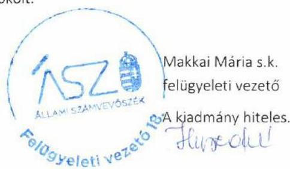

---

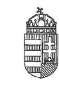

Aláíró: Dr. Pajtók Gábor József Heves Megyei Kormányhivatal (2020.05.13. 16:29:26)

# Heves Megyei Kormányhivatal

**Dr. Pajtók Gábor**

Kormánymegbízott

|  Iktatószám: | HE/KM/2-23/2020.  |
| --- | --- |
|  Hiv. szám: | EL-2010-351/2020.  |
|   | EL-2010-362/2020.  |

Domokos László elnök úr részére

Állami Számvevőszék

Budapest kizárólag hivatali tárhelyre küldve

Tárgy: Észrevétel a "Nemzeti Család- és Szociálpolitikai Alap ellenőrzése" című ellenőrzésről készült számvevőszéki jelentéstervezethez és a jelentéstervezet alapján készült figyelmeztető levélhez

## Tisztelt Elnök Úr!

EL-2010-362/2020. számú levelében tájékoztatott arról, hogy az Állami Számvevőszék (a továbbiakban: ÁSZ) befejezte a "Nemzeti Család- és Szociálpolitikai Alap ellenőrzése" című ellenőrzését.

A "Nemzeti Család- és Szociálpolitikai Alap ellenőrzése" című ellenőrzésről készült számvevőszéki jelentéstervezet (a továbbiakban: jelentéstervezet) 1. MEGÁLLAPÍTÁSOK 1.2. számú megállapítása szerint a kormányhivatalok az állami és önkormányzati szervek elektronikus információbiztonságáról szóló 2013. évi L. törvény 7. § (1) bekezdésének előírása ellenére a Nemzeti Család- és Szociálpolitikai Alap családtámogatási és fogyatékossági támogatásával kapcsolatos feladatok ellátását támogató valamennyi informatikai rendszer biztonsági osztályba sorolását nem végezték el a bizalmasság, a sértetlenség és a rendelkezésre állás szempontjából (érintett informatikai rendszerek: TÉBA).

Az Állami Számvevőszékről szóló 2011. évi LXVI. törvény (továbbiakban: ÁSZ tv.) 29. § (2) bekezdése alapján a jelentéstervezet 1. MEGÁLLAPÍTÁSOK 1.2. számú megállapítására a következő észrevételt teszem.

3300 Eger, Kossuth Lajos utca 9. - 3301. Eger Pf.: 216. - Telefon: +36 (36) 521-500 - Fax: +36 (36) 521-525 E-mail: titkarsag@heves.gov.hu - Honlap: http://kormanyhivatal.hu/hu/heves

---

A jelentéstervezetben hivatkozott Támogatási Életút Bázis Adatok szakrendszert (TÉBA) központi szolgáltatóként a Magyar Államkincstár üzemelteti.

A Magyar Államkincstárról szóló 310/2017. (X.31.) Korm. rendelet 14. § (3) bekezdés f) pontja alapján a Magyar Államkincstár Kincstár központi szerve működteti és fejleszti a fogyatékossági támogatással, családtámogatási ellátásokkal kapcsolatban a szakmai feladatok ellátásához szükséges informatikai rendszereket. A családok támogatásáról szóló 1998. évi LXXXIV. törvény végrehajtásáról szóló 223/1998. (XII. 30.) Korm. rendelet 29. §-a pedig
 előírja, hogy a fővárosi és megyei kormányhivatal a hatáskörébe tartozó családtámogatási ellátásokkal kapcsolatos eljárásokban a Magyar Államkincstár központja által jóváhagyott központi szakmai informatikai rendszert köteles használni.

Az állami és önkormányzati szervek elektronikus információbiztonságáról szóló 2013. évi L. törvény (a továbbiakban: Ibtv.) 7. § (3)-(4) bekezdése a következőkről rendelkezik:
„(3) A biztonsági osztályba sorolást a szervezet vezetője hagyja jóvá, és felel annak a jogszabályoknak és kockázatoknak való megfelelőségéért, a felhasznált adatok teljességéért és időszerűségéért. A biztonsági osztályba sorolást a szervezet informatikai biztonsági szabályzatában kell rögzíteni.
(4) Az elektronikus információs rendszer bizalmasság, sértetlenség és rendelkezésre állás szerinti biztonsági osztálya alapján kell megvalósítani az 5. és 6. §-ban előírt védelmi intézkedéseket az adott elektronikus információs rendszerre vonatkozóan."

Az Ibtv. 11. § (1)-(2) bekezdése szerint:
„(1) A szervezet vezetője köteles gondoskodni az elektronikus információs rendszerek védelméről a következők szerint:
(2) Az (1) bekezdésben meghatározott feladatokért a szervezet vezetője az (1) bekezdés k) és l) pontjában meghatározott esetben is felelős, kivéve azokat az esetköröket, amikor jogszabály által kijelölt központosított informatikai és elektronikus hírközlési szolgáltatót, illetve központi adatkezelőt és adatfeldolgozó szolgáltatót kell a szervezetnek igénybe venni."

A központosított informatikai és elektronikus hírközlési szolgáltató információbiztonsággal kapcsolatos feladatköréről szóló 186/2015. (VII. 13.) Korm. rendelet (a továbbiakban: 186/2015. Korm. rendelet) 1. §-a szerint:
„1. § E rendelet alkalmazásában
a) központi szolgáltató: a jogszabály által kijelölt központosított informatikai és elektronikus hírközlési szolgáltató;
b) szolgáltatások: jogszabályban meghatározott, az állami és önkormányzati szervek elektronikus információbiztonságáról szóló 2013. évi L. törvény (a továbbiakban: Ibtv.) hatálya alá tartozó elektronikus információs rendszerek felhasználói számára a központi szolgáltató által kötelezően vagy egyedi igény alapján biztosítandó központosított informatikai és elektronikus hírközlési szolgáltatások."

A 186/2015. Korm. rendelet 2. § a) pontja alapján a központi szolgáltató alakítja ki a szolgáltatások esetében az informatikai biztonsági irányítási rendszerét.

---

Az állami és önkormányzati szervek elektronikus információbiztonságáról szóló 2013. évi L. törvényben meghatározott technológiai biztonsági, valamint a biztonságos információs eszközökre, termékekre, továbbá a biztonsági osztályba és biztonsági szintbe sorolásra vonatkozó követelményekről szóló 41/2015. (VII. 15.) BM rendelet 3. § (5) bekezdése alapján: „ha az elektronikus információs rendszert több szervezet használja, az elektronikus információs rendszer üzemeltetője az üzemeltetés elektronikus információbiztonságához szükséges követelményeket az elektronikus információs rendszeren tevékenységet végző minden, elektronikus információs rendszerrel rendelkező szervezet tekintetében érvényesíti."

Az ismertetett jogszabályhelyek alapján álláspontom szerint az elektronikus információbiztonsággal kapcsolatos valamennyi intézkedést - így az Ibtv. 7. § (3)-(4) bekezdése szerinti biztonsági osztályba sorolást is - a TÉBA szakrendszert üzemeltető Magyar Államkincstárnak kell elvégeznie. A központosított informatikai szolgáltatásról a Heves Megyei Kormányhivatal nem rendelkezik az Ibtv. szerinti besoroláshoz szükséges információkkal.

# Tisztelt Elnök Úr! 

Kérem, hogy észrevételemet szíveskedjen mérlegelni az ellenőrzési jelentés véglegesítésénél.
Az ellenőrzés során feltárt jogszabálysértő gyakorlat megszüntetése érdekében az ÁSZ tv. 33. § (6) bekezdésében szabályozott, EL-2010-351/2020. figyelemfelhívó levelében kért intézkedést a levelemben tett észrevételem elbírálását követően - annak ismeretében - fogom megtenni.

Kelt Egerben, az elektronikus tanúsítvány szerint

## Tisztelettel:

## dr. Pajtók Gábor

---

# 150 éve   a közpénzek őre 

ELNÖK

Ikt. szám: EL-2010-392/2020.

Dr. Pajtók Gábor úr
kormánymegbízott

Heves Megyei Kormányhivatal

## Eger

Tisztelt Kormánymegbízott Úr!

A „Nemzeti Család- és Szociálpolitikai Alap ellenőrzése" címmel készített számvevőszéki jelentéstervezetre tett HE/KM/2-23/2020. iktatószámú észrevételét köszönettel megkaptam.

Az Állami Számvevőszék észrevételre vonatkozó álláspontjáról a felügyeleti vezető által készített részletes tájékoztatást mellékelten megküldöm.

Tájékoztatom Kormánymegbízott urat, hogy a számvevőszéki jelentésben - az Állami Számvevőszékről szóló 2011. évi LXVI. törvény 29. § (3) bekezdése alapján - a figyelembe nem vett észrevételt szerepeltetjük, annak indoklásával, hogy azt az Állami Számvevőszék miért nem fogadta el.

Budapest, 2020. 04. hó 0. nap

Melléklet: Tájékoztatás az észrevétel kezeléséről
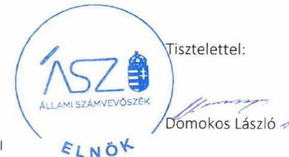

---

# Tájékoztatás   az észrevétel kezeléséről 

A „Nemzeti Család- és Szociálpolitikai Alap ellenőrzése" címú jelentéstervezetre 2020. május 14-én érkezett észrevételt áttekintettük, annak kezelésével kapcsolatban a következő tájékoztatást adom.

Az észrevétel a jelentéstervezet 1.2. számú megállapítás utolsó bekezdését érinti, amely szerint „A kormányhivatalok az NCSSZA feladatok ellátását szolgáló valamennyi informatikai rendszert - az Ibtv. 7. § (1) bekezdésének előírása ellenére - nem sorolták be biztonsági osztályba a bizalmasság, a sértetlenség és a rendelkezésre állás szempontjából."

Az észrevétel a jogszabályi hivatkozások ismertetését követően rögzíti, hogy az elektronikus információbiztonsággal kapcsolatos valamennyi intézkedést - így a biztonsági osztályba sorolást is a TÉBA rendszert üzemeltető Magyar Államkincstárnak kell elvégeznie.

Az észrevételben foglalt érvelés az állami és önkormányzati szervek elektronikus információbiztonságáról szóló 2013. évi L. törvényből (továbbiakban: Ibtv.) kiindulva vezeti le, hogy abban az esetben, ha „jogszabály által kijelölt központosított informatikai és elektronikus hírközlési szolgáltatót" kell igénybe venni, akkor a „186/2015. Korm. rendelet 2. § a)" pontja alapján a központi szolgáltató alakítja ki a szolgáltatás esetében az informatikai irányítás rendszerét, vagyis a Magyar Államkincstár.

A hivatkozott jogszabályhelyek áttekintése alapján tájékoztatom, hogy a központosított informatikai és elektronikus hírközlési szolgáltató információbiztonsággal kapcsolatos feladatköréről szóló 186/2015. (VII. 13.) Korm. rendelet az érintett helyzetre nem vonatkozik. Ennek oka, hogy a központosított informatikai és elektronikus hírközlési szolgáltatásokat és a szolgáltatók kijelölését külön kormányrendelet - 309/2011. (XII. 23.) Korm. rendelet - tartalmazza. E szerint a TÉBA rendszer üzemeltetése nem tartozik a központosított informatikai szolgáltatások körébe és a Magyar Államkincstár nem minősül az észrevétel szerinti „központi szolgáltatónak".

Mindemellett tájékoztatom, hogy az Ibtv. 7. § (3) bekezdése egyértelműen kijelöli a szervezet vezetőjének felelősségét az információs rendszerek, valamint az azokban kezelt adatok védelme tekintetében. Mindezek alapján az észrevételt nem fogadjuk el, a jelentéstervezet módosítása nem indokolt.

Budapest, 2020. 06. hó 09. nap
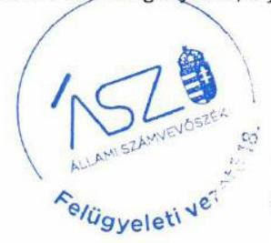

Makkai Mária s.k. felügyeleti vezető

A kiadmány hiteles.

---

# KOMÁROM-ESZTERGOM MEGYEI KORMÁNYHIVATAL 

## Domonkos László elnök részére

## Állami Számvevőszék

Budapest
Apáczai Csere J. u. 10.
1052

| Iktatószám: | KE-06/NYBVEZ/00013-7/2020 |
| :-- | :-- |
| Tárgy: | Tájékoztatás figyelemfelhívó levél |
|  | és ellenőrzési jelentéstervezet |
|  | alapján megtett intézkedésekről |
| Ügyintéző: | dr. Beck László |
| Telefon: | $34 / 594-911$ |

## Tisztelt Elnök Úr!

2020.04.30. napján kelt EL-2010-353/2020 iktatószámú, az Nemzeti Család- és Szociálpolitikai Alap ellenőrzésével kapcsolatban megküldött figyelemfelhívó levelében, valamint az EL-2010-362/2020 iktatószámú jelentéstervezetben foglaltakkal összefüggésben az alábbiakról tájékoztatom.

Figyelemfelhívó levelében jelezte, továbbá a jelentéstervezet 5. oldalán és 15. oldalain rögzítette, hogy a Nemzeti Család- és Szociálpolitikai Alap családtámogatási és fogyatékossági támogatásaival kapcsolatos feladatok ellátását támogató egyes informatikai rendszerek (TÉBA, KERKIEG, PTR) biztonsági osztályba sorolását a kormányhivatalok nem végezték el.

A jelentéstervezetben és felhívásában foglaltak alapján a kérdést megvizsgálva álláspontom szerint ezen informatikai rendszerek biztonsági osztályba sorolása nem a fővárosi és megyei kormányhivatalok feladata az alábbi rendelkezések alapján:

Az állami és önkormányzati szervek elektronikus információbiztonságáról szóló 2013. évi L. tv. 11. §-a alapján: „11. § (1) A szervezet vezetője köteles gondoskodni az elektronikus információs rendszerek védelméről a következők szerint:

---

a) biztosítja az elektronikus információs rendszerre irányadó biztonsági osztály tekintetében a jogszabályban meghatározott követelmények teljesülését,
b) biztosítja a szervezetre irányadó biztonsági szint tekintetében a jogszabályban meghatározott követelmények teljesülését (...)
(3) A jogszabály által kijelölt központosított informatikai és elektronikus hírközlési szolgáltató, illetve központi adatkezelő és adatfeldolgozó szolgáltató igénybevétele esetén az (1) és (2) bekezdésben meghatározott feltételek teljesítését a jogszabály által kijelölt központosított informatikai és elektronikus hírközlési szolgáltató, illetve a központi adatkezelő és adatfeldolgozó szolgáltató úgy biztosítja, hogy közreműködik a szervezet és az elektronikus információs rendszer biztonságáért felelős személy feladatai ellátásában a jogkörébe tartozó tevékenységek tekintetében. A két szervezet közötti feladatmegosztást kétoldalú szolgáltatási szerződések biztosítják, amelyek a központi szolgáltató felett felügyeletet gyakorló miniszter vagy megbízottja ellenjegyzésével lépnek hatályba. Az (1) bekezdés a) és b) pontjában meghatározott feladatok keretében a szervezeti szintű informatikai biztonsági szabályok kidolgozása abban az esetben is a szervezet vezetőjének felelőssége, ha a jogszabály által kijelölt központosított elektronikus és hírközlési szolgáltatót vesz igénybe."

A központosított informatikai és elektronikus hírközlési szolgáltató információbiztonsággal kapcsolatos feladatköréről szóló 186/2015. (VII. 13.) Korm. rendelet 2. § a) pontja alapján az Ibtv. 11. § (2) és (3) bekezdése szerinti szolgáltatási tevékenysége keretében a központi szolgáltató kialakítja a szolgáltatások esetében az informatikai biztonsági irányítási rendszerét.

A TÉBA, KERKIEG informatikai rendszerek esetén a fővárosi és megyei kormányhivatalok a központi szakmai informatikai rendszert kötelesek használni, a PTR nyilvántartást pedig a Magyar Államkincstár központi szerve vezeti, azaz a központosított informatikai szolgáltató jelen esetekben a Magyar Államkincstár az alábbi ágazati jogszabályi rendelkezések alapján:

- a családok támogatásáról szóló 1998. évi LXXXIV. törvény végrehajtásáról szóló 223/1998. (XII. 30.) Korm. rendelet 29. §-a;
- az egyes bányászati dolgozók társadalombiztosítási kedvezményeiről szóló 23/1991. (II. 9.) Korm. rendelet 6. § (2) bekezdése és a társadalombiztosítási nyugellátásról szóló 1997. évi LXXXI. törvény végrehajtásáról szóló 168/1997. (X. 6.) Korm. rendelet 66/B. §-a;

---

- a szociális és gyermekvédelmi ellátások országos nyilvántartásáról szóló 392/2013. (XI. 12.) Korm. rendelet 1. § (1) bekezdése.

Mindezek alapján a biztonsági osztályba sorolás a hivatkozott informatikai rendszerek, nyilvántartás tekintetében a Magyar Államkincstár feladata, melynek tudomásom szerint eleget tett.

Fentiek alapján kérem a jelentéstervezetből a fenti megállapítás mellőzését, egyben tájékoztatásom szíves tudomásul vételét.

Tatabánya, 2020. május 20.

Tisztelettel:
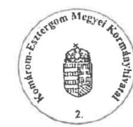

Dr. Kancz Csaba
kormánymegbízott

---

# 150 éve   a közpénzek őre 

ÁLLAMI SZÁMVEVŐSZÉK

Ikt. szám: EL-2010-394/2020.
dr. Kancz Csaba úr
kormánymegbízott

Komárom-Esztergom Megyei Kormányhivatal

## Tatabánya

Tisztelt Kormánymegbízott Úr!

A „Nemzeti Család- és Szociálpolitikai Alap ellenőrzése" címmel készített számvevőszéki jelentéstervezetre tett KE-06/NYBVEZ/00013-7/2020. iktatószámú észrevételét köszönettel megkaptam.

Az Állami Számvevőszék észrevételre vonatkozó álláspontjáról a felügyeleti vezető által készített részletes tájékoztatást mellékelten megküldöm.

Tájékoztatom Kormánymegbízott urat, hogy a számvevőszéki jelentésben - az Állami Számvevőszékről szóló 2011. évi LXVI. törvény 29. § (3) bekezdése alapján - a figyelembe nem vett észrevételt szerepeltetjük, annak indoklásával, hogy azt az Állami Számvevőszék miért nem fogadta el.

Budapest, 2020. 06. hó 47. nap

Melléklet: Tájékoztatás az észrevétel kezeléséről

---

Melléklet
Ikt.szám: EL-2010-394/2020.

# Tájékoztatás   az észrevétel kezeléséről 

A „Nemzeti Család- és Szociálpolitikai Alap ellenőrzése" címú jelentéstervezetre 2020. május 20-án érkezett észrevételt áttekintettük, annak kezelésével kapcsolatban a következő tájékoztatást adom.

Az észrevétel a jelentéstervezet 1.2. számú megállapítás utolsó bekezdését érinti, amely szerint „A kormányhivatalok az NCSSZA feladatok ellátását szolgáló valamennyi informatikai rendszert - az Ibtv. 7. § (1) bekezdésének előírása ellenére - nem sorolták be biztonsági osztályba a bizalmasság, a sértetlenség és a rendelkezésre állás szempontjából."

Az észrevétel az állami és önkormányzati szervek elektronikus információbiztonságáról szóló 2013. évi L. törvény (továbbiakban: Ibtv.) és a központosított informatikai és elektronikus hírközlési szolgáltató információbiztonsággal kapcsolatos feladatköréről szóló 186/2015. (VII. 13.) Korm. rendelet előírásai alapján rögzíti, hogy „a központosított informatikai szolgáltató jelen esetben a Magyar Államkincstár" és „a biztonsági osztályba sorolás a hivatkozott informatikai rendszerek, nyilvántartás tekintetében a Magyar Államkincstár feladata".

A hivatkozott jogszabályhelyek áttekintése alapján tájékoztatom, hogy a központosított informatikai és elektronikus hírközlési szolgáltató információbiztonsággal kapcsolatos feladatköréről szóló 186/2015. (VII. 13.)
 Korm. rendelet az érintett helyzetre nem vonatkozik. Ennek oka, hogy a központosított informatikai és elektronikus hírközlési szolgáltatásokat és a szolgáltatók kijelölését külön kormányrendelet - 309/2011. (XII. 23.) Korm. rendelet - tartalmazza. E szerint a TÉBA, KERKIEG, PTR rendszerek üzemeltetése nem tartozik a központosított informatikai szolgáltatások körébe és a Magyar Államkincstár nem minősül az észrevétel szerinti „központosított szolgáltatónak”.

Mindemellett tájékoztatom, hogy az Ibtv. 7. § (3) bekezdése egyértelműen kijelöli a szervezet vezetőjének felelősségét az információs rendszerek, valamint az azokban kezelt adatok védelme tekintetében. Mindezek alapján az észrevételt nem fogadjuk el, a jelentéstervezet módosítása nem indokolt.

Budapest, 2020. CC hó 1. nap
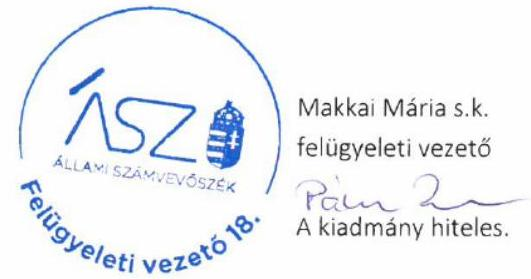

---

# VESZPRÉM MEGYEI KORMÁNYHIVATAL 

Kormánymegbizott

| Úgyiratszám: | VE/84/47-8/2020 |  | Tárgy: | „Nemzeti | Család- és | Szociál- |
| :-- | :-- | :-- | :-- | :-- | :-- | :-- |
| Úgyintéző: | Göndörné | Csabi |  |  |  |  |
|  | Gabriella |  |  |  |  |  |
| Telefon: | $88 / 620070$ |  | Hiv. szám: | EL-2010-362/2020. |  |  |
|  |  |  | Melléklet: |  |  |  |

## Domokos László

## elnök

## Állami Számvevőszék

1052
Budapest
Apáczai Csere János u. 10.

## Tisztelt Elnök Úr!

A „Nemzeti Család- és Szociális Alap ellenőrzése" címen az EL-2010-359/2020. számon lefolytatott vizsgálat kapcsán küldött jelentéstervezetben megfogalmazott javaslatokra a következő tájékoztatást adom.

1. Intézkedjen az Áht. és a Kormányhivatali SZMSZ előírásainak megfelelő egységes ügyrend kiadásáról.

- A Hivatal a jogszabályi előírásoknak megfelelően elkészítette működési rendjére vonatkozó szabályokat tartalmazó ügyrendjét, mely kiterjedt valamennyi szervezeti egységünkre, amely tartalmazta az érintett szervezeti egységekre vonatkozó közös szabályokat, továbbá kiadásra került a kormánymegbízott által közvetlenül vezetett szervezeti egységek, valamint valamennyi járási hivatal ügyrendje. Az ügyrendekkel már az ellenőrzött időszakban is rendelkezett a Hivatal, de az ellenőrzéshez tévesen csak a Veszprémi Járási Hivatal ügyrendje került feltöltésre. Az ügyrendek felülvizsgálata, szükség szerinti módosítása a jogszabályi előírásoknak megfelelően folyamatosan történik.

---

2. Intézkedjen az informatikai biztonsági szabályzat kiadásáról.
-A Veszprém Megyei Kormányhivatal a vizsgált időszakban is rendelkezett a szabályzattal (A Veszprém Megyei Kormányhivatal kormánymegbízottjának 60/2017. (VIII.14.) utasítása az Informatikai Biztonsági Szabályzatról), de tévesen csak a szabályzat melléklete került feltöltésre. A vizsgált időszak óta a szabályzat frissítése és a szükséges módosítások átvezetése folyamatosan megtörténik.

A fent leírtakkal összefüggésben az érintett kormánytisztviselőt felelősségre vontam.

Kérem Tisztelt Elnök Urat a végleges jelentés elkészítésénél a fent leírtakat szíveskedjen figyelembe venni.

Veszprém, 2020. május 15.

Tisztelettel:
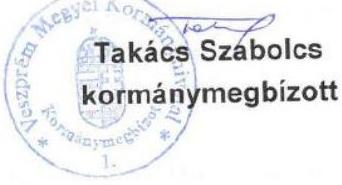

---

# 150 éve a közpénzek őre 

ÁLLAMI SZÁMVEVŐSZÉK

Ikt. szám: EL-2010-396/2020.

Takács Szabolcs úr
kormánymegbízott

Veszprém Megyei Kormányhivatal

## Veszprém

Tisztelt Kormánymegbízott Úr!

A „Nemzeti Család- és Szociálpolitikai Alap ellenőrzése" címmel készített számvevőszéki jelentéstervezetre tett VE/84/47-8/2020. iktatószámú észrevételét köszönettel megkaptam.

Az Állami Számvevőszék észrevételre vonatkozó álláspontjáról a felügyeleti vezető által készített részletes tájékoztatást mellékelten megküldöm.

Tájékoztatom Kormánymegbízott urat, hogy a számvevőszéki jelentésben - az Állami Számvevőszékről szóló 2011. évi LXVI. törvény 29. § (3) bekezdése alapján - a figyelembe nem vett észrevételt szerepeltetjük, annak indoklásával, hogy azt az Állami Számvevőszék miért nem fogadta el.

Budapest, 2020. 0 hó 14 nap

Melléklet: Tájékoztatás az észrevétel kezeléséről

Tisztelettel:
Domokos László

---

Melléklet
Ikt.szám: EL-2010-396/2020.

# Tájékoztatás   az észrevétel kezeléséről 

A „Nemzeti Család- és Szociálpolitikai Alap ellenőrzése" című jelentéstervezetre 2020. május 20-án érkezett észrevételt áttekintettük, annak kezelésével kapcsolatban a következő tájékoztatást adom.

Az észrevétel a Veszprém Megyei Kormányhivatal részére megfogalmazott az Áht. és a Kormányhivatali SZMSZ előírásainak megfelelő egységes ügyrend, valamint az informatikai biztonsági szabályzat kiadására vonatkozó javaslatot és az azokat megalapozó megállapításokat érinti.

Az Állami Számvevőszék megállapításai az adatszolgáltatásra nyitva álló törvényi határidőben rendelkezésére bocsátott dokumentumokon alapulnak. Az észrevétel megerősíti a megállapításokat, mivel azt tartalmazza, hogy csak a Veszprémi Járási Hivatal ügyrendjét, valamint az informatikai biztonsági szabályzatnak csak a mellékletét küldték meg az Állami Számvevőszék részére. Egyben az észrevétel tájékoztatást ad a szabályzatok felülvizsgálatára és szükség szerinti módosítására vonatkozó intézkedésekről.

Mindezek alapján a jelentéstervezet módosítása nem indokolt.
Budapest, 2020. 06 hó 16 nap
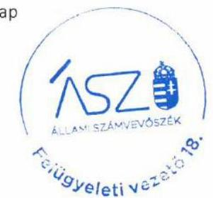

Makkai Mária s.k. felügyeleti vezető

A kiadmány hiteles.

---

# Zala Megyei   Kormányhivatal 

| Úgyiratszám: | ZA/071/12-8/2020. | Tárgy: | Észrevétel jelentés-tervezetre |
| :-- | :-- | :-- | :-- |
| Úgyintéző: | Gyenesei Krisztina | Hiv. szám: | EL-2010-362/2020. |
| Telefon: | $92 / 507-798$ |  |  |

## Domokos László elnök úr részére

## Állami Számvevőszék

Budapest
Pf.: 54 .
1364

## Tisztelt Elnök úr!

Fenti iktatószámon megküldött jelentéstervezetet köszönettel megkaptam, az abban foglalt alábbi megállapításra, javaslatra kívánok észrevételt tenni:

A jelentéstervezet 14. oldalán megállapításra került, hogy a kincstár és a kormányhivatalok két kivétellel az informatikai biztonsági szabályzatukat kiadták, illetve két kormányhivatal az előírás ellenére informatikai biztonsági szabályzatot nem adott ki. A megállapításhoz kapcsolódóan a jelentés a 18. oldalon javaslatként tartalmazza a Zala Megyei Kormányhivatal számára, hogy intézkedjen az informatikai biztonsági szabályzat kiadásáról.

A kormányhivatalok a Miniszterelnökség vezetésével kidolgozott, egységes tartalmú Informatikai Biztonsági Szabályzata (IBSZ) alapján működnek, mely az addig kormányhivatalonként kiadott egyedi IBSZ-eket váltotta le. A szabályzat kiadását a területi közigazgatásért felelős államtitkár személyesen felügyelte és azokat ellenjegyezte.

Ebből következően a Zala Megyei Kormányhivatalnak is van kormányhivatali szinten egységes, érvényes Informatikai Biztonsági Szabályzata. A korábbi, az ellenőrzési időszakban is hatályos 54/2016. (X.18.) számon kiadott IBSZ-ről szóló kormánymegbízotti utasítást a jelenleg hatályos szabályzat 2019. május 27-i aláírását követően, 2019. június 1-jei hatállyal váltotta fel.

A fentiekre való tekintettel kérem az intézkedési javaslat jelentéstervezetből való törlését, mivel az téves megállapításon alapul.

Zalaegerszeg, 2020. május 15.
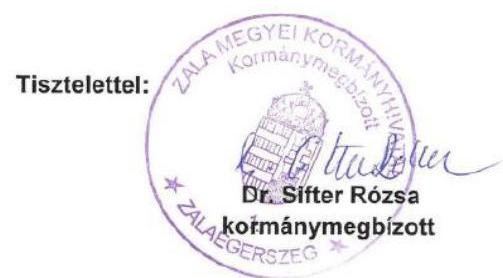

---

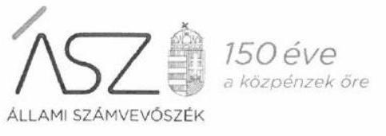

Ikt. szám: EL-2010-395/2020.
dr. Sifter Rózsa úrhölgy
kormánymegbízott

Zala Megyei Kormányhivatal

# Zalaegerszeg 

Tisztelt Kormánymegbízott Úrhölgy!

A „Nemzeti Család- és Szociálpolitikai Alap ellenőrzése" címmel készített számvevőszéki jelentéstervezetre tett ZA/071/12-8/2020. iktatószámú észrevételét köszönettel megkaptam.

Az Állami Számvevőszék észrevételre vonatkozó álláspontjáról a felügyeleti vezető által készített részletes tájékoztatást mellékelten megküldöm.

Tájékoztatom Kormánymegbízott úrhölgyet, hogy a számvevőszéki jelentésben - az Állami Számvevőszékről szóló 2011. évi LXVI. törvény 29. § (3) bekezdése alapján - a figyelembe nem vett észrevételt szerepeltetjük, annak indoklásával, hogy azt az Állami Számvevőszék miért nem fogadta el.

Budapest, 2020. 86 hó 16 nap

Melléklet: Tájékoztatás az észrevétel kezeléséről

---

Melléklet
Ikt.szám: EL-2010-395/2020.

# Tájékoztatás 

## az észrevétel kezeléséről

A „Nemzeti Család- és Szociálpolitikai Alap ellenőrzése" című jelentéstervezetre 2020. május 21-én érkezett észrevételt áttekintettük, annak kezelésével kapcsolatban a következő tájékoztatást adom.

Az észrevétel érinti a Zala Megyei Kormányhivatal részére megfogalmazott javaslatot és az azt megalapozó megállapítást, amely szerint „két kormányhivatal az Ibtv. 11. § (1) bekezdés f) pontja előírása ellenére informatika biztonsági szabályzatot nem adott ki”.

Az észrevétel szerint a kormányhivatalnál „az ellenőrzési időszakban is hatályos 54/2016. (X.18.) számon kiadott IBSZ-ről szóló kormánymegbízotti utasítást a jelenleg hatályos szabályzat 2019. május 27-i aláírását követően, 2019. június 1-jei hatállyal váltotta fel”.

Tájékoztatom, hogy az Állami Számvevőszék ellenőrzési megállapításai az Állami Számvevőszékről szóló 2011. évi LXVI. törvénynek megfelelően minden esetben az ellenőrzés során bekért és az arra nyitva álló határidőn belül rendelkezésre bocsátott dokumentumokon alapulnak. Kormánymegbízott úrhölgy az ÁSZ rendelkezésére bocsátott dokumentumokról teljességi és hitelességi nyilatkozatot állított ki, melyben nyilatkozott, hogy az ÁSZ részére átadott dokumentumok megbízhatóak, a bekért adatokra, dokumentumokra vonatkozóan teljes körű információt tartalmaznak. A Zala Megyei Kormányhivatal teljességi és hitelességi nyilatkozattal alátámasztott adatszolgáltatása az ellenőrzött időszakra vonatkozó informatikai biztonsági szabályzatot nem tartalmazott. A megküldött, az ellenőrzött időszakot követően hatályos szabályzat az ellenőrzött időszakra vonatkozó megállapítással és kapcsolódó javaslattal összefüggésben nem releváns, azt az ÁSZ nem értékelte.

Mindezek alapján az észrevételt nem fogadjuk el, a jelentéstervezet módosítása nem indokolt.
Budapest, 2020. O c hó . 4 nap
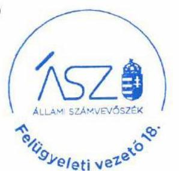

Makkai Mária s.k.
felügyeleti vezető
A kiadmány hiteles.

---

.

---

# RÖVIDÍTÉSEK JEGYZÉKE 

${ }^{1}$ NCSSZA
${ }^{2}$ Kincstár
${ }^{3}$ kormányhivatalok
${ }^{4}$ EMMI
${ }^{5}$ ONYF
${ }^{6}$ ÁSZ
${ }^{7}$ ÁSZ tv.
${ }^{8}$ SZMSZ
${ }^{9}$ CATI-módszer
${ }^{10}$ Áht.
${ }^{11}$ Kincstár SZMSZ
${ }^{12}$ Kormányhivatali SZMSZ
${ }^{13}$ Ibtv.
${ }^{14}$ Ket.
${ }^{15}$ Ákr.
${ }^{16}$ 73/2015. (III. 30.) Korm. rendelet
${ }^{17}$ 378/2016. (XII. 2.) Korm. rendelet
${ }^{18}$ Áhsz.
${ }^{19}$ Cst.
${ }^{20}$ Fot tv.
${ }^{21}$ Ávr.

Nemzeti Család és Szociálpolitikai Alap
Magyar Államkincstár, amely 2017. november 1-jétől általános jogutódja az Országos Nyugdíjbiztosítási Főigazgatóságnak.
A Kormány általános területi igazgatási szervei. (Alaptörvény 17. cikk (3) bekezdése)
Emberi Erőforrások Minisztériuma
Országos Nyugdíjbiztosítási Főigazgatóság
Állami Számvevőszék
2011. évi LXVI. törvény az Állami Számvevőszékről (hatályos: 2011. július 1-től)

Szervezeti és Működési Szabályzat
számítógéppel támogatott, telefonos lekérdezés
2011. évi CXCV. törvény az államháztartásról (hatályos: 2012. január 1-től)

25/2016. (XII. 30.) NGM utasítás a Magyar Államkincstár Szervezeti és Működési Szabályzatáról, hatályos: 2017. január 1-jétől 2017. október 31-ig, 63/2016. (XII. 29.) EMMI utasítás az Országos Nyugdíjbiztosítási Főigazgatóság Szervezeti és Működési Szabályzatáról, hatályos: 2017. január 1-jétől 2017. október 31-ig, 28/2017. (X. 31.) NGM utasítás a Magyar Államkincstár Szervezeti és Működési Szabályzatáról, hatályos: 2017. november 1-től
A Miniszterelnökséget vezető miniszter 39/2016. (XII. 30.) MvM utasítása a fővárosi és megyei kormányhivatalok szervezeti és működési szabályzatáról. (hatályos: 2017. január 1-jétől); Módosította: A Miniszterelnökséget vezető miniszter 39/2016. (XII. 30.) MvM utasítása a fővárosi és megyei kormányhivatalok szervezeti és működési szabályzatáról, módosítva a 34/2017. (IX. 5.) MvM utasítással (hatályos: 2017. szeptember 6-tól); Módosította: A Miniszterelnökséget vezető miniszter 39/2016. (XII. 30.) MvM utasítása a fővárosi és megyei kormányhivatalok szervezeti és működési szabályzatáról, módosítva az 5/2018. (II. 6.) MvM utasítással. (hatályos: 2018. február 7-től)
2013. évi L. törvény az állami és önkormányzati szervek elektronikus információbiztonságáról (hatályos: 2013. július 1-től)
2004. évi CXL. törvény a közigazgatási hatósági eljárás és szolgáltatás általános szabályairól (hatálytalan: 2018. január 1-től)
2016. évi CL. törvény az általános közigazgatási rendtartásról (hatálytalan: 2018. január 1-től)
73/2015. (III. 30.) Korm. rendelet az Országos Nyugdíjbiztosítási Főigazgatóságról 378/2016. (XII. 2.) Korm. rendelet egyes központi hivatalok és költségvetési szervi formában működő minisztériumi háttérintézmények felülvizsgálatával összefüggő jogutódlásáról, valamint egyes közfeladatok átvételéről (hatályos: 2016. december 3-ától)
4/2013. (I. 11.) Korm. rendelet az államháztartás számviteléről (hatályos: 2014. január 1-től)
1998.évi LXXXIV. törvény a családok támogatásáról (hatályos: 1999. január 1-jétől)
1998. évi XXVI. törvény a fogyatékos személyek jogairól és esélyegyenlőségük biztosításáról (hatályos: 1999. január 1-jétől)
368/2011. (XII. 31.) Korm. rendelet az államháztartásról szóló törvény végrehajtásáról (hatályos: 2012. január 1-től)

---

# ÁSZ 

ÁLLAMI SZÁMVEVŐSZÉK
1052 Budapest, Apáczai Cs. J. u. 10. I 1364 Budapest 4. Pf. 54 TEL: +36 14849100
email: szamvevoszek@asz.hu
web: www.asz.hu | www.aszhirportal.hu

