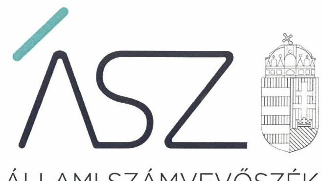
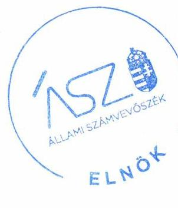
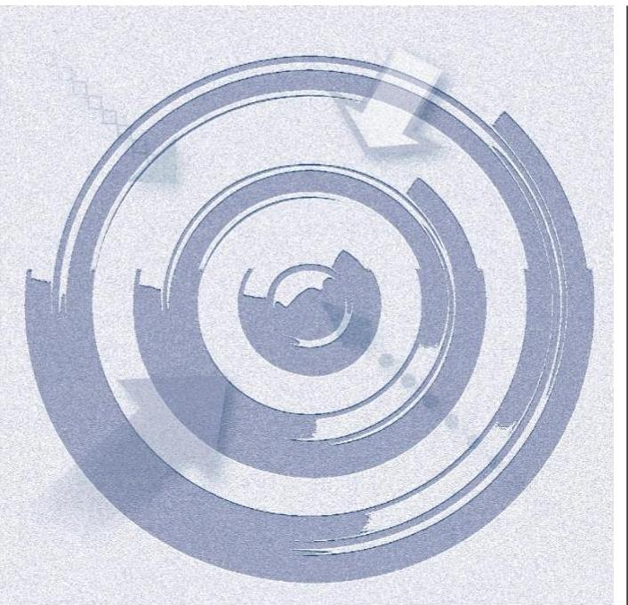

ÁLLAMI SZÁMVEVŐSZÉK

# JELENTÉS 

## Nem állami humánszolgáltatók ellenőrzése

A szociális humánszolgáltatást nyújtó intézmények, szolgáltatók államháztartáson kívüli fenntartói központi költségvetésből kapott támogatásai felhasználásának ellenőrzése -

SZÉKESFEHÉRVÁRI CSEMETE ALAPÍTVÁNY
2020.

20131
www.asz.hu

---

ÁLLAMI SZÁMVEVŐSZÉK

# JELENTÉS 

## Nem állami humánszolgáltatók ellenőrzése

A szociális humánszolgáltatást nyújtó intézmények, szolgáltatók államháztartáson kívüli fenntartói központi költségvetésből kapott támogatásai felhasználásának ellenőrzése -

SZÉKESFEHÉRVÁRI CSEMETE ALAPÍTVÁNY
2020. 07. hó 08. nap

20131
www.asz.hu

Domokos László
elnök

---

# AZ ELLENŐRZÉST FELÜGYELTE: 

MAROZSÁN LÁSZLÓNÉ felügyeleti vezető

## AZ ELLENŐRZÉST VEZETTE ÉS A VÉGREHAJTÁSÁÉRT FELELŐS:

MOLNÁR ZSUZSANNA ellenőrzésvezető

## A PROGRAM ÖSSZEÁLLÍTÁSÁÉRT FELELŐS:

TÓTPÁL SZABOLCS osztályvezető
FEKETE-NAGY ANDRÁS GÁBOR ellenőrzési program készítéséért felelős vezető

## IKTATÓSZÁM: EL-2770-001/2020

Jelentéseink az Országgyülés számítógépes hálózatán és az interneten a www.asz.hu címen is olvashatóak.

TÉMASZÁM: 2491
ELLENŐRZÉS-AZONOSÍTÓ SZÁM: V083597, V0867124

---

# TARTALOMJEGYZÉK 

- ÖSSZEGZÉS ..... 5
- AZ ELLENŐRZÉS CÉLJA ..... 6
- AZ ELLENŐRZÉS TERÜLETE ..... 7
- AZ ELLENŐRZÉS HÁTTERE, INDOKOLTSÁGA ..... 8
- AZ ELLENŐRZÉS LÉNYEGES KÉRDÉSKÖREI. ..... 9
- AZ ELLENŐRZÉS HATÓKÖRE ÉS MÓDSZEREI ..... 10
MELLÉKLETEK ..... 13
I. sz. melléklet: Értelmező szótár ..... 13
- FÜGGELÉK: ÉSZREVÉTELEK ..... 15
- RÖVIDÍTÉSEK JEGYZÉKE ..... 19

---

.

---

# ÖSSZEGZÉS 

A SZÉKESFEHÉRVÁRI CSEMETE ALAPÍTVÁNY a 2015-2018. években nem biztosította a szociális humánszolgáltatási közfeladatok ellátására kapott költségvetési támogatások elszámoltathatóságát.

## Az ellenőrzés társadalmi indokoltsága

A szociális gondoskodást igénylők védelme, illetve a köznevelési feladatok ellátása az Alaptörvényben meghatározott, a társadalom szempontjából fontos tevékenységek. Jogszabályok teszik lehetővé, hogy államháztartáson kívüli szervezetek - így például az egyházi fenntartók, alapítványok, gazdasági társaságok, egyesületek - által fenntartott intézmények is végezzenek köznevelési, szociális és gyermekvédelmi feladatokat. Mindehhez a központi költségvetés évente jelentős összegű támogatással járul hozzá. Az államháztartáson kívüli, humánszolgáltatást végző intézmények az igényelt közpénzekből társadalmilag hasznos, közösségteremtő, közérdekű, illetve közhasznú tevékenységet végeznek, illetve közfeladatokat látnak el.

Az intézményfenntartók ellenőrzésével az Állami Számvevőszék hozzájárul ahhoz, hogy ezen közpénzeket az államháztartáson kívüli szervezetek is ellenőrizhető, átlátható és elszámoltatható módon használják fel a közfeladatok ellátása során. Az ellenőrzések célja továbbá, hogy a nyilvánosság és az igénybevevők megfelelő tájékoztatást kapjanak az államháztartáson kívüli közfeladatot ellátók működéséről.

Az ÁSZ ellenőrzései arra adnak választ, hogy az intézményfenntartók arra használták-e fel a közpénzeket, amire igényelték.

A szabályszerű gazdálkodás elengedhetetlen a közfeladat ellátás szakmai céljainak megvalósításához, valamint a társadalmi közbizalom fenntartásához.

## Megállapítások, következtetések

A SZÉKESFEHÉRVÁRI CSEMETE ALAPÍTVÁNY a 2015-2018. években a Számv. tv. ${ }^{1}$ 161. §-ában előírtak ellenére nem rendelkezett számlarenddel. A 2015-2016. évekre vonatkozóan nem készítette el a Számv. tv. 14. § (3) bekezdésében előírt számviteli politikát. Ezáltal a Számv. tv.-ben előírt beszámoló készítését maradéktalanul alátámasztó könyvvezetésre, bizonylatolásra vonatkozó részletes belső szabályait a Fenntartó² a 2015-2018. években a Számv. tv. 161. § (1) bekezdésében és a Számv. tv. 161/A. § (1) bekezdésében foglaltak ellenére nem alakította ki.

Miután nem rendelkezett olyan egységes számlakeret alapján elkészített számlarenddel, amely biztosította volna a Számv. tv.-ben előírt, a Fenntartó vagyoni, pénzügyi és jövedelmi helyzetéről megbízható képet bemutató beszámoló elkészítését, a Fenntartó 2015-2018. évekre vonatkozó éves beszámolói nem tekinthetőek megbízhatónak, így a támogatásokkal való elszámoltathatóságot nem biztosították. Mindezek által a Fenntartó nem igazolta, hogy a közpénzt a szociális humánszolgáltatási közfeladat ellátására fordította.

---

# AZ ELLENŐRZÉS CÉLJA

**AZ ELLENŐRZÉS CÉLJA** annak értékelése volt, hogy a nem állami, nem önkormányzati szociális intézmények fenntartói központi költségvetésből kapott támogatásainak felhasználása szabályszerű volt-e.

---

# AZ ELLENŐRZÉS TERÜLETE

## SZÉKESFEHÉRVÁRI CSEMETE ALAPÍTVÁNY, mint intézményfenntartó

A SZÉKESFEHÉRVÁRI CSEMETE ALAPÍTVÁNYT 2001-ben magánszemély alapította. Az Alapítvány alapító okiratában3 megfogalmazott célja a Székesfehérvár Megyei Jogú Város Önkormányzata által működtetett bölcsőde átvétele volt, továbbá a Székesfehérváron és környékén élő kisgyermekek napközbeni ellátása, a családok segítése tanácsadással, időszakos gyermek felügyelettel, gyermekhotel működtetésével és a családok igényeihez igazodó, gyermeknevelést segítő szolgáltatásokkal.

A Fenntartó Önkormányzattól4 átvett közfeladatát a Székesfehérváron működő, önálló jogi személyiséggel nem rendelkező intézménye5 látta el.

Az intézmény feladata a gyermekek napközbeni ellátása volt, melyet 2017-2018. években bölcsődei ellátás keretében, 2015-2016. években pedig bölcsőde és családi napközi működtetésével biztosított.

A Fenntartó humánszolgáltatási közfeladatok ellátására a MÁK6 adatai szerint 2015. évben 48,8 millió forint, 2016. évben 52,0 millió forint, 2017. évben 58,0 millió forint, 2018-ban pedig 69,1 millió forint költségvetési támogatásban részesült.

---

# **AZ ELLENŐRZÉS HÁTTERE, INDOKOLTSÁGA**

A szociális feladatokat ellátó nem állami intézményfenntartók részére közfeladataik ellátására évente jelentős összegű pénzügyi támogatást biztosítottak a mindenkori költségvetési törvények a bennük megfogalmazott feltételek mellett. A felhasználható állami támogatások a Kvtv.²-ekben a 2015–2018. években a szociális ágazatra vonatkozóan 360 Mrd Ft előirányzatot határoztak meg.

Az ÁSZ8 stratégiájában foglaltak alapján is indokolt az ellenőrzés, amely a társadalom számára jelzi, hogy a közpénz államháztartáson kívüli felhasználása sem maradhat ellenőrizetlenül. Az államháztartáson kívülre nyújtott költségvetési támogatások ellenőrzésével az ÁSZ hozzájárul ahhoz, hogy a közpénzeket a nem állami humán fenntartók átlátható módon használják fel a közfeladatok ellátására kötött szerződésekben vállalt kötelezettségek teljesítése érdekében. Az ellenőrzés javaslataival hozzájárulhat az említett rendszerek szabályszerű támogatás felhasználásához, javíthatja a társadalmi-gazdasági döntések megalapozottságát, amely a *„jól irányított állam”* működéséhez járul hozzá.

---

# AZ ELLENŐRZÉS LÉNYEGES KÉRDÉSKÖREI 

1. A szociális humánszolgáltató közfeladatot ellátó államháztartáson kívüli fenntartó szabályszerű működési - és gazdálkodási környezet kialakításával megteremtette-e a költségvetési támogatások átlátható, elszámoltatható igénybevételének, felhasználásának feltételeit?
2. Az államháztartáson kívüli fenntartó az átvállalt szociális humánszolgáltatási közfeladathoz biztosított költségvetési támogatásokat szabályszerűen fordította-e a humánszolgáltató intézménye működtetésére?
3. Az államháztartáson kívüli fenntartó a szociális humánszolgáltató intézménye működtetéséhez felhasznált közpénzekre vonatkozó gazdálkodásával a nyilvánosság előtt elszámolt-e, ennek érdekében ellenőrzési, értékelési és a külső ellenőrzésekkel kapcsolatos intézkedési feladatait szabályszerűen látta-e el?

---

# AZ ELLENŐRZÉS HATÓKÖRE ÉS MÓDSZEREI 

## Az ellenőrzés típusa

Megfelelőségi ellenőrzés.

## Az ellenőrzött időszak

A 2015. január 1-je és 2018. december 31-e közötti időszak.

## Az ellenőrzés tárgya

Az ellenőrzés a szociális humánszolgáltatási közfeladatokat ellátó államháztartáson kívüli fenntartók humánszolgáltatási közfeladatai ellátásához a központi költségvetésből kapott támogatásaik humánszolgáltatási közfeladatokra való fenntartó általi felhasználása szabályszerűségének értékelésére terjed ki.

## Az ellenőrzött szervezet

SZÉKESFEHÉRVÁRI CSEMETE ALAPÍTVÁNY, mint intézményfenntartó.

## Az ellenőrzés jogalapja

Az ellenőrzés jogszabályi alapját az ÁSZ tv. ${ }^{9} 1 . \S$ (3) bekezdésében, valamint 5. § (3) bekezdésében foglalt előírások adják.

## Az ellenőrzés módszerei

Az ellenőrzést az ellenőrzési program annak szempontjai, kérdései, az ellenőrzött időszakban hatályos jogszabályok, a nemzetközi standardokat irányadónak tekintve, az ellenőrzés szakmai szabályok és módszertanok figyelembe vételével rendelte elvégezni. A közpénzekkel való felelős gazdálkodás segítésére irányuló javaslatok kidolgozásakor a hatályos jogszabályok az irányadóak.

Az ellenőrzés ideje alatt az ellenőrzött szervezettel történő kapcsolattartás az ÁSZ SZMSZ ${ }^{10}$-ének vonatkozó előírásai alapján történt.

Az ellenőrzési kérdések megválaszolásához szükséges bizonyítékok megszerzése az ellenőrzött által rendelkezésre bocsátott dokumentumokra, adatokra alapozva megfigyelés, szemle (szemrevételezés), kérdésfeltevés (információkérés), valamint elemző eljárással történt.

---

Az ellenőrzési bizonyítékként felhasználható adatforrások közé tartoztak egyrészt az ellenőrzési program részletes szempontjainál felsorolt adatforrások, másrészt minden - az ellenőrzés folyamán feltárt, az ellenőrzés szempontjából információt tartalmazó - dokumentum.

Az ellenőrzés lefolytatásához az ellenőrzött szervezet a kitöltött tanúsítványok, valamint az ÁSZ által kért dokumentumok elektronikus úton való megküldésével szolgáltatott adatokat, információkat. Az így rendelkezésre bocsátott adatok, információk és a tanúsítványok adatai valódiságának kontrollja az ellenőrzés keretében történt.

Az ellenőrzést alapvetően a szociális humánszolgáltatások esetében a központi költségvetési támogatások igénylésével, módosításával, felhasználásával, elszámolásával kapcsolatos feladatokat ellátó államháztartáson kívüli fenntartóknál végezte az ÁSZ.

Az ellenőrzés nem terjedt ki a szociális humánszolgáltatások központi költségvetési támogatásai igénylése, módosítása, elszámolása valódiságának, megalapozottságának, helyességének - sem a fenntartónál, sem a székhely intézményeinél való - értékelésére (mivel ennek felülvizsgálata, ellenőrzése a finanszírozó jogszabályban előírt feladata, határozatai kiadása előtt). Továbbá nem terjedt ki az ellenőrzés e források, intézmények általi szabályszerű felhasználásának értékelésére.

---

.

---

# MELLÉKLETEK 

- I. SZ. MELLÉKLET: ÉRTELMEZŐ SZÓTÁR
humánszolgáltatás
költségvetési támogatás
nem állami, nem önkormányzati (államháztartáson kívüli) intézmény fenntartó

Külön törvényben meghatározott szociális, gyermekjóléti, gyermekvédelmi, közoktatási, felsőoktatási, kulturális közfeladatok (2014. évi Kvtv. 34. § (1), (4) bekezdés, 1. számú melléklet XX/20/2. alcím, 19. alcím, 2015. évi Kvtv. 43. § (1), (4) bekezdés, 1. számú melléklet XX/20/2/3. jogcím csoport, 19. alcím, 2016. évi Kvtv. 41. § (1), (4) bekezdés, 1. számú melléklet XX/20/2/3. jogcím csoport, 19. alcím, 2017. évi Kvtv. 41. § (1) bekezdés, 1. számú melléklet XX/20/2/3. jogcím csoport, 19. alcím)

A társadalombiztosítás pénzügyi alapjai kivételével az államháztartás központi alrendszeréből ellenérték nélkül, pénzben nyújtott támogatások (Áht. ${ }^{11}$ 1. § 14. pont) A költségvetési törvényekben (2014. évi C. törvény 42-43. §, 2015. évi C. törvény 4041. §, 2016. évi XC. törvény 40-41. §, 2017. évi C. törvény 40-41. §) megállapított támogatás.
A köznevelési közfeladatokat/humánszolgáltatásokat ellátó intézményt fenntartó egyházi jogi személy, társadalmi szervezet, alapítvány, közalapítvány, civil szervezet, országos nemzetiségi önkormányzat, nonprofit gazdasági társaság, gazdasági társaság és a humánszolgáltatást alaptevékenységként végző, Szja tv. ${ }^{12}$ hatálya alá tartozó egyéni vállalkozó.
(2014. évi Kvtv. 43. § (1) bekezdés, 2015. évi Kvtv. 41. § (1), bekezdés, 2016. évi Kvtv. 41. § (1) bekezdés, 2017. évi Kvtv. 41. § (1) bekezdés)

---

.

---

# FÜGGELÉK: ÉSZREVÉTELEK 

A jelentéstervezetet a Számvevőszék 15 napos észrevételezésre megküldte az ellenőrzött szervezet vezetőjének az ÁSZ tv. 29. § (1) bekezdése előírásának megfelelően.

A SZÉKESFEHÉRVÁRI CSEMETE ALAPÍTVÁNY kuratóriumi elnöke élt az ÁSZ tv. 29. § (2) bekezdésében foglalt észrevételezési jogával, a jelentéstervezet megállapításaira a törvényes határidőn belül észrevételt tett.
Az ÁSZ tv. 29. § (3) bekezdésével összhangban az ÁSZ a Függelékben feltünteti az ellenőrzés megállapításaival kapcsolatban tett, figyelembe nem vett észrevételeket, és megindokolja, hogy azokat miért nem fogadta el.

[^0]
[^0]:    * 29. § (1) Az Állami Számvevőszék az ellenőrzési megállapításait megküldi az ellenőrzött szervezet vezetőjének vagy az általa megbízott személynek, és annak, akinek személyes felelősségét állapította meg.
    (2) Az ellenőrzött szervezet vezetője és a felelősként megjelölt személy az ellenőrzés megállapításaira tizenöt napon belül írásban észrevételt tehet.
    (3) Az Állami Számvevőszék az észrevételre a beérkezésétől számított harminc napon belül írásban válaszol. A figyelembe nem vett észrevételeket köteles a jelentésben feltüntetni, és megindokolni, hogy azokat miért nem fogadta el.

---

# A SZÉKESFEHÉRVÁRI CSEMETE ALAPÍTVÁNY (továbbiakban: Fenntartó) kuratóriumi elnöke által 2020. május 22-én kelt levelében tett észrevétel és kezelésének indokolása. 

A SZÉKESFEHÉRVÁRI CSEMETE ALAPÍTVÁNY kuratóriumának elnöke észrevételében leírta, hogy a vizsgált időszakban a számviteli alapelveket a törvénynek megfelelően alkalmazták, betartva a civil szervezetekre vonatkozó előírásokat is. Észrevétele szerint az ellenőrzés rendelkezésre bocsátott dokumentumok hiányosságából az ÁSZ azt a téves következtetést vonhatta le, hogy a Fenntartó a vagyoni, pénzügyi, jövedelmi helyzetéről elkészített beszámolója és a közpénzek cél szerinti felhasználása és elszámolása nem volt biztosított. A kuratórium elnöke tájékoztatta az ÁSZ-t továbbá arról, hogy a kapott támogatásokat a támogatási célnak megfelelően használták fel; az ellenőrzött időszakban a vagyoni, pénzügyi és jövedelmi viszonyait a fentiekben leírt könyvvezetésre és bizonylatokra alapozva elkészített beszámolóban a támogatást nyújtó
 felé a támogatott feladatok szerint az előírt tartalmi és formai követelmények betartásával minden évben megtette, amit a Magyar Államkincstár elfogadott és azokat 2 évente helyszíni ellenőrzés alá vont. A kuratóriumi elnök leírta továbbá, hogy a meg nem küldött iratokat észrevételéhez pótlásként csatolja.
Az ÁSZ válaszában tájékoztatta a kuratórium elnökét arról, hogy az Állami Számvevőszékről szóló 2011. évi LXVI. törvény (továbbiakban: ÁSZ tv.) 28. § (2) bekezdése szerint, a közreműködésre felhívott szervezet az ÁSZ részére - annak kérésére soron kívül, de legkésőbb öt munkanapon belül - az ellenőrzés tervezhetősége, meghatározása, illetve lefolytatása érdekében szükséges adatokat és dokumentumokat rendelkezésre bocsátja, illetve a kapcsolódó tájékoztatást köteles megadni.
Az ÁSZ a 2015-2018. évek viszonylatában az ellenőrzés során kérte többek között a Fenntartó számviteli politikáját az ÁSZ részére megküldeni az EL-1415-001/2018. és az EL-1415-015/2019. iktatószámú adatbekérő levelek 2. számú mellékletében foglaltak szerint. A kuratórium elnöke a 2018. december 20-án kelt teljességi és hitelességi nyilatkozatában foglaltak ellenére a 2015-2016. évekre vonatkozó számviteli politikát nem bocsátotta az ellenőrzés rendelkezésére, tekintettel arra, hogy a nyilatkozat 26. sorában feltüntetett és az ÁSZ részére megküldött „Számviteli politika teljes.pdf" elnevezésű szabályzat 2016. december 28-tól volt hatályos. Ebből következően a számvitelről szóló 2000. évi C. törvény (továbbiakban: Számv. tv.) 14. § (3) bekezdés előírása ellenére a Fenntartó 2015-2016. évek vonatkozásában számviteli politikáját nem alakította ki.
Az ÁSZ a Fenntartó 2015-2018. évekre vonatkozó számlarendjét az ellenőrzés során az EL-1415-003/2019. és az EL-1415-016/2019. iktatószámú adatbekérő levelek 2. számú mellékletében foglaltak szerint kérte megküldeni. A kuratórium elnöke a 2019. január 16-án kelt teljességi és hitelességi nyilatkozatában foglaltakkal egyezően a 2016-2017. közötti időszakra számlarendként „2016-számlatükör 9. pont.pdf" és a „2017-számlatükör 9. pont.pdf" továbbá „2016-utókalk 9. pont.pdf" és „2017-utókalk 9. pont.pdf" elnevezésű, míg a 2018. évre vonatkozóan a 2019. november 26-án kelt nyilatkozatával alátámasztottan „Számlarend.pdf" megnevezésű dokumentumokat küldött az ÁSZ részére az adatszolgáltatás során. Míg a 2015. év vonatkozásában nem bocsátott számlarendet az ÁSZ rendelkezésére.
Az ÁSZ válaszában leírta, hogy az észrevételben hivatkozott számviteli politika (2016. december 28. napjától hatályos) I.4. pontjában csak a számlarend kötelező tartalmi elemei kerültek rögzítésre és a mellékletek felsorolása utal a számlarend külön okiratként való elkészítésére. Továbbá, az ÁSZ rendelkezésére bocsátott, fent hivatkozott dokumentumok felülvizsgálata során megállapítható volt, hogy azok egyrészt a Fenntartó 2016-2018. évekre vonatkozó számlatükreit, másrészt 2016-2017. évekre vonatkozó utókalkulációs kódjainak listáját tartalmazzák. A fentiek alapján megállapítást nyert, hogy a Fenntartó nem igazolta dokumentumok átadásával, hogy a Számv. tv. 161. § előírásainak megfelelően, az ellenőrzött időszakban rendelkezett a könyvvezetését és a beszámoló készítését biztosító számlarenddel.

Tekintettel továbbá arra, hogy a Számv. tv. 161/A. § (1) bekezdésében foglalt előírás alapján a gazdálkodónak a könyvvezetésre, a bizonylatolásra vonatkozó részletes belső szabályait úgy kell kialakítania, hogy az a mérleg és az eredménykimutatás alátámasztásán túlmenően a kiegészítő melléklet adatainak közvetlen alátámasztására is alkalmas legyen, a Fenntartó számlarendjének hiányában - a kuratóriumi elnök észrevételében foglaltakkal ellentétben az ÁSZ helyesen vonta le azt a következtetést, hogy a Fenntartó 2015-2018. évekre vonatkozó éves beszámolói nem tekinthetőek megbízhatónak, így a támogatásokkal való elszámoltathatóságot nem biztosították, továbbá nem igazolták, hogy a közpénzt a szociális humánszolgáltatási közfeladat ellátására fordították.

---

A kuratórium elnökét tájékoztatta továbbá az ÁSZ arról, hogy az ÁSZ ellenőrzési megállapításait az egyéb ellenőrzést végző szervek ellenőrzési megállapításaitól függetlenül, kizárólag az ÁSZ tv. 28. § (2) bekezdésben meghatározott adatszolgáltatási időszakon belül megküldött, teljességi és hitelességi nyilatkozattal alátámasztott dokumentumokra alapozva teszi. A kuratórium elnöke nyilatkozott az adatszolgáltatás során arról, hogy az ÁSZ részére átadott dokumentumok, adatok megbízhatóak, és a bekért adatokra, dokumentumokra vonatkozóan teljes körű információt tartalmaznak. Az ÁSZ az adatszolgáltatásra nyitva álló törvényes határidőn túl beküldött dokumentumokat, így az észrevételhez mellékelt dokumentumokat nem értékeli.

A fent leírtakra tekintettel a kuratórium elnökének észrevételét az ÁSZ nem fogadta el, a jelentéstervezet megállapítása helytálló, módosítása nem volt indokolt.

---

.

---

# RÖVIDÍTÉSEK JEGYZÉKE 

${ }^{1}$ Számv. tv.
${ }^{2}$ Fenntartó
${ }^{3}$ alapító okiratok
${ }^{4}$ Önkormányzat
${ }^{5}$ intézmény
${ }^{6}$ MÁK
${ }^{7}$ Kvtv.-ek
${ }^{8}$ ÁSZ
${ }^{9}$ ÁSZ tv.
${ }^{10}$ SZMSZ
${ }^{11}$ Áht.
${ }^{12}$ Szja tv.
2000. évi C törvény a számvitelről (hatályos: 2000. január 1-jétől)

SZÉKESFEHÉRVÁRI CSEMETE ALAPÍTVÁNY
SZÉKESFEHÉRVÁRI CSEMETE ALAPÍTVÁNY Alapító Okirat alapítvány létrehozásáról egységes szerkezetbe foglaltan annak módosításaival (2014. május 28 -tól)
SZÉKESFEHÉRVÁRI CSEMETE ALAPÍTVÁNY Alapító Okirat alapítvány létrehozásáról egységes szerkezetbe foglaltan annak módosításaival (hatályos: 2017. január 1-jétől)
Székesfehérvár Megyei Jogú Város Önkormányzata
Csemete Gyermekcentrum, Székesfehérvár, Budai út 56/A.
Magyar Államkincstár
2014. évi Kvtv.: Magyarország 2015. évi központi költségvetéséről szóló 2014. évi C. törvény (hatályos: 2015. január 1-jétől 2018. december 31-éig)
2015. évi Kvtv.: Magyarország 2016. évi központi költségvetéséről szóló 2015. évi C. törvény (hatályos: 2015. július 4-étől)
2016. évi Kvtv.: Magyarország 2017. évi központi költségvetéséről szóló 2016. évi XC. törvény (hatályos: 2016. november 1-jétől)
2017. évi Kvtv.: Magyarország 2018. évi központi költségvetéséről szóló 2017. évi C. törvény (hatályos: 2017. november 1-jétől)

Állami Számvevőszék
2011. évi LXVI. törvény az Állami Számvevőszékről

Szervezeti és Működési Szabályzat
2011. évi CXCV. törvény az államháztartásról (hatályos: 2011. december 31-től)
1995. évi CXVII. törvény - a személyi jövedelemadóról
(hatályos: 1996. január 1-jétől)

---

# ÁSZ 

ÁLLAMI SZÁMVEVŐSZÉK
1052 Budapest, Apáczai Cs. J. u. 10. I 1364 Budapest 4. Pf. 54 TEL: +36 14849100
email: szamvevoszek@asz.hu
web: www.asz.hu | www.aszhirportal.hu
