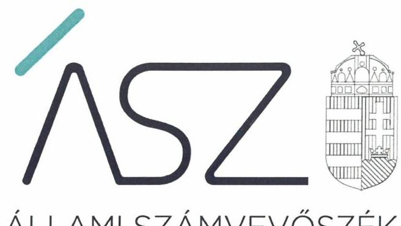
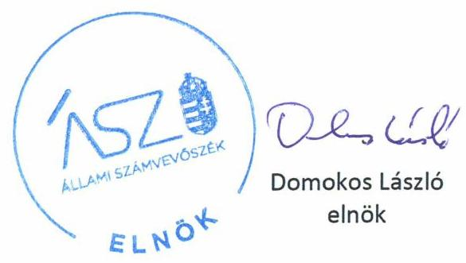
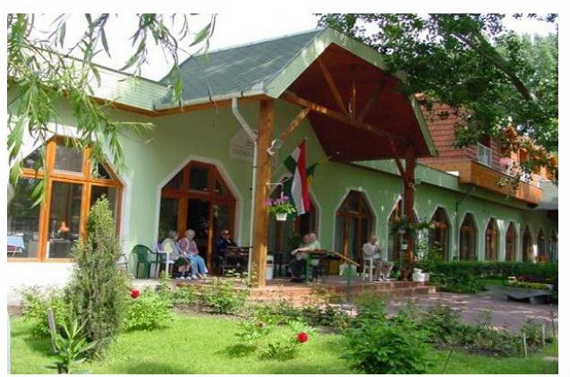
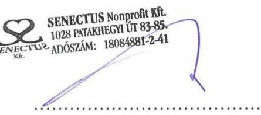
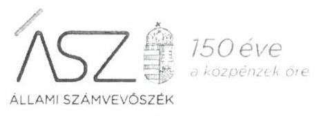
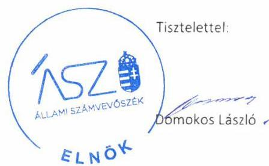
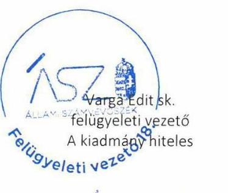

ÁLLAMI SZÁMVEVŐSZÉK

# JELENTÉS 

## Nem állami humánszolgáltatók ellenőrzése

A szociális humánszolgáltatást nyújtó intézmények, szolgáltatók államháztartáson kívüli fenntartói központi költségvetésből kapott támogatásai felhasználásának ellenőrzése -

SENECTUS Idősek Otthona Közhasznú Nonprofit Korlátolt Felelősségű Társaság
2020.

20132
www.asz.hu

---

ÁLLAMI SZÁMVEVŐSZÉK

# JELENTÉS 

## Nem állami humánszolgáltatók ellenőrzése

A szociális humánszolgáltatást nyújtó intézmények, szolgáltatók államháztartáson kívüli fenntartói központi költségvetésből kapott támogatásai felhasználásának ellenőrzése -

SENECTUS Idősek Otthona Közhasznú Nonprofit Korlátolt Felelősségű Társaság
2020. 

17
hó 08 nap

20132
www.asz.hu

---

# AZ ELLENŐRZÉST FELÜGYELTE: 

VARGA EDIT felügyeleti vezető

## AZ ELLENŐRZÉST VEZETTE ÉS A VÉGREHAJTÁSÁÉRT FELELŐS:

VALASTYÁNNÉ DR. VÍZHÁNYÓ JÚLIA ellenőrzésvezető

## A PROGRAM ÖSSZEÁLLÍTÁSÁÉRT FELELŐS:

TÓTPÁL SZABOLCS osztályvezető
FEKETE-NAGY ANDRÁS GÁBOR ellenőrzési program készítéséért felelős vezető

## IKTATÓSZÁM: EL-2772-001/2020

Jelentéseink az Országgyúlés számítógépes hálózatán és az interneten a www.asz.hu címen is olvashatóak.

TÉMASZÁM: 2491
ELLENŐRZÉS-AZONOSÍTÓ SZÁM: V083593, V0867081

---

# TARTALOMJEGYZÉK 

■ ÖSSZEGZÉS ..... 5
■ AZ ELLENŐRZÉS CÉLJA ..... 6
■ AZ ELLENŐRZÉS TERÜLETE ..... 7
■ AZ ELLENŐRZÉS HÁTTERE, INDOKOLTSÁGA ..... 8
■ A JELENTÉS LÉNYEGES KÉRDÉSKÖREI ..... 9
■ AZ ELLENŐRZÉS HATÓKÖRE ÉS MÓDSZEREI ..... 10
■ MELLÉKLETEK ..... 13
I. sz. melléklet: Értelmező szótár ..... 13
■ FÜGGELÉK: ÉSZREVÉTELEK ..... 15
■ RÖVIDÍTÉSEK JEGYZÉKE ..... 23

---

.

---

# ÖSSZEGZÉS 

A budapesti székhelyú SENECTUS Idősek Otthona Közhasznú Nonprofit Korlátolt Felelősségü Társaság a 2015-2018. években nem biztositotta a szociális humánszolgáltatási közfeladatok ellátására kapott költségvetési támogatások felhasználásának ellenőrizhetőségét, valamint a 2015. évben a költségvetési támogatások felhasználásának elszámoltathatóságát.

## Az ellenőrzés társadalmi indokoltsága

A szociális gondoskodást igénylők védelme, illetve a köznevelési feladatok ellátása az Alaptörvényben meghatározott, a társadalom szempontjából fontos tevékenységek. Jogszabályok teszik lehetővé, hogy államháztartáson kívüli szervezetek - így például az egyházi fenntartók, alapítványok, gazdasági társaságok, egyesületek - által fenntartott intézmények is végezzenek köznevelési, szociális és gyermekvédelmi feladatokat. Mindehhez a központi költségvetés évente jelentős összegű támogatással járul hozzá. Az államháztartáson kívüli, humánszolgáltatást végző intézmények az igényelt közpénzekből társadalmilag hasznos, közösségteremtő, közérdekű, illetve közhasznú tevékenységet végeznek, illetve közfeladatokat látnak el.

Az intézményfenntartók ellenőrzésével az Állami Számvevőszék hozzájárul ahhoz, hogy ezen közpénzeket az államháztartáson kívüli szervezetek is ellenőrizhető, átlátható és elszámoltatható módon használják fel a közfeladatok ellátása során. Az ellenőrzések célja továbbá, hogy a nyilvánosság és az igénybevevők megfelelő tájékoztatást kapjanak az államháztartáson kívüli közfeladatot ellátók múködéséről.

Az ÁSZ ellenőrzései arra adnak választ, hogy az intézményfenntartók arra használták-e fel a közpénzeket, amire igényelték.

A szabályszerű gazdálkodás elengedhetetlen a közfeladat ellátás szakmai céljainak megvalósításához, valamint a társadalmi közbizalom fenntartásához.

## Megállapítások, következtetések

A budapesti székhelyű SENECTUS Idősek Otthona Közhasznú Nonprofit Kft., mint Fenntartó a 2015-2018. években szociális humánszolgáltatási közfeladatait nem önállóan gazdálkodó intézményében látta el. Az intézménye által ellátott közfeladatok az időskorúak gondozóháza, az idősek otthona átlagos szintű ellátása, demens betegek ellátása volt.

A Fenntartó ${ }^{1}$ a 2016-2018. években a könyvvezetésében a kapott költségvetési támogatások felhasználását a jogszabályok által előírt módon nem különítette el, valamint a könyvvezetésében a Fenntartó és intézménye közötti, valamint az intézménye által ellátott közfeladatok szerinti bontásban nem rögzítette.

A Fenntartó a 2016-2018. években a szociális humánszolgáltatási közfeladat ellátására kapott költségvetési támogatás felhasználásának a Számv. tv. ${ }^{2}$. 161/A. § (2) bekezdésében előírt ellenőrizhetőségét nem biztosította. Mivel az Atr. ${ }^{3}$ 16. § (1) bekezdésében foglalt szabályozás ellenére nem gondoskodott arról, hogy a költségvetési támogatások felhasználásának, a Fenntartó gazdálkodásának elkülönített, feladatonkénti bontásban történő elszámolására az adatok rendelkezésre álljanak.

A SENECTUS Idősek Otthona Közhasznú Nonprofit Kft. a 2015. évben a Számv. tv. 4. § (1) bekezdésében előírt éves beszámoló készítési kötelezettségének - figyelemmel a Számv. tv. 20. § (6) bekezdésében foglaltakra - nem tett eleget, ezáltal nem biztosította a költségvetési támogatások felhasználásának elszámoltathatóságát. A 2016-2018. években beszámolási kötelezettségének a jogszabályi előírások szerint eleget tett.

A Fenntartó mindezek alapján az Alaptörvény 39. cikk (2) bekezdésében foglaltak ellenére nem biztosította a felhasznált közpénzekre vonatkozó gazdálkodása átláthatóságát. Ezáltal a Fenntartó nem igazolta, hogy a közpénzt a szociális humánszolgáltatási közfeladatra fordította.

---

# AZ ELLENŐRZÉS CÉLJA

**AZ ELLENŐRZÉS CÉLJA** annak értékelése volt, hogy a nem állami, nem önkormányzati szociális intézmények fenntartói központi költségvetésből kapott támogatásainak felhasználása szabályszerű volt-e.

---

# AZ ELLENŐRZÉS TERÜLETE 

## SENECTUS Idősek Otthona Közhasznú Nonprofit Korlátolt Felelősségú Társaság

A budapesti székhelyú SENECTUS Idősek Otthona Közhasznú Nonprofit Kft.-t 1997. évben a Rozmaring Szövetkezeti Vagyonkezelő Kft. és egy magánszemély alapította. A Fenntartó közhasznú szervezetként idősek szociális ellátása, gondozása és ápolása közfeladatokat látott el az ellenőrzött időszakban.

A Fenntartó feladatait az ellátottak részére közvetlenül nyújtott szolgáltatással végezte.

Az ellenőrzött időszakban a Fenntartó legfőbb szerve a Taggyűlés volt, a Fenntartó ügyeinek intézését, képviseletét az Ügyvezető ${ }_{1-3}{ }^{4}$ látta el, akinek személye az ellenőrzött időszakban két alkalommal változott.

A Fenntartó közhasznú szervezetként az ellenőrzött időszakban kettős könyvvitellel alátámasztott egyszerűsített éves beszámolót készített. A Fenntartó részére szociális közfeladat ellátásra biztosított költségvetési támogatások összege, a Magyar Államkincstár adatai szerint 2015. évben 47,0 M Ft, 2016. évben 58,7 M Ft, 2017. évben 63,5 M Ft, 2018. évben pedig 65,6 M Ft volt.

---

# AZ ELLENŐRZÉS HÁTTERE, INDOKOLTSÁGA 

A szociális feladatokat ellátó nem állami intézményfenntartók részére közfeladataik ellátására évente jelentős összegű pénzügyi támogatást biztosítottak a mindenkori költségvetési törvények a bennük megfogalmazott feltételek mellett. A felhasználható állami támogatások a Kvtv.-ekben ${ }^{5}$ a 2015-2018. években a szociális ágazatra vonatkozóan 360 Mrd Ft előirányzatot határoztak meg. Módosították a szociális igazgatásról és szociális ellátásokról szóló 1993. évi III. törvényt, amely - többek között - 2012. január 1-jei hatállyal megfogalmazta a finanszírozási rendszerbe történő befogadással összefüggő szabályokat.

Az ÁSZ ${ }^{6}$ stratégiájában foglaltak alapján is indokolt az ellenőrzés, amely a társadalom számára jelzi, hogy a közpénz államháztartáson kívüli felhasználása sem maradhat ellenőrizetlenül. Az államháztartáson kívülre nyújtott költségvetési támogatások ellenőrzésével az ÁSZ hozzájárul ahhoz, hogy a közpénzeket a nem állami humán fenntartók átlátható módon használják fel a közfeladatok ellátására kötött szerződésekben vállalt kötelezettségek teljesítése érdekében. Az ellenőrzés javaslataival hozzájárulhat az említett rendszerek szabályszerű támogatás felhasználásához, javíthatja a társa-dalmi-gazdasági döntések megalapozottságát, amely a „jól irányított állam múködésének" feltétele.

---

# A JELENTÉS LÉNYEGES KÉRDÉSKÖREI 

1. A szociális humánszolgáltató közfeladatot ellátó államháztartáson kívüli fenntartó szabályszerű müködési - és gazdálkodási környezet kialakításával megteremtette-e a költségvetési támogatások átlátható, elszámoltatható igénybevételének, felhasználásának feltételeit?
2. Az államháztartáson kívüli fenntartó az átvállalt szociális humánszolgáltatási közfeladathoz biztositott költségvetési támogatásokat szabályszerűen fordította-e a humánszolgáltató intézménye müködtetésére?
3. Az államháztartáson kívüli fenntartó a szociális humánszolgáltató intézménye müködtetéséhez felhasznált közpénzekre vonatkozó gazdálkodásával a nyilvánosság előtt elszámolt-e, ennek érdekében ellenőrzési, értékelési és a külső ellenőrzésekkel kapcsolatos intézkedési feladatait szabályszerűen látta-e el?

---

# AZ ELLENŐRZÉS HATÓKÖRE ÉS MÓDSZEREI 

## Az ellenőrzés típusa

Megfelelőségi ellenőrzés.

## Az ellenőrzött időszak

A 2015. január 1-je és 2018. december 31-e közötti időszak.

## Az ellenőrzés tárgya

Az ellenőrzés a szociális humánszolgáltatási közfeladatokat ellátó államháztartáson kívüli fenntartó humánszolgáltatási közfeladatai ellátásához a központi költségvetésből kapott támogatásai humánszolgáltatási közfeladatokra való Fenntartó általi felhasználása szabályszerűségének értékelésére terjedt ki.

## Az ellenőrzött szervezet

SENECTUS Idősek Otthona Közhasznú Nonprofit Kft.mint intézményfenntartó

## Az ellenőrzés jogalapja

Az ellenőrzés jogszabályi alapját az ÁSZ tv. ${ }^{7}$ 1. § (3) bekezdése, 5. § (3) bekezdésében foglalt előírások adták.

## Az ellenőrzés módszerei

Az ellenőrzést az ellenőrzési program annak szempontjai, kérdései, az ellenőrzött időszakban hatályos jogszabályok, a nemzetközi standardokat irányadónak tekintve, az ellenőrzés szakmai szabályok és módszertanok figyelembevételével rendelte elvégezni. A közpénzekkel való felelős gazdálkodás segítésére irányuló javaslatok kidolgozásakor a hatályos jogszabályok voltak irányadóak.

Az ellenőrzés ideje alatt az ellenőrzött szervezettel történő kapcsolattartást az ÁSZ SZMSZ ${ }^{\circledR}$-ének vonatkozó előírásai alapján biztosította az ÁSZ.

---

Az ellenőrzési kérdések megválaszolásához szükséges bizonyítékok megszerzése az ellenőrzött által rendelkezésre bocsátott dokumentumokra, adatokra alapozva megfigyelés, szemle (szemrevételezés), kérdésfeltevés (információkérés), valamint elemző eljárással történt.

Az ellenőrzési bizonyítékként felhasználható adatforrások közé tartoztak egyrészt a szakmai program részletes szempontjainál felsorolt adatforrások, másrészt minden - az ellenőrzés folyamán feltárt, az ellenőrzés szempontjából információt tartalmazó - dokumentum.

Az ellenőrzés lefolytatásához az ellenőrzött szervezet a kitöltött tanúsítványok, valamint az ÁSZ által kért dokumentumok elektronikus úton való megküldésével szolgáltatott adatokat, információkat. Az így rendelkezésre bocsátott adatok, információk és a tanúsítványok adatai valódiságának kontrollja az ellenőrzés keretében történt.

Az egységes értelmezést az ellenőrzési program mellékletét képező fogalomtár és rövidítésjegyzék támogatatta.

Az ellenőrzést alapvetően a szociális humánszolgáltatások esetében a központi költségvetési támogatások igénylésével, módosításával, felhasználásával, elszámolásával kapcsolatos feladatokat ellátó államháztartáson kívüli fenntartóknál/szervezeteinél végezte az ÁSZ.

A szociális humánszolgáltatások központi költségvetési támogatásaival kapcsolatos, államháztartáson kívüli fenntartó jogszabályokban előírt feladatai betartását, továbbá a központi költségvetési támogatások szabályszerű nyilvántartását ellenőrizte az ÁSZ a Fenntartónál rendelkezésre álló nyilvántartások, beszámolók és egyéb dokumentumok alapján. Az ellenőrzés nem terjedt ki a köznevelési és szociális humánszolgáltatások központi költségvetési támogatásai igénylése, módosítása, elszámolása valódiságának, megalapozottságának, helyességének - sem a fenntartónál, sem a székhely intézményeinél való - értékelésére (mivel ennek felülvizsgálata, ellenőrzése a finanszírozó jogszabályban előírt feladata, határozatai kiadása előtt). Továbbá nem terjedt ki az ellenőrzés e források intézmények általi szabályszerű felhasználásának értékelésére.

---

.

---

# MELLÉKLETEK 

- I. SZ. MELLÉKLET: ÉRTELMEZŐ SZÓTÁR
humánszolgáltatás
költségvetési támogatás
nem állami, nem önkormányzati (államháztartáson kívüli) intézmény fenntartó
székhely intézmény

Külön törvényben meghatározott szociális, gyermekjóléti, gyermekvédelmi, közoktatási, felsőoktatási, kulturális közfeladatok (2014. évi Kvtv. 34. § (1), (4) bekezdés, 1. számú melléklet XX/20/2. alcím, 19. alcím, 2015. évi Kvtv. 43. § (1), (4) bekezdés, 1. számú melléklet XX/20/2/3. jogcím csoport, 19. alcím, 2016. évi Kvtv. 41. § (1), (4) bekezdés, 1. számú melléklet XX/20/2/3. jogcím csoport, 19. alcím).
a társadalombiztosítás pénzügyi alapjai kivételével az államháztartás központi alrendszeréből ellenérték nélkül, pénzben nyújtott támogatások (Áht. 1. § 14. pont)
A költségvetési törvényekben (2013. évi CCXXX. törvény 33-34. §, 2014. évi C. törvény 42-43. §, 2015. évi C. törvény 40-41. §) megállapított támogatás. Például a 2015. évi C. törvény 40-41. § szerint többek között: Az Országgyűlés a szociális, gyermekjóléti, gyermekvédelmi közfeladatot ellátó intézményt, szolgáltatást fenntartó egyházi jogi személy, civil szervezet, közalapítvány, országos nemzetiségi önkormányzat, települési vagy területi nemzetiségi önkormányzat, gazdasági társaság, és a humánszolgáltatást alaptevékenységként végző, az Szja tv. hatálya alá tartozó egyéni vállalkozó (a továbbiakban együtt: nem állami szociális fenntartó) részére támogatást állapít meg a következők szerint: a támogatás a nem állami szociális fenntartót a települési önkormányzatok 2. melléklet III. pont 3. alpont c)-k) pontjában és III. pont 5. alpont a) pontjában meghatározott támogatásaival azonos jogcímeken, összegben és feltételek mellett illeti meg.
A szociális, gyermekjóléti és gyermekvédelmi közfeladatokat/humánszolgáltatásokat ellátó intézményt fenntartó egyházi jogi személy, társadalmi szervezet, alapítvány, közalapítvány, civil szervezet, országos nemzetiségi önkormányzat, nonprofit gazdasági társaság, gazdasági társaság és a humánszolgáltatást alaptevékenységként végző, Szja tv. hatálya alá tartozó egyéni vállalkozó. (2013. évi Kvtv. 35. § (1), (3) bekezdés, 2014. évi Kvtv. 33. §, 34. § (1), (4) bekezdés, 2015. évi Kvtv. 42. §, 43. § (1), (4) bekezdés, 2016. évi Kvtv. 40. §, 41. § (1), (4) bekezdés, 2017. évi Kvtv. 41. § (1), (4))
a szolgáltató székhelye, azaz a szolgáltató központi ügyintézésének helye, függetlenül attól, hogy használják-e szolgáltatás nyújtására (Sznyvhr. 1.§ k) pont) (hatályos: 2013. december 1-től)

---

.

---

# FÜGGELÉK: ÉSZREVÉTELEK 

A jelentéstervezetet a Számvevőszék 15 napos észrevételezésre megküldte az ellenőrzött szervezet vezetőinek az ÁSZ tv. 29. §* (1) bekezdése előírásának megfelelően.

A SENECTUS Idősek Otthona Közhasznú Nonprofit Kft. ügyvezetője élt az ÁSZ tv. 29. § (2) bekezdésében foglalt észrevételezési jogával, a jelentéstervezet megállapításaira a törvényes határidőn belül észrevételt tett.
A SENECTUS Idősek Otthona Közhasznú Nonprofit Kft. ügyvezetőjének észrevételét és az arra adott választ a függelék tartalmazza.

[^0]
[^0]:    * 29. § (1) Az Állami Számvevőszék az ellenőrzési megállapításait megküldi az ellenőrzött szervezet vezetőjének vagy az általa megbízott személynek, és annak, akinek személyes felelősségét állapította meg.
    (2) Az ellenőrzött szervezet vezetője és a felelősként megjelölt személy az ellenőrzés megállapításaira tizenöt napon belül írásban észrevételt tehet.
    (3) Az Állami Számvevőszék az észrevételre a beérkezésétől számított harminc napon belül írásban válaszol. A figyelembe nem vett észrevételeket köteles a jelentésben feltüntetni, és megindokolni, hogy azokat miért nem fogadta el.

---

SENECTUS IDŐSEK ÖTTHONA KÖZHASZNU NONPROFIT KFT. 1028 BUDAPEST PATAKHEGYI ÚT 83-85. TELEFON/FAX: 397-2990 E-MAIL: SENECTUSKHT@T-ONLINE.HU

# Címzett: 

Állami Számvevőszék
1052 Budapest, Apáczai Csere János u. 10.

## Tárgy: Észrevételek az EL-1411-063/2020. iktatószámú jelentéstervezetre

Tisztelt Állami Számvevőszék!
Ezúton küldjük a 2020. május 11-én kézhez vett EL-1411-063/2020. iktatószámú jelentéstervezetre vonatkozó észrevételeinket.

1. 

A Jelentéstervezet „Megállapítások, következtetések" 4. bekezdésében azt a megállapítást tették, hogy Társaságunk a 2015. évi beszámoló-készítési kötelezettségének nem tett eleget.
Ezzel szemben a 2015. évi számviteli beszámolónkat is teljeskörűen elkészítettük, és határidőre közzé is tettük az Igazságügyi Minisztérium Céginformációs Szolgálatánál. Ezek az e-beszamolo.im.gov.hu címen elérhető közhiteles nyilvántartásból is ellenőrizhetőek.
Az elkészített, elfogadott és közzétett 2015. évi számviteli beszámolót (mérleget, eredménykimutatást, kiegészítő mellékletet és közhasznúsági jelentést) a 2018.12.20-i adatszolgáltatás részeként, a beszámoló közzétételének igazolását pedig a 2019.10.18-i adatszolgáltatás részeként töltöttük fel az ÁSZ-portálra. Ezekről lásd a 2018.12.21-i Teljességi és hitelességi nyilatkozat 12., 17. és 18. sorát, valamint a 2019.10.18-i Teljességi és hitelességi nyilatkozat 9. sorát.
Fentiek alapján a Jelentéstervezet ezen megállapításával nem értünk egyet.
2.

A Jelentéstervezet „Megállapítások, következtetések" 3. bekezdésében azt megállapítást tették, hogy Társaságunk a 489/2013. (XII.18.) Korm. rendelet (Atr.) 16. § (1) bekezdésében foglalt szabályozás ellenére nem gondoskodott arról, hogy a költségvetési támogatások felhasználásának, a Fenntartó gazdálkodásának elkülönített, feladatonkénti bontásban történő elszámolására az adatok rendelkezésre állnak.
Ezzel kapcsolatban kiemeljük, hogy az Atr. 16. § (1) bekezdése feladatonkénti bontást követel meg. Értelmezésünk szerint - mivel ezt a fogalmat egyik jogszabály sem részletezi - a „feladat" fogalma alatt közfeladatot kell érteni.
A „Megállapítások, következtetések" 1. bekezdésében Önök helytelenül állapítják meg, hogy Társaságunk fenntartóként az „időskorúak gondozóháza", az „idősek otthona átlagos szintű ellátása", valamint a „demens betegek ellátása" közfeladatot látta el. Ezzel szemben ezek nem „közfeladatnak", hanem ellátási formának vagy férőhely-típusnak minősülnek, és nem közfeladat-típusnak (erről lásd a benyújtott működési engedélyünket).

---

# 2 

Ehelyett esetünkben a „(köz)feladatnak" a Szoc.tv. 57. § (2) bekezdése, valamint a Költségvetési törvény 1. melléklete szerint a „személyes gondoskodást nyújtó szociális közfeladat" tekinthető.

Tehát az Atr. 16. § (1) bekezdése azt írja elő, hogy a Fenntartó a támogatás felhasználását közfeladatonkénti bontásban - tehát más (köz)feladattól elkülönítve - tartsa nyilván, és ennek Társaságunk megfelelt. Az adatszolgáltatásunk során többször nyilatkoztuk, hogy Társaságunk kizárólag a támogatott szociális közfeladatot látja el, egyéb feladatot nem lát el, és vállalkozási tevékenységet sem végez. Tehát számviteli rendszerünk és nyilvántartásaink a vizsgált időszakban megfeleltek az Atr. 16. § (1) bekezdésében foglaltaknak, mivel a költségvetési támogatás felhasználását elkülönítettük az egyéb feladattól. (Mivel egyéb feladatot nem végeztünk, nem volt mitől elkülöníteni, tehát a „feladatonkénti bontás" teljeskörüen megvalósult. Erről lásd még a 2018.01-01-től hatályos Számviteli Politikánk 15. pontjának rendelkezéseit is.)
Az ÁSZ jelentéstervezete tévesen úgy értelmezi, hogy az elkülönített nyilvántartást „férőhelytípusonként" kell elvégezni, azonban ez nem támasztható alá semmilyen jogszabályi előirással, ilyet sem az Atr, sem a Szoc. tv., sem a Számviteli törvény, sem az adott évi Költségvetési törvény nem ír elő.
Fentiek alapján a Jelentéstervezet ezen megállapításával sem értünk egyet.
Kérjük, hogy a végleges ellenőrzési jelentésüket a fenti észrevételeink figyelembe vételével készítsék el!

Megjegyezzük továbbá, hogy a szintén 2020. május 11 -én kézhez vett EL-1411-066/2020. iktatószámú felszólításuknak eleget téve a számviteli rendünkben és nyilvántartásainkban elvégeztük a 2019. évre vonatkozóan a férőhely-típusonkénti elkülönítést is (amit Önök „feladatonkénti bontásnak" tekintenek), és az erre vonatkozó bizonyítékokat a felszólításban előírt határidőn belül megküldjük Önöknek.

Üdvözlettel:

Murvai László ügyvezető
Senectus Idősek Otthona Közhasznú Nonprofit Kft.

Budapest, 2020. május 21.

---

Ikt. szám: EL-1411-068/2020.

Murvai László úr
ügyvezető
SENECTUS Idősek Otthona Közhasznú Nonprofit Korlátolt Felelősségű Társaság

# Budapest 

Tisztelt Ügyvezető Úr!

A „Nem állami humánszolgáltatók ellenőrzése - A szociális humánszolgáltatást nyújtó intézmények, szolgáltatók államháztartáson kívüli fenntartói központi költségvetésböl kapott támogatásai felhasználásának ellenőrzése - SENECTUS Idősek Otthona Közhasznú Nonprofit Korlátolt Felelösségü Társaság" címmel készített számvevőszéki jelentéstervezetre a 2020. május 21-én kelt észrevételét megkaptam.

Az Állami Számvevőszék észrevételekre vonatkozó álláspontjáról a felügyeleti vezető által készített részletes tájékoztatást csatoltan megküldöm.

Tájékoztatom Ügyvezető urat, hogy a számvevőszéki jelentésben - az Állami Számvevőszékről szóló 2011. évi LXVI. törvény 29. § (3) bekezdése alapján - a figyelembe nem vett észrevételeket szerepeltetjük az elutasítás indokának feltüntetésével.
Budapest, 2020. 64 hónap 16 nap

Melléklet: Tájékoztatás az észrevételek kezeléséről

---

# Tájékoztatás az észrevételek kezeléséről 

A „Nem állami humánszolgáltatók ellenőrzése - A szociális humánszolgáltatást nyújtó intézmények, szolgáltatók államháztartáson kívüli fenntartói központi költségvetésből kapott támogatásai felhasználásának ellenőrzése - SENECTUS Idősek Otthona Közhasznú Nonprofit Korlátolt Felelősségű Társaság" című jelentéstervezettel (továbbiakban: jelentéstervezet) kapcsolatosan a 2020. május 21-én kelt levelében tett észrevételeket áttekintettem. Az észrevételek kezeléséről az alábbi tájékoztatást adom.

1. A jelentéstervezet Főbb megállapítások, következtetések rész 4. bekezdésével kapcsolatos észrevétel
Úgyvezető úr észrevételében leírta, hogy a jelentéstervezet megállapításával - mely szerint a SENECTUS Idősek Otthona Közhasznú Nonprofit Kft. (továbbiakban Fenntartó) 2015. évben a számvitelről szóló 2000. évi C. törvény. (továbbiakban: Számv. tv.) 4. § (1) bekezdésében előírt éves beszámoló készítési kötelezettségének - figyelemmel a Számv. tv. 20. § (6) bekezdésében foglaltakra - nem tett eleget, ezáltal nem biztosította a költségvetési támogatások felhasználásának elszámoltathatóságát - nem értenek egyet, mert a Fenntartó a 2015. évi számviteli beszámolóját is teljeskörűen elkészítette, és határidőre közzé is tette az Igazságügyi Minisztérium Céginformációs Szolgálatánál. Ezek az e-beszamolo.im.gov.hu címen elérhető közhiteles nyilvántartásból is ellenőrizhetőek.
Az elkészített, elfogadott és közzétett 2015. évi számviteli beszámolót (mérleget, eredménykimutatást, kiegészítő mellékletet és közhasznúsági jelentést) a 2018. 12. 21-i adatszolgáltatás részeként, a beszámoló közzétételének igazolását pedig a 2019. 10. 18-i adatszolgáltatás részeként töltötte fel a Fenntartó az ÁSZ-portálra. Ezeket a dokumentumokat tartalmazza a 2018. 12. 21-i Teljességi és hitelességi nyilatkozat 12., 17. és 18. sora, valamint a 2019. 10. 18-i Teljességi és hitelességi nyilatkozat 9. sora.

Az Állami Számvevőszék (továbbiakban: ÁSZ) az EL-1411-001/2018. iktatószámú adatbekérő levelében kérte 2015-2017. évek viszonylatában a Fenntartó számviteli beszámolóinak átadását. Az adatbekérő levelek 2. melléklete hangsúlyozta, hogy az ellenőrzött időszakra vonatkozóan az aláírt és hiteles dokumentumokat szükséges az adatszolgáltatási felületre feltölteni. A 2018. december 21-én kelt teljességi és hitelességi nyilatkozattal alátámasztott módon az adatközlésük során 2015. év vonatkozásában aláírás nélküli, nem hiteles dokumentum került benyújtásra.
A Számv. tv. 20. § (6) bekezdésének előírása szerint az éves beszámoló részét képező mérleget, eredménykimutatást és kiegészítő mellékletet a hely és a kelet feltüntetésével a vállalkozó képviseletére jogosult személy köteles aláírni. Az ÁSZ rendelkezésére bocsátott beszámoló ennek az előírásnak nem felelt meg.
A 2018. december 21-én kelt teljességi és hitelességi nyilatkozatban az átadott dokumentumok, adatok hitelességéért, valódiságáért, hiánytalanságáért és hatályosságáért teljes felelősséget vállaltak. Az ÁSZ ellenőrzési megállapításait az ellenőrzési adatszolgáltatás során a részére törvényi határidőben rendelkezésre bocsátott hiteles dokumentumokra alapozva fogalmazza meg.
A fentiekre tekintettel a jelentéstervezet megállapítása helytálló, annak módosítása nem indokolt.

---

# 2. A jelentéstervezet Főbb megállapítások, következtetések rész 3. bekezdésével kapcsolatos észrevétel 

Ügyvezető úr észrevételében kiemelte, hogy az egyházi és nem állami fenntartású szociális, gyermekjóléti és gyermekvédelmi szolgáltatók, intézmények és hálózatok állami támogatásáról szóló 489/2013. (XII. 18.) Korm. rendelet (továbbiakban: Atr.) 16. § (1) bekezdése feladatonkénti bontást követel meg. A Fenntartó értelmezése szerint - mivel ezt a fogalmat egyik jogszabály sem részletezi - a „feladat" fogalma alatt közfeladatot kell érteni. Ügyvezető úr továbbá észrevételében leírta, hogy a jelentéstervezet Megállapítások, következtetések rész 1. bekezdésében helytelenül szerepel, hogy az ellenőrzött szervezet fenntartóként az „időskorúak gondozóháza", az „idősek otthona átlagos szintű ellátása", valamint a „demens betegek ellátása" közfeladatot látta el. Azonban ezek nem „közfeladatnak", hanem ellátási formának vagy férőhely-típusnak minősülnek, és nem közfeladat-típusnak (ahogy ezt az adatszolgáltatás során az ÁSZ részére átadott müködési engedély is mutatja). Az előbbiekben felsoroltak helyett a Fenntartó esetében a „(köz)feladatnak" a szociális igazgatásról és szociális ellátásokról szóló 1993. évi III. törvény (továbbiakban: Szoc. tv.) 57. § (2) bekezdése, valamint a Költségvetési törvények 1. melléklete szerint a „személyes gondoskodást nyújtó szociális közfeladat" tekinthető. Tehát az Atr. 16. § (1) bekezdése azt írja elő, hogy a Fenntartó a támogatás felhasználását közfeladatonkénti bontásban - tehát más (köz)feladattól elkülönítve - tartsa nyilván, és ennek a Fenntartó megfelelt. Ügyvezető úr tájékoztatása szerint Fenntartó az adatszolgáltatás során többször nyilatkozatot tett, hogy a Fenntartó kizárólag a támogatott szociális közfeladatot látja el, egyéb feladatot nem lát el, és vállalkozási tevékenységet sem végez. Tehát a Fenntartó számviteli rendszere és nyilvántartásai az ellenőrzött időszakban megfeleltek az Atr. 16. § (1) bekezdésében foglaltaknak, mivel a költségvetési támogatás felhasználását elkülönítették az egyéb feladattól. (Mivel egyéb feladatot nem végeztek, nem volt mitől elkülöníteni, tehát a „feladatonként bontás" teljeskörüen megvalósult. Ezt szabályozzák a Fenntartó 2018. január 1-től hatályos Számviteli Politikája 15. pontjának rendelkezései is.) Ügyvezető úr észrevétele szerint az ÁSZ jelentéstervezete tévesen úgy értelmezi, hogy az elkülönített nyilvántartást „férőhely-típusonként" kell elvégezni, azonban ez nem támasztható alá semmilyen jogszabályi előirással, ilyet sem az Atr., sem a Szoc. tv., sem a Számv. tv., sem az adott évi Költségvetési törvény nem ír elő. Emiatt a jelentéstervezet ezen megállapításával nem értenek egyet.

Az észrevételére vonatkozóan tájékoztatom, hogy az Atr. ugyan nem tartalmazza a „feladat" definícióját, azonban a közfeladat fogalmát az államháztartásról szóló 2011. évi CXCV. törvény (továbbiakban: Áht.) 3/A. §-a pontosan definiálja, így ezt a jogintézményt nem feleltethetjük meg az Atr.-ben használt „feladat" kifejezés tartalmának. Az Áht. 3/A. § (2) bekezdés 2. fordulata kimondja, hogy a közfeladatok ellátásában államháztartáson kívüli szervezet jogszabályban meghatározott rendben közremüködhet, ha az Atr. valóban azt célozná, hogy a közfeladatokat különítsék el egymástól, illetve az egyéb feladatoktól, akkor kifejezetten erre irányuló rendelkezést tartalmazna. Ehelyett az Atr. hivatkozott bekezdése azt írja elő, hogy a támogatás felhasználását feladatonkénti bontásban, elkülönítetten kell kezelni, ezáltal a jogszabály a közfeladat - egyéb feladat elhatárolásához képest egy sokkal mélyebb bontást rendel elvégezni, mely bontás alapját az a feladat képezi, melyre a támogatást, annak jogcíme szerint az ellenőrzött kapta és mely előírás azt célozza, hogy a közpénzek felhasználásának és a köztulajdon használatának nyilvánossága és ellenőrizhetősége a Számv. tv. 161/A. § (2) bekezdése előírásának megfelelően megvalósuljon.

Az ellenőrzési dokumentumok ismételt felülvizsgálata alapján megállapítható, hogy a Fenntartó az Atr. 16. § (1) bekezdése előírásai ellenére a költségvetési támogatás cél szerinti végső felhasználását számviteli rendjében nem kezelte elkülönítetten, feladatonkénti - azaz idősek otthona átlagos szintű ellátás, demens betegek ellátása, időskorúak gondozóháza - bontásban.

---

Ezen feladatokat a Fenntartó a szociális igazgatásról és szociális ellátásokról szóló 1993. évi III. törvény 57. § (2) bekezdése szerinti (személyes gondoskodás keretébe tartozó szakosított ellátás) ellátási formán belül végezte. A Fenntartó tárgyi feladatokra kapott költségvetési támogatást (idősek otthona átlagos szintű ellátás, idősek otthona emelt szintű ellátás, idősek otthona demens betegek ellátása, időskorúak gondozóháza jogcímeken).
Az Atr. 16. § (1) bekezdése szerinti elkülönített nyilvántartás kialakítására, a támogatás felhasználásának megbontására vonatkozó rendelkezést sem a Fenntartó számviteli politikája, sem a számlatúkre nem tartalmazott, továbbá a megbontást a 2016-2018. évi főkönyvi kivonatok és az analitikák sem támasztották alá. Továbbá hangsúlyozom, hogy az ÁSZ ellenőrzési megállapításával megegyező megállapítást tartalmaz az ÁSZ ellenőrzés részére átadott, a 2018. évi támogatások igénylésének és felhasználásának Magyar Államkincstár általi ellenőrzésének BPM-ÁHI/3202-5/2019. számú összefoglaló jegyzőkönyve is, amelyben a Magyar Államkincstár szintén felhívta a Fenntartó figyelmét az Atr. 16. § (1) bekezdése előírásának betartására.
A fentiekre tekintettel a jelentéstervezet megállapítása helytálló, annak módosítása nem indokolt.

Budapest, 2020. OG hónap $A G$ nap

---

.

---

# RÖVIDÍTÉSEK JEGYZÉKE 

${ }^{1}$ Fenntartó
${ }^{2}$ Számv. tv.
${ }^{3}$ Atr.
${ }^{4}$ Ügyvezető ${ }_{1-3}$
${ }^{5}$ Kvtv.
${ }^{6}$ ÁSZ
${ }^{7}$ ÁSZ tv.
${ }^{8}$ ÁSZ SZMSZ

SENECTUS Idősek Otthona Közhasznú Nonprofit Kft./(Engedélyes)
2000. évi C. törvény a számvitelről (hatályos: 2001. január 1-jétől)

489/2013. (XII. 18.) Korm. rendelet az egyházi és nem állami fenntartású szociális, gyermekjóléti és gyermekvédelmi szolgáltatók, intézmények és hálózatok állami támogatásokról (hatályos: 2014. január 1-jétől)
A 2015. január 1-jétől 2016 november 1-jéig tartó időszakban egy fő látta el az ügyvezetői feladatokat, a 2016. november 2-ától 2017. május 17-éig három fő ügyvezető végezte a feladatokat (munkáltatói jogok gyakorlása, lakókkal kapcsolatos ügyek, külső kapcsolatok tartása), a 2017. május 18-ától az ügyvezetők száma két főre csökkent.
Kvtv. 1: 2014. évi C. törvény Magyarország 2015. évi központi költségvetéséről (hatályos: 2015. január 1-jétől 2018. december 30-ig)
Kvtv. 2: 2015. évi C. törvény Magyarország 2016. évi központi költségvetéséről (hatályos: 2015. július 4-től)
Kvtv.3: 2016. évi XC. törvény Magyarország 2017. évi központi költségvetéséről (hatályos: 2016. november 1-jétől)
Kvtv.4: 2017. évi C. törvény Magyarország 2018. évi központi költségvetéséről (hatályos: 2017. november 1-jétől)
Állami Számvevőszék
2011. évi LXVI. törvény az Állami Számvevőszékről
az Állami Számvevőszék Szervezeti és Múködési Szabályzata

---

# ASZ 

ALLAMI SZAMVEVOSZEK
1052 Budapest, Apáczai Cs. J. u. 10. I 1364 Budapest 4. Pf. 54 TEL: +36 14849100
email: szamvevoszek@asz.hu
web: www.asz.hu | www.aszhirportal.hu