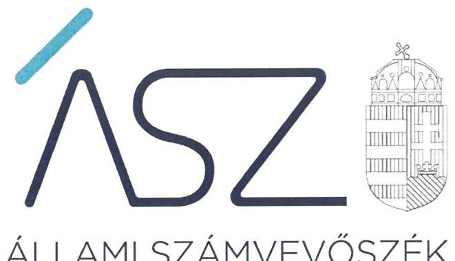
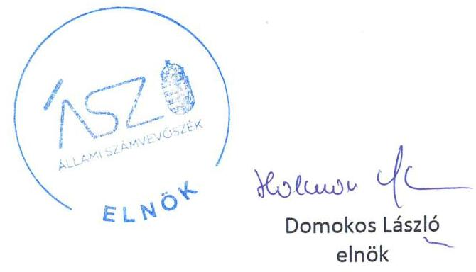
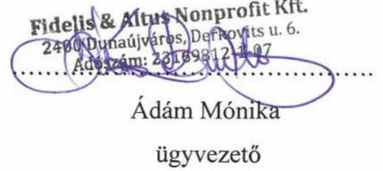
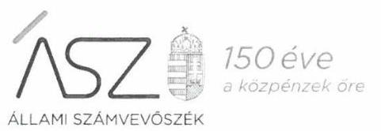
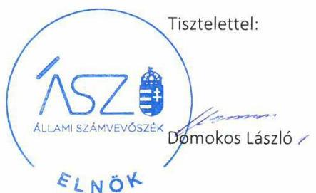
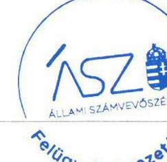

ÁLLAMI SZÁMVEVŐSZÉK

# JELENTÉS 

## Nem állami humánszolgáltatók ellenőrzése

A szociális humánszolgáltatást nyújtó intézmények, szolgáltatók államháztartáson kívüli fenntartói központi költségvetésből kapott támogatásai felhasználásának ellenőrzése -

FIDELIS \& ALTUS Szociális Szolgáltató Nonprofit Korlátolt Felelősségű Társaság
2020.

20133
www.asz.hu

---

# JELENTÉS

## Nem állami humánszolgáltatók ellenőrzése

A szociális humánszolgáltatást nyújtó intézmények, szolgáltatók államháztartáson kívüli fenntartói központi költségvetésből kapott támogatásai felhasználásának ellenőrzése – FIDELIS & ALTUS Szociális Szolgáltató Nonprofit Korlátolt Felelősségű Társaság

2020. 07. hó 31. nap

20133
www.asz.hu

---

# AZ ELLENŐRZÉST FELÜGYELTE: 

VARGA EDIT felügyeleti vezető

## AZ ELLENŐRZÉST VEZETTE ÉS A VÉGREHAJTÁSÁÉRT FELELŐS:

VALASTYÁNNÉ DR. VÍZHÁNYÓ JÚLIA ellenőrzésvezető
KISAPÁTI ANGÉLA ellenőrzésvezetőként eljáró elemző számvevő

## A PROGRAM ÖSSZEÁLLÍTÁSÁÉRT FELELŐS:

TÓTPÁL SZABOLCS osztályvezető
FEKETE-NAGY ANDRÁS GÁBOR projektvezető

## IKTATÓSZÁM: EL-2778-001/2020

TÉMASZÁM: 2491
ELLENŐRZÉS-AZONOSÍTÓ SZÁM: V083526, V0867088

---

# TARTALOMJEGYZÉK 

■ ÖSSZEGZÉS ..... 5
■ AZ ELLENŐRZÉS CÉLJA ..... 6
■ AZ ELLENŐRZÉS TERÜLETE ..... 7
■ AZ ELLENŐRZÉS HÁTTERE, INDOKOLTSÁGA ..... 8
■ AZ ELLENŐRZÉS KÉRDÉSKÖREI ..... 9
■ AZ ELLENŐRZÉS HATÓKÖRE ÉS MÓDSZEREI ..... 10
■ MELLÉKLETEK ..... 13
I. sz. melléklet: Értelmező szótár ..... 13
■ FÜGGELÉKEK ..... 15
I. sz. függelék a jelentéshez ..... 15
II. sz. függelék: Észrevételek ..... 16
■ RÖVIDÍTÉSEK JEGYZÉKE ..... 21

---

.

---

# ÖSSZEGZÉS 

A rácalmási székhelyű FIDELIS \& ALTUS Szociális Szolgáltató Nonprofit Korlátolt Felelősségű Társaság a 2015-2018. években nem biztosította a szociális humánszolgáltatási közfeladatok ellátására kapott költségvetési támogatások felhasználásának ellenőrizhetőségét, valamint 2018. évben a költségvetési támogatások felhasználásának elszámoltathatóságát.

## Az ellenőrzés társadalmi indokoltsága

A szociális gondoskodást igénylők védelme, illetve a köznevelési feladatok ellátása az Alaptörvényben meghatározott, a társadalom szempontjából fontos tevékenységek. Jogszabályok teszik lehetővé, hogy államháztartáson kívüli szervezetek - így például az egyházi fenntartók, alapítványok, gazdasági társaságok, egyesületek - által fenntartott intézmények is végezzenek köznevelési, szociális és gyermekvédelmi feladatokat. Mindehhez a központi költségvetés évente jelentős összegű támogatással járul hozzá. Az államháztartáson kívüli, humánszolgáltatást végző intézmények az igényelt közpénzekből társadalmilag hasznos, közösségteremtő, közérdekű, illetve közhasznú tevékenységet végeznek, illetve közfeladatokat látnak el.

Az intézményfenntartók ellenőrzésével az Állami Számvevőszék hozzájárul ahhoz, hogy ezen közpénzeket az államháztartáson kívüli szervezetek is ellenőrizhető, átlátható és elszámoltatható módon használják fel a közfeladatok ellátása során. Az ellenőrzések célja továbbá, hogy a nyilvánosság és az igénybevevők megfelelő tájékoztatást kapjanak az államháztartáson kívüli közfeladatot ellátók múködéséről.

Az ÁSZ ellenőrzései arra adnak választ, hogy az intézményfenntartók arra használták-e fel a közpénzeket, amire igényelték.

A szabályszerű gazdálkodás elengedhetetlen a közfeladat ellátás szakmai céljainak megvalósításához, valamint a társadalmi közbizalom fenntartásához.

## Megállapítások, következtetések

A rácalmási székhelyű FIDELIS \& ALTUS Szociális Szolgáltató Nonprofit Korlátolt Felelősségű Társaság, mint Fenntartó ${ }^{1}$ a 2015-2018. években szociális humánszolgáltatási közfeladatait nem önállóan gazdálkodó intézményében² látta el. Az intézménye által ellátott közfeladatok a szociális étkeztetés, a szenvedélybeteg nappali intézményi ellátása és az utcai szociális munka volt. A Fenntartó az ellenőrzött időszakban a könyvvezetésében a kapott költségvetési támogatások felhasználását a jogszabályok által előírt módon nem különítette el, valamint a könyvvezetésében a Fenntartó és intézményei közötti, valamint az intézményei által ellátott közfeladatok szerinti bontásban nem rögzítette.

A Fenntartó a 2015-2018. években a szociális humánszolgáltatási közfeladat ellátására kapott költségvetési támogatás felhasználásának a Számv. tv. ${ }^{3}$ 161/A. § (2) bekezdésében előírt ellenőrizhetőségét nem biztosította. Mivel az Atr. ${ }^{4}$ 16. § (1) bekezdésében foglalt szabályozás ellenére nem gondoskodott arról, hogy a költségvetési támogatások felhasználásának, a fenntartó és a nem önállóan gazdálkodó intézménye gazdálkodásának elkülönített, feladatonkénti bontásban történő elszámolására az adatok rendelkezésre álljanak.

A Fenntartó a Számv. tv. 4. § (1) bekezdésében meghatározattak ellenére a 2018. évi beszámoló készítési kötelezettségének nem tett eleget, ezáltal nem biztosította a költségvetési támogatások felhasználásának elszámoltathatóságát.

A Fenntartó mindezek alapján az Alaptörvény 39. cikk (2) bekezdésében foglaltak ellenére nem biztosította a felhasznált közpénzekre vonatkozó gazdálkodása átláthatóságát.

Ezáltal a Fenntartó nem igazolta, hogy a közpénzt a szociális humánszolgáltatási közfeladatra fordította.

---

# AZ ELLENŐRZÉS CÉLJA

**AZ ELLENŐRZÉS CÉLJA** annak értékelése volt, hogy a nem állami, nem önkormányzati szociális intézmények fenntartói központi költségvetésből kapott támogatásainak felhasználása szabályszerű volt-e.

---

# **AZ ELLENŐRZÉS TERÜLETE**

## **FIDELIS & ALTUS Szociális Szolgáltató Nonprofit Korlátolt Felelősségű Társaság**

A Rácalmás székhellyel működő **FIDELIS & ALTUS Szociális Szolgáltató Nonprofit Korlátolt Felelősségű Társaság** ogó egy magánszemély alapította a 2011. évben. A Fenntartó képviseletét a tulajdonos által megbízott ügyvezető látta el.

A Fenntartó államháztartáson kívüli szervezetként működött közre a szociális étkeztetés, a szenvedélybetegek nappali ellátása, valamint az utcai szociális munka közfeladat ellátásában. Ezen szociális alapszolgáltatásokat a szolgáltatói nyilvántartás szerint a Fenntartó Szociális Szolgáltató Központ elnevezésű dunaújvárosi intézménye nyújtotta, amely az SZMSZ1-65 alapján a fenti három önálló szakmai egységből (feladatból) tevődött össze. Az SZMSZ1-6 és az alapító okirat6 alapján az intézmény, ezen belül az önálló szakmai egységek nem önálló jogi személyek, önálló gazdálkodási jogkörrel nem rendelkeztek.

Az utcai szociális munkát az ellenőrzött időszak egészében végezték. A szociális étkeztetést – szociális konyhát és népkonyhát –, valamint 40 férőhelyen a szenvedélybetegek nappali ellátását – 2015. szeptember 1-jétől biztosították.

A Fenntartó szociális humánszolgáltatási feladatainak ellátásához – a Kincstár7 adatai szerint – a 2015. évre 99,6 millió Ft, a 2016. évben 327,8 millió Ft, a 2017. évben 351,3 millió Ft, a 2018. évben 353,2 millió Ft költségvetési támogatást kapott.

---

# AZ ELLENŐRZÉS HÁTTERE, INDOKOLTSÁGA 

A szociális feladatokat ellátó nem állami intézményfenntartók részére közfeladataik ellátására évente jelentős összegű pénzügyi támogatást biztosítottak a mindenkori költségvetési törvények a bennük megfogalmazott feltételek mellett. A Kvtv.-ekben ${ }^{8}$ a szociális célú nem állami humánszolgáltatások támogatására vonatkozóan 360 milliárd Ft előirányzatot határoztak meg a 2015-2018. évekre. A 2013. évben jelentős változások következtek be a normatív finanszírozás rendszerében. Módosították a szociális igazgatásról és szociális ellátásokról szóló 1993. évi III. törvényt, amely - többek között - 2012. január 1-jei hatállyal megfogalmazta a finanszírozási rendszerbe történő befogadással összefüggő szabályokat. Az ellenőrzések indokoltságát az is alátámasztja, hogy az ÁSZ ${ }^{9}$ számos szervezetet még nem ellenőrzött ezen a területen.

Az ÁSZ stratégiájában foglaltak alapján is indokolt az ellenőrzés, amely a társadalom számára jelzi, hogy a közpénz államháztartáson kívüli felhasználása sem maradhat ellenőrizetlenül. Az államháztartáson kívülre nyújtott költségvetési támogatások ellenőrzésével az ÁSZ hozzájárul ahhoz, hogy a közpénzeket a nem állami humán fenntartók átlátható módon használják fel a közfeladatok ellátására kötött szerződésekben vállalt kötelezettségek teljesítése érdekében. Az ellenőrzés javaslataival hozzájárulhat az említett rendszerek szabályszerű támogatás felhasználásához, javíthatja a társa-dalmi-gazdasági döntések megalapozottságát, amely a „jól irányított állam működésének" feltétele.

---

# AZ ELLENŐRZÉS KÉRDÉSKÖREI 

1. A szociális humánszolgáltató közfeladatot ellátó államháztartáson kívüli fenntartó szabályszerű müködési - és gazdálkodási környezet kialakításával megteremtette-e a költségvetési támogatások átlátható, elszámoltatható igénybevételének, felhasználásának feltételeit?
2. Az államháztartáson kívüli fenntartó az átvállalt szociális humánszolgáltatási közfeladathoz biztositott költségvetési támogatásokat szabályszerűen fordította-e a humánszolgáltató intézménye müködtetésére?
3. Az államháztartáson kívüli fenntartó a szociális humánszolgáltató intézménye müködtetéséhez felhasznált közpénzekre vonatkozó gazdálkodásával a nyilvánosság előtt elszámolt-e, ennek érdekében ellenőrzési, értékelési és a külső ellenőrzésekkel kapcsolatos intézkedési feladatait szabályszerűen látta-e el?

---

# AZ ELLENŐRZÉS HATÓKÖRE ÉS MÓDSZEREI 

## Az ellenőrzés típusa

Megfelelőségi ellenőrzés.

## Az ellenőrzött időszak

A 2015. január 1-je és 2018. december 31-e közötti időszak.

## Az ellenőrzés tárgya

Az ellenőrzés a szociális humánszolgáltatási közfeladatokat ellátó államháztartáson kívüli fenntartók humánszolgáltatási közfeladatai ellátásához a központi költségvetésből kapott támogatásaik humánszolgáltatási közfeladatokra való fenntartó általi felhasználása szabályszerűségének értékelésére terjedt ki.

## Az ellenőrzött szervezet

FIDELIS \& ALTUS Szociális Szolgáltató Nonprofit Korlátolt Felelősségű Társaság, mint intézményfenntartó

## Az ellenőrzés jogalapja

Az ellenőrzés jogszabályi alapját az ÁSZ tv. ${ }^{10}$ 1. § (3) bekezdése, 5. § (3) bekezdésében foglalt előírások adták.

## Az ellenőrzés módszerei

Az ellenőrzést az ellenőrzési program annak szempontjai, kérdései, az ellenőrzött időszakban hatályos jogszabályok, a nemzetközi standardokat irányadónak tekintve, az ellenőrzés szakmai szabályok és módszertanok figyelembevételével rendelte elvégezni.

Az ellenőrzés ideje alatt az ellenőrzött szervezettel történő kapcsolattartást az ÁSZ SZMSZ ${ }^{11}$-ének vonatkozó előírásai alapján biztosította az ÁSZ.

Az ellenőrzési kérdések megválaszolásához szükséges bizonyítékok megszerzése az ellenőrzött által rendelkezésre bocsátott dokumentumokra, adatokra alapozva elemző eljárással történt.

---

Az ellenőrzési bizonyítékként felhasználható adatforrások közé tartoztak egyrészt a szakmai program részletes szempontjainál felsorolt adatforrások, másrészt minden - az ellenőrzés folyamán feltárt, az ellenőrzés szempontjából információt tartalmazó - dokumentum.

Az ellenőrzés lefolytatásához az ellenőrzött szervezet a kitöltött tanúsítványok, valamint az ÁSZ által kért dokumentumok elektronikus úton való megküldésével szolgáltatott adatokat, információkat. Az így rendelkezésre bocsátott adatok, információk és a tanúsítványok adatai valódiságának kontrollja az ellenőrzés keretében történt.

Az egységes értelmezést az ellenőrzési program mellékletét képező fogalomtár és rövidítésjegyzék támogatatta.

Az ellenőrzést a szociális humánszolgáltatások esetében a központi költségvetési támogatások igénylésével, módosításával, felhasználásával, elszámolásával kapcsolatos feladatokat ellátó államháztartáson kívüli fenntartónál végezte az ÁSZ.

A szociális humánszolgáltatások központi költségvetési támogatásaival kapcsolatos, államháztartáson kívüli fenntartó jogszabályokban előírt feladatai betartását, továbbá a központi költségvetési támogatások szabályszerű nyilvántartását ellenőrizte az ÁSZ a fenntartónál rendelkezésre álló nyilvántartások, beszámolók és egyéb dokumentumok alapján. Az ellenőrzés nem terjedt ki a szociális humánszolgáltatások központi költségvetési támogatásai igénylése, módosítása, elszámolása valódiságának, megalapozottságának, helyességének - sem a fenntartónál, sem a székhely intézményénél való - értékelésére (mivel ennek felülvizsgálata, ellenőrzése a finanszírozó jogszabályban előírt feladata, határozatai kiadása előtt). Továbbá nem terjedt ki az ellenőrzés e források, intézmények általi szabályszerű felhasználásának értékelésére.

---

.

---

# MELLÉKLETEK 

- I. SZ. MELLÉKLET: ÉRTELMEZŐ SZÓTÁR
szociális humánszolgáltatás
költségvetési támogatás
nem állami humánszolgáltató/ nem állami szociális fenntartó

A Kvtv. 34. § (1), (4) bekezdés, 1. számú melléklet XX/20/2. alcím, 19. alcím, Kvtv. 4 43. § (1), (4) bekezdés, 1. számú melléklet XX/20/2/3. jogcím csoport, 19. alcím, Kvtv. 4 41. § (1), (4) bekezdés, 1. számú melléklet XX/20/2/3. jogcím csoport, 19. alcím, Kvtv. 4 41. § (1), (4) bekezdés, 1. számú melléklet XX/20/2/3. jogcím csoport, 19. alcím alapján támogatott szociális közfeladatok.
a társadalombiztosítás pénzügyi alapjai kivételével az államháztartás központi alrendszeréből ellenérték nélkül, pénzben nyújtott támogatások, ide nem értve az adományokat, segélyeket, felajánlásokat, a pártok és pártalapítványok támogatását, az országgyűlési képviselők választása kampányköltségeinek támogatásait, a tanulóknak, hallgatóknak biztosított ösztöndíjakat, kitüntetéshez kapcsolódóan nyújtott pénzjutalmakat, a fogyatékos és a súlyos mozgáskorlátozott személyeknek ezen élethelyzetére tekintettel nyújtott pénzbeli ellátásokat, a szociális igazgatásról és szociális ellátásokról szóló törvény, valamint a gyermekek védelméről és a gyámügyi igazgatásról szóló törvény szerinti pénzbeli és természetbeni szociális és gyermekvédelmi ellátásokat, a foglalkoztatás elősegítéséről és a munkanélküliek ellátásáról szóló törvény szerinti foglalkoztatást elősegítő képzési támogatásokat, álláskeresési ellátásokat, bérgarancia támogatásokat, valamint a foglalkoztatási támogatásokra vonatkozó rendeletekben meghatározott magánszemélyek részére nyújtható támogatásokat, a jogszabály alapján nyújtott családtámogatásokat, korhatár alatti ellátásokat, jövedelempótló és jövedelemkiegészítő szociális támogatásokat, az apákat megillető pótszabadsággal összefüggő költségek megtérítését, az energiafelhasználási támogatásokat, a helyi önkormányzatok általános múködésének és ágazati feladatainak támogatásait, a közfoglalkoztatási támogatásokat, a szociálpolitikai menetdíj-támogatásokat, a vis maior támogatásokat, a határon túli, magát magyar nemzetiségűnek valló természetes személy részére jogszabály alapján nyújtható támogatásokat. (Áht. ${ }^{12}$ 1. § 14. pont) Például a költségvetési törvényekben a nem állami humánszolgáltatók részére megállapított támogatás (Kvtv. 43. §, Kvtv. 41. §, Kvtv. 41. §, Kvtv. 41. §).
a szociális, gyermekjóléti, gyermekvédelmi közfeladatot ellátó intézményt, szolgáltatást fenntartó egyházi jogi személy, civil szervezet, közalapítvány, országos nemzetiségi önkormányzat, települési vagy területi nemzetiségi önkormányzat, gazdasági társaság, és a humánszolgáltatást alaptevékenységként végző, a személyi jövedelemadóról szóló törvény hatálya alá tartozó egyéni vállalkozó (Kvtv. 43. § (1) bekezdése, Kvtv. 41. § (1) bekezdés, Kvtv. 4 41. § (1) bekezdés, Kvtv. 4 41. § (1) bekezdés).

---

.

---

# FÜGGELÉKEK 

- I. SZ. FÜGGELÉK A JELENTÉSHEZ

Az Állami Számvevőszék az ellenőrzések során feltárt tényekhez kapcsolódó további körülmények tisztázására eszközrendszerrel nem rendelkezik. Amennyiben az ellenőrzésen túlmutatóan indokoltnak látszik az ellenőrzés során feltárt körülmények további vizsgálata, az Állami Számvevőszék törvényi felhatalmazás alapján az ellenőrzés által feltárt körülményeket továbbítja a hatáskörrel rendelkező szervnek a szükséges intézkedések megtétele, eljárások lefolytatása érdekében.
A FIDELIS \& ALTUS Szociális Szolgáltató Nonprofit Korlátolt Felelősségű Társaság, (továbbiakban: Fenntartó) részére szociális közfeladat ellátásra a Magyar Államkincstár részéről biztosított költségvetési támogatások összege a 2018. évben 353,2 millió Ft volt.
A Fenntartó a teljességi-hitelességi nyilatkozata és az ellenőrzés rendelkezésére adott iratai szerint a 2018. év vonatkozásában a Számv. tv. 161/A. § (2) bekezdésének előirása ellenére nem gondoskodott a közpénzek felhasználásának ellenőrizhetősége érdekében a könyvvezetési rendszerének oly módon való továbbrészletezéséről, hogy abból az Atr. 16.§ (1) bekezdése szerinti kötelezettségnek eleget téve, a külön jogszabályban meghatározott - a fenntartó és az intézménye gazdálkodásának elkülönített elszámolására, valamint feladatonkénti bontásban a támogatás-felhasználásra vonatkozó - adatok rendelkezésre álljanak.
A Fenntartónál az elkülönített nyilvántartás vezetésének elmaradása miatt felmerült a támogatások nem rendeltetésszerü felhasználásának gyanúja. Ezáltal nem zárható ki, hogy a költségvetésből származó pénzeszközöket a jóváhagyott céltól eltérően használta fel.
Az eset konkrét körülményeinek feltárására a Magyar Államkincstár rendelkezik hatáskörrel.

---

A jelentéstervezetet a Számvevőszék 15 napos észrevételezésre megküldte az ellenőrzött szervezet vezetőjének az ÁSZ tv. 29. §* (1) bekezdése előírásának megfelelően.

A FIDELIS \& ALTUS Szociális Szolgáltató Nonprofit Korlátolt Felelősségű Társaság ügyvezetője a jelentéstervezet megállapításaira írásban észrevételt tett.
Az ÁSZ tv. 29. § (3) bekezdésével összhangban az ÁSZ a Függelékben feltünteti az ellenőrzés megállapításaival kapcsolatban tett, figyelembe nem vett észrevételeket, és megindokolja, hogy azokat miért nem fogadta el.

[^0]
[^0]:    * 29. § (1) Az Állami Számvevőszék az ellenőrzési megállapításait megküldi az ellenőrzött szervezet vezetőjének vagy az általa megbízott személynek, és annak, akinek személyes felelősségét állapította meg.
    (2) Az ellenőrzött szervezet vezetője és a felelősként megjelölt személy az ellenőrzés megállapításaira tizenöt napon belül írásban észrevételt tehet.
    (3) Az Állami Számvevőszék az észrevételre a beérkezésétől számított harminc napon belül írásban válaszol. A figyelembe nem vett észrevételeket köteles a jelentésben feltüntetni, és megindokolni, hogy azokat miért nem fogadta el.

---

# Állami Számvevőszék elnöke részére 

Tisztelt Elnök Úr!

EL-1166-058/2020. Ikt. számú levelük mellékletében küldött, „A humánszolgáltatást nyújtó államháztartáson kívüli szociális intézmények, szolgáltatók fenntartói központi költségvetésből kapott támogatásai felhasználásának ellenőrzése - Fidelis \& Altus Szociális Szolgáltató Nonprofit Korlátolt Felelősségű Társaság" című számvevőszéki jelentéstervezetükre az alábbi észrevételt teszem.
Az jelentéstervezetben foglaltakkal nem értek egyet.

- A FIDELIS \& ALTUS Szociális Szolgáltató Nonprofit Korlátolt Felelősségủ Társaság minden évben, így 2018-ban is elkészítette éves számviteli beszámolóját és azt a jogszabályban előírt módon határidőben közzé is tette.
- A FIDELIS \& ALTUS Szociális Szolgáltató Nonprofit Korlátolt Felelősségủ Társaság könyvelését évek óta könyvelő iroda végzi. A könyvelő iroda az ÁSZ által is említett hiányosságokat - a könyvvezetésben a kapott költségvetési támogatások felhasználását a jogszabályok által elöirt módon nem különitette el, valamint a könyvvezetésben a kapott költségvetési támogatások felhasználását a jogszabályok által elöirt módon nem különitette el- könyvvezetésében megszüntette, így a költségvetési támogatások felhasználásának, a Fenntartó és a nem önállóan gazdálkodó intézménye gazdálkodásának elkülönített, feladatonkénti bontásra történő elszámoláshoz az adatok rendelkezésre állnak. Ennek megfelelően a FIDELIS \& ALTUS Szociális Szolgáltató Nonprofit Korlátolt Felelősségủ Társaság a szociális humánszolgáltatási közfeladatok ellátására kapott költségvetési támogatás felhasználásának előírt ellenőrizhetőségét biztosítja.

Dunaújváros, 2020. 06. hó 08. nap

---

Ikt. szám: EL-1166-064/2020.

Ádám Mónika úrhölgy
ügyvezető
Fidelis \& Altus Szociális Szolgáltató Nonprofit Korlátolt Felelősségű Társaság

# Dunaújváros 

Tisztelt Ügyvezető Úrhölgy!

A „Nem állami humánszolgáltatók ellenőrzése - A szociális humánszolgáltatást nyújtó intézmények, szolgáltatók államháztartáson kívüli fenntartói központi költségvetésből kapott támogatásai felhasználásának ellenőrzése - Fidelis \& Altus Szociális Szolgáltató Nonprofit Korlátolt Felelősségű Társaság" címmel készített számvevőszéki jelentéstervezetre a 2020. május 28-án kelt észrevételét megkaptam.

Az Állami Számvevőszék észrevételekre vonatkozó álláspontjáról a felügyeleti vezető által készített részletes tájékoztatást csatoltan megküldöm.

Tájékoztatom Ügyvezető úrhölgyet, hogy a számvevőszéki jelentésben - az Állami Számvevőszékről szóló 2011. évi LXVI. törvény 29. § (3) bekezdése alapján - a figyelembe nem vett észrevételeket szerepeltetjük az elutasítás indokának feltüntetésével.
Budapest, 2020. 0 hónap $f$ nap

Melléklet: Tájékoztatás az észrevételek kezeléséről

---

# Tájékoztatás az észrevételek kezeléséről 

A „Nem állami humánszolgáltatók ellenőrzése - A szociális humánszolgáltatást nyújtó intézmények, szolgáltatók államháztartáson kívüli fenntartói központi költségvetésből kapott támogatásai felhasználásának ellenőrzése - Fidelis \& Altus Szociális Szolgáltató Nonprofit Korlátolt Felelősségű Társaság" című jelentéstervezettel (továbbiakban: jelentéstervezet) kapcsolatosan a 2020. május 28-án kelt levelében tett észrevételeit áttekintettem. Az észrevételek kezeléséről az alábbi tájékoztatást adom.

1. A jelentéstervezet Megállapítások, következtetések rész 3. bekezdésével kapcsolatos észrevétel

Ügyvezető úrhölgy észrevételében leírta, hogy a Fidelis \& Altus Szociális Szolgáltató NKft. (továbbiakban: Fenntartó) minden évben, így 2018-ban is elkészítette éves számviteli beszámolóját és azt a jogszabályban előírt módon határidőben közzé is tette.
Ügyvezető úrhölgy észrevételét a 2018. évre vonatkozóan elkészített és közzétett éves számviteli beszámolóra vonatkozóan az Állami Számvevőszék (továbbiakban: ÁSZ) felé dokumentumokkal nem igazolta. Az ellenőrzés során 2019. október 7-ei keltű, a 2018. évre vonatkozó adatbekérő levelet a Fenntartó nem vette át, az a bejelentett, cégnyilvántartásban szereplő székhelyéről „nem kereste" jelzéssel érkezett vissza. A Fenntartó székhelye 2015. június 2-ától 2020. február 3-áig a 2459 Rácalmás, Szentháromság tér 11. volt, ahova az adatbekérő levelet az ÁSZ postázta.
A 2020. január 17-én, a Fenntartó fenti székhelyén tartott helyszíni adatbetekintés során a jelen levő ügyvezető és tulajdonos nemleges tartalmú teljességi és hitelességi nyilatkozatot írt alá, 2018. évre vonatkozóan dokumentumokat nem bocsátott az ellenőrzés rendelkezésére. Az ÁSZ az ellenőrzés során kizárólag az adatszolgáltatásra rendelkezésre álló - az ÁSZ tv. 28. § (2) bekezdés szerinti - határidőn belül beérkezett dokumentumokat veszi figyelembe, ellenőrzési megállapításait azokra alapozva fogalmazza meg.
A fentiekre tekintettel az észrevételt nem fogadom el, a jelentéstervezet megállapításának módosítása nem indokolt.
2. A jelentéstervezet Megállapítások, következtetések rész 1-2. bekezdéseivel kapcsolatos észrevétel
Ügyvezető úrhölgy észrevételében leírta, hogy a Fenntartó könyvelését évek óta könyvelő iroda végzi. A könyvelő iroda a jelentéstervezetben tett megállapítás alapján a hiányosságot megszüntette. A kapott költségvetési támogatások felhasználásának elkülönítése a Fenntartó és a nem önállóan gazdálkodó intézménye tekintetében feladatonkénti bontásban rendelkezésre áll, így a szociális humánszolgáltatási közfeladatok ellátására kapott költségvetési támogatás ellenőrizhetősége biztosított.
Ügyvezető úrhölgy - a költségvetési támogatás elkülönített nyilvántartásának hiányára vonatkozó - észrevétele a jelentéstervezetben tett megállapítást nem vitatja. Köszönjük jelzését a jogszabályellenes gyakorlat megszüntetéséről, azonban az ellenőrzési időszakot követően megtett intézkedések a jelentéstervezetben az ellenőrzött időszakra vonatkozó megállapítást nem befolyásolják, annak módosítása az észrevétel alapján nem indokolt.
Budapest, 2020. OG hónap 16 nap

Varga Edit s.k.
felügyeleti vezető "A kiedmény fidelis"

---

.

---

# RÖVIDÍTÉSEK JEGYZÉKE 

${ }^{1}$ Fenntartó
${ }^{2}$ intézmény
${ }^{3}$ Számv. tv.
${ }^{4}$ Atr.
${ }^{5}$ SZMSZ $_{1-6}$
${ }^{6}$ alapító okirat
${ }^{7}$ Kincstár
${ }^{8} \mathrm{Kvtv}$.
${ }^{9}$ ÁSZ
${ }^{10}$ ÁSZ tv.
${ }^{11}$ ÁSZ SZMSZ
${ }^{12}$ Áht.

FIDELIS \& ALTUS Szociális Szolgáltató Nonprofit Korlátolt Felelősségű Társaság a Fenntartó dunaújvárosi fióktelepeként működő Szociális Szolgáltató Központ 2000. évi C. törvény a számvitelről (hatályos 2001. január 1-jétől)

489/2013. (XII. 18.) Korm. rendelet az egyházi és nem állami fenntartású szociális, gyermekjóléti és gyermekvédelmi szolgáltatók, intézmények és hálózatok állami támogatásokról (hatályos 2014. január 1-jétől)
SZMSZ1: FIDELIS \& ALTUS Szociális Szolgáltató Nonprofit Kft. Szervezeti és működési szabályzat 2015. (hatályos 2015. január 5-étől 2015. június 2-ig)
SZMSZ2: FIDELIS \& ALTUS Szociális Szolgáltató Nonprofit Kft. Szervezeti és működési szabályzat 2015. (hatályos 2015. június 3-ától 2015. szeptember 29-ig) SZMSZ3: FIDELIS \& ALTUS Szociális Szolgáltató Nonprofit Kft. Szervezeti és működési szabályzat 2015. (hatályos 2015. szeptember 30-ától 2016. május 4-ig) SZMSZ4: FIDELIS \& ALTUS Szociális Szolgáltató Nonprofit Kft. Szervezeti és működési szabályzat 2016. (hatályos 2016. május 5-étól 2016.október 31-ig) SZMSZ5: FIDELIS \& ALTUS Szociális Szolgáltató Nonprofit Kft. Szervezeti és működési szabályzat 2016. (hatályos 2016. november 1-jétől 2017. május 31-ig) SZMSZ6: FIDELIS \& ALTUS Szociális Szolgáltató Nonprofit Kft. Szervezeti és működési szabályzat 2017. (hatályos 2017. június 1-jétől)
FIDELIS \& ALTUS Szociális Szolgáltató Nonprofit Kft. Alapító okirata 6/2014. (VIII. 18.) számú határozattal elfogadott (hatályos 2014. szeptember 2-től 2015. június 1-jéig)
FIDELIS \& ALTUS Szociális Szolgáltató Nonprofit Kft. Alapító okirata 4/2015. (VII. 2.) számú határozattal elfogadott (hatályos 2015. június 2-tól 2017. szeptember 21-ig)
FIDELIS \& ALTUS Szociális Szolgáltató Nonprofit Kft. Alapító okirata 1/2017. (XI. 14.) számú határozattal elfogadott (hatályos 2017. szeptember 22-étől)

Magyar Államkincstár
Kvtv.1: 2014. évi C. törvény Magyarország 2015. évi központi költségvetéséről (hatályos 2015. január 1-jétől 2018. december 30-ig)
Kvtv.2: 2015. évi C. törvény Magyarország 2016. évi központi költségvetéséről (hatályos 2015. július 4-től)
Kvtv.3: 2016. évi XC. törvény Magyarország 2017. évi központi költségvetéséről (hatályos 2016. november 1-jétől)
Kvtv.4: 2017. évi C. törvény Magyarország 2018. évi központi költségvetéséről (hatályos 2017. november 1-jétől)
Állami Számvevőszék
2011. évi LXVI. törvény az Állami Számvevőszékről (hatályos 2011. július 1-jétől)
Állami Számvevőszék Szervezeti és Működési Szabályzata
2011. évi CXCV. törvény az államháztartásról (hatályos 2011. december 31-étől)

---

# ASZ 

ALLAMI SZAMVEVOSZEK
1052 Budapest, Apáczai Cs. J. u. 10. I 1364 Budapest 4. Pf. 54 TEL: +36 14849100
email: szamvevoszek@asz.hu
web: www.asz.hu | www.aszhirportal.hu