ÁLLAMI SZÁMVEVŐSZÉK

# JELENTÉS

## Alapítványok/közalapítványok ellenőrzése

Alapítványok/közalapítványok ellenőrzése

2020.

20134
www.asz.hu

---

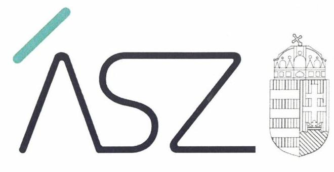

ÁLLAMI SZÁMVEVŐSZÉK

# JELENTÉS 

## Alapítványok/közalapítványok ellenőrzése

Alapítványok/közalapítványok ellenőrzése
2020. 07. hó 09. nap

20134
www.asz.hu
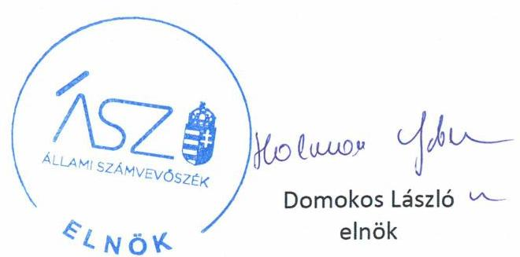

---

# AZ ELLENŐRZÉST FELÜGYELTE: 

MAKKAI MÁRIA felügyeleti vezető
TÓTH MARIANNA felügyeleti vezető

AZ ELLENŐRZÉST VEZETTE ÉS A VÉGREHAJTÁSÁÉRT FELELŐS:
HOFMEISTER LÁSZLÓ ellenőrzésvezető

A PROGRAM ÖSSZEÁLLÍTÁSÁÉRT FELELŐS:
FEKETE-NAGY ANDRÁS GÁBOR felelős vezető

IKTATÓSZÁM: EL-2784-001/2020.
TÉMASZÁM: 2508
ELLENŐRZÉS-AZONOSÍTÓ SZÁM: V0852025

---

# TARTALOMJEGYZÉK 

■ ÖSSZEGZÉS ..... 5
■ AZ ELLENŐRZÉS CÉLJA ..... 7
■ AZ ELLENŐRZÉS TERÜLETE ..... 8
■ AZ ELLENŐRZÉS HÁTTERE, INDOKOLTSÁGA ..... 9
■ A JELENTÉS LÉNYEGES KÉRDÉSKÖREI ..... 10
■ ELLENŐRZÉS HATÓKÖRE ÉS MÓDSZEREI ..... 11
■ MEGÁLLAPÍTÁSOK ..... 13
■ JAVASLATOK ..... 15
■ MELLÉKLETEK ..... 17
I. sz. melléklet: Ellenőrzött alapítványok gazdálkodási területei kockázatainak értékelése a 2016-2018. években ..... 17
II. sz. melléklet: Az ellenőrzött alapítványokra vonatkozó egyedi ellenőrzési megállapítások ..... 18
III. sz. melléklet: Értelmező szótár ..... 21
■ FÜGGELÉKEK ..... 23
I. sz. függelék a jelentéshez ..... 23
II. sz. függelék: Észrevételek ..... 24
■ RÖVIDÍTÉSEK JEGYZÉKE ..... 41

---

.

---

# ÖSSZEGZÉS 

Az ellenőrzött 24 alapítványból/közalapítványból egy, a Salva Vita Alapítvány a támogatások felhasználásának ellenőrizhetőségét nem biztosította.
Négy alapítvány, a Magyar Honvédség Szociálpolitikai Közalapítvány, a Magyar-Amerikai Fulbright Alapítvány Oktatási-kulturális csereprogramok megvalósítására, az Osztrák-Magyar Tudományos és Oktatási Kooperációs Akció Alapítvány, valamint a Rajkó Oktatási és Művészeti Alapítvány gazdálkodásának átláthatósága és a közpénzekkel történő elszámoltathatósága nem volt biztosított.
Az ellenőrzött alapítványok kockázati értékeléseit az alábbi ábrák szemléltetik.
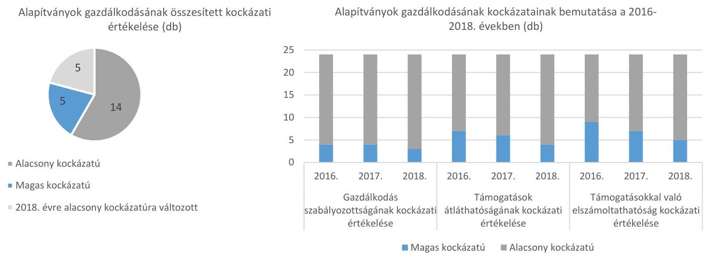

## Az ellenőrzés társadalmi indokoltsága

Jelen ellenőrzés 24 alapítvány ${ }^{1}$ gazdálkodásának lényeges területeire terjedt ki. Az alapítványok kockázatelemzés alapján kerültek kiválasztásra, nem reprezentálják a hazai alapítványokat. Az ellenőrzés hozzájárulhat az alapítványok ellenőrzésének nagyobb lefedettségéhez, támogatja a közpénzek felhasználásának és a közvagyon használatának szabályszerűségét, célszerűségét.

Az alapítványok, mint az alapító által az alapító okiratban meghatározott tartós cél megvalósítására létrehozott jogi személyek tevékenységüket az alapító által juttatott vagyon kezelésével, felhasználásával látják el. Az alapítványok működésükre és szakmai tevékenységük ellátására államháztartási forrásból nyújtott támogatásban vagy az államháztartásból ingyenes vagyonjuttatásban részesülhetnek, amelyre fokozott közérdeklődés irányul.

Az alapítványok ellenőrzésével az Állami Számvevőszék hozzájárul ahhoz, hogy a közpénzeket az államháztartáson kívüli szervezetek is ellenőrizhető, átlátható és elszámoltatható módon használják fel a feladatellátásuk során. Kockázatot jelent, ha az alapítványok nem alakítanak ki olyan számviteli nyilvántartási rendszert, amelyből a támogatások és az azok felhasználására vonatkozó információk elkülönítetten jelentek meg. Az elkülönítés hiánya következtében nem átlátható a közpénzek felhasználása, a felhasználás rendeltetésszerűsége.

Az alapítványok sokrétű tevékenységük révén a társadalom széles rétegével állnak közvetlen kapcsolatban, feladatellátásuk, szabályszerű gazdálkodásuk hozzájárulnak a közbizalom erősítéséhez.

Az alapítványok részére nyújtott költségvetési támogatások nagysága, tevékenységük sokszínűsége, továbbá a témakört érintően azonosított kockázatok alátámasztják az alapítványok ellenőrzésének szükségességét.

---

# Főbb megállapítások, következtetések, javaslatok 

Az ellenőrzés a kiválasztott alapítványok gazdálkodásának lényeges területeit értékelte, melynek kockázati értékelését az I. melléklet tartalmazza.

Az ellenőrzött alapítvány közül a gazdálkodás összesített értékelése alapján öt alapítvány minősült magas kockázatúnak az ellenőrzött évek mindegyikében. Ebből egy alapítvány a 2016-2018. években a feladatellátásukra kapott támogatások felhasználásának a Számv. tv. ${ }^{2}$ 161/A. § (2) bekezdésében előírt ellenőrizhetőségét nem biztosította, mivel az Ectv. ${ }^{3}$ 20. § (4) bekezdésében foglalt szabályozás ellenére nem gondoskodott arról, hogy a költségei, ráfordításai ellentételezésére kapott támogatásokról olyan elkülönített számviteli nyilvántartást vezessen a 2016-2018. években, amelynek alapján támogatásonként megállapítható és ellenőrizhető a kapott támogatás felhasználása. Mindezek alapján az alapítvány az Alaptörvény 39. cikk (2) bekezdésében foglaltak ellenére a felhasznált közpénzekre vonatkozó gazdálkodása átláthatóságát nem biztosította. Ezáltal nem igazolták a támogatások cél szerinti felhasználását.

További négy alapítvány hordozott magas kockázatot tekintettel a hiányos számviteli szabályozásra, valamint a beszámoló készítési kötelezettség teljesítésének elmulasztására. Az alapvető számviteli szabályzatok nélkül a közpénzekkel való gazdálkodás szabályozási keretei nem voltak biztosítottak, a szabályszerű beszámoló elkészítésének feltételei nem álltak fenn. Számviteli beszámoló hiányában nem volt biztosított a közpénzek átláthatósága. Ezen szervezetek esetében magas annak a kockázata, hogy a jövőben a kapott támogatásokat nem szabályszerűen használják fel, és a közpénzeket nem átláthatóan kezelik.

Jogkövető magatartást az ellenőrzés során 14 alapítványnál tapasztalt az ÁSZ ${ }^{4}$, melyek gazdálkodása az ellenőrzött időszak minden évében alacsony kockázatot hordozott. Ezek az alapítványok kialakították a szabályszerű gazdálkodás alapvető feltételeit, összeállították éves számviteli beszámolójukat, továbbá gondoskodtak a támogatások felhasználásának szabályszerű elkülönítéséről a 2016-2018. években.

Az ellenőrzött időszak egy-egy évében öt alapítvány gazdálkodása hordozott magas kockázatot, de a 2018. évben már alacsony kockázatúnak minősültek.

A Magyar-Amerikai Fulbright Alapítvány Oktatási-kulturális csereprogramok megvalósítására, a Magyar Honvédség Szociálpolitikai Közalapítvány és az Osztrák-Magyar Tudományos és Oktatási Kooperációs Akció Alapítvány elnökei az ellenőrzés ideje alatt a jelentéstervezet 15 napos észrevételezési folyamata során intézkedéseket tettek a számviteli szabályozás hiányosságainak megszüntetésére, a kockázatok csökkentésére. A Rajkó Oktatási és Művészeti Alapítvány nem intézkedett a 2019. évi - illetve az azt követő időszakra vonatkozó - szabályszerű számviteli beszámoló elkészítése tekintetében. Így az Állami Számvevőszék a Rajkó Oktatási és Művészeti Alapítvány kuratóriuma elnökének egy javaslatot fogalmazott meg, akinek a javaslatot megalapozó megállapításra 30 napon belül intézkedési tervet kell készítenie.

---

# AZ ELLENŐRZÉS CÉLJA 

Az ellenőrzés célja annak megállapítása volt, hogy az alapítvány/közalapítvány szabályszerű gazdálkodásához, a költségvetési támogatás felhasználásához biztosítottak voltak-e az alapvető feltételek, az alapítvány a közpénzekből kapott támogatásokhoz kapcsolódó nyilvántartások kialakítása során biztosította-e az elszámoltathatóságot és az átláthatóságot.

---

# **AZ ELLENŐRZÉS TERÜLETE**

## **Alapítványok, közalapítványok**

Az alapítványok mint az alapító által az alapító okiratban meghatározott tartós cél megvalósítására létrehozott jogi személyek tevékenységüket az alapító által juttatott vagyon kezelésével, felhasználásával látják el. Az alapítvány a non-profit szféra egyik alapvető szervezettípusa, gazdasági tevékenység folytatására nem lehet létrehozni. Az alapítvány ügyvezető szerve a testületi jellegű kuratórium vagy az egyszemélyes ügyvezető kurátor.

Minden ellenőrzött alapítvány részesült államháztartásból nyújtott támogatásban az ellenőrzött évek mindegyikében.

A kockázatelemzés alapján 20 alapítvány és 4 közalapítvány került kijelölésre ellenőrzésre. Az ellenőrzött szervezetek az alaptevékenységük szerint változatos képet mutatnak. Közérdekű céljaik között szerepel kulturális, nevelési, oktatási tevékenység, művészeti, egészségügyi, családsegítés, tudományos kutatási tevékenység támogatása, térségfejlesztés, valamint munkahelyteremtés. Az ellenőrzött alapítványok közül 17 székhelye található a fővárosban.

---

# AZ ELLENŐRZÉS HÁTTERE, INDOKOLTSÁGA 

Az alapítványok mint az alapító által az alapító okiratban meghatározott tartós cél megvalósítására létrehozott jogi személyek tevékenységüket az alapító által juttatott vagyon kezelésével, felhasználásával látják el. Az alapítványok működésükre és szakmai tevékenységük ellátására államháztartási forrásból nyújtott támogatásban vagy az államháztartásból ingyenes vagyonjuttatásban részesülhetnek, amelyre fokozott közérdeklődés irányul.

Társadalmi elvárás a közpénzek értékelvű, rendeltetésszerű felhasználása, a közpénzekből nyújtott támogatások átláthatóságának megteremtése. Az ÁSZ az államháztartásból, valamint a kizárólagos vagy többségi nemzeti tulajdonú gazdasági társaságtól támogatásban részesült alapítványoknál ellenőrizte a közpénzekkel való gazdálkodás alapvető szabályozási kereteit, a nyilvántartások vezetését, a beszámolási kötelezettség teljesítését.

A felhasznált támogatások átláthatóságának, a közpénzekkel való gazdálkodás elszámoltathatóságának értékelésével az ÁSZ előmozdítja, hogy a társadalom objektív képet alkothasson az alapítványok működéséről. Az ÁSZ stratégiájában rögzített célkitűzése, hogy az államháztartáson kívülre nyújtott költségvetési támogatás és vagyonjuttatás ellenőrzésével hozzájáruljon ahhoz, hogy a közpénzeket a civil szervezetek is átlátható módon és célszerűen használják fel.

Az ellenőrzés eredményeinek célzott felhasználói a nyilvánosság, a jogalkotó, továbbá az alapítványok alapítói és szervei. Az ellenőrzés eredményeképp a törvényalkotás számára tapasztalatok állnak rendelkezésre az alapítványok gazdálkodása szabályozásához. Az ellenőrzött szervezetek szintjén gazdálkodásuk vonatkozásában a hiányosságok, szabálytalanságok feltárása, az ennek kapcsán megfogalmazott megállapítások elősegíthetik az alapítványok szabályszerű gazdálkodását. Az ellenőrzés a társadalom számára információt szolgáltat arról, hogy az alapítványok a közpénzek szabályszerű felhasználásának feltételeit kialakították-e.

---

# A JELENTÉS LÉNYEGES KÉRDÉSKÖREI 

1.     - Az alapítványok biztosították-e a gazdálkodás alapvető feltételeit?
2.     - Az alapítványok biztosították-e a felhasznált támogatások átláthatóságát?
3.     - Az alapítványok biztosították-e a közpénzekkel való gazdálkodás elszámoltathatóságát?

---

# ELLENŐRZÉS HATÓKÖRE ÉS MÓDSZEREI 

## Az ellenőrzés típusa

Megfelelőségi ellenőrzés.

## Az ellenőrzött időszak

2016-2018. évek

## Az ellenőrzés tárgya

Az alapítvány gazdálkodása alapvető szabályozási kereteinek megléte, a 2016-2018. évi beszámolási kötelezettség teljesítésének ellenőrzése. Kiterjedt továbbá az ellenőrzés a központi költségvetésből kapott támogatással és 2016-2018. évi felhasználásával kapcsolatosan vezetett nyilvántartás ellenőrzésére.

## Az ellenőrzött szervezetek

A kockázati alapon kiválasztott 24 alapítvány a I. melléklet szerint.

## Az ellenőrzés jogalapja

Az ÁSZ tv. ${ }^{5} 1. § (3)$ és 5. § (3) bekezdései.

## Az ellenőrzés módszerei

Az ellenőrzést az ellenőrzött időszakban hatályos jogszabályok, az ellenőrzés szakmai szabályai, a jelen ellenőrzésre irányadó ÁSZ módszertanok, az ellenőrzési programban foglalt értékelési szempontok szerint hajtotta végre az ÁSZ. Az ellenőrzést az ÁSZ a program kérdéseire adott válaszok kiértékelésével, valamint a programban ismertetett ellenőrzési kérdések, kritériumok, adatforrások között megjelölt adatforrások, továbbá az adott időszakban hatályos jogszabályok figyelembevételével folytatta le.

A kockázatértékelésen alapuló, új módszertanú ellenőrzés a pénzügyi gazdálkodás lényeges területeire terjedt ki, és súlypontok meghatározásával lehetőséget biztosított a kockázatok beazonosítására.

A kockázati területek értékelése alapján kerültek besorolásra az egyes alapítványok alacsony vagy magas kockázatú kategóriákba.

---

Az ellenőrzés ideje alatt az ellenőrzött szervezettel történő kapcsolattartás az ÁSZ szervezeti és működési szabályzatának vonatkozó előírásai alapján volt biztosított.

---

# 1. Az alapítványok biztosították-e a gazdálkodás alapvető feltételeit? 

Összegző megállapítás

20 ellenőrzött alapítvány kialakította a szabályszerű gazdálkodás alapvető szabályozási feltételeit az ellenőrzött időszakban.

A GAZDÁLKODÁS SZABÁLYOZOTTSÁGA 20 ellenőrzött alapítvány esetében alacsony kockázatot hordozott, mivel ezen alapítványok biztosították a szabályszerű gazdálkodás alapvető feltételeit. A 2016-2017. években négy, a 2018. évben három alapítvány nem alakította ki a Számv. tv. 14. § (3) bekezdésében előírtak ellenére számviteli politikáját. Kettő alapítvány nem készítette el a számviteli politika keretében a Számv. tv. 14. § (5) bekezdés rendelkezései ellenére az eszközök és a források leltárkészítési és leltározási szabályzatát, az eszközök és a források értékelési szabályzatát, a pénzkezelési szabályzatát a 2016-2018. években. Ezáltal nem volt biztosított a közpénzfelhasználás szabályozottsága. A Számv. tv. által meghatározott szabályzatok rendelkezésre állására vonatkozó adatokat a 2. ábra szemlélteti.

## 2. Az alapítványok biztosították-e a felhasznált támogatások átláthatóságát?

Összegző megállapítás

16 ellenőrzött alapítvány biztosította a felhasznált támogatás átláthatóságát az ellenőrzött időszak minden évében.

SZÁMVITELI BESZÁMOLÁSI kötelezettségét 16 alapítvány teljesítette a Számv. tv. és az Ectv. szerint az ellenőrzött időszak minden évében (2016-ban 17, 2017-ben 18, 2018-ban 20 alapítvány). Ezen alapítványok az éves számviteli beszámolót szabályszerűen letétbe helyezték és közzétették.

Számviteli beszámolót a 2016-2017. években a Számv. tv. 4. § (1) bekezdésében és az Ectv. 28. § (1) bekezdésében foglaltak ellenére kettő, a 2018. évben egy alapítvány nem készített, így nem igazolta, hogy az általa kapott költségvetési támogatást a célnak megfelelően használta fel.

A számviteli szabályozottság hiányában, a 2016-2017. években négy, a 2018. évben három alapítványnál nem álltak fenn a szabályszerű beszámoló elkészítésének feltételei.

A felhasznált támogatás átláthatósága biztosításának értékelését az ellenőrzött alapítványok vonatkozásában a 3. ábra szemlélteti.

---

# 3. Az alapítványok biztosították-e a közpénzekkel való gazdálkodás elszámoltathatóságát? 

Összegző megállapítás

14 ellenőrzött alapítvány biztosította
 a közpénzekkel való gazdálkodás elszámoltathatóságát az ellenőrzött időszak minden évében.

14 alapítvány alakított ki olyan szabályszerű számviteli nyilvántartási rendszert az ellenőrzött évek mindegyikében (2016-ban 15, 2017-ben 17, 2018-ban 19 alapítvány), amelyből a támogatások és az azok felhasználására vonatkozó információk elkülönítetten jelentek meg.

Egy alapítvány a támogatások felhasználásának ellenőrizhetőségét nem biztosította az ellenőrzött időszakban.

Számviteli szabályozás, valamint a számviteli beszámoló hiánya következtében a 2016. évben nyolc, a 2017. évben hat, a 2018. évben négy alapítvány nem biztosította az elszámoltathatóság feltételeit.

Az ellenőrzött alapítványok gazdálkodása elszámoltathatóságának egyes években történő értékelését a 4. számú ábra mutatja be.

---

# JAVASLATOK 

Az ÁSZ tv. 33. § (1) bekezdésében foglaltak értelmében az ellenőrzött szervezet vezetője köteles a jelentésben foglalt megállapításokhoz kapcsolódó intézkedési tervet összeállítani és azt a jelentés kézhezvételétől számított 30 napon belül az ÁSZ részére megküldeni. Amennyiben az ellenőrzött szervezet vezetője nem küldi meg határidőben az intézkedési tervet, vagy továbbra sem elfogadható intézkedési tervet küld, az Állami Számvevőszék elnöke az ÁSZ tv. 33. § (3) bekezdése a) és b) pontjaiban foglaltakat érvényesítheti.

## a Rajkó Oktatási és Művészeti Alapítvány kuratóriuma elnökének

1. Intézkedjen a 2019. évi és az azt követő időszakra vonatkozó szabályszerű számviteli beszámoló elkészítéséről.
(II. sz. melléklet 18. oldal utolsó bekezdése alapján)

---

.

---

# MELLÉKLETEK

I. SZ. MELLÉKLET: ELLENŐRZÖTT ALAPÍTVÁNYOK GAZDÁLKODÁSI TERÜLETEI KOCKÁZATAINAK ÉRTÉKELÉSE A 2016-2018. ÉVEKBEN

|  Alapítvány megnevezése | Gazdálkodás szabályozottságának kockázati értékelése |  |  | Támogatások átláthatóságának kockázati értékelése |  |  | Támogatásokkal való elszámoltathatóság kockázati értékelése |  |  | Összesített kockázati értékelés |  |   |
| --- | --- | --- | --- | --- | --- | --- | --- | --- | --- | --- | --- | --- |
|   | 2016. | 2017. | 2018. | 2016. | 2017. | 2018. | 2016. | 2017. | 2018. | 2016. | 2017. | 2018.  |
|  Az Élet Menete Alapítvány (Budapest) |  |  |  |  |  |  |  |  |  |  |  |   |
|  Facultas Cognoscendi Akadémia Alapítvány |  |  |  |  |  |  |  |  |  |  |  |   |
|  Fehér Bot Alapítvány (Hajdúdorog) |  |  |  |  |  |  |  |  |  |  |  |   |
|  Hadigondozottak Közalapítványa (Budapest) |  |  |  |  |  |  |  |  |  |  |  |   |
|  Jövőnk Energiája Térségfejlesztési Alapítvány |  |  |  |  |  |  |  |  |  |  |  |   |
|  Kék Madár Alapítvány (Szekszárd) |  |  |  |  |  |  |  |  |  |  |  |   |
|  Korai Fejlesztő Központot Támogató Alapítvány |  |  |  |  |  |  |  |  |  |  |  |   |
|  Kovács Gábor Művészetért Alapítvány (Budapest) |  |  |  |  |  |  |  |  |  |  |  |   |
|  Magyar Honvédség Szociálpolitikai Közalapítvány (Budapest) |  |  |  |  |  |  |  |  |  |  |  |   |
|  Magyar-Amerikai Fulbright Alapítvány Oktatási-kulturális csereprogramok megvalósítására |  |  |  |  |  |  |  |  |  |  |  |   |
|  Magyar-Francia Ifjúsági Alapítvány (Budapest) |  |  |  |  |  |  |  |  |  |  |  |   |
|  Motiváció Mozgássérülteket Segítő Alapítvány |  |  |  |  |  |  |  |  |  |  |  |   |
|  Nem Adom Fel Alapítvány (Budapest) |  |  |  |  |  |  |  |  |  |  |  |   |
|  Osztrák-Magyar Tudományos és Oktatási Kooperációs Akció Alapítvány (Budapest) |  |  |  |  |  |  |  |  |  |  |  |   |
|  Ösvény Esélynövelő Alapítvány (Fűzesgyarmat) |  |  |  |  |  |  |  |  |  |  |  |   |
|  Rajkó Oktatási és Művészeti Alapítvány (Budapest) |  |  |  |  |  |  |  |  |  |  |  |   |
|  Regionális Civil Központ Alapítvány (Miskolc) |  |  |  |  |  |  |  |  |  |  |  |   |
|  Salva Vita Alapítvány (Budapest) |  |  |  |  |  |  |  |  |  |  |  |   |
|  Stúdió "K" Alapítvány (Budapest) |  |  |  |  |  |  |  |  |  |  |  |   |
|  Szabadságharcosokért Közalapítvány (Budapest) |  |  |  |  |  |  |  |  |  |  |  |   |
|  Szent Lázár Alapítvány (Békés) |  |  |  |  |  |  |  |  |  |  |  |   |
|  Tempus Közalapítvány (Budapest) |  |  |  |  |  |  |  |  |  |  |  |   |
|  Tihanyi Alapítvány (Budapest) |  |  |  |  |  |  |  |  |  |  |  |   |
|  Trianon Múzeum Alapítvány (Várpalota) |  |  |  |  |  |  |  |  |  |  |  |   |

Jelmagyarázat: V. Magas kockázati

---

# Magas kockázatú besorolású alapítványok 

## Magyar Honvédség Szociálpolitikai Közalapítvány

## Megállapítás

Az alapítvány gazdálkodására vonatkozó belső szabályozás nem felelt meg az előírásoknak, mivel a 2016-2018. években nem rendelkezett a Számv. tv. 14. § (3) bekezdésében előírt számviteli politikával.

## Magyar-Amerikai Fulbright Alapítvány Oktatási-kulturális csereprogramok megvalósítására

## Megállapítás

Az alapítvány gazdálkodására vonatkozó belső szabályozás nem felelt meg az előírásoknak, mivel a 2016-2018. években nem rendelkezett a Számv. tv. 14. § (3) bekezdésében előírt számviteli politikával és az Számv. tv. 14. § (5) bekezdés a), b) és d) pontjaiban elkészítendő szabályzatok - az eszközök és a források leltárkészítési és leltározási szabályzata, az eszközök és a források értékelési szabályzata és a pénzkezelési szabályzat - egyikével sem.

## Osztrák-Magyar Tudományos és Oktatási Kooperációs Akció Alapítvány

## Megállapítás

Az alapítvány gazdálkodására vonatkozó belső szabályozás nem felelt meg az előírásoknak, mivel a 2016-2018. években nem rendelkezett a Számv. tv. 14. § (3) bekezdésében előírt számviteli politikával és az Számv. tv. 14. § (5) bekezdés a), b) és d) pontjaiban elkészítendő szabályzatok - az eszközök és a források leltárkészítési és leltározási szabályzata, az eszközök és a források értékelési szabályzata és a pénzkezelési szabályzat - egyikével sem.

## Rajkó Oktatási és Művészeti Alapítvány

## Megállapítás

Az alapítvány az Ectv. 28. § (1) bekezdésében foglaltak ellenére a 2016-2018. években beszámoló készítési kötelezettségének nem tett eleget.

---

# Salva Vita Alapítvány 

## Megállapítás

Az alapítvány az Ectv. 20. § (4) bekezdésben foglaltak ellenére a költségei, ráfordításai ellentételezésére kapott támogatásokról nem vezetett olyan elkülönített számviteli nyilvántartást a 2016-2018. években, amelynek alapján támogatásonként megállapítható és ellenőrizhető a kapott támogatás felhasználása.

## A 2018. évre magas kockázati besorolásból alacsony kockázati besorolásúra változott alapítványok

## Fehér Bot Alapítvány

## Megállapítás

Az alapítvány gazdálkodására vonatkozó belső szabályozás nem felelt meg az előírásoknak, mivel a 2016-2017. években nem rendelkezett a Számv. tv. 14. § (3) bekezdésében előírt számviteli politikával.

## Nem Adom Fel Alapítvány

## Megállapítás

Az alapítvány az Ectv. 28. § (1) bekezdésében foglaltak ellenére a 2016. évben beszámoló készítési kötelezettségének nem tett eleget.

## Ösvény Esélynövelő Alapítvány

## Megállapítás

Az alapítvány az Ectv. 30. § (1) bekezdésében foglaltak ellenére a 2016. évi beszámolót a jóváhagyásra jogosult testület jóváhagyása nélkül tette közzé.

## Stúdió "K" Alapítvány

## Megállapítás

Az alapítvány az Ectv. 20. § (4) bekezdésben foglaltak ellenére a költségei, ráfordításai ellentételezésére kapott támogatásokról nem vezetett olyan elkülönített számviteli nyilvántartást a 2016. évben, amelynek alapján támogatásonként megállapítható és ellenőrizhető a kapott támogatás felhasználása.

---

# Tempus Közalapítvány 

## Megállapítás

Az alapítvány az Ectv. 28. § (1) bekezdésében foglaltak ellenére a 2017. évben beszámoló készítési kötelezettségének nem tett eleget.

## Alacsony kockázati besorolású alapítványok

Ezen alapítványok biztosították a szabályszerű gazdálkodás alapvető feltételeit, elkészítették éves számviteli beszámolójukat, valamint a támogatásokra vonatkozóan rendelkeztek elkülönített nyilvántartásokkal.

- Az Élet Menete Alapítvány
- Facultas Cognoscendi Akadémia Alapítvány
- Hadigondozottak Közalapítványa
- Jövőnk Energiája Térségfejlesztési Alapítvány
- Kék Madár Alapítvány
- Korai Fejlesztő Központot Támogató Alapítvány
- Kovács Gábor Művészetért Alapítvány
- Magyar-Francia Ifjúsági Alapítvány
- Motiváció Mozgássérülteket Segítő Alapítvány
- Regionális Civil Központ Alapítvány
- Szabadságharcosokért Közalapítvány
- Szent Lázár Alapítvány
- Tihanyi Alapítvány
- Trianon Múzeum Alapítvány

---

alapítvány

Költségvetési támogatás
közalapítvány

Az alapítvány az alapító által az alapító okiratban meghatározott tartós cél folyamatos megvalósítására létrehozott jogi személy. Az alapító az alapító okiratban meghatározza az alapítványnak juttatott vagyont és az alapítvány szervezetét. Alapítvány nem alapítható gazdasági-vállalkozási tevékenység folytatására. Az alapítvány az alapítványi cél megvalósításával közvetlenül összefüggő gazdasági tevékenység végzésére jogosult. Alapítvány nem lehet korlátlan felelősségű tagja más jogalanynak, nem létesíthet alapítványt és nem csatlakozhat alapítványhoz. (Forrás: Ptk. ${ }^{6}$ 3:378§, 3:379. § (1) - (3) bekezdés)
az államháztartás alrendszerei terhére nyújtott pénzbeli vagy nem pénzbeli
 juttatás, amelyet a támogató nem elsősorban ellenszolgáltatás ellenében, de konkrét program megvalósítása vagy meghatározott időszakban a támogatott szervezet működtetése érdekében nyújt. Költségvetési támogatás különösen: a pályázat útján, valamint egyedi döntéssel kapott költségvetési támogatás; az Európai Unió strukturális alapjaiból, illetve a Kohéziós Alapból származó, a költségvetésből juttatott támogatás; az Európai Unió költségvetéséből vagy más államtól, nemzetközi szervezettől származó támogatás és a személyi jövedelemadó meghatározott részének az adózó rendelkezése szerint felajánlott összege. (Forrás: Ectv. 2. § 15. pont)
a közalapítvány olyan alapítvány, amelyet az Országgyűlés, a Kormány, valamint a helyi önkormányzat vagy kisebbségi önkormányzat képviselő-testülete közfeladat ellátásának folyamatos biztosítása céljából hozhatott létre 2006. augusztus 24-ig. Ezt követően ezek a szervezetek alapítványt nem alapíthattak, kivéve a Kormányt, amely 2016. október 20-tól hozhat létre alapítványt. Törvény közalapítvány létrehozását kötelezővé teheti. Közfeladatnak minősült az állami, helyi önkormányzati vagy kisebbségi önkormányzati feladat, amelynek ellátásáról - törvény vagy önkormányzati rendelet alapján az államnak vagy az önkormányzatnak kell gondoskodnia. A közalapítvány létrehozása nem érintette az államnak, illetve az önkormányzatnak a feladat ellátására vonatkozó kötelezettségét. Közalapítvány alapítására jogosult szerv alapítványt csak közalapítványként hozhatott létre. Közalapítvány csak olyan gazdálkodó szervezetben vehet részt, amelyben legalább többségi irányítást biztosító befolyással rendelkezik, és amelyben felelőssége nem haladja meg vagyoni hozzájárulása mértékét. A közalapítvány által létrehozott gazdálkodó szervezet további gazdálkodó szervezetet nem alapíthat, és gazdálkodó szervezetben részesedést nem szerezhet. Közalapítvány létesítése esetén az alapító okiratban a kezelő szervet is meg kell jelölni, vagy ilyen célra külön szervezet - ideértve a kezelő szerv ellenőrzésére jogosult szervet is - létrehozásáról kell gondoskodni. (Forrás: a Polgári Törvénykönyvről szóló 1956. évi IV. törvény 74/G. § (1) -(2), (4) és (5) bekezdései, 2006. évi LXV. törvény ${ }^{7}$ 1. §-a alapján)

---

.

---

# FÜGGELÉKEK 

- I. SZ. FÜGGELÉK A JELENTÉSHEZ

Az Állami Számvevőszék az ellenőrzések során feltárt tényekhez kapcsolódó további körülmények tisztázására eszközrendszerrel nem rendelkezik. Amennyiben az ellenőrzésen túlmutatóan indokoltnak látszik az ellenőrzés során feltárt körülmények további vizsgálata, az Állami Számvevőszék törvényi felhatalmazás alapján az ellenőrzés által feltárt körülményeket továbbítja a hatáskörrel rendelkező szervnek a szükséges intézkedések megtétele, eljárások lefolytatása érdekében.
A Rajkó Oktatási és Művészeti Alapítvány a teljességi és hitelességi nyilatkozata és a rendelkezésre adott iratai szerint 2016-2018. években a Civil tv. 28. § (1) bekezdésében, a számviteli törvény szerinti egyes egyéb szervezetek beszámoló készítési és könyvvezetési kötelezettségeinek sajátosságairól szóló 479/2016. (XII.28.) Korm. rendelet 7. § (1) bekezdésében és a Számv.tv. 4.§ (1) bekezdésében előírt éves beszámoló készítési kötelezettségének - figyelemmel a Számv. tv. 20. § (6) bekezdésében, illetve a 99. § (5) bekezdésében foglaltakra - nem tett eleget.

Ennek hiányában nem számolt be a működéséről, vagyoni, pénzügyi és jövedelmi helyzetéről, a közfeladatokra kapott költségvetési támogatások felhasználásának átláthatóságát nem biztosította. A beszámolóként közzétett adatai hitelessége nem igazolt. Az eset konkrét körülményeinek feltárására az illetékes törvényszék rendelkezik hatáskörrel.

---

# II. SZ. FÜGGELÉK: ÉSZREVÉTELEK 

A jelentéstervezetet a Számvevőszék 15 napos észrevételezésre megküldte az ellenőrzött szervezetek vezetőinek az ÁSZ tv. 29. § (1) bekezdése előírásának megfelelően.

Az ellenőrzött szervezetek közül észrevételezési jogával élt a Magyar-Amerikai Fulbright Alapítvány, a Nem Adom Fel Alapítvány, az Osztrák-Magyar Tudományos és Oktatási Kooperációs Akció Alapítvány és a Tempus Közalapítvány. A Szabadságharcosokért Közalapítvány nemleges észrevételt tett. Az észrevételeket és az arra adott válaszokat a függelék tartalmazza.

[^0]
[^0]:    * 29. § (1) Az Állami Számvevőszék az ellenőrzési megállapításait megküldi az ellenőrzött szervezet vezetőjének vagy az általa megbízott személynek, és annak, akinek személyes felelősségét állapította meg.
    (2) Az ellenőrzött szervezet vezetője és a felelősként megjelölt személy az ellenőrzés megállapításaira tizenöt napon belül írásban észrevételt tehet.
    (3) Az Állami Számvevőszék az észrevételre a beérkezésétől számított harminc napon belül írásban válaszol. A figyelembe nem vett észrevételeket köteles a jelentésben feltüntetni, és megindokolni, hogy azokat miért nem fogadta el.

---

# Szabadságharcosokért Közalapítvány 

## Elnök

Ikt.szám: $\qquad$

## Domokos László úr   elnök   Állami Számvevőszék   Budapest

## Tisztelt Elnök Úr!

Kézhez vettük az „Alapítványok/közalapítványok ellenőrzése" címmel készített számvevőszéki jelentéstervezetet.

Tájékoztatom Önt arról, hogy a Közalapítványunkkal kapcsolatban tett megállapításokat tudomásul vesszük és a jövőbeni munkánk során mértékadónak tekintjük.

Budapest, 2020. május 25.

Tisztelettel: $\qquad$
Boross Péter
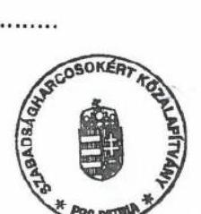

---

# FULBRIGHT Hungary 

Re: Ikt. szám: EL-2179-022/2020.

Domokos László
elnök
Állami Számvevőszék
Budapest

## ASZ0000001201

Tisztelt Elnök Úr!

Köszönettel megkaptam az "Alapítványok/közalapítványok ellenőrzése" címmel készített számvevőszéki jelentéstervezetet a 2016-2018-as évekre vonatkozóan.

A Magyar-Amerikai Fulbright Alapítvány 1992-es megalapítása óta mindig törekedett arra, hogy a hatályos törvényeknek megfelelően működjön.

Az Alapítvány kuratóriuma 2020.06.04-i ülésén megtárgyalta az ÁSZ jelentéstervezetét és az abban foglalt ellenőrzési megállapításokat.

A jelentéstervezet 16. oldalán szereplő egyedi ellenőrzési megállapítással kapcsolatban az alábbi észrevételeket tennénk:

2016-ban jelezte az Alapítvány független könyvvizsgálója (KPMG Hungária Kft.), hogy a számviteli törvény változása miatt frissíteni kell a meglévő számviteli politikát és a kapcsolódó szabályzatokat. A feladattal az Alapítvány könyvelési szolgáltatója lett megbízva (Mazars Könyvszakértő és Tanácsadói Kft.) díjazás ellenében. A frissített változat el is készült, amit a könyvvizsgáló el is fogadott. Elismerjük, hogy a változtatásokat formálisan nem hagyta jóvá a kuratórium, nem szerepel erről döntés a kuratórium angol nyelvű jegyzőkönyveiben. Ugyanakkor hangsúlyozni szeretnénk, hogy a kuratórium által minden évben elfogadott és közzétett éves beszámoló részét képező Kiegészítő melléklet 1. oldalán szerepel a meglévő számviteli politikára való utalás ill. annak egy rövid kivonata és a könyvelés is ennek figyelembevételével történt.

Szeretném jelezni, hogy a kuratórium 2020.06.04-i ülésén formálisan is jóváhagyta a számviteli politika mellett a meglévő és a könyvelés során eddig is alkalmazott Leltározási, Értékelési, Pénzkezelési és Bizonylati szabályzatot valamint a Számlarendet.

---

Annak fényében, hogy a független könyvvizsgálói jelentés mindhárom vizsgált évben arra a következtetésre jutott, hogy az éves beszámoló megbízható és valós képet ad az Alapítvány vagyoni és pénzügyi helyzetéről, túlzónak érezzük azt a megállapítást, hogy az Alapítvány "gazdálkodásának átláthatósága és a közpénzekkel történő elszámoltathatósága nem volt biztosított" (5. old.).

Kérem a fenti tények mérlegelését és amennyiben lehetséges az Alapítvány kockázati besorolásának módosítását.

Budapest, 2020. június 09.

Tisztelettel,

Magyarics Tamás László
Kuratóriumi elnök

Magyar-Amerikai Fulbright Alapítvány, 1111 Budapest, Bertalan Lajos u. 2.
Tel: +36 1462 8040 | Email: info@fulbright.hu | www.fulbright.hu

---

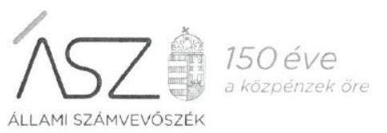

Ikt. szám: EL-2179-047/2020.

Magyarics Tamás László úr
kuratóriumi elnök

Magyar-Amerikai Fulbright Alapítvány

# Budapest 

Tisztelt Elnök Úr!

Az „Alapítványok/közalapítványok ellenőrzése" címmel készített számvevőszéki jelentéstervezetre tett 2020. június 09-én kelt észrevételét köszönettel megkaptam.

Az Állami Számvevőszék észrevételre vonatkozó álláspontjáról a felügyeleti vezető által készített részletes tájékoztatást mellékelten megküldöm.

Tájékoztatom Elnök urat, hogy a számvevőszéki jelentésben - az Állami Számvevőszékről szóló 2011. évi LXVI. törvény 29. § (3) bekezdése alapján - a figyelembe nem vett észrevételt szerepeltetjük, annak indoklásával, hogy azt az Állami Számvevőszék miért nem fogadta el.

Budapest, 2020. 06 hó 26 nap

Melléklet: Tájékoztatás az észrevétel kezeléséről
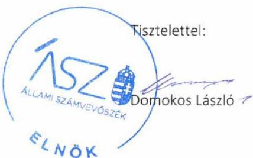

---

Melléklet
Ikt.szám: EL-2179-047/2020.

# Tájékoztatás 

## az észrevétel kezeléséről

Az „Alapítványok/közalapítványok ellenőrzése" címú jelentéstervezetre 2020. június 15-én érkezett észrevételt áttekintettük, annak kezelésével kapcsolatban a következő tájékoztatást adom.

Az észrevétel a jelentéstervezet Magyar-Amerikai Fulbright Alapítvány vonatkozásában tett megállapítását érinti. Az észrevétel tájékoztat arról, hogy az Alapítvány független könyvvizsgálója 2016-ban jelezte, hogy a számviteli politika és a kapcsolódó szabályzatok frissítése szükséges. A feladatra az Alapítvány könyvelési szolgáltatója kapott megbízást. Az észrevétel rögzíti, hogy az Alapítvány kuratóriuma a frissített változatot elkészülte után nem hagyta jóvá.

Az észrevétel megerősíti az Állami Számvevőszék 2016-2018 közötti ellenőrzött időszakra vonatkozó megállapítását, így a jelentéstervezet módosítása nem indokolt.

Az észrevétel által megerősített megállapításból következő, a jelentéstervezet 5. oldalán szereplő összegzés - az Alapítvány gazdálkodásának átláthatósága és a közpénzekkel történő elszámoltathatósága nem volt biztosított - közpénzügyi szempontból megalapozott és indokolt.

Mindemellett tájékoztatom, hogy levelét az Állami Számvevőszék által küldött, EL-2179-026/2020. iktatószámú elnöki figyelemfelhívó levélre vonatkozó válaszként egyaránt kezeljük. Erről az értékelést követően külön levélben értesítjük Elnök urat.

Budapest, 2020. 06 hó 26 nap
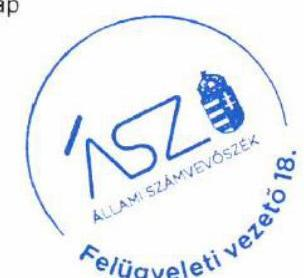

Makkai Mária s.k. felügyeleti vezető

A kiadmány hiteles.

---

Tisztelt Elnök Úr!

Megkaptuk az „Alapítványok/közalapítványok ellenőrzése" címmel készített számvevőszéki jelentéstervezetet (Ikt. szám: EL-2179-022/2020), amelyre az alábbi észrevételt szeretném tenni.

A II. számú melléklet a Nem Adom Fel Alapítványról azt a megállapítást tartalmazza, hogy a szervezet a 2016. évben nem tett eleget a beszámoló készítési kötelezettségének.
Ezen állítás -minden bizonnyal- félreértésen alapul, hiszen az Alapítvány, -a jogszabályoknak megfelelő formában és határidőben- elkészítette és letétbe is helyezte a 2016. évtől szóló beszámolóját. A dokumentum elérhető a www.birosag.hu weboldalon, de ezen levél mellékleteként is küldöm.

A fentiek alapján kérem módosítani a jelentéstervezetet!

Kelt: Budapest, 2020. május 12.

Köszönettel:

Dely Géza
Kuratóriumi elnök
Nem Adom Fel Alapítvány

---

# 150 éve   a közpénzek őre 

ÁLLAMI SZÁMVEVŐSZÉK

Ikt. szám: EL-2179-044/2020.

Dely Géza úr
kuratóriumi elnök

Nem Adom Fel Alapítvány

## Budapest

Tisztelt Elnök Úr!

Az „Alapítványok/közalapítványok ellenőrzése" címmel készített számvevőszéki jelentéstervezetre tett 2020. május 12-én kelt észrevételét köszönettel megkaptam.

Az Állami Számvevőszék észrevételre vonatkozó álláspontjáról a felügyeleti vezető által készített részletes tájékoztatást mellékelten megküldöm.

Tájékoztatom Elnök urat, hogy a számvevőszéki jelentésben - az Állami Számvevőszékről szóló 2011. évi LXVI. törvény 29. § (3) bekezdése alapján - a figyelembe nem vett észrevételt szerepeltetjük, annak indoklásával, hogy azt az Állami Számvevőszék miért nem fogadta el.

Budapest, 2020. 06 hó 22 nap

Melléklet: Tájékoztatás az észrevétel kezeléséről
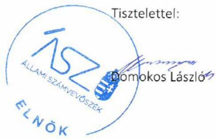

---

Melléklet
Ikt.szám: EL-2179-044/2020.

# Tájékoztatás   az észrevétel kezeléséről 

Az „Alapítványok/közalapítványok ellenőrzése" című jelentéstervezetre 2020. május 25-én érkezett észrevételt áttekintettük, annak kezelésével kapcsolatban a következő tájékoztatást adom.

Az észrevétel a jelentéstervezet Nem Adom Fel Alapítvány vonatkozásában tett megállapítását érinti. Az észrevétel tájékoztat arról, hogy az Alapítvány a jogszabályoknak megfelelő formában és határidőben elkészítette és letétbe helyezte a 2016. évről szóló beszámolóját.

Tájékoztatom Elnök urat, hogy az Állami Számvevőszék (továbbiakban ÁSZ) ellenőrzési megállapításai minden esetben az Állami Számvevőszékről szóló 2011. évi LXVI. törvénynek megfelelően az ellenőrzés során bekért és az arra nyitva álló határidőn belül rendelkezésre bocsátott dokumentumokon alapulnak.

Az ÁSZ az ellenőrzés lefolytatásához EL-1826-001/2019. iktatószámú levelében kérte a levél 3. számú mellékletében szereplő hiteles és aláírt dokumentumokat. Az Alapítvány által rendelkezésre bocsátott 2016. évre vonatkozó számviteli beszámoló nem aláírt, így hitelesen nem igazolta, hogy az Alapítvány beszámoló készítési kötelezettségének eleget tett. Fentiek alapján az észrevételt nem fogadjuk el, a jelentéstervezet módosítása nem indokolt.

Budapest, 2020. 06 hó 22 nap
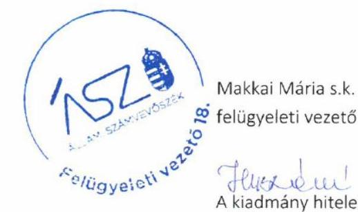

---

# Függelékek 

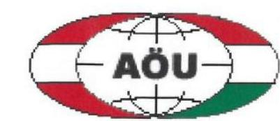

## Osztrák-Magyar Akció Alapítvány Stiftung Aktion Österreich-Ungarn

## Állami Számvevőszék

1052 Budapest, Apáczai Csere János utca 10.

## Domokos László

elnök

Tárgy: Észrevételek és válasz az EL-2179-022/2020. ikt. sz. levélre

Tisztelt Elnök Úr!
Budapest, 2020. május 19.
Fenti tárgyban az Osztrák-Magyar Tudományos és Oktatási Kooperációs Akció Alapítványra (OMAA) vonatkozó „Alapítványok és közalapítványok ellenőrzése, tárgyában megküldött számvevőszéki jelentéstervezetet május 11-én köszönettel megkaptam.
A levelében jelzett ill. a jelentéstervezetben az OMAA-t érintő megállapításokra az alábbi írásbeli észrevételeket kívánom tenni:

Az ellenőrzésről és adatbekérésről szóló augusztus 26-án kézhez vett levelük alapján közreműködési kötelezettségünknek
 eleget kivántunk tenni. Levelük kézhez vétele napján, az OMAA Felügyelő Bizottsága tagjaival történt egyeztetést követően telefonon azonnal felvette Önökkel a kapcsolatot ez ügyben az alapítvány ügyvezetője, Schnaider Lászlóné. Ennek során tájékoztatta Önöket arról, hogy a levelükben meghatározott határidő betartását nem tartja lehetségesnek. Munkatársuk írásos kérelem beadását javasolta a határidő meghosszabbítását illetően. Az ügyvezető a kérelem lehetőségével élve a határidő meghosszabbítására vonatkozó okok részletezésével írásbeli kérelmet juttatott el Önökhöz (levelemhez másolatban csatolom). A kérelmet Önök nem hagyták jóvá.
Tisztelettel tájékoztatom Önt arról, hogy az OMAA rendelkezett és rendelkezik az ellenőrzési jelentéstervezetben említett 2016-2018-ig érvényes számviteli politikával, a vonatkozó és a hivatkozott törvény által megkövetelt szabályzatokkal. Az ügyvezető általi levélben felsorolt technikai és személyi feltételek hiánya miatt a kért szabályzatok mindegyikét nem tudta az iroda a határidőre feltölteni. Az Önöknek az adatbekérés során feltöltött, az OMAA Kuratóriuma által jóváhagyott 2016-2018. évekre szóló könyvvizsgálói jelentések viszont alátámasztják a 2016-2018. évi szabályzatok meglétét. Ezen levelemhez a 2016-2018. évi szabályzatokat utólag, pótlólag csatolom. Hiánypótlásra az ellenőrzés során lehetőségünk nem volt.
A 2019. januárjától érvényes számviteli politikánkat és a vonatkozó törvények által megkövetelt szabályzatokat az ellenőrzési adatbekérés során feltöltöttük. A 2020. évi számviteli politikánkat az ITM észrevételei alapján módosítottuk.

Kérem, hogy az ellenőrzési jelentés az OMAA-val kapcsolatos véglegesítése során levelemet, észrevételeimet figyelembe venni szíveskedjen.
Köszönöm, tisztelettel

Prof. Dr. Szakály Sándor
a kuratórium elnöke
Mellékletek: - OMAA 2016-18. évi számviteli politika és szabályzatok

- Kérelem

Postanschrift:
H-1088 Budapest, Bródy Sándor u. 16.

Tel: +36 12667475 , E-mail: omaa@omaa.hu
Internet: http://www.omaa.hu

---

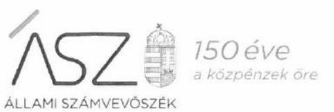

ELNÖK

Ikt. szám: EL-2179-042/2020.

Prof. Dr. Szakály Sándor úr
kuratóriumi elnök

Osztrák-Magyar Tudományos és Oktatási Kooperációs Akció Alapítvány

Budapest

Tisztelt Elnök Úr!

Az „Alapítványok/közalapítványok ellenőrzése" címmel készített számvevőszéki jelentéstervezetre tett 2020. május 19-én kelt észrevételét köszönettel megkaptam.

Az Állami Számvevőszék észrevételre vonatkozó álláspontjáról a felügyeleti vezető által készített részletes tájékoztatást mellékelten megküldöm.

Tájékoztatom Elnök urat, hogy a számvevőszéki jelentésben – az Állami Számvevőszékről szóló 2011. évi LXVI. törvény 29. § (3) bekezdése alapján – a figyelembe nem vett észrevételt szerepeltetjük, annak indoklásával, hogy azt az Állami Számvevőszék miért nem fogadta el.

Budapest, 2020. 06. hó 14. nap

Melléklet: Tájékoztatás az észrevétel kezeléséről

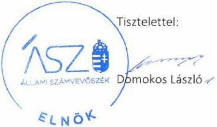

1052 BUDAPEST, Apáczai Csere János utca 10. 1364 Budapest 4. Pf. 54. telefon: +36 1 484 9101, fax: +36 1 484 9201

---

Melléklet
Ikt.szám: EL-2179-042/2020.

# Tájékoztatás   az észrevétel kezeléséről 

Az „Alapítványok/közalapítványok ellenőrzése" című jelentéstervezetre 2020. május 21-én érkezett észrevételt áttekintettük, annak kezelésével kapcsolatban a következő tájékoztatást adom.

Az észrevétel a jelentéstervezet Osztrák-Magyar Tudományos és Oktatási Kooperációs Akció Alapítvány (továbbiakban OMAA) vonatkozásában tett megállapítását érinti. Az észrevétel tájékoztat arról, hogy az OMAA rendelkezik a jelentéstervezetben említett 2016-2018-ig érvényes számviteli politikával, a vonatkozó és a hivatkozott törvény által megkövetelt szabályzatokkal, melyek mindegyikét az adatbekérés során nem tudta határidőre feltölteni.

Tájékoztatom Elnök urat, hogy az Állami Számvevőszék (továbbiakban ÁSZ) ellenőrzési megállapításai minden esetben az Állami Számvevőszékről szóló 2011. évi LXVI. törvénynek megfelelően az ellenőrzés során bekért és az arra nyitva álló határidőn belül rendelkezésre bocsátott dokumentumokon alapulnak.

Az ÁSZ EL-1824-001/2018. iktatószámú adatbekérő levél 3. számú melléklete szerint a 2016-2018. évekre vonatkozó aláírt és hiteles dokumentumokat kérte. Az OMAA által rendelkezésre bocsátott számviteli politika, leltározási szabályzat, és a pénzkezelési szabályzat nem aláírtak, így azok nem hiteles dokumentumok. Mindezek alapján az észrevételt nem fogadjuk el, a jelentéstervezet megállapításának módosítása nem indokolt.

Budapest, 2020. 06. hó 16. nap
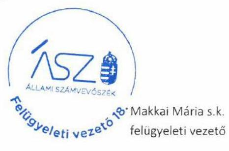

A kiadmány hiteles.

---

# Tárgy: 

Kapcsolattartó:
Dátum:
Iktatószám:
Hivatkozási szám:

## Domokos László   elnök   Állami Számvevőszék   Budapest   Apáczai Csere János u. 10.   1052

Észrevétel jelentéstervezetre
Misinć Hegedűs Viktória
2020. május 21.

TKA-00184-019/2018
EL-2179-022/2020 Ikt. sz.
adatbekérés

## ASZ0000001099

Tisztelt Elnök Úr!
2020. május 12-én köszönettel megkaptuk EL-2179-022/2020. iktatószámú levelének mellékleteként az „Alapítványok/közalapítványok ellenőrzése" címmel készített számvevőszéki jelentéstervezetet, melyre az alábbiakban kívánunk észrevételt tenni.

- A jelentéstervezet 15. oldalán lévő táblázatban a Tempus Közalapítvány a „Támogatott átláthatóságának kockázati értékelése" és a „Támogatásokkal való elszámolhatóság kockázati értékelése" 2017. évre vonatkozó oszlopaiban „Magas kockázatú" besorolást kapott.
- A jelentéstervezet 18. oldalának megállapítása szerint a Tempus Közalapítvány „(...) az Ectv. 28. § (1) bekezdésében foglaltak ellenére a 2017. évben beszámoló készítési kötelezettségének nem tett eleget.

Fenti megállapítások nem helytállók. A közalapítvány a 2017. évben - csakúgy, mint minden évben a vonatkozó jogszabályok szerinti határidőre teljesítette beszámoló készítési kötelezettségét. Az erre vonatkozó dokumentumokat az Állami Számvevőszék EL-1095-002/2018 és EL-1095-008/2019 iktatószámú adatbekérő leveleinek megfelelően több ízben is feltöltöttük az Elektronikus Adatszolgáltatási Rendszerbe.
A vonatkozó dokumentumok a teljességi és hitelességi nyilatkozatok szerint az alábbiak:
EL-1095-002/2018 iktatószámú adatbekérésre 2018.10.04-ig feltöltésre került:

| 7 | 2_6   2.6. Az ellenőrzött időszakra vonatkozó egyszerűsített éves, éves beszámolókat jóváhagyó döntések (Ectv. 30. §) | Jegyzökönyv_2017.pdf |
| :--: | :--: | :--: |
| 7.1 | 2_6   2.6. Az ellenőrzött időszakra vonatkozó egyszerűsített éves, éves beszámolókat jóváhagyó döntések (Ectv. 30. §) | jelenleti_kuratórium_2017.pdf |

TEMPUS KÖZALAPÍTVÁNY
PÁLYÁZATOK | KÉPZÉSEK | TUDÁSKÖZKÖZPONT
Cím: 1077 Budapest, Kőrösi Csoma Sándor tér 1. | Levelezési cím: 1438 Budapest 70. Pf. 508. | Telefon: (1) 2371300 | Fax: (1) 2391329 | E-mail: info@tpf.hu Internet: www.tka.hu | www.oktataskapzes.tka.hu

---

| 48 | 2_5   2.5. Az ellenőrzött időszakra vonatkozóan egyszerűsített éves, éves beszámolói (Ectv. 30. §) | Könyvvizsgálói jelentés_2017.pdf |
| :--: | :--: | :--: |
| 48.1 | 2_5   2.5. Az ellenőrzött időszakra vonatkozóan egyszerűsített éves, éves beszámolói (Ectv. 30. §) | Közhasznúsági szöveges besz_2017.pdf |
| 48.2 | 2_5   2.5. Az ellenőrzött időszakra vonatkozóan egyszerűsített éves, éves beszámolói (Ectv. 30. §) | Közhasznúsági_Kiegészítő melléklet_2017.pdf |

EL-1095-008/2019 iktatószámú adatbekérésre 2019.01.28-ig feltöltésre került:

| 100 | $\begin{aligned} & \text { 1_2_09 } \\ & \text { Beszámolót jóváhagyó kuratóriumi ülés } \\ & \text { jegyzőkönyve, meghívója, beszámolóhoz } \\ & \text { kapcsolódó előterjesztés, felügyelő bizottság } \\ & \text { írásbeli véleménye a beszámolóról. } \end{aligned}$ | $\mathrm{ku} \_18 \_05 \_10 \_1 \mathrm{a} \_$TPStab2017_konyvvizsgaloi_jelent es.pdf |
| :--: | :--: | :--: |
| 100.1 | $\begin{aligned} & \text { 1_2_09 } \\ & \text { Beszámolót jóváhagyó kuratóriumi ülés } \\ & \text { jegyzőkönyve, meghívója, beszámolóhoz } \\ & \text { kapcsolódó előterjesztés, felügyelő bizottság } \\ & \text { írásbeli véleménye a beszámolóról. } \end{aligned}$ | ku_18_05_10_1c_TPStab2017_merleg_EK_2.pdf |
| 100.2 | $\begin{aligned} & \text { 1_2_09 } \\ & \text { Beszámolót jóváhagyó kuratóriumi ülés } \\ & \text { jegyzőkönyve, meghívója, beszámolóhoz } \\ & \text { kapcsolódó előterjesztés, felügyelő bizottság } \\ & \text { írásbeli véleménye a beszámolóról. } \end{aligned}$ | ku_18_05_10_1d_TPStab2017_kieg_2.pdf |
| 100.3 | $\begin{aligned} & \text { 1_2_09 } \\ & \text { Beszámolót jóváhagyó kuratóriumi ülés } \\ & \text { jegyzőkönyve, meghívója, beszámolóhoz } \\ & \text { kapcsolódó előterjesztés, felügyelő bizottság } \\ & \text { írásbeli véleménye a beszámolóról. } \end{aligned}$ | ku_18_05_10_1e_2017_kozhasznusagi_beszamolo.d ock |
| 100.4 | $\begin{aligned} & \text { 1_2_09 } \\ & \text { Beszámolót jóváhagyó kuratóriumi ülés } \\ & \text { jegyzőkönyve, meghívója, beszámolóhoz } \\ & \text { kapcsolódó előterjesztés, felügyelő bizottság } \\ & \text { írásbeli véleménye a beszámolóról. } \end{aligned}$ | ku_18_05_10_1fg_KH_táblázat_2017.xls |
| 100.5 | $\begin{aligned} & \text { 1_2_09 } \\ & \text { Beszámolót jóváhagyó kuratóriumi ülés } \\ & \text { jegyzőkönyve, meghívója, beszámolóhoz } \\ & \text { kapcsolódó előterjesztés, felügyelő bizottság } \\ & \text { írásbeli véleménye a beszámolóról. } \end{aligned}$ | ku_18_05_10_1h_kiegeszites_kh_beszamolohoz.doc |
| 100.6 | $\begin{aligned} & \text { 1_2_09 } \\ & \text { Beszámolót jóváhagyó kuratóriumi ülés } \\ & \text { jegyzőkönyve, meghívója, beszámolóhoz } \\ & \text { kapcsolódó előterjesztés, felügyelő bizottság } \\ & \text { írásbeli véleménye a beszámolóról. } \end{aligned}$ | ku_18_05_10_1b_TPStab2017_kh_melleklet_2.pdf |
| 101 | $\begin{aligned} & \text { 1_2_09 } \\ & \text { Beszámolót jóváhagyó kuratóriumi ülés } \\ & \text { jegyzőkönyve, meghívója, beszámolóhoz } \\ & \text { kapcsolódó előterjesztés, felügyelő bizottság } \\ & \text { írásbeli véleménye a beszámolóról. } \end{aligned}$ | tka_fb_emlekezteto_18_05_10.pdf |
| 102 | $\begin{aligned} & \text { 1_2_09 } \\ & \text { Beszámolót jóváhagyó kuratóriumi ülés } \\ & \text { jegyzőkönyve, meghívója, beszámolóhoz } \\ & \text { kapcsolódó előterjesztés, felügyelő bizottság } \\ & \text { írásbeli véleménye a beszámolóról. } \end{aligned}$ | tka_kuratorium_emlekezteto_0510_jovahagyott.pdf |
| 103 | $\begin{aligned} & \text { 1_2_09 } \\ & \text { Beszámolót jóváhagyó kuratóriumi ülés } \\ & \text { jegyzőkönyve, meghívója, beszámolóhoz } \\ & \text { kapcsolódó előterjesztés, felügyelő bizottság } \\ & \text { írásbeli véleménye a beszámolóról. } \end{aligned}$ | tka_kuratorium_meghivo_18_05_10.docx |

---

| 125 | $1 \_2 \_05$   Az egyszerűsített éves, éves beszámoló kiegészítő melléklete, közhasznú szervezeteknél közhasznúsági melléklettel együtt (ha a sarkalatos dokumentumokhoz nem csatolták fel). | Közhasznúsági Kiegészítő melléklet_2017.pdf |
| :--: | :--: | :--: |
| 125.1 | $1 \_2 \_05$   Az egyszerűsített éves, éves beszámoló kiegészítő melléklete, közhasznú szervezeteknél közhasznúsági melléklettel együtt (ha a sarkalatos dokumentumokhoz nem csatolták fel). | Közhasznúsági szöveges beszámoló_2017.pdf |
| 128 | $1 \_2 \_11$   Könyvvizsgálói jelentések, záradék, hosszú formátumú jelentések, vezetői levél | Könyvvizsgálói jelentés_2017.pdf |

A hivatkozott dokumentumok áttekintését követően kérjük, szíveskedjék a jelentéstervezetet módosítani, és a Tempus Közalapítványt a teljes időszakra „Alacsony kockázatú" kategóriába átsorolni.

Tisztelettel:
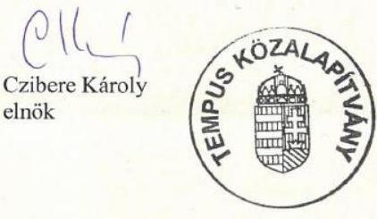

---

# 150 éve   a közpénzek őre 

Ikt. szám: EL-2179-046/2020.

Czibere Károly úr
kuratóriumi elnök

Tempus Közalapítvány

## Budapest

Tisztelt Elnök Úr!

Az „Alapítványok/közalapítványok ellenőrzése" címmel készített számvevőszéki jelentéstervezetre tett TKA-00184-019/2018 iktatószámú észrevételét köszönettel megkaptam.

Az Állami Számvevőszék észrevételre vonatkozó álláspontjáról a felügyeleti vezető által készített részletes tájékoztatást mellékelten megküldöm.

Tájékoztatom Elnök urat, hogy a számvevőszéki jelentésben - az Állami Számvevőszékről szóló 2011. évi LXVI. törvény 29. § (3) bekezdése alapján - a figyelembe nem vett észrevételt szerepeltetjük, annak indoklásával, hogy azt az Állami Számvevőszék miért nem fogadta el.

Budapest, 2020. 06. hó 13. nap

Melléklet: Tájékoztatás az észrevétel kezeléséről
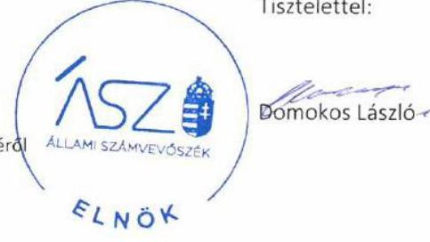

---

Melléklet
Ikt.szám: EL-2179-046/2020.

# Tájékoztatás   az észrevétel kezeléséről 

Az „Alapítványok/közalapítványok ellenőrzése" című jelentéstervezetre 2020. május 21-én érkezett észrevételt áttekintettük, annak kezelésével kapcsolatban a következő tájékoztatást adom.

Az észrevétel a jelentéstervezet Tempus Közalapítvány (továbbiakban Alapítvány) vonatkozásában tett megállapítását érinti, tájékoztat arról, hogy az Alapítvány 2017. évben a vonatkozó jogszabályok szerinti határidőre teljesítette beszámoló készítési kötelezettségét, melyre vonatkozó dokumentumokat az Állami Számvevőszék (továbbiakban ÁSZ) rendelkezésére bocsátotta.

Tájékoztatom Elnök urat, hogy az Állami Számvevőszék ellenőrzési megállapításai minden esetben az Állami Számvevőszékről szóló 2011. évi LXVI. törvénynek megfelelően az ellenőrzés során bekért és az arra nyitva álló határidőn belül rendelkezésre
 bocsátott dokumentumokon alapulnak.

Az ÁSZ EL-1095-002/2018. iktatószámú adatbekérő levél 2. számú melléklete szerint a 2015-2017. évekre vonatkozó aláírt és hiteles dokumentumokat kérte. Az Alapítvány által rendelkezésre bocsátott 2017. évi számviteli beszámolót a képviseleti jogosultsággal rendelkező személy nem írta alá, így az nem hiteles dokumentum.

Fentiek alapján az észrevételt nem fogadjuk el, a jelentéstervezet megállapításának módosítása nem indokolt.

Budapest, 2020. 06. hó 49. nap
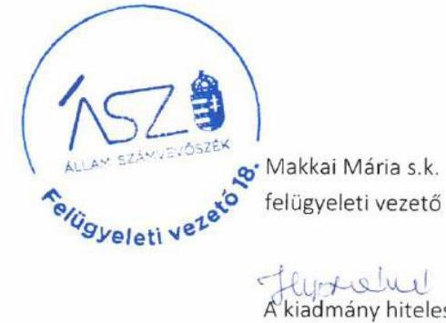

---

# RÖVIDÍTÉSEK JEGYZÉKE 

${ }^{1}$ alapítvány
${ }^{2}$ Számv. tv.
${ }^{3}$ Ectv.
${ }^{4}$ ÁSZ
${ }^{5}$ ÁSZ tv.
${ }^{6}$ Ptk.
${ }^{7}$ 2006. évi LXV. törvény
alapítvány/közalapítvány
2000. évi C. törvény a számvitelről (hatályos 2001. január 1-jétől)
2011. évi CLXXV. törvény az egyesülési jogról, a közhasznú jogállásról, valamint a civil szervezetek működéséről és támogatásáról (hatályos 2011. december 22-től) Állami Számvevőszék
2011. évi LXVI. törvény az Állami Számvevőszékről (hatályos 2011. július 1-jétől) 2013. évi V. törvény a Polgári Törvénykönyvről (hatályos: 2014. március 15-től) az államháztartásról szóló 1992. évi XXXVIII. törvény és egyes kapcsolódó törvények módosításáról szóló 2006. évi LXV. törvény (hatályos 2006. augusztus 25-től)

---

# ASZ 

ÁLLAMI SZÁMVEVŐSZÉK
1052 Budapest, Apáczai Cs. J. u. 10. I 1364 Budapest 4. Pf. 54 TEL: +36 14849100
email: szamvevoszek@asz.hu
web: www.asz.hu | www.aszhirportal.hu

