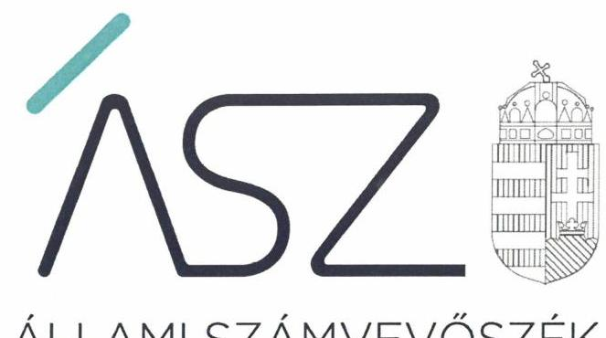
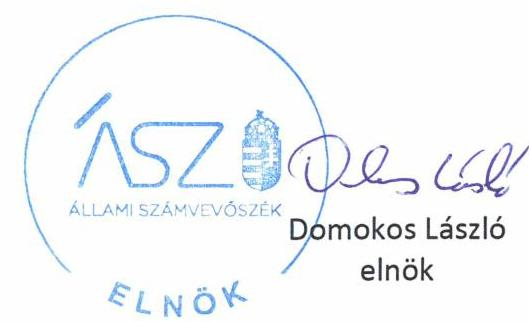
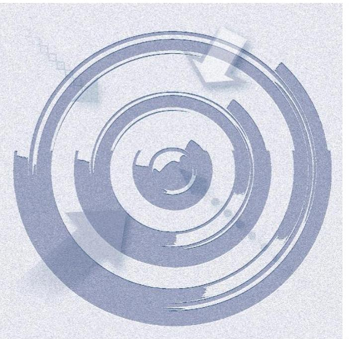
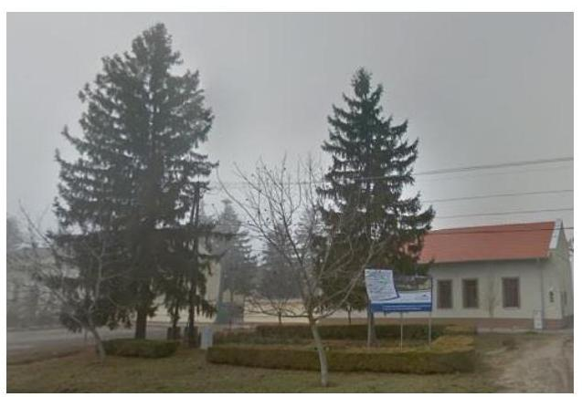

ÁLLAMI SZÁMVEVŐSZÉK

# JELENTÉS 

## Nem állami humánszolgáltatók ellenőrzése

A szociális humánszolgáltatást nyújtó intézmények, szolgáltatók államháztartáson kívüli fenntartói központi költségvetésből kapott támogatásai felhasználásának ellenőrzése Hírös Diák Alapítvány

2020
20135
www.asz.hu

---

ÁLLAMI SZÁMVEVŐSZÉK

# JELENTÉS 

## Nem állami humánszolgáltatók ellenőrzése

A szociális humánszolgáltatást nyújtó intézmények, szolgáltatók államháztartáson kívüli fenntartói központi költségvetésből kapott támogatásai felhasználásának ellenőrzése Hírös Diák Alapítvány

2020. 07. hó 24. nap

20135
www.asz.hu

---

# AZ ELLENŐRZÉST FELÜGYELTE: 

KLINGA LÁSZLÓ felügyeleti vezető

## AZ ELLENŐRZÉST VEZETTE ÉS A VÉGREHAJTÁSÁÉRT FELELŐS:

DORMÁN ISTVÁN ZOLTÁN ellenőrzésvezető

## A PROGRAM ÖSSZEÁLLÍTÁSÁÉRT FELELŐS:

TÓTPÁL SZABOLCS ellenőrzési program készítéséért felelős vezető
FEKETE-NAGY ANDRÁS GÁBOR ellenőrzési program készítéséért felelős vezető

IKTATÓSZÁM: EL-2781-001/2020
TÉMASZÁM: 2491
ELLENŐRZÉS-AZONOSÍTÓ SZÁM: V083583, V0867103

---

# TARTALOMJEGYZÉK 

■ ÖSSZEGZÉS ..... 5
■ AZ ELLENŐRZÉS CÉLJA ..... 6
■ AZ ELLENŐRZÉS TERÜLETE ..... 7
■ AZ ELLENŐRZÉS HÁTTERE, INDOKOLTSÁGA ..... 8
■ AZ ELLENŐRZÉS LÉNYEGES KÉRDÉSKÖREI ..... 9
■ AZ ELLENŐRZÉS HATÓKÖRE ÉS MÓDSZEREI ..... 10
■ MELLÉKLETEK ..... 13
I. sz. melléklet: Értelmező szótár ..... 13
■ FÜGGELÉK: ÉSZREVÉTELEK ..... 15
■ RÖVIDÍTÉSEK JEGYZÉKE ..... 17

---

.

---

# ÖSSZEGZÉS 

A kunbajai székhelyű Hírös Diák Alapítvány, a 2015-2018. években nem biztosította a szociális humánszolgáltatási közfeladatok ellátására kapott költségvetési támogatások felhasználásának ellenőrizhetőségét.

## Az ellenőrzés társadalmi indokoltsága

A szociális gondoskodást igénylők védelme, illetve a köznevelési feladatok ellátása az Alaptörvényben meghatározott, a társadalom szempontjából fontos tevékenységek. Jogszabályok teszik lehetővé, hogy államháztartáson kívüli szervezetek - így például az egyházi fenntartók, alapítványok, gazdasági társaságok, egyesületek - által fenntartott intézmények is végezzenek köznevelési, szociális és gyermekvédelmi feladatokat. Mindehhez a központi költségvetés évente jelentős összegű támogatással járul hozzá. Az államháztartáson kívüli, humánszolgáltatást végző intézmények az igényelt közpénzekből társadalmilag hasznos, közösségteremtő, közérdekű, illetve közhasznú tevékenységet végeznek, illetve közfeladatokat látnak el.

Az intézményfenntartók ellenőrzésével az Állami Számvevőszék hozzájárul ahhoz, hogy ezen közpénzeket az államháztartáson kívüli szervezetek is ellenőrizhető, átlátható és elszámoltatható módon használják fel a közfeladatok ellátása során. Az ellenőrzések célja továbbá, hogy a nyilvánosság és az igénybevevők megfelelő tájékoztatást kapjanak az államháztartáson kívüli közfeladatot ellátók működéséről.

Az ÁSZ ellenőrzései arra adnak választ, hogy az intézményfenntartók arra használták-e fel a közpénzeket, amire igényelték.

A szabályszerű gazdálkodás elengedhetetlen a közfeladat ellátás szakmai céljainak megvalósításához, valamint a társadalmi közbizalom fenntartásához.

## Megállapítások, következtetések

A Hírös Diák Alapítvány a 2015-2018. években szociális humánszolgáltatási közfeladatait nem önállóan gazdálkodó intézményeiben látta el. Az intézmények által ellátott közfeladatok a hajléktalanok nappali intézményi ellátása, szociális étkeztetés, bölcsődei ellátás, gyermekétkeztetés volt. A Fenntartó ${ }^{1}$ az ellenőrzött időszakban a könyvvezetésében nem kezelte a kapott költségvetési támogatások felhasználását a jogszabályok által előírt módon, mivel nem különítette el a könyvvezetésében a Fenntartó és intézményei gazdálkodását, valamint a költségvetési támogatások felhasználását az intézményei által ellátott közfeladatok szerinti bontásban.

A Hírös Diák Alapítvány, mint Fenntartó a 2015-2018. években a szociális humánszolgáltatási közfeladat ellátására kapott költségvetési támogatás felhasználásának a Számv. tv. ${ }^{2}$ 161/A. § (2) bekezdésében előírt ellenőrizhetőségét nem biztosította. Mivel az Atr. ${ }^{3}$ 16. § (1) bekezdésében foglalt szabályozás ellenére nem gondoskodott arról, hogy a költségvetési támogatások felhasználásának, a saját és a nem önállóan működő gazdálkodó intézményei gazdálkodásának elkülönített, feladatonkénti bontásban történő elszámolására az adatok rendelkezésre álljanak.

A Fenntartó mindezek alapján az Alaptörvény ${ }^{4}$ 39. cikk (2) bekezdésében foglaltak ellenére a felhasznált közpénzekre vonatkozó gazdálkodása átláthatóságát nem biztosította.

Ezáltal a Fenntartó nem igazolta, hogy a közpénzt a szociális humánszolgáltatási közfeladatra fordította.

---

# AZ ELLENŐRZÉS CÉLJA

**AZ ELLENŐRZÉS CÉLJA** annak értékelése volt, hogy a nem állami, nem önkormányzati szociális intézmények fenntartói központi költségvetésből kapott támogatásainak felhasználása szabályszerű volt-e.

---

# AZ ELLENŐRZÉS TERÜLETE 

## Hírös Diák Alapítvány

A kunbajai székhelyű Fenntartó 2003-ban jött létre, a gyermekek és fiatalok egyéni és közösségi szabadidő eltöltésének segítségére és a gyermekek iskolán kívüli nevelésének támogatására, illetve kulturális és sportprogramok szervezésére. A Fenntartó legfőbb, általános ügydöntő, ügyintéző, képviselő és kezelő szerve az öt főből álló kuratórium volt. A Fenntartó képviseletére a kuratórium elnöke volt jogosult. Az alapító a Fenntartó működése és gazdálkodása törvényességének ellenőrzése érdekében háromtagú felügyelőbizottságot jelölt ki az alapító okiratban.

A Fenntartó 2017. januárjától 2018. novemberéig közhasznú jogállással rendelkezett. A működési engedélyek alapján a Fenntartónak az ellenőrzött időszakban két - önálló jogi személyiséggel nem rendelkező - szociális intézménye volt. A „Hírös Diák" Nappali Melegedő és Népkonyha Kunbaján 62 férőhelyen hajléktalan személyek nappali ellátását és szociális étkeztetését biztosította. Az „Aprajafalva" Bölcsőde Madarason 62 fő bölcsődei férőhellyel rendelkezett gyermekek napközbeni ellátásának biztosítására. Az ellenőrzött időszakban az intézmények gazdálkodási feladatait a Fenntartó látta el.

A Fenntartó a 2015-2018. években ágazati pótlék, a szociális ellátáshoz kapcsolódó támogatás, valamint kiegészítő pótlék címen részesült költségvetési támogatásban. A Fenntartó részére a szociális humánszolgáltatási feladat ellátásához a Magyar Államkincstár részéről a központi költségvetésből biztosított támogatások összege 2015. évben 64,3 M Ft, a 2016. évben 63,9 M Ft, a 2017. évben 59,1 M Ft, a 2018. évben 57,7 M Ft volt.

---

# AZ ELLENŐRZÉS HÁTTERE, INDOKOLTSÁGA 

A szociális feladatokat ellátó nem állami intézményfenntartók részére közfeladataik ellátására évente jelentős összegű pénzügyi támogatást biztosítottak a mindenkori költségvetési törvények a bennük megfogalmazott feltételek mellett. A felhasználható állami támogatások a Kvtv. ${ }^{5}$-ekben a 2015-2018. években a szociális ágazatra vonatkozóan 360 Mrd Ft előirányzatot határoztak meg.

Az ÁSZ ${ }^{6}$ a stratégiájában célul tűzte ki, hogy az államháztartáson kívülre nyújtott költségvetési támogatások ellenőrzésével hozzájárul ahhoz, hogy a közpénzeket az államháztartáson kívüli szervezetek is átlátható módon használják fel a közfeladatok szerződésben vállalt ellátása érdekében. Az ÁSZ stratégiájában foglaltak alapján is indokolt az ellenőrzés, amely a társadalom számára jelzi, hogy a közpénz államháztartáson kívüli felhasználása sem maradhat ellenőrizetlenül. Az államháztartáson kívülre nyújtott költségvetési támogatások ellenőrzésével az ÁSZ hozzá-járul ahhoz, hogy a közpénzeket a nem állami humán fenntartók átlátható módon használják fel a közfeladatok ellátására kötött szerződésekben vállalt kötelezettségek teljesítése érdekében. Az ellenőrzés javaslataival hozzájárulhat az említett rendszerek szabályszerű támogatás felhasználásához, javíthatja a társadalmi-gazdasági döntések megalapozottságát, amely a „jól irányított állam működésének" feltétele.

---

# AZ ELLENŐRZÉS LÉNYEGES KÉRDÉSKÖREI 

1. A szociális humánszolgáltató közfeladatot ellátó államháztartáson kívüli fenntartó szabályszerű működési - és gazdálkodási környezet kialakításával megteremtette-e a költségvetési támogatások átlátható, elszámoltatható igénybevételének, felhasználásának feltételeit?
2. Az államháztartáson kívüli fenntartó az átvállalt szociális humánszolgáltatási közfeladathoz biztosított költségvetési támogatásokat szabályszerűen fordította-e a humánszolgáltató intézményei működtetésére?
3. Az államháztartáson kívüli fenntartó a szociális humánszolgáltató intézményei működtetéséhez felhasznált közpénzekre vonatkozó gazdálkodásával a nyilvánosság előtt elszámolt-e, ennek érdekében ellenőrzési, értékelési és a külső ellenőrzésekkel kapcsolatos intézkedési feladatait szabályszerűen látta-e el?

---

# AZ ELLENŐRZÉS HATÓKÖRE ÉS MÓDSZEREI 

## Az ellenőrzés típusa

Megfelelőségi ellenőrzés.

## Az ellenőrzött időszak

A 2015. január 1. és 2018. december 31. közötti időszak.

## Az ellenőrzés tárgya

Az ellenőrzés a szociális humánszolgáltatási közfeladatokat ellátó államháztartáson kívüli fenntartók humánszolgáltatási közfeladatai ellátásához a központi költségvetésből kapott támogatásaik humánszolgáltatási közfeladatokra való fenntartó általi felhasználása szabályszerűségének értékelésére terjed ki.

## Az ellenőrzött szervezet

Hírös Diák Alapítvány, mint intézményfenntartó.

## Az ellenőrzés jogalapja

Az ellenőrzés jogszabályi alapját az ÁSZ tv. ${ }^{7}$ 1. § (3) bekezdése, 5. § (3) bekezdésében foglalt előírások adták.

## Az ellenőrzés módszerei

Az ellenőrzést az ellenőrzési program annak szempontjai, kérdései, az ellenőrzött időszakban hatályos jogszabályok, a nemzetközi standardokat irányadónak tekintve, az ellenőrzés szakmai szabályok és módszertanok figyelembe vételével rendelte elvégezni.

Az ellenőrzés ideje alatt az ellenőrzött szervezettel történő kapcsolattartást az ÁSZ SZMSZ ${ }^{\circledR}$-ének vonatkozó előírásai alapján biztosította az ÁSZ.

Az ellenőrzési kérdések megválaszolásához szükséges bizonyítékok megszerzése az ellenőrzött által rendelkezésre bocsátott dokumentumokra, adatokra alapozva elemző eljárással történt.

---

Az ellenőrzési bizonyítékként felhasználható adatforrások közé tartoztak egyrészt a szakmai program részletes szempontjainál felsorolt adatforrások, másrészt minden - az ellenőrzés folyamán feltárt, az ellenőrzés szempontjából információt tartalmazó - dokumentum.

Az ellenőrzés lefolytatásához az ellenőrzött szervezet a kitöltött tanúsítványok, valamint az ÁSZ által kért dokumentumok elektronikus úton való megküldésével szolgáltatott adatokat, információkat. Az így rendelkezésre bocsátott adatok, információk és a tanúsítványok adatai valódiságának kontrollja az ellenőrzés keretében történt.

Az ellenőrzést a szociális humánszolgáltatások esetében a központi költségvetési támogatások igénylésével, módosításával, felhasználásával, elszámolásával kapcsolatos feladatokat ellátó államháztartáson kívüli fenntartónál végezte az ÁSZ. A fenntartott intézményeknél helyszíni szemle keretében győződött meg a tényleges feladatellátásról. (verifikáció)

A szociális humánszolgáltatások központi költségvetési támogatásaival kapcsolatos, államháztartáson kívüli fenntartó jogszabályokban előírt feladatai betartását, továbbá a központi költségvetési támogatások szabályszerű nyilvántartását ellenőrizte az ÁSZ a fenntartónál rendelkezésre álló nyilvántartások, beszámolók és egyéb dokumentumok alapján. Az ellenőrzés nem terjedt ki a szociális humánszolgáltatások központi költségvetési támogatásai igénylése, módosítása, elszámolása valódiságának, megalapozottságának, helyességének - sem a fenntartónál, sem a székhely intézményeinél való - értékelésére (mivel ennek felülvizsgálata, ellenőrzése a finanszírozó jogszabályban előírt feladata, határozatai kiadása előtt). Továbbá nem terjedt ki az ellenőrzés e források, intézmények általi szabályszerű felhasználásának értékelésére.

---

.

---

# MELLÉKLETEK 

- I. SZ. MELLÉKLET: ÉRTELMEZŐ SZÓTÁR
humánszolgáltatás
költségvetési támogatás
nem állami, nem önkormányzati (államháztartáson kívüli) intézmény fenntartó
székhely intézmény
telephely

Külön törvényben meghatározott szociális, gyermekjóléti, gyermekvédelmi, közoktatási, felsőoktatási, kulturális közfeladatok (2014. évi Kvtv. 33. §, 34. § (1), (4) bekezdés, 1. számú melléklet XX/20/2/3. jogcím csoport, 19. alcím, 2015. évi Kvtv. 43. § (1), (4) bekezdés, 1. számú melléklet XX/20/2/3. jogcím csoport, 19. alcím, 2016. évi Kvtv. 41. § (1), (4) bekezdés, 1. számú melléklet XX/20/2/3. jogcím csoport, 19. alcím, 2017. évi Kvtv. 41. § (1), (4) bekezdés, 1. számú melléklet XX/20/2/3. jogcím csoport, 19. alcím)
a társadalombiztosítás pénzügyi alapjai kivételével az államháztartás központi alrendszeréből ellenérték nélkül, pénzben nyújtott támogatások (Áht. ${ }^{9}$ 1. § 14. pont)

A költségvetési törvényekben (2013. évi CCXXX. törvény 33-34. §, 2014. évi C. törvény 42-43. §, 2015. évi C. törvény 40-41. §) megállapított támogatás. A 2015. évi C. törvény 40-41. § szerint többek között: Az Országgyűlés a szociális, gyermekjóléti, gyermekvédelmi közfeladatot ellátó intézményt, szolgáltatást fenntartó egyházi jogi személy, civil szervezet, közalapítvány, országos nemzetiségi önkormányzat, települési vagy területi nemzetiségi önkormányzat, gazdasági társaság, és a humánszolgáltatást alaptevékenységként végző, az Szja tv. ${ }^{10}$ hatálya alá tartozó egyéni vállalkozó (a továbbiakban együtt: nem állami szociális fenntartó) részére támogatást állapít meg a következők szerint: a támogatás a nem állami szociális fenntartót a települési önkormányzatok 2. melléklet III. pont 3. alpont c)-k) pontjában és III. pont 5. alpont a) pontjában meghatározott támogatásaival azonos jogcímeken, összegben és feltételek mellett illeti meg.
A szociális közfeladatokat/humánszolgáltatásokat ellátó intézményt fenntartó egyházi jogi személy, társadalmi szervezet, alapítvány, közalapítvány, civil szervezet, országos nemzetiségi önkormányzat, nonprofit gazdasági társaság, gazdasági társaság és a humánszolgáltatást alaptevékenységként végző, Szja tv. hatálya alá tartozó egyéni vállalkozó. (2014. évi Kvtv. 33. §, 34. § (1), (4) bekezdés, 2015. évi Kvtv. 42. §, 43. § (1), (4) bekezdés, 2016. évi Kvtv. 40. §, 41. § (1), (4) bekezdés, 2017.
 évi Ktv. 41. § (1), (4) bekezdés)
a szolgáltató székhelye, azaz a szolgáltató központi ügyintézésének helye, függetlenül attól, hogy használják-e szolgáltatás nyújtására (Sznyvhr. ${ }^{11} 1 . \S$ k) pont) (hatályos: 2013. december 1-től)
a szolgáltató székhelyétől különböző, szolgáltató/intézmény használatában álló hely, a szociális humánszolgáltatáshoz használt, bejegyzett hely. (Sznyvhr. 1.§ l) pont) (hatályos: 2015. január 1-től)

---

.

---

# FÜGGELÉK: ÉSZREVÉTELEK 

A jelentéstervezetet a Számvevőszék 15 napos észrevételezésre megküldte az ellenőrzött szervezet vezetőjének az ÁSZ tv. 29. § (1) bekezdése előírásának megfelelően.

A Hírös Diák Alapítvány kuratóriumi elnöke a jelentéstervezet megállapításaira írásban észrevételt tett.
Az ÁSZ tv. 29. § (3) bekezdésével összhangban az ÁSZ a Függelékben feltünteti az ellenőrzés megállapításaival kapcsolatban tett, figyelembe nem vett észrevételeket, és megindokolja, hogy azokat miért nem fogadta el.

[^0]
[^0]:    * 29. § (1) Az Állami Számvevőszék az ellenőrzési megállapításait megküldi az ellenőrzött szervezet vezetőjének vagy az általa megbízott személynek, és annak, akinek személyes felelősségét állapította meg.
    (2) Az ellenőrzött szervezet vezetője és a felelősként megjelölt személy az ellenőrzés megállapításaira tizenöt napon belül írásban észrevételt tehet.
    (3) Az Állami Számvevőszék az észrevételre a beérkezésétől számított harminc napon belül írásban válaszol. A figyelembe nem vett észrevételeket köteles a jelentésben feltüntetni, és megindokolni, hogy azokat miért nem fogadta el.

---

A számvevőszéki jelentéstervezet megállapításaival kapcsolatban a kuratóriumi elnök által 2020. május 25-én tett (az Állami Számvevőszékhez 2020. május 28-án érkezett) el nem fogadott észrevételek és azok kezelésének indokolása.

# A Megállapítások, következtetések rész 1-4. bekezdéseire tett észrevétel: 

Elnök úr észrevételében leírta, hogy a Hírös Diák Alapítvány a rendelkezésre álló idő alatt az adatbekérés teljesítéseként elektronikusan, illetve postai úton is küldött dokumentumokat a 2015-2017., valamint a 2018. évre vonatkozóan. A megküldött bizonylatokon, jegyzőkönyveken, határozatokon kívül további kilenc témában nyilatkozatokat küldtek. Leírta, hogy a Magyar Államkincstár (Kincstár) minden évben ellenőrzi a folyósított támogatásokat és azok elszámolását, és helyszíni ellenőrzései során a Fenntartó működését megfelelőnek találta. Észrevétele szerint az ÁSZ az ellenőrzéséhez további, esetlegesen hiányzó bizonylatokat, az elkülönítés igazolására dokumentumot nem kért, azonban az a Fenntartó által rendelkezésre bocsátott bizonylatokból ellenőrizhető lett volna. A Hírös Diák Alapítvány 2015. január 1-jétől hatályos, többször módosított számviteli politikája egyértelműen előírja a támogatások elkülönített könyvelését. Az intézményeit érintő támogatás felhasználása munkaszámos elkülönítéssel történt a főkönyvi könyvelésben, a munkaszámos főkönyvi kivonatokat az ellenőrzésnek átadták. A költségvetési normatív támogatások bevételkénti elszámolása szintén munkaszámokra történt, a határozatok alapján. Az intézmények önálló bankszámlával nem rendelkeznek, ilyen jogszabályi előírásról nincs tudomásuk. A kuratóriumi elnök szerint a Fenntartó eleget tett a számviteli törvényben előírt nyilvántartási (könyvvezetési) rendszer továbrészletezési kötelezettségének, egyéb, az elkülönítés szabályait előíró konkrét részlet-jogszabály a támogatások könyvelésére nem áll rendelkezésre, azonban könyvelésükből minden adat rendelkezésre állt. Ezt igazolja, hogy a Kincstár folyamatos ellenőrzései a könyvelést még egyszer sem kifogásolták, számukra a támogatások felhasználása átlátható volt. Észrevétele szerint nem valós az a megállapítás, mely szerint nem igazolták, hogy a közpénzt szociális humánszolgáltatásra fordította a Fenntartó, mivel az ellenőrzés nem terjedt ki a támogatások felhasználására, arra vonatkozó dokumentumokat nem kért be az ÁSZ.

Az ÁSZ a jelentéstervezet megállapításait felülvizsgálta. Az ÁSZ az ellenőrzési megállapításait az adatszolgáltatás során számára a törvényi határidőben rendelkezésre bocsátott dokumentumokra alapozva fogalmazta meg. Elnök úr a 2015-2017. évekre vonatkozó EL-1398-005/2018., illetve a 2018. évre vonatkozó EL-1398-035/2019. iktatószámú adatbekérő levelünkre a 2019. január 22-én, valamint a 2019. december 19-én kelt teljességi és hitelességi nyilatkozatában az átadott dokumentumok, adatok hitelességéért, valódiságáért, hiánytalanságáért teljes felelősséget vállalt. Az ÁSZ a hivatkozott adatbekérő levelekben többek között a költségvetési támogatások elkülönített nyilvántartását igazoló dokumentumokat, főkönyvi és analitikus nyilvántartásokat a fenntartónál, továbbá a számlarendet kérte az ellenőrzött időszakra vonatkozóan megküldeni.

A Fenntartó a 2015-2017. évekre a 7 és 8 munkaszámokra vonatkozó főkönyvi kivonatokat, 2018-ra csak nyilatkozatot adott a munkaszámos elkülönítésre vonatkozóan, a költségvetési támogatások elkülönített nyilvántartásához analitikát egyik ellenőrzött időszakra sem bocsátott az ÁSZ rendelkezésére. Elnök úr a 2015-2017. közötti időszakra a számlarendre vonatkozóan a számviteli politikába foglalt számlatükröt jelölte meg, amely tartalmazza az alkalmazott számlaosztályokat és főkönyvi számlákat, a 2018. évre az RLB60 ügyviteli szoftverből „Főkönyvi törzs - 2018. évi számlarend" elnevezésű, kinyomtatott számlatükröt adta át az ÁSZ részére. Az átadott számlatükrök nem felelnek meg a Számv. tv. 161. § (2) bekezdés a)-d) pontjaiban a számlarendre előírt tartalmi követelményeknek. A Fenntartó 2015. január 1-jétől hatályos, többször módosított számviteli politikája nem tartalmazott részletes szabályozást a 2. oldalon egy mondattal jelzett elkülönítésre vonatkozóan. Elnök úr észrevételével ellentétben a költségvetési támogatások elkülönített nyilvántartását előíró jogszabályokra a Megállapítások, következtetések rész 2. bekezdése pontosan hivatkozik.

Mivel a Hírös Diák Alapítvány az ellenőrzött időszaki főkönyvi kivonatokhoz analitikus nyilvántartást, valamint a Fenntartóra vonatkozó számlarendet nem adott át az ÁSZ részére, így az elkülönített nyilvántartási kötelezettség, a költségvetési támogatás felhasználásának szabályszerűsége nem igazolható.

Az ÁSZ a jelentéstervezetben nem fogalmazott meg megállapítást a Fenntartó bankszámlájára vonatkozóan, Elnök úr ezzel kapcsolatos tájékoztatása nem tekinthető észrevételnek.

---

# RÖVIDÍTÉSEK JEGYZÉKE 

${ }^{1}$ Fenntartó
${ }^{2}$ Számv. tv.
${ }^{3}$ Atr.
${ }^{4}$ Alaptörvény
${ }^{5}$ Ktv.
${ }^{6}$ ÁSZ
${ }^{7}$ ÁSZ tv.
${ }^{8}$ ÁSZ SZMSZ
${ }^{9}$ Áht.
${ }^{10}$ Szja tv.
${ }^{11}$ Sznyvhr.

Hírös Diák Alapítvány
a számvitelről szóló 2000. évi C. törvény (hatályos: 2001. január 1-jétől)
az egyházi és nem állami fenntartású szociális, gyermekjóléti és gyermekvédelmi szolgáltatók, intézmények és hálózatok állami támogatásáról szóló 489/2013. (XII. 18.) Korm. rendelet (hatályos 2014. január 1-jétől)
Magyarország Alaptörvénye (hatályos 2012. január 1-jétől)
Magyarország 2015. évi központi költségvetéséről szóló 2014. évi C. törvény, Magyarország 2016. évi központi költségvetéséről szóló 2015. évi C. törvény, Magyarország 2017. évi központi költségvetéséről szóló 2016. évi XC. törvény, Magyarország 2018. évi központi költségvetéséről szóló 2017. évi C. törvény
Állami Számvevőszék
az Állami Számvevőszékről szóló 2011. évi LXVI. törvény (hatályos: 2011. július 1-jétől)
az Állami Számvevőszék Szervezeti és Működési Szabályzata
az államháztartásról szóló 2011. évi CXCV. törvény (hatályos: 2012. január 1-jétől)
a személyi jövedelemadóról szóló 1995. évi CXVII. törvény (hatályos: 1996. január 1-jétől)
a szociális, gyermekjóléti és gyermekvédelmi szolgáltatók, intézmények és hálózatok hatósági nyilvántartásáról és ellenőrzéséről szóló 369/2013. (X.24.) Korm. rendelet (hatályos: 2013. december 1-jétől)

---

# ASZ 

ÁLLAMI SZÁMVEVŐSZÉK
1052 Budapest, Apáczai Cs. J. u. 10. I 1364 Budapest 4. Pf. 54 TEL: +36 14849100
email: szamvevoszek@asz.hu
web: www.asz.hu | www.aszhirportal.hu
