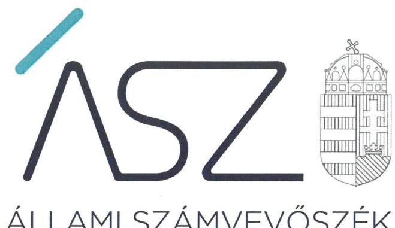
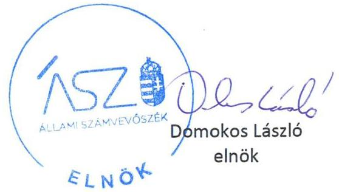

ÁLLAMI SZÁMVEVŐSZÉK

# JELENTÉS 

## Nem állami humánszolgáltatók ellenőrzése

A szociális humánszolgáltatást nyújtó intézmények, szolgáltatók államháztartáson kívüli fenntartói központi költségvetésből kapott támogatásai felhasználásának ellenőrzése LILA AKÁC Idősek Háza és Ápoló Otthona Alapítvány

2020
20136
www.asz.hu

---

ÁLLAMI SZÁMVEVŐSZÉK

# JELENTÉS

## Nem állami humánszolgáltatók ellenőrzése

A szociális humánszolgáltatást nyújtó intézmények, szolgáltatók államháztartáson kívüli fenntartói központi költségvetésből kapott támogatásai felhasználásának ellenőrzése – LILA AKÁC Idősek Háza és Ápoló Otthona Alapítvány

2020. 08. hó 24. nap

20136
www.asz.hu

---

# AZ ELLENŐRZÉST FELÜGYELTE: 

KLINGA LÁSZLÓ felügyeleti vezető
TÓTH MARIANNA felügyeleti vezető

AZ ELLENŐRZÉST VEZETTE ÉS A VÉGREHAJTÁSÁÉRT FELELŐS:
KUSZINGER ANDREA ellenőrzésvezető
VERTKOVCZI MÁRIA ellenőrzésvezető

A PROGRAM ÖSSZEÁLLÍTÁSÁÉRT FELELŐS:
FEKETE-NAGY ANDRÁS GÁBOR felelős vezető
TÓTPÁL SZABOLCS osztályvezető

Jelentéseink az Országgyúlés számítógépes hálózatán és az interneten a www.asz.hu címen is olvashatóak.

IKTATÓSZÁM: EL-2782-001/2020
TÉMASZÁM: 2491
ELLENŐRZÉS-AZONOSÍTÓ SZÁM: V083552, V0867106

---

# TARTALOMJEGYZÉK 

■ ÖSSZEGZÉS ..... 5
■ AZ ELLENŐRZÉS CÉLJA ..... 6
■ AZ ELLENŐRZÉS TERÜLETE ..... 7
■ AZ ELLENŐRZÉS HÁTTERE, INDOKOLTSÁGA ..... 8
■ AZ ELLENŐRZÉS LÉNYEGES KÉRDÉSKÖREI. ..... 9
■ AZ ELLENŐRZÉS HATÓKÖRE ÉS MÓDSZEREI ..... 10
■ MELLÉKLETEK ..... 13
I. sz. melléklet: Értelmező szótár ..... 13
■ FÜGGELÉKEK ..... 15
I. sz. függelék a jelentéshez ..... 15
II. sz. függelék: Észrevételek ..... 16
■ RÖVIDÍTÉSEK JEGYZÉKE ..... 19

---

.

---

# ÖSSZEGZÉS 

A budapesti székhelyú LILA AKÁC Idősek Háza és Ápoló Otthona Alapítvány a 2015-2017. években nem biztositotta a szociális humánszolgáltatási közfeladat ellátására kapott költségvetési támogatások felhasználásának ellenőrizhetőségét, a 2018. évben nem biztositotta az elszámoltathatóságát.

## Az ellenőrzés társadalmi indokoltsága

A szociális gondoskodást igénylők védelme, illetve a köznevelési feladatok ellátása az Alaptörvényben meghatározott, a társadalom szempontjából fontos tevékenységek. Jogszabályok teszik lehetővé, hogy államháztartáson kívüli szervezetek - így például az egyházi fenntartók, alapítványok, gazdasági társaságok, egyesületek - által fenntartott intézmények is végezzenek köznevelési, szociális és gyermekvédelmi feladatokat. Mindehhez a központi költségvetés évente jelentős összegű támogatással járul hozzá. Az államháztartáson kívüli, humánszolgáltatást végző intézmények az igényelt közpénzekből társadalmilag hasznos, közösségteremtő, közérdekű, illetve közhasznú tevékenységet végeznek, illetve közfeladatokat látnak el.

Az intézményfenntartók ellenőrzésével az Állami Számvevőszék hozzájárul ahhoz, hogy ezen közpénzeket az államháztartáson kívüli szervezetek is ellenőrizhető, átlátható és elszámoltatható módon használják fel a közfeladatok ellátása során. Az ellenőrzések célja továbbá, hogy a nyilvánosság és az igénybevevők megfelelő tájékoztatást kapjanak az államháztartáson kívüli közfeladatot ellátók múködéséről.

Az ÁSZ ellenőrzései arra adnak választ, hogy az intézményfenntartók arra használták-e fel a közpénzeket, amire igényelték.

A szabályszerű gazdálkodás elengedhetetlen a közfeladat ellátás szakmai céljainak megvalósításához, valamint a társadalmi közbizalom fenntartásához.

## Megállapítások, következtetések

A LILA AKÁC Idősek Háza és Ápoló Otthona Alapítvány a 2015-2017. években a szociális humánszolgáltatási közfeladat ellátására kapott költségvetési támogatás felhasználásának a Számv. tv. ${ }^{1} 161 / A$ § (2) bekezdésében előírt ellenőrizhetőségét nem biztosította. Mivel az Atr. ${ }^{2} 16 . \S$ (1) bekezdésében foglalt szabályozás ellenére nem gondoskodott arról, hogy a költségvetési támogatások felhasználásának, a Fenntartó ${ }^{3}$ és a nem önállóan gazdálkodó intézménye gazdálkodásának elkülönített, feladatonkénti és támogatásonkénti bontásban történő elszámolásához az adatok rendelkezésre álljanak. A Fenntartó nem önállóan gazdálkodó intézménye hat szociális közfeladatot látott el, amellyel kapcsolatban a Fenntartó hét jogcímen kapott a költségvetésből támogatást, azonban a támogatások felhasználásáról a Fenntartó nem vezetett támogatásonkénti és feladatonkénti nyilvántartást, valamint a Fenntartó és az intézménye gazdálkodását nem elkülönítetten kezelte.

A LILA AKÁC Idősek Háza és Ápoló Otthona Alapítvány 2018. évre vonatkozóan a Számv. tv. 4. § (1) bekezdésében, valamint a Civil. tv. 28. (1) bekezdésében foglaltak ellenére nem készített éves számviteli beszámolót, ezáltal a közfeladatok ellátására kapott, közpénzre vonatkozó gazdálkodása nem volt elszámoltatható. A Fenntartó teljességi és hitelességi nyilatkozata szerint éves számviteli beszámolót nem készített.

A LILA AKÁC Idősek Háza és Ápoló Otthona Alapítvány mindezek alapján az Alaptörvény ${ }^{4}$ 39. cikk (2) bekezdésében foglaltak ellenére nem biztosította a felhasznált közpénzekre vonatkozó gazdálkodása átláthatóságát. Ez alapján a nem igazolta, hogy a közpénzt a szociális humánszolgáltatási közfeladatra fordította.

---

# AZ ELLENŐRZÉS CÉLJA

**AZ ELLENŐRZÉS CÉLJA** annak értékelése volt, hogy a nem állami, nem önkormányzati szociális intézmények fenntartói központi költségvetésből kapott támogatásainak felhasználása szabályszerű volt-e.

---

# AZ ELLENŐRZÉS TERÜLETE 

## LILA AKÁC Idősek Háza és Ápoló Otthona Alapítvány

A budapesti székhelyű LILA AKÁC Idősek Háza és Ápoló Otthona Alapítványt egy gazdasági társaság alapította a 2003. évben. A Fenntartó a 2015-2018. évek között közhasznú jogállású szervezet volt. Az Alapítvány célja az időskorúak ápolásán, gondozásán, egészségügyi ellátásán, elhelyezésén keresztül megvalósuló szociális tevékenység, valamint a gyermekek családban történő nevelésének elősegítése és gyermeket veszélyeztető körülmények kialakulásának megelőzése, a veszélyeztetettség megszüntetése.

A Fenntartó egy nem önálló jogi személy Intézmény ${ }^{5}$ működtetésével, két ellátási helyen látott el Bodajk város területén humánszolgáltatási szociális közfeladat keretében, időskorúak nappali ellátása, házi segítségnyújtás, szociális konyha, család- és gyermekjóléti szolgálatot, valamint országos ellátási területen idősek otthona, időskorúak gondozóháza szolgáltatást.

A Fenntartó képviseletét három tagú Kuratórium, felügyeletét három tagú Felügyelőbizottság látta el. A Fenntartó képviseletében aláírásra a Kuratórium elnöke volt jogosult, melynek személyében az ellenőrzött időszakban nem történt változás.

A Fenntartó a szociális humánszolgáltatásra Magyarország éves költségvetéséből a Magyar Államkincstár adatai alapján a 2015. évben 66,2 millió Ft, a 2016. évben 69,3 millió Ft, a 2017. évben 81,0 millió Ft, a 2018. évben 76,5 millió Ft összegű támogatást kapott.

---

# AZ ELLENŐRZÉS HÁTTERE, INDOKOLTSÁGA 

A szociális feladatokat ellátó nem állami intézményfenntartók részére közfeladataik ellátására évente jelentős összegű pénzügyi támogatást biztosítottak a mindenkori költségvetési törvények a bennük megfogalmazott feltételek mellett. A felhasználható állami támogatások a Kvtv.1-4-ben ${ }^{6}$ a 2015-2018. években a szociális ágazatra vonatkozóan 360 Mrd Ft előirányzatot határoztak meg. 2013. évben jelentős változások következtek be a normatív finanszírozás rendszerében. Új feladatfinanszírozási forma (átlagbéralapú támogatás) jelent meg, amely az államháztartáson kívüli intézményfenntartókra is vonatkozik. Az ellenőrzés a finanszírozási rendszerben 2011-2015 között bekövetkezett változásokra, azok közfeladat ellátásra gyakorolt hatására fókuszál a költségvetési támogatásokat felhasználó államháztartáson kívüli szervezetek körében. Az ellenőrzések indokoltságát az is alátámasztja, hogy az ÁSZ számos szervezetet még nem ellenőrzött ezen a területen.

Az ÁSZ ${ }^{7}$ stratégiájában foglaltak alapján is indokolt az ellenőrzés, amely a társadalom számára jelzi, hogy a közpénz államháztartáson kívüli felhasználása sem maradhat ellenőrizetlenül. Az államháztartáson kívülre nyújtott költségvetési támogatások ellenőrzésével az ÁSZ hozzájárul ahhoz, hogy a közpénzeket a nem állami humán fenntartók átlátható módon használják fel a közfeladatok ellátására kötött szerződésekben vállalt kötelezettségek teljesítése érdekében. Az ellenőrzés javaslataival hozzájárulhat az említett rendszerek szabályszerű támogatás felhasználásához, javíthatja a társa-dalmi-gazdasági döntések megalapozottságát, amely a „jól irányított állam" múködéséhez járul hozzá.

A holisztikus megközelítés jegyében az ellenőrzés keretében egyedi kockázatelemzés alapján kiválasztott fenntartóknál és intézményeiknél értékeli az ÁSZ az államháztartáson kívüli szociális tevékenységhez kapcsolódó támogatások felhasználásának megfelelőségét.

---

# AZ ELLENŐRZÉS LÉNYEGES KÉRDÉSKÖREI 

1. A szociális humánszolgáltató közfeladatot ellátó államháztartáson kívüli fenntartó szabályszerű müködési - és gazdálkodási környezet kialakításával megteremtette-e a költségvetési támogatások átlátható, elszámoltatható igénybevételének, felhasználásának feltételeit?
2. Az államháztartáson kívüli fenntartó az átvállalt szociális humánszolgáltatási közfeladathoz biztositott költségvetési támogatásokat szabályszerűen fordította-e a humánszolgáltató intézménye/i müködtetésére?
3. Az államháztartáson kívüli fenntartó a szociális humánszolgáltató intézménye/i müködtetéséhez felhasznált közpénzekre vonatkozó gazdálkodásával a nyilvánosság előtt elszámolt-e, ennek érdekében ellenőrzési, értékelési és a külső ellenőrzésekkel kapcsolatos intézkedési feladatait szabályszerűen látta-e el?

---

# AZ ELLENŐRZÉS HATÓKÖRE ÉS MÓDSZEREI 

## Az ellenőrzés típusa

Megfelelőségi ellenőrzés.

## Az ellenőrzött időszak

A 2015. január 1-je és 2018. december 31-e közötti időszak.

## Az ellenőrzés tárgya

Az ellenőrzés a szociális humánszolgáltatási közfeladatokat ellátó államháztartáson kívüli fenntartók humánszolgáltatási közfeladatai ellátásához a központi költségvetésből kapott támogatásaik humánszolgáltatási közfeladatokra való fenntartó általi felhasználása szabályszerűségének értékelésére terjedt ki.

## Az ellenőrzött szervezet

LILA AKÁC Idősek Háza és Ápoló Otthona Alapítvány

## Az ellenőrzés jogalapja

Az ellenőrzés jogszabályi alapját az ÁSZ tv. ${ }^{8} 1 . \S$ (3) bekezdése, 5. § (3) bekezdésében foglalt előírások adták.

## Az ellenőrzés módszerei

Az ellenőrzést az ellenőrzési program, annak szempontjai, kérdései, az ellenőrzött időszakban hatályos jogszabályok, a nemzetközi standardokat irányadónak tekintve, az ellenőrzés szakmai szabályok és módszertanok figyelembe vételét rendelte elvégezni az ÁSZ. A közpénzekkel való felelős gazdálkodás segítésére irányuló javaslatok kidolgozásakor a hatályos jogszabályok voltak irányadóak.

Az ellenőrzés ideje alatt az ellenőrzött szervezettel történő kapcsolattartást az ÁSZ SZMSZ ${ }^{9}$-ének vonatkozó előírásai alapján biztosította az ÁSZ.

Az ellenőrzési kérdések megválaszolásához szükséges bizonyítékok megszerzése az ellenőrzött által rendelkezésre bocsátott dokumentumokra, adatokra alapozva megfigyelés, szemle (szemrevételezés), kérdésfeltevés (információkérés), valamint elemző eljárással történt.

---

Az ellenőrzési bizonyítékként felhasználható adatforrások közé tartoztak egyrészt az ellenőrzési program részletes szempontjainál felsorolt adatforrások, másrészt minden - az ellenőrzés folyamán feltárt, az ellenőrzés szempontjából információt tartalmazó - dokumentum.

Az ellenőrzés lefolytatásához az ellenőrzött szervezet a kitöltött tanúsítványok, valamint az ÁSZ által kért dokumentumok elektronikus úton való megküldésével szolgáltatott adatokat, információkat. Az így rendelkezésre bocsátott adatok, információk és a tanúsítványok adatai valódiságának kontrollja az ellenőrzés keretében történt.

Az egységes értelmezést támogatja a program mellékletét képező fogalomtár és rövidítésjegyzék.

Az ÁSZ az ellenőrzést a szociális humánszolgáltatások esetében a központi költségvetési támogatások igénylésével, módosításával, felhasználásával, elszámolásával kapcsolatos feladatokat ellátó államháztartáson kívüli fenntartóknál végezte.

A szociális humánszolgáltatások központi költségvetési támogatásai igénylésével, módosításával, elszámolásával kapcsolatos, államháztartáson kívüli fenntartó jogszabályokban előírt feladatai betartását, továbbá a központi költségvetési támogatások szabályszerű kezelését, nyilvántartását ellenőrizte az ÁSZ a fenntartónál, az ott rendelkezésre álló határozatok, nyilvántartások, beszámolók és egyéb dokumentumok alapján. Az ellenőrzés nem terjedt ki a szociális humánszolgáltatások központi költségvetési támogatásai igénylése, módosítása, elszámolása valódiságának, megalapozottságának, helyességének - sem a fenntartónál, sem a székhely intézményeinél való - értékelésére (mivel ennek felülvizsgálata, ellenőrzése a finanszírozó jogszabályban előírt feladata, határozatai kiadása előtt). Továbbá nem terjedt ki az ellenőrzés e források, intézmények általi szabályszerű felhasználásának értékelésére.

---

.

---

# MELLÉKLETEK 

- I. SZ. MELLÉKLET: ÉRTELMEZŐ SZÓTÁR
humánszolgáltatás
költségvetési támogatás
nem állami, nem önkormányzati (államháztartáson kívüli) intézmény fenntartó
székhely intézmény
telephely

Külön törvényben meghatározott szociális, gyermekjóléti, gyermekvédelmi, közoktatási, felsőoktatási, kulturális közfeladatok (2014. évi Kvtv. 34. § (1), (4) bekezdés, 1. számú melléklet XX/20/2. alcím, 19. alcím, 2015. évi Kvtv. 43. § (1), (4) bekezdés, 1. számú melléklet XX/20/2/3. jogcím csoport, 19. alcím, 2016. évi Kvtv. 41. § (1), (4) bekezdés, 1. számú melléklet XX/20/2/3. jogcím csoport, 19. alcím, 2017. évi Kvtv. 41. § (1), (4) bekezdés, 1. számú melléklet XX/20/2/3. jogcím csoport, 19. alcím).
A társadalombiztosítás pénzügyi alapjai kivételével az államháztartás központi alrendszeréből ellenérték nélkül, pénzben nyújtott támogatások, ide nem értve
f) a szociális igazgatásról és szociális ellátásokról szóló törvény, valamint a gyermekek védelméről és a gyámügyi igazgatásról szóló törvény szerinti pénzbeli és természetbeni szociális és gyermekvédelmi ellátásokat (Áht. ${ }^{10}$ 1. § 14. pont)
A költségvetési törvényekben (2013. évi CCXXX. törvény 33-34. §, 2014. évi C. törvény 42-43. §, 2015. évi C. törvény 40-41. §, 2016. évi XC. törvény 40. §) megállapított támogatás többek között: Az Országgyűlés a szociális, gyermekjóléti, gyermekvédelmi közfeladatot ellátó intézményt, szolgáltatást fenntartó egyházi jogi személy, civil szervezet, közalapítvány, országos nemzetiségi önkormányzat, települési vagy területi nemzetiségi önkormányzat, gazdasági társaság, és a humánszolgáltatást alaptevékenységként végző, az Szja tv. hatálya alá tartozó egyéni vállalkozó (a továbbiakban együtt: nem állami szociális fenntartó) részére támogatást állapít meg a következők szerint: a támogatás a nem állami szociális fenntartót a települési önkormányzatok 2. melléklet III. pont 3. alpont c)k) pontjában és III. pont 5. alpont a) pontjában meghatározott támogatásaival azonos jogcímeken, összegben és feltételek mellett illeti meg.
A humánszolgáltatásokat ellátó intézményt fenntartó egyházi jogi személy, társadalmi szervezet, alapítvány, közalapítvány, civil szervezet, országos nemzetiségi önkormányzat, nonprofit gazdasági társaság, gazdasági társaság és a humánszolgáltatást alaptevékenységként végző, Szja tv. hatálya alá tartozó egyéni vállalkozó.
(2015. évi Kvtv. 43. § (1) bekezdés, 2016. évi Kvtv. 41. § (1), bekezdés, 2017. évi Kvtv. 41. § (1) bekezdés)
a szolgáltató székhelye, azaz a szolgáltató központi ügyintézésének helye, függetlenül attól, hogy használják-e szolgáltatás nyújtására (Sznyvhr. 1.§ k) pont) (hatályos: 2013. december 1-től)
A szolgáltató székhelyétől különböző, szolgáltató/intézmény használatában álló hely, a szociális humánszolgáltatáshoz használt, bejegyzett hely. (Sznyvhr. 1.§ I) pont) (hatályos: 2015. január 1-től)

---

.

---

# FÜGGELÉKEK 

- I. SZ. FÜGGELÉK A JELENTÉSHEZ

Az Állami Számvevőszék az ellenőrzések során feltárt tényekhez kapcsolódó további körülmények tisztázására eszközrendszerrel nem rendelkezik. Amennyiben az ellenőrzésen túlmutatóan indokoltnak látszik az ellenőrzés során feltárt körülmények további vizsgálata, az Állami Számvevőszék törvényi felhatalmazás alapján az ellenőrzés által feltárt körülményeket továbbítja a hatáskörrel rendelkező szervnek a szükséges intézkedések megtétele, eljárások lefolytatása érdekében.

A LILA AKÁC Idősek Háza és Ápoló Otthona Alapítvány (továbbiakban Fenntartó) részére szociális közfeladat ellátására a Magyar Államkincstár által biztosított költségvetési támogatások összege a 2018. évben 76,5 millió Ft volt.
A Fenntartó a Civil tv. 28. § (1) bekezdésében és a Számv. tv. 4. § (1) bekezdésben foglaltak ellenére a 2018. évben beszámoló-készítési kötelezettségének nem tett eleget. Ennek hiányában a Fenntartó nem számolt be a müködéséről, vagyoni pénzügyi és jövedelmezőségi helyzetéről. Ezáltal nem zárható ki, hogy a Fenntartó a költségvetésből származó pénzeszközöket a jóváhagyott céltól eltérően használta fel.
Az eset konkrét körülményeinek feltárására a Magyar Államkincstár rendelkezik hatáskörrel.

---

A jelentéstervezetet a Számvevőszék 15 napos észrevételezésre megküldte az ellenőrzött szervezetek vezetőinek az ÁSZ tv. 29. §* (1) bekezdése előirásának megfelelően.

A LILA AKÁC Idősek Háza és Ápoló Otthona Alapítvány kuratóriumi elnöke a jelentéstervezet megállapításaira írásban észrevételt tett.
Az ÁSZ tv. 29. § (3) bekezdésével összhangban az ÁSZ a Függelékben feltünteti az ellenőrzés megállapításaival kapcsolatban tett, figyelembe nem vett észrevételeket, és megindokolja, hogy azokat miért nem fogadta el.

[^0]
[^0]:    * 29. § (1) Az Állami Számvevőszék az ellenőrzési megállapításait megküldi az ellenőrzött szervezet vezetőjének vagy az általa megbízott személynek, és annak, akinek személyes felelősségét állapította meg.
    (2) Az ellenőrzött szervezet vezetője és a felelősként megjelölt személy az ellenőrzés megállapításaira tizenöt napon belül írásban észrevételt tehet.
    (3) Az Állami Számvevőszék az észrevételre a beérkezésétől számított harminc napon belül írásban válaszol. A figyelembe nem vett észrevételeket köteles a jelentésben feltüntetni, és megindokolni, hogy azokat miért nem fogadta el.

---

A számvevőszéki jelentéstervezet megállapításaival kapcsolatban a kuratóriumi elnök által 2020. május 25-én tett (az Állami Számvevőszékhez 2020. május 29-én érkezett) el nem fogadott észrevételek és azok kezelésének indokolása.

# 1. A Megállapítások, következtetések rész 1. bekezdésére tett észrevétel: 

Elnök úrhölgy észrevételében leírta, hogy a LILA AKÁC Idősek Háza és Ápoló Otthona Alapítvány (továbbiakban: Fenntartó) 2005. január 13. napjától látja el Bodajk Város Önkormányzatával megkötött ellátási szerződés alapján a szakosított és alap szociális feladatokat. Ettől az időponttól veszi igénybe a Fenntartó az állami költségvetési támogatást, melyet minden év november 30. napjáig igényel meg a Magyar Államkincstár Budapest és Pest Megyei Igazgatóságától. Az igényelt támogatással a Fenntartó minden év január 31. napjáig köteles elszámolni, mely kötelezettségének minden évben eleget is tett. A Fenntartó részére biztosított állami költségvetési támogatások elszámolásának valamint annak felhasználásának helyességéről, törvényességéről a Magyar Államkincstár éves ellenőrzés keretében győződött meg. A Fenntartó rendelkezik különböző kimutatásokkal, elszámolásokkal, nyilvántartásokkal, mert ezek hiányában a Magyar Államkincstár felé az elszámolást nem tudták volna elkészíteni, valamint a bevallások helyességének, valósiságának ellenőrzése sem valósulhatott volna meg. Az ellenőrzésekről készült jegyzőkönyveket, elszámolásokat az Állami Számvevőszék minden évre vonatkozóan bekérte és a Fenntartó rendelkezésre is bocsájtotta azokat. Az ÁSZ részére beküldött jegyzőkönyvek tanúsága szerint egyetlen évben sem találtak kirívó, jelentős hiányosságokat a Fenntartó ellenőrzése alkalmával. A Magyar Államkincstár felé történő évenkénti elszámolásokat jogcímenként, engedélyesenként, valamint fenntartói szinten és ezen belül szolgáltatási típusonként kell elkészíteni, amennyiben nem állna a Fenntartó rendelkezésére megfelelő nyilvántartás, akkor ezeknek a bevallásoknak az elkészítése nem lett volna lehetséges. Végezetül Elnök úrhölgy egy táblázatba foglalva bemutatta, hogy az állami költségvetésből biztosított támogatás még a személyi jellegű költségeket sem fedezte az ellenőrzött időszakban.

Az ellenőrzési dokumentumok ismételt felülvizsgálata alapján megállapítható, hogy a Fenntartó az Atr. 16. § (1) bekezdése előírásai ellenére a költségvetési támogatás cél szerinti végső felhasználását számviteli rendjében nem kezelte elkülönítetten, feladatonkénti - azaz időskorúak nappali ellátása, házi segítségnyújtás, szociális konyha, családés gyermekjóléti szolgálat, idősek otthona, valamint időskorúak gondozóháza szolgáltatás - bontásban. Az Atr. 16. § (1) bekezdése szerinti elkülönített nyilvántartás kialakítására, a támogatás felhasználásának megbontására vonatkozó rendelkezést sem a Fenntartó Számviteli politikája, sem a Számrendje nem tartalmazott, továbbá a megbontást a 2015-2017. évi főkönyvi kivonatok és az analitikák sem támasztották alá.

## 2. A Megállapítások, következtetések rész 3. bekezdésére kapcsolatos észrevétel

Elnök úrhölgy észrevételében jelezte, hogy az Állami Számvevőszék a 2018. évre vonatkozó sarkalatos dokumentumokat a Fenntartóhoz 2019. év október 14. napján érkezett levelében kérte be. Ebben az adatbekérési levélben került megjelölésre az 5. pontban, hogy „Az államháztartáson kívüli fenntartó képviseletére jogosult személy által aláírt 2018. évi számviteli beszámoló" kerüljön feltöltésre az Elektronikus Adatbekérési Rendszer adatszolgáltatási felületén. Az Elnök úrhölgy rendelkezésére álló - az Állami Számvevőszék által bekért iratokat tartalmazó - adathordozó szerint a 2018. évi beszámoló betöltésre és elküldésre került. Elnök úrhölgy tájékoztatása szerint több esetben előfordult, hogy a kötelezően előírt Elektronikus Adatbekérési Rendszerbe feltöltött iratok a terjedelem miatt „nem letölthető fájlok"-ként kerültek megjelölésre. Elnök úrhölgy észrevétele szerint a Fenntartó működése óta minden évben, határidőben eleget tett az éves bevallási kötelezettségének, így 2018. évre vonatozóan is. Ennek bizonyítékául Elnök úrhölgy mellékelten megküldte az Országos Bírósági Hivatal által részére megküldött igazolást arra vonatkozóan, hogy a szervezet a beszámolóját letétbe helyezte és így teljesítette a 2018. évre vonatkozó beszámoló közzétételi kötelezettségét, és kérte a mellékelt igazolás elfogadását.

Az Állami Számvevőszék az EL 1232 033/2019. iktatószámú adatbekérő levelében kérte 2018. év viszonylatában a Fenntartó számviteli beszámolójának átadását. Az adatbekérő levelek 2. melléklete hangsúlyozta, hogy az ellenőrzött időszakra vonatkozóan az aláírt és hiteles dokumentumokat szükséges az adatszolgáltatási felületre feltölteni. A 2019. október 18-án kelt teljességi és hitelességi nyilatkozattal alátámasztott módon az adatközlésük során 2018. év vonatkozásában aláírt, hiteles dokumentum nem került benyújtásra.

A Számv. tv. 4. § (1) bekezdése kimondja, hogy „a gazdálkodó müködéséről, vagyoni, pénzügyi és jövedelmi helyzetéről az üzleti év könyveinek zárását követően, e törvényben meghatározott könyvvezetéssel alátámasztott beszámolót köteles - magyar nyelven - készíteni", valamint a Számv. tv. 20. § (6) bekezdése szerint „Az éves beszámoló részét

---

képező mérleget, eredménykimutatást és kiegészítő mellékletet a hely és a kelet feltüntetésével a vállalkozó képviseletére jogosult személy köteles aláirni." Továbbá az egyesülési jogról, a közhasznú jogállásról, valamint a civil szervezetek múködéséről és támogatásáról szóló 2011. évi CLXXV. törvény 29. § (3) bekezdése szerint: „A civil szervezet köteles a beszámolójával egyidejűleg közhasznúsági mellékletet is készíteni."

A civil szervezetek bírósági nyilvántartásáról és az ezzel összefüggő eljárási szabályokról szóló 2011. évi CLXXXI. törvény 86. § (1) bekezdése szerint ugyan a civil és egyéb cégnek nem minősülő szervezetek nyilvántartása és az országos névjegyzék közhiteles, de ebből nem következik, hogy a civil szervezetek beszámolói aláírás nélkül közhitelesnek minősülnének. A 2019. október 18-án kelt teljességi és hitelességi nyilatkozatban az átadott dokumentumok, adatok hitelességéért, valódiságáért, hiánytalanságáért és hatályosságáért teljes felelősséget vállaltak. Az ÁSZ ellenőrzési megállapításait az ellenőrzési adatszolgáltatás során a részére törvényi határidőben rendelkezésre bocsátott hiteles dokumentumokra alapozva fogalmazta meg.

---

# RÖVIDÍTÉSEK JEGYZÉKE 

${ }^{1}$ Számv.tv.
${ }^{2}$ Atr.
${ }^{3}$ Fenntartó
${ }^{4}$ Alaptörvény
${ }^{5}$ Intézmény
${ }^{6} \mathrm{Kvtv}_{1-4}$
${ }^{7}$ ÁSZ
${ }^{8}$ ÁSZ tv.
${ }^{9}$ ÁSZ SZMSZ
${ }^{10}$ Áht.
a számvitelről szóló 2000.évi C. törvény (hatályos: 2001. január 1-jétől) 489/2013. (XII. 18.) Korm. rendelet az egyházi és nem állami fenntartású szociális, gyermekjóléti és gyermekvédelmi szolgáltatók, intézmények és hálózatok állami támogatásáról (hatályos: 2014. január 1-jétől)
LILA AKÁC Idősek Háza és Ápoló Otthona Alapítvány, Budapest Magyarország alaptörvénye (hatályos: 2012. január 1-jétől)
Lila Akác Gondozó Ház Szociális Szolgáltató Központ, Bodajk
12014. évi C. törvény. Magyarország 2015. évi központi költségvetéséről (hatályos: 2015. január 1-jétől)
2 2015. évi C. törvény Magyarország 2016. évi központi költségvetéséről (hatályos: 2016. január 1-jétől)
3 2016. évi XC. törvény Magyarország 2017. évi központi költségvetéséről (hatályos: 2017. január 1-jétől)
4 2017. évi C. törvény Magyarország 2018. évi központi költségvetéséről (hatályos: 2018. január 1-jétől)
Állami Számvevőszék
2011. évi LXVI. törvény az Állami Számvevőszékről

Állami Számvevőszék Szervezeti és Müködési Szabályzata
2011. évi CXCV. törvény az államháztartásról

---

# ASZ 

ALLAMI SZAMVEVOSZEK
1052 Budapest, Apáczai Cs. J. u. 10. I 1364 Budapest 4. Pf. 54 TEL: +36 14849100
email: szamvevoszek@asz.hu
web: www.asz.hu | www.aszhirportal.hu