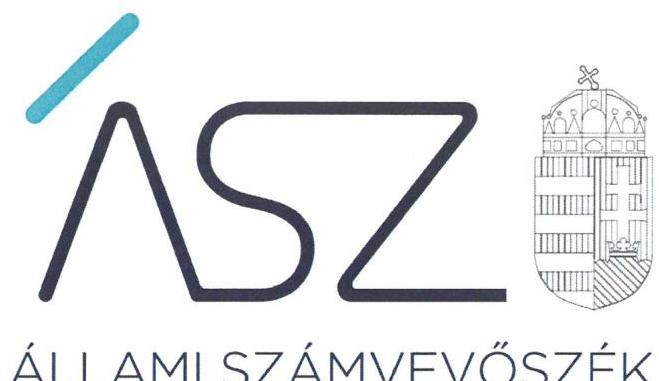
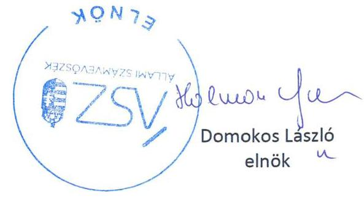
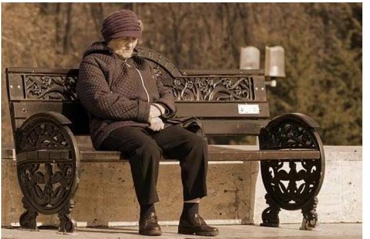
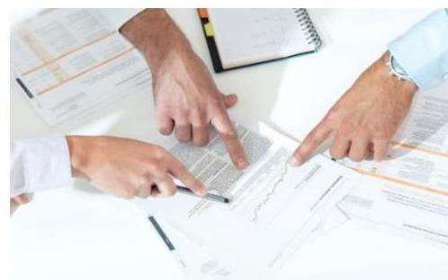
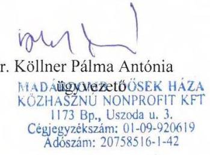
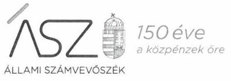
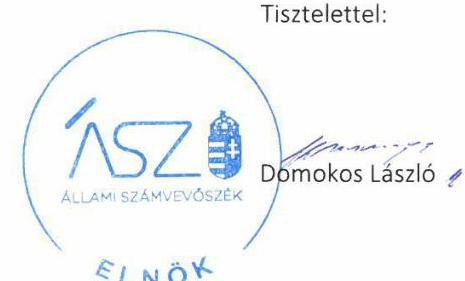
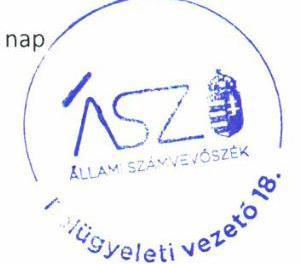

ÁLLAMI SZÁMVEVŐSZÉK

# JELENTÉS 

## Nem állami humánszolgáltatók ellenőrzése

A szociális humánszolgáltatást nyújtó intézmények, szolgáltatók államháztartáson kívüli fenntartói központi költségvetésből kapott támogatásai felhasználásának ellenőrzése -

Madárdomb Idősek Háza Közhasznú Nonprofit Korlátolt Felelősségű Társaság
2020.

20137
www.asz.hu

---

# JELENTÉS

## Nem állami humánszolgáltatók ellenőrzése

A szociális humánszolgáltatást nyújtó intézmények, szolgáltatók államháztartáson kívüli fenntartói központi költségvetésből kapott támogatásai felhasználásának ellenőrzése – Madárdomb Idősek Háza Közhasznú Nonprofit Korlátolt Felelősségű Társaság

2020. 07. hó 31. nap

2013. 07. www.asz.hu

---

# AZ ELLENŐRZÉST FELÜGYELTE: 

TÓTH MARIANNA felügyeleti vezető

## AZ ELLENŐRZÉST VEZETTE ÉS A VÉGREHAJTÁSÁÉRT FELELŐS:

DR. KOVÁCS DIÁNA ellenőrzésvezető

A PROGRAM ÖSSZEÁLLÍTÁSÁÉRT FELELŐS:
FEKETE-NAGY ANDRÁS GÁBOR projektvezető

IKTATÓSZÁM: EL-2780-001/2020
TÉMASZÁM: 2523
ELLENŐRZÉS-AZONOSÍTÓ SZÁM: V0867049

---

# TARTALOMJEGYZÉK 

■ ÖSSZEGZÉS ..... 5
—_ AZ ELLENŐRZÉS CÉLJA ..... 6
—_ AZ ELLENŐRZÉS TERÜLETE ..... 7
—_ AZ ELLENŐRZÉS HÁTTERE, INDOKOLTSÁGA ..... 8
—_ AZ ELLENŐRZÉS LÉNYEGES KÉRDÉSKÖREI ..... 9
—_ AZ ELLENŐRZÉS HATÓKÖRE ÉS MÓDSZEREI ..... 10
— MELLÉKLETEK ..... 13
I. sz. melléklet: Értelmező szótár ..... 13
— FÜGGELÉK: ÉSZREVÉTELEK ..... 15
—_ RÖVIDÍTÉSEK JEGYZÉKE ..... 21

---

.

---

# ÖSSZEGZÉS 

A budapesti székhelyű Madárdomb Idősek Háza Közhasznú Nonprofit Kft. szociális humánszolgáltatási közfeladat ellátására kapott költségvetési támogatással való gazdálkodása 2016-2018. években nem volt átlátható, elszámoltatható.

## Az ellenőrzés társadalmi indokoltsága

A szociális gondoskodást igénylők védelme, illetve a köznevelési feladatok ellátása az Alaptörvényben meghatározott, a társadalom szempontjából fontos tevékenységek. Jogszabályok teszik lehetővé, hogy államháztartáson kívüli szervezetek - így például az egyházi fenntartók, alapítványok, gazdasági társaságok, egyesületek - által fenntartott intézmények is végezzenek köznevelési, szociális és gyermekvédelmi feladatokat. Mindehhez a központi költségvetés évente jelentős összegű támogatással járul hozzá. Az államháztartáson kívüli, humánszolgáltatást végző intézmények az igényelt közpénzekből társadalmilag hasznos, közösségteremtő, közérdekű, illetve közhasznú tevékenységet végeznek, illetve közfeladatokat látnak el.

Az intézményfenntartók ellenőrzésével az Állami Számvevőszék hozzájárul ahhoz, hogy ezen közpénzeket az államháztartáson kívüli szervezetek is ellenőrizhető, átlátható és elszámoltatható módon használják fel a közfeladatok ellátása során. Az ellenőrzések célja továbbá, hogy a nyilvánosság és az igénybevevők megfelelő tájékoztatást kapjanak az államháztartáson kívüli közfeladatot ellátók működéséről.

Az ÁSZ ellenőrzései arra adnak választ, hogy az intézményfenntartók arra használták-e fel a közpénzeket, amire igényelték.

A szabályszerű gazdálkodás elengedhetetlen a közfeladat ellátás szakmai céljainak megvalósításához, valamint a társadalmi közbizalom fenntartásához.

## Megállapítások, következtetések

A Madárdomb Idősek Háza Közhasznú Nonprofit Kft. a közfeladatot ellátó intézménye működtetéséhez felhasznált közpénzekre vonatkozó gazdálkodásáról a Számv. tv. szerinti éves beszámolót nem készítette el, a közfeladatot ellátó intézménye működtetéséhez felhasznált közpénzekre vonatkozó gazdálkodásával a nyilvánosság előtt nem számolt el. A jogszabályokban előírt beszámolási kötelezettségének Számv. tv. 4. § (1) bekezdés, 96. § (1) bekezdése ellenére a 2016-2018. évek vonatkozásában nem tett eleget, mivel kiegészítő mellékletet az általa készített beszámoló nem tartalmazott.

A Madárdomb Idősek Háza Közhasznú Nonprofit Kft. a 2016-2018. években a szociális humánszolgáltatási közfeladat ellátására kapott költségvetési támogatás felhasználásáról nem rendelkezett elkülönített nyilvántartással. A Madárdomb Idősek Háza Közhasznú Nonprofit Kft. a 2016-2018. években a szociális humánszolgáltatási közfeladat ellátására kapott költségvetési támogatás felhasználásának a Számv. tv. 161/A. § (2) bekezdésében előírt ellenőrizhetőségét nem biztosította. Az Atr. 16. § (1) bekezdésében foglalt szabályozás ellenére nem gondoskodott arról, hogy az állami támogatások felhasználásának, a Madárdomb Idősek Háza Közhasznú Nonprofit Kft. és a nem önállóan gazdálkodó intézménye gazdálkodásának elkülönített, feladatonkénti bontásban történő elszámolására az adatok rendelkezésre álljanak.

A Madárdomb Idősek Háza Közhasznú Nonprofit Kft mindezek alapján az Alaptörvény 39. cikk (2) bekezdésében foglaltak ellenére a felhasznált közpénzekre vonatkozó gazdálkodása átláthatóságát és elszámoltathatóságát nem biztosította.

Ezáltal a Madárdomb Idősek Háza Közhasznú Nonprofit Kft. nem igazolta, hogy a közpénzt a szociális humánszolgáltatási közfeladatra fordította.

---

# AZ ELLENŐRZÉS CÉLJA 

AZ ELLENŐRZÉS CÉLJA annak értékelése volt, hogy a nem állami, nem önkormányzati szociális intézmény fenntartói központi költségvetésből kapott támogatásainak felhasználása szabályszerű volt-e.

---

# **AZ ELLENŐRZÉS TERÜLETE**

## **Madárdomb Idősek Háza Közhasznú Nonprofit Kft.**

A budapesti székhelyű Madárdomb Idősek Háza Közhasznú Nonprofit Kft., mint fenntartó, idősek bentlakásos intézményi gondozását végezte.

A Fenntartó³ a 2016-2018. években a székhelyén működő egy nem önállóan gazdálkodó Intézmény⁴ fenntartásával vett részt az állami közfeladatok ellátásában.

A Fenntartó részére az intézmény működtetésére az állami költségvetésből a Kincstár⁵ adatai szerint a 2016. évben 45 533 E Ft, a 2017. évben 49 945 E Ft, a 2018. évben 59 533 E Ft támogatás került kiutalásra.

---

# AZ ELLENŐRZÉS HÁTTERE, INDOKOLTSÁGA 

A szociális feladatokat ellátó nem állami intézményfenntartók részére közfeladataik ellátására évente jelentős összegű pénzügyi támogatást biztosítottak a mindenkori költségvetési törvények a bennük megfogalmazott feltételek mellett.

A Kvtv. ${ }^{4}$-ekben a 2016-2018. években a szociális ágazatra vonatkozóan felhasználható állami támogatásokra 272,4 Mrd Ft előirányzatot határoztak meg. A 2013. évben jelentős változások következtek be a normatív finanszírozás rendszerében. Módosították a szociális igazgatásról és szociális ellátásokról szóló 1993. évi III. törvényt, amely - többek között - 2012. január 1-jei hatállyal megfogalmazta a finanszírozási rendszerbe történő befogadással összefüggő szabályokat.

Az ÁSZ stratégiájában foglaltak alapján is indokolt az ellenőrzés, amely a társadalom számára jelzi, hogy a közpénz államháztartáson kívüli felhasználása sem maradhat ellenőrizetlenül. Az államháztartáson kívülre nyújtott költségvetési támogatások ellenőrzésével az ÁSZ hozzájárul ahhoz, hogy a közpénzeket a nem állami humán fenntartók átlátható módon használják fel a közfeladatok ellátására kötött szerződésekben vállalt kötelezettségek teljesítése érdekében. Az ellenőrzés javaslataival hozzájárulhat az említett rendszerek szabályszerű támogatás felhasználásához, javíthatja a társadalmi-gazdasági döntések megalapozottságát, amely a „jól irányított állam" feltétele.

---

# AZ ELLENŐRZÉS LÉNYEGES KÉRDÉSKÖREI 

1. A Fenntartó szabályszerű működési - és gazdálkodási környezet kialakításával megteremtette-e a költségvetési támogatások átlátható, elszámoltatható igénybevételének, felhasználásának feltételeit?
2. A Fenntartó az átvállalt szociális humánszolgáltatási közfeladathoz biztosított költségvetési támogatásokat szabályszerűen fordította-e a humánszolgáltató intézménye működtetésére?
3. A Fenntartó a szociális humánszolgáltató intézménye működtetéséhez felhasznált közpénzekre vonatkozó gazdálkodásával a nyilvánosság előtt elszámolt-e, ennek megalapozása érdekében ellenőrzési, értékelési és a külső ellenőrzésekkel kapcsolatos intézkedési feladatait szabályszerűen látta-e el?

---

# AZ ELLENŐRZÉS HATÓKÖRE ÉS MÓDSZEREI 

## Az ellenőrzés típusa

Megfelelőségi ellenőrzés

## Az ellenőrzött időszak

2016. január 1-je és 2018. december 31-e közötti időszak.

## Az ellenőrzés tárgya

Az ellenőrzés a szociális humánszolgáltatási közfeladatokat ellátó államháztartáson kívüli fenntartók humánszolgáltatási közfeladatai ellátásához a központi költségvetésből kapott támogatásaik humánszolgáltatási közfeladatokra való fenntartó általi felhasználása szabályszerűségének értékelésére terjedt ki.

## Az ellenőrzött szervezet

Madárdomb Idősek Háza Közhasznú Nonprofit Kft.

## Az ellenőrzés jogalapja

Az ellenőrzés jogszabályi alapját az ÁSZ tv. 1. § (3) bekezdése, 5. § (3) bekezdésben foglalt előírások adják.

## Az ellenőrzés módszerei

Az ellenőrzést az ellenőrzési program annak szempontjai, kérdései, az ellenőrzött időszakban hatályos jogszabályok, a nemzetközi standardokat irányadónak tekintve, az ellenőrzés szakmai szabályok és módszertanok figyelembevételével rendelte elvégezni.

Az ellenőrzés ideje alatt az ÁSZ ${ }^{5}$ a Fenntartóval történő kapcsolattartást az ÁSZ SZMSZ ${ }^{6}$-ének vonatkozó előírásai alapján biztosította.

Az ellenőrzési kérdések megválaszolásához szükséges bizonyítékok megszerzése az ellenőrzött által rendelkezésre bocsátott dokumentumokra, adatokra alapozva megfigyelés, valamint elemző eljárással történt.

Az ellenőrzési bizonyítékként felhasználható adatforrások közé tartoztak egyrészt az ellenőrzési program részletes szempontjainál felsorolt

---

adatforrások, másrészt minden - az ellenőrzés folyamán feltárt, az ellenőrzés szempontjából információt tartalmazó - dokumentum.

Az ellenőrzés lefolytatásához a Fenntartó a kitöltött tanúsítványok, valamint az ÁSZ által kért dokumentumok elektronikus úton való megküldésével szolgáltatott adatokat, információkat. Az így rendelkezésre bocsátott adatok, információk és a tanúsítványok adatai valódiságának kontrollja az ÁSZ ellenőrzése keretében történt.

Az egységes értelmezést támogatta a jelentés mellékletét képező fogalomtár és rövidítésjegyzék.

Az ÁSZ az ellenőrzést alapvetően a szociális humánszolgáltatások esetében a központi költségvetési támogatások igénylésével, módosításával, felhasználásával, elszámolásával kapcsolatos feladatokat ellátó államháztartáson kívüli fenntartónál végezte.

Az ÁSZ a szociális humánszolgáltatások központi költségvetési támogatásai igénylésével, módosításával, elszámolásával kapcsolatos, államháztartáson kívüli fenntartó jogszabályokban előírt feladatai betartását, továbbá a központi költségvetési támogatások szabályszerű kezelését, nyilvántartását ellenőrizte a fenntartónál, az ott rendelkezésre álló határozatok, nyilvántartások, beszámolók és egyéb dokumentumok alapján. Az ellenőrzés nem terjedt ki a szociális humánszolgáltatások központi költségvetési támogatásai igénylése, módosítása, elszámolása valódiságának, megalapozottságának, helyességének - sem a fenntartónál, sem a székhely intézményeinél való - értékelésére (mivel ennek felülvizsgálata, ellenőrzése a finanszírozó jogszabályban előírt feladata, határozatai kiadása előtt). Továbbá nem terjedt ki az ellenőrzés e források intézmények általi szabályszerű felhasználásának értékelésére.

---

.

---

# MELLÉKLETEK 

- I. SZ. MELLÉKLET: ÉRTELMEZŐ SZÓTÁR
humánszolgáltatás
költségvetési támogatás
nem állami, nem önkormányzati (államháztartáson kívüli) intézmény fenntartó

Külön törvényben meghatározott szociális, gyermekjóléti, gyermekvédelmi, közoktatási, felsőoktatási, kulturális szolgáltatás
Szociális célú nem állami humánszolgáltatások támogatása, valamint a Szociális humánszolgáltatók részére biztosított szociális- és gyermekvédelmi ágazati pótlék és egyéb ágazati bérrendezéssel összefüggő támogatások központi költségvetési forrása: 2018. évi Kvtv. XX/20/19/1;8. jogcím csoport, 2017. évi Kvtv. XX/20/19/1;8. jogcím csoport, 2016. évi Kvtv. XX/20/19/1;8. jogcím csoport.
A szociális, gyermekjóléti és gyermekvédelmi közfeladatokat/humánszolgáltatásokat ellátó intézményt fenntartó egyházi jogi személy, társadalmi szervezet, alapítvány, közalapítvány, civil szervezet, országos nemzetiségi önkormányzat, nonprofit gazdasági társaság, gazdasági társaság és a humánszolgáltatást alaptevékenységként végző, Szja tv. hatálya alá tartozó egyéni vállalkozó. (2018. évi Kvtv. 41 § (1), bekezdés, 2017. évi Kvtv. 41. § (1), 2016. évi Kvtv. 40. §, 41. § (1), bekezdés)

---

.

---

# FÜGGELÉK: ÉSZREVÉTELEK 

A jelentéstervezetet a Számvevőszék 15 napos észrevételezésre megküldte az ellenőrzött szervezet vezetőjének az ÁSZ tv. 29. §* (1) bekezdése előírásának megfelelően.

A Madárdomb Idősek Háza Közhasznú Nonprofit Korlátolt Felelősségű Társaság ügyvezetője a jelentéstervezet megállapításaira írásban észrevételt tett.
Az ÁSZ tv. 29. § (3) bekezdésével összhangban az ÁSZ a Függelékben feltünteti az ellenőrzés megállapításaival kapcsolatban tett, figyelembe nem vett észrevételeket, és megindokolja, hogy azokat miért nem fogadta el.

[^0]
[^0]:    * 29. § (1) Az Állami Számvevőszék az ellenőrzési megállapításait megküldi az ellenőrzött szervezet vezetőjének vagy az általa megbízott személynek, és annak, akinek személyes felelősségét állapította meg.
    (2) Az ellenőrzött szervezet vezetője és a felelősként megjelölt személy az ellenőrzés megállapításaira tizenöt napon belül írásban észrevételt tehet.
    (3) Az Állami Számvevőszék az észrevételre a beérkezésétől számított harminc napon belül írásban válaszol. A figyelembe nem vett észrevételeket köteles a jelentésben feltüntetni, és megindokolni, hogy azokat miért nem fogadta el.

---

# MADÁRDOMB IDŐSEK HÁZA KÖZHASZNÚ NONPROFIT KFT 

1173 Budapest, Uszoda u. 3.
Tel., fax.: 253-09-61
Email:info@madardombidosekhaza.hu
B-65913/2000/1
2020. 06. 23

Tisztelt Domokos László Elnök Úr!

A Madárdomb Idősek Háza Közhasznú Nonprofit Kft. (1173 Budapest, Uszoda utca 3.) ügyvezetője Dr. Köllner Pálma Antónia az Állami Számvevőszék 2020. 06. 02. -án kelt jelentéstervezetére az alábbi észrevételt szeretném tenni.:

A Madárdomb Idősek Háza Közhasznú Nonprofit Kft kizárólagos tevékenysége az idősek ellátása bentlakással, ez a tevékenység a cég székhelyén működik, más telephelye, nem önállóan gazdálkodó intézménye nincs. A szociális humánszolgáltatási közfeladat ellátására kapott költségvetési támogatás felhasználásáról az intézmény a Magyar Államkincstár felé minden évben feladatonkénti bontásban elszámolt, a gondozottak létszám változásából valamint a dolgozók fluktuációja folytán keletkezett túlfinanszírozást a meghatározott időre visszafizette. Igaz, hogy ezt az éves beszámoló mellékleteként nem jelenítettük

 meg, most utólag az Önök által kért 2019. évi dokumentumokkal együtt mellékletben megküldjük.
Kérem szíves visszajelzésüket, ha valamit változtatni, pontosítani szükséges a kimutatásokkal kapcsolatosan, hogy megfeleljenek az átláthatóságnak.
Az intézmény költségvetésének egyharmadát az állami költségvetési támogatás teszi ki, melynek elvonása vagy akár szüneteltetése súlyosan veszélyeztetné az intézmény működését, az itt élő gondozottak ellátását, a dolgozók bérének kifizetését.
Jóindulatú elbírálásuk reményében tisztelettel:

Budapest, 2020.06.16.

---

Ikt. szám: EL-2219-021/2020.

Dr. Köllner Pálma Antónia úrhölgy
ügyvezető
Madárdomb Idősek Háza Közhasznú Nonprofit Korlátolt Felelősségű Társaság

# Budapest 

Tisztelt Ügyvezető Úrhölgy!

A „Nem állami humánszolgáltatók ellenőrzése - A szociális humánszolgáltatást nyújtó intézmények, szolgáltatók államháztartáson kívüli fenntartói központi költségvetésből kapott támogatásai felhasználásának ellenőrzése - Madárdomb Idősek Háza Közhasznú Nonprofit Korlátolt Felelősségű Társaság" címmel készített számvevőszéki jelentéstervezetre a 2020. június 16-án kelt levélben megküldött észrevételeit megkaptam.

Az Állami Számvevőszék észrevételekre vonatkozó álláspontjáról a felügyeleti vezető által készített részletes tájékoztatást csatoltan megküldöm.

Tájékoztatom Ügyvezető úrhölgyet, hogy a számvevőszéki jelentésben - az Állami Számvevőszékről szóló 2011. évi LXVI. törvény 29. § (3) bekezdése alapján - a figyelembe nem vett észrevételeket szerepeltetjük az elutasítás indokának feltüntetésével.

Budapest, 2020. 14 hónap 14 nap

Melléklet: Tájékoztatás az észrevételek kezeléséről

---

# Tájékoztatás az észrevételek kezeléséről 

A „Nem állami humánszolgáltatók ellenőrzése - A szociális humánszolgáltatást nyújtó intézmények, szolgáltatók államháztartáson kívüli fenntartói központi költségvetésből kapott támogatásai felhasználásának ellenőrzése - Madárdomb Idősek Háza Közhasznú Nonprofit Korlátolt Felelősségű Társaság" című jelentéstervezetre (továbbiakban: jelentéstervezet) 2020. június 16-án kelt levelében megküldött észrevételeit áttekintettem. Az észrevételek kezeléséről az alábbi tájékoztatást adom.

1. Az elkülönített nyilvántartás vezetésével kapcsolatban tett észrevétel (Jelentéstervezet Megállapítások, következtetések részének 2. bekezdése)
Úgyvezető úrhölgy észrevételt tett a jelentéstervezet azon megállapítására, miszerint a 2016-2018. években a szociális humánszolgáltatási közfeladat ellátására kapott költségvetési támogatás felhasználásáról nem rendelkeztek elkülönített nyilvántartással. Észrevételében kifejtette, hogy a Fenntartó kizárólagos tevékenysége az idősek ellátása bentlakással, ez a tevékenység a Fenntartó székhelyén működik, más telephelye, önállóan gazdálkodó intézménye nincs. A szociális humánszolgáltatási közfeladat ellátására kapott költségvetési támogatás felhasználásáról az intézmény a Magyar Államkincstár felé minden évben feladatonkénti bontásban elszámolt, az esetleges túlfinanszírozást határidőre visszafizette.
Úgyvezető úrhölgy észrevételében foglaltakra válaszolva tájékoztatom, hogy az EL-2219-001/2019. iktatószámú adatbekérő levelekben kértük a szociális közfeladat ellátásra kapott támogatás, valamint a kapott támogatás felhasználása tekintetében a 2016-2018. évekre vonatkozó elkülönített nyilvántartást alátámasztó dokumentumok átadását. A 2019. november 25-én kelt teljességi és hitelességi nyilatkozattal alátámasztott módon az adatbekérés hivatkozott pontjaihoz egy word dokumentumot bocsátottak rendelkezésre, amelyben jelezték, hogy a Fenntartónál ilyen nyilvántartás vezetésére nincsen szükség.
Az ellenőrzési adatbekérés során benyújtott, Magyar Államkincstár által kiállított határozatok szerint a Fenntartó az általa fenntartott Madárdomb Idősek Háza intézményre tekintettel idősek otthona átlagos szintű ellátásra, idősek otthona emelt szintű ellátásra és idősek otthona demens betegek ellátásra is kapott költségvetési támogatást, így az észrevételben foglaltakkal szemben több különböző feladatra tekintettel részesült költségvetési támogatásban.
Az ellenőrzési adatbekérés során benyújtott 2016-2018. évi főkönyvi kivonatok alapján megállapítható, hogy a Fenntartó könyvviteli rendszere nem felel meg az egyházi és nem állami fenntartású szociális, gyermekjóléti és gyermekvédelmi szolgáltatók, intézmények és hálózatok állami támogatásáról szóló 489/2013. (XII. 18.) Korm. rendelet (továbbiakban: Atr.) 16. § (1) bekezdésében foglalt előírásoknak, mivel a Fenntartó és nem önállóan gazdálkodó intézménye gazdálkodását, valamint a kapott támogatások felhasználását a számviteli rendjében nem kezelte feladatonkénti bontásban, elkülönítetten.
A 2019. november 25-én kelt teljességi és hitelességi nyilatkozatokban az átadott dokumentumok hitelességéért, valódiságáért, hiánytalanságáért és hatályosságáért felelősséget vállalt. Az Állami Számvevőszék az ellenőrzési megállapításait az ellenőrzési adatszolgáltatás során a részére

---

törvényi határidőben rendelkezésre bocsátott hiteles dokumentumokra alapozva fogalmazza meg. A fentiekre való tekintettel a jelentéstervezet kapcsolódó megállapítása helytálló, így a jelentéstervezet módosítása nem indokolt.
Budapest, 2020. 07 hónap 10 nap

Tóth Marianna felügyeleti vezető

---

.

---

# RÖVIDÍTÉSEK JEGYZÉKE 

${ }^{1}$ Fenntartó
${ }^{2}$ Intézmény
${ }^{3}$ Kincstár
${ }^{4}$ Kvtv.
${ }^{5}$ ÁSZ
${ }^{6}$ ÁSZ SZMSZ

Madárdomb Idősek Háza Közhasznú Nonprofit Kft.
Madárdomb Idősek Háza
Magyar Államkincstár
2016. évi Kvtv.: 2015. évi C. törvény - Magyarország 2016. évi központi költségvetéséről (hatályos: 2015. július 4-étől 2019. december 30-ig) 2017. évi Kvtv.: 2016. évi XC. törvény - Magyarország 2017. évi központi költségvetéséről (hatályos: 2015. július 4-étől)
2018. évi Kvtv.: 2017. évi C. törvény - Magyarország 2018. évi központi költségvetéséről (hatályos: 2017. november 1-étől)
Állami Számvevőszék
Állami Számvevőszék Szervezeti és Működési Szabályzata

---

# ÁSZ 

ÁLLAMI SZÁMVEVŐSZÉK
1052 Budapest, Apáczai Cs. J. u. 10. I 1364 Budapest 4. Pf. 54
TEL: +36 14849100
email: szamvevoszek@asz.hu
web: www.asz.hu | www.aszhirportal.hu

