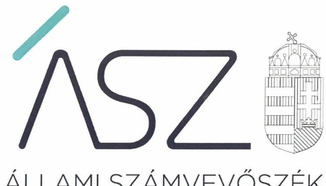
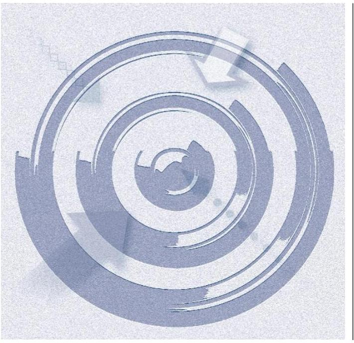

ÁLLAMI SZÁMVEVŐSZÉK

# JELENTÉS 

## Központi költségvetési szervek ellenőrzése

A központi költségvetési szervek (kórházak) kockázatértékelésen alapuló ellenőrzése
2020.

20139
www.asz.hu

---

ÁLLAMI SZÁMVEVŐSZÉK

# JELENTÉS 

## Központi költségvetési szervek ellenőrzése

A központi költségvetési szervek (kórházak) kockázatértékelésen alapuló ellenőrzése
2020. 07. hó 14. nap

20139
www.asz.hu

---

# AZ ELLENŐRZÉST FELÜGYELTE: 

HOLMAN MAGDOLNA JULIANNA felügyeleti vezető

## AZ ELLENŐRZÉST VEZETTE ÉS A VÉGREHAJTÁSÁÉRT FELELŐS:

DR. SIMON JÓZSEF ellenőrzésvezető

A PROGRAM ÖSSZEÁLLÍTÁSÁÉRT FELELŐS:
BERTALAN RUDOLF GYULA projektvezető

IKTATÓSZÁM: EL-2786-001/2020
TÉMASZÁM: 2522
ELLENŐRZÉS-AZONOSÍTÓ SZÁM: V0866
Jelentéseink az Országgyúlés számítógépes hálózatán és az interneten a www.asz.hu címen is olvashatóak.

---

# TARTALOMJEGYZÉK 

■ ÖSSZEGZÉS ..... 5
■ AZ ELLENŐRZÉS CÉLJA ..... 7
■ AZ ELLENŐRZÉS TERÜLETE ..... 8
■ AZ ELLENŐRZÉS HÁTTERE, INDOKOLTSÁGA ..... 9
■ A JELENTÉS LÉNYEGES KÉRDÉSKÖREI ..... 10
■ AZ ELLENŐRZÉS HATÓKÖRE ÉS MÓDSZEREI ..... 11
■ MEGÁLLAPÍTÁSOK ..... 14
■ JAVASLATOK ..... 18
■ MELLÉKLETEK ..... 23
I. sz. melléklet: Értelmező szótár ..... 23
II. sz. melléklet: Az ellenőrzött egészségügyi intézmények ..... 24
III. sz. melléklet: Az ellenőrzött egészségügyi intézmények kockázati értékelése a 2017. évet követően ..... 25
IV. sz. melléklet: Az ellenőrzött egészségügyi intézmények gazdálkodási területeinek kockázati értékelése a 2015-2017. években ..... 26
V. sz. melléklet: Az ellenőrzött egészségügyi intézményekre vonatkozóan tett egyedi ellenőrzési megállapítások ..... 29
■ FÜGGELÉK: ÉSZREVÉTELEK ..... 33
■ RÖVIDÍTÉSEK JEGYZÉKE ..... 43

---

.

---

# ÖSSZEGZÉS 

Az ellenőrzött 24 egészségügyi intézmény vezetői közül 16 gondoskodott a gazdálkodásában rejlő kockázatok kezeléséről a 2017. évet követően, ezáltal kialakították a közpénzekkel és az állami vagyonnal való átlátható, elszámoltatható, felelős és korrupciótól védett gazdálkodás garanciális feltételeit. A magas és közepes kockázati besorolású egészségügyi intézmények esetében intézkedések szükségesek a fennálló kockázatok kezelése érdekében.

## Az ellenőrzés társadalmi indokoltsága

A központi alrendszer részét képező egészségügyi intézmények az alapvető közfeladatok ellátáshoz jelentős nagyságrendű közpénzt használnak fel és jelentős mértékű állami vagyont kezelnek. Ebből következően az egészségügyi intézmények gazdálkodásában előforduló szabálytalanságok kockázatot hordoznak nemcsak a központi költségvetés egyensúlya és a nemzeti vagyon védelme, hanem közvetetetten az állampolgárok számára rendelkezésre álló folyamatos, illetve a jogszabályok által előírt minőségű egészségügyi ellátások biztosítása szempontjából. Mindez azért is fontos, mert e kockázatok közvetetten kihatnak az állampolgárok életminőségére, valamint befolyásolják a gazdasági tevékenységekhez szükséges munkaerő rendelkezésre állását.

A központi alrendszerhez tartozó egészségügyi feladatokat ellátó költségvetési szervek gazdálkodásának folyamatos figyelemmel kísérése által az Állami Számvevőszék hozzájárulhat a kockázatok feltárásához és ezek intézményi kezeléséhez. A kockázatos gazdálkodási területekre vonatkozó ellenőrzési megállapítások hozzájárulhatnak az államháztartás szabályozott, átlátható és hosszú távon is fenntartható működtetéséhez.

## Főbb megállapítások, következtetések, javaslatok

A szabályszerű közpénzfelhasználás feltételeinek kialakításának, a rendelkezésre álló közpénz szabályos felhasználásának, a vagyon védelmének a kockázata 2017-ben az ellenőrzött 24 egészségügyi intézményből 13 intézménynél közepes, 11 intézménynél magas kockázatú volt. Az ellenőrzött egészségügyi intézmények által jelzett intézkedéseket figyelembe véve a gazdálkodásukban rejlő kockázatok 16 intézménynél csökkentek.

Az ellenőrzött egészségügyi intézmények az éves költségvetési beszámolóban szereplő mérlegtételek értékét a 2015-2017. években nem támasztották alá leltárral. Ennek hiányában az éves költségvetési beszámoló nem mutatott megbízható és valós képet vagyoni helyzetükről. A kötelezettségvállalásokról szóló nyilvántartás vezetésének hiányában a költségvetési előirányzatokkal való szabályszerű gazdálkodás, és felhasználás alapvető feltételeit nem teremtették meg. Az ellenőrzött egészségügyi intézmények közül mindössze 3 gondoskodott a 2015-2017. években a belső kontrollrendszer szabályszerű kialakításáról.

A 2017. évet követően 14 ellenőrzött egészségügyi intézmény tett lépéseket a belső kontrollrendszer egyes területein, hozzájárulva a belső kontrollrendszer szabályszerű kialakításához és ezáltal a kockázatok mérsékléséhez. Ennek keretében a kontrollkörnyezetet 9, a kontrolltevékenységeket 8, illetve az integrált kockázatkezelési rendszert 6 ellenőrzött egészségügyi intézmény szabályszerűen kialakította.

Az előirányzatokkal való szabályszerű gazdálkodás érdekében 17, a beszámolási kötelezettség szabályszerű teljesítése érdekében 10 ellenőrzött egészségügyi intézmény tett lépéseket. Ezáltal ezen egészségügyi intézmények pénzügyi és vagyongazdálkodásában rejlő kockázatok mérséklődtek.

Magas kockázati minősítéssel rendelkezik továbbra is a gazdálkodás egyes lényeges területeinek értékelése alapján a Mezőtúri Kórház és Rendelőintézet, illetve a Szabolcs-Szatmár-Bereg Megyei Kórházak és Egyetemi Oktatókórház.

---

# Összegzés 

Közepes kockázatot hordoz a Bugát Pál Kórház, a Heim Pál Országos Gyermekgyógyászati Intézet, a Markhot Ferenc Oktatókórház és Rendelőintézet, az Országos Onkológiai Intézet, az Országos Sportegészségügyi Intézet, valamint a Vaszary Kolos Kórház gazdálkodása.

Az Állami Számvevőszék a jelentésben foglalt megállapítások alapján a 8 intézmény vezetője részére fogalmazott meg javaslatot.

---

# AZ ELLENŐRZÉS CÉLJA 

AZ ELLENŐRZÉS CÉLJA annak megállapítása volt, hogy az egészségügyi intézmények igazgatói megte-remtették-e a közpénzekkel, valamint az állami vagyonnal való átlátható, elszámoltatható, felelős és korrupciótól védett gazdálkodás garanciáit.

---

# AZ ELLENŐRZÉS TERÜLETE 

## 24 egészségügyi intézmény

Az ellenőrzés a központi költségvetési szervek körébe tartozó 24 egészségügyi intézményre terjedt ki. Az ellenőrzött szervezetek felett a 2015-2017. évek közötti időszakban az irányítószervi hatásköröket az Emberi Erőforrások Minisztériuma gyakorolta az emberi erőforrások minisztere útján. Az egyes fenntartói, valamint az irányítási, középirányítói jogokat 2015. február 28-ig a Gyógyszerészeti és Egészségügyi Minőség- és Szervezetfejlesztési Intézet, 2015. március 1-jétől az Állami Egészségügyi Ellátó Központ gyakorolta. Az Országos Közegészségügyi Intézet középirányítói feladatait az ellenőrzött időszakban az Országos Tisztifőorvosi Hivatal látta el.

Az ellenőrzött szervezetek mindegyike önálló jogi személy volt, amelyek előirányzataik felett teljes jogkörrel, illetve gazdasági szervezettel rendelkeztek. Az ellenőrzött időszakon belül szervezeti átalakításra - az Országos Közegészségügyi Intézet kivételével - nem került sor. Az Országos Közegészségügyi Intézet jogutóda 2018. október 1-jétől a Nemzeti Népegészségügyi Központ. A Nemzeti Népegészségügyi Központ ellátja mindazon feladatokat, amelyek 2018. szeptember 30-ig az Országos Közegészségügyi Intézet és az Emberi Erőforrások Minisztériuma országos tisztifőorvosi feladatokért felelős helyettes államtitkára által irányított szervezeti egységek feladatkörébe tartoztak.

Az ellenőrzött szervezetek alaptevékenységét, illetve működési és ellátási területét az egészségügyről szóló jogszabályok ${ }^{1}$ határozták meg.

Működésük keretében különböző típusú egészségügyi szolgáltatásokat nyújtottak az ellátási körzetükben élők számára. Az ellenőrzött szervezetek alapfeladatát jellemzően a fekvő- és járóbeteg diagnosztikus és terápiás szakorvosi ellátások nyújtása jelentette. Mindez az intézmények többsége esetében kiegészült többek között kutatási, oktatási, egészségügyi megelőző és foglalkozás egészségügyi tevékenységek folytatásával.

Alapfeladatai keretében a Szakorvosi Rendelőintézet Szigetszentmiklós kizárólag járóbeteg ellátást nyújtott, az Országos Közegészségügyi Intézet környezet-egészségügyi hatósági és igazgatási feladatokat látott el az ellenőrzött időszakban. Az Országos Gyógyszerészeti és Élelmezés-egészségügyi Intézet többek között gyógyszer-felügyeleti, piacfelügyeleti, élelme-zés- és táplálkozás-egészségügyi, illetve gyógyszerellátással kapcsolatos hatósági és egyéb szakértői feladatokat látott el az ellenőrzött időszakban. E két egészségügyi intézmény járó-, illetve fekvőbeteg-ellátási tevékenységet nem végzett.

A közfeladatok tekintetében az ellenőrzött szervezetek finanszírozási feladatait az Emberi Erőforrások Minisztériuma irányítása alá tartozó Országos Egészségbiztosítási Pénztár látta el 2016. december 31-ig. Ezt követően e feladatok ellátását a Nemzeti Egészségbiztosítási Alapkezelő végezte.

---

# AZ ELLENŐRZÉS HÁTTERE, INDOKOLTSÁGA 

Az államháztartás központi alrendszerébe tartozó egészségügyi intézmények vagyona a nemzeti vagyon része. Az Alaptörvény ${ }^{2}$ is rögzíti, hogy a vagyonnal való gazdálkodás célja a közérdek szolgálata, alapvető rendeltetése a közfeladatok ellátásának biztosítása. A közpénzek felhasználásában meghatározó, központi alrendszerbe tartozó, gyógyító és megelőző ellátást nyújtó intézmények pénzügyi és vagyongazdálkodási tevékenységük és feladatellátásuk súlya miatt jelentős hatást gyakorolnak a költségvetés egyensúlyának fenntartására. Hatással vannak továbbá a vagyonkezelésbe kapott állami vagyonnal való gazdálkodás minőségére.

---

# A JELENTÉS LÉNYEGES KÉRDÉSKÖREI 

1.- Az egészségügyi intézmények kialakították-e a szabályszerű gazdálkodás feltételeit?
2.- Az egészségügyi intézmények szabályszerűen eleget tettek-e beszámolási kötelezettségüknek?
3.- Az egészségügyi intézmények szabályszerűen gazdálkodtak-e az előirányzatokkal?

---

# AZ ELLENŐRZÉS HATÓKÖRE ÉS MÓDSZEREI 

## Az ellenőrzés típusa

Megfelelőségi ellenőrzés.

## Az ellenőrzött időszak

A 2015-2017. évek, a költségvetési jelentés kötelező egyezőségeinek, valamint a maradvány-kimutatás ellenőrzése esetén a 2017. év.

## Az ellenőrzés tárgya

Az egészségügyi intézmények gazdálkodásának szabályozottsága, valamint a beszámoló készítés és a maradvány elszámolás szabályszerűségének ellenőrzése volt.

## Az ellenőrzött szervezetek

A II. mellékletben szereplő egészségügyi intézmények.

## Az ellenőrzés jogalapja

Az ÁSZ tv. ${ }^{3}$ 1. § (3) bekezdés, továbbá az 5. § (2)-(3) bekezdései és a (4) bekezdés a) pontja.

## Az ellenőrzés módszerei

Az ellenőrzésre az ellenőrzött időszakban hatályos jogszabályok, az ellenőrzés szakmai szabályai, a jelen ellenőrzésre irányadó ÁSZ ${ }^{4}$ módszertanok, valamint az ellenőrzési programban foglalt értékelési szempontok szerint került sor.

Az ellenőrzést az ÁSZ az ellenőrzési program kérdéseire adott válaszok kiértékelésével, valamint az ellenőrzési programban ismertetett ellenőrzési kérdések, kritériumok, adatforrások között megjelölt adatforrások, továbbá az adott időszakban hatályos jogszabályok figyelembevételével folytatta le.

Az ellenőrzés ideje alatt az ÁSZ az ellenőrzött szervezetekkel történő kapcsolattartást az ÁSZ szervezeti és múködési szabályzatának vonatkozó előírásai alapján biztosította. Az ellenőrzés kiterjedt minden olyan körülményre és adatra, amely az ÁSZ jogszabályban meghatározott feladatainak

---

teljesítéséhez, valamint a program végrehajtása folyamán felmerült újabb összefüggések feltárásához szükséges volt.

Az ellenőrzés az egészségügyi intézmények gazdálkodásának lényeges területeire terjedt ki, amelyek a következők voltak:
a szabályszerű gazdálkodás feltételeinek kialakítása (ezen belül a kontrollkörnyezet, a kontrolltevékenységek és a kockázatkezelési rendszer kialakítása, valamint a monitoring rendszeren belül a belső kontrollrendszer múködéséről szóló vezetői nyilatkozat elkészítése),
a beszámolási kötelezettség teljesítése,
és az előirányzatokkal való gazdálkodás.
Az ellenőrzött szervezetek kockázati besorolása alacsony, vagy magas kategóriába a 2015-2017. évek vonatkozásában a lényeges területek értékelése alapján történt. A lényegesnek minősített területhez tartozó bármely szempont nem szabályszerű teljesülése esetén az adott tényező magas kockázati minősítést kapott és a lényeges terület értékelése is magas kockázatot hordozott.

Az ellenőrzött egészségügyi intézmények összesített kockázati értékelése a 2015-2017. évek vonatkozásában a lényeges területek kockázati besorolása alapján történt. Magas kockázatú besorolást kapott az ellenőrzött egészségügyi intézmény, ha a beszámolási kötelezettség teljesítése és az előirányzatokkal való gazdálkodás mellett a belső kontrollrendszerhez tartozó lényeges területek közül legalább kettő magas kockázattal rendelkezett. Közepes kockázatú volt az ellenőrzött egészségügyi intézmény, ha a beszámolási kötelezettség teljesítése és az előirányzatokkal való gazdálkodás mellett a belső kontrollrendszerhez tartozó lényeges területek közül maximum egy hordozott magas kockázatot.

Az ellenőrzött egészségügyi intézmények vezetői számára figyelemfelhívó levél, illetve az Országos Közegészségügyi Intézet esetében a Nemzeti Népegészségügyi Központ, mint jogutód szervezet részére figyelmet felhívó levél került megküldésre a 2017. évre vonatkozóan megállapított szabálytalanságokról. Az ellenőrzött szervezetek vezetői számára - összhangban az ÁSZ tv. rendelkezésével - 15 nap állt rendelkezésre az ebben foglaltak elbírálására, valamint a megfelelő intézkedés meghozatalára.

Az ellenőrzött egészségügyi intézmények vezetői által a figyelemfelhívó, illetve figyelmet felhívó levélre adott válaszok alapján az ÁSZ értékelte a 2017. évre vonatkozóan feltárt kockázatok intézményi kezelését. Ha az ellenőrzött egészségügyi intézmény vezetője 2018. január 1. és 2020. február 29. között már intézkedett, vagy az ellenőrzési megállapítások alapján intézkedéseket fogalmazott meg a szabálytalanság megszűntetése érdekében az ÁSZ a gazdálkodás adott lényeges területén korábban fennálló kockázatot kezeltnek minősítette, ezáltal a lényeges terület kockázati minősítése alacsony besorolására változott.

Az alacsony kockázati besorolás kifejezi, hogy az adott ellenőrzött egészségügyi intézmény a gazdálkodásában fennálló - az ÁSZ jelen ellenőrzése által feltárt - kockázatok és az ezek kezelését szolgáló kontrollok összhangban állnak egymással. Ebben az esetben az adott egészségügyi intézmény az adott kockázati tényező lehetséges hatását minimalizálta, vagyis a kockázati tényező és a kapcsolódó kontroll közötti rést elfogadható szintre csökkentette.

---

A figyelemfelhívó, illetve figyelmet felhívó levélre adott intézményi válaszok alapján tett megállapítások egységesen nagyobb betűméret alkalmazásával kerültek megjelenítésre.

Az ellenőrzött egészségügyi intézmények összesített kockázati értékelése keretében azon ellenőrzött egészségügyi intézmény, amely a 2018. január 1. és 2020. február 29. közötti időszakban minden magas kockázatot hordozó lényeges területen intézkedéseket tett, illetve fogalmazott meg együttesen alacsony kockázati besorolást kapott.

Ha az ellenőrzött egészségügyi intézmény a beszámolási kötelezettség teljesítése, vagy az előirányzatokkal való gazdálkodás lényeges területek legalább egyikén intézkedett, vagy lépéseket tett a feltárt kockázatok mérséklése érdekében, valamint a belső kontrollrendszerhez tartozó lényeges területeken maximum egy magas kockázatú értékeléssel rendelkező lényeges terület maradt fenn, az együttes kockázati értékelés szintén alacsony minősítést kapott.

Minden egyéb esetben az ellenőrzött egészségügyi intézmények összesített kockázati értékelésének meghatározása az ellenőrzött időszakra vonatkozóan alkalmazott módszertan szerint történt.

---

# 1. Az egészségügyi intézmények kialakították-e a szabályszerű gazdálkodás feltételeit? 

Összegző megállapítás

Az ellenőrzött egészségügyi intézmények közül három alakította ki a 2017. évben a szabályszerű gazdálkodás feltételeit. A belső kontrollrendszer egyes elemeivel kapcsolatos kockázatok mérséklése érdekében átfogó lépéseket tizennégy egészségügyi intézmény tett.

A SZERVEZET FELADATAI ELLÁTÁSÁNAK RÉSZLETES BELSŐ RENDJÉT ÉS MÓDJÁT tartalmazó szervezeti és múködési szabályzattal 2017. december 31-én az ellenőrzött egészségügyi intézmények teljes körűen rendelkeztek.

Három egészségügyi intézmény azonban a szervezeti és múködési szabályzatban nem tüntette fel a Vnytv. ${ }^{5} 4 . \S$ a) pontja ellenére a vagyonnyilatkozat-tételi kötelezettséggel járó munkaköröket. Ezen egészségügyi intézmények a 2017. évet követően lépéseket tettek a szervezeti és múködési szabályzat módosítása érdekében.

A SZÁMVITELI SZABÁLYOZÁS keretében huszonhárom egészségügyi intézmény rendelkezett a 2017. évben a Számv. tv. ${ }^{6}$ által előírt számviteli politikával. A 2015-2017. évek közötti időszakban egy egészségügyi intézmény nem alakította ki számviteli politikáját az Áhsz. ${ }^{7}$ 50. § (1) bekezdésben és a Számv. tv. 14. § (3) bekezdésében előírtak ellenére. Ezen egészségügyi intézmény a 2017. évet követően sem gondoskodott e szabálytalanság megszűntetéséről.

A számviteli politika keretében huszonkét egészségügyi intézmény készítette el a 2015-2017. években az eszközök és források leltárkészítési és leltározási szabályzatát a Számv. tv.-ben foglalt rendelkezés szerint. A 2017. évet követően egy egészségügyi intézmény lépéseket tett e szabálytalanság megszűntetése érdekében, egy egészségügyi intézmény azonban nem gondoskodott az előírásoknak megfelelő szabályozás kialakításáról.

A használt, de a mérlegben értékkel nem szereplő immateriális javak, tárgyi eszközök, készletek leltározási módját az Áhsz. előírása szerint tizennyolc egészségügyi intézmény szabályozta az ellenőrzött időszakban. További öt egészségügyi intézmény a 2017. évet követően lépéseket tett, egy egészségügyi intézmény nem tett lépéseket a leltárkészítési és leltározási szabályzat módosítása érdekében.

A Számv. tv. rendelkezésével összhangban a számviteli politika keretében huszonkét egészségügyi intézmény rögzítette a 2015-2017. években azokat a gazdálkodóra jellemző szabályokat, előírásokat, módszereket, amelyekkel meghatározza, hogy mit tekint a számviteli elszámolás, az értékelés szempontjából lényegesnek, nem lényegesnek. A további két

---

egészségügyi intézmény a 2017. évet követően gondoskodott a számviteli politika módosításáról, ezáltal a szabályozás kialakításáról.

A KONTROLLTEVÉKENYSÉGEK KIALAKÍTÁSA a 2015-2017. években tizenhárom ellenőrzött egészségügyi intézménynél nem volt szabályszerű. Ezáltal nem volt biztosított a jogszabályi előírások szerinti közpénzfelhasználás alapvető feltétele.

Az Ávr. ${ }^{8}$ 60. § (3) bekezdésében foglalt rendelkezések ellenére a gazdálkodási jogkörök gyakorlására jogosult személyekről és aláírás-mintájukról szóló nyilvántartás
— egy egészségügyi intézménynél nem állt rendelkezésre,
—tizenkét egészségügyi intézmény vezetője nem gondoskodott ennek naprakész vezetéséről.
Nyolc egészségügyi intézmény a 2017. évet követően lépéseket tett a gazdálkodási jogkörök gyakorlására jogosult személyekről és aláírás-mintájukról szóló naprakész nyilvántartás kialakítása érdekében. Öt egészségügyi intézménynél azonban továbbra is fennáll a közpénzek nem szabályszerű felhasználásának kockázata.

# AZ INTEGRÁLT KOCKÁZATKEZELÉSI RENDSZERT a 2017. év végéig nyolc ellenőrzött egészségügyi intézmény nem alakította ki 2016. október 1-jétől a Bkr. ${ }^{9}$ 3. § b) pontjában szereplő rendelkezés ellenére. 

Hat egészségügyi intézmény a 2017. évet követően lépéseket tett az integrált kockázatkezelési rendszer kialakítása, ezáltal a gazdálkodási kockázatok megismeretének érdekében. Két egészségügyi intézménynél továbbra sem biztosított a gazdálkodásban rejlő kockázatok felmérése és értékelése.

A BELSŐ KONTROLLRENDSZER MINŐSÉGÉRŐL SZÓLÓ VEZETŐI NYILATKOZATOT - a 2016. és a 2017. évben egy-egy kivétellel - az ellenőrzött időszakban évente az ellenőrzött egészségügyi intézmények vezetői elkészítették a Bkr. előírása alapján.

## A BELSŐ KONTROLLRENDSZER EGYES ELEMEIVEL KAPCSOLATBAN FELTÁRT SZABÁLYTALANSÁGOK teljes körű megszűntetése révén a 2017. évet követően tizennégy egészségügyi intézménynél alacsony szintre csökkentek a belső kontrollrendszer elemeinek nem szabályszerű kialakításából adódó kockázatok.

---

# 2. Az egészségügyi intézmények szabályszerűen eleget tettek-e beszámolási kötelezettségüknek? 

Összegző megállapítás

Az ellenőrzött egészségügyi intézmények a 2015-2017. években gondoskodtak - két kivétellel - az éves költségvetési beszámoló összeállításáról, azonban nem biztosították az éves költségvetési beszámoló leltárral való alátámasztását. A kockázatok mérséklése érdekében a 2017. évet követően tíz egészségügyi intézmény tett lépéseket.

AZ ÉVES KÖLTSÉGVETÉSI BESZÁMOLÓT az Áhsz. rendelkezésével összhangban huszonkét egészségügyi intézmény elkészítette a 2017. évben.

LELTÁRRAL a költségvetési beszámoló mérlegtételeit az ellenőrzött időszakban az egészségügyi intézmények - a 2016. évben az Országos Onkológiai Intézetet kivéve - nem támasztották alá az Áhsz. 5. § (1) bekezdésében, a 22. § (1)-(2) bekezdéseiben, valamint a Számv. tv. 69. § (1) bekezdésében előírtak ellenére. Ezáltal az ellenőrzött egészségügyi intézmények éves költségvetési beszámolóiban a vagyonról szóló adatok megalapozottsága nem teljesült.

A LELTÁROZÁSSAL KAPCSOLATBAN FELTÁRT KOCKÁZATOK alacsony szintre való csökkentéséről tíz ellenőrzött egészségügyi intézmény gondoskodott a 2017. évet követően.

## 3. Az egészségügyi intézmények szabályszerűen gazdálkodtak-e az előirányzatokkal?

Összegző megállapítás

Az ellenőrzött egészségügyi intézmények a 2015-2017. években nem gazdálkodtak szabályszerűen az előirányzatokkal. A kockázatok mérséklése érdekében a 2017. évet követően tizenhét egészségügyi intézmény tett lépéseket.

A KÖTELEZETTSÉGVÁLLALÁSOK NYILVÁNTARTÁSA nem felelt meg az ellenőrzött egészségügyi intézményeknél az Áhsz. 39. § (3) bekezdésben foglaltak ellenére a 2015-2017. években az Áhsz. 14. melléklet II. 4. pontjában meghatározott előírásoknak. Ennek hiányában az egészségügyi intézmények vezetői a pénzügyi gazdálkodás helyzetének ismerete nélkül hoztak döntéseket.

AZ ELŐÍRT EGYEZŐSÉGEK TELJESÜLÉSÉT az ellenőrzött egészségügyi intézmények közül tizenhárom nem biztosította, mert a 2017. évi módosított előirányzatok értéke a költségvetési jelentésben kisebb értékű volt, mint a költségvetési évben esedékes, valamint a végleges kötelezettségvállalások értéke, ezáltal megsértették az Áhsz. 17. melléklet 1. a) pontjában szereplő rendelkezést. Így az Áht. ${ }^{10} 36$. § (1) bekezdését

---

megsértve a szabad előirányzat mértékét meghaladóan vállaltak kötelezettséget a 2017. évben. Ezáltal ezen egészségügyi intézmények gazdálkodása magában hordozza az eladósodás kockázatát.

# AZ ELŐIRÁNYZATOKKAL VALÓ SZABÁLYSZERŰ 

GAZDÁLKODÁS kialakításáról tizenhét egészségügyi intézmény gondoskodott a 2017. évet követően. Ezáltal ezen egészségügyi intézményeknél az előirányzatokkal való nem szabályszerű gazdálkodásból eredő kockázatok alacsony szintre csökkentek.

---

# JAVASLATOK 

Az ÁSZ tv. 33. § (1) bekezdésében foglaltak értelmében az ellenőrzött szervezet vezetője köteles a jelentésben foglalt megállapításokhoz kapcsolódó intézkedési tervet összeállítani és azt a jelentés kézhezvételétől számított 30 napon belül az ÁSZ részére megküldeni. Amennyiben az ellenőrzött szervezet vezetője nem küldi meg határidőben az intézkedési tervet, vagy továbbra sem elfogadható intézkedési tervet küld, az Állami Számvevőszék elnöke az ÁSZ tv. 33. § (3) bekezdése a) és b) pontjaiban foglaltakat érvényesítheti.

## A Bugát Pál Kórház föigazgatójának

1. Intézkedjen az éves költségvetési beszámoló mérlegtételei értékének alátámasztásához a jogszabályi előirásnak megfelelő leltár összeállításáról.
(V. számú melléklet ellenőrzöttre vonatkozó megállapítás 1. bekezdése alapján)
2. Intézkedjen a kötelezettségvállalások Áhsz. előirásainak megfelelő tartalmú nyilvántartására.
(V. számú melléklet ellenőrzöttre vonatkozó megállapítás 2. bekezdése alapján

## A Heim Pál Országos Gyermekgyógyászati Intézet föigazgatójának

1. Intézkedjen a gazdálkodási jogkör gyakorlására kijelölt személyek és aláírás-mintájuk Ávr. szerinti naprakész nyilvántartására.
(V. számú melléklet ellenőrzöttre vonatkozó megállapítás 1. bekezdése alapján)
2. Intézkedjen az éves költségvetési beszámoló mérlegtételei értékének alátámasztásához a jogszabályi előirásnak megfelelő leltár összeállításáról.
(V. számú melléklet ellenőrzöttre vonatkozó megállapítás 2. bekezdése alapján)
3. Intézkedjen a kötelezettségvállalások Áhsz. előirásainak megfelelő tartalmú nyilvántartására.
(V. számú melléklet ellenőrzöttre vonatkozó megállapítás 3. bekezdése alapján

---

# A Markhot Ferenc Oktatókórház és Rendelőintézet föigazgatójának 

1. Intézkedjen a gazdálkodási jogkör gyakorlására kijelölt személyek és aláírás-mintájuk Ávr. szerinti naprakész nyilvántartására.
(V. számú melléklet ellenőrzöttre vonatkozó megállapítás 1. bekezdése alapján)
2. Intézkedjen az éves költségvetési beszámoló mérlegtételei értékének alátámasztásához a jogszabályi előírásnak megfelelő̉ leltár összeállításáról.
(V. számú melléklet ellenőrzöttre vonatkozó megállapítás 2. bekezdése alapján)
3. Intézkedjen a kötelezettségvállalások Áhsz. előírásainak megfelelő tartalmú nyilvántartására.
(V. számú melléklet ellenőrzöttre vonatkozó megállapítás 3. bekezdése alapján
4. Intézkedjen az Áht. előírásának betartására, hogy kötelezettségvállalásra csak a szabad előirányzat mértékéig kerüljön sor.
(V. számú melléklet ellenőrzöttre vonatkozó megállapítás 4. bekezdése alapján)

## A Mezötúri Kórház és Rendelőintézet föigazgatójának

1. Intézkedjen a gazdálkodási jogkör gyakorlására kijelölt személyek és aláírás-mintájuk Ávr. szerinti naprakész nyilvántartására.
(V. számú melléklet ellenőrzöttre vonatkozó megállapítás 1. bekezdése alapján)
2. Intézkedjen a Bkr. előírásainak megfelelően az integrált kockázatkezelési rendszer kialakítására.
(V. számú melléklet ellenőrzöttre vonatkozó megállapítás 2. bekezdése alapján)

---

3. Intézkedjen az éves költségvetési beszámoló mérlegtételei értékének alátámasztásához a jogszabályi előirásnak megfelelő leltár összeállításáról.
(V. számú melléklet ellenőrzöttre vonatkozó megállapítás 3. bekezdése alapján)
4. Intézkedjen a kötelezettségvállalások Áhsz. előirásainak megfelelő tartalmú nyilvántartására.
(V. számú melléklet ellenőrzöttre vonatkozó megállapítás 4. bekezdése alapján
5. Intézkedjen az Áht. előirásának betartására, hogy kötelezettségvállalásra csak a szabad előirányzat mértékéig kerüljön sor.
(V. számú melléklet ellenőrzöttre vonatkozó megállapítás 5. bekezdése alapján)

# Az Országos Onkológiai Intézet föigazgatójának 

1. Intézkedjen az éves költségvetési beszámoló mérlegtételei értékének alátámasztásához a jogszabályi előirásnak megfelelő leltár összeállításáról.
(V. számú melléklet ellenőrzöttre vonatkozó megállapítás 1. bekezdése alapján)
2. Intézkedjen a kötelezettségvállalások Áhsz. előirásainak megfelelő tartalmú nyilvántartására.
(V. számú melléklet ellenőrzöttre vonatkozó megállapítás 2. bekezdése alapján

## Az Országos Sportegészségügyi Intézet föigazgatójának

1. Intézkedjen a gazdálkodási jogkör gyakorlására kijelölt személyek és aláírás-mintájuk Ávr. szerinti naprakész nyilvántartására.
(V. számú melléklet ellenőrzöttre vonatkozó megállapítás 1. bekezdése alapján)

---

2. Intézkedjen az éves költségvetési beszámoló mérlegtételei értékének alátámasztásához a jogszabályi előírásnak megfelelő leltár összeállításáról.
(V. számú melléklet ellenőrzöttre vonatkozó megállapítás 2. bekezdése alapján)
3. Intézkedjen a kötelezettségvállalások Áhsz. előírásainak megfelelő tartalmú nyilvántartására.
(V. számú melléklet ellenőrzöttre vonatkozó megállapítás 3. bekezdése alapján

# A Szabolcs-Szatmár-Bereg Megyei Kórházak és Egyetemi Oktatókórház föigazgatójának 

1. Intézkedjen a jogszabályi előírásoknak megfelelően a számviteli politika és annak keretében az eszközök és források leltárkészittési és leltározási szabályzata elkészitésére.
(V. számú melléklet ellenőrzöttre vonatkozó megállapítás 1. és 2. bekezdése alapján)
2. Intézkedjen a gazdálkodási jogkör gyakorlására kijelölt személyek és aláírás-mintájuk Ávr. szerinti naprakész nyilvántartására.
(V. számú melléklet ellenőrzöttre vonatkozó megállapítás 3. bekezdése alapján)
3. Intézkedjen az éves költségvetési beszámoló mérlegtételei értékének alátámasztásához a jogszabályi előírásnak megfelelő leltár összeállításáról.
(V. számú melléklet ellenőrzöttre vonatkozó megállapítás 4. bekezdése alapján)

## A Vaszary Kolos Kórház föigazgatójának

1. Intézkedjen a Bkr. előírásainak megfelelően az integrált kockázatkezelési rendszer kialakítására.
(V. számú melléklet ellenőrzöttre vonatkozó megállapítás 1. bekezdése alapján)

---

2. Intézkedjen az éves költségvetési beszámoló mérlegtételei értékének alátámasztásához a jogszabályi előirásnak megfelelő leltár összeállitásáról.
(V. számú melléklet ellenőrzöttre vonatkozó megállapítás 2. bekezdése alapján)
3. Intézkedjen a kötelezettségvállalások Áhsz. előirásainak megfelelő tartalmú nyilvántartására.
(V. számú melléklet ellenőrzöttre vonatkozó megállapítás 3. bekezdése alapján
4. Intézkedjen az Áht. előirásának betartására, hogy kötelezettségvállalásra csak a szabad előirányzat mértékéig kerüljön sor.
(V. számú melléklet ellenőrzöttre vonatkozó megállapítás 4. bekezdése alapján)

---

# MELLÉKLETEK 

- I. SZ. MELLÉKLET: ÉRTELMEZŐ SZÓTÁR
átláthatóság
belső kontrollrendszer
egészségügyi intézmények
elszámoltathatóság
integrált kockázatkezelési rendszer
integritás
kockázat
kockázatelemzés
kockázatkezelési rendszer
Előfeltétele az elszámoltathatóságnak, a célok elérése érdekében folytatott tevékenységekről, folyamatokról a fontos információk közé- vagy hozzáférhetővé legyenek téve (Forrás: NGM, 2017)
A belső kontrollrendszer a kockázatok kezelése és tárgyilagos bizonyosság megszerzése érdekében kialakított folyamatrendszer, amely azt a célt szolgálja, hogy a müködés és gazdálkodás során a tevékenységeket szabályszerűen, gazdaságosan, hatékonyan, eredményesen hajtsák végre, az elszámolási kötelezettségeket teljesítsék, megvédjék az erőforrásokat a veszteségektől, károktól és nem rendeltetésszerű használattól. (Forrás: Áht. 69. § (1) bekezdése)
A különböző egészségügyi feladatokat ellátó szervezetek, amelyek közé tartoznak a kórházak, a rendelőintézetek, az intézetek, valamint az Országos Közegészségügyi Intézet (jogutódja a Nemzeti Népegészségügyi Központ)
A vezető, vagy a munkatárs felelős a tevékenységéért, az érintettek pedig jogosultak számon kérni azt, hogy a tevékenység valóban az ő érdekükben, és az elvártnak megfelelően történt. (Forrás: NGM, 2017)
Olyan folyamatalapú kockázatkezelési rendszer, amely a szervezet minden tevékenységére kiterjed, egységes módszertan és eljárások alkalmazásával, a szervezet célkitűzéseinek és értékeinek figyelembevételével biztosítja a szervezet kockázatainak teljes körű azonosítását, azok meghatározott kritériumok szerinti értékelését, valamint a kockázatok kezelésére vonatkozó intézkedési terv elkészítését és az abban foglaltak nyomon követését. (Forrás: Bkr. 2. § m) pontja, 2016. október 1-jétől)
Az integritás az elvek, értékek, cselekvések, módszerek, intézkedések konzisztenciáját jelenti, vagyis olyan magatartásmódot, amely meghatározott értékeknek megfelel. (Forrás: Nemzetgazdasági Minisztérium: Magyarországi államháztartási belső kontroll standardok Útmutató 1.6. pontja, 2017. szeptember)
A kockázat annak a valószínűségét jelenti, hogy egy vagy több esemény vagy intézkedés nem kívánt módon befolyásolja a rendszer működését, céljainak megvalósulását. (Forrás: Javaslatok a korrupciós kockázatok kezelésére - Kockázatkezelési és ellenőrzési módszertan 35. oldal, ÁSZ)
Objektív módszer az ellenőrizendő területek kiválasztására, mely meghatározza a költségvetési szerv tevékenységében és belső kontrollrendszerében rejlő kockázatokat. (Forrás: Bkr. 2. § I) pont)
Olyan irányítási eszközök és módszerek összessége, melynek elemei a szervezeti célok elérését veszélyeztető tényezők (kockázatok) azonosítása, elemzése, csoportosítása, nyomon követése, valamint szükség esetén a kockázati kitettség mérséklése. (Forrás: Bkr. 2. § m) pontja, 2016. szep-tember 30-ig)

---

II. SZ. MELLÉKLET: AZ ELLENŐRZÖTT EGÉSZSÉGÜGYI INTÉZMÉNYEK

| Sorszám | Intézmény megnevezése |
| :--: | :--: |
| 1 | Bajai Szent Rókus Kórház |
| 2 | Bugát Pál Kórház |
| 3 | Heim Pál Országos Gyermekgyógyászati Intézet |
| 4 | Keszthelyi Kórház |
| 5 | Kiskunhalasi Semmelweis Kórház |
| 6 | Markhot Ferenc Oktatókórház és Rendelőintézet |
| 7 | Mezőtúri Kórház és Rendelőintézet |
| 8 | Országos Közegészségügyi Intézet (jogutód: Nemzeti Népegészségügyi Központ) |
| 9 | Oroszlányi Szakorvosi és Ápolási Intézet |
| 10 | Országos Gyógyszerészeti és Élelmezés-egészségügyi Intézet |
| 11 | Országos Klinikai Idegtudományi Intézet |
| 12 | Országos Korányi Pulmonológiai Intézet |
| 13 | Országos Onkológiai Intézet |
| 14 | Országos Sportegészségügyi Intézet |
| 15 | Pest Megyei Flór Ferenc Kórház |
| 16 | Sátoraljaújhelyi Erzsébet Kórház |
| 17 | Szabolcs-Szatmár-Bereg Megyei Kórházak és Egyetemi Oktatókórház |
| 18 | Szakorvosi Rendelőintézet Szigetszentmiklós |
| 19 | Szent Pantaleon Kórház |
| 20 | Szent Rókus Kórház |
| 21 | Szigetvári Városi Kórház és Rendelőintézet |
| 22 | Uzsoki Utcai Kórház |
| 23 | Vaszary Kolos Kórház |
| 24 | Veszprém Megyei Tüdőgyógyintézet |

---

| Sorszám | Intézmény megnevezése | Kockázati értékelés |  |  |  |  |  | Összestitett kockázati értékelés | Változás a 2017. évi értékeléshez képest |
| :--: | :--: | :--: | :--: | :--: | :--: | :--: | :--: | :--: | :--: |
|  |  | Kontroll-   környezet   kialakítása | Kontroll-   tevékenységek | Kockázat-   kezelési   rendszer | Vezetői   nyilatkozat   elkészítése | Beszámolási   kötelezettség   teljesítése | Előirányza-   tokkal való   gazdálkodás |  |  |
| 1 | Bajai Szent Rókus Kórház | Nincs változás | Nincs változás | Nincs változás | Nincs változás | Alacsony | Alacsony |  | Javult |
| 2 | Bugát Pál Kórház | Alacsony | Nincs változás | Nincs változás | Nincs változás | Továbbra is magas | Továbbra is magas | Közepes | Változatlan |
| 3 | Heim Pál Országos Gyermekgyógyászati Intézet | Nincs változás | Továbbra is magas | Nincs változás | Nincs változás | Továbbra is magas | Továbbra is magas |  | Változatlan |
| 4 | Keszthelyi Kórház | Nincs változás | Alacsony | Alacsony | Nincs változás | Alacsony | Alacsony |  | Javult |
| 5 | Kiskunhalasi Semmelweis Kórház | Nincs változás | Nincs változás | Nincs változás | Nincs változás | Továbbra is magas | Alacsony |  | Javult |
| 6 | Marithot Ferenc Oktatókórház és Rendelőintézet | Alacsony | Továbbra is magas | Alacsony | Nincs változás | Továbbra is magas | Továbbra is magas |  | Javult |
| 7 | Mezőtori Kórház és Rendelőintézet | Nincs változás | Továbbra is magas | Továbbra is magas | Nincs változás | Továbbra is magas | Továbbra is magas | Magas | Változatlan |
| 8 | Országos Közegészségügyi Intézet (jogutód Nemzeti Népegészségügyi Központ) | Nincs változás | Alacsony | Alacsony | Nincs változás | Alacsony | Alacsony |  | Javult |
| 9 | Oroszlányi Szakorvosi és Ápolási Intézet | Alacsony | Alacsony | Nincs változás | Nincs változás | Továbbra is magas | Alacsony |  | Javult |
| 10 | Országos Gyógyszerészeti és Élelmezés-egészségügyi Intézet | Nincs változás | Nincs változás | Alacsony | Nincs változás | Alacsony | Alacsony |  | Javult |
| 11 | Országos Klinikai Idegtudományi Intézet | Nincs változás | Alacsony | Alacsony | Nincs változás | Alacsony | Alacsony |  | Javult |
| 12 | Országos Korányi Pulmonológiai Intézet | Alacsony | Alacsony | Nincs változás | Nincs változás | Továbbra is magas | Alacsony |  | Javult |
| 13 | Országos Onkológiai Intézet | Alacsony | Nincs változás | Nincs változás | Nincs változás | Továbbra is magas | Továbbra is magas |  | Változatlan |
| 14 | Országos Sportegészségügyi Intézet | Nincs változás | Továbbra is magas | Nincs változás | Nincs változás | Továbbra is magas | Továbbra is magas |  | Változatlan |
| 15 | Pezt Megyei Flór Ferenc Kórház | Továbbra is magas | Nincs változás | Nincs változás | Nincs változás | Továbbra is magas | Alacsony |  | Javult |
| 16 | Sátora(pa)jhelyi Erzsébet Kórház | Nincs változás | Alacsony | Nincs változás | Alacsony | Továbbra is magas | Alacsony |  | Javult |
| 17 | Szabolcs-Szatmár-Bereg Megyei Kórházak és Egyetemi Oktatókórház | Továbbra is magas | Továbbra is magas | Nincs változás | Nincs változás | Továbbra is magas | Alacsony |  | Változatlan |
| 18 | Szakorvosi Rendelőintézet Szigetszentmiklós | Nincs változás | Nincs változás | Nincs változás | Nincs változás | Továbbra is magas | Alacsony |  | Javult |
| 19 | Szent Pantaleon Kórház | Nincs változás | Alacsony | Nincs változás | Nincs változás | Alacsony | Alacsony |  | Javult |
| 20 | Szent Rókus Kórház | Alacsony | Nincs változás | Nincs változás | Nincs változás | Alacsony | Alacsony |  | Javult |
| 21 | Szigetvári Városi Kórház és Rendelőintézet | Alacsony | Nincs változás | Alacsony | Nincs változás | Alacsony | Alacsony |  | Javult |
| 22 | Uzsoki Utcai Kórház | Alacsony | Nincs változás | Nincs változás | Nincs változás | Alacsony | Alacsony |  | Javult |
| 23 | Vaszary Kolos Kórház | Nincs változás | Nincs változás | Továbbra is magas | Nincs változás | Továbbra is magas | Továbbra is magas |  | Változatlan |
| 24 | Veszprém Megyei Tüdőgyógyintézet | Alacsony | Alacsony | Nincs változás | Nincs változás | Alacsony | Alacsony |  | Javult |

# Jelmagyarázat: 

Nincs változás: Az adott lényeges területen a 2017. évre vonatkozóan megállapított alacsony kockázat nem változott. Alacsony: A jelzett intézkedések révén a kockázat alacsony szintre mérséklődött.
Továbbra is magas: Az adott lényeges területen a 2017. évre vonatkozóan megállapított magas kockázat fennmaradt.

---

# IV. SZ. MELLÉKLET: AZ ELLENŐRZÖTT EGÉSZSÉGÜGYI INTÉZMÉNYEK GAZDÁLKODÁSI TERÜLETEINEK KOCKÁZATI ÉRTÉKELÉSE A 2015-2017. ÉVEKBEN 

2017. év

|  |  | Kockázati értékelés |  |  |  |  |  | Összesített kockázati értékelés |
| :--: | :--: | :--: | :--: | :--: | :--: | :--: | :--: | :--: |
| Sorszám | Intézmény megnevezése | Kontroll-   környezet   kialakítása | Kontroll   tevékenységek   kialakítása | Kockázat-   kezelési   rendszer   kockázat | Vezetői   nyilatkozat   elkészítése | Beszámolási   kötelezettség   teljesítése | Előirányzatokkal   való   gazdálkodás |  |
| 1 | Bajai Szent Rókus Kórház | Alacsony | Alacsony | Alacsony | Alacsony | Magas | Magas | Közepes |
| 2 | Bugát Pál Kórház | Magas | Alacsony | Alacsony | Alacsony | Magas | Magas | Közepes |
| 3 | Heim Pál Országos Gyermekgyógyászati Intézet | Alacsony | Magas | Alacsony | Alacsony | Magas | Magas | Közepes |
| 4 | Keszthelyi Kórház | Alacsony | Magas | Magas | Alacsony | Magas | Magas | Magas |
| 5 | Klokunhalasi Semmelweis Kórház | Alacsony | Alacsony | Alacsony | Alacsony | Magas | Magas | Közepes |
| 6 | Markhot Ferenc Oktatókórház és Rendelőintézet | Magas | Magas | Magas | Alacsony | Magas | Magas | Magas |
| 7 | Mezőtúri Kórház és Rendelőintézet | Alacsony | Magas | Magas | Alacsony | Magas | Magas | Magas |
| 8 | Országos Közegészségügyi Intézet | Alacsony | Magas | Magas | Alacsony | Magas | Magas | Magas |
| 9 | Oroszlányi Szakorvosi és Ápolási Intézet | Magas | Magas | Alacsony | Alacsony | Magas | Magas | Magas |
| 10 | Országos Gyógyszerészeti és Élelmezés-egészségügyi Intézet | Alacsony | Alacsony | Magas | Alacsony | Magas | Magas | Közepes |
| 11 | Országos Klinikai Idegtudományi Intézet | Alacsony | Magas | Magas | Alacsony | Magas | Magas | Magas |
| 12 | Országos Korányi Pulmonológiai Intézet | Magas | Magas | Alacsony | Alacsony | Magas | Magas | Magas |
| 13 | Országos Onkológiai Intézet | Magas | Alacsony | Alacsony | Alacsony | Magas | Magas | Közepes |
| 14 | Országos Sportegészségügyi Intézet | Alacsony | Magas | Alacsony | Alacsony | Magas | Magas | Közepes |
| 15 | Pest Megyei Flór Ferenc Kórház | Magas | Alacsony | Alacsony | Alacsony | Magas | Magas | Közepes |
| 16 | Sátoraljaújhelyi Erzsébet Kórház | Alacsony | Magas | Alacsony | Magas | Magas | Magas | Magas |
| 17 | Szabolcs-Szatmár-Bereg Megyei Kórházak és Egyetemi Oktatókórház | Magas | Magas | Alacsony | Alacsony | Magas | Magas | Magas |
| 18 | Szakorvosi Rendelőintézet Szigetszentmiklós | Alacsony | Alacsony | Alacsony | Alacsony | Magas | Magas | Közepes |
| 19 | Szent Pantaleon Kórház | Alacsony | Magas | Alacsony | Alacsony | Magas | Magas | Közepes |
| 20 | Szent Rókus Kórház | Magas | Alacsony | Alacsony | Alacsony | Magas | Magas | Közepes |
| 21 | Szigetvári Városi Kórház és Rendelőintézet | Magas | Alacsony | Magas | Alacsony | Magas | Magas | Magas |
| 22 | Uzsoki Utcai Kórház | Magas | Alacsony | Alacsony | Alacsony | Magas | Magas | Közepes |
| 23 | Vaszary Kolos Kórház | Alacsony | Alacsony | Magas | Alacsony | Magas | Magas | Közepes |
| 24 | Veszprém Megyei Tüdőgyógyintézet | Magas | Magas | Alacsony | Alacsony | Magas | Magas | Magas |

---

|  2016. év |  |  |  |  |  |  |  |   |
| --- | --- | --- | --- | --- | --- | --- | --- | --- |
|  Sorszám | Intézmény megnevezése | Kockázati értékelés |  |  |  |  |  | Összestett kockázati értékelés  |
|   |  | Kontroll-   környezet   kialakítása | Kontroll-   tevékenységek   kialakítása | Kockázat-   kezelési   rendszer   2016. év | Vezetői   nyilatkozat   elkészítése | Beszámolási   kötelezettség   teljesítése | Előirányzatokkal   való   gazdálkodás |   |
|  1 | Bajai Szent Rókus Kórház | Alacsony | Alacsony | Alacsony | Alacsony | Magas | Magas | Közepes  |
|  2 | Bugát Pál Kórház | Magas | Alacsony | Magas | Alacsony | Magas | Magas | Magas  |
|  3 | Heim Pál Országos   Gyermekgyógyászati Intézet | Alacsony | Magas | Alacsony | Alacsony | Magas | Magas | Közepes  |
|  4 | Keszthelyi Kórház | Alacsony | Magas | Magas | Alacsony | Magas | Magas | Magas  |
|  5 | Krakunhalasi Semmelweis   Kórház | Alacsony | Magas | Magas | Alacsony | Magas | Magas | Magas  |
|  6 | Markhot Ferenc   Oktatókórház és   Rendelőintézet | Magas | Magas | Magas | Alacsony | Magas | Magas | Magas  |
|  7 | Mezőtüri Kórház és   Rendelőintézet | Magas | Magas | Magas | Alacsony | Magas | Magas | Magas  |
|  8 | Országos Közegészségügyi   Intézet | Alacsony | Magas | Magas | Alacsony | Magas | Magas | Magas  |
|  9 | Oroszlányi Szakorvosi   és Ápolási Intézet | Magas | Magas | Alacsony | Alacsony | Magas | Magas | Magas  |
|  10 | Országos Gyógyszerészeti   és Élelmezés-egészségügyi   Intézet | Alacsony | Alacsony | Magas | Alacsony | Magas | Magas | Közepes  |
|  11 | Országos Klinikai   Idegtudományi Intézet | Alacsony | Magas | Magas | Alacsony | Magas | Magas | Magas  |
|  12 | Országos Korányi   Pulmonológiai Intézet | Magas | Magas | Alacsony | Alacsony | Magas | Magas | Magas  |
|  13 | Országos Onkológiai Intézet | Magas | Alacsony | Alacsony | Alacsony | Alacsony | Magas | Közepes  |
|  14 | Országos Sport-   egészségügyi Intézet | Alacsony | Magas | Magas | Alacsony | Magas | Magas | Magas  |
|  15 | Pest Megyei Flór Ferenc   Kórház | Magas | Alacsony | Magas | Alacsony | Magas | Magas | Magas  |
|  16 | Sátoraljaújhelyi Erzsébet   Kórház | Magas | Magas | Magas | Alacsony | Magas | Magas | Magas  |
|  17 | Szabolcs-Szatmár-Bereg   Megyei Kórházak és   Egyetemi Oktatókórház | Magas | Magas | Magas | Alacsony | Magas | Magas | Magas  |
|  18 | Szakorvosi Rendelőintézet   Szigetszentmiklós | Alacsony | Alacsony | Alacsony | Alacsony | Magas | Magas | Közepes  |
|  19 | Szent Pantaleon Kórház | Alacsony | Magas | Magas | Alacsony | Magas | Magas | Magas  |
|  20 | Szent Rókus Kórház | Magas | Alacsony | Magas | Alacsony | Magas | Magas | Magas  |
|  21 | Szigetvári Városi Kórház   és Rendelőintézet | Magas | Alacsony | Magas | Alacsony | Magas | Magas | Magas  |
|  22 | Uzsoki Utcai Kórház | Magas | Alacsony | Magas | Alacsony | Magas | Magas | Magas  |
|  23 | Vaszary Kolos Kórház | Magas | Alacsony | Magas | Magas | Magas | Magas | Magas  |
|  24 | Veszprém Megyei   Tüdőgyógyintézet | Magas | Magas | Alacsony | Alacsony | Magas | Magas | Magas  |

---

|  |  | Kockázati értékelés |  |  |  |  |  | Összesített kockázati értékelés |
| :--: | :--: | :--: | :--: | :--: | :--: | :--: | :--: | :--: |
| Sorszám | Intézmény megnevezése | Kontroll-   környezet   kialakítása | Kontroll-   tevékenységek   kialakítása | Kockázat-   kezelési   rendszer   kiállítására | Vezetői   nyilatkozat   elkészítése | Beszámolási   kötelezettség   teljesítése | Előirányzatokkal   való   gazdálkodás |  |
| 1 | Bajai Szent Rókus Kórház | Magas | Alacsony | Alacsony | Alacsony | Magas | Magas | Közepes |
| 2 | Bugát Pál Kórház | Magas | Alacsony | Alacsony | Alacsony | Magas | Magas | Közepes |
| 3 | Heim Pál Országos   Gyermekgyógyászati Intézet | Alacsony | Magas | Alacsony | Alacsony | Magas | Magas | Közepes |
| 4 | Keszthelyi Kórház | Magas | Magas | Magas | Alacsony | Magas | Magas | Magas |
| 5 | Krakunhalasi Semmelweis   Kórház | Magas | Magas | Magas | Alacsony | Magas | Magas | Magas |
| 6 | Markhot Ferenc   Oktatókórház és   Rendelőintézet | Magas | Magas | Alacsony | Alacsony | Magas | Magas | Magas |
| 7 | Mezőtúri Kórház és   Rendelőintézet | Magas | Magas | Magas | Alacsony | Magas | Magas | Magas |
| 8 | Országos Közegészségügyi   Intézet | Alacsony | Magas | Magas | Alacsony | Magas | Magas | Magas |
| 9 | Oroszlányi Szakorvosi   és Ápolási Intézet | Magas | Magas | Magas | Alacsony | Magas | Magas | Magas |
| 10 | Országos Gyógyszerészeti   és Elelmezés-egészségügyi   Intézet | Magas | Alacsony | Alacsony | Alacsony | Magas | Magas | Közepes |
| 11 | Országos Klinikai   Idegtudományi Intézet | Alacsony | Magas | Magas | Alacsony | Magas | Magas | Magas |
| 12 | Országos Korányi   Pulmonológiai Intézet | Magas | Magas | Alacsony | Alacsony | Magas | Magas | Magas |
| 13 | Országos Onkológiai Intézet | Magas | Alacsony | Alacsony | Alacsony | Magas | Magas | Közepes |
| 14 | Országos Sport-   egészségügyi Intézet | Alacsony | Magas | Alacsony | Alacsony | Magas | Magas | Közepes |
| 15 | Pest Megyei Flór Ferenc   Kórház | Magas | Alacsony | Magas | Alacsony | Magas | Magas | Magas |
| 16 | Sátoraljaújhelyi Erzsébet   Kórház | Magas | Magas | Alacsony | Alacsony | Magas | Magas | Magas |
| 17 | Szabolcs-Szatmár-Bereg   Megyei Kórházak és   Egyetemi Oktatókórház | Magas | Magas | Magas | Alacsony | Magas | Magas | Magas |
| 18 | Szakorvosi Rendelőintézet   Szigetszentmiklós | Alacsony | Alacsony | Alacsony | Alacsony | Magas | Magas | Közepes |
| 19 | Szent Pantaleon Kórház | Alacsony | Magas | Alacsony | Alacsony | Magas | Magas | Közepes |
| 20 | Szent Rókus Kórház | Magas | Magas | Alacsony | Alacsony | Magas | Magas | Magas |
| 21 | Szigetvári Városi Kórház   és Rendelőintézet | Magas | Alacsony | Alacsony | Alacsony | Magas | Magas | Közepes |
| 22 | Uzsoki Utcai Kórház | Magas | Alacsony | Alacsony | Alacsony | Magas | Magas | Közepes |
| 23 | Vaszary Kolos Kórház | Magas | Alacsony | Alacsony | Alacsony | Magas | Magas | Közepes |
| 24 | Veszprém Megyei   Tüdőgyógyintézet | Magas | Magas | Alacsony | Alacsony | Magas | Magas | Magas |

---

# Alacsony kockázatú egészségügyi intézmények 

- Bajai Szent Rókus Kórház,
- Keszthelyi Kórház,
- Kiskunhalasi Semmelweis Kórház,
- Oroszlányi Szakorvosi és Ápolási Intézet,
- Országos Gyógyszerészeti és Élelmezés-egészségügyi Intézet,
- Országos Klinikai Idegtudományi Intézet,
- Országos Korányi Pulmonológiai Intézet,
- Országos Közegészségügyi Intézet (jogutód Nemzeti Népegészségügyi Központ),
- Pest Megyei Flór Ferenc Kórház,
- Sátoraljaújhelyi Erzsébet Kórház,
- Szakorvosi Rendelőintézet Szigetszentmiklós,
- Szent Pantaleon Kórház,
- Szent Rókus Kórház,
- Szigetvári Városi Kórház és Rendelőintézet;
- Uzsoki Utcai Kórház
- Veszprém Megyei Túdőgyógyintézet.

## Közepes kockázatú egészségügyi intézmények

## Bugát Pál Kórház

Az Áhsz. 5. § (1) bekezdésében, a 22. § (1)-(2) bekezdéseiben, valamint a Számv. tv. 69. § (1) bekezdésében előírtak ellenére a mérlegtételek értékét leltárral nem támasztotta alá.

A kötelezettségvállalások nyilvántartása nem felelt meg az Áhsz. 39. § (3) bekezdésben előírt, az Áhsz. 14. melléklet II. 4. pontjában meghatározott előírásoknak.

## Heim Pál Országos Gyermekgyógyászati Intézet

Az Ávr. 60. § (3) bekezdésében szereplő rendelkezés ellenére nem rendelkezett a gazdálkodási jogkörök gyakorlására jogosult személyekről és aláírás-mintájukról vezetett naprakész nyilvántartással.

Az Áhsz. 5. § (1) bekezdésében, a 22. § (1)-(2) bekezdéseiben, valamint a Számv. tv. 69. § (1) bekezdésében előírtak ellenére a mérlegtételek értékét leltárral nem támasztotta alá.

---

A kötelezettségvállalások nyilvántartása nem felelt meg az Áhsz. 39. § (3) bekezdésben előírt, az Áhsz. 14. melléklet II. 4. pontjában meghatározott előírásoknak.

# Markhot Ferenc Oktatókórház és Rendelőintézet 

Az Ávr. 60. § (3) bekezdésében szereplő rendelkezés ellenére nem rendelkezett a gazdálkodási jogkörök gyakorlására jogosult személyekről és aláírás-mintájukról vezetett naprakész nyilvántartással.

Az Áhsz. 5. § (1) bekezdésében, a 22. § (1)-(2) bekezdéseiben, valamint a Számv. tv. 69. § (1) bekezdésében előírtak ellenére a mérlegtételek értékét leltárral nem támasztotta alá.

A kötelezettségvállalások nyilvántartása nem felelt meg az Áhsz. 39. § (3) bekezdésben előírt, az Áhsz. 14. melléklet II. 4. pontjában meghatározott előírásoknak.

Az Áht. 36. § (1) bekezdését megsértve a szabad előirányzat mértékét meghaladóan vállalt kötelezettséget.

## Országos Onkológiai Intézet

Az Áhsz. 5. § (1) bekezdésében, a 22. § (1)-(2) bekezdéseiben, valamint a Számv. tv. 69. § (1) bekezdésében előírtak ellenére a mérlegtételek értékét leltárral nem támasztotta alá.

A kötelezettségvállalások nyilvántartása nem felelt meg az Áhsz. 39. § (3) bekezdésben előírt, az Áhsz. 14. melléklet II. 4. pontjában meghatározott előírásoknak.

## Országos Sportegészségügyi Intézet

Az Ávr. 60. § (3) bekezdésében szereplő rendelkezés ellenére nem rendelkezett a gazdálkodási jogkörök gyakorlására jogosult személyekről és aláírás-mintájukról vezetett naprakész nyilvántartással.

Az Áhsz. 5. § (1) bekezdésében, a 22. § (1)-(2) bekezdéseiben, valamint a Számv. tv. 69. § (1) bekezdésében előírtak ellenére a mérlegtételek értékét leltárral nem támasztotta alá.

A kötelezettségvállalások nyilvántartása nem felelt meg az Áhsz. 39. § (3) bekezdésben előírt, az Áhsz. 14. melléklet II. 4. pontjában meghatározott előírásoknak.

## Vaszary Kolos Kórház

A Bkr. 3. § b) pontja ellenére nem vezette be 2016. október 1-jétől az integrált kockázatkezelési rendszert.

Az Áhsz. 5. § (1) bekezdésében, a 22. § (1)-(2) bekezdéseiben, valamint a Számv. tv. 69. § (1) bekezdésében előírtak ellenére a mérlegtételek értékét leltárral nem támasztotta alá.

---

A kötelezettségvállalások nyilvántartása nem felelt meg az Áhsz. 39. § (3) bekezdésben előírt, az Áhsz. 14. melléklet II. 4. pontjában meghatározott előírásoknak.

Az Áht. 36. § (1) bekezdését megsértve a szabad előirányzat mértékét meghaladóan vállalt kötelezettséget.

# Magas kockázatú egészségügyi intézmények 

## Mezőtúri Kórház és Rendelőintézet

Az Ávr. 60. § (3) bekezdésében szereplő rendelkezés ellenére nem rendelkezett a gazdálkodási jogkörök gyakorlására jogosult személyekről és aláírás-mintájukról vezetett naprakész nyilvántartással.

A Bkr. 3. § b) pontja ellenére nem vezette be 2016. október 1-jétől az integrált kockázatkezelési rendszert.

Az Áhsz. 5. § (1) bekezdésében, a 22. § (1)-(2) bekezdéseiben, valamint a Számv. tv. 69. § (1) bekezdésében előírtak ellenére a mérlegtételek értékét leltárral nem támasztotta alá.

A kötelezettségvállalások nyilvántartása nem felelt meg az Áhsz. 39. § (3) bekezdésben előírt, az Áhsz. 14. melléklet II. 4. pontjában meghatározott előírásoknak.

Az Áht. 36. § (1) bekezdését megsértve a szabad előirányzat mértékét meghaladóan vállalt kötelezettséget.

## Szabolcs-Szatmár-Bereg Megyei Kórházak és Egyetemi Oktatókórház

A Számv. tv. 14. § (3) bekezdése szerinti számviteli politikát nem készítette el.

A Számv. tv. 14. § (5) bekezdés a) pontja szerinti eszközök és források leltárkészítési és leltározási szabályzatát nem készítette el.

Az Ávr. 60. § (3) bekezdésében szereplő rendelkezés ellenére nem rendelkezett a gazdálkodási jogkörök gyakorlására jogosult személyekről és aláírás-mintájukról vezetett naprakész nyilvántartással.

Az Áhsz. 5. § (1) bekezdésében, a 22. § (1)-(2) bekezdéseiben, valamint a Számv. tv. 69. § (1) bekezdésében előírtak ellenére a mérlegtételek értékét leltárral nem támasztotta alá.

---

.

---

# FÜGGELÉK: ÉSZREVÉTELEK 

A jelentéstervezetet a Számvevőszék 15 napos észrevételezésre megküldte az ellenőrzött szervezetek vezetőinek az ÁSZ tv. 29. §* (1) bekezdése előírásának megfelelően.

Az ÁSZ tv.-ben meghatározott határidőn belül a Bugát Pál Kórház, Heim Pál Országos Gyermekgyógyászati Intézet, Mezőtúri Kórház és Rendelőintézet, Oroszlányi Szakorvosi és Ápolási Intézet, Országos Sportegészségügyi Intézet, Pest Megyei Flór Ferenc Kórház, Szabolcs-Szatmár-Bereg Megyei Kórházak és Egyetemi Oktatókórház, Szakorvosi Rendelőintézet Szigetszentmiklós, valamint az esztergomi Vaszary Kolos Kórház, Esztergom tett észrevételt. Az Intézmények figyelembe nem vett észrevételeit és az arra adott választ a függelék tartalmazza.
A Nemzeti Népegészségügyi Központ és a Szent Rókus Kórház és Intézményei arról tájékoztatta az Állami Számvevőszék elnökét, hogy a jelentéstervezet megállapításaira nem tesznek észrevételt.
A további 13 ellenőrzött szervezettől a jelentéstervezetre nem érkezett észrevétel.

[^0]
[^0]:    * 29. § (1) Az Állami Számvevőszék az ellenőrzési megállapításait megküldi az ellenőrzött szervezet vezetőjének vagy az általa megbízott személynek, és annak, akinek személyes felelősségét állapította meg.
    (2) Az ellenőrzött szervezet vezetője és a felelősként megjelölt személy az ellenőrzés megállapításaira tizenöt napon belül írásban észrevételt tehet.
    (3) Az Állami Számvevőszék az észrevételre a beérkezésétől számított harminc napon belül írásban válaszol. A figyelembe nem vett észrevételeket köteles a jelentésben feltüntetni, és megindokolni, hogy azokat miért nem fogadta el.

---

Az Állami Számvevőszék (továbbiakban: ÁSZ) az ellenőrzési megállapításait az ellenőrzött szervezet közreműködési kötelezettsége keretében, az ellenőrzési adatszolgáltatás során a részére törvényi határidőben rendelkezésre bocsátott, az ellenőrzött szervezet által Teljességi és hitelességi nyilatkozattal alátámasztott hiteles dokumentumokra alapozva fogalmazta meg.

# Bugát Pál Kórház 

1. A Kórház főigazgatója észrevételt tett a számvevőszéki jelentéstervezet mérlegtételek értékének leltárral való alátámasztottságára, a beszámoló készítésére vonatkozó megállapítására.
A Számv. tv. 69. § (1) bekezdésében és az Áhsz. 5. § (1), valamint 22. § (1)-(2) bekezdéseiben előírtak alapján az éves költségvetési beszámoló elkészítéséhez, a mérleg tételeinek alátámasztásához olyan leltárt kell összeállítani, amely tételesen, ellenőrizhető módon tartalmazza a mérlegben szereplő eszközöket és forrásokat. A Számv. tv. előírása szerint a leltárba bekerülő adatok valódiságáról - a leltár összeállítását megelőzően - leltározással köteles meggyőződni minden gazdálkodó szervezet. Az ÁSZ adatbekérő levélben a leltár elrendelésének dokumentumait, a leltározás ütemtervét, a mérlegsorokat alátámasztó leltár-egyeztetések, a leltárkülönbözetek megállapításának és a leltáreltérések okainak kivizsgálása dokumentumait, valamint a leltározás lebonyolítását igazoló egyéb dokumentumokat kérte be. Az Intézmény leltározási dokumentumai nem tartalmazták minden mérlegtétel esetében a mérlegsorokat alátámasztó leltár-egyeztetések dokumentumait.

Fentiekre tekintettel a jelentéstervezet kapcsolódó megállapítása helytálló, így a jelentéstervezet módosítása nem indokolt.
2. A Kórház főigazgatója észrevételt tett a számvevőszéki jelentéstervezet kötelezettségvállalás nyilvántartására vonatkozó megállapítására.
Az Áhsz. 39. § (3) bekezdésében foglaltak alapján a jogszabályban előírt adatszolgáltatási kötelezettségek alátámasztásáról részletező nyilvántartások vezetésével kell gondoskodni, mely részletező nyilvántartások kötelező minimum tartalmát a 14. melléklet állapítja meg. Az Áhsz 14. melléklet II. 4. pontja a kötelezettségvállalások, más fizetési kötelezettségek nyilvántartása minimum tartalmi elemeit rögzíti. A kötelezettségvállalás nyilvántartásnak ezeket az elemek tartalmazni kell.
Az Intézmény által rendelkezésre bocsátott kötelezettségvállalás nyilvántartásának dokumentumai nem feleltek meg az Áhsz. 14. melléklet II. 4. pontjában meghatározott előírásoknak, mert nem tartalmazták a kötelezettségvállalások, más fizetési kötelezettségek nyilvántartása tekintetében előírt minimum tartalmi elemeket. A kötelezettségvállalások nyilvántartása nem tartalmazta a kötelezettség évek szerinti megoszlását, a pénzügyi teljesítési határidőket dátum szerint, a kötelezettségvállalások módosulásait, a kifizetett összeget, a kötelezettségek pénzügyi teljesítésének dátumait. Nem volt megállapítható a fizetési kötelezettség végleges vagy nem végleges jellege, és a végleges kötelezettségre vonatkozó információk.
A kötelezettségvállalás nyilvántartására vonatkozó követelményeket a jogszabály határozza meg, melynek végrehajtását az Intézmény által kialakított, megválasztott mód nem befolyásolja.

Fentiekre tekintettel a jelentéstervezet kapcsolódó megállapítása helytálló, így a jelentéstervezet módosítása nem indokolt.

## Heim Pál Országos Gyermekgyógyászati Intézet

1. Az Intézmény főigazgatója észrevételt tett a számvevőszéki jelentéstervezet gazdálkodási jogkörök gyakorlására jogosult személyek és aláírás-mintájukat tartalmazó nyilvántartásra vonatkozó megállapítására.
Ávr. 60. § (3) bekezdés szerint a kötelezettséget vállaló szerv a kötelezettségvállalásra, pénzügyi ellenjegyzésre, teljesítés igazolására, érvényesítésre, utalványozásra jogosult személyekről és aláírás-mintájukról - elektronikus aláírás alkalmazása esetén a használt tanúsítványokról és az elektronikus aláíráshoz kapcsolódó tanúsítvány nyilvános adatairól - a belső szabályzatában foglaltak szerint naprakész nyilvántartást vezet.
A rendelkezésre bocsátott, teljességi és hitelességi nyilatkozattal alátámasztott dokumentumok alapján a 2015-2017 közötti időszakban hatályos kötelezettségvállalásra, pénzügyi ellenjegyzésre, teljesítés igazolására, érvényesítésre, utalványozásra jogosult személyekről és aláírás-mintájukról vezetett nyilvántartás olyan jogosultságokat tartalmaz, melyek nem állnak összhangban az Ávr. pénzügyi ellenjegyzés, érvényesítés tekintetében a jogosultságokra és a jo-

---

gosult személyek kijelölésére vonatkozó rendelkezéseivel. Az Intézmény ellenőrzött időszakban hatályos Kötelezettségvállalási szabályzatai a jogszabályi előírásokkal ellentétes rendelkezéseket tartalmaznak, mert az Ávr. 54. § rendelkezésére hivatkozva, az abban foglalt pénzügyi ellenjegyzőre vonatkozó szabályokat az érvényesítő tekintetében rögzíti, illetve az Ávr. 55. § és 58. § (4) bekezdés ellenére az érvényesítő és a pénzügyi ellenjegyző tekintetében tartalmaz olyan, a jogosultságra és írásban történő kijelölésre vonatkozó utasítást, mely alapján a főigazgató magához vonja az Ávr. szerint a gazdasági igazgatót megillető jogosultságokat.
Ezen túlmenően a teljesítésigazolásra jogosultak aláírás-minta elnevezésű dokumentum, valamint a Nyilvántartás a kötelezettséget vállaló szerv a kötelezettségvállalásra, pénzügyi ellenjegyzésre, keretgazdálkodásra és teljesítés igazolására, utalványozásra, utalványozás pénzügyi ellenjegyzésére és érvényesítésre jogosult személyekről című dokumentum nincs összhangban a gazdálkodási jogkörök gyakorolásra megbízott személyek kijelölésével, nem tartalmaznak minden jogkörgyakorlásra kijelölt személyt és annak aláírás-mintáját.
Mindezek alapján a kötelezettségvállalásra, pénzügyi ellenjegyzésre, teljesítés igazolására, érvényesítésre, utalványozásra vonatkozó nyilvántartás - tekintettel az azt megalapozó kijelölések jogszabálysértő gyakorlatára - nem felelt meg az Ávr. 60. § (3) bekezdésében foglaltaknak.

Fentiekre tekintettel a jelentéstervezet kapcsolódó megállapítása helytálló, így a jelentéstervezet módosítása nem indokolt.
2. Az Intézmény főigazgatója észrevételt tett a számvevőszéki jelentéstervezet, a mérlegtételek értékének leltárral való alátámasztottságára vonatkozó megállapítására.

A Számv. tv. 69. § (1) bekezdésében és az Áhsz. 5. § (1), valamint 22. § (1)-(2) bekezdéseiben előírtak alapján az éves költségvetési beszámoló elkészítéséhez, a mérleg tételeinek alátámasztásához olyan leltárt kell összeállítani, amely tételesen, ellenőrizhető módon tartalmazza a mérlegben szereplő eszközöket és forrásokat. A Számv. tv. előírása szerint a leltárba bekerülő adatok valódiságáról - a leltár összeállítását megelőzően - leltározással köteles meggyőződni minden gazdálkodó szervezet. Az észrevételében hivatkozott adatbekérő levelekben az ÁSZ a mérlegadatokat alátámasztó leltárösszesítő kimutatást, leltári különbözetek elszámolásáról szóló dokumentumot, leltározási jegyzőkönyvet és a mérlegsorokat alátámasztó leltár-egyeztetések dokumentumait kérte. Az Intézmény leltározási dokumentumai nem tartalmazták minden mérlegtétel esetében a mérlegsorokat alátámasztó leltár-egyeztetések dokumentumait.
Mindezek alapján az Intézmény az Áhsz. 5. § (1) bekezdésében, a 22. § (1)-(2) bekezdéseiben, valamint a Számv. tv. 69. § (1) bekezdésében előírtak ellenére a mérlegtételek értékét leltárral nem támasztotta alá.

Fentiekre tekintettel a jelentéstervezet kapcsolódó megállapítása helytálló, így a jelentéstervezet módosítása nem indokolt.
3. Az Intézmény főigazgatója észrevételt tett a számvevőszéki jelentéstervezet kötelezettségvállalás nyilvántartására vonatkozó megállapítására.

Az Áhsz. 39. § (3) bekezdésében foglaltak alapján „A költségvetési jelentés ..., továbbá a jogszabályban előírt adatszolgáltatási kötelezettségek alátámasztásáról részletező nyilvántartások vezetésével kell gondoskodni", mely részletező nyilvántartások kötelező minimum tartalmát az Áhsz. 14. melléklete állapítja meg. Az Áhsz. 14. melléklet II. 4. pontja a kötelezettségvállalások, más fizetési kötelezettségek nyilvántartása minimum tartalmi elemeit rögzíti. A kötelezettségvállalás nyilvántartásnak ezeket az elemek tartalmazni kell.
Az Intézmény által rendelkezésre bocsátott kötelezettségvállalás nyilvántartásának dokumentumai nem feleltek meg az Áhsz. 14. melléklet II/4. e), f), g), h) pontjában foglaltak előírásoknak, mivel nem tartalmazta a kötelezettségvállalás, más fizetési kötelezettség évek szerinti megoszlását, a költségvetési évben a pénzügyi teljesítési határidőket dátum szerint, a kötelezettség módosulásait, a pénzügyi teljesítések dátumát, a végleges kötelezettségvállalás, más fizetési kötelezettség esetén annak módosulásait, a pénzügyi teljesítési adatok könyvviteli számlákon történő elszámolásának időpontjait és a könyvviteli számlák megnevezését.
A kötelezettségvállalások, más fizetési kötelezettségek nyilvántartásának kötelező minimum tartalmi elemeit tehát jogszabály írja elő, mely kötelezettség teljesítését az alkalmazott CT EcoStat szoftver alkalmazása nem befolyásolja, a jogszabályoknak való megfelelése nem igazolt.

Fentiekre tekintettel a jelentéstervezet kapcsolódó megállapítása helytálló, így a jelentéstervezet módosítása nem indokolt.

---

# Mezőtúri Kórház és Rendelőintézet 

1. A Kórház főigazgatója észrevételt tett a számvevőszéki jelentéstervezet gazdálkodási jogkörök gyakorlására jogosult személyek és aláírás-mintájukról vezetett nyilvántartásra vonatkozó megállapítására.
A 2015-2016. években a Kórház Gazdálkodási szabályzata tartalmazta a kiadási előirányzatok vonatkozásában a teljesítés igazolók megnevezését, azonban az államháztartásról szóló törvény végrehajtásáról szóló 368/2011. (XII. 31.) Korm. rendelet (továbbiakban: Ávr.) 60. § (3) bekezdése ellenére a teljesítésigazolásra jogosult személyek aláírásmintájáról vezetett naprakész nyilvántartással az Intézmény nem rendelkezett. A 2017. év tekintetében rendelkezésre bocsátott kötelezettségvállalásra, pénzügyi ellenjegyzésre, teljesítésigazolásra, érvényesítésre, utalványozásra jogosult személyekről és aláírás-mintájukról vezetett nyilvántartás az ellenőrzött időszakon kívüliek.
Fentiekre tekintettel a jelentéstervezet kapcsolódó megállapítása helytálló, így a jelentéstervezet módosítása nem indokolt.
2. A Kórház főigazgatója észrevételt tett a számvevőszéki jelentéstervezet integrált kockázatkezelési rendszerre vonatkozó megállapítására.
A Mezőtúri Kórház és Rendelőintézet Belső Kontroll Szabályzata 2015.08.01 napjától hatályos, amely a költségvetési szervek belső kontrollrendszeréről és belső ellenőrzéséről szóló 370/2011. (XII. 31.) Korm. Rendelet (továbbiakban: Bkr.) 6. § (4) bekezdés, 2016.10.01-től hatályos rendelkezése ellenére nem szabályozta az integrált kockázatkezelési eljárásrendet. A 2017.02.01-től hatályos Szervezeti integritást sértő események kezelésére vonatkozó belső szabályzat a Bkr. által előírt integrált kockázatkezelési eljárásrendre vonatkozó megállapítást nem érinti. A Bkr. 2016. október 10-étől hatályos módosítása szerint az Intézménynek az integrált kockázatkezelés eljárásrendjét kell szabályoznia, amely nem történt meg.
Fentiekre tekintettel a jelentéstervezet kapcsolódó megállapítása helytálló, így a jelentéstervezet módosítása nem indokolt.
3. A Kórház főigazgatója észrevételt tett a számvevőszéki jelentéstervezet mérlegtételek értékének leltárral való alátámasztottságára vonatkozó megállapítására.
A Számv. tv. 69. § (1) bekezdésében és az Áhsz. 5. § (1), valamint 22. § (1)-(2) bekezdéseiben előírtak alapján az éves költségvetési beszámoló elkészítéséhez, a mérleg tételeinek alátámasztásához olyan leltárt kell összeállítani, amely tételesen, ellenőrizhető módon tartalmazza a mérlegben szereplő eszközöket és forrásokat. A Számv. tv. előírása szerint a leltárba bekerülő adatok valódiságáról - a leltár összeállítását megelőzően - leltározással köteles meggyőződni minden gazdálkodó szervezet. A benyújtott 2017. évi leltározási dokumentáció nem támasztotta alá tételesen és összegszerűen a pénztár és a készletek (a központi raktárkészlet, vérkészlet) mérlegsorok értékét, illetve nem igazolták, hogy a 2015-2017. években egyeztetéssel történő leltározást végeztek.
Fentiekre tekintettel a jelentéstervezet kapcsolódó megállapítása helytálló, így a jelentéstervezet módosítása nem indokolt.
4. A Kórház főigazgatója észrevételt tett a számvevőszéki jelentéstervezet kötelezettségvállalás nyilvántartására vonatkozó megállapítására.
Az Áhsz. 39. § (3) bekezdésében foglaltak alapján a jogszabályban előírt adatszolgáltatási kötelezettségek alátámasztásáról részletező nyilvántartások vezetésével kell gondoskodni, mely részletező nyilvántartások kötelező minimum tartalmát a 14. melléklet állapítja meg. Az Áhsz 14. melléklet II. 4. pontja a kötelezettségvállalások, más fizetési kötelezettségek nyilvántartásának minimum tartalmi elemeit rögzíti. A kötelezettségvállalások nyilvántartásának ezeket az elemeket tartalmaznia kell.
Az Intézmény által rendelkezésre bocsátott kötelezettségvállalás nyilvántartásának dokumentumai nem feleltek meg az Áhsz. 14. melléklet II. 4. pontjában meghatározott előírásoknak, mert nem tartalmazták a kötelezettségvállalások, más fizetési kötelezettségek nyilvántartása tekintetében előírt minimum tartalmi elemeket. A kötelezettségvállalások nyilvántartása nem tartalmazta az Áhsz. 14. melléklet II. 4. pontjában előírtak közül a kötelezettségek évek szerinti megoszlását, a szerződéses kötelezettségvállalások nyilvántartásánál a pénzügyi teljesítési határidőket, a kötelezettségek módosulásait, a kötelezettségek pénzügyi teljesítésének dátumait. Nem volt megállapítható továbbá a fizetési kötelezettség végleges vagy nem végleges jellege, és a végleges kötelezettségre vonatkozó információk.

---

Fentiekre tekintettel a jelentéstervezet kapcsolódó megállapítása helytálló, így a jelentéstervezet módosítása nem indokolt.

# Oroszlányi Szakorvosi és Ápolási Intézet 

Az Intézmény főigazgatója észrevételt tett a számvevőszéki jelentéstervezet beszámolási kötelezettség teljesítésére vonatkozó megállapítására.
A számvitelről szóló 2000. évi C. törvény 69. § (1) bekezdése értelmében a könyvek üzleti év végi zárásához, a beszámoló elkészítéséhez, a mérleg tételeinek alátámasztásához olyan leltárt kell összeállítani és e törvény előírásai szerint megőrizni, amely tételesen, ellenőrizhető módon tartalmazza a vállalkozónak a mérleg fordulónapján meglévő eszközeit és forrásait mennyiségben és értékben. Az Állami Számvevőszék az EL-1467-001/2019. és EL-1467-014/2019. iktatószámú adatbekérő levelekben kérte az Intézmény 2017. évi számviteli beszámolóját és a mérlegsorokat alátámasztó leltári dokumentumok átadását.
Az ellenőrzés megállapította, hogy a 2017. évi a leltári dokumentáció nem felelt meg a Számv. tv. 69. § (1) bekezdésében foglalt előírásoknak, mivel tételesen, ellenőrizhető módon nem tartalmazta az Intézmény 2017. év mérleg fordulónapján meglévő eszközeit és forrásait mennyiségben és értékben. A benyújtott 2017. évi leltározási dokumentáció nem támasztotta alá tételesen és összegszerűen a Gépek, berendezések, felszerelések, járművek, a követelések, a saját tőke, a kötelezettségek és passzív időbeli elhatárolások mérlegsorok értékét.

Fentiekre tekintettel a jelentéstervezet kapcsolódó megállapítása helytálló, így a jelentéstervezet módosítása nem indokolt.

## Országos Sportegészségügyi Intézet

1. Az Intézmény főigazgatója észrevételt tett a számvevőszéki jelentéstervezet gazdálkodási jogkörök gyakorlására jogosult személyek és aláírás-mintájukat tartalmazó nyilvántartásra vonatkozó megállapítására.
Az Intézmény 2015-2017. évben hatályos gazdálkodás részletes rendjét meghatározó szabályzatai nem tartalmazták az Ávr. 13. § (2) a) pontjának előírása ellenére a kötelezettségvállalást (Ávr. 52. § (1) bekezdés a) pont) és a teljesítésigazolást (Ávr. 57. § (3)-(4) bekezdés) végző személyek kijelölésének rendjével kapcsolatos belső előírásokat. A 2015-2017 közötti időszakban a „Szabályzatmódosítás a kötelezettségvállalás, utalványozás, pénzügyi ellenjegyzés, érvényesítés rendjéről„ 5. számú függelékének kiegészítéseként a Főigazgató úrhölgy által a pénzügyi ellenjegyzésre és érvényesítésre kiadott kijelölések nem állnak összhangban az Ávr. jogosultságokra és a jogosult személyek kijelölésére vonatkozó rendelkezéseivel.
Az Ávr. 60. § (3) bekezdése szerint „A kötelezettséget vállaló szerv a kötelezettségvállalásra, pénzügyi ellenjegyzésre, teljesítés igazolására, érvényesítésre, utalványozásra jogosult személyekről és aláírás-mintájukról - elektronikus aláírás alkalmazása esetén a használt tanúsítványokról és az elektronikus aláíráshoz kapcsolódó tanúsítvány nyilvános adatairól - a belső szabályzatában foglaltak szerint naprakész nyilvántartást vezet." A „Szabályzatmódosítás a kötelezettségvállalás, utalványozás, pénzügyi ellenjegyzés, érvényesítés rendjéről,, 5. számú függelékének kiegészítéseként kiadott rendelkezésekből egy-egy adott időszakban a kötelezettségvállalásra, utalványozásra, teljesítésigazolásra jogosult személyek nem ellenőrizhetőek.
Fentiekre tekintettel a jelentéstervezet kapcsolódó megállapítása helytálló, így a jelentéstervezet módosítása nem indokolt.
2. Az Intézmény főigazgatója észrevételt tett a számvevőszéki jelentéstervezet integrált kockázatkezelési rendszer kialakítására vonatkozó megállapítására.
Az integrált kockázatkezelési rendszerrel kapcsolatban a megküldött jelentéstervezet tartalmazza az integrált kockázatkezelési rendszerre vonatkozó értékelést. A jelentéstervezet IV. számú mellékletében a kockázatkezelési rendszer kialakításának alacsony a kockázati értékelése 2017-re a 2016-os magas kockázati értékeléshez képest.

Fentiekre tekintettel a jelentéstervezet módosítása nem indokolt.
3. Az Intézmény főigazgatója észrevételt tett a számvevőszéki jelentéstervezet mérlegtételek értékének leltárral való alátámasztottságára vonatkozó megállapítására.
A Számv. tv. 69. § (1) bekezdésében és az Áhsz. 5. § (1), valamint 22. § (1)-(2) bekezdéseiben előírtak alapján az éves költségvetési beszámoló elkészítéséhez, a mérleg tételeinek alátámasztásához olyan leltárt kell összeállítani, amely

---

tételesen, ellenőrizhető módon tartalmazza a mérlegben szereplő eszközöket és forrásokat. A Számv. tv. előírása szerint a leltárba bekerülő adatok valódiságáról - a leltár összeállítását megelőzően - leltározással köteles meggyőződni minden gazdálkodó szervezet. Az észrevételében hivatkozott adatbekérő levélben az ÁSZ a leltár elrendelésének dokumentumait, a leltározás ütemtervét, a mérlegsorokat alátámasztó leltár-egyeztetések, a leltárkülönbözetek megállapításának és a leltáreltérések okainak kivizsgálása dokumentumait, valamint a leltározás lebonyolítását igazoló egyéb dokumentumokat kérte. Az Intézmény 2017. évi leltározási dokumentumai nem tartalmazták minden mérlegtétel esetében a mérlegsorokat alátámasztó leltár-egyeztetések, és a leltáreltérések okainak kivizsgálása dokumentumait.

Fentiekre tekintettel a jelentéstervezet kapcsolódó megállapítása helytálló, így a jelentéstervezet módosítása nem indokolt.

# 4. Az Intézmény főigazgatója észrevételt tett a számvevőszéki jelentéstervezet kötelezettségvállalás nyilvántartására vonatkozó megállapítására. 

Az Áhsz. 39. § (3) bekezdésében foglaltak alapján a jogszabályban előírt adatszolgáltatási kötelezettségek alátámasztásáról részletező nyilvántartások vezetésével kell gondoskodni, mely részletező nyilvántartások kötelező minimum tartalmát a 14. melléklet állapítja meg. Az Áhsz 14. melléklet II. 4. pontja a kötelezettségvállalások, más fizetési kötelezettségek nyilvántartása minimum tartalmi elemeit rögzíti.
Az Intézmény által rendelkezésre bocsátott adat az észrevétellel is jelzettekkel összhangban egy kötelezettségállomány listát tartalmaz, amely nem felel meg az Áhsz. 14. melléklet II. 4. pontjában meghatározott nyilvántartásnak.

Fentiekre tekintettel a jelentéstervezet kapcsolódó megállapítása helytálló, így a jelentéstervezet módosítása nem indokolt.

## Pest Megyei Flór Ferenc Kórház

1. A Kórház főigazgatója észrevételt tett a számvevőszéki jelentéstervezet kontrollkörnyezet kialakítására vonatkozó megállapítására.

Az Állami Számvevőszék (továbbiakban: ÁSZ) az EL-1976-012/2019. iktatószámú, illetve EL-1501/2020. iktatószámú adatbekérő levélben kérte be a 2015-2017. évek tekintetében az Intézmény gazdálkodásra vonatkozó szabályzatait. Az Intézmény által megküldött, Teljességi és hitelességi nyilatkozattal alátámasztott dokumentumok alapján az ÁSZ megállapította, hogy az Intézmény 2017. április 30-ig hatályos kötelezettségvállalási szabályzata nem tartalmazta az államháztartásról szóló törvény végrehajtásáról szóló 368/2011. (XII. 31.) Korm. rendelet (Ávr.) 13. § (2) bekezdés a) pontjának előírásai ellenére a teljesítésigazolást végző személyek kijelölésének rendjével kapcsolatos belső előírásokat, feltételeket.
Ezen túlmenően a Pest Megyei Flór Ferenc Kórház a számvitelről szóló 2000. évi C törvény (Számv. tv.) 14. § (5) bek. a) pontja szerinti Eszközök és források leltárkészítési és leltározási szabályzata a 2015-2017. években az államháztartás számviteléről szóló 4/2013. (I. 11.) Korm. rendelet (Áhsz.) 22. § 2) bekezdés b) pont ellenére nem tartalmazta a használt, de a mérlegben értékkel nem szereplő immateriális javak, tárgyi eszközök, készletek leltározási módját.

Fentiekre tekintettel a jelentéstervezet kapcsolódó megállapítása helytálló, így a jelentéstervezet módosítása nem indokolt.

## 2. A Kórház főigazgatója észrevételt tett a számvevőszéki jelentéstervezet beszámolási kötelezettség teljesítésére vonatkozó megállapítására.

Az ÁSZ az EL-1976-012/2019. iktatószámú adatbekérő levélben kérte be az Intézmény 2015. és 2016. évi évekre, az EL-1501-009/2019. iktatószámú adatbekérő levélben a 2017. évre vonatkozó költségvetési beszámolóját és kiegészítő mellékletét, a költségvetési jelentést. Az Intézmény a 2019. március 27-én kelt Teljességi és hitelességi nyilatkozatával alátámasztottan átadta az ÁSZ-nak a 2017. évi beszámolót és mellékleteit. A 2019. szeptember 25-én kelt Teljességi és hitelességi nyilatkozattal igazoltan a 2015-2016. évekre vonatkozóan csak a beszámoló nyomtatvány 01-04 és 07 űrlapjai, a kiegészítő melléklet részeként elkészítendő maradványra vonatkozó mellékeltek, valamint a zárás előtti főkönyvi kivonat 2016. évre, a zárás utáni főkönyvi kivonatok 2015. 2016. évekre álltak az ellenőrzés rendelkezésére.

---

Fentiekre tekintettel a jelentéstervezet kapcsolódó megállapítása helytálló, így a jelentéstervezet módosítása nem indokolt.

# A Szabolcs-Szatmár-Bereg Megyei Kórházak és Egyetemi Oktatókórház 

1. A Kórház főigazgatója észrevételt tett a számvevőszéki jelentéstervezet számviteli politikára, valamint az eszközök és források leltárkészítési és leltározási szabályzatára vonatkozó megállapítására.
A számviteli politika elkészítéséért, módosításáért a Számv. tv. 14. § (12) bekezdésében foglaltak értelmében a gazdálkodó képviseletére jogosult személy a felelős. A számviteli politika és az annak keretében elkészítendő szabályzatok elkészítéséért és módosításáért az Áhsz. 50. § (1) bekezdésében hivatkozott 31. § (1) bekezdés alapján a szerv vezetője a felelős. Az Intézmény által ÁSZ részére rendelkezésre bocsátott „Sz-Sz-B Megyei Kórházak Számviteli Politika", és az „Sz-Sz-B Megyei Kórházak Leltározási és leltárkészítési szabályzata" elnevezésű dokumentumokat - a Számv. tv. 14. § (12) bekezdésében és az Áhsz. 50. § (1) bekezdésében foglaltak ellenére - az Intézmény vezetője helyett a gazdasági igazgató hagyta jóvá. Mindezek alapján az Intézmény nem készítette el a Számv. tv,. által előírt számviteli politikát és az eszközök és források leltárkészítési és leltározási szabályzatát.

Fentiekre tekintettel a jelentéstervezet kapcsolódó megállapításai helytállóak, így a jelentéstervezet módosítása nem indokolt.
2. A Kórház főigazgatója észrevételt tett a számvevőszéki jelentéstervezet gazdálkodási jogkörök gyakorlására jogosult személyek és aláírás-mintájukat tartalmazó nyilvántartásra vonatkozó megállapítására.
Az Intézmény 2015-2017. évben hatályos Keretgazdálkodási és Kötelezettségvállalási Szabályzatai nem tartalmazták a teljesítésigazolás, érvényesítés és utalványozás gyakorlásának módját, eljárási és dokumentációs részletszabályait, valamint az ezeket végző személyek kijelölésének rendjével kapcsolatos belső előírásokat, feltételeket. Az Intézmény ellenőrzés részére megküldött gazdálkodási jogkörök gyakorlására jogosult személyeket és aláírás-mintájukat tartalmazó Nyilvántartásnak nevezett dokumentum vagy egy meghatározott napra tartalmazza az aláírási jogkörrel felhatalmazott személyeket a gazdálkodási jogkör megnevezése nélkül, vagy pl. 2018-ban került kiállításra a 2015. évre vonatkozó Nyilvántartás gazdálkodási jogkör megnevezése nélkül. Mindezek alapján az Intézmény a gazdálkodási jogkörök gyakorlására jogosult személyekről és aláírás mintájukról az ellenőrzött időszak tekintetében naprakész nyilvántartást nem vezetett.

Fentiekre tekintettel a jelentéstervezet kapcsolódó megállapítása helytálló, így a jelentéstervezet módosítása nem indokolt.
3. A Kórház főigazgatója észrevételt tett a számvevőszéki jelentéstervezet mérlegtételek értékének leltárral való alátámasztottságára vonatkozó megállapítására.
A Számv. tv. 69. § (1) bekezdésében és az Áhsz. 5. § (1), valamint 22. § (1)-(2) bekezdéseiben előírtak alapján az éves költségvetési beszámoló elkészítéséhez, a mérleg tételeinek alátámasztásához olyan leltárt kell összeállítani, amely tételesen, ellenőrizhető módon tartalmazza a mérlegben szereplő eszközöket és forrásokat. A Számv. tv. 69. § (3) bekezdés előírása szerint a leltárba bekerülő adatok valódiságáról - a leltár összeállítását megelőzően - leltározással köteles meggyőződni minden gazdálkodó szervezet.
A leltározást az analitikus nyilvántartások, azok listái nem helyettesítik. Az Intézmény 2017-ben kiadott Leltározási és leltárkészítési Szabályzat 9.6 pontjában előírt leltárzáró jegyzőkönyv nem készült. Így a leltározás végrehajtása, és annak eredménye nem igazolt.

Fentiekre tekintettel a jelentéstervezet kapcsolódó megállapítása helytálló, így a jelentéstervezet módosítása nem indokolt.

## Szakorvosi Rendelőintézet Szigetszentmiklós

Az Intézmény főigazgatója észrevételt tett a számvevőszéki jelentéstervezet mérlegtételek értékének leltárral való alátámasztottságára vonatkozó megállapítására.
A Számv. tv. 69. § (1) bekezdésében és az Áhsz. 5. § (1), valamint 22. § (1)-(2) bekezdéseiben előírtak alapján az éves költségvetési beszámoló elkészítéséhez, a mérleg tételeinek alátámasztásához olyan leltárt kell összeállítani, amely tételesen, ellenőrizhető módon tartalmazza a mérlegben szereplő eszközöket és forrásokat. A Számv. tv. előírása

---

szerint a leltárba bekerülő adatok valódiságáról - a leltár összeállítását megelőzően - leltározással köteles meggyőződni minden gazdálkodó szervezet. A szigetszentmiklósi Szakorvosi Rendelőintézet ellenőrzött éveinek leltározási dokumentumai nem tartalmazták minden mérlegtétel esetében a mérlegsorokat alátámasztó leltár-egyeztetések, leltárösszesítők dokumentumait, a záró jegyzőkönyveket.

Fentiekre tekintettel a jelentéstervezet kapcsolódó megállapítása helytálló, így a jelentéstervezet módosítása nem indokolt.

# Vaszary Kolos Kórház, Esztergom 

1. A Kórház főigazgatója észrevételt tett a számvevőszéki jelentéstervezet integrált kockázatkezelési rendszerre vonatkozó megállapítására.
Az Állami Számvevőszék (továbbiakban: ÁSZ) az EL-1976-013/2019. iktatószámú adatbekérő levélben kérte be a 2015. és 2016. évi évekre vonatkozóan, az EL-1510-008/2019. iktatószámú adatbekérő levélben a 2017. évre vonatkozóan a kockázatkezelés eljárásrendjét tartalmazó dokumentumot, illetve az Intézmény kockázatkezelési/integrált kockázatkezelési eljárásrendjét.
Az ellenőrzés az Intézmény által a 2019. március 21-én, illetve 2019. szeptember 26-án kelt teljességi és hitelességi nyilatkozattal megküldött dokumentumok alapján tette meg megállapítását.
A költségvetési szervek belső kontrollrendszeréről és belső ellenőrzéséről szóló 370/2011. (XII.31.) Korm. rendelet (Bkr.) 2016. október 1-jétől hatályos 3. § b) bekezdése értelmében a költségvetési szerv vezetője felelős a belső kontrollrendszer keretében - a szervezet minden szintjén érvényesülő - megfelelő integrált kockázatkezelési rendszer kialakításáért, működtetéséért és fejlesztéséért. Mindez magában foglalja a Bkr. 6. § (4) bekezdés szerinti integrált kockázatkezelés eljárásrend elkészítését, és a Bkr. 7. §-ban rögzítettek szerinti integrált kockázatkezelési rendszert működtetését.
Főigazgató Úr észrevételében is megerősítette, hogy az Intézménynél a Bkr. szerinti integrált kockázatkezelési rendszer bevezetése az ellenőrzött időszakban nem történt meg. Ezen túlmenően a tervezett intézkedések végrehajtási határideje későbbi időpontra (2020.10.31.) vonatkozik, így azok az ellenőrzött időszakra tett megállapítást nem érintik.

Mindezek alapján a jelentésben szereplő, a kockázatkezelési rendszer kialakítása területét érintő kockázatok az Intézmény vonatkozásában nem csökkentek, a jelentéstervezet kapcsolódó megállapítása helytálló, így a jelentéstervezet módosítása nem indokolt.
2. A Kórház főigazgatója észrevételt tett a számvevőszéki jelentéstervezet mérlegtételek értékének leltárral való alátámasztottságára vonatkozó megállapítására.
Az EL-1976-013/2019. iktatószámú adatbekérő levélben kértük be az Intézménytől a 2015-2016 közötti időszakra és 2017. évre a mennyiségi felvétellel történő leltározást igazoló dokumentumokat, továbbá az egyeztetéssel történő leltározást igazoló dokumentumokat, a leltározás elrendelésének dokumentumait, a leltározási utasításokat, a leltározás záró jegyzőkönyvét és a leltár eltérések dokumentumait.
A számvitelről szóló 2000. évi C. törvény 69. § (1) bekezdése értelmében a könyvek üzleti év végi zárásához, a beszámoló elkészítéséhez, a mérleg tételeinek alátámasztásához olyan leltárt kell összeállítani és e törvény előírásai szerint megőrizni, amely tételesen, ellenőrizhető módon tartalmazza a vállalkozónak a mérleg fordulónapján meglévő eszközeit és forrásait mennyiségben és értékben. A 2019. szeptember 26-án kelt teljességi és hitelességi nyilatkozatban foglaltak szerint az Intézmény nem rendelkezik az egyeztetéssel történő leltározást igazoló dokumentumokkal, a leltározás záró jegyzőkönyvvel, továbbá a leltárívekre vonatkozó leltár zárási jelentésekben kimutatott leltáreltérések okainak kivizsgálására irányuló dokumentumokkal.
Fentiek alapján az Intézmény az Áhsz. 5. § (1) bekezdésében, a 22. § (1)-(2) bekezdéseiben, valamint a Számv. tv. 69. § (1) bekezdésében előírtak ellenére a mérlegtételek értékét leltárral nem támasztotta alá.

A jelentéstervezet kapcsolódó megállapítása helytálló, így a jelentéstervezet módosítása nem indokolt.
3. A Kórház főigazgatója észrevételt tett a számvevőszéki jelentéstervezet kötelezettségvállalások nyilvántartására vonatkozó megállapítására.
Az Áhsz. 39. § (3) bekezdésében foglaltak alapján a jogszabályban előírt adatszolgáltatási kötelezettségek alátámasztásáról részletező nyilvántartások vezetésével kell gondoskodni, mely részletező nyilvántartások kötelező minimum

---

tartalmát a 14. melléklet állapítja meg. Az Áhsz 14. melléklet II. 4. pontja a kötelezettségvállalások, más fizetési kötelezettségek nyilvántartása minimum tartalmi elemeit rögzíti. A kötelezettségvállalás nyilvántartásnak ezeket az elemeket tartalmazni kell.
Az Intézmény által rendelkezésre bocsátott kötelezettségvállalás nyilvántartásának dokumentumai nem feleltek meg az Áhsz. 14. melléklet II. 4. pontjában meghatározott előírásoknak, mert nem tartalmazták a kötelezettségvállalások, más fizetési kötelezettségek nyilvántartása tekintetében előírt, 14. melléklet II. 4. pont e), f), h) pontjában foglalt minimum tartalmi elemeket.
A kötelezettségvállalások, más fizetési kötelezettségek nyilvántartásának kötelező minimum tartalmi elemeit tehát jogszabály írja elő, mely kötelezettség teljesítését az alkalmazott CT EcoStat szoftver alkalmazási feltételei és lehetőségei nem befolyásolják. A CT EcoStat Program alkalmazásából eredő hiányosságok a költségvetési szerv vezetőjét nem mentesítik a jogszabályi kötelezettség teljesítése alól.

Fentiekre tekintettel a jelentéstervezet kapcsolódó megállapítása helytálló, így a jelentéstervezet módosítása nem indokolt.
4. A Kórház főigazgatója észrevételt tett a számvevőszéki jelentéstervezet előirányzatokkal való gazdálkodás szabályszerűségére vonatkozó megállapítására.
Az ellenőrzés előirányzatokkal való gazdálkodás szabályszerűségével kapcsolatban tett megállapítását Főigazgató Úr nem vitatta.
Tájékoztatom, hogy az államháztartásról szóló 2011. évi CXCV. törvény (Áht.) 36. § (1) bekezdés rendelkezése szerint a költségvetési év kiadási előirányzatai terhére kötelezettségvállalásra az azokat terhelő korábbi kötelezettségvállalásokkal és más fizetési kötelezettségekkel csökkentett összegű eredeti vagy módosított kiadási előirányzatok mértékéig kerülhet sor. Az előirányzatokkal való gazdálkodás tekintetében a jogszabályi előírások betartása a Főigazgató felelősségi körébe tartozik.

Fentiekre tekintettel a jelentéstervezet kapcsolódó megállapítása helytálló, így a jelentéstervezet módosítása nem indokolt.

---

.

---

# RÖVIDÍTÉSEK JEGYZÉKE 

${ }^{1}$ egészségügyről szóló jogszabályok
${ }^{2}$ Alaptörvény
${ }^{3}$ ÁSZ tv.
${ }^{4}$ ÁSZ
${ }^{5}$ Vnytv.
${ }^{6}$ Számv. tv.
${ }^{7}$ Áhsz.
${ }^{8}$ Ávr.
${ }^{9}$ Bkr.
${ }^{10}$ Áht.

Az egészségügyről szóló 1997. évi CLIV. törvény(hatályos: 2007. január 1-jétől) Az egészségügyi ellátó rendszer fejlesztéséről szóló 2006. évi CXXXII. törvény (hatályos: 1998. július 1-jétől)
Magyarország Alaptörvénye (hatályos: 2011. április 25-től)
az Állami Számvevőszékről szóló LXVI. törvény (hatályos: 2011. július 1-jétől)
Állami Számvevőszék
2007. évi CLII. törvény az egyes vagyonnyilatkozat-tételi kötelezettségekről (hatályos: 2007. december 7-től)
2000. évi C. törvény a számvitelről (hatályos: 2001. január 1-jétől)
4/2013. (I. 11.) Korm. rendelet az államháztartás számviteléről (hatályos: 2014. január 1-jétől)
368/2011. (XII. 31.) Korm. rendelet az államháztartásról szóló törvény végrehajtásáról (hatályos: 2012. január 1-jétől)
370/2011. (XII. 31.) Korm. rendelet a költségvetési szervek belső kontrollrendszeréről és belső ellenőrzéséről (hatályos: 2012. január 1-jétől) 2011. évi CXCV. törvény az államháztartásról (hatályos: 2011. január 31-től)

---

# ASZ 

ALLAMI SZAMVEVOSZEK
1052 Budapest, Apáczai Cs. J. u. 10. I 1364 Budapest 4. Pf. 54 TEL: +36 14849100
email: szamvevoszek@asz.hu
web: www.asz.hu | www.aszhirportal.hu