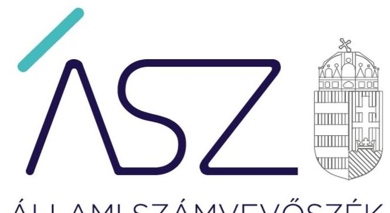
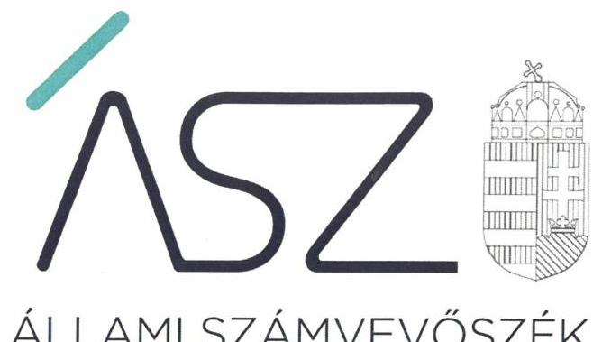
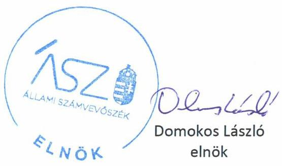

ÁLLAMI SZÁMVEVŐSZÉK

# JELENTÉS 

## Nem állami humánszolgáltatók ellenőrzése

A köznevelési és szociális humánszolgáltatást nyújtó intézmények, szolgáltatók államháztartáson kívüli fenntartói központi költségvetésből kapott támogatásai felhasználásának ellenőrzése - BOROSTYÁNKŐ Oktatási és Művészeti Alapítvány
2020.

20142
www.asz.hu

---

ÁLLAMI SZÁMVEVŐSZÉK

# JELENTÉS 

## Nem állami humánszolgáltatók ellenőrzése

A köznevelési és szociális humánszolgáltatást nyújtó intézmények, szolgáltatók államháztartáson kívüli fenntartói központi költségvetésből kapott támogatásai felhasználásának ellenőrzése - BOROSTYÁNKŐ Oktatási és Múvészeti Alapítvány
2020. 07. hó 24. nap

20142
www.asz.hu

---

# AZ ELLENŐRZÉST FELÜGYELTE: 

MAKKAI MÁRIA felügyeleti vezető

## AZ ELLENŐRZÉST VEZETTE ÉS A VÉGREHAJTÁSÁÉRT FELELŐS:

DR. NAGY JUDIT ellenőrzésvezető

A PROGRAM ÖSSZEÁLLÍTÁSÁÉRT FELELŐS:
FEKETE-NAGY ANDRÁS GÁBOR felelős vezető

IKTATÓSZÁM: EL-2785-001/2020.
TÉMASZÁM: 2523
ELLENŐRZÉS-AZONOSÍTÓ SZÁM: V-086723

---

# TARTALOMJEGYZÉK 

- ÖSSZEGZÉS ..... 5
- AZ ELLENŐRZÉS CÉLJA ..... 6
- AZ ELLENŐRZÉS TERÜLETE ..... 7
- AZ ELLENŐRZÉS HÁTTERE, INDOKOLTSÁGA ..... 8
- A JELENTÉS LÉNYEGES KÉRDÉSKÖREI ..... 9
- AZ ELLENŐRZÉS HATÓKÖRE ÉS MÓDSZEREI ..... 10
- MELLÉKLETEK ..... 13
I. sz. melléklet: Értelmező szótár ..... 13
- FÜGGELÉK: ÉSZREVÉTELEK ..... 15
- RÖVIDÍTÉSEK JEGYZÉKE ..... 17

---

.

---

# ÖSSZEGZÉS 

Az albertirsai székhelyű BOROSTYÁNKŐ Oktatási és Müvészeti Alapítvány 2016.2018. években nem biztosította a köznevelési közfeladatok ellátására kapott költségvetési támogatások felhasználásának ellenőrizhetőségét.

## Az ellenőrzés társadalmi indokoltsága

A köznevelési feladatok ellátása az Alaptörvényben meghatározott, a társadalom szempontjából fontos tevékenységek. Jogszabályok teszik lehetővé, hogy államháztartáson kívüli szervezetek - így például az egyházi fenntartók, alapítványok, gazdasági társaságok, egyesületek - által fenntartott intézmények is végezzenek köznevelési feladatokat. Mindehhez a központi költségvetés évente jelentős összegű támogatással járul hozzá. Az államháztartáson kívüli, humánszolgáltatást végző intézmények az igényelt közpénzekből társadalmilag hasznos, közösségteremtő, közérdekű, illetve közhasznú tevékenységet végeznek, illetve közfeladatokat látnak el. Az intézményfenntartók ellenőrzésével az Állami Számvevőszék hozzájárul ahhoz, hogy ezen közpénzeket az államháztartáson kívüli szervezetek is ellenőrizhető, átlátható és elszámoltatható módon használják fel a közfeladatok ellátása során. Az ellenőrzések célja továbbá, hogy a nyilvánosság és az igénybevevők megfelelő tájékoztatást kapjanak az államháztartáson kívüli közfeladatot ellátók múködéséről. Az ÁSZ ellenőrzései arra adnak választ, hogy az intézményfenntartók arra használták-e fel a közpénzeket, amire igényelték.

A szabályszerű gazdálkodás elengedhetetlen a közfeladat ellátás szakmai céljainak megvalósításához, valamint a társadalmi közbizalom fenntartásához.

## Megállapítások, következtetések

A BOROSTYÁNKŐ Oktatási és Művészeti Alapítvány közfeladatait, az általános iskolai nevelés-oktatást, fejlesztő ne-velés-oktatást, valamint a sajátos nevelési igényű gyermekeknek, tanulóknak az iskolai nevelését-oktatását önálló jogi személyiséggel rendelkező szervezetén keresztül látta el.

A BOROSTYÁNKŐ Oktatási és Művészeti Alapítvány a 2016.-2018. években a köznevelési feladat ellátásához kapcsolódó költségvetési támogatások felhasználását számviteli rendjében feladatonkénti bontásban elkülönítetten nem kezelte.

A BOROSTYÁNKŐ Oktatási és Művészeti Alapítvány a 2016.-2018. években a köznevelési közfeladat ellátására kapott költségvetési támogatás felhasználásának a 2000. évi C. törvény a számvitelről 161/A. § (2) bekezdésében előírt ellenőrizhetőségét nem biztosította. A nemzeti köznevelésről szóló törvény végrehajtásáról rendelkező 229/2012. (VIII. 28.) Korm. rendelet 37/G. § (1) bekezdésében foglalt szabályozás ellenére ugyanis nem gondoskodott a költségvetési támogatások felhasználásának alapfeladatonkénti bontásban elkülönített nyilvántartásáról, ezáltal nem biztosította, hogy a költségvetési támogatások elszámolására az adatok rendelkezésre álljanak.

A BOROSTYÁNKŐ Oktatási és Művészeti Alapítvány mindezek alapján az Alaptörvény 39. cikk (2) bekezdésében foglaltak ellenére a felhasznált közpénzekre vonatkozó gazdálkodása átláthatóságát nem biztosította. Ezáltal nem igazolta, hogy a központi költségvetési támogatást közoktatási közfeladat ellátására fordította.

---

# AZ ELLENŐRZÉS CÉLJA 

Az ellenőrzés célja annak értékelése, hogy a BOROSTYÁNKŐ Oktatási és Művészeti Alapítvány, mint nem állami, nem önkormányzati köznevelési intézményi fenntartónál a központi költségvetésből kapott támogatásainak felhasználása szabályszerű volt-e.

---

# **AZ ELLENŐRZÉS TERÜLETE**

## **BOROSTYÁNKŐ Oktatási és Művészeti Alapítvány**

Az albertírsai székhelyű BOROSTYÁNKŐ Oktatási és Művészeti Alapítványt egy magánszemély alapította 0,1 millió Ft induló vagyonnal 1998-ban, határozatlan időtartamra. A Fenntartó1 az Nkt.2 2. § (3) bekezdés bd) pontjában biztosított lehetőségével élve alapította és tartja fenn a BOROSTYÁNKŐ Oktatási és Művészeti Alapítvány Heuréka Általános Iskolája-t, mint köznevelési intézményt.

A Fenntartót a Bíróság3 1998. május 4-én vette nyilvántartásba AM 1561 nyilvántartási számon. A Fenntartó közhasznú tevékenysége általános iskolai nevelés-oktatást, fejlesztő nevelés-oktatást és azoknak a sajátos nevelési igényű gyermekeknek, tanulóknak az iskolai nevelését-oktatását foglalja magában, akik az erre a célra létrehozott nevelési-oktatási intézményben, iskolai osztályban eredményesebben foglalkoztathatók. A Fenntartó kezelő szerve a természetes személyekből álló három fős Kuratórium4 volt, melynek ellenőrzésére az alapító három tagú FB5-t hozott létre. A Kuratórium elnökének személye, továbbá az FB összetétele az ellenőrzött időszakban nem változott.

Az Intézmény6 alapfeladata a 2016.-2018. években az általános iskolai nevelés és oktatás volt. Az Intézménybe felvehető maximális tanulólétszám 150 fő, melyből 130 fő sajátos nevelési igényű tanuló volt.

A Fenntartó a köznevelési közfeladatok ellátásához a MÁK7 adatai alapján a 2016. évben 120,9 millió Ft, a 2017. évben 120,1 millió Ft, a 2018. évben 118,6 millió Ft költségvetési támogatásban részesült.

A Fenntartó a 2016.-2018. években vállalkozási tevékenységet nem folytatott, könyvvizsgálatra a Civilszr.1,2 előírása alapján nem volt kötelezett, könyvvizsgálót nem bízott meg.

---

# AZ ELLENŐRZÉS HÁTTERE, INDOKOLTSÁGA 

A köznevelési feladatokat ellátó nem állami intézményfenntartók részére közfeladataik ellátására évente jelentős összegű pénzügyi támogatást biztosítottak a mindenkori költségvetési törvények a bennük megfogalmazott feltételek mellett.

A felhasználható állami támogatások a Kvtv. ${ }^{9}$-ek szerinti előirányzata 2016.-2018. években együtt 574 Mrd Ft volt. A 2013. évben jelentős változások következtek be a normatív finanszírozás rendszerében. Az Országgyűlés elfogadta a nemzeti köznevelésről szóló 2011. évi CXC. törvényt, amely jelentősen átalakította a korábbi finanszírozási rendszert 2013. szeptemberétől. Az ellenőrzések indokoltságát az is alátámasztja, hogy az ÁSZ számos szervezetet még nem ellenőrzött ezen a területen.

Az ÁSZ stratégiájában foglaltak alapján az ellenőrzés a társadalom számára jelzi, hogy a közpénz államháztartáson kívüli felhasználása sem maradhat ellenőrizetlenül. Az államháztartáson kívülre nyújtott költségvetési támogatások ellenőrzésével az ÁSZ hozzájárul ahhoz, hogy a közpénzeket a nem állami fenntartók átlátható módon használják fel a közfeladatok ellátására kötött szerződésekben vállalt kötelezettségek teljesítése érdekében.

---

# A JELENTÉS LÉNYEGES KÉRDÉSKÖREI 

1. A köznevelési közfeladatot ellátó államháztartáson kívüli fenntartó szabályszerű müködési - és gazdálkodási környezet kialakításával megteremtette-e a költségvetési támogatások átlátható, elszámoltatható igénybevételének, felhasználásának feltételeit?
2. Az államháztartáson kívüli fenntartó az átvállalt köznevelési közfeladathoz biztositott költségvetési támogatásokat szabályszerűen fordította-e a humánszolgáltató intézménye/i müködtetésére?
3. Az államháztartáson kívüli fenntartó a köznevelési intézménye/i müködtetéséhez felhasznált közpénzekre vonatkozó gazdálkodásával a nyilvánosság előtt elszámolt-e, ennek érdekében ellenőrzési, értékelési és a külső ellenőrzésekkel kapcsolatos intézkedési feladatait szabályszerűen látta-e el?

---

# AZ ELLENŐRZÉS HATÓKÖRE ÉS MÓDSZEREI 

## Az ellenőrzés típusa

Megfelelőségi ellenőrzés.

## Az ellenőrzött időszak

A 2016. január 1-je és 2018. december 31-e közötti időszak.

## Az ellenőrzés tárgya

Az ellenőrzés a köznevelési humánszolgáltatási közfeladatokat ellátó államháztartáson kívüli fenntartók humánszolgáltatási közfeladatai ellátásához a központi költségvetésből kapott támogatásaik humánszolgáltatási közfeladatokra való fenntartó általi felhasználása szabályszerűségének értékelésére terjedt ki.

## Az ellenőrzött szervezet

BOROSTYÁNKŐ Oktatási és Művészeti Alapítvány

## Az ellenőrzés jogalapja

Az ellenőrzés jogszabályi alapját az ÁSZ tv. ${ }^{10} 1 . \S$ (3) bekezdése és az 5. § (3) bekezdése képezte.

## Az ellenőrzés módszerei

Az ÁSZ az ellenőrzést az ellenőrzési program szempontjai, kérdései, az ellenőrzött időszakban hatályos jogszabályok alapján, a nemzetközi standardokat irányadónak tekintve, az ellenőrzés szakmai szabályok és módszertanok figyelembe vételével rendelte végezni. A közpénzekkel való felelős gazdálkodás segítésére irányuló javaslatok kidolgozásakor a hatályos jogszabályok az Irányadóak.

Az ellenőrzés ideje alatt az ellenőrzött szervezettel történő kapcsolattartást az ÁSZ SZMSZ ${ }^{11}$-ének vonatkozó előírása biztosította.

Az ellenőrzési kérdések megválaszolásához szükséges bizonyítékok megszerzése az ellenőrzött által rendelkezésre bocsátott dokumentumokra, adatokra alapozva megfigyelés, szemle (szemrevételezés), kérdésfeltevés (információkérés), valamint elemző eljárással történt.

---

Az ellenőrzési bizonyítékként felhasználható adatforrások közé tartoztak egyrészt az ellenőrzési program részletes szempontjainál felsorolt adatforrások, másrészt minden - az ellenőrzés folyamán feltárt, az ellenőrzés szempontjából információt tartalmazó - dokumentum.

Az ellenőrzés lefolytatásához az ellenőrzött szervezet a kitöltött tanúsítványok, valamint az ÁSZ által kért dokumentumok elektronikus úton való megküldésével szolgáltatott adatokat, információkat. Az így rendelkezésre bocsátott adatok, információk és a tanúsítványok adatai valódiságának kontrollja az ellenőrzés keretében történt.

Az egységes értelmezést támogatta a program mellékletét képező fogalomtár és rövidítésjegyzék.

Az ÁSZ az ellenőrzést a köznevelési célú központi költségvetési támogatások igénylésével, felhasználásával, elszámolásával kapcsolatos feladatokat ellátó államháztartáson kívüli fenntartóknál/szervezeteinél végezte.

A köznevelési humánszolgáltatások központi költségvetési támogatásaival kapcsolatos, államháztartáson kívüli fenntartó jogszabályokban előírt feladatai betartása, továbbá a központi költségvetési támogatások szabályszerű nyilvántartása került ellenőrzésre a fenntartónál rendelkezésre álló nyilvántartások, beszámolók és egyéb dokumentumok alapján. Az ellenőrzés nem terjedt ki a köznevelési humánszolgáltatások központi költségvetési támogatásai igénylése, módosítása, elszámolása valódiságának, megalapozottságának, helyességének - sem a fenntartónál, sem a székhely intézményeinél való - értékelésére (mivel ennek felülvizsgálata, ellenőrzése a finanszírozó jogszabályban előírt feladata, határozatai kiadása előtt). Továbbá nem terjedt ki az ellenőrzés e források, intézmények általi szabályszerű felhasználásának értékelésére.

---

.

---

# MELLÉKLETEK 

- I. SZ. MELLÉKLET: ÉRTELMEZŐ SZÓTÁR
civil szervezet
humánszolgáltatás
költségvetési támogatás
köznevelési közfeladat
köznevelési intézmény

A civil szervezet a civil társaság, a Magyarországon nyilvántartásba vett egyesület (a párt, a szakszervezet és a kölcsönös biztosító egyesület kivételével), a közalapítvány és a pártalapítvány kivételével az alapítvány (Civilt tv. 6. § (1)-(2) bekezdései)
Külön törvényben meghatározott szociális, gyermekjóléti, gyermekvédelmi, közoktatási, felsőoktatási, kulturális közfeladatok (2015. évi Kvtv. 43. § (1), (4) bekezdés, 1. számú melléklet XX/20/2/3. jogcím csoport, 19. alcím, 2016. évi Kvtv. 41. § (1), (4) bekezdés, 1. számú melléklet XX/20/2/3. jogcím csoport, 19. alcím, 2017. évi Kvtv. 41. § (1), (4) bekezdés, 1. számú melléklet XX/20/2/3. jogcím csoport, 19. alcím)
A társadalombiztosítás pénzügyi alapjai kivételével az államháztartás központi alrendszeréből ellenérték nélkül, pénzben nyújtott támogatások, ide nem értve
f) a szociális igazgatásról és szociális ellátásokról szóló törvény, valamint a gyermekek védelméről és a gyámügyi igazgatásról szóló törvény szerinti pénzbeli és természetbeni szociális és gyermekvédelmi ellátásokat (Áht. ${ }^{12}$ 1. § 14. pont)
A költségvetési törvényben megállapított támogatás többek között: Átlagbéralapú támogatást állapít meg a nevelési-oktatási, valamint pedagógiai szakszolgálati intézményt fenntartó nemzetiségi önkormányzat, az egyházi és magán köznevelési intézmény fenntartója részére az általuk fenntartott nevelési-oktatási intézményben, továbbá pedagógiai szakszolgálati intézményben pedagógus és - a (3) bekezdés kivételével - a nevelő-oktató munkát közvetlenül segítő munkakörben foglalkoztatottak után a 7. melléklet I. pontjában meghatározott jogosultak után, az őket ott megillető mértékek szerint. Múködési támogatást állapít meg a nemzetiségi önkormányzat vagy az egyházi jogi személy által fenntartott nevelési-oktatási intézményekben ellátott, továbbá a pedagógiai szakszolgálati intézményekben gyógypedagógiai tanácsadásban, korai fejlesztésben, oktatásban és gondozásban, valamint a fejlesztő nevelésben részt vevő gyermekekre, tanulókra tekintettel a nemzetiségi önkormányzat és a bevett egyház részére a 7. melléklet II. pontja szerint (2015. évi Kvtv., 2016. évi Kvtv., 2017. évi Kvtv.)

A köznevelési intézmény alapító okiratában foglalt feladat: óvodai nevelés, nemzetiséghez tartozók óvodai nevelése, általános iskolai nevelés-oktatás, nemzetiséghez tartozók általános iskolai nevelése-oktatása, kollégiumi ellátás, nemzetiségi kollégiumi ellátás, gimnáziumi nevelés-oktatás, szakközépiskolai nevelés-oktatás, szakiskolai nevelés-oktatás, nemzetiség gimnáziumi nevelés-oktatása, nemzetiség szakközépiskolai nevelés-oktatása, nemzetiség szakiskolai nevelés-oktatása, köznevelési Hídprogramok keretében folyó nevelés-oktatás, felnőttoktatás, alapfokú múvészetoktatás, fejlesztő nevelés, fejlesztő nevelés-oktatás, pedagógiai szakszolgálati feladat, a többi gyermekkel, tanulóval együtt nevelhető, oktatható sajátos nevelési igényű gyermekek, tanulók óvodai nevelése és iskolai nevelése-oktatása, azoknak a sajátos nevelési igényű gyermekeknek, tanulóknak az óvodai, iskolai, kollégiumi ellátása, akik a többi gyermekkel, tanulóval nem foglalkoztathatók együtt, a gyermekgyógyüdülőkben, egészségügyi intézményekben, rehabilitációs intézményekben tartós gyógykezelés alatt álló gyermekek tankötelezettségének teljesítéséhez szükséges oktatás, pedagógiai-szakmai szolgáltatás. (Nkt. 4. § 14a.)
A nevelési-oktatási intézmény, pedagógiai szakszolgálati intézmény, pedagógiaiszakmai szolgáltatást nyújtó intézmény.

---

székhely
telephely
nem állami, nem önkormányzati (államháztartáson kívüli) intézmény fenntartó

Az alapító okiratban, szakmai alapdokumentumban meghatározott, a köznevelési intézmény alapfeladatának ellátását szolgáló feladat ellátási hely, ahol képviseleti jogának gyakorlására jogosult vezetőjének munkahelye található. (Nkt. 4. § 27. pont) A székhelyen kívül múködő feladat ellátási hely. (Nkt. 4. § 34. pont)
A köznevelési közfeladatokat/humánszolgáltatásokat ellátó Intézményt fenntartó egyházi jogi személy, társadalmi szervezet, alapítvány, közalapítvány, civil szervezet, országos nemzetiségi önkormányzat, nonprofit gazdasági társaság, gazdasági társaság és a humánszolgáltatást alaptevékenységként végző, Szja tv. hatálya alá tartozó egyéni vállalkozó. (2015. évi Kvtv. 43. § (1) bekezdés, 2016. évi Kvtv. 41. § (1) bekezdés, 2017. évi Kvtv. 41. § (1) bekezdés)

---

# FÜGGELÉK: ÉSZREVÉTELEK 

A jelentéstervezetet a Számvevőszék 15 napos észrevételezésre megküldte az ellenőrzött szervezet vezetőjének az ÁSZ tv. 29. §* (1) bekezdése előírásának megfelelően.

A BOROSTYÁNKŐ Oktatási és Müvészeti Alapítvány kuratóriumi elnöke észrevételt tett a jelentéstervezetben foglalt megállapításokra. Az észrevételben az ellenőrzött szervezet vezetője köszönetét fejezi ki ,,az ellenőrzés során - a gazdálkodással és a pénzügyi nyilvántartásokkal összefüggésben - tett szakszerü és segitő" megállapításokért. Megküldték továbbá, az Alapítvány kuratóriumi határozatba foglalt, a szabálytalanságok megszüntetése érdekében megfogalmazott előzetes intézkedéseit. Összefoglalóan az észrevétel rögzíti, hogy az Alapítvány mindent meg kíván tenni a költségvetési támogatások átlátható, elszámoltatható igénybevétele és felhasználásának feltételei biztositása érdekében.

Az Állami Számvevőszék az észrevételre adott válaszában jelezte, hogy az észrevételben foglaltak megerősítik az Állami Számvevőszék ellenőrzési megállapításait, az alapján a jelentéstervezet módosítása nem indokolt.

[^0]
[^0]:    * 29. § (1) Az Állami Számvevőszék az ellenőrzési megállapításait megküldi az ellenőrzött szervezet vezetőjének vagy az általa megbízott személynek, és annak, akinek személyes felelősségét állapította meg.
    (2) Az ellenőrzött szervezet vezetője és a felelősként megjelölt személy az ellenőrzés megállapításaira tizenöt napon belül írásban észrevételt tehet.
    (3) Az Állami Számvevőszék az észrevételre a beérkezésétől számított harminc napon belül írásban válaszol. A figyelembe nem vett észrevételeket köteles a jelentésben feltüntetni, és megindokolni, hogy azokat miért nem fogadta el.

---

.

---

# RÖVIDÍTÉSEK JEGYZÉKE 

${ }^{1}$ Fenntartó
${ }^{2}$ Nkt.
${ }^{3}$ Bíróság
${ }^{4}$ Kuratórium
${ }^{5} \mathrm{FB}$
${ }^{6}$ Intézmény
${ }^{7}$ MÁK
${ }^{8}$ Civilszr. 1

Civilszr. 2
${ }^{9}$ Kvtv.-ek
${ }^{10}$ ÁSZ tv.
${ }^{11}$ ÁSZ SZMSZ
${ }^{12}$ Áht.

BOROSTYÁNKŐ Oktatási és Művészeti Alapítvány
2011. évi CXC. törvény a nemzeti köznevelésről
(hatályos: 2011. december 29-étől)
Pest Megyei Bíróság
BOROSTYÁNKŐ Oktatási és Művészeti Alapítvány Kuratóriuma
BOROSTYÁNKŐ Oktatási és Művészeti Alapítvány Felügyelő Bizottsága
BOROSTYÁNKŐ Oktatási és Művészeti Alapítvány Heuréka Általános Iskolája
Magyar Államkincstár
224/2000. (XII. 19.) Korm. rendelet a számviteli törvény szerinti egyes egyéb szervezetek beszámoló készítési és könyvvezetési kötelezettségének sajátosságairól
479/2016. (XII. 28.) Korm. rendelet a számviteli törvény szerinti egyes egyéb szervezetek beszámoló készítési és könyvvezetési kötelezettségének sajátosságairól
Magyarország 2015. évi központi költségvetéséről szóló 2014. évi C. törvény (hatályos: 2015. január 1. és 2018. december 31. között)
Magyarország 2016. évi központi költségvetéséről szóló 2015. évi C. törvény (hatályos: 2016. január 1. és 2019. december 31. között)
Magyarország 2017. évi központi költségvetéséről szóló 2016. évi XC. törvény (hatályos: 2016. november 1-től)
Magyarország 2018. évi központi költségvetéséről szóló 2017. évi C. törvény (hatályos: 2017. november 1.-től)
2011. évi LXVI. tv. az Állami Számvevőszékről (hatályos: 2011. július 1.-jétől) Az Állami Számvevőszék elnökének 3/2019. (XII. 23.) ÁSZ utasítása az Állami Számvevőszék Szervezeti és Múködési Szabályzatáról (hatályos: 2020. január 1-jétől)
2011. évi CXCV. törvény az államháztartásról (hatályos: 2012. január 1-jétől)

---

# ASZ 

ALLAMI SZAMVEVOSZEK
1052 Budapest, Apáczai Cs. J. u. 10. I 1364 Budapest 4. Pf. 54 TEL: +36 14849100
email: szamvevoszek@asz.hu
web: www.asz.hu | www.aszhirportal.hu