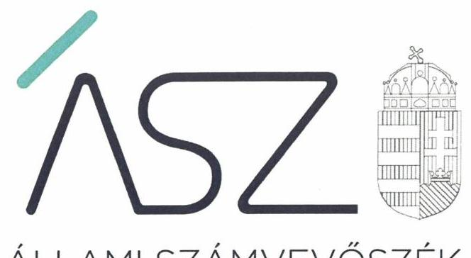
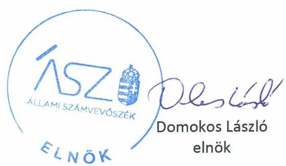
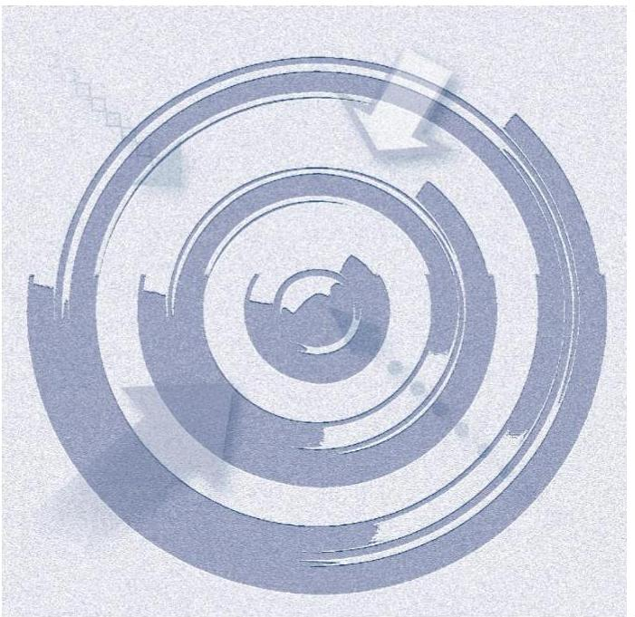
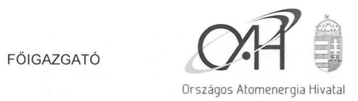
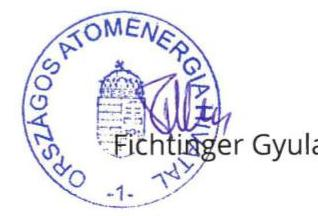
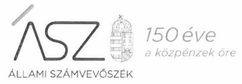
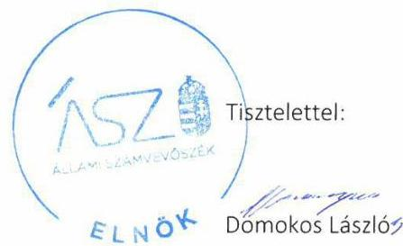
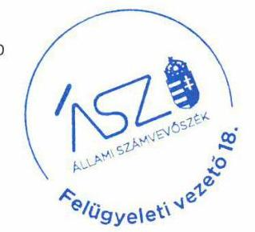

ÁLLAMI SZÁMVEVŐSZÉK

# JELENTÉS 

## Központi költségvetési szervek ellenőrzése

Országos Atomenergia Hivatal
2020.

20145
www.asz.hu

---

ÁLLAMI SZÁMVEVŐSZÉK

# JELENTÉS 

## Központi költségvetési szervek ellenőrzése

Országos Atomenergia Hivatal
2020. 07 hó 24 nap

20145
www.asz.hu

---

# AZ ELLENŐRZÉST FELÜGYELTE: 

MAKKAI MÁRIA felügyeleti vezető

## AZ ELLENŐRZÉST VEZETTE ÉS A VÉGREHAJTÁSÁÉRT FELELŐS:

JANIK JÓZSEF ellenőrzésvezető

A PROGRAM ÖSSZEÁLLÍTÁSÁÉRT FELELŐS:
SZALAY NAGY JÁNOS projektvezető

IKTATÓSZÁM: EL-2792-001/2020.
TÉMASZÁM: 2450
ELLENŐRZÉS-AZONOSÍTÓ SZÁM: V0791106
Jelentéseink az Országgyúlés számítógépes hálózatán és az interneten a www.asz.hu címen is olvashatóak.

---

# TARTALOMJEGYZÉK 

■ ÖSSZEGZÉS ..... 5
■ AZ ELLENŐRZÉS CÉLJA ..... 6
■ AZ ELLENŐRZÉS TERÜLETE ..... 7
■ AZ ELLENŐRZÉS HÁTTERE, INDOKOLTSÁGA ..... 8
■ A JELENTÉS LÉNYEGES KÉRDÉSKÖREI ..... 9
■ AZ ELLENŐRZÉS HATÓKÖRE ÉS MÓDSZEREI ..... 10
■ MEGÁLLAPÍTÁSOK ..... 13
■ JAVASLATOK ..... 17
■ MELLÉKLETEK ..... 19
I. sz. melléklet: Értelmező szótár ..... 19
■ FÜGGELÉK: ÉSZREVÉTELEK ..... 21
■ RÖVIDÍTÉSEK JEGYZÉKE ..... 29

---

.

---

# ÖSSZEGZÉS 

Az Országos Atomenergia Hivatal a szabályszerű és szabályozott müködési környezetet a belső kontrollrendszer keretében kialakította, azonban a kontrolltevékenységek gyakorlása nem volt szabályszerű. Az integritás kontrollok megfelelően támogatták a korrupciós kockázatok kezelését. A nemzeti vagyon megóvása, védelme, átlátható nyilvántartása biztositott volt, a szervezet használatában, vagyonkezelésében lévő vagyonnal elszámoltak.

## Az ellenőrzés társadalmi indokoltsága

Az államháztartás központi alrendszerébe tartozó szervezetek alapvető rendeltetése a társadalom javát szolgáló közfeladatok ellátásának hatékony, számon kérhető, pazarlásmentes biztosítása. A közpénzek felhasználásában meghatározó arányt képviselő központi költségvetési szervek gazdálkodásuk révén jelentős hatást gyakorolhatnak a költségvetés egyensúlyának fenntartására, a közpénzek felelős, takarékos felhasználására, a nemzeti vagyon értékének megóvására, gyarapítására, társadalmi érdeknek megfelelő hasznosítására.

A szabályszerű, korrupciómentes, átlátható működés és az elszámoltatható közpénzfelhasználás alapfeltétele az integritás kontrollokat is magában foglaló belső kontrollrendszer szabályszerű kiépítettsége, a kontrollok érvényesítése, a közfeladat ellátását szolgáló vagyonelemek valósághű számbavétele, értékelése, napra kész nyilvántartása.

Indokolt ezért, hogy az Állami Számvevőszék a központi költségvetési szervek belső kontrollrendszerét és vagyongazdálkodását rendszeresen ellenőrizze, értékelve a működésük irányítottságát, korrupció elleni védettségét, továbbá, hogy vagyongazdálkodásuk elszámoltatható volt-e és hozzájárult-e a kiegyensúlyozott, átlátható és fenntartható költségvetési gazdálkodás Alaptörvényben meghatározott elvének érvényesítéséhez.

## Főbb megállapítások, következtetések, javaslatok

Az Országos Atomenergia Hivatalnál a kontrollkörnyezet kialakítása a jogszabályi előírásokkal összhangban történt, rendelkeztek az előírások szerinti szervezeti, gazdálkodási és számviteli szabályozásokkal.

A kockázatkezelési, a nyomon követési, a belső ellenőrzési és az információs és kommunikációs rendszer kialakítása és müködtetése szabályszerű volt.

A jogszabályok és a belső szabályozás előírásaival ellentétben elmulasztották a gazdálkodási jogkörök kontrolltevékenységek végzésére jogosult gyakorlóinak írásban történő, szabályszerű felhatalmazását, kijelölését, továbbá a kötelezettségvállalások, más fizetési kötelezettségek nyilvántartása nem felelt meg a jogszabályi előírásoknak, így nem támogatta a kontrolltevékenységek szabályszerű elvégzését.

A szervezet működése során az integritás követelményei érvényesültek, az integritás kontrollrendszer kiépítettsége megfelelt a jogszabályoknak.

Az Országos Atomenergia Hivatal a nemzeti vagyont szabályszerűen használta, a mérlegben kimutatott eszközök és források értékelése és azok leltárral történő alátámasztása összhangban volt a jogszabályi előírásokkal, a vagyon értékében és mennyiségében bekövetkezett változásokat szabályszerűen mutatták ki. Az átláthatóság és elszámoltathatóság követelményeit a vagyongazdálkodás során érvényesítették.

Az Állami Számvevőszék a jelentésben foglalt megállapítások alapján az Országos Atomenergia Hivatal főigazgatójának három javaslatot fogalmazott meg.

---

# AZ ELLENŐRZÉS CÉLJA

**AZ ELLENŐRZÉS CÉLJA** annak megítélése volt, hogy az Országos Atomenergia Hivatalra vonatkozó irányító szervi feladatellátás a jogszabályi előírások betartásával történt-e; a belső kontrollrendszer kialakítása és működtetése biztosította-e az átlátható, szabályszerű, gazdaságos, hatékony és eredményes gazdálkodás feltételeit. Kiépítették-e a korrupciós kockázatok kezelését szolgáló integritás kontrollokat, érvényesült-e az integritás szemlélet. A vagyongazdálkodás során biztosított volt-e a nemzeti vagyon értékének megőrzése, védelme és szabályszerű kezelése.

---

# **AZ ELLENŐRZÉS TERÜLETE**

## **Országos Atomenergia Hivatal**

Az Országos Atomenergia Hivatalt az Országgyűlés 1991. január 1-jén alapította, irányító szerve Magyarország Kormánya. Felügyeletét a kormány kijelölt tagja, 2018. május 22-e óta az innovációs és technológiai miniszter látta el, ezt megelőzően a nemzeti fejlesztési miniszter volt a felügyeletért felelős kormánytag.

Az OAH¹ alapító okirat szerinti közfeladata az atomenergia alkalmazásában és fejlesztésében érdekelt szervektől és szervezetektől függetlenül ellátni és összehangolni az atomenergia biztonságos alkalmazásával (a nukleáris anyagok és létesítmények biztonságával, nukleáris veszélykezeléssel, nukleáris védettséggel, az atomenergia békés célú felhasználásával, és az ionizáló sugárzás elleni védelemmel) kapcsolatos hatósági feladatokat. Ennek keretében elvégzi az atomenergia alkalmazásával összefüggő jogszabályokkal kapcsolatos javaslatok kidolgozását, szabályozások, hatósági előírások előzetes véleményezését, valamint tájékoztatási tevékenységet lát el.

Az OAH a kormányzati igazgatásról szóló 2018. évi CXXV. törvény 2. § (3) bekezdés b) pontja alapján a központi kormányzati igazgatási szervek csoportjába tartozó kormányzati főhivatalként működik. Önállóan gazdálkodó költségvetési szerv, a főigazgató vezeti, szervezete három igazgatóságra és főosztályokra tagozódik. Szervezeti változás az ellenőrzött időszakban nem volt.

Az intézmény vagyonának értéke az éves beszámolók adatai alapján 2015. és 2018. között 1 545,0 millió Ft-ról 2 439,9 millió Ft-ra növekedett. A bevételek, amelyek döntő részben közhatalmi bevételként beszedett felügyeleti díjakból származtak, éves szinten 2 537,4 millió Ft és 2 854,5 millió Ft közötti összegeket tettek ki az ellenőrzött időszak folyamán.

---

# AZ ELLENŐRZÉS HÁTTERE, INDOKOLTSÁGA 

A belső kontrollrendszer szabályszerű kialakítása és működtetése a közpénzek, a közvagyon átlátható, szabályos, gazdaságos, hatékony és eredményes felhasználásának alapfeltétele. A belső kontrollrendszer azt a célt szolgálja, hogy a költségvetési szervek múködésük és gazdálkodásuk során a tevékenységeket szabályszerűen hajtsák végre, teljesítsék elszámolási kötelezettségeiket és megvédjék az erőforrásokat a veszteségektől, a károktól és a nem rendeltetésszerű használattól. A belső kontrollrendszer magában foglalja mindazon elveket, eljárásokat és belső szabályzatokat, amelyek biztosítják, hogy a költségvetési szerv múködése szabályszerű és szabályozott legyen, valamennyi tevékenysége és célja összhangban álljon a gazdaságosság, hatékonyság és eredményesség követelményeivel, az eszközökkel és forrásokkal való gazdálkodásban ne kerüljön sor pazarlásra, visszaélésre, rendeltetésellenes felhasználásra. Megfelelő, pontos és naprakész információk álljanak rendelkezésre a költségvetési szerv múködésével kapcsolatosan, és a belső kontrollrendszer harmonizációjára, összehangolására vonatkozó jogszabályok végrehajtásra kerüljenek. Az integritás kontrollok kiépítése, erősítése a szervezet korrupciós kockázatainak kezelését szolgálja. A teljesítménykövetelmények meghatározása és múködtetése megalapozhatja a központi költségvetési szervnél a teljesítményellenőrzés lefolytatását.

Az államháztartás központi alrendszerébe tartozó szervezet vagyona a nemzeti vagyon része, és az Alaptörvény is rögzíti, hogy a vagyonnal való gazdálkodás célja a közérdek szolgálata. Az ÁSZ² szisztematikusan ellenőrzi a költségvetési szervek gazdálkodását, múködését, hogy az ellenőrzések megállapításaival támogassa az ellenőrzött szervezetek szabályszerű gazdálkodását, javaslataival elősegítse az Alaptörvényben megfogalmazott alapvetések érvényesülését a mindennapi életben a szervezetek szintjén.

Az ellenőrzések során az ÁSZ „jó gyakorlatokat" is azonosíthat, melyeket tanácsadó funkciója keretében szélesebb körben is megismertethet az érintettekkel, ezáltal is hozzájárulva a költségvetési rendszer szabályozott, átlátható, elszámoltatható és fenntartható múködéséhez.

---

# A JELENTÉS LÉNYEGES KÉRDÉSKÖREI 

1. Szabályszerú volt-e a központi költségvetési szerv belső kontrollrendszerének kialakítása és müködtetése?
2. A központi költségvetési szervnél kiépítették-e és erősítették-e az integritás kontrollrendszerét?
3. A központi költségvetési szerv biztositotta-e a nemzeti vagyon védelmét és szabályszerú kimutatását?
4. A központi költségvetési szervnél kialakították-e a teljesítmény mérésére alkalmas követelményeket?

---

# AZ ELLENŐRZÉS HATÓKÖRE ÉS MÓDSZEREI 

## Az ellenőrzés típusa

Megfelelőségi ellenőrzés.

## Az ellenőrzött időszak

2015. január 1. - 2018. december 31.

## Az ellenőrzés tárgya

A költségvetési szerv pénzügyi gazdálkodása a 2015-2016. évekre vonatkozóan. A költségvetési szerv belső kontroll rendszerének kialakítása és müködtetése, továbbá vagyongazdálkodása a 2015-2018. években. Az integritás kontrollok kiépítettsége, az integritás érvényesülése, valamint a teljesítmény mérésére alkalmas követelmények kialakítása a 2017-2018. évek tekintetében.

A vagyongazdálkodás ellenőrzésének keretében a vagyongazdálkodás feltételeinek kialakítása, annak szabályszerűsége, az elszámoltathatóság biztosítása a szabályozás szintjén. A vagyonváltozást eredményező döntések, a vagyonban bekövetkezett változások végrehajtásának, nyilvántartásba vételének, elszámolásának szabályszerűsége. A költségvetési szerv könyveiben, mérlegében kimutatott nemzeti vagyon nyilvántartásának szabályszerűsége, ennek keretében a nemzeti vagyonnal történő rendelkezés, a vagyonmozgások, a vagyon nyilvántartásba vétele, értékelése és a mérleg leltárral való alátámasztása.

## Az ellenőrzött szervezet

Országos Atomenergia Hivatal

## Az ellenőrzés jogalapja

Az ellenőrzés jogszabályi alapját az ÁSZ tv. ${ }^{3} 1$. § (3) bekezdés, 5. § (2)-(4) és (6) bekezdései, valamint az Áht. ${ }^{4} 61 . \S$ (2) bekezdésének előírásai képezték.

---

# Az ellenőrzés módszerei 

Az ellenőrzést a szakmai program szempontjai, az ellenőrzött időszakban hatályos jogszabályok, az ellenőrzés szakmai szabályai, és a jelen ellenőrzésre irányadó ÁSZ módszertanok figyelembevételével végezte az ÁSZ.

Az ellenőrzés ideje alatt az ellenőrzött szervezettel a kapcsolattartás biztosítása az ÁSZ-SZMSZ ${ }^{5}$ vonatkozó előírásai alapján történt.

Az ellenőrzési kérdések megválaszolásához szükséges bizonyítékok megszerzésére az ellenőrzött által rendelkezésre bocsátott dokumentumokra, adatokra alapozva megfigyelés, szemle (szemrevételezés), kérdésfeltevés (információkérés), mintavételezés, valamint elemző eljárás útján került sor.

Az ellenőrzési bizonyítékként felhasználható adatforrások közé tartoztak egyrészt a szakmai program részletes szempontjainál felsorolt adatforrások, másrészt minden egyéb - az ellenőrzés folyamán feltárt, az ellenőrzés szempontjából információt tartalmazó - dokumentum.

Az ellenőrzés lefolytatásához az ellenőrzött szervezet a tanúsítványok kitöltésével, valamint az ÁSZ által kért dokumentumok megküldésével szolgáltatott adatokat, amelyek valódiságát és teljes körűségét az ellenőrzött szervezet vezetője által tett teljességi és hitelességi nyilatkozat igazolta. Az így rendelkezésre bocsátott adatok, információk kontrollja az ellenőrzés keretében történt.

A belső kontrollrendszer egyes pilléreinek kialakítására és működtetésére vonatkozó értékelés:
$\longrightarrow$ „szabályszerü", amennyiben az értékelt területen az elért „igen" válaszok százalékban kifejezett, egész számra kerekített aránya legalább $85 \%$ volt,
$\longrightarrow$ „nem szabályszerű", ha nem érte el a $85 \%$-ot.
A belső kontrollrendszer összesített értékelése (a kontrollrendszer egésze) esetében a „szabályszerű" értékelés feltétele, hogy egyik kontrollterület sem kaphat „nem szabályszerű" értékelést.

A kiadások és bevételek ellenőrzésére 2015-2017. év vonatkozásában került sor. A kiadások (külső személyi juttatások, felhalmozási kiadások, dologi kiadások) és bevételek (értékesítésből és bérbeadásból származó bevételek) esetében az ellenőrzés azokra a legnagyobb értékű tételekre, a lényeges sokaságra terjedt ki, melyek összértéke elérte a teljes sokaság összértékének 50\%-át. A kiadások és bevételek elszámolásának szabályszerűsége a lényeges sokaságból véletlen mintavételi eljárással kiválasztott tételek alapján került ellenőrzésre. Azokban az esetekben, ahol a lényeges sokaság elemszáma kisebb volt, mint az előírt minta-elemszám, a lényeges sokaság teljes körű ellenőrzésére került sor.

A 2017. évi beruházások, felújítások végrehajtásának, valamint a feladatellátást szolgáló állami vagyontárgyak használatának és év végi értékelésének szabályszerűségét a teljes sokaságból véletlen mintavétellel kiválasztott tételek alapján ellenőrizte az ÁSZ.

A 2018. évi vagyonnövekedések és vagyoncsökkenések elszámolásainak szabályszerűsége értékeléséhez tételes ellenőrzésre került sor.

---

A mintavétellel ellenőrzött területek esetében minden egyes tétel vonatkozásában a használat, elszámolás és értékelés szabályszerűségére vonatkozó kérdéseket tett fel az ÁSZ. „Szabályszerű" értékelést kapott egy ellenőrzött terület, amennyiben 95\%-os bizonyossággal az ellenőrzött sokaságban az átlagos hibaarány legfeljebb 10\% volt, „nem szabályszerű" értékelést, amennyiben 10\%-nál magasabb arányt képviselt.

Abban az esetben, ha az ellenőrzött sokaság tekintetében a 10\%-os hibaarányhoz való viszony megítélésének megbízhatósága nem érte el a 95\%-ot, annak elérése érdekében az értékelés további szempontokkal került kiegészítésre, figyelembe véve a feltárt hibák értékét is.

A 2018. év tekintetében az integritás kontrollok megfelelőségét és az integritás érvényesülését az ellenőrzött szervezet által szolgáltatott ellenőrzési bizonyítékok alapján értékelte az ÁSZ.

---

# 1. Szabályszerú volt-e a központi költségvetési szerv belső kontrollrendszerének kialakítása és múködtetése? 

## Összegző megállapítás

### 1.1. számú megállapítás

### 1.2. számú megállapítás

Az OAH-nál a belső kontrollrendszer kialakítása és múködtetése nem volt szabályszerű.

A szabályszerű kontrollkörnyezet biztosított volt.
A kontrollkörnyezet kialakítása a jogszabályi előírásokkal összhangban történt. Az OAH SZMSZ-ét az Áht., Ávr. ${ }^{6}$ és a Bkr. ${ }^{7}$ előírásaival összhangban alakították ki. A jogszabályi előírások szerinti tartalommal készítették el a számviteli politikát, az eszközök és a források leltárkészítési és leltározási szabályzatát, az eszközök és források értékelési szabályzatát, és a pénzkezelési szabályzatot.

Az integrált kockázatkezelési rendszert szabályszerűen alakították ki és múködtették.

A kockázatkezelési rendszer kereteit meghatározó kockázatkezelési szabályzat az integrált kockázatkezelési rendszerre vonatkozó előírásokat a jogszabályi rendelkezésekkel összhangban tartalmazta.

Felmérték és értékelték az OAH gazdálkodásában és tevékenységében rejlő, szervezeti célokkal összefüggő kockázatokat, meghatározták az egyes kockázatokkal kapcsolatos intézkedéseket, valamint azok végrehajtása folyamatos nyomon követésének módját.

Az OAH az Int.-ben ${ }^{8}$ foglalt előírásokkal összhangban rendelkezett a szervezet múködésével összefüggő integritási és korrupciós kockázatokra vonatkozó bejelentések fogadására és kivizsgálására vonatkozó belső szabályzattal.

Az információs és kommunikációs rendszer kialakítása szabályszerű volt.

Az információs és kommunikációs rendszer keretében az OAH vezetője az Info tv. ${ }^{9}$ és a Bkr. előírásai szerint kialakította az adatvédelmi és adatbiztonsági szabályzatot, az iratkezelési szabályzat a jogszabályi rendelkezésekkel összhangban állt. Szabályozták a kötelezően közzéteendő adatok nyilvánosságra hozatalának rendjét, valamint egyes adatok elektronikus közzétételét, a közérdekú adatok megismerésére irányuló igények teljesítésének rendjét az Info tv.-ben és az Ávr.-ben foglaltak szerint. Az OAH a külső kapcsolattartásra vonatkozóan szabályozta a tájékoztatási tevékenységet, valamint a nukleáris események információcseréjét.

---

1.4. számú megállapítás

Kialakították és szabályszerűen működtették a szervezet tevékenységének, a célok megvalósításának folyamatos és eseti nyomon követését biztosító rendszerét, valamint a belső ellenőrzést.

A nyomon követési rendszert és a belső ellenőrzést az OAH a Bkr. szerint kialakította és szabályszerűen működtette. Az OAH az általa kidolgozott mutatószámok alapján értékelte tevékenységét.

Az OAH vezetője a Bkr. 1. számú melléklete szerinti nyilatkozatban értékelte a szervezet belső kontrollrendszerének minőségét, melyet a költségvetési beszámolóval egyidejűleg megküldött az irányító szervnek a Bkr. előírása szerint.
1.5. számú megállapítás

A kontrolltevékenység gyakorlása és múködtetése nem volt szabályszerű.

Az OAH-nál az Áht. 36. § (7), 38.§ (2) bekezdése, az Ávr. 52. § (1) bekezdés a) pontja és 57. § (4) bekezdése, valamint az OAH gazdálkodási rendjéről szóló belső szabályzat előírásaival ellentétben a gazdálkodási jogkörök gyakorlóinak írásban történő szabályszerű felhatalmazását, kijelölését nem végezték el. A jogszabályi előírásokkal összhangban álló, írásos kijelölés hiányában a kontrolltevékenységek gyakorlása nem volt szabályszerű.

A kötelezettségvállalások, más fizetési kötelezettségek nyilvántartása nem támogatta a kontrolltevékenységek szabályszerű elvégzését. 2015-2016-ban az Áhsz. ${ }^{10}$ 39. § (1) bekezdésében előírtak ellenére a kötelezettségvállalások nyilvántartását nem vezették, 2017-ben szabályszerűen vezették. 2018-ban a kötelezettségvállalások nyilvántartása nem volt szabályszerű, mivel az Áhsz. 39. § (3) bekezdésében foglaltakkal ellentétben nem tartalmazta a 14. melléklet II. 4. a), b), c) és g) pontjaiban előírtak közül
$\longrightarrow$ a kötelezettségvállalást tanúsító dokumentum megnevezését, ik-tató- vagy érkeztető számát;
$\longrightarrow$ a jogosult azonosításához szükséges adatokat;
$\longrightarrow$ a pénzügyi teljesítések egységes rovatrend szerint besorolását, az utalványozás Ávr. 59. § (2) bekezdése szerinti dokumentumának azonosításához szükséges adatokat.

# 2. A központi költségvetési szervnél kiépítették-e és erősítették-e az integritás kontrollrendszerét? 

## Összegző megállapítás

Az OAH-nál az integritás kontrollok kiépítése és működtetése megfelelő volt.

Az OAH-nál az integritás követelményrendszere érvényesült, az integritás kontrollrendszer kiépítettsége megfelelő volt, a Bkr. és az Int. szerinti kontrollok kiépítettsége és működtetése támogatta a szervezet integritás elvű működését. A szervezet rendszeresen végzett kockázatelemzést, amelynek részét képezte a korrupciós kockázatelemzés.

---

Az OAH az alapvető integritás kontrollok megfelelő érvényesítése mellett a jogszabályok által kötelezően elő nem írt integritást erősítő kontrollokat alacsony szinten múködtette, azok tekintetében további előrelépés lehetséges.

# 3. A központi költségvetési szerv biztosította-e a nemzeti vagyon védelmét és szabályszerű kimutatását? 

## Összegző megállapítás

Az OAH vagyongazdálkodása szabályszerű volt, a nemzeti vagyon védelmét és szabályszerű kimutatását biztosították.

### 3.1. számú megállapítás

A vagyongazdálkodás feltételeit szabályszerűen alakították ki.
Az OAH rendelkezett a Számv. tv. ${ }^{11}$-ben előírt számviteli politikával, és az annak keretében elkészítendő, a gazdálkodás alapjait képező szabályzatokkal.

Az OAH az Nvtv. ${ }^{12}$ és a Vtv. ${ }^{13}$ előírásainak megfelelően vagyonkezelési szerződésekkel rendelkezett, a nemzeti vagyont szabályszerűen használta, a vagyontárgyak felett a tulajdonosi jogokat az MNV Zrt. gyakorolta.

### 3.2. számú megállapítás

A nemzeti vagyon változásának elszámolása szabályszerűen történt.

Az OAH a Vtv. előírásaival összhangban kezelt vagyonnal rendelkezett, a nemzeti vagyonba tartozó befektetett eszközökről vezetett nyilvántartás a beszámoló adatait alátámasztotta.

A mérlegben kimutatott eszközök és források értékelése és azok leltárral történő alátámasztása a jogszabályok és belső szabályzatok előírása szerint történt. Az OAH a könyveiben a vagyon értékében és mennyiségében bekövetkezett változásokat szabályszerűen mutatta ki.

Az OAH a vagyonnövekedéseket és vagyoncsökkenéseket a jogszabályi és belső szabályozási előírások szerint számolta el, a beruházások, felújítások elszámolása szabályszerű volt.

Az immateriális javak, tárgyi eszköz beszerzések elszámolása - a bekerülési érték megállapítása, az értékcsökkenési kulcs meghatározása, az aktiválás és az eszközök számviteli nyilvántartásban való rögzítése - a jogszabályi előírásokkal összhangban történt.

### 3.3. számú megállapítás

A nemzeti vagyon nyilvántartása, kimutatása szabályszerű volt.
Az OAH az állami vagyon átlátható, valóságnak megfelelő, szabályszerű kimutatásával, a Vtvr. ${ }^{14}$ előírásainak megfelelő, az adatszolgáltatási kötelezettség teljesítéséhez szükséges vagyonnyilvántartással rendelkezett. A mérlegtételek leltárral történő alátámasztását a Számv. tv.-ben és a leltározási szabályzatában foglaltak szerint biztosították. Az MNV Zrt. részére az adatszolgáltatási kötelezettséget a Vtvr.-ben és a vagyonkezelési szerződésben előírtakkal összhangban teljesítették.

---

# 4. A központi költségvetési szervnél kialakították-e a teljesítmény mérésére alkalmas követelményeket? 

## Összegző megállapítás

Az OAH föigazgatója nem alakított ki a teljesítmény mérésére alkalmas követelményeket.

Az OAH-nál nem alakítottak ki a szervezeti célok elérését szolgáló feladatok, folyamatok, tevékenységek mérését szolgáló indikátorokat, mérőszámokat, feladat- és teljesítménymutatókat, amelyek alkalmasak a szervezeti tevékenység teljesítményének mérésére a Bkr. 2. § g), i), j) pontjaiban meghatározott eredményesség, gazdaságosság és hatékonyság követelményeinek érvényesítése érdekében. Ezzel a teljesítmény mérésének lehetőségét nem biztosították és nem teremtették meg annak előfeltételeit, hogy a Bkr. 4. § a) pontjának előírásaival összhangban biztosítsák a költségvetési szerv valamennyi tevékenységének és céljának összhangját a gazdaságosság, hatékonyság és eredményesség követelményeivel.

---

# JAVASLATOK 

Az ÁSZ tv. 33. § (1) bekezdésében foglaltak értelmében az ellenőrzött szervezet vezetője köteles a jelentésben foglalt megállapításokhoz kapcsolódó intézkedési tervet összeállítani és azt a jelentés kézhezvételétől számított 30 napon belül az ÁSZ részére megküldeni. Amennyiben az ellenőrzött szervezet vezetője nem küldi meg határidőben az intézkedési tervet, vagy továbbra sem elfogadható intézkedési tervet küld, az Állami Számvevőszék elnöke az ÁSZ tv. 33. § (3) bekezdése a) és b) pontjaiban foglaltakat érvényesítheti.

## az Országos Atomenergia Hivatal föigazgatójának

1. Intézkedjen a gazdálkodási jogkörök gyakorlóinak jogszabályban előírtak szerinti kijelöléséről, felhatalmazásáról.
(1.5. sz. megállapítás 1. bekezdés első mondata alapján)
2. Intézkedjen, hogy a kötelezettségvállalások, más fizetési kötelezettségek nyilvántartása feleljen meg a jogszabályi előírásoknak.
(1.5. sz. megállapítás 2. bekezdés harmadik mondatat alapján)
3. Intézkedjen a teljesítmény mérésére alkalmas követelmények kialakításáról.
(4. sz. megállapítás 1. bekezdés első mondata alapján)

---

.

---

# MELLÉKLETEK 

- I. SZ. MELLÉKLET: ÉRTELMEZŐ SZÓTÁR
állami vagyon
állami vagyonnas minősül:
a) az állam tulajdonában lévő dolog, valamint a dolog módjára hasznosítható természeti erő,
b) az a) pont hatálya alá nem tartozó mindazon vagyon, amely vonatkozásában törvény az állam kizárólagos tulajdonjogát nevesíti,
c) az állam tulajdonában lévő tagsági jogviszonyt megtestesítő értékpapír, illetve az államot megillető egyéb társasági részesedés,
d) az államot megillető olyan immateriális, vagyoni értékkel rendelkező jogosultság, amelyet jogszabály vagyoni értékű jogként nevesít.
(Forrás: Vtv. 1. § (2) bekezdése)
állami vagyon használója Az a természetes vagy jogi személy, jogi személyiséggel nem rendelkező szervezet, aki, vagy amely törvény vagy szerződés alapján, bármely jogcímen (bérlet, haszonbérlet, használat stb.) állami vagyont birtokol, használ, szedi annak hasznait, hasznosít, ide nem értve a haszonélvezőt, a vagyonkezelőt és a tulajdonosi jogok gyakorlóját". (Forrás: Vtvr. 1. § (7) bekezdés a) pontja)

ÁSZ Integritás Projekt
belső ellenőrzés
belső kontrollrendszer

Az állami vagyont az MNV Zrt. maga kezeli, vagy szerződés - így különösen bérlet, haszonbérlet, megbízás - alapján központi költségvetési szervnek, természetes vagy jogi személynek, vagy jogi személyiséggel nem rendelkező gazdálkodó szervezetnek hasznosításra átengedi." Az állami vagyonra vonatkozóan az MNV Zrt. kizárólag az Nvtv-ben meghatározott személyekkel köthet vagyonkezelési szerződést. (Forrás: Vtv. 27. § (1) bekezdése, hatályos 2012. január 1-jétől)
Az Állami Számvevőszék 2009-ben indította el a „Korrupciós kockázatok feltérképezése - Integritás alapú közigazgatási kultúra terjesztése" című, európai uniós forrásból megvalósított kiemelt projektjét (Integritás Projekt). Az Integritás Projekt célja, hogy felmérje a közszféra intézményei korrupciós kockázatoknak való kitettségét, illetőleg az azok mérséklésére hivatott kontrollok szintjét. Az Állami Számvevőszék a projekt révén az integritás szemlélet minél szélesebb körrel történő megismertetését, gyakorlatba ültetését kívánja elérni. Az integritás követelményeinek megfelelő szervezeti múködést előnyben részesítő közigazgatási kultúra elterjesztését és a korrupció elleni fellépést az ÁSZ önmagára nézve is stratégiai jelentőségű célként fogalmazta meg. A projekt a felmérésben résztvevő intézmények számára helyzetükről egyfajta „tükörképet" mutat be, ami alapot teremt a jövőbeni pozitív irányú elmozduláshoz. (Forrás: a http://integritas.asz.hu honlapon közzétett, a 2013. évi Integritás felmérés eredményeiről készült összefoglaló tanulmány)
Független, tárgyilagos bizonyosságot adó és tanácsadó tevékenység, amelynek célja, hogy az ellenőrzött szervezet múködését fejlessze és eredményességét növelje, az ellenőrzött szervezet céljai elérése érdekében rendszerszemléletű megközelítéssel és módszeresen értékeli, illetve fejleszti az ellenőrzött szervezet irányítási és belső kontrollrendszerének hatékonyságát. (Forrás: Bkr. 2. § b) pontja)
A kockázatok kezelése és tárgyilagos bizonyosság megszerzése érdekében kialakított folyamatrendszer, amely azt a célt szolgálja, hogy a múködés és gazdálkodás során a tevékenységeket szabályszerűen, gazdaságosan, hatékonyan, eredményesen hajtsák végre, az elszámolási kötelezettségeket teljesítsék, megvédjék az erőforrásokat a veszteségektől, károktól és nem rendeltetésszerű használattól. (Forrás: Áht. 69. § (1) bekezdése)

---

| hasznosítás | A nemzeti vagyon birtoklásának, használatának, hasznok szedése jogának bármely - a tulajdonjog átruházását nem eredményező - jogcímen történő átengedése, ide nem értve a vagyonkezelésbe adást, valamint a haszonélvezeti jog alapítását. (Forrás: Nvtv. 3. § (1) bekezdés 4. pontja) |
| :--: | :--: |
| információs és kommunikációs rendszer | A költségvetési szerv vezetője által kialakított és működtetett olyan rendszer, mely biztosítja, hogy a megfelelő információk a megfelelő időben eljutnak az illetékes szervezethez, szervezeti egységhez, illetve személyhez. (Forrás: Bkr. 9. § (1) bekezdés) |
| integritás | Az integritás az elvek, értékek, cselekvések, módszerek, intézkedések konzisztenciáját jelenti, vagyis olyan magatartásmódot, amely meghatározott értékeknek megfelel. (Forrás: Nemzetgazdasági Minisztérium: Magyarországi államháztartási belső kontroll standardok Útmutató 1.6.1. pontja, 2012. december) |
| irányító szerv/felügyeleti szerv | A költségvetési szerv tekintetében az Áht-ban meghatározott irányítási hatáskört gyakorló szerv. (Forrás: Áht. 1. § 9. pontja) |
| integrált kockázatkezelési rendszer | Olyan folyamatalapú kockázatkezelési rendszer, amely a szervezet minden tevékenységére kiterjed, egységes módszertan és eljárások alkalmazásával, a szervezet célkitűzéseinek és értékeinek figyelembevételével biztosítja a szervezet kockázatainak teljes körű azonosítását, azok meghatározott kritériumok szerinti értékelését, valamint a kockázatok kezelésére vonatkozó intézkedési terv elkészítését és az abban foglaltak nyomon követését. (Forrás: Bkr. 2. § m) pontja) |
| kontrollkörnyezet | A költségvetési szerv vezetője által kialakított olyan elvek, eljárások, belső szabályzatok összessége, amelyben világos a szervezeti struktúra, a folyamatok átláthatók, egyértelműek a felelősségi, hatásköri viszonyok és feladatok, meghatározottak, ismertek és elfogadottak az etikai elvárások a szervezet minden szintjén, átlátható a humánerőforráskezelés. (Forrás: Bkr. 6. § (1) bekezdés) |
| kontrolltevékenységek | A költségvetési szerv vezetője által a szervezeten belül kialakított (kontroll) tevékenységek, melyek biztosítják a kockázatok kezelését, hozzájárulnak a szervezet céljainak eléréséhez és erősítik a szervezet integritását. (Forrás: Bkr. 8. § (1) bekezdés) |
| kommunikáció | Az a tevékenység, melynek során információ továbbítása valósul meg. A kommunikációs folyamat résztvevői között tájékoztatás történik, mely során tényeket, ezek magyarázatát közlik. |
| közfeladat | Jogszabályban meghatározott állami vagy önkormányzati feladat, amit az arra kötelezett közérdekből, a jogszabályban meghatározott követelményeknek és feltételeknek megfelelve végez, ideértve a lakosság közszolgáltatásokkal való ellátását, továbbá az állam nemzetközi szerződésekben vállalt kötelezettségeiből adódó közérdekű feladatokat, valamint e feladatok ellátásakor szükséges infrastruktúra biztosítását is. (Forrás: Nvtv. 3. § (1) bekezdés 7. pontja) |
| monitoring-rendszer | A szervezet tevékenységének, a célok megvalósításának nyomon követését biztosító rendszer, amely az operatív tevékenységek keretében megvalósuló folyamatos és eseti nyomon követésből, valamint az operatív tevékenységektől függetlenül működő belső ellenőrzésből áll. (Forrás: Bkr. 10. §) |
| tulajdonosi joggyakorló | A nemzeti vagyon felett az államot vagy a helyi önkormányzatot megillető tulajdonosi jogok és kötelezettségek összességének gyakorlására jogosult személy. (Forrás: Nvtv. 3. § (1) bekezdés 17. pontja) |
| vagyongazdálkodás | A nemzeti vagyon rendeltetésének megfelelő, az állam, az önkormányzat mindenkori teherbíró képességéhez igazodó, elsődlegesen a közfeladatok ellátásához és a mindenkori társadalmi szükségletek kielégítéséhez szükséges, egységes elveken alapuló, átlátható, hatékony és költségtakarékos működtetése, értékének megőrzése, állagának védelme, értéknövelő használata, hasznosítása, gyarapítása, továbbá az állam vagy a helyi önkormányzat feladatának ellátása szempontjából feleslegessé váló vagyontárgyak elidegenítése. (Forrás: Nvtv. 7. § (2) bekezdése) |

---

# FÜGGELÉK: ÉSZREVÉTELEK 

A jelentéstervezetet a Számvevőszék 15 napos észrevételezésre megküldte az ellenőrzött szervezet vezetőjének az ÁSZ tv. 29. §* (1) bekezdése előírásának megfelelően.

Az Országos Atomenergia Hivatal föigazgatója által tett észrevételt és az arra adott választ a függelékben szerepeltetjük.

[^0]
[^0]:    * 29. § (1) Az Állami Számvevőszék az ellenőrzési megállapításait megküldi az ellenőrzött szervezet vezetőjének vagy az általa megbízott személynek, és annak, akinek személyes felelősségét állapította meg.
    (2) Az ellenőrzött szervezet vezetője és a felelősként megjelölt személy az ellenőrzés megállapításaira tizenöt napon belül írásban észrevételt tehet.
    (3) Az Állami Számvevőszék az észrevételre a beérkezésétől számított harminc napon belül írásban válaszol. A figyelembe nem vett észrevételeket köteles a jelentésben feltüntetni, és megindokolni, hogy azokat miért nem fogadta el.

---

1539 Budapest 114, Pf. 676
Telefon: (1) 436-4801
Telefax: (1) 436-4804
E-mail: haea@haea.gov.hu

# Domokos László elnök úr 

Állami Számvevőszék
1364 Budapest, Pf. 54

Tárgy: ÁSZ - számvevőszéki jelentéstervezet

Tisztelt Elnök Úr!
Hivatkozva az EL-1556-076/2020. számú levél mellékleteként megküldött, „Központi költségvetési szervek ellenőrzése - Országos Atomenergia Hivatal" című számvevőszéki jelentéstervezet megállapításaira, az alábbi észrevételt teszem.

A tervezet megállapítása szerint a Hivatal a jogszabályok és a belső szabályozás elöírásaival ellentétben elmulasztotta a gazdálkodási jogkörök kontrolltevékenységek végzésére jogosult gyakorlóinak írásban történő, szabályszerű felhatalmazását, kijelölését, továbbá a kötelezettségvállalások, más fizetési kötelezettségek nyilvántartása nem felelt meg a jogszabályi előírásoknak, így nem támogatta a kontrolltevékenységek szabályszerű elvégzését.

A hivatal a kötelezettségvállalások nyilvántartását a Forrás integrált ügyviteli rendszer Kötelezettségvállalási moduljában végzi. A modul kifejezetten központi költségvetési szervek számára került kialakításra. Feladata a kötelezettségvállalások nyilvántartásba vétele, külső és belső adatszolgáltatások kielégítése. A modul a Pénzügy és a Főkönyv modulok kötelezettségvállalásokhoz kapcsolódó funkcióit fogja egységbe.
A nyilvántartás rendelkezik több szabad, intézmény által meghatározható bontási lehetőséggel a kötelezettségvállalások még precízebb kimutathatósága érdekében.
Alszámok használatával mód nyílik a kötelezettségvállalások határidők szerinti nyilvántartására, az alszámok előirányzati évenként rögzíthetők, így lehetőséget nyújt előző évi, tárgyévi és követő éveket terhelő kötelezettségvállalás rögzítésére is. A törvényi előírásoknak megfelelően megkülönböztet előzetes és végleges kötelezettségvállalásokat.

---

A Griffsoft Informatikai Zrt. mint szolgáltatást nyújtó a jogszabálykövetés keretében vállalja, hogy a szoftverterméket folyamatosan, külön megrendelő oldali specifikáció és követelmény meghatározása nélkül úgy fejleszti, hogy a használatra bocsájtott mindenkori verzió összes funkciója mindenkor megfeleljen a hatályos jogszabályi követelményeknek.

A hivatal az ellenőrzéssel érintett 2015-2018 időszakban a Forrás integrált ügyviteli rendszer kötelezettségvállalási moduljában vezette a kötelezettségvállalások nyilvántartását, mely modul használata biztosítja a nyilvántartásra vonatkozó törvényi előírásoknak való megfelelést.

A hivatal a gazdálkodási jogkörök végzésére jogosult gyakorlóinak írásban történő, szabályszerű felhatalmazását, kijelölését az ME-0-0-18 Az OAH gazdálkodási rendje című eljárásrend szabályozza.
A kötelezettségvállalásra, pénzügyi ellenjegyzésre, teljesítésigazolásra, érvényesítésre és utalványozásra a szabályzat 1. számú mellékletében főigazgató által megbízott személyek jogosultak, mely személyek aláírásmintáját a szabályzat 3. számú melléklete tartalmazza.

A tervezet további megállapítása szerint az OAH-nál nem alakítottak ki a szervezeti célok elérését szolgáló feladatok, folyamatok, tevékenységek mérését szolgáló indikátorokat, mérőszámokat, feladat- és teljesítménymutatókat, amelyek alkalmasak a szervezeti tevékenység teljesítményének mérésére a Bkr. 2. § g), i), j) pontjaiban meghatározott eredményesség, gazdaságosság és hatékonyság követelményeinek érvényesítése érdekében. Ezzel a teljesítmény mérésének lehetőségét nem biztosították és nem teremtették meg annak előfeltételeit, hogy a Bkr. 4. § alpontjának előírásaival összhangban biztosítsák a költségvetési szerv valamennyi tevékenységének és céljának összhangját a gazdaságosság, hatékonyság és eredményesség követelményeivel.

A hivatal Integrált Irányítási Kézikönyvének 4. fejezete taglalja a teljesítményértékelésre vonatkozó követelményeket, az ME-0-0-76 Mutatószámok kezelése című eljárásrend célja pedig a hivatal folyamatai teljesítményének, hatékonyságának mérését szolgáló mutatószámrendszer kidolgozásának és kezelésének egységes szabályozása.
A szabályozásnak megfelelően a hivatal évente felülvizsgálja és aktualizálja a mutatószámrendszert, mely a folyamatok teljesítményét, hatékonyságát, eredményességét méri.

A hivatal céljai az ST-1 Az OAH középtávú stratégiai terve című dokumentumban kerülnek rögzítésre. A terv 3 éves időszakra szól. A 2015-2017. időszak stratégiai tervét, a kitűzött célok teljesítését 2017 végén értékelte a hivatal.

---

A jelenleg hatályos 2018-2020. évi stratégiai terv értékelésére az idén, II. félévben kerül sor. A stratégiai terv alapján, azzal összhangban készül az OAH éves feladatterve.

A hivatkozott dokumentumokkal biztosított a hivatal tevékenységének és céljának összhangja a gazdaságosság, hatékonyság és eredményesség követelményeivel.

Kérem észrevételeink szíves figyelembevételét!

Budapest, 2020. június 5.

Tisztelettel:

Kapják:

1. Állami Számvevőszék
2. Irattár

---

ELNÖK

Ikt. szám: EL-1556-078/2020.

Fichtinger Gyula úr
főigazgató
Országos Atomenergia Hivatal

# Budapest 

Tisztelt Főigazgató Úr!

A „Központi költségvetési szervek ellenőrzése - Országos Atomenergia Hivatal" címmel készített számvevőszéki jelentéstervezetre tett OAH-2019-02132-0040/2020. iktatószámú észrevételét köszönettel megkaptam.

Az Állami Számvevőszék észrevételre vonatkozó álláspontjáról a felügyeleti vezető által készített részletes tájékoztatást mellékelten megküldöm.

Tájékoztatom Főigazgató urat, hogy a számvevőszéki jelentésben - az Állami Számvevőszékről szóló 2011. évi LXVI. törvény 29. § (3) bekezdése alapján - a figyelembe nem vett észrevételt szerepeltetjük, annak indoklásával, hogy azt az Állami Számvevőszék miért nem fogadta el.

Budapest, 2020. 114 hó 114 nap

Melléklet: Tájékoztatás az észrevétel kezeléséről

---

Melléklet
Ikt.szám: EL-1556-078/2020.

# Tájékoztatás   az észrevétel kezeléséről 

A „Központi költségvetési szervek ellenőrzése - Országos Atomenergia Hivatal" címú jelentéstervezetre 2020. június 8 -án érkezett észrevételt áttekintettük, annak kezelésével kapcsolatban a következő tájékoztatást adom.

Az észrevétel érinti a jelentéstervezet javaslatainak és az azt megalapozó megállapításainak mindegyikét.

Az 1. számú javaslatra és az azt megalapozó 1.5. számú megállapítás 1. bekezdésére vonatkozó észrevétel

Az észrevétel szerint a gazdálkodási jogkörök gyakorlóinak írásban történő felhatalmazását a „gazdálkodás rendje címü eljárásrend" szabályozza, amelynek az 1. számú mellékletében megbízott személyek aláírás mintája a szabályzat 3. számú mellékletében szerepel.

A dokumentumok ismételt felülvizsgálata alapján tájékoztatom, hogy a Gazdálkodás rendjére vonatkozó szabályzat 1. sz. melléklete tartalmazta a „Kötelezettségvállalásra, pénzügyi ellenjegyzésre, teljesítésigazolásra, érvényesítésre és utalványozásra jogosultak" jegyzékét. Az 1. sz. melléklet azonban nem felelt meg az államháztartásról szóló törvény végrehajtásáról szóló 368/2011. (XII. 31.) Korm. rendelet 60. § (3) bekezdésében foglaltaknak, mert a gazdálkodási jogkörök gyakorlására jogosultak beosztás szerinti és nem személyenkénti nyilvántartását tartalmazta. Az eljárásrend 3. számú mellékletében szereplő aláírás minta a jogosult személyek nevét, beosztását, aláírását tartalmazta. Az 1. számú és 3. számú mellékletben a beosztások eltérő megnevezéssel szerepeltek, emiatt a két melléklet nem volt összekapcsolható (például nem derült ki, hogy ki volt a gazdasági szervezet vezetője, így aláírása sem azonosítható be).

Mindezek alapján a jelentéstervezet megállapításának a módosítása nem indokolt.
A 2. számú javaslatra és az azt megalapozó 1.5. számú megállapítás 2. bekezdésére vonatkozó észrevétel

Az észrevétel szerint a 2015-2018 időszakban a Forrás integrált ügyviteli rendszer kötelezettségvállalási moduljában vezették a kötelezettségvállalások nyilvántartását, amely biztosítja a törvényi előírásoknak való megfelelést.

Tájékoztatom, hogy az ellenőrzés a hiányosságot a 2015-2016 közötti időszakot és a 2018. évet érintően állapította meg.

Az ellenőrzés során rendelkezésre bocsátott dokumentumok ismételt áttekintése alapján tájékoztatom, hogy a 2015-2016. évre vonatkozóan a kötelezettségvállalások nyilvántartását - az

---

EL-1556-001/2019. ikt számú adatbekérő levélre az arra nyitva álló, határidőn belül - nem bocsátották az ellenőrzés rendelkezésére, az OAH nem rendelkezett kötelezettségvállalási nyilvántartással az államháztartás számviteléről szóló 4/2013. (I. 11.) Korm. rendelet (Áhsz.) 39. § (3) bekezdése és a 14. melléklet II. 4. a)-g) pontok ellenére. A dokumentum hiányt a sarkalatos dokumentumok adatbekérésével összefüggésben, Önök által 2019. május 14-én kiállított teljességi és hitelességi nyilatkozat is igazolja.

Az OAH kötelezettségvállalások nyilvántartása 2018-ban nem volt szabályszerű, mivel az Áhsz. 39. § (3) bekezdésében foglaltakkal ellentétben nem tartalmazta a 14. melléklet II. 4. a), b), c) és g) pontjaiban előírtak közül

- a kötelezettségvállalást tanúsító dokumentum megnevezését, iktató- vagy érkeztető számát;
- a jogosult azonosításához szükséges adatokat;
- a pénzügyi teljesítések egységes rovatrend szerint besorolását, az utalványozás Ávr. 59. § (2) bekezdése szerinti dokumentumának azonosításához szükséges adatokat.

Mindezek alapján a jelentéstervezet megállapításának a módosítása nem indokolt.
A 3. számú javaslatra és az azt megalapozó 4. számú megállapítás 1. bekezdésére vonatkozó észrevétel
Az észrevétel szerint a teljesítményértékelésre vonatkozó követelményeket és a folyamatok teljesítményének, hatékonyságának mérését szolgáló mutatószámrendszert belső szabályzatok tartalmazzák. Továbbá a középtávú stratégiai terv meghatározza 3 éves időszakra a célokat, évente feladatterv készül, amelyek teljesülését évente értékelik.

Tájékoztatom, hogy a teljesítmény mérésére alkalmas követelmények kialakítását a 2017-2018. évek tekintetében ellenőrizte az ÁSZ.

Az OAH által a 2017-2018. évre vonatkozóan megküldött dokumentumok ismételt felülvizsgálata alapján tájékoztatom, hogy a kialakított mutatók teljes körűen nem alkalmasak teljesítmény mérésére, ezáltal a költségvetési szerv vezetője nem biztosította a teljesítmény mérésének lehetőségét.

Az OAH múködésére vonatkozó mutatószámrendszerben szerepelt például a tervezett és elvégzett ellenőrzések alapján, valamint a nukleáris létesítmények jelentései értékelésének átlagos időigénye alapján számolt mutató. Az OAH a referencia értékeket rendszeresen felülvizsgálta, azok teljesítéséről beszámolókat készített, a javító intézkedésekre javaslatot tett. A kialakított mutatók az OAH közfeladatának ellátásához kapcsolódtak, nem fedtek le minden tevékenységet. A kidolgozott mutatószámrendszer nem érintette a gazdálkodási, vagyongazdálkodási területet. A szervezeti célok elérését szolgáló gazdasági feladatok, tevékenységek mérése tekintetében indikátorokat nem tartalmaztak. Mindezek alapján nem volt alkalmas a költségvetési szervek belső kontrollrendszeréről és belső ellenőrzéséről szóló 370/2011. (XII. 31.) Korm. rendelet 4.§ a) pontja szerint annak biztosítására, hogy a költségvetési szerv valamennyi tevékenysége és célja összhangban legyen a

---

gazdaságosság, hatékonyság és eredményesség követelményeivel.
Mindezek alapján a jelentéstervezet megállapításának a módosítása nem indokolt.

Budapest, 2020. 09 hó 07 nap

Makkai Mária s.k. felügyeleti vezető

A kiadmány hiteles.

---

# RÖVIDÍTÉSEK JEGYZÉKE 

${ }^{1}$ OAH
${ }^{2}$ ÁSZ
${ }^{3}$ ÁSZ tv.
${ }^{4}$ Áht.
${ }^{5}$ ÁSZ-SZMSZ
${ }^{6}$ Ávr.
${ }^{7}$ Bkr.
${ }^{8}$ Int.
${ }^{9}$ Info tv.
${ }^{10}$ Áhsz.
${ }^{11}$ Számv. tv.
${ }^{12}$ Nvtv.
${ }^{13}$ Vtv.
${ }^{14}$ Vtvr.

Országos Atomenergia Hivatal
Állami Számvevőszék
az Állami Számvevőszékről szóló 2011. évi LXVI. törvény
az államháztartásról szóló 2011. évi CXCV. törvény
az Állami Számvevőszék Szervezeti és Müködési Szabályzata
az államháztartásról szóló törvény végrehajtásáról szóló 368/2011. (XII. 31.) Korm. rendelet
a költségvetési szervek belső kontrollrendszeréről és belső ellenőrzéséről szóló 370/2011. (XII. 31.) Korm. rendelet
az államigazgatási szervek integritásirányítási rendszeréről szóló 50/2013. (II.25.) Korm. rendelet
az információs önrendelkezési jogról és az információ szabadságról szóló 2011. év CXII. törvény (hatályos: 2012. január 1-jétől)
az államháztartás számviteléről szóló 4/2013. (I. 11.) Korm. rendelet
a számvitelről szóló 2000. évi C. törvény
a nemzeti vagyonról szóló 2011. évi CXCVI. törvény
az állami vagyonról szóló 2007. évi CVI törvény
az állami vagyonnal való gazdálkodásról szóló 254/2007. (X. 4.) Korm. rendelet

---

# ASZ 

ALLAMI SZAMVEVOSZEK
1052 Budapest, Apáczai Cs. J. u. 10. I 1364 Budapest 4. Pf. 54 TEL: +36 14849100
email: szamvevoszek@asz.hu
web: www.asz.hu | www.aszhirportal.hu