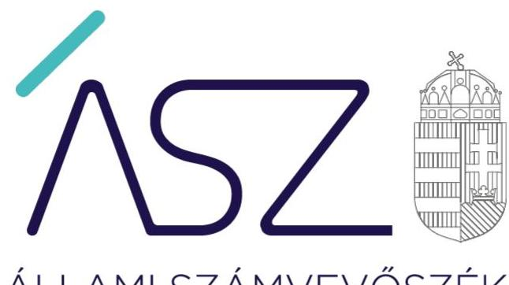
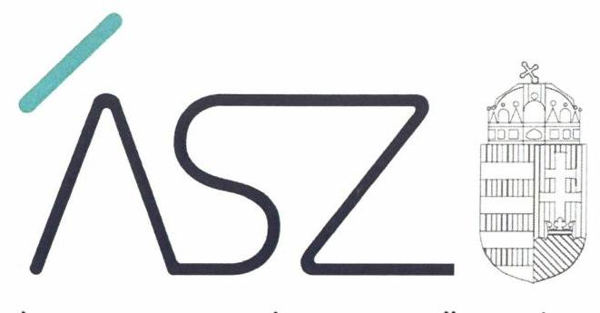
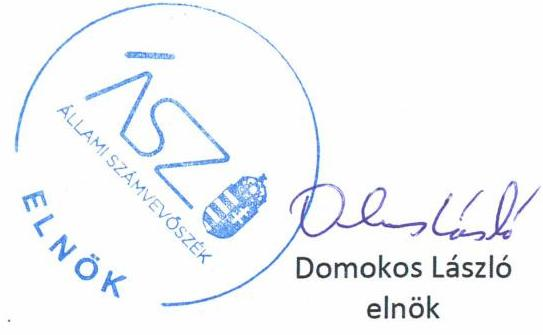

ÁLLAMI SZÁMVEVŐSZÉK

# JELENTÉS 

Az állam kisebbségi tulajdonlásának ellenőrzése

2020. 

20146
www.asz.hu

---

ÁLLAMI SZÁMVEVŐSZÉK

# JELENTÉS 

Az állam kisebbségi tulajdonlásának ellenőrzése

2020. 07. hó 23. nap

20146
www.asz.hu

---

# AZ ELLENŐRZÉST FELÜGYELTE: 

MAKKAI MÁRIA felügyeleti vezető

## AZ ELLENŐRZÉST VEZETTE ÉS A VÉGREHAJTÁSÁÉRT FELELŐS:

SALAMIN VIKTOR ellenőrzésvezető

## A PROGRAM ÖSSZEÁLLÍTÁSÁÉRT FELELŐS:

FEKETE-NAGY ANDRÁS GÁBOR ellenőrzési program készítéséért felelős vezető

IKTATÓSZÁM: EL-2796-001/2020.
TÉMASZÁM: 2523
ELLENŐRZÉS-AZONOSÍTÓ SZÁM: V0874

---

# TARTALOMJEGYZÉK 

■ ÖSSZEGZÉS ..... 5
■ AZ ELLENŐRZÉS CÉLJA ..... 6
■ AZ ELLENŐRZÉS TERÜLETE ..... 7
■ AZ ELLENŐRZÉS HÁTTERE, INDOKOLTSÁGA ..... 8
■ A JELENTÉS LÉNYEGES KÉRDÉSKÖREI ..... 9
■ AZ ELLENŐRZÉS HATÓKÖRE ÉS MÓDSZEREI ..... 10
■ MEGÁLLAPÍTÁSOK ..... 12
■ MELLÉKLETEK ..... 17
I. sz. melléklet: Értelmező szótár ..... 17
■ FÜGGELÉK: ÉSZREVÉTELEK ..... 19
■ RÖVIDÍTÉSEK JEGYZÉKE ..... 21

---

.

---

# ÖSSZEGZÉS 

A Magyar Nemzeti Vagyonkezelő Zrt., mint az állam nevében eljáró tulajdonosi joggyakorló az állam kisebbségi tulajdonában lévő gazdasági társaságokkal kapcsolatos feladatellátása szabályszerű volt. A tulajdonosi joggyakorlás kereteinek kialakítása és gyakorlata, továbbá a beszámolással és a társasági portfólió kezelésével összefüggő feladatellátás szabályszerű volt.

## Az ellenőrzés társadalmi indokoltsága

Az Állami Számvevőszék törvényi kötelezettség alapján minden évben ellenőrzi az állami vagyon feletti tulajdonosi joggyakorlással kapcsolatos tevékenységeket, továbbá rendszeresen ellenőrzi a többségi állami tulajdonban lévő gazdasági társaságok gazdálkodását. Az állami tulajdonú gazdasági társaságok stratégiai jelentősége, mérete azonban különböző, amely eltérő irányítást tesz szükségessé, ami a társasági portfólió pénzügyi és szakmai értékelése alapján dönthető el. Ez lehet a méretgazdaságosságra tekintettel összevonás, illetve kisebbségi tulajdonrészek értékesítése olyan üzleti vállalkozások esetében, amelyeknél az állam tulajdonosi szerepvállalása nem indokolt. Ez hozzájárul az irányításban való részvétel miatt lekötött állami erőforrások felszabadításához. Ez indokolta az állam kisebbségi tulajdonlásának ellenőrzését, amelyre korábban még nem került sor.

## Főbb megállapítások, következtetések

Az MNV Zrt. a 2016-2018. években, a jogszabályi előírások szerint kialakította az állam kisebbségi tulajdonában álló társaságokban lévő társasági részesedések feletti tulajdonosi joggyakorlás kereteit, rendelkezett a kisebbségi tulajdonosi joggyakorlás vonatkozásában a szervezeti és működési kereteket, a világos szervezeti struktúra kialakítását biztosító szabályzatokkal. Kialakította továbbá a tulajdonosi joggyakorlási feladatok szabályszerű ellátását támogató kockázatkezelési, nyomon követési rendszereket.

Az MNV Zrt. az állam kisebbségi tulajdonában álló társaságokban lévő társasági részesedések feletti tulajdonosi joggyakorlása szabályszerű volt. Az állam kisebbségi tulajdonában lévő gazdasági társasági részesedésekre vonatkozó döntések a jogszabályi előírások szerint történtek, az MNV Zrt. a társasági részesedések feletti tulajdonosi jogokat a jogszabályok és belső előírások szerint gyakorolta.

Az MNV Zrt. az állam kisebbségi tulajdonában lévő gazdasági társaságokban lévő társasági részesedésekről elkülönített, részletező nyilvántartást vezetett a 2016-2018. években, nyilvántartási kötelezettségének azonban nem szabályszerűen tett eleget, mert a részletező nyilvántartás nem tartalmazta a jogszabály által rögzített minimális tartalmi elemeket. Az MNV Zrt. a 2016-2018. években a rábízott állami vagyonról szóló beszámolási kötelezettségének eleget tett.

Az MNV Zrt. az állam kisebbségi tulajdonában lévő gazdasági társaságokban lévő társasági részesedések portfólió kezelésének szempontjait belső szabályzataiban kialakította, a portfóliót a jogszabályi és belső előírások szerint kezelte.

---

# AZ ELLENŐRZÉS CÉLJA 

Az ellenőrzés célja annak értékelése, hogy az állam nevében eljáró tulajdonosi joggyakorló feladatellátása megfelelő volt-e, élt-e a kisebbségvédelmi rendelkezések szerinti jogával, ha az szükségessé vált. Az állam kisebbségi tulajdonában lévő gazdasági társaságokra vonatkozóan a tulajdonosi joggyakorló vagyonérték-megőrző és vagyongyarapító tevékenysége megfelelő volt-e.

---

# AZ ELLENŐRZÉS TERÜLETE 

## Magyar Nemzeti Vagyonkezelő Zártkörűen működő részvénytársaság

A magyar állam gazdasági társaságokban lévő részesedése a nemzeti vagyon részét képezi, a szabályszerű, felelős tulajdonosi joggyakorlás kiemelten fontos a vagyonnal való gazdálkodás, a vagyon megőrzése, megóvása érdekében.

Az állami vagyonnal való gazdálkodásról, hasznosításról, kezelésről és az állami vagyonnal kapcsolatos tulajdonosi jogok gyakorlásáról a Vtv. ${ }^{1}$ rendelkezik. A Vtv. alapján a tulajdonosi joggyakorlás és vagyongazdálkodás feladata az állami vagyon rendeltetésének megfelelő - az állami feladatok ellátásához, a társadalmi szükségletek kielégítéséhez, valamint a Kormány gazdaságpolitikája megvalósításának elősegítéséhez - hatékony, költségtakarékos, értékmegőrző, értéknövelő felhasználásának biztosítása, hasznosítása, valamint az állami vagyon gyarapítása.

A rábízott állami vagyon felett az államot megillető tulajdonosi jogok és kötelezettségek összességét tulajdonosi joggyakorlóként - ha törvény vagy miniszteri rendelet eltérően nem rendelkezik - az MNV Zrt. ${ }^{2}$ gyakorolja.

Az MNV Zrt. a Magyar Állam által alapított egyszemélyes gazdasági társaság, az állam részvényesi jogait az állami vagyon felügyeletéért felelős miniszter 2018. május 21-ig a nemzeti fejlesztési miniszter, 2018. május 22-től a nemzeti vagyon kezeléséért felelős tárca nélküli miniszter gyakorolja.

Az MNV Zrt. tulajdonosi joggyakorlása alá 2016-ban 152, 2017-ben 158, 2018-ban 123, az állam kisebbségi tulajdonában lévő gazdasági társaság tartozott.

A gazdasági társaságok tagjainak jogait és kötelezettségeit érintő - így az állam kisebbségi tulajdonlására vonatkozó - cégjogi szabályokat, kisebbségvédelemmel kapcsolatos rendelkezéseket a Ptk. ${ }^{3}$ határozza meg.

---

# AZ ELLENŐRZÉS HÁTTERE, INDOKOLTSÁGA 

Az ÁSZ ${ }^{4}$ kisebbségi állami tulajdonban lévő gazdasági társaságok feletti tulajdonosi joggyakorlás ellenőrzése feltárhatja azon hiányosságokat, amely alapján az állami vagyon használata nem átlátható, rendeltetésszerű és felelős módon történik és támogathatja az állam társasági portfóliójának optimalizálását. Az állam kisebbségi tulajdonában lévő gazdasági társaságok tulajdonosi szerkezete változatos, a kisebbségi állami tulajdon mellett további önkormányzati tulajdonban lévő gazdasági társasági tulajdon is előfordul, így vannak olyan társaságok, amelyek esetében a kisebbségi állami tulajdonban lévő gazdasági társaságok többségi nemzeti tulajdonban vannak.

Az állami tulajdonban lévő társasági részesedések a nemzeti vagyon részét képezik, ezért a rájuk vonatkozó szabályszerű, felelős tulajdonosi joggyakorlás kiemelten fontos a vagyonnal való gazdálkodás, a vagyon megőrzése, megóvása érdekében. Az államnak nincs döntő befolyása a kisebbségi állami tulajdonban lévő gazdasági társaságok működésére, gazdálkodására, ugyanakkor működésük eredményessége hatással van a nemzeti vagyon alakulására, az esetleges veszteséges gazdálkodás, pótbefizetési kötelezettség pénzügyi kockázatot jelent az államnak.

---

# A JELENTÉS LÉNYEGES KÉRDÉSKÖREI 

1. Az MNV Zrt. kialakította-e az állam kisebbségi tulajdonában álló társaságokban lévő társasági részesedések feletti tulajdonosi joggyakorlás kereteit?
2. Az MNV Zrt. az állam kisebbségi tulajdonában álló társaságban lévő társasági részesedések feletti tulajdonosi joggyakorlása szabályszerű volt-e?
3. Az állam kisebbségi tulajdonában lévő gazdasági társaságokra vonatkozóan az MNV Zrt. állami vagyonról való nyilvántartással, beszámolással összefüggő feladatellátása szabályszerű volt-e?
4. Az MNV Zrt. az állam kisebbségi tulajdonában álló gazdasági társaságokban lévő társasági részesedések feletti tulajdonosi joggyakorlása keretében a portfólió kezelésével összefüggő feladatait megfelelően látta-e el?

---

# AZ ELLENŐRZÉS HATÓKÖRE ÉS MÓDSZEREI 

## Az ellenőrzés típusa

Megfelelőségi ellenőrzés.

## Az ellenőrzött időszak

2016-2018. év.

## Az ellenőrzés tárgya

Az állami kisebbségi tulajdonban lévő gazdasági társaságok feletti tulajdonosi joggyakorlás kialakítása és működtetése.

A tulajdonosi joggyakorló által az állam kisebbségi tulajdonlásából fakadó kockázatok felmérése, szükség esetén a jogszabályi előírásban foglalt lehetőség szerinti kisebbségvédelmi rendelkezések érvényesítése. A kisebbségi tulajdonosi joggyakorlásában érintett szervezetek állami vagyonra vonatkozó tulajdonosi joggyakorlással kapcsolatos intézkedései és a tulajdonosi joggyakorlási feladatok szabályszerű ellátását támogató belső szabályozási rendszer.

## Az ellenőrzött szervezet

Magyar Nemzeti Vagyonkezelő Zártkörűen működő részvénytársaság

## Az ellenőrzés jogalapja

Az ellenőrzés jogszabályi alapját az ÁSZ tv. ${ }^{5} 5$. § (4) bekezdés a) pontja képezi.

## Az ellenőrzés módszerei

Az ellenőrzést az ellenőrzött időszakban hatályos jogszabályok, az ellenőrzés szakmai szabályai, a jelen ellenőrzésre irányadó ÁSZ módszertanok, az ellenőrzési programban foglalt értékelési szempontok szerint hajtottuk végre.

Az ellenőrzés ideje alatt az ellenőrzött szervezettel történő kapcsolattartást az ÁSZ SZMSZ ${ }^{6}$-ének vonatkozó előírásai alapján biztosította.

---

Az ellenőrzés lefolytatásához az ellenőrzött szervezet a tanúsítvány elektronikus kitöltésével, valamint az ÁSZ által kért dokumentumok elektronikus megküldésével szolgáltatott adatokat, amelyek valódiságát és teljes körűségét az ellenőrzött szervezet vezetője által tett teljességi és hitelességi nyilatkozat igazolta. A rendelkezésre bocsátott adatok, információk kontrollja az ellenőrzés keretében megtörtént.

Az ellenőrzési kérdések megválaszolásához szükséges bizonyítékok megszerzése az ellenőrzött által rendelkezésre bocsátott dokumentumokra, adatokra alapozva megfigyelés, szemle (szemrevételezés), kérdésfeltevés (információkérés), mintavétel, valamint elemző eljárás alkalmazásával történt.

Az állam kisebbségi tulajdonlásával kapcsolatos egyes tevékenységeket, így a tulajdonosi joggyakorlói feladatellátásának szabályszerűségét és az állam kisebbségi tulajdonában álló gazdasági társaságokban lévő társasági részesedések értékelésének és vagyonnyilvántartása szabályszerűségét véletlen mintavétel alapján ellenőrizte az ÁSZ.

A mintavétellel ellenőrzött területek esetében minden egyes tétel vonatkozásában a szabályszerűségre vonatkozó kérdéseket tett fel az ÁSZ. Szabályszerűnek minősült egy ellenőrzött területet, amennyiben 95\%-os bizonyossággal az ellenőrzött sokaságban az átlagos hibaarány legfeljebb 10\%, nem szabályszerűnek, amennyiben 10\%-nál magasabb arányt képviselt.

Abban az esetben, ha az ellenőrzött sokaság tekintetében a 10\%-os hibaarányhoz való viszony megítélésének megbízhatósága nem érte el a 95\%ot, annak elérése érdekében az értékelést további szempontokkal egészítette ki az ÁSZ, és figyelembe vette a feltárt hibák értékét.

---

# 1. Az MNV Zrt. kialakította-e az állam kisebbségi tulajdonában álló társaságokban lévő társasági részesedések feletti tulajdonosi joggyakorlás kereteit? 

Összegző megállapítás

Az MNV Zrt. a 2016-2018. években a jogszabályi előírások szerint kialakította az állam kisebbségi tulajdonában álló társaságokban lévő társasági részesedések feletti tulajdonosi joggyakorlás kereteit.

Az MNV Zrt. a 2016-2018. évben a jogszabályi előírásokkal összhangban alakította ki a tulajdonosi joggyakorlás rendjét. Rendelkezett a kisebbségi tulajdonosi joggyakorlás vonatkozásában a szervezeti és működési kereteket, a világos szervezeti struktúra kialakítását biztosító szabályzatokkal.

Az MNV Zrt. rendelkezett a Vtv.-ben foglaltak szerint az Igazgatóság által jóváhagyott SZMSZ7-el.

A Számv. tv. ${ }^{8}$-ben , Áhsz. ${ }^{9}$-ben előírtak szerint az MNV Zrt. rendelkezett a rábízott vagyonára vonatkozó Számviteli politikával ${ }^{10}$ és Számlarenddel ${ }^{11}$. A Számviteli politika keretében, a Számv. tv. előírásai szerint elkészítették a Leltározási szabályzatot ${ }^{12}$ és az Értékelési szabályzatot ${ }^{13}$.

A Vtv. vhr. ${ }^{14}$-ben foglalt, állami vagyon kezelőjére vonatkozó, gazdálkodó szervezetben fennálló részesedéshez kapcsolódó adatszolgáltatási kötelezettség és az Nvtv. ${ }^{15}$-ben foglalt, nemzeti vagyon nyilvántartási kötelezettség teljesítése érdekében az MNV Zrt. megalkotta Vagyon-nyilvántartási szabályzatát ${ }^{16}$.

Az MNV Zrt. a 2016-2018. években az állam kisebbségi tulajdonában lévő társasági részesedésekre vonatkozó sajátos szabályokat - döntési hatásköröket, a feladatellátás feltételeit, a portfólió kezelési, ezen belül döntően a legfőbb szervi döntéshozatalban történő részvétellel kapcsolatos feladatokat belső szabályzataiban - SZMSZ-ben, Vezérigazgatói utasításban ${ }^{17}$, Portfóliós Kódexben ${ }^{18}$ - határozta meg.

Az MNV Zrt. az állam kisebbségi tulajdonában álló gazdasági társaságokban lévő társasági részesedések portfólió kezelésének szempontjait belső szabályzataiban (SZMSZ-ben, Vezérigazgatói utasításban, Portfóliós Kódexben, Monitoring szabályzatban ${ }^{19}$, Állami örökléssel kapcsolatos eljárásrendben ${ }^{20}$ ) kialakította. A szabályozás részletezte a társaságok közgyűlésein, illetve taggyűlésein történő képviselet feltételeit, a képviselendő állásponttal kapcsolatos döntések előkészítésének követelményeit, a társaságok gazdálkodása figyelemmel kísérésének előírásait, a tulajdonosi jogok megbízási szerződéssel történő átadásának szabályait, a vagyon hasznosításának feltételeit, valamint az adatszolgáltatási kötelezettség rendjét.

Az MNV Zrt. a 2016-2018. években kialakította a tulajdonosi joggyakorlási feladatok szabályszerű ellátását támogató kockázatkezelési, nyomon követési rendszereket. Az MNV Zrt. a Bkr. ${ }^{21}$ előírásai szerint szabályozta az

---

integrált kockázatkezelési rendszer működtetésének feltételeit, kialakította a tevékenységének, a célok megvalósításának nyomon követését biztosító rendszerét, melyben a kisebbségi tulajdonú gazdasági társaságokra vonatkozó sajátos szabályokat rögzítették. Az MNV Zrt. kialakította az
 operatív tevékenységektől függetlenül működő belső ellenőrzést.

# 2. Az MNV Zrt. az állam kisebbségi tulajdonában álló társaságban lévő társasági részesedések feletti tulajdonosi joggyakorlása szabályszerű volt-e? 

Összegző megállapítás

Az MNV Zrt. az állam kisebbségi tulajdonában álló társaságokban lévő társasági részesedések feletti tulajdonosi joggyakorlása szabályszerű volt.

Az MNV Zrt. az állam kisebbségi tulajdonában lévő gazdasági társasági részesedésekre vonatkozó döntései az ellenőrzött tételek esetében szabályszerűek voltak. Az MNV Zrt. a - tulajdonosi részesedés nagyságrendje, a társaság részvényei alapján biztosított többletjogok, a társaság tevékenységi köre, a nemzetgazdasági szempontból kiemelt jelentősége alapján kijelölt - kisebbségi állami tulajdoni részesedéssel érintett gazdasági társaságok esetében a társasági részesedések feletti tulajdonosi jogokat a jogszabályoknak és belső előírásai szerint gyakorolta, mivel:
$\longrightarrow$ a kisebbségi állami tulajdoni részesedéssel érintett gazdasági társaságok legfőbb szerve tevékenységében való képviseletre szóló meghatalmazást a Ptk., a Vtv., az Nvtv. valamint az MNV Zrt. belső előírásai szerint adta ki;
$\longrightarrow$ a kisebbségi állami tulajdoni részesedéssel érintett gazdasági társaságok legfőbb szervének az éves beszámoló jóváhagyásáról szóló döntésében képviselendő álláspontját a Ptk. előírásai szerint a felügyelő bizottságok írásbeli jelentésének birtokában alakította ki;
$\longrightarrow$ a Vtv. és az SZMSZ előírásai szerint vett részt a kisebbségi állami tulajdoni részesedésű gazdasági társaságok tőkeemeléséről szóló döntésében. A tőkeemelésekre az Áht. ${ }^{21}$-ben foglaltak szerint a nemzeti fejlesztési miniszter engedélyével került sor.
Az MNV Zrt. - a Portfóliós Kódex előírásai szerint - azon kisebbségi állami tulajdoni részesedéssel érintett gazdasági társaságok esetében, ahol ez a társaságokban való részesedés csekély mértéke, örökölt jellege, nem működő státusza miatt nem volt indokolt, a legfőbb szervi döntéshozatalban nem vett részt, tulajdonosi forrásjuttatásról nem született döntés. Az MNV Zrt. a kisebbségvédelmi rendelkezések szerinti jogok érvényesítésének lehetőségéhez kapcsolódó feladatokat belső szabályzatában rögzítette.

Az állam kisebbségi tulajdonában lévő társasági részesedések értékesítése 2016. és 2017. években versenyeztetés mellőzésével, 2018-ban elektronikus árveréssel, mindhárom évben a Vtv.-ben előírtak szerint, szabályszerűen történt. Az értékesítés az ellenőrzött években a Vtv. vhr.-ben foglaltak szerint, független szakértő értékbecslésének figyelembevételével történt.

---

# 3. Az állam kisebbségi tulajdonában lévő gazdasági társaságokra vonatkozóan az MNV Zrt. állami vagyonról való nyilvántartással, beszámolással összefüggő feladatellátása szabályszerű volt-e? 

Összegző megállapítás

Az állam kisebbségi tulajdonában álló gazdasági társaságokban lévő társasági részesedésekre vonatkozóan az MNV Zrt. az állami vagyon nyilvántartási kötelezettségének nem szabályszerűen tett eleget, a beszámolással összefüggő feladatellátása szabályszerű volt.

Az MNV Zrt. az állam kisebbségi tulajdonában álló gazdasági társaságokban lévő társasági részesedésekről részletező nyilvántartást vezetett a 2016-2018. években. Az MNV Zrt. elkülönítetten tartotta nyilván a rábízott állami vagyont az MNV Zrt saját vagyonától a Vtv. és a Vtv. vhr. előírásai alapján.

Az MNV Zrt. számviteli nyilvántartásai a Számv. tv és a Számlarend előírásai szerint tartalmazták a tartós és a forgatási célú részesedéseket.

Az MNV Zrt. által a részesedésekről szóló nyilvántartás nem volt szabályszerű, mert nem felelt meg a nyilvántartás minimális tartalmi követelményeit rögzítő Áhsz. 14. melléklet VIII. 2. pont b), c), e), f), g), h) és i) alpontjai, valamint 3. pontja előírásainak. Az MNV Zrt. a szabálytalanság kijavítását az ÁSZ korábbi ellenőrzése alapján készített intézkedési tervében vállalta, ennek végrehajtási határideje jelen ellenőrzéssel érintett időszakon kívül esik.

Az MNV Zrt. a 2016-2018. évekről az Áhsz. alapján, a rábízott állami vagyonról az éves költségvetési beszámolókat elkészítette.

A részesedések értékvesztésének, értékhelyesbítésének elszámolása a 2016-2018. években az ellenőrzött tételek esetében az Áhsz. és a Számv. tv. előírásai szerint történt, szabályszerű volt.

## 4. Az MNV Zrt. az állam kisebbségi tulajdonában álló gazdasági társaságokban lévő társasági részesedések feletti tulajdonosi joggyakorlása keretében a portfólió kezelésével összefüggő feladatait megfelelően látta-e el?

## Összegző megállapítás

Az MNV Zrt. az állam kisebbségi tulajdonában álló gazdasági társaságokban lévő társasági részesedések feletti tulajdonosi joggyakorlása keretében a portfólió kezelésével összefüggő feladatait megfelelően látta el.

Az MNV Zrt. az állam kisebbségi tulajdonában álló gazdasági társaságok tekintetében felmérte és értékelte azok működési kockázatait, a felmért kockázatokat a tulajdonosi részesedésből eredő súlyának megfelelően kezelte. A 2016-2018. években a felmért kockázatok alapján a gazdasági társaságok tulajdonosi döntéseiben részt vett.

---

A tulajdonosi joggyakorló a gazdasági társaságokban lévő társasági részesedések portfóliójával kapcsolatos kockázatok előfordulása esetén intézkedett. Az MNV Zrt. a 2016-2017. években három-három, az állam kisebbségi tulajdonában lévő társasági részesedést értékesített a vételi ajánlat elfogadását követően. A tulajdonosi joggyakorló az állam kisebbségi tulajdonában álló társasági részesedések körének racionalizálása érdekében, az állami vagyon felügyeletéért felelős miniszter hozzájárulásával társasági részesedések elektronikus árveréssel történő értékesítéséről döntött 2018-ban. Az értékesítésre kijelölt az állam kisebbségi tulajdonában álló társasági részesedésből 24 db társasági részesedés értékesítése történt meg 39,5 M Ft értékben.

---

.

---

# MELLÉKLETEK 

- I. SZ. MELLÉKLET: ÉRTELMEZŐ SZÓTÁR
állami vagyon
közszolgáltatás
közfeladat
nemzeti vagyon

A Vtv. alkalmazásában állami vagyonnak minősül:
a) az állam tulajdonában lévő dolog, valamint dolog módjára hasznosítható természeti erő;
b) az a) pont hatálya alá tartozó mindazon vagyon, amely vonatkozásában törvény az állam kizárólagos tulajdonjogát nevesíti;
c) az állam tulajdonában lévő tagsági jogviszonyt megtestesítő értékpapír, illetve az államot megillető egyéb társasági részesedés;
d) az államot megillető olyan immateriális, vagyoni értékkel rendelkező jogosultság, amelyet jogszabály vagyoni értékű jogként nevesít;
e) az állam tulajdonában lévő pénzügyi eszközök.
(Forrás: Vtv. 1. § (2) bekezdése)
Az Ebktv. ${ }^{23}$ 3. § d) pontja a következőképpen határozza meg a közszolgáltatást: „szerződéskötési kötelezettség alapján a lakosság alapvető szükségleteinek ellátására irányuló szolgáltatás, így különösen a villamos energia-, gáz-, hő-, víz-, szennyvíz- és hulladékkezelési, köztisztasági, postai és távközlési szolgáltatás, továbbá a menetrend alapján közlekedő járművekkel végzett közforgalmú személyszállítás".
Az Áht. 3/A. § (1) bekezdése alapján közfeladat a jogszabályban meghatározott állami vagy önkormányzati feladat.
A nemzeti vagyonba tartozik:
a) az állam vagy a helyi önkormányzat kizárólagos tulajdonában álló dolgok,
b) az a) pont hatálya alá nem tartozó, az állam vagy a helyi önkormányzat tulajdonában lévő dolog,
c) az állam vagy a helyi önkormányzat tulajdonában lévő pénzügyi eszközök, továbbá az államot vagy a helyi önkormányzatot megillető társasági részesedések,
d) az államot vagy a helyi önkormányzatot megillető bármely vagyoni értékkel rendelkező jogosultság, amelyet jogszabály vagyoni értékű jogként nevesít,
e) Magyarország határa által körbezárt terület feletti légtér,
f) az üvegházhatású gázok kibocsátási egységeinek kereskedelméről szóló törvény szerinti kibocsátási egység és légiközlekedési kibocsátási egység, valamint az ENSZ Éghaj-lat-változási Keretegyezménye és annak Kiotói Jegyzőkönyve végrehajtási keretrendszeréről szóló törvény szerinti kiotói egység,
g) állami vagy helyi önkormányzati fenntartású közgyűjtemény (muzeális intézmény, levéltár, közgyűjteményként működő kép- és hangarchívum, valamint könyvtár) saját gyűjteményében nyilvántartott kulturális javak körébe tartozó dolog, kivéve, ha az állami vagy önkormányzati tulajdon jogszerű létrejötte kétséget kizáró módon nem bizonyítható és a dologra nézve más a tulajdonjogát bizonyítja vagy a kulturális javakra vonatkozó jogszabályokban meghatározott eljárás keretében valószínűsíti,
h) a régészeti lelet,
i) a nemzeti adatvagyon körébe tartozó állami nyilvántartások fokozottabb védelméről szóló törvény szerinti nemzeti adatvagyon.
(Forrás: Nvtv. 1. § (2) bekezdése)
A portfólió-kezelési tevékenységet végző számára átadott eszközök, illetőleg ezen eszközökből a portfólió-kezelési tevékenységet végző által összeállított, többféle vagyonelemet tartalmazó eszközök összessége.

---

rábízott állami vagyon
tulajdonosi joggyakorlás és vagyongazdálkodás feladata
tulajdonosi joggyakorló

Az MNV Zrt. saját vagyonával való gazdálkodásától elkülönített, az MNV Zrt.-re bízott állami vagyon, valamint az ennek értékesítésével és hasznosításával összefüggő bevételek és kiadások (Forrás: Vtv. 22. § (6) bekezdése)
A Vtv. 2. § (1) bekezdése szerint az állami vagyon rendeltetésének megfelelő - az állami feladatok ellátásához, a társadalmi szükségletek kielégítéséhez, valamint a Kormány gazdaságpolitikája megvalósításának elősegítéséhez szükséges, egységes elveken alapuló, önálló ágazatként megjelenő - hatékony, költségtakarékos, értékmegőrző, értéknövelő felhasználásának biztosítása (közvetlen felhasználás), illetve közvetett hasznosítása (beleértve a vagyoni kör változását eredményező értékesítést), valamint az állami vagyon gyarapítása (ideértve a vagyoni kör bővítését is).
(Forrás: Vtv. 2. § (1) bekezdése)
Nvtv. 3. § (1) bekezdés 17. pontja szerint, aki a nemzeti vagyon felett az államot vagy a helyi önkormányzatot megillető tulajdonosi jogok és kötelezettségek összességének gyakorlására jogosult.
(Forrás: Nvtv. 3. § (1) bekezdés 17. pontja)

---

# FÜGGELÉK: ÉSZREVÉTELEK 

A jelentéstervezetet a Számvevőszék 15 napos észrevételezésre megküldte az ellenőrzött szervezet vezetőjének az ÁSZ tv. 29. § (1) bekezdése előírásának megfelelően.

A Magyar Nemzeti Vagyonkezelő Zrt. vezérigazgatója a jelentéstervezetre az ÁSZ tv. 29. § (2) bekezdésében foglalt határidőn belül nemleges észrevételt tett.

[^0]
[^0]:    * 29. § (1) Az Állami Számvevőszék az ellenőrzési megállapításait megküldi az ellenőrzött szervezet vezetőjének vagy az általa megbízott személynek, és annak, akinek személyes felelősségét állapította meg.
    (2) Az ellenőrzött szervezet vezetője és a felelősként megjelölt személy az ellenőrzés megállapításaira tizenöt napon belül írásban észrevételt tehet.
    (3) Az Állami Számvevőszék az észrevételre a beérkezésétől számított harminc napon belül írásban válaszol. A figyelembe nem vett észrevételeket köteles a jelentésben feltüntetni, és megindokolni, hogy azokat miért nem fogadta el.

---

.

---

# RÖVIDÍTÉSEK JEGYZÉKE 

${ }^{1}$ Vtv.
${ }^{2}$ MNV Zrt.
${ }^{3}$ Ptk.
${ }^{4}$ ÁSZ
${ }^{5}$ ÁSZ. tv.
${ }^{6}$ ÁSZ SZMSZ
${ }^{7}$ SZMSZ
${ }^{8}$ Számv. tv.
${ }^{9}$ Áhsz.
${ }^{10}$ Számviteli politika
${ }^{11}$ Számlarend
${ }^{12}$ Leltározási szabályzat
${ }^{13}$ Értékelési szabályzat
${ }^{14}$ Vtv. vhr.
${ }^{15}$ Nvtv.
${ }^{16}$ Vagyon-nyilvántartási szabályzat

Az állami vagyonról szóló 2007. évi CVI. törvény
Magyar Nemzeti Vagyonkezelő Zártkörűen működő részvénytársaság
A Polgári Törvénykönyvről szóló 2013. évi V. törvény
Állami Számvevőszék
Az Állami Számvevőszékről szóló 2011. évi LXVI. törvény
Állami Számvevőszék Szervezeti és Működési Szabályzata
430/2013. (VI. 17.) IG határozattal elfogadott - az MNV Zrt. Szervezeti és
Működési Szabályzata (hatályos 2013. 07. 01-től, 2016. 04. 15-ig)
158/2016. (IV. 06.) IG határozattal elfogadott - az MNV Zrt. Szervezeti és
Működési Szabályzata (hatályos: 2016. 04. 15-től - 2017. 07.01-ig)
360/2017. (VI. 21.) IG határozattal elfogadott - az MNV Zrt. Szervezeti és
Működési Szabályzata (hatályos 2017 07. 01-től - 2018. 01.15-ig)
778/2017. (XII. 20.) IG határozattal kiadott - az MNV Zrt. Szervezeti és Működési
Szabályzata (hatályos 2018. 01. 15-től)
A számvitelről szóló 2000. évi C. törvény (hatályos 2001. január 1-jétől)
Az államháztartásról szóló 4/2013. (I.11.) Korm. rendelet
8/2016. (III.31.) VIG utasítás az MNV Zrt. rábízott vagyonára vonatkozó Számviteli
Politika
12/2017. (III.29.) VIG utasítás az MNV Zrt. rábízott vagyonára vonatkozó
Számviteli Politika
13/2018. (V.30.) VIG utasítás az MNV Zrt. rábízott vagyonára vonatkozó
Számviteli Politika
9/2016. (III.31.) az MNV Zrt. rábízott vagyonára vonatkozó Számlarend
13/2017. (III.29.) az MNV Zrt. rábízott vagyonára vonatkozó Számlarend
24/2011. (IV.12.) az MNV Zrt. Saját és Rábízott vagyonának Leltározási
szabályzata
16/2016. (V.31.) az MNV Zrt. Saját és Rábízott vagyonának Leltározási
szabályzata
7/2016. (III.31.) az MNV Zrt. rábízott vagyonának eszközeire és forrásaira
vonatkozó értékelési szabályzata
11/2017. (III.29.) az MNV Zrt. rábízott vagyonának eszközeire és forrásaira
vonatkozó értékelési szabályzata
12/2018. (V.30.) az MNV Zrt. rábízott vagyonának eszközeire és forrásaira
vonatkozó értékelési szabályzata
Az állami vagyonnal való gazdálkodásról szóló 254/2007. (X. 4.) Korm. rendelet
A nemzeti vagyonról szóló 2011. évi CXCVI. törvény
10/2014. (III.24.) VIG utasítás az MNV Zrt. közvetlen és közvetett kezelésű
rábízott vagyonának nyilvántartási feladataira vonatkozó alapvető belső
szabályok
60/2016.
 (XII.13.) VIG utasítás az MNV Zrt.-re bízott vagyonába tartozó közvetlen
kezelésű immateriális javak, tárgyi eszközök és készletek nyilvántartási
szabályzata

---

${ }^{17}$ Vezérigazgatói utasítás
${ }^{18}$ Portfóliós Kódex
${ }^{19}$ Monitoring szabályzat
${ }^{20}$ Állami örökléssel kapcsolatos eljárásrend
${ }^{21}$ Bkr.
${ }^{22}$ Áht.
${ }^{23}$ Ebktv.
52/2013. (XII. 21.) VIG utasítás - az MNV Zrt. szervezeti egységeinek feladatköreiről, a hatáskörök átruházásáról, valamint az aláírási jog gyakorlásáról (hatályos 2014. 01. 01-től - 2016. 04. 15-ig);
11/2016. VIG utasítás - az MNV Zrt. szervezeti egységeinek feladatköreiről, a hatáskörök átruházásáról, valamint az aláírási jog gyakorlásáról (hatályos 2016. 04. 15-től - 2016. 07. 26-ig);

31/2016. VIG utasítás - az MNV Zrt. szervezeti egységeinek feladatköreiről, a hatáskörök átruházásáról, valamint az aláírási jog gyakorlásáról (hatályos 2016. 07. 26-tól - 2017. 08. 21-ig)

25/2017. VIG utasítás - az MNV Zrt. szervezeti egységeinek feladatköreiről, a hatáskörök átruházásáról, valamint az aláírási jog gyakorlásáról (hatályos 2017. 08. 21-től - 2018. 01. 01-ig);

34/2017. VIG utasítás - az MNV Zrt. szervezeti egységeinek feladatköreiről, a hatáskörök átruházásáról, valamint az aláírási jog gyakorlásáról (hatályos 2018. 01. 01-től - 2018. 02. 07-ig);

3/2018. VIG utasítás - az MNV Zrt. szervezeti egységeinek feladatköreiről, a hatáskörök átruházásáról, valamint az aláírási jog gyakorlásáról (hatályos 2018. 02. 07-től);

7/2015. számú Vezérigazgatói utasítás az MNV Zrt. Portfóliós Kódexéről (hatályos 2015. 04. 01-től 2016. 06. 01-ig);
17/2016. számú Vezérigazgatói utasítás az MNV Zrt. Portfóliós Kódexéről (hatályos 2016. 06. 01-től - 2017. 10. 15-ig);
27/2017. számú Vezérigazgatói utasítás az MNV Zrt. Portfóliós Kódexéről (hatályos 2017. 10. 15-től)
51/2013. számú vezérigazgatói utasítás - Társasági Monitoring Szabályzat (hatályos 2013. 12. 19-től 2016. 08. 02-ig)
34/2016. számú vezérigazgatói utasítás - Társasági Monitoring Szabályzat (hatályos 2016. 08. 02-től)
Az állami örökléssel kapcsolatos eljárásrend ${ }_{1}$ : 5/2015. számú vezérigazgatói utasítás - Az állami örökléssel kapcsolatos eljárásrend (hatályos 2015. 02. 13-tól 2016. 07. 21-ig)

Az állami örökléssel kapcsolatos eljárásrend ${ }_{2}$ : 28/2016. számú vezérigazgatói utasítás - Az állami örökléssel kapcsolatos eljárásrend (hatályos 2016. 07. 21-től)
A költségvetési szervek belső kontrollrendszeréről és belső ellenőrzéséről szóló 370/2011. (XII.31.) Korm. rendelet
Az államháztartásról szóló 2011. évi CXCV. törvény
egyenlő bánásmódról és az esélyegyenlőség előmozdításáról szóló 2003. évi
CXXV. törvény

---

# ASZ 

ÁLLAMI SZÁMVEVŐSZÉK
1052 Budapest, Apáczai Cs. J. u. 10. I 1364 Budapest 4. Pf. 54 TEL: +36 14849100
email: szamvevoszek@asz.hu
web: www.asz.hu | www.aszhirportal.hu

