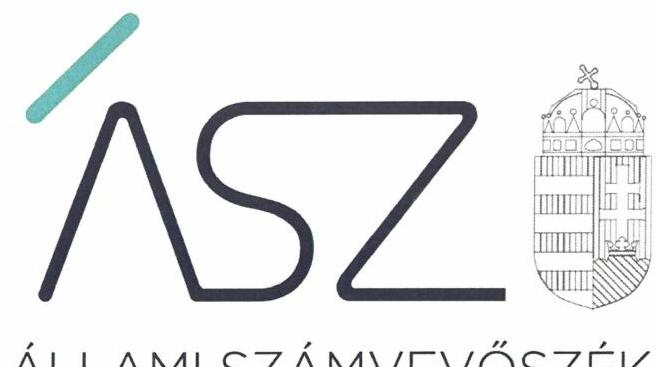
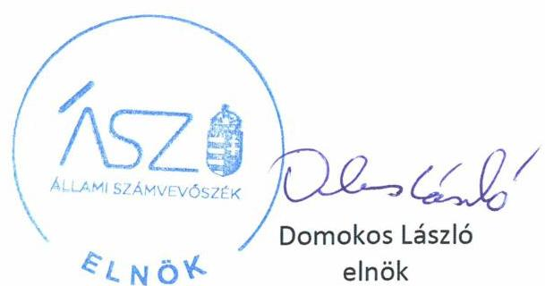
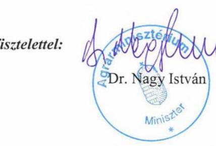
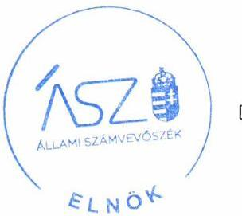
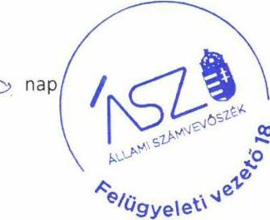

ÁLLAMI SZÁMVEVŐSZÉK

# JELENTÉS

A költségvetési szervek irányítói, tulajdonosi feladatai ellátásának ellenőrzése

Agrárminisztérium

2020.

20147
www.asz.hu

---

ÁLLAMI SZÁMVEVŐSZÉK

# JELENTÉS

A költségvetési szervek irányítói, tulajdonosi feladatai ellátásának ellenőrzése

Agrárminisztérium

2020. 07. hó 17. nap

20147
www.asz.hu

---

# AZ ELLENŐRZÉST FELÜGYELTE: 

KAKAS SÁNDOR felügyeleti vezető

## AZ ELLENŐRZÉST VEZETTE ÉS A VÉGREHAJTÁSÁÉRT FELELŐS:

DR. SIMON JÓZSEF ellenőrzésvezető

## A PROGRAM ÖSSZEÁLLÍTÁSÁÉRT FELELŐS:

BERTALAN RUDOLF GYULA projektvezető
TÓTPÁL SZABOLCS osztályvezető

IKTATÓSZÁM: EL-2804-001/2020
TÉMASZÁM: 2486
ELLENŐRZÉS-AZONOSÍTÓ SZÁM: V083006

---

# TARTALOMJEGYZÉK 

■ ÖSSZEGZÉS ..... 5
■ AZ ELLENŐRZÉS CÉLJA ..... 6
■ AZ ELLENŐRZÉS TERÜLETE ..... 7
■ AZ ELLENŐRZÉS HÁTTERE, INDOKOLTSÁGA ..... 8
■ A JELENTÉS LÉNYEGES KÉRDÉSKÖREI ..... 9
■ AZ ELLENŐRZÉS HATÓKÖRE ÉS MÓDSZEREI ..... 10
■ MEGÁLLAPÍTÁSOK ..... 12
■ JAVASLATOK ..... 15
■ MELLÉKLETEK ..... 17
I. sz. melléklet: Értelmező szótár ..... 17
■ FÜGGELÉK: ÉSZREVÉTELEK ..... 19
■ RÖVIDÍTÉSEK JEGYZÉKE ..... 29

---

.

---

# ÖSSZEGZÉS 

Az Agrárminisztérium nem szabályszerűen alakította ki az irányítási feladatok keretfeltételeit a 2017-2018. években, valamint nem szabályszerűen látta el az irányítási feladatokat a 2015-2018. években.
A gazdasági társaságait érintő tulajdonosi feladatokat az Agrárminisztérium a 2015-2018. években szabályszerűen látta el.
Az irányítási és tulajdonosi feladatok ellátásához kapcsolódó, saját müködését szolgáló vagyontárgyak tekintetében az Agrárminisztérium a 2015-2018. években felelősen gazdálkodott.

## Az ellenőrzés társadalmi indokoltsága

A közfeladatok ellátásának biztosításában a minisztériumok kiemelt szerepet töltenek be. E cél megvalósítása érdekében a minisztériumok jelentős nagyságrendű költségvetési forrásokkal gazdálkodnak, ezáltal a gazdálkodásuk szabályszerűsége hatással van a központi költségvetés egyensúlyának fenntarthatóságára. Emellett az irányítási és tulajdonosi jogok gyakorlásán keresztül befolyásolják az állami vagyonnal való gazdálkodás minőségét, a közpénzfelhasználás szabályszerűségét, a kormányzati (szak)politikák végrehajtását, illetve a közfeladatok széleskörű ellátásán keresztül az állampolgárok életminőségét.

Az Agrárminisztérium kiterjedt feladatkörrel rendelkezik, felelős többek között az agrárpolitikáért, az élelmiszeriparért, a környezet- és természetvédelemért, valamint nemzetgazdasági szempontból stratégiai fontosságú állami vagyont működtet. Az Agrárminisztérium által ellátott közfeladatok és a kezelt közpénzek szabályszerűségének biztosítása, valamint a vagyon megőrzése alapvető társadalmi érdek.

## Főbb megállapítások, következtetések, javaslatok

Az Agrárminisztérium nem szabályszerűen alakította ki a 2017-2018. években az irányítási feladatellátás kontrollkörnyezetét, mert az ellátandó feladatok leírását tartalmazó ügyrend, illetve az ellenőrzési nyomvonalak hiányosan álltak rendelkezésre az irányítási feladatellátási folyamatra vonatkozóan. Az Agrárminisztérium nem gondoskodott a 20172018. években az irányítási feladatellátásra vonatkozóan az integrált kockázatkezelési, az információs és kommunikációs és a monitoring rendszer jogszabályi előírások szerinti működtetéséről. Az Agrárminisztérium az irányítási feladatellátása tekintetében a 2015-2018. években nem biztosította az általa irányított költségvetési szervek vonatkozásában az egyéb ellenőrzési, irányítási, felügyeleti jogosultságok, illetve a munkáltatói jogok jogszabályi előírások szerinti gyakorlását.

Az Agrárminisztérium a gazdasági társaságokat érintő tulajdonosi joggyakorlásához kapcsolódó feladatok ellátása során a 2015-2018. években a jogszabályi előírásokat betartotta, mivel gondoskodott a gazdasági társaságok létesítő okiratában a tulajdonosi jogok szabályozásáról, a felügyelő bizottsági tagok kinevezéséről és a könyvvizsgáló megválasztásáról.

Az Agrárminisztérium vagyongazdálkodása szabályszerű volt, mert a 2015-2018. években gondoskodott a jogszabályi előírások szerint a vagyonkezelésében lévő állami vagyonnal kapcsolatos leltár elkészítéséről. Ezáltal az általa kezelt állami vagyon esetén az elszámoltathatóság biztosított volt.

Az Állami Számvevőszék a jelentésben foglalt megállapítások alapján az Agrárminisztérium közigazgatási államtitkára részére hét javaslatot fogalmazott meg.

---

# AZ ELLENŐRZÉS CÉLJA 

AZ ELLENŐRZÉS CÉLJA, annak értékelése volt, hogy az Agrárminisztérium, mint költségvetési szerv irányítási, tulajdonosi feladatainak ellátása szabályszerű volt-e. Az ellenőrzés keretében az Állami Számvevőszék értékelte az ellenőrzött szervezet korrupciós kockázatainak kezelését szolgáló integritás kontrollok kiépítettségét és az integritás szemlélet érvényesülését.

---

# **AZ ELLENŐRZÉS TERÜLETE**

## **Agrárminisztérium**

Az Agrárminisztérium (2018. május 18-ig a Földművelésügyi Minisztérium) az ellenőrzött időszakban a kormány irányítása alatt álló, a központi költségvetésben különálló fejezetet alkotó központi költségvetési szervként működött.

A miniszter1 a 2015-2018. években hatályos, a kormány tagjainak feladat és hatásköréről szóló 152/2014. (VI. 06.) Korm. rendelet értelmében a kormány tagjaként az agrárpolitikáért, az élelmiszerlánc-felügyeletért, az élelmiszeriparért, az erdőgazdálkodásért, a földügyért, a halgazdálkodásért, a környezetvédelemért, a természetvédelemért, valamint a vadgazdálkodásért volt felelős. A miniszter felelősségi köre a Kormány tagjainak feladat és hatásköréről szóló 94/2018. (V. 22.) Korm. rendelet alapján kiegészült az agrár-vidékfejlesztéssel kapcsolatos feladatok ellátásával.

A Minisztérium2 a 2015. évben 277,8 Mrd Ft, a 2016. évben 269,6 Mrd Ft, a 2017. évben 269,0 Mrd Ft, illetve a 2018. évben 237,8 Mrd Ft kiadást teljesített. A Minisztérium által foglalkoztatottak létszáma 2015. december 31-én 703, 2018. december 31-én 866 fő volt.

A Minisztérium vezetőjének személye egy alkalommal – 2018. május 18-tól – változott.

A Minisztérium, mint központi költségvetési szerv saját vagyonnal nem rendelkezett az ellenőrzött időszakban. A Minisztérium által vagyonkezett nemzeti vagyonba tartozó befektetett eszközök nettó értéke 2018. december 31-én 2,4 Mrd Ft-ot tett ki.

A Minisztérium a 2015. évben 82 szervezet (ezen belül 10 nemzeti park igazgatóság, 10 regionális környezetvédelmi és természetvédelmi felügyelőség és az Országos Környezetvédelmi és Természetvédelmi Főfelügyelőség, illetve 47 közoktatási intézmény) tekintetében gyakorolt irányítási hatáskört. A 2018. évben – az intézményi átalakulások és megszűnések következtében – 67 szervezetet irányított.

A Minisztérium a 2015. évben 26, míg a 2018. évben 28 gazdasági társaság felett gyakorolta a tulajdonosi jogokat. A 2015-2018. években változatlanul e körbe tartozott a 22 erdőgazdálkodási tevékenységet végző gazdasági társaság. A Minisztérium tulajdonosi joggyakorlása alá tartozó gazdasági társaságokban birtokolt részesedések együttes értéke 2018. december 31-én 50,3 Mrd Ft volt.

---

# AZ ELLENŐRZÉS HÁTTERE, INDOKOLTSÁGA 

A központi alrendszer intézményi körét az ÁSZ ${ }^{3}$ folyamatosan figyelemmel kíséri és rendszeresen ellenőrzi. Jelen ellenőrzés kiemelt fókusza egyrészt annak megítélése, hogy az ellenőrzött költségvetési szerv miként alakította ki és működtette a közszolgáltatások biztosításához elengedhetetlen irányítási feladatok gyakorlati megvalósításának szabályozási rendszerét és annak ellenőrzését. Másrészt az ellenőrzés fókuszába tartozik az is, hogy az ellenőrzött költségvetési szerv a gazdasági társaságok feletti tulajdonosi joggyakorlását szabályszerűen látta-e el.

Az ÁSZ a központi költségvetési szervek ellenőrzése vonatkozásában elsődlegesen a társadalmilag kiemelkedő jelentőségű szervezetekre és az intézményfenntartókra fókuszál. Ellenőrzésével az ÁSZ hozzájárulhat ezen intézményrendszer szabályszerű, eredményes és hatékony feladatellátásához, illetve gazdálkodásához.

Az ellenőrzések megállapításai támogathatják az ellenőrzött szervezetek szabályszerű gazdálkodását, továbbá az ÁSZ javaslataival elősegítheti az Alaptörvény ${ }^{4}$-ben megfogalmazott célok érvényesülését a mindennapi életben az irányító és tulajdonosi jogokat gyakorló szervezetek szintjén.

Az elvégzett ellenőrzések során az ÁSZ „jó gyakorlatokat" is azonosíthat, melyeket tanácsadó funkciója keretében szélesebb körben is megismertethet az érintettekkel, ezáltal is hozzájárulva az államháztartás szabályozott, átlátható, kiegyensúlyozott és fenntartható működéséhez.

A kontrollkörnyezet kialakítása, valamint az integrált kockázatkezelési rendszer, az információs és kommunikációs rendszer és a monitoring rendszer kialakítása és működtetése nélkül nem valósítható meg a közpénzek átlátható, szabályos, gazdaságos, hatékony és eredményes felhasználása.

A belső kontrollrendszer ezen elemeinek kialakítása és múködtetése azt a célt szolgálja, hogy az irányítási feladatokat ellátó költségvetési szervek múködésük és gazdálkodásuk során a kapcsolódó tevékenységeket szabályszerűen hajtsák végre, teljesítsék elszámolási kötelezettségeiket és megvédjék a rájuk bízott erőforrásokat a veszteségektől és a nem rendeltetésszerű használattól. Mindez magában foglalja azon elveket, eljárásokat és belső szabályzatokat, amelyek biztosítják, hogy a költségvetési szerv valamennyi tevékenysége és célja összhangban legyen a szabályszerűséggel, szabályozottsággal, valamint a gazdaságosság, hatékonyság és eredményesség követelményeivel, az eszközökkel és forrásokkal való gazdálkodásban ne kerüljön sor pazarlásra, rendeltetésellenes felhasználásra. A monitoring rendszer célja, hogy megfelelő, pontos és naprakész információk álljanak rendelkezésre a költségvetési szerv irányítási feladatainak ellátásáról.

Az integritás kontrollok kiépítése, erősítése a szervezet korrupciós kockázatainak kezelését szolgálja. A teljesítménykövetelmények meghatározása és múködtetése megalapozhatja a közpénz és az állami vagyon gazdaságos, hatékony és eredményes felhasználását a közfeladatok ellátása érdekében.

---

# A JELENTÉS LÉNYEGES KÉRDÉSKÖREI 

1. Az Agrárminisztériumnál szabályszerű volt-e a kontrollkörnyezet kialakítása, valamint az integrált kockázatkezelési rendszer, az információs és kommunikációs, illetve a monitoring rendszer kialakítása és müködtetése az irányítási feladatellátás vonatkozásában?
2. Az irányítási feladatok ellátása és a tulajdonosi jogok gyakorlása szabályszerű volt-e?
3. Az Agrárminisztérium vagyongazdálkodása szabályszerű volt-e?
4. Az Agrárminisztériumnál kialakították-e a teljesítmény mérésére alkalmas követelményeket az irányítási és a tulajdonosi feladatellátás vonatkozásában?

---

# AZ ELLENŐRZÉS HATÓKÖRE ÉS MÓDSZEREI 

## Az ellenőrzés típusa

Megfelelőségi ellenőrzés.

## Az ellenőrzött időszak

A belső kontrollrendszer elemei (kontrollkörnyezet, integrált kockázatkezelési rendszer, információs és kommunikációs rendszer, monitoring rendszer), a teljesítménykövetelmények rendelkezésre állása és az integritás kontrollok kiépítettsége esetén a 2017-2018. évek.

Az irányítási és a tulajdonosi feladatok ellátása, valamint a vagyongazdálkodás vonatkozásában a 2015-2018. évek.

## Az ellenőrzés tárgya

Az Agrárminisztérium irányítási feladatellátásának szabályozása, kontrollkörnyezete. Az integrált kockázatkezelési rendszer, az információs és kommunikációs, illetve a monitoring rendszer kialakítása és müködtetése az irányítási feladatellátás vonatkozásában. A költségvetési szervekhez kötődő irányítási feladatellátás; a gazdasági társaságokat érintő tulajdonosi joggyakorlás szabályszerűsége. A vagyongazdálkodás szabályszerűsége a Minisztérium által vagyonkezelt eszközök vonatkozásában. Az integritáskontrollok kiépítettsége, az integritás szemlélet érvényesülése az irányítási feladatellátás tekintetében.

## Az ellenőrzött szervezet

Agrárminisztérium

## Az ellenőrzés jogalapja

Az ÁSZ tv. ${ }^{5}$ 1. § (3) bekezdése, az 5. § (2)-(3) és a (4) bekezdés a) pontja, illetve a (6) bekezdésének előírásai, valamint az Áht. ${ }^{6}$ 61. § (2) bekezdésének előírása.

## Az ellenőrzés módszerei

Az ellenőrzést az ÁSZ az ellenőrzési program szempontjai, kérdései, az ellenőrzött időszakban hatályos jogszabályok, a nemzetközi standardokat

---

irányadónak tekintve, az ellenőrzés szakmai szabályok és módszertanok figyelembe vételével végezte.

Az ellenőrzés ideje alatt az ellenőrzött szervezettel történő kapcsolattartás az ÁSZ SZMSZ ${ }^{7}$-ének vonatkozó előírásai alapján történt.

Az ellenőrzési kérdések megválaszolásához szükséges bizonyítékok megszerzése az ellenőrzött szervezet által rendelkezésre bocsátott dokumentumokra, adatokra alapozva megfigyelés, szemle (szemrevételezés), kérdésfeltevés (információkérés), valamint elemző eljárással történt.

Az ellenőrzési bizonyítékként felhasználható adatforrások közé tartoztak egyrészt a szakmai program részletes szempontjainál felsorolt adatforrások, másrészt minden - az ellenőrzés folyamán feltárt, az ellenőrzés szempontjából információt tartalmazó - dokumentum.

Az ellenőrzés lefolytatásához az ellenőrzött szervezet a tanúsítványok kitöltésével, hitelesítésével és azok, valamint az ÁSZ által kért dokumentumok megküldésével szolgáltatott adatokat.

Az ellenőrzött szervezet belső kontrollrendszere egyes pilléreinek kialakítására és működtetésére vonatkozó értékelés:
„szabályszerű", amennyiben az értékelt területen az elért „igen" válaszok százalékban kifejezett, egész számra kerekített aránya legalább $85,0 \%$,
„nem szabályszerű", ha nem érte el a 85,0\%-ot.
Az ÁSZ statisztikai módszereken alapuló mintavételt alkalmazott. Az irányítási feladatellátás és a tulajdonosi joggyakorlás szabályszerűségének ellenőrzésére a 2015-2018. évek vonatkozásában került sor. Az irányítási feladatellátás - az alapítói tevékenység, az egyéb irányítási, felügyeleti és ellenőrzési tevékenység, valamint a munkáltatói jogok gyakorlása tevékenység - szabályszerűségét véletlen mintavétel alapján, a gazdasági társaságok feletti tulajdonosi joggyakorlás szabályszerűségét tételesen ellenőrizte az ÁSZ.

A mintavétellel ellenőrzött területek esetében minden egyes tétel vonatkozásában szabályszerűségre vonatkozó kérdéseket tett fel az ÁSZ. Szabályszerűnek értékelt az ÁSZ egy ellenőrzött területet, amennyiben 95,0\%os bizonyossággal az ellenőrzött sokaságban az átlagos hibaarány legfeljebb $10,0 \%$, nem szabályszerűnek, amennyiben 10,0\%-nál magasabb arányt képviselt.

Az ellenőrzés nem terjedt ki az Agrárminisztérium jogszabály-előkészítő, szabályalkotó tevékenységére.

---

# MEGÁLLAPÍTÁSOK 

## 1. Az Agrárminisztériumnál szabályszerű volt-e a kontrollkörnyezet kialakítása, valamint az integrált kockázatkezelési rendszer, az információs és kommunikációs, illetve a monitoring rendszer kialakítása és múködtetése az irányítási feladatellátás vonatkozásában?

Összegző megállapítás

A Minisztérium nem gondoskodott a kontrollkörnyezet szabályszerű kialakításáról, illetve a belső kontrollrendszer elemeinek működtetéséről az irányítási feladatellátás vonatkozásában.

A KONTROLLKÖRNYEZET kialakítása az irányítási feladatellátásra vonatkozóan a 2017-2018. években nem volt szabályszerű, mivel
$\longrightarrow$ az Ávr. ${ }^{8}$ 13. § (5) bekezdésében szereplő rendelkezés ellenére nem készült az összes, az irányítási feladatellátásban a Minisztérium SZMSZ ${ }_{1-3}{ }^{5}$-e szerint közremúködő szervezeti egységre vonatkozó ügyrend annak ellenére, hogy az ellátott feladatok munkafolyamatainak leírását, a szervezeti egység vezetőinek és alkalmazottainak feladat- és hatáskörét, a helyettesítés rendjét, továbbá a szervezeti egység költségvetési szerven belüli belső és azon kívüli külső kapcsolattartásának módját, szabályait a Minisztérium SZMSZ ${ }_{1-3}$-e vagy más szabályzata sem tartalmazta,
$\longrightarrow$ az ellenőrzési nyomvonalak - a Minisztérium pénzügyi jellegű működési folyamatait kivéve - nem álltak rendelkezésre a Bkr. ${ }^{10}$ 6. § (3) bekezdésében szereplő előírás ellenére.
A Minisztérium a 2017-2018. években az Áhsz. ${ }^{11}$ és a Számv. tv. ${ }^{12}$ előírásait betartva rendelkezett az irányítási feladatellátásra vonatkozó Számviteli politika ${ }_{1-3}{ }^{13}$-val, valamint Eszközök és források leltározási és leltárkészítési ${ }_{1-3}{ }^{14}$, illetve értékelési szabályzat ${ }_{1-3}{ }^{15}$-ával.

## AZ INTEGRÁLT KOCKÁZATKEZELÉSI RENDSZER

keretében a Minisztérium az irányítási feladatellátásra vonatkozó integrált kockázatkezelési szabályzat ${ }^{16}$-tal 2017. december 16-tól rendelkezett.

A Minisztérium a Bkr. 7. § (1) bekezdésében szereplő rendelkezés ellenére nem gondoskodott az irányítási feladatellátás vonatkozásában az integrált kockázatkezelési rendszer működtetéséről. A Bkr. 7. § (2) bekezdésében szereplő rendelkezés ellenére nem határozta meg az egyes kockázatokkal kapcsolatban szükséges intézkedéseket, valamint azok végrehajtásának folyamatos nyomon követésének módját az irányítási feladatellátás vonatkozásában.

---

AZ INFORMÁCIÓS ÉS KOMMUNIKÁCIÓS rendszer kialakítása és múködtetése a 2017-2018. években nem volt szabályszerű a Bkr. 3. § d) pontjában foglalt rendelkezés ellenére az irányítási feladatellátás vonatkozásában. A Minisztérium az Ávr. 13. § (2) bekezdés h) pontjának előírása ellenére belső szabályzatban nem rendezte a közérdekú adatok megismerésére irányuló kérelmek intézésének, valamint a kötelezően közzéteendő adatok nyilvánosságra hozatalának rendjét.

A MONITORING RENDSZER múködtetése a Bkr. 3. § e) pontjában és 10. §-ában foglalt előírásokat megsértve a 2017-2018. években az irányítási feladatellátás vonatkozásában nem volt szabályszerű, mert a Minisztérium nem gondoskodott az operatív tevékenységek keretében megvalósuló folyamatos és eseti nyomon követésről.

A Minisztérium vezetője az Áht. rendelkezésével összhangban gondoskodott a belső ellenőrzés kialakításáról, amely kiterjedt az irányítási feladatellátásra.

Az irányítási feladatellátással kapcsolatban elvégzett belső ellenőrzésekről vezetett nyilvántartás tartalma a 2017-2018. évben nem volt összhangban a Bkr. 50. § (2) bekezdésében szereplő rendelkezéssel, mert nem tartalmazta a 2017-2018. években az ellenőrzés kezdetének időpontját, a vizsgált ellenőrzési időszakot és a 2017. évben az intézkedési terv készítésének szükségességét. A belső ellenőrzési vezető nem követte nyomon a belső ellenőrzési jelentések alapján készült intézkedési tervek végrehajtását a Bkr. 47. § (1) bekezdésében szereplő rendelkezés ellenére, mert a Bkr. 47. § (2) bekezdésében szereplő rendelkezést megsértve az éves nyilvántartás nem tartalmazta a végrehajtott intézkedések leírását.

A Minisztérium a 2017-2018. években a lényeges integritási kontrollokat múködtette, azonban az egyéb integritást erősítő kontrollokat alacsony szinten alkalmazta. A Minisztérium nem végzett az irányítási feladatellátással kapcsolatos kockázatelemzéseket.

# 2. Az irányítási feladatok ellátása és a tulajdonosi jogok gyakorlása szabályszerű volt-e? 

Összegző megállapítás

Az irányítási feladatok ellátása nem volt szabályszerű, a tulajdonosi jogok gyakorlása szabályszerű volt a 2015-2018. években.

A Minisztériumnál az irányítási feladatok ellátása a 2015-2018. években nem volt szabályszerű, mert
$\longrightarrow$ az Ávr. 153. § (4) bekezdésében szereplő rendelkezés ellenére a 2015-2017. években nem állapította meg az általa irányított költségvetési szervek előirányzat-maradványát az egyéb irányítási, felügyeleti és ellenőrzési tevékenység keretében;
$\longrightarrow$ a 10/2013. (I. 21.) Korm. rendelet ${ }^{17}$ 6. § (1) bekezdés a) pontja és a 7. §-ban szereplő rendelkezések ellenére a 2015. és a 2018. évben nem határozta meg az általa irányított költségvetési

---

szervek Kttv. ${ }^{18}$ hatálya alá tartozó vezetőire vonatkozó egyéni teljesítménykövetelményeket a munkáltatói jogok gyakorlása tevékenység keretében.
A Minisztérium az Áht. és az Ávr. előírásai szerint járt el az alapítói feladatok ellátása során.

A Minisztérium a tulajdonosi jogokat szabályszerűen gyakorolta a gazdasági társaságok felett a 2015-2018. években. A Ptk. ${ }^{19}$ előírásaival összhangban a gazdasági társaságok létesítő okiratában meghatározták a Minisztérium számára fenntartott tulajdonosi jogokat, valamint a Minisztérium gondoskodott a felügyelő bizottsági tagok kinevezéséről és a könyvvizsgáló megválasztásáról.

# 3. Az Agrárminisztérium vagyongazdálkodása szabályszerű volt-e? 

Összegző megállapítás A Minisztérium vagyongazdálkodása a 2015-2018. években szabályszerű volt.

A Minisztérium a vagyonkezelésében lévő eszközök mérlegtételeinek értékét az Áhsz. és a Számv. tv. előírásaival összhangban a 2015-2018. években leltárral alátámasztotta.

## 4. Az Agrárminisztériumnál kialakították-e a teljesítmény mérésére alkalmas követelményeket az irányítási és a tulajdonosi feladatellátás vonatkozásában?

## Összegző megállapítás A miniszter nem alakította ki a teljesítmény mérésére alkalmas követelményeket a 2017-2018. években.

A szervezeti célok elérését szolgáló feladatok, folyamatok tevékenységek mérését szolgáló indikátorokat, mérőszámokat, feladat-és teljesítménymutatókat a Minisztérium a 2017-2018. években nem képzett, így nem biztosította a teljesítménymérés lehetőségét.

---

# JAVASLATOK 

Az ÁSZ tv. 33. § (1) bekezdésében foglaltak értelmében az ellenőrzött szervezet vezetője köteles a jelentésben foglalt megállapításokhoz kapcsolódó intézkedési tervet összeállítani és azt a jelentés kézhezvételétől számított 30 napon belül az ÁSZ részére megküldeni. Amennyiben az ellenőrzött szervezet vezetője nem küldi meg határidőben az intézkedési tervet, vagy továbbra sem elfogadható intézkedési tervet küld, az Állami Számvevőszék elnöke az ÁSZ tv. 33. § (3) bekezdése a) és b) pontjaiban foglaltakat érvényesítheti.

## a közigazgatási államtitkárnak

1. Gondoskodjon az ügyrendek elkészitéséről a jogszabályi előírásnak megfelelően.
(1. sz. megállapítás 1. bekezdés 1. francia bekezdése alapján)
2. Gondoskodjon az ellenőrzési nyomvonalak elkészitéséről a jogszabályi előírás szerint.
(1. sz. megállapítás 1. bekezdés 2. francia bekezdése alapján)
3. Gondoskodjon az integrált kockázatkezelési rendszer müködtetéséről a jogszabályi előírás szerint.
(1. sz. megállapítás 4. bekezdése alapján)
4. Rendezve belső szabályzatban az irányítási feladatellátás vonatkozásában a közérdekú adatok megismerésére irányuló kérelmek intézésének, valamint a kötelezően közzéteendő adatok nyilvánosságra hozatalának rendjét a jogszabályi előírás szerint.
(1. sz. megállapítás 5. bekezdés 2. mondata alapján)
5. Gondoskodjon az operatív tevékenységek keretében megvalósuló folyamatos és eseti nyomon követésről a jogszabályi előírás szerint.
(1. sz. megállapítás 6. bekezdése alapján)
6. Gondoskodjon arról, hogy a belső ellenőrzésekről vezetett nyilvántartás megfeleljen a jogszabályi előírásnak.
(1. sz. megállapítás 8. bekezdés 1. mondata alapján)
7. Intézkedjen a belső ellenőrzési jelentésekben tett megállapítások, javaslatok, a vonatkozó intézkedési tervek és azok végrehajtásának nyomonkövetéséről szóló nyilvántartás vezetéséről a jogszabályi előírás szerint.
(1. sz. megállapítás 8. bekezdés 2. mondata alapján)

---

.

---

# MELLÉKLETEK 

- I. SZ. MELLÉKLET: ÉRTELMEZŐ SZÓTÁR
belső ellenőrzés
belső kontrollrendszer
integritás
irányító szerv
integrált kockázatkezelési rendszer
kontrollkörnyezet minőségi kritériumai
monitoring rendszer

Független, tárgyilagos bizonyosságot adó és tanácsadó tevékenység, amelynek célja, hogy az ellenőrzött szervezet működését fejlessze és eredményességét növelje, az ellenőrzött szervezet céljai elérése érdekében rendszerszemléletű megközelítéssel és módszeresen értékeli, illetve fejleszti az ellenőrzött szervezet irányítási és belső kontrollrendszerének hatékonyságát. (Forrás: Bkr. 2. § b) pontja)
A belső kontrollrendszer a kockázatok kezelése és tárgyilagos bizonyosság megszerzése érdekében kialakított folyamatrendszer, amely azt a célt szolgálja, hogy a müködés és gazdálkodás során a tevékenységeket szabályszerűen, gazdaságosan, hatékonyan, eredményesen hajtsák végre, az elszámolási kötelezettségeket teljesítsék, megvédjék az erőforrásokat a veszteségektől, károktól és nem rendeltetésszerű használattól. (Forrás: Áht. 69. § (1) bekezdése)
Az integritás az elvek, értékek, cselekvések, módszerek, intézkedések konzisztenciáját jelenti, vagyis olyan magatartásmódot, amely meghatározott értékeknek megfelel. (Forrás: ÁSZ integritás honlap, Nemzetgazdasági Minisztérium: Magyarországi államháztartási belső kontroll standardok Útmutató 1.6. pontja, 2017. szeptember)
A költségvetési szerv tekintetében az Áht-ban meghatározott irányítási hatáskört gyakorló szerv. (Forrás: Áht. 1. § 9. pontja)
Olyan folyamatalapú kockázatkezelési rendszer, amely a szervezet minden tevékenységére kiterjed, egységes módszertan és eljárások alkalmazásával, a szervezet célkitűzéseinek és értékeinek figyelembevételével biztosítja a szervezet kockázatainak teljes körű azonosítását, azok meghatározott kritériumok szerinti értékelését, valamint a kockázatok kezelésére vonatkozó intézkedési terv elkészítését és az abban foglaltak nyomon követését. (Forrás: Bkr. 2. § m) pontja 2016. október 1jétől)
Olyan kontrollkörnyezet, amelyben világos a szervezeti struktúra, a folyamatok átláthatóak, egyértelműek a felelősségi, hatásköri viszonyok és feladatok, meghatározottak, ismertek és elfogadottak az etikai elvárások a szervezet minden szintjén, átlátható a humánerőforrás-kezelés, biztosított a szervezeti célok és értékek irányában való elkötelezettség fejlesztése és elősegítése. (Forrás: Bkr. 6. § (1) bek.))
A szervezet tevékenységének, a célok megvalósításának nyomon követését biztosító rendszer, amely az operatív tevékenységek keretében megvalósuló folyamatos és eseti nyomon követésből, valamint az operatív tevékenységektől független belső ellenőrzésből állhat. (Forrás: Bkr. 10. §)

---

.

---

# FÜGGELÉK: ÉSZREVÉTELEK 

A jelentéstervezetet a Számvevőszék 15 napos észrevételezésre megküldte az ellenőrzött szervezet vezetőjének az ÁSZ tv. 29. §* (1) bekezdése előírásának megfelelően.

Az ÁSZ a jelentéstervezetet észrevételezésre megküldte az Agrárminisztériumot vezető miniszter részére.
Az Agrárminisztériumot vezető miniszter élt az ÁSZ tv. 29. § (2) bekezdésében foglalt észrevételezési jogával, a jelentéstervezet megállapításaira a törvényes határidőn belül észrevételt tett.
Az Agrárminisztériumot vezető miniszter észrevételét és az arra adott választ a függelék tartalmazza.

[^0]
[^0]:    * 29. § (1) Az Állami Számvevőszék az ellenőrzési megállapításait megküldi az ellenőrzött szervezet vezetőjének vagy az általa megbízott személynek, és annak, akinek személyes felelősségét állapította meg.
    (2) Az ellenőrzött szervezet vezetője és a felelősként megjelölt személy az ellenőrzés megállapításaira tizenöt napon belül írásban észrevételt tehet.
    (3) Az Állami Számvevőszék az észrevételre a beérkezésétől számított harminc napon belül írásban válaszol. A figyelembe nem vett észrevételeket köteles a jelentésben feltüntetni, és megindokolni, hogy azokat miért nem fogadta el.

---

# AGRÁRMINISZTÉRIUM 

DR. NAGY ISTVÁN
minister
Iktatószám: SZIF/ 546/3 /2020.
Ügyintéző: dr. Molnár Máté Bálint
Telefon: +36 (1) 8961061
E-mail: balint.mate.molnar@am.gov.hu
Hivatkozási szám: EL-1451-100/2020.

## Domokos László úr   elnök részére

Állami Számvevőszék

Budapest
Apáczai Csere János utca 10.
1052
Tárgy: „A költségvetési szervek irányitói, tulajdonosi feladatai ellátásának ellenörzése - Agrárminisztérium" címủ számvevőszéki jelentéstervezet észrevételezése

## Tisztelt Elnök Úr!

Köszönettel megkaptam az EL-1451-100/2020. iktatószámú levelével megküldött, „A költségvetési szervek irányitói, tulajdonosi feladatai ellátásának ellenörzése Agrárminisztérium" címủ számvevőszéki jelentéstervezetet (a továbbiakban: Jelentéstervezet).

Az Állami Számvevőszékről szóló 2011. évi LXVI. törvény 29. § (2) bekezdése alapján az Agrárminisztérium (a továbbiakban: AM) mint ellenőrzött szervezet vezetőjeként az alábbi észrevételeket teszem a Jelentéstervezet megállapításaira:
I.) Észrevétel a Jelentéstervezet 1. sz. megállapítás 1. bekezdés 1. francia bekezdéséhez és az AM közigazgatási államtitkárának megfogalmazott 1. számú javaslathoz: Álláspontunk szerint az AM valamennyi, a tárgyi ellenőrzésben érintett szervezeti egység ügyrendjét az ÁSZ rendelkezésére bocsátotta az adatbekérési szakaszokban, továbbá nyilatkozott az ÁSZ részére korábban, más ellenőrzésekhez rendelkezésre bocsátott ügyrendeknek a tárgyi ellenőrzés keretében való felhasználhatóságáról is.

---

Az AM valamennyi szervezeti egysége rendelkezik ügyrenddel, erre tekintettel kérem az AM közigazgatási államtitkárának megfogalmazott 1. számú javaslatnak a végleges jelentésben történő szerepeltetése szükségességének felülvizsgálatát.
II.) Észrevétel a Jelentéstervezet 1. sz. megállapítás 1. bekezdés 2. francia bekezdéséhez és az AM közigazgatási államtitkárának megfogalmazott 2. számú javaslathoz: 2019 januárjában megtörtént az AM folyamatainak, ellenőrzési nyomvonalainak és a hozzájuk kapcsolódó kockázatkezelésnek a felülvizsgálata, amelynek eredményeként átszervezésre került a tárca integrált kockázatkezelési rendszere. Kiadásra került az Agrárminisztérium integrált kockázatkezelési rendjéről, valamint a szervezeti integritást sértő események kezelésének eljárásrendjéről szóló 1/B/2019. (II. 11.) AM KÁT utasitás, amely kiterjed a tárca valamennyi folyamatára, ellenőrzési nyomvonalára és kockázatára, beleértve az irányítási és tulajdonosi feladatok ellátását is. Fentiek figyelembevételével kérem az AM közigazgatási államtitkárának címzett 2. számú javaslat felülvizsgálatát.
III.) Észrevétel a Jelentéstervezet 1. sz. megállapítás 4. bekezdéséhez és az AM közigazgatási államtitkárának megfogalmazott 3. számú javaslathoz: Az integrált kockázatkezelési rendszer 2019. évi átszervezése során felállításra került az AM Kockázatkezelő Bizottsága, melynek fő feladata az egyes kockázatokkal kapcsolatban szükséges intézkedések meghatározása, valamint azok végrehajtásának folyamatos nyomon követése. Fentiek figyelembevételével kérem az AM közigazgatási államtitkárának címzett 3. számú javaslat felülvizsgálatát.
IV.) Észrevétel a Jelentéstervezet 1. sz. megállapítás 5. bekezdése 2. mondatához és az AM közigazgatási államtitkárának megfogalmazott 4. számú javaslathoz: A 2017-2018. években a közérdekủ adatigénylések kezelésének, teljesítésének eljárásrendjét elektronikus úton megküldött, közigazgatási államtitkári rendelkezés szabályozta. Továbbá kiadásra került a közérdekü adatok megismerésére irányuló kérelmek intézésének, továbbá a kötelezöen közzéteendő adatok nyilvánosságra hozatalának rendjéről szóló szabályzatról szóló 1/B/2019. (I. 18.) AM utasitás. Fentiek figyelembevételével kérem az AM közigazgatási államtitkárának címzett 4. számú javaslat felülvizsgálatát.
V.) Észrevétel a Jelentéstervezet 1. sz. megállapítás 8. bekezdéséhez és az AM közigazgatási államtitkárának megfogalmazott 6. és 7. számú javaslathoz: 2018 decemberében kiadásra került az ellenörzések nyilvántartásáról szóló 7/2018. (XII. 21.) AM utasitás [továbbiakban: 7/2018. (XII. 21.) AM utasítás], amely 2019. január 01-jén lépett hatályba. A 7/2018. (XII. 21.) AM utasítás 6. §-a tartalmazza a benne foglalt szabályozás célját, miszerint: „Az ellenörzések nyilvántartásának célja, hogy a költségvetési szervek belső kontrollrendszeréről és belső

---

ellenőrzéséről szóló 370/2011. (XII. 31.) Korm. rendelet 50. § (2) bekezdésében meghatározott adatok a nyilvántartási rendszerben rögzitésre kerüljenek, és a jogosultak számára követhetőek legyenek, különösen
a) az ellenőrzés alapvető hivatkozási adatai (az ellenőrzések végzője, az ellenőrzött szerv, érintett felelősök, iktatószámok, elérhetőségek);
b) az ellenőrzés során keletkezett jelentés adatai (dátum, megállapítások, javaslatok);
c) a készített intézkedési terv és végrehajtásának adatai (megnevezések, határidők, felelősök, teljesülések)."
A 7/2018. (XII. 21.) AM utasítás nyomán az Ellenőrzés Nyilvántartó Rendszerben az intézmények részéről az adatszolgáltatás folyamatosan müködik. Ezzel összhangban az AM Ellenőrzési Főosztálya a költségvetési szervek belső kontrollrendszeréről és belső ellenőrzéséről szóló 370/2011. (XII. 31.) Korm. rendelet szerinti nyilvántartások vezetésére is különös gondot fordít, így a 2019. évi (és 2020. évi) nyilvántartásait folyamatosan karbantartja, aktualizálja. Fentiek figyelembevételével kérem az AM közigazgatási államtitkárának címzett 6. és 7. számú javaslatok felülvizsgálatát.
VI.) Észrevétel a Jelentéstervezet 2. sz. megállapítás 1. bekezdés 1. francia bekezdéséhez: az AM által irányított költségvetési szervek előirányzatmaradványának megállapítása a 2015-2017. években megtörtént, amelyről minden dokumentum az AM Költségvetési Főosztályán rendelkezésre áll, ezeket jelen levelemhez mellékelten csatolom. Az előirányzat-maradványok megállapításról szóló dokumentumok azért nem kerültek átadásra az ÁSZ részére, mert az ellenőrzésben illetékes számvevővel, az adatszolgáltatási határidőn belül folytatott, előzetes telefonos egyeztetésnek megfelelően az EL-1451-040/2019. adatbekérő levél 2/A számú mellékletében a mintatételekhez kapcsolódóan a hivatkozott iktatószámú dokumentumokat bocsátotta az AM az ÁSZ rendelkezésére, és a 2/A számú mellékletben nem szerepeltek maradvány-megállapításról szóló dokumentumok. Az előirányzat-maradványok megállapításról szóló dokumentumokat az ÁSZ sem hiánypótlás keretében, sem a 2020 januárjában tartott helyszíni ellenőrzés során nem kérte tárcánktól. Fentiek figyelembevételével kérem a Jelentéstervezet 2. sz. megállapítás 1. bekezdés 1. francia bekezdésében foglalt megállapításnak a végleges jelentésben történő szerepeltetése mellózését. Egyúttal kérem, hogy az ÁSZ fogadja el a mellékelt dokumentumokat a korábbi adatszolgáltatás kiegészítéseként.
VII.) Észrevétel a Jelentéstervezet 2. sz. megállapítás 1. bekezdés 2. francia bekezdéséhez és az agrárminiszternek címzett 1. számú javaslathoz: Az AM által irányított költségvetési szerveknek a közszolgálati tisztviselökről szóló 2011. évi CXCIX. törvény hatálya alá tartozó vezetőinek jogviszonya a kormányzati igazgatásról szóló 2018. évi CXXV. törvény (a továbbiakban: Kit.) szerinti kormányzati szolgálati jogviszonnyá alakult át a 2019. év folyamán. A Kit. 96. § (1) bekezdése értelmében a teljesítményértékelés -

---

amelynek kötelező eleme az egyéni teljesítménykövetelmények meghatározása - elvégzése nem kötelező. Fentiek figyelembevételével kérem az agrárminiszternek címzett 1. számú javaslatnak a végleges jelentésben történő szerepeltetése mellőzését.

Kérem az AM fenti észrevételeinek szíves figyelembe vételét a végleges jelentés elkészítése során.

Budapest, 2020. június „ 9. "

Melléklet!
Tisztelettel:

---

ELNÖK

Ikt. szám: EL-1451-104/2020.

Dr. Nagy István úr
miniszter
Agrárminisztérium

# Budapest 

Tisztelt Miniszter Úr!
„A költségvetési szervek irányítói, tulajdonosi feladatai ellátásának ellenőrzése Agrárminisztérium" címmel készített számvevőszéki jelentéstervezetre a 2020. június 9-én kelt észrevételét megkaptam.

Az Állami Számvevőszék észrevételekre vonatkozó álláspontjáról a felügyeleti vezető által készített részletes tájékoztatást csatoltan megküldöm.

Tájékoztatom Miniszter urat, hogy a számvevőszéki jelentésben - az Állami Számvevőszékről szóló 2011. évi LXVI. törvény 29. § (3) bekezdése alapján - a figyelembe nem vett észrevételeket szerepeltetjük az elutasítás indokának feltüntetésével.
Budapest, 2020. 26 hónap Jo nap
Tisztelettel:

Melléklet: Tájékoztatás az észrevételek kezeléséről

---

# Tájékoztatás az észrevételek kezeléséről 

„A költségvetési szervek irányítói, tulajdonosi feladatai ellátásának ellenőrzése Agrárminisztérium" című jelentéstervezetre (továbbiakban: jelentéstervezet) a 2020. június 9-én kelt levelében megküldött észrevételeit áttekintettem. Az észrevételek kezeléséről az alábbi tájékoztatást adom.

1. A jelentéstervezet 1. számú megállapításának 1. bekezdés 1. francia bekezdésével és a közigazgatási államtitkárnak megfogalmazott 1. számú javaslattal kapcsolatos észrevétel
Miniszter úr észrevételében jelezte, hogy az Agrárminisztérium (továbbiakban: AM) az Állami Számvevőszék (továbbiakban: ÁSZ) ellenőrzéséhez kapcsolódó ellenőrzésében érintett szervezeti egység ügyrendjét az ÁSZ rendelkezésére bocsátotta az adatbekérés során, továbbá nyilatkozott az ÁSZ részére korábban, más ellenőrzésekhez rendelkezésre bocsátott ügyrendeknek a tárgyi ellenőrzés keretében való felhasználhatóságáról is. Miniszter úr észrevételében rögzítette, hogy az AM valamennyi szervezeti egysége rendelkezik ügyrenddel, ezért indokolt az érintett, közigazgatási államtitkárnak címzett javaslat felülvizsgálata.
Az ÁSZ az ellenőrzési megállapításait az adatszolgáltatás során a részére törvényi határidőben rendelkezésre bocsátott dokumentumokra alapozva fogalmazza meg. A teljességi és hitelességi nyilatkozatuk szerint az ÁSZ részére átadott dokumentumok, adatok megbízhatóak, és a bekért adatokra, dokumentumokra vonatkozóan teljes körű információt tartalmaznak. Az ÁSZ rendelkezésére bocsátott dokumentumok felülvizsgálatát követően megállapítottuk, hogy a teljességi és hitelességi nyilatkozatuk alapján valamennyi, az ellenőrzött időszakban hatályos szervezeti és működési szabályzat szerint közreműködő szervezeti egységre vonatkozó ügyrendet nem bocsátottak az ellenőrzés rendelkezésére (többek között pl.: Agrárszakképzési Főosztály, Személyügyi és Igazgatási Főosztály, Élelmiszerlánc-felügyeleti Főosztály, Mezőgazdasági Főosztály). Az előbbiekre tekintettel az észrevételt nem fogadjuk el, az ellenőrzési megállapítás módosítása nem indokolt.
2. A jelentéstervezet 1. számú megállapításának 1. bekezdés 2. francia bekezdésével és a közigazgatási államtitkárnak megfogalmazott 2. számú javaslattal kapcsolatos észrevétel
Miniszter úr észrevételében tájékoztatott, hogy 2019 januárjában megtörtént az AM folyamatainak, ellenőrzési nyomvonalainak és a hozzájuk kapcsolódó kockázatkezelésnek a felülvizsgálata, amelynek eredményeként átvezetésre került a tárca integrált kockázatkezelési rendszere. Kiadásra került az Agrárminisztérium integrált kockázatkezelési rendjéről, valamint a szervezeti integritást sértő események kezelésének eljárásrendjéről szóló 1/8/2019. (II. 11) AM KÁT utasítás, amely kiterjed a tárca valamennyi folyamatára. Miniszter úr kérte a közigazgatási államtitkárnak címzett kapcsolódó javaslat felülvizsgálatát.
Az ÁSZ jelen ellenőrzés keretében a kontrollkörnyezet kialakítását, így az ellenőrzési nyomvonalak rendelkezésre állását a 2017-2018. évek tekintetében ellenőrizte. Az ÁSZ ellenőrzés megállapította, hogy a 2017-2018. években a költségvetési szervek belső kontrollrendszeréről és belső ellenőrzéséről szóló 370/2011. (XII. 31.) Korm. rendelet (továbbiakban: Bkr.) 6. § (3) bekezdésében foglaltak ellenére az ellenőrzési nyomvonalak nem álltak

---

rendelkezésre. Az ellenőrzési nyomvonal 2019. évre vonatkozó felülvizsgálatára, aktualizálására, valamint az 1/8/2019. (II. 11) AM KÁT utasítás kiadására vonatkozó tájékoztatását köszönjük, az a jelentéstervezet ellenőrzött időszakra megfogalmazott megállapítását nem befolyásolja. Az adatszolgáltatás során a 2017-2018. évekre vonatkozó a Bkr. 6. § (3) bekezdése szerinti az ellenőrzési nyomvonalat nem bocsátottak az ÁSZ ellenőrzés rendelkezésére. Az előbbiekre tekintettel az észrevételt nem fogadjuk el, az ellenőrzési megállapítás módosítása nem indokolt.

# 3. A jelentéstervezet 1. számú megállapításának 4. bekezdésével és a közigazgatási államtitkárnak megfogalmazott 3. számú javaslattal kapcsolatos észrevétel 

Miniszter úr észrevételében jelezte, hogy az integrált kockázatkezelési rendszer 2019. évi átszervezése során felállításra került az AM Kockázatkezelő Bizottsága, melynek fő feladata az egyes kockázatokkal kapcsolatban szükséges intézkedések meghatározása, valamint azok végrehajtásának folyamatos nyomon követése. Miniszter úr kérte a közigazgatási államtitkárnak címzett kapcsolódó javaslat felülvizsgálatát.
Az ÁSZ jelen ellenőrzés keretében az integrált kockázatkezelési rendszert a 2017-2018. évek tekintetében ellenőrizte, így az integrált kockázatkezelési rendszer működtetésével kapcsolatos hiányosságokat is erre az időszakra vonatkozóan fogalmazta meg. Az integrált kockázatkezelési rendszer 2019. évi átszervezése vonatkozó tájékoztatását köszönjük, az a jelentéstervezet ellenőrzött időszakra megfogalmazott megállapítását nem befolyásolja. Az előbbiekre tekintettel az észrevételt nem fogadjuk el, az ellenőrzési megállapítás módosítása nem indokolt.

## 4. A jelentéstervezet 1. számú megállapításának 5. bekezdés 2. mondatával és a közigazgatási államtitkárnak megfogalmazott 4. számú javaslattal kapcsolatos észrevétel

Miniszter úr észrevételében jelezte, hogy a 2017-2018. években a közérdekű adatigénylések kezelésének, teljesítésének eljárásrendjét elektronikus úton megküldött, közigazgatási államtitkári rendelkezés szabályozta. Továbbá kiadásra került a közérdekű adatok megismerésére irányuló kérelmek intézésének, továbbá kötelezően közzéteendő adatok nyilvánosságra hozatalának rendjéről szóló 1/8/2019. (I. 18.) AM utasítás. Miniszter úr kérte a közigazgatási államtitkárnak címzett kapcsolódó javaslat felülvizsgálatát.
Az ÁSZ az ellenőrzési megállapításait az adatszolgáltatás során a részére törvényi határidőben rendelkezésre bocsátott dokumentumokra alapozva fogalmazza meg. A teljességi és hitelességi nyilatkozatuk szerint az ÁSZ részére átadott dokumentumok, adatok megbízhatóak, és a bekért adatokra, dokumentumokra vonatkozóan teljes körű információt tartalmaznak. A teljességi és hitelességi nyilatkozatuk alapján a közérdekű adatok megismerésére irányuló kérelmek intézésének, valamint a kötelezően közzéteendő adatok nyilvánosságra hozatalának rendjére vonatkozó belső szabályzatot nem bocsátottak az ellenőrzés rendelkezésére. Az ellenőrzés rendelkezésére bocsátott közérdekű adatigénylések eljárásrendjének tárgyában írt közigazgatási államtitkári elektronikus levél nem felel meg az államháztartásról szóló törvény végrehajtásáról szóló 368/2011. (XII. 31.) Korm. rendelet 13. § (2) bekezdés h) pontjában foglalt előírásoknak, mivel a közérdekű adatok megismerésére irányuló kérelmek intézésének, valamint a kötelezően közzéteendő adatok nyilvánosságra hozatalának rendjét belső szabályzatban szükséges rendezni.
Az észrevételben jelzett kötelezően közzéteendő adatok nyilvánosságra hozatalának rendjéről szóló 1/8/2019. (I. 18.) AM utasítást az adatszolgáltatás során nem bocsátották az ellenőrzés rendelkezésére. Az utasítás az elnevezésében szereplő dátum szerint 2019. évben került kiadásra, így az az ÁSZ ellenőrzés 2017-2018. évre vonatkozó észrevétellel érintett ellenőrzési

---

megállapítását nem befolyásolja.
A fentiekre tekintettel az észrevételt nem fogadjuk el, az ellenőrzési megállapítás módosítása nem indokolt.

# 5. A jelentéstervezet 1. számú megállapításának 8. bekezdésével és a közigazgatási államtitkárnak megfogalmazott 6-7. számú javaslattal kapcsolatos észrevétel 

Miniszter úr észrevételében rögzítette, hogy 2019. január 1-jén hatályba lépett ellenőrzések nyilvántartásáról szóló 7/2018. (XII. 21.) AM utasítás 6. §-a az ellenőrzések nyilvántartása tekintetében előírja a Bkr. 50. § (2) bekezdésében rögzített tartalmi követelmények alkalmazását. A 7/2018. (XII. 21.) AM utasítás nyomán az Ellenőrzés Nyilvántartó Rendszerben az intézmények részéről az adatszolgáltatás folyamatosan működik. Miniszter úr észrevételében tájékoztatott, hogy az előbbiekkel összhangban a 2019. és 2020. évi nyilvántartásait folyamatosan aktualizálja. Miniszter úr kérte a közigazgatási államtitkárnak címzett kapcsolódó javaslatok felülvizsgálatát.
Az ÁSZ jelen ellenőrzés keretében a belső kontrollrendszer elemeit a 2017-2018. évek tekintetében ellenőrizte, így a belső ellenőrzésekről vezetett nyilvántartással kapcsolatos hiányosságokat is erre az időszakra vonatkozóan fogalmazta meg. A 2019. és a 2020. évi nyilvántartásainak aktualizálására és a 2019. január 1-jén hatályba lépett ellenőrzések nyilvántartásáról szóló 7/2018. (XII. 21.) AM utasítás előírásaira vonatkozó tájékoztatását köszönjük, azok a jelentéstervezet ellenőrzött időszakra megfogalmazott megállapításait nem befolyásolják. Az előbbiekre tekintettel az észrevételt nem fogadjuk el, az ellenőrzési megállapítás módosítása nem indokolt.

## 6. A jelentéstervezet 2. számú megállapításának 1. bekezdés 1. francia bekezdésével kapcsolatos észrevétel

Miniszter úr észrevételében jelezte, hogy az AM által irányított költségvetési szervek előirányzat maradványának megállapítása a 2015-2017. években megtörtént, amelyről minden dokumentum az AM rendelkezésére áll, ezeket Miniszter úr az észrevételéhez mellékelte. Az AM a hivatkozott dokumentumokat az adatszolgáltatás során azért nem bocsátotta az ÁSZ rendelkezésre, mert a 2/A számú mellékletben nem szerepeltek a maradvány-megállapításról szóló dokumentumok. Miniszter úr észrevételében rögzítette, hogy az ÁSZ az előirányzat-maradványok megállapításáról szóló dokumentumokat sem hiánypótlás, sem helyszíni ellenőrzés keretében nem kérte. Miniszter úr kérte a kapcsolódó megállapítás törlését.
Az ÁSZ az ellenőrzési megállapításait az adatszolgáltatásra rendelkezésre álló - az Állami Számvevőszékről szóló 2011. évi LXVI. törvény (továbbiakban: ÁSZ tv.) 28. § (2) bekezdés szerinti - határidőn belül rendelkezésre bocsátott dokumentumokra alapozva fogalmazza meg. A teljességi és hitelességi nyilatkozatuk szerint az ÁSZ részére átadott dokumentumok, adatok megbízhatóak, és a bekért adatokra, dokumentumokra vonatkozóan teljes körű információt tartalmaznak. A teljességi és hitelességi nyilatkozatuk alapján az AM által irányított költségvetési szervek esetében előirányzat-maradvánnyal kapcsolatos dokumentumot nem bocsátottak az ellenőrzés rendelkezésére, amelyet Miniszter úr észrevételében is elismer.
Az EL-1451-040/2019. iktatószámú adatbekérő levél 2/A számú melléklete tartalmazza a bekérendő mintatételeket, a 3. számú melléklete pedig rögzíti, hogy a kiválasztott mintatételekhez mely alátámasztó dokumentumokat szükséges csatolni. Az adatbekérő levél 3. számú melléklet 2. oldalának 2. i) pontja tartalmazza, hogy a 2/A irányító szervi tevékenységhez kiválasztott

---

mintatételekhez kapcsolódóan, a kiválasztott, irányítása alá tartozó költségvetési szerv vonatkozásában az irányított költségvetési szerv előirányzat-maradványának irányítószervi jóváhagyás dokumentumát csatolni szükséges. Az adatbekérés során azonban az irányított költségvetési szerv esetében az előirányzat-maradvánnyal kapcsolatban semmilyen dokumentumot nem bocsátottak az ellenőrzés rendelkezésére.
Az ÁSZ tv. az adatszolgáltatással kapcsolatban hiánypótlás lehetőségét nem nevesíti, ezért ennek intézménye sem az adatszolgáltatás, sem a helyszíni adatbetekintés során nem kerül alkalmazásra.
Az ÁSZ az ellenőrzés során az ÁSZ tv. 28. § (2) bekezdés szerinti határidőn túl megküldött dokumentumokat nem veszi figyelembe, ezért az észrevételhez mellékelt dokumentumokat nem értékeli.

A fentiekre tekintettel az észrevételt nem fogadjuk el, az ellenőrzési megállapítás módosítása nem indokolt.
7. A jelentéstervezet 2. számú megállapításának 1. bekezdés 2. francia bekezdéséhez és agrárminiszternek megfogalmazott 1. számú javaslattal kapcsolatos észrevétel
Miniszter úr észrevételében jelezte, hogy az AM által irányított költségvetési szerveknek a közszolgálati tisztviselőkről szóló 2011. évi CXCIX. törvény (továbbiakban: Kttv.) hatálya alá tartozó vezetőinek jogviszonya a kormányzati igazgatásról szóló 2018. évi CXXV. törvény (továbbiakban: Kit.) szerint kormányzati szolgálati jogviszonnyá alakult át a 2019. év folyamán. A Kit. 96. § (1) bekezdése értelmében a teljesítményértékelés - amelynek kötelező eleme az egyéni teljesítménykövetelmények meghatározása - elvégzése nem kötelező. Miniszter úr kérte a részére címzett javaslat felülvizsgálatát.
Az ÁSZ jelen ellenőrzés során az irányítási feladatok ellátását - amelynek keretében Kttv. hatálya alá tartozó vezetőire vonatkozó egyéni teljesítménykövetelmények meghatározásának elmaradását megállapította - a 2015-2018. évek tekintetében ellenőrizte. Az AM által irányított költségvetési szervek Kttv. hatálya alá tartozó vezetőinek jogviszonya az ellenőrzött időszakot követően, 2019. március 1-jétől alakult át kormányzati szolgálati jogviszonnyá, így esetükben a Kit. rendelkezései az ellenőrzött időszakban nem voltak hatályosak. A jelentéstervezet ellenőrzött időszakra vonatkozó megállapítása az előbbiek alapján helytálló. Tekintettel azonban az ellenőrzött időszakot követő jogszabályváltozásra, az agrárminiszternek szóló javaslatot a jelentéstervezetből töröljük.

Budapest, 2020. OG hónap 30 nap

Kakas Sándor s.k. 7. 7. 7. felügyeleti vezető "A kiadmány hiteles"

---

# RÖVIDÍTÉSEK JEGYZÉKE 

${ }^{1}$ miniszter
${ }^{2}$ Minisztérium
${ }^{3}$ ÁSZ
${ }^{4}$ Alaptörvény
${ }^{5}$ ÁSZ tv.
${ }^{6}$ Áht.
${ }^{7}$ ÁSZ SZMSZ
${ }^{8}$ Ávr.
${ }^{9}$ Minisztérium SZMSZ ${ }_{1-3}$
${ }^{10}$ Bkr.
${ }^{11}$ Áhsz.
${ }^{12}$ Számv. tv.
${ }^{13}$ Számviteli politika $_{1-3}$
${ }^{14}$ Leltározási és leltárkészítési szabályzat ${ }_{1-3}$
${ }^{15}$ Értékelési szabályzat ${ }_{1-3}$
${ }^{16}$ integrált kockázatkezelési szabályzat
${ }^{17}$ 10/2013. (I. 21.) Korm. rendelet
${ }^{18} \mathrm{Kttv}$.
${ }^{19}$ Ptk.

Az Agrárminisztérium (2018. május 18. előtt a Földművelésügyi Minisztérium) vezetője
Agrárminisztérium (2018. május 18-ig Földművelésügyi Minisztérium)
Állami Számvevőszék
Magyarország Alaptörvénye (hatályos 2011. április 25-től)
2011. évi LXVI. törvény az Állami Számvevőszékről (hatályos 2011. július 1-jétől)
2011. évi CXCV. törvény az államháztartásról (hatályos 2011. december 31-től)

Állami Számvevőszék Szervezeti és Működési Szabályzata
368/2011. (XII. 31.) Korm. rendelet az államháztartásról szóló törvény végrehajtásáról (hatályos 2012. január 1-jétől)
3/2014. (VIII.1.) FM utasítás a Minisztérium Szervezeti és Múködési Szabályzatáról (hatályos: 2014. augusztus 2-től)
1/2017. (IV.28.) FM utasítás a Minisztérium Szervezeti és Múködési Szabályzatáról (hatályos: 2017. április 29-től)
A Minisztérium Szervezeti és Múködési Szabályzatáról szóló 2/2018. (IX. 10.) AM utasítás (hatályos: 2018. szeptember 11-től)
370/2011. (XII. 31.) Korm. rendelet a költségvetési szervek belső kontrollrendszeréről és belső ellenőrzéséről (hatályos 2012. január 1-jétől)
4/2013. (I. 11.) Korm. rendelet az államháztartás számviteléről (hatályos 2014. január 1-jétől)
2000. évi C. törvény a számvitelről (hatályos 2001. január 1-jétől)

A Minisztérium Irányító szervezet számviteli politikája (hatályos 2016. szeptember 20-tól)
A Minisztérium Irányító szervezet számviteli politikája (hatályos 2017. augusztus 25-től)
A Minisztérium Irányító szervezet számviteli politikája (hatályos 2018. november 15-től)
A Minisztérium Irányító szervezet leltározási és leltárkészítési szabályzata (hatályos 2016. szeptember 20-tól)
A Minisztérium Irányító szervezet leltározási és leltárkészítési szabályzata (hatályos 2017. augusztus 25-től)
A Minisztérium Irányító szervezet leltározási és leltárkészítési szabályzata (hatályos 2018. november 15-től)
A Minisztérium Irányító szervezet értékelési szabályzata (hatályos 2016. szeptember 20-tól)
A Minisztérium Irányító szervezet értékelési szabályzata (hatályos 2017. augusztus 25-től)
A Minisztérium Irányító szervezet értékelési szabályzata (hatályos 2018. november 15-től)
A Minisztérium hivatali szervezetének kockázatkezelési rendjéről szóló 15/8/2017. (XII.15.) földművelésügyi miniszteri utasítás (hatályos 2017. december 16-tól) 10/2013. (I. 21.) Korm. rendelet a közszolgálati egyéni teljesítményértékelésről (hatályos 2013. július 1-jétől)
2011. évi CXCIX. törvény a közszolgálati tisztviselőkről (hatályos 2012. március 1-jétől)
2013. évi V. törvény a Polgári Törvénykönyvről (hatályos 2014. március 15-től)

---

# ASZ 

ALLAMI SZAMVEVOSZEK
1052 Budapest, Apáczai Cs. J. u. 10. I 1364 Budapest 4. Pf. 54 TEL: +36 14849100
email: szamvevoszek@asz.hu
web: www.asz.hu | www.aszhirportal.hu