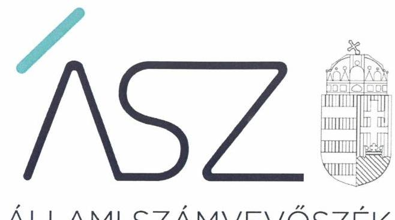
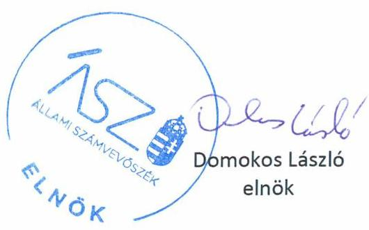
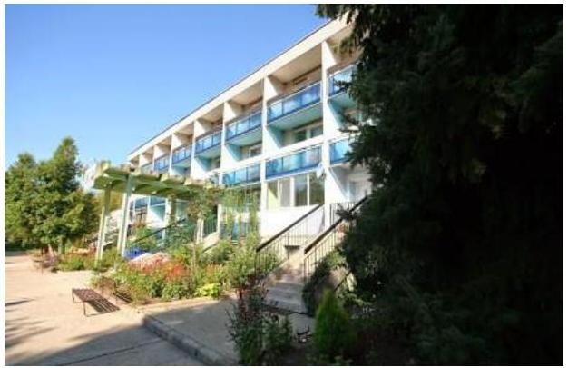
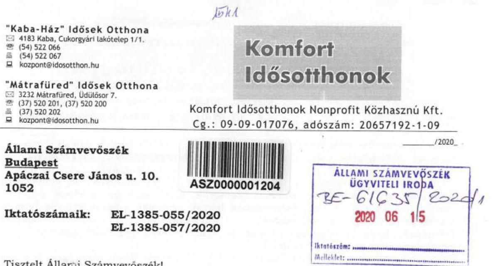
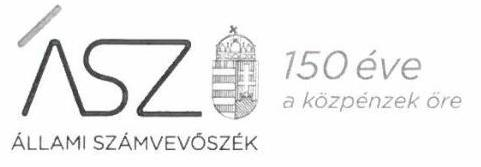
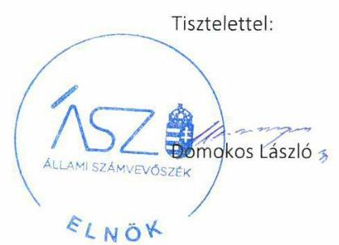
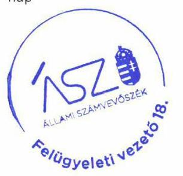

ÁLLAMI SZÁMVEVŐSZÉK

# JELENTÉS 

## Nem állami humánszolgáltatók ellenőrzése

A szociális humánszolgáltatást nyújtó intézmények, szolgáltatók államháztartáson kívüli fenntartói központi költségvetésből kapott támogatásai felhasználásának ellenőrzése Komfort Idősotthonok Időseket Gondozó Nonprofit Közhasznú

Korlátolt Felelősségű Társaság

2020. 

20148
www.asz.hu

---

ÁLLAMI SZÁMVEVŐSZÉK

# JELENTÉS 

## Nem állami humánszolgáltatók ellenőrzése

A szociális humánszolgáltatást nyújtó intézmények, szolgáltatók államháztartáson kívüli fenntartói központi költségvetésből kapott támogatásai felhasználásának ellenőrzése Komfort Idősotthonok Időseket Gondozó Nonprofit Közhasznú

Korlátolt Felelősségű Társaság
2020. 07. hó 24. nap

20148
www.asz.hu

---

# AZ ELLENŐRZÉST FELÜGYELTE: 

VARGA EDIT felügyeleti vezető

## AZ ELLENŐRZÉST VEZETTE ÉS A VÉGREHAJTÁSÁÉRT FELELŐS:

VALASTYÁNNÉ DR. VÍZHÁNYÓ JÚLIA ellenőrzésvezető
TESKI NORBERT ellenőrzésvezető

## A PROGRAM ÖSSZEÁLLÍTÁSÁÉRT FELELŐS:

FEKETE-NAGY ANDRÁS GÁBOR ellenőrzési program készítéséért felelős vezető

TÓTPÁL SZABOLCS osztályvezető

Jelentéseink az Országgyúlés számítógépes hálózatán és az interneten a www.asz.hu címen is olvashatóak.

IKTATÓSZÁM: EL-2806-001/2020
TÉMASZÁM: 2491
ELLENŐRZÉS-AZONOSÍTÓ SZÁM: V083567, V0867111

---

# TARTALOMJEGYZÉK 

■ ÖSSZEGZÉS ..... 5
■ AZ ELLENŐRZÉS CÉLJA ..... 6
■ AZ ELLENŐRZÉS TERÜLETE ..... 7
■ AZ ELLENŐRZÉS HÁTTERE, INDOKOLTSÁGA ..... 8
■ A JELENTÉS LÉNYEGES KÉRDÉSKÖREI ..... 9
■ AZ ELLENŐRZÉS HATÓKÖRE ÉS MÓDSZEREI ..... 10
■ MEGÁLLAPÍTÁSOK ..... 12
■ MELLÉKLETEK ..... 13
I. sz. melléklet: Értelmező szótár ..... 13
■ FÜGGELÉK: ÉSZREVÉTELEK ..... 15
■ RÖVIDÍTÉSEK JEGYZÉKE ..... 21

---

.

---

# ÖSSZEGZÉS 

A kabai székhelyű Komfort Idősotthonok Időseket Gondozó Nonprofit Közhasznú Korlátolt Felelősségű Társaság a 2015-2018. években a közpénzekre vonatkozó gazdálkodásával a nyilvánosság előtt nem számolt el, ezáltal nem biztosította a szociális humánszolgáltatási közfeladatok ellátására kapott költségvetési támogatások elszámoltathatóságát.

## Az ellenőrzés társadalmi indokoltsága

A szociális gondoskodást igénylők védelme az Alaptörvényben meghatározott, a társadalom szempontjából fontos tevékenységek. Jogszabályok teszik lehetővé, hogy államháztartáson kívüli szervezetek - így például az egyházi fenntartók, alapítványok, gazdasági társaságok, egyesületek - által fenntartott intézmények is végezzenek szociális és gyermekvédelmi feladatokat. Mindehhez a központi költségvetés évente jelentős összegű támogatással járul hozzá. Az államháztartáson kívüli, humánszolgáltatást végző intézmények az igényelt közpénzekből társadalmilag hasznos, közösségteremtő, közérdekű, illetve közhasznú tevékenységet végeznek, illetve közfeladatokat látnak el.

Az intézményfenntartók ellenőrzésével az Állami Számvevőszék hozzájárul ahhoz, hogy ezen közpénzeket az államháztartáson kívüli szervezetek is ellenőrizhető, átlátható és elszámoltatható módon használják fel a közfeladatok ellátása során. Az ellenőrzések célja továbbá, hogy a nyilvánosság és az igénybevevők megfelelő tájékoztatást kapjanak az államháztartáson kívüli közfeladatot ellátók működéséről.

Az ÁSZ ellenőrzései arra adnak választ, hogy az intézményfenntartók arra használták-e fel a közpénzeket, amire igényelték.

A szabályszerű gazdálkodás elengedhetetlen a közfeladat ellátás szakmai céljainak megvalósításához, valamint a társadalmi közbizalom fenntartásához.

## Főbb megállapítások, következtetések

A kabai székhelyű Komfort Idősotthonok Időseket Gondozó Nonprofit Közhasznú Korlátolt Felelősségű Társaság, mint Fenntartó a 2015-2018. években a szociális humánszolgáltatási közfeladat ellátására kapott intézményei működéséhez felhasznált közpénzekre vonatkozó gazdálkodásával a nyilvánosság előtt nem számolt el. A jogszabályi előírás ellenére beszámoló készítési kötelezettségének nem tett eleget, ezáltal nem biztosította a költségvetési támogatások felhasználásának elszámoltathatóságát.

A Komfort Idősotthonok Időseket Gondozó Nonprofit Közhasznú Korlátolt Felelősségű Társaság mindezek alapján az Alaptörvény 39. cikk (2) bekezdésében foglaltak ellenére nem biztosította a felhasznált közpénzekre vonatkozó gazdálkodása átláthatóságát.

Ezáltal a Fenntartó nem igazolta, hogy a közpénzt a szociális humánszolgáltatási közfeladatra fordította.

---

# AZ ELLENŐRZÉS CÉLJA

**AZ ELLENŐRZÉS CÉLJA** annak értékelése volt, hogy a nem állami, nem önkormányzati szociális intézmények fenntartói központi költségvetésből kapott támogatásainak felhasználása szabályszerű volt-e.

---

# **AZ ELLENŐRZÉS TERÜLETE**

## **Komfort Idősotthonok Időseket Gondozó Nonprofit Közhasznú Korlátolt Felelősségű Társaság**

A kabai székhelyű Komfort Idősotthonok Időseket Gondozó Nonprofit Közhasznú Korlátolt Felelősségű Társaságot a 2009. évben 100%-os tulajdoni hányaddal a Biztonság és Komfort Szolgáltató Korlátolt Felelősségű Társaság alapította. A tulajdonos az ellenőrzött időszakban nem változott. A Fenntartó1 főtevékenysége az idősek bentlakásos ellátása volt. Közfeladatát két – nem önállóan gazdálkodó – intézményén2 keresztül látta el.

A Fenntartó az ellenőrzött időszakban kiemelten közhasznú jogállással rendelkezett, képviseletét a tulajdonos által megbízott ügyvezető látta el, akinek személye az ellenőrzött időszakban nem változott. A 2018. évben további egy fő ügyvezető került megbízásra.

A Fenntartó részére a központi költségvetésből a szociális feladatellátásra a Magyar Államkincstár által folyósított költségvetési támogatások összege 2015. évben 71,9 millió Ft, a 2016. évben 69,6 millió Ft, a 2017. évben 73,7 millió Ft, a 2018. évben 81,8 millió Ft volt.

---

# **AZ ELLENŐRZÉS HÁTTERE, INDOKOLTSÁGA**

A szociális feladatokat ellátó nem állami intézményfenntartók részére közfeladataik ellátására évente jelentős összegű pénzügyi támogatást biztosítottak a mindenkori költségvetési törvények a bennük megfogalmazott feltételek mellett. A felhasználható állami támogatások a Kvtv.³-ek szerinti előirányzata 2015-2018. években együtt 360 Mrd Ft volt. A 2013. évben jelentős változások következtek be a normatív finanszírozás rendszerében. Az ellenőrzések indokoltságát az is alátámasztja, hogy az ÁSZ⁴ számos szervezetet még nem ellenőrzött ezen a területen.

Az ÁSZ stratégiájában foglaltak alapján is indokolt az ellenőrzés, amely a társadalom számára jelzi, hogy a közpénz államháztartáson kívüli felhasználása sem maradhat ellenőrizetlenül. Az államháztartáson kívülre nyújtott költségvetési támogatások ellenőrzésével az ÁSZ hozzájárul ahhoz, hogy a közpénzeket a nem állami humán fenntartók átlátható módon használják fel a közfeladatok ellátására kötött szerződésekben vállalt kötelezettségek teljesítése érdekében. Az ellenőrzés javaslataival hozzájárulhat az említett rendszerek szabályszerű támogatás felhasználásához, javíthatja a társadalmi-gazdasági döntések megalapozottságát, amely a "jól irányított állam működésének" feltétele.

---

# A JELENTÉS LÉNYEGES KÉRDÉSKÖREI 

1. A szociális humánszolgáltató közfeladatot ellátó államháztartáson kívüli fenntartó szabályszerű működési - és gazdálkodási környezet kialakításával megteremtette-e a költségvetési támogatások átlátható, elszámoltatható igénybevételének, felhasználásának feltételeit?
2. Az államháztartáson kívüli fenntartó a szociális humánszolgáltató intézményei működtetéséhez felhasznált közpénzekre vonatkozó gazdálkodásával a nyilvánosság előtt elszámolt-e?

---

# AZ ELLENŐRZÉS HATÓKÖRE ÉS MÓDSZEREI 

## Az ellenőrzés típusa

Megfelelőségi ellenőrzés.

## Az ellenőrzött időszak

A 2015. január 1. és 2018. december 31. közötti időszak.

## Az ellenőrzés tárgya

Az ellenőrzés a szociális humánszolgáltatási közfeladatokat ellátó államháztartáson kívüli fenntartók humánszolgáltatási közfeladatai ellátásához a központi költségvetésből kapott támogatásaik humánszolgáltatási közfeladatokra való fenntartó általi felhasználása szabályszerűségének értékelésére terjedt ki.

## Az ellenőrzött szervezet

Komfort Idősotthonok Időseket Gondozó Nonprofit Közhasznú Korlátolt Felelősségű Társaság

## Az ellenőrzés jogalapja

Az ellenőrzés jogszabályi alapját az ÁSZ tv5. 1. § (3) bekezdése, 5. § (3) bekezdésben foglalt előírások adják.

## Az ellenőrzés módszerei

Az ellenőrzést az ellenőrzési program annak szempontjai, kérdései, az ellenőrzött időszakban hatályos jogszabályok, a nemzetközi standardokat irányadónak tekintve, az ellenőrzés szakmai szabályok és módszertanok figyelembe vételével rendelte elvégezni. A közpénzekkel való felelős gazdálkodás segítésére irányuló javaslatok kidolgozásakor a hatályos jogszabályok voltak az irányadóak.

Az ellenőrzés ideje alatt az ellenőrzött szervezettel történő kapcsolattartást az ÁSZ SZMSZ ${ }^{6}$-ének vonatkozó előírásai alapján biztosította az ÁSZ.

---

Az ellenőrzési kérdések megválaszolásához szükséges bizonyítékok megszerzése az ellenőrzött által rendelkezésre bocsátott dokumentumokra, adatokra alapozva megfigyelés, szemle (szemrevételezés), kérdésfeltevés (információkérés), valamint elemző eljárással történt.

Az ellenőrzési bizonyítékként felhasználható adatforrások közé tartoztak egyrészt az ellenőrzési program részletes szempontjainál felsorolt adatforrások, másrészt minden - az ellenőrzés folyamán feltárt, az ellenőrzés szempontjából információt tartalmazó - dokumentum.

Az ellenőrzés lefolytatásához az ellenőrzött szervezet a kitöltött tanúsítványok, valamint az ÁSZ által kért dokumentumok elektronikus úton való megküldésével szolgáltatott adatokat, információkat. Az így rendelkezésre bocsátott adatok, információk és a tanúsítványok adatai valódiságának kontrollja az ellenőrzés keretében történt.

Az egységes értelmezést támogatta a jelentés mellékletét képező fogalomtár és rövidítésjegyzék.

Az ellenőrzést a szociális humánszolgáltatások esetében a központi költségvetési támogatások igénylésével, módosításával, felhasználásával, elszámolásával kapcsolatos feladatokat ellátó államháztartáson kívüli fenntartónál végezte az ÁSZ. A fenntartott intézménynél helyszíni szemle keretében győződött meg a tényleges feladatellátásról (verifikáció).

A szociális humánszolgáltatások központi költségvetési támogatásaival kapcsolatos, államháztartáson kívüli fenntartó jogszabályokban előírt feladatai betartását, továbbá a központi költségvetési támogatások szabályszerű nyilvántartását ellenőrizte az ÁSZ a fenntartónál a rendelkezésre álló nyilvántartások, beszámolók és egyéb dokumentumok alapján. Az ellenőrzés nem terjedt ki a szociális humánszolgáltatások központi költségvetési támogatásai igénylése, módosítása, elszámolása valódiságának, megalapozottságának, helyességének - sem a fenntartónál, sem a székhely intézményeinél való - értékelésére (mivel ennek felülvizsgálata, ellenőrzése a finanszírozó jogszabályban előírt feladata, határozatai kiadása előtt). Továbbá nem terjedt ki az ellenőrzés e források, intézmények általi szabályszerű felhasználásának értékelésére.

---

# MEGÁLLAPÍTÁSOK 

## 1. A szociális humánszolgáltató közfeladatot ellátó államháztartáson kívüli fenntartó szabályszerű működési - és gazdálkodási környezet kialakításával megteremtette-e a költségvetési támogatások átlátható, elszámoltatható igénybevételének, felhasználásának feltételeit?

Összegző megállapítás

A Fenntartó a működési környezetét szabályosan kialakította, azonban nem gondoskodott a szabályszerű gazdálkodási környezet kialakításáról.

A Fenntartó a jogszabályi előírásoknak megfelelően rendelkezett Alapító okirattal.

A Fenntartó a Számv. tv. ${ }^{7}$ előírásainak megfelelően rendelkezett Számviteli politikával ${ }^{8}$, azonban a 2015-2018. években a Számv. tv. 14. § (5) bekezdés b) pontja ellenére annak keretében nem készítette el az eszközök és források értékelési szabályzatát.

A Fenntartó a 2015-2018. években a Számv. tv. 161/A § (1) bekezdése ellenére belső szabályzatait nem úgy alakította ki, hogy azok a beszámoló adatainak közvetlen alátámasztására alkalmasak legyenek. A Számv. tv. 161. § (2) bekezdés d) pontjában foglaltak ellenére a számlarend nem tartalmazta az azt alátámasztó bizonylati rendet.

## 2. Az államháztartáson kívüli fenntartó a szociális humánszolgáltató intézményei működtetéséhez felhasznált közpénzekre vonatkozó gazdálkodásával a nyilvánosság előtt elszámolt-e?

Összegző megállapítás

A Fenntartó a 2015-2018. években a humánszolgáltató intézményei működtetéséhez felhasznált közpénzekre vonatkozó gazdálkodásával a nyilvánosság előtt nem számolt el.

A Fenntartó a Számv. tv. 4. § (1) bekezdésében meghatározattak ellenére a 2015-2018. években a beszámoló készítési kötelezettségének nem tett eleget, mivel a 2015-2017. években a Számv. tv. 20. § (6) bekezdése ellenére a mérleg, az eredménykimutatás és a kiegészítő melléklet nem tartalmazta a Fenntartó képviseletére jogosult aláírását, továbbá a 2018. évben a beszámoló a Számv. tv. 96. § (1) bekezdése ellenére nem tartalmazott kiegészítő mellékletet.

Mindezek által a Fenntartó nem biztosította a költségvetési támogatások felhasználásának átláthatóságát.

---

# MELLÉKLETEK 

- I. SZ. MELLÉKLET: ÉRTELMEZŐ SZÓTÁR
humánszolgáltatás
költségvetési támogatás
nem állami, nem önkormányzati (államháztartáson kívüli) intézmény fenntartó
székhely intézmény
telephely

Külön törvényben meghatározott szociális, gyermekjóléti, gyermekvédelmi, közoktatási, felsőoktatási, kulturális közfeladatok (2015. évi Kvtv. ${ }^{9}$ 43. § (1), (4) bekezdés, 1. számú melléklet XX/20/2/3. jogcím csoport, 19. alcím, 2016. évi Kvtv. 41. § (1), (4) bekezdés, 1. számú melléklet XX/20/2/3. jogcím csoport, 19. alcím).
a társadalombiztosítás pénzügyi alapjai kivételével az államháztartás központi alrendszeréből ellenérték nélkül, pénzben nyújtott támogatások (Áht. ${ }^{10}$ 1. § 14. pont)
a költségvetési törvényekben (2014. évi C. törvény 42-43. §, 2015. évi C. törvény 40-41. §) megállapított támogatás. Például a 2015. évi C. törvény 40-41. § szerint többek között: Az Országgyűlés a szociális, gyermekjóléti, gyermekvédelmi közfeladatot ellátó intézményt, szolgáltatást fenntartó egyházi jogi személy, civil szervezet, közalapítvány, országos nemzetiségi önkormányzat, települési vagy területi nemzetiségi önkormányzat, gazdasági társaság, és a humánszolgáltatást alaptevékenységként végző, az Szja tv. hatálya alá tartozó egyéni vállalkozó (a továbbiakban együtt: nem állami szociális fenntartó) részére támogatást állapít meg a következők szerint: a támogatás a nem állami szociális fenntartót a települési önkormányzatok 2. melléklet III. pont 3. alpont c)-k) pontjában és III. pont 5. alpont a) pontjában meghatározott

 támogatásaival azonos jogcímeken, összegben és feltételek mellett illeti meg.
A szociális, gyermekjóléti és gyermekvédelmi közfeladatokat/humánszolgáltatásokat ellátó intézményt fenntartó egyházi jogi személy, társadalmi szervezet, alapítvány, közalapítvány, civil szervezet, országos nemzetiségi önkormányzat, nonprofit gazdasági társaság, gazdasági társaság és a humánszolgáltatást alaptevékenységként végző, Szja tv. hatálya alá tartozó egyéni vállalkozó. (2015. évi Kvtv. 42. §, 43. § (1), (4) bekezdés, 2016. évi Kvtv. ${ }^{11} 40 . \S, 41 . \S$ (1), (4) bekezdés, 2017. évi Kvtv. ${ }^{12} 41 . \S$ (1), (4)),
a szolgáltató székhelye, azaz a szolgáltató központi ügyintézésének helye, függetlenül attól, hogy használják-e szolgáltatás nyújtására (Sznyvhr ${ }^{13}$. 1.§ k) pont) (hatályos: 2013. december 1-től)
a szolgáltató székhelyétől különböző, szolgáltató/intézmény használatában álló hely, a szociális humánszolgáltatáshoz használt, bejegyzett hely. (Sznyvhr. 1.§ l) pont) (hatályos: 2015. január 1-től)

---

.

---

# FÜGGELÉK: ÉSZREVÉTELEK 

A jelentéstervezetet a Számvevőszék 15 napos észrevételezésre megküldte az ellenőrzött szervezet vezetőjének az ÁSZ tv. 29. § (1) bekezdése előírásának megfelelően.

A Komfort Idősotthonok Időseket Gondozó Nonprofit Közhasznú Korlátolt Felelősségű Társaság ügyvezetője élt az ÁSZ tv. 29. § (2) bekezdésében foglalt észrevételezési jogával, a jelentéstervezet megállapításaira a törvényes határidőn belül észrevételt tett.
A Komfort Idősotthonok Időseket Gondozó Nonprofit Közhasznú Korlátolt Felelősségű Társaság ügyvezetőjének észrevételét és az arra adott választ a függelék tartalmazza.

[^0]
[^0]:    * 29. § (1) Az Állami Számvevőszék az ellenőrzési megállapításait megküldi az ellenőrzött szervezet vezetőjének vagy az általa megbízott személynek, és annak, akinek személyes felelősségét állapította meg.
    (2) Az ellenőrzött szervezet vezetője és a felelősként megjelölt személy az ellenőrzés megállapításaira tizenöt napon belül írásban észrevételt tehet.
    (3) Az Állami Számvevőszék az észrevételre a beérkezésétől számított harminc napon belül írásban válaszol. A figyelembe nem vett észrevételeket köteles a jelentésben feltüntetni, és megindokolni, hogy azokat miért nem fogadta el.

---

Tisztelt Állami Számvevőszék!

Alulírott Bihari László, mint a Komfort Idősotthonok Nonprofit Közhasznú Kft. ügyvezetője az EL-1385-057/2020. iktatószámon megküldött jelentéstervezetre az alábbi észrevételt teszem:

Összefoglaló megállapításuk az, hogy „A Fenntartó a 2015-2018. években a humánszolgáltató intézményei működéséhez felhasznált közpénzekre vonatkozó gazdálkodásával a nyilvánosság előtt nem számolt el." Megállapításuk arra hivatkozik, hogy a 2015-2017. években a mérleg, eredménykimutatás és kiegészítő melléklet nem tartalmazta a Fenntartó képviseletére jogosult aláírását, illetve 2018. évben a beszámoló nem tartalmazott kiegészítő mellékletet. Függelékükben azt írják, hogy a beszámolókészítési kötelezettségének a fenntartó 2015-2017. években illetve 2018. évben nem tett eleget, így az átláthatóságot nem biztosította, a közzétett adatok kétségesek.

A jelentéstervezetben tett megállapításaikat nem fogadjuk el. Előadom, hogy a Komfort Idősotthonok Nonprofit Közhasznú Kft. mind 2015-2017. évben, mind 2018. évben a 2000. évi C. törvényben előírt beszámolókészítési kötelezettségének eleget tett. Csupán adminisztratív hibának köszönhető, hogy az Önöknek 2015-2017. évekre vonatkozóan megküldött beszámolók nem tartalmazták a képviselő aláírását, illetve a 2018. évi kiegészítő melléklet a dokumentumok digitalizálásánál egyszerűen lemaradt. Igazolásul jelen levelünkhöz mellékelten becsatoljuk a 2015-2017. évi aláírt beszámolókat és a 2018. évi kiegészítő mellékletet hitelesített másolatokban. Előadom továbbá, hogy a beszámolók letétbe helyezése és közzététele a 2006. évi V. törvény 18. §-ában foglaltak szerint minden évben jogszabály szerint, határidőben megtörtént! A céginformációs szolgálat honlapján a közzététel céljából megküldött beszámolók haladéktalanul és ingyenesen megismerhetővé válnak. A beszámolót, illetve annak elektronikus másolatát a céginformációs szolgálat őrzi. Így téves azon megállapításuk, hogy a közpénzekre vonatkozó gazdálkodásával a Fenntartó nem számolt el és nem biztosította a költségvetési támogatások felhasználásának átláthatóságát, így nem igazolta, hogy a közpénzt a szociális humánszolgáltatási közfeladatra fordította.

A jelentéstervezetben tett megállapításuk nem lehet helytálló azért sem, mert a Fenntartó a 489/2013. (XII. 18.) Korm. rendelet 17. §-a alapján minden év január 31. napjáig elszámolt. A hivatkozott jogszabály 19. §-a alapján „A támogatás igénylésének jogszerűségét és elszámolásának szabályszerűségét az igazgatóságok ellenőrzik. Az ellenőrzés kiterjed a támogatásra való jogosultsághoz előírt jogszabályi

---

"Kaba-Ház" Idősek Otthona
(C) 4183 Kaba, Cukorgsárló lakótelep 1/1.
(54) 522066
(54) 522067
kozzont@idosotthon.hu
"Mátrafüred" Idősek Otthona
(c) 2232 Mátrafüred, Üdülősor 7.
(37) 520 201, (37) 520200
(37) 520202
kozzont@idosotthon.hu

## Komfort Idősotthonok

Komfort Idősotthonok Nonprofit Közhasznú Kft.
Cg.: 09-09-017076, adószám: 20657192-1-09
feltételek teljesítésének, az igénylés alapját jelentő feladatmutatók teljesítésének és megalapozottságának, valamint a felhasználás jogszerűségének a vizsgálatára."

A 2011. évi LXVI. törvény 24. §. (1) bek. b. pontja kimondja, hogy az Állami Számvevőszék „az ellenőrzés végrehajtása során a jogszabályok, az ellenőrzési program, és az ellenőrzési szakmai szabályok, módszerek és az etikai normák szerint kell eljárni". A jelentéstervezetben leírtak szimplán adminisztrációs hibára visszavezethető következtetést tartalmaznak, nem tartjuk etikusnak, hogy az ellenőrzés során a nyilvánvalóan pótolható hiányosságok pótlására a cégünket nem hívták fel.

Fent leírtakra tekintettel kérem a Tisztelt Állami Számvevőszéket, hogy a jelentéstervezetüket módosítani szíveskedjenek!

Az EL-1385-055/2020. iktatószámú felhívásukban foglaltaknak megfelelően ezúton megküldjük Önöknek az alábbi dokumentumok hiteles másolatát:

- Komfort Idősotthonok Nonprofit Közhasznú Kft. 2019.01.01. napjától érvényes Számviteli Politikája;
- A 2019. évben kapott költségvetési támogatások kimutatása, valamint felhasználásának feladatonkénti bontásban történő elkülönített kimutatása (Főkönyvi kivonat munkaszám: 19 'Caba, Főkönyvi kivonat Munkaszám: 19 Füred);
- A 2019. évi költségvetési támogatás elszámolásáról a Magyar Államkincstár részére megküldött elszámolás (megküldve 2020.01.30-án, illetve javítva 2020.02.07-én), valamint a Magyar Államkincstár HAJ-ÁHI/73-6/2020. számú határozata;
- A Fenntartó 2019. évi záró főkönyvi kivonata;
- A Fenntartó 2019. évi egyszerűsített éves beszámolója (mérleg, eredménykimutatás, kiegészítő melléklet).

A megküldött dokumentumokkal kapcsolatosan tájékoztatom Önöket, hogy a 140/2020. (IV. 21.) Korm. rendelet 2. § (1) bekezdése alapján a számvitelről szóló 2000. évi C. törvény szerinti beszámolókra vonatkozó beszámolókészítési, nyilvánosságra hozatali, letétbehelyezési és közzétételi, továbbá benyújtási (leadási, megküldési) határidők 2020. szeptember 30-ig meghosszabbodtak. A beszámoló fő sorait nagyságrendben nem érintő kisebb módosítások még lehetnek a könyvelésben. A beszámolót a taggyűlés még nem fogadta el.

Kérem a Tisztelt Állami Számvevőszéket, hogy eljárásuk során a beküldött dokumentumokat figyelembe venni szíveskedjenek, hiszen cégünk nem jogszabályellenesen működik, a közpénzek felhasználása a célnak megfelelően történik, gazdálkodásunk átlátható és elszámoltatható.

Komfort Idősotthonok
Nonprofit Közhasznú Kft.
Kaba, 2020. június 10.
Tisztelettel:
4183 Kaba, Cukorgsárló lakótelep 1/1 Adószám: 20657192-1-09 Cg.: 09.09.017076
Bihari László
ügyvezető

---

Ikt. szám: EL-1385-060/2020.

Bihari László úr
ügyvezető

Komfort Idősotthonok Időseket Gondozó Nonprofit Közhasznú Korlátolt Felelősségű Társaság

# Kaba 

Tisztelt Ügyvezető Úr!

A „Nem állami humánszolgáltatók ellenőrzése - A szociális humánszolgáltatást nyújtó intézmények, szolgáltatók államháztartáson kívüli fenntartói központi költségvetésből kapott támogatásai felhasználásának ellenőrzése - Komfort Idősotthonok Időseket Gondozó Nonprofit Közhasznú Korlátolt Felelősségű Társaság" címmel készített számvevőszéki jelentéstervezetre a 2020. június 10-én kelt levélben megküldött észrevételeit megkaptam.

Az Állami Számvevőszék észrevételekre vonatkozó álláspontjáról a felügyeleti vezető által készített részletes tájékoztatást csatoltan megküldöm.

Tájékoztatom Ügyvezető urat, hogy a számvevőszéki jelentésben - az Állami Számvevőszékről szóló 2011. évi LXVI. törvény 29. § (3) bekezdése alapján - a figyelembe nem vett észrevételeket szerepeltetjük az elutasítás indokának feltüntetésével.

Budapest, 2020. június 25.

Melléklet: Tájékoztatás az észrevételek kezeléséről

---

# Tájékoztatás az észrevételek kezeléséről 

„Nem állami humánszolgáltatók ellenőrzése - A szociális humánszolgáltatást nyújtó intézmények, szolgáltatók államháztartáson kívüli fenntartói központi költségvetésből kapott támogatásai felhasználásának ellenőrzése - Komfort Idősotthonok Időseket Gondozó Nonprofit Közhasznú Korlátolt Felelősségű Társaság" című jelentéstervezetre (továbbiakban: jelentéstervezet) a 2020. június 10-én kelt levelében megküldött észrevételeit áttekintettem. Az észrevételek kezeléséről az alábbi tájékoztatást adom.
A jelentéstervezet összegzéséhez, a megállapítások, következtetések részhez, a 2. számú összegző megállapítás 1-2. bekezdéseihez, valamint az I. számú függelékhez tett észrevétel
Ügyvezető úr észrevételében tájékoztatta az Állami Számvevőszéket (továbbiakban: ÁSZ), hogy a jelentéstervezet megállapításait nem fogadják el. A Komfort Idősotthonok Időseket Gondozó Nonprofit Közhasznú Korlátolt Felelősségű Társaság (továbbiakban: Fenntartó) mind 2015-2017. évben, mind 2018. évben a számvitelről szóló 2000. évi C. törvényben (továbbiakban: Számv. tv.) előírt beszámolókészítési kötelezettségének eleget tett. Csupán adminisztratív hibának köszönhető, hogy a 2015-2017. évekre vonatkozóan megküldött beszámolók nem tartalmazták a képviselő aláírását, illetve a 2018. évi kiegészítő melléklet a dokumentumok digitalizálásánál egyszerűen lemaradt. Igazolásul észrevételével megküldte a Fenntartó 2015-2017. évi aláírt beszámolóit és a 2018. évi kiegészítő mellékletet hitelesített másolatokban. Észrevételében Ügyvezető úr előadta, hogy a beszámolók letétbe helyezése és közzététele a 2006. évi V. törvény 18. §-ában foglaltak szerint minden évben jogszabály szerint, határidőben megtörtént. A céginformációs szolgálat honlapján a közzététel céljából megküldött beszámolók haladéktalanul és ingyenesen megismerhetővé válnak. A beszámolót, illetve annak elektronikus másolatát a céginformációs szolgálat őrzi. Így téves az ÁSZ azon megállapítása, hogy a közpénzekre vonatkozó gazdálkodásával a Fenntartó nem számolt el és nem biztosította a költségvetési támogatások felhasználásának átláthatóságát, így nem igazolta, hogy a közpénzt a szociális humánszolgáltatási közfeladatra fordította. Ügyvezető úr a jelentéstervezetben tett megállapítást amiatt is kétségbe vonja, mert a Fenntartó a 489/2013. (XII. 18.) Korm. rendelet 17. §-a alapján minden év január 31. napjáig elszámolt, amit a Magyar Államkincstár megyei igazgatósága ellenőrzött. Ügyvezető úr észrevételében kijelenti, hogy a jelentéstervezetben leírtak szimplán adminisztrációs hibára visszavezethető következtetést tartalmaznak, ezért nem tartják etikusnak, hogy az ellenőrzés során a Fenntartót a nyilvánvalóan pótolható hiányosságok pótlására az ÁSZ nem hívta fel, ezért kéri, hogy az ÁSZ módosítsa a jelentéstervezetet.
Az Állami Számvevőszékről szóló 2011. évi LXVI. törvény (továbbiakban: ÁSZ tv.) 28. § (2) bekezdése szerint, a közreműködésre felhívott szervezet az ÁSZ részére - annak kérésére soron kívül, de legkésőbb öt munkanapon belül - az ellenőrzés tervezhetősége, meghatározása, illetve lefolytatása érdekében szükséges adatokat és dokumentumokat rendelkezésre bocsátja, illetve a kapcsolódó tájékoztatást köteles megadni.
Az ÁSZ a 2015-2018. évek viszonylatában az ellenőrzés során kérte többek között a Fenntartó számviteli beszámolóit az ÁSZ részére megküldeni az EL-1385-001/2018. és az EL-1385-044/2020.

---

iktatószámú adatbekérő levelek 2. számú mellékletében foglaltak szerint. Ügyvezető úr a 2018. december 19-én és 2020. január 27-én kelt teljességi és hitelességi nyilatkozataiban foglaltak szerint a kért beszámolókat az ÁSZ rendelkezésére bocsátotta.

A Fenntartó 2015-2018. évekre vonatkozó számviteli beszámolóit megvizsgáltam és megállapítottam, ahogyan azt Ügyvezető úr észrevételében is elismeri, hogy a Fenntartó 2015-2017. évekre vonatkozó számviteli beszámolói nem tartalmazták a Fenntartó képviseletére jogosult személy (Ügyvezető úr) aláírását, továbbá a 2018. évi számviteli beszámoló nem tartalmaz kiegészítő mellékletet.

A Számv. tv. 20. § (6) bekezdése előírja, hogy az éves beszámoló részét képező mérleget, eredménykimutatást és kiegészítő mellékletet a hely és a kelte feltüntetésével a vállalkozó képviseletére jogosult személy köteles aláírni. A Számv. tv. 96. § (1) bekezdése pedig rögzíti, hogy az egyszerűsített éves beszámoló a Számv. tv 96. § (2)-(4) bekezdés szerinti mérlegből, eredménykimutatásból és kiegészítő mellékletből áll. A Fenntartó által az ellenőrzés rendelkezésére bocsátott 2015-2017. évi beszámolók a Fenntartó képviseletére jogosult személy aláírásának elmaradása miatt, a 2018. évi beszámoló kiegészítő melléklet hiányában nem tekinthető a Fenntartó egyszerűsített éves beszámolóinak,
 így a Fenntartó a Számv. tv. 4. § (1) bekezdése szerinti beszámoló készítési kötelezettségének 2015-2018. években nem tett eleget.

Ügyvezető úr tájékoztatását a Fenntartó költségvetési támogatásainak elszámolásáról és a Magyar Államkincstár által végzett ellenőrzésekről köszönöm, azonban tájékoztatom, hogy az ÁSZ ellenőrzési megállapításait az egyéb ellenőrzést végző szervek ellenőrzési megállapításaitól függetlenül, kizárólag az ÁSZ tv. 28. § (2) bekezdésben meghatározott adatszolgáltatási időszakon belül megküldött, teljességi és hitelességi nyilatkozattal alátámasztott dokumentumokra alapozva teszi. Ügyvezető úr nyilatkozott az adatszolgáltatás során arról, hogy az ÁSZ részére átadott dokumentumok, adatok megbízhatóak, és a bekért adatokra, dokumentumokra vonatkozóan teljes körű információt tartalmaznak. Az ÁSZ az adatszolgáltatásra nyitva álló törvényes határidőn túl beküldött dokumentumokat, így az észrevételéhez mellékelt dokumentumokat nem értékeli.

A fent leírtakra tekintettel az észrevételt nem fogadjuk el, a jelentéstervezet megállapításai helytállóak, módosítása nem indokolt.

Budapest, 2020. CC. hónap 2. 8. nap

Varga Edit felügyeleti vezető s.k.

A kiadmány hiteles

---

# RÖVIDÍTÉSEK JEGYZÉKE 

${ }^{1}$ Fenntartó
${ }^{2}$ Intézmény
${ }^{3}$ Kvtv-ek
${ }^{4}$ ÁSZ
${ }^{5}$ ÁSZ tv.
${ }^{6}$ ÁSZ SZMSZ
${ }^{7}$ Számv. tv.
${ }^{8}$ Számviteli politika
${ }^{9}$ 2015. évi Kvtv.
${ }^{10}$ Áht.
${ }^{11}$ 2016. évi Kvtv.
${ }^{12}$ 2017. évi Kvtv.
${ }^{13}$ Sznyvhr.

Komfort Idősotthonok Időseket Gondozó Nonprofit Közhasznú Korlátolt Felelősségű Társaság
"Kaba-Ház" Idősek Otthona székhely intézmény: 4183 Kaba Cukorgyári lakótelep 1.
"Mátrafüred" Idősek Otthona telephely: 3232 Mátrafüred, Üdülősor 7.
2014. évi C. törvény Magyarország 2015. évi központi költségvetéséről
2015. évi C. törvény Magyarország 2016. évi központi költségvetéséről
2016. évi XC. törvény Magyarország 2017. évi központi költségvetéséről
2017. évi C. törvény Magyarország 2018. évi központi költségvetéséről

Állami Számvevőszék
2011. évi LXVI. törvény az Állami Számvevőszékről

Az Állami Számvevőszék elnökének 3/2019. (XII. 23.) ÁSZ utasítása az Állami
Számvevőszék Szervezeti és Működési Szabályzatáról
(hatályos: 2020. január 1-jétől),
2000. évi C. törvény a számvitelről

Számviteli politika: Komfort Idősotthonok Időseket Gondozó Nonprofit Közhasznú Kft. számlarendje (hatályos: 2015. január 1-jétől - 2015. december 31-ig)
Számviteli politika: Komfort Idősotthonok Időseket Gondozó Nonprofit Közhasznú Kft. számlarendje (hatályos: 2016. január 1-jétől - 2016. december 31-ig)
Számviteli politika: Komfort Idősotthonok Időseket Gondozó Nonprofit Közhasznú Kft. számlarendje (hatályos: 2017. január 1-jétől
2014. évi C. törvény Magyarország 2015. évi központi költségvetéséről
2011. évi CXCV. törvény az államháztartásról
2015. évi C. törvény Magyarország 2016. évi központi költségvetéséről
2016. évi XC. törvény Magyarország 2017. évi központi költségvetéséről
369/2013. (X. 24.) Korm. rendelet a szociális, gyermekjóléti és gyermekvédelmi szolgáltatók, intézmények és hálózatok hatósági nyilvántartásáról és ellenőrzéséről

---

# ASZ 

ÁLLAMI SZÁMVEVŐSZÉK
1052 Budapest, Apáczai Cs. J. u. 10. I 1364 Budapest 4. Pf. 54 TEL: +36 14849100
email: szamvevoszek@asz.hu
web: www.asz.hu | www.aszhirportal.hu

