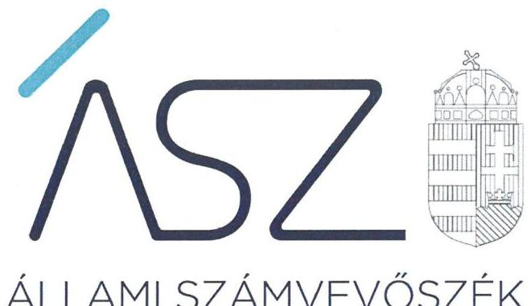
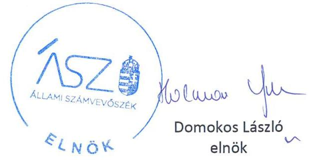
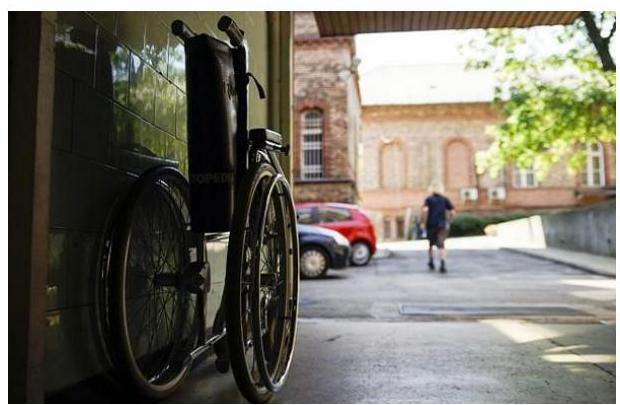
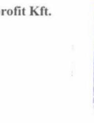
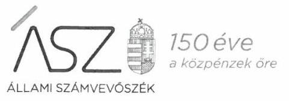
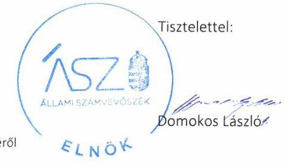
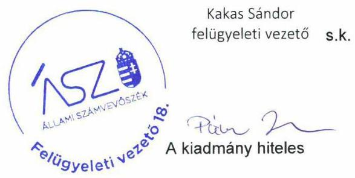

ÁLLAMI SZÁMVEVŐSZÉK

# JELENTÉS 

## Nem állami humánszolgáltatók ellenőrzése

A szociális humánszolgáltatást nyújtó intézmények, szolgáltatók államháztartáson kívüli fenntartói központi költségvetésből kapott támogatásai felhasználásának ellenőrzése – Magyari Kereskedelmi és Szolgáltató Közhasznú Nonprofit Korlátolt Felelősségű Társaság
2020.

20149
www.asz.hu

---

# JELENTÉS

## Nem állami humánszolgáltatók ellenőrzése

A szociális humánszolgáltatást nyújtó intézmények, szolgáltatók államháztartáson kívüli fenntartói központi költségvetésből kapott támogatásai felhasználásának ellenőrzése – Magyari Kereskedelmi és Szolgáltató Közhasznú Nonprofit Korlátolt Felelősségű Társaság

2020. 07. hó 31. nap

20149. www.asz.hu

---

# AZ ELLENŐRZÉST FELÜGYELTE: 

KAKAS SÁNDOR felügyeleti vezető

## AZ ELLENŐRZÉST VEZETTE ÉS A VÉGREHAJTÁSÁÉRT FELELŐS:

GYŐRI GABRIELLA ellenőrzésvezető
DR. TÓTH LILI ellenőrzésvezető

## A PROGRAM ÖSSZEÁLLÍTÁSÁÉRT FELELŐS:

FEKETE-NAGY ANDRÁS GÁBOR ellenőrzési program készítéséért felelős vezető

TÓTPÁL SZABOLCS osztályvezető

Jelentéseink az Országgyúlés számítógépes hálózatán és az interneten a www.asz.hu címen is olvashatóak.

IKTATÓSZÁM: EL-2807-001/2020
TÉMASZÁM: 2491
ELLENŐRZÉS-AZONOSÍTÓ SZÁM: V083550, V0867073

---

# TARTALOMJEGYZÉK 

■ ÖSSZEGZÉS ..... 5
■ AZ ELLENŐRZÉS CÉLJA ..... 6
■ AZ ELLENŐRZÉS TERÜLETE ..... 7
■ AZ ELLENŐRZÉS HÁTTERE, INDOKOLTSÁGA ..... 8
■ A JELENTÉS LÉNYEGES KÉRDÉSKÖREI ..... 9
■ AZ ELLENŐRZÉS HATÓKÖRE ÉS MÓDSZEREI ..... 10
■ MEGÁLLAPÍTÁSOK ..... 12
■ JAVASLATOK ..... 13
■ MELLÉKLETEK ..... 15
I. sz. melléklet: Értelmező szótár ..... 15
■ FÜGGELÉK: ÉSZREVÉTELEK ..... 17
■ RÖVIDÍTÉSEK JEGYZÉKE ..... 23

---

.

---

# ÖSSZEGZÉS 

A nyékládházi székhelyű Magyari Kereskedelmi és Szolgáltató Közhasznú Nonprofit Kft. szociális közfeladat ellátásához rendelt költségvetési támogatásainak felhasználása, a közpénzekkel való gazdálkodása nem volt átlátható és elszámoltatható.

## Az ellenőrzés társadalmi indokoltsága

A szociális gondoskodást igénylők védelme, illetve a köznevelési feladatok ellátása az Alaptörvényben meghatározott, a társadalom szempontjából fontos tevékenységek. Jogszabályok teszik lehetővé, hogy államháztartáson kívüli szervezetek - így például az egyházi fenntartók, alapítványok, gazdasági társaságok, egyesületek - által fenntartott intézmények is végezzenek köznevelési, szociális és gyermekvédelmi feladatokat. Mindehhez a központi költségvetés évente jelentős összegű támogatással járul hozzá. Az államháztartáson kívüli, humánszolgáltatást végző intézmények az igényelt közpénzekből társadalmilag hasznos, közösségteremtő, közérdekű, illetve közhasznú tevékenységet végeznek, illetve közfeladatokat látnak el.

Az intézményfenntartók ellenőrzésével az Állami Számvevőszék hozzájárul ahhoz, hogy ezen közpénzeket az államháztartáson kívüli szervezetek is ellenőrizhető, átlátható és elszámoltatható módon használják fel a közfeladatok ellátása során. Az ellenőrzések célja továbbá, hogy a nyilvánosság és az igénybevevők megfelelő tájékoztatást kapjanak az államháztartáson kívüli közfeladatot ellátók működéséről.

Az ÁSZ ellenőrzései arra adnak választ, hogy az intézményfenntartók arra használták-e fel a közpénzeket, amire igényelték.

A szabályszerű gazdálkodás elengedhetetlen a közfeladat ellátás szakmai céljainak megvalósításához, valamint a társadalmi közbizalom fenntartásához.

## Főbb megállapítások, következtetések, javaslatok

A nyékládházi székhelyű Magyari Kereskedelmi és Szolgáltató Közhasznú Nonprofit Kft a 2015-2018. évre vonatkozóan a jogszabályi előírások ellenére beszámoló készítési kötelezettségének nem tett eleget.

A Magyari Kereskedelmi és Szolgáltató Közhasznú Nonprofit Kft. a 2015-2018. években nem alakított ki szabályszerű gazdálkodási környezetet, mivel a számviteli törvényben előírt számlarendet nem készítette el, ezáltal nem teremtette meg a költségvetési támogatások elszámoltatható, átlátható felhasználásának szabályozási kereteit.

A Magyari Kereskedelmi és Szolgáltató Közhasznú Nonprofit Kft. mindezek alapján az Alaptörvény 39. cikk (2) bekezdésében foglaltak ellenére a felhasznált közpénzekre vonatkozó gazdálkodása elszámoltathatóságát, átláthatóságát nem biztosította. Ezáltal nem igazolta, hogy a közpénzt a szociális humánszolgáltatási közfeladatra fordította.

---

# AZ ELLENŐRZÉS CÉLJA

**AZ ELLENŐRZÉS CÉLJA** annak értékelése volt, hogy a nem állami, nem önkormányzati szociális intézmények fenntartói központi költségvetésből kapott támogatásainak felhasználása szabályszerű volt-e.

---

# **AZ ELLENŐRZÉS TERÜLETE**

## **Magyari Kereskedelmi és Szolgáltató Közhasznú Nonprofit Kft., mint intézményfenntartó**

A nyékládházi székhelyű Fenntartó1 2002. február 1-jén négy természetes személy alapította. A Fenntartó főtevékenységét – idősek, fogyatékosok bentlakásos ellátása – a szociális szolgáltatók nyilvántartásába bejegyzett intézménye, a Viola idősek otthona útján nyújtotta országos jelleggel. A Fenntartó 2016.08.22-től kezdődően közhasznú jogállású. Az Intézmény2 az ellenőrzött időszakban nem volt önállóan gazdálkodó.

A Fenntartó képviseletére az ügyvezető volt jogosult, megbízatása az alapítástól kezdődően határozatlan időre szólt. Az ügyvezető és az intézményvezető személye az ellenőrzött időszakban nem változott.

A Fenntartó részére a szociális humánszolgáltatási feladat ellátásához a Magyar Államkincstár adatai alapján a központi költségvetésből biztosított támogatások összege a 2015. évben 68,4 M Ft, a 2016. évben 72,4 M Ft, a 2017. évben 84,7 M Ft, a 2018. évben 88,5 M Ft volt.

Az alkalmazottak átlagos állományi létszáma a 2018. évben 37 fő volt.

---

# AZ ELLENŐRZÉS HÁTTERE, INDOKOLTSÁGA 

A szociális feladatokat ellátó nem állami intézményfenntartók részére közfeladataik ellátására évente jelentős összegű pénzügyi támogatást biztosítottak a mindenkori költségvetési törvények a bennük megfogalmazott feltételek mellett. A felhasználható állami támogatások a Kvtv. ${ }^{3}$-ben a 2015-2018. években a szociális ágazatra vonatkozóan 360 Mrd Ft előirányzatot határoztak meg.

Az ÁSZ a stratégiájában célul tűzte ki, hogy az államháztartáson kívülre nyújtott költségvetési támogatások ellenőrzésével hozzájárul ahhoz, hogy a közpénzeket az államháztartáson kívüli szervezetek is átlátható módon használják fel a közfeladatok ellátására kötött szerződésekben vállalt ellátása érdekében. Az ÁSZ stratégiájában foglaltak alapján is indokolt az ellenőrzés, amely a társadalom számára jelzi, hogy a közpénzek államháztartáson kívüli felhasználása sem maradhat ellenőrizhetetlenül. Az államháztartáson kívülre nyújtott költségvetési támogatások ellenőrzésével az ÁSZ hozzájárul ahhoz, hogy a közpénzeket a nem állami humán fenntartók átlátható módon használják fel a közfeladatok ellátására kötött szerződésben vállalt kötelezettségek teljesítése érdekében. Az ellenőrzés javaslataival hozzájárul az említett rendszerek szabályszerű támogatás felhasználásához, javítja a társadalmi-gazdasági döntések megalapozottságát, ami a „jól irányított állam" feltétele.

---

# A JELENTÉS LÉNYEGES KÉRDÉSKÖREI 

1. A szociális humánszolgáltató közfeladatot ellátó államháztartáson kívüli fenntartó szabályszerű működési- és gazdálkodási környezet kialakításával megteremtette-e a költségvetési támogatások átlátható, elszámoltatható igénybevételének, felhasználásának feltételeit?
2. Az államháztartáson kívüli fenntartó az átvállalt szociális humánszolgáltatási közfeladathoz biztosított költségvetési támogatásokat szabályszerűen fordította-e a humánszolgáltató Intézménye működtetésére, a felhasznált közpénzekre vonatkozó gazdálkodásával a nyilvánosság előtt elszámolt-e?

---

# AZ ELLENŐRZÉS HATÓKÖRE ÉS MÓDSZEREI 

## Az ellenőrzés típusa

Megfelelőségi ellenőrzés.

## Az ellenőrzött időszak

A 2015. január 1. és 2018. december 31-e közötti időszak.

## Az ellenőrzés tárgya

Az ellenőrzés a szociális humánszolgáltatási közfeladatokat ellátó államháztartáson kívüli fenntartók humánszolgáltatási közfeladatai ellátásához a központi költségvetésből kapott támogatásaik humán-szolgáltatási közfeladatokra való fenntartó általi felhasználása szabályszerűségének értékelésére terjedt ki.

## Az ellenőrzött szervezet

Magyari Kereskedelmi és Szolgáltató Közhasznú Nonprofit Kft.

## Az ellenőrzés jogalapja

Az ellenőrzés jogszabályi alapját az ÁSZ tv. ${ }^{4} 1 . \S$ (3) bekezdése, 5. § (3) bekezdésében foglalt előírások adták.

## Az ellenőrzés módszerei

Az ellenőrzést az ellenőrzési program annak szempontjai, kérdései, az ellenőrzött időszakban hatályos jogszabályok, a nemzetközi standardokat irányadónak tekintve, az ellenőrzés szakmai szabályok és módszertanok figyelembe vételével rendelte elvégezni. A közpénzekkel való felelős gazdálkodás segítésére irányuló javaslatok kidolgozásakor a hatályos jogszabályok voltak az irányadóak.

Az ellenőrzés ideje alatt az ellenőrzött szervezettel történő kapcsolattartást az ÁSZ SZMSZ-ének vonatkozó előírásai alapján biztosította az ÁSZ.

Az ellenőrzési kérdések megválaszolásához szükséges bizonyítékok megszerzése az ellenőrzött által rendelkezésre bocsátott dokumentumokra, adatokra alapozva elemző eljárással történt.

---

Az ellenőrzési bizonyítékként felhasználható adatforrások közé tartoztak egyrészt a szakmai program részletes szempontjainál felsorolt adatforrások, másrészt minden - az ellenőrzés folyamán feltárt, az ellenőrzés szempontjából információt tartalmazó - dokumentum.

Az ellenőrzés lefolytatásához az ellenőrzött szervezet a kitöltött tanúsítványok, valamint az ÁSZ által kért dokumentumok elektronikus úton való megküldésével szolgáltatott adatokat, információkat. Az így rendelkezésre bocsátott adatok, információk és a tanúsítványok adatai valódiságának kontrollja az ellenőrzés keretében történt.

Az ellenőrzést a szociális humánszolgáltatások esetében a központi költségvetési támogatások igénylésével, módosításával, felhasználásával, elszámolásával kapcsolatos feladatokat ellátó államháztartáson kívüli fenntartóknál végezte az ÁSZ.

A szociális humánszolgáltatások központi költségvetési támogatásaival kapcsolatos, államháztartáson kívüli fenntartó jogszabályokban előírt feladatai betartását, továbbá a központi költségvetési támogatások szabályszerű nyilvántartását ellenőrizte az ÁSZ a fenntartónál rendelkezésre álló nyilvántartások, beszámolók és egyéb dokumentumok alapján. Az ellenőrzés nem terjedt ki a szociális humánszolgáltatások központi költségvetési támogatásai igénylése, módosítása, elszámolása valódiságának, megalapozottságának, helyességének - sem a fenntartónál, sem a székhely intézményeinél való - értékelésére. Továbbá nem terjedt ki az ellenőrzés e források szabályszerű felhasználásának értékelésére.

---

# MEGÁLLAPÍTÁSOK 

## 1. A szociális humánszolgáltató közfeladatot ellátó államháztartáson kívüli fenntartó szabályszerű működési- és gazdálkodási környezet kialakításával megteremtette-e a költségvetési támogatások átlátható, elszámoltatható igénybevételének, felhasználásának feltételeit?

Összegző megállapítás A Fenntartó a 2015-2018. években szabályszerű gazdálkodási környezetet nem alakított ki, nem teremtette meg a költségvetési támogatások átlátható és elszámoltatható felhasználásának szabályozási feltételeit.

A FENNTARTÓ RENDELKEZETT SZÁMVITELI POLITIKÁVAL, és a számviteli törvény szerint az annak keretében kötelezően elkészítendő szabályzatokkal.

A Fenntartó a 2015-2018. évekre vonatkozóan a Számv. ${ }^{5}$ tv. 161. § (1) bekezdés ellenére nem készítette el a számlarendet.
2. Az államháztartáson kívüli fenntartó az átvállalt szociális humánszolgáltatási közfeladathoz biztosított költségvetési támogatásokat szabályszerűen fordította-e a humánszolgáltató Intézménye működtetésére, a felhasznált közpénzekre vonatkozó gazdálkodásával a nyilvánosság előtt elszámolt-e?

Összegző megállapítás A Fenntartó a 2015-2018. években a közpénzekre vonatkozó gazdálkodásával nem számolt el, nem igazolta, hogy a szociális közfeladat ellátásához biztosított költségvetési támogatásokat intézménye működtetésére fordította.

A FENNTARTÓ a 2015-2017. években a Számv. tv. 96. § (1) bekezdésben előírt kiegészítő melléklet elkészítésének hiánya miatt, a 2018. évben pedig a Számv. tv. 20. § (6) bekezdésben foglalt előírás megsértése miatt a 2015-2018. évi beszámoló készítési kötelezettségének nem tett eleget.

---

# JAVASLATOK 

Az ÁSZ tv. 33. § (1) bekezdésében foglaltak értelmében az ellenőrzött szervezet vezetője köteles a jelentésben foglalt megállapításokhoz kapcsolódó intézkedési tervet összeállítani és azt a jelentés kézhezvételétől számított 30 napon belül az ÁSZ részére megküldeni. Amennyiben az ellenőrzött szervezet vezetője nem küldi meg határidőben az intézkedési tervet, vagy továbbra sem elfogadható intézkedési tervet küld, az Állami Számvevőszék elnöke az ÁSZ tv. 33. § (3) bekezdés a) és b) pontjaiban foglaltakat érvényesítheti.

## a Magyari Kereskedelmi és Szolgáltató Közhasznú Nonprofit Kft. ügyvezetőjének

1. Tegyen eleget a jövőben a beszámoló készítési kötelezettségének jogszabályi előírás szerint.
(2. megállapítás 1. bekezdése alapján)

---

.

---

# MELLÉKLETEK 

- I. SZ. MELLÉKLET: ÉRTELMEZŐ SZÓTÁR
civil szervezet
humánszolgáltatás
költségvetési támogatás
nem állami, nem önkormányzati (államháztartáson kívüli) intézmény fenntartó

A Civil tv. 2. § 6. pontja szerint civil szervezet a civil társaság, a Magyarországon nyilvántartásba vett egyesület (a párt, a szakszervezet és a kölcsönös biztosító egyesület kivételével), a közalapítvány és a pártalapítvány kivételével az alapítvány.
Külön törvényben meghatározott szociális, gyermekjóléti, gyermekvédelmi, közoktatási, felsőoktatási, kulturális közfeladatok (2014. évi Kvtv. 34. § (1), (4) bekezdés, 1. számú melléklet XX/20/2. alcím, 19. alcím, 2015. évi Kvtv. 43. § (1), (4) bekezdés, 1. számú melléklet XX/20/2/3. jogcím csoport, 19. alcím, 2016. évi Kvtv. 41. § (1), (4) bekezdés, 1. számú melléklet XX/20/2/3. jogcím csoport, 19. alcím).
A társadalombiztosítás pénzügyi alapjai kivételével az államháztartás központi alrendszeréből ellenérték nélkül, pénzben nyújtott támogatások (Áht. ${ }^{6}$ 1. § 14. pont)
A költségvetési törvényekben (2013. évi CCXXX. törvény 33-34. §, 2014. évi C. törvény 42-43. §, 2015. évi C. törvény 40-41. §) megállapított támogatás. A 2015. évi C. törvény 40-41. § szerint többek között: Az Országgyúlés a köznevelési feladat ellátására átlagbéralapú támogatást állapít meg. A nevelési-oktatási, valamint pedagógiai
 szakszolgálati intézményt fenntartó nemzetiségi önkormányzat, az egyházi és magán köznevelési intézmény fenntartója részére az általuk fenntartott nevelési-oktatási intézményben, továbbá pedagógiai szakszolgálati intézményben pedagógus és - a b) pont kivételével - nevelő-oktató munkát közvetlenül segítő munkakörben foglalkoztatottak után a 7. melléklet I. pontja, valamint az óvoda, egységes óvoda-bölcsőde esetében a 2. melléklet II. pont 1. alpontja szerint és az 5. alpontjában meghatározott jogosultak után, az őket ott megillető mértékek szerint.
Az Országgyűlés a szociális, gyermekjóléti, gyermekvédelmi közfeladatot ellátó intézményt, szolgáltatást fenntartó egyházi jogi személy, civil szervezet, közalapítvány, országos nemzetiségi önkormányzat, települési vagy területi nemzetiségi önkormányzat, gazdasági társaság, és a humánszolgáltatást alaptevékenységként végző, az Szja tv. hatálya alá tartozó egyéni vállalkozó (a továbbiakban együtt: nem állami szociális fenntartó) részére támogatást állapít meg a következők szerint: a támogatás a nem állami szociális fenntartót a települési önkormányzatok 2. melléklet III. pont 3. alpont c)-k) pontjában és III. pont 5. alpont a) pontjában meghatározott támogatásaival azonos jogcímeken, összegben és feltételek mellett illeti meg.
A köznevelési és szociális, gyermekjóléti és gyermekvédelmi közfeladatokat/humánszolgáltatásokat ellátó intézményt fenntartó egyházi jogi személy, társadalmi szervezet, alapítvány, közalapítvány, civil szervezet, országos nemzetiségi önkormányzat, nonprofit gazdasági társaság, gazdasági társaság és a humánszolgáltatást alaptevékenységként végző, Szja tv. hatálya alá tartozó egyéni vállalkozó. (2013. évi Kvtv. 35. § (1), (3) bekezdés, 2014. évi Kvtv. 33. §, 34. § (1), (4) bekezdés, 2015. évi Kvtv. 42. §, 43. § (1), (4) bekezdés, 2016. évi Kvtv. 40. §, 41. § (1), (4) bekezdés)

---

.

---

# FÜGGELÉK: ÉSZREVÉTELEK 

A jelentéstervezetet a Számvevőszék 15 napos észrevételezésre megküldte az ellenőrzött szervezet vezetőjének az ÁSZ tv. 29. § (1) bekezdése előírásának megfelelően.

A Magyari Kereskedelmi és Szolgáltató Közhasznú Nonprofit Korlátolt Felelősségű Társaság ügyvezetője élt az ÁSZ tv. 29. § (2) bekezdésében foglalt észrevételezési jogával, a jelentéstervezet megállapításaira a törvényes határidőn belül észrevételt tett.
A Magyari Kereskedelmi és Szolgáltató Közhasznú Nonprofit Korlátolt Felelősségű Társaság ügyvezetőjének észrevételét és az arra adott választ a függelék tartalmazza.

[^0]
[^0]:    * 29. § (1) Az Állami Számvevőszék az ellenőrzési megállapításait megküldi az ellenőrzött szervezet vezetőjének vagy az általa megbízott személynek, és annak, akinek személyes felelősségét állapította meg.
    (2) Az ellenőrzött szervezet vezetője és a felelősként megjelölt személy az ellenőrzés megállapításaira tizenöt napon belül írásban észrevételt tehet.
    (3) Az Állami Számvevőszék az észrevételre a beérkezésétől számított harminc napon belül írásban válaszol. A figyelembe nem vett észrevételeket köteles a jelentésben feltüntetni, és megindokolni, hogy azokat miért nem fogadta el.

---

# Magyar Kereskedelmi és Szolgáltató Közhasznú Nonprofit Kft. 

3433 Nyékládháza, Kossuth út 37.

Állami Számvevőszék

## Domokos László

elnök úr részére

## Budapest

Apáczai Csere János u. 10.

1052

Hivatkozási szám:EL-1230-054/2020

Tárgy: Észrevétel számvevőszéki jelentéstervezethez

## Tisztelt Elnök Úr!

Számvevőszéki jelentéstervezetüket a Magyari Közhasznú Nonprofit Kft. központi költségvetésből kapott támogatásai felhasználásának ellenőrzésére 2020.06.02.-án megkaptuk.

Az ellenőrzés során feltárt javaslatok megvalósítására az intézkedési tervet összeállítottuk és mellékletben megküldjük.

Észrevételt az alábbiakra kívánok tenni:
„A Fenntartó a saját és intézménye gazdálkodását az Atr. 16. § (1) bekezdésekben foglaltak ellenére számviteli rendjében feladatonkénti bontásban, elkülönítetten kezelte, a támogatások felhasználásának átláthatóságát a Fenntartó nem biztosította, ezáltal nem zárható ki, hogy a költségvetésből származó pénzeszközöket a jóváhagyott céltól eltérően használta fel. „

Az intézmény a támogatás és a térítési díj felhasználását feladatonkénti bontásban a főkönyvi analitikában (főkönyvi kivonat) minden évben elkülönítetten kezelte a jelenlegi számlarendnek megfelelően.

Az EL- 1230-056/2020. számú levélben foglaltaknak megfelelően a feltárt hiányosság megszüntetését igazoló alábbi dokumentumok hiteles, aláírt másolati példányát jelen levélhez mellékelten csatoljuk.

- A Számv. tv. 161/A. (2) bekezdés előírása szerint elkészített számlarendet
- A 2019 évben kapott költségvetési támogatások felhasználásának, feladatonkénti bontásban történő elkülönített kimutatását (analitikus főkönyvi kimutatás)

---

- A 2019 évi költségvetési támogatás elszámolásáról a Magyar Államkincstár részére megküldött dokumentumot
- A Fenntartó 2019 évi záró főkönyvi kivonatát
- A Fenntartó 2019 évi számviteli beszámolóját

Az Intézményi és a Fenntartói főkönyvi kivonat megegyezik.

Nyékládháza, 2020.06.12.

Tisztelettel:
Magyari Közhasznú
Nonprofit Kft.
5455 Nyékládháza, Gasszár út 37.
Adószám: 12704269-2-63

Magyari József
ügyvezető

---

Ikt. szám: EL-1230-058/2020.

Magyari József úr
ügyvezető
MAGYARI Kereskedelmi és Szolgáltató Közhasznú Nonprofit Korlátolt Felelősségű Társaság

# Nyékládháza 

Tisztelt Ügyvezető Úr!

A „Nem állami humánszolgáltatók ellenőrzése - A szociális humánszolgáltatást nyújtó intézmények, szolgáltatók államháztartáson kívüli fenntartói központi költségvetésből kapott támogatásai felhasználásának ellenőrzése - MAGYARI Kereskedelmi és Szolgáltató Közhasznú Nonprofit Korlátolt Felelősségű Társaság" címmel készített számvevőszéki jelentéstervezetre a 2020. június 12-én kelt levélben megküldött észrevételét megkaptam.

Az Állami Számvevőszék észrevételekre vonatkozó álláspontjáról a felügyeleti vezető által készített részletes tájékoztatást csatoltan megküldöm.

Tájékoztatom Ügyvezető urat, hogy a számvevőszéki jelentésben - az Állami Számvevőszékről szóló 2011. évi LXVI. törvény 29. § (3) bekezdése alapján - a figyelembe nem vett észrevételeket szerepeltetjük az elutasítás indokának feltüntetésével.

Budapest, 2020. 8. hónap 4. nap

Melléklet: Tájékoztatás az észrevételek kezeléséről

---

# Tájékoztatás az észrevételek kezeléséről 

„Nem állami humánszolgáltatók ellenőrzése - A szociális humánszolgáltatást nyújtó intézmények, szolgáltatók államháztartáson kívüli fenntartói központi költségvetésből kapott támogatásai felhasználásának ellenőrzése - MAGYARI Kereskedelmi és Szolgáltató Közhasznú Nonprofit Korlátolt Felelősségű Társaság" című jelentéstervezetre (továbbiakban: jelentéstervezet) a 2020. június 12-én kelt levelében megküldött észrevételét áttekintettem. Az észrevétel kezeléséről az alábbi tájékoztatást adom.

## A támogatások felhasználásának átláthatóságára és azok cél szerinti felhasználására vonatkozó észrevétel

Ügyvezető úr észrevételét a következőkre teszi: „A Fenntartó a saját és intézménye gazdálkodását az Atr. 16. § (1) bekezdésekben foglaltak ellenére számviteli rendjében feladatonkénti bontásban, elkülönítetten kezelte, a támogatások felhasználásának átláthatóságát a Fenntartó nem biztosította, ezáltal nem zárható ki, hogy a költségvetésből származó pénzeszközöket a jóváhagyott céltól eltérően használta fel.". Észrevételében tájékoztatja az Állami Számvevőszéket (továbbiakban: ÁSZ), hogy az intézmény a támogatás és a térítési díj felhasználását feladatonkénti bontásban a főkönyvi analitikában (főkönyvi kivonat) minden évben elkülönítetten kezelte a jelenlegi számlarendnek megfelelően.
Ügyvezető úr észrevételében idézett megállapítást az EL-1230-053/2020. iktatószámú - észrevételezésre megküldött - jelentéstervezet nem tartalmazza, továbbá arra vonatkozóan sem szerepel benne megállapítás, miszerint a MAGYARI Kereskedelmi és Szolgáltató Közhasznú Nonprofit Korlátolt Felelősségű Társaság (továbbiakban: Fenntartó) intézménye a támogatás és a térítési díj felhasználását miként kezelte.
Az ÁSZ a jelentéstervezetben szereplő megállapításait és következtetéseit arra alapozta, hogy a Fenntartó 2015-2018. évekre vonatkozóan a számvitelről szóló 2000. évi C. törvény (továbbiakban: Számv. tv.) 161. § (1) bekezdés előírása ellenére nem készített számlarendet, továbbá a 2015-2018. évi beszámoló készítési kötelezettségének nem tett eleget, mert a 2015-2017. években a Számv. tv. 96. § (1) bekezdésben előírtak ellenére a Fenntartó beszámolójához kiegészítő melléklet nem készített, 2018. évben pedig megsértette a Számv. tv. 20. § (6) bekezdésének előírását. A 2015-2018. évi beszámolókat érintő jogszabálysértést Ügyvezető úr észrevételében nem cáfolta.
Ügyvezető úr észrevételében arra hivatkozik, hogy a támogatások elkülönített kezelése minden évben a számlarendnek megfelelően történt. Az ÁSZ EL-1230-006/2018. és EL-1230-028/2020. iktatószámú leveleiben bekérte a Fenntartó 2015-2017., valamint 2018. évekre vonatkozó számlarendjét. Ügyvezető úr 2019. január 14-i nyilatkozata alapján a Fenntartó számlarendjeként az ellenőrzés rendelkezésére bocsátott dokumentumokat ('Megállapodás_Határozatla_idore.pdf', 'Adatlap_támogatás_elszámolásához_2015.pdf', 'Adatlakp_támogatás_igényléséhez_2016.pdf', 'Adatlap_támogatás_elszámolás-2017.pdf', 'Fenntartóidöntés gondozási alapdokumentumok.pdf') megvizsgáltam és megállapítottam, hogy azok közül egyik sem tartalmazza a Fenntartó számlarendjét. Megállapítottam továbbá, hogy sem Ügyvezető úr 2019. január 14-én, sem pedig

---

a 2019. november 26-án kelt nyilatkozata alapján az ellenőrzés rendelkezésére bocsátott dokumentumok nem tartalmazzák a Fenntartó számlarendjét. Ügyvezető úr jelzett nyilatkozataiban kijelentette, hogy az ÁSZ részére átadott dokumentumok, adatok megbízhatóak, és a bekért adatokra, dokumentumokra vonatkozóan teljes körű információt tartalmaznak. Az ÁSZ ellenőrzési megállapításait az ÁSZ tv. 28. § (2) bekezdésben meghatározott adatszolgáltatási időszakon belül megküldött, teljességi és hitelességi nyilatkozattal alátámasztott dokumentumokra alapozva teszi. Mindezek alapján Ügyvezető úrnak az ellenőrzött időszakra vonatkozóan a támogatásoknak a számlarend szerinti elkülönített kezeléséről szóló megállapítása nem helytálló.
A fent leírtakra tekintettel az észrevételt nem fogadjuk el, a jelentéstervezet megállapításai helytállóak, módosítása nem indokolt.

Budapest, 2020. 09. hónap 09. nap

---

# RÖVIDÍTÉSEK JEGYZÉKE 

${ }^{1}$ Fenntartó
${ }^{2}$ Intézmény
${ }^{3}$ Kvtv.-ek
${ }^{4}$ ÁSZ tv.
${ }^{5}$ Számv. tv.
${ }^{6}$ Áht.

Magyari Kereskedelmi és Szolgáltató Közhasznú Nonprofit Korlátolt Felelősségű Társaság
Viola idősek otthona
2015. évi C. törvény - Magyarország 2016. évi központi költségvetéséről, 2016. évi CX. törvény - Magyarország 2017. évi központi költségvetéséről, 2017. évi C. törvény - Magyarország 2018. évi központi költségvetéséről, 2018. évi L törvény - Magyarország 2018. évi központi költségvetéséről 2011. évi LXVI. törvény az Állami Számvevőszékről 2000. évi C. törvény - a számvitelről 2011. évi CXCV. törvény az államháztartásról

---

# ÁSZ 

ÁLLAMI SZÁMVEVŐSZÉK
1052 Budapest, Apáczai Cs. J. u. 10. I 1364 Budapest 4. Pf. 54 TEL: +36 14849100
email: szamvevoszek@asz.hu
web: www.asz.hu | www.aszhirportal.hu

