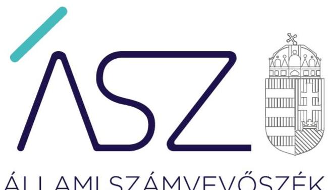
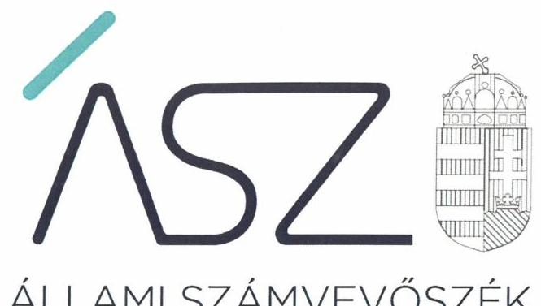
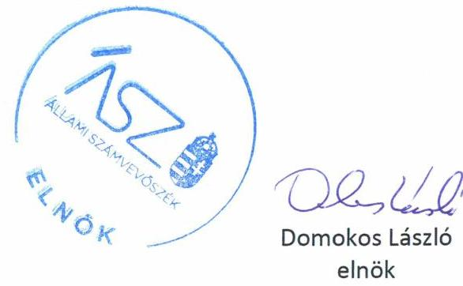
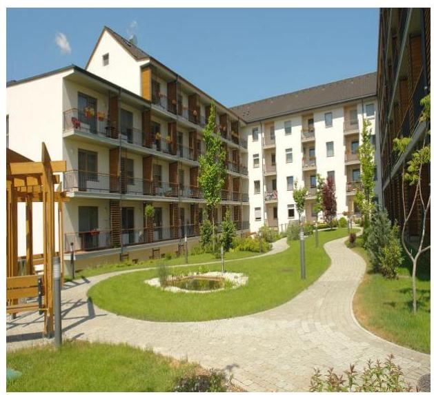

ÁLLAMI SZÁMVEVŐSZÉK

# JELENTÉS 

## Nem állami humánszolgáltatók ellenőrzése

A szociális humánszolgáltatást nyújtó intézmények, szolgáltatók államháztartáson kívüli fenntartói központi költségvetésből kapott támogatásai felhasználásának ellenőrzése "ÉLETÖRÖM" Idős Otthon Szociális Ellátó Közhasznú Nonprofit Korlátolt Felelősségű Társaság

2020. 

20150
www.asz.hu

---

ÁLLAMI SZÁMVEVŐSZÉK

# JELENTÉS 

## Nem állami humánszolgáltatók ellenőrzése

A szociális humánszolgáltatást nyújtó intézmények, szolgáltatók államháztartáson kívüli fenntartói központi költségvetésből kapott támogatásai felhasználásának ellenőrzése "ÉLETÖRÖM" Idős Otthon Szociális Ellátó Közhasznú Nonprofit Korlátolt Felelősségű Társaság
2020. 07. hó 24 nap

20150
www.asz.hu

---

# AZ ELLENŐRZÉST FELÜGYELTE: 

MAROZSÁN LÁSZLÓNÉ felügyeleti vezető

## AZ ELLENŐRZÉST VEZETTE ÉS A VÉGREHAJTÁSÁÉRT FELELŐS:

DORMÁN ISTVÁN ellenőrzésvezető

## A PROGRAM ÖSSZEÁLLÍTÁSÁÉRT FELELŐS:

TÓTPÁL SZABOLCS osztályvezető
FEKETE-NAGY ANDRÁS GÁBOR ellenőrzési program készítéséért felelős vezető

IKTATÓSZÁM: EL-2809-001/2020.
TÉMASZÁM: 2491
ELLENŐRZÉS-AZONOSÍTÓ SZÁM: V083534, V0867061

---

# TARTALOMJEGYZÉK 

- ÖSSZEGZÉS ..... 5
- AZ ELLENŐRZÉS CÉLJA ..... 6
- AZ ELLENŐRZÉS TERÜLETE ..... 7
- AZ ELLENŐRZÉS HÁTTERE, INDOKOLTSÁGA ..... 8
- AZ ELLENŐRZÉS LÉNYEGES KÉRDÉSKÖREI. ..... 9
- AZ ELLENŐRZÉS HATÓKÖRE ÉS MÓDSZEREI ..... 10
- MELLÉKLETEK ..... 13
I. sz. melléklet: Értelmező szótár ..... 13
- FÜGGELÉK: ÉSZREVÉTELEK ..... 15
- RÖVIDÍTÉSEK JEGYZÉKE ..... 19

---

.

---

# ÖSSZEGZÉS 

A veszprémi székhelyű "ÉLETÖRÖM" Idős Otthon Szociális Ellátó Közhasznú Nonprofit Kft., a 2015-2018. években nem biztosította a szociális humánszolgáltatási közfeladatok ellátására kapott költségvetési támogatások felhasználásának ellenőrizhetőségét.

## Az ellenőrzés társadalmi indokoltsága

A szociális gondoskodást igénylők védelme, illetve a köznevelési feladatok ellátása az Alaptörvényben meghatározott, a társadalom szempontjából fontos tevékenységek. Jogszabályok teszik lehetővé, hogy államháztartáson kívüli szervezetek - így például az egyházi fenntartók, alapítványok, gazdasági társaságok, egyesületek - által fenntartott intézmények is végezzenek köznevelési, szociális és gyermekvédelmi feladatokat. Mindehhez a központi költségvetés évente jelentős összegű támogatással járul hozzá. Az államháztartáson kívüli, humánszolgáltatást végző intézmények az igényelt közpénzekből társadalmilag hasznos, közösségteremtő, közérdekű, illetve közhasznú tevékenységet végeznek, illetve közfeladatokat látnak el.

Az intézményfenntartók ellenőrzésével az Állami Számvevőszék hozzájárul ahhoz, hogy ezen közpénzeket az államháztartáson kívüli szervezetek is ellenőrizhető, átlátható és elszámoltatható módon használják fel a közfeladatok ellátása során. Az ellenőrzések célja továbbá, hogy a nyilvánosság és az igénybevevők megfelelő tájékoztatást kapjanak az államháztartáson kívüli közfeladatot ellátók múködéséről.

Az ÁSZ ellenőrzései arra adnak választ, hogy az intézményfenntartók arra használták-e fel a közpénzeket, amire igényelték.

A szabályszerű gazdálkodás elengedhetetlen a közfeladat ellátás szakmai céljainak megvalósításához, valamint a társadalmi közbizalom fenntartásához.

## Megállapítások, következtetések

Az "ÉLETÖRÖM" Idős Otthon Szociális Ellátó Közhasznú Nonprofit Kft. a 2015-2018. években a könyvvezetésében nem kezelte a kapott költségvetési támogatások felhasználását a jogszabályok által előírt módon, mivel nem különítette el a könyvvezetésében a Fenntartó ${ }^{1}$ és intézménye gazdálkodását, valamint a költségvetési támogatások felhasználását az intézménye által ellátott közfeladatok szerinti bontásban.

A fentiek alapján az "ÉLETÖRÖM" Idős Otthon Szociális Ellátó Közhasznú Nonprofit Kft., mint Fenntartó a 20152018. években a szociális humánszolgáltatási közfeladat ellátására kapott költségvetési támogatás felhasználásának a Számv. tv. ${ }^{2}$ 161/A. § (2) bekezdésében előírt ellenőrizhetőségét nem biztosította. Mivel az Atr. ${ }^{3}$ 16. § (1) bekezdésében foglalt szabályozás ellenére nem gondoskodott arról, hogy a költségvetési támogatások felhasználásának, a saját és a nem önállóan múködő, gazdálkodó intézménye gazdálkodásának elkülönített, feladatonkénti bontásban történő elszámolására az adatok rendelkezésre álljanak.

A Fenntartó mindezek alapján az Alaptörvény ${ }^{4}$ 39. cikk (2) bekezdésében foglaltak ellenére a felhasznált közpénzekre vonatkozó gazdálkodása átláthatóságát nem biztosította.

Ezáltal a Fenntartó nem igazolta, hogy a közpénzt a szociális humánszolgáltatási közfeladatra fordította.

---

# AZ ELLENŐRZÉS CÉLJA

**AZ ELLENŐRZÉS CÉLJA** annak értékelése volt, hogy a nem állami, nem önkormányzati szociális intézmények fenntartói központi költségvetésből kapott támogatásainak felhasználása szabályszerű volt-e.

---

# AZ ELLENŐRZÉS TERÜLETE 

## "ÉLETÖRÖM" Idős Otthon Szociális Ellátó Közhasznú Nonprofit Kft.

A veszprémi székhelyű Fenntartó jogelődjét, az "ÉLETÖRÖM" Idős Otthon Szociális Ellátó Közhasznú Társaságot 2005. évben hozták létre. A Fenntartó 2009-ben egyszemélyes nonprofit korlátolt felelősségű társasággá alakult. Működésének célja idősek otthonának a fenntartása, az alapszolgáltatások és a szakellátások együttes alkalmazásával az idősek, valamint az ellátási területen élő, szociálisan rászorultak minden csoportja számára szociális biztonság megteremtése volt. A Fenntartó legfőbb szerve az ellenőrzött időszakban a taggyűlés volt. A Fenntartó képviseletére az ügyvezető volt jogosult. Az alapító a Fenntartó múködése és gazdálkodása törvényességének ellenőrzése érdekében három tagú felügyelőbizottságot jelölt ki az alapító okiratban.

A Fenntartó az ellenőrzött időszakban közhasznú jogállással rendelkezett. A Fenntartó a 2015-2018. években szociális hu-mán-szolgáltatási közfeladatait nem önállóan gazdálkodó intézményében látta el. Az intézménye által ellátott közfeladatok az idősek otthona átlagos szintű ellátás, és demens betegek ellátása, időskorúak gondozóháza, valamint szociális étkeztetés voltak. A múködési engedély alapján a Fenntartó ÉLETÖRÖM Idős Otthon - önálló jogi személyiséggel nem rendelkező - szociális (székhely) intézménye részben 145 férőhelyes idősek otthona és 5 férőhelyes időskorúak gondozóházaként múködött, valamint szociális étkeztetés alapszolgáltatást is nyújtott. 2016-tól az intézmény emellett nappali ellátást, házi segítségnyújtást, jelzőrendszeres házi segítségnyújtás szolgáltatást biztosított, illetve 50 lakásos nyugdíjasházat múködtetett. Az ellenőrzött időszakban az intézmény gazdálkodási feladatait a Fenntartó látta el.

A Fenntartó a 2015-2018. években ágazati pótlék, a szociális ellátáshoz kapcsolódó támogatás, valamint kiegészítő pótlék címen részesült költségvetési támogatásban. A Fenntartó részére a szociális humánszolgáltatási feladat ellátásához a Magyar Államkincstár adatai szerint a központi költségvetésből biztosított támogatások összege a 2015. évben 94,8 M Ft, a 2016. évben 106,3 M Ft, a 2017. évben 117,6 M Ft, a 2018. évben 133,5 M Ft volt.

---

# AZ ELLENŐRZÉS HÁTTERE, INDOKOLTSÁGA 

A szociális feladatokat ellátó nem állami intézményfenntartók részére közfeladataik ellátására évente jelentős összegű pénzügyi támogatást biztosítottak a mindenkori költségvetési törvények a bennük megfogalmazott feltételek mellett. A felhasználható állami támogatások a Kvtv. ${ }^{5}$-ekben a 2015-2018. években a szociális ágazatra vonatkozóan 360 Mrd Ft előirányzatot határoztak meg.

Az ÁSZ ${ }^{6}$ a stratégiájában célul tűzte ki, hogy az államháztartáson kívülre nyújtott költségvetési támogatások ellenőrzésével hozzájárul ahhoz, hogy a közpénzeket az államháztartáson kívüli szervezetek is átlátható módon használják fel a közfeladatok szerződésben vállalt ellátása érdekében. Az ÁSZ stratégiájában foglaltak alapján is indokolt az ellenőrzés, amely a társadalom számára jelzi, hogy a közpénz államháztartáson kívüli felhasználása sem maradhat ellenőrizetlenül. Az államháztartáson kívülre nyújtott költségvetési támogatások ellenőrzésével az ÁSZ hozzá-árul ahhoz, hogy a közpénzeket a nem állami humán fenntartók átlátható módon használják fel a közfeladatok ellátására kötött szerződésekben vállalt kötelezettségek teljesítése érdekében. Az ellenőrzés javaslataival hozzájárulhat az említett rendszerek szabályszerű támogatás felhasználásához, javíthatja a társa-dalmi-gazdasági döntések megalapozottságát, amely a „jól irányított állam múködésének" feltétele.

---

# AZ ELLENŐRZÉS LÉNYEGES KÉRDÉSKÖREI 

1. A szociális humánszolgáltató közfeladatot ellátó államháztartáson kívüli fenntartó szabályszerű müködési - és gazdálkodási környezet kialakításával megteremtette-e a költségvetési támogatások átlátható, elszámoltatható igénybevételének, felhasználásának feltételeit?
2. Az államháztartáson kívüli fenntartó az átvállalt szociális humánszolgáltatási közfeladathoz biztositott költségvetési támogatásokat szabályszerűen fordította-e a humánszolgáltató intézménye müködtetésére?
3. Az államháztartáson kívüli fenntartó a szociális humánszolgáltató intézménye müködtetéséhez felhasznált közpénzekre vonatkozó gazdálkodásával a nyilvánosság előtt elszámolt-e, ennek érdekében ellenőrzési, értékelési és a külső ellenőrzésekkel kapcsolatos intézkedési feladatait szabályszerűen látta-e el?

---

# AZ ELLENŐRZÉS HATÓKÖRE ÉS MÓDSZEREI 

## Az ellenőrzés típusa

Megfelelőségi ellenőrzés.

## Az ellenőrzött időszak

A 2015. január 1. és 2018. december 31. közötti időszak.

## Az ellenőrzés tárgya

Az ellenőrzés a szociális humánszolgáltatási közfeladatokat ellátó államháztartáson kívüli fenntartók humánszolgáltatási közfeladatai ellátásához a központi költségvetésből kapott támogatásaik humánszolgáltatási közfeladatokra való fenntartó általi felhasználása szabályszerűségének értékelésére terjedt ki.

## Az ellenőrzött szervezet

"ÉLETÖRÖM" Idős Otthon Szociális Ellátó Közhasznú Nonprofit Kft., mint intézményfenntartó.

## Az ellenőrzés jogalapja

Az ellenőrzés jogszabályi alapját az ÁSZ tv. ${ }^{7}$ 1. § (3) bekezdése, 5. § (3) bekezdésében foglalt előírások adták.

## Az ellenőrzés módszerei

Az ellenőrzést az ellenőrzési program annak szempontjai, kérdései, az ellenőrzött időszakban hatályos jogszabályok, a nemzetközi standardokat irányadónak tekintve, az ellenőrzés szakmai szabályok és módszertanok figyelembe vételével rendelte elvégezni. A közpénzekkel való felelős gazdálkodás segítésére irányuló javaslatok kidolgozásakor a hatályos jogszabályok voltak irányadóak.

Az ellenőrzés ideje alatt az ellenőrzött szervezettel történő kapcsolattartást az ÁSZ SZMSZ ${ }^{\circledR}$-ének vonatkozó előírásai alapján biztosította az ÁSZ.

Az ellenőrzési kérdések megválaszolásához szükséges bizonyítékok megszerzése az ellenőrzött által rendelkezésre bocsátott dokumentumokra, adatokra alapozva elemző eljárással történt.

---

Az ellenőrzési bizonyítékként felhasználható adatforrások közé tartoztak egyrészt a szakmai program részletes szempontjainál felsorolt adatforrások, másrészt minden - az ellenőrzés folyamán feltárt, az ellenőrzés szempontjából információt tartalmazó - dokumentum.

Az ellenőrzés lefolytatásához az ellenőrzött szervezet a kitöltött tanúsítványok, valamint az ÁSZ által kért dokumentumok elektronikus úton való megküldésével szolgáltatott adatokat, információkat. Az így rendelkezésre bocsátott adatok, információk és a tanúsítványok adatai valódiságának kontrollja az ellenőrzés keretében történt.

Az ellenőrzést a szociális humánszolgáltatások esetében a központi költségvetési támogatások igénylésével, módosításával, felhasználásával, elszámolásával kapcsolatos feladatokat ellátó államháztartáson kívüli fenntartónál végezte az ÁSZ.

A szociális humánszolgáltatások központi költségvetési támogatásaival kapcsolatos, államháztartáson kívüli fenntartó jogszabályokban előírt feladatai betartását, továbbá a központi költségvetési támogatások szabályszerű nyilvántartását ellenőrizte az ÁSZ a fenntartónál rendelkezésre álló nyilvántartások, beszámolók és egyéb dokumentumok alapján. Az ellenőrzés nem terjedt ki a szociális humánszolgáltatások központi költségvetési támogatásai igénylése, módosítása, elszámolása valódiságának, megalapozottságának, helyességének - sem a fenntartónál, sem a székhely intézményeinél való - értékelésére (mivel ennek felülvizsgálata, ellenőrzése a finanszírozó jogszabályban előírt feladata, határozatai kiadása előtt). Továbbá nem terjedt ki az ellenőrzés e források, intézmények általi szabályszerű felhasználásának értékelésére.

---

.

---

# MELLÉKLETEK 

- I. SZ. MELLÉKLET: ÉRTELMEZŐ SZÓTÁR
humánszolgáltatás
költségvetési támogatás
nem állami, nem önkormányzati (államháztartáson kívüli) intézmény fenntartó
székhely intézmény
telephely

Külön törvényben meghatározott szociális, gyermekjóléti, gyermekvédelmi, közoktatási, felsőoktatási, kulturális közfeladatok (2014. évi Kvtv. 33. §, 34. § (1), (4) bekezdés, 1. számú melléklet XX/20/2/3. jogcím csoport, 19. alcím, 2015. évi Kvtv. 43. § (1), (4) bekezdés, 1. számú melléklet XX/20/2/3. jogcím csoport, 19. alcím, 2016. évi Kvtv. 41. § (1), (4) bekezdés, 1. számú melléklet XX/20/2/3. jogcím csoport, 19. alcím, 2017. évi Kvtv. 41. § (1), (4) bekezdés, 1. számú melléklet XX/20/2/3. jogcím csoport, 19. alcím)
a társadalombiztosítás pénzügyi alapjai kivételével az államháztartás központi alrendszeréből ellenérték nélkül, pénzben nyújtott támogatások (Áht. ${ }^{9}$ 1. § 14. pont)
A költségvetési törvényekben (2013. évi CCXXX. törvény 33-34. §, 2014. évi C. törvény 42-43. §, 2015. évi C. törvény 40-41. §) megállapított támogatás. A 2015. évi C. törvény 40-41. § szerint többek között: Az Országgyűlés a szociális, gyermekjóléti, gyermekvédelmi közfeladatot ellátó intézményt, szolgáltatást fenntartó egyházi jogi személy, civil szervezet, közalapítvány, országos nemzetiségi önkormányzat, települési vagy területi nemzetiségi önkormányzat, gazdasági társaság, és a humánszolgáltatást alaptevékenységként végző, az Szja tv. ${ }^{10}$ hatálya alá tartozó egyéni vállalkozó (a továbbiakban együtt: nem állami szociális fenntartó) részére támogatást állapít meg a következők szerint: a támogatás a nem állami szociális fenntartót a települési önkormányzatok 2. melléklet III. pont 3. alpont c)-k) pontjában és III. pont 5. alpont a) pontjában meghatározott támogatásaival azonos jogcímeken, összegben és feltételek mellett illeti meg.
A szociális közfeladatokat/humánszolgáltatásokat ellátó intézményt fenntartó egyházi jogi személy, társadalmi szervezet, alapítvány, közalapítvány, civil szervezet, országos nemzetiségi önkormányzat, nonprofit gazdasági társaság, gazdasági társaság és a humánszolgáltatást alaptevékenységként végző, Szja tv. hatálya alá tartozó egyéni vállalkozó. (2014. évi Kvtv. 33. §, 34. § (1), (4) bekezdés, 2015. évi Kvtv. 42. §, 43. § (1), (4) bekezdés, 2016. évi Kvtv. 40. §, 41. § (1), (4) bekezdés, 2017. évi Kvtv. 41. § (1), (4) bekezdés)
a szolgáltató székhelye, azaz a szolgáltató központi ügyintézésének helye, függetlenül attól, hogy használják-e szolgáltatás nyújtására (Sznyvhr. ${ }^{11} 1 . \S$ k) pont) (hatályos: 2013. december 1-től)
a szolgáltató székhelyétől különböző, szolgáltató/intézmény használatában álló hely, a szociális humánszolgáltatáshoz használt, bejegyzett hely. (Sznyvhr. 1.§ I) pont) (hatályos: 2015. január 1-től)

---

.

---

# FÜGGELÉK: ÉSZREVÉTELEK 

A jelentéstervezetet a Számvevőszék 15 napos észrevételezésre megküldte az ellenőrzött szervezet vezetőjének az ÁSZ tv. 29. §* (1) bekezdése előírásának megfelelően.

Az "ÉLETÖRÖM" Idős Otthon Szociális Ellátó Közhasznú Nonprofit Korlátolt Felelősségű Társaság ügyvezetője élt az ÁSZ tv. 29. § (2) bekezdésében foglalt észrevételezési jogával, a jelentéstervezet megállapításaira a törvényes határidőn belül észrevételt tett.
Az ÁSZ tv. 29. § (3) bekezdésével összhangban az ÁSZ a Függelékben feltünteti az ellenőrzés megállapításaival kapcsolatban tett, figyelembe nem vett észrevételeket, és megindokolja, hogy azokat miért nem fogadta el.

[^0]
[^0]:    * 29. § (1) Az Állami Számvevőszék az ellenőrzési megállapításait megküldi az ellenőrzött szervezet vezetőjének vagy az általa megbízott személynek, és annak, akinek személyes felelősségét állapította meg.
    (2) Az ellenőrzött szervezet vezetője és a felelősként megjelölt személy az ellenőrzés megállapításaira tizenöt napon belül írásban észrevételt tehet.
    (3) Az Állami Számvevőszék az észrevételre a beérkezésétől számított harminc napon belül írásban válaszol. A figyelembe nem vett észrevételeket köteles a jelentésben feltüntetni, és megindokolni, hogy azokat miért nem fogadta el.

---

# Az "ÉLETŐRŐM" Idős Otthon Szociális Ellátó Közhasznú Nonprofit Korlátolt Felelősségű Társaság (továbbiakban: Fenntartó) ügyvezetője által 2020. június 8 -án kelt levelében tett észrevétel és kezelésének indokolása. 

## A jelentéstervezet Megállapítások, következtetések rész 1-4. bekezdéseivel kapcsolatos észrevétel:

A Fenntartó ügyvezetője észrevételében leírta, hogy az "ÉLETÖRÖM" Idős Otthon Szociális Ellátó Közhasznú Nonprofit Korlátolt Felelősségű Társaság működési engedély alapján integrált intézményként a Fenntartó székhelyével azonos telephelyen folytatja 15 éve az idős otthoni, idősek gondozóháza intézményi és a szociális étkeztetés, valamint 2016-tól - költségvetési támogatás igénybe vétele nélkül - nappali ellátás, jelzőrendszeres házi segítségnyújtás szociális alapellátási tevékenységet. Tájékoztatta továbbá az ÁSZ-t arról, hogy működésük időszakában saját ellenőrző szervei (felügyelőbizottság, független könyvvizsgáló), illetve a Magyar Államkincstár, az ágazati ellenőrző hatóságok, a Veszprémi Önkormányzat a működést törvényesnek találták. Észrevétele szerint a Fenntartó és az intézménye nem válik el egymástól, ezért az adatbekérés során nyilatkozatot adott az ÁSZ részére erre vonatkozóan, továbbá, hogy erre tekintettel a költségvetési támogatás intézmény részére történő átadásáról külön dokumentum nem készült. A Fenntartó számlarendje is ennek megfelelő, így történt az elkülönített jogcímen történő támogatások elszámolása is, amit eddig a könyvvizsgáló, illetve külső hatóság nem kifogásolt. A Fenntartó ügyvezetője észrevételében jelezte továbbá, hogy a támogatások felhasználásának feladatonként bemutatására megtették a szükséges intézkedéseket, azokat a 2019-től hatályos számviteli politikában és a számlarendben rögzítették. A 2019. évi beszámoló kiegészítő mellékletében bemutatják az ellátási formákra kapott költségvetési támogatásokat és azok felhasználását feladatonkénti bontásban.

A Fenntartó ügyvezetője észrevételében megerősítette a jelentéstervezet megállapítását, miszerint nem történt meg a költségvetési támogatások felhasználásának elkülönített, feladatonkénti bontásban történő elszámolása, mivel észrevételében tájékoztatott arról, hogy megtették a támogatás felhasználásának feladatonkénti bemutatásához a szükséges intézkedéseket. Az ügyvezető tájékoztatását az ellenőrzött időszakot követő intézkedéseiről az ÁSZ köszönettel vette, azonban azok az ellenőrzött időszakra vonatkozóan a jelentéstervezetben tett megállapítást nem befolyásolják. Az ügyvezető észrevétele szerint a Fenntartó és a nem önálló intézménye nem válik szét egymástól.

Az ÁSZ tájékoztatta a Fenntartó ügyvezetőjét arról, hogy az ellenőrzés rendelkezésére bocsátott, fenntartói 20152018. évi főkönyvi kivonatok felülvizsgálata alapján megállapítható volt, hogy a főkönyvi számlák számlaszámai és megnevezései nem támasztják alá, hogy a könyvelésben rögzített minden felmerült költség-bevétel csak a Fenntartó működésével, gazdálkodásával kapcsolatos, tekintettel pl. az intézményi feladatellátáshoz kapott támogatásra és annak intézmény általi felhasználására (pl.: 5112 Gyógyszerköltség, 5116 Ápolási anyagok, 914-es MÁK támogatás bevételi számlák), valamint a vállalkozási tevékenységből származó bevételre. Ugyanakkor az elkülönítésre vonatkozó részletezés a főkönyvi nyilvántartásban nem került kialakításra, annak igazolására egyéb dokumentumot nem küldtek az ÁSZ részére. A Fenntartó ügyvezetőjének 2018. október 27-én, 2019. január 15-én, 2019. október 15-én és 2019. november 26-án kelt teljességi és hitelességi nyilatkozatai szerint az ÁSZ részére átadott dokumentumok, adatok a bekért adatokra, dokumentumokra vonatkozóan teljes körű információt tartalmaznak.

Az ÁSZ válaszában leírta, hogy a fentiekre tekintettel a Fenntartó számviteli rendje nem felelt meg az az egyházi és nem állami fenntartású szociális, gyermekjóléti és gyermekvédelmi szolgáltatók, intézmények és hálózatok állami támogatásáról szóló 489/2013. (XII. 18.) Korm. rendelet 16. § (1) bekezdésében előírtaknak, miszerint a nem önálló szolgáltató (intézmény) esetén a fenntartó és a szolgáltató gazdálkodását a számviteli rendjében köteles elkülönítve kezelni.

A Fenntartó ügyvezetője észrevételében leírta továbbá, hogy a támogatás intézmény részére történő átadásáról külön dokumentum nem készült. Az ÁSZ válaszában tájékoztatást adott arról, hogy az Állami Számvevőszékről szóló 2011. LXVI. törvény (továbbiakban: ÁSZ tv.) 29. § (2) bekezdésében rögzítettek értelmében az ellenőrzött szervezet vezetője az ellenőrzés megállapítására észrevételt tehet. Mivel a jelentéstervezet a támogatás átadásával kapcsolatosan nem tartalmazott megállapítást, az ügyvezető ezen kijelentését az ÁSZ nem tekinti észrevételnek.

---

Az észrevételre adott válasz-levélben az ÁSZ tájékoztatta továbbá a Fenntartó ügyvezetőjét, hogy az ÁSZ az ellenőrzési megállapításait az egyéb ellenőrzést végző szervek ellenőrzési megállapításaitól függetlenül, kizárólag az ÁSZ tv. 28. § (2) bekezdésben meghatározott adatszolgáltatási időszakon belül megküldött, teljességi és hitelességi nyilatkozattal alátámasztott dokumentumokra alapozva teszi meg, így a Fenntartó múködését érintő ellenőrzések eredménye az ÁSZ megállapításait nem befolyásolják.

A fentiekre tekintettel az észrevételt az ÁSZ nem fogadta el, a jelentéstervezet megállapítása helytálló, módosítása nem volt indokolt.

---

.

---

# RÖVIDÍTÉSEK JEGYZÉKE 

${ }^{1}$ Fenntartó
${ }^{2}$ Számv. tv.
${ }^{3}$ Atr.
${ }^{4}$ Alaptörvény
${ }^{5}$ Kvtv.
${ }^{6}$ ÁSZ
${ }^{7}$ ÁSZ tv.
${ }^{8}$ ÁSZ SZMSZ
${ }^{9}$ Áht.
${ }^{10}$ Szja tv.
${ }^{11}$ Sznyvhr.
"ÉLETÖRÖM" Idős Otthon Szociális Ellátó Közhasznú Nonprofit Kft. a számvitelről szóló 2000. évi C. törvény (hatályos: 2001. január 1-jétől) az egyházi és nem állami fenntartású szociális, gyermekjóléti és gyermekvédelmi szolgáltatók, intézmények és hálózatok állami támogatásáról szóló 489/2013. (XII. 18.) Korm. rendelet (hatályos: 2014. január 1-jétől) Magyarország Alaptörvénye (hatályos: 2012. január 1-jétől) Magyarország 2015. évi központi költségvetéséről szóló 2014. évi C. törvény, Magyarország 2016. évi központi költségvetéséről szóló 2015. évi C. törvény, Magyarország 2017. évi központi költségvetéséről szóló 2016. évi XC. törvény, Magyarország 2018. évi központi költségvetéséről szóló 2017. évi C. törvény Állami Számvevőszék
az Állami Számvevőszékről szóló 2011. évi LXVI. törvény (hatályos: 2011. július 1-jétől)
az Állami Számvevőszék Szervezeti és Múködési Szabályzata
az államháztartásról szóló 2011. évi CXCV. törvény (hatályos: 2012. január 1-jétől)
a személyi jövedelemadóról szóló 1995. évi CXVII. törvény (hatályos: 1996. január 1-jétől)
a szociális, gyermekjóléti és gyermekvédelmi szolgáltatók, intézmények és hálózatok hatósági nyilvántartásáról és ellenőrzéséről szóló 369/2013. (X.24.) Korm. rendelet (hatályos: 2013. december 1-jétől)

---

# ASZ 

ALLAMI SZAMVEVOSZEK
1052 Budapest, Apáczai Cs. J. u. 10. I 1364 Budapest 4. Pf. 54 TEL: +36 14849100
email: szamvevoszek@asz.hu
web: www.asz.hu | www.aszhirportal.hu