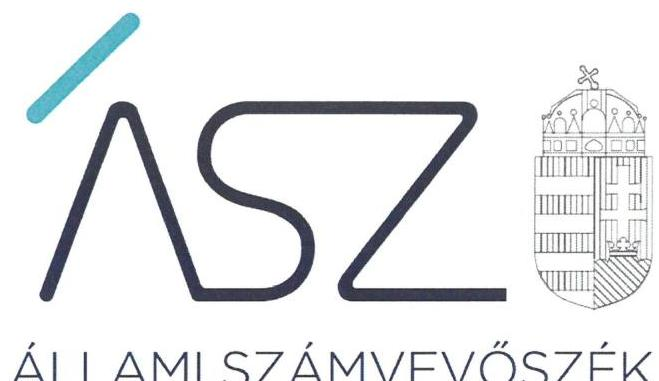
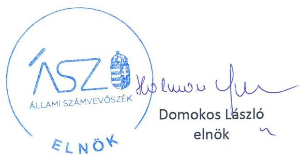
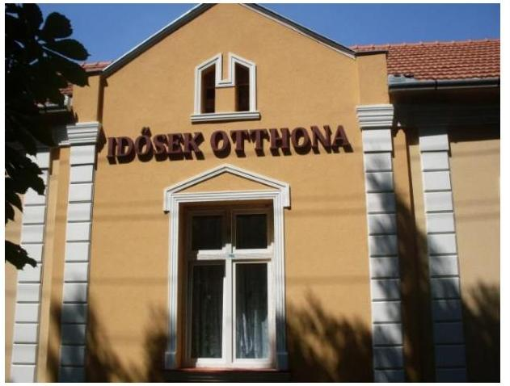

ÁLLAMI SZÁMVEVŐSZÉK

# JELENTÉS 

## Nem állami humánszolgáltatók ellenőrzése

A szociális humánszolgáltatást nyújtó intézmények, szolgáltatók államháztartáson kívüli fenntartói központi költségvetésből kapott támogatásai felhasználásának ellenőrzése BATTONYAI IDŐSEK OTTHONA ÉS GONDOZÁSI KÖZPONT KÖZHASZNÚ NONPROFIT KORLÁTOLT FELELŐSSÉGŰ TÁRSASÁG

2020. 

20152
www.asz.hu

---

# JELENTÉS

## Nem állami humánszolgáltatók ellenőrzése

A szociális humánszolgáltatást nyújtó intézmények, szolgáltatók államháztartáson kívüli fenntartói központi költségvetésből kapott támogatásai felhasználásának ellenőrzése – **BATTONYAI IDŐSEK OTTHONA ÉS GONDOZÁSI KÖZPONT KÖZHASZNÚ NONPROFIT KORLÁTOLT FELELŐSSÉGŰ TÁRSASÁG**

2020.  július 31. nap

20152 www.asz.hu

---

# AZ ELLENŐRZÉST FELÜGYELTE: 

TÓTH MARIANNA felügyeleti vezető

## AZ ELLENŐRZÉST VEZETTE ÉS A VÉGREHAJTÁSÁÉRT FELELŐS:

DR. KOVÁCS DIÁNA ellenőrzésvezető

## A PROGRAM ÖSSZEÁLLÍTÁSÁÉRT FELELŐS:

FEKETE-NAGY ANDRÁS GÁBOR ellenőrzési program készítéséért felelős vezető

IKTATÓSZÁM: EL-2811-001/2020.
TÉMASZÁM: 2523
ELLENŐRZÉS-AZONOSÍTÓ SZÁM: V0867056
Jelentéseink az Országgyúlés számítógépes
hálózatán és az interneten a www.asz.hu címen is olvashatóak.

---

# TARTALOMJEGYZÉK 

■ ÖSSZEGZÉS ..... 5
■ AZ ELLENŐRZÉS CÉLJA ..... 6
■ AZ ELLENŐRZÉS TERÜLETE ..... 7
■ AZ ELLENŐRZÉS HÁTTERE, INDOKOLTSÁGA ..... 8
■ AZ ELLENŐRZÉS LÉNYEGES KÉRDÉSKÖREI ..... 9
■ AZ ELLENŐRZÉS HATÓKÖRE ÉS MÓDSZEREI ..... 10
■ MELLÉKLETEK ..... 13
I. sz. melléklet: Értelmező szótár ..... 13
■ FÜGGELÉK: ÉSZREVÉTELEK ..... 15
■ RÖVIDÍTÉSEK JEGYZÉKE ..... 17

---

.

---

# ÖSSZEGZÉS 

A battonyai székhelyű BATTONYAI IDŐSEK OTTHONA ÉS GONDOZÁSI KÖZPONT KÖZHASZNÚ NONPROFIT KFT. a 2016-2018. években nem biztosította a szociális humánszolgáltatási közfeladatok ellátására kapott költségvetési támogatások felhasználásának ellenőrizhetőségét.

## Az ellenőrzés társadalmi indokoltsága

A szociális gondoskodást igénylők védelme, illetve a köznevelési feladatok ellátása az Alaptörvényben meghatározott, a társadalom szempontjából fontos tevékenységek. Jogszabályok teszik lehetővé, hogy államháztartáson kívüli szervezetek - így például az egyházi fenntartók, alapítványok, gazdasági társaságok, egyesületek - által fenntartott intézmények is végezzenek köznevelési, szociális és gyermekvédelmi feladatokat. Mindehhez a központi költségvetés évente jelentős összegű támogatással járul hozzá. Az államháztartáson kívüli, humánszolgáltatást végző intézmények az igényelt közpénzekből társadalmilag hasznos, közösségteremtő, közérdekű, illetve közhasznú tevékenységet végeznek, illetve közfeladatokat látnak el.

Az intézményfenntartók ellenőrzésével az Állami Számvevőszék hozzájárul ahhoz, hogy ezen közpénzeket az államháztartáson kívüli szervezetek is ellenőrizhető, átlátható és elszámoltatható módon használják fel a közfeladatok ellátása során. Az ellenőrzések célja továbbá, hogy a nyilvánosság és az igénybevevők megfelelő tájékoztatást kapjanak az államháztartáson kívüli közfeladatot ellátók működéséről.

Az ÁSZ ellenőrzései arra adnak választ, hogy az intézményfenntartók arra használták-e fel a közpénzeket, amire igényelték.

A szabályszerű gazdálkodás elengedhetetlen a közfeladat ellátás szakmai céljainak megvalósításához, valamint a társadalmi közbizalom fenntartásához.

## Megállapítások, következtetések

A BATTONYAI IDŐSEK OTTHONA ÉS GONDOZÁSI KÖZPONT KÖZHASZNÚ NONPROFIT KFT. a 2016-2018. években a szociális humánszolgáltatási közfeladat ellátására kapott költségvetési támogatás felhasználásáról nem rendelkezett elkülönített nyilvántartással. A BATTONYAI IDŐSEK OTTHONA ÉS GONDOZÁSI KÖZPONT KÖZHASZNÚ NONPROFIT KFT. a 2016-2018. években a szociális humánszolgáltatási közfeladat ellátására kapott költségvetési támogatás felhasználásának a Számv. tv. 161/A. § (2) bekezdésében előírt ellenőrizhetőségét nem biztosította; az Atr. 16. § (1) bekezdésében foglalt szabályozás ellenére nem gondoskodott arról, hogy az állami támogatások felhasználásának, a Fenntartó és a nem önállóan gazdálkodó intézménye gazdálkodásának elkülönített, feladatonkénti bontásban történő elszámolására az adatok rendelkezésre álljanak.

A BATTONYAI IDŐSEK OTTHONA ÉS GONDOZÁSI KÖZPONT KÖZHASZNÚ NONPROFIT KFT. a közfeladatot ellátó intézménye működtetéséhez felhasznált közpénzekre vonatkozó gazdálkodásáról az éves beszámolót nem készítette el, a nyilvánosság előtt nem számolt el. A jogszabályokban előírt beszámolási kötelezettségének nem tett eleget, a Számv. tv. 4. § (1) bekezdésében, és a 96. § (1) bekezdésében előírt éves beszámolót nem készítette el.

A BATTONYAI IDŐSEK OTTHONA ÉS GONDOZÁSI KÖZPONT KÖZHASZNÚ NONPROFIT KFT. mindezek alapján az Alaptörvény 39. cikk (2) bekezdésében foglaltak ellenére a felhasznált közpénzekre vonatkozó gazdálkodása átláthatóságát és elszámoltathatóságát nem biztosította.

Ezáltal a BATTONYAI IDŐSEK OTTHONA ÉS GONDOZÁSI KÖZPONT KÖZHASZNÚ NONPROFIT KFT. nem igazolta, hogy a közpénzt a szociális humánszolgáltatási közfeladatra fordította.

---

# AZ ELLENŐRZÉS CÉLJA

**AZ ELLENŐRZÉS CÉLJA** annak értékelése volt, hogy a nem állami, nem önkormányzati szociális intézmények fenntartói központi költségvetésből kapott támogatásainak felhasználása szabályszerű volt-e.

---

# **AZ ELLENŐRZÉS TERÜLETE**

## **BATTONYAI IDŐSEK OTTHONA ÉS GONDOZÁSI KÖZPONT KÖZHASZNÚ NONPROFIT KFT.**

A battonyai székhelyű BATTONYAI IDŐSEK OTTHONA ÉS GONDOZÁSI KÖZPONT KÖZHASZNÚ NONPROFIT KFT. mint fenntartó cégbejegyzése1 alapján az idősek és fogyatékosok bentlakásos ellátását végezte.

A Fenntartó2 a 2016-2018. években egy nem önállóan gazdálkodó Intézmény3 fenntartásával vett részt az állami közfeladatok ellátásában.

A Fenntartó az intézmény működtetésére az állami költségvetésből a Kincstár4 adatai szerint a 2016. évben 45 666 E Ft, a 2017. évben 52 408 E Ft, a 2018. évben 50 207 E Ft támogatást kapott.

---

# AZ ELLENŐRZÉS HÁTTERE, INDOKOLTSÁGA 

A köznevelési és szociális feladatokat ellátó nem állami intézményfenntartók részére közfeladataik ellátására évente jelentős összegű pénzügyi támogatást biztosítottak a mindenkori költségvetési törvények a bennük megfogalmazott feltételek mellett.

A Kvtv. ${ }^{5}$-ekben a 2016-2018. években a szociális ágazatra vonatkozóan felhasználható állami támogatásokra 272,4 Mrd Ft előirányzatot határoztak meg. A 2013. évben jelentős változások következtek be a normatív finanszírozás rendszerében. Módosították a szociális igazgatásról és szociális ellátásokról szóló 1993. évi III. törvényt, amely - többek között - 2012. január 1-jei hatállyal megfogalmazta a finanszírozási rendszerbe történő befogadással összefüggő szabályokat.

Az ÁSZ stratégiájában foglaltak alapján is indokolt az ellenőrzés, amely a társadalom számára jelzi, hogy a közpénz államháztartáson kívüli felhasználása sem maradhat ellenőrizetlenül. Az államháztartáson kívülre nyújtott költségvetési támogatások ellenőrzésével az ÁSZ hozzájárul ahhoz, hogy a közpénzeket a nem állami humán fenntartók átlátható módon használják fel a közfeladatok ellátására kötött szerződésekben vállalt kötelezettségek teljesítése érdekében. Az ellenőrzés javaslataival hozzájárulhat az említett rendszerek szabályszerű támogatás felhasználásához, javíthatja a társadalmi-gazdasági döntések megalapozottságát, amely a „jól irányított állam" feltétele.

---

# AZ ELLENŐRZÉS LÉNYEGES KÉRDÉSKÖREI 

1. A szociális humánszolgáltató közfeladatot ellátó államháztartáson kívüli fenntartó szabályszerű működési - és gazdálkodási környezet kialakításával megteremtette-e a költségvetési támogatások átlátható, elszámoltatható igénybevételének, felhasználásának feltételeit?
2. Az államháztartáson kívüli fenntartó az átvállalt szociális humánszolgáltatási közfeladathoz biztosított költségvetési támogatásokat szabályszerűen fordította-e a humánszolgáltató intézménye működtetésére?
3. Az államháztartáson kívüli fenntartó a szociális humánszolgáltató intézménye működtetéséhez felhasznált közpénzekre vonatkozó gazdálkodásával a nyilvánosság előtt elszámolt-e, ennek megalapozása érdekében ellenőrzési, értékelési és a külső ellenőrzésekkel kapcsolatos intézkedési feladatait szabályszerűen látta-e el?

---

# AZ ELLENŐRZÉS HATÓKÖRE ÉS MÓDSZEREI 

## Az ellenőrzés típusa

Megfelelőségi ellenőrzés.

## Az ellenőrzött időszak

2016. január 1-je és 2018. december 31-e közötti időszak.

## Az ellenőrzés tárgya

Az ellenőrzés a szociális humánszolgáltatási közfeladatokat ellátó államháztartáson kívüli fenntartók humánszolgáltatási közfeladatai ellátásához a központi költségvetésből kapott támogatásaik humánszolgáltatási közfeladatokra való fenntartó általi felhasználása szabályszerűségének értékelésére terjedt ki.

## Az ellenőrzött szervezet

BATTONYAI IDŐSEK OTTHONA ÉS GONDOZÁSI KÖZPONT KÖZHASZNÚ NONPROFIT KFT.

## Az ellenőrzés jogalapja

Az ellenőrzés jogszabályi alapját az ÁSZ tv. 1. § (3) bekezdése, 5. § (3) bekezdésében foglalt előírások adták.

## Az ellenőrzés módszerei

Az ellenőrzést az ellenőrzési program annak szempontjai, kérdései, az ellenőrzött időszakban hatályos jogszabályok, a nemzetközi standardokat irányadónak tekintve, az ellenőrzés szakmai szabályok és módszertanok figyelembevételével rendelte elvégezni.

Az ellenőrzés ideje alatt az ÁSZ a Fenntartóval történő kapcsolattartást az ÁSZ SZMSZ ${ }^{7}$-ének vonatkozó előírásai alapján biztosította.

Az ellenőrzési kérdések megválaszolásához szükséges bizonyítékok megszerzése az ellenőrzött által rendelkezésre bocsátott dokumentumokra, adatokra alapozva megfigyelés, valamint elemző eljárással történt.

Az ellenőrzési bizonyítékként felhasználható adatforrások közé tartoztak egyrészt az ellenőrzési program részletes szempontjainál felsorolt

---

adatforrások, másrészt minden - az ellenőrzés folyamán feltárt, az ellenőrzés szempontjából információt tartalmazó - dokumentum.

Az ellenőrzés lefolytatásához a Fenntartó a kitöltött tanúsítványok, valamint az ÁSZ által kért dokumentumok elektronikus úton való megküldésével szolgáltatott adatokat, információkat. Az így rendelkezésre bocsátott adatok, információk és a tanúsítványok adatai valódiságának kontrollja az ellenőrzés keretében történt.

Az egységes értelmezést támogatta a jelentés mellékletét képező fogalomtár és rövidítésjegyzék.

Az ÁSZ az ellenőrzést alapvetően a szociális humánszolgáltatások esetében a központi költségvetési támogatások igénylésével, módosításával, felhasználásával, elszámolásával kapcsolatos feladatokat ellátó államháztartáson kívüli fenntartónál végezte.

Az ÁSZ a szociális humánszolgáltatások központi költségvetési támogatásai igénylésével, módosításával, elszámolásával kapcsolatos, államháztartáson kívüli fenntartó jogszabályokban előírt feladatai betartását, továbbá a központi költségvetési támogatások szabályszerű kezelését, nyilvántartását ellenőrizte a fenntartónál, az ott rendelkezésre álló határozatok, nyilvántartások, beszámolók és egyéb dokumentumok alapján. Az ellenőrzés nem terjedt ki a szociális humánszolgáltatások központi költségvetési támogatásai igénylése, módosítása, elszámolása valódiságának, megalapozottságának, helyességének - sem a fenntartónál, sem a székhely intézményeinél való - értékelésére (mivel ennek felülvizsgálata, ellenőrzése a finanszírozó jogszabályban előírt feladata, határozatai kiadása előtt). Továbbá nem terjedt ki az ellenőrzés e források intézmények általi szabályszerű felhasználásának értékelésére.

---

.

---

# MELLÉKLETEK 

- I. SZ. MELLÉKLET: ÉRTELMEZŐ SZÓTÁR
humánszolgáltatás
költségvetési támogatás
nem állami, nem önkormányzati (államháztartáson kívüli) szociális intézmény fenntartó

A költségvetési törvényben és külön törvényben meghatározott szociális, gyermekjóléti, gyermekvédelmi, közoktatási, felsőoktatási, kulturális közfeladatok.
Szociális célú nem állami humánszolgáltatók támogatása, valamint a szociális humánszolgáltatók részére biztosított szociális- és gyermekvédelmi ágazati pótlék és egyéb ágazati bérrendezéssel összefüggő támogatások központi költségvetési forrása: 2016. évi Kvtv. XX/20/19/1., 8. jogcím csoport; 2017. évi Kvtv. XX/20/19/1. 8. jogcím csoport; 2018. évi Kvtv. XX/20/19/1., 8. jogcím csoport.
A szociális, gyermekjóléti és gyermekvédelmi közfeladatokat/humánszolgáltatásokat ellátó intézményt fenntartó egyházi jogi személy, társadalmi szervezet, alapítvány, közalapítvány, civil szervezet, országos nemzetiségi önkormányzat, nonprofit gazdasági társaság, gazdasági társaság és a humánszolgáltatást alaptevékenységként végző, Szja tv. hatálya alá tartozó egyéni vállalkozó. (2016. évi Kvtv. 41. § (1) bekezdés, 2017. évi Kvtv. 41. § (1) bekezdés, 2018. évi Kvtv. 41. § (1)).

---

.

---

# FÜGGELÉK: ÉSZREVÉTELEK 

A jelentéstervezetet a Számvevőszék 15 napos észrevételezésre megküldte az ellenőrzött szervezet vezetőjének az ÁSZ tv. 29. § (1) bekezdése előírásának megfelelően.

A BATTONYAI IDŐSEK OTTHONA ÉS GONDOZÁSI KÖZPONT KÖZHASZNÚ NONPROFIT KORLÁTOLT FELELŐSSÉGŰ TÁRSASÁG ügyvezetője a jelentéstervezet megállapításaira írásban észrevételt tett.
Az ÁSZ tv. 29. § (3) bekezdésével összhangban az ÁSZ a Függelékben feltünteti az ellenőrzés megállapításaival kapcsolatban tett, figyelembe nem vett észrevételeket, és megindokolja, hogy azokat miért nem fogadta el.

[^0]
[^0]:    * 29. § (1) Az Állami Számvevőszék az ellenőrzési megállapításait megküldi az ellenőrzött szervezet vezetőjének vagy az általa megbízott személynek, és annak, akinek személyes felelősségét állapította meg.
    (2) Az ellenőrzött szervezet vezetője és a felelősként megjelölt személy az ellenőrzés megállapításaira tizenöt napon belül írásban észrevételt tehet.
    (3) Az Állami Számvevőszék az észrevételre a beérkezésétől számított harminc napon belül írásban válaszol. A figyelembe nem vett észrevételeket köteles a jelentésben feltüntetni, és megindokolni, hogy azokat miért nem fogadta el.

---

A számvevőszéki jelentéstervezet megállapításaival kapcsolatban az ügyvezető által 2020. június 17-én tett (az Állami Számvevőszékhez 2020. június 19-én érkezett) el nem fogadott észrevételek és azok kezelésének indokolása.

# 1. Az elkülönített nyilvántartás vezetésével kapcsolatban tett észrevétel (Megállapítások, következtetések rész 1. bekezdése) 

Az ügyvezető észrevételében vitatta a jelentéstervezet azon megállapítását, miszerint a 2016-2018. években a szociális humánszolgáltatási közfeladat ellátására kapott költségvetési támogatás felhasználásáról nem rendelkeztek elkülönített nyilvántartással. Kifejtette, hogy a Fenntartó a kapott támogatásokat elkülönítetten tartja nyilván és ezt
 főkönyveiben is átvezeti, hozzáfűzte továbbá, hogy ezt a novemberben az ellenőrzés részére átadott dokumentumokkal alátámasztották.

Az EL-2221-001/2019. iktatószámú adatbekérő levelekben kértük a szociális közfeladat ellátásra kapott támogatás, valamint a kapott támogatás felhasználása tekintetében a 2016-2018. évekre vonatkozó elkülönített nyilvántartást alátámasztó dokumentumok átadását.

Az ellenőrzési adatbekérés során átadott „Tájékoztatás a 2018. évi gazdálkodásról" elnevezésű dokumentum, valamint az észrevételben hivatkozott 2016-2018. évi főkönyvi nyilvántartás (főkönyvi kivonatok) nem igazolják, hogy a Fenntartó 2016-2018. években az Atr. 16. § (1) bekezdésében foglalt szabályozásnak megfelelő elkülönített nyilvántartást vezetett, mivel a benyújtott dokumentumok nem támasztják alá, hogy a főkönyvi nyilvántartás vagy más nyilvántartás formájában megtörtént a Fenntartó és nem önállóan gazdálkodó szolgáltatója (intézménye) gazdálkodásának, valamint a kapott támogatás és a térítési díj felhasználásának feladatonkénti bontásban, elkülönítetten történő kezelése.

A 2019. november 26-án kelt teljességi és hitelességi nyilatkozatokban az átadott dokumentumok hitelességéért, valódiságáért, hiánytalanságáért és hatályosságáért felelősséget vállalt. Az Állami Számvevőszék az ellenőrzési megállapításait az ellenőrzési adatszolgáltatás során a részére törvényi határidőben rendelkezésre bocsátott hiteles dokumentumokra alapozva fogalmazza meg.

## 2. A beszámolási kötelezettség teljesítésével kapcsolatban tett észrevétel (Megállapítások, következtetések rész 2. bekezdése)

Az ügyvezető észrevételében vitatta a jelentéstervezet azon megállapítását, miszerint az ellenőrzött időszak viszonylatában nem készítették el az éves beszámolókat. Kifejtette, hogy a Fenntartó a számviteli törvényben előírt beszámolókat évről-évre az Igazságügyi Minisztérium Céginformációs Szolgálatának honlapjára feltöltötte, és erről bárki szabadon meggyőződhet. Hozzáfűzte továbbá, hogy a Fenntartó az ellenőrzés során kért minden egyes dokumentumot az ellenőrzés rendelkezésére bocsátott.

Az EL-2226-001/2019. iktatószámú adatbekérő levelekben kértük a Fenntartó aláírt 2016-2018. évi számviteli beszámolóinak az átadását, de a 2019. november 26-án kelt teljességi és hitelességi nyilatkozattal alátámasztott módon átadott 2016-2018. évi egyszerűsített éves beszámolók a számvitelről szóló 2000. évi C. törvény 96. § (1) bekezdésében előírt kötelező tartalmi elemek közül nem tartalmazták a kiegészítő mellékleteket.

A 2019. november 26-án kelt teljességi és hitelességi nyilatkozatban az átadott dokumentumok hitelességéért, valódiságáért, hiánytalanságáért és hatályosságáért felelősséget vállalt. Az Állami Számvevőszék az ellenőrzési megállapításait az ellenőrzési adatszolgáltatás során a részére törvényi határidőben rendelkezésre bocsátott hiteles dokumentumokra alapozva fogalmazza meg.

---

# RÖVIDÍTÉSEK JEGYZÉKE 

${ }^{1}$ Cégbejegyzés
${ }^{2}$ Fenntartó
${ }^{3}$ Intézmény
${ }^{4}$ Kincstár
${ }^{5}$ Kvtv.
${ }^{6}$ ÁSZ
${ }^{7}$ ÁSZ SZMSZ
2009. augusztus 26-án a Békés Megyei Bíróság mint Cégbíróság által kiadott végzésben foglaltak alapján
BATTONYAI IDŐSEK OTTHONA ÉS GONDOZÁSI KÖZPONT KÖZHASZNÚ NONPROFIT KFT.
Battonyai Idősek Otthona
Magyar Államkincstár
2016. évi Kvtv.: 2015. évi C. törvény - Magyarország 2016. évi központi költségvetéséről (hatályos 2015. július 4-től) 2019. december 30-ig)
2017. évi Kvtv.: 2016. évi XC. törvény - Magyarország 2017. évi központi költségvetéséről (hatályos 2015. július 4-től)
2018. évi Kvtv.: 2017. évi C. törvény - Magyarország 2018. évi központi költségvetéséről (hatályos 2017. november 1-től)

Állami Számvevőszék
Állami Számvevőszék Szervezeti és Működési Szabályzata

---

# ASZ 

ÁLLAMI SZÁMVEVŐSZÉK
1052 Budapest, Apáczai Cs. J. u. 10. I 1364 Budapest 4. Pf. 54 TEL: +36 14849100
email: szamvevoszek@asz.hu
web: www.asz.hu | www.aszhirportal.hu

