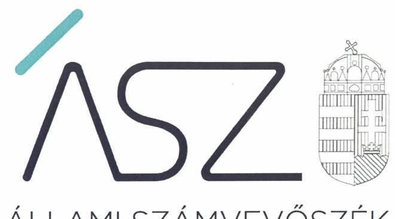
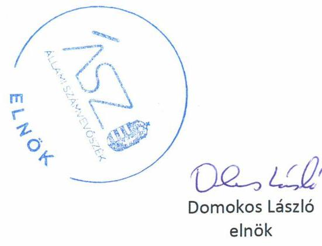

ÁLLAMI SZÁMVEVŐSZÉK

# JELENTÉS 

## Nem állami humánszolgáltatók ellenőrzése

A szociális humánszolgáltatást nyújtó intézmények, szolgáltatók államháztartáson kívüli fenntartói központi költségvetésből kapott támogatásai felhasználásának ellenőrzése -Dél-Borsodi Szociális Otthon „Nonprofit" Korlátolt Felelősségű Társaság
2020.

20153
www.asz.hu

---

ÁLLAMI SZÁMVEVŐSZÉK

# JELENTÉS 

## Nem állami humánszolgáltatók ellenőrzése

A szociális humánszolgáltatást nyújtó intézmények, szolgáltatók államháztartáson kívüli fenntartói központi költségvetésből kapott támogatásai felhasználásának ellenőrzése -Dél-Borsodi Szociális Otthon „Nonprofit" Korlátolt Felelősségű Társaság
2020. 04. hó 24. nap

20153
www.asz.hu

---

# AZ ELLENŐRZÉST FELÜGYELTE: 

KLINGA LÁSZLÓ felügyeleti vezető

## AZ ELLENŐRZÉST VEZETTE ÉS A VÉGREHAJTÁSÁÉRT FELELŐS:

DORMÁN ISTVÁN ZOLTÁN ellenőrzésvezető

## A PROGRAM ÖSSZEÁLLÍTÁSÁÉRT FELELŐS:

TÓTPÁL SZABOLCS osztályvezető

FEKETE-NAGY ANDRÁS GÁBOR ellenőrzési program készítéséért felelős vezető

## IKTATÓSZÁM: EL-2812-001/2020

Jelentéseink az Országgyúlés számítógépes hálózatán és az interneten a www.asz.hu címen is olvashatóak.

TÉMASZÁM: 2491
ELLENŐRZÉS-AZONOSÍTÓ SZÁM: V083543, V0867089

---

# TARTALOMJEGYZÉK 

■ ÖSSZEGZÉS ..... 5
■ AZ ELLENŐRZÉS CÉLJA ..... 6
■ AZ ELLENŐRZÉS TERÜLETE ..... 7
■ AZ ELLENŐRZÉS HÁTTERE, INDOKOLTSÁGA ..... 8
■ AZ ELLENŐRZÉS LÉNYEGES KÉRDÉSKÖRE ..... 9
■ AZ ELLENŐRZÉS HATÓKÖRE ÉS MÓDSZEREI ..... 10
■ MEGÁLLAPÍTÁSOK ..... 12
■ MELLÉKLETEK ..... 13
I. sz. melléklet: Értelmező szótár ..... 13
■ FÜGGELÉK: ÉSZREVÉTELEK ..... 15
■ RÖVIDÍTÉSEK JEGYZÉKE ..... 19

---

.

---

# ÖSSZEGZÉS 

A mezőkövesdi székhelyű Dél-Borsodi Szociális Otthon „Nonprofit" Korlátolt Felelősségű Társaság a 2015-2018. években nem biztosította a szociális humánszolgáltatási közfeladatok ellátására kapott költségvetési támogatások elszámoltathatóságát.

## Az ellenőrzés társadalmi indokoltsága

A szociális gondoskodást igénylők védelme, illetve a köznevelési feladatok ellátása az Alaptörvényben meghatározott, a társadalom szempontjából fontos tevékenységek. Jogszabályok teszik lehetővé, hogy államháztartáson kívüli szervezetek - így például az egyházi fenntartók, alapítványok, gazdasági társaságok, egyesületek - által fenntartott intézmények is végezzenek köznevelési, szociális és gyermekvédelmi feladatokat. Mindehhez a központi költségvetés évente jelentős összegű támogatással járul hozzá. Az államháztartáson kívüli, humánszolgáltatást végző intézmények az igényelt közpénzekből társadalmilag hasznos, közösségteremtő, közérdekű, illetve közhasznú tevékenységet végeznek, illetve közfeladatokat látnak el.

Az intézményfenntartók ellenőrzésével az Állami Számvevőszék hozzájárul ahhoz, hogy ezen, a közpénzeket az államháztartáson kívüli szervezetek is ellenőrizhető, átlátható és elszámoltatható módon használják fel a közfeladatok ellátása során. Az ellenőrzések célja továbbá, hogy a nyilvánosság és az igénybevevők megfelelő tájékoztatást kapjanak az államháztartáson kívüli közfeladatot ellátók működéséről.

Az ÁSZ ellenőrzései arra adnak választ, hogy az intézményfenntartók arra használták-e fel a közpénzeket, amire igényelték.

A szabályszerű gazdálkodás elengedhetetlen a közfeladat ellátás szakmai céljainak megvalósításához, valamint a társadalmi közbizalom fenntartásához.

## Főbb megállapítások, következtetések

A Dél-Borsodi Szociális Otthon „Nonprofit" Kft. mint Fenntartó ${ }^{1}$ a 2015. évben nem rendelkezett a Számv. tv. ${ }^{2}$ előírása ellenére számviteli politikával, továbbá a 2015-2018. években nem rendelkezett a Számv. tv. előírásainak megfelelő számlarenddel.

A fentiek alapján a Dél-Borsodi Szociális Otthon „Nonprofit" Kft. a könyvvezetésre, a bizonylatolásra vonatkozó részletes belső szabályokat a beszámoló adatainak közvetlen alátámasztására alkalmas módon nem alakította ki, ezzel nem biztosította a beszámolók megbízhatóságát, szabályszerű könyvvezetéssel történő alátámasztását, valamint a támogatásokkal való elszámoltathatóság feltételeit.

A Fenntartó mindezek alapján az Alaptörvény ${ }^{3}$ 39. cikk (2) bekezdésében foglaltak ellenére a felhasznált közpénzekre vonatkozó gazdálkodása átláthatóságát nem biztosította.

Ezáltal a Fenntartó nem igazolta, hogy a közpénzt a szociális humánszolgáltatási közfeladatra fordította.

---

# AZ ELLENŐRZÉS CÉLJA

**AZ ELLENŐRZÉS CÉLJA** annak értékelése volt, hogy a nem állami, nem önkormányzati szociális intézmények fenntartói központi költségvetésből kapott támogatásainak felhasználása szabályszerű volt-e.

---

# AZ ELLENŐRZÉS TERÜLETE 

## A Dél-Borsodi Szociális Otthon „Nonprofit" Kft.

A mezőkövesdi székhelyű Dél-Borsodi Szociális Otthon „Nonprofit" Kft. ${ }^{4}$ a Cégbíróság ${ }^{5}$ által 2009. február 2-án nyilvántartásba vett önálló jogi személy, amely a jogelőd Dél-Borsodi Szociális Otthon Közhasznú Társaság átalakulásával jött létre, közhasznú tevékenysége az idősek, fogyatékosok bentlakásos ellátása. A Dél-Borsodi Szociális Otthon „Nonprofit" Kft.-t két magánszemély alapította 3,0 M Ft törzstőkével. A jegyzett tőke mértéke és a tulajdonosok személye az ellenőrzött időszakban nem változott. A Nonprofit Kft. ügyvezető igazgatója 2015-2018. években a többségi tulajdonos volt. A Nonprofit Kft-nél az ellenőrzött időszakban felügyelőbizottság működött.

A Dél-Borsodi Szociális Otthon „Nonprofit" Kft. nem önálló jogi személyként működő intézménye Mezőkeresztesen volt.

A Fenntartó részére a szociális feladatellátásra a Magyar Államkincstár adatai alapján biztosított költségvetési támogatás összege a 2015. évben 79,4 M Ft, a 2016. évben 84,8 M Ft, a 2017. évben 96,3 M Ft, 2018-ban 116,6 M Ft volt.

---

# AZ ELLENŐRZÉS HÁTTERE, INDOKOLTSÁGA 

A szociális feladatokat ellátó nem állami intézményfenntartók részére közfeladataik ellátására 2015-2018. években jelentős összegű pénzügyi támogatást biztosítottak a mindenkori költségvetési törvények a bennük megfogalmazott feltételek mellett. A felhasználható állami támogatások a Kvtv. ${ }^{6}$-ekben a 2015-2018. években a szociális ágazatra vonatkozóan 360 Mrd Ft előirányzatot határoztak meg.

Az ÁSZ ${ }^{7}$ a stratégiájában célul tűzte ki, hogy az államháztartáson kívülre nyújtott költségvetési támogatások ellenőrzésével hozzájárul ahhoz, hogy a közpénzeket az államháztartáson kívüli szervezetek is átlátható módon használják fel a közfeladatok szerződésben vállalt ellátása érdekében. Az ÁSZ a stratégiájában foglaltak alapján is indokolt az ellenőrzés, amely a társadalom számára jelzi, hogy a közpénz államháztartáson kívüli felhasználása sem maradhat ellenőrizetlenül. Az államháztartáson kívülre nyújtott költségvetési támogatások ellenőrzésével az ÁSZ hozzájárul ahhoz, hogy a közpénzeket a nem állami fenntartók átlátható módon használják fel a közfeladatok ellátására kötött szerződésekben vállalt kötelezettségek teljesítése érdekében. Az ÁSZ az ellenőrzés javaslataival hozzájárulhat az említett rendszerek szabályszerű támogatás-felhasználásához, javíthatja a társadalmi-gazdasági döntések megalapozottságát, amely a „jól irányított állam működésének" feltétele.

---

# AZ ELLENŐRZÉS LÉNYEGES KÉRDÉSKÖRE 

1. A Fenntartó megteremtette-e a költségvetési támogatások átlátható, elszámoltatható igénybevételének, felhasználásának feltételeit, a költségvetési támogatásokat szabályszerűen fordította-e intézménye működésére, a közpénzekre vonatkozó gazdálkodásával a nyilvánosság előtt elszámolt-e?

---

# AZ ELLENŐRZÉS HATÓKÖRE ÉS MÓDSZEREI 

## Az ellenőrzés típusa

Megfelelőségi ellenőrzés.

## Az ellenőrzött időszak

A 2015. január 1-je és 2018. december 31-e közötti időszak.

## Az ellenőrzés tárgya

Az ellenőrzés a szociális humánszolgáltatási közfeladatokat ellátó államháztartáson kívüli fenntartók humánszolgáltatási közfeladatai ellátásához a központi költségvetésből kapott támogatásaik humánszolgáltatási közfeladatokra való fenntartó általi felhasználása szabályszerűségének értékelésére terjedt ki.

## Az ellenőrzött szervezet

Dél-Borsodi Szociális Otthon „Nonprofit" Korlátolt Felelősségű Társaság, mint intézményfenntartó

## Az ellenőrzés jogalapja

Az ellenőrzés jogszabályi alapját az ÁSZ tv². 1. § (3) bekezdése, 5. § (3) bekezdésében foglalt előírások adták.

## Az ellenőrzés módszerei

Az ellenőrzést az ellenőrzési program annak szempontjai, kérdései, az ellenőrzött időszakban hatályos jogszabályok, a nemzetközi standardokat irányadónak tekintve, az ellenőrzés szakmai szabályok és módszertanok figyelembe vételével rendelte elvégezni.

Az ellenőrzés ideje alatt az ellenőrzött szervezettel történő kapcsolattartást az ÁSZ SZMSZ²-ének vonatkozó előírásai alapján biztosította az ÁSZ.

Az ellenőrzési kérdések megválaszolásához szükséges bizonyítékok megszerzése az ellenőrzött által rendelkezésre bocsátott dokumentumokra, adatokra alapozva elemző eljárással történt.

---

Az ellenőrzési bizonyítékként felhasználható adatforrások közé tartoztak egyrészt a szakmai program részletes szempontjainál felsorolt adatforrások, másrészt minden - az ellenőrzés folyamán feltárt, az ellenőrzés szempontjából információt tartalmazó - dokumentum.

Az ellenőrzés lefolytatásához az ellenőrzött szervezet a kitöltött tanúsítványok, valamint az ÁSZ által kért dokumentumok elektronikus úton való megküldésével szolgáltatott adatokat, információkat. Az így rendelkezésre bocsátott adatok, információk és a tanúsítványok adatai valódiságának kontrollja az ellenőrzés keretében történt.

Az ellenőrzést a szociális humánszolgáltatások esetében a központi költségvetési támogatások igénylésével, módosításával, felhasználásával, elszámolásával kapcsolatos feladatokat ellátó államháztartáson kívüli fenntartónál végezte az ÁSZ. A fenntartott intézményeknél helyszíni szemle keretében győződött meg a tényleges feladatellátásról (verifikáció).

A szociális humánszolgáltatások központi költségvetési támogatásaival kapcsolatos, államháztartáson kívüli fenntartó jogszabályokban előírt feladatai betartását, továbbá a központi költségvetési támogatások szabályszerű nyilvántartását ellenőrizte az ÁSZ a fenntartónál rendelkezésre álló nyilvántartások, beszámolók és egyéb dokumentumok alapján. Az ellenőrzés nem terjedt ki a szociális humánszolgáltatások központi költségvetési támogatásai igénylése, módosítása, elszámolása valódiságának, megalapozottságának, helyességének - sem a fenntartónál, sem a székhely intézményeinél való - értékelésére (mivel ennek felülvizsgálata, ellenőrzése a finanszírozó jogszabályban előírt feladata, határozatai kiadása előtt). Továbbá nem terjedt ki az ellenőrzés e források, intézmények általi szabályszerű felhasználásának értékelésére.

---

# MEGÁLLAPÍTÁSOK 

## 1. A Fenntartó megteremtette-e a költségvetési támogatások átlátható, elszámoltatható igénybevételének, felhasználásának feltételeit, a költségvetési támogatásokat szabályszerűen fordította-e intézménye működésére, a közpénzekre vonatkozó gazdálkodásával a nyilvánosság előtt elszámolt-e?

Összegző megállapítás

A Fenntartó a 2015-2018. években nem alakította ki szabályszerűen gazdálkodási környezetét, ezáltal nem teremtette meg a költségvetési támogatások átlátható, elszámoltatható igénybevételének, felhasználásának feltételeit. A Fenntartó 2015-2018. években nem igazolta, hogy a szociális közfeladat ellátásához biztosított költségvetési támogatásokat az intézménye működtetésére fordította. A közpénzekre vonatkozó gazdálkodásával nem számolt el.

A Fenntartó a 2015. évben a Számv. tv. 14. § (3) bekezdésében előírt számviteli politikával, továbbá a 2015-2018. években a Számv. tv. 14. § (5) bekezdés b) pontjában előírt eszközök és források értékelési Szabályzatával nem rendelkezett. A Fenntartó számlarendje nem felelt meg a Számv. tv 161. § (1), (2) bekezdésében előírtaknak, nem tartalmazta a számla tartalmát, a számla értéke növekedésének, csökkenésének jogcímeit, a számlát érintő gazdasági eseményeket, azok más számlákkal való kapcsolatát, valamint a főkönyvi számla és az analitikus nyilvántartás kapcsolatát.

Számviteli szabályozás hiányában a Fenntartó a Számv. tv. 4. § (1) bekezdésében meghatározattak ellenére a 2015. - 2018. évi beszámolóit a Számv. tv. 161/A. §. (1) bekezdésében foglaltaknak megfelelő könyvvezetéssel nem támasztotta alá.

---

# MELLÉKLETEK 

- I. SZ. MELLÉKLET: ÉRTELMEZŐ SZÓTÁR
humánszolgáltatás
költségvetési támogatás
nem állami, nem önkormányzati (államháztartáson kívüli) intézmény fenntartó
székhely intézmény
telephely

Külön törvényben meghatározott szociális, gyermekjóléti, gyermekvédelmi, közoktatási, felsőoktatási, kulturális közfeladatok (2014. évi Kvtv ${ }^{10}$. 34. § (1), (4) bekezdés, 1. számú melléklet XX/20/2. alcím, 19. alcím, 2015. évi Kvtv. 43. § (1), (4) bekezdés, 1. számú melléklet XX/20/2/3. jogcím csoport, 19. alcím, 2016. évi Kvtv. 41. § (1), (4) bekezdés, 1. számú melléklet XX/20/2/3. jogcím csoport, 19. alcím). a társadalombiztosítás pénzügyi alapjai kivételével az államháztartás központi alrendszeréből ellenérték nélkül, pénzben nyújtott támogatások (Áht. 1. § 14. pont) A költségvetési törvényekben (2013. évi CCXXX. törvény 33-34. §, 2014. évi C. törvény 42-43. §, 2015. évi C. törvény 40-41. §) megállapított támogatás. A 2015. évi C. törvény 40-41. § szerint többek között: Az Országgyűlés a szociális, gyermekjóléti, gyermekvédelmi közfeladatot ellátó intézményt, szolgáltatást fenntartó egyházi jogi személy, civil szervezet, közalapítvány, országos nemzetiségi önkormányzat, települési vagy területi nemzetiségi önkormányzat, gazdasági társaság, és a humánszolgáltatást alaptevékenységként végző, az Szja tv ${ }^{11}$. hatálya alá tartozó egyéni vállalkozó (a továbbiakban együtt: nem állami szociális fenntartó) részére támogatást állapít meg a következők szerint: a támogatás a nem állami szociális fenntartót a települési önkormányzatok 2. melléklet III. pont 3. alpont c)-k) pontjában és III. pont 5. alpont a) pontjában meghatározott támogatásaival azonos jogcímeken, összegben és feltételek mellett illeti meg.
A szociális, gyermekjóléti és gyermekvédelmi közfeladatokat/humánszolgáltatásokat ellátó intézményt fenntartó egyházi jogi személy, társadalmi szervezet, alapítvány, közalapítvány, civil szervezet, országos nemzetiségi önkormányzat, nonprofit gazdasági társaság, gazdasági társaság és a humánszolgáltatást alaptevékenységként végző, Szja tv. hatálya alá tartozó egyéni vállalkozó. (2013. évi Kvtv. 35.
 § (1) (3) bekezdés, 2014. évi Kvtv. 33. §, 34. § (1), (4) bekezdés, 2015. évi Kvtv. 42. §, 43. § (1), (4) bekezdés, 2016. évi Kvtv. 40. §, 41. § (1), (4) bekezdés, 2017. évi Kvtv. 41. § (1), (4))
a szolgáltató székhelye, azaz a szolgáltató központi ügyintézésének helye, függetlenül attól, hogy használják-e szolgáltatás nyújtására (Sznyvhr ${ }^{12}$. 1. § k) pont) (hatályos: 2013. december 1-től)
a szolgáltató székhelyétől különböző, szolgáltató/intézmény használatában álló hely, a szociális humánszolgáltatáshoz használt, bejegyzett hely. (Sznyvhr. 1.§ l) pont) (hatályos: 2015. január 1-től)

---

.

---

# FÜGGELÉK: ÉSZREVÉTELEK 

A jelentéstervezetet a Számvevőszék 15 napos észrevételezésre megküldte az ellenőrzött szervezet vezetőjének az ÁSZ tv. 29. § (1) bekezdése előírásának megfelelően.

A Dél-Borsodi Szociális Otthon „Nonprofit" Korlátolt Felelősségű Társaság ügyvezetője a jelentéstervezet megállapításaira írásban észrevételt tett.
Az ÁSZ tv. 29. § (3) bekezdésével összhangban az ÁSZ a Függelékben feltünteti az ellenőrzés megállapításaival kapcsolatban tett, figyelembe nem vett észrevételeket, és megindokolja, hogy azokat miért nem fogadta el.

[^0]
[^0]:    * 29. § (1) Az Állami Számvevőszék az ellenőrzési megállapításait megküldi az ellenőrzött szervezet vezetőjének vagy az általa megbízott személynek, és annak, akinek személyes felelősségét állapította meg.
    (2) Az ellenőrzött szervezet vezetője és a felelősként megjelölt személy az ellenőrzés megállapításaira tizenöt napon belül írásban észrevételt tehet.
    (3) Az Állami Számvevőszék az észrevételre a beérkezésétől számított harminc napon belül írásban válaszol. A figyelembe nem vett észrevételeket köteles a jelentésben feltüntetni, és megindokolni, hogy azokat miért nem fogadta el.

---

A számvevőszéki jelentéstervezet megállapításaival kapcsolatban az ügyvezető által 2020. június 16-án kelt, 40/2020. iktatószámú levelében tett (az Állami Számvevőszékhez 2020. június 24-én érkezett) el nem fogadott észrevételek és azok kezelésének indokolása.

# A Főbb megállapítások fejezet 1-2. bekezdéseire, az 1. Megállapítás 1-2. bekezdéseire tett észrevétel: 

Az ügyvezető észrevételében leírta, hogy a Dél-Borsodi Szociális Otthon „Nonprofit" Kft. 2009-től rendelkezik számviteli politikával, azonban az ellenőrzésnek tévedésből a 2015. évre érvényes számviteli politikát nem küldték meg. A 2009. szeptember 1-jétől érvényes számlarendet megküldték, annak főlapján mellékletként felsorolt számlaösszefüggésekkel és számlatükörrel, azok évenkénti kiegészítésével szintén rendelkeznek, azonban azokat nem küldték meg. Leírta továbbá, hogy rendelkeznek a számlarend évenkénti kiegészítésével, a főkönyvi számokat a támogatások jogcímeinek bővülésével kiegészítették, a jogcímeket a 9. számlaosztályban megbontották. A Magyar Államkincstártól (továbbiakban: Kincstár) kapott támogatások felhasználását az 5. számlaosztályban szintén jogcímenkénti bontásban számolták el. Az ellenőrzésnek átadott 2015-2018. évi főkönyvi kivonatok a fenti bontásokat tartalmazzák, így a beszámolókat alátámasztó könyvvezetés biztosítja a támogatások szabályos felhasználását és elszámolhatóságának feltételeit. Jelezte továbbá, hogy a Kincstár a Fenntartó elszámolásait az ellenőrzései során nem kifogásolta, azokat minden évben bérköltségre, esetenként szociális hozzájárulási adóra számolták el. Az éves beszámolók kiegészítő mellékleteiben a bevételek között a támogatásokat jogcímek szerint kimutatták. A bérköltséget a kiegészítő mellékletben nem a főkönyvi kivonat szerinti bontásban, hanem foglalkoztatotti jogviszonyok szerint mutatták be. A Kincstár által megállapított támogatásokat havonként a bankkivonatokban szereplő összegeknek megfelelően, támogatás fajtánként könyvelték közvetlen főkönyvi számra, a felhasználást bérfeladás alapján állami normatíva terhére könyvelték, majd év végén rendezték azt támogatás-fajtánként.

Az ügyvezető észrevételében leírta továbbá, hogy a kapott támogatások nyilvántartását, és azok felhasználásának kimutatását az ellenőrzött években is igyekeztek átlátható módon, támogatás-fajtánként kimutatni. A jelentéstervezet főbb megállapításaiban feltárt hiányosságokat pótolják, a nagyobb átláthatóság érdekében az analitikus nyilvántartásaikat bővítik, a jövőben a beszámoló mellékleteként a kiegészítő mellékletben részletesebben fogják bemutatni a kapott támogatások szabályszerű felhasználását a nyilvánosság számára is megfelelő tájékoztatás érdekében.

Az ÁSZ a jelentéstervezet megállapításait felülvizsgálta. Az ÁSZ az ellenőrzés során kizárólag az adatszolgáltatásra rendelkezésre álló - az ÁSZ tv. 28. § (2) bekezdés szerinti - határidőn belül beérkezett dokumentumokat veszi figyelembe. A törvényes határidőn túl megküldött dokumentumokat az ÁSZ nem értékeli.

Az ÁSZ tv. 28. § (2) bekezdése szerint, a közreműködésre felhívott szervezet az ÁSZ részére - annak kérésére soron kívül, de legkésőbb öt munkanapon belül - az ellenőrzés tervezhetősége, meghatározása, illetve lefolytatása érdekében szükséges adatokat és dokumentumokat rendelkezésre bocsátja, illetve a kapcsolódó tájékoztatást köteles megadni. A Fenntartó több teljességi és hitelességi nyilatkozattal dokumentumokat küldött meg az ÁSZ részére.

Az ellenőrzéshez a Fenntartó által az adatbekérés során beküldött dokumentumok felülvizsgálata alapján megállapítható, hogy a Fenntartó nem rendelkezett olyan számviteli szabályozással, amely a beszámolók megbízhatóságát, szabályszerű könyvvezetéssel történő alátámasztását, valamint a támogatásokkal való elszámoltathatóság feltételeit biztosította volna.

A Fenntartó a 2016. január 1-jétől hatályos számviteli politikát és a 2009. szeptember 1-jétől hatályos számlarendet adta át az ÁSZ ellenőrzés részére. A számlarend azonban nem felelt meg a számvitelről szóló 2000. évi C. törvény 161. § (1)-(2) bekezdéseiben foglaltaknak, mivel nem tartalmazta minden alkalmazásra kijelölt számla számjelét, megnevezését és tartalmát, a számla értéke növekedésének, csökkenésének jogcímeit, a számlát érintő gazdasági eseményeket, azok más számlákkal való kapcsolatát, a főkönyvi számla és az analitikus nyilvántartás kapcsolatát, valamint a számlarendben foglaltakat alátámasztó bizonylati rendet.

Az ügyvezető észrevételében elismerte, hogy az ellenőrzés részére nem adták át a 2015. évben hatályos számviteli politikát, illetve az átadott számlarend is hiányos volt, annak mellékleteit - I. Számlaösszefüggések, II. Számlatükör - nem bocsátották az ellenőrzés rendelkezésére.

---

A 2015. évben hatályos számviteli politika, 2015-2018. években az eszközök és források értékelési szabályzatának hiánya, továbbá a számlarend hiányosságai miatt nem igazolt, hogy a Fenntartó a 2015-2018. évekre vonatkozó beszámolóit megfelelő számviteli nyilvántartásokkal, könyvvezetéssel támasztotta alá.

Az ügyvezető jelzései a Fenntartó elkülönített főkönyvi nyilvántartására és a Kincstári elszámolásokra vonatkozóan a jelentéstervezetben tett megállapításokat nem érintik, továbbá a jogszabályi előírásoknak történő megfelelés érdekében tett intézkedésekről adott tájékoztatása az ellenőrzött időszakra tett megállapításokat nem befolyásolja.

---

.

---

# RÖVIDÍTÉSEK JEGYZÉKE 

${ }^{1}$ Fenntartó
${ }^{2}$ Számv. tv.
${ }^{3}$ Alaptörvény
${ }^{4}$ Fenntartó
${ }^{5}$ Cégbíróság
${ }^{6}$ Kvtv.
${ }^{7}$ ÁSZ
${ }^{8}$ ÁSZ tv.
${ }^{9}$ ÁSZ SZMSZ
${ }^{10}$ Kvtv.
${ }^{11}$ Szja tv.
${ }^{12}$ Sznyvhr.

Dél-Borsodi Szociális Otthon „Nonprofit" Kft.
2000. évi C. törvény a számvitelről (hatályos 2001. január 1-jétől)

Magyarország Alaptörvénye (Hatályos: 2012. január 1-jétől)
Dél-Borsodi Szociális Otthon „Nonprofit" Kft
Borsod-Abaúj-Zemplén Megyei Bíróság
2014. évi C. törvény Magyarország 2015. évi központi költségvetéséről
2015. évi C. törvény Magyarország 2016. évi központi költségvetéséről
2016. évi XC. törvény Magyarország 2017. évi központi költségvetéséről
2017. évi C. törvény Magyarország 2018. évi központi költségvetéséről

Állami Számvevőszék
2011. évi LXVI. törvény az Állami Számvevőszékről
az Állami Számvevőszék Szervezeti és Működési Szabályzata
költségvetési törvény
1995. évi CXVII. törvény a személyi jövedelemadóról
369/2013. (X. 24.) Korm. rendelet a szociális, gyermekjóléti és gyermekvédelmi szolgáltatók, intézmények és hálózatok hatósági nyilvántartásáról és ellenőrzéséről

---

# ÁSZ 

ÁLLAMI SZÁMVEVŐSZÉK
1052 Budapest, Apáczai Cs. J. u. 10. I 1364 Budapest 4. Pf. 54 TEL: +36 14849100
email: szamvevoszek@asz.hu
web: www.asz.hu | www.aszhirportal.hu

