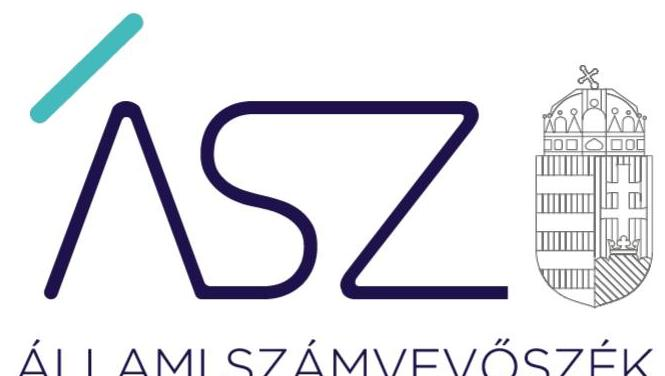
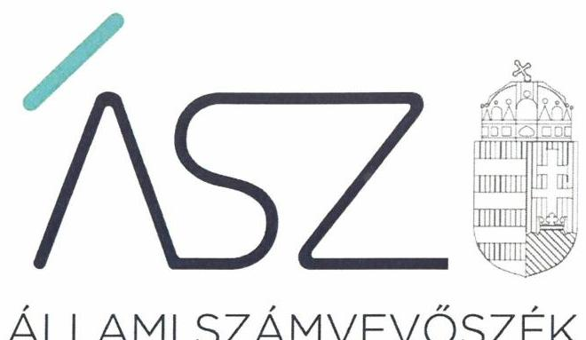
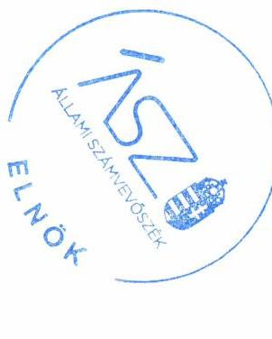

ÁLLAMI SZÁMVEVŐSZÉK

# JELENTÉS 

## Nem állami humánszolgáltatók ellenőrzése

A szociális humánszolgáltatást nyújtó intézmények, szolgáltatók államháztartáson kívüli fenntartói központi költségvetésből kapott támogatásai felhasználásának ellenőrzése Koppányvölgye Idősek Otthona és Ápolási Központ Nonprofit Korlátolt Felelősségű Társaság
2020.

20154
www.asz.hu

---

ÁLLAMI SZÁMVEVŐSZÉK

# JELENTÉS 

## Nem állami humánszolgáltatók ellenőrzése

A szociális humánszolgáltatást nyújtó intézmények, szolgáltatók államháztartáson kívüli fenntartói központi költségvetésből kapott támogatásai felhasználásának ellenőrzése Koppányvölgye Idősek Otthona és Ápolási Központ Nonprofit Korlátolt Felelősségű Társaság
2020. 

20154
www.asz.hu

Domokos László
elnök

---

# AZ ELLENŐRZÉST FELÜGYELTE: 

KAKAS SÁNDOR felügyeleti vezető

## AZ ELLENŐRZÉST VEZETTE ÉS A VÉGREHAJTÁSÁÉRT FELELŐS:

LACZI HEDVIG ANNA ellenőrzésvezető

## A PROGRAM ÖSSZEÁLLÍTÁSÁÉRT FELELŐS:

TÓTPÁL SZABOLCS osztályvezető
FEKETE-NAGY ANDRÁS GÁBOR ellenőrzési program készítéséért felelős vezető

## IKTATÓSZÁM: EL-2813-001/2020

Jelentéseink az Országgyúlés számítógépes hálózatán és az interneten a www.asz.hu címen is olvashatóak.

TÉMASZÁM: 2491
ELLENŐRZÉS-AZONOSÍTÓ SZÁM: V083592, V0867066

---

# TARTALOMJEGYZÉK 

- ÖSSZEGZÉS ..... 5
- AZ ELLENŐRZÉS CÉLJA ..... 6
- AZ ELLENŐRZÉS TERÜLETE ..... 7
- AZ ELLENŐRZÉS HÁTTERE, INDOKOLTSÁGA ..... 8
- A JELENTÉS LÉNYEGES KÉRDÉSKÖREI ..... 9
- AZ ELLENŐRZÉS HATÓKÖRE ÉS MÓDSZEREI ..... 10
- MELLÉKLETEK ..... 13
I. sz. melléklet: Értelmező szótár ..... 13
- FÜGGELÉK: ÉSZREVÉTELEK ..... 15
- RÖVIDÍTÉSEK JEGYZÉKE ..... 19

---

.

---

# ÖSSZEGZÉS 

A budapesti székhelyű Koppányvölgye Idősek Otthona és Ápolási Központ Nonprofit Kft. a 2015-2018. években nem biztosította a szociális humánszolgáltatási közfeladatok ellátására kapott költségvetési támogatások felhasználásának ellenőrizhetőségét.

## Az ellenőrzés társadalmi indokoltsága

A szociális gondoskodást igénylők védelme, illetve a köznevelési feladatok ellátása az Alaptörvényben meghatározott, a társadalom szempontjából fontos tevékenységek. Jogszabályok teszik lehetővé, hogy államháztartáson kívüli szervezetek - így például az egyházi fenntartók, alapítványok, gazdasági társaságok, egyesületek - által fenntartott intézmények is végezzenek köznevelési, szociális és gyermekvédelmi feladatokat. Mindehhez a központi költségvetés évente jelentős összegű támogatással járul hozzá. Az államháztartáson kívüli, humánszolgáltatást végző intézmények az igényelt közpénzekből társadalmilag hasznos, közösségteremtő, közérdekű, illetve közhasznú tevékenységet végeznek, illetve közfeladatokat látnak el.

Az intézményfenntartók ellenőrzésével az Állami Számvevőszék hozzájárul ahhoz, hogy ezen közpénzeket az államháztartáson kívüli szervezetek is ellenőrizhető, átlátható és elszámoltatható módon használják fel a közfeladatok ellátása során. Az ellenőrzések célja továbbá, hogy a nyilvánosság és az igénybevevők megfelelő tájékoztatást kapjanak az államháztartáson kívüli közfeladatot ellátók működéséről.

Az ÁSZ ellenőrzései arra adnak választ, hogy az intézményfenntartók arra használták-e fel a közpénzeket, amire igényelték.

A szabályszerű gazdálkodás elengedhetetlen a közfeladat ellátás szakmai céljainak megvalósításához, valamint a társadalmi közbizalom fenntartásához.

## Megállapítások, következtetések

A budapesti székhelyű Koppányvölgye Idősek Otthona és Ápolási Központ Nonprofit Kft. mint Fenntartó ${ }^{1}$ a 2015-2018. években szociális humánszolgáltatási közfeladatait nem önálló jogi személyiséggel rendelkező intézményén keresztül látta el. A Fenntartó az ellenőrzött időszakban, a jogszabályokban előírtak ellenére könyvvezetési rendszerében a fenntartó gazdálkodását a humán szolgáltatást végző intézményének gazdálkodásától nem különítette el, valamint a kapott költségvetési támogatások felhasználását az intézménye által ellátott közfeladatok - idősek otthona átlagos szintű ellátás, idősek otthona demens betegek ellátás, idősek otthona emelt szintű ellátás - szerint nem bontotta meg.

A Koppányvölgye Idősek Otthona és Ápolási Központ Nonprofit Kft. mint fenntartó - a fentiekben leírtak alapján - a 2015.-2018. évekre vonatkozóan a szociális humánszolgáltatási közfeladat ellátására kapott költségvetési támogatások felhasználásának a Számv. tv. ${ }^{2} 161 / A$ § (2) bekezdésében előírt ellenőrizhetőségét nem biztosította. Mivel az Atr. ${ }^{3} 16 . \S$ (1) bekezdésében foglalt szabályozás ellenére nem gondoskodott arról, hogy a költségvetési támogatások felhasználásának, a saját és a nem önállóan működő gazdálkodó intézménye gazdálkodásának elkülönített, feladatonkénti bontásban történő elszámolására az adatok rendelkezésre álljanak.

A Koppányvölgye Idősek Otthona és Ápolási Központ Nonprofit Kft. mindezek alapján az Alaptörvény ${ }^{4}$ 39. cikk (2) bekezdésében foglaltak ellenére a felhasznált közpénzekre vonatkozó gazdálkodása átláthatóságát nem biztosította. Ezáltal nem igazolta, hogy a közpénzt a szociális humánszolgáltatási közfeladatra fordította.

---

# AZ ELLENŐRZÉS CÉLJA

**AZ ELLENŐRZÉS CÉLJA** annak értékelése volt, hogy a nem állami, nem önkormányzati szociális intézmények fenntartói központi költségvetésből kapott támogatásainak felhasználása szabályszerű volt-e.

---

# **AZ ELLENŐRZÉS TERÜLETE**

## **Koppányvölgye Idősek Otthona és Ápolási Központ Nonprofit Korlátolt Felelősségű Társaság**

A budapesti székhelyű Koppányvölgye Idősek Otthona és Ápolási Központ Nonprofit Kft. 2003. január 1-jén kezdte meg tevékenységét. A 2017. augusztus 30-ai keltezésű egységes szerkezetbe foglalt Társasági Szerződés szerint két magánszemély tulajdonosa volt.

A Koppányvölgye Idősek Otthona és Ápolási Központ Nonprofit Kft. legfőbb döntéshozó szerve a taggyűlés5 volt.

A Koppányvölgye Idősek Otthona és Ápolási Központ Nonprofit Kft. a szociális feladatait egy, nem önálló jogi személyiséggel rendelkező, Törökkoppányban működő intézményben6 látta el. A Koppányvölgye Idősek Otthona és Ápolási Központ Nonprofit Kft. közhasznú tevékenységei a következők voltak: időszak, fogyatékosok bentlakásos ellátása főtevékenységként. A Fenntartó 2015-2018. években közhasznú szervezetként működött; ellátási területe Magyarország egész területére kiterjedt.

A Koppányvölgye Idősek Otthona és Ápolási Központ Nonprofit Kft. intézményét az SzCsM.7 rendeletben foglaltak szerint a Kormányhivatal8 nyilvántartásba vette, valamint az intézmény az Sznyvhr.-ben9 meghatározott tanúsítvánnyal rendelkezett.

A Koppányvölgye Idősek Otthona és Ápolási Központ Nonprofit Kft. a Magyar Államkincstár adatai alapján a szociális feladatellátására 2015. évben 51,7 MFt, 2016. évben 56,1 MFt, 2017. évben 63,1 MFt, 2018. évben 63,0 MFt költségvetési támogatást kapott.

---

# AZ ELLENŐRZÉS HÁTTERE, INDOKOLTSÁGA 

A szociális feladatokat ellátó nem állami intézményfenntartók részére közfeladataik ellátására 2015-2018. években jelentős összegű pénzügyi támogatást biztosítottak a mindenkori költségvetési törvények a bennük megfogalmazott feltételek mellett. A felhasználható állami támogatások a Kvtv. ${ }^{10}$-ekben a 2015-2018. években a szociális ágazatra vonatkozóan 360 Mrd Ft előirányzatot határoztak meg.

Az ÁSZ ${ }^{11}$ a stratégiájában célul tűzte ki, hogy az államháztartáson kívülre nyújtott költségvetési támogatások ellenőrzésével hozzájárul ahhoz, hogy a közpénzeket az államháztartáson kívüli szervezetek is átlátható módon használják fel a közfeladatok szerződésben vállalt ellátása érdekében. Az ÁSZ a stratégiájában foglaltak alapján is indokolt az ellenőrzés, amely a társadalom számára jelzi, hogy a közpénz államháztartáson kívüli felhasználása sem maradhat ellenőrizetlenül. Az államháztartáson kívülre nyújtott költségvetési támogatások ellenőrzésével az ÁSZ hozzájárul ahhoz, hogy a közpénzeket a nem állami fenntartók átlátható módon használják fel a közfeladatok ellátására kötött szerződésekben vállalt kötelezettségek teljesítése érdekében. Az ÁSZ az ellenőrzés javaslataival hozzájárulhat az említett rendszerek szabályszerű támogatás-felhasználásához, javíthatja a társadalmi-gazdasági döntések megalapozottságát, amely a „jól irányított állam működésének" feltétele.

---

# A JELENTÉS LÉNYEGES KÉRDÉSKÖREI 

1. A szociális humánszolgáltató közfeladatot ellátó államháztartáson kívüli fenntartó szabályszerű működési - és gazdálkodási környezet kialakításával megteremtette-e a költségvetési támogatások átlátható, elszámoltatható igénybevételének, felhasználásának feltételeit?
2. Az államháztartáson kívüli fenntartó az átvállalt szociális humánszolgáltatási közfeladathoz biztosított költségvetési támogatásokat szabályszerűen fordította-e a humánszolgáltató intézménye működtetésére?
3. Az államháztartáson kívüli fenntartó a szociális humánszolgáltató intézménye működtetéséhez felhasznált közpénzekre vonatkozó gazdálkodásával a nyilvánosság előtt elszámolt-e, ennek érdekében ellenőrzési, értékelési és a külső ellenőrzésekkel kapcsolatos intézkedési feladatait szabályszerűen látta-e el?

---

# AZ ELLENŐRZÉS HATÓKÖRE ÉS MÓDSZEREI 

## Az ellenőrzés típusa

Megfelelőségi ellenőrzés.

## Az ellenőrzött időszak

A 2015. január 1-je és 2018. december 31-e közötti időszak.

## Az ellenőrzés tárgya

Az ellenőrzés a szociális humánszolgáltatási közfeladatokat ellátó államháztartáson kívüli fenntartók, humánszolgáltatási közfeladatai ellátásához a központi költségvetésből kapott támogatásaik humánszolgáltatási közfeladatokra való fenntartó általi felhasználása szabályszerűségének értékelésére terjedt ki.

## Az ellenőrzött szervezet

Koppányvölgye Idősek Otthona és Ápolási Központ Nonprofit Kft.

## Az ellenőrzés jogalapja

Az ellenőrzés jogszabályi alapját az ÁSZ tv ${ }^{12}$. 1. § (3) bekezdése, 5. § (3) bekezdésben foglalt előírások adják.

## Az ellenőrzés módszerei

Az ellenőrzést az ellenőrzési program annak szempontjai, kérdései, az ellenőrzött időszakban hatályos jogszabályok, a nemzetközi standardokat irányadónak tekintve, az ellenőrzés szakmai szabályok és módszertanok figyelembe vételével rendelte elvégezni. A közpénzekkel való felelős gazdálkodás segítésére irányuló javaslatok kidolgozásakor a hatályos jogszabályok voltak az irányadóak.

Az ellenőrzés ideje alatt az ellenőrzött szervezettel történő kapcsolattartást az ÁSZ SZMSZ ${ }^{13}$-ének vonatkozó előírása biztosította.

Az ellenőrzési kérdések megválaszolásához szükséges bizonyítékok megszerzése az ellenőrzött által rendelkezésre bocsátott dokumentumokra, adatokra alapozva megfigyelés, szemle (szemrevételezés), kérdésfeltevés (információkérés), valamint elemző eljárással történt.

---

Az ellenőrzési bizonyítékként felhasználható adatforrások közé tartoztak egyrészt az ellenőrzési program részletes szempontjainál felsorolt adatforrások, másrészt minden - az ellenőrzés folyamán feltárt, az ellenőrzés szempontjából információt tartalmazó - dokumentum.

Az ellenőrzés lefolytatásához az ellenőrzött szervezet a kitöltött tanúsítványok, valamint az ÁSZ által kért dokumentumok elektronikus úton való megküldésével szolgáltatott adatokat, információkat. Az így rendelkezésre bocsátott adatok, információk és a tanúsítványok adatai valódiságának kontrollja az ellenőrzés keretében történt.

Az egységes értelmezést támogatta a jelentés mellékletét képező fogalomtár és rövidítésjegyzék.

Az ÁSZ az ellenőrzést alapvetően a szociális humánszolgáltatások esetében a központi költségvetési támogatások igénylésével, módosításával, felhasználásával, elszámolásával kapcsolatos feladatokat ellátó államháztartáson kívüli fenntartóknál/szervezeteinél végezte.

A szociális humánszolgáltatások központi költségvetési támogatásaival kapcsolatos, államháztartáson kívüli fenntartó jogszabályokban előírt feladatai betartását, továbbá a központi költségvetési támogatások szabályszerű nyilvántartását ellenőrizte az ÁSZ a fenntartónál rendelkezésre álló nyilvántartások, beszámolók és egyéb dokumentumok alapján. Az ellenőrzés nem terjedt ki a szociális humánszolgáltatások központi költségvetési támogatásai igénylése, módosítása, elszámolása valódiságának, megalapozottságának, helyességének - sem a fenntartónál, sem a székhely intézményeinél való - értékelésére (mivel ennek felülvizsgálata, ellenőrzése a finanszírozó jogszabályban előírt feladata, határozatai kiadása előtt). Továbbá nem terjedt ki az ellenőrzés e források, intézmények általi szabályszerű felhasználásának értékelésére.

---

.

---

# MELLÉKLETEK 

- I. SZ. MELLÉKLET: ÉRTELMEZŐ SZÓTÁR
befogadás
civil szervezet
ellátási terület
feladatfinanszírozás
humánszolgáltatás
költségvetési támogatás
nem állami, nem önkormányzati (államháztartáson kívüli) intézmény fenntartó
székhely intézmény
telephely

A Szoctv. illetve a Gyvt. szerinti, a szociális szolgáltatások és a gyermekjóléti szolgáltató tevékenységek területi lefedettségét figyelembe vevő finanszírozási rendszerbe történő befogadás.
A Civil tv*. 2. § 6. pontja szerint civil szervezet a civil társaság, a Magyarországon nyilvántartásba vett egyesület (a párt, a szakszervezet és a kölcsönös biztosító egyesület kivételével), a közalapítvány és a pártalapítvány kivételével az alapítvány.
Az a terület, ahonnan az engedélyes gyermekeket, illetve más ellátottakat fogad.
A közfeladat államháztartáson kívüli szervezet által történő ellátásához közvetlenül kapcsolódó, arányos működési költségeket finanszírozó költségvetési támogatás.
Külön törvényben meghatározott szociális, gyermekjóléti, gyermekvédelmi, közoktatási, felsőoktatási, kulturális közfeladatok (2014. évi Kvtv. 34. § (1), (4) bekezdés, 1. számú melléklet XX/20/2. alcím, 19. alcím, 2015. évi Kvtv. 43. § (1), (4) bekezdés, 1. számú melléklet XX/20/2/3. jogcím csoport, 19. alcím, 2016. évi Kvtv. 41. § (1), (4) bekezdés, 1. számú melléklet XX/20/2/3. jogcím csoport, 19. alcím).
a társadalombiztosítás pénzügyi alapjai kivételével az államháztartás központi alrendszeréből ellenérték nélkül, pénzben nyújtott támogatások (Áht. ${ }^{14}$ 1. § 14. pont) A költségvetési törvényekben (2013. évi CCXXX. törvény 33-34. §, 2014. évi C. törvény 42-43. §, 2015. évi C. törvény 40-41. §) megállapított támogatás. Például a 2015. évi C. törvény 40-41. § szerint többek között: Az Országgyűlés a szociális, gyermekjóléti, gyermekvédelmi közfeladatot ellátó intézményt, szolgáltatást fenntartó egyházi jogi személy, civil szervezet, közalapítvány, országos nemzetiségi önkormányzat, települési vagy területi nemzetiségi önkormányzat, gazdasági társaság, és a humánszolgáltatást alaptevékenységként végző, az Szja tv. hatálya alá tartozó egyéni vállalkozó (a továbbiakban együtt: nem állami
 szociális fenntartó) részére támogatást állapít meg a következők szerint: a támogatás a nem állami szociális fenntartót a települési önkormányzatok 2. melléklet III. pont 3. alpont c)-k) pontjában és III. pont 5. alpont a) pontjában meghatározott támogatásaival azonos jogcímeken, összegben és feltételek mellett illeti meg.
A szociális, gyermekjóléti és gyermekvédelmi közfeladatokat/humánszolgáltatásokat ellátó intézményt fenntartó egyházi jogi személy, társadalmi szervezet, alapítvány, közalapítvány, civil szervezet, országos nemzetiségi önkormányzat, nonprofit gazdasági társaság, gazdasági társaság és a humánszolgáltatást alaptevékenységként végző, Szja tv. hatálya alá tartozó egyéni vállalkozó. (2015. évi Kvtv. 42. §, 43. § (1), (4) bekezdés, 2016. évi Kvtv. 40. §, 41. § (1), (4) bekezdés, 2017. évi Kvtv. 41. § (1), (4)),
a szolgáltató székhelye, azaz a szolgáltató központi ügyintézésének helye, függetlenül attól, hogy használják-e szolgáltatás nyújtására (Sznyvhr ${ }^{15}$. 1.§ k) pont) (hatályos: 2013. december 1-től)
a szolgáltató székhelyétől különböző, szolgáltató/intézmény használatában álló hely, a szociális humánszolgáltatáshoz használt, bejegyzett hely. (Sznyvhr. 1.§ l) pont) (hatályos: 2015. január 1-től)

[^0]
[^0]:    Előzmény törvények, amelyeket az ellenőrzött időszak miatt figyelembe kell venni: egyesülési jogról szóló 1989. évi II. tv, a közhasznú szervezetekről szóló 1997. évi CLVI. tv.

---

.

---

# FÜGGELÉK: ÉSZREVÉTELEK 

A jelentéstervezetet a Számvevőszék 15 napos észrevételezésre megküldte az ellenőrzött szervezet vezetőjének az ÁSZ tv. 29. § ${ }^{+}$(1) bekezdése előírásának megfelelően.

A Koppányvölgye Idősek Otthona és Ápolási Központ Nonprofit Korlátolt Felelősségű Társaság ügyvezetője a jelentéstervezet megállapításaira írásban észrevételt tett.
Az ÁSZ tv. 29. § (3) bekezdésével összhangban az ÁSZ a Függelékben feltünteti az ellenőrzés megállapításaival kapcsolatban tett, figyelembe nem vett észrevételeket, és megindokolja, hogy azokat miért nem fogadta el.

[^0]
[^0]:    ${ }^{+}$29. § (1) Az Állami Számvevőszék az ellenőrzési megállapításait megküldi az ellenőrzött szervezet vezetőjének vagy az általa megbízott személynek, és annak, akinek személyes felelősségét állapította meg.
    (2) Az ellenőrzött szervezet vezetője és a felelősként megjelölt személy az ellenőrzés megállapításaira tizenöt napon belül írásban észrevételt tehet.
    (3) Az Állami Számvevőszék az észrevételre a beérkezésétől számított harminc napon belül írásban válaszol. A figyelembe nem vett észrevételeket köteles a jelentésben feltüntetni, és megindokolni, hogy azokat miért nem fogadta el.

---

A Koppányvölgye Idősek Otthona és Ápolási Központ Nonprofit Korlátolt Felelősségű Társaság ügyvezetőjének az ellenőrzés megállapításaival kapcsolatban, írásban tett, figyelembe nem vett észrevételei és azok indoklása.
Az ügyvezető észrevételében leírta, hogy a Koppányvölgye Idősek Otthona és Ápolási Központ Nonprofit Korlátolt Felelősségű Társaság (továbbiakban: Fenntartó) és jogelődje 2004 óta látja el a számára engedélyezett közfeladatot. A jelentéstervezetben a költségvetési támogatás ellenőrizhetőségére, az elkülönített nyilvántartás hiányára tett megállapítást nem vitatta.
Az észrevétel szerint a Fenntartó és az intézménye nem különül el egymástól. A Fenntartó a székhelyén tevékenységet nem végez, arra semmilyen költséget, ráfordítást nem számolnak el. A fióktelepen is csak az engedélyezett közfeladatot látják el. Nem voltak tudatában annak, hogy az általuk ellátott feladat három feladatnak minősül, ezért nem mutatták ki a támogatás felhasználását feladatonként elkülönítve. Az ügyvezető az észrevételben elismerte, hogy ebben hibáztak, azonban ez nem eredményezett rendeltetésellenes, pazarló felhasználást, kár nem keletkezett. A Magyar Államkincstár rendszeres ellenőrzései során a feladatok jogcímenkénti elkülönítése nem merült fel, azért a Fenntartó a könyvelését megfelelőnek, elfogadottnak tartotta.
Az ügyvezető észrevételében jelezte továbbá, hogy haladéktalanul intézkedett a számviteli politika és a számlarend módosításáról. A 2019. évi beszámolót a jelentéstervezet kézhezvételét megelőzően elkészítették, elfogadták és közzétették, ezért 2019-re csak kézi, analitikus nyilvántartásban mutatták be a támogatás felhasználásának feladatonkénti bontását. 2020-tól a főkönyvi könyvelésben tevékenységi gyűjtők alkalmazásával biztosítják az elkülönítést.
Kérte a fentiek figyelembe vételét és a Fenntartó működésének jogszerűtlenségére tett megállapítások korrigálását.
Az észrevételre adott válaszban a felügyeleti vezető tájékoztatta a Fenntartó ügyvezetőjét, hogy az Állami Számvevőszék (továbbiakban: ÁSZ) az ellenőrzés során kizárólag az adatszolgáltatásra rendelkezésre álló - az Állami Számvevőszékről szóló 2011. évi LXVI. törvény (továbbiakban: ÁSZ tv.) 28. § (2) bekezdés szerinti - határidőn belül beérkezett dokumentumokat veszi figyelembe. A törvényes határidőn túl - így a vagyonmegóvási eljárás kilátásba helyezéséről tájékoztató levélre küldött válaszlevél mellékleteként - megküldött dokumentumokat az ÁSZ a tárgyi megállapítások megtételéhez nem veszi figyelembe, azokat külön ügymenetben értékeli.
Az ÁSZ tv. 28. § (2) bekezdése szerint, a közreműködésre felhívott szervezet az ÁSZ részére - annak kérésére soron kívül, de legkésőbb öt munkanapon belül - az ellenőrzés tervezhetősége, meghatározása, illetve lefolytatása érdekében szükséges adatokat és dokumentumokat rendelkezésre bocsátja, illetve a kapcsolódó tájékoztatást köteles megadni. A Fenntartó több teljességi és hitelességi nyilatkozattal dokumentumokat küldött meg az ÁSZ részére.
Az ellenőrzéshez a Fenntartó által az adatbekérés során beküldött dokumentumok felülvizsgálata alapján megállapítható, hogy a Fenntartó az egyházi és nem állami fenntartású szo-

---

ciális, gyermekjóléti és gyermekvédelmi szolgáltatók, intézmények és hálózatok támogatásáról szóló 489/2013. (XII. 18.) Korm. rendelet (továbbiakban: Atr.) 16. § (1) bekezdésében előírtak ellenére a számviteli rendjében nem különítette el a saját és humánszolgáltatást végző intézménye gazdálkodására vonatkozó tételeket, valamint könyvvezetésében a költségvetési támogatások felhasználását feladatonkénti bontásban, elkülönítetten nem mutatta ki.

A számvitelről szóló 2000. évi C. törvény 161/A § (2) bekezdése előírja, hogy a közpénzek felhasználásának és a köztulajdon használatának nyilvánossága és ellenőrizhetősége érdekében a gazdálkodó nyilvántartási (könyvvezetési) rendszerét köteles oly módon továbrészletezni, hogy abból a vonatkozó külön jogszabályban meghatározott adatok rendelkezésre álljanak. Az Atr. 16. § (1) bekezdésében a támogatások felhasználására előírt, a számviteli rendben feladatonkénti bontásban, elkülönítetten történő kezelési kötelezettség attól függetlenül is fennáll és vonatkozik a Fenntartóra, hogy a Fenntartó és a feladatokat ellátó intézménye nem válik el egymástól.
A felügyeleti vezető válaszában tájékoztatta a Fenntartó ügyvezetőjét, hogy más hatóság által a Fenntartónál lefolytatott ellenőrzések az ÁSZ ellenőrzéseinek megállapításait nem befolyásolják.
A Fenntartó ügyvezetőjének az ellenőrzött időszakot követő intézkedéseiről szóló tájékoztatása az ellenőrzött időszakra vonatkozóan a jelentéstervezetben tett megállapítást nem befolyásolja.
A fentiekre tekintettel az észrevételt nem fogadtuk el, a jelentéstervezet megállapítása helytálló, módosítása nem indokolt.

---

.

---

# RÖVIDÍTÉSEK JEGYZÉKE 

${ }^{1}$ Fenntartó
${ }^{2}$ Számv. tv.
${ }^{3}$ Atr.
${ }^{4}$ Alaptörvény
${ }^{5}$ taggyűlés
${ }^{6}$ intézmény
${ }^{7}$ SzCsM. rendelet
${ }^{8}$ Kormányhivatal
${ }^{9}$ Sznyvhr.
${ }^{10}$ Kvtv.
${ }^{11}$ ÁSZ
${ }^{12}$ ÁSZ tv.
${ }^{13}$ ÁSZ SZMSZ
${ }^{14}$ Áht.
${ }^{15}$ Sznyvhr.

Koppányvölgye Idősek Otthona és Ápolási Központ Nonprofit Kft. 2000. évi C. törvény a számvitelről

489/2013. (XII. 18.) Korm. rendelet az egyházi és nem állami fenntartású szociális, gyermekjóléti és gyermekvédelmi szolgáltatók, intézmények és hálózatok állami támogatásáról,
Magyarország Alaptörvénye
Koppányvölgye Idősek Otthona és Ápolási Központ Nonprofit Kft. taggyűlése
Koppányvölgye Idősek Otthona és Ápolási Központ (7285 Törökkoppány, Ady Endre u. 12.)
1/2000. (I. 7.) SzCsM rendelet a személyes gondoskodást nyújtó szociális intézmények szakmai feladatairól és működésük feltételeiről
Somogy Megyei Kormányhivatal Szociális és Gyámhivatal
369/2013. (X. 24.) Korm. rendelet a szociális, gyermekjóléti és gyermekvédelmi szolgáltatók, intézmények és hálózatok hatósági nyilvántartásáról és ellenőrzéséről
Magyarország 2015. évi központi költségvetéséről szóló 2014. évi C. törvény, Magyarország 2016. évi központi költségvetéséről szóló 2015. évi C. törvény, Magyarország 2017. évi központi költségvetéséről szóló 2016. évi XC. törvény, Magyarország 2018. évi központi költségvetéséről szóló 2017. évi C. törvény
Állami Számvevőszék
2011. évi LXVI. törvény az Állami Számvevőszékről

Az Állami Számvevőszék elnökének 3/2019. (XII. 23.) ÁSZ utasítása az Állami Számvevőszék Szervezeti és Működési Szabályzatáról (hatályos 2020. január 1-jétől).
2011. évi CXCV. törvény az államháztartásról

369/2013. (X. 24.) Korm. rendelet a szociális, gyermekjóléti és gyermekvédelmi szolgáltatók, intézmények és hálózatok hatósági nyilvántartásáról és ellenőrzéséről

---

# ASZ 

ÁLLAMI SZÁMVEVŐSZÉK
1052 Budapest, Apáczai Cs. J. u. 10. I 1364 Budapest 4. Pf. 54 TEL: +36 14849100
email: szamvevoszek@asz.hu
web: www.asz.hu | www.aszhirportal.hu

