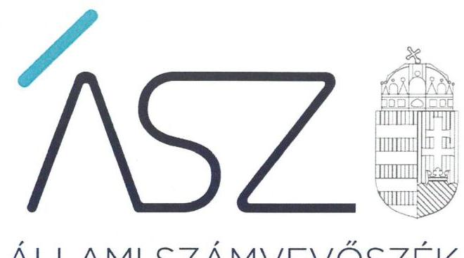
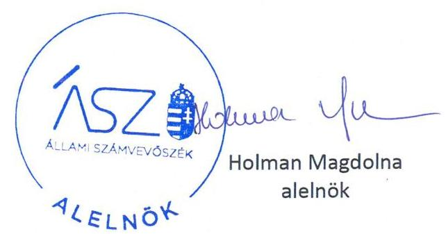

ÁLLAMI SZÁMVEVŐSZÉK

# JELENTÉS 

## Pártok gazdálkodása

A költségvetési támogatásban részesülő pártok 2017-2018. évi gazdálkodása törvényességének ellenőrzése a Lehet Más a Politikánál

2020.

20155
www.asz.hu

---

ÁLLAMI SZÁMVEVŐSZÉK

# JELENTÉS 

## Pártok gazdálkodása

A költségvetési támogatásban részesülő pártok 2017-2018. évi gazdálkodása törvényességének ellenőrzése a Lehet Más a Politikánál
2020. 08. hó 04. nap

20155
www.asz.hu

---

|  AZ ELLENŐRZÉST FELÜGYELTE: |  |  |  |  |   |
| --- | --- | --- | --- | --- | --- |
|   |  | DR. BENEDEK MÁRIA felügyeleti vezető |  |  |   |
|   |  | AZ ELLENŐRZÉST VEZETTE ÉS A VÉGREHAJTÁSÁÉRT FELELŐS: |  |  |   |
|   |  | DR. PELLEI TAMÁS ellenőrzésvezető |  |  |   |
|   |  | A PROGRAM ÖSSZEÁLLÍTÁSÁÉRT FELELŐS: |  |  |   |
|   |  | BERTALAN RUDOLF felelős vezető |  |  |   |
|   |  | A TÉMÁHOZ KAPCSOLÓDÓ KORÁBBI SZÁMVEVŐSZÉKI JELENTÉSEK: |  |  |   |
|   |  | • címe: |  | Jelentés a költségvetési támogatásban részesülő pártok 2015-2016. évi gazdálkodása törvényességének ellenőrzéséről a Lehet Más a Politikánál |   |
|   |  | • sorszáma: |  | 18016 |   |
|  Jelentéseink az Országgyűlés számítógépes hálózatán és az interneten a www.asz.hu címen is olvashatóak. |  | • címe: |  | Jelentés a költségvetési támogatásban részesülő pártok 2013-2014. évi gazdálkodása törvényességének ellenőrzéséről – Lehet Más a Politika |   |
|   |  | • sorszáma: |  | 16152 |   |
|   |  | IKTATÓSZÁM: EL-2816-001/2020 |  |  |   |
|   |  | TÉMASZÁM: 2520 |  |  |   |
|   |  | ELLENŐRZÉS-AZONOSÍTÓ SZÁM: V086403 |  |  |   |

---

# TARTALOMJEGYZÉK 

■ ÖSSZEGZÉS ..... 5
■ AZ ELLENŐRZÉS CÉLJA ..... 6
■ AZ ELLENŐRZÉS TERÜLETE ..... 7
■ AZ ELLENŐRZÉS HÁTTERE, INDOKOLTSÁGA ..... 8
■ A JELENTÉS LÉNYEGES KÉRDÉSKÖREI ..... 9
■ AZ ELLENŐRZÉS HATÓKÖRE ÉS MÓDSZEREI ..... 10
■ MEGÁLLAPÍTÁSOK ..... 12
■ JAVASLATOK ..... 15
■ MELLÉKLETEK ..... 17
I. sz. melléklet: Fogalomtár ..... 17
■ FÜGGELÉK: ÉSZREVÉTELEK ..... 19
■ RÖVIDÍTÉSEK JEGYZÉKE ..... 21

---

.

---

# ÖSSZEGZÉS 

A Lehet Más a Politika a 2017. évben a gazdálkodásának szabályozási környezetét nem a jogszabályi előírásoknak megfelelően alakította ki, nem teremtette meg a közpénzekkel való átlátható gazdálkodás feltételeit. A Lehet Más a Politika a 2017-2018. évi pénzügyi kimutatásait nem a jogszabályi előírások szerint készítette el, pénzügyi kimutatásai nem mutatnak megbízható és valós képet a párt bevételeiről és kiadásairól, amelyek közzétételével a párt a nyilvánosságot és a saját tagságát is megtévesztette.

## Az ellenőrzés társadalmi indokoltsága

A pártok az állampolgárok egyesülési szabadsága alapján létrehozott olyan szervezetek, amelyek kereteket nyújtanak a népakarat kialakításához és kinyilvánításához, a politikai életben való állampolgári részvételhez.

A politikai élet tisztasága érdekében törvény állapítja meg a pártok vagyonára és gazdálkodására vonatkozó szabályokat. Az egyesülési jog alapján létrejövő más szervezetekhez képest szűkebb körben határozza meg azt a gazdasági tevékenységet, amelyet a párt végezhet, biztosítja azonban a pártok részére azt a jogosultságot, hogy az állami költségvetésből támogatásban részesüljenek. A pártok gazdálkodását a politikai élet tisztasága érdekében rendszeresen indokolt ellenőrizni, ezért törvényi előírás alapján az Állami Számvevőszék a költségvetési támogatást kapott pártok gazdálkodását kétévente ellenőrzi.

A pártokkal szembeni társadalmi elvárás a törvényt tisztelő, jogkövető magatartás, mivel a párt képviselői a jogállamiságot megtestesítő törvényhozó hatalom részei. Mindezekre tekintettel fokozott társadalmi veszélyességet hordoz egy párt elszámoltathatóságának hiánya, elszámolási kötelezettségének nem teljesítése.

## Főbb megállapítások, következtetések, javaslatok

A Lehet Más a Politika gazdálkodására vonatkozó belső szabályozási környezetét a 2017. évre vonatkozóan nem szabályszerűen alakította ki, így nem biztosította a szabályszerű működés és gazdálkodás feltételeit. A 2018. évre vonatkozóan a gazdálkodására vonatkozó belső szabályozási környezetét a jogszabályi előírások alapján kialakította.

A Lehet Más a Politika a 2017-2018. évekre vonatkozóan a könyvviteli nyilvántartásait nem az előírások szerint vezette. A 2017. évben a Lehet Más a Politika számviteli szabályozási környezete nem biztosította a központi költségvetésből kapott támogatások és az egyéb hozzájárulások, adományok szabályszerű nyilvántartását, valamint a könyvvezetésének és gazdálkodásának szabályszerűségét. A 2018. évben a magánszemélyek adománya és a tagdíjak tekintetében analitikus nyilvántartást nem vezetett, ezáltal a könyvvezetése nem volt szabályszerű. A magánszemélyektől kapott adományok adatait bizonylat nélkül rögzítette a számviteli nyilvántartásában, így nem igazolta, hogy ezen adományok a Párttörvény szerinti engedélyezett forrásból származtak. A 2018. évben a teljesítésigazolás nélkül történt kifizetések miatt nem igazolt továbbá, hogy a kifizetéseket a Lehet Más a Politika a feladatellátásaira fordította.

A Lehet Más a Politika a 2017. és 2018. évi pénzügyi kimutatásainak adatait, a jogszabályi előírások ellenére szabályszerű könyvvezetéssel nem támasztotta alá. Így a Lehet Más a Politika pénzügyi kimutatásai alapján nem igazolt, hogy a felhasznált közpénzeket átláthatóan és a közélet tisztasága elvének figyelembevételével kezelte. A Magyar Közlöny mellékletét képező Hivatalos Értesítőben és a saját honlapján közzétett pénzügyi kimutatás adatai - szabályszerű könyvvezetés hiányában - nem mutattak valós képet a párt működésének vagyoni és pénzügyi helyzetéről.

Az Állami Számvevőszék az intézkedések megtétele céljából a Lehet Más a Politika társelnökeinek öt javaslatot fogalmazott meg.

---

# AZ ELLENŐRZÉS CÉLJA 

AZ ELLENŐRZÉS CÉLJA annak értékelése, hogy a Lehet Más a Politika által közzétett pénzügyi kimutatások a törvényi előírásoknak megfeleltek-e, a könyvvezetés és gazdálkodás során betartották-e a vonatkozó jogszabályi és belső előírásokat; a Lehet Más a Politika működéséhez szabályszerűen igénybe vehető forrásokat használt-e fel.

---

# AZ ELLENŐRZÉS TERÜLETE 

## Lehet Más a Politika

A Lehet Más a Politika 2009. április 1-jén létrejött olyan egyesület, amely nyilvántartott tagsággal rendelkezik, és a nyilvántartásba vételét végző bíróság előtt kinyilvánította, hogy a Párttörvény ${ }^{1}$ rendelkezéseit magára nézve kötelezőnek ismeri el a Párttörvény 1. §-a alapján.

A Lehet Más a Politika legfőbb döntéshozó szerve a Kongresszus volt. A Lehet Más a Politika legfőbb szervei a két kongresszus közötti időszakban az Országos Politikai Tanács² és az Országos Elnökség ${ }^{3}$ voltak. A Lehet Más a Politika képviseletét az Országos Elnökség, illetve annak tagjai közül: a két társelnök, a pártigazgató, valamint az Országos Elnökség titkára látta el az az Alapszabály ${ }_{1-4}{ }^{4}$ által meghatározott feladatkörökben. A Lehet Más a Politika 2010-ben létrehozta az Ökopolisz Alapítványt, 2013-ban pedig a Lehetmás Kft.-t.

A Lehet Más a Politika a 2017. évi pénzügyi kimutatásában 199596 ezer Ft bevételt, valamint 241390 ezer Ft kiadást, a 2018. évi pénzügyi kimutatásában 910601 ezer Ft bevételt, valamint 934439 ezer Ft kiadást számolt el. A Lehet Más a Politika által készített és a Magyar Közlöny mellékletét képező, Hivatalos Értesítő ${ }^{5}$ 2018. évi 21. számában, illetve a 2019. évi 33. számában közzétett pénzügyi kimutatásokban a párt a bevételek között a 2017. évben 173700 ezer Ft, a 2018. évben 195068 ezer Ft központi költségvetési támogatást mutatott ki. A bevételeken belül a magánszemélyektől kapott 500,0 ezer Ft feletti egyéb hozzájárulások, adományok összege a 2017. évben 7601 ezer Ft, a 2018. évben 7778 ezer Ft volt.

---

# AZ ELLENŐRZÉS HÁTTERE, INDOKOLTSÁGA 

Az ÁSZ tv. ${ }^{6}$ 5. § (11) bekezdés a) pontja, valamint a Párttörvény 10. § (1) bekezdése alapján a pártok gazdálkodása törvényességének ellenőrzésére az ÁSZ ${ }^{7}$ jogosult. Törvényi előírás alapján az ÁSZ kétévente ellenőrzi azoknak a pártoknak a gazdálkodását, amelyek rendszeres költségvetési támogatásban részesültek.

Az ÁSZ legutóbb a Lehet Más a Politika 2015-2016. évi gazdálkodásának törvényességét ellenőrizte.

A gazdálkodás szabályszerűségének, a felhasznált közpénzek nagyságának bemutatásával a társadalom objektív képet alkothat a pártok működéséről. Az ellenőrzés megállapításai a gazdálkodás megfelelőségének bemutatásával elősegíthetik, hogy a törvényalkotók konkrét lépéseket tegyenek a pártok finanszírozására vonatkozó szabályozások megváltoztatása, átláthatóbbá, ellenőrizhetőbbé tétele irányába. Az ellenőrzés rámutat a pártok gazdálkodásával kapcsolatos jó gyakorlatokra és szabálytalanságokra. A hiányosságok, szabálytalanságok feltárása, az ennek kapcsán megfogalmazott megállapítások elősegíthetik a törvényi rendelkezések megsértésének szankcionálását.

---

# A JELENTÉS LÉNYEGES KÉRDÉSKÖREI 

1. A Lehet Más a Politika szabályszerűen kialakította-e a gazdálkodás szabályozási kereteit?
2. A Lehet Más a Politika könyvvezetése és gazdálkodása szabályszerű volt-e?
3. A Lehet Más a Politika pénzügyi kimutatása megfelelt-e a jogszabályi előírásoknak, közzétételi kötelezettségét szabályszerűen teljesítette-e?

---

# AZ ELLENŐRZÉS HATÓKÖRE ÉS MÓDSZEREI 

## Az ellenőrzés típusa

Szabályszerűségi ellenőrzés.

## Az ellenőrzött időszak

2017-2018. évek.

## Az ellenőrzés tárgya

A Lehet Más a Politika ellenőrzése során az ellenőrzés tárgyát képezte a 2017. és a 2018. évre vonatkozó pénzügyi kimutatás elkészítésére, jóváhagyására, közzétételére, a párt könyvvezetésére, gazdálkodására, ennek keretében a számviteli szabályozás kialakítására, a bizonylati rend, bizonylati fegyelem betartására, egyéb gazdálkodási, ellenőrzési és pénzügyi-számviteli informatikai feladatok ellátására irányuló tevékenységek. Az ellenőrzés tárgya volt még a források elszámolása és felhasználása, valamint a vagyon jogszabályi előírásoknak megfelelő hasznosítása.

Az ellenőrzés kiterjedt minden olyan körülményre és adatra, amely az ÁSZ jogszabályban meghatározott feladatainak teljesítéséhez, valamint a program végrehajtása folyamán felmerült újabb összefüggések feltárásához szükséges volt.

## Az ellenőrzött szervezet

Lehet Más a Politika

## Az ellenőrzés jogalapja

Az ellenőrzés jogalapját az ÁSZ tv. 5. § (11) bekezdés a) pontja, a Párttörvény 4. § (4)-(5) bekezdései, valamint 10. § (1), (3)-(4) bekezdései képezték.

## Az ellenőrzés módszerei

Az ÁSZ ellenőrzésére az ellenőrzési program szempontjai, az ellenőrzött időszakban hatályos jogszabályok, az ellenőrzés általános szakmai szabá-

---

lyai, az ellenőrzésre irányadó ÁSZ módszertanok figyelembevételével került sor. A közpénzekkel való felelős gazdálkodás segítésére irányuló javaslatok kidolgozásakor a hatályos jogszabályok irányadóak.

Az ellenőrzés ideje alatt a Lehet Más a Politikával történő kapcsolattartást az ÁSZ SZMSZ ${ }^{8}$-ének vonatkozó előírásai alapján biztosította az ÁSZ.

Az ellenőrzés céljának eléréséhez szükséges bizonyítékok megszerzése a Lehet Más a Politika által rendelkezésre bocsátott dokumentumokra, adatokra alapozva közvetlen, részletes elemzés, megfigyelés, szemrevételezés, információkérés, megerősítés, valamint elemző eljárás útján történt. Az ellenőrzési bizonyítékként felhasználható adatforrások közé tartoztak egyrészt az ellenőrzési program részletes szempontjainál felsorolt adatforrások, másrészt minden egyéb - az ellenőrzés folyamán feltárt, az ellenőrzés szempontjából információt tartalmazó - dokumentum.

Az ellenőrzés lefolytatásához a Lehet Más a Politika az ÁSZ által kért dokumentumok megküldésével szolgáltatott adatokat, amelyek valódiságát és teljes körűségét a Lehet Más a Politika vezetője által tett teljességi és hitelességi nyilatkozatnak kellett igazolnia. A rendelkezésre bocsátott adatok, információk kontrollja az ellenőrzés keretében történt.

Az ÁSZ
 a tételes ellenőrzés mellett statisztikai alapú mintavételezést és értékelést alkalmazott. A minták kiválasztása rétegzett mintavételezéssel történt. A hozzájárulások, adományok és egyéb bevételek, valamint a személyi juttatások (működési kiadáson belül), eszközbeszerzések és a működési kiadások további tételei, politikai tevékenység kiadásai, egyéb kiadások mintatételeinek értékelése „szabályszerű”, ha a minta ellenőrzésének eredménye alapján 95%-os bizonyossággal a teljes sokaságban az átlagos hibaarány nem haladta meg a 10%-ot, „nem szabályszerű”, ha nagyobb volt, mint 10%. Abban az esetben, ha a teljes sokaság tekintetében a 10%-os hibaarányhoz való viszony megítélésének megbízhatósága nem érte el a 95%-ot, annak elérése érdekében az értékelés további szempontokkal egészült ki, a feltárt hibák értéke is figyelembe vételre került.

---

# 1. A Lehet Más a Politika szabályszerűen kialakította-e a gazdálkodás szabályozási kereteit? 

Összegző megállapítás

A Lehet Más a Politika gazdálkodásának szabályozási kereteit a 2017. évben nem szabályszerűen alakította ki, a 2018. évben a jogszabályi előírások figyelembevételével kialakította.

Az LMP${ }^{9}$ a Számv. tv.${ }^{10}$ előírása alapján rendelkezett Számviteli politikával${ }_{1,2}{ }^{11}$, melynek keretében elkészítette a Leltározási szabályzatot${ }^{12}$, az Értékelési szabályzat${ }_{1,2}{ }^{13}$-t és a Pénzkezelési szabályzatot${ }^{14}$, továbbá a Számv. tv. előírása szerint elkészítette a Számlarendet${ }_{1,2}{ }^{15}$.

A 2017. évben az LMP gazdálkodására vonatkozó számviteli keretek kialakítása nem felelt meg a jogszabályi előírásoknak, mert
$\longrightarrow$ a Számviteli politika${ }_{3}$t a Számv. tv. 14. § (3) bekezdésében foglaltak ellenére nem a sajátosságainak figyelembevételével alakította ki, az nem tartalmazta az egyéb bevételek, egyéb kiadások, a működési és politikai tevékenység kiadásainak fogalomkörét, ismérveit,
$\longrightarrow$ a Számlarend${ }_{1}$ a Számv. tv. 161. § (2) bekezdés a)-b) és d) pontjaiban foglalt előírások ellenére nem tartalmazta minden alkalmazásra kijelölt számla számjelét és megnevezését, a számla értéke növekedésének, csökkenésének jogcímeit, valamint a számlarendben foglaltakat alátámasztó bizonylati rendet.
Az LMP a 2018. május 25-étől hatályos Számviteli politikában${ }_{2}$ meghatározta az egyéb bevételek, egyéb kiadások, a működési és politikai tevékenység kiadásainak fogalomkörét. Továbbá a 2018. évben a Számviteli Politikában${ }_{2}$ és az Értékelési szabályzatban${ }_{2}$ a Párttörvény 4. § (5) bekezdésében előírtak alapján meghatározta a részére nyújtott nem pénzbeli vagyoni hozzájárulás értékelését.

## 2. A Lehet Más a Politika könyvvezetése és gazdálkodása szabályszerű volt-e?

Összegző megállapítás

Az LMP a 2017. és 2018. években a költségvetési támogatásokkal és az egyéb hozzájárulásokkal, adományokkal, tagdíjakkal kapcsolatos nyilvántartási kötelezettségét - a 2018. évi költségvetési támogatások kivételével - nem szabályszerűen teljesítette. Az LMP gazdálkodása nem volt szabályszerű.

Az LMP a 2017. évi könyvvezetése és gazdálkodása nem volt szabályszerű.

Az LMP a 2017. évben - az 1. pont 2. bekezdésében részletesen kifejtettek alapján - nem a jogszabályi előírások szerint alakította ki gazdálkodásának

---

# 2.2. számú megállapítás 

számviteli kereteit, így a belső szabályzatai nem biztosították a központi költségvetésből kapott támogatások és az egyéb hozzájárulások, adományok szabályszerű nyilvántartását, valamint az LMP könyvvezetésének és gazdálkodásának szabályszerűségét.

Az LMP a 2018. évben az egyéb támogatásokkal, adományokkal, tagdíjakkal kapcsolatos elszámolási, nyilvántartási kötelezettségét nem szabályszerűen teljesítette. A 2018. évi központi költségvetésből kiutalt támogatások számviteli elszámolása, nyilvántartása szabályszerű volt.

Az LMP a 2018. évi számviteli nyilvántartásait nem a jogszabályi és a belső szabályozások előírásainak megfelelően vezette, mert a Számviteli politikában: 3. §-ában és a Számlarendben: 4. és 9. számlaosztályokra vonatkozóan rögzített előírásai ellenére a magánszemélyek adománya és a tagdíjakkal kapcsolatos könyvvezetési kötelezettségét - analitikus nyilvántartás hiányában - nem szabályszerűen teljesítette. Ebből adódóan a Számv. tv. 161. § (3) bekezdésének előírása ellenére az analitikus nyilvántartások és a főkönyvi könyvelés értékadatai számszerű egyeztetésének lehetőségét sem biztosította.

Összesen 128,4 ezer Ft összegű magánszemélyektől kapott adományt, valamint 321,2 ezer Ft egyéb kiadás elszámolását az LMP a Számv. tv. 165. § (1)-(2) bekezdésében előírtak ellenére nem támasztotta alá számviteli bizonylattal, bizonylat hiányában rögzítette számviteli nyilvántartásában a bevételekkel és a kiadásokkal kapcsolatos adatokat. A magánszemélyektől kapott adományok tekintetében az LMP nem igazolta, hogy ezen adományok a Párttörvény 4. § (1) bekezdésében meghatározottak szerint engedélyezett forrásból, magyar állampolgár természetes személyek vagyoni hozzájárulásaiból származtak.

Az LMP a 2018. évi főkönyvi nyilvántartásában 195068 ezer Ft központi költségvetésből származó támogatást mutatott ki, amely megegyezett a Magyar Államkincstár által ténylegesen átutalt összeggel.

## Az LMP a 2018. évi gazdálkodása nem volt szabályszerű.

A 2018. évben a személyi jellegű kifizetésekhez, az eszközbeszerzésekhez és egyéb kiadásokhoz kapcsolódó bizonylatai a Számv. tv. 167. § (1) bekezdés c) pontjában és a Kötelezettségvállalási szabályzat${ }^{16}$ 4. § (2)-(3) bekezdésében foglalt előírások ellenére nem tartalmazták az utalványozó és a végrehajtást igazoló személy (teljesítésigazoló) aláírását, így a kifizetések teljesítésigazolás nélkül történtek.

A Számv. tv. 69. § (1) bekezdésében és a Leltározási szabályzat 2. § (2) bekezdésében foglaltak ellenére az LMP nem állított össze leltárt, amely tételesen, ellenőrizhető módon tartalmazta a mérleg fordulónapján meglévő valamennyi eszközét és forrását mennyiségben és értékben.

---

# 3. A Lehet Más a Politika pénzügyi kimutatása megfelelt-e a jogszabályi előírásoknak, közzétételi kötelezettségét szabályszerűen teljesítette-e? 

Összegző megállapítás

Az LMP 2017-2018. évi pénzügyi kimutatása nem felelt meg a jogszabályi előírásoknak, közzétételi kötelezettségét teljesítette.
3.1. számú megállapítás

Az LMP a 2017-2018. évi pénzügyi kimutatásait nem a jogszabályi előírások szerint készítette el.

Az LMP a 2017. és 2018. évi pénzügyi kimutatásának adatait a Számv. tv. 4. § (1) bekezdésének előírása ellenére szabályszerű könyvvezetéssel nem támasztotta alá, mert:
$\longrightarrow$ az „Eszközbeszerzés” soron a Számlarend 1. számlaosztálynál, valamint a Számviteli politikában${ }_{2}$ 6. §-ában előírtakkal ellentétben a főkönyvi nyilvántartásában a 2017. évre rögzített 4849 ezer Ft-os eszközbeszerzés összege helyett 4700 ezer Ft összeget mutatott ki,
$\longrightarrow$ a 2.1. pontban kifejtettek alapján a belső szabályzások nem biztosították a számviteli nyilvántartások szabályszerű vezetését, ezáltal a 2017. évi pénzügyi kimutatás megalapozottságát,
$\longrightarrow$ a 2.2 és 2.3. pontokban részletezettek szerint az LMP a gazdálkodása során a bevételeket és kiadásokat a 2018. évben nem szabályszerűen számolta el, ezáltal a könyveinek év végi zárását követően a könyvvezetése - az analitikus nyilvántartások hiányában - nem biztosította a pénzügyi kimutatásban rögzített adatok szabályszerű alátámasztását.
3.2. számú megállapítás

Az LMP a 2017-2018. évekre vonatkozó a pénzügyi kimutatásait határidőben közzétette.

Az LMP a 2017-2018. évekre vonatkozó nem szabályszerűen elkészített pénzügyi kimutatásait a Párttörvény előírásának megfelelően határidőben közzétette a Magyar Közlöny mellékletét képező Hivatalos Értesítőben, valamint saját honlapján.

---

# JAVASLATOK 

Az ÁSZ tv. 33. § (1) bekezdésében foglaltak értelmében az ellenőrzött szervezet vezetője köteles a jelentésben foglalt megállapításokhoz kapcsolódó intézkedési tervet összeállítani és azt a jelentés kézhezvételétől számított 30 napon belül az ÁSZ részére megküldeni. Amennyiben az ellenőrzött szervezet vezetője nem küldi meg határidőben az intézkedési tervet, vagy továbbra sem elfogadható intézkedési tervet küld, az Állami Számvevőszék elnöke az ÁSZ tv. 33. § (3) bekezdése a) és b) pontjaiban foglaltakat érvényesítheti.

## Az LMP társelnökeinek

1. Intézkedjen a Számv. tv., a Számviteli politika és a Számlarend előírásának megfelelően - a tagdíj, a magánszemélyek adománya vonatkozásában - az analitikus nyilvántartás és a főkönyvi könyvelés között az értékadatok számszerű egyeztetéséhez szükséges analitikus nyilvántartás vezetéséről.
(2.2. számú megállapítás 1. bekezdése alapján)
2. Intézkedjen arról, hogy a Számv. tv. előírásának megfelelően adatokat a számviteli (könyvviteli) nyilvántartásokba csak bizonylat alapján jegyezzenek be.
(2.2. számú megállapítás 2. bekezdés 1. mondata alapján)
3. Intézkedjen a Számv. tv. valamint a Kötelezettségvállalási szabályzat előírásának megfelelően a személyi jellegű kifizetésekhez, az eszközbeszerzésekhez és egyéb kiadásokhoz kapcsolódó kifizetések bizonylatain az utalványozó és a végrehajtást igazoló (teljesítésigazoló) személy aláírásának szerepeltetéséről.
(2.3. számú megállapítás 1. bekezdése alapján)
4. Intézkedjen a Számv. tv. és a Leltározási szabályzat előírásának megfelelően az üzleti év zárásához olyan leltár összeállításáról, amely tételesen, ellenőrizhető módon tartalmazza a mérleg fordulónapján meglévő valamennyi eszközét és forrását mennyiségben és értékben.
(2.3. számú megállapítás 2. bekezdése alapján)
5. Intézkedjen a Számv. tv előírásának megfelelően a pénzügyi kimutatása könyvvezetéssel történő alátámasztásáról.
(3.1. számú megállapítás 1. bekezdés 1. franciabekezdése alapján)

---

.

---

# MELLÉKLETEK 

- I. SZ. MELLÉKLET: FOGALOMTÁR
pénzügyi kimutatás
költségvetési támogatás

A Párttörvény 9. § (1) bekezdésében meghatározott, a törvény 1. számú melléklete szerinti pénzügyi kimutatás (hatályos 2014. május 6-ától), amelyet a pártok kötelesek minden év május 31-ig a Magyar Közlönyben, valamint saját honlappal rendelkező pártok a honlapjukon is közzétenni.
Az államháztartás alrendszerei terhére nyújtott pénzbeli vagy nem pénzbeli juttatás, amelyet a támogató nem elsősorban ellenszolgáltatás ellenében, de konkrét program megvalósítása vagy meghatározott időszakban a támogatott szervezet működtetése érdekében nyújt. (Civil tv. 2. § 15. pont)

---

.

---

# FÜGGELÉK: ÉSZREVÉTELEK 

A jelentéstervezetet a Számvevőszék 15 napos észrevételezésre megküldte az ellenőrzött szervezet vezetőinek az ÁSZ tv. 29. §*(1) bekezdése előírásának megfelelően.

A Lehet Más a Politika társelnökei a jelentéstervezet megállapításaira nem tettek észrevételt.

[^0]
[^0]:    * 29. § (1) Az Állami Számvevőszék az ellenőrzési megállapításait megküldi az ellenőrzött szervezet vezetőjének vagy az általa megbízott személynek, és annak, akinek személyes felelősségét állapította meg.
    (2) Az ellenőrzött szervezet vezetője és a felelősként megjelölt személy az ellenőrzés megállapításaira tizenöt napon belül írásban észrevételt tehet.
    (3) Az Állami Számvevőszék az észrevételre a beérkezésétől számított harminc napon belül írásban válaszol. A figyelembe nem vett észrevételeket köteles a jelentésben feltüntetni, és megindokolni, hogy azokat miért nem fogadta el.

---

.

---

# RÖVIDÍTÉSEK JEGYZÉKE 

${ }^{1}$ Párttörvény
${ }^{2}$ Országos Politikai Tanács
${ }^{3}$ Országos Elnökség
${ }^{4}$ Alapszabály${ }_{1,2,3,4}$

A pártok működéséről és gazdálkodásáról szóló 1989. évi XXXIII. törvény (hatályos: 1989. október 30-ától)
A Lehet Más a Politika Országos Politikai Tanácsa
A Lehet Más a Politika Országos Politikai Tanács Elnöksége
Alapszabály1: A Lehet Más a Politika Alapszabálya (hatályos: 2016. szeptember 3-ától 2017. január 14-éig)
Alapszabály2: A Lehet Más a Politika Alapszabálya (hatályos: 2017. január 15-étől 2017. április 22-éig)
Alapszabály3: A Lehet Más a Politika Alapszabálya (hatályos: 2017. április 23-ától 2018. február 2-áig)
Alapszabály4: A Lehet Más a Politika Alapszabálya (hatályos: 2018. február 3-ától)
${ }^{14}$ Pénzkezelési szabályzat
${ }^{15}$ Számlarend${ }_{1,2}$
${ }^{16}$ Kötelezettségvállalási szabályzat

A Magyar Közlöny melléklete
Az Állami Számvevőszékről szóló 2011. évi LXVI. törvény (hatályos: 2011. július 01-jétől)
Állami Számvevőszék
Állami Számvevőszék Szervezeti és Működési Szabályzata
Lehet Más a Politika
A számvitelről szóló 2000. évi C. törvény (hatályos: 2001. január 1-étől)
Számviteli politika1: Az LMP Számviteli politikája (hatályos: 2016. december 31-étől)
Számviteli politika2: Az LMP Számviteli politikája (hatályos: 2018. május 25-étől)
Az LMP Eszközök és források leltározási és leltárkészítési szabályzata (hatályos: 2016. december 31-étől)

Értékelési szabályzat${ }_{1}$: Az LMP Eszközök és források értékelési szabályzata (hatályos: 2016. december 31-étől)
Értékelési szabályzat2: Az LMP Eszközök és források értékelési szabályzata (hatályos: 2018. május 25-étől)
Az LMP Pénzkezelési szabályzata (hatályos: 2016. december 31-étől)
Számlarend
 }_{1}$ : Az LMP Számlarendje (hatályos: 2013. december 11-étől)
Számlarend: Az LMP Számlarendje (hatályos: 2018. május 25-étől)
Az LMP Kötelezettségvállalási és utalványozási szabályzata (hatályos: 2016. december 2-ától)

---

# ASZ 

ÁLLAMI SZÁMVEVŐSZÉK
1052 Budapest, Apáczai Cs. u. 10. I 1364 Budapest, Pf. 54
TEL: +36 1 484 9100
email: szamvevoszek@asz.hu
web: www.asz.hu | www.aszhirportal.hu
