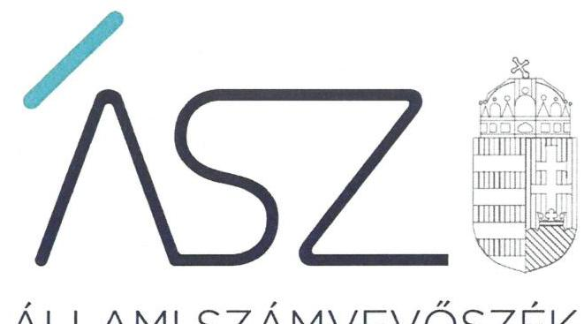
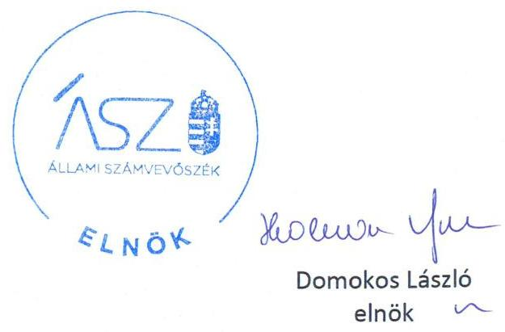

ÁLLAMI SZÁMVEVŐSZÉK

# JELENTÉS 

## Nem állami humánszolgáltatók ellenőrzése

A köznevelési humánszolgáltatást nyújtó intézmények államháztartáson kívüli fenntartói központi költségvetésből kapott támogatásai felhasználásának ellenőrzése - NYÍRSÉG-HÍD

Oktatási Centrum Közhasznú Nonprofit Korlátolt Felelősségű Társaság

2020. 

20156
www.asz.hu

---

ÁLLAMI SZÁMVEVŐSZÉK

# JELENTÉS

## Nem állami humánszolgáltatók ellenőrzése

A köznevelési humánszolgáltatást nyújtó intézmények államháztartáson kívüli fenntartói központi költségvetésből kapott támogatásai felhasználásának ellenőrzése – NYÍRSÉG-HÍD Oktatási Centrum Közhasznú Nonprofit Korlátolt Felelősségű Társaság

2020. 07. hó 31. nap

2015. 06. www.asz.hu

---

# AZ ELLENŐRZÉST FELÜGYELTE: 

MAROZSÁN LÁSZLÓNÉ felügyeleti vezető

## AZ ELLENŐRZÉST VEZETTE ÉS A VÉGREHAJTÁSÁÉRT FELELŐS:

DR. SIMON JÓZSEF ellenőrzésvezető

A PROGRAM ÖSSZEÁLLÍTÁSÁÉRT FELELŐS:
FEKETE-NAGY ANDRÁS GÁBOR projektvezető

IKTATÓSZÁM: EL-2817-001/2020
TÉMASZÁM: 2523
ELLENŐRZÉS-AZONOSÍTÓ SZÁM: V086719

Jelentéseink az Országgyúlés számítógépes hálózatán és az interneten a www.asz.hu címen is olvashatóak.

---

# TARTALOMJEGYZÉK 

■ ÖSSZEGZÉS ..... 5
■ AZ ELLENŐRZÉS CÉLJA ..... 6
■ AZ ELLENŐRZÉS TERÜLETE ..... 7
■ AZ ELLENŐRZÉS HÁTTERE, INDOKOLTSÁGA ..... 8
■ AZ ELLENŐRZÉS LÉNYEGES KÉRDÉSKÖREI. ..... 9
■ AZ ELLENŐRZÉS HATÓKÖRE ÉS MÓDSZEREI ..... 10
■ MELLÉKLETEK ..... 13
I. sz. melléklet: Értelmező szótár ..... 13
■ FÜGGELÉK: ÉSZREVÉTELEK ..... 15
■ RÖVIDÍTÉSEK JEGYZÉKE ..... 17

---

.

---

# ÖSSZEGZÉS 

A mezőladányi székhelyű NYÍRSÉG-HÍD Oktatási Centrum Közhasznú Nonprofit Korlátolt Felelősségű Társaság a 2016-2018. években nem biztositotta a köznevelési humánszolgáltatási feladatok ellátására kapott költségvetési támogatások felhasználásának ellenőrizhetőségét.

## Az ellenőrzés társadalmi indokoltsága

A köznevelési feladatok ellátása az Alaptörvényben meghatározott, a társadalom szempontjából fontos tevékenység. Jogszabályok teszik lehetővé, hogy államháztartáson kívüli szervezetek - így például az egyházi fenntartók, alapítványok, gazdasági társaságok, egyesületek - által fenntartott intézmények is végezzenek köznevelési feladatokat. Mindehhez a központi költségvetés évente jelentős összegű támogatással járul hozzá. Az államháztartáson kívüli, humánszolgáltatást végző intézmények az igényelt közpénzekből társadalmilag hasznos, közösségteremtő, közérdekú, illetve közhasznú tevékenységet végeznek, illetve közfeladatokat látnak el.

Az intézményfenntartók ellenőrzésével az Állami Számvevőszék hozzájárul ahhoz, hogy ezen közpénzeket az államháztartáson kívüli szervezetek is ellenőrizhető, átlátható és elszámoltatható módon használják fel a közfeladatok ellátása során. Az ellenőrzések célja továbbá, hogy a nyilvánosság és az igénybevevők megfelelő tájékoztatást kapjanak az államháztartáson kívüli közfeladatot ellátók múködéséről.

Az Állami Számvevőszék ellenőrzései arra adnak választ, hogy az intézményfenntartók arra használták-e fel a közpénzeket, amire igényelték.

A szabályszerű gazdálkodás elengedhetetlen a közfeladat ellátás szakmai céljainak megvalósításához, valamint a társadalmi közbizalom fenntartásához.

## Megállapítások, következtetések

A mezőladányi székhelyű NYÍRSÉG-HÍD Oktatási Centrum Közhasznú Nonprofit Korlátolt Felelősségű Társaság a 20162018. években egy önálló jogi személyiséggel rendelkező köznevelési intézményt ${ }^{1}$ tartott fenn. Az intézmény több köznevelési alapfeladatot látott el. Ezek közül három alapfeladatra tekintettel a Fenntartó2 költségvetési támogatásban részesült.

A költségvetési támogatások felhasználásáról a Fenntartó a nyilvántartást költségnemenkénti bontásban vezette. A költségvetési támogatások felhasználását a jogszabályi előírások ellenére alapfeladatonként elkülönítetten nem tartotta nyilván. Ez alapján a Fenntartó a 2016-2018. években a köznevelési közfeladat ellátására kapott költségvetési támogatás felhasználásának a Számv. tv. ${ }^{3}$ 161/A. § (2) bekezdésében előírt ellenőrizhetőségét nem biztosította. Mivel az Nkt. vhr. ${ }^{4}$ 37/G. § (1) bekezdésében foglalt szabályozás ellenére nem gondoskodott arról, hogy a költségvetési támogatások felhasználásának alapfeladatonkénti bontásban történő elkülönített és naprakész nyilvántartásához az adatok rendelkezésre álljanak. Ezáltal a Fenntartó nem igazolta a közpénz cél szerinti felhasználását.

A Fenntartó mindezek alapján az Alaptörvény ${ }^{5}$ 39. cikk (2) bekezdésében foglaltak ellenére nem biztosította a felhasznált közpénzekre vonatkozó gazdálkodása átláthatóságát.

---

# AZ ELLENŐRZÉS CÉLJA

**AZ ELLENŐRZÉS CÉLJA** annak értékelése volt, hogy a nem állami, nem önkormányzati köznevelési intézmények fenntartói központi költségvetésből kapott támogatásainak felhasználása szabályszerű volt-e.

---

# **AZ ELLENŐRZÉS TERÜLETE**

## **NYÍRSÉG-HÍD Oktatási Centrum Közhasznú Nonprofit Korlátolt Felelősségű Társaság**

A Szabolcs-Szatmár-Bereg megyei mezőladányi székhelyű Fenntartó 2009. március 2-i hatállyal jött létre átalakulással. Jogelőde a 2006. október 31-én alapított NYÍRSÉG-HÍD Oktatási Centrum Közhasznú Társaság volt.

A Fenntartó legfőbb szerve a taggyűlés, amely három tagból állt. A Fenntartónak két, önálló képviseleti joggal rendelkező ügyvezetője volt.

A Fenntartó a köznevelési feladatai ellátására egy önálló jogi személyiséggel rendelkező intézményt működtetett az ellenőrzött időszakban, amelyhez összesen 10 telephely tartozott Szabolcs-Szatmár-Bereg megyében.

A Fenntartó által működtetett intézmény az ellenőrzött időszakban hat Nkt.6 szerinti alapfeladatot, valamint egyéb oktatási feladatokat látott el. Az Nkt. szerinti alapfeladatok közül a gimnáziumi, a szakgimnáziumi és a szakközépiskolai (2016. augusztus 31-ig a szakiskolai) nevelési-oktatási alapfeladatok vonatkozásában részesült költségvetési támogatásban a Fenntartó.

A Fenntartó a köznevelési feladatellátáshoz a MÁK7 adatai alapján a 2016. évben 135,7 M Ft, a 2017. évben 148,3 M Ft, a 2018. évben 134,7 M Ft költségvetési támogatásban részesült.

---

# AZ ELLENŐRZÉS HÁTTERE, INDOKOLTSÁGA 

A köznevelési feladatokat ellátó nem állami intézményfenntartók részére közfeladataik ellátására évente jelentős összegű pénzügyi támogatást biztosítottak a mindenkori költségvetési törvények (Kvtv.-ek ${ }^{8}$ ) a bennük megfogalmazott feltételek mellett. A felhasználható állami támogatások Kvtv.ek szerinti előirányzata 2016-2018. években együttesen 574,0 Mrd Ft volt.

Az ÁSZ ${ }^{9}$ stratégiájában foglaltak alapján is indokolt az ellenőrzés lefolytatása, amely a társadalom számára jelzi, hogy a közpénz államháztartáson kívüli felhasználása sem maradhat ellenőrizetlenül. Az államháztartáson kívülre nyújtott költségvetési támogatások ellenőrzésével az ÁSZ hozzájárul ahhoz, hogy a közpénzeket a nem állami humán fenntartók átlátható módon használják fel a közfeladatok ellátására kötött szerződésekben vállalt kötelezettségek teljesítése érdekében. Az ellenőrzés javaslataival hozzájárulhat az említett rendszerek szabályszerű támogatás felhasználásához, javíthatja a társadalmi-gazdasági döntések megalapozottságát, amely a „jól irányított állam müködésének" feltétele.

A holisztikus megközelítés jegyében az ÁSZ az ellenőrzés keretében egyedi kockázatelemzés alapján kiválasztott fenntartóknál értékelte az államháztartáson kívüli köznevelési tevékenységhez kapcsolódó támogatások felhasználásának megfelelőségét.

---

# AZ ELLENŐRZÉS LÉNYEGES KÉRDÉSKÖREI 

1. A köznevelési közfeladatot ellátó államháztartáson kívüli fenntartó szabályszerű müködési - és gazdálkodási környezet kialakításával megteremtette-e a költségvetési támogatások átlátható, elszámoltatható igénybevételének, felhasználásának feltételeit?
2. Az államháztartáson kívüli fenntartó az átvállalt köznevelési közfeladathoz biztositott költségvetési támogatásokat szabályszerűen fordította-e a humánszolgáltató intézménye müködtetésére?
3. Az államháztartáson kívüli fenntartó a köznevelési intézménye müködtetéséhez felhasznált közpénzekre vonatkozó gazdálkodásával a nyilvánosság előtt elszámolt-e, ennek érdekében ellenőrzési, értékelési és a külső ellenőrzésekkel kapcsolatos intézkedési feladatait szabályszerűen látta-e el?

---

# AZ ELLENŐRZÉS HATÓKÖRE ÉS MÓDSZEREI 

## Az ellenőrzés típusa

Megfelelőségi ellenőrzés

## Az ellenőrzött időszak

A 2016. január 1-je és 2018. december 31-e közötti időszak.

## Az ellenőrzés tárgya

Az ellenőrzés a köznevelési humánszolgáltatási közfeladatokat ellátó államháztartáson kívüli fenntartók humánszolgáltatási közfeladatai ellátásához a központi költségvetésből kapott támogatásaik humánszolgáltatási közfeladatokra való fenntartó általi felhasználása szabályszerűségének értékelésére terjedt ki.

## Az ellenőrzött szervezet

NYÍRSÉG-HÍD Oktatási Centrum Közhasznú Nonprofit Korlátolt Felelősségű Társaság

## Az ellenőrzés jogalapja

Az ellenőrzés jogszabályi alapját az ÁSZ tv. ${ }^{10}$ 1. § (3) bekezdése, valamint az 5. § (3) bekezdésében foglalt előírások jelentették.

## Az ellenőrzés módszerei

Az ellenőrzést az ellenőrzési program annak szempontjai, kérdései, az ellenőrzött időszakban hatályos jogszabályok, a nemzetközi standardokat irányadónak tekintve, az ellenőrzés szakmai szabályok és módszertanok figyelembevételével rendelte elvégezni. A közpénzekkel való felelős gazdálkodás segítésére irányuló javaslatok kidolgozásakor a hatályos jogszabályok voltak irányadóak.

Az ellenőrzés ideje alatt az ellenőrzött szervezettel történő kapcsolattartást az ÁSZ SZMSZ ${ }^{11}$-ének vonatkozó előírásai alapján biztosította az ÁSZ.

---

Az ellenőrzési kérdések megválaszolásához szükséges bizonyítékok megszerzése az ellenőrzött által rendelkezésre bocsátott dokumentumokra, adatokra alapozva megfigyelés, kérdésfeltevés (információkérés), valamint elemző eljárással történt.

Az ellenőrzési bizonyítékként felhasználható adatforrások közé tartoztak egyrészt a szakmai program részletes szempontjainál felsorolt adatforrások, másrészt minden - az ellenőrzés folyamán feltárt, az ellenőrzés szempontjából információt tartalmazó - dokumentum.

Az ellenőrzés lefolytatásához az ellenőrzött szervezet a kitöltött tanúsítványok, valamint az ÁSZ által kért dokumentumok elektronikus úton való megküldésével szolgáltatott adatokat, információkat. Az így rendelkezésre bocsátott adatok, információk és a tanúsítványok adatai valódiságának kontrollja az ellenőrzés keretében történt.

Az egységes értelmezést az ellenőrzési program mellékletét képező fogalomtár és rövidítésjegyzék támogatta.

Az ellenőrzést alapvetően a köznevelési humánszolgáltatások esetében a központi költségvetési támogatások igénylésével, módosításával, felhasználásával, elszámolásával kapcsolatos feladatokat ellátó államháztartáson kívüli fenntartónál végezte az ÁSZ.

A köznevelési humánszolgáltatások központi költségvetési támogatásaival kapcsolatos, államháztartáson kívüli fenntartó jogszabályokban előírt feladatai betartását, továbbá a központi költségvetési támogatások szabályszerű nyilvántartását ellenőrizte az ÁSZ a Fenntartónál rendelkezésre álló nyilvántartások, beszámolók és egyéb dokumentumok alapján. Az ellenőrzés nem terjedt ki a köznevelési humánszolgáltatások központi költségvetési támogatásai igénylése, módosítása, elszámolása valódiságának, megalapozottságának, helyességének - sem a fenntartónál, sem a székhely intézményénél való - értékelésére (mivel ennek felülvizsgálata, ellenőrzése a finanszírozó jogszabályban előírt feladata, határozatai kiadása előtt). Továbbá nem terjedt ki az ellenőrzés e források intézmények általi szabályszerű felhasználásának értékelésére.

---

.

---

# MELLÉKLETEK 

## I. SZ. MELLÉKLET: ÉRTELMEZŐ SZÓTÁR

humánszolgáltatás
kültségvetési támogatás
köznevelési közfeladat
köznevelési intézmény

Külön törvényben meghatározott szociális, gyermekjóléti, gyermekvédelmi, közoktatási, felsőoktatási, kulturális közfeladatok (2015. évi Kvtv. 43. § (1), (4) bekezdés, 1. számú melléklet XX/20/2/3. jogcím csoport, 19. alcím, 2016. évi Kvtv. 41. § (1), (4) bekezdés, 1. számú melléklet XX/20/2/3. jogcím csoport, 19. alcím, 2017. évi Kvtv. 41. § (1), (4) bekezdés, 1. számú melléklet XX/20/2/3. jogcím csoport, 19. alcím)
a társadalombiztosítás pénzügyi alapjai kivételével az államháztartás központi alrendszeréből ellenérték nélkül, pénzben nyújtott támogatások.
Ezek közé tartozik többek között:
Átlagbéralapú támogatást állapít meg a központi költségvetés a nevelési-oktatási, valamint pedagógiai szakszolgálati intézményt fenntartó nemzetiségi önkormányzat, az egyházi és magán köznevelési intézmény fenntartója részére az általuk fenntartott nevelési-oktatási intézményben, továbbá pedagógiai szakszolgálati intézményben pedagógus és - a (3) bekezdés kivételével - a nevelő-oktató munkát közvetlenül segítő munkakörben foglalkoztatottak után a 7. melléklet I. fejezet 1. pontjában meghatározott jogosultak után, az őket megillető mértékek szerint.
Átlagbéralapú kiegészítő támogatást állapít meg az iskolában, a kollégiumban, a gyógypedagógiai, a konduktív pedagógiai nevelési-oktatási, valamint a pedagógiai szakszolgálati intézményben az Nkt. által meghatározott előmeneteli rendszer keretén belül lebonyolított minősítési eljárás során az adott évben január 1-jei hatálylyal pedagógus II., mesterpedagógus vagy kutatótanár fokozatú besorolással rendelkező pedagógusok, valamint a pedagógus II. fokozatba átsorolt pedagógus, és pedagógus szakképzettséggel rendelkező nevelő és oktató munkát közvetlenül segítők esetén a 7. melléklet I. fejezet 4. pontjában meghatározott, az őket megillető mértékek szerint.
Tankönyvtámogatást állapít meg a köznevelési intézményt fenntartó nemzetiségi önkormányzat, továbbá az egyházi és magán köznevelési intézmény fenntartója részére a 7. melléklet III. fejezet 1. pontja szerint.
A köznevelési intézmény alapító okiratában foglalt feladat: óvodai nevelés, nemzetiséghez tartozók óvodai nevelése, általános iskolai nevelés-oktatás, nemzetiséghez tartozók általános iskolai nevelése-oktatása, kollégiumi ellátás, nemzetiségi kollégiumi ellátás, gimnáziumi nevelés-oktatás, szakközépiskolai nevelés-oktatás, szakiskolai nevelés-oktatás, nemzetiség gimnáziumi nevelés-oktatása, nemzetiség szakközépiskolai nevelés-oktatása, nemzetiség szakiskolai nevelés-oktatása, Köznevelési HÍD programok keretében folyó nevelés-oktatás, felnőttoktatás, alapfokú művészetoktatás, fejlesztő nevelés, fejlesztő nevelés-oktatás, pedagógiai szakszolgálati feladat, a többi gyermekkel, tanulóval együtt nevelhető, oktatható sajátos nevelési igényű gyermekek, tanulók óvodai nevelése és iskolai nevelése-oktatása, azoknak a sajátos nevelési igényű gyermekeknek, tanulóknak az óvodai, iskolai, kollégiumi ellátása, akik a többi gyermekkel, tanulóval nem foglalkoztathatók együtt, a gyermekgyógyüdülőkben, egészségügyi intézményekben, rehabilitációs intézményekben tartós gyógykezelés alatt álló gyermekek tankötelezettségének teljesítéséhez szükséges oktatás, pedagógiai-szakmai szolgáltatás. (Nkt. 4. § 1. pontja szerint)
A nevelési-oktatási intézmény, pedagógiai szakszolgálati intézmény, pedagógiaiszakmai szolgáltatást nyújtó intézmény. (Nkt. 7. § (1) bekezdés szerint)

---

nem állami, nem önkormányzati (államháztartáson kívüli) intézmény fenntartó

A köznevelési közfeladatokat/humánszolgáltatásokat ellátó intézményt fenntartó egyházi jogi személy, társadalmi szervezet, alapítvány, közalapítvány, civil szervezet, országos nemzetiségi önkormányzat, nonprofit gazdasági társaság, gazdasági társaság és a humánszolgáltatást alaptevékenységként végző, Szja tv. ${ }^{12}$ hatálya alá tartozó egyéni vállalkozó.
(2015. évi Kvtv. 43. § (1) bekezdés, 2016. évi Kvtv. 41. § (1), bekezdés, 2017. évi Kvtv. 41. § (1) bekezdés)

---

# FÜGGELÉK: ÉSZREVÉTELEK 

A jelentéstervezetet a Számvevőszék 15 napos észrevételezésre megküldte az ellenőrzött szervezet vezetőinek az ÁSZ tv. 29. §* (1) bekezdése előírásának megfelelően.

A NYÍRSÉG-HÍD Oktatási Centrum Közhasznú Nonprofit Korlátolt Felelősségű Társaság ügyvezetője a jelentéstervezet megállapításaira írásban észrevételt tett.
Az ÁSZ tv. 29. § (3) bekezdésével összhangban az ÁSZ a Függelékben feltünteti az ellenőrzés megállapításaival kapcsolatban tett, figyelembe nem vett észrevételeket, és megindokolja, hogy azokat miért nem fogadta el.

[^0]
[^0]:    * 29. § (1) Az Állami Számvevőszék az ellenőrzési megállapításait megküldi az ellenőrzött szervezet vezetőjének vagy az általa megbízott személynek, és annak, akinek személyes felelősségét állapította meg.
    (2) Az ellenőrzött szervezet vezetője és a felelősként megjelölt személy az ellenőrzés megállapításaira tizenöt napon belül írásban észrevételt tehet.
    (3) Az Állami Számvevőszék az észrevételre a beérkezésétől számított harminc napon belül írásban válaszol. A figyelembe nem vett észrevételeket köteles a jelentésben feltüntetni, és megindokolni, hogy azokat miért nem fogadta el.

---

A NYÍRSÉG-HÍD Oktatási Centrum Közhasznú Nonprofit Korlátolt Felelősségü Társaság ügyvezetőjének az ellenőrzés megállapításaival kapcsolatban írásban tett, figyelembe nem vett észrevétele és annak indokolása:
A Fenntartó ügyvezetőjének észrevétele szerint a fökönyvi nyilvántartásaikból megállapítható, hogy a három alapfeladatra kapott költségvetési támogatás a fenntartott intézmény részére az alapfeladatok ellátása érdekében átadásra és ezen finanszírozás érdekében felhasználásra került és az erre vonatkozó elkülönített nyilvántartást 2020. január 7-én megküldték. Az ügyvezető továbbá tájékoztatást nyújtott arról, hogy 2019. évre vonatkozóan a nyilvántartásukban az alapfeladatra kapott támogatást és annak felhasználását egymástól elkülönítették (alapfeladatonként külön-külön).
Az Állami Számvevőszék (továbbiakban: ÁSZ) az EL-2145-001/2019., az EL-2145005/2019., EL-2145-017/2019. iktatószámú adatbekérő levelekben kérte az ÁSZ ellenőrzéséhez rendelkezésre bocsátani az azokban felsorolt dokumentumokat, közöttük a köznevelési közfeladat ellátására kapott támogatás felhasználásának a 2016-2018. évekre vonatkozó elkülönített nyilvántartását alátámasztó dokumentumokat.
A Fenntartó ügyvezetőjének észrevétele alapján felülvizsgálatra kerültek a Fenntartó által az ÁSZ fenti három adatbekérésére megküldött kapcsolódó dokumentumok (észrevételében megjelölt 2020. januárban megküldött dokumentumok is). A felülvizsgálat során az ÁSZ megállapította, hogy az adatszolgáltatás során beküldött 2016-2018. évekre vonatkozó fökönyvi kivonatok, fökönyvi kartonok és kimutatások tartalmazták a Fenntartó által kapott költségvetési támogatások és azok továbbadásának nyilvántartását, a felhasznált támogatás költségnemenkénti megbontását, azonban a Fenntartó által kapott támogatások felhasználásának alapfeladatonkénti elkülönített nyilvántartását nem igazolták. Ezáltal a Fenntartó a nemzeti köznevelésről szóló törvény végrehajtásáról szóló 229/2012. (VIII.28.) Korm. rendelet (továbbiakban: Nkt.vhr.) 37/G. § (1) bekezdésében elöirtak ellenére az általa kapott költségvetési támogatás felhasználásáról az ellenőrzött időszakban nem vezetett alapfeladatonkénti nyilvántartást.
Válaszlevelében az ÁSZ tájékoztatta az ügyvezetőt arról, hogy az ÁSZ az ellenőrzési megállapításait az ÁSZ tv. 28. § (2) bekezdésben meghatározott adatszolgáltatási időszakon belül megküldött, teljességi és hitelességi nyilatkozattal alátámasztott dokumentumokra alapozva teszi. A Fenntartó önálló cégképviseletre jogosult ügyvezetője 2019. november 05én, 2019. december 09-én, 2019. december 18-án és 2020. január 13-án kelt teljességi és hitelességi nyilatkozataiban az ÁSZ részére átadott dokumentumok, adatok teljes körüségéért felelősséget vállalt.
Az ÁSZ által a jelentéstervezetben tett megállapítás tényszerűségét az ügyvezető észrevételében leírtak is megerősítették, miszerint tájékoztatott arról, hogy - az ellenőrzött időszakot követően - a 2019. évre vonatkozóan a nyilvántartásukban az alapfeladatra kapott támogatást és annak felhasználását egymástól is elkülönítették (alapfeladatonként különkülön).
A fentiekre tekintettel az észrevételt az ÁSZ nem fogadta el, a jelentéstervezet megállapítása helytálló, módosítása nem volt indokolt.

---

# RÖVIDÍTÉSEK JEGYZÉKE 

${ }^{1}$ Intézmény
${ }^{2}$ Fenntartó
${ }^{3}$ Számv. tv.
${ }^{4}$ Nkt. vhr.
${ }^{5}$ Alaptörvény
${ }^{6}$ Nkt.
${ }^{7}$ MÁK
${ }^{8}$ 2016. évi Kvtv.
2017. évi Kvtv.
2018. évi Kvtv.
${ }^{9}$ ÁSZ
${ }^{10}$ ÁSZ tv.
${ }^{11}$ ÁSZ SZMSZ
${ }^{12}$ Szja tv.

Apáczai Csere János Általános Iskola, Gimnázium és Szakképző Iskola (székhely: Kisvárda)
NYÍRSÉG-HÍD Oktatási Centrum Közhasznú Nonprofit Korlátolt Felelősségű Társaság
2000. évi C. törvény a számvitelről (hatályos: 2001. január 1-jétől)

229/2012. (VIII. 28.) Korm. rendelet a nemzeti köznevelésről szóló törvény végrehajtásáról (hatályos: 2012. szeptember 1-jétől)
Magyarország Alaptörvénye (hatályos: 2012. január 1-jétől)
2011. évi CXC. törvény a nemzeti köznevelésről
(hatályos: 2012. szeptember 1-jétől)
Magyar Államkincstár
2015. évi C. törvény - Magyarország 2016. évi központi költségvetéséről (hatályos: 2015. július 4-től)
2016. évi CX. törvény - Magyarország 2017. évi központi költségvetéséről (hatályos: 2016. november 1-jétől)
2017. évi C. törvény - Magyarország 2018. évi központi költségvetéséről (hatályos: 2017. november 1-jétől)
Állami Számvevőszék
2011. évi LXVI. törvény az Állami Számvevőszékről (hatályos: 2011. július 1-jétől)

Állami Számvevőszék Szervezeti és Müködési Szabályzata
1995. évi CXVII. törvény a személyi jövedelemadóról
(hatályos: 1996. január 1-jétől)

---

# ASZ 

ALLAMI SZAMVEVOSZEK
1052 Budapest, Apáczai Cs. J. u. 10. I 1364 Budapest 4. Pf. 54 TEL: +36 14849100
email: szamvevoszek@asz.hu
web: www.asz.hu | www.aszhirportal.hu