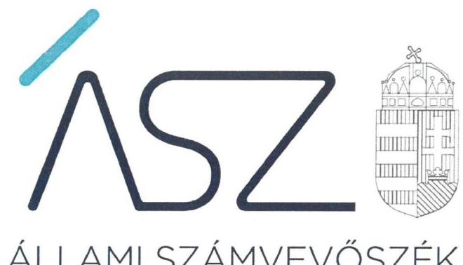

ÁLLAMI SZÁMVEVŐSZÉK

# JELENTÉS 

## Nem állami humánszolgáltatók ellenőrzése

A köznevelési humánszolgáltatást nyújtó intézmények államháztartáson kívüli fenntartói központi költségvetésből kapott támogatásai felhasználásának ellenőrzése MIOK Észak-kelet-magyarországi Régió Közhasznú Nonprofit Korlátolt Felelősségű Társaság
2020.

20157
www.asz.hu

---

ÁLLAMI SZÁMVEVŐSZÉK

# JELENTÉS 

## Nem állami humánszolgáltatók ellenőrzése

A köznevelési humánszolgáltatást nyújtó intézmények államháztartáson kívüli fenntartói központi költségvetésből kapott támogatásai felhasználásának ellenőrzése MIOK Észak-kelet-magyarországi Régió Közhasznú Nonprofit Korlátolt Felelősségű Társaság
2020. 08. hó 27. nap

20157
www.asz.hu

---

# AZ ELLENŐRZÉST FELÜGYELTE: 

MAROZSÁN LÁSZLÓNÉ felügyeleti vezető

## AZ ELLENŐRZÉST VEZETTE ÉS A VÉGREHAJTÁSÁÉRT FELELŐS:

GÁL MAGDOLNA ellenőrzésvezető

## A PROGRAM ÖSSZEÁLLÍTÁSÁÉRT FELELŐS:

FEKETE-NAGY ANDRÁS GÁBOR felelős vezető

## IKTATÓSZÁM: EL-2820-001/2020

TÉMASZÁM: 2523

## ELLENŐRZÉS-AZONOSÍTÓ SZÁM: V086710

Jelentéseink az Országgyúlés számítógépes hálózatán és az interneten a www.asz.hu címen is olvashatóak.

---

# TARTALOMJEGYZÉK 

■ ÖSSZEGZÉS ..... 5
■ AZ ELLENŐRZÉS CÉLJA ..... 6
■ AZ ELLENŐRZÉS TERÜLETE ..... 7
■ AZ ELLENŐRZÉS HÁTTERE, INDOKOLTSÁGA ..... 8
■ AZ ELLENŐRZÉS LÉNYEGES KÉRDÉSKÖREI ..... 9
■ AZ ELLENŐRZÉS HATÓKÖRE ÉS MÓDSZEREI ..... 10
■ MELLÉKLETEK ..... 13
I. sz. melléklet: Értelmező szótár ..... 13
■ FÜGGELÉK: ÉSZREVÉTELEK ..... 15
■ RÖVIDÍTÉSEK JEGYZÉKE ..... 17

---

.

---

# ÖSSZEGZÉS 

A miskolci székhelyű MIOK Észak-kelet-magyarországi Régió Közhasznú Nonprofit Korlátolt Felelősségű Társaság a 2016-2018. években nem biztosította a köznevelési közfeladat ellátására kapott költségvetési támogatások felhasználásának ellenőrizhetőségét.

## Az ellenőrzés társadalmi indokoltsága

A köznevelési feladatok ellátása az Alaptörvényben meghatározott, a társadalom szempontjából fontos tevékenység. Jogszabályok teszik lehetővé, hogy államháztartáson kívüli szervezetek - így például az egyházi fenntartók, alapítványok, gazdasági társaságok, egyesületek - által fenntartott intézmények is végezzenek köznevelési feladatokat. Mindehhez a központi költségvetés évente jelentős összegű támogatással járul hozzá. Az államháztartáson kívüli, humánszolgáltatást végző intézmények az igényelt közpénzekből társadalmilag hasznos, közösségteremtő, közérdekű, illetve közhasznú tevékenységet végeznek, illetve közfeladatokat látnak el.

Az intézményfenntartók ellenőrzésével az Állami Számvevőszék hozzájárul ahhoz, hogy ezen közpénzeket az államháztartáson kívüli szervezetek is ellenőrizhető, átlátható és elszámoltatható módon használják fel a közfeladatok ellátása során. Az ellenőrzések célja továbbá, hogy a nyilvánosság és az igénybevevők megfelelő tájékoztatást kapjanak az államháztartáson kívüli közfeladatot ellátók működéséről.

Az ÁSZ ellenőrzései arra adnak választ, hogy az intézményfenntartók arra használták-e fel a közpénzeket, amire igényelték.

A szabályszerű gazdálkodás elengedhetetlen a közfeladat ellátás szakmai céljainak megvalósításához, valamint a társadalmi közbizalom fenntartásához.

## Megállapítások, következtetések

A MIOK Észak-kelet-magyarországi Régió Közhasznú Nonprofit Korlátolt Felelősségű Társaság, mint Fenntartó ${ }^{1}$ köznevelési közfeladatait két általa fenntartott intézményén² keresztül látta el, a 2016-2018. években öt nevelési-oktatási alapfeladat ellátására részesült költségvetési támogatásban. A Fenntartó az ellenőrzött időszakban nem vezetett nyilvántartást a költségvetési támogatás felhasználásáról alapfeladatok szerinti bontásban.

A Fenntartó a 2016-2018. években a köznevelési humánszolgáltatási közfeladat ellátására kapott költségvetési támogatás felhasználásának a Számv. tv. ${ }^{3}$ 161/A § (2) bekezdésében előírt ellenőrizhetőségét nem biztosította. Mivel az Nkt. vhr. ${ }^{4}$ 37/G. § (1) bekezdésében foglalt szabályozás ellenére nem gondoskodott arról, hogy a költségvetési támogatások felhasználásának alapfeladatonkénti elkülönített elszámolására az adatok rendelkezésre álljanak.

A Fenntartó mindezek alapján az Alaptörvény ${ }^{5}$ 39. cikk (2) bekezdésében foglaltak ellenére nem biztosította a felhasznált közpénzekre vonatkozó gazdálkodása átláthatóságát.

Ezáltal a Fenntartó nem igazolta a közpénz cél szerinti felhasználását.

---

# AZ ELLENŐRZÉS CÉLJA

**AZ ELLENŐRZÉS CÉLJA** annak értékelése volt, hogy a nem állami, nem önkormányzati köznevelési intézmények fenntartói központi költségvetésből kapott támogatásainak felhasználása szabályszerű volt-e.

---

# **AZ ELLENŐRZÉS TERÜLETE**

## **MIOK Észak-kelet-magyarországi Régió Közhasznú Nonprofit Korlátolt Felelősségű Társaság**

A miskolci székhelyű MIOK Észak-kelet-magyarországi Régió Közhasznú Nonprofit Korlátolt Felelősségű Társaságot 2008. április 29-én jegyezték be. Vezetését az ügyvezető látja el, legfőbb szerve a taggyűlés. A Fenntartó közhasznú jogállású szervezet.

A Fenntartó fő tevékenységei közé tartozik a köznevelés, a gyakorlati képzés, a szakképzés szervezése, továbbá a közoktatási intézmények fenntartása. A Fenntartó a köznevelési tevékenységét az ellenőrzött időszakban a Miskolcon működő MIOK József Nádor Gimnázium és Szakképző Iskolán, és 2017. augusztus 31-től a Pécsi József Nádor Gimnázium és Szakképző Iskolán keresztül látta el.

A Fenntartó intézményei működtetésével az ellenőrzött időszakban gimnáziumi-, szakgimnáziumi-, szakközépiskolai-, 2016-ig szakiskolai nevelési-oktatási közfeladatokat látott el, 2017. évtől gyógypedagógiai, konduktív pedagógiai nevelési-oktatási intézményi ellátást is nyújtott.

A Fenntartó köznevelési közfeladatai ellátására Magyarország éves költségvetéséből a Magyar Államkincstár adatai alapján 2016. évben 159,8 millió Ft, 2017. évben 174,8 millió Ft, 2018. évben 201,3 millió Ft összegű támogatást kapott.

---

# AZ ELLENŐRZÉS HÁTTERE, INDOKOLTSÁGA 

A köznevelési feladatokat ellátó nem állami intézményfenntartók részére közfeladataik ellátására évente jelentős összegű pénzügyi támogatást biztosítottak a mindenkori költségvetési törvények a bennük megfogalmazott feltételek mellett. A felhasználható állami támogatások Kvtv.-ek ${ }^{6}$ szerinti előirányzata 2016. - 2018. években együtt 574 Mrd Ft volt. Az ellenőrzések indokoltságát az is alátámasztja, hogy az ÁSZ ${ }^{7}$ számos szervezetet még nem ellenőrzött ezen a területen.

Az ÁSZ stratégiájában foglaltak alapján is indokolt az ellenőrzés, amely a társadalom számára jelzi, hogy a közpénz államháztartáson kívüli felhasználása sem maradhat ellenőrizetlenül. Az államháztartáson kívülre nyújtott költségvetési támogatások ellenőrzésével az ÁSZ hozzájárul ahhoz, hogy a közpénzeket a nem állami humán fenntartók átlátható módon használják fel a közfeladatok ellátására kötött szerződésekben vállalt kötelezettségek teljesítése érdekében. Az ellenőrzés javaslataival hozzájárulhat az említett rendszerek szabályszerű támogatás felhasználásához, javíthatja a társadalmi-gazdasági döntések megalapozottságát, amely a „jól irányított állam működésének" feltétele.

A holisztikus megközelítés jegyében az ellenőrzés keretében egyedi kockázatelemzés alapján kiválasztott fenntartóknál értékeljük az államháztartáson kívüli köznevelési tevékenységhez kapcsolódó támogatások felhasználásának megfelelőségét.

---

# AZ ELLENŐRZÉS LÉNYEGES KÉRDÉSKÖREI 

1. A köznevelési közfeladatot ellátó államháztartáson kívüli fenntartó szabályszerű működési - és gazdálkodási környezet kialakításával megteremtette-e a költségvetési támogatások átlátható, elszámoltatható igénybevételének, felhasználásának feltételeit?
2. Az államháztartáson kívüli fenntartó az átvállalt köznevelési közfeladathoz biztosított költségvetési támogatásokat szabályszerűen fordította-e a humánszolgáltató intézményei működtetésére?
3. Az államháztartáson kívüli fenntartó a köznevelési intézményei működtetéséhez felhasznált közpénzekre vonatkozó gazdálkodásával a nyilvánosság előtt elszámolt-e, ennek érdekében ellenőrzési, értékelési és a külső ellenőrzésekkel kapcsolatos intézkedési feladatait szabályszerűen látta-e el?

---

# AZ ELLENŐRZÉS HATÓKÖRE ÉS MÓDSZEREI 

## Az ellenőrzés típusa

Megfelelőségi ellenőrzés.

## Az ellenőrzött időszak

A 2016. január 1-je és 2018. december 31-e közötti időszak.

## Az ellenőrzés tárgya

Az ellenőrzés a köznevelési humánszolgáltatási közfeladatokat ellátó államháztartáson kívüli fenntartók humánszolgáltatási közfeladatai ellátásához a központi költségvetésből kapott támogatásaik humánszolgáltatási közfeladatokra való fenntartó általi felhasználása szabályszerűségének értékelésére terjedt ki.

## Az ellenőrzött szervezet

MIOK Észak-kelet-magyarországi Régió Közhasznú Nonprofit Korlátolt Felelősségű Társaság

## Az ellenőrzés jogalapja

Az ellenőrzés jogszabályi alapját az ÁSZ tv. ${ }^{8}$ 1. § (3) bekezdése, és 5. § (3) bekezdésében foglalt előírások adják.

## Az ellenőrzés módszerei

Az ellenőrzést az ellenőrzési program annak szempontjai, kérdései, az ellenőrzött időszakban hatályos jogszabályok, a nemzetközi standardokat irányadónak tekintve, az ellenőrzés szakmai szabályok és módszertanok figyelembe vételével rendelte elvégezni. A közpénzekkel való felelős gazdálkodás segítésére irányuló javaslatok kidolgozásakor a hatályos jogszabályok voltak irányadóak.

Az ellenőrzés ideje alatt az ellenőrzött szervezettel történő kapcsolattartást az ÁSZ SZMSZ ${ }^{9}$ -ének vonatkozó előírásai alapján biztosította az ÁSZ.

---

Az ellenőrzési kérdések megválaszolásához szükséges bizonyítékok megszerzése az ellenőrzött által rendelkezésre bocsátott dokumentumokra, adatokra alapozva megfigyelés, kérdésfeltevés (információkérés), valamint elemző eljárással történt.

Az ellenőrzési bizonyítékként felhasználható adatforrások közé tartoztak egyrészt a szakmai program részletes szempontjainál felsorolt adatforrások, másrészt minden - az ellenőrzés folyamán feltárt, az ellenőrzés szempontjából információt tartalmazó - dokumentum.

Az ellenőrzés lefolytatásához az ellenőrzött szervezet a kitöltött tanúsítványok, valamint az ÁSZ által kért dokumentumok elektronikus úton való megküldésével szolgáltatott adatokat, információkat. Az így rendelkezésre bocsátott adatok, információk és a tanúsítványok adatai valódiságának kontrollja az ellenőrzés keretében történt.

Az egységes értelmezést az ellenőrzési program mellékletét képező fogalomtár és rövidítésjegyzék támogatta.

Az ellenőrzést alapvetően a köznevelési humánszolgáltatások esetében a központi költségvetési támogatások igénylésével, módosításával, felhasználásával, elszámolásával kapcsolatos feladatokat ellátó államháztartáson kívüli fenntartóknál végezte az ÁSZ.

A köznevelési humánszolgáltatások központi költségvetési támogatásaival kapcsolatos, államháztartáson kívüli fenntartó jogszabályokban előírt feladatai betartását, továbbá a központi költségvetési támogatások szabályszerű nyilvántartását ellenőrizte az ÁSZ a Fenntartónál rendelkezésre álló nyilvántartások, beszámolók és egyéb dokumentumok alapján. Az ellenőrzés nem terjedt ki a köznevelési humánszolgáltatások központi költségvetési támogatásai igénylése, módosítása, elszámolása valódiságának, megalapozottságának, helyességének - sem a fenntartónál, sem a székhely intézményeinél való - értékelésére (mivel ennek felülvizsgálata, ellenőrzése a finanszírozó jogszabályban előírt feladata, határozatai kiadása előtt). Továbbá nem terjedt ki az ellenőrzés e források intézmények általi szabályszerű felhasználásának értékelésére.

---

.

---

# MELLÉKLETEK 

- I. SZ. MELLÉKLET: ÉRTELMEZŐ SZÓTÁR
humánszolgáltatás
költségvetési támogatás
köznevelési közfeladat
köznevelési intézmény
nem állami, nem önkormányzati (államháztartáson kívüli) intézmény fenntartó

Külön törvényben meghatározott szociális, gyermekjóléti, gyermekvédelmi, közoktatási, felsőoktatási, kulturális közfeladatok (2015. évi Kvtv. 43. § (1), (4) bekezdés, 1. számú melléklet XX/20/2/3. jogcím csoport, 19. alcím, 2016. évi Kvtv. 41. § (1), (4) bekezdés, 1. számú melléklet XX/20/2/3. jogcím csoport, 19. alcím, 2017. évi Kvtv. 41. § (1), (4) bekezdés, 1. számú melléklet XX/20/2/3. jogcím csoport, 19. alcím) a társadalombiztosítás pénzügyi alapjai kivételével az államháztartás központi alrendszeréből ellenérték nélkül, pénzben nyújtott támogatások, ide nem értve
A költségvetési törvényben (2016. évi XC. törvény 40. §) megállapított támogatás többek között: Átlagbéralapú támogatást állapít meg a nevelési-oktatási, valamint pedagógiai szakszolgálati intézményt fenntartó nemzetiségi önkormányzat, az egyházi és magán köznevelési intézmény fenntartója részére az általuk fenntartott nevelési-oktatási intézményben, továbbá pedagógiai szakszolgálati intézményben pedagógus és - a (3) bekezdés kivételével - a nevelő-oktató munkát közvetlenül segítő munkakörben foglalkoztatottak után a 7. melléklet I. pontjában meghatározott jogosultak után, az őket ott megillető mértékek szerint. Működési támogatást állapít meg a nemzetiségi önkormányzat vagy az egyházi jogi személy által fenntartott nevelési-oktatási intézményekben ellátott, továbbá a pedagógiai szakszolgálati intézményekben gyógypedagógiai tanácsadásban, korai fejlesztésben, oktatásban és gondozásban, valamint a fejlesztő nevelésben részt vevő gyermekekre, tanulókra tekintettel a nemzetiségi önkormányzat és a bevett egyház részére a 7. melléklet II. pontja szerint.
A köznevelési intézmény alapító okiratában foglalt feladat: óvodai nevelés, nemzetiséghez tartozók óvodai nevelése, általános iskolai nevelés-oktatás, nemzetiséghez tartozók általános iskolai nevelése-oktatása, kollégiumi ellátás, nemzetiségi kollégiumi ellátás, gimnáziumi nevelés-oktatás, szakközépiskolai nevelés-oktatás, szakiskolai nevelés-oktatás, nemzetiség gimnáziumi nevelés-oktatása, nemzetiség szakközépiskolai nevelés-oktatása, nemzetiség szakiskolai nevelés-oktatása, Köznevelési Hídprogramok keretében folyó nevelés-oktatás, felnőttoktatás, alapfokú művészetoktatás, fejlesztő nevelés, fejlesztő nevelés-oktatás, pedagógiai szakszolgálati feladat, a többi gyermekkel, tanulóval együtt nevelhető, oktatható sajátos nevelési igényű gyermekek, tanulók óvodai nevelése és iskolai nevelése-oktatása, azoknak a sajátos nevelési igényű gyermekeknek, tanulóknak az óvodai, iskolai, kollégiumi ellátása, akik a többi gyermekkel, tanulóval nem foglalkoztathatók együtt, a gyermekgyógyüdülőkben, egészségügyi intézményekben, rehabilitációs intézményekben tartós gyógykezelés alatt álló gyermekek tankötelezettségének teljesítéséhez szükséges oktatás, pedagógiai-szakmai szolgáltatás.
A nevelési- oktatási intézmény, pedagógiai szakszolgálati intézmény, pedagógiai-szakmai szolgáltatást nyújtó intézmény.
A köznevelési közfeladatokat/humánszolgáltatásokat ellátó intézményt fenntartó egyházi jogi személy, társadalmi szervezet, alapítvány, közalapítvány, civil szervezet, országos nemzetiségi önkormányzat, nonprofit gazdasági társaság, gazdasági társaság és a humánszolgáltatást alaptevékenységként végző, Szja tv. ${ }^{10}$ hatálya alá tartozó egyéni vállalkozó.
(2015. évi Kvtv. 43. § (1) bekezdés, 2016. évi Kvtv.

 41. § (1) bekezdés, 2017. évi Kvtv. 41. § (1) bekezdés)

---

.

---

# FÜGGELÉK: ÉSZREVÉTELEK 

A jelentéstervezetet a Számvevőszék 15 napos észrevételezésre megküldte az ellenőrzött szervezet vezetőjének az ÁSZ tv. 29. § (1) bekezdése előírásának megfelelően.

A MIOK Észak-kelet-magyarországi Régió Közhasznú Nonprofit Korlátolt Felelősségű Társaság ügyvezetője a jelentéstervezet megállapításaira írásban észrevételt tett.
Az ÁSZ tv. 29. § (3) bekezdésével összhangban az ÁSZ a Függelékben feltünteti az ellenőrzés megállapításaival kapcsolatban tett, figyelembe nem vett észrevételeket, és megindokolja, hogy azokat miért nem fogadta el.

[^0]
[^0]:    * 29. § (1) Az Állami Számvevőszék az ellenőrzési megállapításait megküldi az ellenőrzött szervezet vezetőjének vagy az általa megbízott személynek, és annak, akinek személyes felelősségét állapította meg.
    (2) Az ellenőrzött szervezet vezetője és a felelősként megjelölt személy az ellenőrzés megállapításaira tizenöt napon belül írásban észrevételt tehet.
    (3) Az Állami Számvevőszék az észrevételre a beérkezésétől számított harminc napon belül írásban válaszol. A figyelembe nem vett észrevételeket köteles a jelentésben feltüntetni, és megindokolni, hogy azokat miért nem fogadta el.

---

A számvevőszéki jelentéstervezet megállapításaival kapcsolatban az ügyvezető által 2020. június 22-én tett (az Állami Számvevőszékhez 2020. június 25-én érkezett) el nem fogadott észrevételek és azok kezelésének indokolása.

# A Megállapítások, következtetések rész 1-4. bekezdéseire vonatkozó észrevétel 

Az ügyvezető észrevételében leírta, hogy az Nkt. vhr. 37/G. § (1) bekezdésében foglaltaknak társaságuk csak részben tett eleget, ugyanis valóban nem volt olyan nyilvántartásuk, amely az alapfeladatonkénti bontásban tartalmazná a támogatások felhasználását, az ingyenesség, tandíj, térítési díj megállapításával, beszedésével kapcsolatos rendelkezéseket, iratokat. Leírta továbbá, hogy önmagában ezen nyilvántartás hiánya nem vezethet arra az eredményre, illetve következtetésre, hogy a kapott közpénz cél szerinti felhasználása ne lenne ellenőrizhető. Észrevétele szerint a kapott állami támogatások elköltése, felhasználása számos más - a vizsgálat során is átadott vagy bemutatott - okiratból egyértelműen visszakereshető és ellenőrizhető, a társaság által kapott állami normatív hozzájárulások felhasználását, elköltését nem lehet egyetlen hiányzó nyilvántartás miatt ellenőrizhetetlennek minősíteni. Észrevételében hangsúlyozta, hogy az Nkt. vhr. 37/G. § (1) bekezdés szerinti nyilvántartás hiányából nem következhet a felhasznált közpénzekre vonatkozó gazdálkodás átláthatóságának hiánya, vagy jelentős sérelme. Hozzátette továbbá, hogy a társaságuk a jelzett hiányosságot pótolja, valamint tájékoztatott arról, hogy a Magyar Államkincstár a vizsgált időszakban számos alkalommal ellenőrizte a társaságukat és a végrehajtott ellenőrzései során soha nem igényelte a normatíva felhasználásának a hivatkozott jogszabály szerinti bontásban való megtörténtét és annak hiányára nem hívta fel a figyelmüket.
Az ÁSZ az EL-2136-001/2019. és az EL-2136-011/2019. iktatószámú adatbekérő levelekben kérte a MIOK Észak-kelet-magyarországi Régió Közhasznú Nonprofit Kft. ügyvezetőjétől az ÁSZ ellenőrzés rendelkezésére bocsátani az azokban felsorolt dokumentumokat, közöttük a Fenntartó által a köznevelési közfeladat ellátására kapott támogatás felhasználásának a 2016-2018. évekre vonatkozó elkülönített nyilvántartását alátámasztó dokumentumokat. Az adatszolgáltatás során a támogatás felhasználásának nyilvántartásaként megküldött kapcsolódó dokumentumok (főkönyvi kivonatok, főkönyvi kartonok, bankkivonatok, kimutatások) nem igazolták a Fenntartó által kapott költségvetési támogatás felhasználásának alapfeladatonkénti nyilvántartását, azok a havonként kapott normatíva összegét és a fenntartott iskolának való átadás adatait rögzítették.
Az ÁSZ megállapítását, miszerint a kapott költségvetési támogatás felhasználásáról nem rendelkeztek alapfeladatonkénti nyilvántartással az ügyvezető is megerősítette észrevételében. Ezáltal a Fenntartónál az Nkt. vhr. 37/G. § (1) bekezdésében foglalt előírások nem érvényesültek, az előírt nyilvántartás hiányában a támogatás cél szerinti felhasználása pedig - figyelemmel az Nkt. vhr. fenti bekezdésének előírására - nem volt igazolt.
A dokumentumok felülvizsgálata alapján az ÁSZ megállapította, hogy az adatszolgáltatás során egyetlen olyan dokumentumot sem bocsátottak az ellenőrzés rendelkezésére, amely azt igazolta volna, hogy a Számv. tv. 161/A. § (2) bekezdésében foglaltaknak megfelelően, a Fenntartó nyilvántartási (könyvvezetési) rendszerét oly módon továbrészletezte, hogy a közpénzek felhasználásának a nyilvánosságát és ellenőrizhetőségét biztosítsa és abból a vonatkozó külön jogszabályban - jelen esetben az Nkt. vhr.-ben - meghatározott adatok rendelkezésre álljanak.
Mivel az Nkt. vhr. 37/G. § (1) bekezdésében foglalt szabályozás ellenére nem gondoskodtak arról, hogy a költségvetési támogatások felhasználásának alapfeladatonkénti elkülönített nyilvántartásához az adatok rendelkezésre álljanak, ezáltal 2016-2018. években nem biztosították a köznevelési közfeladat ellátására kapott költségvetési támogatás felhasználásának a Számv. tv. 161/A. § (2) bekezdésében előírt ellenőrizhetőségét. Így a jogszabály által előírt nyilvántartás vezetésének hiánya miatt a felhasznált közpénzekkel való gazdálkodás során nem tettek eleget az Alaptörvény 39. cikk (2) bekezdése szerinti átláthatósági követelménynek sem.
Az ÁSZ válaszában leírta, hogy az ellenőrzési megállapításait az egyéb ellenőrzést végző szervek ellenőrzési megállapításaitól függetlenül - beleértve a Magyar Államkincstár ellenőrzését is - kizárólag az ÁSZ tv. 28. § (2) bekezdésben meghatározott adatszolgáltatási időszakon belül megküldött, teljességi és hitelességi nyilatkozattal alátámasztott dokumentumokra alapozva teszi. Az ügyvezető a 2019. november 7-én és 2020. január 15-én kelt teljességi és hitelességi nyilatkozatában az ÁSZ részére átadott dokumentumok, adatok teljes körűségét elismerte.
Az ügyvezető ellenőrzött időszakot követő intézkedéseire vonatkozó tájékoztatása a megállapításokat nem befolyásolja.

---

# RÖVIDÍTÉSEK JEGYZÉKE 

${ }^{1}$ Fenntartó
${ }^{2}$ intézmények
${ }^{3}$ Számv. tv.
${ }^{4}$ Nkt. vhr.
${ }^{5}$ Alaptörvény
${ }^{6}$ Kvtv.-ek
${ }^{7}$ ÁSZ
${ }^{8}$ ÁSZ tv.
${ }^{9}$ ÁSZ SZMSZ
${ }^{10}$ Szja tv.

MIOK Észak-kelet-magyarországi Régió Közhasznú Nonprofit Korlátolt Felelősségű Társaság
MIOK József Nádor Gimnázium és Szakképző Iskola
Pécsi József Nádor Gimnázium és Szakképző Iskola
2000. évi C. törvény a számvitelről

229/2012. (VIII. 28.) Korm. rendelet a nemzeti köznevelésről szóló törvény végrehajtásáról
Magyarország Alaptörvénye
2015. évi C. törvény Magyarország 2016. évi központi költségvetéséről
2016. évi XC. törvény Magyarország 2017. évi központi költségvetéséről
2017. évi C. törvény Magyarország 2018. évi központi költségvetéséről Állami Számvevőszék
2011. évi LXVI. törvény az Állami Számvevőszékről
Állami Számvevőszék Szervezeti és Működési Szabályzata
1995. évi CXVII. törvény a személyi jövedelemadóról

---

# ÁSZ 

ÁLLAMI SZÁMVEVŐSZÉK
1052 Budapest, Apáczai Cs. J. u. 10. I 1364 Budapest 4. Pf. 54 TEL: +36 14849100
email: szamvevoszek@asz.hu
web: www.asz.hu | www.aszhirportal.hu

