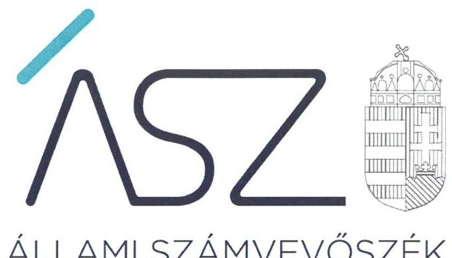
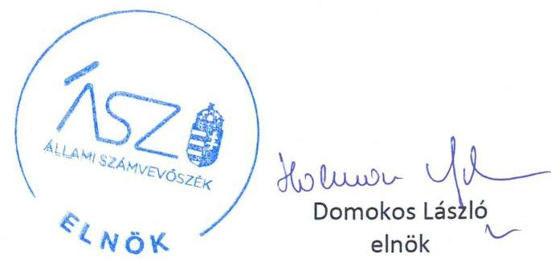
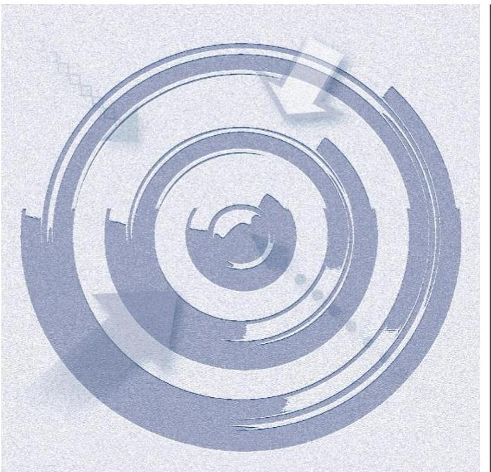
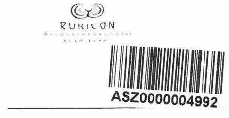
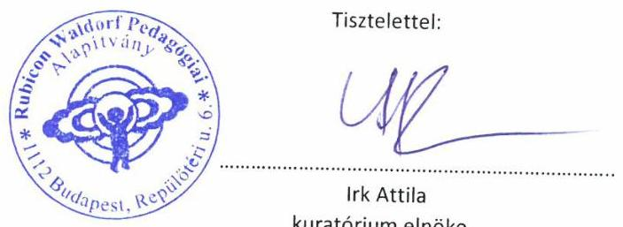
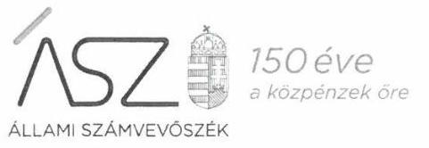
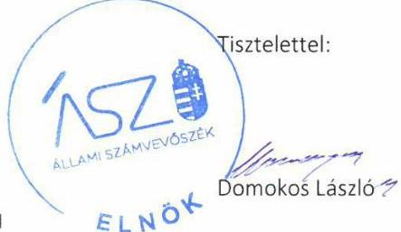
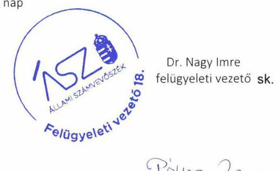

ÁLLAMI SZÁMVEVŐSZÉK

# JELENTÉS 

## Nem állami humánszolgáltatók ellenőrzése

A köznevelési humánszolgáltatást nyújtó intézmények, szolgáltatók államháztartáson kívüli fenntartói központi költségvetésből kapott támogatásai felhasználásának ellenőrzése – Rubicon Waldorf-pedagógiai Alapítvány

2020
20158
www.asz.hu

---

ÁLLAMI SZÁMVEVŐSZÉK

# JELENTÉS

## Nem állami humánszolgáltatók ellenőrzése

A köznevelési humánszolgáltatást nyújtó intézmények, szolgáltatók államháztartáson kívüli fenntartói központi költségvetésből kapott támogatásai felhasználásának ellenőrzése – Rubicon Waldorf-pedagógiai Alapítvány

2020. 07. hó 31. nap

2015. 08. www.asz.hu

---

# AZ ELLENŐRZÉST FELÜGYELTE: 

DR. NAGY IMRE felügyeleti vezető

## AZ ELLENŐRZÉST VEZETTE ÉS A VÉGREHAJTÁSÁÉRT FELELŐS:

DR. GÁL NÓRA ellenőrzésvezető

## A PROGRAM ÖSSZEÁLLÍTÁSÁÉRT FELELŐS:

FEKETE-NAGY ANDRÁS GÁBOR ellenőrzési program készítéséért felelős vezető beosztás

IKTATÓSZÁM: EL-2822-001/2020.
TÉMASZÁM: 2523
ELLENŐRZÉS-AZONOSÍTÓ SZÁM: V086727
Jelentéseink az Országgyűlés számítógépes
hálózatán és az interneten a www.asz.hu címen is olvashatóak.

---

# TARTALOMJEGYZÉK 

■ ÖSSZEGZÉS ..... 5
■ AZ ELLENŐRZÉS CÉLJA ..... 6
■ AZ ELLENŐRZÉS TERÜLETE ..... 7
■ AZ ELLENŐRZÉS HÁTTERE, INDOKOLTSÁGA ..... 8
■ AZ ELLENŐRZÉS LÉNYEGES KÉRDÉSKÖREI ..... 9
■ AZ ELLENŐRZÉS HATÓKÖRE ÉS MÓDSZEREI ..... 10
■ MELLÉKLETEK ..... 13
I. sz. melléklet: Értelmező szótár ..... 13
■ FÜGGELÉK: ÉSZREVÉTELEK ..... 15
■ RÖVIDÍTÉSEK JEGYZÉKE ..... 21

---

.

---

# ÖSSZEGZÉS 

A budapesti székhelyű Rubicon Waldorf-pedagógiai Alapítvány a 2016-2018. években nem biztosította a köznevelési humánszolgáltatási közfeladatok ellátására kapott költségvetési támogatások felhasználásának ellenőrizhetőségét.

## Az ellenőrzés társadalmi indokoltsága

A szociális gondoskodást igénylők védelme, illetve a köznevelési feladatok ellátása az Alaptörvényben ${ }^{1}$ meghatározott, a társadalom szempontjából fontos tevékenységek. Jogszabályok teszik lehetővé, hogy államháztartáson kívüli szervezetek - így például az egyházi fenntartók, alapítványok, gazdasági társaságok, egyesületek - által fenntartott intézmények is végezzenek köznevelési, szociális és gyermekvédelmi feladatokat. Mindehhez a központi költségvetés évente jelentős összegű támogatással járul hozzá. Az államháztartáson kívüli, humánszolgáltatást végző intézmények az igényelt közpénzekből társadalmilag hasznos, közösségteremtő, közérdekű, illetve közhasznú tevékenységet végeznek, illetve közfeladatokat látnak el.

Az intézményfenntartók ellenőrzésével az Állami Számvevőszék hozzájárul ahhoz, hogy ezen közpénzeket az államháztartáson kívüli szervezetek is ellenőrizhető, átlátható és elszámoltatható módon használják fel a közfeladatok ellátása során. Az ellenőrzések célja továbbá, hogy a nyilvánosság és az igénybevevők megfelelő tájékoztatást kapjanak az államháztartáson kívüli közfeladatot ellátók működéséről.

Az ÁSZ ${ }^{2}$ ellenőrzései arra adnak választ, hogy az intézményfenntartók arra használták-e fel a közpénzeket, amire igényelték.

A szabályszerű gazdálkodás elengedhetetlen a közfeladat ellátás szakmai céljainak megvalósításához, valamint a társadalmi közbizalom fenntartásához.

## Megállapítások, következtetések

A Fenntartó ${ }^{3}$ a 2016-2018. években az általános iskolai nevelés, oktatás és a művészeti oktatás köznevelési alapfeladatokra kapott költségvetési támogatás felhasználását alapfeladatonkénti bontásban nem tartotta nyilván az Nkt. vhr. ${ }^{4}$ 37/G. § (1) bekezdésében foglalt előírás ellenére.

Fentiek alapján a Fenntartó a 2016-2018. években a köznevelési humánszolgáltatási közfeladat ellátására kapott költségvetési támogatás felhasználásának Számv. tv. ${ }^{5}$ 161/A.§ (2) bekezdésében előírt ellenőrizhetőségét nem biztosította. Mivel az Nkt. vhr. 37/G. § (1) bekezdésében foglalt szabályozás ellenére nem gondoskodott arról, hogy a költségvetési támogatások felhasználásának alapfeladatonkénti bontásban történő elkülönített elszámolására az adatok rendelkezésre álljanak.

A Fenntartó mindezek alapján az Alaptörvény 39. cikk (2) bekezdésben foglaltak ellenére nem biztosította a felhasznált közpénzekre vonatkozó gazdálkodása átláthatóságát.

Ezáltal a Fenntartó nem igazolta, hogy az egyes köznevelési alapfeladatokra kapott költségvetési támogatások összegét az adott támogatással címzett alapfeladat ellátására fordította.

---

# AZ ELLENŐRZÉS CÉLJA

Az ellenőrzés célja annak értékelése volt, hogy a nem állami, nem önkormányzati köznevelési intézmények fenntartói központi költségvetésből kapott támogatásainak felhasználása szabályszerű volt-e.

---

# **AZ ELLENŐRZÉS TERÜLETE**

### **Rubicon Waldorf-pedagógiai Alapítvány**

A budapesti székhelyű Rubicon Waldorf-pedagógiai Alapítványt tizenkét magánszemély és egy vállalkozás hozta létre 1991-ben. Az alapítás célja óvodában, általános iskolában és középiskolában a Waldorf-pedagógiai módszer szerint haladó csoportok, osztályok támogatása, valamint egységes 12+1 osztályos Waldorf iskolák létrehozása és működtetése volt. A Fenntartó induló vagyona 125 E Ft volt, az ellenőrzött időszakban közhasznú jogállással rendelkezett.

A Fenntartó a közoktatási közfeladatok ellátását – jogi személyiséggel rendelkező köznevelési intézménnyel – a Csillagösvény Waldorf Általános Iskola és Alapfokú Művészeti Iskola útján biztosította. Az Iskolába felvehető maximális tanulólétszám 240 fő volt. Az Iskola alapfeladata az ellenőrzött időszakban 8 évfolyamos oktatás keretében általános iskolai nevelés-oktatás és alapfokú művészet-oktatás volt. Az Iskola 2018. november 20-ig a Fenntartó önálló jogi személyiséggel rendelkező szervezeti egysége, 2018. november 21-étől önálló jogi személy.

A Fenntartó ügyvezető szerve a Kuratórium, képviseletét a Kuratórium elnöke látja el. Az alapítók a Fenntartónál három tagú Felügyelő Bizottságot hoztak létre.

A Fenntartó részére a Magyar Államkincstár 2016-ban 101,7 M Ft, 2017-ben 111,7 M Ft, és 2018-ban 113,2 M Ft központi költségvetési támogatást biztosított a köznevelési feladatok ellátásához.

---

# AZ ELLENŐRZÉS HÁTTERE, INDOKOLTSÁGA 

A köznevelési feladatokat ellátó nem állami intézményfenntartók részére közfeladataik ellátására évente jelentős összegű pénzügyi támogatást biztosítottak a mindenkori költségvetési törvények ${ }^{6}$ a bennük megfogalmazott feltételek mellett.

Az ellenőrzések indokoltságát az is alátámasztja, hogy az ÁSZ számos szervezetet nem ellenőrzött még ezen a területen.

Az ÁSZ stratégiájában foglaltak alapján is indokolt az ellenőrzés, amely a társadalom számára jelzi, hogy a közpénz államháztartáson kívüli felhasználása sem maradhat ellenőrizetlenül. Az államháztartáson kívülre nyújtott költségvetési támogatások ellenőrzésével az ÁSZ hozzájárul ahhoz, hogy a közpénzeket a nem állami humán fenntartók átlátható módon használják fel a közfeladatok ellátására kötött szerződésekben vállalt kötelezettségek teljesítése érdekében. Az ellenőrzés javaslataival hozzájárulhat az említett rendszerek szabályszerű támogatás felhasználásához, javíthatja a társadalmi-gazdasági döntések megalapozottságát, amely a „jól irányított állam" feltétele.

---

# AZ ELLENŐRZÉS LÉNYEGES KÉRDÉSKÖREI 

1. A köznevelési közfeladatot ellátó államháztartáson kívüli fenntartó szabályszerű működési- és gazdálkodási környezet kialakításával megteremtette-e a költségvetési támogatások átlátható, elszámoltatható igénybevételének, felhasználásának feltételeit?
2. Az államháztartáson kívüli fenntartó az átvállalt köznevelési közfeladathoz biztosított költségvetési támogatásokat szabályszerűen fordította-e a humánszolgáltató intézménye működtetésére?
3. Az államháztartáson kívüli fenntartó a köznevelési intézménye működtetéséhez felhasznált közpénzekre vonatkozó gazdálkodásával a nyilvánosság előtt elszámolt-e, ennek érdekében ellenőrzési, értékelési és a külső ellenőrzésekkel kapcsolatos intézkedési feladatait szabályszerűen látta-e el?

---

# AZ ELLENŐRZÉS HATÓKÖRE ÉS MÓDSZEREI 

## Az ellenőrzés típusa

Megfelelőségi ellenőrzés.

## Az ellenőrzött időszak

A 2016. január 1-je és 2018. december 31-e közötti időszak.

## Az ellenőrzés tárgya

Az ellenőrzés a köznevelési humánszolgáltatási közfeladatokat ellátó államháztartáson kívüli fenntartók köznevelési közfeladatai ellátásához a központi költségvetésből kapott támogatásaik köznevelési közfeladatokra való fenntartó általi felhasználása szabályszerűségének értékelésére terjedt ki.

## Az ellenőrzött szervezet

Rubicon Waldorf-pedagógiai Alapítvány

## Az ellenőrzés jogalapja

Az ellenőrzés jogszabályi alapját az ÁSZ tv. ${ }^{7}$ 1. § (3) bekezdésében és 5. § (3) bekezdésében foglalt előírások adják.

## Az ellenőrzés módszerei

Az ellenőrzést az ellenőrzési program annak szempontjai, kérdései, az ellenőrzött időszakban hatályos jogszabályok, a nemzetközi standardokat irányadónak tekintve, az ellenőrzés szakmai szabályok és módszertanok figyelembe vételével rendelte elvégezni. A közpénzekkel való felelős gazdálkodás segítésére irányuló javaslatok kidolgozásakor a hatályos jogszabályok voltak az irányadóak.

Az ellenőrzés ideje alatt az ellenőrzött szervezettel történő kapcsolattartást az ÁSZ SZMSZ ${ }^{8}$-ének vonatkozó előírásai alapján biztosította az ÁSZ.

Az ellenőrzési kérdések megválaszolásához szükséges bizonyítékok megszerzése az ellenőrzött által rendelkezésre bocsátott dokumentumokra, adatokra alapozva megfigyeléssel, szemlével (szemrevételezéssel), kérdésfeltevéssel (információkéréssel), valamint elemző eljárással történt.

---

Az ellenőrzési bizonyítékként felhasználható adatforrások közé tartoztak egyrészt az ellenőrzési program részletes szempontjainál felsorolt adatforrások, másrészt minden - az ellenőrzés folyamán feltárt, az ellenőrzés szempontjából információt tartalmazó - dokumentum.

Az ellenőrzés lefolytatásához az ellenőrzött szervezet a kitöltött tanúsítványok, valamint az ÁSZ által kért dokumentumok elektronikus úton való megküldésével szolgáltatott adatokat, információkat. Az így rendelkezésre bocsátott adatok, információk és a tanúsítványok adatai valódiságának kontrollja az ellenőrzés keretében történt.

Az egységes értelmezést az ellenőrzési program mellékletét képező fogalomtár és rövidítésjegyzék támogatta.

Az ellenőrzést alapvetően a köznevelési humánszolgáltatások esetében a központi költségvetési támogatások igénylésével, módosításával, felhasználásával, elszámolásával kapcsolatos feladatokat ellátó államháztartáson kívüli fenntartóknál/szervezeteinél végezte az ÁSZ.

A köznevelési humánszolgáltatások központi költségvetési támogatásaival kapcsolatos, államháztartáson kívüli fenntartó jogszabályokban előírt feladatai betartását, továbbá a központi költségvetési támogatások szabályszerű nyilvántartását ellenőrizte az ÁSZ a Fenntartónál rendelkezésre álló nyilvántartások, beszámolók és egyéb dokumentumok alapján. Az ellenőrzés nem terjedt ki a köznevelési és szociális humánszolgáltatások központi költségvetési támogatásai igénylése, módosítása, elszámolása valódiságának, megalapozottságának, helyességének - sem a fenntartónál, sem a székhely intézménynél való - értékelésére (mivel ennek felülvizsgálata, ellenőrzése a finanszírozó jogszabályban előírt feladata, határozatai kiadása előtt). Továbbá nem terjedt ki az ellenőrzés e források intézmények általi szabályszerű felhasználásának értékelésére.

---

.

---

# MELLÉKLETEK 

- I. SZ. MELLÉKLET: ÉRTELMEZŐ SZÓTÁR
civil szervezet
humánszolgáltatás
költségvetési támogatás
közfeladat
nem állami, nem önkormányzati (államháztartáson kívüli) intézmény fenntartó

A Civil tv. ${ }^{9}$ 2.§ 6. pontja szerint civil szervezet a civil társaság, a Magyarországon nyilvántartásba vett egyesület (a párt, a szakszervezet és a kölcsönös biztosító egyesület kivételével), a közalapítvány és a pártalapítvány kivételével az alapítvány.
Külön törvényekben meghatározott szociális, gyermekjóléti, gyermekvédelmi, közoktatási, felsőoktatási, kulturális közfeladatok.
A társadalombiztosítás pénzügyi alapjai kivételével az államháztartás központi alrendszeréből ellenérték nélkül, pénzben nyújtott támogatások (Áht. ${ }^{10}$ 1. § 14. pont). A költségvetési törvényekben (2014. évi C. törvény 42-43. §, 2015. évi C. törvény 40-41. §, 2016. évi XC. törvény 40-41. §, 2017. évi C. törvény 40-41. §) megállapított támogatás.
„Közfeladat a jogszabályokban meghatározott állami vagy önkormányzati feladat. ... A közfeladatok ellátásában államháztartáson kívüli szervezet jogszabályban meghatározott rendben közreműködhet." A közfeladatok meghatározó jogszabályban meg kell határozni a közfeladat ellátásának módját és egyidejűleg rendezni kell annak az ellátásához
szükséges pénzügyi fedezet biztosításáról. (Az államháztartásról szóló 2011. évi CXCV. törvény 3/A. § (1)-(3) bekezdés)
A köznevelési közfeladatokat/humánszolgáltatásokat ellátó intézményt/szolgáltatót fenntartó egyházi jogi személy, társadalmi szervezet, alapítvány, közalapítvány, civil szervezet, országos nemzetiségi önkormányzat, nonprofit gazdasági társaság, gazdasági társaság és a humánszolgáltatást alaptevékenységként végző, Szja tv. ${ }^{11}$ hatálya alá tartozó egyéni vállalkozó. (2015. évi Kvtv. 42. §, 43. § (1) bekezdés, 2016. évi Kvtv. 40. §, 41. § (1) bekezdés, 2017. évi Kvtv. 40. §, 41. § (1) bekezdés)

---

.

---

# FÜGGELÉK: ÉSZREVÉTELEK 

A jelentéstervezetet a Számvevőszék 15 napos észrevételezésre megküldte az ellenőrzött szervezet vezetőjének az ÁSZ tv. 29. § (1) bekezdése előírásának megfelelően.

A Rubicon Waldorf-pedagógiai Alapítvány kuratóriumi elnöke a jelentéstervezet megállapításaira észrevételt tett. Az ÁSZ tv. 29. § (3) bekezdésével összhangban az ÁSZ a Függelékben feltünteti a jelentéstervezet megállapításaival kapcsolatban tett, figyelembe nem vett észrevételeket, és megindokolja, hogy azokat miért nem fogadta el.

[^0]
[^0]:    * 29. § (1) Az Állami Számvevőszék az ellenőrzési megállapításait megküldi az ellenőrzött szervezet vezetőjének vagy az általa megbízott személynek, és annak, akinek személyes felelősségét állapította meg.
    (2) Az ellenőrzött szervezet vezetője és a felelősként megjelölt személy az ellenőrzés megállapításaira tizenöt napon belül írásban észrevételt tehet.
    (3) Az Állami Számvevőszék az észrevételre a beérkezésétől számított harminc napon belül írásban válaszol. A figyelembe nem vett észrevételeket köteles a jelentésben feltüntetni, és megindokolni, hogy azokat miért nem fogadta el.

---

Állami Számvevőszék
Domokos László
Elnök
1052 Budapest,

Hiv.szám: EL-2153-034/2019
Ikt.szám: K-81/2020
Ügyintéző: Mátyus Edina
Tel.: 785-7729

Apáczai Csere János utca 10.

# Tisztelt Elnök Úr!
 Köszönettel vettük kézhez az Önök által észrevételezésre megküldött Számvevőszéki jelentéstervezetet, melyhez a következő észrevételt tesszük.

A jelentéstervezet megállapítása szerint a Fenntartó a 2016-2018. években a köznevelési közfeladat ellátására kapott költségvetési támogatás felhasználását alapfeladatonkénti bontásban nem tartotta nyilván. Hivatkozni kívánunk e tekintetben arra, hogy iskolánk az alternatív kerettantervként jóváhagyott Waldorf-kerettanterv alapján látja el köznevelési feladatát. Működési és pedagógiai sajátosság a Waldorf-iskolákban, hogy az általános műveltséget megalapozó nevelés-oktatás és az alapfokú művészetoktatás egymástól elválaszthatatlanul, egységes tantervet alkotva jelenik meg minden tanuló számára kötelezően. A Waldorf-iskolai speciális feladatellátás tehát minden esetben jelenti egyrészt a tanköteles általános iskolai nevelés-oktatást, másrészt emellett minden tanulónak az alapfokú művészetoktatást ('Waldorf művészeti nevelés'). Iskolánk minden tanulója számára biztosítjuk e két köznevelési feladat egyidejű, egységes tanulói jogviszony keretében történő teljesülését.

A Magyar Államkincstár által a Rubicon Waldorfpedagógiai Alapítvány részére folyósított normatív támogatás minden hónapban 100%-ban továbbutalásra kerül az általa fenntartott Csillagösvény Waldorf Iskolának, melyek időpontjáról a mindenkori főkönyvi számlák áttekinthető, naprakész információval szolgálnak. Ezért - figyelemmel az előzőekben hivatkozott alternatív pedagógiai működési sajátosságunkra is - eltúlzottnak tartjuk azt a megállapítást, hogy a felhasznált közpénzekre vonatkozó gazdálkodásunk átláthatóságát nem biztosítottuk.

A Rubicon Waldorfpedagógiai Alapítvány, mint Fenntartó 2019. évi főkönyvi kivonatában és analitikus nyilvántartásában elkülönítetten, alapfeladatonkénti bontásban, naprakészen kimutatásra került a

---

Rubicon Waldorfpedagógiai Alapítvány
1112 Budapest, Repülőtéri út 6.
tel: 061785-7729
email: kuratorium@waldorf-csillagosveny.hu
támogatás, mellyel igazoljuk, hogy a Fenntartó költségvetési támogatások összegét az adott támogatással címzett alapfeladat ellátására fordította.

Ennek alátámasztásaként, kérésükre mellékelten megküldjük a Rubicon Waldorfpedagógiai Alapítvány

- 2019. évi állami normatív támogatás felhasználását alapfeladatonként bontásban igazoló főkönyvi kimutatásait, analitikus nyilvántartását,
- a Magyar Államkincstár részére megküldött 2019. évi költségvetési támogatás elszámolásáról készült dokumentumait,
- a 2019. évi záró főkönyvi kivonatát,
- a 2019. évi számviteli beszámolóját.

Bízunk abban, hogy a mellékelt dokumentumok alapján Elnök Úr megalapozottnak találja a feltárt hiányosság megszűnésének igazolását, és hozzájárul a Számvevőszéki ellenőrzés végleges jelentésének számunkra kedvező összegzéséhez.

Amennyiben Elnök Úr további irat vagy nyilatkozat benyújtását tartja szükségesnek, úgy annak alapítványunk soron kívül eleget tesz.

Budapest, 2020.06.18.

---

Ikt. szám: EL-2153-036/2020.

Irk Attila úr
kuratórium elnöke

Rubicon Waldorf-pedagógiai Alapítvány

# Budapest 

Tisztelt Elnök Úr!
A „Nem állami humánszolgáltatók ellenőrzése - A köznevelési humánszolgáltatást nyújtó intézmények, szolgáltatók államháztartáson kívüli fenntartói központi költségvetésből kapott támogatásai felhasználásának ellenőrzése - Rubicon Waldorf-pedagógiai Alapítvány" címmel készített számvevőszéki jelentéstervezetre a 2020. június 18-án kelt, K-84/2020. iktatószámú levélben megküldött észrevételeit megkaptam.

Az Állami Számvevőszék észrevételekre vonatkozó álláspontjáról a felügyeleti vezető által készített részletes tájékoztatást csatoltan megküldöm.

Tájékoztatom Elnök urat, hogy a számvevőszéki jelentésben - az Állami Számvevőszékről szóló 2011. évi LXVI. törvény 29. § (3) bekezdése alapján - a figyelembe nem vett észrevételeket szerepeltetjük az elutasítás indokának feltüntetésével.

Budapest, 2020. hónap nap

Melléklet: Tájékoztatás az észrevételek kezeléséről

Tisztelettel:

---

# Tájékoztatás az észrevételek kezeléséről 

A „Nem állami humánszolgáltatók ellenőrzése - A köznevelési humánszolgáltatást nyújtó intézmények, szolgáltatók államháztartáson kívüli fenntartói központi költségvetésből kapott támogatásai felhasználásának ellenőrzése - Rubicon Waldorf-pedagógiai Alapítvány" címú jelentéstervezetre (továbbiakban: jelentéstervezet) a 2020. június 18-án kelt, K-84/2020. iktatószámú levelében megküldött észrevételeit áttekintettem. Az észrevételek kezeléséről az alábbi tájékoztatást adom.

## A jelentéstervezet megállapítások, következtetések rész 1. és 3. bekezdéseihez tett észrevétel

Elnök úr a jelentéstervezet megállapításával kapcsolatban - miszerint a Rubicon Waldorfpedagógiai Alapítvány (továbbiakban: Fenntartó) a 2016-2018. években a köznevelési közfeladat ellátására kapott költségvetési támogatás felhasználását alapfeladatonkénti bontásban nem tartotta nyilván - észrevételében arra hivatkozott, hogy az általuk fenntartott Csillagösvény Waldorf Általános Iskola és Alapfokú Művészeti Iskola (továbbiakban: Intézmény) az alternatív kerettantervként jóváhagyott Waldorf-kerettanterv alapján látja el köznevelési feladatát. Tájékoztatása szerint működési és pedagógiai sajátosság a Waldorf-iskolákban, hogy az általános műveltséget megalapozó nevelés-oktatás és az alapfokú művészetoktatás egymástól elválaszthatatlanul, egységes tantervet alkotva jelenik meg minden tanuló számára kötelezően, így az Intézmény minden tanulója számára egyidejűleg, egységes tanulói jogviszony keretében biztosítják e két köznevelési szolgáltatást. Elnök úr észrevételében arról tájékoztatta az Állami Számvevőszéket (továbbiakban: ÁSZ), hogy a Magyar Államkincstár által a Fenntartó részére folyósított normatív támogatás minden hónapban 100%-ban továbbutalásra kerül az Intézménynek, melyek időpontjáról a mindenkori főkönyvi számlák áttekinthető, naprakész információval szolgálnak. Fenti okokból észrevételében Elnök úr kifogásolta a jelentéstervezet azon megállapítását, miszerint a felhasznált közpénzekre vonatkozó gazdálkodásuk átláthatóságát nem biztosították.

Az észrevételéhez kapcsolódóan tájékoztatom, hogy az ÁSZ a jelentéstervezet megállapítások következtetések rész 1. bekezdésében szereplő megállapítását a nemzeti köznevelésről szóló törvény végrehajtásáról szóló 229/2012. (VIII. 28.) Korm. rendelet (továbbiakban: Nkt. vhr.) 37/G. § (1) bekezdésére alapozta, amely előírja, hogy a Fenntartónak a támogatások felhasználását alapfeladatonkénti bontásban elkülönítetten és naprakészen kell nyilvántartania.

A Fenntartó Intézménye - az ellenőrzés során az ÁSZ rendelkezésére bocsátott, nyilvántartásba vétel módosításáról szóló kormányhivatali határozatok alapján - általános iskolai nevelés-oktatás, valamint alapfokú művészetoktatás alapfeladatokat is látott el.

Az ÁSZ az ellenőrzés során az EL-2153-001/2019. iktatószámú levelének 3. számú melléklete szerint bekérte a Fenntartótól a köznevelési közfeladat ellátásra kapott támogatás felhasználásának 2016-2018. évekre vonatkozó elkülönített nyilvántartását alátámasztó dokumentumot. Az ÁSZ adatbekérő levelére válaszul a Fenntartó kuratóriumi elnökének 2019. november 4-én kelt nyilatkozata szerint, az ellenőrzés rendelkezésére bocsátotta 2016-2018.

---

évekre vonatkozóan a Fenntartó köznevelési közfeladat ellátásra kapott támogatás felhasználásának elkülönített nyilvántartását alátámasztó dokumentumokat. A Fenntartó kuratóriumi elnöke nyilatkozott az adatszolgáltatás során arról, hogy az ÁSZ részére átadott dokumentumok, adatok megbízhatóak, és a bekért adatokra, dokumentumokra vonatkozóan teljes körű információt tartalmaznak.
A jelzett dokumentumokat felülvizsgálva megállapítottam, hogy azok az Intézmény által ellátott alapfeladatok (általános iskolai nevelés-oktatás, alapfokú művészetoktatás) vonatkozásában a támogatások felhasználásának elkülönítését nem támasztják alá. A beküldött dokumentumok között szereplő főkönyvi kivonatokban, főkönyvi kartonokon, a támogatás felhasználásának elszámolására szolgáló költségek, ráfordítások főkönyvi adataiban az alapfeladatok szerinti elkülönítés nem jelenik meg, ezért azok nem támasztják alá a támogatások felhasználásának alapfeladatonkénti elkülönített nyilvántartását. A Fenntartó a támogatások felhasználásának alapfeladatonkénti elkülönítésének hiányában 2016-2018. évek vonatkozásában nem tett eleget az Nkt. vhr. 37/G. § (1) bekezdés előírásának. Az Nkt. vhr. nem tartalmaz rendelkezést a hivatkozott előírás alóli mentességre, kivételre vonatkozóan abban az esetben sem, amikor az Intézmény egységes tanulói jogviszony keretében biztosítja a két köznevelési alapfeladat szerinti oktatást a tanulók számára.
A jelentéstervezet nem tartalmaz megállapítást Elnök úr észrevételében szereplő, a Magyar Államkincstár által a Fenntartó részére folyósított normatív támogatásnak az Intézmény részére történő továbbutalására vonatkozóan.
Mindezek alapján a Fenntartó az Nkt. vhr. 37/G. § (1) bekezdésében előírtak szerinti nyilvántartási kötelezettségének elmulasztása miatt nem biztosította a köznevelési alapfeladataira kapott költségvetési támogatás felhasználásának, a számvitelről szóló 2000. évi C. törvény 161/A. § (2) bekezdésében előírt ellenőrizhetőségét, így nem biztosította a felhasznált közpénzekre vonatkozó gazdálkodása átláthatóságát az Alaptörvény 39. cikk (2) bekezdésben foglaltak ellenére.
A fent leírtakra tekintettel az észrevételt nem fogadjuk el, a jelentéstervezet megállapításainak módosítása nem indokolt.

Budapest, 2020.  hónap  nap

---

# RÖVIDÍTÉSEK JEGYZÉKE 

${ }^{1}$ Alaptörvény
${ }^{2}$ ÁSZ
${ }^{3}$ Fenntartó
${ }^{4}$ Nkt. vhr.
${ }^{5}$ Számv. tv.
${ }^{6}$ költségvetési törvény
${ }^{7}$ Ász tv.
${ }^{8}$ SZMSZ
${ }^{9}$ Civil tv.
${ }^{10}$ Áht.
${ }^{11}$ Szja tv.

Magyarország Alaptörvénye (2011. április 25.)
Állami Számvevőszék
Rubicon Waldorf-pedagógiai Alapítvány
229/2012. (VIII. 28.) Korm. rendelet a nemzeti köznevelésről szóló törvény végrehajtásáról
2000. évi C. törvény a számvitelről (hatályos: 2001. január 1-től)

Kvtv.1: 2015. évi C. törvény Magyarország 2016. évi központi költségvetéséről (hatályos: 2015. július 4-től)
Kvtv.2: 2016. évi XC. törvény Magyarország 2017. évi központi költségvetéséről (hatályos: 2016. november 1-jétől)
Kvtv.3: 2017. évi C. törvény Magyarország 2018. évi központi költségvetéséről (hatályos: 2017. november 1-jétől)
2011. évi LXVI. törvény az Állami Számvevőszékről

Szervezeti és Működési Szabályzat
2011. évi CLXXV. törvény az egyesülési jogról, a közhasznú jogállásról, valamint a civil szervezetek működéséről és támogatásáról (hatályos. 2011. december 22-től)
2011. évi CXCV. törvény az államháztartásról (hatályos: 2011. december 31-től) 1995. évi CXVII. törvény a személyi jövedelemadóról

---

# ASZ 

ÁLLAMI SZÁMVEVŐSZÉK
1052 Budapest, Apáczai Cs. J. u. 10. I 1364 Budapest 4. Pf. 54 TEL: +36 14849100
email: szamvevoszek@asz.hu
web: www.asz.hu | www.aszhirportal.hu

