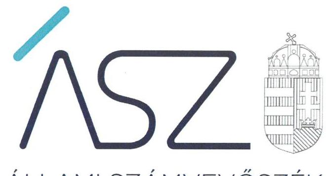
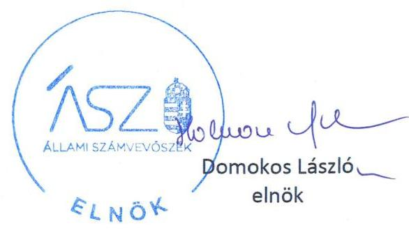
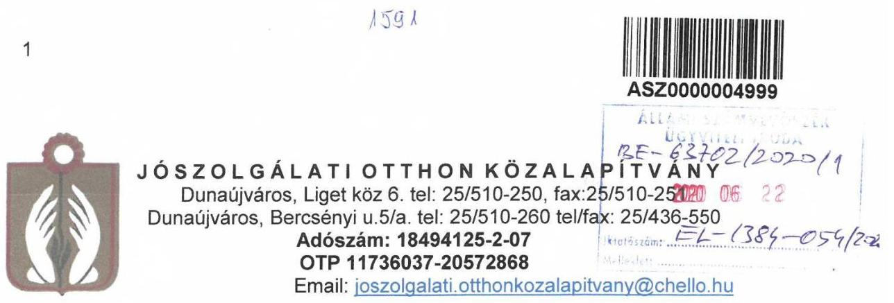
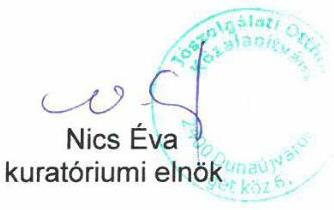
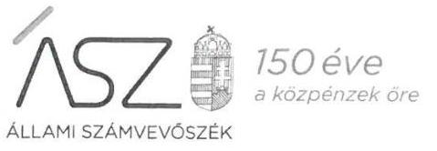
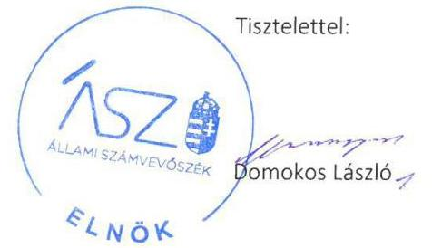
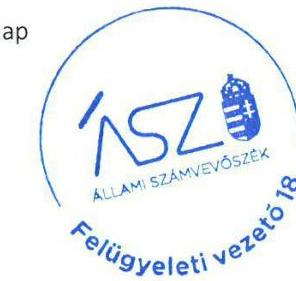

ÁLLAMI SZÁMVEVŐSZÉK

# JELENTÉS 

## Nem állami humánszolgáltatók ellenőrzése

A szociális humánszolgáltatást nyújtó intézmények, szolgáltatók államháztartáson kívüli fenntartói központi költségvetésből kapott támogatásai felhasználásának ellenőrzése – Jószolgálati Otthon Közalapítvány

2020
20159
www.asz.hu

---

ÁLLAMI SZÁMVEVŐSZÉK

# JELENTÉS

## Nem állami humánszolgáltatók ellenőrzése

A szociális humánszolgáltatást nyújtó intézmények, szolgáltatók államháztartáson kívüli fenntartói központi költségvetésből kapott támogatásai felhasználásának ellenőrzése – Jószolgálati Otthon Közalapítvány

2020. 07. hó 31. nap

2015. 07. www.asz.hu

---

# AZ ELLENŐRZÉST FELÜGYELTE: 

KAKAS SÁNDOR felügyeleti vezető

## AZ ELLENŐRZÉST VEZETTE ÉS A VÉGREHAJTÁSÁÉRT FELELŐS:

LACZI HEDVIG ANNA ellenőrzésvezető

## A PROGRAM ÖSSZEÁLLÍTÁSÁÉRT FELELŐS:

TÓTPÁL SZABOLCS osztályvezető
FEKETE-NAGY ANDRÁS ellenőrzési program készítéséért felelős vezető

## IKTATÓSZÁM: EL-2819-001/2020

Jelentéseink az Országgyúlés számítógépes hálózatán és az interneten a www.asz.hu címen is olvashatóak.

TÉMASZÁM: 2491
ELLENŐRZÉS-AZONOSÍTÓ SZÁM: V083575-V0867130

---

# TARTALOMJEGYZÉK 

■ ÖSSZEGZÉS ..... 5
■ AZ ELLENŐRZÉS CÉLJA ..... 6
■ AZ ELLENŐRZÉS TERÜLETE ..... 7
■ AZ ELLENŐRZÉS HÁTTERE, INDOKOLTSÁGA ..... 8
■ A JELENTÉS LÉNYEGES KÉRDÉSKÖRE ..... 9
■ AZ ELLENŐRZÉS HATÓKÖRE ÉS MÓDSZEREI ..... 10
■ MEGÁLLAPÍTÁSOK ..... 12
■ MELLÉKLETEK ..... 13
I. sz. melléklet: Értelmező szótár ..... 13
■ FÜGGELÉK: ÉSZREVÉTELEK ..... 15
■ RÖVIDÍTÉSEK JEGYZÉKE ..... 21

---

.

---

# ÖSSZEGZÉS 

A dunaújvárosi székhelyű Jószolgálati Otthon Közalapítvány szociális közfeladat ellátáshoz rendelt költségvetési támogatásainak felhasználása, a közpénzekkel való gazdálkodása a 2015-2018. években nem volt átlátható, elszámoltatható.

## Az ellenőrzés társadalmi indokoltsága

A szociális gondoskodást igénylők védelme, illetve a köznevelési feladatok ellátása az Alaptörvényben meghatározott, a társadalom szempontjából fontos tevékenységek. Jogszabályok teszik lehetővé, hogy államháztartáson kívüli szervezetek - így például az egyházi fenntartók, alapítványok, gazdasági társaságok, egyesületek - által fenntartott intézmények is végezzenek köznevelési, szociális és gyermekvédelmi feladatokat. Mindehhez a központi költségvetés évente jelentős összegű támogatással járul hozzá. Az államháztartáson kívüli, humánszolgáltatást végző intézmények az igényelt közpénzekből társadalmilag hasznos, közösségteremtő, közérdekű, illetve közhasznú tevékenységet végeznek, illetve közfeladatokat látnak el.

Az intézményfenntartók ellenőrzésével az Állami Számvevőszék hozzájárul ahhoz, hogy ezen közpénzeket az államháztartáson kívüli szervezetek is ellenőrizhető, átlátható és elszámoltatható módon használják fel a közfeladatok ellátása során. Az ellenőrzések célja továbbá, hogy a nyilvánosság és az igénybevevők megfelelő tájékoztatást kapjanak az államháztartáson kívüli közfeladatot ellátók működéséről.

Az ÁSZ ellenőrzései arra adnak választ, hogy az intézményfenntartók arra használták-e fel a közpénzeket, amire igényelték.

A szabályszerű gazdálkodás elengedhetetlen a közfeladat ellátás szakmai céljainak megvalósításához, valamint a társadalmi közbizalom fenntartásához.

## Főbb megállapítások, következtetések

A dunaújvárosi Jószolgálati Otthon Közalapítvány a 2015-2018. években számviteli szabályozás hiányában nem alakította ki a szabályszerű gazdálkodás kereteit, mivel a számviteli törvényben előírt szabályzatokkal nem rendelkezett. Ezáltal nem teremtette meg a költségvetési támogatások elszámoltatható, átlátható felhasználásának szabályozási feltételeit.

A Jószolgálati Otthon Közalapítvány —számviteli szabályozás hiányában — nem biztosította a beszámolók alátámasztottságát, valamint a támogatásokkal való elszámoltathatóság feltételeit nem teremtette meg.

A Jószolgálati Otthon Közalapítvány mindezek alapján az Alaptörvény ${ }^{1} 39$. cikk (2) bekezdésében foglaltak ellenére a felhasznált közpénzekre vonatkozó gazdálkodása elszámoltathatóságát, átláthatóságát nem biztosította, ezáltal nem volt igazolható, hogy a közpénzeket a közfeladatot ellátó intézményeire fordította.

---

# AZ ELLENŐRZÉS CÉLJA

**AZ ELLENŐRZÉS CÉLJA** annak értékelése volt, hogy a nem állami, nem önkormányzati szociális intézmények fenntartói központi költségvetésből kapott támogatásainak felhasználása szabályszerű volt-e.

---

# **AZ ELLENŐRZÉS TERÜLETE**

## **Jószolgálati Otthon Közalapítvány**

A Jószolgálati Otthon Közalapítványt 2002-ben alapította 80,19 millió Ft induló vagyonnal Dunaújváros Megyei Jogú Város Önkormányzatának Közgyűlése. A Jószolgálati Otthon Közalapítvány közhasznú tevékenységeket végzett, amelyek: Fogyatékosok nappali ellátása, támogató szolgálat voltak.

Jószolgálati Otthon Közalapítvány legfőbb döntéshozó, képviseleti és ügyvezető szerve a Kuratórium2 volt, amely öt, határozatlan időtartamra kinevezett tagból állt.

A Jószolgálati Otthon Közalapítvány szociális feladatait két, önálló jogi személyiséggel nem rendelkező intézménye révén látta el, amelyek bejegyzése a Szoctv.3 szerinti szolgáltatói nyilvántartásba megtörtént.

A Jószolgálati Otthon Közalapítvány a Magyar Államkincstár adatai szerint a szociális feladat ellátásra 2015. évben 61,3 millió Ft, 2016. évben 75,2 millió Ft, 2017. évben 98,9 millió Ft, 2018. évben 113,6 millió Ft költségvetési támogatást kapott.

---

# AZ ELLENŐRZÉS HÁTTERE, INDOKOLTSÁGA 

A szociális feladatokat ellátó nem állami intézményfenntartók részére közfeladataik ellátására 2015-2018. években jelentős összegű pénzügyi támogatást biztosítottak a mindenkori költségvetési törvények a bennük megfogalmazott feltételek mellett. A felhasználható állami támogatások a Kvtv. ${ }^{4}$-ekben a 2015-2018. években a szociális ágazatra vonatkozóan 360 Mrd Ft előirányzatot határoztak meg.

Az ÁSZ ${ }^{5}$ a stratégiájában célul tűzte ki, hogy az államháztartáson kívülre nyújtott költségvetési támogatások ellenőrzésével hozzájárul ahhoz, hogy a közpénzeket az államháztartáson kívüli szervezetek is átlátható módon használják fel a közfeladatok szerződésben vállalt ellátása érdekében. Az ÁSZ a stratégiájában foglaltak alapján is indokolt az ellenőrzés, amely a társadalom számára jelzi, hogy a közpénz államháztartáson kívüli felhasználása sem maradhat ellenőrizetlenül. Az államháztartáson kívülre nyújtott költségvetési támogatások ellenőrzésével az ÁSZ hozzájárul ahhoz, hogy a közpénzeket a nem állami fenntartók átlátható módon használják fel a közfeladatok ellátására kötött szerződésekben vállalt kötelezettségek teljesítése érdekében. Az ÁSZ az ellenőrzés javaslataival hozzájárulhat az említett rendszerek szabályszerű támogatás-felhasználásához, javíthatja a társadalmi-gazdasági döntések megalapozottságát, amely a „jól irányított állam működésének" feltétele.

---

# A JELENTÉS LÉNYEGES KÉRDÉSKÖRE 

A szociális humánszolgáltató közfeladatot ellátó fenntartó megteremtette-e a költségvetési támogatások átlátható, elszámoltatható igénybevételének, felhasználásának feltételeit, a költségvetési támogatásokat szabályszerűen fordította-e intézményei működésére, a közpénzekre vonatkozó gazdálkodásával a nyilvánosság előtt elszámolt-e?

---

# AZ ELLENŐRZÉS HATÓKÖRE ÉS MÓDSZEREI 

## Az ellenőrzés típusa

Megfelelőségi ellenőrzés.

## Az ellenőrzött időszak

A 2015. január 1-je és 2018. december 31-e közötti időszak.

## Az ellenőrzés tárgya

Az ellenőrzés a szociális humánszolgáltatási közfeladatokat ellátó államháztartáson kívüli fenntartók, humánszolgáltatási közfeladatai ellátásához a központi költségvetésből kapott támogatásaik humánszolgáltatási közfeladatokra való fenntartó általi felhasználása szabályszerűségének értékelésére terjedt ki.

## Az ellenőrzött szervezet

Jószolgálati Otthon Közalapítvány

## Az ellenőrzés jogalapja

Az ellenőrzés jogszabályi alapját az ÁSZ tv. 6. § (3) bekezdése, 5. § (3) bekezdésben foglalt előírások adják.

## Az ellenőrzés módszerei

Az ellenőrzést az ellenőrzési program annak szempontjai, kérdései, az ellenőrzött időszakban hatályos jogszabályok, a nemzetközi standardokat irányadónak tekintve, az ellenőrzés szakmai szabályok és módszertanok figyelembe vételével rendelte elvégezni. A közpénzekkel való felelős gazdálkodás segítésére irányuló javaslatok kidolgozásakor a hatályos jogszabályok voltak az irányadóak.

Az ellenőrzés ideje alatt az ellenőrzött szervezettel történő kapcsolattartást az ÁSZ SZMSZ ${ }^{7}$-ének vonatkozó előírásai alapján biztosította az ÁSZ.

Az ellenőrzési kérdések megválaszolásához szükséges bizonyítékok megszerzése az ellenőrzött által rendelkezésre bocsátott dokumentumokra, adatokra alapozva megfigyelés, szemle (szemrevételezés), kérdésfeltevés (információkérés), valamint elemző eljárással történt.

---

Az ellenőrzési bizonyítékként felhasználható adatforrások közé tartoztak egyrészt az ellenőrzési program részletes szempontjainál felsorolt adatforrások, másrészt minden - az ellenőrzés folyamán feltárt, az ellenőrzés szempontjából információt tartalmazó - dokumentum.

Az ellenőrzés lefolytatásához az ellenőrzött szervezet a kitöltött tanúsítványok, valamint az ÁSZ által kért dokumentumok elektronikus úton való megküldésével szolgáltatott adatokat, információkat. Az így rendelkezésre bocsátott adatok, információk és a tanúsítványok adatai valódiságának kontrollja az ellenőrzés keretében történt.

Az egységes értelmezést támogatta a jelentés mellékletét képező fogalomtár és rövidítésjegyzék.

Az ellenőrzést alapvetően a szociális humánszolgáltatások esetében a központi költségvetési támogatások igénylésével, módosításával, felhasználásával, elszámolásával kapcsolatos feladatokat ellátó államháztartáson kívüli fenntartónál/szervezeteinél végezte az ÁSZ.

A szociális humánszolgáltatások központi költségvetési támogatásaival kapcsolatos, államháztartáson kívüli fenntartó jogszabályokban előírt feladatai betartását, továbbá a központi költségvetési támogatások szabályszerű nyilvántartását ellenőrizte az ÁSZ a fenntartónál rendelkezésre álló nyilvántartások, beszámolók és egyéb dokumentumok alapján. Az ellenőrzés nem terjedt ki a szociális humánszolgáltatások központi költségvetési támogatásai igénylése, módosítása, elszámolása valódiságának, megalapozottságának, helyességének - sem a fenntartónál, sem a székhely intézményeinél való - értékelésére (mivel ennek felülvizsgálata, ellenőrzése a finanszírozó jogszabályban előírt feladata, határozatai kiadása előtt). Továbbá nem terjedt ki az ellenőrzés e források, intézmények általi szabályszerű felhasználásának értékelésére.

---

# MEGÁLLAPÍTÁSOK 

## A szociális humánszolgáltató közfeladatot ellátó fenntartó megteremtette-e a költségvetési támogatások átlátható, elszámoltatható igénybevételének, felhasználásának feltételeit, a költségvetési támogatásokat szabályszerűen fordította-e intézményei működésére, a közpénzekre vonatkozó gazdálkodásával a nyilvánosság előtt elszámolt-e?

Összegző megállapítás

A Fenntartó a 2015-2018. években a gazdálkodási környezetet nem alakította ki, ezáltal nem teremtette meg a költségvetési támogatások átlátható, elszámoltatható felhasználásának feltételeit. A Fenntartó 2015-2018. években nem igazolta, hogy a szociális közfeladat ellátásához biztosított költségvetési támogatásokat az intézményei működtetésére fordította. A közpénzekre vonatkozó gazdálkodásával nem számolt el.

A Fenntartó ${ }^{8}$ a 2015-2017. években a Számv. tv. ${ }^{9}$ 14. § (3) bekezdésében előírt számviteli politikával, valamint a Számv. tv. 14. § (5) bekezdés a)-b) és d) pontjaiban előírt szabályzatokkal nem rendelkezett. A 2018. évben a Számv. tv. 14. § (3) bekezdésében előírt számviteli politikával, valamint a Számv. tv. 14. § (5) bekezdés a) pontjában előírt szabályzattal nem rendelkezett. A Fenntartó a 2015-2018. évben a Számv. tv. 161. § (1) bekezdése ellenére nem rendelkezett számlarenddel.

Számviteli szabályozás hiányában a Fenntartó a Számv. tv. 4. § (1) bekezdésében meghatározattak ellenére a 2015-2018. évi beszámolóit a Számv. tv. 161/A. § (1) bekezdésében foglaltaknak megfelelő könyvvezetéssel nem támasztotta alá.

---

# MELLÉKLETEK 

- I. SZ. MELLÉKLET: ÉRTELMEZŐ SZÓTÁR
befogadás
civil szervezet
ellátási terület
feladatfinanszírozás
humánszolgáltatás
költségvetési támogatás
nem állami, nem önkormányzati (államháztartáson kívüli) intézmény fenntartó
székhely intézmény
telephely

A Szoctv. illetve a Gyvt. szerinti, a szociális szolgáltatások és a gyermekjóléti szolgáltató tevékenységek területi lefedettségét figyelembe vevő finanszírozási rendszerbe történő befogadás.
A Civil tv. 2. § 6. pontja szerint civil szervezet a civil társaság, a Magyarországon nyilvántartásba vett egyesület (a párt, a szakszervezet és a kölcsönös biztosító egyesület kivételével), a közalapítvány és a pártalapítvány kivételével az alapítvány.
Az a terület, ahonnan az engedélyes gyermekeket, illetve más ellátottakat fogad.
A közfeladat államháztartáson kívüli szervezet által történő ellátásához közvetlenül kapcsolódó, arányos működési költségeket finanszírozó költségvetési támogatás.
Külön törvényben meghatározott szociális, gyermekjóléti, gyermekvédelmi, közoktatási, felsőoktatási, kulturális közfeladatok (2014. évi Kvtv. 34. § (1), (4) bekezdés, 1. számú melléklet XX/20/2. alcím, 19. alcím, 2015. évi Kvtv. 43. § (1), (4) bekezdés, 1. számú melléklet XX/20/2/3. jogcím csoport, 19. alcím, 2016. évi Kvtv. 41. § (1), (4) bekezdés, 1. számú melléklet XX/20/2/3. jogcím csoport, 19. alcím).
a társadalombiztosítás pénzügyi alapjai kivételével az államháztartás központi alrendszeréből ellenérték nélkül, pénzben nyújtott támogatások (Áht. ${ }^{10}$ 1. § 14. pont)
A költségvetési törvényekben (2013. évi CCXXX. törvény 33-34. §, 2014. évi C. törvény 42-43. §, 2015. évi C. törvény 40-41. §) megállapított támogatás. Például a 2015. évi C. törvény 40-41. § szerint többek között: Az Országgyűlés a szociális, gyermekjóléti, gyermekvédelmi közfeladatot ellátó intézményt, szolgáltatást fenntartó egyházi jogi személy, civil szervezet, közalapítvány, országos nemzetiségi önkormányzat, települési vagy területi nemzetiségi önkormányzat, gazdasági társaság, és a humánszolgáltatást alaptevékenységként végző, az Szja tv. hatálya alá tartozó egyéni vállalkozó (a továbbiakban együtt: nem állami szociális fenntartó) részére támogatást állapít meg a következők szerint: a támogatás a nem állami szociális fenntartót a települési önkormányzatok 2. melléklet III. pont 3. alpont c)-k) pontjában és III. pont 5. alpont a) pontjában meghatározott támogatásaival azonos jogcímeken, összegben és feltételek mellett illeti meg.
A szociális, gyermekjóléti és

 gyermekvédelmi közfeladatokat/humánszolgáltatásokat ellátó intézményt fenntartó egyházi jogi személy, társadalmi szervezet, alapítvány, közalapítvány, civil szervezet, országos nemzetiségi önkormányzat, nonprofit gazdasági társaság, gazdasági társaság és a humánszolgáltatást alaptevékenységként végző, Szja tv. hatálya alá tartozó egyéni vállalkozó. (2015. évi Kvtv. 42. §, 43. § (1), (4) bekezdés, 2016. évi Kvtv. 40. §, 41. § (1), (4) bekezdés, 2017. évi Kvtv. 41. § (1), (4)),
a szolgáltató székhelye, azaz a szolgáltató központi ügyintézésének helye, függetlenül attól, hogy használják-e szolgáltatás nyújtására (Sznyvhr ${ }^{11}$. 1.§ k) pont) (hatályos: 2013. december 1-től)
a szolgáltató székhelyétől különböző, szolgáltató/intézmény használatában álló hely, a szociális humánszolgáltatáshoz használt, bejegyzett hely. (Sznyvhr. 1.§ l) pont) (hatályos: 2015. január 1-től)

Előzmény törvények, amelyeket az ellenőrzött időszak miatt figyelembe kell venni: egyesülési jogról szóló 1989. évi II. tv, a közhasznú szervezetekről szóló 1997. évi CLVI. tv.

---

.

---

# FÜGGELÉK: ÉSZREVÉTELEK 

A jelentéstervezetet a Számvevőszék 15 napos észrevételezésre megküldte az ellenőrzött szervezet vezetőjének az ÁSZ tv. 29. § (1) bekezdése előírásának megfelelően.

A Jószolgálati Otthon Közalapítvány kuratóriumi elnöke a jelentéstervezet megállapításaira írásban észrevételt tett.

Az ÁSZ tv. 29. § (3) bekezdésével összhangban az ÁSZ a Függelékben feltünteti az ellenőrzés megállapításaival kapcsolatban tett, figyelembe nem vett észrevételeket, és megindokolja, hogy azokat miért nem fogadta el.

[^0]
[^0]:    (1) Az Állami Számvevőszék az ellenőrzési megállapításait megküldi az ellenőrzött szervezet vezetőjének vagy az általa megbízott személynek, és annak, akinek személyes felelősségét állapította meg.
    (2) Az ellenőrzött szervezet vezetője és a felelősként megjelölt személy az ellenőrzés megállapításaira tizenöt napon belül írásban észrevételt tehet.
    (3) Az Állami Számvevőszék az észrevételre a beérkezésétől számított harminc napon belül írásban válaszol. A figyelembe nem vett észrevételeket köteles a jelentésben feltüntetni, és megindokolni, hogy azokat miért nem fogadta el.

---

Állami Számvevőszék
Budapest
Apáczai Csere János u. 10.
1052
Tárgy: észrevétel az EL-1384-050/2020. számú ellenőrzési jelentéstervezethez ( Témaszám: 2491, Ellenőrzési azonosítószám: V083575-V0867130)

# Tisztelt Állami Számvevőszék! 

A fenti számú ellenőrzési jelentéshez az alábbi észrevételeket teszem:

Közalapítványunk az 1993. évi törvény 85/B.§. alapján integrált formában működik, kihasználva az integráció adta gazdaságosságra gyakorolt előnyét: átjárhatóság, közös munkakörök, különös tekintettel a pénzügyi - számviteli - ügyviteli feladatokra, melyeknek ajánlott létszámát alapellátásra és bentlakásos ellátásra az 1/2000.(I.7.) SzCsM rendelet 6.§.(4a) f),g) szakasza határozza meg, (7 fő), az integráció előnyeit kihasználva közalapítványunk esetében ez 3 fő.
A használt szoftverek (Apolló ügyviteli, Wizuál bér, OTP Elektra banki, NAV ÁNYK programok) egymással kompatibilisek, az adatok átadhatók, az analitikus nyilvántartások jelentős részét automatikusan előállítják.
Bár a hivatkozott törvény az integrált formát elismeri, tartalmazza, az államháztartás nyilvántartási, támogatás igénylés és elszámolási metodikája nem tudja ezt a formát kezelni, így nekünk magunknak kellett és kell kitalálni, kialakítani a minden jogszabálynak megfelelő, az elszámolás egyezőségét biztosító, de a működést nem akadályozó számviteli szabályozást.

Minden segítséget szívesen fogadunk, hogy tovább javuljon a munkánk színvonala, így köszönjük észrevételeiket.

A számviteli szabályzatok esetében az eredeti szabályzatokat szkenneltük be, nem gondolván arra, hogy ezeket hitelesíteni kell, és az aláírás nagyon halvány. A hibát kijavítottuk. Mentségünkre szóljon, nem szándékosan tettük, közrejátszott az adatszolgáltatásra adott, 2011. évi LXVI. törvény által előírt, rövid határidő, a napi feladatok elvégzése, a 2019. január 31-i határidejű normatív és kötött felhasználású támogatás elszámolása, az éves statisztikai adatgyűjtés keretében az ellátásokról szükséges jelentések elkészítése.

---

A támogatások felhasználásának biztosítását szabályozó, a vizsgált években hatályos 224/2000.(XII.19) és 479/2016.(XII.28.) kormányrendeleteknek megfelelő analitikus nyilvántartásokat vezettük (az elszámolás alapja), de ezek szabályozását nem építettük be a számviteli politikába és az ennek 1. függelékében beépített számlarendbe: hibáztunk. A hiányosságot pótoltuk, és a számviteli politika 2. számú függelékébe beépítettük. A hibát kijavítottuk.

Mivel az ellenőrzési jelentés tervezet nem tartalmaz részletező megállapításokat, ezért a hivatkozott szabályzatokat átvizsgáltuk, a tartalmát összevetettük a hatályos jogszabályokkal, a tartalmukban legjobb tudásunk szerint nem találtunk hibát, a jelenleg általunk nem használt számlákat töröltük a könnyebb használhatóság miatt.

Továbbra is várjuk észrevételeiket, javaslataikat.
Dunaújváros, 2020. június 16.

Tisztelettel:

---

Ikt. szám: EL-1384-055/2020.
Nics Éva úrhölgy
kuratóriumi elnök

Jószolgálati Otthon Közalapítvány

# Dunaújváros 

Tisztelt Elnök Úrhölgy!

A „Nem állami humánszolgáltatók ellenőrzése - A szociális humánszolgáltatást nyújtó intézmények, szolgáltatók államháztartáson kívüli fenntartói központi költségvetésből kapott támogatásai felhasználásának ellenőrzése - Jószolgálati Otthon Közalapítvány" címmel készített számvevőszéki jelentéstervezetre a 2020. június 16-án kelt észrevételét megkaptam.

Az Állami Számvevőszék (továbbiakban: ÁSZ) észrevételekre vonatkozó álláspontjáról a felügyeleti vezető által készített részletes tájékoztatást csatoltan megküldöm.

Tájékoztatom Elnök úrhölgyet, hogy a számvevőszéki jelentésben - az Állami Számvevőszékről szóló 2011. évi LXVI. törvény 29. § (3) bekezdése alapján - a figyelembe nem vett észrevételeket szerepeltetjük az elutasítás indokának feltüntetésével.
Budapest, 2020. 64 hónap 40 nap

Melléklet: Tájékoztatás az észrevételek kezeléséről

---

# Tájékoztatás az észrevételek kezeléséről 

A „Nem állami humánszolgáltatók ellenőrzése - A szociális humánszolgáltatást nyújtó intézmények, szolgáltatók államháztartáson kívüli fenntartói központi költségvetésből kapott támogatásai felhasználásának ellenőrzése - Jószolgálati Otthon Közalapítvány" címú jelentéstervezettel (továbbiakban: jelentéstervezet) kapcsolatosan a 2020. június 16-án kelt levelében tett észrevételét áttekintettem. Az észrevétel kezeléséről az alábbi tájékoztatást adom.

## A jelentéstervezet Megállapítások fejezet 1-2. bekezdéseivel kapcsolatos észrevétel

Elnök úrhölgy észrevételében leírta, hogy a Jószolgálati Otthon Közalapítvány (továbbiakban: Fenntartó) integrált formában működik. A Fenntartó által használt szoftverek egymással kompatibilisek, az adatok átadhatók, az analitikus nyilvántartások jelentős részét automatikusan állítják elő. A Fenntartó igyekezett kialakítani a jogszabályoknak megfelelő, az elszámolások egyezőségét biztosító, azonban az integrált működést nem akadályozó számviteli szabályozását. Jelezte, hogy a munkájuk színvonalát javító észrevételeinket köszönettel fogadják.
Az adatszolgáltatás során az eredeti számviteli szabályzatokat szkennelték be, azonban a határidő rövidsége, a napi feladatok feltorlódása miatt nem hitelesítették őket, és azokon az eredeti aláírások nagyon halványak. Elnök úrhölgy észrevétele szerint a Fenntartó a jogszabályoknak megfelelő analitikus nyilvántartásokat vezette, mert az a támogatások elszámolásának az alapja. Elismerte, hogy a számviteli politikába és az annak 1. függelékét képező számlarendbe azokat nem építették be, azonban ezt a hibát azóta javították. Jelezte továbbá, hogy a jelentéstervezetben hivatkozott szabályzataikat felülvizsgálták, a nem használt számlákat törölték, szabályzataik tartalma - a legjobb tudásuk szerint - megfelel a hatályos jogszabályoknak.

Tájékoztatom Elnök úrhölgyet, hogy az Állami Számvevőszék (továbbiakban: ÁSZ) az ellenőrzés során kizárólag az adatszolgáltatásra rendelkezésre álló - az Állami Számvevőszékről szóló 2011. évi LXVI. törvény (továbbiakban: ÁSZ tv.) 28. § (2) bekezdés szerinti - határidőn belül beérkezett dokumentumokat veszi figyelembe. A törvényes határidőn túl - így a vagyonmegóvási eljárás kilátásba helyezéséről tájékoztató levélre küldött válaszlevél mellékleteként - megküldött dokumentumokat az ÁSZ a tárgyi megállapítások megtételéhez nem veszi figyelembe, azokat külön ügymenetben értékeli.

Az ÁSZ tv. 28. § (2) bekezdése szerint, a közreműködésre felhívott szervezet az ÁSZ részére - annak kérésére soron kívül, de legkésőbb öt munkanapon belül - az ellenőrzés tervezhetősége, meghatározása, illetve lefolytatása érdekében szükséges adatokat és dokumentumokat rendelkezésre bocsátja, illetve a kapcsolódó tájékoztatást köteles megadni. A Fenntartó több teljességi és hitelességi nyilatkozattal dokumentumokat küldött meg az ÁSZ részére.
Az ellenőrzéshez a Fenntartó által az adatbekérés során beküldött dokumentumok felülvizsgálata alapján megállapítható, hogy a Fenntartó az ellenőrzés időszakában az adatszolgáltatásra rendelkezésre álló időben a 2015-2017. időszakra vonatkozóan nem bocsátott rendelkezésre aláírt, hiteles számviteli politikát, az eszközök és források értékelési szabályzatát, leltárkészítési és leltározási szabályzatot, valamint pénzkezelési szabályzatot, továbbá a 2018. évre vonatkozóan nem bocsátott rendelkezésre számviteli politikát és eszközök és források leltárkészítési és leltározási szabályzatát.

---

Elnök úrhölgy észrevételében a 2015-2018. évekre vonatkozóan a megállapításokat nem vitatta, az ellenőrzési időszakot követő időszak intézkedéseiről tájékoztatott.

Elnök úrhölgy tájékoztatását az ellenőrzött időszakot követő intézkedéseiről köszönöm, azonban azok az ellenőrzött időszakra vonatkozóan a jelentéstervezetben tett megállapítást nem befolyásolják.

A fentiekre tekintettel az észrevételét nem fogadom el, a jelentéstervezet megállapításai helytállóak, módosításuk nem indokolt.

Budapest, 2020. 07 hónap 10 nap

Kakas Sándor s.k. "Rua 2" felügyeleti vezető "A kiadmány hiteles"

---

# RÖVIDÍTÉSEK JEGYZÉKE 

${ }^{1}$ Alaptörvény
${ }^{2}$ Kuratórium
${ }^{3}$ Szoctv.
${ }^{4}$ Kvtv.
${ }^{5}$ ÁSZ
${ }^{6}$ ÁSZ tv.
${ }^{7}$ ÁSZ SZMSZ
${ }^{8}$ Fenntartó
${ }^{9}$ Számv. tv.
${ }^{10}$ Áht.
${ }^{11}$ Sznyvhr.

Magyarország Alaptörvénye
Jószolgálati Otthon Kuratóriuma
1993. évi III. törvény a szociális igazgatásról és szociális ellátásokról

Magyarország 2015. évi központi költségvetéséről szóló 2014. évi C. törvény, Magyarország 2016. évi központi költségvetéséről szóló 2015. évi C. törvény, Magyarország 2017. évi központi költségvetéséről szóló 2016. évi XC. törvény, Magyarország 2018. évi központi költségvetéséről szóló 2017. évi C. törvény Állami Számvevőszék
2011. évi LXVI. törvény az Állami Számvevőszékről

Az Állami Számvevőszék elnökének 3/2019. (XII. 23.) ÁSZ utasítása az Állami Számvevőszék Szervezeti és Működési Szabályzatáról (hatályos 2020. január 1-jétől),
Jószolgálati Otthon Közalapítvány
2000. évi C. törvény a számvitelről
2011. évi CXCV. törvény az államháztartásról

369/2013. (X. 24.) Korm. rendelet a szociális, gyermekjóléti és gyermekvédelmi szolgáltatók, intézmények és hálózatok hatósági nyilvántartásáról és ellenőrzéséről

---

# ASZ 

ÁLLAMI SZÁMVEVŐSZÉK
1052 Budapest, Apáczai Cs. J. u. 10. I 1364 Budapest 4. Pf. 54 TEL: +36 14849100
email: szamvevoszek@asz.hu
web: www.asz.hu | www.aszhirportal.hu

