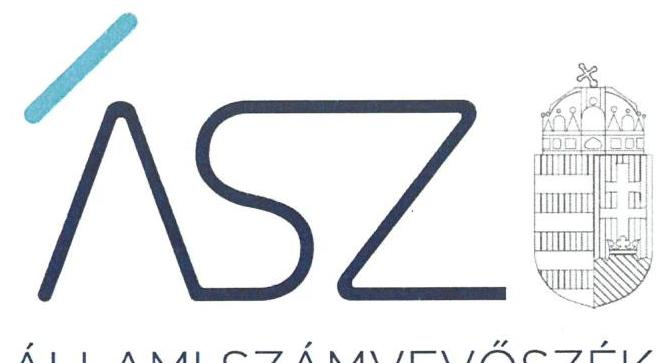
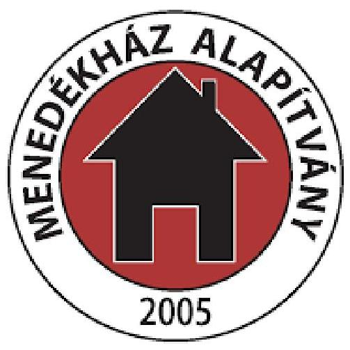

ÁLLAMI SZÁMVEVŐSZÉK

# JELENTÉS 

Nem állami humánszolgáltatók ellenőrzése

A szociális humánszolgáltatást nyújtó intézmények, szolgáltatók államháztartáson kívüli fenntartói központi költségvetésből kapott támogatásai felhasználásának ellenőrzése "MENEDÉKHÁZ" Alapítvány

2020
20161
www.asz.hu

---

ÁLLAMI SZÁMVEVŐSZÉK

# JELENTÉS 

Nem állami humánszolgáltatók ellenőrzése

A szociális humánszolgáltatást nyújtó intézmények, szolgáltatók államháztartáson kívüli fenntartói központi költségvetésből kapott támogatásai felhasználásának ellenőrzése "MENEDÉKHÁZ" Alapítvány
2020. 08 . hó 17. nap

20161
www.asz.hu

---

# AZ ELLENŐRZÉST FELÜGYELTE: 

KAKAS SÁNDOR felügyeleti vezető

## AZ ELLENŐRZÉST VEZETTE ÉS A VÉGREHAJTÁSÁÉRT FELELŐS:

LACZI HEDVIG ANNA ellenőrzésvezető

## A PROGRAM ÖSSZEÁLLÍTÁSÁÉRT FELELŐS:

TÓTPÁL SZABOLCS osztályvezető
FEKETE-NAGY ANDRÁS ellenőrzési program készítéséért felelős projektvezető

IKTATÓSZÁM: EL-2823-001/2020
Jelentéseink az Országgyúlés számítógépes hálózatán és az interneten a www.asz.hu címen is olvashatóak.

TÉMASZÁM: 2491
ELLENŐRZÉS-AZONOSÍTÓ SZÁM: V083518, V0867107

---

# TARTALOMJEGYZÉK 

■ ÖSSZEGZÉS ..... 5
■ AZ ELLENŐRZÉS CÉLJA ..... 6
■ AZ ELLENŐRZÉS TERÜLETE ..... 7
■ AZ ELLENŐRZÉS HÁTTERE, INDOKOLTSÁGA ..... 8
■ A JELENTÉS LÉNYEGES KÉRDÉSKÖREI ..... 9
■ AZ ELLENŐRZÉS HATÓKÖRE ÉS MÓDSZEREI ..... 10
■ MEGÁLLAPÍTÁSOK ..... 12
■ JAVASLATOK ..... 13
■ MELLÉKLETEK ..... 15
I. sz. melléklet: Értelmező szótár ..... 15
■ FÜGGELÉKEK ..... 17
I. sz. függelék a jelentéshez ..... 17
II. sz. függelék: Észrevételek ..... 18
■ RÖVIDÍTÉSEK JEGYZÉKE ..... 21

---

.

---

# ÖSSZEGZÉS 

A budapesti székhelyú "Menedékház" Alapítvány szociális közfeladat ellátáshoz rendelt költségvetési támogatásainak felhasználása, a közpénzekkel való gazdálkodása nem volt átlátható, elszámoltatható. A közpénzekre vonatkozó gazdálkodásával a nyilvánosság előtt nem számolt el.

## Az ellenőrzés társadalmi indokoltsága

A szociális gondoskodást igénylők védelme, illetve a köznevelési feladatok ellátása az Alaptörvényben meghatározott, a társadalom szempontjából fontos tevékenységek. Jogszabályok teszik lehetővé, hogy államháztartáson kívüli szervezetek - így például az egyházi fenntartók, alapítványok, gazdasági társaságok, egyesületek - által fenntartott intézmények is végezzenek köznevelési, szociális és gyermekvédelmi feladatokat. Mindehhez a központi költségvetés évente jelentős összegű támogatással járul hozzá. Az államháztartáson kívüli, humánszolgáltatást végző intézmények az igényelt közpénzekből társadalmilag hasznos, közösségteremtő, közérdekű, illetve közhasznú tevékenységet végeznek, illetve közfeladatokat látnak el.

Az intézményfenntartók ellenőrzésével az Állami Számvevőszék hozzájárul ahhoz, hogy ezen közpénzeket az államháztartáson kívüli szervezetek is ellenőrizhető, átlátható és elszámoltatható módon használják fel a közfeladatok ellátása során. Az ellenőrzések célja továbbá, hogy a nyilvánosság és az igénybevevők megfelelő tájékoztatást kapjanak az államháztartáson kívüli közfeladatot ellátók múködéséről.

Az ÁSZ ellenőrzései arra adnak választ, hogy az intézményfenntartók arra használták-e fel a közpénzeket, amire igényelték.

A szabályszerű gazdálkodás elengedhetetlen a közfeladat ellátás szakmai céljainak megvalósításához, valamint a társadalmi közbizalom fenntartásához.

## Főbb megállapítások, következtetések, javaslatok

A budapesti székhelyű "Menedékház" Alapítvány 2015-2018. évekre vonatkozóan nem alakított ki szabályszerű gazdálkodási környezetet, mivel a számviteli törvényben megfogalmazott szabályzatokkal nem rendelkezett, ezáltal nem teremtette meg a költségvetési támogatások elszámoltatható, átlátható felhasználásának szabályozási kereteit.

A "Menedékház" Alapítvány a 2015-2018. évre vonatkozóan a jogszabályi előírások ellenére beszámoló készítési kötelezettségének nem tett eleget.

A "Menedékház" Alapítvány mindezek alapján az Alaptörvény ${ }^{1}$ 39. cikk (2) bekezdésében foglaltak ellenére a felhasznált közpénzekre vonatkozó gazdálkodása elszámoltathatóságát, átláthatóságát nem biztosította, ezáltal nem igazolt, hogy a közpénzeket a közfeladatot ellátó intézményeire fordította.

Az Állami Számvevőszék az intézkedések megtétele céljából a "Menedékház" Alapítvány kuratóriumi elnöke részére egy javaslatot fogalmazott meg.

---

# AZ ELLENŐRZÉS CÉLJA

**AZ ELLENŐRZÉS CÉLJA** annak értékelése volt, hogy a nem állami, nem önkormányzati szociális intézmények fenntartói központi költségvetésből kapott támogatásainak felhasználása szabályszerű volt-e.

---

# AZ ELLENŐRZÉS TERÜLETE 

## "Menedékház" Alapítvány

A "Menedékház" Alapítványt 2005-ben hozta létre egy magánszemély 300000 Ft alapító vagyonnal. A "Menedékház" Alapítványt a szociális közfeladat ellátása keretében a Szoc.tv. ${ }^{2}$. szerinti - családok támogatása, családok átmeneti otthona, hajléktalanná vált személyek ellátása, hajléktalanok éjjeli menedékhelye - segítségnyújtást végezte a rászorulók felé három, önálló jogi személyiséggel nem rendelkező, intézmény ${ }^{3}$ útján.

A "Menedékház" Alapítvány ügyvezető szerve az öt tagból álló Kuratórium ${ }^{4}$. Az intézményeit az SzCsM ${ }^{5}$ rendeletben foglaltak szerint a Kormányhivatal ${ }^{6}$ nyilvántartásba vette, valamint az Sznyvhr. ${ }^{7}$-ben meghatározott tanúsítvánnyal rendelkeztek.

A "Menedékház" Alapítványnak a Magyar Államkincstár az intézményei szociális feladatellátásra 2015. évben 108,6 M Ft, 2016. évben 129,9 M Ft, 2017. évben 159,8 M Ft, 2018. évben 164,8 M Ft költségvetési támogatást utalt ki.

---

# AZ ELLENŐRZÉS HÁTTERE, INDOKOLTSÁGA 

A szociális feladatokat ellátó nem állami intézményfenntartók részére közfeladataik ellátására évente jelentős összegű pénzügyi támogatást biztosítottak a mindenkori költségvetési törvények a bennük megfogalmazott feltételek mellett. A felhasználható állami támogatások a Kvtv.1-4-ekben a 2015-2018. években a szociális ágazatra vonatkozóan 360 Mrd Ft előirányzatot határoztak meg.

Az ÁSZ ${ }^{8}$ a stratégiájában célul tűzte ki, hogy az államháztartáson kívülre nyújtott költségvetési támogatások ellenőrzésével hozzájárul ahhoz, hogy a közpénzeket az államháztartáson kívüli szervezetek is átlátható módon használják fel a közfeladatok szerződésben vállalt ellátása érdekében. Az ÁSZ a stratégiájában foglaltak alapján is indokolt az ellenőrzés, amely a társadalom számára jelzi, hogy a közpénz államháztartáson kívüli felhasználása sem maradhat ellenőrizetlenül. Az államháztartáson kívülre nyújtott költségvetési támogatások ellenőrzésével az ÁSZ hozzájárul ahhoz, hogy a közpénzeket a nem állami fenntartók átlátható módon használják fel a közfeladatok ellátására kötött szerződésekben vállalt kötelezettségek teljesítése érdekében. Az ÁSZ az ellenőrzés javaslataival hozzájárulhat az említett rendszerek szabályszerű támogatás-felhasználásához, javíthatja a társa-dalmi-gazdasági döntések megalapozottságát, amely a „jól irányított állam múködésének" feltétele.

---

# A JELENTÉS LÉNYEGES KÉRDÉSKÖREI 

1. A szociális humánszolgáltató közfeladatot ellátó államháztartáson kívüli fenntartó szabályszerű müködési - és gazdálkodási környezet kialakításával megteremtette-e a költségvetési támogatások átlátható, elszámoltatható igénybevételének, felhasználásának feltételeit?
2. Az államháztartáson kívüli fenntartó az átvállalt szociális humánszolgáltatási közfeladathoz biztositott költségvetési támogatásokat szabályszerűen fordította-e a humánszolgáltató intézményei müködtetésére? Az intézményei müködtetéséhez felhasznált közpénzekre vonatkozó gazdálkodásával elszámolt-e?

---

# AZ ELLENŐRZÉS HATÓKÖRE ÉS MÓDSZEREI 

## Az ellenőrzés típusa

Megfelelőségi ellenőrzés.

## Az ellenőrzött időszak

A 2015. január 1-je és 2018. december 31-e közötti időszak.

## Az ellenőrzés tárgya

Az ellenőrzés a szociális humánszolgáltatási közfeladatokat ellátó államháztartáson kívüli fenntartók, humánszolgáltatási közfeladatai ellátásához a központi költségvetésből kapott támogatásaik humánszolgáltatási közfeladatokra való fenntartó általi felhasználása szabályszerűségének értékelésére terjed ki.

## Az ellenőrzött szervezet

"Menedékház" Alapítvány

## Az ellenőrzés jogalapja

Az ellenőrzés jogszabályi alapját az ÁSZ tv ${ }^{10}$. 1. § (3) bekezdése, 5. § (3) bekezdésben foglalt előírások adják.

## Az ellenőrzés módszerei

Az ellenőrzést az ellenőrzési program annak szempontjai, kérdései, az ellenőrzött időszakban hatályos jogszabályok, a nemzetközi standardokat irányadónak tekintve, az ellenőrzés szakmai szabályok és módszertanok figyelembe vételével rendelte elvégezni. A közpénzekkel való felelős gazdálkodás segítésére irányuló javaslatok kidolgozásakor a hatályos jogszabályok voltak az irányadóak.

Az ellenőrzés ideje alatt az ellenőrzött szervezettel történő kapcsolattartást az ÁSZ SZMSZ ${ }^{11}$-ének vonatkozó előírásai alapján biztosította az ÁSZ.

---

Az ellenőrzési kérdések megválaszolásához szükséges bizonyítékok megszerzése az ellenőrzött által rendelkezésre bocsátott dokumentumokra, adatokra alapozva megfigyelés, szemle (szemrevételezés), kérdésfeltevés (információkérés), valamint elemző eljárással történt.

Az ellenőrzési bizonyítékként felhasználható adatforrások közé tartoztak egyrészt az ellenőrzési program részletes szempontjainál felsorolt adatforrások, másrészt minden - az ellenőrzés folyamán feltárt, az ellenőrzés szempontjából információt tartalmazó - dokumentum.

Az ellenőrzés lefolytatásához az ellenőrzött szervezet a kitöltött tanúsítványok, valamint az ÁSZ által kért dokumentumok elektronikus úton való megküldésével szolgáltatott adatokat, információkat. Az így rendelkezésre bocsátott adatok, információk és a tanúsítványok adatai valódiságának kontrollja az ellenőrzés keretében történt.

Az egységes értelmezést az ellenőrzési program mellékletét képező fogalomtár és rövidítésjegyzék támogatta.

Az ellenőrzést az ÁSZ alapvetően a szociális humánszolgáltatások esetében a központi költségvetési támogatások igénylésével, módosításával, felhasználásával, elszámolásával kapcsolatos feladatokat ellátó államháztartáson kívüli fenntartóknál/szervezeteinél végezte az ÁSZ.

A szociális humánszolgáltatások központi költségvetési támogatásaival kapcsolatos, államháztartáson kívüli fenntartó jogszabályokban előírt feladatai betartását, továbbá a központi költségvetési támogatások szabályszerű nyilvántartását ellenőrizte az ÁSZ a fenntartónál rendelkezésre álló nyilvántartások, beszámolók és egyéb dokumentumok alapján. Az ellenőrzés nem terjedt ki a szociális humánszolgáltatások központi költségvetési támogatásai igénylése, módosítása, elszámolása valódiságának, megalapozottságának, helyességének - sem a fenntartónál, sem a székhely intézményeinél való - értékelésére (mivel ennek felülvizsgálata, ellenőrzése a finanszírozó jogszabályban előírt feladata, határozatai kiadása előtt). Továbbá nem terjedt ki az ellenőrzés e források, intézmények általi szabályszerű felhasználásának értékelésére.

---

# MEGÁLLAPÍTÁSOK 

## 1. A szociális humánszolgáltató közfeladatot ellátó államháztartáson kívüli fenntartó szabályszerű múködési - és gazdálkodási környezet kialakításával megteremtette-e a költségvetési támogatások átlátható, elszámoltatható igénybevételének, felhasználásának feltételeit?

Összegző megállapítás

A Fenntartó a 2015-2018. években a szabályszerű gazdálkodási környezetet nem alakította ki, ezáltal nem teremtette meg a költségvetési támogatások átlátható és elszámoltatható felhasználásának szabályozási feltételeit.

A Fenntartó ${ }^{12}$ 2015-2017. években a Számv. tv. ${ }^{13}$ 14. § (3) bekezdésében foglaltak ellenére nem rendelkezett Számviteli Politikával. A Fenntartó a számviteli politikáját a Számv. tv.14. § (3) bekezdésében előírtak ellenére nem az adottságainak, gazdálkodási körülményeinek, sajátosságainak leginkább megfelelő módon alakította ki 2018. évre, mert abban nem határozta meg, hogy a költségvetési támogatások feladatonkénti bontására milyen elvet, módszert, illetve szabályozást alkalmaz.

A Fenntartó 2015-2018. évekre vonatkozóan - az egységes számlakeret előírásainak figyelembe vételével - nem készített a Számv. tv. 161. §ban előírtak szerinti számlarendet, mivel az a könyvvezetésre, a bizonylatolásra vonatkozó részletes belső szabályokat a beszámoló adatainak közvetlen alátámasztására alkalmas módon nem tartalmazta.

## 2. Az államháztartáson kívüli fenntartó az átvállalt szociális humánszolgáltatási közfeladathoz biztosított költségvetési támogatásokat szabályszerűen fordította-e a humánszolgáltató intézményei múködtetésére? Az intézményei múködtetéséhez felhasznált közpénzekre vonatkozó gazdálkodásával elszámolt-e?

Összegző megállapítás

A Fenntartó a 2015-2018. években a közpénzekre vonatkozó gazdálkodásával nem számolt el, ezért nem igazolt, hogy a szociális közfeladat ellátásához biztosított költségvetési támogatásokat az intézményei múködtetésére fordította.

A Fenntartó a Civil tv. ${ }^{14}$ 28. § (1) bekezdésében és a Számv. tv. 4. § (1) bekezdésében meghatározattak ellenére a 2015-2018. évi beszámoló készítési kötelezettségének nem tett eleget.

---

# JAVASLATOK 

Az ÁSZ tv. 33. § (1) bekezdésében foglaltak értelmében az ellenőrzött szervezet vezetője köteles a jelentésben foglalt megállapításokhoz kapcsolódó intézkedési tervet összeállítani és azt a jelentés kézhezvételétől számított 30 napon belül az ÁSZ részére megküldeni. Amennyiben az ellenőrzött szervezet vezetője nem küldi meg határidőben az intézkedési tervet, vagy továbbra sem elfogadható intézkedési tervet küld, az Állami Számvevőszék elnöke az ÁSZ tv. 33. § (3) bekezdése a) és b) pontjaiban foglaltakat érvényesítheti.

## a "Menedékház" Alapítvány kuratóriumi elnökének

1. Tegyen eleget a jövőben a beszámoló készitési kötelezettségének jogszabályi elöirás szerint.
(2. megállapítás 1. bekezdése alapján)

---

.

---

# MELLÉKLETEK 

- I. SZ. MELLÉKLET: ÉRTELMEZŐ SZÓTÁR
befogadás
civil szervezet
ellátási terület
feladatfinanszírozás
humánszolgáltatás
költségvetési támogatás
nem állami, nem önkormányzati (államháztartáson kívüli) intézmény fenntartó
székhely intézmény
telephely

A Szoctv. illetve a Gyvt. szerinti, a szociális szolgáltatások és a gyermekjóléti szolgáltató tevékenységek területi lefedettségét figyelembe vevő finanszírozási rendszerbe történő befogadás.
A Civil tv*. 2. § 6. pontja szerint civil szervezet a civil társaság, a Magyarországon nyilvántartásba vett egyesület (a párt, a szakszervezet és a kölcsönös biztosító egyesület kivételével), a közalapítvány és a pártalapítvány kivételével az alapítvány.
Az a terület, ahonnan az engedélyes gyermekeket, illetve más ellátottakat fogad.
A közfeladat államháztartáson kívüli szervezet által történő ellátásához közvetlenül kapcsolódó, arányos müködési költségeket finanszírozó költségvetési támogatás.
Külön törvényben meghatározott szociális, gyermekjóléti, gyermekvédelmi, közoktatási, felsőoktatási, kulturális közfeladatok (2014. évi Kvtv. 34. § (1), (4) bekezdés, 1. számú melléklet XX/20/2. alcím, 19. alcím, 2015. évi Kvtv. ${ }^{15}$ 43. § (1), (4) bekezdés, 1. számú melléklet XX/20/2/3. jogcím csoport, 19. alcím, 2016. évi Kvtv. 41. § (1), (4) bekezdés, 1. számú melléklet XX/20/2/3. jogcím csoport, 19. alcím).
a társadalombiztosítás pénzügyi alapjai kivételével az államháztartás központi alrendszeréből ellenérték nélkül, pénzben nyújtott támogatások (Áht. ${ }^{16}$ 1. § 14. pont)
A költségvetési törvényekben (2013. évi CCXXX. törvény 33-34. §, 2014. évi C. törvény 42-43. §, 2015. évi C. törvény 40-41. §) megállapított támogatás. Például a 2015. évi C. törvény 40-41. § szerint többek között: Az Országgyűlés a szociális, gyermekjóléti, gyermekvédelmi közfeladatot ellátó intézményt, szolgáltatást fenntartó egyházi jogi személy, civil szervezet, közalapítvány, országos nemzetiségi önkormányzat, települési vagy területi nemzetiségi önkormányzat, gazdasági társaság, és a humánszolgáltatást alaptevékenységként végző, az Szja tv. hatálya alá tartozó egyéni vállalkozó (a továbbiakban együtt: nem állami szociális fenntartó) részére támogatást állapít meg a következők szerint: a támogatás a nem állami szociális fenntartót a települési önkormányzatok 2. melléklet III. pont 3. alpont c)-k) pontjában és III. pont 5. alpont a) pontjában meghatározott támogatásaival azonos jogcímeken, összegben és feltételek mellett illeti meg.
A szociális, gyermekjóléti és gyermekvédelmi közfeladatokat/humánszolgáltatásokat ellátó intézményt fenntartó egyházi jogi személy, társadalmi szervezet, alapítvány, közalapítvány, civil szervezet, országos nemzetiségi önkormányzat, nonprofit gazdasági társaság, gazdasági társaság és a humánszolgáltatást alaptevékenységként végző, Szja tv. hatálya alá tartozó egyéni vállalkozó. (2015. évi Kvtv. 42. §, 43. § (1), (4) bekezdés, 2016. évi Kvtv. ${ }^{17} 40 . \S, 41 . \S$ (1), (4) bekezdés, 2017. évi Kvtv. ${ }^{18} 41 . \S$ (1), (4)),
a szolgáltató székhelye, azaz a szolgáltató központi ügyintézésének helye, függetlenül attól, hogy használják-e szolgáltatás nyújtására (Sznyvhr ${ }^{19}$. 1.§ k) pont) (hatályos: 2013. december 1-től)
a szolgáltató székhelyétől különböző, szolgáltató/intézmény használatában álló hely, a szociális humánszolgáltatáshoz használt, bejegyzett hely. (Sznyvhr. 1.§ I) pont) (hatályos: 2015. január 1-től)

Előzmény törvények, amelyeket az ellenőrzött időszak miatt figyelembe kell venni: egyesülési jogról szóló 1989. évi II. tv, a közhasznú szervezetekről szóló 1997. évi CLVI. tv.

---

.

---

# FÜGGELÉKEK 

- I. SZ. FÜGGELÉK A JELENTÉSHEZ

Az Állami Számvevőszék az ellenőrzések során feltárt tényekhez kapcsolódó további körülmények tisztázására eszközrendszerrel nem rendelkezik. Amennyiben az ellenőrzésen túlmutatóan indokoltnak látszik az ellenőrzés során feltárt körülmények további vizsgálata, az Állami Számvevőszék törvényi felhatalmazás alapján az ellenőrzés által feltárt körülményeket továbbítja a hatáskörrel rendelkező szervnek a szükséges intézkedések megtétele, eljárások lefolytatása érdekében.
A "Menedékház" Alapítvány (továbbiakban: Fenntartó) részére szociális közfeladat ellátásra a Magyar Államkincstár által biztositott költségvetési támogatások összege 2015. évben 108,6 M Ft, 2016. évben 129,9 M Ft, 2017. évben 159,8 M Ft, 2018. évben pedig 164,8 M Ft volt.

A Fenntartó 2015-2018. években a Civil tv. 28.§ (1) bekezdésében és a Számv.tv. 4.§ (1) bekezdésében előirt éves beszámoló készitési kötelezettségének - figyelemmel a Számv. tv. 20. § (6) bekezdésében, valamint a számviteli törvény szerinti egyes egyéb szervezetek beszámolókészitési és könyvvezetési kötelezettségének sajátosságairól szóló 224/2000. (XII. 19.) Korm. rendelet 6. § (1) bekezdésében és a számviteli törvény szerinti egyes egyéb szervezetek beszámoló készitési és könyvvezetési kötelezettségének sajátosságairól szóló 479/2016. (XII. 28.) Korm. rendelet 7. § (1) bekezdésében foglaltakra - nem tett eleget.
Ennek hiányában a müködéséről, vagyoni, pénzügyi és jövedelmi helyzetéről a Számv.tv. előírásai szerinti megbízható, valós összképet és a közfeladatokra kapott költségvetési támogatások elszámolásának hitelességét nem biztositotta. A beszámolóként közzétett adatai nem megbizhatóak.
Az eset konkrét körülményeinek feltárására az illetékes törvényszék rendelkezik hatáskörrel.

---

A jelentéstervezetet a Számvevőszék 15 napos észrevételezésre megküldte az ellenőrzött szervezetek vezetőinek az ÁSZ tv. 29. §̊ (1) bekezdése előírásának megfelelően.

# A "MENEDÉKHÁZ" Alapítvány" kuratóriumi elnöke a jelentéstervezet megállapításaira észrevételt tett. 

Az ÁSZ tv. 29. § (3) bekezdésével összhangban az Állami Számvevőszék a Függelékben feltünteti az ellenőrzés megállapításaival kapcsolatban tett, figyelembe nem vett észrevételeket, és megindokolja, hogy azokat miért nem fogadta el.

## A "MENEDÉKHÁZ" Alapítvány" (továbbiakban: Fenntartó) kuratóriumi elnöke által a 2020. június 22-én kelt levélben tett észrevételek és azok kezelésének indokolása:

## 1. A jelentéstervezet 1. számú összegző megállapítására vonatkozó észrevétellel kapcsolatban

A Fenntartó kuratóriumi elnöke észrevételében a Fenntartó részére a 2015-2018. években folyósított normatív állami támogatás felhasználásának Magyar Államkincstár által történt ellenőrzéseire hivatkozik. Álláspontja szerint a Fenntartó minden év januárjában elszámol Magyar Államkincstárnak az előző évben folyósított támogatással, a Magyar Államkincstár pedig minden évben ellenőrzés keretében meggyőződik az állami - költségvetési - források szabályszerű felhasználásáról. A Fenntartó kuratóriumi elnöke továbbá arról nyújtott tájékoztatást, hogy az Állami Számvevőszék (továbbiakban: ÁSZ) 2018 év végén megkezdett vizsgálata ráirányította a Fenntartó kuratóriumának a figyelmét a számviteli törvény változásaira és ezért 2018 évben új Számviteli politikát - annak keretében Leltározási Szabályzatot, Pénzkezelési Szabályzatot és Értékelési Szabályzatot, valamint Számlarendet - fogadott el, melynek hatályba lépése 2019. január 1. volt. Az új Számviteli politikában a Fenntartó az adottságainak leginkább megfelelő rendszer kialakítását tűzte ki célul maga elé. Ennek megfelelően a Fenntartó a bevételeket és kiadásokat az intézményei között a kapott normatív támogatás arányában osztja fel. A Fenntartó 2019 évi könyvvezetését már a fenti szabályzatok figyelembe vételével végezte.
A Fenntartó kuratóriumi elnökének észrevételére válaszolva tájékoztatást adtunk, hogy a jelentéstervezet 1. számú összegző megállapítását a Fenntartó 2015-2018. évek gazdálkodási környezetét (szabályozottságát) illetően a Fenntartó számviteli politikájára és számla rendjére vonatkozó megállapításai alapján teszi, amelyeket a kuratóriumi elnök észrevételében nem vitat. Észrevételében tájékoztatta az ÁSZ-t, hogy az ellenőrzés ráirányította a figyelmet a számviteli politika és a számlarend Fenntartó adottságainak leginkább megfelelő átalakításának szükségességére, ami 2019. január 1-i hatállyal megtörtént.

[^0]
[^0]:    * 29. § (1) Az Állami Számvevőszék az ellenőrzési megállapításait megküldi az ellenőrzött szervezet vezetőjének vagy az általa megbízott személynek, és annak, akinek személyes felelősségét állapította meg.
    (2) Az ellenőrzött szervezet vezetője és a felelősként megjelölt személy az ellenőrzés megállapításaira tizenöt napon belül írásban észrevételt tehet.
    (3) Az Állami Számvevőszék az észrevételre a beérkezésétől számított harminc napon belül írásban válaszol. A figyelembe nem vett észrevételeket köteles a jelentésben feltüntetni, és megindokolni, hogy azokat miért nem fogadta el.

---

Az ÁSZ ellenőrzési megállapításait az egyéb ellenőrzést végző szervek ellenőrzési megállapításaitól függetlenül, kizárólag az ÁSZ tv. 28. § (2) bekezdésben meghatározott adatszolgáltatási időszakon belül megküldött, teljességi és hitelességi nyilatkozattal alátámasztott dokumentumokra alapozva teszi. A Fenntartó kuratóriumi elnöke nyilatkozott az adatszolgáltatás során arról, hogy az ÁSZ részére átadott dokumentumok, adatok megbízhatóak, és a bekért adatokra, dokumentumokra vonatkozóan teljes körű információt tartalmaznak.

A fent leírtakra tekintettel az észrevételt nem fogadtuk el, a jelentéstervezet megállapításai helytállóak voltak, így módosításuk nem volt indokolt.

# 2. A jelentéstervezet 2. számú összegző megállapítására és a javaslatára vonatkozó észrevétellel kapcsolatban 

A Fenntartó kuratóriumi elnöke észrevételében jelezte, hogy a Fenntartó kettős könyvvitelt vezető egyéb szervezetnek minősül, melynek Számviteli politikája rögzíti, hogy a Civil törvény mellékletében is szereplő közhasznúsági beszámoló készítésével tesz eleget beszámoló készítési kötelezettségének, az így elkészített beszámolóját letétbe helyezi a Fővárosi Bíróságon. A Fenntartó kuratóriumi elnöke észrevételében közli, hogy a Fenntartó beszámoló készítési és letétbe helyezési kötelezettségének minden évben szabályszerűen eleget tett, a Fővárosi Bíróság a Fenntartó beszámolójával kapcsolatban semmiféle kifogással nem élt. A Magyar Államkincstár is minden évben meggyőződött arról, hogy a Fenntartó eleget tett a beszámoló készítési és leadási kötelezettségének.

A Fenntartó kuratóriumi elnökének észrevételére válaszolva tájékoztatást adtunk, hogy az ÁSZ EL-1120-001/2018. és EL-1120-033/2019. iktatószámú leveleinek 2. számú mellékleteiben foglaltak szerint bekérte a Fenntartó képviseletre jogosult személy által aláírt 2015-2018. évekre vonatkozó számviteli beszámolóit. A Fenntartó kuratóriumi elnöke 2018. szeptember 21-én és 2019. október 17-én kelt nyilatkozatai szerint a kért dokumentumokat az ellenőrzés rendelkezésére bocsátotta.

Az ellenőrzés rendelkezésére bocsátott dokumentumok ismételt felülvizsgálata alapján megállapítottuk, hogy azok részét képező mérlegeket, eredménykimutatásokat és kiegészítő mellékleteket a Fenntartó képviseletére jogosult személy nem írta alá a Számv. tv. 20. § (6) bekezdés előírása ellenére. A Fenntartó képviseletére jogosult személy aláírásának hiányában a Fenntartó nem készítette el 2015-2018. évekre vonatkozó számviteli beszámolóit a Számv. tv. 4. § (1) bekezdés előírása ellenére.

Az ÁSZ ellenőrzési megállapításait az egyéb ellenőrzést végző szervek ellenőrzési megállapításaitól függetlenül, kizárólag az ÁSZ tv. 28. § (2) bekezdésben meghatározott adatszolgáltatási időszakon belül megküldött, teljességi és hitelességi nyilatkozattal alátámasztott dokumentumokra alapozva teszi. A Fenntartó kuratóriumi elnöke nyilatkozott az adatszolgáltatás során arról, hogy az ÁSZ részére átadott dokumentumok, adatok megbízhatóak, és a bekért adatokra, dokumentumokra vonatkozóan teljes körű információt tartalmaznak. Az ÁSZ az adatszolgáltatásra nyitva álló törvényes határidőn túl beküldött dokumentumokat, így az észrevételéhez mellékelt dokumentumokat nem értékeli.

A fent leírtakra tekintettel az észrevételt nem fogadtuk el, a jelentéstervezet megállapítása helytálló volt, így a jelentéstervezet módosítása nem volt indokolt.

---

.

---

# RÖVIDÍTÉSEK JEGYZÉKE 

${ }^{1}$ Alaptörvény
${ }^{2}$ Szoc.tv.
${ }^{3}$ intézmény
${ }^{4}$ Kuratórium
${ }^{5}$ SzCsM. rendelet
${ }^{6}$ Kormányhivatal
${ }^{7}$ Sznyvhr.
${ }^{8} \mathrm{Kvtv} .{ }_{1-4}$
${ }^{9}$ ÁSZ
${ }^{10}$ ÁSZ tv.
${ }^{11}$ ÁSZ SZMSZ
${ }^{12}$ Fenntartó
${ }^{13}$ Számv. tv.
${ }^{14}$ Civil. tv.
${ }^{15}$ 2015. évi Kvtv.
${ }^{16}$ Áht.
${ }^{17}$ 2016. évi Kvtv.
${ }^{18}$ 2017. évi Kvtv.
${ }^{19}$ Sznyvhr.

Magyarország Alaptörvénye
1993. évi III. törvény a szociális igazgatásról és szociális ellátásokról
"Menedékház" Alapítvány Intézményei:
"Menedékház" Alapítvány Családok Átmeneti Otthona I. (CSÁO I.)1112 Budapest, Muskétás u.1.,
Családok Átmeneti Otthona II. (CSÁO II.)1112 Budapest, Muskétás u.1., Nappali Melegedő és Éjszakai Menedékhely (NÉM) 1112 Budapest, Muskétás u.1.
"Menedékház" Alapítvány Kuratóriuma
1/2000. (I. 7.) SzCsM rendelet a személyes gondoskodást nyújtó szociális intézmények szakmai feladatairól és múködésük feltételeiről
Fővárosi Kormányhivatal
369/2013. (X. 24.) Korm. rendelet a szociális, gyermekjóléti és gyermekvédelmi szolgáltatók, intézmények és hálózatok hatósági nyilvántartásáról és ellenőrzéséről
Kvtv.1: Magyarország 2015. évi központi költségvetéséről szóló 2014. évi C. törvény (hatályos: 2015. január 1-jétől 2018. december 31-éig)
Kvtv.2: Magyarország 2016. évi központi költségvetéséről szóló 2015. évi C. törvény (hatályos: 2015. július 4-étől)
Kvtv.3: Magyarország 2017. évi központi költségvetéséről szóló 2016. évi XC. törvény (hatályos: 2016. november 1-jétől)
Kvtv.4: Magyarország 2018. évi központi költségvetéséről szóló 2017. évi C. törvény (hatályos: 2017. november 1-jétől)
Állami Számvevőszék
2011. évi LXVI. törvény az Állami Számvevőszékről

Az Állami Számvevőszék elnökének 3/2019. (XII. 23.) ÁSZ utasítása az Állami Számvevőszék Szervezeti és Müködési Szabályzatáról (hatályos: 2020. január 1-jétől)
"Menedékház" Alapítvány
2000. évi C. törvény a számvitelről
2011. évi CLXXV törvény az egyesülési jogról, valamint a civil szervezetek müködéséről és támogatásáról
2014. évi C. törvény Magyarország 2015. évi központi költségvetéséről 2011. évi CXCV. törvény az államháztartásról
2015. évi C. törvény Magyarország 2016. évi központi költségvetéséről 2016. évi XC. törvény Magyarország 2017. évi központi költségvetéséről 369/2013. (X. 24.) Korm. rendelet a szociális, gyermekjóléti és gyermekvédelmi szolgáltatók, intézmények és hálózatok hatósági nyilvántartásáról és ellenőrzéséről

---

# ASZ 

ALLAMI SZAMVEVOSZEK
1052 Budapest, Apáczai Cs. J. u. 10. I 1364 Budapest 4. Pf. 54 TEL: +36 14849100
email: szamvevoszek@asz.hu
web: www.asz.hu | www.aszhirportal.hu