ÁLLAMI SZÁMVEVŐSZÉK

# JELENTÉS 

## Nem állami humánszolgáltatók ellenőrzése

A köznevelési humánszolgáltatást nyújtó intézmények, szolgáltatók államháztartáson kívüli fenntartói központi költségvetésből kapott támogatásai felhasználásának ellenőrzése -

DUETT Művészetoktatási Nonprofit Közhasznú Korlátolt Felelősségű Társaság
2020.

20163
www.asz.hu

---

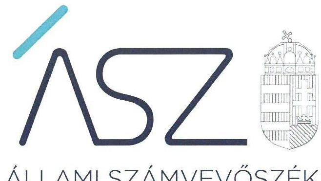

ÁLLAMI SZÁMVEVŐSZÉK

# JELENTÉS

## Nem állami humánszolgáltatók ellenőrzése

A köznevelési humánszolgáltatást nyújtó intézmények, szolgáltatók államháztartáson kívüli fenntartói központi költségvetésből kapott támogatásai felhasználásának ellenőrzése – DUETT Művészetoktatási Nonprofit Közhasznú Korlátolt Felelősségű Társaság

2020. 08. hó 23. nap

20163
www.asz.hu

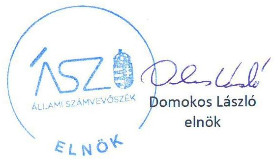

---

# AZ ELLENŐRZÉST FELÜGYELTE: 

MAKKAI MÁRIA felügyeleti vezető

## AZ ELLENŐRZÉST VEZETTE ÉS A VÉGREHAJTÁSÁÉRT FELELŐS:

KISTÓTH KRISZTINA ellenőrzésvezető

## A PROGRAM ÖSSZEÁLLÍTÁSÁÉRT FELELŐS:

FEKETE-NAGY ANDRÁS GÁBOR projekt vezető

IKTATÓSZÁM: EL-2827-001/2020
TÉMASZÁM: 2523
ELLENŐRZÉS-AZONOSÍTÓ SZÁM: V-086708

Jelentéseink az Országgyúlés számítógépes hálózatán és az interneten a www.asz.hu címen is olvashatóak.

---

# TARTALOMJEGYZÉK 

■ ÖSSZEGZÉS ..... 5
■ AZ ELLENŐRZÉS CÉLJA ..... 6
■ AZ ELLENŐRZÉS TERÜLETE ..... 7
■ AZ ELLENŐRZÉS HÁTTERE, INDOKOLTSÁGA ..... 8
■ A JELENTÉS LÉNYEGES KÉRDÉSKÖRE ..... 9
■ AZ ELLENŐRZÉS HATÓKÖRE ÉS MÓDSZEREI ..... 10
■ MEGÁLLAPÍTÁSOK ..... 12
■ MELLÉKLETEK ..... 13
I. sz. melléklet: Értelmező szótár ..... 13
■ FÜGGELÉK: ÉSZREVÉTELEK ..... 15
■ RÖVIDÍTÉSEK JEGYZÉKE ..... 25

---

.

---

# ÖSSZEGZÉS 

A mezőkövesdi székhelyű DUETT Művészetoktatási Nonprofit Közhasznú Kft. a 2016-2018. években a köznevelési feladatok ellátására kapott központi költségvetési támogatást az intézménye részére nem adta át, a közpénzek átláthatóságát és elszámoltathatóságát nem biztosította.

## Az ellenőrzés társadalmi indokoltsága

A köznevelési feladatok ellátása az Alaptörvényben meghatározott, a társadalom szempontjából fontos tevékenységek. Jogszabályok teszik lehetővé, hogy államháztartáson kívüli szervezetek - így például az egyházi fenntartók, alapítványok, gazdasági társaságok, egyesületek - által fenntartott intézmények is végezzenek köznevelési, szociális és gyermekvédelmi feladatokat. Mindehhez a központi költségvetés évente jelentős összegű támogatással járul hozzá. Az államháztartáson kívüli, humánszolgáltatást végző intézmények az igényelt közpénzekből társadalmilag hasznos, közösségteremtő, közérdekű, illetve közhasznú tevékenységet végeznek, illetve közfeladatokat látnak el.

Az intézményfenntartók ellenőrzésével az Állami Számvevőszék hozzájárul ahhoz, hogy ezen közpénzeket az államháztartáson kívüli szervezetek is ellenőrizhető, átlátható és elszámoltatható módon használják fel a közfeladatok ellátása során. Az ellenőrzések célja továbbá, hogy a nyilvánosság és az igénybevevők megfelelő tájékoztatást kapjanak az államháztartáson kívüli közfeladatot ellátók működéséről.

Az ÁSZ ellenőrzései arra adnak választ, hogy az intézményfenntartók arra használták-e fel a közpénzeket, amire igényelték.

A szabályszerű gazdálkodás elengedhetetlen a közfeladat ellátás szakmai céljainak megvalósításához, valamint a társadalmi közbizalom fenntartásához.

## Főbb megállapítások, következtetések

A DUETT Művészetoktatási Nonprofit Közhasznú Korlátolt Felelősségű Társaság, mint Fenntartó ${ }^{1}$ alapfokú művészetoktatási feladatát önálló jogi személyiséggel rendelkező intézményén keresztül látta el.

A Fenntartó Számv. tv. ${ }^{2}$ 161. § (1) bekezdésben előírtak ellenére számlarenddel nem rendelkezett. Számlarend hiányában a Fenntartó a beszámoló adatainak közvetlen alátámasztására alkalmas, a könyvvezetésre, a bizonylatolásra vonatkozó részletes belső szabályait a Számv. tv. 161/A. § (1) bekezdése ellenére nem alakította ki. A számlarend hiányában a Fenntartó nem biztosította a beszámolói megbízhatóságát, annak szabályszerű könyvvezetéssel történő alátámasztását.

A közfeladat ellátáshoz kapott költségvetési támogatást a Fenntartó a központi költségvetésről szóló törvények ${ }^{3}$ 7. melléklet VI. 2 pontjában foglaltak ellenére az intézménye részére nem adta át.

A Fenntartó mindezek alapján a 2016-2018. években nem biztosította az Alaptörvény 39. cikk (2) bekezdésében foglaltak ellenére a felhasznált közpénzekre vonatkozó gazdálkodása átláthatóságát. Ezáltal a Fenntartó nem igazolta, hogy a közpénzt a köznevelési közfeladat ellátására fordította.

---

# AZ ELLENŐRZÉS CÉLJA 

Az ellenőrzés célja annak értékelése volt, hogy a nem állami, nem önkormányzati köznevelési intézmények fenntartói központi költségvetésből kapott támogatásainak felhasználása szabályszerű volt-e.

---

### **DUETT Művészetoktatási Nonprofit Közhasznú Korlátolt Felelősségű Társaság**

A Mezőkövesd székhelyű DUETT Művészetoktatási Nonprofit Közhasznú Korlátolt Felelősségű Társaság 2009. március 23-án alakult 3 M Ft törzstőkével, ami az ellenőrzött időszak végéig nem változott. Alapítója négy magánszemély volt, akik tulajdonrészüket az ellenőrzött időszakban megőrizték.

A Fenntartó ügyvezetését az ellenőrzött időszakban az egyik alapító végezte, tevékenységét három tagú felügyelő bizottság ellenőrizte.

A Fenntartó fő tevékenysége az alapfokú oktatás volt, tevékenysége közhasznúnak minősült, vállalkozási tevékenységet nem folytatott. Költségvetési támogatásban a Fenntartó alapfokú művészetoktatás keretében a pedagógusok és a pedagógusok munkáját segítők átlagbér alapú támogatása jogcímen részesült. Az ellenőrzött időszakban a Magyar Államkincstártól kapott támogatás összegét az 1. táblázat tartalmazza.

Fenntartó feladatait intézménye, a Tiszabábolna székhelyű Líra Zeneiskola Alapfokú Művészeti Iskola útján látta el. Az Intézmény ${ }^{4}$ a székhelyén, valamint Borsod-Abaúj-Zemplén, Heves és Bács-Kiskun megyei 21 telephelyén a klasszikus zenére, népzenére és az elektroakkusztikus zenére kiterjedő zeneművészeti oktatási tevékenységet végzett. Az intézmény az Nkt. ${ }^{5}$ vonatkozó rendelkezéseinek megfelelően rendelkezett OM azonosítóval és hatályos működési engedéllyel.

Az ellenőrzött években Fenntartó választása alapján egyszerűsített éves beszámolót készített, a Számv. tv. szerint könyvvizsgálatra nem volt kötelezett, könyvvizsgálót nem bízott meg.

1. táblázat

|  A FENNTARTÓ ÁLTAL KAPOTT KÖLTSÉGVETÉSI TÁMOGATÁS (EFT) |   |
| --- | --- |
|  Év | Egyéb bevételként elszámolt támogatás  |
|  2016. | 192 844  |
|  2017. | 196 859  |
|  2018. | 187 890  |

*Forrás: Ellenőrzött szervezet egyszerűsített éves beszámolók 2016-2018.*

---

# AZ ELLENŐRZÉS HÁTTERE, INDOKOLTSÁGA 

A köznevelési feladatokat ellátó nem állami intézményfenntartók részére közfeladataik ellátására évente jelentős összegű pénzügyi támogatást biztosítottak a mindenkori költségvetési törvények a bennük megfogalmazott feltételek mellett.

A 2013. évben jelentős változások következtek be a normatív finanszírozás rendszerében. Az Országgyűlés elfogadta a nemzeti köznevelésről szóló 2011. évi CXC. törvényt, amely jelentősen átalakította a korábbi finanszírozási rendszert 2013 szeptemberétől.

Az ellenőrzés a finanszírozási rendszerben bekövetkezett változásokra, azok közfeladat ellátásra gyakorolt hatására fókuszál a költségvetési támogatásokat felhasználó államháztartáson kívüli szervezetek körében.

A holisztikus megközelítés jegyében az ellenőrzés keretében egyedi kockázatelemzés alapján kiválasztott fenntartóknál és intézményeiknél értékeli az ÁSZ ${ }^{6}$ az államháztartáson kívüli köznevelési tevékenységhez kapcsolódó támogatások felhasználásának megfelelőségét.

Az egyes ellenőrzési témákhoz kapcsolódóan a konkrét ellenőrzési helyszínek kiválasztását alapos előkészítő munka, a témaválasztáshoz szükséges információk folyamatos feldolgozása támogatja. Az ÁSZ tv. ${ }^{7}$ előírja, hogy az ÁSZ a jogszabályi kötelezettség alapján részére megküldött tájékoztatók, vagy a hozzá érkezett tájékoztatási célú információk, jelzések és egyéb dokumentumok alapján a tudomására jutott adatokat, tényeket a folyamatban lévő ellenőrzései keretében vagy ellenőrzéseinek tervezése során hasznosítja.

---

# A JELENTÉS LÉNYEGES KÉRDÉSKÖRE 

1.- A köznevelési közfeladatot ellátó államháztartáson kívüli fenntartó szabályszerű működési - és gazdálkodási környezet kialakításával megteremtette-e a költségvetési támogatások átlátható, elszámoltatható igénybevételének, felhasználásának feltételeit?

---

# AZ ELLENŐRZÉS HATÓKÖRE ÉS MÓDSZEREI 

## Az ellenőrzés típusa

Megfelelőségi ellenőrzés.

## Az ellenőrzött időszak

A 2016. január 1-je és 2018. december 31-e közötti időszak

## Az ellenőrzés tárgya

Az ellenőrzés a köznevelési humánszolgáltatási közfeladatokat ellátó államháztartáson kívüli fenntartók köznevelési közfeladatai ellátásához a központi költségvetésből kapott támogatásaik humánszolgáltatási közfeladatokra való fenntartó általi felhasználása szabályszerűségének értékelésére terjedt ki.

## Az ellenőrzött szervezet

DUETT Művészetoktatási Nonprofit Közhasznú Korlátolt Felelősségű Társaság

## Az ellenőrzés jogalapja

Az ellenőrzés jogalapját az ÁSZ tv. 1. § (3) bekezdésben és 5. § (3) bekezdésben foglalt előírások képezték.

## Az ellenőrzés módszerei

Az ellenőrzést az ellenőrzési program annak szempontjai, kérdései, az ellenőrzött időszakban hatályos jogszabályok, a nemzetközi standardokat irányadónak tekintve, az ellenőrzés szakmai szabályok és módszertanok figyelembe vételével rendelte elvégezni. A közpénzekkel való felelős gazdálkodás segítésére irányuló javaslatok kidolgozásakor a hatályos jogszabályok voltak az irányadóak.

Az ellenőrzés ideje alatt az ellenőrzött szervezettel történő kapcsolattartást az ÁSZ SZMSZ ${ }^{6}$-ének vonatkozó előírásai alapján biztosította az ÁSZ.

---

Az ellenőrzési kérdések megválaszolásához szükséges bizonyítékok megszerzése az ellenőrzött által rendelkezésre bocsátott dokumentumokra, adatokra alapozva megfigyelés, szemle (szemrevételezés), kérdésfeltevés (információkérés), valamint elemző eljárással történt.

Az ellenőrzési bizonyítékként felhasználható adatforrások közé tartoztak egyrészt a szakmai program részletes szempontjainál felsorolt adatforrások, másrészt minden - az ellenőrzés folyamán feltárt, az ellenőrzés szempontjából információt tartalmazó - dokumentum.

Az ellenőrzés lefolytatásához az ellenőrzött szervezet a kitöltött tanúsítványok, valamint az ÁSZ által kért dokumentumok elektronikus úton való megküldésével szolgáltatott adatokat, információkat. Az így rendelkezésre bocsátott adatok, információk és a tanúsítványok adatai valódiságának kontrollja az ellenőrzés keretében történt.

Az egységes értelmezést az ellenőrzési program mellékletét képező fogalomtár és rövidítésjegyzék támogatatta.

Az ellenőrzést alapvetően a köznevelési és szociális humánszolgáltatások esetében a központi költségvetési támogatások igénylésével, módosításával, felhasználásával, elszámolásával kapcsolatos feladatokat ellátó államháztartáson kívüli fenntartóknál/szervezeteinél végezte az ÁSZ.

A köznevelési, szociális humánszolgáltatások központi költségvetési támogatásaival kapcsolatos, államháztartáson kívüli fenntartó jogszabályokban előírt feladatai betartását, továbbá a központi költségvetési támogatások szabályszerű nyilvántartását ellenőrizte az ÁSZ a Fenntartónál rendelkezésre álló nyilvántartások, beszámolók és egyéb dokumentumok alapján. Az ellenőrzés nem terjedt ki a köznevelési és szociális humánszolgáltatások központi költségvetési támogatásai igénylése, módosítása, elszámolása valódiságának, megalapozottságának, helyességének - sem a fenntartónál, sem a székhely intézményeinél való - értékelésére (mivel ennek felülvizsgálata, ellenőrzése a finanszírozó jogszabályban előírt feladata, határozatai kiadása előtt). Továbbá nem terjedt ki az ellenőrzés e források intézmények általi szabályszerű felhasználásának értékelésére.

---

# MEGÁLLAPÍTÁSOK 

## 1. A köznevelési közfeladatot ellátó államháztartáson kívüli fenntartó szabályszerű működési - és gazdálkodási környezet kialakításával megteremtette-e a költségvetési támogatások átlátható, elszámoltatható igénybevételének, felhasználásának feltételeit?

Összegző megállapítás

A Fenntartó a 2016-2018. években nem alakította ki szabályszerűen gazdálkodási környezetét, ezáltal nem teremtette meg a költségvetési támogatások átlátható, elszámoltatható igénybevételének, felhasználásának feltételeit. A Fenntartó nem igazolta, hogy a költségvetési támogatásokat az intézménye működtetésére fordította. A közpénzekre vonatkozó gazdálkodásával nem számolt el.

A Fenntartó Számv. tv. 161. § (1) bekezdése ellenére számlarenddel nem rendelkezett. Számlarend hiányában a Fenntartó a Számv. tv. 4. § (1) bekezdésében meghatározottak ellenére a 2016-2018. évi beszámolóit a Számv. tv. 161. § (1) bekezdésében foglaltaknak megfelelő könyvvezetéssel nem támasztotta alá.

---

# MELLÉKLETEK 

- I. SZ. MELLÉKLET: ÉRTELMEZŐ SZÓTÁR
humánszolgáltatás
költségvetési támogatás
köznevelési közfeladat

Külön törvényben meghatározott szociális, gyermekjóléti, gyermekvédelmi, közoktatási, felsőoktatási, kulturális közfeladatok (2015. évi Kvtv. 43. § (1), (4) bekezdés, 1. számú melléklet XX/20/2/3. jogcím csoport, 19. alcím, 2016. évi Kvtv. 41. § (1), (4) bekezdés, 1. számú melléklet XX/20/2/3. jogcím csoport, 19. alcím, 2017. évi Kvtv. 41. § (1), (4) bekezdés, 1. számú melléklet XX/20/2/3. jogcím csoport, 19. alcím)
a társadalombiztosítás pénzügyi alapjai kivételével az államháztartás központi alrendszeréből ellenérték nélkül, pénzben nyújtott támogatások, ide nem értve
f) a szociális igazgatásról és szociális ellátásokról szóló törvény, valamint a gyermekek védelméről és a gyámügyi igazgatásról szóló törvény szerinti pénzbeli és természetbeni szociális és gyermekvédelmi ellátásokat (Áht. 1. § 14. pont)
A költségvetési törvényben (2016. évi XC. törvény 40. §) megállapított támogatás többek között: Átlagbéralapú támogatást állapít meg a nevelési-oktatási, valamint pedagógiai szakszolgálati intézményt fenntartó nemzetiségi önkormányzat, az egyházi és magán köznevelési intézmény fenntartója részére az általuk fenntartott nevelési-oktatási intézményben, továbbá pedagógiai szakszolgálati intézményben pedagógus és - a (3) bekezdés kivételével - a nevelő-oktató munkát közvetlenül segítő munkakörben foglalkoztatottak után a 7. melléklet I. pontjában meghatározott jogosultak után, az őket ott megillető mértékek szerint. Működési támogatást állapít meg a nemzetiségi önkormányzat vagy az egyházi jogi személy által fenntartott nevelési-oktatási intézményekben ellátott, továbbá
 a pedagógiai szakszolgálati intézményekben gyógypedagógiai tanácsadásban, korai fejlesztésben, oktatásban és gondozásban, valamint a fejlesztő nevelésben részt vevő gyermekekre, tanulókra tekintettel a nemzetiségi önkormányzat és a bevett egyház részére a 7. melléklet II. pontja szerint.

A köznevelési intézmény alapító okiratában foglalt feladat: óvodai nevelés, nemzetiséghez tartozók óvodai nevelése, általános iskolai nevelés-oktatás, nemzetiséghez tartozók általános iskolai nevelése-oktatása, kollégiumi ellátás, nemzetiségi kollégiumi ellátás, gimnáziumi nevelés-oktatás, szakközépiskolai nevelés-oktatás, szakiskolai nevelés-oktatás, nemzetiségi gimnáziumi nevelés-oktatása, nemzetiségi szakközépiskolai nevelés-oktatása, nemzetiségi szakiskolai nevelés-oktatása, Köznevelési Hídprogramok keretében folyó nevelés-oktatás, felnőttoktatás, alapfokú művészetoktatás, fejlesztő nevelés, fejlesztő nevelés-oktatás, pedagógiai szakszolgálati feladat, a többi gyermekkel, tanulóval együtt nevelhető, oktatható sajátos nevelési igényű gyermekek, tanulók óvodai nevelése és iskolai nevelése-oktatása, azoknak a sajátos nevelési igényű gyermekeknek, tanulóknak az óvodai, iskolai, kollégiumi ellátása, akik a többi gyermekkel, tanulóval nem foglalkoztathatók együtt, a gyermekgyógyüdülőkben, egészségügyi intézményekben, rehabilitációs intézményekben tartós gyógykezelés alatt álló gyermekek tankötelezettségének teljesítéséhez szükséges oktatás, pedagógiai-szakmai szolgáltatás.

---

# Mellékletek 

köznevelési intézmény
nem állami, nem önkormányzati (államháztartáson kívüli) intézmény fenntartó

A nevelési-oktatási intézmény, pedagógiai szakszolgálati intézmény, pedagógiai-szakmai szolgáltatást nyújtó intézmény.
A köznevelési közfeladatokat/humánszolgáltatásokat ellátó intézményt fenntartó egyházi jogi személy, társadalmi szervezet, alapítvány, közalapítvány, civil szervezet, országos nemzetiségi önkormányzat, nonprofit gazdasági társaság, gazdasági társaság és a humánszolgáltatást alaptevékenységként végző, Szja tv. hatálya alá tartozó egyéni vállalkozó.
(2015. évi Kvtv. 43. § (1) bekezdés, 2016. évi Kvtv. 41. § (1), bekezdés, 2017. évi Kvtv. 41. § (1) bekezdés)

---

# FÜGGELÉK: ÉSZREVÉTELEK 

A jelentéstervezetet a Számvevőszék 15 napos észrevételezésre megküldte az ellenőrzött szervezet vezetőinek az ÁSZ tv. 29. § (1) bekezdése előírásának megfelelően.

Az ÁSZ a jelentéstervezetet észrevételezésre megküldte a DUETT Müvészetoktatási Nonprofit Közhasznú Korlátolt Felelősségű Társaság ügyvezetőinek.
A DUETT Müvészetoktatási Nonprofit Közhasznú Korlátolt Felelősségű Társaság ügyvezetőjének észrevételét és az arra adott választ a függelék tartalmazza.

[^0]
[^0]:    * 29. § (1) Az Állami Számvevőszék az ellenőrzési megállapításait megküldi az ellenőrzött szervezet vezetőjének vagy az általa megbízott személynek, és annak, akinek személyes felelősségét állapította meg.
    (2) Az ellenőrzött szervezet vezetője és a felelősként megjelölt személy az ellenőrzés megállapításaira tizenöt napon belül írásban észrevételt tehet.
    (3) Az Állami Számvevőszék az észrevételre a beérkezésétől számított harminc napon belül írásban válaszol. A figyelembe nem vett észrevételeket köteles a jelentésben feltüntetni, és megindokolni, hogy azokat miért nem fogadta el.

---

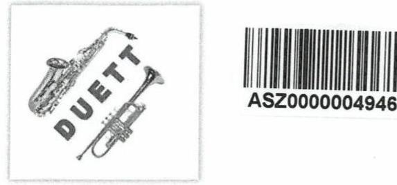

# DUETT Nonprofit Közhasznú Kft. 

3400 Mezőkövesd, Mátyás király út 51. Tel/Fax: 49/312-754
Web: www.duettlira.hu
E-mail: duettlira@gmail.com

Iktatószám: EL-2134-047/2020
Cím: Állami Számvevőszék
1052 Budapest, Apáczai Csere János u. 10.
Makkai Mária felügyeleti vezető részére

Tisztelt Felügyelet vezető Asszony!

Fenti iktatószámú levelükre észrevételemmel együtt következő dokumentumokat csatolom:

1. Líra Pénzkezelési szabályzat
2. Aláírás bejelentő karton fenntartói számlához
3. Mák jegyzőkönyv kivonat 2015.
4. Mák jegyzőkönyv kivonat 2020.
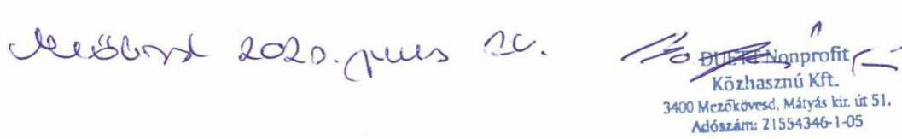

Líra Zeneiskola Alapfokú Művészeti Iskola
3465 Tiszabábolna, Fő út 97. ;Tel./Fax: 49/312-754.;Web:www.duettlira.hu; E-mail: duettlira@gmail.com

---

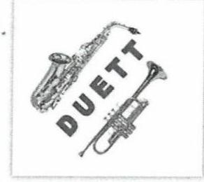

# DUETT Nonprofit Közhasznú Kft. 

3400 Mezőkövesd, Mátyás király út 51. Tel/Fax: 49/312-754
Web: www.duettlira.hu
E-mail: duettlira@gmail.com

## Iktatószám: EL-2134-047/2020

Cím: Állami Számvevőszék
1052 Budapest, Apáczai Csere János u. 10.
Makkai Mária felügyeleti vezető részére

## Tisztelt Felügyelet vezető Asszony!

A 2020. június 10-én kelt és 2020. június 12-én kézhez vett jelentéstervezetet köszönettel megkaptuk, mely kapcsán a 15 napon belüli észrevételezési joggal kívánok élni az alábbiak szerint:

Az összegző megállapításban szereplő számlarend hiánya érthetetlen számunkra, mert a beküldött dokumentumok eredeti példánya rendelkezésre áll a fenntartó könyvelésében.
A EL-2134-046/2020 iktatószámú levelükben megjelölt benyújtandó dokumentumok között szerepel a számviteli politika és számlarend, melyet egyidejűleg csatolunk levelünkhöz.
A fenntartó rendelkezik könyvvezetéssel és a közpénzekkel minden évben elszámolt, közhasznúsági jelentését közzétette.

## Líra Zeneiskola Alapfokú Művészeti Iskola

3465 Tiszabábolna, Fő út 97. ;Tel./Fax: 49/312-754.;Web:www.duettlira.hu; E-mail: duettlira@gmail.com

---

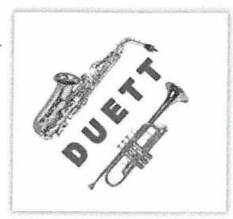

DUETT Nonprofit Közhasznú Kft.
3400 Mezőkövesd, Mátyás király út 51.
Tel/Fax: 49/312-754
Web: www.duettlira.hu
E-mail: duettlira@gmail.com

A Jelentéstervezet Függelékében tett megállapítás, miszerint a fenntartó nem adta át Intézményének a költségvetési támogatást, a következő észrevételt teszi:

A fenntartó szervezet a költségvetési támogatás átadását 2013-tól a következőképpen valósította meg.

Az intézmény önálló jogi személy, adószámmal, önálló költségvetéssel és részben önálló gazdálkodással rendelkezik. A támogatások a fenntartó számlájára érkeznek, a kiadásokról a számlák a fenntartó nevére szólnak. Az intézmény önálló költségvetéssel rendelkezik, melyet az intézményvezető készít el és a fenntartó jóváhagyja. A fenntartó a Kvtv. alapján a normatív támogatás átadását minden esetben megvalósítja a Fenntartó által készített intézményi pénzkezelési szabályzat alapján. (mellékelve)

Az Intézményvezető a költségvetéstől kapott támogatásból történő kifizetésekről, átutalásokról napra kész analitikus nyilvántartást vezet, melyet hó végén átad a fenntartónak ellenőrzésre. Ennek pontos megvalósításáról a fenntartó által készített Belső szabályzat gondoskodik. (mellékelve IV-6/2015 iktatószámú Belső szabályzat)

A Fenntartó számlájára történő érkezés pillanatában az intézményvezető rendelkezik az egész összeggel. A fenntartó számlavezető bankjánál teljes hozzáférése van az Intézményvezetőnek, a vásárlásokhoz a fenntartó számlájához tartozó bankkártyával rendelkezik (Mellékelve: aláírás bejelentő a fenntartó számlájához)
A beérkező és kimenő utalásokról csak az intézményvezető kap értesítést a saját telefonjára. A Fenntartó bankszámlájához tartozó netbank szolgáltatást az intézményvezető kezeli, ahonnan a bérek, járulékok és egyéb kiadások átutalása történik. A munkáltató szervezet a Duett Nonprofit Kft. Fenntartó szervezet, a pedagógusok és pedagógust segítő alkalmazottak bérét és járulékát így mindenképpen erről a számláról kell teljesíteni, mivel ehhez az adószámhoz és bankszámlához kell kapcsolódnia az átutalásoknak.
Természetesen a vonatkozó jogszabályoknak megfelelően a munkáltatói jogokat az intézményvezető gyakorolja az alkalmazottak felett, de a jogszabály azt nem írja elő, hogy a munkáltatói szervezetnek is az intézménynek kell lennie. Fentiek szerint a normatív támogatás átadása így teljes összegében megvalósul. A vonatkozó törvény egy esetben sem említi az átutalás tényét, hanem csak azt, hogy az átadás úgy történjen, hogy az biztosítsa az intézmény folyamatos, zökkenőmentes működését.

# Líra Zeneiskola Alapfokú Művészeti Iskola 

3465 Tiszabábolna, Fő út 97. ;Tel./Fax: 49/312-754.;Web:www.duettlira.hu; E-mail: duettlira@gmail.com

---

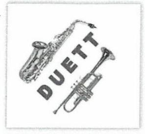

DUETT Nonprofit Közhasznú Kft.
3400 Mezőkövesd, Mátyás király út 51. Tel/Fax: 49/312-754
Web: www.duettlira.hu
E-mail: duettlira@gmail.com

Azzal a belső szabályzattal, amit a Fenntartó készített (Pénzkezelési Szabályzat) biztosítja az intézményvezető részére, hogy a Fenntartó számlájára érkező normatív támogatás egész összegével rendelkezzen. Az oda-visszautalások sorozata az egyébként is rendkívül magas banki költségeket (évi 800.000 Ft) csak tovább növelné, és mivel kiegészítő támogatást működésre nem kap a Fenntartó, így fentiek finanszírozása is nagy nehézségekbe ütközik. A vonatkozó törvényt a Fenntartó úgy értelmezte, hogy az átadást nem csak átutalással lehet teljesíteni,
Természetesen abban az esetben, amennyiben a Fenntartó szervezetnek több fenntartott intézménye lenne és nem csak egy alapfeladatot látna el, az átutalás egyszerűbb és rugalmasabb megoldás lenne.
A Duett Nonprofit Kft. mint Fenntartó szervezet 2003-tól egyetlen alapfeladatot lát el és egy intézményt tart fenn. A céget erre a feladatra alapította a Fenntartó.
Vállalkozási tevékenységet nem folytatott és nem is folytat. Amennyiben egyéb pályázatokon részt vesz, annak elnyert támogatása elkülönítve van kezelve és alszámlára utalással történik.

A normatív támogatás átadása az intézmény számára minden esetben 100%-ban megtörtént azzal a ténnyel, hogy a Fenntartó az Intézményvezető rendelkezésére bocsájtja a támogatás teljes összegét annak megérkezése pillanatában.

Bizonyítja ezt:

- Pénzkezelési Szabályzat
- aláírási címpéldány számlavezető banknál
- bérek, járulékok átutalása a támogatás megérkezését követő napon

2015-ben júniusában a fenntartó MÁK ellenőrzést kapott, mely során nemcsak a tanügyi dokumentumok kerültek ellenőrzésre, hanem a fenntartó gazdálkodása is. Az ellenőrzés során az átadás ilyen formában történő tényét jogszerűnek tartotta a hatóság. A Fenntartó és intézménye működését törvényesnek és jogszerűnek találta. A Fenntartó ennek tényében jogosan gondolta azt, hogy jogszerűen jár el és jogszerűen működteti intézményét. 2019. októberében a MÁK egy körlevelet adott ki a fenntartók részére, melyben felhívta a figyelmet a költségvetési támogatás átadásának fontosságára, de ennek konkrét eljárására nem tért ki.

---

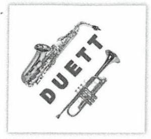

# DUETT Nonprofit Közhasznú Kft. 

3400 Mezőkövesd, Mátyás király út 51. Tel/Fax: 49/312-754
Web: www.duettlira.hu
E-mail: duettlira@gmail.com
2019. november 11-én az ÁSZ ellenőrzéssel párhuzamosan MÁK ellenőrzést kapott a fenntartó, aminek keretében a 2018. évet vizsgálták. A helyszíni ellenőrzés során a kért dokumentumok bemutatásra kerültek. A költségvetési támogatás átadásának tényét a helyszíni ellenőrzés során csak annyiban vitatta a hatóság, hogy a számlák miért nem az iskola nevére szólnak. Mivel könyvvezetéssel csak a Fenntartó rendelkezik, az intézmény csak analitikus nyilvántartást vezet a költségvetési támogatásról, így furcsának találta Fenntartó a felvetést. A kérdésre, hogyan kellene ezt akkor pontosan csinálni, nem kapott választ a fenntartó.
A fenntartó és Intézménye örömmel venné az ÁSZ javaslatát fentiekre vonatkozóan, a Fenntartó szervezet és Intézménye jogszerű működésének érdekében. Természetesen a Fenntartó minden olyan intézkedést megtesz, ami szükséges a további törvényes működéshez. Amennyiben a költségvetési támogatás átadásának ténye kizárólag csak átutalással valósítható meg, úgy azt a fenntartó teljes összegében átutalja az Intézménye számlájára az érkezés napján, mint ahogy eddig is a teljes összeget átadta Intézményének. A Fenntartó saját ingatlana kizárólagosan az intézmény használatában van, székhely épületében van a központi iroda, ahol dolgozik az Intézményvezető, a helyettes, a pedagógust segítők és a fenntartó szervezet ügyvezetője.
Az Intézmény 18-ik éve működik folyamatosan, a tanulók nagyobb része hátrányos helyzetű, szociálisan rászoruló, kisebbséghez tartozó társadalmi rétegből, tanyavilágban élő gyerekekből tevődik össze. Az intézmény nevelő testülete (70% kinevezett munkavállaló) komoly hivatástudattal rendelkező pedagógusok, akik a nehéz körülmények ellenére is kitartanak növendékeik mellett és intézményük felé lojálisak. A Fenntartó és az Intézmény vezetősége, a szűkös anyagi lehetőségek és minden nehézség ellenére elhivatott erre a feladatra. Működésre nem kap támogatást a Fenntartó, a Hangszercsere programból kimaradtak az ilyen típusú intézmények, ami maradt az egyre szűkösebb lehetőséget nyújtó pályázatok, amelyeknek az aránya a beadott és nyertes tekintetében 20:1. A befolyt térítési díjak és tandíjak -a tanulói összetétel miatt- az adminisztratív költségeket sem fedezik.
A bérek, járulékok, útiköltségek kifizetése után a legkisebb kiadást is meg kell gondolnia az Intézménynek, ezt csak ésszerű, takarékos gazdálkodással tudja megoldani. Mindezek ellenére a 18 év alatt a Fenntartó mindig időben eleget tett minden fizetési kötelezettségének intézményével szemben, biztosítva ezzel folyamatos és biztonságos működését. Saját szervezetének törvényes működését szem előtt tartotta és tarja, ennek valódiságát pedig minden fenntartói és intézményi ellenőrzés megerősítette. Valótlan adatot soha nem szolgáltatott, a költségvetéstől kapott támogatást teljes összegben intézménye működésére fordította, saját részére

## Líra Zeneiskola Alapfokú Művészeti Iskola

---

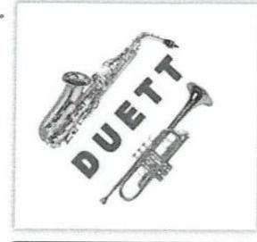

# DUETT Nonprofit Közhasznú Kft. 

3400 Mezőkövesd, Mátyás király út 51. Tel/Fax: 49/312-754
Web: www.duettlira.hu
E-mail: duettlira@gmail.com
csak a pedagógus munkájáért vett fel fizetést. 2010-ben vásárolt székhely ingatlanának bővítését, felújítását -melyet az iskola kizárólagos használatára átadott- nagyrészt saját kezével és a célért elhivatott önkéntesekkel valósította meg.

Jelentésük elkészítésénél tisztelettel kérném fentiek figyelembevételét.
További javaslataikat, megállapításaikat tiszteletben tartva és megköszönve, a jelentés majdani kézhezvételét követő 30 napon belül elkészítjük intézkedési tervünket, és annak Önök részéről történő jóváhagyását követően az abban foglaltakat maradéktalanul végrehajtjuk.

Ellenőrzésüket és munkájukat megköszönve,
 tisztelettel:
Mezőkövesd, 2020. június 24.

Bolykó István
DUETT Nonprofit
Közhasznú Kft.
3400 Mezőkövesd, Mátyás király út 51.
Adószám: 21554346-1-05

## Líra Zeneiskola Alapfokú Művészeti Iskola

3465 Tiszabábolna, Fő út 97. ;Tel./Fax: 49/312-754.;Web:www.duettlira.hu; E-mail: duettlira@gmail.com

---

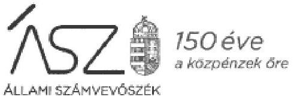

Ikt. szám: EL-2134-052/2020.

Bolykó István úr
Ügyvezető

DUETT Művészetoktatási Nonprofit Közhasznú Korlátolt Felelősségű Társaság

Mezőkövesd

Tisztelt Ügyvezető Úr!

A „Nem állami humánszolgáltatók ellenőrzése – A köznevelési humánszolgáltatást nyújtó intézmények, szolgáltatók államháztartáson kívüli fenntartói központi költségvetésből kapott támogatásai felhasználásának ellenőrzése – DUETT Művészetoktatási Nonprofit Közhasznú Korlátolt Felelősségű Társaság” címmel készített számvevőszéki jelentéstervezetre tett, 2020. június 24-én kelt észrevételét köszönettel megkaptam.

Az Állami Számvevőszék észrevételre vonatkozó álláspontjáról a felügyeleti vezető által készített tájékoztatást mellékelten megküldöm.

Tájékoztatom Ügyvezető urat, hogy a számvevőszéki jelentésben – az Állami Számvevőszékről szóló 2011. évi LXVI. törvény 29. § (3) bekezdése alapján – a figyelembe nem vett észrevételt szerepeltetjük, annak indoklásával, hogy azt az Állami Számvevőszék miért nem fogadta el.

Budapest, 2020. 07. hó 15. nap

Melléklet: Tájékoztatás az észrevétel kezeléséről

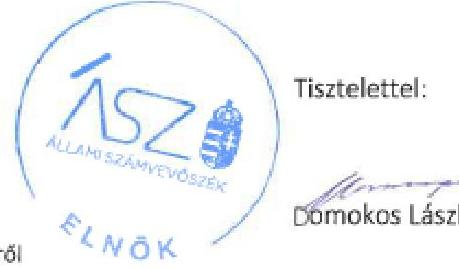

Tisztelettel:

Domokos László

1052 BUDAPEST, APÁCZAI CSERE JÁNOS UTCA 10, 1364 Budapest 4. Pf. 54. Telefon: +36 1 484 9101, fax: +36 1 484 9201

---

# Tájékoztatás 

## az észrevétel kezeléséről

A „Nem állami humánszolgáltatók ellenőrzése -A köznevelési humánszolgáltatást nyújtó intézmények, szolgáltatók államháztartáson kívüli fenntartói központi költségvetésből kapott támogatásai felhasználásának ellenőrzése - DUETT Művészetoktatási Nonprofit Közhasznú Korlátolt Felelősségű Társaság" címú jelentéstervezetre 2020. június 25-én érkezett észrevételt áttekintettük, annak kezelésével kapcsolatban a következő tájékoztatást adom.

Az észrevételben foglaltak érintik a jelentéstervezet 1. számú megállapításában foglalt számlarend hiányára vonatkozó megállapítást és a jelentéstervezet függelékében szereplő megállapítást, amely szerint a fenntartó a részére folyósított központi költségvetési támogatást az intézmény részére nem adta át.

Tájékoztatom, hogy az Állami Számvevőszék megállapításai minden esetben az adatbekérés keretében, az arra nyitva álló határidőben rendelkezésre bocsátott dokumentumokon alapulnak. Az észrevétel mellékleteként beküldött dokumentumokat nem értékeltük.

Az ellenőrzés során szolgáltatott dokumentumok ismételt áttekintése alapján tájékoztatom, hogy számlarendet nem - csak számlatükröt - bocsátottak az ÁSZ rendelkezésére. Ezért az észrevételt nem fogadjuk el, a jelentéstervezet módosítása nem indokolt.

A központi költségvetési támogatás intézmény részére való átadásának hiányát az észrevétel megerősíti a következők miatt.

Az észrevétel szerint - amely egyebekben jogszabályi előírás is - az intézmény önálló költségvetéssel rendelkezik. Ebből adódóan az észrevételben részletezett, alkalmazott gyakorlat, amely szerint a fenntartó nevére szóló számlák alapján, a fenntartó bankszámlájáról a beérkezett költségvetési támogatások átadása nélkül történik az intézmény működésének finanszírozása, nem felel meg a hatályos jogszabályoknak. Nem felel meg a mindenkori költségvetési törvény mellékletében foglalt előírásnak - az erre való hivatkozást a jelentéstervezet függeléke tartalmazta -, amely szerint a fenntartó a támogatások folyósítását követő 15 napon belül - az általa fenntartott nevelési-oktatási, pedagógiai szakszolgálati intézménynek átadja úgy, hogy az általa fenntartott valamennyi nevelési-oktatási-, pedagógiai szakszolgálati intézmény folyamatos működését biztosítsa. A 15 napon belüli átadási kötelezettségnek nem felel meg az, hogy a fenntartó a saját bankszámlájáról, a saját nevére szóló számlák alapján teljesíti a kifizetéseket, ezzel a központi költségvetési támogatások cél szerinti felhasználásának átláthatósága és elszámoltathatósága sérül. Ezt erősíti meg az észrevételben

---

hivatkozott, Magyar Államkincstár ellenőrzése során tett, az alkalmazott gyakorlatra vonatkozó jelzés is.

Mindezek alapján az észrevételt nem fogadjuk el, a jelentéstervezet módosítása nem indokolt.

Mindemellett tájékoztatom, hogy a levelében hivatkozott, EL-2134-046/2020. iktatószámú, a vagyonmegóvási intézkedés kilátásba helyezéséről szóló ÁSZ tájékoztatásban bekért dokumentumokra vonatkozó adatszolgáltatást külön kezeljük. A vonatkozó válaszlevél és a bekért dokumentumok beérkezését követően, az adatszolgáltatást értékeljük és annak eredményéről külön levélben értesítjük Ügyvezető urat. Kiemelem, hogy az EL-2134-046/2020. iktatószámú levélre vonatkozó adatszolgáltatásnak és tájékoztatásnak a bekért dokumentumokra vonatkozóan a megjelölt határidőben teljes körűnek kell lennie.

Budapest, 2020. 04. hó 15. nap

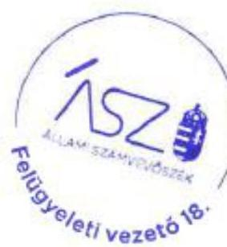

Makkai Mária s.k.
felügyeleti vezető

A kiadmány hiteles.

---

# RÖVIDÍTÉSEK JEGYZÉKE 

${ }^{1}$ Fenntartó
${ }^{2}$ Számv. tv.
${ }^{3}$ központi költségvetésről szóló törvények
${ }^{4}$ Intézmény
${ }^{5} \mathrm{Nkt}$.
${ }^{6}$ ÁSZ
${ }^{7}$ ÁSZ tv.
${ }^{8}$ ÁSZ SZMSZ

DUETT Művészetoktatási Nonprofit Közhasznú Korlátolt Felelősségű Társaság a számvitelről szóló 2000. évi C. törvény, hatályos 2001. január 1-től Magyarország 2016. évi központi költségvetéséről szóló 2015. évi C. törvény, Magyarország 2017. évi központi költségvetéséről szóló 2016. évi XC. törvény, Magyarország 2018. évi központi költségvetéséről szóló 2016. évi C. törvény

Líra Zeneiskola Alapfokú Művészeti Iskola
a nemzeti köznevelésről szóló 2011. évi CXC. törvény, hatályos 2012. szeptember 1-től
Állami Számvevőszék
az Állami Számvevőszékről szóló 2011. évi LXVI. törvény, hatályos 2011. július 1-től
Állami Számvevőszék Szervezeti és Működési Szabályzata

---

# ÁSZ 

ÁLLAMI SZÁMVEVŐSZÉK
1052 Budapest, Apáczai Csere J. u. 10. I 1364 Budapest 4. Pf. 54 TEL: +36 14849100
email: szamvevoszek@asz.hu
web: www.asz.hu | www.aszhirportal.hu

