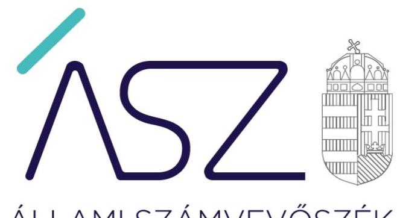
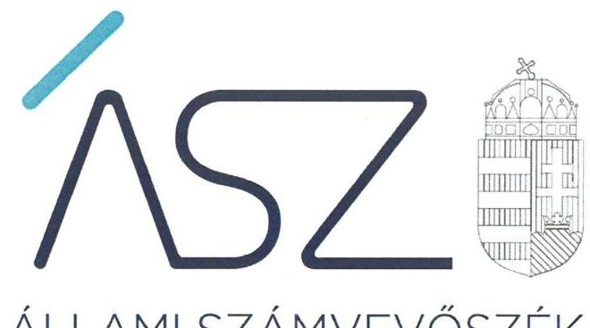
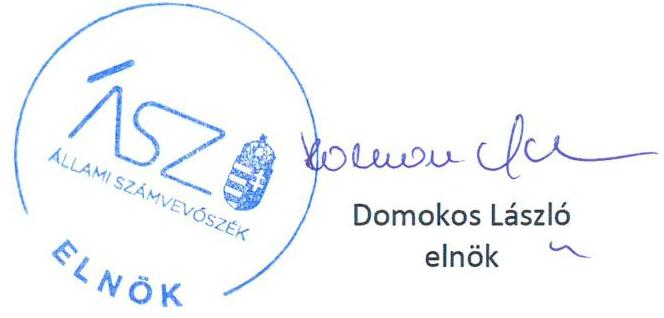
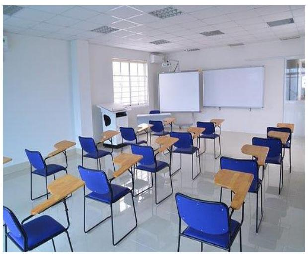

ÁLLAMI SZÁMVEVŐSZÉK

# JELENTÉS 

## Nem állami humánszolgáltatók ellenőrzése

A köznevelési humánszolgáltatást nyújtó intézmények, szolgáltatók államháztartáson kívüli fenntartói központi költségvetésből kapott támogatásai felhasználásának ellenőrzése – Új Alma Iskolafenntartó Közhasznú Nonprofit Korlátolt Felelősségű Társaság
2020.

20164
www.asz.hu

---

ÁLLAMI SZÁMVEVŐSZÉK

# JELENTÉS

## Nem állami humánszolgáltatók ellenőrzése

A köznevelési humánszolgáltatást nyújtó intézmények, szolgáltatók államháztartáson kívüli fenntartói központi költségvetésből kapott támogatásai felhasználásának ellenőrzése – Új Alma Iskolafenntartó Közhasznú Nonprofit Korlátolt Felelősségű Társaság

2020. 08. hó 27. nap

20164
www.asz.hu

---

# AZ ELLENŐRZÉST FELÜGYELTE: 

PETŐ KRISZTINA felügyeleti vezető

## AZ ELLENŐRZÉST VEZETTE ÉS A VÉGREHAJTÁSÁÉRT FELELŐS:

NEMESVÁRI-HORTHY ESZTER ellenőrzésvezető

## A PROGRAM ÖSSZEÁLLÍTÁSÁÉRT FELELŐS:

FEKETE-NAGY ANDRÁS GÁBOR projektvezető

IKTATÓSZÁM: EL-2828-001/2020.
TÉMASZÁM: 2523
ELLENŐRZÉS-AZONOSÍTÓ SZÁM: V086722

---

# TARTALOMJEGYZÉK 

- ÖSSZEGZÉS ..... 5
- AZ ELLENŐRZÉS CÉLJA ..... 6
- AZ ELLENŐRZÉS TERÜLETE ..... 7
- AZ ELLENŐRZÉS HÁTTERE, INDOKOLTSÁGA ..... 8
- AZ ELLENŐRZÉS LÉNYEGES KÉRDÉSKÖREI ..... 9
- AZ ELLENŐRZÉS HATÓKÖRE ÉS MÓDSZEREI ..... 10
MELLÉKLETEK ..... 13
I. sz. melléklet: Értelmező szótár ..... 13
- FÜGGELÉK: ÉSZREVÉTELEK ..... 15
- RÖVIDÍTÉSEK JEGYZÉKE ..... 17

---

.

---

# ÖSSZEGZÉS 

A budapesti székhelyű Új Alma Iskolafenntartó Közhasznú Nonprofit Kft. a 2016-2018. években a köznevelési közfeladatra kapott költségvetési támogatások felhasználása tekintetében nem volt elszámoltatható.

## Az ellenőrzés társadalmi indokoltsága

A szociális gondoskodást igénylők védelme, illetve a köznevelési feladatok ellátása az Alaptörvényben meghatározott, a társadalom szempontjából fontos tevékenységek. Jogszabályok teszik lehetővé, hogy államháztartáson kívüli szervezetek - így például az egyházi fenntartók, alapítványok, gazdasági társaságok, egyesületek - által fenntartott intézmények is végezzenek köznevelési, szociális és gyermekvédelmi feladatokat. Mindehhez a központi költségvetés évente jelentős összegű támogatással járul hozzá. Az államháztartáson kívüli, humánszolgáltatást végző intézmények az igényelt közpénzekből társadalmilag hasznos, közösségteremtő, közérdekű, illetve közhasznú tevékenységet végeznek, illetve közfeladatokat látnak el.

Az intézményfenntartók ellenőrzésével az Állami Számvevőszék hozzájárul ahhoz, hogy ezen közpénzeket az államháztartáson kívüli szervezetek is ellenőrizhető, átlátható és elszámoltatható módon használják fel a közfeladatok ellátása során. Az ellenőrzések célja továbbá, hogy a nyilvánosság és az igénybevevők megfelelő tájékoztatást kapjanak az államháztartáson kívüli közfeladatot ellátók működéséről.

Az Állami Számvevőszék ellenőrzései arra adnak választ, hogy az intézményfenntartók arra használták-e fel a közpénzeket, amire igényelték.

A szabályszerű gazdálkodás elengedhetetlen a közfeladat ellátás szakmai céljainak megvalósításához, valamint a társadalmi közbizalom fenntartásához.

## Megállapítások, következtetések

Az Új Alma Iskolafenntartó Közhasznú Nonprofit Kft. a 2016-2018. években kapott központi költségvetési támogatás, összesen 373,1 millió Ft Új Budai Alma Mater Általános Iskola, Alapfokú Művészeti Iskola és Óvodának történő átadását - a Számv. tv. ${ }^{1} 165$. § (2) bekezdésében foglalt előírás ellenére - számviteli bizonylat hiányában jegyezte be könyveibe. Ezzel nem tett eleget a Számv. tv.-ben foglalt azon kötelezettségének, amely szerint a könyvvitelében rögzített és a beszámolójában szereplő tételeknek a valóságban is megtalálhatóknak, bizonyíthatóknak, kívülállók által is megállapíthatóknak kell lenniük. Ezáltal nem igazolt, hogy az Új Alma Iskolafenntartó Közhasznú Nonprofit Kft. 2016-2018. évi éves beszámolói megbízható és valós képet mutat vagyoni, pénzügyi és jövedelmi helyzetéről, valamint hogy a központi költségvetési támogatást cél szerint használta fel.

Az Új Alma Iskolafenntartó Közhasznú Nonprofit Kft. a 2016-2018. években nem alakított ki szabályszerű gazdálkodási környezetet. A Számv. tv. 14. § (5) bekezdés d) pontjában foglalt előírás ellenére pénzkezelési szabályzatot nem készített, számlarendje a Számv. tv. 161. § (2) bekezdés a) pontjában foglalt előírás ellenére nem tartalmazta minden alkalmazásra kijelölt számla számjelét és megnevezését. Ennek következtében nem teremtette meg a központi költségvetési támogatások átlátható, elszámoltatható igénybevételének és felhasználásának feltételeit sem.

Mindezek következtében az Új Alma Iskolafenntartó Közhasznú Nonprofit Kft. az Alaptörvény² 39. cikk (2) bekezdésében foglaltak ellenére nem biztosította a felhasznált közpénzekre vonatkozó gazdálkodása átláthatóságát.

---

# AZ ELLENŐRZÉS CÉLJA

**AZ ELLENŐRZÉS CÉLJA** annak értékelése volt, hogy a nem állami, nem önkormányzati köznevelési intézményt fenntartó Új Alma Iskolafenntartó Közhasznú Nonprofit Kft. központi költségvetésből kapott támogatásainak felhasználása szabályszerű volt-e.

---

# **AZ ELLENŐRZÉS TERÜLETE**

## **Új Alma Iskolafenntartó Közhasznú Nonprofit Kft.**

A budapesti székhelyű Fenntartó³ négy magánszemély és két gazdasági társaság, a Borealis Consulting Kft. és a PROGEN Holding Zrt. alapították alapfokú köznevelési közfeladat ellátására.

A Fenntartó fő tevékenységeként olyan oktatási, nevelési módszertan támogatását határozta meg, amely a gyermekek világról és önmagukról alkotott képét fejleszti. Társasági szerződésében feladataként jelölte meg, hogy segíti az egészséges szemléletű, őszinte, fejlett megkülönböztető képességű, igazságos értékrendű személyiségek kialakítását, illetve ilyen oktatási-nevelési programok megvalósulását.

A Fenntartó fő tevékenysége alapfokú oktatás, amelyet az általa 2008-ban alapított, önálló jogi személy budapesti székhelyű, Intézmény⁴ útján látott el, amelynek működési területe Budapest XI. kerülete és vonzáskörzete.

A Fenntartó – a Kincstár⁵ adatai szerint – köznevelési közfeladatai ellátására a központi költségvetésből 2016-ban 108,8 millió Ft, 2017-ben 129,6 millió Ft, 2018-ban 134,7 millió Ft állami költségvetési támogatásban részesült.

---

# AZ ELLENŐRZÉS HÁTTERE, INDOKOLTSÁGA 

A köznevelési feladatokat ellátó nem állami intézményfenntartók részére közfeladataik ellátására évente jelentős összegű pénzügyi támogatást biztosítottak a mindenkori költségvetési törvények a bennük megfogalmazott feltételek mellett. Az Országgyűlés elfogadta a nemzeti köznevelésről szóló 2011. évi CXC. törvényt, amely jelentősen átalakította a korábbi finanszírozási rendszert 2013 szeptemberétől. Új feladatfinanszírozási forma (átlagbéralapú támogatás) jelent meg, amely az államháztartáson kívüli intézményfenntartókra is vonatkozik. A „témacsoportos" ellenőrzés a finanszírozási rendszerben 2011-2015 között bekövetkezett változásokra, azok közfeladat ellátásra gyakorolt hatására fókuszál a költségvetési támogatásokat felhasználó államháztartáson kívüli szervezetek körében. Az ellenőrzések indokoltságát az is alátámasztja, hogy az ÁSZ ${ }^{6}$ számos szervezetet még nem ellenőrzött ezen a területen.

Az ÁSZ stratégiájában foglaltak alapján is indokolt az ellenőrzés, amely a társadalom számára jelzi, hogy a közpénz államháztartáson kívüli felhasználása sem maradhat ellenőrizetlenül. Az államháztartáson kívülre nyújtott költségvetési támogatások ellenőrzésével az ÁSZ hozzájárul ahhoz, hogy a közpénzeket a nem állami humán fenntartók átlátható módon használják fel a közfeladatok ellátására kötött szerződésekben vállalt kötelezettségek teljesítése érdekében. Az ellenőrzés javaslataival hozzájárulhat az említett rendszerek szabályszerű támogatás felhasználásához, javíthatja a társadalmi-gazdasági döntések megalapozottságát, amely a „jól irányított állam működésének" feltétele.

A holisztikus megközelítés jegyében az ellenőrzés keretében egyedi kockázatelemzés alapján kiválasztott fenntartóknál és intézményeiknél értékeljük az államháztartáson kívüli köznevelési és szociális tevékenységhez kapcsolódó támogatások felhasználásának megfelelőségét.

---

# AZ ELLENŐRZÉS LÉNYEGES KÉRDÉSKÖREI 

1. A köznevelési közfeladatot ellátó államháztartáson kívüli fenntartó szabályszerű működési - és gazdálkodási környezet kialakításával megteremtette-e a költségvetési támogatások átlátható, elszámoltatható igénybevételének, felhasználásának feltételeit?
2. Az államháztartáson kívüli fenntartó az átvállalt köznevelési közfeladathoz biztosított költségvetési támogatásokat szabályszerűen fordította-e a humánszolgáltató intézménye/i működtetésére?
3. Az államháztartáson kívüli fenntartó a köznevelési intézménye/i működtetéséhez felhasznált közpénzekre vonatkozó gazdálkodásával a nyilvánosság előtt elszámolt-e, ennek érdekében ellenőrzési, értékelési és a külső ellenőrzésekkel kapcsolatos intézkedési feladatait szabályszerűen látta-e el?

---

# AZ ELLENŐRZÉS HATÓKÖRE ÉS MÓDSZEREI 

## Az ellenőrzés típusa

Megfelelőségi ellenőrzés.

## Az ellenőrzött időszak

2016-2018. évek

## Az ellenőrzés tárgya

Az ellenőrzés a köznevelési közfeladatokat ellátó államháztartáson kívüli fenntartók humánszolgáltatási közfeladatai ellátásához a központi költségvetésből kapott támogatásaik humánszolgáltatási közfeladatokra való fenntartó általi felhasználása szabályszerűségének értékelésére terjedt ki.

Az ellenőrzés kiterjedt minden olyan körülményre és adatra, amely az ÁSZ jogszabályban meghatározott feladatainak teljesítéséhez, valamint a program végrehajtása folyamán felmerült újabb összefüggések feltárásához szükséges.

## Az ellenőrzött szervezet

Új Alma Iskolafenntartó Közhasznú Nonprofit Kft.

## Az ellenőrzés jogalapja

Az ellenőrzés jogszabályi alapját az ÁSZ tv. ${ }^{7}$ 1. § (3) és 5. § (3) bekezdésében foglalt előírások adták.

## Az ellenőrzés módszerei

Az ellenőrzést az ellenőrzési program szempontjai, kérdései, az ellenőrzött időszakban hatályos jogszabályok, a nemzetközi standardokat irányadónak tekintve, az ellenőrzés szakmai szabályok és módszertanok figyelembevételével végezte az ÁSZ. A közpénzekkel való felelős gazdálkodás segítésére irányuló javaslatok kidolgozásakor a hatályos jogszabályok voltak az irányadóak.

Az ellenőrzés ideje alatt az ellenőrzött szervezettel történő kapcsolattartást az ÁSZ SZMSZ ${ }^{\circledR}$-ének vonatkozó előírásai alapján biztosította az ÁSZ.

---

Az ellenőrzési kérdések megválaszolásához szükséges bizonyítékok megszerzése az ellenőrzött által rendelkezésre bocsátott dokumentumokra, adatokra alapozva megfigyelés, szemle (szemrevételezés), kérdésfeltevés (információkérés), mintavétel, valamint elemző eljárással történt.

Az ellenőrzési bizonyítékként felhasználható adatforrások közé tartoztak egyrészt a szakmai program részletes szempontjainál felsorolt adatforrások, másrészt minden - az ellenőrzés folyamán feltárt, az ellenőrzés szempontjából információt tartalmazó - dokumentum.

Az ellenőrzés lefolytatásához az ellenőrzött szervezet a kitöltött tanúsítványok, valamint az ÁSZ által kért dokumentumok elektronikus úton való megküldésével szolgáltatott adatokat, információkat. Az így rendelkezésre bocsátott adatok, információk és a tanúsítványok adatai valódiságának kontrollja az ellenőrzés keretében történt.

Az egységes értelmezést az ellenőrzési program mellékletét képező fogalomtár és rövidítésjegyzék támogatta.

Az ellenőrzést alapvetően a köznevelési közfeladatok esetében a központi költségvetési támogatások igénylésével, módosításával, felhasználásával, elszámolásával kapcsolatos feladatokat ellátó államháztartáson kívüli fenntartónál/szervezeténél végeztük.

A köznevelési közfeladatok központi költségvetési támogatásaival kapcsolatos, államháztartáson kívüli fenntartó jogszabályokban előírt feladatai betartását, továbbá a központi költségvetési támogatások szabályszerű nyilvántartását ellenőrizte az ÁSZ a Fenntartónál rendelkezésre álló nyilvántartások, beszámolók és egyéb dokumentumok alapján. Az ellenőrzés nem terjedt ki a köznevelési közfeladatok központi költségvetési támogatásai igénylése, módosítása, elszámolása valódiságának, megalapozottságának, helyességének - sem a fenntartónál, sem a székhely intézményénél való - értékelésére (mivel ennek felülvizsgálata, ellenőrzése a finanszírozó jogszabályban előírt feladata, határozatai kiadása előtt). Továbbá nem terjedt ki az ellenőrzés e források szabályszerű felhasználásának értékelésére.

---

.

---

# MELLÉKLETEK 

- I. SZ. MELLÉKLET: ÉRTELMEZŐ SZÓTÁR
humánszolgáltatás
költségvetési támogatás
köznevelési közfeladat

Külön törvényben meghatározott szociális, gyermekjóléti, gyermekvédelmi, közoktatási, felsőoktatási, kulturális közfeladatok. (2015. évi Kvtv. ${ }^{9}$ 43. § (1), (4) bekezdés, 1. számú melléklet XX/20/2/3. jogcím csoport, 19. alcím, 2016. évi Kvtv. ${ }^{10}$ 41. § (1), (4) bekezdés, 1. számú melléklet XX/20/2/3. jogcím csoport, 19. alcím, 2017. évi Kvtv. ${ }^{11}$ 41. § (1), (4) bekezdés, 1. számú melléklet XX/20/2/3. jogcím csoport, 19. alcím)
A társadalombiztosítás pénzügyi alapjai kivételével az államháztartás központi alrendszeréből ellenérték nélkül, pénzben nyújtott támogatások, ide nem értve a szociális igazgatásról és szociális ellátásokról szóló törvény, valamint a gyermekek védelméről és a gyámügyi igazgatásról szóló törvény szerinti pénzbeli és természetbeni szociális és gyermekvédelmi ellátásokat. (Áht. ${ }^{12}$ 1. § 14. pont)
A költségvetési törvényben (2016. évi Kvtv. 40. §) megállapított támogatás többek között: Átlagbéralapú támogatást állapít meg a nevelési-oktatási, valamint pedagógiai szakszolgálati intézményt fenntartó nemzetiségi önkormányzat, az egyházi és magán köznevelési intézmény fenntartója részére az általuk fenntartott nevelési-oktatási intézményben, továbbá pedagógiai szakszolgálati intézményben pedagógus és - a (3) bekezdés kivételével - a nevelő-oktató munkát közvetlenül segítő munkakörben foglalkoztatottak után a 7. melléklet I. pontjában meghatározott jogosultak után, az őket ott megillető mértékek szerint. Működési támogatást állapít meg a nemzetiségi önkormányzat vagy az egyházi jogi személy által fenntartott nevelési-oktatási intézményekben ellátott, továbbá a pedagógiai szakszolgálati intézményekben gyógypedagógiai tanácsadásban, korai fejlesztésben, oktatásban és gondozásban, valamint a fejlesztő nevelésben részt vevő gyermekekre, tanulókra tekintettel a nemzetiségi önkormányzat és a bevett egyház részére a 7. melléklet II. pontja szerint.
A köznevelési intézmény alapító okiratában foglalt feladat: óvodai nevelés, nemzetiséghez tartozók óvodai nevelése, általános iskolai nevelés-oktatás, nemzetiséghez tartozók általános

 iskolai nevelése-oktatása, kollégiumi ellátás, nemzetiségi kollégiumi ellátás, gimnáziumi nevelés-oktatás, szakközépiskolai nevelés-oktatás, szakiskolai nevelés-oktatás, nemzetiségi gimnáziumi nevelés-oktatása, nemzetiségi szakközépiskolai nevelés-oktatása, nemzetiségi szakiskolai nevelés-oktatása, Köznevelési Hídprogramok keretében folyó nevelés-oktatás, felnőttoktatás, alapfokú művészetoktatás, fejlesztő nevelés, fejlesztő nevelés-oktatás, pedagógiai szakszolgálati feladat, a többi gyermekkel, tanulóval együtt nevelhető, oktatható sajátos nevelési igényű gyermekek, tanulók óvodai nevelése és iskolai nevelés-oktatása, azoknak a sajátos nevelési igényű gyermekeknek, tanulóknak az óvodai, iskolai, kollégiumi ellátása, akik a többi gyermekkel, tanulóval nem foglalkoztathatók együtt, a gyermekgyógyüdülőkben, egészségügyi intézményekben, rehabilitációs intézményekben tartós gyógykezelés alatt álló gyermekek tankötelezettségének teljesítéséhez szükséges oktatás, pedagógiai-szakmai szolgáltatás.

---

köznevelési intézmény

nem állami, nem önkormányzati (államháztartáson kívüli) intézmény fenntartó

A nevelési-oktatási intézmény, pedagógiai szakszolgálati intézmény, pedagógiai szakmai szolgáltatást nyújtó intézmény.
A köznevelési közfeladatokat/humánszolgáltatásokat ellátó intézményt fenntartó egyházi jogi személy, társadalmi szervezet, alapítvány, közalapítvány, civil szervezet, országos nemzetiségi önkormányzat, nonprofit gazdasági társaság, gazdasági társaság és a humánszolgáltatást alaptevékenységként végző, Szja tv. ${ }^{13}$ hatálya alá tartozó egyéni vállalkozó. (2015. évi Kvtv. 43. § (1) bekezdés, 2016. évi Kvtv. 41. § (1) bekezdés, 2017. évi Kvtv. 41. § (1) bekezdés.)

---

# FÜGGELÉK: ÉSZREVÉTELEK 

A jelentéstervezetet a Számvevőszék 15 napos észrevételezésre megküldte az ellenőrzött szervezet vezetőjének az ÁSZ tv. 29. § (1) bekezdése előírásának megfelelően.

Az Új Alma Iskolafenntartó Közhasznú Nonprofit Korlátolt Felelősségű Társaság ügyvezetője a jelentéstervezet megállapításaira észrevételt tett.
Az ÁSZ tv. 29. § (3) bekezdésével összhangban az Állami Számvevőszék a Függelékben feltünteti az ellenőrzés megállapításaival kapcsolatban tett, figyelembe nem vett észrevételeket, és megindokolja, hogy azokat miért nem fogadta el.

Az Új Alma Iskolafenntartó Közhasznú Nonprofit Korlátolt Felelősségű Társaság (továbbiakban: Fenntartó) ügyvezetője által a 2020. július 1-én kelt levélben tett észrevételek és azok kezelésének indokolása:

## 1. A jelentéstervezet Megállapítások, következtetések rész 1. bekezdésével kapcsolatos észrevétel

A Fenntartó ügyvezetője észrevételében leírta, hogy az Új Alma Iskolafenntartó Közhasznú Nonprofit Korlátolt Felelősségű Társaság a 2016-2018. években kapott központi költségvetési támogatás intézménye részére történő átadásáról minden átadás esetében rendelkezett bizonylattal, amelyeket észrevételéhez mellékelten megküldött.
A Fenntartó ügyvezetőjének észrevételére válaszolva tájékoztatást adtunk, hogy az adatbekérés során beküldött dokumentumok felülvizsgálata alapján megállapítható, hogy a Fenntartó a támogatások intézménye részére történő átadásáról az egyes évekre vonatkozóan „Támogatás nyilvántartása ... év" című, word formátumú kimutatásokat készített és adott át teljességi és hitelességi nyilatkozattal az ÁSZ részére. Az ellenőrzés részére átadott kimutatások nem igazolják, hogy a központi költségvetési támogatás intézmény részére történő átadása megtörtént. A támogatás átadása bankszámla kivonattal nem került alátámasztásra, ezzel sérült a Számv. tv. 165. § (1) bekezdésében és a 166. § (1) bekezdésében foglalt bizonylatolásra vonatkozó előírások.

Az ÁSZ az ellenőrzés során kizárólag az adatszolgáltatásra rendelkezésre álló - az ÁSZ tv. 28. § (2) bekezdés szerinti határidőn belül beérkezett dokumentumokat veszi figyelembe. A törvényes határidőn túl megküldött dokumentumokat az ÁSZ nem értékeli.

A fentiekre tekintettel az észrevételt nem fogadtuk el, a jelentéstervezet megállapítása helytálló volt, így módosítása nem volt indokolt.

[^0]
[^0]:    * 29. § (1) Az Állami Számvevőszék az ellenőrzési megállapításait megküldi az ellenőrzött szervezet vezetőjének vagy az általa megbízott személynek, és annak, akinek személyes felelősségét állapította meg.
    (2) Az ellenőrzött szervezet vezetője és a felelősként megjelölt személy az ellenőrzés megállapításaira tizenöt napon belül írásban észrevételt tehet.
    (3) Az Állami Számvevőszék az észrevételre a beérkezésétől számított harminc napon belül írásban válaszol. A figyelembe nem vett észrevételeket köteles a jelentésben feltüntetni, és megindokolni, hogy azokat miért nem fogadta el.

---

# 2. A jelentéstervezet Megállapítások, következtetések rész 2. bekezdésével kapcsolatos észrevétel 

A Fenntartó ügyvezetője észrevételében leírta, hogy az ellenőrzött időszakra rendelkeztek Pénzkezelési Szabályzattal, amelyet határidőben feltöltöttek az adatbekérési felületre. Jelezte, hogy a file esetleg sérülhetett a szkennelés, feltöltés során. Az észrevételhez mellékelte a Pénzkezelési és Házipénztár Szabályzatot, a számlarendet, valamint a 2019. november 6-ai keltezésű teljességi és hitelességi nyilatkozatának másolatát az adatszolgáltatás teljesítésének igazolására. A Fenntartó ügyvezetője leírta továbbá, hogy a Fenntartó számlarendjét a Számviteli Politika tartalmazta, azonban 2016-ban készítettek külön részletes, a törvényi változásoknak megfelelő számlarendet, amelyet az észrevételhez mellékelten megküldött.

A Fenntartó ügyvezetőjének észrevételére válaszolva tájékoztatást adtunk, hogy az ÁSZ tv. 28. § (2) bekezdése szerint, a közreműködésre felhívott szervezet az ÁSZ részére - annak kérésére soron kívül, de legkésőbb öt munkanapon belül - az ellenőrzés tervezhetősége, meghatározása, illetve lefolytatása érdekében szükséges adatokat és dokumentumokat rendelkezésre bocsátja, illetve a kapcsolódó tájékoztatást köteles megadni. Az adatbekérés során teljességi és hitelességi nyilatkozattal beküldött dokumentumok felülvizsgálata alapján megállapítható, hogy a 2012. január 1-jei keltezésű Pénzkezelési és Házipénztár Szabályzatot (mint a Szervezeti és működési szabályzat része) az annak kiadmányozására jogosult vezető aláírása nélkül adta át az adatszolgáltatás során az ÁSZ ellenőrzés részére. A kiadmányozást nem tartalmazó - az észrevételhez ismételten megküldött - szabályzat nem tekinthető hiteles dokumentumnak.

A Fenntartó által az ellenőrzésnek átadott, a 2012. január 1-jétől hatályos számviteli politika részét képező számlarend nem felelt meg a Számv. tv. 161. § (2) bekezdés a) pontjában előírtaknak, mivel nem tartalmazta minden alkalmazásra kijelölt számla számjelét és megnevezését.

Az ÁSZ az ellenőrzés során kizárólag az adatszolgáltatásra rendelkezésre álló - az ÁSZ tv. 28. § (2) bekezdés szerinti határidőn belül beérkezett dokumentumokat veszi figyelembe. A törvényes határidőn túl megküldött, az észrevételhez mellékelt dokumentumokat az ÁSZ nem értékeli.

A fentiekre tekintettel az észrevételt nem fogadtuk el, a jelentéstervezet megállapítása helytálló volt, így módosítása nem volt indokolt.

---

# RÖVIDÍTÉSEK JEGYZÉKE 

[^0]2000. évi C. törvény a számvitelről (hatályos 2001. január 1-től)
Magyarország alaptörvénye (hatályos: 2012. január 1-jétől)
Új Alma Iskolafenntartó Közhasznú Nonprofit Kft.
Új Budai Alma Mater Általános Iskola, Alapfokú Művészeti Iskola és Óvoda
Magyar Államkincstár
Állami Számvevőszék
2011. évi LXVI. törvény az Állami Számvevőszékről

Állami Számvevőszék Szervezeti és Működési Szabályzata
2015. évi C. törvény Magyarország 2016. évi központi költségvetéséről (hatálytalan 2019. december 31-től)
2016. évi XC. törvény Magyarország 2017. évi központi költségvetéséről
2017. évi C. törvény Magyarország 2018. évi központi költségvetéséről
2011. évi CXCV. törvény az államháztartásról (hatályos 2012. január 1-től)
1995. évi CXVII. törvény a személyi jövedelemadóról (hatályos 1996. január 1-től)

[^0]:    ${ }^{1}$ Számv. tv.
    ${ }^{2}$ Alaptörvény
    ${ }^{3}$ Fenntartó
    ${ }^{4}$ Intézmény
    ${ }^{5}$ Kincstár
    ${ }^{6}$ ÁSZ
    ${ }^{7}$ ÁSZ tv.
    ${ }^{8}$ ÁSZ SZMSZ
    ${ }^{9}$ 2015. évi Kvtv.
    ${ }^{10}$ 2016. évi Kvtv.
    ${ }^{11}$ 2017. évi Kvtv.
    ${ }^{12}$ Áht.
    ${ }^{13}$ Szja tv.

---

# ASZ 

ÁLLAMI SZÁMVEVŐSZÉK
1052 Budapest, Apáczai Cs. J. u. 10. I 1364 Budapest 4. Pf. 54 TEL: +36 14849100
email: szamvevoszek@asz.hu
web: www.asz.hu | www.aszhirportal.hu
