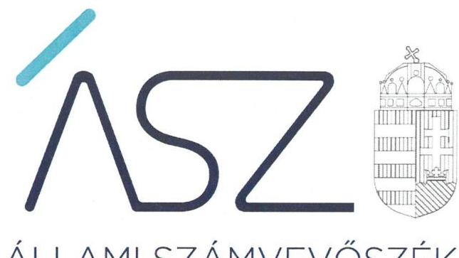
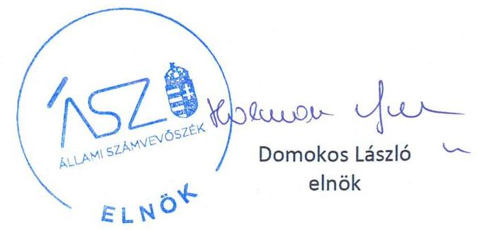
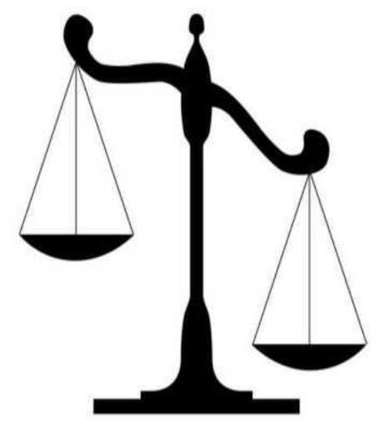

ÁLLAMI SZÁMVEVŐSZÉK

# JELENTÉS

A költségvetési támogatásban részesülő pártalapítványok 2017-2018. évi gazdálkodása törvényességének ellenőrzése

Ökopolisz Alapítvány

2020.

20165
www.asz.hu

---

ÁLLAMI SZÁMVEVŐSZÉK

# JELENTÉS

A költségvetési támogatásban részesülő pártalapítványok 2017-2018. évi gazdálkodása törvényességének ellenőrzése

Ökopolisz Alapítvány

2020. 08. hó 17. nap

20165
www.asz.hu

---

# AZ ELLENŐRZÉST FELÜGYELTE: 

KAKAS SÁNDOR felügyeleti vezető

## AZ ELLENŐRZÉST VEZETTE ÉS A VÉGREHAJTÁSÁÉRT FELELŐS:

GÁL MAGDOLNA ellenőrzésvezető

## A PROGRAM ÖSSZEÁLLÍTÁSÁÉRT FELELŐS:

BERTALAN RUDOLF GYULA projektvezető

## A TÉMÁHOZ KAPCSOLÓDÓ KORÁBBI SZÁMVEVŐSZÉKI JELENTÉSEK:

- címe: Jelentés - A költségvetési támogatásban részesülő pártalapítványok 2015-2016. évi gazdálkodása törvényességének ellenőrzése - Ökopolisz Alapítvány
- sorszáma: 18217

Jelentéseink az Országgyúlés számítógépes hálózatán és az interneten a www.asz.hu címen is olvashatóak.

IKTATÓSZÁM: EL-2829-001/2020
TÉMASZÁM: 2521
ELLENŐRZÉS-AZONOSÍTÓ SZÁM: V086503

---

# TARTALOMJEGYZÉK 

■ ÖSSZEGZÉS ..... 5
■ AZ ELLENŐRZÉS CÉLJA ..... 6
■ AZ ELLENŐRZÉS TERÜLETE ..... 7
■ AZ ELLENŐRZÉS HÁTTERE, INDOKOLTSÁGA ..... 8
■ A JELENTÉS LÉNYEGES KÉRDÉSKÖREI ..... 9
■ AZ ELLENŐRZÉS HATÓKÖRE ÉS MÓDSZEREI ..... 10
■ MEGÁLLAPÍTÁSOK ..... 13
■ JAVASLATOK ..... 16
■ MELLÉKLETEK ..... 17
I. sz. melléklet: Értelmező szótár ..... 17
II. sz. melléklet: Az ÁSZ 18217 számú jelentéséhez kapcsolódó intézkedési terv végrehajtásáról ..... 18
■ FÜGGELÉK: ÉSZREVÉTELEK ..... 21
■ RÖVIDÍTÉSEK JEGYZÉKE ..... 25

---

.

---

# ÖSSZEGZÉS 

Az Ökopolisz Alapítvány 2017-2018. évi gazdálkodására vonatkozó belső szabályozása nem felelt meg a jogszabályi előírásoknak. A 2017-2018. években a tevékenységéről szóló éves jelentések készítése során nem biztosította a költségvetési támogatás felhasználásának átláthatóságát, elszámoltathatóságát.

## Az ellenőrzés társadalmi indokoltsága

A Párt tv. ${ }^{1}$ 9/A § (1) bekezdése alapján a politikai kultúra fejlesztése érdekében tudományos, ismeretterjesztő, kutatási, oktatási tevékenység folytatása céljából létrehozott pártalapítványok gazdálkodása törvényességének ellenőrzése - Pártalapítványi tv. ${ }^{2}$ 4. § (2) bekezdése értelmében - az ÁSZ ${ }^{3}$ feladata. E törvény 4. § (4) bekezdése alapján az ÁSZ kétévente - kötelező jelleggel - ellenőrzi azoknak a pártalapítványoknak a gazdálkodását, amelyek állami költségvetési támogatásban részesültek.

Az ÁSZ, mint az Országgyűlés ellenőrző szerve a pártalapítványok gazdálkodása törvényességének/szabályszerűségének értékelésével hozzájárul ahhoz, hogy a társadalom objektív képet alkothasson a pártalapítványok működéséről. A jelentésben foglalt megállapítások, következtetések és javaslatok alapján a törvényalkotók konkrét lépéseket tehetnek a pártalapítványokra vonatkozó szabályozások megváltoztatása, átláthatóbbá, ellenőrizhetőbbé tétele irányába. Az ellenőrzött szervezetek szintjén a hiányosságok, szabálytalanságok feltárása, az ennek kapcsán megfogalmazott megállapítások elősegíthetik a pártalapítványok szabályszerű gazdálkodását.

Az ÁSZ stratégiájában megfogalmazta, hogy az államháztartáson kívülre nyújtott költségvetési támogatások és az ingyenes vagyonjuttatás ellenőrzésével hozzájárul ahhoz, hogy a közpénzeket a civil szervezetek is átlátható módon használják fel. A pártalapítványok gazdálkodása szabályszerűségének bemutatásával az ellenőrzés értékteremtő módon járul hozzá az ÁSZ stratégiai céljainak megvalósításához, a nyilvánosság megfelelő tájékoztatásához.

Az ÁSZ 2018. évben ellenőrizte a Pártalapítvány ${ }^{4}$ 2015-2016. évi gazdálkodásának törvényességét.

## Főbb megállapítások, következtetések, javaslatok

Az Ökopolisz Alapítvány a 2017-2018. években a gazdálkodására vonatkozó belső szabályait nem a jogszabályi előírásoknak megfelelően alakította ki, nem határozta meg a költségvetési támogatás felhasználásának nyilvántartási szabályait. Az Ökopolisz Alapítvány az alkalmazott könyvviteli rendszereiben nem biztosította a tevékenységéről közzétett éves jelentések részeként elkészített - a költségvetési támogatás felhasználására vonatkozó - kimutatás adatainak alátámasztását, így nem teremtette meg a költségvetési támogatás felhasználásának elszámoltathatóságát.

Az Ökopolisz Alapítvány ráfordításainak elszámolása 2017. évben nem volt szabályszerű, 2018. évben szabályszerű volt.

A 2015-2016. évi gazdálkodás ellenőrzéséről szóló 18217. számú számvevőszéki jelentésben foglalt megállapításokhoz kapcsolódó intézkedéseket az Ökopolisz Alapítvány végrehajtotta, melynek eredményeként a szabályozottsága javult.

Az Állami Számvevőszék az Ökopolisz Alapítvány kuratóriumi társelnökeinek egy javaslatot fogalmazott meg. A javaslatot megalapozó megállapításra az érintettnek 30 napon belül intézkedési tervet kell készítenie.

---

# AZ ELLENŐRZÉS CÉLJA 

Az ellenőrzés célja annak megállapítása volt, hogy a pártalapítvány törvényesen gazdálkodott-e, az éves számviteli beszámolók és a pártalapítvány tevékenységéről szóló éves jelentések a jogszabályi előírásoknak megfeleltek-e, a könyvvezetés és gazdálkodás során a vonatkozó jogszabályi rendelkezéseket és belső előírásokat betartották-e. Az ellenőrzés célja továbbá annak értékelése volt, hogy az előző számvevőszéki jelentésben foglalt megállapításokkal összhangban készített intézkedési tervben meghatározott feladatokat az ellenőrzött szervezet végrehaj-totta-e.

---

# AZ ELLENŐRZÉS TERÜLETE 

## Ökopolisz Alapítvány

Az ellenőrzés a Párt tv. alapján a politikai kultúra fejlesztése érdekében tudományos, ismeretterjesztő, kutatási, oktatási tevékenység folytatása céljából, a Ptk. ${ }^{5}$ szerinti létesítő/alapító okiraton alapuló bírósági nyilvántartásba vétellel létrejött pártalapítvány gazdálkodására terjedt ki.

A pártalapítvány törvényes gazdálkodásának (könyvvezetése, beszámolása, jelentéstétele) szabályait alapvetően a Pártalapítványi tv-en túl, a Számv. tv. ${ }^{6}$, és a Számviteli vhr. ${ }^{7}$ határozzák meg.

Az utóellenőrzés az ÁSZ tv. ${ }^{8}$-nek megfelelően a Pártalapítványnál 2018. évben végzett ellenőrzés alapján készített 18217. számú jelentésben foglalt megállapításokra készített intézkedési tervben foglaltak végrehajtásának ellenőrzésére terjedt ki.

A Pártalapítványt 2010-ben a Lehet Más a Politika párt határozatlan időtartamra hozta létre. Az Alapító ${ }^{9}$ a Pártalapítványt 500 ezer Ft induló vagyonnal alapította, ami az ellenőrzött időszakban nem változott.

A Pártalapítvány célja az állampolgári tájékoztatás és tájékozódás javítása, a politikai kultúra fejlesztése és a közjó szolgálata, kiemelten az ökopolitikai gondolkodásmód elterjesztése, az ökopolitikai alternatívák megfogalmazása, valamint az ökopolitika képviseletének elősegítése a fenntarthatóság, a közügyekben való állampolgári részvétel és az igazságosság széleskörű népszerűsítése révén.

A Pártalapítvány a 2017. évben 67,6 millió Ft, a 2018. évben 70,7 millió Ft költségvetési támogatásban részesült. Az ellenőrzött években vállalkozási tevékenységet nem folytatott.

A Pártalapítvány az ellenőrzött időszakban nem alapított más jogalanyt, nem volt tagja más jogalanynak, illetve nem csatlakozott más jogalanyhoz.

---

# AZ ELLENŐRZÉS HÁTTERE, INDOKOLTSÁGA 

Társadalmi elvárás a közpénzek értékelvű, rendeltetésszerű felhasználása, a közpénzekből nyújtott támogatások átláthatóságának megteremtése, amelyhez az ÁSZ az államháztartásból nyújtott támogatások ellenőrzésével kíván hozzájárulni. A Párt tv. 9/A. § (1) bekezdése alapján a politikai kultúra fejlesztése érdekében tudományos, ismeretterjesztő, kutatási, oktatási tevékenység folytatása céljából létrehozott pártalapítványok gazdálkodása törvényességének ellenőrzése - Pártalapítványi tv. 4. § (2) bekezdése értelmében - az ÁSZ feladata. E törvény 4. § (4) bekezdése alapján az ÁSZ kétévente - kötelező jelleggel - ellenőrzi azoknak a pártalapítványoknak a gazdálkodását, amelyek állami költségvetési támogatásban részesültek.

Az ÁSZ, mint az Országgyűlés ellenőrző szerve a pártalapítványok gazdálkodása törvényességének/szabályszerűségének értékelésével hozzájárul ahhoz, hogy a társadalom objektív képet alkothasson a pártalapítványok működéséről. Az ellenőrzés eredményeinek célzott felhasználói a nyilvánosság, a jogalkotó, továbbá a pártalapítványok esetén azok alapítója és szervei. A jelentésben foglalt megállapítások, következtetések és javaslatok alapján a törvényalkotók konkrét lépéseket tehetnek a pártalapítványokra vonatkozó szabályozások megváltoztatása, átláthatóbbá, ellenőrizhetőbbé tétele irányába. Az ellenőrzött szervezetek szintjén a hiányosságok, szabálytalanságok feltárása, az ennek kapcsán megfogalmazott megállapítások elősegíthetik a pártalapítványok szabályszerű gazdálkodását.

Az ÁSZ tv. 33. § (1) bekezdése értelmében az ellenőrzött szervezet vezetője köteles a jelentésben foglalt megállapításokhoz kapcsolódó intézkedési tervet összeállítani, és azt a jelentés kézhezvételétől számított harminc napon belül az ÁSZ részére megküldeni.

Az ÁSZ által befogadott intézkedési tervben foglaltak megvalósítását az ÁSZ törvény 33. § (7) bekezdésében foglaltak alapján - az ÁSZ utóellenőrzés keretében ellenőrizheti. Az utóellenőrzések keretében - az intézkedések értékelése során - az ÁSZ figyelembe veszi az ellenőrzött szervezetek működési feltételeiben, valamint a jogszabályi előírásokban bekövetkezett változásokat.

---

# A JELENTÉS LÉNYEGES KÉRDÉSKÖREI 

1. Az Ökopolisz Alapítvány gazdálkodásának törvényessége biztositott volt-e?
2. Az Ökopolisz Alapítvány könyvvezetése és gazdálkodása során a vonatkozó jogszabályi rendelkezéseket és belső előírásokat betartották-e?
3. Az Ökopolisz Alapítvány tevékenységéről szóló éves jelentések, az éves számviteli beszámolók a jogszabályi előírásoknak meg-feleltek-e?
4. Az Ökopolisz Alapítvány az intézkedési tervben meghatározott feladatokat végrehajtotta-e?

---

# AZ ELLENŐRZÉS HATÓKÖRE ÉS MÓDSZEREI 

## Az ellenőrzés típusa

Szabályszerúségi ellenőrzés.

## Az ellenőrzött időszak

2017-2018. évek
Az utóellenőrzés tekintetében a 18217. számú számvevőszéki jelentés közzétételének napjától (2018. augusztus 30.) a kiértesítő levél keltéig (2019. november 28.) tartó időszak.

## Az ellenőrzés tárgya

Az ellenőrzés tárgyát képezte a pártalapítvány gazdálkodása, a könyvvezetés szabályozása és gyakorlata szabályszerűsége, az éves számviteli beszámolókra és az alapítvány tevékenységéről szóló éves jelentésekre vonatkozó kötelezettség teljesítése, valamint a gazdálkodáshoz kapcsolódó ellenőrzések javaslatainak hasznosítására irányuló tevékenység.

Az ellenőrzés kiterjedt minden olyan körülményre és adatra, amely az ÁSZ jogszabályban meghatározott feladatainak teljesítéséhez, valamint a program végrehajtása folyamán felmerült újabb összefüggések feltárásához szükséges.

## Az ellenőrzött szervezet

Ökopolisz Alapítvány

## Az ellenőrzés jogalapja

Az ÁSZ tv. 1. § (3) bekezdése, 5. § (3) bekezdése, 33. § (7) bekezdése, a Pártalapítványi tv. 4. § (2) és (4) bekezdései.

## Az ellenőrzés módszerei

Az ellenőrzést az ÁSZ az Ellenőrzési program szempontjai, az ellenőrzött időszakban hatályos jogszabályok, a jelen ellenőrzésre irányadó ÁSZ módszertan figyelembe vételével végezte el.

Az ellenőrzés ideje alatt az ellenőrzött szervezettel történő kapcsolattartás az ÁSZ SZMSZ ${ }^{10}$-ének vonatkozó előírásai alapján történt.

---

Az ellenőrzést az ÁSZ az ellenőrzött szervezet által rendelkezésre bocsátott dokumentumokra, adatokra alapozta. A rendelkezésre bocsátott adatok, információk kontrollja az ellenőrzés keretében történt. Az ellenőrzés céljának eléréséhez szükséges bizonyítékok megszerzése az egyes adatok közvetlen, részletes elemzésével történt a következő ellenőrzési eljárások alkalmazásával: szemrevételezés, mintavétel, valamint elemző eljárás.

A 2017-2018. évi a Pártalapítvány által nyújtott támogatások elszámolásának, és a Pártalapítvány 2018. évi beszámolójánál a mérlegtételek besorolása, év végi értékelése, azok leltárral való alátámasztottsága szabályszerűsége esetében tételes ellenőrzésre került sor.

Mintavétellel ellenőrizte az ÁSZ a Pártalapítvány 2017-2018. évi kiadásai, ráfordításai elszámolásának és a Pártalapítvány 2017. évi beszámolójánál a mérlegtételek besorolása, év végi értékelése, azok leltárral való alátámasztottsága szabályszerűségét.

A mintavétellel ellenőrzött területek esetében minden egyes tétel vonatkozásában a szabályszerűségre vonatkozó kérdéseket tett fel az ÁSZ. Szabályszerűnek minősült egy ellenőrzött területet, amennyiben 95\%-os bizonyossággal az ellenőrzött sokaságban az átlagos hibaarány legfeljebb 10\%, nem szabályszerűnek, amennyiben 10\%-nál magasabb arányt képviselt.

Abban az esetben, ha az ellenőrzött sokaság tekintetében a 10\%-os hibaarányhoz való viszony megítélésnek megbízhatósága nem érte el a 95\%ot, annak elérése érdekében az értékelést további szempontokkal egészítette ki az ÁSZ, és figyelembe vette a feltárt hibák értékét.

Az ellenőrzési bizonyítékként felhasználható adatforrások közé tartoztak egyrészt az Ellenőrzési program részletes szempontjainál felsorolt adatforrások, másrészt minden egyéb -az ellenőrzés folyamán - feltárt, az ellenőrzés szempontjából információt tartalmazó dokumentum.

Az ellenőrzés lefolytatásához az ellenőrzött a tanúsítványok kitöltésével, valamint az ÁSZ által kért dokumentumok elektronikus megküldésével szolgáltatott adatokat. Az így rendelkezésre bocsátott adatok, információk, a tanúsítványok adatai valódiságának kontrollja az ellenőrzés keretében történt.

Az utóellenőrzés megállapításait az ÁSZ rendelkezésére álló dokumentumok, valamint az ÁSZ adatbekérése szerint, az ellenőrzött szervezetek által elektronikusan rendelkezésre bocsátott dokumentumok, adatok alapján értékelte. Az ÁSZ az ellenőrzés során az intézkedési tervekben előírt feladatokat, azok végrehajthatósága, illetve végrehajtása szempontjából az alábbiak szerint értékelte:
„határidőben végrehajtott" a feladat, ha a teljesítés dokumentáltan, az intézkedési tervben előírt határidőben és tartalommal megtörtént;
„határidőn túl végrehajtott" a feladat, ha annak teljesítése az intézkedési tervben meghatározott módon, de az abban előírt határidőn túl történt meg;
„nem végrehajtott" a feladat, ha a végrehajtás nem történt meg, vagy amennyiben a teljesítést/végrehajtást nem dokumentálták, dokumentumokkal nem tudták igazolni annak teljesítését;
„okafogyottá vált" a feladat, ha végrehajtására - meghatározott esemény bekövetkezése, továbbá külső körülmény, a működést

---

érintő feltétel változása miatt - már nem volt szükség, illetve lehetőség, és egyértelműen megállapítható, hogy az intézkedést szükségessé tevő körülmény a jövőben nem fordulhat elő;
„nem időszerű" az a feladat, amelynek ellenőrzési időszakon belüli végrehajtására azért nem került (kerülhetett) sor, mert az intézkedés alapjául szolgáló esemény nem következett be, de annak jövőbeni előfordulása lehetséges, a végrehajtása nem volt esedékes, vagy a végrehajtás határideje még nem járt le.

---

# 1. Az Ökopolisz Alapítvány gazdálkodásának törvényessége biztosított volt-e? 

## Összegző megállapítás

A Pártalapítvány gazdálkodására vonatkozó belső szabályozása nem felelt meg a jogszabályi előírásoknak.

A Pártalapítvány kialakította a számviteli politikáját ${ }_{1-3}{ }^{11}$, és annak keretében a leltározási szabályzatot ${ }^{12}$, az értékelési szabályzatot ${ }^{13}$ és 2017. január 27-től a pénzkezelési szabályzatot ${ }_{1-4}{ }^{14}$. A Pártalapítvány elkészítette a számlarendjét ${ }_{1-2}{ }^{15}$.

A Pártalapítvány a Számv. tv. 161/A. § (2) bekezdése, továbbá a Számviteli vhr. 2 14. § (1) bekezdése ellenére a nyilvántartási rendszerét nem alakította ki olyan részletezettséggel, hogy abból a Pártalapítványi tv. 3/A. §. (3) bekezdés b) pontja szerinti - a költségvetési támogatás felhasználására vonatkozó kimutatás adataival kapcsolatos - információk rendelkezésre álljanak.

## 2. Az Ökopolisz Alapítvány könyvvezetése és gazdálkodása során a vonatkozó jogszabályi rendelkezéseket és belső előírásokat betartották-e?

## Összegző megállapítás

A Pártalapítvány a 2017-2018. években a könyvvezetése és gazdálkodása során nem tartotta be a vonatkozó jogszabályi rendelkezéseket.

A Pártalapítvány a 2017. és 2018. években a Számv. tv. 161/A. § (2) bekezdésének előírása ellenére a közpénzek felhasználásának ellenőrizhetősége érdekében a nyilvántartási (könyvvezetési) rendszerében nem alkalmazott olyan részletezést, amely biztosítja a Pártalapítványi tv. 3/A. § (3) bekezdés b) pontjában előírt, a költségvetési támogatás felhasználására vonatkozó kimutatás adatainak alátámasztását.

A 2017. évben a Pártalapítvány ráfordításainak elszámolása nem volt szabályszerű, mert a kiadások elszámolását alátámasztó bizonylatok a Számv. tv. 167. § (1) bekezdés c) és h) pontjaiban előírtak ellenére nem tartalmazták a rendelkezés végrehajtását igazoló személy aláírását, és az érintett könyvviteli számlákra történő hivatkozást. A 2018. évben a ráfordítások elszámolása szabályszerű volt.

A Pártalapítvány a 2017-2018. években összesen 4,2 millió Ft támogatást nyújtott harmadik fél részére. A célszerinti támogatások elbírálása, a támogatási szerződések megkötése, a nyújtott támogatások folyósítása, valamint a támogatások nyilvántartása szabályszerű volt.

---

A Pártalapítvány a 2017-2018. években összesen 4,4 millió Ft külföldről származó támogatást fogadott el. A támogatások elfogadása során érvényesültek a Pártalapítványi tv. 3. § (3) bekezdése, és a (4) bekezdés b) pontjának előírásai.

Az ellenőrzött időszakban a Pártalapítvány az alapító párt részére vagyoni hozzájárulást nem nyújtott.

# 3. Az Ökopolisz Alapítvány tevékenységéről szóló éves jelentések, az éves számviteli beszámolók a jogszabályi előírásoknak megfeleltek-e? 

## Összegző megállapítás

Az ellenőrzött időszakban a Pártalapítvány tevékenységéről szóló éves jelentések elkészítésénél nem tartották be, az éves számviteli beszámolók elkészítésénél betartották a jogszabályi előírásokat.

A Pártalapítvány által a 2017. évi és 2018. évi tevékenységéről közzétett éves jelentéseiben a költségvetési támogatás felhasználására vonatkozó kimutatás adatai a 2. pontban leírt könyvvezetési hiányosságok miatt nem voltak nyilvántartással alátámasztottak.

A Pártalapítvány a Kuratórium által elfogadott 2017. évi és 2018. évi egyszerűsített éves beszámolói letétbe helyezését szabályszerűen végezte.

A Pártalapítvány egyszerűsített éves beszámolói mérlegtételeinek besorolása, év végi értékelése szabályszerűen történt. Az egyszerűsített éves beszámolók elkészítéséhez a leltározást elvégezték, a mérlegtételeket szabályszerűen, tételes leltárral alátámasztották.

## 4. Az Ökopolisz Alapítvány az intézkedési tervben meghatározott feladatokat végrehajtotta-e?

## Összegző megállapítás

A Pártalapítvány az intézkedési tervben meghatározott feladatokat végrehajtotta.

A Pártalapítvány a 2015-2016. évi gazdálkodása törvényességének ellenőrzéséről szóló számvevőszéki jelentésben ${ }^{16}$ megfogalmazott javaslatok alapján hét pontból álló intézkedési tervet készített. A Pártalapítvány az intézkedési tervben vállalt feladatokat határidőben végrehajtotta:

- A Kuratórium elfogadta a Számv. tv. szerinti számviteli politikát, az eszközök és források leltárkészítési és leltározási szabályzatát, az eszközök és források értékelési szabályzatát, a pénzkezelési szabályzatot és a számlarendet.
- A Kuratórium társelnökei írásban utasították az irodavezetőt, hogy gondoskodjon az Info tv. szerinti szabályok, az egyéb adat- és titokvédelmi szabályok elkészítéséről. A Kuratórium elfogadta a Pártalapítványra és munkavállalóira hatályos Adatkezelési Szabályzatokat ${ }_{1-2}{ }^{17}$.

---

- A Kuratórium határozatban utasította az irodavezetőt, hogy gondoskodjon a külföldről származó támogatások Pártalapítvány honlapján történő 30 napon belüli közzétételéről.
- A Kuratórium társelnökei írásban utasították a pénzügyekért és gazdálkodásért felelős munkatársat olyan könyvviteli nyilvántartás vezetésére, mely az eszközökben és forrásokban bekövetkezett változást a valóságnak megfelelően, folyamatosan, zárt rendszerben, áttekinthetően mutatja be.
- A Kuratórium társelnökei írásban utasították a pénzügyekért és gazdálkodásért felelős munkatársat a ráfordítások jogszabály szerinti könyvelésére, a tényleges gazdasági tartalom szerinti megítélésére, a bizonylat nélküli gazdasági esemény könyvelésének tilalmára.
- A Kuratórium társelnökei írásban utasították a pénzügyekért és gazdálkodásért felelős munkatársat a Számv. tv. 161/A. § (2) bekezdés szerinti nyilvántartási rendszer kialakítási, és továbbrészletezési kötelezettség betartására, valamint a Pártalapítványi tv. 3/A. § (3) bekezdés b) pont szerinti kimutatás átláthatóságának biztosítására.
- A Kuratórium társelnökei írásban utasították a pénzügyekért és gazdálkodásért felelős munkatársat az aktív időbeli elhatárolások jogszabály szerinti alkalmazására, a rövidlejáratú kötelezettségeket érintő gazdasági események egyedi elszámolására, az alaptevékenységből származó bevételek jogszabály szerinti kimutatására, az egyszerűsített éves beszámolók jogszabály szerinti leltárral való alátámasztására.
Az intézkedési tervben meghatározott feladatokat, határidőket, felelősöket és a feladatok végrehajtását a II. számú melléklet mutatja be.

---

# JAVASLATOK 

Az ÁSZ tv. 33. § (1) bekezdésében foglaltak értelmében az ellenőrzött szervezet vezetője köteles a jelentésben foglalt megállapításokhoz kapcsolódó intézkedési tervet összeállítani és azt a jelentés kézhezvételétől számított 30 napon belül az ÁSZ részére megküldeni. Amennyiben az ellenőrzött szervezet vezetője nem küldi meg határidőben az intézkedési tervet, vagy továbbra sem elfogadható intézkedési tervet küld, az Állami Számvevőszék elnöke az ÁSZ tv. 33. § (3) bekezdése a) és b) pontjaiban foglaltakat érvényesítheti.

## az Ökopolisz Alapítvány kuratóriumi társelnökeinek

1. Intézkedjen a nyilvántartási (könyvvezetési) rendszerének továbbrészletezéséről, oly módon, hogy abból a közpénzek felhasználásával kapcsolatos információk rendelkezésre álljanak.
(2. sz. megállapítás 1. bekezdése alapján)

---

# MELLÉKLETEK 

- I. SZ. MELLÉKLET: ÉRTELMEZŐ SZÓTÁR
alapítvány
gazdasági-vállalkozási tevékenység
költségvetésből juttatott/nyújtott forrás/támogatás
pártalapítvány

Az alapítvány az alapító által az alapító okiratban meghatározott tartós cél folyamatos megvalósítására létrehozott jogi személy. Az alapító az alapító okiratban meghatározza az alapítványnak juttatott vagyont és az alapítvány szervezetét. Alapítvány nem alapítható gaz-dasági-vállalkozási tevékenység folytatására. Az alapítvány az alapítványi cél megvalósításával közvetlenül összefüggő gazdasági tevékenység végzésére jogosult. Alapítvány nem lehet korlátlan felelősségű tagja más jogalanynak, nem létesíthet alapítványt és nem csatlakozhat alapítványhoz. (Forrás: Ptk. 3:378. §, 3:379. § (1) - (3) bekezdés)
A jövedelem- és vagyonszerzésre irányuló vagy azt eredményező, üzletszerűen végzett gazdasági tevékenység, kivéve az adomány (ajándék) elfogadását, a létesítő okiratban meghatározott cél szerinti tevékenységet (ideértve a közhasznú tevékenységet is), - 2015. november 28 -tól - a pénzeszközök betétbe, értékpapírba, társasági részesedésbe történő elhelyezését és az ingatlan megszerzését, használatának átengedését és átruházását. (Forrás: Ectv. ${ }^{18}$ 2. § 11. pont.)
A pártalapítványoknak a Párt tv. 9/A. § (1) bekezdése és a Pártalapítványi tv. 1. § előírásainak értelmében, az éves költségvetési törvények szerint - jellemzően az 1. számú melléklet I. Országgyűlés fejezet 9. Pártalapítványok támogatás címen - az állami költségvetésből juttatott forrás/támogatás.
az államháztartás központi alrendszeréből - a Tb alap kivételével - ellenérték nélkül, pénzben nyújtott költségvetési támogatás (Forrás: Áht. ${ }^{19}$ 1. § 14. pont)
A politikai kultúra fejlesztése érdekében, tudományos, ismeretterjesztő, kutatási és oktatási tevékenység folytatása céljából pártok által létrehozott, külön jogszabályban - a Pártalapítványi tv. 1. § és 3. § (1) bekezdése - meghatározott, jogi személynek minősülő egyéb szervezet, speciális jogállású alapítvány (Forrás: Párt tv. 9/A. § (1) bekezdés, Pártalapítványi tv. 1. §, Ectv. 1. § (2) bekezdés, 2. § 6. c) pont, Számv. tv. 3. § (1) bekezdése 4. pont, Számviteli vhr. 2 2. § (1) bekezdés I) pont)

---

# II. SZ. MELLÉKLET: AZ ÁSZ 18217 SZÁMÚ JELENTÉSÉHEZ KAPCSOLÓDÓ INTÉZKEDÉSI TERV VÉGREHAJTÁSÁRÓL

|  SZTÉSZ | Intézkedési tervben meghatározott feladat | Az intézkedési tervben meghatározott határidő | Az intézkedési tervben meghatározott feladat felelőse | A feladat végrehajtása  |
| --- | --- | --- | --- | --- |
|  1. | A kuratórium kuratóriumi határozatban fogadja el a Pártalapítvány jelenleg hatályos jogszabályok szerinti, a Számv. tv. 14. § (3)-(4) bekezdéseiben meghatározott számviteli politikáját; a Számv, tv, 14. § (5) bekezdés a)-b) és d) pontjaiban előírt eszközök és források leltárkészítési és leltározási szabályzatát, eszközök és források értékelési szabályzatával, pénzkezelési szabályzattal; a Számv. tv. 161. § (1) bekezdésében meghatározott számlarenddel együtt. | 2018. december 31. | Kuratórium társelnőkei, pénzügyekért és gazdálkodásért felelős munkatárs | A Kuratórium 2017. február 15-én elfogadta a Pártalapítvány számviteli politikáját, leltározási-, értékelési-, pénzkezelési szabályzatát, valamint a számlarendjét.  |
|  2. | A Pártalapítvány társelnőkei írásban utasítják az irodavezetőt, hogy gondoskodjon az Info tv. 25/I. §-ában foglalt rendelkezéseknek megfelelően azon eljárási szabályok kialakításáról, amelyek az Info tv., valamint egyéb adat- és titokvédelmi szabályok érvényre juttatásához szükségesek. | 2018. november 30. | Kuratórium társelnőkei, irodavezető | A Pártalapítvány társelnőkei 2018. október 05-én írásban utasították az irodavezetőt, hogy gondoskodjon az Info tv. szerinti szabályok, az egyéb adat- és titokvédelmi szabályok elkészítéséről. Pártalapítvány külön elkészítette a Pártalapítványra és a munkavállalóira vonatkozó Adatkezelési Szabályzatokat. (50/2018. (2018.11.29.) és 52/2018. (2018.11.29.) számú határozat)  |
|  3. | A kuratórium kuratóriumi határozatban utasítja a pénzügyekért és gazdálkodásért felelős munkatársat, hogy a külföldről származó támogatások beérkezését követő öt napon belül jelezze a támogatás beérkezését az irodavezető számára, akivel közösen ellenőrzik az összeg származását, helyességét, befogadhatóságát. A beérkezett összeg befogadásáról a kuratóriumi társelnők szavazást ír ki, a meghozott határozat alapján az Irodavezető gondoskodik a 30 napon belüli, honlapon történő közzétételről. A Pártalapítvány a honlapján feltüntette a külföldről érkező támogatások összegét. | 2018. november 30. | Kuratórium társelnőkei, pénzügyekért és gazdálkodásért felelős munkatárs, irodavezető | A Kuratórium 2018. november 29-én 51/2018. (2018.11.29.) számú határozatában utasította az irodavezetőt, hogy a külföldről származó támogatásokat azok beérkezését, egyeztetését, ellenőrzését és a határozathozatalt követően 30 napon belül a Pártalapítvány honlapján tegye közzé.  |
|  4. | A Pártalapítvány társelnőkei írásban utasítják a pénzügyekért és gazdálkodásért felelős munkatársat, hogy gondoskodjon a Számv. tv. által előírt olyan könyvviteli nyilvántartás vezetéséről, amely az eszközökben és a forrásokban bekövetkezett változásokat a valóságnak megfelelően, folyamatosan, zárt rendszerben, áttekinthetően mutatja. | 2018. december 31. | Kuratórium társelnőkei, pénzügyekért és gazdálkodásért felelős munkatárs | A Pártalapítvány társelnőkei írásban, 2018. október 5-én utasították a pénzügyekért és gazdálkodásért felelős munkatársat, hogy gondoskodjon a Számv. tv. által előírt olyan könyvviteli nyilvántartás vezetéséről, amely az eszközökben és a forrásokban bekövetkezett változásokat a valóságnak megfelelően, folyamatosan, zárt rendszerben, áttekinthetően mutatja.  |

---

|  5. | A Pártalapítvány társelnókei írásban utasítják a pénzügyekért és gazdálkodásért felelős munkatársat, hogy gondoskodjon a ráfordítások szabályszerű elszámolásáról és a Számv. tv. 167. § (1) bekezdés c) pontjában, valamint az SZMSZ-ben foglalt rendelkezések szerint az utalványozás és a végrehajtás igazolásáról. Továbbá gondoskodjon arról, hogy a ráfordításokat a Számv. tv. 16. § (3) bekezdésében foglalt „a tartalom elsődlegessége a formával szemben" számviteli alapelvnek megfelelően a tényleges gazdasági tartalmuknak megfelelően vegyék nyilvántartásba és a Számv. tv. 165. § (I)-(2) bekezdéseinek előírása szerint ne történjen a könyvviteli nyilvántartásban bizonylat nélkül gazdasági események rögzítése. | 2018. november 30. | Kuratórium társelnókei, pénzügyekért és gazdálkodásért felelős munkatárs. | A Pártalapítvány társelnókei írásban, 2018. október 5.-én utasították a pénzügyekért és gazdálkodásért felelős munkatársat, hogy gondoskodjon a ráfordítások szabályszerű elszámolásáról, az utalványozás és a végrehajtás igazolásáról. Továbbá gondoskodjon arról, hogy a ráfordításokat a tényleges gazdasági tartalmuknak megfelelően vegyék nyilvántartásba és ne történjen a könyvviteli nyilvántartásban bizonylat nélkül gazdasági események rögzítése.  |
| --- | --- | --- | --- |
|  6. | A Pártalapítvány társelnókei írásban utasítják a pénzügyekért és gazdálkodásért felelős munkatársat, gondoskodjon arról, hogy a Pártalapítvány a Számv. tv. 161/A. § (2) bekezdésében és a Számviteli vhr. ${ }^{20}$ 17. § (8) bekezdésében előírt nyilvántartási (könyvvezetési) rendszer kialakítási, továbbrészletezési kötelezettségének tegyen eleget; az éves jelentésének készítése során biztosítsa a Pártalapítványi tv. 3/A. § (3) bekezdés b) pontjában előírt költségvetési támogatások felhasználására vonatkozó kimutatás és az abban szereplő összegek felhasználása átláthatóságát, ellenőrizhetőségét. | 2018. november 30. | Kuratórium társelnókei, pénzügyekért és gazdálkodásért felelős munkatárs. | A Pártalapítvány társelnókei írásban 2018. október 5.-én utasították a pénzügyekért és gazdálkodásért felelős munkatársát, gondoskodjon arról, hogy a Pártalapítvány nyilvántartási rendszer kialakítása, továbbrészletezési kötelezettségének tegyen eleget, az éves jelentésének készítése során biztosítsa a költségvetési támogatások felhasználására vonatkozó kimutatás, és az abban szereplő összegek felhasználása átláthatóságát, ellenőrizhetőségét.  |
|  7. | A Pártalapítvány társelnókei írásban utasítják a pénzügyekért és gazdálkodásért felelős munkatársat,
- hogy a jövőben a Számv. tv. 16. § (2) és 32. § (1) bekezdéseiben foglaltak szerint a kiszámlázott, de csak a tárgyévet követően esedékes bevétele az aktív időbeli elhatárolások között mutassa ki.
- hogy a jövőben a pénzeszközöket és a rövid lejáratú kötelezettségeket érintő gazdasági eseményeket a Számv. tv. 16. § (1) bekezdésében foglaltak szerint egyedileg számolja el, a Pártalapítvány az alaptevékenységből származó, kiszámlázott bevételeket a Számv, tv. 72. § (2) bekezdés a) pontjában foglaltak szerint mutassa ki.
- hogy a Pártalapítvány egyszerűsített éves beszámolóit a Számv. tv. 69, § (1) bekezdésében foglaltak szerint leltárral támassza alá. Továbbá az elkülönített betétszámlákon a lekötésekről, szerződésenként vezessen analitikus nyilvántartást. Gondoskodjon az analitikus nyilvántartások vezetéséről a Számv. tv. 69. § (2) bekezdésében foglaltak betartásáról. | 2018. november 30. | Kuratórium társelnókei, pénzügyekért és gazdálkodásért felelős munkatárs. | A Pártalapítvány társelnókei írásban 2018. október 5.-én utasították a pénzügyekért és gazdálkodásért felelős munkatársát, hogy a jövőben a kiszámlázott, de csak a tárgyévet követően esedékes bevételeket az aktív időbeli elhatárolások között mutassa ki, a pénzeszközöket és a rövid lejáratú kötelezettségeket érintő gazdasági eseményeket egyedileg számolja el, a Pártalapítvány az alaptevékenységből származó, kiszámlázott bevételeket jogszabály szerint mutassa ki, a Pártalapítvány egyszerűsített éves beszámolóit leltárral támassza alá. Továbbá az elkülönített betétszámlákon a lekötésekről, szerződésenként vezessen analitikus nyilvántartást. Gondoskodjon az analitikus nyilvántartások vezetéséről.  |

---

.

---

# FÜGGELÉK: ÉSZREVÉTELEK 

A jelentéstervezetet a Számvevőszék 15 napos észrevételezésre megküldte az ellenőrzött szervezetek vezetőinek az ÁSZ tv. 29. §* (1) bekezdése előírásának megfelelően.

Az Ökopolisz Alapítvány kuratóriumi elnökei a jelentéstervezet megállapításaira észrevételt tettek.
Az ÁSZ tv. 29. § (3) bekezdésével összhangban az Állami Számvevőszék a Függelékben feltünteti az ellenőrzés megállapításaival kapcsolatban tett, figyelembe nem vett észrevételeket, és megindokolja, hogy azokat miért nem fogadta el.

Az Ökopolisz Alapítvány (továbbiakban: Pártalapítvány) kuratóriumi elnökei által a 2020. június 30 -án kelt levélben tett észrevételek és azok kezelésének indokolása:

1. A költségvetési támogatás felhasználás nyilvántartásával kapcsolatban tett észrevétel (Jelentéstervezet 1. megállapítás 2. bekezdése, 2. megállapítás 1. bekezdése, 3. megállapítás 1. bekezdése)

Az Ökopolisz Alapítvány kuratóriumi elnökei észrevételükben vitatták a jelentéstervezet azon megállapítását, miszerint a Pártalapítvány nem határozta meg a költségvetési támogatás nyilvántartási szabályait. Ennek alátámasztására kifejtették, hogy a Pártalapítvány szabályzatait a Számviteli törvény előírásai szerint készítették el és azok rendszeresen felülvizsgálatra is kerülnek. Álláspontjuk szerint a Pártalapítvány a Szerződési és Múködési Szabályzatában (továbbiakban: SZMSZ) határozza meg az egyes célszerinti tevékenységi csoportokhoz tartozó és alkalmazandó csoportazonosítókat, részlegszámokat. A részlegszámokból kiindulva képezik a szerződéskötéskor/ megrendeléskor a szerződés/rendelésszámot, amely egyrészt azonosítja az adott szerződést, megrendelést, költségtípust, másrészt munkaszámként szerepel az ezek nyomán keletkezett költség/ráfordítás számviteli elszámolásakor. A költségvetésben az egyes részlegszámok meghatározzák a célszerinti tevékenységcsoportot, a sorszám pedig a csoporton belül egy-egy elkülönülő költségfajtát vagy projekt azonosítót. Ez meghatározza a Költségvetési támogatás felhasználásának nyilvántartásának szabályait.

Az Ökopolisz Alapítvány kuratóriumi elnökeit az észrevételükre válaszolva tájékoztattuk, hogy az ellenőrzési adatbekérés során átadott, 2016. december 16-tól hatályos SZMSZ észrevételben hivatkozott 17.4 és 17.6 pontjai csak az iratok nyilvántartása céljából határoznak meg részlegszámokat és a szerződésszám/megrendelésszám képzés módját, a költségvetési támogatás felhasználása nyilvántartásának kialakítására vonatkozóan nem.

[^0]
[^0]:    * 29. § (1) Az Állami Számvevőszék az ellenőrzési megállapításait megküldi az ellenőrzött szervezet vezetőjének vagy az általa megbízott személynek, és annak, akinek személyes felelősségét állapította meg.
    (2) Az ellenőrzött szervezet vezetője és a felelősként megjelölt személy az ellenőrzés megállapításaira tizenöt napon belül írásban észrevételt tehet.
    (3) Az Állami Számvevőszék az észrevételre a beérkezésétől számított harminc napon belül írásban válaszol. A figyelembe nem vett észrevételeket köteles a jelentésben feltüntetni, és megindokolni, hogy azokat miért nem fogadta el.

---

A Pártalapítvány a Számv. tv. 161/A. § (2) bekezdése, továbbá a Számviteli vhr. 14. § (1) bekezdése ellenére a nyilvántartási rendszerét nem alakította ki olyan részletezettséggel, hogy abból a Pártalapítványi tv. 3/A. §. (3) bekezdés b) pontja szerinti - a költségvetési támogatás felhasználására vonatkozó kimutatás adataival kapcsolatos - információk rendelkezésre álljanak. A Pártalapítvány a számviteli politikájában, továbbá a számlarendjében sem szabályozta, hogy a főkönyvi számlák csoportosításával, vagy a főkönyvi könyveléshez kapcsolódó munkaszámos nyilvántartással, vagy más analitikus nyilvántartás vezetésével alátámaszthassa a költségvetési támogatások felhasználására vonatkozó kimutatás adatait. A Pártalapítvány 2017. és 2018. évi éves jelentései III. pontjában szereplő, a kapott költségvetési támogatás felhasználására vonatkozó kimutatását részletező nyilvántartásokkal nem támasztotta alá.

A Pártalapítvány kuratóriumi elnökei a 2019. november 05-én kelt teljességi és hitelességi nyilatkozatban az átadott dokumentumok hitelességéért, valódiságáért, hiánytalanságáért és hatályosságáért felelősséget vállaltak. Az Állami Számvevőszék az ellenőrzési megállapításait az ellenőrzési adatszolgáltatás során a részére törvényi határidőben rendelkezésre bocsátott hiteles dokumentumokra alapozva fogalmazza meg.

A fentiek alapján az észrevételt nem fogadtuk el, így a jelentéstervezet módosítása nem volt indokolt.

# 2. A pénzkezelési szabályzattal kapcsolatban tett észrevétel (Jelentéstervezet 1. megállapítás 1. bekezdése) 

Az Ökopolisz Alapítvány kuratóriumi elnökei észrevételükben vitatták a jelentéstervezet azon megállapítását, miszerint a Pártalapítvány csak 2017. január 27-től rendelkezett pénzkezelési szabályzattal. Ennek alátámasztására jelezték, hogy 2017 január 26-tal bezárólag az előző, 2016-ban módosított pénzkezelési szabályzat volt hatályban, melyet már a korábbi ellenőrzés során rendelkezésre bocsátottak, így a jelen ellenőrzéskor már nem csatoltak.

Az Ökopolisz Alapítvány kuratóriumi elnökeit az észrevételükre válaszolva tájékoztattuk, hogy az EL-1655001/2019. iktatószámú adatbekérő levélben kértük a Pártalapítvány 2017. és 2018. években hatályos pénzkezelési szabályzatának átadását, de a 2019. november 5-én kelt teljességi és hitelességi nyilatkozattal alátámasztott módon a kapcsolódó adatbekérésre kizárólag a Pártalapítvány 2017. január 27-től hatályos pénzkezelési szabályzata került átadásra.

Az EL-1655-001/2019. iktatószámú adatbekérő levél 2. mellékletében jeleztük, hogy amennyiben a kért dokumentumot az ellenőrzött szervezet egy korábbi ÁSZ ellenőrzéshez már megküldte, akkor arról a dokumentum ismételt megküldésének elkerülése érdekében a vonatkozó ellenőrzés megnevezésével az ellenőrzött szervezet vezetőjének nyilatkoznia szükséges. A pénzkezelési szabályzathoz kapcsolódóan nyilatkozattételre nem került sor.

A Pártalapítvány kuratóriumi elnökei a 2019. november 05-én kelt teljességi és hitelességi nyilatkozatban az átadott dokumentumok hitelességéért, valódiságáért, hiánytalanságáért és hatályosságáért felelősséget vállaltak. Az Állami Számvevőszék az ellenőrzési megállapításait az ellenőrzési adatszolgáltatás során a részére törvényi határidőben rendelkezésre bocsátott hiteles dokumentumokra alapozva fogalmazza meg.

A fentiek alapján az észrevételt nem fogadtuk el, így a jelentéstervezet módosítása nem volt indokolt.

## 3. A ráfordítások elszámolásával kapcsolatban tett észrevétel (Jelentéstervezet 2. megállapítás 2. bekezdése)

Az Ökopolisz Alapítvány kuratóriumi elnökei észrevételt tettek a jelentéstervezet azon megállapítására, miszerint 2017-ben a Pártalapítvány ráfordításainak elszámolása nem volt szabályszerű, mivel a kiadások elszámolását alátámasztó bizonylatok a Számv. tv. 167. § (1) bekezdés c) és h) pontjaiban előírtak ellenére nem tartalmazták a rendelkezés végrehajtását igazoló személy aláírását, és az érintett könyvviteli számlákra történő hivatkozást. Az észrevételükben jelezték, hogy az átadott dokumentumokat ismételten áttekintették és 6 db 2017. évi dologi kiadás esetében találtak kapcsolódó hiányosságot, valamint felajánlották, hogy a beküldött dokumentációt kiegészítik, a Számv. tv. 167. § (1) bekezdés c) és h) pontjaiban előírtak teljesülésének igazolására.

Az Ökopolisz Alapítvány kuratóriumi elnökeit az észrevételükre válaszolva tájékoztattuk, hogy az EL-1655018/2019. iktatószámú adatbekérő levélben kértük a Pártalapítvány 2017. és 2018. évi gazdálkodásával kapcsola-

---

tosan kiválasztott mintatételek dokumentumainak beküldését. Többek között kértük a szerződések, számlák, teljesítést igazoló bizonylatok, a pénzügyi teljesítést alátámasztó kiadási bizonylatok/bankértesítők, elszámolások, számviteli számlákra történő hivatkozást tartalmazó bizonylatok átadását. A 2020. január 15-én kelt teljességi és hitelességi nyilatkozattal alátámasztott módon a kapcsolódó adatbekérésre a dokumentumok átadása megtörtént.

Az ellenőrzést az ÁSZ az ellenőrzött szervezet által rendelkezésre bocsátott dokumentumokra, adatokra alapozta. Mintavétellel ellenőrizte az ÁSZ a Pártalapítvány 2017-2018. évi kiadásai, ráfordításai elszámolásának szabályszerűségét. A mintavétellel ellenőrzött területek esetében minden egyes tétel vonatkozásában a szabályszerűségre vonatkozó kérdéseket tett fel az ÁSZ. Szabályszerűnek minősült egy ellenőrzött területet, amennyiben 95\%-os bizonyossággal az ellenőrzött sokaságban az átlagos hibaarány legfeljebb 10\%, nem szabályszerűnek, amennyiben 10\%-nál magasabb arányt képviselt. Abban az esetben, ha az ellenőrzött sokaság tekintetében a 10\%-os hibaarányhoz való viszony megítélésnek megbízhatósága nem érte el a 95\%-ot, annak elérése érdekében az értékelést további szempontokkal egészítette ki az ÁSZ, és figyelembe vette a feltárt hibák értékét.

A 2017. évi kiadási mintatételek ismételt felülvizsgálata során megállapítottuk, hogy a Számv. tv. 167. § (1) bekezdés c) és h) pontjaiban foglaltak ellenére, ahogyan észrevételükben az Ökopolisz Alapítvány kuratóriumi elnökei is utaltak rá, az átadott bizonylatok több esetben nem tartalmazták a rendelkezés végrehajtását igazoló személy aláírását, és az érintett könyvviteli számlákra történő hivatkozást.

A Pártalapítvány kuratóriumi elnökei a 2020. január 15-én kelt teljességi és hitelességi nyilatkozatban az átadott dokumentumok hitelességéért, valódiságáért, hiánytalanságáért és hatályosságáért felelősséget vállaltak. Az Állami Számvevőszék az ellenőrzési megállapításait az ellenőrzési adatszolgáltatás során a részére törvényi határidőben rendelkezésre bocsátott hiteles dokumentumokra alapozva fogalmazza meg.

A fentiek alapján az észrevételt nem fogadtuk el, így a jelentéstervezet módosítása nem volt indokolt.

---

.

---

# RÖVIDÍTÉSEK JEGYZÉKE 

${ }^{1}$ Párt tv. ${ }^{2}$ Pártalapítványi tv. ${ }^{3}$ ÁSZ ${ }^{4}$ Pártalapítvány ${ }^{5}$ Ptk. 2 ${ }^{6}$ Számv. tv ${ }^{7}$ Számviteli vhr. 2 ${ }^{8}$ ÁSZ tv. ${ }^{9}$ Alapító ${ }^{10}$ ÁSZ SZMSZ ${ }^{11}$ számviteli politika ${ }_{1}$ számviteli politika ${ }_{2}$ számviteli politika ${ }_{3}$ ${ }^{12}$ leltározási szabályzat ${ }^{13}$ értékelési szabályzat ${ }^{14}$ pénzkezelési szabályzat ${ }_{1}$ pénzkezelési szabályzat ${ }_{2}$ pénzkezelési szabályzat ${ }_{3}$ pénzkezelési szabályzat ${ }_{4}$ ${ }^{15}$ számlarend $_{1}$ számlarend $_{2}$ ${ }^{16}$ számvevőszéki jelentés ${ }^{17}$ adatkezelési szabályzat ${ }_{1}$ adatkezelési szabályzat ${ }_{2}$ ${ }^{18}$ Ectv. ${ }^{19}$ Áht. ${ }^{20}$ Számviteli. vhr. 1

1989. évi XXXIII. törvény a pártok működéséről és gazdálkodásáról 2003. évi XLVII. törvény a pártok múködését segítő tudományos, ismeretterjesztő, kutatási, oktatási tevékenységet végző alapítványokról Állami Számvevőszék
Ökopolisz Alapítvány
a 2013. évi V. törvény a Polgári Törvénykönyvről (hatályos: 2014. március 15-től) 2000. évi C. törvény a számvitelről

479/2016. (XII.28.) Korm. rendelet a számviteli törvény szerinti egyes egyéb szervezetek beszámoló készítési és könyvvezetési kötelezettségének sajátosságairól (hatályos: 2017. január 1-jétől)
2011. évi LXVI. törvény az Állami Számvevőszékről

Lehet Más A Politika Párt
Állami Számvevőszék Szervezeti és Működési Szabályzata
Ökopolisz Alapítvány Számviteli politikája
(hatályos: 2017. január 01-től 2017. március 31-ig)
Ökopolisz Alapítvány Számviteli politikája
(hatályos: 2017. április 01-től 2017. december 31-ig)
Ökopolisz Alapítvány Számviteli politikája (hatályos: 2018. január 01-től)
Ökopolisz Alapítvány eszközök és források leltározási és leltárkészítési szabályzata (hatályos: 2017. január 01-től)
Ökopolisz Alapítvány eszközök és a források értékelési szabályzata (hatályos: 2017. január 01-től)
Ökopolisz Alapítvány Pénzkezelési szabályzata
(hatályos: 2017. január 27-től 2017. február 12-ig)
Ökopolisz Alapítvány Pénzkezelési szabályzata
(hatályos: 2017. február 13-tól 2018. május 30-ig)
Ökopolisz Alapítvány Pénzkezelési szabályzata
(hatályos: 2018. május 31-től 2018. június 19-ig)
Ökopolisz Alapítvány Pénzkezelési szabályzata (hatályos: 2018. június 20-tól)
Ökopolisz Alapítvány Számlarendje
(hatályos: 2017. január 01-től 2017. december 31-ig)
Ökopolisz Alapítvány Számlarendje (hatályos: 2018. január 01-től)
az Állami Számvevőszék 18217. számú jelentése A költségvetési támogatásban részesülő pártalapítványok 2015-2016. évi gazdálkodása törvényességének ellenőrzése - Ökopolisz Alapítvány
Ökopolisz Alapítvány Adatkezelési szabályzata (hatályos: 2018. december 01-től)
Ökopolisz Alapítvány - Adatkezelési szabályzata munkavállalók részére (hatályos: 2018. december 01-től)
2011. évi CLXXV. törvény az egyesülési jogról, a közhasznú jogállásról, valamint a civil szervezetek müködéséről és támogatásáról
2011. évi CXCV. törvény az államháztartásról

224/2000. (XII. 19.) Korm. rendelet a számviteli törvény szerinti egyes egyéb szervezetek beszámolókészítési és könyvvezetési kötelezettségének sajátosságairól (hatályos: 2016. december 31-ig)

---

# ASZ 

ALLAMI SZAMVEVOSZEK
1052 Budapest, Apáczai Cs. J. u. 10. I 1364 Budapest 4. Pf. 54 TEL: +36 14849100
email: szamvevoszek@asz.hu
web: www.asz.hu | www.aszhirportal.hu