ÁLLAMI SZÁMVEVŐSZÉK

# JELENTÉS 

## Köztestületek ellenőrzése

Magyar Építész Kamara

2020.

20166
www.asz.hu

---

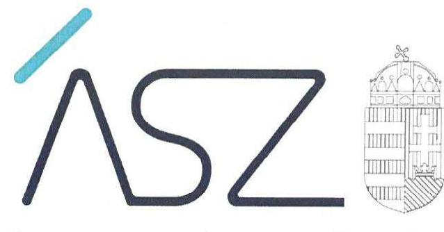

ÁLLAMI SZÁMVEVŐSZÉK

# JELENTÉS 

## Köztestületek ellenőrzése

Magyar Építész Kamara
2020. 08 hó 13 nap

20166
www.asz.hu
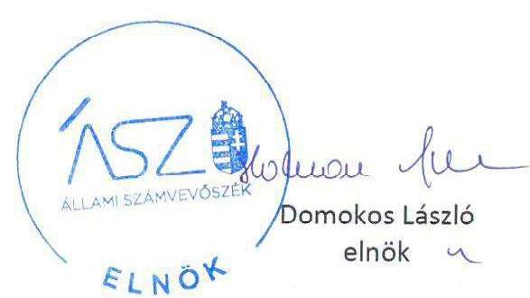

---

# AZ ELLENŐRZÉST FELÜGYELTE: 

MAKKAI MÁRIA felügyeleti vezető

## AZ ELLENŐRZÉST VEZETTE ÉS A VÉGREHAJTÁSÁÉRT FELELŐS:

KISTÓTH KRISZTINA ellenőrzésvezető

## A PROGRAM ÖSSZEÁLLÍTÁSÁÉRT FELELŐS:

SZALAY NAGY JÁNOS projektvezető
TÓTPÁL SZABOLCS osztályvezető

IKTATÓSZÁM: EL-2832-001/2020.
TÉMASZÁM: 2455
ELLENŐRZÉS-AZONOSÍTÓ SZÁM: V-079903
Jelentéseink az Országgyúlés számítógépes hálózatán és az interneten a www.asz.hu címen is olvashatóak.

---

# TARTALOMJEGYZÉK 

- ÖSSZEGZÉS ..... 5
- AZ ELLENŐRZÉS CÉLJA ..... 6
- AZ ELLENŐRZÉS TERÜLETE ..... 7
- AZ ELLENŐRZÉS HÁTTERE, INDOKOLTSÁGA ..... 8
- A JELENTÉS LÉNYEGES KÉRDÉSKÖREI ..... 9
- AZ ELLENŐRZÉS HATÓKÖRE ÉS MÓDSZEREI ..... 10
- MEGÁLLAPÍTÁSOK ..... 12
- JAVASLATOK ..... 14
- MELLÉKLETEK ..... 19
I. sz. melléklet: Értelmező szótár ..... 19
II. sz. melléklet: A Magyar Építész Kamara ellenőrzése során feltárt szabálytalanságok ..... 20
- FÜGGELÉK: ÉSZREVÉTELEK ..... 23
- RÖVIDÍTÉSEK JEGYZÉKE ..... 55

---

.

---

# ÖSSZEGZÉS 

A Magyar Építész Kamara gazdálkodása nem volt elszámoltatható. A Magyar Építész Kamara országos szervezete és a területi kamarák a közpénzek felhasználásának átláthatóságát biztosították.

## Az ellenőrzés társadalmi indokoltsága

Az Állami Számvevőszék küldetése, hogy szilárd szakmai alapon álló, értékteremtő ellenőrzéseivel előmozdítsa a közpénzügyek átláthatóságát, rendezettségét és hozzájáruljon a jól irányított állam működéséhez. Ennek megfelelően az Állami Számvevőszék stratégiai célként tűzte ki, hogy az ellenőrzési tevékenység hasznosulása tetten érhető legyen a társadalmi bizalom megerősítésében, a közgondolkodás megváltoztatásában, a törvényhozás tevékenysége támogatásában, valamint a legfontosabb társadalmi-gazdasági kérdésekre adott válaszokban.

A környezet alakítása, fejlesztése és védelme szempontjából meghatározó építészek tevékenységét a szakmai és etikai elvek érvényesítéséhez szükséges szakmai önigazgatás támogatja. A Magyar Építész Kamara felelős az építész szakmai tevékenységek jogszerűségének, szakszerűségének ellenőrzéséért és biztosításáért, továbbá vezeti a szakmagyakorlási tevékenységeket folytató természetes személyek országos névjegyzékét. A szakmagyakorlási tevékenységek egy része kötelezően kamarai tagsághoz és engedélyhez kötött, ilyen például az építészeti-műszaki tervezés, építésügyi műszaki szakértés és a településtervezés. Az építészeti tevékenységet a kamara tagja az ország egész területén végezheti. Minderre tekintettel fontos társadalmi elvárás az építészeti tevékenység végzésére jogosultak kamara általi nyilvántartásának megbízhatósága. A Magyar Építész Kamara gazdálkodását az Állami Számvevőszék eddig még nem ellenőrizte.

## Főbb megállapítások, következtetések, javaslatok

A Magyar Építész Kamara országos kamarája szervezeti működési kereteit a jogszabályi előírások szerint kialakította. A gazdálkodás belső szabályozottsága azonban a számlarend hiányában, a 2015-2018. években nem volt szabályszerű. Ezzel az országos kamara nem teremtette meg az elszámoltatható gazdálkodás kereteit.

A területi kamarák a tagdíjak Számviteli törvény szerinti szabályszerű nyilvántartásáról nem gondoskodtak, a tagdíj követelések folyamatos analitikus nyilvántartása nem volt biztosított. A 19 területi kamara közül 2015-2017. években 13, 2018. évben 14 vonatkozásában a tagdíj követelések nyilvántartásának hiányosságai - részletező nyilvántartás és a tagdíjkövetelések leltárral történő alátámasztásának hiánya, a főkönyvi könyvelés és analitika közötti egyeztetés elmaradása - miatt nem volt biztosított a mérlegben szereplő adatok és azok változásának valódisága. Mindennek következtében a szakmagyakorlást végző kamarai tagok területi kamarák által vezetett nyilvántartása nem volt megbízható és ezáltal nem bizonyított az építészeti tevékenységet végzők jogszabályi előírásnak megfelelő működése.

A költségvetési támogatások nyilvántartása és a támogató felé történő elszámolás szabályszerű volt.
Az Állami Számvevőszék a Magyar Építész Kamara országos szervezete elnökének, valamint területi szervezetei elnökeinek összesen 22 javaslatot fogalmazott meg.

---

# AZ ELLENŐRZÉS CÉLJA 

Az ellenőrzés célja annak megállapítása, hogy a köztestület gazdálkodása során betartotta-e a vonatkozó jogszabályi előírásokat, ennek keretében betartotta-e az előírásokat a belső szabályozási keretek kialakítása, a tagdíjbeszedés, a közzétételi és adatszolgáltatási tevékenysége során. Szabályszerúen számolta-e el, illetve tartotta-e nyilván a törvényben rögzített közfeladat ellátására államháztartásból kapott támogatásokat.

---

# **AZ ELLENŐRZÉS TERÜLETE**

## **Magyar Építész Kamara**

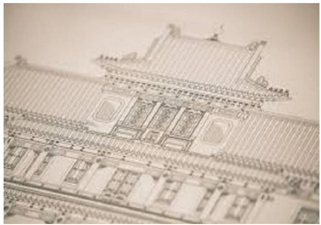

A Magyar Építész Kamara önkormányzattal, országos feladat és hatáskörrel rendelkező köztestület, amelynek jogállását, feladatait és működését a Kamtv.^{1} szabályozta.

A MÉK^{2} országos kamarát, mint jogi személyt, a Fővárosi Bíróság 1997. január 20-a hatállyal vette nyilvántartásba. A területi kamarák önálló jogi személyként a Kamtv.-ben meghatározott módon hozták létre az országos kamará^{3}-t, majd az országos kamara létrejöttével váltak tagjaivá.

A MÉK közfeladata – többek között – a módszertani útmutatók (etikai kódex, versenyszabályzat) és az építészeti tevékenységhez tartozó szolgáltatások tartalmi követelményeinek kidolgozása, a területi kamarai biztosok egységes működési rendjének meghatározása, valamint a fiatal építészek szakmagyakorlásra való felkészülésével és szakmai továbbképzésekkel kapcsolatos feladatok megszervezése.

A MÉK közigazgatási hatóságként járt el az építészeti tevékenység engedélyezése, az engedély visszavonása, az építészeti tevékenységre való jogosultságról hatósági igazolvány kiállítása ügyekben. A közigazgatási hatósági ügyben első fokon a területi kamara járt el, döntése elleni fellebbezés elbírálására az országos kamara volt jogosult.

A küldöttgyűlés a MÉK legfőbb döntéshozó szerve, melyet a területi kamarák, valamint a tagozatok szavazati joggal rendelkező küldöttei alkottak.

A MÉK felett a Kamtv. szerinti általános törvényességi felügyeletet az ellenőrzött időszakban a Miniszterelnökséget vezető miniszter gyakorolta.

A kamarai tagok tagdíjat fizetnek, amelyet a MÉK területi kamarái szednek be. Az országos kamara tagdíjrészesedésével, a területi kamarák a tagdíjbevételekkel a költségvetésükben meghatározott módon, önállóan gazdálkodtak. Az országos és területi kamarák a működési költségeket a tagdíjon felül, eljárási, igazgatási, szolgáltatási, bírság, regisztrációs és adminisztrációs bevételből, vállalkozási – szakmai továbbképzések - tevékenységből származó bevételből, valamint a kapott állami támogatásból fedezték. Államháztartásból kapott támogatásban az országos és a területi kamarák közvetlenül részesedtek, a támogatás értékét az 1. számú táblázat tartalmazza.

A MÉK országos kamara nem volt közhasznú szervezet, elnökének személye az ellenőrzött időszakban nem változott.

Az ellenőrzött időszakban a MÉK országos kamara és 13 területi kamara kettős, míg hat területi kamara egyszeres könyvvitelt vezetett. A kettős könyvvitelt alkalmazó szervezetek egyszerűsített éves beszámolót, míg az egyszeres könyvvezetést végzők egyszerűsített beszámolót készítettek. A 6 területi kamara közül a Budapesti Építész Kamara 2018. évtől áttért a kettős könyvvezetésre.

1. táblázat

**MAGYAR ÉPÍTÉSZ KAMARA 2015-2018. ÉVI KÖLTSÉGVETÉSBŐL KAPOTT TÁMOGATÁSAI (EZER FT)**

|  Évek | Országos
kamara | Területi
kamarák  |
| --- | --- | --- |
|  2015. | 4 950 | 95 669  |
|  2016. | 25 000 | 95 483  |
|  2017. | 84 790 | 95 226  |
|  2018. | 75 000 | 95 490  |

*Forrás: ellenőrzött szervezet bevétel elszámolása*

---

# AZ ELLENŐRZÉS HÁTTERE, INDOKOLTSÁGA 

A köztestületek közfeladatot látnak el, amelyre fokozott közérdeklődés irányul. Társadalmi elvárás a közpénzek értékelvű, rendeltetésszerű felhasználása, a közpénzekből nyújtott támogatások átláthatóságának megteremtése, amelyhez az Állami Számvevőszék az államháztartásból nyújtott támogatások ellenőrzésével kíván hozzájárulni.

Az ellenőrzés eredményeképp a törvényalkotás számára tapasztalatok állnak rendelkezésre a köztestületek szabályozásához. Az ellenőrzöttek számára visszajelzést adhat az ellenőrzés a közfeladataik ellátására államháztartásból kapott támogatások felhasználásának nyilvántartásával, beszámolásával kapcsolatos esetleges hiányosságról, míg a társadalom számára információt szolgáltat a köztestület gazdálkodásáról, a közpénzek felhasználásának elszámoltathatóságáról. Az ellenőrzés által az Állami Számvevőszék erősíti hozzáadott értéket teremtő tevékenységét és tanácsadó szerepét.

---

# A JELENTÉS LÉNYEGES KÉRDÉSKÖREI 

1. Szabályszerüen történt-e a köztestület belső szabályozási rendszerének kialakítása?
2. Szabályszerüen gondoskodott-e a köztestület a tagdij-követelések nyilvántartásáról, valamint behajtásáról?
3. A költségvetési támogatások felhasználásának nyilvántartása, elszámolása szabályszerü volt-e?

---

# AZ ELLENŐRZÉS HATÓKÖRE ÉS MÓDSZEREI 

## Az ellenőrzés típusa

Megfelelőségi ellenőrzés.

## Az ellenőrzött időszak

Az ellenőrzött időszak a 2015-2018. évek.

## Az ellenőrzés tárgya

Az ellenőrzés kiterjed a köztestületnél a belső szabályozási rendszer kialakítására, tagdíjbeszedésre, közzétételi, adatszolgáltatási tevékenységére, a felhasznált költségvetési támogatások nyilvántartásának, beszámolásának (elszámolásának) szabályszerűségére

## Az ellenőrzött szervezet

Magyar Építész Kamara országos szervezete és 19 területi kamara

## Az ellenőrzés jogalapja

Az ellenőrzés jogalapját az ÁSZ tv. ${ }^{4} 1 . \S$ (3) bekezdése és 5. § (3) bekezdése képezte.

## Az ellenőrzés módszerei

Az ellenőrzést az ellenőrzési program szempontjai, az ellenőrzött időszakban hatályos jogszabályok, az ellenőrzés szakmai szabályai, a jelen ellenőrzésre irányadó ÁSZ módszertanok figyelembevételével végeztük.

Az ellenőrzési kérdések megválaszolásához szükséges bizonyítékok megszerzése az ellenőrzött által rendelkezésre bocsátott dokumentumokra, adatokra alapozva megfigyelés, szemle (szemrevételezés), kérdésfeltevés (információkérés), mintavételezés, valamint elemző eljárás útján történt.

Az ellenőrzési bizonyítékként felhasználható adatforrások közé tartoztak egyrészt az ellenőrzési program részletes szempontjainál felsorolt adatforrások, másrészt minden egyéb - az ellenőrzés folyamán feltárt, az ellenőrzés szempontjából Információt tartalmazó - dokumentum.

---

Az ellenőrzés lefolytatásához az ellenőrzött a tanúsítványok kitöltésével, hitelesítésével és azok, valamint az ÁSZ által kért dokumentumok megküldésével szolgáltatott adatokat.

Az ellenőrzés ideje alatt az ellenőrzött szervezettel történő kapcsolattartást az ÁSZ SZMSZ5-ének vonatkozó előírásai alapján biztosítottuk.

A mérlegben kimutatott lejárt határidejű tagdíj-követelésekkel és a mérlegen kívüli, behajthatatlannak minősített tagdíj-követelésekkel kapcsolatos tevékenység szabályszerűségét véletlen mintavétel alapján ellenőrizte az ÁSZ. „Szabályszerű" értékelést kapott egy ellenőrzött területet, amennyiben 95\%-os megbízhatósággal az ellenőrzött sokaságban az átlagos hibaarány legfeljebb 10\%, "nem szabályszerűt", amennyiben 10\%-nál magasabb arányt képviselt. Abban az esetben, ha az ellenőrzött sokaság tekintetében a 10\%-os hibaarányhoz való viszony megítélésnek a megbízhatósága nem érte el a 95\%-ot, annak elérése érdekében az értékelést további szempontokkal egészítette ki az ÁSZ, és figyelembe vette a feltárt hibák értékét.

---

# 1. Szabályszerűen történt-e a köztestület belső szabályozási rendszerének kialakítása? 

Összegző megállapítás

A MÉK országos kamara szervezeti müködését kialakította, de gazdálkodása szabályszerű belső kereteit nem teremtette meg.

A SZERVEZETI KERETEKET és a müködésre vonatkozó alapvető szabályokat az országos kamara Alapszabályában határozta meg. Kialakította az országos ügyintéző szerveket, amelyek müködésének rendjét a Kamtv.-ben meghatározottak szerint állapította meg. A természetes és jogi személyiséggel rendelkező kamarai tagok által fizetendő éves tagdíj megállapítása és ebből az országos illetve a területi kamarák részesedési arányának meghatározásáról a küldöttgyűlés határozatban ${ }^{6}$ rendelkezett.

A GAZDÁLKODÁS BELSŐ SZABÁLYZATAI keretében az országos kamara elkészítette számviteli politikáját ${ }^{7}$, leltározási -8 , értékelési -9 és pénzkezelési szabályzatát ${ }^{10}$ illetve külön szabályzatban ${ }^{11}$ rendelkezett a kamarai szakmai szolgáltatásokról, azok díjáról, illetve a díj felhasználásáról. Ugyanakkor az országos kamara a Számv. tv. 161. § (1) bekezdés előírása ellenére számlarendet nem készített.

## 2. Szabályszerűen gondoskodott-e a köztestület a tagdíj-követelések nyilvántartásáról, valamint behajtásáról?

Összegző megállapítás

A MÉK területi kamarák tagdíj-követelés nyilvántartása nem volt szabályszerű. A kimutatott lejárt határidejű tagdíj-követelések behajtásáról és a behajthatatlan követelések esetén a tagság megszüntetéséről azonban gondoskodtak.

A TAGDIJ KÖVETELÉSEK NYILVÁNTARTÁSA a tagdíjbeszedést végző területi kamaráknál nem volt szabályszerű.

Nem vezette a Számv. tv. 101. § (3) bekezdés szerinti jövőben kiegyenlítésre kerülő tagdíj követelések részletező nyilvántartását négy egyszeres könyvvitelt alkalmazó területi kamara a Számv. tv. 162. § (1) bekezdésében foglaltak ellenére. Továbbá öt kettős könyvvitelt vezető területi kamara a Számv. tv. 159. §-a ellenére a tagdíjkövetelések analitikus nyilvántartását nem vezette, nem volt a Számv. tv. 165. § (4) bekezdése szerint logikailag zárt rendszerrel biztosított a főkönyvi könyvelés és az analitikus nyilvántartások közötti egyeztetés és ellenőrzés lehetősége.

Az analitikus, részletező nyilvántartást vezetők közül 2015-2017. évben négy, 2018. évben öt területi kamara a Számv. tv. 69. § (2) bekezdésében

---

foglaltak ellenére a főkönyvi könyvelés és az analitikus nyilvántartások adatai közötti egyeztetést nem végezte el.

A beszámoló elkészítéséhez a Számv. tv. 69. § (1) bekezdésben foglaltak ellenére 2015-2017. évre kettő, majd a 2018. évre három területi kamara nem állított össze olyan leltárt, amely tételesen, ellenőrizhető módon tartalmazta a tagdíj követelés értékét.

# A KIMUTATOTT TAGDIJ-HÁTRALÉK BEHAJTÁSÁ- 

RÓL a területi kamarák szabályszerűen gondoskodtak. A kimutatott hátralékos és a behajthatatlanná minősített tagdíj-követelések esetén a Kamtv. szerint megszüntették a tagsági viszonyt, a névjegyzékből törölték a tagot, ha a tartozása elérte az egy évi tagdíjat meghaladó mértéket.

## 3. A költségvetési támogatások felhasználásának nyilvántartása, elszámolása szabályszerű volt-e?

Összegző megállapítás

A MÉK országos és területi kamarák költségvetési támogatás felhasználásának nyilvántartása és elszámolása szabályszerű volt, a támogatás felhasználásáról a támogatók felé elszámoltak.

A KÖLTSÉGVETÉSI TÁMOGATÁSOK NYILVÁNTARTÁSA szabályszerű volt. Az országos és a 16 területi kamara a közpénzek felhasználásának nyilvánossága és ellenőrizhetősége érdekében főkönyvi számlák, munkaszámok, illetve rovatszámok alkalmazásával továbbrészletezte. Ugyanakkor a Számv. tv. 161/A. § (2) bekezdésében, valamint a 224/2000. (XII. 19.) Korm. rendelet 17. § (8) bekezdésében és a 2017. január 1-jétől hatályos 479/2016. (XII. 29.) Korm. rendelet 14. § (1) bekezdésében előírtak ellenére három területi kamara a 2015-2018. években nyilvántartási rendszerét nem részletezte tovább oly módon, hogy abból a támogatások felhasználására vonatkozó külön jogszabályban meghatározott adatok rendelkezésre álljanak.

## A KÖLTSÉGVETÉSI TÁMOGATÁSOK FELHASZNÁ-

LÁSÁRÓL a pénzügyi elszámolást és a szakmai beszámolót az országos és a területi kamarák elkészítették, amelyeket a támogatók - több esetben hiánypótlást követően - elfogadták.

ADATSZOLGÁLTATÁSI KÖTELEZETTSÉGE keretében az országos kamara a Számv. tv., a Kamtv., valamint Alapszabályának megfelelően a 2015-2018. évben rendelkezett a küldöttgyűlés által jóváhagyott beszámolóval.

Az országos kamara az Info tv. ${ }^{12}$ 2018. július 25-ig hatályos 24. § (2) bekezdés d) pontjában és a 24. § (3) bekezdésben foglaltak ellenére, valamint a 2018. július 26 -tól hatályos 25/A. § (3) bekezdésében foglaltak ellenére Adatvédelmi és adatbiztonsági szabályzatot nem alkotott.

Az országos és területi kamarák ellenőrzésben feltárt szabálytalanságait a II. számú melléklet mutatja be.

---

# JAVASLATOK 

Az ÁSZ tv. 33. § (1) bekezdésében foglaltak értelmében az ellenőrzött szervezet vezetője köteles a jelentésben foglalt megállapításokhoz kapcsolódó intézkedési tervet összeállítani és azt a jelentés kézhezvételétől számított 30 napon belül az ÁSZ részére megküldeni. Amennyiben az ellenőrzött szervezet vezetője nem küldi meg határidőben az intézkedési tervet, vagy továbbra sem elfogadható intézkedési tervet küld, az Állami Számvevőszék elnöke az ÁSZ tv. 33. § (3) bekezdése a) és b) pontjaiban foglaltakat érvényesítheti.

## Magyar Építész Kamara országos szervezete elnökének

1. Intézkedjen a Számv. tv. előírásainak megfelelően a számlarend elkészitéséről.
(1. sz. megállapítás 2. bekezdés második mondata alapján)
2. Intézkedjen az Info. tv. előírásainak megfelelően az adatvédelmi és adatbiztonsági szabályzat megalkotásáról.
(3. sz. megállapítás 4. bekezdése alapján)

## Bács-Kiskun Megyei Építész Kamara elnökének

1. Intézkedjen a Számv. tv. előírásainak megfelelően a fökönyvi könyvelés és az analitikus nyilvántartási adatok közötti egyeztetés elvégzéséről.
(2. sz. megállapítás 3. bekezdés második tagmondata és a II. sz. melléklet harmadik sora alapján)

## Békés Megyei Építész Kamara elnökének

1. Intézkedjen a Számv. tv. előírásainak megfelelően a fökönyvi könyvelés és az analitikus nyilvántartási adatok közötti egyeztetés elvégzéséről.
(2. sz. megállapítás 3. bekezdés második tagmondata és a II. sz. melléklet harmadik sora alapján)
2. Intézkedjen a mérleg tételeinek alátámasztására a jogszabály szerinti leltár összeállításával.
(2. sz. megállapítás 4. bekezdés második tagmondata és a II. sz. melléklet negyedik sora alapján)

---

# Borsod-Abaúj-Zemplén Megyei Építész Kamara elnökének 

1. Intézkedjen a Számv. tv. elöírásainak megfelelően a fökönyvi könyvelés és az analitikus nyilvántartási adatok közötti egyeztetés elvégzéséről.
(2. sz. megállapítás 3. bekezdés második tagmondata és a II. sz. melléklet harmadik sora alapján)
2. Intézkedjen a mérleg tételeinek alátámasztására a jogszabály szerinti leltár összeállításával.
(2. sz. megállapítás 4. bekezdés második tagmondata és a II. sz. melléklet negyedik sora alapján)

## Csongrád Megyei Építész Kamara elnökének

1. Intézkedjen a tagdijkövetelések analitikus nyilvántartásának vezetéséről, valamint a fökönyvi könyvelés és a tagdijkövetelések analitikus nyilvántartása adatai közötti egyeztetés és ellenőrzés lehetőségének logikailag zárt rendszerrel történő biztosításáról.
(2. sz. megállapítás 2. bekezdés második mondata és a II. sz. melléklet első sora alapján)

## Dél-Dunántúli Építész Kamara elnökének

1. Intézkedjen a tagdijkövetelések analitikus nyilvántartásának vezetéséről, valamint a fökönyvi könyvelés és a tagdijkövetelések analitikus nyilvántartása adatai közötti egyeztetés és ellenőrzés lehetőségének logikailag zárt rendszerrel történő biztosításáról.
(2. sz. megállapítás 2. bekezdés második mondata és a II. sz. melléklet első sora alapján)

## Győr-Moson-Sopron Megyei Építész Kamara elnökének

1. Intézkedjen a Számv. tv. elöírásainak megfelelően a fökönyvi könyvelés és az analitikus nyilvántartási adatok közötti egyeztetés elvégzéséről.
(2. sz. megállapítás 3. bekezdés második tagmondata és a II. sz. melléklet harmadik sora alapján)

---

2. Intézkedjen a mérleg tételeinek alátámasztására a jogszabály szerinti leltár összeállitásával.
(2. sz. megállapítás 4. bekezdés második tagmondata és a II. sz. melléklet negyedik sora alapján)

# Hajdú-Bihar Megyei Építész Kamara elnökének 

1. Intézkedjen a Számv. tv. előírásainak megfelelően a tagdíj követelések részletező nyilvántartásának vezetéséről.
(2. sz. megállapítás 2. bekezdés első mondata és a II. sz. melléklet második sora alapján)

## Heves Megyei Építész Kamara elnökének

1. Intézkedjen a költségvetési támogatások, illetve azok felhasználásának jogszabály szerinti nyilvántartása érdekében.
(3. sz. megállapítás 1. bekezdés harmadik mondata és a II. sz. melléklet ötödik sora alapján)

## Jász-Nagykun-Szolnok Megyei Építészek Kamarája elnökének

1. Intézkedjen a tagdijkövetelések analitikus nyilvántartásának vezetéséről, valamint a fökönyvi könyvelés és a tagdijkövetelések analitikus nyilvántartása adatai közötti egyeztetés és ellenőrzés lehetőségének logikailag zárt rendszerrel történő biztosításáról.
(2. sz. megállapítás 2. bekezdés második mondata és a II. sz. melléklet első sora alapján)
2. Intézkedjen a költségvetési támogatások, illetve azok felhasználásának jogszabály szerinti nyilvántartása érdekében.
(3. sz. megállapítás 1. bekezdés harmadik mondata és a II. sz. melléklet ötödik sora alapján)

---

# Komárom-Esztergom Megyei Építész Kamara elnökének 

1. Intézkedjen a Számv. tv. elöirásainak megfelelöen a fökönyvi könyvelés és az analitikus nyilvántartási adatok közötti egyeztetés elvégzéséről.
(2. sz. megállapítás 3. bekezdés második tagmondata és a II. sz. melléklet harmadik sora alapján)

## Somogy Megyei Építész Kamara elnökének

1. Intézkedjen a Számv. tv. elöirásainak megfelelően a tagdij követelések részletező nyilvántartásának vezetéséről.
(2. sz. megállapítás 2. bekezdés első mondata és a II. sz. melléklet második sora alapján)

## Szabolcs-Szatmár-Bereg Megyei Területi Építész Kamara elnökének

1. Intézkedjen a Számv. tv. elöirásainak megfelelően a tagdij követelések részletező nyilvántartásának vezetéséről.
(2. sz. megállapítás 2. bekezdés első mondata és a II. sz. melléklet második sora alapján)

## Vas Megyei Építész Kamara elnökének

1. Intézkedjen a Számv. tv. elöirásainak megfelelően a tagdij követelések részletező nyilvántartásának vezetéséről.
(2. sz. megállapítás 2. bekezdés első mondata és a II. sz. melléklet második sora alapján)

---

# Magyar Építészek Veszprém Megyei Kamarája elnökének 

1. Intézkedjen a tagdijkövetelések analitikus nyilvántartásának vezetéséről, valamint a fökönyvi könyvelés és a tagdijkövetelések analitikus nyilvántartása adatai közötti egyeztetés és ellenőrzés lehetőségének logikailag zárt rendszerrel történő biztosításáról.
(2. sz. megállapítás 2. bekezdés második mondata és a II. sz. melléklet első sora alapján)

## Zala Megyei Építész Kamara elnökének

1. Intézkedjen a tagdijkövetelések analitikus nyilvántartásának vezetéséről, valamint a fökönyvi könyvelés és a tagdijkövetelések analitikus nyilvántartása adatai közötti egyeztetés és ellenőrzés lehetőségének logikailag zárt rendszerrel történő biztosításáról.
(2. sz. megállapítás 2. bekezdés második mondata és a II. sz. melléklet első sora alapján)
2. Intézkedjen a költségvetési támogatások, illetve azok felhasználásának jogszabály szerinti nyilvántartása érdekében.
(3. sz. megállapítás 1. bekezdés harmadik mondata és a II. sz. melléklet ötödik sora alapján)

---

# MELLÉKLETEK 

- I. SZ. MELLÉKLET: ÉRTELMEZŐ SZÓTÁR
államháztartás
költségvetési támogatás
közfeladat
köztestület
az országos kamara szervei
köztestületet létrehozó törvény
támogatási előleg
az államháztartás a közfeladatok ellátásának egységes szervezeti, tervezési, gazdálkodási, ellenőrzési, finanszírozási, adatszolgáltatási és beszámolási szabályok szerint működő rendszere, amely központi és önkormányzati alrendszerből áll. (Forrás: Áht. 2. § 3. § (1) bekezdése 2015. január 1-től)
Az államháztartás alrendszerei terhére nyújtott pénzbeli vagy nem pénzbeli juttatás, amelyet a támogató nem elsősorban ellenszolgáltatás ellenében, de konkrét program megvalósítása vagy meghatározott időszakban a támogatott szervezet múködtetése érdekében nyújt. Költségvetési támogatás különösen: a pályázat útján, valamint egyedi döntéssel kapott költségvetési támogatás; az Európai Unió strukturális alapjaiból, illetve a Kohéziós Alapból származó, a költségvetésből juttatott támogatás; az Európai Unió költségvetéséből vagy más államtól, nemzetközi szervezettől származó támogatás és a személyi jövedelemadó meghatározott részének az adózó rendelkezése szerint felajánlott összege. (Forrás: Ectv. ${ }^{13}$ 2. § 15. pont)
Közfeladat a jogszabályban meghatározott állami vagy önkormányzati feladat. A közfeladatok ellátása költségvetési szervek alapításával és müködtetésével vagy az azok ellátásához szükséges pénzügyi fedezet e törvényben meghatározott eszközökkel, részben vagy egészben történő biztosításával valósul meg. A közfeladatok ellátásában államháztartáson kívüli szervezetjogszabályban meghatározott rendben közremüködhet.(Forrás: Áht. 3/A. § (I)-(2) bekezdés, hatályos 2015. január 1-től)
A köztestület önkormányzattal és nyilvántartott tagsággal rendelkező szervezet, amelynek létrehozását törvény rendeli el. A köztestület a tagságához, illetőleg a tagsága által végzett tevékenységhez kapcsolódó közfeladatot lát el. A köztestület jogi személy. Törvény előírhatja, hogy valamely közfeladatot kizárólag köztestület láthat el, illetve, hogy meghatározott tevékenység csak köztestület tagjaként folytatható. (Forrás: 2006. évi LXV. törvény 8/A. § (1), (4) bekezdés)
A küldöttgyűlés, az országos elnökség, az országos felügyelő bizottság, az országos etikai-fegyelmi bizottság, az országos választási jelölőbizottság, az országos alapszabály szerint létrehozott más állandó bizottságok, szakmai tagozatok és szakmai kollégiumok, továbbá az országos titkárság (Forrás: 1996. évi LVIII. törvény 12. § (1) bekezdés)
Az ellenőrzés alá vont köztestületeket alapító törvények, létrehozásra vonatkozó jogszabályhely hivatkozással: a tervező- és szakértő mérnökök, valamint építészek szakmai kamaráiról szóló 1996. évi LVIII. törvény 2. § (I)-(2) bekezdés.
A költségvetési támogatás a beszámoló vagy a részbeszámoló elfogadását megelőzően is - a költségvetési támogatás céljához, a támogatott tevékenység megvalósítási időszakának hoszszához, a kedvezményezett saját forrásának mértékéhez igazodó módon - folyósítható (a továbbiakban: támogatási előleg) (Forrás: Ávr. ${ }^{14}$ 87. § (1) bekezdés)

---

II. SZ. MELLÉKLET: A MAGYAR ÉPÍTÉSZ KAMARA ELLENŐRZÉSE SORÁN FELTÁRT SZABÁLYTALANSÁGOK

| Szabálytalansárok | Évek | MEK országos és területi kamarák | | | | | | | | | | | | | | | | | | | | | | | | | :--: | :--: | :--: | :--: | :--: | :--: | :--: | :--: | :--: | :--: | :--: | :--: | :--: | :--: | :--: | :--: | :--: | :--: | :--: | :--: | :--: | :--: | :--: | :--: | :--: | :--: | :--: | :--: | | | | 2015 | | | | | | | | | | | | | | | | | | | | | | | | | 2015 | - | | | | | | | | | | | | | | | | | | | | | | | | | 2016 | - | | | | | | | | | | | | | | | | | | | | | | | 2017 | - | | | | | | | | | | | | | | | | | | | | | | 2018 | - | | | | | | | | | | | | | | | | | | | | | | 2018 | - | | | | | | | | | | | | | | | | | | | | | | 2015 | - | | | | | | | | | | | | | | | | | | | | | | 2016 | - | | | | | | | | | | | | | | | | | | | | | 2017 | - | | | | | | | | | | | | | | | | | | | | | 2017 | - | | | | | | | | | | | | | | | | | | | | | 2018 | - | | | | | | | | | | | | | | | | | | | | | 2018 | - | | | | | | | | | | | | | | | | | | | | | 2015 | - | | | | | | | | | | | | | | | | | | | | | 2016 | - | | | | | | | | | | | | | | | | | | | | 2017 | - | | | | | | | | | | | | | | | | | | | | 2018 | - | | | | | | | | | | | | | | | | | | | | 2015 | - | | | | | | | | | | | | | | | | | | | | 2016 | - | | | | | | | | | | | | | | | | | | | | 2017 | - | | | | | | | | | | | | | | | | | | | | 2018 | - | | | | | | | | | | | | | | | | | | | | 2018 | - | | | | | | | | | | | | | | | | | | | 2015 | - | | | | | | | | | | | | | | | | | | | | 2016 | - | | | | | | | | | | | | | | | | | | | | 2017 | - | | | | | | | | | | | | | | | | | | | | 2018 | - | | | | | | | | | | | | | | | | | | | 2015 | - | | | | | | | | | | | | | | | | | | | | 2016 | - | | | | | | | | | | | | | | | | | | | 2017 | - | | | | | | | | | | | | | | | | | | | 2018 | - | | | | | | | | | | | | | | | | | | | 2015 | - | | | | | | | | | | | | | | | | | | | | 2016 | - | | | | | | | | | | | | | | | | | | | 2017 | - | | | | | | | | | | | | | | | | | | | 2018 | - | | | | | | | | | | | | | | | | | | | 2015 | - | | | | | | | | | | | | | | | | | | | 2016 | - | | | | | | | | | | | | | | | | | | | 2017 | - | | | | | | | | | | | | | | | | | | | 2018 | - | | | | | | | | | | | | | | | | | | | 2015 | - | | | | | | | | | | | | | | | | | | | 2016 | - | | | | | | | | | | | | | | | | | | | 2017 | - | | | | | | | | | | | | | | | | | | | 2018 | - | | | | | | | | | | | | | | | | | | | 2015 | - | | | | | | | | | | | | | | | | | | | 2016 | - | | | | | | | | | | | | | | | | | | | 2017 | - | | | | | | | | | | | | | | | | | | | 2018 | - | | | | | | | | | | | | | | | | | | | 2015 | - | | | | | | | | | | | | | | | | | | | 2016 | - | | | | | | | | | | | | | | | | | | | 2017 | - | | | | | | | | | | | | | | | | | | | 2018 | - | | | | | | | | | | | | | | | | | | | 2015 | - | | | | | | | | | | | | | | | | | | | 2016 | - | | | | | | | | | | | | | | | | | | | 2017 | - | | | | | | | | | | | | | | | | | | | 2018 | - | | | | | | | | | | | | | | | | | | | 2015 | - | | | | | | | | | | | | | | | | | | | 2016 | - | | | | | | | | | | | | | | | | | | | 2017 | - | | | | | | | | | | | | | | | | | | | 2018 | - | | | | | | | | | | | | | | | | | | | 2015 | - | | | | | | | | | | | | | | | | | | | 2016 | - | | | | | | | | | | | | | | | | | | | 2017 | - | | | | | | | | | | | | | | | | | | | 2018 | - | | | | | | | | | | | | | | | | | | | 2015 | - | | | | | | | | | | | | | | | | | | | 2016 | - | | | | | | | | | | | | | | | | | | | 2017 | - | | | | | | | | | | | | | | | | | | | 2018 | - | | | | | | | | | | | | | | | | | | | 2015 | - | | | | | | | | | | | | | | | | | | | 2016 | - | | | | | | | | | | | | | | | | | | | 2017 | - | | | | | | | | | | | | | | | | | | | 2018 | - | | | | | | | | | | | | | | | | | | | 2015 | - | | | | | | | | | | | | | | | | | | | 2016 | - | | | | | | | | | | | | | | | | | | | 2017 | - | | | | | | | | | | | | | | | | | | | 2018 | - | | | | | | | | | | | | | | | | | | | 2015 | - | | | | | | | | | | | | | | | | | | | | 2016 | - | | | | | | | | | | | | | | | | | | | | 2017 | - | | | | | | | | | | | | | | | | | | | | 2018 | - | | | | | | | | | | | | | | | | | | | 2015 | - | | | | | | | | | | | | | | | | | | | | 2016 | - | | | | | | | | | | | | | | | | | | | | 2017 | - | | | | | | | | | | | | | | | | | | | | 2018 | - | | | | | | | | | | | | | | | | | | | | 2019 | - | | | | | | | | | | | | | | | | | | | | 2020 | - | | | | | | | | | | | | | | | | | | | 2021 | - | | | | | | | | | | | | | | | | | | | 2022 | - | | | | | | | | | | | | | | | | | | | 2023 | - | | | | | | | | | | | | | | | | | | | 2024 | - | | | | | | | | | | | | | | | | | | 2025 | - | | | | | | | | | | | | | | | | | | | 2026 | - | | | | | | | | | | | | | | | | | | | 2027 | - | | | | | | | | | | | | | | | | | | | 2028 | - | | | | | | | | | | | | | | | | | | 2029 | - | | | | | | | | | | | | | | | | | | 2030 | - | | | | | | | | | | | | | | | | | | 2031 | - | | | | | | | | | | | | | | | | | | 2032 | - | | | | | | | | | | | | | | | | | | 2033 | - | | | | | | | | | | | | | | | | | | 2034 | - | | | | | | | | | | | | | | | | | | 2035 | - | | | | | | | | | | | | | | | | | | | 2036 | - | | | | | | | | | | | | | | | | | | | 2037 | - | | | | | | | | | | | | | | | | | | | 2038 | - | | | | | | | | | | | | | | | | | | | 2039 | - | | | | | | | | | | | | | | | | | | | 2040 | - | | | | | | | | | | | | | | | | | | 2041 | - | | | | | | | | | | | | | | | | | | 2042 | - | | | | | | | | | | | | | | | | | | 2043 | - | | | | | | | | | | | | | | | | | | 2044 | - | | | | | | | | | | | | | | | | | | 2045 | - | | | | | | | | | | | | | | | | | | | 2046 | - | | | | | | | | | | | | | | | | | | | 2047 | - | | | | | | | | | | | | | | | | | | 2048 | - | | | | | | | | | | | | | | | | | | 2049 | - | | | | | | | | | | | | | | | | | | 2050 | - | | | | | | | | | | | | | | | | | | | 2051 | - | | | | | | | | | | | | | | | | | | | 2052 | - | | | | | | | | | | | | | | | | | | | 2053 | - | | | | | | | | | | | | | | | | | | | 2054 | - | | | | | | | | | | | | | | | | | | | 2055 | - | | | | | | | | | | | | | | | | | | | 2056 | - | | | | | | | | | | | | | | | | | | | 2057 | - | | | | | | | | | | | | | | | | | | | 2058 | - | | | | | | | | | | | | | | | | | | | 2059 | - | | | | | | | | | | | | | | | | | | | 2060 | - | | | | | | | | | | | | | | | | | | | 2061 | - | | | | | | | | | | | | | | | | | | | 2062 | - | | | | | | | | | | | | | | | | | | | 2063 | - | | | | | | | | | | | | | | | | | | | 2064 | - | | | | | | | | | | | | | | | | | | | 2065 | - | | | | | | | | | | | | | | | | | | | 2066 | - | | | | | | | | | | | | | | | | | | | 2067 | - | | | | | | | | | | | | | | | | | | | 2068 | - | | | | | | | | | | | | | | | | | | | 2069 | - | | | | | | | | | | | | | | | | | | | 2070 | - | | | | | | | | | | | | | | | | | | | 2071 | - | | | | | | | | | | | | | | | | | | | 2072 | - | | | | | | | | | | | | | | | | | | | 2073 | - | | | | | | | | | | | | | | | | | | | 2074 | - | | | | | | | | | | | | | | | | | | | 2075 | - | | | | | | | | | | | | | | | | | | | | 2076 | - | | | | | | | | | | | | | | | | | | | | 2077 | - | | | | | | | | | | | | | | | | | | | | 2078 | - | | | | | | | | | | | | | | | | | | | 2079 | - | | | | | | | | | | | | | | | | | | | 2080 | - | | | | | | | | | | | | | | | | | | | 2081 | - | | | | | | | | | | | | | | | | | | | 2082 | - | | | | | | | | | | | | | | | | | | | 2083 | - | | | | | | | | | | | | | | | | | | | 2084 | - | | | | | | | | | | | | | | | | | | 2085 | - | | | | | | | | | | | | | | | | | | | 2086 | - | | | | | | | | | | | | | | | | | | | 2087 | - | | | | | | | | | | | | | | | | | | | 2088 | - | | | | | | | | | | | | | | | | | | | 2089 | - | | | | | | | | | | | | | | | | | | | 2090 | - | | | | | | | | | | | | | | | | | | | 2091 | - | | | | | | | | | | | | | | | | | | | 2092 | - | | | | | | | | | | | | | | | | | | | 2093 | - | | | | | | | | | | | | | | | | | | | 2094 | - | | | | | | | | | | | | | | | | | | | 2095 | - | | | | | | | | | | | | | | | | | | | 2096 | - | | | | | | | | | | | | | | | | | | | 2097 | - | | | | | | | | | | | | | | | | | | | 2098 | - | | | | | | | | | | | | | | | | | | | 2099 | - | | | | | | | | | | | | | | | | | | | 2100 | - | | | | | | | | | | | | | | | | | | | 2101 | - | | | | | | | | | | | | | | | | | | | 2102 | - | | | | | | | | | | | | | | | | | | | 2103 | - | | | | | | | | | | | | | | | | | | | 2104 | - | | | | | | | | | | | | | | | | | | | 2105 | - | | | | | | | | | | | | | | | | | | | | 2106 | - | | | | | | | | | | | | | | | | | | | | 2107 | - | | | | | | | | | | | | | | | | | | | | 2108 | - | | | | | | | | | | | | | | | | | | | 2109 | - | | | | | | | | | | | | | | | | | | | 2110 | - | | | | | | | | | | | | | | | | | | | 2111 | - | | | | | | | | | | | | | | | | | | | 2112 | - | | | | | | | | | | | | | | | | | | | 2113 | - | | | | | | | | | | | | | | | | | | | 2114 | - | | | | | | | | | | | | | | | | | | | 2115 | - | | | | | | | | | | | | | | | | | | | | 2116 | - | | | | | | | | | | | | | | | | | | | | 2117 | - | | | | | | | | | | | | | | | | | | | | 2118 | - | | | | | | | | | | | | | | | | | | | | 2119 | - | | | | | | | | | | | | | | | | | | | | 2120 | - | | | | | | | | | | | | | | | | | | | | 2121 | - | | | | | | | | | | | | | | | | | | | | 2122 | - | | | | | | | | | | | | | | | | | | | 2123 | - | | | | | | | | | | | | | | | | | | | 2124 | - | | | | | | | | | | | | | | | | | | | 2125 | - | | | | | | | | | | | | | | | | | | | | 2126 | - | | | | | | | | | | | | | | | | | | | | 2127 | - | | | | | | | | | | | | | | | | | | | | 2128 | - | | | | | | | | | | | | | | | | | | | 2129 | - | | | | | | | | | | | | | | | | | | | | 2130 | - | | | | | | | | | | | | | | | | | | | | 2131 | - | | | | | | | | | | | | | | | | | | | | 2132 | - | | | | | | | | | | | | | | | | | | | | 2133 | - | | | | | | | | | | | | | | | | | | | 2134 | - | | | | | | | | | | | | | | | | | | | 2135 | - | | | | | | | | | | | | | | | | | | | | 2136 | - | | | | | | | | | | | | | | | | | | | | 2137 | - | | | | | | | | | | | | | | | | | | | | 2138 | - | | | | | | | | | | | | | | | | | | | | 2139 | - | | | | | | | | | | | | | | | | | | | | 2140 | - | | | | | | | | | | | | | | | | | | | | 2141 | - | | | | | | | | | | | | | | | | | | | | 2142 | - | | | | | | | | | | | | | | | | | | | | 2143 | - | | | | | | | | | | | | | | | | | | | | 2144 | - | | | | | | | | | | | | | | | | | | | | 2145 | - | | | | | | | | | | | | | | | | | | | | | 2146 | - | | | | | | | | | | | | | | | | | | | | | 2147 | - | | | | | | | | | | | | | | | | | | | | | 2148 | - | | | | | | | | | | | | | | | | | | | | 2149 | - | | | | | | | | | | | | | | | | | | | | | 2150 | - | | | | | | | | | | | | | | | | | | | | | 2151 | - | | | | | | | | | | | | | | | | | | | | | 2152 | - | | | | | | | | | | | | | | | | | | | | | 2153 | - | | | | | | | | | | | | | | | | | | | | | 2154 | - | | | | | | | | | | | | | | | | | | | | | 2155 | - | | | | | | | | | | | | | | | | | | | | | 2156 | - | | | | | | | | | | | | | | | | | | | | | 2157 | - | | | | | | | | | | | | | | | | | | | | | 2158 | - | | | | | | | | | | | | | | | | | | | | | 2159 | - | | | | | | | | | | | | | | | | | | | | | 2160 | - | | | | | | | | | | | | | | | | | | | | 2161 | - | | | | | | | | | | | | | | | | | | | | | 2162 | - | | | | | | | | | | | | | | | | | | | | | 2163 | - | | | | | | | | | | | | | | | | | | | | | 2164 | - | | | | | | | | | | | | | | | | | | | | | 2165 | - | | | | | | | | | | | | | | | | | | | | | 2166 | - | | | | | | | | | | | | | | | | | | | | | 2167 | - | | | | | | | | | | | | | | | | | | | | | 2168 | - | | | | | | | | | | | | | | | | | | | | | 2169 | - | | | | | | | | | | | | | | | | | | | | | 2170 | - | | | | | | | | | | | | | | | | | | | | | 2171 | - | | | | | | | | | | | | | | | | | | | | | 2172 | - | | | | | | | | | | | | | | | | | | | | | 2173 | - | | | | | | | | | | | | | | | | | | | | | 2174 | - | | | | | | | | | | | | | | | | | | | | | 2175 | - | | | | | | | | | | | | | | | | | | | | | 2176 | - | | | | | | | | | | | | | | | | | | | | | 2177 | - | | | | | | | | | | | | | | | | | | | | | 2178 | - | | | | | | | | | | | | | | | | | | | | | 2179 | - | | | | | | | | | | | | | | | | | | | | | 2180 | - | | | | | | | | | | | | | | | | | | | | | 2181 | - | | | | | | | | | | | | | | | | | | | | | 2182 | - | | | | | | | | | | | | | | | | | | | | | 2183 | - | | | | | | | | | | | | | | | | | | | | | 2184 | - | | | | | | | | | | | | | | | | | | | | | 2185 | - | | | | | | | | | | | | | | | | | | | | | 2186 | - | | | | | | | | | | | | | | | | | | | | | 2187 | - | | | | | | | | | | | | | | | | | | | | | 2188 | - | | | | | | | | | | | | | | | | | | | | | 2189 | - | | | | | | | | | | | | | | | | | | | | | 2190 | - | | | | | | | | | | | | | | | | | | | | | 2191 | - | | | | | | | | | | | | | | | | | | | | | | 2192 | - | | | | | | | | | | | | | | | | | | | | | 2193 | - | | | | | | | | | | | | | | | | | | | | | 2194 | - | | | | | | | | | | | | | | | | | | | | | 2195 | - | | | | | | | | | | | | | | | | | | | | | | 2196 | - | | | | | | | | | | | | | | | | | | | | | | 2197 | - | | | | | | | | | | | | | | | | | | | | | | 2198 | - | | | | | | | | | | | | | | | | | | | | | | 2199 | - | | | | | | | | | | | | | | | | | | | | | 2200 | - | | | | | | | | | | | | | | | | | | | | | 2201 | - | | | | | | | | | | | | | | | | | | | | | 2202 | - | | | | | | | | | | | | | | | | | | | | | 2203 | - | | | | | | | | | | | | | | | | | | | | | 2204 | - | | | | | | | | | | | | | | | | | | | | | 2205 | - | | | | | | | | | | | | | | | | | | | | | 2206 | - | | | | | | | | | | | | | | | | | | | | | 2207 | - | | | | | | | | | | | | | | | | | | | | | 2208 | - | | | | | | | | | | | | | | | | | | | | | 2209 | - | | | | | | | | | | | | | | | | | | | | | 2210 | - | | | | | | | | | | | | | | | | | | | | | 2211 | - | | | | | | | | | | | | | | | | | | | | | 2212 | - | | | | | | | | | | | | | | | | | | | | | 2213 | - | | | | | | | | | | | | | | | | | | | | | | 2214 | - | | | | | | | | | | | | | | | | | | | | | | 2215 | - | | | | | | | | | | | | | | | | | | | | | | 2216 | - | | | | | | | | | | | | | | | | | | | | | | 2217 | - | | | | | | | | | | | | | | | | | | | | | | | 2218 | - | | | | | | | | | | | | | | | | | | | | | | | 2219 | - | | | | | | | | | | | | | | | | | | | | | | | 2220 | - | | | | | | | | | | | | | | | | | | | | | | 2221 | - | | | | | | | | | | | | | | | | | | | | | | 2222 | - | | | | | | | | | | | | | | | | | | | | | | 2223 | - | | | | | | | | | | | | | | | | | | | | | | 2224 | - | | | | | | | | | | | | | | | | | | | | | 2225 | - | | | | | | | | | | | | | | | | | | | | | 2226 | - | | | | | | | | | | | | | | | | | | | | | 2227 | - | | | | | | | | | | | | | | | | | | | | | | | 2228 | - | | | | | | | | | | | | | | | | | | | | | | 2229 | - | | | | | | | | | | | | | | | | | | | | | | 2230 | - | | | | | | | | | | | | | | | | | | | | | | 2231 | - | | | | | | | | | | | | | | | | | | | | | | | 2232 | - | | | | | | | | | | | | | | | | | | | | | | | 2233 | - | | | | | | | | | | | | | | | | | | | | | | 2234 | - | | | | | | | | | | | | | | | | | | | | | | 2235 | - | | | | | | | | | | | | | | | | | | | | | | | 2236 | - | | | | | | | | | | | | | | | | | | | | | | 2237 | - | | | | | | | | | | | | | | | | | | | | | | | 2238 | - | | | | | | | | | | | | | | | | | | | | | | | 2239 | - | | | | | | | | | | | | | | | | | | | | | | 2240 | - | | | | | | | | | | | | | | | | | | | | | | 2241 | - | | | | | | | | | | | | | | | | | | | | | | 2242 | - | | | | | | | | | | | | | | | | | | | | | | | 2243 | - | | | | | | | | | | | | | | | | | | | | | | | 2244 | - | | | | | | | | | | | | | | | | | | | | | | | 2245 | - | | | | | | | | | | | | | | | | | | | | | | | | 2246 | - | | | | | | | | | | | | | | | | | | | | | | | | 2247 | - | | | | | | | | | | | | | | | | | | | | | | | | 2247 | - | | | | | | | | | | | | | | | | | | | | | | | | 2248 | - | | | | | | | | | | | | | | | | | | | | | | | 2249 | - | | | | | | | | | | | | | | | | | | | | | | | 2250 | - | | | | | | | | | | | | | | | | | | | | | | 2251 | - | | | | | | | | | | | | | | | | | | | | | | 2252 | - | | | | | | | | | | | | | | | | | | | | | | | 2253 | - | | | | | | | | | | | | | | | | | | | | | | 2254 | - | | | | | | | | | | | | | | | | | | | | | | 2255 | - | | | | | | | | | | | | | | | | | | | | | | | 2256 | - | | | | | | | | | | | | | | | | | | | | | | 2257 | - | | | | | | | | | | | | | | | | | | | | | | 2257 | - | | | | | | | | | | | | | | | | | | | | | | 2258 | - | | | | | | | | | | | | | | | | | | | 2259 | - | | | | | | | | | | | | | | | | | | | 2260 | - | | | | | | | | | | | | | | | | | | 2261 | - | | | | | | | | | | | | | | | | 22627 | - | | | | | | | | | | | | | | | | | | | | 2263 | - | | | | | | | | | | | | | | | | 2263 | - | | | | | | | | | | | | | | | | | 2263 | - | | | | | | | | | | | | | | | | | 22638 | - | | | | | | | | | | | | | | | | | 2264 | - | | | | | | | | | | | | | | | | 2265 | - | | | | | | | | | | | | | | | | 2265 | - | | | | | | | | | | | | | | | | 2265 | - | | | | | | | | | | | | | | | 22659 | - | | | | | | | | | | | | | | | 2270 | - | | | | | | | | | | | | | | | 2271 | - | | | | | | | | | | | | | | 227271 | - | | | | | | | | | | | | | | 22728 | - | | | | | | | | | | | | | | 22730 | - | | | | | | | | | | | | | | | 22730 | - | | | | | | | | | | | | | | 22732 | - | | | | | | | | | | | | | | | 2273281 | - | | | | | | | | | | | | | | | 22740 | - | | | | | | | | | | | | | | 22740 | - | | | | | | | | | | | | | | 22741 | - | | | | | | | | | | | | | | 227429 | - | | | | | | | | | | | | | | 22750 | - | | | | | | | | | | | | | | | 22751 | - | | | | | | | | | | | | | | 2275291 | - | | | | | | | | | | | | | | 227530 | - | | | | | | | | | | | | | | 22760 | - | | | | | | | | | | | | | | 227629 | - | | | | | | | | | | | | | 227631 | - | | | | | | | | | | | | | | | 227631 | - | | | | | | | | | | | | | | 227771 | - | | | | | | | | | | | | | | 22777291 | - | | | | | | | | | | | | | | 227781 | - | | | | | | | | | | | | | 22778291 | - | | | | | | | | | | | | | | 2278291 | - | | | | | | | | | | | | | | 227831 | - | | | | | | | | | | | | | 22792 | - | | | | | | | | | | | | | 227931 | - | | | | | | | | | | | | | | | 22841 | - | | | | | | | | | | | | | | 22851 | - | | | | | | | | | | | | | 2285291 | - | | | | | | | | | | | | | 22861 | - | | | | | | | | | | | | | | 2287 | - | | | | | | | | | | | | | 22879 | - | | | | | | | | | | | | | | 22888 | - | | | | | | | | | | | | | | | | | | | | | | | | | | 2290 | - | | | | | | | | | | | | 2291 | - | | | | | | | | | | | | | | | | | | | | | | | | 2291 | - | | | | | | | | | | | | 2292 | - | | | | | | | | | | | | | | | | | | | | | | | | 2292 | - | | | | | | | | | | | | | 2292 | - | | | | | | | | | | | | | | | | | | | | | | 2300 | - | | | | | | | | | | | | | 2301 | - | | | | | | | | | | | | | | | | | | | | | | | | 2301 | - | | | | | | | | | | | | | | | | | | | | | | | | | 2302 | - | | | | | | | | | | | | | | | | | | | | | | | | 2310 | - | | | | | | | | | | | | | | | | | | | | | | 2311 | - | | | | | | | | | | | | | | | | | | | | | | | | | | | | | 2322 | - | | | | | | | | | | | | | | | | | | | | | | | | | | | | | | | | | 2323 | - | | | | | | | | | | | | | | | | | | | | | | 2323 | - | | | | | | | | | | | | | | | | | | | | | | | | | | | | | | | | | | 2333 | - | | | | | | | | | | | | | | | | | | | | | | | | | | | | | | | | | | | 2334 | - | | | | | | | | | | | | | | | | | | | | | | | | | | | | | | | | | | 234 | - | | | | | | | | | | | | | | | | | | | | | | 2351 | - | | | | | | | | | | | | | | | | | | | | | | 2352 | - | | | | | | | | | | | | | | | | | | | | | | 2352 | - | | | | | | | | | | | | | | | | | | | | | | | | | | | 2362 | - | | | | | | | | | | | | | | | | | | | | | | | | | | | | | | | 2371 | - | | | | | | | | | | | | | | | | | | | | | | | 2381 | - | | | | | | | | | | | | | | | | | | | | | | | | | 2391 | - | | | | | | | | | | | | | | | | | | | | | | | | | | | 2392 | - | | | | | | | | | | | | | | | | | | | | | | | 2491 | - | | | | | | | | | | | | | | | | | | | | | | 252 | | | | | | | | | | | | | | | | | | | | | 2533 | - | | | | | | | | | | | | | | | | | | | | | 254 | | | | | | | | | | | | | | | | | | | | | | | 25552 | | | | | | | | | | | | | | | | | | | | | | | | 256671 | | | | | | | | | | | | | | | | | | | | | | | | 2682 | | | | | | | | | | | | | | | | | | | | | | | 2692 | | | | | | | | | | | | | | | | | | | | | | 27333 | - | | | | | | | | | | | | | | | | | | | | | | | 274 | | | | | | | | | | | | | | | | | | | | | | | | 2852 | | | | | | | | | | | | | | | | | | | | | | | | | 2872 | | | | | | | | | | | | | | | | | | | | | | | 2883334 | | | | | | | | | | | | | | | | | | | | | | | | | 2952 | | | | | | | | | | | | | | | | | | | | | 2972 | | | | | | | | | | | | | | | | | | | | 2983352 | | | | | | | | | | | | | | | | | | | | | | | | 2983352 | | | | | | | | | | | | | | | | | | | | | 2983352 | | | | | | | | | | | | | | | | | | | | | 2983352 | | | | | | | | | | | | | | | | | | | | | | 2983352 | | | | | | | | | | | | | | | | | | | | | | 2983352 | | | | | | | | | | | | | | | | | | | | | | 2983352 | | | | | | | | | | | | | | | | | | | | | | | | 2983352 | | | | | | | | | | | | | | | | | | | | | | 2983352 | | | | | | | | | | | | | | | | | | | | | 2983352 | | | | | | | | | | | | | | | | | | | | | | | | | 2983352 | | | | | | | | | | | | | | | | | | | | | | | 2983352 | | | | | | | | | | | | | | | | | | | | | | | | | | 2983352 | | | | | | | | | | | | | | | | | | | | | | | 2983352 | | | | | | | | | | | | | | | | | | | | | | 2983352 | | | | | | | | | | | | | | | | | | | | | | | 2983352 | | | | | | | | | | | | | | | | | | | | | | | 2983352 | | | | | | | | | | | | | | | | | | | 2983352 | | | | | | | | | | | | | | | | | | | | | | 2983352 | | | | | | | | | | | | | | | | | | | | 2983352 | | | | | | | | | | | | | | | | | | | | | 2983352 | | | | | | | | | | | | | | | | | | | | | 2138183352 | | | | | | | | | | | | | | | | | | | | | 238183352 | | | | | | | | | | | | | | | | | | | | | | 238183352 | | | | | | | | | | | | | | | | | | | | | 238183352 | | | | | | | | | | | | | | | | | | | | | 238183352 | | | | | | | | | | | | | | | | | | | | | 238183352 | | | | | | | | | | | | | | | | | | | | 2382183352 | | | | | | | | | | | | | | | | | | | | | | | 238183352 | | | | | | | | | | | | | | | | | | | | | | 238183352 | | | | | | | | | | | | | | | | | | | | | 2382183352 | | | | | | | | | | | | | | | | | | | | | | 2382183352 | | | | | | | | | | | | | | | | | | | | | | 23821833521833521833521833521833521833521833521833521833521833521833521833521833521833521833521833521833521833521833521833521833521833521833352183352183352183352183352183352183352183352183352183352183318335218335218331833521833183318331833183318318331831833183183318318318318318318318318318318318318318318318318318318318318318318318318318318318318318318318318318318318318318318318318318318318318318318318318318318318318318318318318318318318318318318318318318318318

---

|  Szabálytálanságok | Évek | MEK országos és területi kamarák  |
| --- | --- | --- |
|   |  | országos  |
|   |  | BEK1)  |
|   |  | BÉMEK2)  |
|   |  | BAZEK3)  |
|   |  | CSMEK4)  |
|   |  | DOEK5)  |
|   |  | FEJEZMEK  |
|   |  | GYTASMEK  |
|   |  | HÉMEK6)  |
|   |  | HMEK7)  |
|   |  | HMEK8)  |
|   |  | KÖMEK9)  |
|   |  | NMEK1)  |
|   |  | PMEK2)  |
|   |  | SMEK3)  |
|   |  | CSMEK4)  |
|   |  | VMEK5)  |
|   |  | VEMEK6)  |
|   |  | ZMEK7)  |

1. A kamara a Számv. tv. 161/A. § (2), a 224/2000. (XII. 19.) Korm. rendelet 17. § (8) és a 479/2016. (XII. 28.) Korm. rendelet 14. § (1) bekezdésében foglalt előírások ellenére nyilvántartását nem részletezte tovább oly módon, hogy abból a támogatások felhasználására vonatkozó külön jogszabályban meghatározott adatok rendelkezésre álljanak.

---

.

---

# FÜGGELÉK: ÉSZREVÉTELEK 

A jelentéstervezetet a Számvevőszék 15 napos észrevételezésre megküldte az ellenőrzött szervezetek vezetőinek az ÁSZ tv. 29. §* (1) bekezdése előírásának megfelelően.

A Borsod-Abaúj-Zemplén Megyei Építész Kamara, a Győr-Moson-Sopron Megyei Építész Kamara, a Hajdú-Bihar Megyei Építész Kamara, a Komárom-Esztergom Megyei Építész Kamara, a Magyar Építész Kamara, a Somogy Megyei Építész Kamara, a Szabolcs-Szat-már-Bereg Megyei Területi Építész Kamara, a Magyar Építészek Veszprém Megyei Kamarája, a Zala Megyei Építész Kamara elnökének észrevételeit és az arra adott válaszokat a függelék tartalmazza.
A Csongrád Megyei Építész Kamara elnöke nemleges észrevételt tett, amelyet a függelékben szerepeltetünk.
A Budapesti Építész Kamara, a Bács-Kiskun Megyei Építész Kamara, a Békés Megyei Építész Kamara, a Dél-Dunántúli Építész Kamara, a Fejér Megyei Építészek Kamarája, a Heves Megyei Építész Kamara, a Jász-Nagykun-Szolnok Megyei Építészek Kamarája, a Nógrád Megyei Építész Kamara, a Pest Megyei Építész Kamara, a Vas Megyei Építész Kamara elnöke nem tett észrevételt.

[^0]
[^0]:    * 29. § (1) Az Állami Számvevőszék az ellenőrzési megállapításait megküldi az ellenőrzött szervezet vezetőjének vagy az általa megbízott személynek, és annak, akinek személyes felelősségét állapította meg.
    (2) Az ellenőrzött szervezet vezetője és a felelősként megjelölt személy az ellenőrzés megállapításaira tizenöt napon belül írásban észrevételt tehet.
    (3) Az Állami Számvevőszék az észrevételre a beérkezésétől számított harminc napon belül írásban válaszol. A figyelembe nem vett észrevételeket köteles a jelentésben feltüntetni, és megindokolni, hogy azokat miért nem fogadta el.

---

Domokos László úr az ÁSZ elnöke részére Állami Számvevőszék 1364 Budapest 4. Pf. 54.
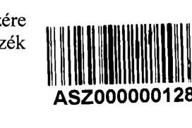

Tárgy: észrevétel jelentéstervezetre Iktatószám: C-G/2020
Ügyintéző: Dr. Barta Judit titkár

$$
2-7 / 1-120 / 1
$$

Tisztelt Elnök Úr!

A 2020. június 30 -án érkezett, EL-0919-743/2020 iktatási számú, 2020. 06. 15 -én kelt levelükre - élve az észrevétel tétel lehetőségével - a B-A-Z Megyei Építész Kamara az alábbiakban szeretne reagálni:

A jelentéstervezet 15 oldalán a B-A-Z Megyei Építész Kamarát az alábbi intézkedésre hívták fel: - a Számtv. előírásainak megfelelően a fökönyvi könyvelés és az analitikus nyilvántartási adatok közötti egyeztetés elvégzésére;

- intézkedés a mérleg tételeinek alátámasztására a Számtv. előírásai szerinti leltár összeállításával.

Elfogadva a jelentéstervezetben tett észrevételeiket, illetve intézkedési felhívásukat, 2020 augusztus hónaptól - egyeztetve a kamara könyvelését végző kft. képviselőjével és a konkrét könyvelési feladatot ellátó könyvelővel - elkezdjük bevezetni a számvitelről szóló 2000. évi C. törvény 159. § szerinti könyvviteli nyilvántartás vezetését a gazdasági műveletekről (egyénre szabott tagdíjnyilvántartás, befizetés, tartozás), amely az eszközökben (aktívákban) és a forrásokban (passzívákban) bekövetkezett változásokat a valóságnak megfelelően, folyamatosan, zárt rendszerben, áttekinthetően mutatja, továbbá a165. § (4) bekezdésének megfelelően, igyekszünk a fökönyvi könyvelés, az analitikus nyilvántartások és a bizonylatok adatai közötti egyeztetés és ellenőrzés lehetőségét, logikailag zárt rendszerrel biztosítani.

Törekszünk arra, hogy a 2020 évi beszámolót, már a számvitelről szóló 2000. évi C. törvény 69. § (1) bekezdésébe „... a beszámoló elkészítéséhez, a mérleg tételeinek alátámasztásához olyan leltárt kell összeállítani és e törvény előírásai szerint megőrizni, amely tételesen, ellenőrizhető módon tartalmazza a vállalkozónak a mérleg fordulónapján meglévő eszközeit és forrásait mennyiségben és értékben, és (2) bekezdésébe „Az (1) bekezdés szerinti kötelezettség teljesítése keretében a vállalkozónak a fökönyvi könyvelés és az analitikus nyilvántartások adatai közötti egyeztetést az üzleti év mérlegfordulónapjára vonatkozóan el kell végeznie." foglaltaknak megfelelően készítsük el, de legkésőbb a 2021. évi beszámolót már ezen előírásoknak megfelelően készítjük el.

Tisztelettel:
Miskolc, 2020. 07. 07.
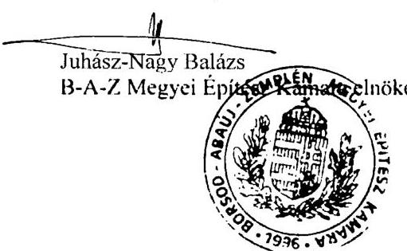

---

# 150 éve a közpénzek öre 

ÁLLAMI SZÁMVEVÓSZÉK

Ikt. szám: EL-0919-768/2020.

Juhász-Nagy Balázs úr
elnök

Borsod-Abaúj-Zemplén Megyei Építész Kamara
Miskolc

Tisztelt Elnök Úr!

A „Kóztestületek ellenőrzése - Magyar Építész Kamara" címmel készített számvevőszéki jelentéstervezetre 6-6/2020. iktatószámú észrevételét köszönettel megkaptam.

Az Állami Számvevőszék észrevételre vonatkozó álláspontjáról a felügyeleti vezető által készített részletes tájékoztatást mellékelten megküldöm.

Tájékoztatom Elnök urat, hogy a számvevőszéki jelentésben - az Állami Számvevőszékről szóló 2011. évi LXVI. törvény 29. § (3) bekezdése alapján - a figyelembe nem vett észrevételt szerepeltetjük, annak indoklásával, hogy azt az Állami Számvevőszék miért nem fogadta el.

Budapest, 2020. 07. hó 22. nap
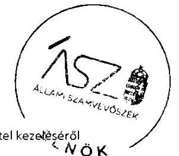

Tisztelettel:
Oe. 101
Domokos László

---

Melléklet
ikt.szám: EL-0919-768/2020.

# Tájékoztatás 

az észrevétel kezeléséről

A „Köztestületek ellenőrzése - Magyar Építész Kamara" című jelentéstervezetre 2020. július 13-án érkezett észrevételt áttekintettük, annak kezelésével kapcsolatban a következő tájékoztatást adom.

Az észrevétel érinti a Borsod-Abaúj-Zemplén Megyei Építész Kamara részére megfogalmazott kettő javaslatot és azokat megalapozó megállapításokat. Elnök úr észrevételében kifejti, hogy az Állami Számvevőszék ellenőrzési megállapításait és javaslatait elfogadja.

Az Állami Számvevőszék ellenőrzési megállapításait megerősítő észrevételét és a megkezdett, illetve tervezett intézkedésekről szóló tájékoztatását köszönjük. Kérjük, hogy a tervezett konkrét intézkedésekről szóló intézkedési tervet a végleges számvevőszéki jelentés kézhezvételét követően, a vonatkozó törvényi határidőn belül szíveskedjen megküldeni. Az észrevétel alapján a jelentéstervezet módosítása nem indokolt.

Budapest, 2020. 07. hó 11, nap
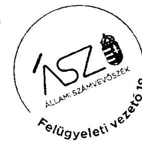

Makkai Mária s.k.
felügyeleti vezető
A kiadmány hiteles.

---

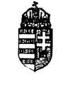

GVÖR-MOSON-SOPRON MEGYEI ÉPÍTÉSZ KAMARA
ES 9023 Győr, Corvin u. 22.
Email: tilkarsag@gyms.epiteszkamara.hu
(96) 527-948 T/Fax: (96) 527-949
Számlaszám: 10300002-33218230-00003285
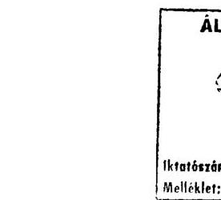

ikt. szám: 3-4/2020

# Állami Számvevőszék 

1052 Budapest, Apáczai Csere J. u. 10.
Domokos László Elnök úr részére
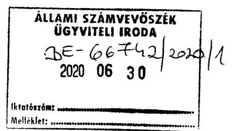

Tisztelt Elnök úr!
Köszönettel kézhez vettük az EL-0919-743/2020 iktatószámú „Köztestületek ellenőrzése - a Magyar Építész Kamara" című számvevőszéki jelentéstervezetet.

A Győr-Moson-Sopron Megyei Építész Kamara gazdálkodására és könyvelésére vonatkozó megállapításukat megköszönve, a hiányolt 2018 évre vonatkozó a Számv. tv 69.§ (1) és (2) pontja alapján elkészített iratokat ismételten mellékelten megküldjük szíves felhasználásra:

- főkönyvi kivonat 2018
- vevői összes folyószámla
- vevői rendezetlen folyószámla
- vevői kiegyenlítetlen vevőkövetelés név szerint
- kiegyenlítetlen vevőkövetelés árbevétel szerint

Kérem jelentéstervezetük véglegesítésekor, ha lehet vegyék figyelembe az átadott iratokat.

Ügyintézésüket megköszönve, további eredményes munkát kívánva, tisztelettel:
Győr, 2020. június 26.
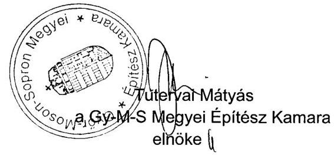

---

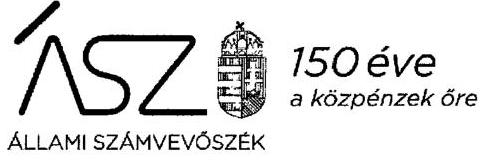

Ikt. szám: EL-0919-756/2020.

Tutervai Mátyás úr
elnök

Győr-Moson-Sopron Megyei Építész Kamara
Győr

Tisztelt Elnök Úr!

A „Köttestületek ellenőrzése - Magyar Építész Kamara" címmel készített számvevőszéki jelentéstervezetre 3-4/2020. iktatószámú észrevételét köszönettel megkaptam.

Az Állami Számvevőszék észrevételre vonatkozó álláspontjáról a felügyeleti vezető által készített részletes tájékoztatást mellékelten megküldöm.

Tájékoztatom Elnök urat, hogy a számvevőszéki jelentésben - az Állami Számvevőszékről szóló 2011. évi LXVI. törvény 29. § (3) bekezdése alapján - a figyelembe nem vett észrevételt szerepeltetjük, annak indoklásával, hogy azt az Állami Számvevőszék miért nem fogadta el.

Budapest, 2020. 07 hó 18 nap

Melléklet: Tájékoztatás az észrevétel kezeléséről
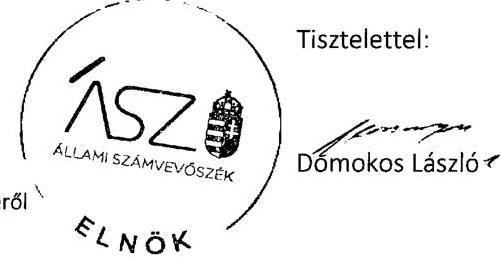

---

Melléklet
Ikt.szám: EL-0919-756/2020.

# Tájékoztatás 

## az észrevétel kezeléséről

A „Köztestületek ellenőrzése - Magyar Építész Kamara" című jelentéstervezetre 2020. június 30-án érkezett észrevételt áttekintettük, annak kezelésével kapcsolatban a következő tájékoztatást adom.

Az észrevételben Elnök úr nem jelölte meg, hogy az Állami Számvevőszék melyik ellenőrzési megállapítására vonatkozóan tesz észrevételt. Ezért úgy tekintjük, hogy az észrevételével Elnök úr a részére megfogalmazott mindkét javaslatra és az azt alátámasztó megállapításokra kíván reagálni.

Az Állami Számvevőszék jelentéstervezetében szereplő kettő javaslat és az azt megalapozó megállapítások a főkönyvi könyvelés és az analitikus nyilvántartási adatok közötti egyeztetés jogszabály szerinti elvégzésének és a mérleg tételek leltárral való alátámasztásának hiányára vonatkoztak.

Elnök úr észrevétele mellékleteként az ellenőrzés során rendelkezésre bocsátott dokumentumok egy részét ismételten megküldte.

Tájékoztatom, hogy az Állami Számvevőszék ellenőrzési megállapításai minden esetben az ellenőrzés során, az arra nyitva álló határidőben rendelkezésre bocsátott dokumentumokon alapulnak. Az Ön részére megküldött jelentéstervezet az ismételten beküldött - az ellenőrzés során is rendelkezésre álló - dokumentumok értékelését már tartalmazta.

A 2018. évi főkönyvi kivonat, vevő folyószámlák, valamint a vevőkövetelések név, illetve árbevétel szerinti rendezése nem igazolja a számvitelről szóló 2000. évi C. törvény (Számv. tv.) 69. § (2) bekezdése szerint a tagdíjkövetelésekre vonatkozóan a főkönyvi könyvelés és az analitikus nyilvántartások adatai közötti egyeztetést elvégzését és a Számv. tv. 69. § (1) bekezdésben foglaltak szerinti leltár meglétét sem.

Mindezek alapján az észrevételt nem fogadjuk el. A jelentéstervezet módosítása nem indokolt.
Budapest, 2020. 07. hó 15 -nap
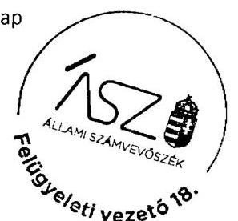

Makkai Mária s.k.
felügyeleti vezető
Jewsis
A kiadmány hiteles.

---

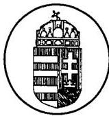

# HAJDÚ-BIHAR MEGYEI ÉPÍTÉSZ KAMARA 4028 Debrecen, Sarló utca 3. szám, Fszt. Telefon: +36 52349 075, e-mail: hbmepkam@net-portal.hu 

Iktatószám: 17-3/2020.
Tárgy: Válasz, tájékoztatás
Ügyintéző: Radics Beatrix

Állami Számvevőszék
Domokos László Elnök részére
1052 Budapest
Apáczai Csere János utca 10 .

Tisztelt Elnök Úr!

A 2020. június 19. napján, postai úton érkezett jelentéstervezetükkel kapcsolatosan az alábbiakról tájékoztatjuk Önöket. A Hajdú-Bihar Megyei Építész Kamara Elnöksége azt áttekintette, a szervezetünket érintő megállapításokat elfogadja.

A Kamaránk - jogszabályoknak megfelelő - egyszeres könyvviteléből fakadó ÁSZ észrevételt kiemelten kezeli, így azt kiküszöbölendő, biztosítva továbbra is szervezetünk transzparens és átlátható gazdálkodását - különös tekintettel a 2020. július 10-i Tisztújító Taggyülésünkre 2021. január 01. napjával áttér a kettős könyvvezetésre, melyet a majdani intézkedési tervünkben kívánunk Önöknek - többek között - részletezni.

Egyidejúleg megköszönjük Önnek és kollégáinak, az ellenőrzés során nyújtott iránymutató segítségüket.

Debrecen, 2020. július 02.
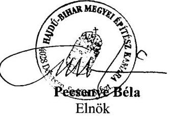

[^0]
[^0]:    Kapják:
    C) Címzett

    - Irattár - helyben

---

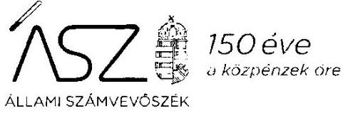

Ikt. szám: EL-0919-765/2020.

Pecsenye Béla úr
elnök

Hajdú-Bihar Megyei Építész Kamara
Debrecen

Tisztelt Elnök Úr!

A „Kóztestületek ellenőrzése - Magyar Építész Kamara" címmel készített számvevőszéki jelentéstervezetre 17-3/2020. iktatószámú észrevéteiét köszönettel megkaptam.

Az Állami Számvevőszék észrevételre vonatkozó álláspontjáról a felügyeleti vezető által készített részletes tájékoztatást mellékeiten megküldöm.

Tájékoztatom Elnök urat, hogy a számvevőszéki jelentésben - az Állami Számvevőszékről szóló 2011. évi LXVI. törvény 29. § (3) bekezdése alapján - a figyelembe nem vett észrevételt szerepeltetjük, annak indoklásávai, hogy azt az Állami Számvevőszék miért nem fogadta el.

Budapest, 2020. 07. hó 2.2. nap
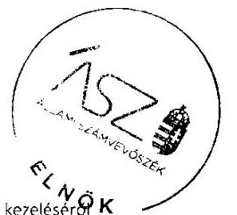

Tisztelettel:

Domokos László

---

Melléklet
Ikt.szám: EL-0919-765/2020.

# Tájékoztatás 

## az észrevétel kezeléséről

A „Kóztestületek ellenőrzése - Magyar Építész Kamara" címú jelentéstervezetre 2020. július 9-én érkezett észrevételt áttekintettük, annak kezelésével kapcsolatban a következő tájékoztatást adom.

Az észrevétel érinti a Hajdú-Bihar Megyei Építész Kamara részére megfogalmazott javaslatot és azt megalapozó megállapítást. Elnök úr észrevételében rögzíti, hogy az Állami Számvevőszék ellenőrzési megállapításait elfogadja.

Az Állami Számvevőszék ellenőrzési megállapításait megerősítő észrevételét és a tervezett intézkedésről és azzal összefüggésben készülő intézkedési tervről szóló tájékoztatását köszönjük. Kérjük, hogy az intézkedési tervet a végleges számvevőszéki jelentés kézhezvételét követően, a vonatkozó törvényi határidőn belül szíveskedjen megküldeni. Az észrevétel alapján a jelentéstervezet módosítása nem indokolt.

Budapest, 2020. O7. hó 21. nap
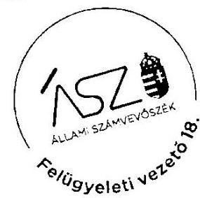

Makkai Mária s.k.
felügyeleti vezető
$\frac{\text { Alus }}{\text { A kiadmány hiteles. }}$

---

# 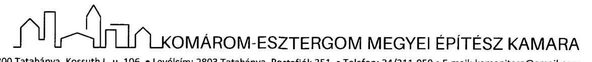 

Kelt: $\quad$ Tatabánya, 2020. június 29.
Iktatószám: $\quad 28-1 / 2020$.
Tárgy: észrevétel megküldése jelentéstervezethez

## Domokos László

## Elnök Úr részére

## Állami Számvevőszék

Budapest 4.
PI. 54.
1364
Tisztelt Elnök Úr!
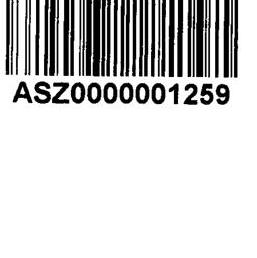

ÁLLAMI SZÁMVEVŐSZÉK
$\mathrm{BE}-6 \mathrm{~V} 18 \mathrm{~V} / 2020 / 1$
Eiközett: 2020 JOL 06.
Iktatószám:
Methőket: $\qquad$
Köszönettel vettük az észrevételezésre megküldött jelentéstervezetet.
Az EL-0919-743/2020. iktatószámú levelük mellékletét képező jelentéstervezetben a Komárom-Esztergom Megyei Építész Kamara számára megfogalmazott javaslathoz az alábbi észrevételt tesszük:

Javaslat: „Intézkedjen a Számv. tv. előírásainak megfelelően a fókönyvi könyvelés és az analitikus nyilvántartási adatok közötti egyeztetés elvégzéséről."

## Észrevétel:

A Komárom-Esztergom Megyei Építész Kamara minden esetben elvégzi a főkönyvi könyvelés és az analitikus nyilvántartások egyeztetését.
Az adatbekérések során a követelések és a tagdíj nyilvántartások analitikáját kellett megküldenünk az ÁSZ részére. A KEM Építész Kamara a tárgyévi ki nem fizetett tagdíjakról a tárgyévben számlát nem állít ki. A tagokat és a nyilvántartott szakmagyakorlókat a díjtartozásokról több alkalommal is kiértesítjük. Amennyiben a díjtartozások meghaladják az egy évet (május 31-én), az Alapszabályunk szerinti eljárást alkalmazzuk. A mérlegben az aktív időbeli elhatárolások sorai tartalmazzák ezen tételek egyeztetett értékét.

A követeléseinkkel kapcsolatban az alábbi dokumentumokat töltöttük fel az ABR rendszerbe, melyek maradéktalanul tartalmazzák az Önök által bekért adatokat.

1. A 2. sz. tanúsítványok tartalmazzák, hogy Kamaránknak nincs 360 napon túli követelése. (feltöltve: 2015-17 évekre: 2019. 07.03., 2018 évre: 2020.01.04.)
2. A „tagdij-követelés leltár" dokumentumaink évenként összesítve az összes díjkövetelésünket tartalmazzák. (feltöltve: 2015-17 évekre: 2019. 07.03., 2018 évre: 2019.12.10.)
3. A „követelés mérlegsort alátámasztó tagdíjak analitikus számviteli nyilvántartása" adatszolgáltatásunk tartalmazta a nyilvántartásunk analitikáját, valamint tájékoztatásunkat arról, hogy azok a követelések között nem szerepelnek. (feltöltve: 2015-17 évekre: 2019. 07.03., 2018 évre: 2019.12.10.)

Kérjük fenti észrevételünk szíves figyelembevételét a jelentés összeállítása során.

Bárminemű további kérdés esetén állunk szíves rendelkezésére.
Köszönettel:
Komárom-Esztergom Megyei
ÉPÍTÉSZ KAMARA
2800 Tatabánya, Kengéli L. u. 106.
A 2. sz. tanúsítvány 18606883-1-11
Vhark, hark
Markos Anikó
KEM Építész Kamara
elnök

---

# 150 éve   a közpénzek öre 

ELNÖK

Ikt. szám: EL-0919-762/2020.

Markos Anikó úrhölgy
elnök

Komárom-Esztergom Megyei Építész Kamara
Tatabánya

Tisztelt Elnök Úrhölgy!

A „Köztestületek ellenőrzése - Magyar Építész Kamara" címmel készített számvevőszéki jelentéstervezetre 28-1/2020. iktatószámú észrevételét köszönettel megkaptam.

Az Állami Számvevőszék észrevételre vonatkozó álláspontjáról a felügyeleti vezető által készített részletes tájékoztatást mellékelten megküldöm.

Tájékoztatom Elnök úrhölgyet, hogy a számvevőszéki jelentésben - az Állami Számvevőszékről szóló 2011. évi LXVI. törvény 29. § (3) bekezdése alapján - a figyelembe nem vett észrevételt szerepeltetjük, annak indoklásával, hogy azt az Állami Számvevőszék miért nem fogadta el.

Budapest, 2020. 07. hó 23. nap
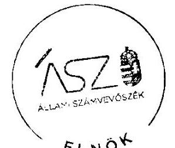

Tisztelettel:
D. 152
Domokos László

Melléklet: Tájékoztatás az észrevétel kezeléséről

---

# Tájékoztatás 

az észrevétel kezeléséröl
A „Köztestületek ellenőrzése - Magyar Építész Kamara" címú jelentéstervezetre 2020. július 6-án érkezett észrevételt áttekintettük, annak kezelésével kapcsolatban a következő tájékoztatást adom.

Az észrevétel érinti a jelentéstervezetben Elnök úrhölgy részére megfogalmazott javaslatot és az azt megalapozó megállapítást. Az észrevétel szerint a Kamara a tárgyévi ki nem fizetett tagdíjakrói számlát nem állít ki. A tagokat és a nyilvántartott szakmagyakorlókat a díjtartozásokról több alkalommal kiértesítik. A mérlegben az aktív időbeli elhatárolások tartalmazzák ezen tételeket. Emellett hivatkozik az ellenőrzés során rendelkezésre bocsátott dokumentumokra (2. számú tanúsítvány, tagdíj-követelés leltár, tagdíjkövetelések analitikája és az ezzel kapcsolatos tájékoztató, mely szerint a tagdíjak a követelések között nem szerepelnek.)

Az észrevételben hivatkozott dokumentumok ismételt áttekintése alapján tájékoztatom, hogy a 2. számú tanúsítvány - az észrevételében foglaltakkal ellentétben - nem a 360 napon túli követelésekről szól, hanem arról, hogy rendelkeznek-e tagdíjköveteléssel (mérleg szerinti állomány), Elnök úrhölgy által kitöltött tanúsítvány szerint a tagdíj követelések mérleg szerinti állománya „0". Ezzel szemben az észrevételben hivatkozott és az ÁSZ rendelkezésére bocsátott „tagdíj-követelés leltár" szerint minden ellenőrzött évben rendelkeztek tagdíj követeléssel. Az észrevételében hivatkozott 3. dokumentum „a követelés mérlegsort alátámasztó tagdíjak analitikus számviteli nyilvántartása" tartalmazta a tagdíj követeléseket és Elnök úrhölgy nyilatkozatát, amely szerint „A Komárom-Esztergom Megyei Építész Kamara számviteli beszámolójában nem szerepel tagdíjkövetelés".

A tagdíjkövetelések aktív időbeli elhatárolásként való kimutatásával összefüggésben tájékoztatom, hogy a számvitelről szóló 2000. C. törvény (Számv. tv.) 32. § (1) bekezdése alapján az aktív időbeli elhatárolások között - az időbeli elhatárolások számviteii alapelve alapján - az olyan járó árbevétel, kamat- és egyéb bevételek szerepeltethetők, amelyek csak a mérleg fordulónapja után esedékesek, de a mérleggel lezárt időszakra számolandók ei. Ez alapján az észrevétel szerinti tételek (tagdíjkövetelések, amelyek az adott évben esedékesek és az adott évre vonatkoznak, azonban azokat nem fizették meg) ilyen formában történő kimutatása nem felel meg a Számv. tv. előírásainak. Egyebekben tájékoztatom, hogy az aktív időbeli elhatárolások között a főkönyvi könyvelésben szerepeltetett összegek nincsenek összhangban a tagdíjkövetelések analitikájával és Elnök úrhölgy által a beszámolóval összefüggésben tett és fentiekben idézett nyilatkozatával sem.

Mindezek alapján megállapítható, hogy a 2018. évben Komárom-Esztergom Megyei Építész Kamara a tagdíjkövetelésekről analitikus, részletező nyilvántartást vezetett, rendelkezett tagdíjkövetelésekkel, amelyeket a számviteli beszámolóban nem mutattak ki, így a Számv. tv. 69. § (2) bekezdése ellenére a főkönyvi könyvelés és az analitikus nyilvántartások adatai közötti

---

egyeztetést nem végezték el.
Mindezek alapján az észrevételt nem fogadjuk el. A jelentéstervezet módosítása nem indokolt.
Budapest, 2020. 07. hó 23. nap
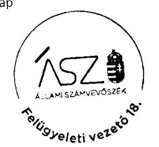

Makkai Mária s.k.
felügyeleti vezető
Hazelul
A kiadmány hiteles.

---

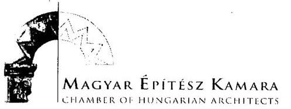

Ikt. sz.: 111 - 1 / 2020
Úgyintéző: Kovács Zsófia Hiv.sz.: EL-0919-743/2020

Tárgy: Az ÁSZ jelentés-tervezetére adott MÉK észrevételek

## Domokos László részére

elnök

Állami Számvevőszék
1364 Budapest 4. Pf.: 54.

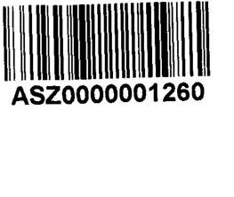

Tisztelt Elnök Úr!

Közönettel vettük a jelentés-tervezetüket, amelyre az alábbi észrevételeket tesszük:

a) az 1. sz. megállapítás 2. bekezdés második mondatával, az "Összegzés" első mondatával és a "Föbb megállapítások, következtetések, javaslatok" 1. bekezdésének második és harmadik mondatával kapcsolatban:

A Magyar Építész Kamara 2015-2018 évekre vonatkozó érvényes számlarendje valóban nem került megküldésre. Ennek ellenére úgy ítéljük meg, hogy a Magyar Építész Kamara megteremtette a gazdálkodásának elszámoltathatósági kereteit. Az országos kamara nyilvántartásait a kettős könyvvitel szabályainak megfelelően alakította ki, oly módon, hogy a főkönyvi könyvelés az országos kamara küldöttgyülése által elfogadott költségvetés szerkezeti felépítettségét kövesse. Ez a felépítés a számviteli törvény által meghatározott kereteken belül országos szabályzatban rögzített, így elősegíti, hogy a gazdálkodás törvényességét, és az elfogadott költségvetéssel történő összhangját az országos kamara szervezetei könnyen és átlátható módon tudják ellenőrizni. A kamara a gazdálkodását bemutató nyilvántartásaiba kizárólag az országos kamara Elnöke által igazolt bizonylatok alapján rögzít gazdasági eseményeket, és az így elkészült főkönyvi és analitikus nyilvántartások alapján készíti el a gazdálkodását bemutató kimutatásokat - kiemelten a szintén a küldöttgyűlés által elfogadott és közzétett gazdasági beszámolót, az Elnökség által elfogadott egyszerűsített éves beszámolót, a központi szervek által elfogadott és jóváhagyott, az állami támogatások szabályszerű felhasználását alátámasztó elszámolásokat - továbbá az előírt bevallásokat. Ez biztosítja, hogy mind az állami, mind az országos kamara meghatározott szervezetei ellenőrizhessék a gazdálkodás szabályszerűségét.

b) a 3. sz. megállapítás 4. bekezdésével kapcsolatban:

A további intézkedésekkel kapcsolatban előzetesen tájékoztatom, hogy az Info. tv. előírásainak megfelelő Adatvédelmi és információbiztonsági szabályzat elfogadásra került, amely 2019. július 1. napjától hatályos.

Budapest, 2020. június 30.

Erőrlétesül:
1. Címzett
2. Irattár

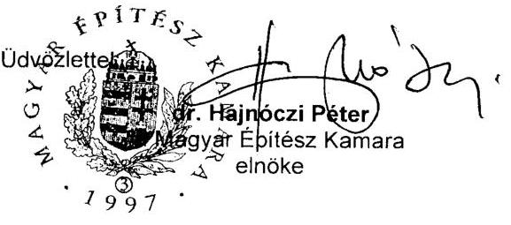

H-1088 Budapest, Ötpacsirta u. 2.

Tel: + 36-1-318-2377

www.mek.hu

mek@mek.hu

---

# 150 éve   a közzénzek öre 

Ikt. szám: EL-0919-761/2020.
dr. Hajnóczi Péter úr
elnök

Magyar Építész Kamara
Budapest

Tisztelt Elnök Úr!

A „Kóztestületek ellenőrzése - Magyar Építész Kamara" címmel készített számvevőszéki jelentéstervezetre 111-1/2020. iktatószámú észrevételét köszönettel megkaptam.

Az Állami Számvevőszék észrevételre vonatkozó álláspontjáról a felügyeleti vezető által készített részletes tájékoztatást mellékelten megküldöm.

Tájékoztatom Elnök urat, hogy a számvevőszéki jelentésben - az Állami Számvevőszékről szóló 2011. évi LXVI. törvény 29. § (3) bekezdése alapján - a figyelembe nem vett észrevételt szerepeltetjük, annak indoklásával, hogy azt az Állami Számvevőszék miért nem fogadta el.

Budapest, 2020. 07 hó 24 nap
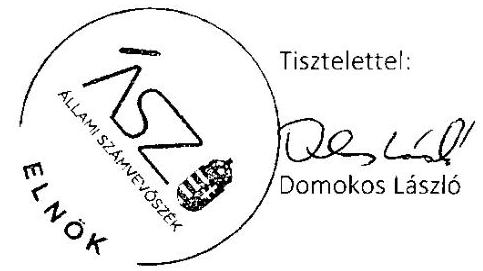

Melléklet: Tájékoztatás az észrevétel kezeléséről

---

# Tájékoztatás   az észrevétel kezeléséről 

A „Köztestületek ellenőrzése - Magyar Építész Kamara" címú jelentéstervezetre 2020. július 6-án érkezett észrevételt áttekintettük, annak kezelésével kapcsolatban a következő tájékoztatást adom.

A Magyar Építész Kamara elnöke részére megfogalmazott 1. számú javaslattal és az azt megalapozó megállapítással kapcsolatban tett észrevételében Elnök úr rögzítette, hogy a 2015-2018. évekre vonatkozóan érvényes számlarendet nem bocstátottak az Állami Számvevőszék rendelkezésére. Ezzel együtt úgy ítélik meg, hogy a kamara gazdálkodása elszámoltathatóságának keretei biztosítottak.

Az észrevétel megerősíti az ellenőrzés megállapítását, amely szerint számlarenddel nem rendelkeztek. Tájékoztatom Elnök urat, hogy a számlarend olyan alapvető számviteli szabályozás, amely - a számvitelről szóló 2000. évi C. törvény 161. § (1) bekezdése alapján - lehetővé teszi, hogy olyan könyvvezetést vezessen a gazdálkodó szervezet, amely a számviteli törvény szerinti beszámoló készítését maradéktalanul biztosítja. Ennek hiányában a szabályszerű számviteli beszámoló elkészítése nem biztosított, amely a gazdálkodás elszámoltathatóságának alapdokumentuma.

Mindezek alapján az észrevételt nem fogadjuk el. A jelentéstervezet módosítása nem indokolt.
A Magyar Építész Kamara elnöke részére megfogalmazott 2. számú javaslattal és az azt megalapozó megállapítással összefüggésben, az adatvédelmi és adatbiztonsági szabályzat elkészítésére vonatkozó intézkedésről az előzetes tájékoztatást köszönjük. Felhívom Elnök úr figyelmét, hogy az előzetes tájékoztatás a Kamara intézkedési terv készítési kötelezettségét nem érinti. Az intézkedési tervet a végleges számvevőszéki jelentés kézhezvételétől számított törvényl határidőn belül el kell készíteniük és az Állami Számvevőszék részére meg kell küldeniük. Az érintett tájékoztatás alapján a jelentéstervezet módosítása nem indokolt.

Budapest, 2020. 07 hó 2.1 nap
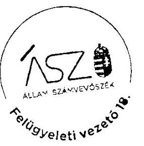

Makkai Mária s.k. felügyeleti vezető

A kiadmány hiteles.

---

# Somogy Megyei Építész Kamara - www.smek.hu 

Tárgy: Somogy Megyei Építész Kamara Állami Számvevőszéki ellenőrzése, észrevétel
Iktatószám: 28-1/2020
Hivatkozott szám: EL-0919-743/2020

## Állami Számvevőszék

1364 Budapest 4.
Pf. 54.
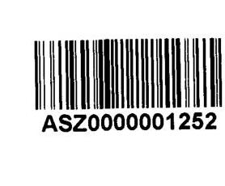

| ÁLLAMI SZÁMVEVÖSZÉK |
| :--: |
| UGYVITELI IRODA |
| BE- 07030 / 2024 |
| 20200703 |

Tisztelt Állami Számvevőszék!

Megállapítás: Intézkedjen a tagdíjkövetelések analitikus nyilvántartásának vezetéséről, valamint a főkönyvi könyvelés és a tagdíjkövetelések analitikus nyilvántartása adatai közötti egyeztetés és ellenőrzés lehetőségének logikailag zárt rendszerrel történő biztosításáról.

## Észrevétel:

A kamarai tagjaink tagdíj befizetését követően számla kerül kiállításra. A számlák alapján a befizetés tényét név szerint vezetjük. Amennyiben a kamarai tagok által be nem fizetett tagdíjkövetelésünk keletkezik, arra vonatkozóan 40 napos fizetési határidővel tértivevényes felszólítást küldünk ki részükre.
Erről táblázat formájában nyilvántartást vezetünk.
A vizsgálat során nyilatkoztunk arról, hogy a díjtartozások nem kerültek kiszámlázásra, ebből következően a mérlegben sem szerepelnek.

Kaposvár, 2020. június 30.
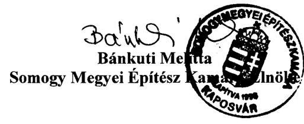

---

# 150 éve   a közzénzek öre 

ÁLLAMI SZÁMVEVÓSZÉK

Ikt. szám: EL-0919-760/2020.

Bánkuti Melitta úrhölgy
elnök

Somogy Megyei Építész Kamara
Kaposvár

Tisztelt Elnök Úrhölgy!

A „Köztestületek ellenőrzése - Magyar Építész Kamara" címmel készített számvevőszéki jelentéstervezetre 28-1/2020. iktatószámú észrevételét köszönettel megkaptam.

Az Állami Számvevőszék észrevételre vonatkozó álláspontjáról a feiügyeleti vezető által készített részletes tájékoztatást mellékelten megküldöm.

Tájékoztatom Elnök úrhölgyet, hogy a számvevőszéki jelentésben - az Állami Számvevőszékről szóló 2011. évi LXVi. törvény 29. § (3) bekezdése alapján - a figyelembe nem vett észrevételt szerepeltetjük, annak indoklásával, hogy azt az Állami Számvevőszék miért nem fogadta el.

Budapest, 2020. 072 hó 2.4 nap

Melléklet: Tájékoztatás az észrevétel kezeléséről
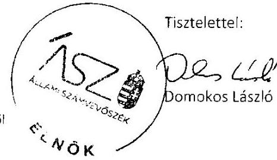

---

Melléklet
ikt.szám: EL-0919-760/2020.

# Tájékoztatás 

## az észrevétel kezeléséröl

A „Köztestületek ellenőrzése - Magyar Építész Kamara" címú jelentéstervezetre 2020. július 3-án érkezett észrevételt áttekintettük, annak kezelésévei kapcsolatban a következő tájékoztatást adom.

Az észrevételben Elnök úrhölgy rögzítette, hogy a kamarai tagdíjak azok befizetését követően kerülnek kiszámlázásra és a befizetés tényét név szerint vezetik. Tagdíjkövetelést a mérlegben nem szerepeltetnek.

Tájékoztatom, hogy az Állami számvevőszék megállapítása nem a befizetések nyilvántartásának hiányára vonatkozott, hanem arra, hogy a tagdíjkövetelésekről nem vezettek analitikus nyilvántartást. Ezt a tényt az észrevétel megerősíti.

A kamarát megillető tagdíjkövetelések - amelyeknek a megfizetése a tervező- és szakértő mérnökök, valamint építészek szakmai kamaráiról szóló 1996. évi LVIII. törvény 29. § (1) bekezdése alapján a tagok részéről kötelező, értékkel rendelkező vagyonelemek. Ezen követeléseknek a számviteli nyilvántartásokban - többek között a beszámolóban - való kimutatása a valós vagyoni helyzet bemutatásának szükséges eleme. A számvitelről szóló 2000. évi C. törvény 159. §-a egyértelműen rögzíti, hogy a gazdálkodó olyan könyvviteli nyilvántartást köteles vezetni, amely az eszközökben bekövetkezett változásokat a valóságnak megfelelően, folyamatosan, zárt rendszerben, áttekinthetően mutatja.

Mindezek alapján az észrevételt nem fogadjuk el. A jelentéstervezet módosítása nem indokolt.
Budapest, 2020. 07 hó 2.1 nap
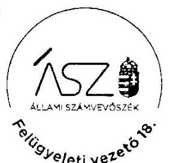

Makkai Mária s.k. felügyeleti vezető

A kiadmány hiteles.

---

# Szabolcs-Szatmár-Bereg Megyei Területi Építész Kamara 

4400 Nyíregyháza, Öz utca 21. Emall: epitesskamara@gmail.com Tel.: 42/401-133 Honlap: www.szab-mok.hu
Hivatali kapc: SZSZBMTEK 157472766 Adószám: 18798560-1-15 Beolczámószám: OTP 11744003-20918435-00000000
Ügyfelfogadási idö: Hétfï: 9-15-ig; Szerda: 8-12-ig, 13-16-ig; Csütörtök: 9-12-ig
Iktatószám: 8-2/2020
Ügyintéző: Barkaszi Csilla
ÁLLAMI SZÁMVEVÖSZÉK
Domokos László
Elnök részére
Budapest
Apáczai Csere János utca 10.
1052

Tárgy: Válasz, tájékoztatás
Hiv.: EL-0919-743/2020

## ÁLLAMI SZÁMVEVÖSZÉK   ÜGYVITELI IRGDA

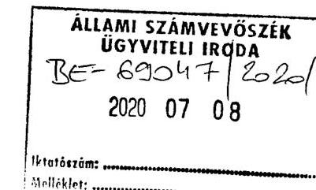

Tisztelt Elnök Úr!

Tájékoztatni kívánjuk Önöket, hogy 2020. június 19-én, postai úton érkezett jelentés tervezetüket a Szabolcs-Szatmár-Bereg Megyei Területi Építész Kamara Elnöksége áttekintette és a szervezetünket érintő megállapításokat elfogadja.
Kamaránk az ÁSZ egyszeres könyvvitelére vonatkozó észrevételeit kiemelten kezeli. A jövőbeni problémák megelőzése céljából át kíván térni a kettős könyvvitel rendszerére, amit a tárgyévi gazdálkodás lezárását követően, 2021. január 1-től kívánunk bevezetni.
Előbbiek vonatkozásában intézkedési tervet fogunk készíteni, amit a megadott határidőn belül el fogunk juttatni Önöknek.

Ezúton megköszönjük az ellenőrzés során végzett munkájukat és segítőkészségüket.

Nyíregyháza, 2020. július 1.
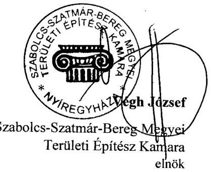

Kapják:
1.) Címzett
2.) Irattár

---

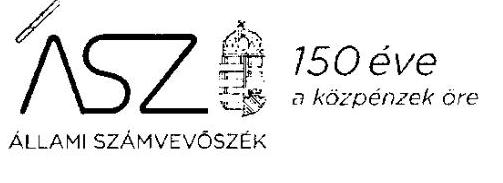

Ikt. szám: EL-0919-764/2020.

Végh József úr
elnök

Szabolcs-Szatmár-Bereg Megyei Területi Építész Kamara
Nyíregyháza

Tisztelt Elnök Úr!

A „Kóztestületek ellenőrzése - Magyar Építész Kamara" címmel készített számvevőszéki jelentéstervezetre 8-2/2020. iktatószámú észrevételét köszönettel megkaptam.

Az Állami Számvevőszék észrevételre vonatkozó álláspontjáról a felügyeleti vezető által készített részletes tájékoztatást mellékelten megküldöm.

Tájékoztatom Elnök urat, hogy a számvevőszéki jelentésben - az Állami Számvevőszékről szóló 2011. évi LXVI. törvény 29. § (3) bekezdése alapján - a figyelembe nem vett észrevételt szerepeltetjük, annak indoklásával, hogy azt az Állami Számvevőszék miért nem fogadta el.

Budapest, 2020. 04. hó 23. nap
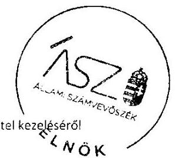

Tisztelettel:
D. 111

Dorokos László

---

Melléklet
Ikt.szám: EL-0919-764/2020.

# Tájékoztatás   az észrevétel kezeléséröl 

A „Köztestületek ellenőrzése - Magyar Építész Kamara" címú jelentéstervezetre 2020. július 8-án érkezett észrevételt áttekintettük, annak kezelésével kapcsolatban a következő tájékoztatást adom.

Az észrevétel érinti a Szabolcs-Szatmár-Bereg Megyei Területi Építész Kamara részére megfogalmazott javaslatot és azt megalapozó megállapítást. Elnök úr észrevételében rögzíti, hogy az Állami Számvevőszék ellenőrzési megállapításait elfogadja.

Az Állami Számvevőszék ellenőrzési megállapításait megerősítő észrevételét és a tervezett intézkedésről és azzal összefüggésben készülő intézkedési tervről szóló tájékoztatását köszönjük. Az észrevétel alapján a jelentéstervezet módosítása nem indokolt.

Budapest, 2020. O 7 hó 22 nap
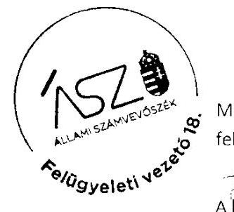

Makkai Mária s.k.
felügyeleti vezető
Túlya!l!l!
A kiadmány hiteles.

---

# MaGyar ÉpítésZek Veszprém Megyei Kamaráa 

Domokos László úr
elnök

Állami Számvevőszék
Budapest 4.
Pf.: 54.
1364

Tisztelt Elnök Úr!
Iktatószám: 7-2/2020.
Tárgy: köztestületek ellenőrzése
Hiv.sz.: EL-0919-743/2020

## ÁLLAMI SZÁMVEVÖSZÉK

$\mathrm{Be}-67802 \mathrm{~kg} / \mathrm{l}$
Érkszett: 2020 JOL 03. 1991
Iktatószám:
Melléklet:
A „Kóztestületek ellenőrzése - Magyar Építész Kamara" címmel készített számvevőszéki jelentéstervezetre az alábbi észrevételeket tesszük.

Területi kamaránk alapszabályának a tagdijbeszedésre vonatkozó szabályai szerint a tagdijat minden évben két részletben, május 20., illetve október 20. napjáig kell megfizetni.

A tagdijakat ezen előírás alapján szedjük be és a befizetéseket féléves bontásban, számítógépes nyilvántartásunkban folyamatosan rögzítjük.

A vizsgált időszakban a Számv.tv 159. § előírásinak megfelelően a tagdíjkövetelések analitikus nyilvántartásával tehát rendelkeztünk. Kimutatásunk azonosítható módon rögzítette a tagdíjbefizetéseket, s az esetleges késedelmet.
A nyilvántartás alapján a tagdíjak teljes összegét a mérleg elkészítéséig maradéktalanul beszedtük. Fentiekre tekintettel tagdíj követelési leltárt nem készítettünk, a jelentéstervezet ezirányú megállapítását elfogadjuk.

Az ÁSZ vizsgálat ideje alatt - a bekért iratok alapján -, már kamaránk is megállapította e hiányosságot, így 2019 évre már rendelkeztünk a vizsgált időszakban hiányzó leltárral is. Az elmúlt évet illetően tehát a Számv.tv 165. § (4) bekezdésének megfelelően a főkönyvi könyvelés és az analitikus nyilvántartás adatai között egyeztetés és ellenőrzés lehetősége zárt rendszerrel már biztosított.

Kérem észrevételeim szíves elfogadását, egyidejüleg megköszönöm a korábbi hiányosság feltárását.
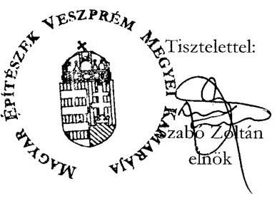

---

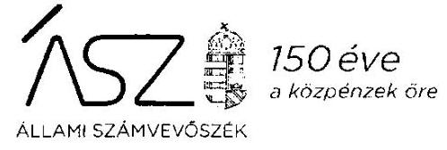

Ikt. szám: EL-0919-766/2020.

Szabó Zoltán úr
elnök

Magyar Építészek Veszprém Megyei Kamarája
Veszprém

Tisztelt Elnök Úrl

A „Köztestületek ellenőrzése - Magyar Építész Kamara" címme! készített számvevőszéki jelentéstervezetre 7-2/2020. iktatószámú észrevételét köszönettel megkaptam.

Az Állami Számvevőszék észrevételre vonatkozó álláspontjáról a felügyeleti vezető által készített részletes tájékoztatást mellékelten megküldöm.

Tájékoztatom Elnök urat, hogy a számvevőszéki jelentésben - az Állami Számvevőszékről szóló 2011. évi LXVI. törvény 29. § (3) bekezdése alapján - a figyelembe nem vett észrevételt szerepeltetjük, annak indoklásával, hogy azt az Állami Számvevőszék miért nem fogadta el.

Budapest, 2020. 07 hó 22. nap
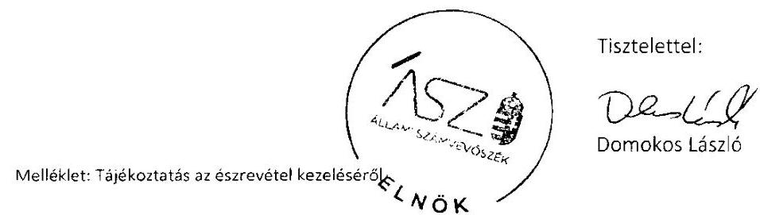

---

# Tájékoztatás 

az észrevétel kezeléséről
A „Kóztestületek ellenőrzése - Magyar Építész Kamara" címú jelentéstervezetre 2020. július 3-án érkezett észrevételt áttekintettük, annak kezelésével kapcsolatban a következő tájékoztatást adom.

Az észrevétel érinti a Magyar Építészek Veszprém Megyei Kamarája részére megfogalmazott javaslatot és azt megalapozó megállapítást. Elnök úr észrevételében rögzíti, hogy a tagdijbefizetéseket féléves bontásban, számítógépes nyilvántartásban rögzítik, ebből adódóan rendelkeznek a tagdijkövetelések analitikus nyilvántartásával. Ezen túlmenően tájékoztatást fogalmaz meg a tagdijkövetelések 2019. évi leitározásának elvégzéséről.

Az Állami Számvevőszék ellenőrzési megállapítása az ellenőrzött időszakra vonatkozóan a tagdijkövetelések esetében a leltár hiányát nem rögzítette, mivel a tagdijköveteléseket a Kamara számviteli nyilvántartásaiban nem mutatta ki. A Számv. tv. 165. § (4) bekezdése szerinti, a főkönyvi könyvelés és az analitikus nyilvántartások közötti egyeztetési és ellenőrzési lehetőség logikailag zárt rendszerrel történő biztosításának hiánya a tagdijkövetelések analitikus nyilvántartásának hiányából adódott.

Az ellenőrzés során rendelkezésre bocsátott dokumentumok ismételt áttekintése alapján tájékoztatom, hogy Elnök úr 2019. június 28-án kelt nyilatkozatában rögzített gyakorlat szerint a tagdijbefizetésekről a befizetést követően kerül kiállításra számla, a mérlegben tagdijkövetelés nem szerepel. A tagdijkövetelésekre vonatkozóan analitikus nyilvántartást nem bocsátottak az ellenőrzés rendelkezésére.

A kamarát megillető tagdijkövetelések, amelyeknek a megfizetése a tervező- és szakértő mérnökök, valamint építészek szakmai kamaráiról szóló 1996. évi LVIII. törvény 29. § (1) bekezdése alapján a tagok részéről kötelező, értékkel rendelkező vagyonelemek. Ezen követeléseknek a számviteli nyilvántartásokban - többek között a beszámolóban - való kimutatása a valós vagyoni helyzet bemutatásának szükséges eleme. A számvitelről szóló 2000. évi C. törvény 159. §-a rögzíti, hogy a gazdálkodó olyan könyvviteli nyilvántartást köteles vezetni, amely az eszközökben bekövetkezett változásokat a valóságnak megfelelően, folyamatosan, zárt rendszerben, áttekinthetően mutatja.

Mindezek alapján az észrevételt nem fogadjuk el. A jelentéstervezet módosítása nem indokolt.
Budapest, 2020. 07 . hó 23. nap
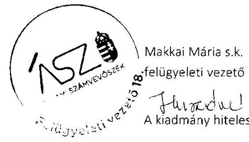

---

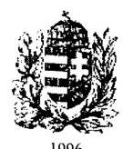

# ZALA MEGYEI ÉPÍTÉSZ KAMARA 

Ikt.sz.: 4-4/2020
Hiv.sz.: EL-0919-743/2020.

Állami Számvevőszék
Domokos László elnök úr

1364 Budapest 4.
Pf. 54

Tisztelt Elnök Úr!

A fenti számon megküldött „Köztestületek ellenőrzése - Magyar Építész Kamara" címmel készített jelentéstervezetre az alábbi észrevételt teszem:

Az idézett jogszabályi előírásokat nem vitatom, de úgy érzem, hogy azok nem veszik figyelembe a gazdálkodó szervezetek méretét. Azt gondolom, hogy nem lehetne a jogszabályok minden előírását ugyanúgy alkalmazni a nagy vállalatokra és a területi kamarákhoz hasonló kisméretű köztestületekre.
Kamaránk adminisztrációs és könyvelési feladatait - tekintettel a testület méretére részmunkaidős és külsős vállalkozó személyek látják el.
A kifogásolt előírások maradéktalan betartása többletterheket jelentene a kamarának és esetenként - az alábbiakban részletezettek szerint - fizikailag sem megoldható.

Az alábbiakban részletezem a megállapításokkal kapcsolatos észrevételt:

## 1./ A tagdíikövetelések analitikus nyilvántartásának vezetéséhez:

Kamaránknál 20 éve bevett gyakorlat, hogy a tagdíjról korábban levélben, jelenleg emailben értesítjük tagjainkat. Számlakibocsájtásra csak a tagdíj beérkezése után kerül sor amit a könyvelőnk szabályszerűen könyvel. Ezen módszerrel analitikus nyilvántartás szerint tagdíjkövetelést nem tudunk nyilvántartani.
Az év eleji számlakibocsátásnak és nyilvántartásának akadálya az, hogy előre nem tudható, hogy ki fog esetleg tagságot, vagy jogosultságot szüneteltetni, kinek fizeti a tagdíjat a munkáltatója (és még ugyanaz-e, aki az előző évben), ki változtat lakhelyet és jelentkezik át más kamarába), stb.
Előzetes számlakibocsátás esetén sok számlát kellene stornózni és módosítani.
Fenti megszokott módszerrel - mint azt a tisztelt ÁSZ is megállapította - a tagdíjak határidőre történő behajtása ill. a tagdíjat nem fizetők tagságának megszüntetése megfelelően megtörtént.

---

# 2./ Költségvetési támogatások nyilvántartása: 

A támogatások felhasználása jogszabály szcrinti nyilvántartásának akadály annak csckély mértékén túl a szcrzódések megkötésćnek időpontja. A támogatás a tárgyév január 01 és december 31 között használható fel. A pályázati kiírás év közben jelenik meg és szerzódéskötésre általában csak az év második felében (pl 2016-ban augusztus 30.-án, 2017-ben december 06.-án) kerül sor.
Fentiekre tekintettel a támogatást csak utólag tudjuk az elfogadott és támogatott feladatokra szétosztani, amit megállapításuk szerint szabályosan meg is tettünk.

Kérem tisztelt Elnök Urat, hogy fentieket a végleges jelentésükben figyelembe venni szíveskedjenek!

Zalaegerszeg, 2020. július 1.
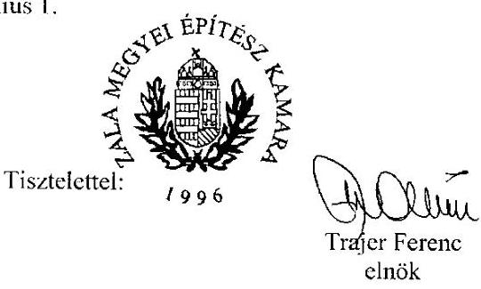

---

# 150 éve   a közpénzek öre 

ÁLLAMI SZÁMVEVÓSZÉK

Ikt. szám: EL-0919-763/2020.

Trajer Ferenc úr
elnök

Zala Megyei Építész Kamara
Zalaegerszeg

Tisztelt Elnök Úrl

A „Köztestületek ellenörzése - Magyar Építész Kamara" címmel készített számvevőszéki jelentéstervezetre 4-4/2020. iktatószámú észrevételét köszönette! megkaptam.

Az Állami Számvevőszék észrevételre vonatkozó álláspontjáról a felügyeleti vezető által készített részletes tájékoztatást mellékelten megküldöm.

Tájékoztatom Elnök urat, hogy a számvevőszéki jelentésben - az Állami Számvevőszékről szóló 2011. évi LXVI. törvény 29. § (3) bekezdése alapján - a figyelembe nem vett észrevételt szerepeltetjük, annak indoklásával, hogy azt az Állami Számvevőszék miért nem fogadta el.

Budapest, 2020. 01 hó 21 nap

Melléklet: Tájékoztatás az észrevétel kezeléséről
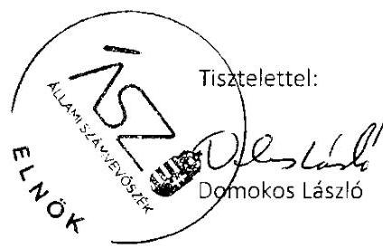

---

# Tájékoztatás   az észrevétel kezeléséről 

A „Kóztestületek ellenőrzése - Magyar Építész Kamara" címú jelentéstervezetre 2020. július 7-én érkezett észrevételt áttekintettük, annak kezelésével kapcsolatban a következő tájékoztatást adom.

Az észrevétel érinti a Zala Megyei Építész Kamara részére megfogalmazott javaslatokat és azokat megalapozó megállapításokat. Elnök úr észrevételében nem vitatja az Állami Számvevőszék megállapításait. Tájékoztatást fogalmaz meg a jogszabályi előírások betartása esetén jelentkező adminisztrációs teherről a tagdíjkövetelések és a költségvetési támogatások szabályszerű számviteli nyilvántartását érintően. Továbbá rögzíti, hogy a támogatást „utólag" volt lehetőség „az elfogadott és támogatott feladatokra szétosztani", amelyet meg is tettek.

Az Állami Számvevőszék ellenőrzési megállapításait megerősítő észrevételét köszönjük. Tájékoztatom, hogy az Állami Számvevőszék minden esetben objektíven értékeli az érintett ellenőrzött szervezetre vonatkozó, hatályos jogszabályi előírások betartását, nem mérlegel egyéb szempontokat.

A költségvetési támogatások elkülönített nyilvántartását érintően tájékoztatom Elnök urat, hogy az Állami Számvevőszék EL-0919-491/2019. iktatószámú adatbekérésre teljesített adatszolgáltatása alapján elkülönített nyilvántartást a költségvetési támogatásokról - sem a bevételek, sem a kiadások tekintetében - nem vezettek.

Mindezek alapján az észrevételt nem fogadjuk el. A jelentéstervezet módosítása nem indokolt.

Budapest, 2020. 07 hó 24 nap
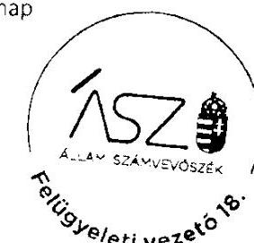

Makkai Mária s.k. felügyeleti vezető

A kiadmány hiteles.

---

# CSONGRÁD MEGYEI ÉPÍTÉSZ KAMARA 

6720. Szeged, Arany János u. 7. e-mail: canek.kamara@gmail.com: Telefon: 20/956-8555

## Állami Számvevőszék Budapest

Apáczai Csere János u. 10. 1052

Domonkos László
Állami Számvevőszék Elnöke részére
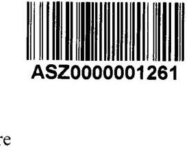

ÁLLAMI SZÁMVEVŐSZÉK
$\frac{\text { BEE- } 08^{\circ} 18412020 / 1}{25.05 .05 .05 .05 .05}$

Ikt. szám: EL-0919-743/2020

Tisztelt Elnök Úr!
A „Köztestületek ellenőrzése - Magyar Építész Kamara" címmel készített számvevőszéki jelentéstervezetet megkaptam. Abban foglaltakat tudomásul vettem, észrevételt nem kívánok tenni.

Amennyiben a végleges jelentés a Csongrád Megyei Építész Kamarához beérkezik, gondoskodom az intézkedés terv összeállításáról és annak Önök részére történő megküldéséről.
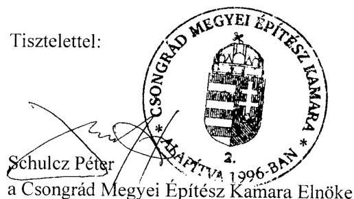

---

.

---

# RÖVIDÍTÉSEK JEGYZÉKE 

${ }^{1}$ Kamtv.
${ }^{2}$ MÉK
${ }^{3}$ országos kamara
${ }^{4}$ ÁSZ tv.
${ }^{5}$ ÁSZ SZMSZ
${ }^{6}$ küldöttgyúlési határozat
${ }^{7}$ Számviteli Politika
${ }^{8}$ Leltározási Szabályzat
${ }^{9}$ Értékelési Szabályzat
${ }^{10}$ Pénzkezelési szabályzat
${ }^{11}$ külön szabályzat
${ }^{12}$ Info tv.
${ }^{13}$ Ectv.
${ }^{14}$ Ávr.
${ }^{15}$ BEK
${ }^{16}$ BKMEK
${ }^{17}$ BEMEK
${ }^{18}$ BAZEK
${ }^{19}$ CSMEK
${ }^{20}$ DDMEK
${ }^{21}$ FEJÉRMEK
${ }^{22}$ GYMSMEK
${ }^{23}$ HBMEK
${ }^{24}$ HMEK
${ }^{25}$ JNSZMEK
${ }^{26}$ KEMEK
${ }^{27}$ NMEK
${ }^{28}$ PMÉK
${ }^{29}$ SMEK
a tervező- és szakértő mérnökök, valamint építészek szakmai kamaráiról szóló 1996. évi LVIII. törvény (hatályos: 1996. július 25-től)

Magyar Építész Kamara, amely tevékenységét országos szervezete és területi szervezetein keresztül látja el
Magyar Építész Kamara országos szervezete
az Állami Számvevőszékről szóló 2011. évi LXVI. törvény
(hatályos: 2011. július 1-től)
Állami Számvevőszék Szervezeti és Működési Szabályzata
2/2015. (01.30.) sz. MÉK kgy. határozat, 29/2015. (11.27.)
sz. MÉK kgy. határozat, 12/2016. (12.02.) MÉK kgy. határozat, 17/2017. (11.10.) sz. MÉK Kgy. határozat
a Magyar Építész Kamara Számviteli Politikája (hatályos: 2015. január 1-jétől)
a Magyar Építész Kamara Leltárkészítési és Leltározási Szabályzata
(hatályos: 2015. január 1-jétől)
a Magyar Építész Kamara Eszközök és Források Értékelési Szabályzata
(hatályos: 2015. január 1-jétől)
a Magyar Építész Kamara Pénzkezelési Szabályzata
(hatályos: 2015. január 1-jétől)
a Magyar Építész Kamara Pénzügyi és gazdálkodási szabályzata (hatályos: 2012. december 20-tól, módosítva 2014. április 09-től, 2015. február 06-tól, 2015. április 24-től, 2016. január 01-től, 2016. június 01-től, 2017. június 01-től és 2017. december 12-től)
az információs önrendelkezési jogról és az információszabadságról szóló 2011. évi CXII. törvény (hatályos: 2011. július 27-től)
az egyesülési jogról, a közhasznú jogállásról, valamint a civil szervezetek múködéséről és támogatásáról szóló 2011. évi CLXXV. törvény
(hatályos: 2011. december 22-étől)
az államháztartásról szóló törvény végrehajtásáról szóló 368/2011. (XII. 31.)
Korm. rendelet (hatályos: 2012. január 1-től)
Budapesti Építész Kamara
Bács-Kiskun Megyei Építész Kamara
Békés Megyei Építész Kamara
Borsod-Abaúj-Zemplén Megyei Építész Kamara
Csongrád Megyei Építész Kamara
Dél-Dunántúli Építész Kamara
Fejér Megyei Építészek Kamarája
Győr-Moson-Sopron Megyei Építész Kamara
Hajdú-Bihar Megyei Építész Kamara
Heves Megyei Építész Kamara
Jász-Nagykun-Szolnok Megyei Építészek Kamarája
Komárom-Esztergom Megyei Építész Kamara
Nógrád Megyei Építész Kamara
Pest Megyei Építész Kamara
Somogy Megyei Építész Kamara

---

${ }^{30}$ SZABMEK
${ }^{31}$ VMEK
${ }^{32}$ VEMEK
${ }^{33}$ ZMEK

Szabolcs-Szatmár-Bereg Megyei Területi Építész Kamara
Vas Megyei Építész Kamara
Magyar Építészek Veszprém Megyei Kamarája
Zala Megyei Építész Kamara

---

# ASZ 

ALLAMI SZAMVEVOSZEK
1052 Budapest, Apáczai Cs. J. u. 10. I 1364 Budapest 4. Pf. 54 TEL: +36 14849100
email: szamvevoszek@asz.hu
web: www.asz.hu | www.aszhirportal.hu