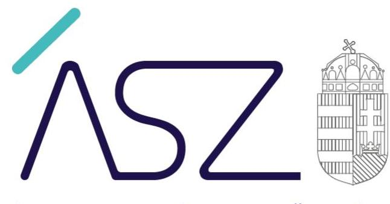

ÁLLAMI SZÁMVEVŐSZÉK

# JELENTÉS 

## Köztestületek ellenőrzése

Magyar Mérnöki Kamara

2020.

20167
www.asz.hu

---

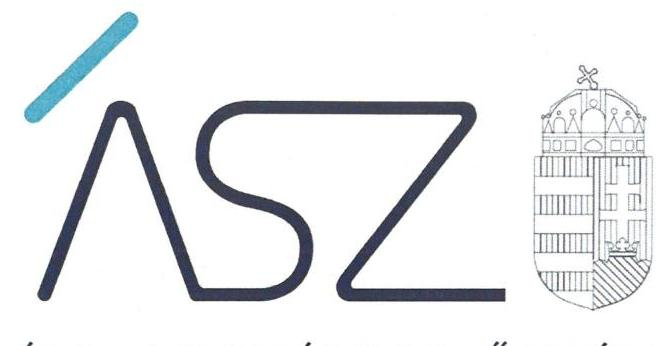

ÁLLAMI SZÁMVEVŐSZÉK

# JELENTÉS 

## Köztestületek ellenőrzése

Magyar Mérnöki Kamara
2020. 08 hó 13 nap

20167
www.asz.hu

---

# AZ ELLENŐRZÉST FELÜGYELTE: 

MAKKAI MÁRIA felügyeleti vezető

## AZ ELLENŐRZÉST VEZETTE ÉS A VÉGREHAJTÁSÁÉRT FELELŐS:

BAGOLY BRIGITTA ellenőrzésvezető

## A PROGRAM ÖSSZEÁLLÍTÁSÁÉRT FELELŐS:

SZALAY NAGY JÁNOS projektvezető
TÓTPÁL SZABOLCS osztályvezető

IKTATÓSZÁM: EL-2833-001/2020
TÉMASZÁM: 2455
ELLENŐRZÉS-AZONOSÍTÓ SZÁM: V079904

---

# TARTALOMJEGYZÉK 

■ ÖSSZEGZÉS ..... 5
■ AZ ELLENŐRZÉS CÉLJA ..... 6
■ AZ ELLENŐRZÉS TERÜLETE ..... 7
■ AZ ELLENŐRZÉS HÁTTERE, INDOKOLTSÁGA ..... 8
■ A JELENTÉS LÉNYEGES KÉRDÉSKÖREI ..... 9
■ AZ ELLENŐRZÉS HATÓKÖRE ÉS MÓDSZEREI ..... 10
■ MEGÁLLAPÍTÁSOK ..... 12
■ JAVASLATOK ..... 14
■ MELLÉKLETEK ..... 21
I. sz. melléklet: Értelmező szótár ..... 21
II. sz. melléklet: a Magyar Mérnöki Kamara országos és területi szervezetei esetében feltárt szabálytalanságok ..... 22
■ FÜGGELÉK: ÉSZREVÉTELEK ..... 23
■ RÖVIDÍTÉSEK JEGYZÉKE ..... 87

---

.

---

# ÖSSZEGZÉS 

A Magyar Mérnöki Kamara gazdálkodása nem volt átlátható és elszámoltatható. A területi kamarák a tagdij hátralékkal kapcsolatban törvényben előirt feladatukat az ellenőrzött időszakban nem látták el. Nem szabályszerűen tartották nyilván a közfeladat ellátására kapott költségvetési támogatásokat.

## Az ellenőrzés társadalmi indokoltsága

A Magyar Mérnöki Kamara a mérnökök szakmai érdekképviseleti szerve. Az Magyar Mérnöki Kamara országosan egységesen nyilvántartja a területi kamarák és szakmai tagozatok tagjainak, valamint a szakmai kollégiumoknak az adatait, a honlapján hozzáférhetővé teszi nyilvántartását. Közigazgatási feladatai körében hatóságként jár el a mérnöki tevékenység engedélyezése, az engedély visszavonása és az ezzel összefüggő névjegyzékbevétel, a névjegyzékből való törlés, a mérnöki tevékenységre való jogosultságról hatósági igazolvány kiállítása, a szakmai továbbképzési kötelezettség teljesítésének igazolására szolgáló hatósági bizonyítvány kiállítása ügyekben. Mindezért fontos társadalmi elvárás az engedélyhez kötött mérnöki tevékenység végzésére jogosultak kamara általi nyilvántartásának megbízhatósága. A Magyar Mérnöki Kamara gazdálkodását az Állami Számvevőszék eddig még nem ellenőrizte.

## Főbb megállapítások, következtetések, javaslatok

A Magyar Mérnöki Kamara országos szervezete a jogszabályi előírások szerinti beszámoló készítési kötelezettségének nem tett eleget. Ezzel a Magyar Mérnöki Kamara országos szervezete nem biztosította gazdálkodásának átláthatóságát.

A területi kamarák számviteli politikával és számlarenddel nem rendelkeztek. A területi szervezeteknél a tagdíjkövetelések nyilvántartása 2015-2018. közötti időszakban az analitikus nyilvántartás hiánya miatt nem volt szabályszerű. Nem intézkedtek az egy évet meghaladó tagdíjak beszedéséről, mivel az egyévi tagdíjat meghaladó hátralék felhalmozódása esetén a tagot hátralék megfizetésére nem hívták fel. Nem igazolt továbbá a kamarai tag tagsági viszonyának megszüntetése, amennyiben annak egyévi tagdíjat meghaladó hátraléka halmozódott fel. Mindezek következtében az engedélyezéshez kötött tevékenység folytatásának feltételeként előírt kamarai tagságot igazoló névjegyzék megbízhatósága, ezáltal a jogszabályi jogosultságnak megfelelő mérnöki feladatellátás nem igazolt.

A költségvetési támogatás felhasználásának nyilvántartása a területi szervezeteknél nem volt szabályszerű mivel a jogszabályok és a támogatási szerződések előírása ellenére nem vezettek a felhasználásról elkülönített nyilvántartást.

Az Állami Számvevőszék a Magyar Mérnöki Kamara országos szervezete elnökének, valamint területi szervezetei elnökeinek összesen 30 javaslatot fogalmazott meg.

---

# AZ ELLENŐRZÉS CÉLJA 

Az ellenőrzés célja annak megállapítása, hogy a Magyar Mérnöki Kamara gazdálkodása során betartotta-e a vonatkozó jogszabályi előírásokat, ennek keretében betartotta-e az előírásokat a belső szabályozási keretek kialakítása, a tagdíjbeszedés, a közzétételi és adatszolgáltatási tevékenysége során. Szabályszerűen számolta-e el, illetve tartotta-e nyilván a törvényben rögzített közfeladat ellátására államháztartásból kapott támogatásokat.

---

# **AZ ELLENŐRZÉS TERÜLETE**

## **Magyar Mérnöki Kamara**

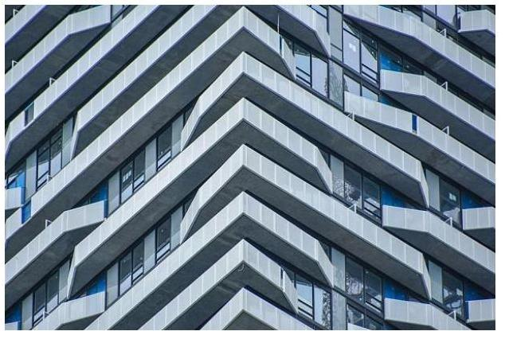

1. táblázat 2015-2018. között kapott támogatások megoszlása kamaránként

|  Kamara | Támogatási összeg  |
| --- | --- |
|  Rács-Kiskun MMK | 20 000 000 Ft  |
|  Ráranya MMK | 20 000 000 Ft  |
|  Rékás MMK | 20 000 000 Ft  |
|  Berszél-Abaúj-Zemplén MMK | 20 000 000 Ft  |
|  Budapesti és Kert MMK | 235 649 000 Ft  |
|  Csongrád MMK | 20 000 000 Ft  |
|  Fájár MMK | 20 000 000 Ft  |
|  Győr-Ahsson-Sopron MMK | 19 920 325 Ft  |
|  Hajdú-Bilua MMK | 19 996 900 Ft  |
|  Heves MMK | 19 988 000 Ft  |
|  Magyar Mérnöki Kamara | 115 160 000 Ft  |
|  Hoz-Nagakun-Szelmik MMK | 19 923 614 Ft  |
|  Komárom-Ketergum MMK | 20 000 000 Ft  |
|  Négcél MMK | 19 916 000 Ft  |
|  Semegy MMK | 20 000 000 Ft  |
|  Szakolcs-Szatmár-Bezeg MMK | 20 000 000 Ft  |
|  Tolna MMK | 20 000 000 Ft  |
|  Vas-Megget MMK | 19 920 325 Ft  |
|  Veszprém MMK | 19 996 900 Ft  |
|  Zala MMK | 19 976 955 Ft  |

Az MMK^{1}-t a tervező- és szakértő mérnökök, valamint építészek szakmai kamaráiról szóló 1996. évi LVIII. törvény^{2} rendelkezéseinek megfelelően a területi mérnöki kamarák hozták létre. Az MMK országos feladat- és hatáskörrel rendelkező köztestület. Az MMK a 2006. évi LXV. törvény^{3} 8/A. § (1) bekezdése alapján - önkormányzattal és nyilvántartott tagsággal rendelkező szervezet. Az MMK és a megyei kamarák szervezetei önálló jogi személyek. Az MMK országos ügyintéző és ellenőrző szervei az Országos Elnökség, az Országos Felügyelő Bizottság, az Országos Etikai-Fegyelmi Bizottság és az Országos Választási Jelölőbizottság, valamint az állandó bizottságok.

Az MMK közfeladatait a köztestületet létrehozó törvény rögzíti. Az MMK közigazgatási hatóságként jár el a mérnöki tevékenység engedélyezése, az engedély visszavonása és az ezzel összefüggő névjegyzékbevétel, illetve a névjegyzékből való törlés, a mérnöki tevékenységre való jogosultságról hatósági igazolvány kiállítása ügyekben. Közigazgatási hatósági ügyekben első fokon a területi kamara jár el, a területi kamara elsőfokú határozata elleni fellebbezés elbírálására az országos kamara jogosult.

A természetes személy tagsági viszonya a megyei kamaráknál történő tagfelvétellel keletkezik. Az MKK 2018. december 31-én 21 587 fő kamarai tagot tartott nyilván (ebből 20 068 fő aktív és 1 519 fő felfüggesztett tag).

Az MMK működésével járó költségek fedezetéül szolgáló bevételek: a kamarai tagdíjak, az igazgatási szolgáltatási díjak, a nyilvántartási díjak, a befizetett bírságok, regisztrációs és adminisztrációs díjak, valamint az egyéb bevételek, támogatások, ideértve a pályázati forrásokat és az önkéntesen felajánlott hozzájárulásokat is. A kamarai tagok által befizetett tagdíjakat a területi kamarák szedik be. A Kam. tv. szerint a díjak országosan egységes mértékűek. Az MMK költségvetését a Küldöttgyűlés fogadja el, amelynek részeként meghatározzák az éves tagdíjak rendszerét és összegét, beleértve a területi kamarák által az országos kamarának fizetendő tagdíj részesedést is.

Az MMK országos szervezete az ellenőrzött időszakban összesen 115 160 E Ft költségvetési támogatásban részesült. Költségvetési támogatásban az MMK országos szervezete és területi kamarái közvetlenül egyaránt részesültek. Az ellenőrzési időszakban kapott támogatás megoszlását az 1. táblázat tartalmazza.

Az ellenőrzött időszak egészében egy területi kamara folytatott egyszeres könyvvitelt, 2016-tól kettő területi kamara tért át kettős könyvvitelre, az országos és a további területi kamarák kettős könyvvitelt vezettek.

---

# AZ ELLENŐRZÉS HÁTTERE, INDOKOLTSÁGA 

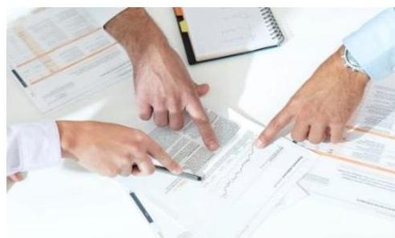

A köztestületek közfeladatot látnak el, amelyre fokozott közérdeklődés irányul.

Társadalmi elvárás a közpénzek értékelvű, rendeltetésszerű felhasználása, a közpénzekből nyújtott támogatások átláthatóságának megteremtése, amelyhez az Állami Számvevőszék az államháztartásból nyújtott támogatások ellenőrzésével kíván hozzájárulni.

Az ellenőrzés eredményeképp a törvényalkotás számára tapasztalatok állnak rendelkezésre a köztestületek szabályozásához. Az ellenőrzöttek számára visszajelzést adhat az ellenőrzés a közfeladataik ellátására államháztartásból kapott támogatások felhasználásának nyilvántartásával, beszámolásával kapcsolatos esetleges hiányosságról, míg a társadalom számára információt szolgáltat a köztestület gazdálkodásáról, a közpénzek felhasználásának elszámoltathatóságáról. Az ÁSZ ${ }^{4}$ szervezetén belül lehetőség nyílik arra, hogy az intézmény erősítse hozzáadott értéket teremtő tevékenységét és tanácsadó szerepét.

---

# A JELENTÉS LÉNYEGES KÉRDÉSKÖREI 

1. Szabályszerüen történt-e a köztestület belső szabályozási rendszerének kialakítása?
2. Szabályszerüen gondoskodott-e a köztestület a tagdij-követelések nyilvántartásáról, valamint beszedéséről?
3. A költségvetési támogatások felhasználásának nyilvántartása, elszámolása szabályszerü volt-e?

---

# AZ ELLENŐRZÉS HATÓKÖRE ÉS MÓDSZEREI 

## Az ellenőrzés típusa

Megfelelőségi ellenőrzés.

## Az ellenőrzött időszak

2015-2018. évek

## Az ellenőrzés tárgya

Az ellenőrzés tárgya kiterjedt a köztestületnél a belső szabályozási rendszer kialakítására, tagdíjbeszedésre, közzétételi, adatszolgáltatási tevékenységére, a felhasznált költségvetési támogatások nyilvántartásának, beszámolásának (elszámolásának) szabályszerűségére.

## Az ellenőrzött szervezet

Magyar Mérnöki Kamara országos szervezete és 19 megyei területi kamara

## Az ellenőrzés jogalapja

Az ÁSZ tv. ${ }^{5}$ 1. § (3) bekezdése, 5. § (3) bekezdésében foglaltak.

## Az ellenőrzés módszerei

Az ellenőrzést az ellenőrzési program szempontjai, az ellenőrzött időszakban hatályos jogszabályok, az ellenőrzés szakmai szabályai, a jelen ellenőrzésre irányadó ÁSZ módszertanok figyelembevételével végeztük.

Az ellenőrzési kérdések megválaszolásához szükséges bizonyítékok megszerzése az ellenőrzött által rendelkezésre bocsátott dokumentumokra, adatokra alapozva megfigyelés, szemle (szemrevételezés), kérdésfeltevés (információkérés), mintavételezés, valamint elemző eljárás útján történt.

A mérlegben kimutatott lejárt határidejű tagdíj-követelésekkel kapcsolatos tevékenységet véletlen mintavétel alapján ellenőrizte az ÁSZ. „Szabályszerű" értékelést kapott egy mintavétellel ellenőrzött területet, amennyiben 95\%-os megbízhatósággal az ellenőrzött sokaságban az átlagos hibaarány legfeljebb 10\%, "nem szabályszerűt", amennyiben 10\%-nál magasabb arányt képviselt."

---

Az ellenőrzési bizonyítékként felhasználható adatforrások közé tartoztak egyrészt az ellenőrzési program részletes szempontjainál felsorolt adatforrások, másrészt minden egyéb - az ellenőrzés folyamán feltárt, az ellenőrzés szempontjából információt tartalmazó - dokumentum.

Az ellenőrzés lefolytatásához az ellenőrzött a tanúsítványok kitöltésével, hitelesítésével és azok, valamint az ÁSZ által kért dokumentumok megküldésével szolgáltatott adatokat.

Az ellenőrzés ideje alatt az ellenőrzött szervezettel történő kapcsolattartást az ÁSZ SZMSZ ${ }^{\circledR}$-ének vonatkozó előírásai alapján biztosítottuk.

---

# 1. Szabályszerűen történt-e a köztestület belső szabályozási rendszerének kialakítása? 

## Összegző megállapítás

A MMK országos szervezete belső szabályozási rendszerének kialakítása szabályszerű volt.

A jogszabályi előírásoknak megfelelően történt az MMK országos szervezete szervezeti kereteinek kialakítása. A Kamtv. 14. § (1) bekezdés a) pontjában előírtaknak megfelelően a Küldöttgyűlés megalkotta és az ellenőrzött időszakban három alkalommal módosította az Alapszabály ${ }_{1-4}{ }^{7}$-t. A Kamtv. 14. § (3) bekezdésének megfelelően a küldöttgyűlést évente legalább egyszer összehívták 2015-2018. években. Az országos ügyintéző és ellenőrző szerveket a Kamtv. 12. § (2) bekezdésében és az Alapszabály ${ }_{1-4}$ ban foglaltaknak megfelelően alakították ki az ellenőrzött időszakban. A legfőbb döntéshozó szerv, valamint az országos ügyintéző szervek müködésének rendjét az ellenőrzött időszakra vonatkozóan a Kamtv.-ben foglaltaknak megfelelően az Alapszabályban meghatározták. Az MMK a Számv. tv. 14. § (3) bekezdésével összhangban kialakította Számviteli politikáját ${ }^{8}$, melynek keretében elkészítették a Leltározási szabályzatot ${ }^{9}$, az Értékelési szabályzatot ${ }^{10}$ és a Pénzkezelési szabályzatot ${ }^{11}$.

A Magyar Mérnöki Kamara országos szervezete a 224/2000. (XII.19.) Korm. rendelet ${ }^{12}$ 6. § (1) bekezdése, illetve a 479/2016. (XII. 28.) Korm. rendelet ${ }^{13}$ 7. § (1) bekezdésében foglaltak ellenére a Számv. tv. ${ }^{14}$ 20. § (6) bekezdése szerinti beszámolási kötelezettségének 2015-2018. évekre vonatkozóan az ellenőrzött szervezet képviseletére jogosult aláírásának hiányában nem tett eleget*.

## 2. Szabályszerűen gondoskodott-e a köztestület a tagdíj-követelések nyilvántartásáról, valamint beszedéséről?

## Összegző megállapítás

A MMK területi kamaráinál a tagdíj-követelések nyilvántartása és beszedése nem volt szabályszerű.

A területi kamarák közül nyolc kamara a Számv. tv. 14.§ (3) bekezdésében foglaltak ellenére nem rendelkezett a törvényben rögzített alapelvek, értékelési előírások alapján adottságainak, körülményeinek leginkább megfelelő a törvény végrehajtásának módszereit, eszközeit meghatározó számviteli politikával. A Számv. tv. 161. § (1) bekezdésében meghatározott

[^0]
[^0]:    *Az ÁSZ az EL-0920-122/2019. iktatószámú, 2019. május 20-án kelt, valamint az EL-0920-362/2019. iktatószámú, 2019. október 9-én kelt adatbekérő levelekben a Magyar Mérnöki Kamara országos szervezetét az aláírt és hiteles éves beszámolók megküldésére hívta fel.

---

számlarenddel az ellenőrzött időszakban tizenegy területi kamara nem rendelkezett.

A területi kamarák közül tizenkettő területi kamara a Számv. tv. 159. §a ellenére a tagdíjkövetelések analitikus nyilvántartását nem vezette, nem biztosította a Számv. tv. 165. § (4) bekezdésében foglaltak szerint az analitikus nyilvántartások és a főkönyvi könyvelés adatai közötti egyeztetés lehetőségét logikailag zárt rendszerrel.

A területi kamarák a Kam.tv. 29.§ (3) bekezdésében foglaltak ellenére az egyévi tagdíjat meghaladó hátralék felhalmozódása esetén a tagot hátralék megfizetésére nem hívták fel, így nem igazolt a Kam. tv. 29. § (3) bekezdésben foglaltak ellenére hogy megszüntették-e a kamarai tag tagsági viszonyát.

# 3. A költségvetési támogatások felhasználásának nyilvántartása, elszámolása szabályszerű volt-e? 

## Összegző megállapítás

A MMK területi kamaráinál a költségvetési támogatások felhasználásának nyilvántartása nem volt szabályszerű, a felhasználásával történő elszámolás szabályszerű volt.

Az MMK területi kamarái közül kilenc területi kamara a 2015., 2016. években a 224/2000. (XII. 19.) Korm. rendelet 17. § (8) bekezdésében a 2017., 2018. években a 479/2016. (XII. 28.) Korm. rendelet 14. § (1) bekezdésében, valamint a támogatási szerződésekben foglaltak ellenére nyilvántartási rendszerét oly módon nem alakította ki, nem részletezte, hogy abból a közpénz felhasználásával kapcsolatos információk rendelkezésre álljanak.

A szakmai és pénzügyi beszámolókat a Magyar Mérnöki Kamara országos szervezete és területi kamarái az Áht ${ }^{15}$. 53. §-ban, az Ávr. ${ }^{16}$ 92.§ (1) bekezdésében, valamint a támogatási szerződésben foglaltakkal összhangban a támogatások felhasználásáról elkészítették, a hiánypótlás teljesítést követően megfeleltek a szerződésekben és a jogszabályokban foglaltaknak, a támogatást nyújtó Miniszterelnökség elfogadta a 2015-2018. évi beszámolókat.

Az egyes szervezeteknél a feltárt szabálytalanságokat a II. sz. számú melléklet tartalmazza.

---

# JAVASLATOK 

Az ÁSZ tv. 33. § (1) bekezdésében foglaltak értelmében az ellenőrzött szervezet vezetője köteles a jelentésben foglalt megállapításokhoz kapcsolódó intézkedési tervet összeállítani és azt a jelentés kézhezvételétől számított 30 napon belül az ÁSZ részére megküldeni. Amennyiben az ellenőrzött szervezet vezetője nem küldi meg határidőben az intézkedési tervet, vagy továbbra sem elfogadható intézkedési tervet küld, az Állami Számvevőszék elnöke az ÁSZ tv. 33. § (3) bekezdése a) és b) pontjaiban foglaltakat érvényesítheti.

## a Magyar Mérnöki Kamara országos szervezete elnökének

1. Intézkedjen a Számv. tv. előírásainak megfelelő beszámoló elkészítéséről.
(1. sz. megállapítás 2. bekezdése alapján)

## a Baranya Megyei Mérnöki Kamara elnökének

1. Intézkedjen a tagdijkövetelések analitikus nyilvántartásának vezetéséről, valamint a fökönyvi könyvelés és a tagdijkövetelések analitikus nyilvántartása adatai közötti egyeztetés és ellenőrzés lehetőségének logikailag zárt rendszerrel történő biztosításáról.
(2. sz. megállapítás 2. bekezdése és a II. sz. melléklet 3. sora alapján)

## a Bács-Kiskun Megyei Mérnöki Kamara elnökének

1. Intézkedjen a számviteli törvény előírásainak megfelelő számviteli politika elkészítéséről.
(2. sz. megállapítás 1. bekezdés első mondata és a II. sz. melléklet 1. sora alapján)
2. Intézkedjen a tagdijkövetelések analitikus nyilvántartásának vezetéséről, valamint a fökönyvi könyvelés és a tagdijkövetelések analitikus nyilvántartása adatai közötti egyeztetés és ellenőrzés lehetőségének logikailag zárt rendszerrel történő biztosításáról.
(2. sz. megállapítás 2. bekezdése és a II. sz. melléklet 3. sora alapján)

---

# a Békés Megyei Mérnöki Kamara elnökének 

1. Intézkedjen a költségvetési támogatások felhasználásának jogszabály szerinti nyilvántartása érdekében.
(3. sz. megállapítás 1. bekezdése és a II. sz. melléklet 4. sora alapján)

## a Borsod-Abaúj Zemplén Megyei Mérnöki Kamara elnökének

1. Intézkedjen a Számv. tv. előírásainak megfelelően a számviteli politika és a számlarend elkészítéséről.
(2. sz. megállapítás 1. bekezdése és a II. sz. melléklet 1. és 2. sora alapján)
2. Intézkedjen a tagdijkövetelések analitikus nyilvántartásának vezetéséről, valamint a fökönyvi könyvelés és a tagdijkövetelések analitikus nyilvántartása adatai közötti egyeztetés és ellenőrzés lehetőségének logikailag zárt rendszerrel történő biztosításáról.
(2. sz. megállapítás 2. bekezdése és a II. sz. melléklet 3. sora alapján)
3. Intézkedjen a költségvetési támogatások felhasználásának jogszabály szerinti nyilvántartása érdekében.
(3. sz. megállapítás 1. bekezdése és a II. sz. melléklet 4. sora alapján)

## a Csongrád Megyei Mérnöki Kamara elnökének

1. Intézkedjen a tagdijkövetelések analitikus nyilvántartásának vezetéséről, valamint a fökönyvi könyvelés és a tagdijkövetelések analitikus nyilvántartása adatai közötti egyeztetés és ellenőrzés lehetőségének logikailag zárt rendszerrel történő biztosításáról.
(2. sz. megállapítás 2. bekezdése és a II. sz. melléklet 3. sora alapján)

---

# a Fejér Megyei Mérnöki Kamara elnökének 

1. Intézkedjen a Számv. tv. előírásainak megfelelően a számviteli politika és a számlarend elkészitéséről.
(2. sz. megállapítás 1. bekezdése és a II. sz. melléklet 1. és 2. sora alapján)
2. Intézkedjen a tagdijkövetelések analitikus nyilvántartásának vezetéséről, valamint a fökönyvi könyvelés és a tagdijkövetelések analitikus nyilvántartása adatai közötti egyeztetés és ellenőrzés lehetőségének logikailag zárt rendszerrel történő biztosításáról.
(2. sz. megállapítás 2. bekezdése és a II. sz. melléklet 3. sora alapján)
3. Intézkedjen a költségvetési támogatások felhasználásának jogszabály szerinti nyilvántartása érdekében.
(3. sz. megállapítás 1. bekezdése és a II. sz. melléklet 4. sora alapján)

## a Győr-Moson-Sopron Megyei Mérnöki Kamara elnökének

1. Intézkedjen a költségvetési támogatások felhasználásának jogszabály szerinti nyilvántartása érdekében.
(3. sz. megállapítás 1. bekezdése és a II. sz. melléklet 4. sora alapján)
2. Intézkedjen a tagdijkövetelések analitikus nyilvántartásának vezetéséről, valamint a fökönyvi könyvelés és a tagdijkövetelések analitikus nyilvántartása adatai közötti egyeztetés és ellenőrzés lehetőségének logikailag zárt rendszerrel történő biztosításáról.
(2. sz. megállapítás 2. bekezdése és a II. sz. melléklet 3. sora alapján)

---

# a Hajdú-Bihar Megyei Mérnöki Kamara elnökének 

1. Intézkedjen a tagdijkövetelések analitikus nyilvántartásának vezetéséről, valamint a fökönyvi könyvelés és a tagdijkövetelések analitikus nyilvántartása adatai közötti egyeztetés és ellenőrzés lehetőségének logikailag zárt rendszerrel történő biztosításáról.
(2. sz. megállapítás 2. bekezdése és a II. sz. melléklet 3. sora alapján)

## a Heves Megyei Mérnöki Kamara elnökének

1. Intézkedjen a költségvetési támogatások felhasználásának jogszabály szerinti nyilvántartása érdekében.
(3. sz. megállapítás 1. bekezdése és a II. sz. melléklet 4. sora alapján)

## a Jász-Nagykun-Szolnok Megyei Mérnöki Kamara elnökének

1. Intézkedjen a tagdijkövetelések analitikus nyilvántartásának vezetéséről, valamint a fökönyvi könyvelés és a tagdijkövetelések analitikus nyilvántartása adatai közötti egyeztetés és ellenőrzés lehetőségének logikailag zárt rendszerrel történő biztosításáról.
(2. sz. megállapítás 2. bekezdése és a II. sz. melléklet 3. sora alapján)
2. Intézkedjen a költségvetési támogatások felhasználásának jogszabály szerinti nyilvántartása érdekében.
(3. sz. megállapítás 1. bekezdése és a II. sz. melléklet 4. sora alapján)

## a Nógrád Megyei Mérnöki Kamara elnökének

1. Intézkedjen a költségvetési támogatások felhasználásának jogszabály szerinti nyilvántartása érdekében.
(3. sz. megállapítás 1. bekezdése és a II. sz. melléklet 4. sora alapján)

---

# a Somogy Megyei Mérnöki Kamara elnökének 

1. Intézkedjen a Számv. tv. előírásainak megfelelően a számviteli politika és a számlarend elkészitéséről.
(2. sz. megállapítás 1. bekezdése és a II. sz. melléklet 1. és 2. sora alapján)
2. Intézkedjen a tagdijkövetelések analitikus nyilvántartásának vezetéséről, valamint a fökönyvi könyvelés és a tagdijkövetelések analitikus nyilvántartása adatai közötti egyeztetés és ellenőrzés lehetőségének logikailag zárt rendszerrel történő biztosításáról.
(2. sz. megállapítás 2. bekezdése és a II. sz. melléklet 3. sora alapján)
3. Intézkedjen a költségvetési támogatások felhasználásának jogszabály szerinti nyilvántartása érdekében.
(3. sz. megállapítás 1. bekezdése és a II. sz. melléklet 4. sora alapján)

## a Szabolcs-Szatmár-Bereg Megyei Mérnöki Kamara elnökének

1. Intézkedjen a Számv. tv. előírásainak megfelelően a számlarend elkészitéséről.
(2. sz. megállapítás 1. bekezdés második mondata és a II. sz. melléklet 2. sora alapján)

## a Tolna Megyei Mérnöki Kamara elnökének

1. Intézkedjen a Számv. tv. előírásainak megfelelően a számlarend elkészitéséről.
(2. sz. megállapítás 1. bekezdés második mondata és a II. sz. melléklet 2. sora alapján)

---

2. Intézkedjen a tagdijkövetelések analitikus nyilvántartásának vezetéséről, valamint a fökönyvi könyvelés és a tagdijkövetelések analitikus nyilvántartása adatai közötti egyeztetés és ellenőrzés lehetőségének logikailag zárt rendszerrel történő biztosításáról.
(2. sz. megállapítás 2. bekezdése és a II. sz. melléklet 3. sora alapján)
3. Intézkedjen a költségvetési támogatások felhasználásának jogszabály szerinti nyilvántartása érdekében.
(3. sz. megállapítás 1. bekezdése és a II. sz. melléklet 4. sora alapján)

# a Veszprém Megyei Mérnöki Kamara elnökének 

1. Intézkedjen a Számv. tv. előírásainak megfelelően a számlarend elkészítéséről.
(2. sz. megállapítás 1. bekezdés második mondata és a II. sz. melléklet 2. sora alapján)
2. Intézkedjen a tagdijkövetelések analitikus nyilvántartásának vezetéséről, valamint a fökönyvi könyvelés és a tagdijkövetelések analitikus nyilvántartása adatai közötti egyeztetés és ellenőrzés lehetőségének logikailag zárt rendszerrel történő biztosításáról.
(2. sz. megállapítás 2. bekezdése és a II. sz. melléklet 3. sora alapján)

## a Zala Megyei Mérnöki Kamara elnökének

1. Intézkedjen a Számv. tv. előírásainak megfelelően a számlarend elkészítéséről.
(2. sz. megállapítás 1. bekezdés második mondata és a II. sz. melléklet 2. sora alapján)

---

2. Intézkedjen a tagdíjkövetelések analitikus nyilvántartásának vezetéséről, valamint a fökönyvi könyvelés és a tagdíjkövetelések analitikus nyilvántartása adatai közötti egyeztetés és ellenőrzés lehetőségének logikailag zárt rendszerrel történő biztosításáról.
(2. sz. megállapítás 2. bekezdése és a II. sz. melléklet 3. sora alapján)

---

# MELLÉKLETEK 

- I. SZ. MELLÉKLET: ÉRTELMEZŐ SZÓTÁR
államháztartás
költségvetési támogatás
közfeladat
köztestület
köztestület országos szervezete
köztestületet létrehozó törvény
ügyintéző szervek
ügyviteli szervezetek
az államháztartás a közfeladatok ellátásának egységes szervezeti, tervezési, gazdálkodási, ellenőrzési, finanszírozási, adatszolgáltatási és beszámolási szabályok szerint működő rendszere, amely központi és önkormányzati alrendszerből áll. (Forrás: Áht. 2. §, 3. § (1) bekezdés 2015. január 1-től)
az államháztartás alrendszerei terhére nyújtott pénzbeli vagy nem pénzbeli juttatás, amelyet a támogató nem elsősorban ellenszolgáltatás ellenében, de konkrét program megvalósítása vagy meghatározott időszakban a támogatott szervezet müködtetése érdekében nyújt. Költségvetési támogatás különösen: a pályázat útján, valamint egyedi döntéssel kapott költségvetési támogatás; az Európai Unió strukturális alapjaiból, illetve a Kohéziós Alapból származó, a költségvetésből juttatott támogatás; az Európai Unió költségvetéséből vagy más államtól, nemzetközi szervezettől származó támogatás és a személyi jövedelemadó meghatározott részének az adózó rendelkezése szerint felajánlott összege. (Forrás: Ectv. 2. § 15. pont)
Közfeladat a jogszabályban meghatározott állami vagy önkormányzati feladat. A közfeladatok ellátása költségvetési szervek alapításával és müködtetésével vagy az azok ellátásához szükséges pénzügyi fedezet e törvényben meghatározott eszközökkel, részben vagy egészben történő biztosításával valósul meg. A közfeladatok ellátásában államháztartáson kívüli szervezet jogszabályban meghatározott rendben közremüködhet.(Forrás: Áht.3/A. § (I)-(2) bekezdés, hatályos 2015. január 1től)
A köztestület önkormányzattal és nyilvántartott tagsággal rendelkező szervezet, amelynek létrehozását törvény rendeli el. A köztestület a tagságához, illetőleg a tagsága által végzett tevékenységhez kapcsolódó közfeladatot lát el. A köztestület jogi személy. Törvény előírhatja, hogy valamely közfeladatot kizárólag köztestület láthat el, illetve, hogy meghatározott tevékenység csak köztestület tagjaként folytatható. (Forrás: 2006. évi LXV. törvény 8/A. § (1), (4) bekezdés)
Az Országos Küldöttközgyűlés, valamint az Országos ügyintéző szervek (elnökség, etikai bizottság, felügyelőbizottság, etikai kollégium, a köztestület alapszabályában meghatározott más állandó bizottságok). Központi ügyintéző és ügyvitelei feladatokat ellátó hivatal.
Az ellenőrzés alá vont köztestületeket alapító törvények, létrehozásra vonatkozó jogszabályhely hivatkozással: a tervező- és szakértő mérnökök, valamint építészek szakmai kamaráiról szóló 1996. évi LVIII. törvény 2. § (I)-(2) bekezdés.
Az ügyintéző szervezet a köztestület operatív munkaszervezete, amely a jogszabályok, az alapszabály, az önkormányzati szabályzatok és a testületi szervek által hozott döntések keretei között fejti ki tevékenységét.
Az ügyviteli szervezet az érintett területigazgatási, ügyviteli, valamint gazdálkodási teendőit látja el, egyben biztosítja mindazokat a feltételeket, amelyek az ügyintéző szerveinek, illetve tisztségviselőinek feladatellátását lehetővé teszik.

---

### *Mellékletek*

### ▪ II. SZ. MELLÉKLET: A MAGYAR MÉRNŐKI KAMARA ORSZÁGOS ÉS TERÜLETI SZERVEZETEI ESETÉBEN FELTÁRT SZABÁLYTALANSÁGOK

|  Sr.
szám | Megnevezés | Zász-Kiskeni MMK57 | Boranya MMK58 | Békés MMK59 | Borsod-Álomigazmálás MMK60 | Budapesti és Pest MMK61 | Csongrád MMK62 | Tejer MMK63 | Győr-Moson-Sopron MMK64 | Hajdú-Bihöz MMK65 | Heves MMK66 | Magyar-Metrikki Kamara | Jész-Negakció-Szolnok MMK67 | Komárom-Esztergom MMK68 | Nógrád MMK69 | Somogy MMK70 | Szabolcs-Számvár-Beref MMK71 | Tolna MMK72 | Vas MMK73 | Veszprém MMK74 | Zala MMK75  |
| --- | --- | --- | --- | --- | --- | --- | --- | --- | --- | --- | --- | --- | --- | --- | --- | --- | --- | --- | --- | --- | --- |
|  1. | A Számv. tv. 14.§ (3) bekezdésében előírt Számviteli politikával nem rendelkezett. | X |  |  | X |  | X (2015-2017) | X | X (2015-2016) |  |  |  |  |  |  | X |  | X (2015-2017) | X (2015-2016) |  |   |
|  2. | Az ellenőrzőtt időszakban a Számv. tv. 161. § (1) bekezdésben meghatározott Számlarenddel nem rendelkezett. |  |  |  | X |  | X (2015-2017) | X | X (2015-2016) | X (2015-2016.02.04.) |  |  | X (2015-2017) |  |  | X | X | X |  | X | X  |
|  3. | A Számv. tv. 159. §-a ellenére a tagdíjkövetelések analitikus nyilvántartását nem vezette, nem biztosította a Számv. tv. 165. § (4) bekezdésében foglaltak szerint az analitikus nyilvántartások és a főkönyvi könyvelés adatai közötti egyeztetés lehetőségét logikailag zárt rendszerrel. | X | X |  | X |  | X | X | X |  |  |  |  |  |  |  |  |  |  |  |   |
|  4. | A 2015., 2016. években a 224/2000. (XII. 19.) Korm. rendelet 17. § (8) bekezdésében a 2017., 2018. években a 479/2016. (XII. 28.) Korm. rendelet 14. § (1) bekezdésében, valamint a támogatási szerződésekben foglaltak ellenére nyilvántartási rendszerüket oly módon nem alakították ki, nem részletezték, hogy abból a közpénz felhasználásával kapcsolatos információk rendelkezésre álljanak. |  |  | X |  | X nem történt adatszolgáltatás |  |  | X | X |  |  |  |  |  |  |  |  |  |  |   |

---

# FÜGGELÉK: ÉSZREVÉTELEK 

A jelentéstervezetet a Számvevőszék 15 napos észrevételezésre megküldte az ellenőrzött szervezetek vezetőinek az ÁSZ tv. 29. § ${ }^{\text {T }}$ (1) bekezdése előírásának megfelelően.

A Budapesti és Pest Megyei Mérnöki Kamara, a Heves Megyei Mérnöki Kamara, a Jász-Nagykun-Szolnok Megyei Mérnöki Kamara, a Komárom-Esztergom Megyei Mérnöki Kamara és a Vas Megyei Mérnöki Kamara nem tett észrevételt.
A Magyar Mérnöki Kamara, a Baranya Megyei Mérnöki Kamara, a Bács-Kiskun Megyei Mérnöki Kamara, a Békés Megyei Mérnöki Kamara, a Borsod-Abaúj-Zemplén Megyei Mérnöki Kamara, a Csongrád Megyei Mérnöki Kamara, a Fejér Megyei Mérnöki Kamara, a Győr-Moson-Sopron Megyei Mérnöki Kamara, a Hajdú-Bihar Megyei Mérnöki Kamara, a Nógrád Megyei Mérnöki Kamara, a Somogy Megyei Mérnöki Kamara, a Szabolcs-SzatmárBereg Megyei Mérnöki Kamara, a Tolna Megyei Mérnöki Kamara, a Veszprém Megyei Mérnöki Kamara és a Zala Megyei Mérnöki Kamara észrevételét és az arra adott választ a függelék tartalmazza.

[^0]
[^0]:    ${ }^{\text {® }}$ 29. § (1) Az Állami Számvevőszék az ellenőrzési megállapításait megküldi az ellenőrzött szervezet vezetőjének vagy az általa megbízott személynek, és annak, akinek személyes felelősségét állapította meg.
    (2) Az ellenőrzött szervezet vezetője és a felelősként megjelölt személy az ellenőrzés megállapításaira tizenöt napon belül írásban észrevételt tehet.
    (3) Az Állami Számvevőszék az észrevételre a beérkezésétől számított harminc napon belül írásban válaszol. A figyelembe nem vett észrevételeket köteles a jelentésben feltüntetni, és megindokolni, hogy azokat miért nem fogadta el.

---

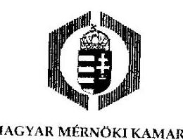

MMK ikt.szám: 99-1/2020.
Kelt: Budapest, 2020.07.02.

# Domokos László 

elnök

## Állami Számvevőszék

Budapest
Tisztelt Elnök Úr!
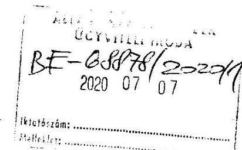

Köszönettel megkaptam a 2020. június 16-án kelt, EL-0920-698/2020. iktatószámú, kamaránkhoz 2020. június 22-én beérkezett levelét, amelyben megküldi részemre a „Közestületek ellenörzése - Magyar Mérnöki Kamara" címmel készített számvevőszéki jelentéstervezetet.

Kérem, engedje meg, hogy Elnök úrhoz hasonlóan magam is megköszönjem az Állami Számvevőszék munkatársainak a segítségét, amelyet az ellenőrzés lefolytatása során kaptunk.

A levelében foglalt figyelemfelhívás szerint, az ÁSZ tv. 29. § (2) bekezdése alapján a jelentéstervezethez a mellékletben foglalt észrevételeket tesszük.

Kérjük észrevételeink szíves mérlegelését és lehetőség szerint átvezetését a jelentés szövegének véglegesítése során.

Végül jelzem Elnök úr részére, hogy a jelentés végleges szövegében megfogalmazandó javaslatok tekintetében természetesen el fogjuk készíteni az ÁSZ tv. szerinti intézkedési tervünket, valamint ebben, szükség esetén, a területi mérnöki kamarák számára is segítséget fogok nyújtani.

Tisztelettel:
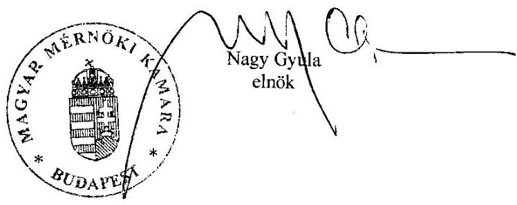

[^0]
[^0]:    HUNGARIAN CHAMBER OF ENGINEERS * UNGARISCHE INGENIEURKAMMER * CHAMBRE HONGROISE DES INGÉNIEURS H-1117 Budapest, Szerénu út 4.
    telefon: +36 1 455-7080 * e-mail: info@mmk.hu * web: www.mmk.hu

---

# Melléklet:   Észrevételek az EL-0920-698/2020. iktatószámmal megküldött jelentéstervezethez 

## 1. Az országos kamara vonatkozásában tett észrevételek:

A jelentéstervezet megállapítása szerint arra tekintettel, hogy a Magyar Mérnöki Kamara 20152018. évekre vonatkozó számviteli beszámolóinak olyan változata került beküldésre az Állami Számvevőszék részére, amelyen nem szerepel a képviseletre jogosult személy aláírása, az országos kamara nem teljesítette a számviteli törvény szerinti beszámolási kötelezettségét.

Az országos kamara az aláirt és ilyen formában a számviteli törvény 20. § (6) bekezdésének megfelelő beszámoló helyett az Országos Bírósági Hivatal részére a civil szervezetek nyilvántartásában való közzététel céljából megküldött beszámolót továbbította az ÁSZ részére. Ez megállapítható abból is, hogy ezeken a dokumentumokon az OBH elektronikus érkeztető pecsétje és vonalkódja is szerepel. E dokumentumok, mivel az elóírt nyomtatványkitöltó program használatával kerültek beküldésre, nem is tudják tartalmazni a képviseletre jogosult személy saját kezű aláírását.

Tájékoztatom Elnök urat, hogy a Magyar Mérnöki Kamara természetesen minden évben elkészítette a számviteli beszámolóknak a számviteli törvény 20. § (6) bekezdése szerinti, aláírással hitelesített változatát is. Ezek a kamara írattárában rendelkezésre állnak, illetve természetesen jelen levemhez csatoltan is megküldöm. Sajnálattal vettem tudomásul, hogy míg sok más kérdésben az ÁSZ munkatársaival tudtunk egyeztetni, ezt a - nyilvánvalóan technikai - igényt nem jelezték korábban részünkre.

Bizunk abban, hogy a fentiekre tekintettel a jelentéstervezet 5. oldalán (Összegzés c. fejezet) és 11. oldalán (Megállapítások c. fejezet) az erre vonatkozó szövegrészeket az ÁSZ megfelelően módosítja. Jelzem Elnök úr számára, hogy az ugyanebben a kérdésben a Javaslatok c. fejezetben szereplő intézkedési tervet nem áll módunkban készíteni, tekintettel arra, hogy a - fent jelzettek és a csatolt dokumentumok tanúsága szerint - a számviteli törvény 20. § (6) bekezdése szerinti formának megfelelő számviteli beszámolóink már rendelkezésre állnak.

## 2. A területi mérnöki kamarák vonatkozásában tett észrevételek:

## Általános észrevételek:

A jelentéstervezet a területi mérnöki kamarák ellenőrzése vonatkozásában három témakör köré csoportosítva fogalmaz meg megállapításokat. A tervezetből is látható, hogy mindhárom esetben a területi kamaráknak mindössze egy része nem teljesített a vonatkozó kötelezettségeit. Erre tekintettel kérjük Elnök urat, hogy a tervezet véglegesítése során az 5. oldalon szereplő, Összegzés c. fejezetben is kerüljön be erre való utalás, hasonlóan a tervezet 11-13. oldalain szereplő Megállapítások fejezethez, ahol egyértelműen szerepel, hogy az egyes feltárt problémák nem minden területi kamara estében merültek fel.

[^0]
[^0]:    HUNGARIAN CHAMBER OF ENGINEERS * UNGARISCHE INGÉNIEURKAMMER * CHAMBRE HONGROISE DES INGÉNIEURS H-117 Budapest, Szerénú út 4.
    telefon: +36 1 455-7080 * e-mail: info@mmk.hu * web: www.mmk.hu

---

# Az egves megállapítások vonatkozásában tett észrevételek: 

## 1. Számviteli politika és számviteli szabályzatok (számlarend)

Több területi kamara jelezte részünkre, hogy a jelentéstervezetben szereplő dokumentumokat vagy azok egy részét az ellenőrzés során beküldte az ÁSZ részére, ugyanakkor előfordult, hogy a tervezetben hiányolt konkrét dokumentum (pl. számlarend) más szabályzat részeként került benyújtásra. Az ilyen jellegű észrevételeket a területi kamarák elnökei az ÁSZ tv. 29. § (2) bekezdése alapján közvetlenül megküldik Elnök úr részére. Kérem, hogy ezeket az észrevételeket a jelentéstervezet véglegesítése során lehetőség szerint vegyék figyelembe.

## 2. Tagdijkövetelések nyilvántartása

A Magyar Mérnöki Kamara a tervező- és szakértő mérnökök, valamint építészek szakmai kamaráiról szóló 1996. évi LVIII. törvény (Kamtv.) 11. §-ában, valamint az MMK Kamtv. szerint elfogadott Alapszabályában foglaltak szerint a területi kamarák adatszolgáltatása alapján országos összesítésben vezeti a kamarai tagok (és az engedélyhez, bejelentéshez mérnöki tevékenység folytatására jogosultsággal rendelkezők) névjegyzékét.

A területi kamarák és az országos kamara közös döntése alapján az MMK fenti feladatának egy valamennyi kamara által közösen használt központi nyilvántartási rendszer fejlesztésével és üzemeltetésével tesz eleget. A nyilvántartási rendszer alkalmas arra, hogy abban valamennyi területi kamara naprakészen vezesse a tagdijak befizetését, továbbá rendelkezik olyan integrált számlázó moduílal, amelynek segítségével a tagdij befizetéséhez szükséges számviteli bizonylatok is előállíthatók. A területi kamarák titkárságai az ebben a rendszerben rögzített adatok alapján folyamatosan nyomon követhetik a tagdijkövetelések alakulását és a tagdijat nem fizető kamarai tagok listáját. Ez alapján a területi elnökségeknél kezdeményezik a Kamtv. 29.§ (3) bekezdése szerinti eljárás megindítását.

Véleményünk szerint ez a közös nyilvántartás alkalmas arra, hogy a jelentéstervezetben megfogalmazott módon biztosítsa a tagdijkövetelések analitikus nyilvántartását. A területi kamarák elnökei az ÁSZ tv. 29. § (2) bekezdése alapján közvetlenül megküldik Elnök úr részére az e ponttal kapcsolatos észrevételeiket, illetve szükség esetén bemutatják, hogy a nyilvántartás alapján hogyan gondoskodnak a tagdijfizetést elmulasztó tagok felhívásáról és szükséges esetén a Kamtv. 29. § (3) bekezdése szerinti kizárásáról.

Kérem Elnök urat, hogy a fentiek, illetve a területi kamarák elnökeinek külön megküldésre kerülő észrevételei szerint a tervezetnek ezt a részét, különös tekintettel a Megállapítások fejezet 2. pontjának utolsó bekezdését szíveskedjenek felülvizsgálni.

---

# 3. Költségvetési támogatások felhasználása 

A költségvetési támogatás elkülönített nyilvántartásával megfogalmazott megállapítások tekintetében észrevételt nem teszünk. Természetesen az érintett területi kamarák elnökei az ÁSZ tv. 29. § (2) bekezdése alapján e pont vonatkozásában is közvetlenül megküldik észrevételeiket, amennyiben ilyen felmerül.

---

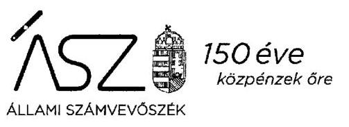

Ikt. szám: EL-0920-738/2020.

Nagy Gyula úr
elnök

Magyar Mérnöki Kamara

# Budapest 

Tisztelt Elnök Úr!

Az „Köztestületek ellenőrzése - Magyar Mérnöki Kamara" címmel készített számvevőszéki jelentéstervezetre tett 99-1/2020. iktatószámú észrevételét köszönettel megkaptam.

Az Állami Számvevőszék észrevételre vonatkozó álláspontjáról a felügyeleti vezető által készített részletes tájékoztatást mellékelten megküldöm.

Tájékoztatom Elnök urat, hogy a számvevőszéki jelentésben - az Állami Számvevőszékről szóló 2011. évi LXVI. törvény 29. § (3) bekezdése alapján - a figyelembe nem vett észrevételt szerepeltetjük, annak indoklásával, hogy azt az Állami Számvevőszék miért nem fogadta el.

Budapest, 2020. ơ hó 30 nap

Melléklet: Tájékoztatás az észrevétel kezeléséről
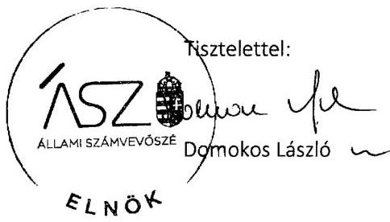

---

# Tájékoztatás   az észrevétel kezeléséröl 

Az „Köztestületek ellenőrzése - Magyar Mérnöki Kamara" című jelentéstervezetre 2020. július 7-én érkezett észrevételt áttekintettük, annak kezelésével kapcsolatban a következő tájékoztatást adom.

Elnök úr az észrevétel 1. pontjában az Állami Számvevőszék (továbbiakban ÁSZ) Magyar Mérnöki Kamara (továbbiakban Kamara) 2015-2018. évek számviteli beszámolóival kapcsolatban tett megállapítására tájékoztatott arról, hogy a Kamara minden évben elkészítette a számviteli beszámoló aláírással hitelesített változatát.

Tájékoztatom Elnök urat, hogy az ÁSZ ellenőrzési megállapításai minden esetben az Állami Számvevőszékről szóló 2011. évi LXVI. törvénynek (továbbiakban ÁSZ tv.) megfelelően az ellenőrzés során bekért és az arra nyitva álló határidőn belül rendelkezésre bocsátott dokumentumokon alapulnak.

Az ellenőrzés lefolytatásához az ÁSZ a 2015-2017. évekre az EL-0920-122/2019., a 2018. évre az EL-0920-362/2019. iktatószámú adatbekérő levél 2. számú melléklete szerint kérte az éves beszámoló aláírt és hiteles dokumentumait. A Kamara által az ellenőrzött időszakra rendelkezésre bocsátott beszámolókon nem szerepel a képviseletre jogosult aláírása, melyet Elnök úr észrevételében is megerősít. Az észrevételt nem fogadjuk el, a jelentéstervezet módosítása nem indokolt.

Az ÁSZ 2015-2018. évekre vonatkozó ellenőrzése alapján tett megállapításokat tartalmazó jelentéstervezetre a Kamara ÁSZ tv. 29.§ (2) bekezdése alapján tett észrevételében leírtak, nem mentesítik az ellenőrzött szervezetet a jelentéstervezetben megfogalmazott megállapításokhoz kapcsolódó intézkedési terv készítési kötelezettségétői. Az ÁSZ által a hiányosságok megszüntetése érdekében megfogalmazott javaslatok, nem az ellenőrzött időszakra visszamenőleges intézkedésre, hanem a nem szabályszerű működés jövőbeni megszüntetésére irányulnak.

A 2. pontban a területi kamarákkal összefüggésben megfogalmazott általános észrevételekkel kapcsolatban tájékoztatom Elnök urat, hogy az „Összegzés" az ellenőrzés megállapításai alapján megfogalmazott tömör összefoglaló, lényegi üzenet.
Az ellenőrzés a Magyar Mérnöki Kamara gazdálkodását értékelte, az országos szervezet és a területi szervezetek ellenőrzése alapján. A jelentéstervezet megállapítások része és a II. számú melléklet tartalmazza, hogy melyik hiányosság hány, illetve konkrétan melyik területi kamarát érinti. Az a tény, hogy két területi kamara kivételével minden ellenőrzött szervezet részére, összesen 30 javaslatot fogalmazott meg az ÁSZ, alátámasztja az összegzést. Mindezek alapján a jelentéstervezet összegzésének módosítása nem indokolt.

---

A területi mérnöki kamarák vonatkozásában megfogalmazott megállapításokra írott észrevételeket köszönjük. Az ÁSZ tv. 29. § (2) bekezdése alapján a területi kamarák elnökei által megküldött észrevételeket egyedileg fogjuk kezelni és az érintettek felé megválaszolni.

Budapest, 2020. Cf. hó 30 nap
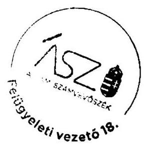

Makkai Mária s.k.
felügyeleti vezető

$$
\begin{aligned}
& \text { P } \\
& \text { A kiadmány hiteles. }
\end{aligned}
$$

---

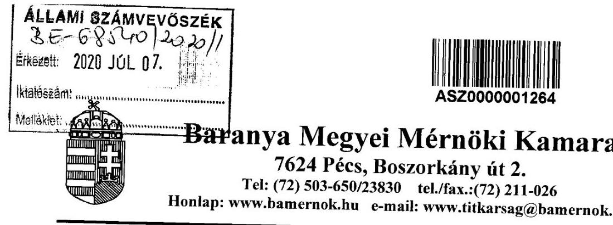

Állami Számvevőszék Elnöke
Domokos László

1364 Budapest 4. Pf. 54.

Ügyszám: 57/LOILO
Tárgy: Észrevétel a Baranya Megyei
Mérnöki kamara részére megküldött
ellenőrzési jelentéstervezethez
Pécs, 2020. július 3.

# Tisztelt Elnök Úr! 

A 2020. június 16-án kelt, EL-0920-698/2020. iktatószámú, kamaránkhoz 2020. június 24-én beérkezett, a „Közestületek ellenőrzése - Magyar Mérnöki Kamara" címmel készített számvevőszéki jelentéstervezetet tartalmazó levelét megkaptuk.

A levelében foglalt figyelemfelhívás szerint, az ÁSZ tv. 29. § (2) bekezdése alapján a jelentéstervezethez a tagdíjkövetelések nyilvántartásával kapcsolatban megfogalmazott megállapítások vonatkozásában a Baranya Megyei Mérnöki Kamara részéről az alábbi észrevételeket tesszük.

A Magyar Mérnöki Kamara a tervező- és szakértő mérnökök, valamint építészek szakmai kamaráiról szóló 1996. évi LVIII. törvény (Kamtv.) 11. §-ában, valamint az MMK Kamtv. szerint elfogadott Alapszabályában foglaltak szerint a területi kamarák adatszolgáltatása alapján országos összesítésben vezeti a kamarai tagok (és az engedélyhez, bejelentéshez mérnöki tevékenység folytatására jogosultsággal rendelkezők) névjegyzékét.

A kamarai névjegyzék vezetését az MMK a kamarák által közösen használt központi nyilvántartási rendszer fejlesztésével és üzemeltetésével biztosítja. A nyilvántartási rendszer alkalmas arra, hogy abban valamennyi területi kamara naprakészen vezesse a tagdíjak befizetését, továbbá rendelkezik olyan integrált számlázó modullal, amelynek segítségével a tagdíj befizetéséhez szükséges számviteli bizonylatok is előállíthatók. A területi kamarák a rendszerben rögzített adatok alapján folyamatosan nyomon követhetik a tagdíjkövetelések alakulását és a tagdíjat nem fizető kamarai tagok listáját. Ez alapján a területi elnökségek kezdeményezni tudják a Kamtv. 29.§ (3) bekezdése szerinti eljárás megindítását.

A Baranya Megyei Mérnöki Kamara jelenlegi feladatellátása során a tagdíjkövetelések nyilvántartását táblázatkezelő programmal végzi, a tagdíj befizetéshez szükséges számviteli bizonylatok előállítását pedig nem a kamarák által közösen használt számlázó programmal valósítja meg.

Álláspontunk szerint a kamarák által közös használt nyilvántartás alkalmas arra, hogy a jelentéstervezetben megfogalmazott módon biztosítsa a tagdíjkövetelések analitikus nyilvántartását.

---

Kérem Elnök urat a jelentéstervezet felülvizsgálatára, illetve kiegészítésére oly módon, hogy abból a kamarák által közösen használt nyilvántartási rendszer alkalmassága - a tagdijkövetelések nyilvántartásával kapcsolatban a BMMK részére megfogalmazott elvárások teljesítése szempontjából - megállapítható legyen.

A közösen használt rendszer nyilvántartási alkalmassága esetén Kamaránk áttérne az analitikus nyilvántartási rendszer használatára, megszüntetve ezáltal a részünkre megfogalmazott számvevőszéki ellenőrzési kifogást.

Kérjük észrevételünk mérlegelését és - amennyiben lehetőséget látnak rá - az átvezetését a jelentés szövegének véglegesítése során.

Üdvözlettel:
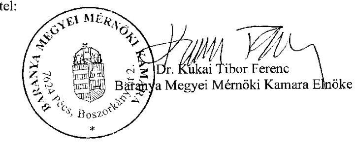

---

# 150 éve   1. 

Ikt. szám: EL-0920-730/2020.

Dr. Kukai Tibor Ferenc úr
elnök

Baranya Megyei Mérnöki Kamara

## Pécs

Tisztelt Elnök Úr!

Az „Köztestületek ellenőrzése - Magyar Mérnöki Kamara" címmel készített számvevőszéki jelentéstervezetre tett 57/2020 úgyszámú 2020. július 3-án kelt észrevételét köszönettel megkaptam.

Az Állami Számvevőszék észrevételre vonatkozó álláspontjáról a felügyeleti vezető által készített részletes tájékoztatást mellékelten megküldöm.

Tájékoztatom Elnök urat, hogy a számvevőszéki jelentésben - az Állami Számvevőszékről szóló 2011. évi LXVI. törvény 29. § (3) bekezdése alapján - a figyelembe nem vett észrevételt szerepeltetjük, annak indoklásával, hogy azt az Állami Számvevőszék miért nem fogadta el.

Budapest, 2020. 07 hó 9.1 nap

Melléklet: Tájékoztatás az észrevétel kezeléséről

Tisztelettel:
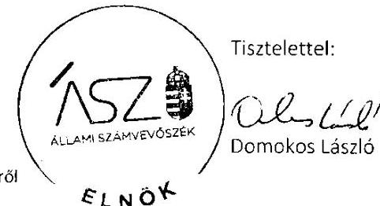

---

# Tájékoztatás 

## az észrevétel kezeléséról

Az „Kóztestületek ellenőrzése - Magyar Mérnöki Kamara" címú jelentéstervezetre 2020. július 7-én érkezett észrevételt áttekintettük, annak kezelésével kapcsolatban a következő tájékoztatást adom.

Az Állami Számvevőszék (továbbiakban ÁSZ) kamarai tagdíjkövetelések nyilvántartására vonatkozó megállapításához tett észrevételében Elnök úr tájékoztatott, hogy a Magyar Mérnöki Kamara által országos összesítésben vezetett névjegyzék alkalmas arra, hogy abban valamennyi területi kamara naprakészen vezesse a tagdíjak befizetését és a területi kamarák a rendszerben folyamatosan nyomon követhetik a tagdíjkövetelések alakulását. Továbbá tájékoztatott arról, hogy a Baranya Megyei Mérnöki Kamara (továbbiakban Kamara) a tagdíjkövetelések nyilvántartását táblázatkezelő programmal végzi.

Tájékoztatom Elnök urat, hogy az észrevételben írt országos összesítésben vezetett névjegyzék és a Kamara által az ellenőrzés rendelkezésére bocsátott dokumentumok nem feleltethetők meg az ÁSZ vonatkozó megállapításában rögzített, a számvitelről szóló 2000. évi C. törvény 165. § (4) bekezdés szerinti analitikus nyilvántartásnak, mely biztosítja a tagdíjkövetelések és a Kamara főkönyvi könyvelés adatai közötti egyeztetés lehetőségét. Fentiekre tekintettel az ÁSZ megállapítás módosítása nem indokolt, az észrevételt nem fogadjuk el.

Budapest, 2020. 0\% hó 2.1 nap
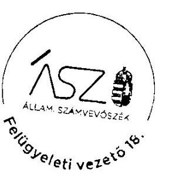

Makkai Mária s.k. felügyeleti vezető

A kiadmány hiteles.

---

# BÁCS-KISKUN MEGYEI MÉRNÖKI KAMARA 

6000 Kecskemét, Klapka u. 19. II. 8.
Telefon/fax: (76) 418-020; 06-30-580-6142
E-mail: bkmmk@bkmmk.hu; Honlap: www.bkmmk.hu
Ügyfélfogadás: hétfő-péntek: $9^{\text {00 }}-12^{\text {00 }}$; szerda: $14^{\text {00 }}-16^{\text {00 }}$ óráig
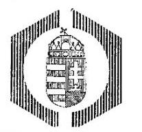

Tárgy: jelentéstervezet észrevételezése
Melléklet: -
Ikt. szám: 254/2020.
Hiv.szám: EL-0920-698/2020.
Állami Számvevőszék
Domokos László
elnök
Budapest 4.
Pf.: 54.
1364
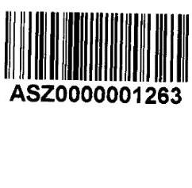

## Tisztelt Elnök Úr!

Az Állami Számvevőszék megküldte részünkre a „Köztestületek ellenőrzése - Magyar Mérnöki Kamara" címmel készített jelentéstervezetét és a törvény szerinti észrevételi lehetőséget biztosított. A Bács-Kiskun Megyei Mérnöki Kamarához 2020.06.19-én érkezett dokumentumban foglaltakat áttanulmányoztuk, az abban foglaltakkal kapcsolatban az alábbi észrevételeket teszszük.
Kamaránk vonatkozásában a jelentéstervezet kettő pontban kér intézkedést, illetve tárt fel szabálytalanságot:

1. Intézkedjen a számviteli törvény előírásainak megfelelő számviteli politika elkészítéséről.
2. Intézkedjen a tagdíjkövetelések analitikus nyilvántartásának vezetéséről, valamint a fökönyvi könyvelés és a tagdíjkövetelések analitikus nyilvántartása adatai közötti egyeztetés és ellenőrzés lehetőségének logikailag zárt rendszerrel történő biztosításáról.

Tájékoztatom, hogy a fent hivatkozott két pont tekintetében intézkedést kezdeményeztünk kamaránknál a következők szerint:

1. A számviteli törvény előírásainak megfelelő, azzal összhangba kerülő számviteli politika elkészítésére.
2. A tagdíjkövetelések analitikus nyilvántartásának vezetésére.

Fontosnak tartjuk kiemelni, hogy a BKMMK alapvető céljai közé tartozik az átlátható, szabályszerű működés biztosítása, illetve mindezek feltételrendszerének a megteremtése. Bízunk benne, hogy intézkedéseinkkel teljes mértékben biztosítottá válik a Bács - Kiskun Megyei Mérnöki Kamara gazdálkodásának átláthatósága és elszámoltathatósága.

Kecskemét, 2020. július 02.
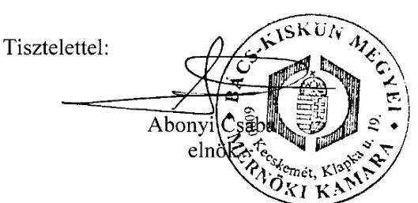

---

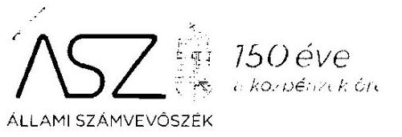

# ALLAMI SZAMVEVÓSZÉK 

Ikt. szám: EL-0920-731/2020.

Abonyi Csaba úr
elnök

Bács-Kiskun Megyei Mérnöki Kamara

## Kecskemét

Tisztelt Elnök Úr!

Az „Köztestületek ellenőrzése - Magyar Mérnöki Kamara" címmel készített számvevőszéki jelentéstervezetre tett 254/2020. iktató számú észrevételét köszönettel megkaptam.

Az Állami Számvevőszék észrevételre vonatkozó álláspontjáról a felügyeleti vezető által készített részletes tájékoztatást mellékelten megküldöm.

Tájékoztatom Elnök urat, hogy a számvevőszéki jelentésben - az Állami Számvevőszékről szóló 2011. évi LXVI. törvény 29. § (3) bekezdése alapján - a figyelembe nem vett észrevételt szerepeltetjük, annak indoklásával, hogy azt az Állami Számvevőszék miért nem fogadta el.

Budapest, 2020. 07 hó 21 nap

Melléklet: Tájékoztatás az észrevétel kezeléséről
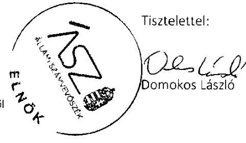

---

Melléklet
Ikt.szám: EL-0920-731/2020.

# Tájékoztatás   az észrevétel kezeléséről 

Az „Köztestületek ellenőrzése - Magyar Mérnöki Kamara" címú jelentéstervezetre 2020. július 7-én érkezett észrevételt áttekintettük, annak kezelésévei kapcsolatban a következő tájékoztatást adom.

Elnök úr az Állami Számvevőszék (továbbiakban ÁSZ) által tett megállapításokkal kapcsolatban tett észrevételében tájékoztatott, hogy a Bács-Kiskun Megyei Mérnöki Kamara kezdeményezte a számviteli törvény előírásainak megfelelő, azzal összhangba kerülő számviteli politika elkészítését, valamint a tagdíjkövetelések analitikus nyilvántartásának vezetését.

Az észrevétel megerősíti az ÁSZ megállapítását, ezért a jelentéstervezet módosítása nem indokolt.
Budapest, 2020. 07 hó3.1 nap
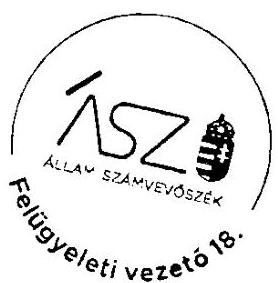

Makkai Mária s.k. felügyeleti vezető

A kiadmány hiteles.

---

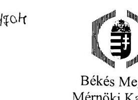

5600 Békéscsaba, Andrássy út 12. II. 210-212.

Iktatószám: 303/2020.
Tárgy: Jelentéstervezet

Domokos László Úr
elnök

Állami Számvevőszék
1052 Budapest
Apáczai Csere János u. 10.

Tisztelt Elnök Úr!

Köszönettel vettem a „Köztestületek ellenőrzése - Magyar Mérnöki Kamara” című számvevőszéki jelentéstervezetet.

A tervezetben foglalt - a Békés Megyei Mérnöki Kamarát érintő - megállapítás alapján haladéktalanul intézkedtem arról, hogy a pályázatokban elszámolt költségek külön főkönyvi számon legyenek kimutatva.

Békéscsaba, 2020. július 03.

Tisztelettel:

Buzás Zoltán
elnök

5600 Békéscsaba, Andrássy út 12. II. 210-212. Tel./Fax: (66) 441-448, E-mail cím: bmmk@bmmernokikamara.hu
Hozilap: www.bmmernokikamara.hu

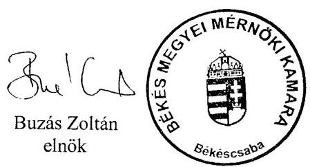

---

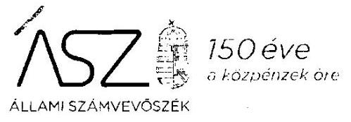

Ikt. szám: EL-0920-735/2020.

Buzás Zoltán úr
elnök

Békés Megyei Mérnöki Kamara

# Békéscsaba 

Tisztelt Elnök Úr!

Az „Köztestületek ellenőrzése - Magyar Mérnöki Kamara" címmel készített számvevőszéki jelentéstervezetre tett 303/2020. iktató számú észrevételét köszönettel megkaptam.

Az Állami Számvevőszék észrevételre vonatkozó álláspontjáról a felügyeleti vezető által készített részletes tájékoztatást mellékelten megküldöm.

Tájékoztatom Elnök urat, hogy a számvevőszéki jelentésben - az Állami Számvevőszékről szóló 2011. évi LXVI. törvény 29. § (3) bekezdése alapján - a figyelembe nem vett észrevételt szerepeltetjük, annak indoklásával, hogy azt az Állami Számvevőszék miért nem fogadta el.

Budapest, 2020. 09 hó 17 nap

Melléklet: Tájékoztatás az észrevétel kezeléséről
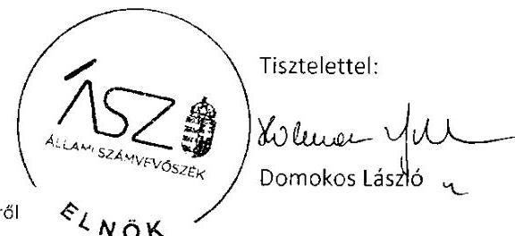

---

Melléklet
Ikt.szám: EL-0920-735/2020.

# Tájékoztatás   az észrevétei kezeléséröl 

Az „Kóztestületek ellenőrzése - Magyar Mérnöki Kamara" címú jelentéstervezetre 2020. július 7-én érkezett észrevételt áttekintettük, annak kezelésével kapcsolatban a következő tájékoztatást adom.

Elnök úr észrevételében tájékoztatott, hogy a jelentéstervezet megállapítása alapján haladéktalanul intézkedett a pályázatokban elszámolt költségek külön főkönyvi számon történő kimutatása érdekében. Az észrevétel alapján a jelentéstervezet módosítása nem indokolt.

Budapest, 2020. 07. hó 27 nap
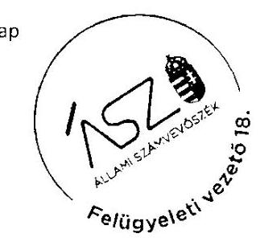

Makkai Mária s.k.
felügyeleti vezetó
Pálu 2
A kiadmány hiteles.

---

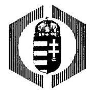

# Borsod-Abaúj-Zemplén Megyei Mérnöki Kamara 

3525 Miskolc, Madarász Viktor u. 9. Fsz/1. * Telefon: (46) 505-483 * Fax: (46) 505-484
Postacím: 3501 Miskolc, Pf.: 370. * E-mail: bomek@t-online.hu
Honlap: www.bomek.hu * Ügyfélfogadás: hétfő, kedd, csütörtök: 8-12-ig

Állami Számvevőszék
Domokos László elnök úr részére
1052 Budapest, Apáczai Csere János u. 10.

Tárgy: Köztestületek ellenőrzése. Magyar Mérnöki Kamara Borsod-Abaúj-Zemplén Megyei Mérnöki Kamara
Hiv.szám: EL-0920-698/2020

Tisztelt Elnök Úr!

Köszönettel megkaptuk az Állami Számvevőszék jelentéstervezetét a Magyar Mérnöki Kamara köztestület ellenőrzéséről, mely tartalmazza az önálló jogi személyiségủ Borsod-Abaúj-Zemplén Megyei Mérnöki Kamara vizsgálatát is.
A jelentéstervezetben a Kamaránkra vonatkozó megállapításaik alapján intézkedtem.

- Intézkedtem a Számviteli törvény előírásainak megfelelő számviteli politika és a számlarend elkészítéséről.
Mivel számviteli politikával és számlarenddel rendelkezünk, azt Önök felé megküldtük és a vizsgálati jelentéstervezet konkrét kifogásokat nem közöl, ezért megbíztunk könyvvizsgálót a jelzett dokumentumok megfelelőségének átvizsgálására.
- Intézkedtem a tagdíjkövetelések analitikus nyilvántartásának vezetéséről a jelentéstervezet előírásának megfelelően.
Itt figyelembe vesszük, hogy az éves könyvelés, illetve a mérleg záró időpontja az aktuális év december 31-e, a kizárást eredményező tagdíjkövetelésé pedig a következő év március 31-e a Kamarai Törvény szerint.
Jelezzük, hogy a tagdijelmaradást az illetékes tagjainknak és nyilvántartottjainknak e-mailben, telefonon és levélben is jelezzük a kizárásukat megelőzően, a kizárást tértivevényes levélben közöljük, a visszajött tértivevényeket külön tároljuk.
Ebben (is) országosan egységes módszer bevezetését javasoljuk a Magyar Mérnöki Kamara felé.
- Intézkedtem a költségvetési támogatások felhasználásának jogszabály szerinti nyilvántartása érdekében.
Jelezzük, hogy ez a könyvelésünkben eddig is elkülönítve szerepelt.
Valamennyi Kamarának nehézséget okoz, hogy év elején (amikortól már a költségek keletkeznek) még nem tudjuk, hogy lesz-e állami támogatás, ha lesz az milyen összegű és mikor realizálódik, pl. a 2020. évről még nincs biztos információnk.

---

- A jelentéstervezetük II. sz. mellékletében azt rögzítik a 4. sorban Kamarákra vonatkozóan, hogy nem történt adatszolgáltatás.
Jelezzük, hogy az ÁSZ online visszaigazolása szerint az Önök által kért adatszolgáltatást az Állami Számvevőszék Elektronikus Adatkezelési Rendszerében az adatbekérésnek megfelelően 2019. 07.02. és 2019. 10. 09. között teljesítettük, további hiánypótlási felszólításról, esetleges hiányosságról nincs tudomásunk.
(A visszaigazolást kinyomtattuk és levelünkhöz mellékeljük.)
Intézkedtem Titkárságunk felé, hogy a továbbiakban minden adatbekérésről és annak teljesítéséről engem is azonnal értesítsenek.

Miskolc, 2020. 07. 06.

Tisztelettel:
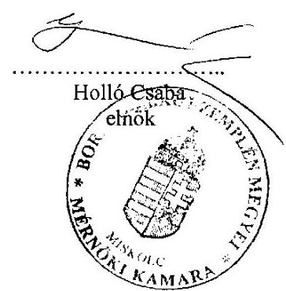

Mellékelve 4 db A4 lap

---

# 150 éve 

Ikt. szám: EL-0920-743/2020.

Holló Csaba úr
elnök

Borsod-Abaúj-Zemplén Megyei Mérnöki Kamara

## Miskolc

Tisztelt Elnök Úr!

A „Köztestületek ellenőrzése - Magyar Mérnöki Kamara" címmel készített számvevőszéki jelentéstervezetre tett 8/2020 iktatószámú észrevételét köszönettel megkaptam.

Az Állami Számvevőszék észrevételre vonatkozó álláspontjáról a felügyeleti vezető által készített részletes tájékoztatást mellékelten megküldöm.

Tájékoztatom Elnök urat, hogy a számvevőszéki jelentésben - az Állami Számvevőszékről szóló 2011. évi LXVI. törvény 29. § (3) bekezdése alapján - a figyelembe nem vett észrevételt szerepeltetjük, annak indoklásával, hogy azt az Állami Számvevőszék miért nem fogadta el.

Budapest, 2020. 08. hó 04. nap

Melléklet: Tájékoztatás az észrevétel kezeléséről
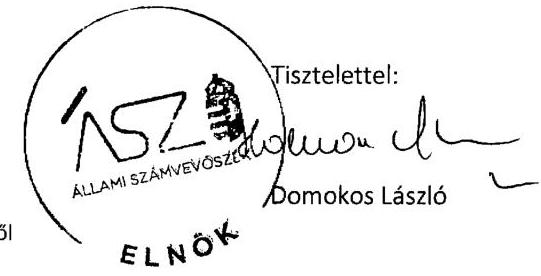

---

Melléklet
Ikt.szám: EL-0920-743/2020.

# Tájékoztatás   az észrevétel kezeléséről 

A „Köztestületek ellenőrzése - Magyar Mérnöki Kamara" című jelentéstervezetre 2020. július 17-én érkezett észrevételt áttekintettük, annak kezelésével kapcsolatban a következő tájékoztatást adom.

Az Állami Számvevőszék (továbbiakban ÁSZ) által az Állami Számvevőszékről szóló 2011. évi LXVI. törvény (továbbiakban ÁSZ tv.) 29. § (1) bekezdése alapján megküldött jelentéstervezetre Elnök úr tájékoztatott, hogy az ÁSZ megállapításai alapján intézkedett a „Számviteli törvény előírásainak megfelelő számviteli politika és a számlarend elkészítéséről", a „tagdíjkövetelések analitikus nyilvántartásának vezetéséről", valamint a „költségvetési támogatások felhasználásának jogszabály szerinti nyilvántartása érdekében".

Tájékoztatom Elnök urat, hogy a válaszlevélben jelzett intézkedések nem mentesítik az ÁSZ tv. 33. § (1) bekezdésben előírt, a végleges jelentésben megfogalmazott javaslatot megalapozó megállapításhoz kapcsolódó intézkedési terv készítési kötelezettségtől.

Elnök úr számviteli politikával és számlarenddel kapcsolatban tett jelzésére tájékoztatom, hogy az ÁSZ ellenőrzési megállapításai minden esetben az ÁSZ tv.-nek megfelelően az ellenőrzés során bekért és az arra nyitva álló határidőn belül rendelkezésre bocsátott dokumentumokon alapulnak. Az ÁSZ az EL-0920-124/2019 és EL-0920-221/2019 iktatószámú 2015-2017 közötti időszakra, valamint az EL-0920-457/2019 iktatószámú 2018. évre vonatkozó adatbekérő levél 2. számú mellékletében szerepeltek szerint kérte az aláírt és hiteles dokumentumokat.

A Borsod-Abaúj-Zemplén Megyei Mérnöki Kamara (továbbiakban Kamara) által a 2015-2017. évekre az ellenőrzés rendelkezésére bocsátott számviteli politika és számlarend nem elfogadhatóak, mert nem aláírt és hiteles dokumentumok. A 2018. évre vonatkozóan a Kamara nem szolgáltatott adatot. Fentiek alapján a jelentéstervezet módosítása nem indokolt.

A tagdíjkövetelések analitikus nyilvántartásához írt jelzésében Elnök úr a Kamara tagdijelmaradással kapcsolatban követett eljárásáról tájékoztat, mely megerősíti az ÁSZ vonatkozó megállapítását, a jelentéstervezet módosítása nem indokolt.

A költségvetési támogatások felhasználásának jogszabály szerinti nyilvántartásához, valamint a válaszlevél utolsó bekezdésében a nemleges adatszolgáltatással kapcsolatban írt jelzésre tájékoztatom, hogy az ÁSZ által az EL-0920-457/2019 iktatószámú adatbekérő levélre, melyben az

---

ÁSZ többek között a vonatkozó dokumentumokat kérte, a Kamara részéről nem történt adatszolgáltatás. Fentiekre tekintettel a jelentéstervezet módosítása nem indokolt.

Budapest, 2020. 08. hó 04. nap
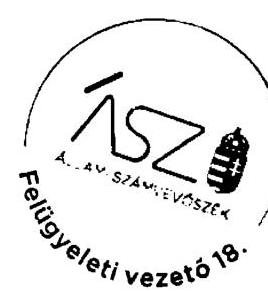

Makkai Mária s.k.
felügyeleti vezető
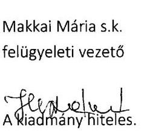

---

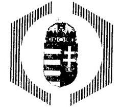

# CSONGRÁD MEGYEI MÉRNÖKI KAMARA 

## ENGINEER CHAMBER OF CSONGRÁD COUNTY

6720 SZEGED, ARANY JÁNOS U. 7. I. EM. 118.

## ÁLLAMI SZÁMVEVŐSZÉK

Domokos László elnök úr részére

1364 Budapest 4.
Apáczai Csere János utca 10.
Pf. 54
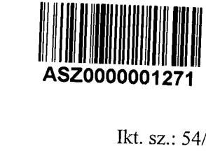

Ikt. sz.: 54/2020
Tárgy: Észrevétel, kiegészítő nyilatkozat

Tisztelt Elnök Úr!

Köszönöm az EL-0920-698/2020 iktatószámú levelüket és annak mellékletét képező „Köztestületek ellenőrzése - Magyar Mérnöki Kamara" című jelentéstervezetet, melyre az alábbi észrevételeket teszem az előírt határidőn belül:

## 1. Számviteli politika és számviteli szabályzatok (számlarend)

A jelentéstervezet II. számú mellékletében található táblázatban feltüntetett hiányosságokkal kapcsolatban tájékoztatjuk Önöket, hogy korábban megküldtük a 2017. szeptember 11-én kelt, 2020.07.01-ig hatályos számviteli politikánkat és az ahhoz kapcsolódó számlarendet/számlatükröt. Kiegészítésként mellékelem a 2012. október 09-én kelt 2015-20162017. szeptember 11. vizsgált időszakokra érvényes számviteli politikánkat és az ahhoz kapcsolódó számlarendet/számlatükröt. Kérem, hogy a megküldött dokumentumok alapján a végleges jelentés II. számú mellékletéből ezeket a hiányosságokat törölni szíveskedjenek.

## 2. Tagdíjkövetelések nyilvántartása

A Csongrád Megyei Mérnöki Kamara (továbbiakban: CSMMK) a tagdíj-követelések analitikus nyilvántartását a Magyar Mérnöki Kamara által üzemeltetett Integrált Informatikai Rendszer segítségével végzi. A nyilvántartási rendszer alkalmas arra, hogy abban a területi kamara naprakészen vezesse a tagdíjak befizetését, továbbá rendelkezik olyan integrált számlázó modullal, amely segítségével a tagdíj befizetéséhez szükséges számviteli bizonylatok is előállíthatók. A területi kamara titkársága az ebben a rendszerben rögzített adatok alapján folyamatosan nyomon követi a tagdíjkövetelések alakulását és a tagdíjat nem fizető kamarai tagok listáját. Ez alapján az elnökségnél kezdeményezi a Tervező- és szakértő mérnökök, valamint építészek szakmai kamaráiról szóló 1996. évi LVIII. törvény (továbbiakban: Kamarai tv.) 29.§ (3) bekezdése szerinti eljárás megindítását. Véleményünk szerint ez a közös nyilvántartás alkalmas arra, hogy a jelentéstervezetben megfogalmazott módon biztosítsa a tagdíjkövetelések analitikus nyilvántartását.

Úgyfélfogadási idő: hétfőtől csütörtökig 8-12 óráig
Tel.: 62/552-142 Tel./fax: 62/552-143
E-mail: csmi_mern_kam@invitel.hu Web: www.csmi-mernoki-kamara.hu

---

A CSMMK a Kamarai tv. 29.§ (3) bekezdése, valamint a CSMMK mindenkor hatályos Alapszabályában rögzítettek szerint járt/jár el azon tagjaival szemben, akiknek egy évet meghaladó tagdíjhátraléka halmozódott fel. Következetes gyakorlatunk szerint a CSMMK elnöksége - a vizsgált időszakokban is - a határidőben nem fizető tagot leltár alapján határozatával felszólította kötelezettsége teljesítésére, melynek eredménytelensége esetén a tag tagsági viszonya megszüntetésre került. A CSMMK gyakorlatát a korábbi nyilatkozatában már megírta, annak prezentálására ezt a gyakorlatot bemutató dokumentum másolatokat csatolom (mellékletben: CSMMK elnökségi határozatai az egy év tagdíjhátralékkal rendelkező tagok kizárásáról, minden vizsgált évből a tagdíjhátralékkal rendelkező tagok leltári táblázata, példaként 1 fö tag fizetési felszólítása, törlő határozata, végzés).

Mellékeljük a módosított számviteli politikánkat és számlarendünket, melyben pontosan rögzítettük a számviteli-, és a kamarai törvény előírásainak megfelelő gyakorlatot 2020. 01.01től. A számviteli politikánkban szerepel a tagdíjkövetelésekre vonatkozó analitikus nyilvántartás vezetése, a számlarendben/a számlatükörben külön fökönyvi számon tartjuk nyilván a tagdíjkövetekéseket. Így megvalósul a fökönyvi könyvelés és a tagdíjkövetelések analitikus nyilvántartása közötti egyeztetés és ellenőrzés lehetőségének logikailag zárt rendszerrel történő biztosítása.

Tisztelt Elnök Úr, kérem, hogy a fentebb leírt észrevételek és a mellékletek alapján a végleges jelentésükben az észrevételünkben előadottakat szíveskedjenek mérlegelni, lehetőség szerint átvezetni a jelentés szövegének véglegesítése során.

A jelentéstervezetben előírt 30 napon bclüli intézkedési tervet, és annak végrehajtását a módosított számviteli politikánk és számlarendünk alapján szíveskedjenek megküldöttnek tekinteni.

Kérem engedje meg, hogy megköszönjem Elnök úrnak és az Állami Számvevőszék munkatársainak a segítségét az ellenőrzés lefolytatása során.

Szeged, 2020. július 02.
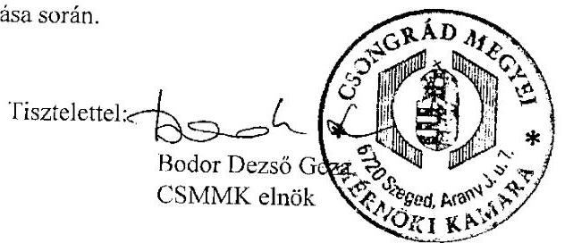

Mellékletek:

- A CSMMK 2015-2016. vizsgált időszakokra érvényes számviteli politikája és az ahhoz kapcsolódó számlarend/számlatükör
- A CSMMK 2015., 2016., 2017., 2018. évekre vonatkozó, tagdíjhátralékkal rendelkező tagok leltári táblázata
- A CSMMK 2015., 2016., 2017., 2018. évekre vonatkozó clnökségi határozatai az egy év tagdíjhátralékkal rendelkező tagok kizárásáról
- A CSMMK 2015., 2016., 2017., 2018. évekre példaként 1 fő tag fizetési felszólítása, törlő határozata, végzés
- A CSMMK módosított számviteli politikája és az ahhoz kapcsolódó számlarend/számlatükör

---

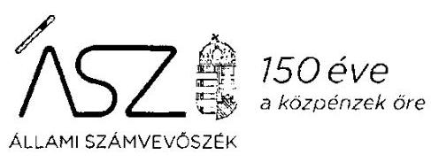

Ikt. szám: EL-0920-736/2020.

Bodor Dezső Géza úr
elnök

Csongrád Megyei Mérnöki Kamara

# Szeged 

Tisztelt Elnök Úr!

Az „Köztestületek ellenőrzése - Magyar Mérnöki Kamara" címmel készített számvevőszéki jelentéstervezetre tett 54/2020 iktatószámú észrevételét köszönettel megkaptam.

Az Állami Számvevőszék észrevételre vonatkozó álláspontjáról a felügyeleti vezető által készített részletes tájékoztatást mellékelten megküldöm.

Tájékoztatom Elnök urat, hogy a számvevőszéki jelentésben - az Állami Számvevőszékről szóló 2011. évi LXVI. törvény 29. § (3) bekezdése alapján - a figyelembe nem vett észrevételt szerepeltetjük, annak indoklásával, hogy azt az Állami Számvevőszék miért nem fogadta el.

Budapest, 2020. O 7. hó 2.7. nap

Melléklet: Tájékoztatás az észrevétel kezeléséről

---

# Tájékoztatás 

az észrevétel kezeléséröl

Az „Köztestületek ellenőrzése - Magyar Mérnöki Kamara" című jelentéstervezetre 2020. július 7-én érkezett észrevételt áttekintettük, annak kezelésével kapcsolatban a következő tájékoztatást adom.

Az észrevétel 1. Számviteli politika és számviteli szabályzatok (számlarend) pontjában Elnök úr tájékoztatott, hogy a Csongrád Megyei Mérnöki Kamara (továbbiakban Kamara) megküldte korábban a 2017. szeptember 11-én kelt 2020. 07.01-ig hatályos számviteli politikát és az észrevétel mellékleteként a 2012. október 09-én kelt 2015-2016-2017. szeptember 11. időszakokra érvényes számviteli politikát és az ahhoz kapcsolódó számlarendet/számlatükröt.

Az észrevétel megerősíti az Állami Számvevőszék (továbbiakban ÁSZ) 2015-2017 közötti időszakra vonatkozóan a számviteli politika és a számlarend hiányát rögzítő ellenőrzési megállapítását. Az Állami Számvevőszékről szóló 2011. évi LXVI. törvénynek megfelelően az ÁSZ megállapításai minden esetben az ellenőrzés során bekért és az arra nyitva álló határidőn belül rendelkezésre bocsátott dokumentumokon alapulnak. A Kamara a 2015-2017. szeptember 11-ig terjedő ellenőrzött időszakra nem bocsátott hatályos számviteli politikát és számlarendet az ellenőrzés rendelkezésére, melyet Elnök úr észrevétele is alátámaszt. Fentiek alapján az észrevételt nem fogadjuk el, a jelentéstervezet módosítása nem indokolt.

A tagdíjkövetelések nyilvántartásához kapcsolódóan, az észrevétel 2. pontjában Elnök úr tájékoztatott, hogy a Kamara a Magyar Mérnöki Kamara által üzemeltetett Integrált Informatikai Rendszer segítségével végzi a tagdíj-követelések analitikus nyilvántartását. A Kamara titkársága a rendszerben rögzített adatok alapján folyamatosan nyomon követi a tagdíjkövetelések alakulását és a tagdíjat nem fizető kamarai tagok listáját.
Az észrevételben hivatkozott összesített nyilvántartás nem azonos, illetve nem feleltethető meg a Kamara tagdíjkövetelések analitikus nyilvántartásának, nem biztosítja a főkönyvi könyvelés és a tagdíjkövetelések analitikus nyilvántartása adatai közötti egyeztetés és ellenőrzés lehetőségét. Erre tekintettel az észrevételt nem fogadjuk el, a megállapítás módosítása nem indokolt.

A tagdíjkövetelésekkel összefüggésben megküldött, 2020 január 1-től alkalmazott gyakorlatot rögzítő, a tagdíjkövetelésekre vonatkozó analitikus nyilvántartás vezetését tartalmazó módosított számviteli politika és számlarend nem mentesíti az ellenőrzött szervezetet a végleges jelentésben

---

megfogalmazott javaslatot megalapozó megállapításhoz kapcsolódó intézkedési terv készitési kötelezettségtöl.

Budapest, 2020. O 7. hó 2.4 nap
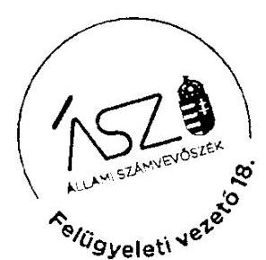

Makkai Mária s.k. felügyeleti vezető

A kiadmány hiteles.

---

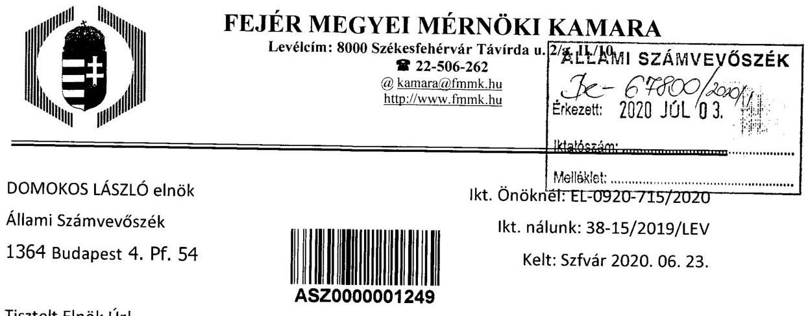

Tisztelt Elnök Úr!
A 2020. 06. 16-án kelt EL-0920-698/2020 iktatószámú levelükkel megküldött „Köztestületek ellenőrzése - Magyar Mérnöki Kamara" címü jelentéstervezetet áttanulmányoztuk, azzal kapcsolatban az alábbi észrevételt tesszük.
A vizsgálat lefolytatása véleményünk szerint jogszerú volt, munkatársaik együttmüködőek voltak. A vizsgálat közben bekért anyagokat megfelelő időben tudtuk produkálni, azok megfeleltek a bekérésben foglaltaknak.
A vizsgált időszakban a Miniszterelnökség minden évben független könyvvizsgálóval ellenőriztette a támogatásokról összeállított beszámolóinkat és általában kisebb javítások után elfogadta azokat.

A tervezet konkrét megállapításaival kapcsolatosan:
1.) 2019.01.03-án elkészítettük Kamaránk Számviteli politikáját és a szabályzatokat, melyeket 2019. december 6-án fel is töltöttük az ABR rendszeren keresztül, a kisérőlevél iktatószáma 38-11/2019/LEV.
2.) A területi szervezeteknél a tagdijkövetelések nyilvántartása 2015-2018 közötti időszakban az analitikus nyilvántartás hiánya miatt nem volt szabályszerü. Nem intézkedtek az egy évet meghaladó tagdijak beszedéséröl, mivel az egyévi tagdijat meghaladó hátralék felhalmozódása esetén a tagot hátralék megfizetésére nem hívták fel. Nem igazolt továbbá a kamarai tag tagsági viszonyának megszüntetése, amennyiben annak egyévi tagdijat meghaladó hátraléka halmozódott fel. Mindezek következtében az engedélyezéshez kötött tevékenység folytatásának feltételeként elöirt kamarai tagságot igazoló névjegyzék jogszabályi jogosultságnak megbizhatósága, ezáltal a megfelelő mérnöki feladatellátás nem igazolt.

Kamaránkban minden évben a tagdijbefizetési határidő lejárta után kigyújtjük a központi Integrált Informatikai Rendszerben rögzített tagdijbefizetéseket, és ezt egy Excel táblázatban rögzítjük. Aki elmaradásban van felhívjuk a tagdij befizetésére legalább kétszeri alkalommal elektronikus levélben. Ebben tájékoztatjuk arról is, hogy jogszerü, jogosultsághoz kötött tevékenységet az elmaradás pótlásáig nem folytathat. Aki nem rendezi a tartozását és egy évet meghaladó tartozása van, a tervező- és szakértő mérnökök, valamint építészek szakmai kamaráiról szóló1996. évi LVIII. törvény 29.§ (3) bek. alapján 40 napos határidő megadásával felszólítjuk a befizetésére.
Aki az előbbiek szerinti tartozását a megszabott határidőben nem rendezi, a tagságának törlésére határozatban rendelkezünk. Még ebben a fázisban is

Az irodai félfogadás ideje: kedd, csütörtök: 8-12-ig; szerda 13-16-ig
/eltérő időpontot telefonon kérjük egyeztetni/
Hétfőn és pénteken nincs félfogadás

---

rendszeresen történnek befizetések. A törlésekről minden évben a küldöttgyülési beszámolóban számszerü adatokat tettünk közzé. A beszámolók irattárunkban és honlapunkon is megtekinthetők.
3.) A támogatással kapcsolatban felmerült és számla alapján elszámolt költségeket elkülönítetten tartottuk nyilván folyamatosan. A bérhez kapcsolódó elszámolásokat nem bontottuk meg, erről készült egy kimutatás. 2019-tól már minden költséget elkülönítetten tartunk nyilván.

Mindezek alapján a Jelentéstervezet kapcsán azt az észrevételt tesszük, hogy a Jelentéstervezet 2. pont szerinti megállapítása úgy nem helyt álló, mert Kamaránk a tagdijat nem fizetők tagságának törlésére időben és a vonatkozó szabályozások szerint járt el.

Székesfehérvár, 2020. június 29.
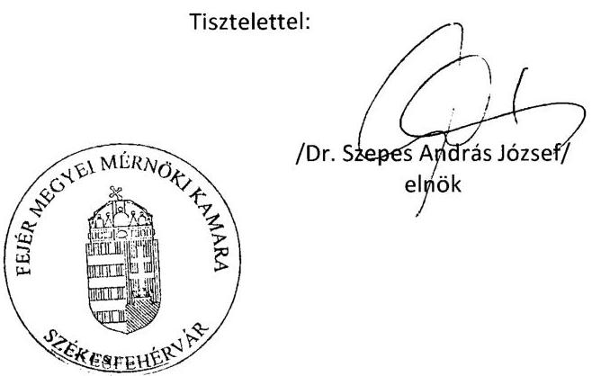

---

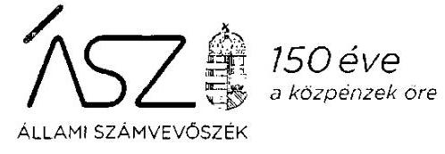

Ikt. szám: EL-0920-734/2020.

Dr. Szepes András József úr
elnök

Fejér Megyei Mérnöki Kamara

# Székesfehérvár 

Tisztelt Elnök Úr!

Az „Köztestületek ellenőrzése - Magyar Mérnöki Kamara" címmel készített számvevőszéki jelentéstervezetre tett 38-15/2019/LEV iktatószámú észrevételét köszönettel megkaptam.

Az Áliami Számvevőszék észrevételre vonatkozó álláspontjáról a felügyeleti vezető által készített részletes tájékoztatást mellékelten megküldöm.

Tájékoztatom Elnök urat, hogy a számvevőszéki jelentésben - az Állami Számvevőszékről szóló 2011. évi LXVI. törvény 29. § (3) bekezdése alapján - a figyelembe nem vett észrevételt szerepeltetjük, annak indoklásával, hogy azt az Állami Számvevőszék miért nem fogadta el.

Budapest, 2020. 07. hó 2. 4. nap
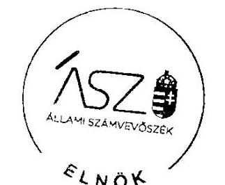

Tisztelettel:
D. 1. NOK

Dómokos László

Melléklet: Tájékoztatás az észrevétel kezeléséről

---

Melléklet
Ikt.szám: EL-0920-734/2020.

# Tájékoztatás   az észrevétei kezeléséről 

Az „Köztestületek ellenőrzése - Magyar Mérnöki Kamara" címú jelentéstervezetre 2020. július 3-án érkezett észrevételt áttekintettük, annak kezelésével kapcsolatban a következő tájékoztatást adom.

Elnök úr az észrevétel 1.) pontjában tájékoztatott arról, hogy a Fejér Megyei Mérnöki Kamara (továbbiakban Kamara) 2019. 01.03-án elkészítette Számviteli politikáját. Tekintettel arra, hogy az Állami Számvevőszék (továbbiakban ÁSZ) megállapításai a 2015-2018-as évekre, mint ellenőrzött időszakra vonatkoznak, az észrevétel nem cáfolja az ÁSZ megállapítását, ezért a jelentéstervezet módosítása nem indokolt.

Az észrevétel 2.) pontjában Elnök úr bemutatta a Kamara, kamarai tagdijbefizetések elmaradása esetén követett eljárását és észrevétele szerint a „jelentéstervezet 2. pont szerinti megállapítása nem helyt álló", mert a Kamara a tagdijat nem fizetők tagságának törlésére időben és a vonatkozó szabályozások szerint járt el.

Az ÁSZ jelentéstervezetének 2. összegző megállapítását alátámasztó részletezésben többek között szerepel a területi kamarák tagdijkövetelések hátralék felhalmozódásához kapcsolódóan tett megállapítása. Ugyanakkor a megállapítások alapján a Kamara részére megfogalmazott javaslat a tagdijkövetelések analitikus nyilvántartásának vezetésére, valamint a főkönyvi könyvelés és a tagdijkövetelések analitikus nyilvántartása adatai közötti egyeztetés és ellenőrzés lehetőségének logikailag zárt rendszerben történő biztosítására vonatkozott - nem a tagdijbeszedésekkel kapcsolatos hiányosság megszüntetésére. Fentiek alapján az észrevétel nem releváns, nem fogadjuk el és a jelentéstervezet módosítása nem indokolt.

Az észrevétel 3.) pontjában a támogatásokkal kapcsolatos elszámolásokhoz tájékoztat arról, hogy a bérhez kapcsolódóan 2019-től már minden költséget elkülönítetten tart a kamara nyilván. Az észrevétel megerősíti az ÁSZ költségvetési támogatások felhasználásának nyilvántartásával kapcsolatos megállapítását, az észrevétel alapján a jelentéstervezet módosítása nem indokolt.

Budapest, 2020. 09. hó 24 nap
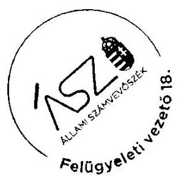

Makkai Mária s.k. felügyeleti vezető

A kiadmány hiteles.

---

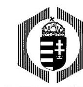

# Györ-Moson-Sopron Megyei Mérnöki Kamara 

9023 Györ, Csaba utca 16.
Tel: (96) 524-580 tel./fax.:(96) 335-591
Honlap: www.mernokkamara-gyor.hu e-mail: info@mernokkamara-gyor.hu

Állami Számvevőszék
Domokos László elnök úr

Budapest
Apáczai Csere János utca 10.
1052

Tárgy: Jelentéstervezethez észrevételek

Ikt. szám: 184/2020.

## ÁLLAMI SZÁMVEVÖSZÉK   2E-2338/2020/   Erkszert: 2020 JOL 16.   iktatúszám:   Meli/aklet: $\qquad$

Tisztelt Elnök Úr!

Köszönettel megkaptam a 2020. június 16-án kelt, EL-0920-698/2020. sz. levelét (kézhezvétel időpontja: 2020. június 30.), melyben megküldte részemre a „Köztestületek ellenörzése - Magyar Mérnöki Kamara" címmel készített számvevőszéki jelentéstervezetet.

A levelében foglalt figyelemfelhívás alapján az ÁSZ tv. 29.§ (2) bekezdése szerint a jelentéstervezet Győr-Moson-Sopron Megyei Mérnöki Kamarát érintő részéhez az alábbi észrevételeket tesszük.

1. pontra tett észrevétel: A költségvetési támogatások felhasználásának jogszabály szerinti nyilvántartása érdekében intézkedtem, ezentúl azokat elkülönített soron tartjuk nyilván.
2. pontra tett észrevétel: Kamaránk nem számlázza előre a tagdíjat a tagok felé. Mivel a legtöbb esetben a tagok díjbefizetését a cégük átvállalja, minden évben változó, hogy a tag részére ki fizeti az adott évi kamarai tagdijat, tehát a befizetésig kérdéses, hogy kinek a nevére legyen kiállítva a tagdíjbefizetésről a számla. Így a számla kiállítása a tagdíj befizetését követően történik. Ezzel egyidejűleg nyilvántartást vezetünk a tagok tagdíjbefizetéséről, amit év végén egyeztetünk és elmaradás esetén felszólítjuk tagjainkat a pótlólagos befizetésre, határidő kitűzésével. A tagdijfizetést elmulasztó tagok kamarából történő kizárásáról a kamarai törvény alapján intézkedünk.
Fentiek miatt a mérlegben követelésként nem szerepelnek tagdijtartozások.

Kérjük észrevételeink szíves mérlegelését és lehetőség szerinti átvezetését a jelentés szövegének véglegesítése során.

Győr, 2020. július 13.
Tisztelettel:
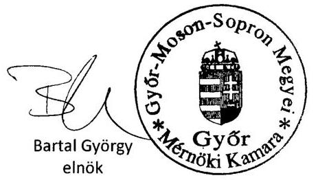

---

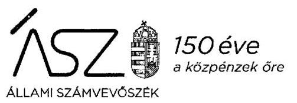

ELNÖK

Ikt. szám: EL-0920-741/2020.

Bartal György úr
elnök

Győr-Moson-Sopron Megyei Mérnöki Kamara

# Győr 

Tisztelt Elnök Úr!

A „Köztestületek ellenőrzése - Magyar Mérnöki Kamara" címmel készített számvevőszéki jelentéstervezetre tett 184/2020. iktatószámú észrevételét köszönettel megkaptam.

Az Állami Számvevőszék észrevéteire vonatkozó álláspontjáról a felügyeleti vezető által készített részletes tájékoztatást mellékelten megküldöm.

Tájékoztatom Elnök urat, hogy a számvevőszéki jelentésben - az Állami Számvevőszékről szóló 2011. évi LXVI. törvény 29. § (3) bekezdése alapján - a figyelembe nem vett észrevételt szerepeitetjük, annak indoklásával, hogy azt az Állami Számvevőszék miért nem fogadta el.

Budapest, 2020. 08. hó 4 nap

Melléklet: Tájékoztatás az észrevétel kezeléséről
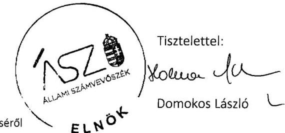

---

# Tájékoztatás   az észrevétel kezeléséröl 

A „Köztestületek ellenőrzése - Magyar Mérnöki Kamara" című jelentéstervezetre 2020. július 16-án érkezett észrevételt áttekintettük, annak kezelésével kapcsolatban a következő tájékoztatást adom.

Az észrevétel 1. pontjában Elnök úr tájékoztatott, hogy a költségvetési támogatások felhasználásának jogszabály szerinti nyilvántartása érdekében intézkedett, és a Győr-Moson-Sopron Megyei Kamara (továbbiakban Kamara) ezentúl elkülönítetten tartja nyilván. Az észrevétel megerősíti az Állami Számvevőszék (továbbiakban ÁSZ) vonatkozó megállapítását, a jelentéstervezet módosítása nem indokolt.

Az észrevétel 2. pontjában a kamarai tagdijbefizetésekkel kapcsolatos tájékoztatás szerint a Kamara a tagok felé előre nem számlázza a tagdijat és a mérlegben követelésként nem szerepelnek tagdijtartozások. Tájékoztatom, hogy az ÁSZ megállapítása nem a tagdijak befizetése nyilvántartásának hiányára vonatkozott, hanem arra hogy, a tagdijkövetelésekről nem vezettek analitikus nyilvántartást.

A Kamarát megillető tagdijkövetelések - amelyeknek a megfizetése a tervező- és szakértő mérnökök, valamint építészek szakmai kamaráiról szóló 1996. évi LVIII. törvény 29. § (1) bekezdése alapján a tagok részéről kötelező, értékkel rendelkező vagyonelemek. Ezen követeléseknek a számviteli nyilvántartásokban - többek között a beszámolóban - való kimutatása a valós vagyoni helyzet bemutatásának szükséges eleme. A számvitelről szóló 2000. évi C. törvény 159. §-a egyértelműen rögzíti, hogy a gazdálkodó olyan könyvviteli nyilvántartást köteles vezetni, amely az eszközökben bekövetkezett változásokat a valóságnak megfelelően, folyamatosan, zárt rendszerben, áttekinthetően mutatja.

Mindezek alapján az észrevételt nem fogadjuk el. A jelentéstervezet módosítása nem indokolt.
Budapest, 2020.
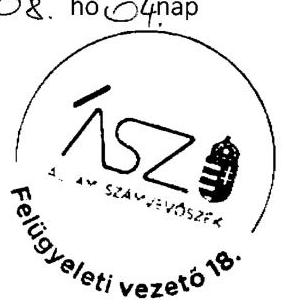

Makkai Mária s.k.
felügyeleti vezető
A kiadmány hiteles.

---

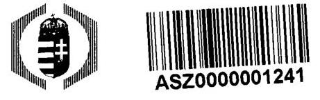

# Hajdú-Bihar Megyei Mérnöki Kamara 4025 Debrecen, Arany J. u. 45. 

Tel/Fax:(52)435-794;
e-mail: hbmmk@hbmmk.hu; web: www.hbmmk.hu

Iktatószám: HB_Á/142-2/2020.
Hiv. szám: EL-0920-698/2020.
Tárgy: Észrevétel jelentéstervezetre

## Domokos László úr   elnök   ÁLLAMI SZÁMVEVÖSZÉK

## Budapest 4.

Pf.: 54.
1364

## Tisztelt Elnök Úr!

Köszönettel vettem a „Köztestületek ellenörzése - Magyar Mérnöki Kamara" címủ számvevőszéki jelentéstervezetet.
A tervezetben foglalt - a Hajdú-Bihar Megyei Mérnöki Kamarát érintő - megállapítások alapján haladéktalanul intézkedem a tagdíjkövetelések analitikus nyilvántartásának vezetéséről, valamint a fökönyvi könyvelés és a tagdíjkövetelések analitikus nyilvántartása adatai közötti egyeztetés és ellenőrzés lehetőségének logikailag zárt rendszerrel történő biztosításáról.

Debrecen, 2020 június 24.
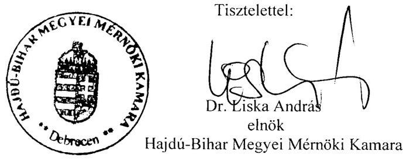

---

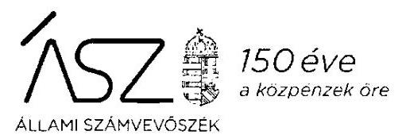

Ikt. szám: EL-0920-737/2020.

Dr. Liska András úr
elnök

Hajdú-Bihar Megyei Mérnöki Kamara

Debrecen

Tisztelt Elnök Úr!

Az „Köztestületek ellenőrzése - Magyar Mérnöki Kamara" címmel készített számvevőszéki jelentéstervezetre tett HB_Á/142-2/2020. iktató számú észrevételét köszönettel megkaptam.

Az Állami Számvevőszék észrevételre vonatkozó álláspontjáról a felügyeleti vezető által készített részletes tájékoztatást mellékelten megküldöm.

Tájékoztatom Elnök urat, hogy a számvevőszéki jelentésben - az Állami Számvevőszékről szóló 2011. évi LXVI. törvény 29. § (3) bekezdése alapján - a figyelembe nem vett észrevételt szerepeltetjük, annak indoklásával, hogy azt az Állami Számvevőszék miért nem fogadta el.

Budapest, 2020. 0 hó 24. nap
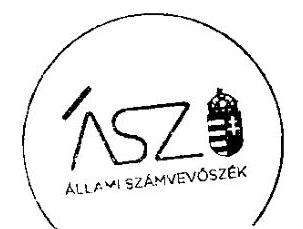

Tisztelettel:
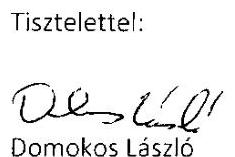

Tajékoztatás az észrevétel kezeléséről $E_{L} \quad \mathrm{O}^{\boldsymbol{+}}$

---

Melléklet
Ikt.szám: EL-0920-737/2020.

# Tájékoztatás   az észrevétel kezeléséről 

Az „Köztestületek ellenőrzése - Magyar Mérnöki Kamara" címü jelentéstervezetre 2020. július 1-én érkezett észrevételt áttekintettük, annak kezelésével kapcsolatban a következő tájékoztatást adom.

Elnök úr észrevételében tájékoztatott, hogy a jelentéstervezet megállapítása alapján intézkedik a Hajdú-Bihar Megyei Mérnöki Kamara tagdíjkövetelései analitikus nyilvántartásának vezetéséről, valamint a fơkönyvi könyvelés és a tagdíjkövetelések analitikus nyilvántartása adatai közötti egyeztetés és ellenőrzés lehetőségének logikailag zárt rendszerrel történő biztosításáról. Az észrevétel megerősíti az Állami Számvevőszék megállapítását, a jelentéstervezet módosítása nem indokolt.

Budapest, 2020. 03. hó 2. 6 nap

Makkai Mária s.k.
felügyeleti vezető

A kiadmány hiteles.
Vassilou C. 1.6

---

# NÓGRÁD MEGYEI 

MÉRNÖKI KAMARA

## NÓGRÁD MEGYEI MÉRNÖKI KAMARA

ALAPITVA : 1996.XI. 22
3100 Salgótarján, Mártírok útja 1. Pf.: 132. Tel.: 32/789-479
Adószám : 18633643-1-12, Bank sz.: 10103726-50107234-00000002
Web : www.nmmk.hu, E-mail: nmmk@nmmk.hu

Állami Számvevőszék
Domokos László
elnök úr részére
1052 Budapest
Apáczai Csere János utca 10.

Ikt.szám:29-1/2020.

Tárgy: EL-0920-698/2020. iktatószámú „Köztestületek ellenőrzése - Magyar Mérnöki Kamara" címmel készített számvevőszéki jelentéstervezethez a Nógrád Megyei Mérnöki Kamarát érintően az alábbi észrevételt teszem:
A jelentéstervezet 22. oldalán a II. sz. melléklet 4. sorában a Nógrád Megyei Mérnöki Kamarát érintően az szerepel, hogy „nem történt adatszolgáltatás".
Kérjük, szíveskedjenek akként javítani, hogy „2018. évre vonatkozóan nem történt adatszolgáltatás."
Az adatszolgáltatási kötelezettségnek Kamaránk 2019. 06.23-án eleget tett 2015., 2016., illetve 2017. év vonatkozásában.

Mellékelten megküldjük a 2019.06.26-án aláírt teljességi és hitelességi nyilatkozatot, melynek 4-5-6. sorszáma tartalmazza, hogy teljesítettük az adatszolgáltatást az elkülönített számviteli nyilvántartásra vonatkozóan 2015-2016-2017. évekre. Mellékeljük továbbá az abr@asz.hu visszaigazolását a sikeres adatfeltöltésről.

Megjegyezni kívánjuk, hogy 2019. december 12-én jeleztük a programozási vezető részére, hogy betegség, illetve szabadság miatt nem tudnuk átvenni az ÁSZ levelét, de természetesen maradéktalanul teljesítjük az adatszolgáltatást egy másik időpontban. Sajnos újból nem kaptuk meg az adatszolgáltatásra felhívó levelet.

Melléklet:

- 1 pld. teljességi és hitelességi nyilatkozat
- 3 pld. abr@asz.hu email visszaigazolás a sikeres adatfeltöltésről

Salgótarján, 2020. július 03.

---

# 150 éve 

Ikt. szám: EL-0920-739/2020.

Bózvári József úr
elnök

Nógrád Megyei Mérnöki Kamara

## Salgótarján

Tisztelt Elnök Úr!

A „Köztestületek ellenőrzése - Magyar Mérnöki Kamara" címmel készített számvevőszéki jelentéstervezetre tett 29-1/2020. iktatószámú észrevételét köszönettel megkaptam.

Az Állami Számvevőszék észrevételre vonatkozó álláspontjáról a felügyeleti vezető által készített részletes tájékoztatást mellékelten megküldöm.

Tájékoztatom Elnök urat, hogy a számvevőszéki jelentésben - az Állami Számvevőszékről szóló 2011. évi LXVI. törvény 29. § (3) bekezdése alapján - a figyelembe nem vett észrevételt szerepeltetjük, annak indoklásával, hogy azt az Állami Számvevőszék miért nem fogadta el.

Budapest, 2020. 06. hó 06, nap

Melléklet: Tájékoztatás az észrevétel kezeléséről

Tisztelettel:

---

# Tájékoztatás   az észrevétel kezelésérői 

A „Köztestületek ellenőrzése - Magyar Mérnöki Kamara" című jelentéstervezetre 2020. július 9-én érkezett észrevételt áttekintettük, annak kezelésével kapcsolatban a következő tájékoztatást adom.

Elnök úr észrevételében kifogásolja a jelentéstervezet II. mellékletének 4. sorában a Nógrád Megyei Mérnöki Kamara (továbbiakban Kamara) vonatkozásában az Állami Számvevőszék (továbbiakban ÁSZ) által tett „nem történt adatszolgáltatás"szerepeltetését és kéri annak arra való javítását, hogy 2018. évre nem történt adatszolgáltatás.

A dokumentumok ismételt felülvizsgálata alapján a megállapítás - miszerint a Kamara a 2015., 2016. években a 224/2000. (XII. 19.) Korm. rendelet 17. § (8) bekezdésében a 2017., 2018. években a 479/2016. (XII. 28.) Korm. rendelet 14. § (1) bekezdésében, valamint a támogatási szerződésekben foglaltak ellenére nyilvántartási rendszerét oly módon nem alakította ki, nem részletezte, hogy abból a közpénz felhasználásával kapcsolatos információk rendelkezésre álljanak - helytálló, megalapozott, azt az észrevétel sem kifogásolja.

Az észrevételben hivatkozott, a Kamara elkülönített számviteli nyilvántartásra vonatkozó adatszolgáltatása, az „elkülönített nyilvántartás 2015.", az "elkülönített nyilvántartás 2016.", valamint „elkülönített nyilvántartás 2017." dokumentumok a Kamara főkönyvi kivonatai, amelyek nem aláírt, nem hiteles dokumentumok. Tartalmukban pedig nem biztosítják támogatásonként a támogatás felhasználásának elkülönített nyilvántartását. A 2018-ra évre vonatkozóan az észrevétel is megerősíti, hogy adatszolgáltatás nem történt, amelyet az aláírt, nemleges teljességi és hitelességi nyilatkozat is igazol.

Mindezek alapján a vonatkozó megállapítás és az ahhoz kapcsolódó javaslat módosítása nem indokolt. A II. számú melléklet 4. sorát ugyanakkor pontosítjuk úgy, hogy a 2015-2017 közötti időszakra x-el jelöljük a hiányosságot, a 2018. évre pedig az adatszolgáltatás hiányát szerepeltetjük.

Elnök úr a 2018. évi adatszolgáltatással kapcsolatban észrevételében jelzi, hogy a programozási vezető részére 2019. december 12-én jelezték, hogy betegség, illetve szabadság miatt nem tudták átvenni az ÁSZ levelét, de azt egy másik időpontban maradéktalanul teljesítik. Az észrevétel azt is tartalmazza, hogy újból nem kapták meg az adatszolgáltatásra felhívó levelet.

Tájékoztatom Elnök urat, hogy az ÁSZ ellenőrzési megállapításai minden esetben az Állami Számvevőszékről szóló 2011. évi LXVI. törvénynek megfelelően az ellenőrzés során bekért és az arra nyitva álló határidőn belül rendelkezésre bocsátott dokumentumokon alapulnak. Az ÁSZ csak a határidőben megkapott dokumentumokat használja fel az ellenőrzésben. A Kamara bírósági

---

nyilvántartásban feltüntetett székhelyére 2019. november 29 -én megküldött, az ÁSZ EL-0920465/2019 iktatószámú adatbekérő levele a tértivevény tanúsága szerint „Nem kereste" jelzéssel érkezett vissza az Állami Számvevőszékhez 2019. december 23-án. A Kamara az adatbekérő levél 2. számú mellékletében szereplő, vonatkozó dokumentumokat nem bocsátott az ÁSZ rendelkezésére.

Ezzel összefüggésben került sor 2020. január 30-án a Kamara részéről a nemleges (üres tartalmú) teljességi és hitelességi nyilatkozat kiállítására és aláírására az ÁSZ képviselői részvételével megtartott, jegyzőkönyv felvételével záruló helyszíni adatbetekintés keretében.

Budapest, 2020. 08. hó 08 nap

Makkai Mária s.k.
felügyeleti vezető

A kladmány hiteles.

---

Somogy Megyei Mérnöki Kamara 7400 Kaposvár, Rákóczi tér 12/A. Telefon/fax: 82/410-657 e-mail: smmk@t-online.hu web: www.smernok.hu nyilvántartási szám: 01726-0001

Iktatószám: ÁSZ-15-3/2020.
Tárgy: Állami Számvevőszék ellenőrzése során tett megállapításokra észrevétel

Domokos László elnök
Állami Számvevőszék
1364 Budapest 4.
Pf. 54.

Hivatkozott szám: EL-0920-698/2020

# ÁLLAMI SZÁMVEVÓSZÉK 

$3 e-67567 / 20011$
Érkezett: 2020 JÓL 07.
Iktatószám:
Melléklet:

Tisztelt Domokos László Elnök Úr!
Az Állami Számvevőszék az ÁSZ tv. 29.§. (2) bekezdése szerint adatbekérés alapján ellenőrzést tartott a Somogy Megyei Mérnöki Kamara szervezeténél.
„A köztestületek ellenőrzése - Magyar Mérnöki Kamara" címmel készített számvevőszéki jelentéstervezettel kapcsolatban az alábbi észrevételt tesszük:

Megállapítás:

1. Intézkedjen a Számv.tv. előírásainak megfelelően a Számviteli politika és a számlarend elkészítéséről. (2.sz. megállapítás 1. bekezdése és a II. sz. melléklet 1. és 2. sora alapján)

## Észrevétel:

A számviteli politika, a számlarend-számlatükör dokumentumok 2019. december 12-én feltöltésre kerültek az Állami Számvevőszék elektronikus felületére. Mellékeljük az igazolást (4. oldal).

Megállapítás:
2. Intézkedjen a tagdíjkövetelések analitikus nyilvántartásának vezetéséről, valamint a főkönyvi könyvelés és a tagdíjkövetelések analitikus nyilvántartása adatai közötti egyeztetés és ellenőrzés lehetőségének logikailag zárt rendszerrel történő biztosításáról.

## Észrevétel:

A kamarai tagjaink tagdíj befizetését követően számla kerül kiállításra. A számlák alapján a befizetés tényét név szerint vezetjük. A kamarai tagok által be nem fizetett tagdíjra vonatkozóan 40 napos fizetési határidővel tértivevényes felszólítást küldünk ki részükre. Erről táblázat formájában nyilvántartást vezetünk. A vizsgálat során nyilatkoztunk arról, hogy a díjtartozások nem kerültek kiszámlázásra, ebből következően a mérlegben sem szerepelnek.

---

Megállapítás:
3. Intézkedjen a költségvetési támogatások felhasználásának jogszabály szerinti nyilvántartása érdekében.

# Észrevétel: 

A Miniszterelnökség által ellenőrzött és elfogadott költségvetési támogatás felhasználásának további részletezését elkészítjük az intézkedési terv szerint.

Kaposvár, 2020. június 26.

Tisztelettel:

---

Ikt. szám: EL-0920-727/2020.

Wagner Ernő úr
elnök

Somogy Megyei Mérnöki Kamara

# Kaposvár 

Tiszteit Elnök Úrl

Az „Köztestületek ellenőrzése - Magyar Mérnöki Kamara" címmel készített számvevőszéki jelentéstervezetre tett ÁSZ-15-3/2020. iktatószámú észrevételét köszönettel megkaptam.

Az Állami Számvevőszék észrevételre vonatkozó álláspontjáról a felügyeleti vezető által készített részletes tájékoztatást mellékelten megküldöm.

Tájékoztatom Elnök urat, hogy a számvevőszéki jelentésben - az Állami Számvevőszékről szóló 2011. évi LXVI. törvény 29. § (3) bekezdése alapján - a figyelembe nem vett észrevételt szerepeltetjük, annak indoklásával, hogy azt az Állami Számvevőszék miért nem fogadta el.

Budapest, 2020. 07 hó 24 nap

Melléklet: Tájékoztatás az észrevétel kezeléséről

---

Melléklet
Ikt.szám: EL-0920-727/2020.

# Tájékoztatás   az észrevétel kezeléséröl 

Az „Köztestületek ellenőrzése - Magyar Mérnöki Kamara" címü jelentéstervezetre 2020. július 2-án érkezett észrevételt áttekintettük, annak kezelésével kapcsolatban a következő tájékoztatást adom.

Az Állami Számvevőszék (továbbiakban ÁSZ) számviteli politika és számlarend hiányára tett megállapításához tett észrevételével kapcsolatban tájékoztatom Elnök urat, hogy az ÁSZ ellenőrzési megállapításai minden esetben az Állami Számvevőszékről szóló 2011. évi LXVI. törvénynek megfelelően az ellenőrzés során bekért és az arra nyitva álló határidőn belül rendelkezésre bocsátott dokumentumokon alapulnak.

Az ellenőrzés lefolytatásához az ÁSZ a 2015-2017. évekre az EL-0920-136/2019. és EL-0920231/2019. iktatószámú adatbekérő levél, a 2018. évre az EL-0920-466/2019. iktatószámú levél 2. számú melléklete szerint kérte az aláirt és hiteles dokumentumokat. A Somogy Megyei Kamara (továbbiakban Kamara) által rendelkezésre bocsátott „számviteli politika" és „Somogy Megyei Mérnöki Kamara számlatükre" dokumentumok hitelessége aláírás hiányában nem igazolt. Ezért az észrevételt nem fogadjuk el, a jelentéstervezet megállapításának módosítása nem indokolt.

Az ÁSZ kamarai tagdíjkövetelések analitikus nyilvántartására vonatkozó megállapításához tett észrevételében Elnök úr tájékoztatott, hogy a kamarai tagok által be nem fizetett tagdíjakról nyilvántartást vezetnek, illetve a díjtartozások a Kamara mérlegében nem szerepelnek. Az észrevételben leírtak megerősítik az ÁSZ vonatkozó megállapítását, a hivatkozott nyilvántartás nem azonos a kamarai tagdíjkövetelések analitikus nyilvántartásával és nem biztosítja a tagdíjkövetelések és a főkönyvi könyvelés adatai közötti egyeztetés lehetőségét. Az ÁSZ megállapítás módosítása nem indokolt, az észrevételt nem fogadjuk el.

Elnök úr az észrevétel harmadik, utolsó részében a költségvetési támogatások jogszabálynak nem megfelelő nyilvántartásával kapcsolatos megállapítást nem vitatta. Az észrevétel azt rögzítette, hogy a Kamara a költségvetési támogatások jogszabály szerinti nyilvántartása érdekében intézkedési terve szerint elkészíti a költségvetési támogatás felhasználásának további részletezését. Mindezekre tekintettel az ÁSZ megállapításának módosítása nem indokolt.

Budapest, 2020. 07 hó 24 nap

Makkai Mária s.k. felügyeleti vezető

A kiadmány hiteles.

---

# Szabolcs-Szatmár-Bereg Megyei Mérnöki Kamara 

Telefon: (42) 504-268 Fax: (42) 504-268
Cím: Nyíregyháza, Kálvin tér 14. I. emelet
Honlap: http://www.szszbmmk.hu/
Iktatószám: SZSZB Á/6-8/2020
Úgyintéző: Váradi Tamás
Tárgy: Észrevétel jelentéstervezethez

## Domokos László Elnök Úr részére

## Állami Számvevőszék

Budapest 4.
Pf. 54.
1364

## Állami SZÁMVEVŐSZÉK ÜGYVITELI IRODA

$\begin{array}{lll}\text { BE-G7935/2020/ } \\ 2020 & 07 & 03\end{array}$

Iktatószám:
Belleket:

Tisztelt Elnök Úr!
A Szabolcs-Szatmár-Bereg Megyei Mérnöki Kamara az Állami Számvevőszék vizsgálatához 2019. júniusában benyújtotta a szervezet 2003. január 2-án elkészített számlarendjét, és a vizsgálat időszakára vonatkozó (2015, 2016, 2017, 2018 évek) aktualizált egységes számlakeretet (számlatükröt).

Az évenként aktualizált számlakeretben történt az évenkénti változás vezetése, a számlakeret a fökönyvi számlákra való bontással. Így került meghatározásra a kiszámlázott összeg jogcímenkénti figyelése, a szükséges 9 -es számlaosztályon belül történt alszámlára való bontással. Eleget téve a számviteli törvény követelményeinek, a beszámoló egyezőségének biztosításával. 2015. évtől az állami támogatás külön nyilvántartását a fökönyvi számlaszám alábontásával készítettük el, ezzel biztosítva a számviteli törvény követelményeinek a betartását, valamit a támogatási szerződésben foglaltakat.

Az Állami Számvevőszék az általunk becsatolt (Aktualizált számlatükör 2015.pdf, Aktualizált számlatükör 2016.pdf, Aktualizált számlatükör 2017.pdf) dokumentumokat a EL-0920633/2020 iktatószámú levelében visszaküldte, nem vette figyelembe az ellenőrzés során, mondván nem kapcsolódnak az ellenőrzéshez.

Az ellenőrzés során álláspontunk szerint a számlarendet és az évenként aktualizált számlatükröt (számlakeretet) egységesen kellett volna kezelni. Egységes szerkezetben - mely figyelembe veszi az évenkénti változásokat - megfelel az érvényben lévő jogszabályoknak.

Kérjük észrevételeinket figyelembe venni a végleges jelentés elkészítésekor. A Szabolcs-Szatmár-Bereg Megyei Mérnöki Kamara az ellenőrzés során és a továbbiakban is teljes mértékben együttműködik az Állami Számvevőszékkel.

Nyíregyháza, 2020. június 29.

---

Ikt. szám: EL-0920-733/2020.

Bezzeg János úr
elnök

Szabolcs-Szatmár-Bereg Megyei Mérnöki Kamara

Nyíregyháza

Tisztelt Elnök Úr!

Az „Kóztestületek ellenőrzése - Magyar Mérnöki Kamara" címmei készített számvevőszéki jelentéstervezetre tett SZSZB_Á/6-8/2020 iktató számú észrevételét köszönettel megkaptam.

Az Állami Számvevőszék észrevételre vonatkozó álláspontjáról a felügyeleti vezető által készített részletes tájékoztatást mellékelten megküldöm.

Tájékoztatom Elnök urat, hogy a számvevőszéki jelentésben - az Állami Számvevőszékről szóló 2011. évi LXVI. törvény 29. § (3) bekezdése alapján - a figyelembe nem vett észrevételt szerepeltetjük, annak indoklásával, hogy azt az Állami Számvevőszék miért nem fogadta el.

Budapest, 2020. 07. hó 2.4. nap

Tisztelettel:
Dembos László

Melléklet: Tájékoztatás az észrevétel kezeléséről

---

# Tájékoztatás   az észrevétel kezeléséröl 

Az „Köztestületek ellenőrzése - Magyar Mérnöki Kamara" címü jelentéstervezetre 2020. július 3-án érkezett észrevételt áttekintettük, annak kezelésével kapcsolatban a következő tájékoztatást adom.

Elnök úr észrevételében tájékoztatott, hogy a Szabolcs-Szatmár-Bereg Megyei Mérnöki Kamara az Állami Számvevőszék vizsgálatához benyújtotta a szervezet 2003. január 2-án elkészített számlarendjét, és a vizsgálat időszakára vonatkozó (2015, 2016, 2017, 2018 évek) aktualizált egységes számlakeretet (számlatükröt).

Tájékoztatom Elnök urat, hogy az Állami Számvevőszék (továbbiakban ÁSZ) ellenőrzési megállapításai minden esetben az Állami Számvevőszékről szóló 2011. évi LXVI. törvénynek megfelelően az ellenőrzés során bekért és az arra nyitva álló határidőn belül rendelkezésre bocsátott dokumentumokon alapulnak.

Az ÁSZ az EL-0920-137/2019. iktatószámú 2015-2017 közötti időszakra, valamint az EL-0920467/2019. iktatószámú 2018. évre vonatkozó adatbekérő levél 2. számú mellékletében szerepeltek szerint kérte az aláirt és hiteles dokumentumokat.

A Szabolcs-Szatmár-Bereg Megyei Mérnöki Kamara által az ellenőrzés rendelkezésére bocsátott, az észrevétellel szemben az ÁSZ áttal figyelembe vett „Számlarend", valamint „Aktualizált számlatükör 2015., Aktualizált számlatükör 2016., Aktualizált számlatükör 2017., Aktualizált számlatükör 2018." nem elfogadhatóak, mert nem aláírt és hiteles dokumentumok. Ezért az észrevételt nem fogadjuk el, a jelentéstervezet módosítása nem indokolt.

Tájékoztatom, hogy az észrevételben hivatkozott dokumentumok - Aktualizált számlatükör 2015.pdf, Aktualizált számlatükör 2016.pdf, Aktualizált számlatükör 2017.pdf-visszaküldésére 2020. január 24-én az Adatbekérési projekt 2 EL-0920-633/2020. iktatószámú levelével került sor.

Ennek oka az volt, hogy az EL-0920-467/2019. iktatószámú adatbekérő levélben az ÁSZ a 2018. évre vonatkozó dokumentumokat kért be, amelyek a „Köztestületek ellenőrzése - Magyar Mérnöki Kamara Kiegészités 2018. évre"címủ ellenőrzési programhoz kapcsolódtak.

Önök a 2018-ra vonatkozó dokumentumokon túl beküldték - a már korábban rendelkezésre bocsátott és nem az adatbekéréssel érintett időszakra szóló - az előzőekben hivatkozott dokumentumokat is.

---

A levélben arról is tájékoztatást adott az ÁSZ, hogy azokat a 2018. évre vonatkozó ellenőrzéshez nem használja fel.

Budapest, 2020. 09. hó 24 nap

Makkai Mária s.k. felügyeleti vezető

A kiadmány hiteles.

---

Tolna Megyei
MÉRNÖKI KAMARA

Iksz: 81/2020.
Tárgy: Észrevételezés a Magyar Mérnöki Kamara Köztestületek ellenőrzése jelentéstervezetről

Domokos László ÁSZ Elnök Úr részére
Állami Számvevőszék
Budapest
Pf.54.
1364

Tisztelt Elnök Úr!

ÁLLAMI SZÁMVEVŐSZÉK
28. 69593 /2020
Érkezett: 2020 JÓL 08. 11. 11

Kamaránk köszönettel megkapta a Magyar Mérnöki Kamara Köztestületek ellenőrzése Állami Számvevőszék által megküldött jelentéstervezetét.
A jelentéstervezetben foglalt, a Tolna Megyei Mérnöki Kamarára vonatkozó megállapításokhoz az alábbi észrevételeket tesszük az intézkedések sorrendjében:

1. A Számviteli törvény 161.§ (1) bek. előírásai szerinti számlarenddel kamaránk rendelkezik, amelyet az ÁSZ ellenőrzés során 2019. 12. hónapban az 1. pontban „a számviteli politika és a számviteli politika keretében elkészítendő szabályzatok" alatt csatoltunk.

Kérjük ezen ponttal kapcsolatos észrevételüket törölni szíveskedjenek.
2. Kamaránk és az országos kamara közös döntése alapján az MMK tagdíj beszedésére vonatkozó feladatának egy valamennyi kamara által közösen használt központi nyilvántartási rendszer fejlesztésével és üzemeltetésével tesz eleget. A nyilvántartási rendszer alkalmas arra, hogy abban a Tolna Megyei Mérnöki Kamara naprakészen vezesse a tagdíjak befizetését, továbbá rendelkezik egy olyan számlázó programmal, amelyek segítségével a tagdíj befizetéséhez szükséges számviteli bizonylatok is előállíthatók. Kamaránk titkársága az ebben a rendszerben rögzített adatok alapján folyamatosan nyomon követheti a tagdíjkövetelések alakulását, és a tagdíjat nem fizető kamarai tagok listáját. Ez alapján az elnökségünk kezdeményezi a Kamtv. 29.§ (3) bekezdése szerinti eljárás megindítását.

Véleményünk szerint ez a közös nyilvántartás alkalmas arra, hogy a jelentéstervezetben megfogalmazott módon biztosítsa a tagdíjkövetelések analitikus nyilvántartását.

Kamaránk ennek szellemében mielőbb intézkedik a tagdíjkövetelések analitikus nyilvántartásának vezetéséről, valamint a főkönyvi könyvelés és a tagdíjkövetelések analitikus nyilvántartása adatai közötti egyeztetés és ellenőrzés lehetőségének logikailag zárt rendszerrel történő biztosításáról.

---

A tagdíjfizetést elmulasztó tagokkal kapcsolatos szankciókat az ÁSZ számára 2019. 6. hónapban megküldött 7 . számú pont tartalmazza az alábbiak szerint:

# A kamarai tagdij fizetésének elmulasztása esetén alkalmazható szankciók 

0. A területi kamara tájékoztatja a kamarai tagot a tagdíjfizetési kötelezettségéről, illetve annak határidejéről. A díjfizetési kötelezettséget a Kamtv. 29. § (1) állapítja meg: a tag kötelezettsége, hogy megfizesse a területi alapszabályban rögzített határidőig és az országos küldöttgyülés által megállapított mértékű tagdíjat.
A határidő az adott év március 31. napja.
1. A tagdíjfizetés elmulasztásának a tárgyévben közvetlen jogkövetkezménye a Kamtv. értelmében nincs, a szankciórendszer az egyévi tagdíjat meghaladó hátraléka felhalmozódása esetén lép életbe. (Kamtv. 29. § (3) bekezdés) Ennek megfelelően a területi kamara a nem fizető tagot a következő évben is ugyanúgy tájékoztatja a kamarai tagot a tagdíjfizetési kötelezettségéről, illetve annak határidejéről.
2. Amennyiben a kamarai tag a fizetési kötelezettségét ismételten elmulasztja, és így a hátraléka már az egyévi tagdíjat meghaladja, a Kamtv. 29. § (3) alapján a területi kamara elnöksége negyven napos határidő biztosításával a hátralék megfizetésére hívja fel.
3. A negyven napos határidő elmulasztása esetén a területi kamara elnöksége a tagsági viszonyt megszünteti és törli a tagot a kamarai tagok nyilvántartásából. Speciális szabályként tartalmazza a Kamtv. azt az esetet, amikor a kamarai tag a tagsági viszonyát megszüntető határozattal szemben jogorvoslattal él: amennyiben a tag a hátralékos tagdíjat a másodfokú döntés meghozataláig maradéktalanul megfizeti, az elsőfokú döntést hatályon kívül kell helyezni.

Kérjük az ezen pontban kamaránkkal kapcsolatosan szereplő észrevételük szíves törlését.
3. A költségvetési támogatások felhasználásának jogszabály szerinti nyilvántartása érdekében szükséges intézkedéseket 2019. évtől már megtettük, mely szerint a támogatási szerződésben foglaltaknak megfelelően nyilvántartási rendszerünket úgy alakítottuk ki, hogy abból a közpénz felhasználásával kapcsolatos információk rendelkezésre álljanak.

Szekszárd, 2020. július 6.

Üdvözlettel:

TOLNA MEGYEI MÉRNÖKI KAMARA
7100 Szekszárd, Arany J. u. 17-21. * Telefon: (74) 407-420
www.tmmk.hu, E-mail: tmmk@tolna.net

---

Ikt. szám: EL-0920-744/2020.

Palotásné Kővári Terézia úrhölgy
elnök

Tolna Megyei Mérnöki Kamara

# Szekszárd 

Tisztelt Elnök Úrhölgy!

A „Köztestületek ellenőrzése - Magyar Mérnöki Kamara" címmel készített számvevőszéki jelentéstervezetre tett 81/2020. iktatószámú észrevételét köszönettel megkaptam.

Az Állami Számvevőszék észrevételre vonatkozó álláspontjáról a felügyeleti vezétő által készített részletes tájékoztatást mellékelten megküldöm.

Tájékoztatom Elnök úrhölgyet, hogy a számvevőszéki jelentésben - az Állami Számvevőszékről szóló 2011. évi LXVI. törvény 29. § (3) bekezdése alapján - a figyelembe nem vett észrevételt szerepeltetjük, annak indoklásával, hogy azt az Állami Számvevőszék miért nem fogadta el.

Budapest, 2020. ơ hó ơ nap

Melléklet: Tájékoztatás az észrevétel kezeléséről

Tisztelettel:
Domokos László

---

# Tájékoztatás   az észrevétel kezeléséről 

A „Köztestületek ellenőrzése - Magyar Mérnöki Kamara" című jelentéstervezetre 2020. július 9-én érkezett észrevételt áttekintettük, annak kezelésével kapcsolatban a következő tájékoztatást adom.

Elnök úrhölgy észrevételének 1. pontjában cáfolja az Állami Számvevőszék (továbbiakban ÁSZ) Tolna Megyei Mérnöki Kamara (továbbiakban Kamara) számlarendjére vonatkozó megállapítását.

Tájékoztatom Elnök úrhölgyet, hogy az ÁSZ ellenőrzési megállapításai minden esetben az Állami Számvevőszékről szóló 2011. évi LXVI. törvénynek megfelelően az ellenőrzés során bekért és az arra nyitva álló határidőn belül rendelkezésre bocsátott dokumentumokon alapulnak. Az ÁSZ az EL-0920138/2019 iktatószámú, a 2015-2017 közötti időszakra, valamint az EL-0920-468/2019 iktatószámú, 2018. évre vonatkozó adatbekérő levél 2. számú mellékletében szerepeltek szerint kérte az aláírt és hiteles dokumentumokat. A Kamara által az ellenőrzés rendelkezésére bocsátott 2015. évi főkönyvi számlák listája nem számlarend, továbbá nem aláírt és hiteles dokumentum. Ezért az észrevételt nem fogadjuk el, a jelentéstervezet módosítása nem indokolt.

Az észrevétel 2. pontjában Elnök úrhölgy tájékoztat, hogy a Magyar Mérnöki Kamara által üzemeltetett és a Kamara által is használt közös nyilvántartás alapján mielőbb intézkedik a tagdíjkövetelések analitikus nyilvántartásának vezetéséről. Az észrevétel megerősíti az ÁSZ vonatkozó megállapítását, a jelentéstervezet módosítása nem indokolt.

A kamarai tagdíjbefizetést elmulasztó tagokkal kapcsolatban tett észrevétel a Kamara vonatkozó eljárásáról, a befizetés elmaradása esetén alkalmazható szankciókról tájékoztat. Az ellenőrzés rendelkezésére bocsátott dokumentumok is az alkalmazható szankciókat tartalmazzák. Olyan dokumentumot nem bocsátottak az ellenőrzés rendelkezésére, amelyek a leírtak gyakorlati alkalmazását igazolják. Ezért az észrevételt nem fogadjuk el, a jelentéstervezet módosítása nem indokolt.

Az észrevétel utolsó 3. pontja a költségvetési támogatások jogszabály szerinti nyilvántartása érdekében tett ellenőrzött időszakot követő intézkedésekről tájékoztat, megerősítve az ÁSZ megállapítását, ezért a jelentéstervezet módosítása nem indokolt.

Budapest, 2020. O8 hó 03 nap

Makkai Mária s.k. felügyeleti vezető

A kiadmány hiteles.

---

Állami Számvevőszék
Domonkos László Elnök úr részére 1364 Budapest 4. Pf. 54.

Tisztelt Elnök Úr!
Hivatkozási szám: EL-0920-698/2020.
Ikt.sz: 113/2020
Tárgy: észrevétel jelentés tervezetre

Köszönettel vettem a „Köztestületek ellenőrzése - Magyar Mérnöki Kamara" -tárgyú számvevőszéki jelentés tervezetet.

A tervezetben foglalt megállapításokhoz az alábbi észrevételt füzöm:
Sértőnek tartom az Összegzésben és a Főbb megállapításokban, következtetésekben, javaslatokban foglalt általánosító megjegyzéseket, amelyek a területi kamarákat egy kalap alá véve marasztalják el. A megállapításokat összegző táblázatban ugyanis három szervezet esetében nem találtak kifogásolni valót, 5 kamara egy, 4 kamara kettő pontban elmarasztalható, és csupán három szervezet érintett mind a négy pontban.

A tervezetben foglalt - a Veszprém Megyei Mérnöki Kamarát érintő - megállapítások alapján haladéktalanul intézkedem a tagdíjkövetelések analitikus nyilvántartásának vezetéséről, valamint a főkönyvi könyvelés és a tagdíjkövetelések analitikus nyilvántartása adatai közötti egyeztetés és ellenőrzés lehetőségének logikailag zárt rendszerrel történő biztosításáról.

Nem fogadjuk el azt a megállapítást, hogy hiányzik a számlarend. Ugyanis a Számv.tv 161 § (1) bek. előírásai szerinti számlarend kamaránknál rendelkezésre áll, és azt a számviteli politika szabályozásait tartalmazó dokumentum részeként az ellenőrzés folyamatában megküldtük. A megnyitott számlák tartalma megegyezik a törvényi előírásokkal.

Veszprém, 2020. június 26.

Tisztelettel:

---

Ikt. szám: EL-0920-732/2020.

Zalavári István úr
elnök

Veszprém Megyei Mérnöki Kamara

# Veszprém 

Tisztelt Elnök Úr!

Az „Köztestületek ellenőrzése - Magyar Mérnöki Kamara" címmel készített számvevőszéki jelentéstervezetre tett 113/2020 iktató számú észrevételét köszönettel megkaptam.

Az Állami Számvevőszék észrevételre vonatkozó álláspontjáról a felügyeleti vezető által készített részletes tájékoztatást mellékelten megküldöm.

Tájékoztatom Elnök urat, hogy a számvevőszéki jelentésben - az Állami Számvevőszékről szóló 2011. évi LXVI. törvény 29. § (3) bekezdése alapján - a figyelembe nem vett észrevételt szerepeltetjük, annak indoklásával, hogy azt az Állami Számvevőszék miért nem fogadta el.

Budapest, 2020. 07 - hó 2.5 . nap

Melléklet: Tájékoztatás az észrevétel kezeléséről

---

# Tájékoztatás 

## az észrevétel kezeléséről

Az „Köztestületek ellenőrzése - Magyar Mérnöki Kamara" című jelentéstervezetre 2020. július 3-án érkezett észrevételt áttekintettük, annak kezelésével kapcsolatban a következő tájékoztatást adom.

Észrevételében Elnök úr sértőnek tartja a jelentéstervezet „Összegzésben és a Főbb megállapításokban, következtetésekben, javaslatokban foglalt általánosító megjegyzéseket".

Az Állami Számvevőszék (továbbiakban ÁSZ) nem általánosít, az ellenőrzés a Magyar Mérnöki Kamara gazdálkodását értékelte, az országos szervezet és a területi szervezetek ellenőrzése alapján. Az a tény, hogy két területi kamara kivételével minden ellenőrzött szervezet részére, összesen 30 javaslatot fogalmazott meg az ÁSZ, önmagában is alátámasztja a jeientés 5. oldalán leírtakat, melyet Elnök úr kifogásolt. Az „Összegzés" és a „Főbb megállapítások, következtetések, javaslatok" rész értelemszerűen azokat a megállapításokat, következtetéseket tartalmazzák, amelyek a Mérnöki Kamara gazdálkodását országosan jellemezték. Elnök úr által is hivatkozott II. sz. mellékletből egyértelműen beazonosítható és látható, hogy melyik területi kamaránál mi volt a szabálytalanság. Ugyanakkor meg kell jegyezni, hogy a II. sz. mellékletben megjelölt szabálytalanságok az országos szervezetet nem érintették, arra vonatkozóan azonban az 1. számú megállapítás és a „Főbb megállapítások, következtetések, javaslatok" rész első bekezdése rögzíti a beszámoló készítési kötelezettségnél tapasztalt hiányosságot.

Továbbiakban Elnök úr arról ad tájékoztatást, hogy intézkedett a tagdíjkövetelések analitikus nyilvántartásának vezetéséről, valamint a főkönyvi könyvelés és a tagdíjkövetelések analitikus nyilvántartása adatai közötti egyeztetés és ellenőrzés lehetőségének logikailag zárt rendszerrel történő biztosításáról. A fentiek megerősítik az ÁSZ vonatkozó megállapítását, ezért a jelentéstervezet módosítása nem indokolt.

Az észrevétel utolsó részében Elnök úr vitatja az ÁSZ számlarend hiányára vonatkozó megállapítását. Tájékoztatom Elnök urat, hogy az ÁSZ ellenőrzési megállapításai minden esetben az Állami Számvevőszékről szóló 2011. évi LXVI. törvénynek megfelelően az ellenőrzés során bekért és az arra nyitva álló határidőn belül rendelkezésre bocsátott dokumentumokon alapulnak.

Az ÁSZ az EL-0920-235/2019 iktatószámú adatbekérő levél 2. számú mellékletében szerepeltek szerint kérte az aláírt és hiteles dokumentumokat. A Veszprém Megyel Mérnöki Kamara által az

---

ellenőrzés rendelkezésre bocsátott „számlarend_2015, számlarend_2016 és számlarend_2017" dokumentumok nem aláirt és hiteles dokumentumok. Ezért az észrevételt nem fogadjuk el, a jelentéstervezet módosítása nem indokolt.

Budapest, 2020. 03. hó 13. nap

Makkai Mária s.k. felügyeleti vezető

A kiadmány hiteles.
Oscarina Cilia

---

# ZALA MEGYEI MÉRNÖKI KAMARA 

20-11/2020.

Domokos László
elnök

Állami Számvevőszék

Budapest 4.
Pf: 54.
1364

Tisztelt Elnök Úr!
Tárgy: Állami Számvevőszék jelentéstervezet

## ÁLLAMI SZÁMVEVÖSZÉK BE- 6 5 5 5 4 4 4 11

Erkezet: 2020 JOL 09. 11
Iktatószén:
Molláat:

ASZ0000001281

Köszönettel megkaptam a 2020. június 16-án kelt, EL-0920-698/2020. iktatószámú, kamaránkhoz 2020. június 22-én beérkezett levelét, amelyben megküldi részemre a „Közestületek ellenőrzése Magyar Mérnöki Kamara" címmel készített számvevőszéki jelentéstervezetet.

Kérem engedje meg, hogy Elnök úrhoz hasonlóan magam is megköszönjem az Állami Számvevőszék munkatársainak a segítségét, amelyet az ellenőrzés lefolytatása során kaptunk.

A levelében foglalt figyelemfelhívás szerint, az ÁSZ tv. 29. § (2) bekezdése alapján a jelentéstervezethez a mellékletben foglalt észrevételeket tesszük.

Kérjük észrevételeink szíves mérlegelését és lehetőség szerint átvezetését a jelentés szövegének véglegesítése során.

Végül jelzem Elnök úr részére, hogy a jelentés végleges szövegében megfogalmazandó valamennyi javaslat tekintetében természetesen el fogjuk készíteni az ÁSZ tv. szerinti intézkedési tervünket.

Zalaegerszeg, 2020. július 6.

---

# ZALA MEGYEI MÉRNÖKI KAMARA 

## Melléklet:   Észrevételek az EL-0920-698/2020. iktatószámmal megküldött jelentéstervezethez

## 1. A területi mérnöki kamarák vonatkozásában tett észrevételek:

## Általános észrevételek:

A jelentéstervezet a területi mérnöki kamarák ellenőrzése vonatkozásában három témakör köré csoportosítva fogalmaz meg megállapításokat. A tervezetből is látható, hogy mindhárom esetben a területi kamaráknak mindössze egy része nem teljesített a vonatkozó kötelezettségeit. Erre tekintettel kérjük Elnök urat, hogy a tervezet véglegesítése során az 5. oldalon szereplő, Összegzés c. fejezetben is kerüljön be erre való utalás, hasonlóan a tervezet 11-13. oldalain szereplő Megállapítások fejezethez, ahol egyértelműen szerepel, hogy az egyes feltárt problémák nem minden területi kamara estében merültek fel.

## Az egyes megállapítások vonatkozásában tett észrevételek:

## 1. Számviteli politika és számviteli szabályzatok (számlarend)

Területi kamaránk a jelentéstervezet megérkezésekor rendelkezik már hatályos, elfogadott számviteli politikával és számlarenddel.

## 2. Tagdíjkövetelések nyilvántartása

A Magyar Mérnöki Kamara a tervező- és szakértő mérnökök, valamint építészek szakmai kamaráiról szóló 1996. évi LVIII. törvény (Kamtv.) 11. §-ában, valamint az MMK Kamtv. szerint elfogadott Alapszabályában foglaltak szerint a területi kamarák adatszolgáltatása alapján országos összesítésben vezeti a kamarai tagok (és az engedélyhez, bejelentéshez mérnöki tevékenység folytatására jogosultsággal rendelkezők) névjegyzékét.

A területi kamarák és az országos kamara közös döntése alapján az MMK fenti feladatának egy valamennyi kamara által közösen használt központi nyilvántartási rendszer fejlesztésével és üzemeltetésével tesz eleget. A nyilvántartási rendszer alkalmas arra, hogy abban valamennyi területi kamara naprakészen vezesse a tagdíjak befizetését, továbbá rendelkezik olyan integrált számlázó modullal, amelynek segítségével a tagdíj befizetéséhez szükséges számviteli bizonylatok is előállíthatók.
A Zala Megyei Mérnöki Kamara titkársága által ebben a rendszerben rögzített adatok alapján, folyamatosan nyomon követheti a tagdíjkövetelések alakulását és a tagdíjat nem fizető kamarai tagok listáját. Ez alapján a mérnöki kamara elnökségénél minden évben kezdeményeztük a Kamtv. 29.§ (3) bekezdése szerinti eljárás megindítását.

Véleményünk szerint ez a közös nyilvántartás alkalmas arra, hogy a jelentéstervezetben megfogalmazott módon biztosítsa a tagdíjkövetelések analitikus nyilvántartását.

---

# ZALA MEGYEI MÉRNÖKI KAMARA 

Szükség esetén bemutatjuk, hogy a nyilvántartás alapján hogyan gondoskodunk a tagdijfizetést elmulasztó tagok felhívásáról és szükséges esetén a Kamtv. 29. § (3) bekezdése szerinti kizárásáról.

Kérem Elnök urat, hogy a fenti észrevételek szerint a tervezetnek ezt a részét, különös tekintettel a Megállapítások fejezet 2. pontjának utolsó bekezdését szíveskedjenek felülvizsgálni.

---

Ikt. szám: EL-0920-745/2020.

Lékai Gyula Zoltán úr
elnök

Zala Megyei Mérnöki Kamara

# Zalaegerszeg 

Tisztelt Elnök Úr!

A „Köztestületek ellenőrzése - Magyar Mérnöki Kamara" címmel készített számvevőszéki jelentéstervezetre tett 20-11/2020. iktatószámú észrevételét köszönettel megkaptam.

Az Állami Számvevőszék észrevételre vonatkozó álláspontjáról a felügyeleti vezető által készített részletes tájékoztatást mellékelten megküldöm.

Tájékoztatom Elnök urat, hogy a számvevőszéki jelentésben - az Állami Számvevőszékről szóló 2011. évi LXVI. törvény 29. § (3) bekezdése alapján - a figyelembe nem vett észrevételt szerepeltetjük, annak indoklásával, hogy azt az Állami Számvevőszék miért nem fogadta el.

Budapest, 2020. O\&. hó $\bigcirc 4$ nap

Melléklet: Tájékoztatás az észrevétel kezeléséről

---

# Tájékoztatás   az észrevétel kezelésérői 

A „Köztestületek ellenőrzése - Magyar Mérnöki Kamara" című jelentéstervezetre 2020. július 9-én érkezett észrevételt áttekintettük, annak kezelésével kapcsolatban a következő tájékoztatást adom.

Elnök úrnak a területi mérnöki kamarák vonatkozásában tett általános észrevételére tájékoztatom, hogy az Állami Számvevőszék (továbbiakban ÁSZ) a Magyar Mérnöki Kamara gazdálkodását értékelte, az országos szervezet és a területi szervezetek ellenőrzése alapján. Az a tény, hogy két területi kamara kivételével minden ellenőrzött szervezet részére, összesen 30 javaslatot fogalmazott meg az ÁSZ, alátámasztja a jelentés 5. oldalán leírtakat. Az „Összegzés" és a „Főbb megállapítások, következtetések, javaslatok" rész értelemszerűen azokat a megállapításokat, következtetéseket tartalmazzák, amelyek a Mérnöki Kamara gazdálkodását országosan jellemezték. A jelentéstervezet II. sz. mellékletéből egyértelműen beazonosítható és látható, hogy melyik területi kamaránál mi volt a szabálytalanság. Fentiekre tekintettel az észrevételt nem fogadjuk el, a jelentéstervezet módosítása nem indokolt.

Az észrevétei 1. pontjában a számviteli politika és számviteli szabályzatok (számiarend) vonatkozásában tett észrevétel tájékoztat arról, hogy a Zala Megyei Mérnöki Kamara (továbbiakban Kamara) „már rendelkezik hatályos, elfogadott számviteli politikával és számlarenddel". Az észrevétel nem cáfolja az ÁSZ vonatkozó megállapítását, ezért a jelentéstervezet módosítása nem indokolt.

Elnök úr „2. Tagdíjkövetelések nyilvántartása" pontban írott észrevételére tájékoztatom, hogy az észrevételben hivatkozott Magyar Mérnöki Kamara által üzemeltetett, közösen -minden kamara által használt - összesített nyilvántartás nem azonos, illetve nem feleltethető meg a Kamara tagdíjkövetelések analitikus nyilvántartásának, nem biztosítja a főkönyvi könyvelés és a tagdíjkövetelések analitikus nyilvántartása adatai közötti egyeztetés és ellenőrzés lehetőségét. Erre tekintettel az észrevételt nem fogadjuk el, a megállapítás módosítása nem indokolt.

Budapest, 2020. C\& hó 04, nap

Makkai Mária s.k.
felügyeleti vezető

A kiadmány hiteles.

---

.

---

# RÖVIDÍTÉSEK JEGYZÉKE 

${ }^{1}$ MMK
${ }^{2}$ Kam. tv.
${ }^{3}$ 2006. évi LXV törvény
${ }^{4}$ ÁSZ
${ }^{5}$ ÁSZ tv.
${ }^{6}$ SZMSZ
${ }^{7}$ Alapszabály1-4
${ }^{8}$ Számviteli politika
${ }^{9}$ Leltározási szabályzat
${ }^{10}$ Értékelési szabályzat
${ }^{11}$ Pénzkezelési szabályzatot
${ }^{12}$ 224/2000. (XII.19.) Korm. rendelet
${ }^{13}$ 479/2016. (XII. 28.) Korm. rendelet
${ }^{14}$ Számv. tv.
${ }^{15}$ Áht.
${ }^{16}$ Ávr.
${ }^{17}$ Bács-Kiskun MMK
${ }^{18}$ Baranya MMK
${ }^{19}$ Békés MMK
${ }^{20}$ Borsod-Abaúj-Zemplén MMK
${ }^{21}$ Budapesti és Pest MMK
${ }^{22}$ Csongrád MMK
${ }^{23}$ Fejér MMK
${ }^{24}$ Győr-Moson-Sopron MMK
${ }^{25}$ Hajdú-Bihar MMK
${ }^{26}$ Heves MMK

Magyar Mérnöki Kamara
1996. évi LVIII. törvény a tervező- és szakértő mérnökök, valamint építészek szakmai kamaráiról
az államháztartásról szóló 1992. évi XXXVIII. törvény és egyes kapcsolódó törvények módosításáról
Állami Számvevőszék
az Állami Számvevőszékről szóló 2011. évi LXVI. törvény
Szervezeti és müködési szabályzat
A Magyar Mérnöki Kamara Alapszabálya (hatályos: 2014. március 28-ától)
A Magyar Mérnöki Kamara Alapszabálya (hatályos: 2015. február 1-jétől)
A Magyar Mérnöki Kamara Alapszabálya (hatályos: 2016. május 22-étől)
A Magyar Mérnöki Kamara Alapszabálya (hatályos: 2016. december 4-étől)
Magyar Mérnöki Kamara Számviteli politika (hatályának pontos dátuma nem ismert, a dokumentum 2001. évi)
Magyar Mérnöki Kamara Leltározási szabályzat (hatályának pontos dátuma nem ismert, a dokumentum 2001. évi)
Magyar Mérnöki Kamara Értékelési szabályzat (hatályának pontos dátuma nem ismert, a dokumentum 2001. évi)
Magyar Mérnöki Kamara Pénzkezelési szabályzat (hatályának pontos dátuma nem ismert, a dokumentum 2001. évi)
a számviteli törvény szerinti egyes egyéb szervezetek beszámolókészítési és könyvvezetési kötelezettségének sajátosságairól szóló 224/2000. (XII.19.) Korm. rendelet (hatályos: 2016. december 31-ig)
a számviteli törvény szerinti egyes egyéb szervezetek beszámoló készítési és könyvvezetési kötelezettségének sajátosságairól szóló 479/2016.
(XII. 28.) Korm. rendelet
a számvitelről szóló 2000. évi C törvény
az államháztartásról szóló 2011. évi CXCV. törvény
68/2011. (XII.31.) Korm. rendelet az az államháztartásról szóló törvény végrehajtásáról
Bács-Kiskun Megyei Mérnöki Kamara
Baranya Megyei Mérnöki Kamara
Békés Megyei Mérnöki Kamara
Borsod-Abaúj-Zemplén Megyei Mérnöki Kamara
Budapesti és Pest Megyei Mérnöki Kamara
Csongrád Megyei Mérnöki Kamara
Fejér Megyei Mérnöki Kamara
Győr-Moson-Sopron Megyei Mérnöki Kamara
Hajdú-Bihar Megyei Mérnöki Kamara
Heves Megyei Mérnöki Kamara

---

${ }^{27}$ Jász-Nagykun-Szolnok MMK
${ }^{28}$ Komárom-Esztergom MMK
${ }^{29}$ Nógrád MMK
${ }^{30}$ Somogy MMK
${ }^{31}$ Szabolcs-Szatmár-Bereg MMK
${ }^{32}$ Tolna MMK
${ }^{33}$ Vas MMK
${ }^{34}$ Veszprém MMK
${ }^{35}$ Zala MMK

Jász-Nagykun-Szolnok Megyei Mérnöki Kamara
Komárom-Esztergom Megyei Mérnöki Kamara
Nógrád Megyei Mérnöki Kamara
Somogy MMK
Szabolcs-Szatmár-Bereg Megyei Mérnöki Kamara
Tolna Megyei Mérnöki Kamara
Vas Megyei Mérnöki Kamara
Veszprém Megyei Mérnöki Kamara
Zala Megyei Mérnöki Kamara

---

# ASZ 

ALLAMI SZAMVEVOSZEK
1052 Budapest, Apáczai Cs. J. u. 10. I 1364 Budapest 4. Pf. 54 TEL: +36 14849100
email: szamvevoszek@asz.hu
web: www.asz.hu | www.aszhirportal.hu