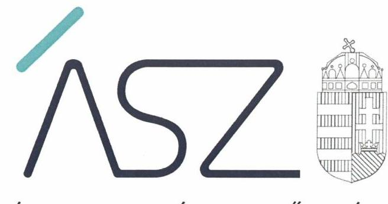
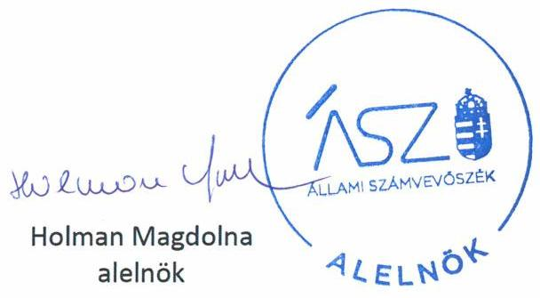

ÁLLAMI SZÁMVEVŐSZÉK

# JELENTÉS 

Pártok gazdálkodása

A költségvetési támogatásban részesülő pártok 2017-2018. évi gazdálkodása törvényességének ellenőrzése a Magyar Liberális Párt - Liberálisoknál
2021.

20168
www.asz.hu

---

ÁLLAMI SZÁMVEVŐSZÉK

# JELENTÉS 

## Pártok gazdálkodása

A költségvetési támogatásban részesülő pártok 2017-2018. évi gazdálkodása törvényességének ellenőrzése a Magyar Liberális Párt - Liberálisoknál
2021. 01. hó 15. nap

20168
www.asz.hu

---

|  J | AZ ELLENŐRZÉST FELÜGYELTE:  |
| --- | --- |
|   | DR. BENEDEK MÁRIA felügyeleti vezető  |
|   | AZ ELLENŐRZÉST VEZETTE ÉS A VÉGREHAJTÁSÁÉRT FELELŐS:  |
|   | DR. PELLEI TAMÁS ellenőrzésvezető  |
|   | A PROGRAM ÖSSZEÁLLÍTÁSÁÉRT FELELŐS:  |
|   | BERTALAN RUDOLF felelősvezető  |
|   | A TÉMÁHOZ KAPCSOLÓDÓ KORÁBBISZÁMVEVŐSZÉKI JELENTÉSEK:  |
|   | - címe: Jelentés a költségvetési támogatásban részesülő pártok 2015-2016. évi gazdálkodása törvényességének ellenőrzéséről a Magyar Liberális Párt - Liberálisoknál  |
|   | - sorszáma: 18017  |
|   | - címe: Jelentés a költségvetési támogatásban részesülő pártok 2013-2014. évi gazdálkodása törvényességének ellenőrzéséről a Magyar Liberális Párt  |
|   | - sorszáma: 16082  |
|   | IKTATÓSZÁM: EL-2836-006/2021.  |
|   | TÉMASZÁM: 2520  |
|   | ELLENŐRZÉS-AZONOSÍTÓ SZÁM: V086406  |

---

# TARTALOMJEGYZÉK 

- ÖSSZEGZÉS ..... 5
- AZ ELLENŐRZÉS CÉLJA ..... 7
- AZ ELLENŐRZÉS TERÜLETE ..... 8
- AZ ELLENŐRZÉS HÁTTERE, INDOKOLTSÁGA ..... 9
- A JELENTÉS LÉNYEGES KÉRDÉSKÖREI. ..... 10
- AZ ELLENŐRZÉS HATÓKÖRE ÉS MÓDSZEREI. ..... 11
- MEGÁLLAPÍTÁSOK ..... 13
- JAVASLATOK ..... 18
- MELLÉKLETEK. ..... 21
I. sz. melléklet: Fogalomtár. ..... 21
- FÜGGELÉK: ÉSZREVÉTELEK ..... 23
- RÖVIDÍTÉSEK JEGYZÉKE ..... 27

---

.

---

# ÖSSZEGZÉS 

A Magyar Liberális Párt-Liberálisok a 2017. évben a gazdálkodásának szabályozási környezetét nem a jogszabályi előírásoknak megfelelően alakította ki, nem teremtette meg a közpénzekkel való törvényes, átlátható gazdálkodás feltételeit. A 2017-2018. évi pénzügyi kimutatásait nem a jogszabályi előírások szerint készítette el, így azok nem biztosították a központi költségvetésből kapott támogatások felhasználásának átláthatóságát és elszámoltathatóságát. Ezáltal a 2017. és 2018. évekre vonatkozó pénzügyi kimutatások adatai nem mutattak megbízható képet, így ezekkel a közzétett pénzügyi kimutatásokkal a párt a nyilvánosságot és a saját tagságát is megtévesztette.

## Az ellenőrzés társadalmi indokoltsága

A pártok az állampolgárok egyesülési szabadsága alapján létrehozott olyan szervezetek, amelyek kereteket nyújtanak a népakarat kialakításához és kinyilvánításához, a politikai életben való állampolgári részvételhez.

A politikai élet tisztasága érdekében törvény állapítja meg a pártok vagyonára és gazdálkodására vonatkozó szabályokat. Az egyesülési jog alapján létrejövő más szervezetekhez képest szűkebb körben határozza meg azt a gazdasági tevékenységet, amelyet a párt végezhet, biztosítja azonban a pártok részére azt a jogosultságot, hogy az állami költségvetésből támogatásban részesüljenek. A pártok gazdálkodását a politikai élet tisztasága érdekében rendszeresen indokolt ellenőrizni, ezért törvényi előírás alapján az Állami Számvevőszék a költségvetési támogatást kapott pártok gazdálkodását kétévente ellenőrzi.

A pártokkal szembeni társadalmi elvárás a törvényt tisztelő, jogkövető magatartás, mivel a párt képviselői a jogállamiságot megtestesítő törvényhozó hatalom részei. Mindezekre tekintettel fokozott társadalmi veszélyességet hordoz egy párt elszámoltathatóságának hiánya, elszámolási kötelezettségének nem teljesítése.

## Főbb megállapítások, következtetések, javaslatok

A Magyar Liberális Párt - Liberálisok gazdálkodására vonatkozó belső szabályozási környezetét a 2017. évre vonatkozóan nem a jogszabályi előírások szerint alakította ki, így nem biztosította a szabályszerű működés és gazdálkodás feltételeit. A 2018. évre vonatkozóan gazdálkodására vonatkozó belső szabályozási környezetét a jogszabályi előírások alapján kialakította.

A Magyar Liberális Párt - Liberálisok a 2017-2018. évekre vonatkozó könyvviteli nyilvántartásait nem a jogszabály előírások szerint vezette. A szabályozási környezetével kapcsolatosan feltárt hiányosságok miatt a 2017. évben nem volt biztosított a könyvvezetésének és gazdálkodásának szabályszerűsége. A 2018. évben a központi költségvetésből kapott támogatásokat nem szabályszerűen tartotta nyilván, az egyéb támogatásokat, adományokat nem a jogszabály előírások szerint számolta el. Így a Magyar Liberális Párt - Liberálisok a közpénzekkel és az egyéb támogatásokkal nem gazdálkodott a nyilvánosság számára is átlátható módon.

A Magyar Liberális Párt - Liberálisok a jogszabályi előírások ellenére nem végezte el a részére nyújtott nem pénzbeli hozzájárulások értékelését, az ÁSZ felhívására sem élt az értékelés végrehajtása igazolásának lehetőségével. Az ellenőrzött időszakban két jogi személytől több tárgykörben szolgáltatást fogadott el. Ezeknek, a jogi személyek által nyújtott szolgáltatásoknak az értéke az ÁSZ által nem megállapítható.

A gazdálkodása során a személyi jellegű kifizetésekkel kapcsolatos adófizetési kötelezettségének nem tett eleget.
Mindezek alapján a Magyar Liberális Párt - Liberálisok a 2017. évi és a 2018. évi pénzügyi kimutatásait szabályszerű könyvvezetéssel nem támasztotta alá, a bevételeinek és a kiadásainak rögzítése során a teljesség és a következetesség, továbbá a valódiság elve nem érvényesült. Így az MLP pénzügyi kimutatásai alapján nem volt igazolt, hogy a felhasznált közpénzeket átláthatóan és a közélet tisztasága elvének figyelembevételével kezelte.

---

Az Állami Számvevőszék az intézkedések megtétele céljából a Magyar Liberális Párt - Liberálisok elnökének nyolc javaslatot fogalmazott meg.

---

# AZ ELLENŐRZÉS CÉLJA 

AZ ELLENŐRZÉS CÉLJA annak értékelése, hogy a Magyar Liberális Párt - Liberálisok által közzétett pénzügyi kimutatások a törvényi előírásoknak megfeleltek-e, a könyvvezetés és gazdálkodás során betartották-e a vonatkozó jogszabályi és belső előírásokat; a Magyar Liberális Párt - Liberálisok a működéséhez szabályszerűen igénybe vehető forrásokat használt-e fel.

---

# AZ ELLENŐRZÉS TERÜLETE 

## Magyar Liberális Párt - Liberálisok

A Magyar Liberális Párt - Liberálisok 2009. december 22-én létrejött olyan egyesület, amely nyilvántartott tagsággal rendelkezett és a nyilvántartásba vételét végző bíróság előtt kinyilvánította, hogy a Párttörvény ${ }^{1}$ rendelkezéseit magára nézve kötelezőnek ismeri el a Párttörvény 1. § -a alapján.

A Magyar Liberális Párt - Liberálisok legfőbb döntéshozó szerve a Küldöttgyűlés², az operatív működését az Ügyvivő Testület ${ }^{3}$ irányította, a Pénzügyi Ellenőrző Bizottság ${ }^{4}$ és a Jószolgálati és Etikai Bizottság ${ }^{5}$ támogatta. A Magyar Liberális Párt - Liberálisok az 2013. évi CLXXVII. törvény ${ }^{6}$ 11. § (1) bekezdésének előírásait figyelembe véve - a Ptk. ${ }^{7}$-val összefüggésben - a létesítő okiratának tartalmi felülvizsgálatát az ellenőrzött időszakban elvégezte.

A Magyar Liberális Párt - Liberálisok a 2014. évben alapította meg a Liberális Magyarországért Alapítványt és a kizárólagos tulajdonában lévő LI-CO Tudományszervező Kereskedelmi és Szolgáltató Kft-t⁸, amely veszteséges működése miatt - végelszámolási eljárás keretében - 2018 novemberében törlésre került.

A Magyar Liberális Párt - Liberálisok a 2017. évi pénzügyi kimutatásában 73785 ezer Ft bevételt, valamint 68151 ezer Ft kiadást számolt el. A 2018. évi pénzügyi kimutatása szerint az összes bevétele 35544 ezer Ft, a teljesített kiadások összege 35378 ezer Ft volt.

A Magyar Liberális Párt - Liberálisok által készített és a Magyar Közlöny mellékletét képező, Hivatalos Értesítő⁹ -ben közzétett pénzügyi kimutatásokban a párt a bevételek között a 2017. évben 70800 ezer Ft, a 2018. évben 29500 ezer Ft központi költségvetési támogatást mutatott ki.

---

# AZ ELLENŐRZÉS HÁTTERE, INDOKOLTSÁGA 

Az ÁSZ tv. ${ }^{10}$ 5. § (11) bekezdés a) pontja, valamint a Párttörvény 10. § (1) bekezdése alapján a pártok gazdálkodása törvényességének ellenőrzésére az ÁSZ ${ }^{11}$ jogosult. Törvényi előírás alapján az ÁSZ kétévente ellenőrzi azoknak a pártoknak a gazdálkodását, amelyek rendszeres költségvetési támogatásban részesültek.

Az ÁSZ legutóbb a Magyar Liberális Párt - Liberálisok 2015-2016. évi gazdálkodásának törvényességét ellenőrizte.

A gazdálkodás szabályszerűségének, a felhasznált közpénzek nagyságának bemutatásával a társadalom objektív képet alkothat a pártok működéséről. Az ellenőrzés megállapításai a gazdálkodás megfelelőségének bemutatásával elősegíthetik, hogy a törvényalkotók konkrét lépéseket tegyenek a pártok finanszírozására vonatkozó szabályozások megváltoztatása, átláthatóbbá, ellenőrizhetőbbé tétele irányába. Az ellenőrzés rámutat a pártok gazdálkodásával kapcsolatos jó gyakorlatokra és szabálytalanságokra. A hiányosságok, szabálytalanságok feltárása, az ennek kapcsán megfogalmazott megállapítások elősegíthetik a törvényi rendelkezések megsértésének szankcionálását.

---

# A JELENTÉS LÉNYEGES KÉRDÉSKÖREI 

1- A Magyar Liberális Párt - Liberálisok kialakította-e a gazdálkodás szabályozási kereteit?
2. A Magyar Liberális Párt - Liberálisok könyvvezetése és gazdálkodása szabályszerű volt-e?
3. A Magyar Liberális Párt - Liberálisok pénzügyi kimutatása megfelelte a jogszabályi előírásoknak, közzétételi kötelezettségét szabályszerűen teljesítette-e?

---

# AZ ELLENŐRZÉS HATÓKÖRE ÉS MÓDSZEREI 

## Az ellenőrzés típusa

Szabályszerűségi ellenőrzés.

## Az ellenőrzött időszak

2017-2018. évek.

## Az ellenőrzés tárgya

A Magyar Liberális Párt - Liberálisok ellenőrzése során az ellenőrzés tárgyát képezte a 2017. és a 2018. évre vonatkozó pénzügyi kimutatás elkészítésére, jóváhagyására, közzétételére, a párt könyvvezetésére, gazdálkodására, ennek keretében a számviteli szabályozás kialakítására, a bizonylati rend, bizonylati fegyelem betartására, egyéb gazdálkodási, ellenőrzési és pénzügyi-számviteli informatikai feladatok ellátására irányuló tevékenységek. Az ellenőrzés tárgya volt még a források elszámolása és felhasználása, valamint a vagyon jogszabályi előírásoknak megfelelő hasznosítása.

Az ellenőrzés kiterjedt minden olyan körülményre és adatra, amely az ÁSZ jogszabályban meghatározott feladatainak teljesítéséhez, valamint a program végrehajtása folyamán felmerült újabb összefüggések feltárásához szükséges volt.

## Az ellenőrzött szervezet

Magyar Liberális Párt - Liberálisok

## Az ellenőrzés jogalapja

Az ellenőrzés jogalapját az ÁSZ tv. 5. § (11) bekezdés a) pontja, a Párttörvény 4. § (4)-(5) bekezdései, valamint 10. § (1), (3)-(4) bekezdései képezték.

## Az ellenőrzés módszerei

Az ÁSZ ellenőrzésére az ellenőrzési program szempontjai, az ellenőrzött időszakban hatályos jogszabályok, az ellenőrzés általános szakmai szabá-

---

lyai, az ellenőrzésre irányadó ÁSZ módszertanok figyelembevételével került sor. A közpénzekkel való felelős gazdálkodás segítésére irányuló javaslatok kidolgozásakor a hatályos jogszabályok irányadóak.

Az ellenőrzés ideje alatt a Magyar Liberális Párt - Liberálisokkal történő kapcsolattartást az ÁSZ SZMSZ ${ }^{12}$-ének vonatkozó előírásai alapján biztosította az ÁSZ.

Az ellenőrzés céljának eléréséhez szükséges bizonyítékok megszerzése a Magyar Liberális Párt - Liberálisok által rendelkezésre bocsátott dokumentumokra, adatokra alapozva közvetlen, részletes elemzés, megfigyelés, szemrevételezés, információkérés, megerősítés, valamint elemző eljárás útján történt. Az ellenőrzési bizonyítékként felhasználható adatforrások közé tartoztak egyrészt az ellenőrzési program részletes szempontjainál felsorolt adatforrások, másrészt minden egyéb - az ellenőrzés folyamán feltárt, az ellenőrzés szempontjából információt tartalmazó - dokumentum.

Az ellenőrzés lefolytatásához a Magyar Liberális Párt - Liberálisok az ÁSZ által kért dokumentumok megküldésével szolgáltatott adatokat, amelyek valódiságát és teljes körűségét a Magyar Liberális Párt - Liberálisok vezetője által tett teljességi és hitelességi nyilatkozatnak kellett igazolnia. A rendelkezésre bocsátott adatok, információk kontrollja az ellenőrzés keretében történt.

Az ÁSZ a tételes ellenőrzés mellett statisztikai alapú mintavételezést és értékelést alkalmazott. A minták kiválasztása rétegzett mintavételezéssel történt. A hozzájárulások, adományok és egyéb bevételek, valamint a személyi juttatások (működési kiadáson belül), eszközbeszerzések és a működési kiadások további tételei, politikai tevékenység kiadásai, egyéb kiadások mintatételeinek értékelése „szabályszerű", ha a minta ellenőrzésének eredménye alapján 95\%-os bizonyossággal a teljes sokaságban az átlagos hibaarány nem haladta meg a 10\%-ot, „nem szabályszerű, ha nagyobb volt, mint 10\%. Abban az esetben, ha a teljes sokaság tekintetében a 10\%-os hibaarányhoz való viszony megítélésének megbízhatósága nem érte el a
 95%-ot, annak elérése érdekében az értékelés további szempontokkal egészült ki, a feltárt hibák értéke is figyelembe vételre került.

---

# 1. A Magyar Liberális Párt - Liberálisok kialakította-e a gazdálkodás szabályozási kereteit? 

Összegző megállapítás

A Magyar Liberális Párt - Liberálisok gazdálkodásának szabályozási kereteit a 2017. évben nem szabályszerűen alakította ki, a 2018. évben a jogszabályi előírások figyelembevételével kialakította.

Az MLP ${ }^{13}$ a Számv.tv. ${ }^{14}$ előírása alapján rendelkezett Számviteli politika ${ }_{1,2}{ }^{15}$-vel, melynek keretében elkészítette a Leltározási szabályzat ${ }^{16}$-t, az Értékelési szabályzat ${ }_{1,2}{ }^{17}$-t és a Pénzkezelési szabályzat ${ }_{1,2}{ }^{18}$-t, továbbá a Számv. tv. előírásai alapján elkészítette a Számlarend ${ }_{1,2}{ }^{19}$-t.

A 2017. évben az MLP gazdálkodására vonatkozó számviteli keretek kialakítása nem felelt meg a jogszabályi előírásoknak, mert:
$\longrightarrow$ a Számv. tv. 14. § (4) bekezdésben foglaltak ellenére a Számviteli politika ${ }_{1}$ keretében írásban nem rögzítette azokat a szabályokat, előírásokat, amelyekkel meghatározza, hogy mit tekint a számviteli elszámolás és az értékelés szempontjából nem lényegesnek, nem jelentősnek,
$\longrightarrow$ a Pénzkezelési szabályzat ${ }_{1}$ a Számv.tv. 14. § (8) bekezdésben foglaltak ellenére nem tartalmazta a készpénzállomány ellenőrzésére vonatkozó eljárásrendet, valamint az ellenőrzések gyakoriságát,
$\longrightarrow$ az MLP az Értékelési szabályzat ${ }_{1}$ VI. fejezetében rögzítette, hogy a kapott nem pénzbeli hozzájárulások vagyoni értékét a könyvelésében nem szerepelteti, amely rendelkezés ellentétes a Számv. tv. 77. § (3) bekezdés n) pontjában előírtakkal,
$\longrightarrow$ az MLP az Alapszabály ${ }_{1}$-ben ${ }^{20}$ bevételi jogcímként rögzítette a jogi személyek, jogi személyiség nélküli gazdasági társaságok vagyoni hozzájárulásait, amelyek a Párttörvény 4. § (2) bekezdésében rögzítettek szerint tiltott forrásokból származó vagyoni hozzájárulásnak minősülnek,
$\longrightarrow$ az MLP az Alapszabály ${ }_{1}$-ben és a Számviteli politika ${ }_{1,2}$-ben a Párttörvény 4. § (3) bekezdésében foglalt előírás alapján nem zárta ki a külföldi szervezettől és a nem magyar állampolgár természetes személytől a vagyoni hozzájárulás elfogadását,
$\longrightarrow$ a Számlarend ${ }_{1}$ a Számv. tv. 161. § (2) bekezdés b) pontjában előírtak ellenére nem tartalmazta minden alkalmazásra kijelölt számla vonatkozásában a számla értéke növekedésének, csökkenésének jogcímeit, a számlát érintő gazdasági eseményeket, illetve azok más számlákkal való kapcsolatát.
A 2018. március 22-étől hatályos Számviteli politika ${ }_{2}$-át, Pénzkezelési szabályzat ${ }_{2}$-ot az MLP a Számv. tv. előírása szerint alakította ki. Az Értékelési szabályzat ${ }_{2}$-ben az MLP a nem pénzbeli vagyoni hozzájárulások tekintetében a Számv. tv. által meghatározott elszámolási kötelezettségét, va-

---

lamint a Párttörvény 4. § (5) bekezdés alapján a nem pénzbeli vagyoni hozzájárulás értékének meghatározásával kapcsolatos szabályokat rögzítette. Az Alapszabály ${ }_{2}{ }^{21}$ és 2018. március 22-étől a Pénzbeli hozzájárulások eljárásrend ${ }^{22}$ a Párttörvény előírásának megfelelően tartalmazta az MLP bevételi jogcímeit.

A 2018. évben hatályos Számlarend ${ }_{2}$ a Számv. tv. 161. § (2) bekezdés b) pontjában előírtak ellenére továbbra sem tartalmazta minden alkalmazásra kijelölt számla vonatkozásában a számla értéke növekedésének, csökkenésének jogcímeit, a számlát érintő gazdasági eseményeket, illetve azok más számlákkal való kapcsolatát.

# 2. A Magyar Liberális Párt - Liberálisok könyvvezetése és gazdálkodása szabályszerű volt-e? 

Összegző megállapítás

Az MLP a 2017. és 2018. években a költségvetési támogatásokkal és az egyéb hozzájárulásokkal, adományokkal kapcsolatos nyilvántartási kötelezettségét nem szabályszerűen teljesítette. Az MLP gazdálkodása nem volt szabályszerű.
2.1. számú megállapítás

Az MLP a 2017. évi könyvvezetése és gazdálkodása nem volt szabályszerű.
Az MLP a 2017. évben - az 1. pont 2. bekezdésében részletesen kifejtettek alapján - nem a jogszabályi előírások szerint alakította ki gazdálkodásának számviteli kereteit, így a belső szabályzatai nem biztosították a központi költségvetésből kapott támogatások és az egyéb hozzájárulások, adományok szabályszerű nyilvántartását, valamint az MLP könyvvezetésének és gazdálkodásának szabályszerűségét.
2.2. számú megállapítás

Az MLP a 2018. évben a központi költségvetésből kiutalt támogatásokkal, az egyéb támogatásokkal, adományokkal kapcsolatos elszámolási, könyvvezetési kötelezettségét nem szabályszerűen teljesítette.

Az MLP a 2018. évben a zárszámadási törvény szerint 23600 ezer Ft központi költségvetési támogatásban részesült, ennek ellenére a 2018. évi könyvviteli nyilvántartásában költségvetési támogatásból származó bevételként 29500 ezer Ft-ot számolt el. Az MLP a ténylegesen kiutalt és a könyveiben bevételként elszámolt költségvetési támogatás közötti 5900 ezer Ft-os különbözet összegét a Számv. tv. 165. § (2) bekezdésében foglalt előírás ellenére bizonylattal nem támasztotta alá, és egyéb ráfordításként is kimutatta.

A 2018. évben a központi költségvetési támogatások számviteli elszámolását közvetlenül alátámasztó bankbizonylatokon a Számv. tv. 167. § (1) bekezdés h) pontjában foglaltak ellenére nem került feltüntetésre az érintett főkönyvi számlákra történő hivatkozás.

Az MLP a 2018. évben a Párttörvény 4. § (1) bekezdésének előírása szerint egyéni vállalkozóktól - megbízási szerződés alapján - 0,5 millió Ft nem pénzbeli vagyon hozzájárulást kapott térítésmenetes könyvelési számviteli feladatok ellátása formájában, továbbá 0,6 millió Ft nem pénzbeli vagyon

---

# 2.3. számú megállapítás 

hozzájárulást kapott kedvezményes tanácsadási, szervezési szolgáltatás formájában. Az MLP a nem pénzbeli vagyoni hozzájárulás értékét a Számv. tv. 77. § (3) bekezdés n) pontjában foglaltak ellenére egyéb bevételként nem számolta el.

## Az MLP 2018. évi gazdálkodása nem volt szabályszerű.

A Párttörvény 4. § (2) bekezdése értelmében a pártok jogi személyektől vagyoni hozzájárulást nem fogadhatnak el. A Párttörvény 4. § (5) bekezdése szerint, ha a párt részére a vagyoni hozzájárulást nem pénzben nyújtották, köteles annak értékeléséről (értékének meghatározásáról) gondoskodni.

Az ÁSZ levélben tájékoztatta a MLP elnökét, hogy a Párttörvény 4. § (5) bekezdésében kötelezően előírt nem pénzbeli hozzájárulások értékelését, értékének meghatározását nem végezte el. Felmerült valamint annak a gyanúja, hogy az MLP a Párttörvény 4. §. (2) bekezdésében foglaltakat megsértve, tiltott támogatást fogadhatott el.

A fent hivatkozott levélben megfogalmazásra került, hogy az MLP gazdálkodása törvényessége biztosításának igazolására az ÁSZ számára bemutatott dokumentumok (szerződések) alapján elfogadott nem pénzbeli vagyoni hozzájárulás párt általi értékelését az azt alátámasztó dokumentumokkal igazolja.

Az MLP elnöke által küldött válaszlevélben foglaltak alapján az MLP az általa elfogadott nem pénzbeli vagyoni hozzájárulás értékelését az ellenőrzött időszakban nem végezte el.

Az MLP a Párttörvény 4. § (5) bekezdésében és az Értékelési szabályzat ${ }_{2}$ VI. pontjában rögzítettek ellenére ismétlődően nem gondoskodott a részére nyújtott nem pénzbeli hozzájárulások értékeléséről. Az ÁSZ felhívására sem élt az értékelés végrehajtása igazolásának lehetőségével.

Az MLP által az ÁSZ rendelkezésére bocsátott dokumentumok alapján az ellenőrzött időszakban egy jogi személytől ingatlan bérlet formájában fogadott el szolgáltatást, egy másik jogi személytől többek között az MLP adóbevallásainak elkészítése, adatszolgáltatási kötelezettségek teljesítése, analitikák vezetése, valamint számviteli, pénzügyi szabályzatok elkészítése tárgykörben fogadott el szolgáltatásokat, melyeknek az értéke az ÁSZ által nem megállapítható.

Az MLP a 2018. évben az Szja tv. ${ }^{23} 70$ § (5) bekezdésének c) pontjában meghatározott hivatali telefonszolgáltatás magáncélú használata címén keletkezett, az Szja tv. 69. § (2) bekezdése szerinti adóköteles jövedelem után, mint a kifizetőt terhelő adófizetési kötelezettségének nem tett eleget.

Az MLP az Szja tv. 3. számú melléklet IV. fejezet 4. pontjában foglaltak ellenére a párt által bérelt hivatali célú gépjárműhasználattal kapcsolatban - csak saját tulajdonú személygépkocsi esetén elszámolható - $15 \mathrm{Ft} / \mathrm{km}$ személygépkocsi-normaköltséget fizetett ki magánszemélyek részére. A költségtérítések pénztári kifizetési bizonylatai a Számv. tv. 167. § (1) bekezdés c) pontjában foglaltak ellenére nem tartalmazták a pénz átvevőjének és a pénztárellenőrnek az aláírását. A bérelt személygépkocsival kapcsolatos üzemanyag költséget a Számv. tv. 78. § (2) bekezdésében foglaltakkal ellentétesen személyi jellegű kifizetésként elszámolták és a magánszemély részére kifizették.

---

Az MLP 2018. évben a Bizonylati rend III. 1. pontjában és a Számv. tv. 167. § (1) bekezdés c), h) és i) pontjaiban foglaltak ellenére a személyi jellegű kifizetések könyvviteli elszámolását és az egyéb szervezetnek nyújtott támogatás elszámolását alátámasztó bizonylatok nem tartalmazták az utalványozó aláírását, az érintett könyvviteli számlákra történő hivatkozást és a könyvviteli nyilvántartásban történt rögzítés időpontját, továbbá az egyéb bevételek elszámolását közvetlenül alátámasztó bankbizonylatokon sem tüntette fel a könyvviteli nyilvántartásokba történt rögzítés időpontját, c), és h) pontjaiban foglaltak ellenére a működési és a politikai tevékenység kiadásainak könyvviteli elszámolását alátámasztó készpénzes bizonylatok nem tartalmazták az átvevő, valamint a szervezettől függően az ellenőr aláírását, illetve az érintett könyvviteli számlákra történő hivatkozást.
Az MLP a 2018. évben a Számv.tv. 69. § (1) bekezdésében és a Leltározási szabályzat I. 2.1 pontjában foglaltak ellenére az üzleti év zárásához nem állított össze leltárt, amely tételesen, ellenőrizhető módon tartalmazta a mérleg fordulónapján meglévő valamennyi eszközét és forrását mennyiségben és értékben. A tárgyi eszközök és a készpénz állományát mennyiségi felvétellel megállapította.

# 3. A Magyar Liberális Párt - Liberálisok pénzügyi kimutatása megfelelte a jogszabályi előírásoknak, közzétételi kötelezettségét szabályszerűen teljesítette-e? 

Összegző megállapítás

Az MLP 2017-2018. évi pénzügyi kimutatása nem felelt meg a jogszabályi előírásoknak, közzétételi kötelezettségét határidőben teljesítette.

### 3.1. számú megállapítás

Az MLP 2017-2018. évi pénzügyi kimutatásait nem a jogszabályi előírások szerint készítette el.

A 2017. évi pénzügyi kimutatásban a Számviteli politika ${ }_{1,2}$ IV. fejezet IV. 1. pontjában előírtak ellenére az MLP egyéb kiadások jogcímen - a Társaság részére - a 2017. évben kifizetett pótbefizetés 1300 ezer Ft-os és a tulajdonosi hozzájárulás 1000 ezer Ft-os összegét nem szerepeltette.

Az MLP a 2017. évi és a 2018. évi pénzügyi kimutatásának adatait a Számv.tv. 4. § (1) bekezdésének előírása ellenére szabályszerű könyvvezetéssel nem támasztotta alá, mert
a 2.1. pontban kifejtettek alapján a belső szabályzások nem biztosították a számviteli nyilvántartások szabályszerű vezetését, ezáltal a 2017. évi pénzügyi kimutatás megalapozottságát,
a 2018. évi pénzügyi kimutatásában olyan bevételeket és kiadásokat szerepeltetett, amelyeket gazdálkodása során - a 2.2. és 2.3. pontokban kifejtettek alapján - nem szabályszerűen számolt el. Ezáltal a könyvvezetése nem támasztotta alá a Párttörvényben meghatározott pénzügyi kimutatásban rögzített adatokat.

---

# 3.2. számú megállapítás 

Az MLP a 2017-2018. évekre vonatkozó pénzügyi kimutatásának közzétételét határidőben teljesítette.

A 2017-2018. évekre vonatkozó, nem szabályszerűen elkészített pénzügyi kimutatásait az MLP a Párttörvény előírásának megfelelően a tárgyévet követő év május 31-ig a Hivatalos Értesítőben és a saját honlapján ${ }^{24}$ határidőben közzétette.

---

# JAVASLATOK 

Az ÁSZ tv. 33. § (1) bekezdésében foglaltak értelmében az ellenőrzött szervezet vezetője köteles a jelentésben foglalt megállapításokhoz kapcsolódó intézkedési tervet összeállítani és azt a jelentés kézhezvételétől számított 30 napon belül az ÁSZ részére megküldeni. Amennyiben az ellenőrzött szervezet vezetője nem küldi meg határidőben az intézkedési tervet, vagy továbbra sem elfogadható intézkedési tervet küld, az Állami Számvevőszék elnöke az ÁSZ tv. 33. § (3) bekezdés a) és b) pontjaiban foglaltakat érvényesítheti.

## Az MLP Elnökének

1. Intézkedjen a Számv. tv. előírásának megfelelően arról, hogy a számlarend minden alkalmazásra kijelölt számla értéke növekedésének, csökkenésének jogcímeit, a számlát érintő gazdasági eseményeket, azok más számlákkal való kapcsolatát tartalmazza.
2.
 számú megállapítás 5. bekezdése alapján)
3. Intézkedjen arról, hogy a Számv. tv. előírásának megfelelően az adatokat a számviteli (könyvviteli) nyilvántartásokba bizonylat alapján jegyezzék be.
2.2. számú megállapítás 1. bekezdése alapján)
4. Intézkedjen a Számv. tv. előírása alapján a számviteli elszámolást közvetlenül alátámasztó bizonylatokon az érintett főkönyvi számlákra történő hivatkozás feltüntetéséről.
2.2. számú megállapítás 2. bekezdése alapján)
5. Intézkedjen a Számv. tv. előírása alapján a nem pénzbeli vagyoni hozzájárulás értékének egyéb bevételként való elszámolásáról.
2.2. számú megállapítás 3. bekezdés alapján)
6. Intézkedjen az Szja. tv. előírása alapján a telefonszolgáltatás magáncélú használata címén keletkezett adóköteles jövedelem után az MLP-t, mint kifizetőt terhelő adó megfizetéséről.
2.3. számú megállapítás 7. bekezdés alapján)
7. Intézkedjen a jövőre vonatkozóan az MLP által bérelt gépkocsi használattal összefüggő üzemanyag költség Számv. tv. előírásának megfelelő elszámolásáról.
2.3. számú megállapítás 8. bekezdés 3. mondata alapján)

---

7. Intézkedjen a jövőre vonatkozóan a Számv. tv. és a Bizonylati rend előírásának megfelelően
a) a személyi jellegű kifizetések könyvviteli elszámolását és az egyéb szervezetnek nyújtott támogatás elszámolását alátámasztó bizonylatokon az utalványozó aláírása, az érintett könyvviteli számlákra történő hivatkozás, és a könyvviteli nyilvántartásban történt rögzítés időpontja szerepeltetéséről, továbbá az egyéb bevételek elszámolását közvetlenül alátámasztó bizonylatokon a könyvviteli nyilvántartásban történt rögzítés időpontja szerepeltetéséről.
b) a működési és a politikai tevékenység kiadásainak könyvviteli elszámolását alátámasztó készpénzes bizonylatokon az átvevő és - a szervezettől függően - az ellenőr aláírása, valamint az érintett könyvviteli számlákra történő hivatkozás szerepeltetéséről.
(2.3. számú megállapítás 9. bekezdése alapján)
8. Intézkedjen a Számv. tv., valamint a Leltározási szabályzat előírása alapján az üzleti év zárásához olyan leltár összeállításáról, amely tételesen, ellenőrizhető módon tartalmazza a mérleg fordulónapján meglévő valamennyi eszközét és forrását mennyiségben és értékben.
2.3. számú megállapítás 10. bekezdés 1. mondata alapján)

---

.

---

# MELLÉKLETEK 

I. SZ. MELLÉKLET: FOGALOMTÁR
pénzügyi kimutatás
költségvetési támogatás
nem pénzbeli támogatás

A Párttörvény 9. § (1) bekezdésében meghatározott, a törvény 1. számú melléklete szerinti pénzügyi kimutatás (hatályos 2014. május 6-ától), amelyet a pártok kötelesek minden év május 31-ig a Magyar Közlönyben, valamint saját honlappal rendelkező pártok a honlapjukon is közzétenni.
Az államháztartás alrendszerei terhére nyújtott pénzbeli vagy nem pénzbeli juttatás, amelyet a támogató nem elsősorban ellenszolgáltatás ellenében, de konkrét program megvalósítása vagy meghatározott időszakban a támogatott szervezet működtetése érdekében nyújt. (Civil tv. 2. § 15. pont)
Vagyoni értékkel rendelkező forgalomképes dolog, szellemi alkotás, illetve vagyoni értékű jog részben vagy egészében, véglegesen vagy ideiglenesen, teljesen vagy részben ingyenesen történő átruházása vagy átengedése, illetve szolgáltatás biztosítása. (Civiltv. 2. § 25. pont)

---

.

---

# FÜGGELÉK: ÉSZREVÉTELEK 

A jelentéstervezetet a Számvevőszék 15 napos észrevételezésre megküldte az ellenőrzött szervezet vezetőjének az ÁSZ tv. 29. § (1) bekezdése előírásának megfelelően.

A Magyar Liberális Párt - Liberálisok elnöke a jelentéstervezet megállapításaira észrevételt tett. Az ÁSZ tv. 29. § (3) bekezdésével összhangban az ÁSZ a Függelékben feltünteti a jelentéstervezet megállapításaival kapcsolatban tett, figyelembe nem vett észrevételeket, és megindokolja, hogy azokat miért nem fogadta el.

1. A Magyar Liberális Párt - Liberálisok (továbbiakban: MLP) elnöke észrevételt tett a számvevőszéki jelentéstervezet 2.2. sz. megállapítás 1. bekezdésében foglaltakra, mely szerint az MLP a ténylegesen kiutalt és a könyveiben bevételként elszámolt költségvetési támogatás közötti 5900 ezer Ft-os különbözet összegét a Számvitelről szóló 2000. évi C. törvény (továbbiakban: Számv. tv.) 165. § (2) bekezdésében foglalt előírás ellenére bizonylattal nem támasztotta alá, és egyéb ráfordításként is kimutatta.
Az Állami Számvevőszék (továbbiakban: ÁSZ) az ellenőrzési megállapításait az ellenőrzéshez kapcsolódó adatszolgáltatás során a részére törvényi határidőben rendelkezésre bocsátott dokumentumokra alapozva teszi meg. Az MLP által az adatszolgáltatásra biztosított határidőben rendelkezésre bocsátott dokumentumok felülvizsgálata során az ÁSZ az alábbiakat állapította meg.
Az EL-1648-002/2019 iktatószámú adatbekérő levél 2. sz. melléklet 2. pontjában az ÁSZ a Magyar Közlönyben közzétett, a 2017. és 2018. évekre vonatkozó, a pártok működéséről és gazdálkodásáról szóló 1989. évi XXXIII. törvény (továbbiakban: Párttörvény) 9. § (1) bekezdése szerinti pénzügyi kimutatásokat kérte a tárgyi ellenőrzéshez megküldeni. Az MLP által megküldött „kimutatas_2018.pdf" dokumentum (2019. szeptember 03-i keltezésű Teljességi és hitelességi nyilatkozat 12. sora) Bevételek 2. sora 29500 ezer Ft központi költségvetésből származó támogatás bevételt tartalmaz.
A Párttörvény 5. § (2) bekezdése alapján az MLP a 2018. évben költségvetési támogatásra volt jogosult. A Párttörvény 5. § (4) bekezdése szerint a pártok támogatására fordítandó összeget a központi költségvetésről szóló törvény állapítja meg. A támogatások kifizetése negyedévenként történik, a negyedév első napján. A költségvetési támogatás összege a Magyarország 2018. évi központi költségvetéséről szóló 2017. évi C. törvény (továbbiakban: 2018. évi költségvetési törvény) eredeti előirányzata szerint 70800 ezer Ft volt. Az országgyűlési képviselők 2018. évi általános választása eredményének megfelelően - a 2018. évi költségvetési törvény 45. § (1)-(2) bekezdéseiben biztosított jogkörében eljárva - a Kormány az 1247/2018. (V.25.) Korm. határozatban módosította az MLP-t megillető 2018. évi támogatás mértékét. A módosított előirányzat szerint az MLP-nek a 2018. évben 29500 ezer Ft központi költségvetési támogatás járt. Az MLP a 2018. évben a Magyarország 2018. évi központi költségvetéséről szóló 2017. évi C.
[^0]
[^0]:    * 29. § (1) Az Állami Számvevőszék az ellenőrzési megállapításait megküldi az ellenőrzött szervezet vezetőjének vagy az általa megbízott személynek, és annak, akinek személyes felelősségét állapította meg.
    (2) Az ellenőrzött szervezet vezetője és a felelősként megjelölt személy az ellenőrzés megállapításaira tizenöt napon belül írásban észrevételt tehet.
    (3) Az Állami Számvevőszék az észrevételre a beérkezésétől számított harminc napon belül írásban válaszol. A figyelembe nem vett észrevételeket köteles a jelentésben feltüntetni, és megindokolni, hogy azokat miért nem fogadta el.

---

törvény végrehajtásáról szóló 2019. évi LXXIX. törvény 1. mellékletében foglaltak szerint 23600 ezer Ft központi költségvetési támogatásban részesült.
Az MLP a Számviteli politika 2 III/1. pontjában előírta, hogy a bankszámla forgalom bizonylatait a bankszámlakivonat könyvelés részére történő átadását követően kell a könyvelésben rögzíteni.
A fent leírtak ellenére az MLP a 2018. évi pénzügyi kimutatásban a „Központi költségvetésből származó támogatás" jogcímen a 2018. évi költségvetési törvény módosított előirányzatát (29 500 ezer Ft) és nem a tényleges bevételét (23 600 ezer Ft) mutatta ki.
Az MLP az észrevételében rögzítette, hogy „... a törvény értelmében az utolsó, 5. havi 5900 ezer Ft-os támogatás már nem került kiutalásra a Párt részére, az automatikusan elszámolásra került az ÁSZ által megállapított tiltott vagyoni hozzájárulás terhére. ...megkeresésünkre az Államkincstár csak szóbeli tájékoztatást adott, viszont bizonylatot sem ők, sem az ÁSZ, sem a NAV nem küldött a Párt részére....". Egyidejűleg az MLP észrevételében hivatkozott „BE-20189.pdf" elnevezésű fájlban az ÁSZ részére megküldött nyilatkozat is arról szól, hogy a könyvelésben bevételként kimutatott összeg nem jelenik meg a bankszámlakivonatokon. Mindezek alapján az MLP is megerősítette és nem vitatta az ÁSZ megállapítását, mely szerint az MLP a ténylegesen kiutalt 23600 ezer Ft és a könyveiben bevételként elszámolt 29500 ezer Ft költségvetési támogatás közötti 5900 ezer Ft-os különbözet összegét a Számv. tv. 165. § (2) bekezdésében foglalt előírás ellenére bizonylattal nem támasztotta alá.
Mindezek alapján - a MÁK a Párttörvény tv. 4. § (4) bekezdése szerinti joghátrány utolsó fordulatához kapcsolódóan csökkentette az elfogadott vagyoni hozzájárulás értékét kitevő összeggel a pártközponti költségvetésből juttatott támogatását - az MLP elnöke által kifogásolt 5900 ezer Ft nem volt a párt tényleges bevétele, annak bevételként való kimutatása nem megalapozott.
Az MLP észrevételében a jelen ellenőrzött időszakon kívüli, a 2015-2016. években fennálló banki hitel törlesztésével történő összehasonlítás nem releváns az észrevétellel érintett tárgyi ÁSZ megállapítás vonatkozásában. Hangsúlyozni indokolt: attól, hogy a 2015-2016. évek során a költségvetési támogatás egy részét a MÁK - a pénzintézet és a MÁK megállapodása értelmében - a banknak utalta közvetlenül a párt által felvett hiteltörlesztésére, attól a támogatás teljes összege a párt tényleges bevétele volt, melynek meg kellett volna jelennie a párt könyvvezetésében.
A fent leírtak alapján az ÁSZ az MLP észrevételét nem veszi figyelembe, a számvevőszéki jelentéstervezetben szereplő 2.2. sz. megállapítás 1. bekezdése és az MLP elnökének címzett 2. javaslat módosítása nem indokolt.
2. Az MLP elnöke észrevételt tett a jelentéstervezet 2.2. sz. megállapítás 2. bekezdésében foglaltakra, mely szerint a 2018. évben a központi költségvetési támogatások számviteli elszámolását közvetlenül alátámasztó bankbizonylatokon a Számv. tv. 167. § (1) bekezdés h) pontjában foglaltak ellenére nem került feltüntetésre az érintett főkönyvi számlákra történő hivatkozás.
Az ÁSZ az ellenőrzési megállapításait az ellenőrzéshez kapcsolódó adatszolgáltatás során a részére törvényi határidőben rendelkezésre bocsátott dokumentumokra alapozva teszi meg.
Az ÁSZ a 2017. évre vonatkozóan az MLP gazdálkodása törvényessége ellenőrizése során az alábbi megállapítást tette:
Az MLP a 2017. évben - a számvevőszéki jelentéstervezet 1. pont 2. bekezdésében részletesen kifejtettek alapján - nem a jogszabályi előírások szerint alakította ki gazdálkodásának számviteli kereteit, így a belső szabályzatai nem biztosították a központi költségvetésből kapott támogatások és az egyéb hozzájárulások, adományok szabályszerű nyilvántartását, valamint az MLP könyvvezetésének és gazdálkodásának szabályszerűségét. Így az ÁSZ a 2017. évre vonatkozóan az MLP könyvvezetését és gazdálkodását nem szabályszerűnek minősítette.
Az ÁSZ az EL-1648-028/2019 iktatószámú adatbekérő levél 2/A. sz. melléklet Központi költségvetésből származó támogatások pontjában 2018. év vonatkozásában három mintatételhez kapcsolódó dokumentumot kérte beküldeni. Az MLP által az adatszolgáltatásra biztosított határidőben rendelkezésre bocsátott dokumentumok felülvizsgálata során az ÁSZ az alábbiakat állapította meg.
A BE-2018-7 és a BE-2018-8 azonosítójú mintatételek - bankbizonylatok - esetében (2019. november 05-i keltezésű Teljességi és hitelességi nyilatkozat 1.1.1.7.1. és 1.1.1.8.1. sorai) a Számv. tv. 167. § (1) bekezdés h) pontjában foglaltak ellenére a költségvetési bevételek könyvviteli elszámolást közvetlenül alátámasztó bizonylatok nem tartalmazták az

---

érintett főkönyvi számlákra történő hivatkozást. A BE-2018-7, BE-2018-8 azonosítójú mintatételek bankszámlakivonatain az érintett könyvviteli számlák közül csak a K(követel) 9672 bevételi főkönyvi számlaszám került feltüntetésre, az ellenszámla - az érintett elszámolási betétszámla T(tartozik) 38...főkönyvi számlaszáma - nem került feltüntetésre. A fent leírtak alapján az ÁSZ az MLP észrevételét nem veszi figyelembe, a számvevőszéki jelentéstervezetben szereplő 2.2. sz. megállapítás 2. bekezdése és az MLP elnökének címzett 3. javaslat módosítása nem indokolt.
3. Az MLP elnöke észrevételt tett a jelentéstervezet 2.2 sz. megállapítás 3. bekezdésében foglaltakra, amelyben az ÁSZ megállapította, hogy az MLP a 2018. évben a Párttörvény 4. § (1) bekezdésének előírása szerint egyéni vállalkozóktól - megbízási szerződés alapján - 500 ezer Ft nem pénzbeli vagyon hozzájárulást kapott térítésmenetes könyvelési számviteli feladatok ellátása formájában, továbbá 600 ezer Ft nem pénzbeli vagyon hozzájárulást kapott kedvezményes tanácsadási, szervezési szolgáltatás formájában. Az MLP a nem pénzbeli vagyoni hozzájárulás értékét a Számv. tv. 77. § (3) bekezdés n) pontjában foglaltak ellenére
 egyéb bevételként nem számolta el.
A 2017. augusztus 29. napján kelt „Módszertani útmutató az Állami Számvevőszék ellenőrzései során felhasználandó bizonyítékokról" című, nyilvános módszertani útmutatóban foglaltak alapján: „1. Az ÁSZ által felhasznált bizonyítékok: ... az ÁSZ által az ellenőrzött szervezettől az adatbekérés során bekért hiteles adatok és dokumentumok .... Az ellenőrzött szervezettől beszerzett adatok hitelességét és a dokumentumok meglétét az ellenőrzött által kiállított teljességi és hitelességi nyilatkozat garantálja."
Az MLP által az adatszolgáltatásra biztosított határidőben rendelkezésére bocsátott dokumentumok felülvizsgálata során az ÁSZ az alábbiakat állapította meg.
Az ÁSZ az EL-1648-008/2019 iktatószámú adatbekérő levél 2. sz. melléklet I.17. pontjában az MLP részére nem pénzbeli vagyoni hozzájárulások, adományok nyújtását igazoló dokumentumokat kérte beküldeni. Az MLP a 2019. szeptember 13-i THNY 73. sorában az ellenőrzéshez beküldött dokumentumként a „17_nyilatkozat.pdf" dokumentumot jelölte meg, amely szerint „az ellenőrzés alá vont időszakban az alábbi, az ellenőrzés során bekért dokumentumok nem relevánsak a pártnál. (az időszakra vonatkozóan nincs ilyen jellegű dokumentum/nem érinti a pártot/nem kötelezett az elkészítésére.)"
Az MLP által kitöltött 4. számú tanúsítvány tartalma és a pártigazgató által tett nyilatkozat szerint a 2018. évben az MLP nem részesült nem pénzbeli vagyoni hozzájárulásban. Ezzel ellentétben az ellenőrzéshez bekért, mintatételekhez kapcsolódó dokumentumok alapján az ÁSZ megállapította, hogy az MLP a 2018. évben a Párttörvény 4. § (1) bekezdésének előírása szerint egyéni vállalkozóktól az alábbiak szerint részesült nem pénzbeli vagyoni hozzájárulásban:
1./ Az MLP könyvelés vezetői, számviteli koordinációs feladatok ellátására 2015. január 6-án megbízási szerződés kötött (KI-2018-56 azonosító számú mintatétel) egyéni vállalkozóval. A szerződés 3. pontja szerint a megbízási díj 50 ezer Ft/hó volt. A 2018. január 5-én kelt, 2018. január 1-től hatályos megbízási szerződés módosítás szerint a megbízási díj 10 ezer Ft/hó összegre csökkent, a szerződés egyéb feltételei változatlanok maradtak. Mindezek alapján az ÁSZ megállapította, hogy az MLP által az ellenőrzés időszakában azonos üzleti partnerrel (egyéni vállalkozóval), azonos tevékenységre kötött megbízási szerződés alapján fizetendő díj összegének jelentős csökkentésére került sor, ezáltal az MLP a Párttörvény 4. § (1) bekezdésének előírása szerint egyéni vállalkozóval megkötött megbízási szerződés (KI-2018-57 azonosító számú mintatétel) alapján 0,5 millió Ft nem pénzbeli vagyoni hozzájárulásban részesült. 2./ Az MLP szervezési, tanácsadási tevékenység ellátására 2015. január 13-án megbízási szerződést kötött (KI-2018-29 azonosító számú mintatétel) egyéni vállalkozóval. A szerződés 8. pontja szerint a megbízási díj minimum bruttó 150 ezer Ft/hó volt. A 2017. december 21-én kelt, 2018. január 1-től hatályos megbízási szerződés módosítás szerint a megbízási díj minimum bruttó 100000 Ft/hó összegre csökkent, a szerződés egyéb feltételei változatlanok maradtak. Az ÁSZ megállapította, hogy az MLP által az ellenőrzés időszakában azonos üzleti partnerrel (egyéni vállalkozóval), azonos tevékenységre kötött megbízási szerződés alapján fizetendő díj összegének jelentős csökkentésére került sor, ezáltal az MLP a Párttörvény 4. § (1) bekezdésének előírása szerint egyéni vállalkozóval megkötött megbízási szerződés (KI-2018-29 azonosító számú mintatétel) alapján 0,6 millió Ft nem pénzbeli vagyoni hozzájárulásban részesült az MLP.
Mindezek alapján az ÁSZ az MLP észrevételét nem veszi figyelembe, a számvevőszéki jelentéstervezetben szereplő 2.2. sz. megállapítás 3. bekezdése és az MLP elnökének címzett 4. javaslat módosítása nem indokolt.
4. Az MLP elnöke észrevételt tett a jelentéstervezet 3.1. sz. megállapítás 1. bekezdésében foglaltakra, mely szerint a 2017. évi pénzügyi kimutatásban a Számviteli politika ${ }_{1,2}$ IV. fejezet IV. 1. pontjában előírtak ellenére az MLP egyéb

---

kiadások jogcímen - a Társaság részére - a 2017. évben kifizetett pótbefizetés 1300 ezer Ft-os és a tulajdonosi hozzájárulás 1000 ezer Ft-os összegét nem szerepeltette.
Az ÁSZ az ellenőrzési megállapításait az ellenőrzéshez kapcsolódó adatszolgáltatás során a részére törvényi határidőben rendelkezésre bocsátott dokumentumokra alapozva teszi meg. Az MLP által az adatszolgáltatásra biztosított határidőben rendelkezésére bocsátott dokumentumok felülvizsgálata során az ÁSZ az alábbiakat állapította meg.
Hangsúlyozni indokolt, hogy ellentmondás nem állt fenn az MLP 2015-2016. évi gazdálkodása törvényességének ellenőrzése során, valamint a 2017-2018. évi gazdálkodása törvényességének ellenőrzése során tett ÁSZ megállapítások között. A 2015-2016. évi ÁSZ ellenőrzés nem érintette az MLP elnöke észrevételében hivatkozott pótbefizetésre vonatkozó tételt, így a nem megfelelő gyakorlat feltárására sem kerülhetett sor. Hangsúlyozni szükséges, hogy az ÁSZ által nyilvánosságra hozott 18017. számú számvevőszéki jelentésben az ÁSZ kimondta, hogy az MLP 2015-2016. évi pénzügyi kimutatásai nem feleltek meg a jogszabályi előírásoknak.
Az EL-1648-002/2019 iktatószámú adatbekérő levél 2. sz. melléklet 2. pontjában az ÁSZ a Magyar Közlönyben közzétett, a 2017. és 2018. évekre vonatkozó, a Párttörvény 9. § (1) bekezdése szerinti pénzügyi kimutatásokat kérte a tárgyi ellenőrzéshez megküldeni. Az ÁSZ részére megküldött 2019. szeptember 3-i keltezésű THNY 11. sora szerinti „kimutatas_2017.pdf" dokumentum az MLP 2017. évi pénzügyi kimutatása.
Az MLP 2017. évi pénzügyi kimutatásában a működési kiadások, a politikai tevékenység kiadása és az eszközbeszerzés jogcímeken kimutatott összegek megegyeztek a 2017. évi könyvviteli nyilvántartásban szereplő összegekkel, azonban a Számviteli politika ${ }_{1,2}$ IV. fejezet IV. 1. pontjában előírtak ellenére az egyéb kiadások jogcímen nem a tényleges 2017. évi kiadást mutatták ki. Az MLP a LI-CO Tudományszervező Kereskedelmi és Szolgáltató Kft. részére a 2017. évben teljesített 1300 ezer Ft pótbefizetés és az 1000 ezer Ft összegű tulajdonosi hozzájárulás összegét nem szerepeltette a 2017. évi pénzügyi kimutatásban az egyéb kiadások között.
Mindezek alapján az ÁSZ az MLP észrevételét nem veszi figyelembe, a számvevőszéki jelentéstervezetben szereplő 3.1. sz. megállapítás módosítása nem indokolt.

---

# RÖVIDÍTÉSEK JEGYZÉKE 

${ }^{1}$ Párttörvény
${ }^{2}$ Küldöttgyűlés
${ }^{3}$ Ügyvivő Testület
${ }^{4}$ Pénzügyi Ellenőrző Bizottság
${ }^{5}$ Jószolgálati és Etikai Bizottság
${ }^{6}$ 2013. évi CLXXVII. törvény
${ }^{7}$ Ptk.
${ }^{8}$ Társaság
${ }^{9}$ Hivatalos Értesítő
${ }^{10}$ ÁSZtv.
${ }^{11}$ ÁSZ
${ }^{12}$ ÁSZ SZMSZ
${ }^{13}$ MLP
${ }^{14}$ Számv. tv.
${ }^{15}$ Számviteli politika ${ }_{1}$
Számviteli politika ${ }_{2}$
${ }^{16}$ Leltározási szabályzat
${ }^{17}$ Értékelési szabályzat ${ }_{1}$
Értékelési szabályzat ${ }_{2}$
${ }^{18}$ Pénzkezelési szabályzat ${ }_{1}$
Pénzkezelési szabályzat ${ }_{2}$
${ }^{19}$ Számlarend ${ }_{1}$
Számlarend $_{2}$
${ }^{20}$ Alapszabály $_{1}$
${ }^{21}$ Alapszabály $_{2}$
${ }^{22}$ Pénzbeli hozzájárulások eljárásrendje
${ }^{23}$ Szja tv.
${ }^{24}$ saját honlap
1989. évi XXXIII. törvény a pártok működéséről és gazdálkodásáról (hatályos 1989. október 30-ától)

Magyar Liberális Párt - Liberálisok legfőbb döntéshozó szerve
Magyar Liberális Párt - Liberálisok legfőbb operatív szerve. Tagjai: a párt elnöke, pártigazgató, a fővárosi választmány elnöke és a Küldöttgyűlés által megválasztott két tag
Magyar Liberális Párt - Liberálisok Pénzügyi Ellenőrző Bizottsága, a gazdálkodást, vagyonkezelést és a pénzügyeket ellenőrző három tagú testület.
Magyar Liberális Párt - Liberálisok Jószolgálati és Etikai Bizottsága, a belső vitákban közvetítő, fegyelmi ügyekben eljáró három tagú szervezet.
A Polgári törvénykönyvről szóló 2013. évi V. törvény hatálybalépésével összefüggő átmeneti és felhatalmazó rendelkezésekről szóló 2013. évi CLXXVII. törvény (hatályos: 2014. március 15-étől)
2013. évi V. törvény a Polgári Törvénykönyvről (hatályos 2014. március 15-étől) LI-CO Tudományszervező Kereskedelmi és Szolgáltató Kft
A Magyar Közlöny melléklete
Az Állami Számvevőszékről szóló 2011. évi LXVI. törvény (hatályos: 2011. július 01-jétől)
Állami Számvevőszék
Állami Számvevőszék Szervezeti és Működési Szabályzata
Magyar Liberális Párt - Liberálisok
A számvitelről szóló 2000. évi C. törvény (hatályos: 2001. január 1-jétől)
Az MLP számviteli politikája (hatályos: 2015. január 6-tól)
Az MLP számviteli politikája (hatályos: 2018. március 22-től)
Az MLP Eszközök és Források Leltárkészítési és Leltározási szabályzata (hatályos: 2016. szeptember 28-ától)

Az MLP Eszközök és Források Értékelési szabályzata (hatályos: 2015. szeptember 22-étől)
Az MLP Eszközök és Források Értékelési szabályzata (hatályos: 2018. március 22-étől)
Az MLP Pénzkezelési szabályzata (hatályos: 2015. január 6-ától)
Az MLP Pénzkezelési szabályzata (hatályos: 2018. március 22-étől)
Az MLP Számlarendje (hatályos: 2016. szeptember 28-ától)
Az MLP Számlarendje (hatályos: 2017. szeptember 6-ától)
MLP Alapszabálya a 2016. június 9-én kelt módosításokkal egységes szerkezetben (hatályos: 2016. június 9-től)
MLP Alapszabálya a 2018. június 14-én kelt módosításokkal egységes szerkezetben (hatályos: 2018. június 14-től)
MLP Eljárásrend a pénzbeli vagyoni hozzájárulások kezeléséről és ellenőrzéséről (hatályos: 2018. március 22-től)
A személyi jövedelemadóról szóló 1995. évi CXVII. törvény (hatályos: 1996. január 1-jétől)
https://liberalisok.hu/

---

# ASZ 

ÁLLAMI SZÁMVEVŐSZÉK
1052 Budapest, Apáczai Cs. J. u. 10. | 1364 Budapest 4. Pf. 54
TEL: +36 14849100
email: szamvevoszek@asz.hu
web: www.asz.hu | www.aszhirportal.hu

