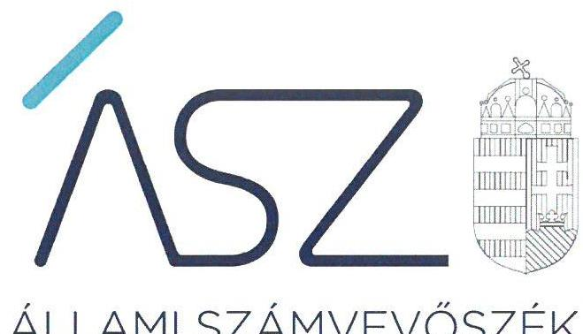
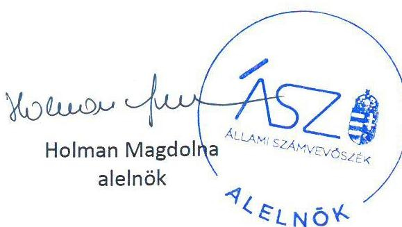

ÁLLAMI SZÁMVEVŐSZÉK

# JELENTÉS 

## Pártok gazdálkodása

A költségvetési támogatásban részesülő pártok 2017-2018. évi gazdálkodása törvényességének ellenőrzése a Párbeszéd Magyarországért Pártnál

2020.

20169
www.asz.hu

---

ÁLLAMI SZÁMVEVŐSZÉK

# JELENTÉS

## Pártok gazdálkodása

A költségvetési támogatásban részesülő pártok 2017-2018. évi gazdálkodása törvényességének ellenőrzése a Párbeszéd Magyarországért Pártnál

2020. 08. hó 25. nap

20169
www.asz.hu

Holman Magdolna
alelnök

---

|  | AZ ELLENŐRZÉST FELÜGYELTE: |
| :--: | :--: |
|  | DR. BENEDEK MÁRIA felügyeleti vezető |
|  | AZ ELLENŐRZÉST VEZETTE ÉS A VÉGREHAJTÁSÁÉRT FELELŐS: |
|  | DR. PELLEI TAMÁS ellenőrzésvezető |
|  | A PROGRAM ÖSSZEÁLLÍTÁSÁÉRT FELELŐS: |
|  | BERTALAN RUDOLF felelős vezető |
|  | A TÉMÁHOZ KAPCSOLÓDÓ KORÁBBI SZÁMVEVŐSZÉKI JELENTÉSEK: |
| - | - címe: Jelentés a költségvetési támogatásban részesülő pártok 2015-2016. évi gazdálkodása törvényességének ellenőrzéséről a Párbeszéd Magyarországért Pártnál |
|  | - sorszáma: 18018 |
| Jelentéseink az Országgyúlés számítógépes hálózatán és az interneten a www.asz.hu címen is olvashatóak. | - címe: Jelentés a költségvetési támogatásban részesülő pártok 2013-2014. évi gazdálkodása törvényességének ellenőrzéséről - Párbeszéd Magyarországért Pártnál |
|  | - sorszáma: 16081 |
|  | IKTATÓSZÁM: EL-2837-001/2020 |
|  | TÉMASZÁM: 2520 |
|  | ELLENŐRZÉS-AZONOSÍTÓ SZÁM: V086407 |

---

# TARTALOMJEGYZÉK 

■ ÖSSZEGZÉS ..... 5
■ AZ ELLENŐRZÉS CÉLJA ..... 6
■ AZ ELLENŐRZÉS TERÜLETE ..... 7
■ AZ ELLENŐRZÉS HÁTTERE, INDOKOLTSÁGA ..... 8
■ A JELENTÉS LÉNYEGES KÉRDÉSKÖREI ..... 9
■ AZ ELLENŐRZÉS HATÓKÖRE ÉS MÓDSZEREI ..... 10
■ MEGÁLLAPÍTÁSOK ..... 12
■ JAVASLATOK ..... 15
■ MELLÉKLETEK ..... 17
I. sz. melléklet: Fogalomtár ..... 17
■ FÜGGELÉK: ÉSZREVÉTELEK ..... 19
■ RÖVIDÍTÉSEK JEGYZÉKE ..... 21

---

.

---

# ÖSSZEGZÉS 

A Párbeszéd Magyarországért Párt a 2017. és 2018. években gazdálkodásának szabályozási környezetét a jogszabályi előírások alapján alakította ki, azonban gazdálkodása során a jogszabályi előírásokat nem tartotta be.

## Az ellenőrzés társadalmi indokoltsága

A pártok az állampolgárok egyesülési szabadsága alapján létrehozott olyan szervezetek, amelyek kereteket nyújtanak a népakarat kialakításához és kinyilvánításához, a politikai életben való állampolgári részvételhez.

A politikai élet tisztasága érdekében törvény állapítja meg a pártok vagyonára és gazdálkodására vonatkozó szabályokat. Az egyesülési jog alapján létrejövő más szervezetekhez képest szűkebb körben határozza meg azt a gazdasági tevékenységet, amelyet a párt végezhet, biztosítja azonban a pártok részére azt a jogosultságot, hogy az állami költségvetésből támogatásban részesüljenek. A pártok gazdálkodását a politikai élet tisztasága érdekében rendszeresen indokolt ellenőrizni, ezért törvényi előírás alapján az Állami Számvevőszék a költségvetési támogatást kapott pártok gazdálkodását kétévente ellenőrzi.

A pártokkal szembeni társadalmi elvárás a törvényt tisztelő, jogkövető magatartás, mivel a párt képviselői a jogállamiságot megtestesítő törvényhozó hatalom részei. Mindezekre tekintettel fokozott társadalmi veszélyességet hordoz egy párt elszámoltathatóságának hiánya, elszámolási kötelezettségének nem teljesítése.

## Főbb megállapítások, következtetések, javaslatok

A Párbeszéd Magyarországért Párt a 2017-2018. évekre vonatkozóan a jogszabályi előírások szerint kialakította a gazdálkodására vonatkozó számviteli kereteket és belső szabályozásait.

A Párbeszéd Magyarországért Párt a működéséhez juttatott forrásokat nem szabályszerűen számolta el, így a bevételei nyilvántartásához kialakított könyvvezetési rendszere nem biztosította a magánszemélyektől kapott adományok, hozzájárulások között elszámolt bevételek beazonosíthatóságát, számviteli elszámolásának szabályszerűségét, ellenőrizhetőségét, átláthatóságát és elszámoltathatóságát. A Párbeszéd Magyarországért Párt számviteli nyilvántartása nem alkalmas arra, hogy a magánszemélyektől kapott egyéb hozzájárulások, adományok között elszámolt bevételek tényleges forrását igazolja, így a Párbeszéd Magyarországért Párt nem igazolta, hogy ezen hozzájárulások, adományok a Párttörvény szerinti engedélyezett forrásból származtak. A 2017-2018. években a teljesítések igazolása nélkül történt kifizetések miatt nem igazolt továbbá, hogy a Párbeszéd Magyarországért Párt a rendelkezésére álló forrásokat a feladatellátásaira fordította.

A Párbeszéd Magyarországért Párt a 2017. évi és a 2018. évi pénzügyi kimutatásait nem szabályszerűen készítette el, mert a pénzügyi kimutatások adatait szabályszerű könyvvezetéssel nem támasztotta alá, elkészítésük során nem érvényesült a következetesség elve. A nem szabályszerűen elkészített pénzügyi kimutatásait a jogszabály által előírt határidőben tette közzé a Magyar Közlöny mellékletét képező Hivatalos Értesítőben és a saját honlapján.

Az Állami Számvevőszék az intézkedések megtétele céljából a Párbeszéd Magyarországért Párt társelnökeinek négy javaslatot fogalmazott meg.

---

# AZ ELLENŐRZÉS CÉLJA 

AZ ELLENŐRZÉS CÉLJA annak értékelése, hogy a Párbeszéd Magyarországért Párt által közzétett pénzügyi kimutatások a törvényi előírásoknak megfeleltek-e, a könyvvezetés és gazdálkodás során betartották-e a vonatkozó jogszabályi és belső előírásokat; a Párbeszéd Magyarországért Párt a működéséhez szabályszerűen igénybe vehető forrásokat használt-e fel.

---

# AZ ELLENŐRZÉS TERÜLETE 

## Párbeszéd Magyarországért Párt

A Párbeszéd Magyarországért Párt 2013. július 9-én létrejött olyan egyesület, amely nyilvántartott tagsággal rendelkezik, és a nyilvántartásba vételét végző bíróság előtt kinyilvánította, hogy a Párttörvény ${ }^{1}$ rendelkezéseit magára nézve kötelezőnek ismeri el a Párttörvény 1. §-a alapján.

A Párbeszéd Magyarországért Párt Alapszabályában² rögzített célja, hogy a társadalmi párbeszéd és a közhatalom gyakorlásában való részvétel útján minél szélesebb körben érvényre jutassa elveit és értékeit, és a megválasztott képviselőin keresztül részt vegyen az önkormányzatok, az Országgyűlés és az Európai Parlament munkájában. Döntéshozó szervei a Kongresszus ${ }^{3}$ és az Országos elnökség, amelyekből az utóbbi egyben a Párbeszéd Magyarországért Párt ügyintéző szerve. A Párbeszéd Magyarországért Párt a 2013. évi CLXXVII. törvény ${ }^{4}$ 11. § (1) bekezdésének előírásait figyelembe véve - a Ptk. ${ }^{5}$-val összefüggésben - a létesítő okiratának tartalmi felülvizsgálatát az ellenőrzött időszakban elvégezte, az $\mathrm{FB}^{6}$ tagjait az Alapszabályban nevesítette.

A Párbeszéd Magyarországért Párt alakulása óta töltik be tisztségüket a jelenlegi társelnökök. A Párbeszéd Magyarországért Párt 2014. júniusában létrehozta a „Megújuló Magyarországért" elnevezésű alapítványt, a 2016. január 9-én a „Zöld Front Egyesület" elnevezésű ifjúsági szervezetet. A Párbeszéd Magyarországért Párt a 2018. decemberében megalapította a „Társadalmi Igazságosság Alapítvány"-t, a nem párt jellegű politikai tevékenység, politikai ifjúsági szervezetek, helyi közösségi kezdeményezések segítésének céljával.

A Párbeszéd Magyarországért Párt a 2017. évben 106 700 ezer Ft, míg a 2018. évben 90 035 ezer Ft központi költségvetési támogatásban részesült.

A Párbeszéd Magyarországért Párt által készített és a Magyar Közlöny mellékletét képező, Hivatalos Értesítőben közzétett pénzügyi kimutatásaiban a 2017. évben 118 723 ezer Ft bevételt és 89 579 ezer Ft kiadást, a 2018. évben 102 277 ezer Ft bevételt és 100 253 ezer Ft kiadást mutatott ki. A bevételeken belül a magánszemélyektől kapott egyéb hozzájárulások, adományok összege a 2017. évben 9921 ezer Ft, a 2018. évben 10 636 ezer Ft volt.

---

# AZ ELLENŐRZÉS HÁTTERE, INDOKOLTSÁGA 

Az ÁSZ tv. ${ }^{7}$ 5. § (11) bekezdés a) pontja, valamint a Párttörvény 10. § (1) bekezdése alapján a pártok gazdálkodása törvényességének ellenőrzésére az ÁSZ ${ }^{8}$ jogosult. Törvényi előírás alapján az ÁSZ kétévente ellenőrzi azoknak a pártoknak a gazdálkodását, amelyek rendszeres költségvetési támogatásban részesültek.

Az ÁSZ legutóbb a Párbeszéd Magyarországért Párt 2015-2016. évi gazdálkodásának törvényességét ellenőrizte.

A gazdálkodás szabályszerűségének, a felhasznált közpénzek nagyságának bemutatásával a társadalom objektív képet alkothat a pártok működéséről. Az ellenőrzés megállapításai a gazdálkodás megfelelőségének bemutatásával elősegíthetik, hogy a törvényalkotók konkrét lépéseket tegyenek a pártok finanszírozására vonatkozó szabályozások megváltoztatása, átláthatóbbá, ellenőrizhetőbbé tétele irányába. Az ellenőrzés rámutat a pártok gazdálkodásával kapcsolatos jó gyakorlatokra és szabálytalanságokra. A hiányosságok, szabálytalanságok feltárása, az ennek kapcsán megfogalmazott megállapítások elősegíthetik a törvényi rendelkezések megsértésének szankcionálását.

---

# A JELENTÉS LÉNYEGES KÉRDÉSKÖREI 

1. A Párbeszéd Magyarországért Párt szabályszerűen kialakította-e a gazdálkodás szabályozási kereteit?
2. A Párbeszéd Magyarországért Párt könyvvezetése és gazdálkodása szabályszerű volt-e?
3. A Párbeszéd Magyarországért Párt pénzügyi kimutatása megfelelt-e a jogszabályi előírásoknak, közzétételi kötelezettségét szabályszerűen teljesítette-e?

---

# AZ ELLENŐRZÉS HATÓKÖRE ÉS MÓDSZEREI 

## Az ellenőrzés típusa

Szabályszerűségi ellenőrzés.

## Az ellenőrzött időszak

2017-2018. évek.

## Az ellenőrzés tárgya

A Párbeszéd Magyarországért Párt ellenőrzése során az ellenőrzés tárgyát képezte a 2017. és a 2018. évre vonatkozó pénzügyi kimutatás elkészítésére, jóváhagyására, közzétételére, a párt könyvvezetésére, gazdálkodására, ennek keretében a számviteli szabályozás kialakítására, a bizonylati rend, bizonylati fegyelem betartására, egyéb gazdálkodási, ellenőrzési és pénzügyi-számviteli informatikai feladatok ellátására irányuló tevékenységek. Az ellenőrzés tárgya volt még a források elszámolása és felhasználása, valamint a vagyon jogszabályi előírásoknak megfelelő hasznosítása.

Az ellenőrzés kiterjedt minden olyan körülményre és adatra, amely az ÁSZ jogszabályban meghatározott feladatainak teljesítéséhez, valamint a program végrehajtása folyamán felmerült újabb összefüggések feltárásához szükséges volt.

## Az ellenőrzött szervezet

Párbeszéd Magyarországért Párt

## Az ellenőrzés jogalapja

Az ellenőrzés jogalapját az ÁSZ tv. 5. § (11) bekezdés a) pontja, a Párttörvény 4. § (4)-(5) bekezdései, valamint 10. § (1), (3)-(4) bekezdései képezték.

## Az ellenőrzés módszerei

Az ÁSZ ellenőrzésére az ellenőrzési program szempontjai, az ellenőrzött időszakban hatályos jogszabályok, az ellenőrzés általános szakmai szabá-

---

lyai, az ellenőrzésre irányadó ÁSZ módszertanok figyelembevételével került sor. A közpénzekkel való felelős gazdálkodás segítésére irányuló javaslatok kidolgozásakor a hatályos jogszabályok irányadóak.

Az ellenőrzés ideje alatt a Párbeszéd Magyarországért Párttal történő kapcsolattartást az ÁSZ SZMSZ³-ének vonatkozó előírásai alapján biztosította az ÁSZ.

Az ellenőrzés céljának eléréséhez szükséges bizonyítékok megszerzése a Párbeszéd Magyarországért Párt által rendelkezésre bocsátott dokumentumokra, adatokra alapozva közvetlen, részletes elemzés, megfigyelés, szemrevételezés, információkérés, megerősítés, valamint elemző eljárás útján történt. Az ellenőrzési bizonyítékként felhasználható adatforrások közé tartoztak egyrészt az ellenőrzési program részletes szempontjainál felsorolt adatforrások, másrészt minden egyéb - az ellenőrzés folyamán feltárt, az ellenőrzés szempontjából információt tartalmazó - dokumentum.

Az ellenőrzés lefolytatásához a Párbeszéd Magyarországért Párt az ÁSZ által kért dokumentumok megküldésével szolgáltatott adatokat, amelyek valódiságát és teljes körűségét a Párbeszéd Magyarországért Párt vezetője által tett teljességi és hitelességi nyilatkozatnak kellett igazolnia. A rendelkezésre bocsátott adatok, információk kontrollja az ellenőrzés keretében történt.

Az ÁSZ a tételes ellenőrzés mellett statisztikai alapú mintavételezést és értékelést alkalmazott. A minták kiválasztása rétegzett mintavételezéssel történt. A hozzájárulások, adományok és egyéb bevételek, valamint a személyi juttatások (működési kiadáson belül), eszközbeszerzések és a működési kiadások további tételei, politikai tevékenység kiadásai, egyéb kiadások mintatételeinek értékelése „szabályszerű", ha a minta ellenőrzésének eredménye alapján 95\%-os bizonyossággal a teljes sokaságban az átlagos hibaarány nem haladta meg a 10\%-ot, „nem szabályszerű, ha nagyobb volt, mint 10 %. Abban az esetben, ha a teljes sokaság tekintetében a 10\%-os hibaarányhoz való viszony megítélésének megbízhatósága nem érte el a 95\%-ot, annak elérése érdekében az értékelés további szempontokkal egészült ki, a feltárt hibák értéke is figyelembe vételre került.

---

# 1. A Párbeszéd Magyarországért Párt szabályszerűen kialakította-e a gazdálkodás szabályozási kereteit? 

Összegző megállapítás

A Párbeszéd Magyarországért Párt a gazdálkodására vonatkozó szabályozási kereteit a 2017-2018. években a jogszabályi előírások szerint kialakította.

A PMP ${ }^{10}$ a Számv. tv. ${ }^{11}$ előírása alapján rendelkezett Számviteli politikával ${ }^{12}$, melynek keretében elkészítette a Leltározási szabályzatot ${ }^{13}$, az Értékelési szabályzatot ${ }^{14}$ és a Pénzkezelési szabályzatot ${ }^{15}$, továbbá a Számv. tv. előírása szerint elkészítette a Számlarendet ${ }^{16}$.

A PMP a részére nem pénzben nyújtott szolgáltatások értékének meghatározásával kapcsolatos szabályokat az Értékelési szabályzatban meghatározta.

A PMP a Párttörvény 4. § (1) bekezdésében előírtakkal összhangban a Számviteli
 politikájában rögzítette a bevételeinek, a vagyonának és gazdasági-vállalkozási tevékenységének bevételi és kiadási jogcímeit. A tagok által fizetendő tagdíjak mértékét és a tagdíjfizetés szabályait az Alapszabály és a Tagdíjfizetési szabályzat ${ }^{17}$ rögzítette.

## 2. A Párbeszéd Magyarországért Párt könyvvezetése és gazdálkodása szabályszerű volt-e?

Összegző megállapítás

A PMP 2017. és a 2018. évekre vonatkozó könyvvezetése, nyilvántartási rendszere a jogszabályi és a belső szabályzat előírásainak nem felelt meg. A PMP a gazdálkodása során a vonatkozó jogszabályi rendelkezéseket és a belső előírásokat nem tartotta be.

A PMP a 2017. és 2018. évben a kapott költségvetési támogatásokkal és az egyéb támogatásokkal, adományokkal kapcsolatos elszámolási, nyilvántartási kötelezettségét nem teljesítette.

A PMP a 2017. és 2018. években a Számv. tv. 161/A. § (2) bekezdésének előírásai ellenére a könyvvezetése során a nyilvántartási rendszerét nem részletezte tovább oly módon, hogy abból a Párttörvény 1. számú melléklete szerinti pénzügyi kimutatás elkészítéséhez az egyéb hozzájárulások, adományokkal kapcsolatos adatok beazonosíthatóak, meghatározhatóak és ellenőrizhetőek legyenek. Így a PMP a főkönyvi nyilvántartásában a magánszemélyektől kapott egyéb hozzájárulások, adományok között elszámolt bevételek esetében nem igazolta, hogy ezen adományok a Párttörvény 4. § (1) bekezdésében meghatározottak szerint engedélyezett forrásból, magyar állampolgár természetes személyek vagyoni hozzájárulásaiból származtak.

A központi költségvetési támogatások és az egyéb hozzájárulások, adományok számviteli elszámolását közvetlenül alátámasztó bizonylatok a Számv. tv. 167. § (1) bekezdés c) és h) pontjában foglaltak ellenére nem tartalmazták az utalványozó személy aláírását és az érintett könyvviteli számlákra történő hivatkozást.

# 2.2. számú megállapítás 

A PMP 2017-2018. évi gazdálkodása nem volt szabályszerű.
A PMP a 2017. és 2018. években az egyéb bevételek elszámolását közvetlenül alátámasztó bizonylatokon a Számv. tv. 167. § (1) bekezdés i) pontjában foglaltak ellenére nem került feltüntetésre a könyvviteli nyilvántartásokba történt rögzítés időpontja.

A PMP 2017-2018. évi személyi jellegű kiadásainak könyvviteli elszámolását közvetlenül alátámasztó bank- és pénztárbizonylatok nem tartalmazták a Számv. tv. 167. § (1) bekezdés c) és h) pontjaiban foglaltak ellenére az érintett könyvviteli számlákra történő hivatkozást, illetve az utalványozó és a rendelkezés végrehajtását igazoló személy aláírását, azaz a kifizetések a teljesítések igazolása nélkül történtek meg.

A PMP a 2018. évben a Párttörvény 4. § (1) bekezdésében foglaltakkal összhangban helyiség szívességi használatát jelentő használati szerződés alapján magánszemélyektől nem pénzbeli vagyoni hozzájárulást fogadott el. A PMP a Párttörvény 4. § (5) bekezdésében, továbbá az Alapszabály 27. § (1) bekezdés c) pontjában rögzítettek ellenére nem gondoskodott a szívességi helyiség használat értékének meghatározásáról, továbbá a használat értékét a Számv. tv. 77. § (3) bekezdés n) pontjában foglaltak ellenére egyéb bevételként nem mutatta ki.

## 3. A Párbeszéd Magyarországért Párt pénzügyi kimutatása megfelelt-e a jogszabályi előírásoknak, közzétételi kötelezettségét szabályszerűen teljesítette-e?

Összegző megállapítás

### 3.1. számú megállapítás

A PMP a pénzügyi kimutatásait nem a jogszabályi előírások szerint készítette el, közzétételi kötelezettségét teljesítette.

A PMP 2017-2018. évi pénzügyi kimutatásait nem a jogszabályi előírások szerint készítette el.

A PMP a 2017. és 2018. évi pénzügyi kimutatásának adatait a Számv. tv. 4. § (1) bekezdésének előírása ellenére szabályszerű könyvvezetéssel nem támasztotta alá, mert:
a 2.1. pontban részletesen kifejtettek alapján a nyilvántartási (könyvvezetési) rendszere nem biztosította, hogy a kapott egyéb hozzájárulások, adományok beazonosíthatóak, meghatározhatóak és ellenőrizhetőek legyenek, valamint azt, hogy azok a Párttörvény által meghatározottak szerinti engedélyezett forrásból származtak,

# 3.2. számú megállapítás 

a 2.2 pontban részletezettek szerint a gazdálkodása során a bevételeket és kiadásokat nem szabályszerűen számolta el, ezáltal a könyvvezetése nem támasztotta alá a Párttörvény 1. számú mellékletében meghatározott pénzügyi kimutatásban rögzített adatokat.

## A PMP a 2017-2018. évi pénzügyi kimutatásai közzétételét határidőben teljesítette.

A PMP a 2017-2018. évekre vonatkozó, nem szabályszerűen elkészített pénzügyi kimutatásait a Párttörvény előírása szerint határidőben közzétette a Magyar Közlöny mellékletét képező Hivatalos Értesítőben, valamint saját honlapján.

# JAVASLATOK 

Az ÁSZ tv. 33. § (1) bekezdésében foglaltak értelmében az ellenőrzött szervezet vezetője köteles a jelentésben foglalt megállapításokhoz kapcsolódó intézkedési tervet összeállítani és azt a jelentés kézhezvételétől számított 30 napon belül az ÁSZ részére megküldeni. Amennyiben az ellenőrzött szervezet vezetője nem küldi meg határidőben az intézkedési tervet, vagy továbbra sem elfogadható intézkedési tervet küld, az Állami Számvevőszék elnöke az ÁSZ tv. 33. § (3) bekezdése a) és b) pontjaiban foglaltakat érvényesítheti.

## A PMP társelnökeinek

1. Intézkedjen a Számv. tv előírásának megfelelően a közpénzek felhasználásának és a köztulajdon használatának ellenőrizhetősége érdekében a nyilvántartási (könyvvezetési) rendszere oly módon történő továbbrészletezéséről, hogy abból a Párttörvény 1. számú mellékletében meghatározott adatok rendelkezésre álljanak.
(2.1. számú megállapítás 1. bekezdés első mondata alapján)
2. Intézkedjen a Számv. tv előírásának megfelelően
a) a költségvetési támogatások és egyéb hozzájárulások, adományok számviteli elszámolását közvetlenül alátámasztó bizonylatokon az utalványozó személy aláírása és az érintett könyvviteli számlákra történő hivatkozás szerepeltetéséről.
b) az egyéb bevételek elszámolását közvetlenül alátámasztó bizonylatokon a könyvviteli nyilvántartásokba történt rögzítés időpontjának feltüntetéséről.
c) a személyi jellegű kiadások könyvviteli elszámolását közvetlenül alátámasztó bank-és pénztárbizonylatokon az utalványozó és a rendelkezés végrehajtását igazoló személy aláírása és az érintett könyvviteli számlákra történő hivatkozás szerepeltetéséről.
(2.1. számú megállapítás 2. bekezdése, valamint a 2.2. számú megállapítás 1-2. bekezdései alapján)
3. Intézkedjen a Párttörvényben, valamint az Alapszabályban foglalt előírásoknak megfelelően a jövőre nézve a nem pénzbeni vagyoni hozzájárulás értékének meghatározásáról.
(2.2. számú megállapítás 3. bekezdés második mondat első és második tagmondata alapján)
4. Intézkedjen a Számv. tv előírásának megfelelően a jövőre nézve a térítés nélkül kapott szolgáltatás piaci értékének az egyéb bevételek között történő kimutatásáról.
(2.2. számú megállapítás 3. bekezdés második mondat harmadik tagmondata alapján)

# MELLÉKLETEK 

- I. SZ. MELLÉKLET: FOGALOMTÁR
pénzügyi kimutatás
költségvetési támogatás
nem pénzbeli támogatás

A Párttörvény 9. § (1) bekezdésében meghatározott, a törvény 1. számú melléklete szerinti pénzügyi kimutatás (hatályos 2014. május 6-ától), amelyet a pártok kötelesek minden év május 31-ig a Magyar Közlönyben, valamint saját honlappal rendelkező pártok a honlapjukon is közzétenni.
Az államháztartás alrendszerei terhére nyújtott pénzbeli vagy nem pénzbeli juttatás, amelyet a támogató nem elsősorban ellenszolgáltatás ellenében, de konkrét program megvalósítása vagy meghatározott időszakban a támogatott szervezet működtetése érdekében nyújt. (Civil tv. 2. § 15. pont)
Vagyoni értékkel rendelkező forgalomképes dolog, szellemi alkotás, illetve vagyoni értékű jog részben vagy egészében, véglegesen vagy ideiglenesen, teljesen vagy részben ingyenesen történő átruházása vagy átengedése, illetve szolgáltatás biztosítása. (Civil tv. 2. § 25. pont)

# FÜGGELÉK: ÉSZREVÉTELEK 

A jelentéstervezetet a Számvevőszék 15 napos észrevételezésre megküldte az ellenőrzött szervezet vezetőinek az ÁSZ tv. 29. § (1) bekezdése előírásának megfelelően.

A Párbeszéd Magyarországért Párt társelnöke a jelentéstervezet megállapításaira észrevételt tett. Az ÁSZ tv. 29. § (3) bekezdésével összhangban az ÁSZ a Függelékben feltünteti a jelentéstervezet megállapításaival kapcsolatban tett, figyelembe nem vett észrevételeket, és megindokolja, hogy azokat miért nem fogadta el.

1. A Párbeszéd Magyarországért Párt (továbbiakban: PMP) társelnöke észrevételt tett a számvevőszéki jelentéstervezet 2.1. sz. megállapítás első bekezdésében leírtakra, mely szerint a PMP nem igazolta, hogy az adományok a Párttörvény 4. § (1) bekezdésében meghatározottak szerint engedélyezett forrásból, magyar állampolgár természetes személyek vagyoni hozzájárulásaiból származtak.
Az Állami Számvevőszék (továbbiakban: ÁSZ) az ellenőrzési megállapításait az ellenőrzéshez kapcsolódó adatszolgáltatás során a részére törvényi határidőben rendelkezésre bocsátott dokumentumokra alapozva teszi meg.
A PMP által az adatszolgáltatásra biztosított határidőben rendelkezésére bocsátott dokumentumok felülvizsgálata során az ÁSZ az alábbiakat állapította meg.
A PMP a Számv. tv. 161/A. § (2) bekezdésének előírásai ellenére a könyvvezetése során a nyilvántartási rendszerét nem részletezte tovább oly módon, hogy abból a Párttörvény 1. számú melléklete szerinti pénzügyi kimutatás elkészítéséhez az egyéb hozzájárulások, adományokkal kapcsolatos adatok beazonosíthatóak, meghatározhatóak és ellenőrizhetőek legyenek. Mindezek következtében az ÁSZ megállapította, hogy a PMP a főkönyvi nyilvántartásában a magánszemélyektől kapott egyéb hozzájárulások, adományok között elszámolt bevételek esetében nem igazolta, hogy ezen adományok a Párttörvény 4. § (1) bekezdésében meghatározottak szerint engedélyezett forrásból, magyar állampolgár természetes személyek vagyoni hozzájárulásaiból származtak.
Fent leírtak alapján a PMP könyvvezetési rendszere nem tette lehetővé, hogy az ÁSZ a PMP gazdálkodása törvényességi ellenőrzése során az adományokkal kapcsolatos adatokat beazonosítsa, ellenőrizze. A könyvvezetési rendszer hiányosságaira a PMP társelnöke is utal érintőlegesen, amikor észrevételében jelzi, hogy a számviteli kimutatásukban vezetett adatok rendszerén a 2019-es évtől kezdődően változtattak.
A fent leírtak alapján az ÁSZ a PMP észrevételét nem veszi figyelembe, a számvevőszéki jelentéstervezetben 2.1. sz. megállapítás 1. bekezdés 2. mondatának módosítása nem indokolt.
2. A PMP társelnöke észrevételt tett a számvevőszéki jelentéstervezet 2.2 megállapítás második bekezdésében leírtakra, mely szerint a PMP személyi jellegű kiadásainál a kifizetések a teljesítések igazolása nélkül történtek meg, mivel a bank- és pénztárbizonylatok nem tartalmazták az utalványozó és a rendelkezés végrehajtását igazoló személy aláírását.
* 29. § (1) Az Állami Számvevőszék az ellenőrzési megállapításait megküldi az ellenőrzött szervezet vezetőjének vagy az általa megbízott személynek, és annak, akinek személyes felelősségét állapította meg.
(2) Az ellenőrzött szervezet vezetője és a felelősként megjelölt személy az ellenőrzés megállapításaira tizenöt napon belül írásban észrevételt tehet.
(3) Az Állami Számvevőszék az észrevételre a beérkezésétől számított harminc napon belül írásban válaszol. A figyelembe nem vett észrevételeket köteles a jelentésben feltüntetni, és megindokolni, hogy azokat miért nem fogadta el.

Az ÁSZ ellenőrzésére az ellenőrzési program szempontjai, az ellenőrzött időszakban hatályos jogszabályok, az ellenőrzés általános szakmai szabályai, az ellenőrzésre irányadó ÁSZ módszertanok figyelembevételével került sor. Az ellenőrzés lefolytatásához a PMP által rendelkezésre bocsátott adatok, információk kontrollja az ellenőrzés keretében történt.
Az ÁSZ az EL-1649-034/2019 iktatószámú adatbekérő levelének 1/D. sz. melléklete „Személyi jellegű kiadások" táblázata szerint 21 db mintatételhez kapcsolódó dokumentumot kért az ellenőrzéshez megküldeni. A PMP által az adatszolgáltatásra biztosított határidőben rendelkezésére bocsátott dokumentumok felülvizsgálata során az ÁSZ az alábbiakat állapította meg.
A Számv. tv. 167. § (1) bekezdés c) és h) pontjaiban foglaltak ellenére a személyi jellegű kiadások ellenőrzött tételeihez beküldött bank- és pénztárbizonylatok egyike sem tartalmazta az érintett könyvviteli számlákra történő hivatkozást, és egyik bizonylat sem tartalmazott utalványozói aláírást, továbbá a mintatételekhez beküldött bank- és pénztárbizonylatok egyike sem tartalmazta a rendelkezések végrehajtását igazoló személyek aláírását, azaz a kifizetések a teljesítések igazolása nélkül történtek meg.
A fent leírtak alapján az ÁSZ a PMP észrevételét nem veszi figyelembe, a számvevőszéki jelentéstervezetben szereplő 2.2. sz. megállapítás 2. bekezdése és a PMP társelnökeinek címzett 2/c. javaslat módosítása nem indokolt.
3. A PMP társelnöke észrevételt tett a számvevőszéki jelentéstervezet 2.2 megállapítás harmadik bekezdésében leírtakra, mely szerint a PMP helyiség szívességi használatát jelentő használati szerződés alapján magánszemélyektől nem pénzbeli vagyoni hozzájárulást fogadott el.
A PMP által az adatszolgáltatásra biztosított határidőben rendelkezésére bocsátott dokumentumok felülvizsgálata során az ÁSZ az alábbiakat állapította meg.
„A költségvetési támogatásban részesülő pártok 2017-2018. évi gazdálkodása törvényességének ellenőrzése a Párbeszéd Magyarországért
 Pártnál című ellenőrzés keretében a PMP vonatkozásában helyszíni adatbetekintés lefolytatásáról" tárgyú, 2019. november 7. napján kelt, EL-1649-047/2019. iktatószámú jegyzőkönyvben foglaltak alapján a helyszíni adatbetekintés során eredetben bemutatásra és másolati példányban átadásra került az ÁSZ ellenőrzés részére, egy 2018. május 27. napján kelt, két fő magánszemély használatba adók és a PMP, mint használatba vevő között létrejött szívességi helyiség-használati szerződés. Tárgyi szerződés rögzíti, hogy a használatba adás ellenérték nélkül, szívességből történik. A használatba vevő PMP az ingatlan helyiségben a székhelyét kívánja üzemeltetni. Az észrevételben a PMP kiemeli: „.... hogy ez a helyiséghasználat nem irodai használatot jelentett...". Hangsúlyozni indokolt, hogy a számvevőszéki jelentés megállapítása nem tartalmazza azt, hogy a helyiséghasználat irodai használatot jelentett.
A fent leírtak alapján az ÁSZ a PMP észrevételét nem veszi figyelembe, a számvevőszéki jelentéstervezetben szereplő 2.2. sz. megállapítás 3. bekezdés első mondatának módosítása nem indokolt.

---

# RÖVIDÍTÉSEK JEGYZÉKE 

${ }^{1}$ Párttörvény
${ }^{2}$ Alapszabály
${ }^{3}$ Kongresszus
${ }^{4}$ 2013. évi CLXXVII. törvény
${ }^{5}$ Ptk.
${ }^{6} \mathrm{FB}$
${ }^{7}$ ÁSZ tv.
${ }^{8}$ ÁSZ
${ }^{9}$ ÁSZ SZMSZ
${ }^{10}$ PMP
${ }^{11}$ Számv. tv.
${ }^{12}$ Számviteli politika
${ }^{13}$ Leltározási szabályzat
${ }^{14}$ Értékelési szabályzat
${ }^{15}$ Pénzkezelési szabályzat
${ }^{16}$ Számlarend
${ }^{17}$ Tagdijfizetési szabályzat

A pártok működéséről és gazdálkodásáról szóló 1989. évi XXXIII. törvény (hatályos: 1989. október 30-ától)
A Párbeszéd Magyarországért Párt Alapszabálya (hatályos: 2013. július 09-étől, módosítva: 2018.január 27. és 2018.május 27., egységes szerkezetben: 2018. május 27.)
A Párbeszéd Magyarországért Párt Kongresszusa, legfőbb döntést hozó szerve
A Polgári törvénykönyvről szóló 2013. évi V. törvény hatályba lépésével összefüggő átmeneti és felhatalmazó rendelkezésekről szóló 2013. évi CLXXVII. törvény (hatályos: 2014. március 15-étől)
A Polgári Törvénykönyvről szóló 2013. évi V. törvény (hatályos: 2014. március 15-étől)
A Párbeszéd Magyarországért Párt Felügyelő Bizottsága
Az Állami Számvevőszékről szóló 2011. évi LXVI. törvény (hatályos: 2011. július 01-jétől)
Állami Számvevőszék
Állami Számvevőszék Szervezeti és Működési Szabályzata
Párbeszéd Magyarországért Párt
A számvitelről szóló 2000. évi C. törvény (hatályos: 2001. január 1-jétől)
A Párbeszéd Magyarországért Párt Számviteli politikája (hatályos: 2013. szeptember 18-ától, az ellenőrzött időszakra vonatkozóan módosítva: 2016. október 21-én és 2018. május 27-én)
A Párbeszéd Magyarországért Párt Számviteli politikájának részeként elkészített Eszközök és Források Leltárkészítési és Leltározási Szabályzata (hatályos: 2013. szeptember 18-ától, az ellenőrzött időszakra vonatkozóan módosítva: 2016. október 21-én és 2018. május 27-én)
A Párbeszéd Magyarországért Párt Számviteli politikájának részeként elkészített Eszközök és Források Értékelési Szabályzata (hatályos: 2013. szeptember 18-ától, az ellenőrzött időszakra vonatkozóan módosítva: 2016. október 21-én és 2018. május 27-én)
A Párbeszéd Magyarországért Párt Számviteli politikájának részeként elkészített Pénzkezelési Szabályzat (hatályos: 2013. szeptember 18-ától, az ellenőrzött időszakra vonatkozóan módosítva: 2016. október 21-én és 2018. május 27-én)
Párbeszéd Magyarországért Párt Számlarend (hatályos: az alakulástól, módosítva: 2016. október 21-én)
A Párbeszéd Magyarországért Párt Tagdijfizetési Szabályzata (hatályos: 2014. szeptember 01-étől, az ellenőrzött időszakban módosítva: 2018.május 27-én)

---

# ASZ 

ÁLLAMI SZÁMVEVŐSZÉK
1052 Budapest, Apáczai Cs. J. u. 10. I 1364 Budapest 4. Pf. 54 TEL: +36 14849100
email: szamvevoszek@asz.hu
web: www.asz.hu | www.aszhirportal.hu

