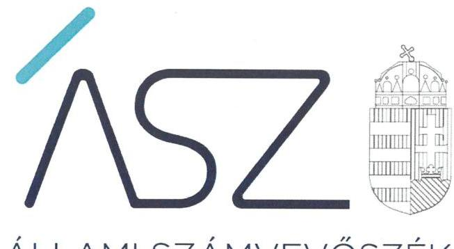
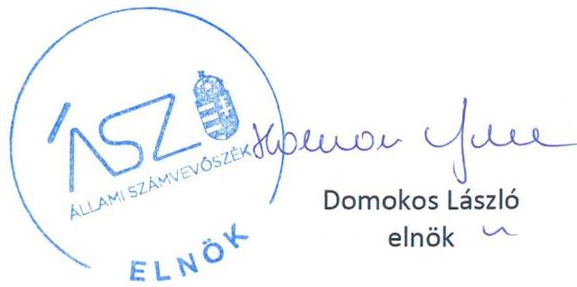

ÁLLAMI SZÁMVEVŐSZÉK

# JELENTÉS 

Nemzeti tulajdonú gazdasági társaságok ellenőrzése

AQUAMARIN Szállodaipari Korlátolt Felelősségű Társaság
2020.

20170
www.asz.hu

---

ÁLLAMI SZÁMVEVŐSZÉK

# JELENTÉS

Nemzeti tulajdonú gazdasági társaságok ellenőrzése

AQUAMARIN Szállodaipari Korlátolt Felelősségű Társaság

2020.
08. hó
18. nap
20170
www.asz.hu

---

# AZ ELLENŐRZÉST FELÜGYELTE: 

KLINGA LÁSZLÓ felügyeleti vezető

## AZ ELLENŐRZÉST VEZETTE ÉS A VÉGREHAJTÁSÁÉRT FELELŐS:

SIPOSNÉ DÓCZI KLÁRA IBOLYA ellenőrzésvezető

## A PROGRAM ÖSSZEÁLLÍTÁSÁÉRT FELELŐS:

FEKETE-NAGY ANDRÁS GÁBOR ellenőrzési program elkészítéséért felelős vezető

TÓTPÁL SZABOLCS osztályvezető

IKTATÓSZÁM: EL-2838-001/2020
Jelentéseink az Országgyúlés számítógépes hálózatán és az interneten a www.asz.hu címen is olvashatóak.

TÉMASZÁM: 2513
ELLENŐRZÉS-AZONOSÍTÓ SZÁM: V082270; V085706

---

# TARTALOMJEGYZÉK 

■ ÖSSZEGZÉS ..... 5
■ AZ ELLENŐRZÉS CÉLJA ..... 6
■ AZ ELLENŐRZÉS TERÜLETE ..... 7
■ AZ ELLENŐRZÉS HÁTTERE, INDOKOLTSÁGA ..... 8
■ A JELENTÉS LÉNYEGES KÉRDÉSKÖREI ..... 9
■ AZ ELLENŐRZÉS HATÓKÖRE ÉS MÓDSZEREI ..... 10
■ MEGÁLLAPÍTÁSOK ..... 12
■ MELLÉKLETEK ..... 13
I. sz. melléklet: Értelmező szótár ..... 13
■ FÜGGELÉK: ÉSZREVÉTELEK ..... 15
■ RÖVIDÍTÉSEK JEGYZÉKE ..... 17

---

.

---

# ÖSSZEGZÉS 

Hévíz Város Önkormányzatának az AQUAMARIN Szállodaipari Korlátolt Felelősségű Társaság feletti tulajdonosi joggyakorlása a 2017-2018 időszakban szabályszerű volt. A hévizi székhelyű Társaság a 2015-2018 években kialakította a vagyongazdálkodás feltételeit, ezzel biztosította a vagyonnal való szabályszerű, elszámoltatható és átlátható gazdálkodást.

## Az ellenőrzés társadalmi indokoltsága

Az Állami Számvevőszék kiemelt célja, hogy a helyi önkormányzatok gazdálkodásában rejlő pénzügyi kockázatok feltárásával, az államháztartáson kívülre nyújtott költségvetési támogatások és ingyenes vagyonjuttatások, valamint az államháztartáson kívül működő feladatellátó rendszerek ellenőrzéseivel hozzájáruljon ahhoz, hogy a közpénzeket az államháztartáson kívül működő szervezetek is átlátható, rendezett módon használják fel.

Magyarországon az önkormányzatok kötelező és önként vállalt feladataik vonatkozásában is egyre szélesebb körben alkalmazzák a költségvetésen kívüli feladatellátást, ezáltal az önkormányzati tulajdonú gazdasági társaságok is kiemelt fontosságú szerephez jutottak.

Az állami és a helyi önkormányzatok tulajdona nemzeti vagyon, melynek megőrzése érdekében kiemelten fontos a nemzeti tulajdonú gazdasági társaságok ellenőrzése. Ellenőrzésüket további társadalmi elvárás is indokolja, részben a gazdálkodásuk körébe tartozó vagyon nagysága, részben az általuk ellátott közszolgáltatások, sajátos feladatellátások, mivel tevékenységükön keresztül a lakosság széles köre kerül kapcsolatba a társaságokkal.

## Főbb megállapítások, következtetések

Hévíz Város Önkormányzata a Társaság feletti tulajdonosi jogait szabályszerűen gyakorolta. Megalkotta a vezető tisztségviselők, a felügyelő bizottsági tagok és a vezető munkakörben dolgozó munkavállalók javadalmazására vonatkozó szabályzatot, továbbá a jogszabályi előírások szerint fogadta el a Társaság számviteli törvény szerinti beszámolóit.

Az AQUAMARIN Szállodaipari Korlátolt Felelősségű Társaság a számviteli törvény szerinti beszámolóit a törvényi előírásoknak megfelelő leltárakkal támasztotta alá, ezáltal biztosította, hogy a beszámolóiban szereplő adatok a valóságban is megtalálhatóak, megalapozottak voltak. Hozzájárult ahhoz, hogy a Társaság beszámolói megbízható és valós képet mutattak a Társaság vagyongazdálkodásáról.

---

# AZ ELLENŐRZÉS CÉLJA 

AZ ELLENŐRZÉS CÉLJA annak megállapítása volt, hogy a tulajdonosi joggyakorló a gazdasági társaság feletti tulajdonosi joggyakorlás kereteit kialakította-e, tulajdonosi jogait megfelelően gyakorolta-e és kötelezettségeit teljesítette-e. Az ellenőrzés célja volt továbbá annak megállapítása, hogy a gazdasági társaság biztosította-e a vagyon védelmét a nyilvántartások szabályszerű vezetése és a mérleg tételeinek leltárral történő alátámasztása útján, valamint szabályszerűen gondoskodott-e a társaság használatában, kezelésében lévő nemzeti vagyon értékének megőrzéséről, gyarapításáról, hasznosításáról.

---

# AZ ELLENŐRZÉS TERÜLETE 

## AQUAMARIN Szállodaipari Korlátolt Felelősségű Társaság és a tulajdonosi jogokat gyakorló Hévíz Város Önkormányzata

Hévíz Város Önkormányzata 2001. augusztus 6-tól tulajdonolta az 1995-ben alapított, 2000. február 28-tól AQUAMARIN Szállodaipari Korlátolt Felelősségű Társaság nevet viselő Társaságot ${ }^{1}$. Az ellenőrzött időszakban a Társaság 100%-ban az Önkormányzat² tulajdonában állt, jegyzett tőkéje $139 \mathrm{M}^{3} \mathrm{Ft}$ volt. A Társaság felett a tulajdonosi jogokat az Alapító ${ }^{4}$ gyakorolta.

A Társaság fő tevékenysége a szállodai szolgáltatás, ahhoz kapcsolódóan vendéglátó ipari, egészségügyi, gyógyászati, sport- és rendezvényszervezési tevékenység volt, melyet saját vagyonával látott el. A Társaság a szállodai szolgáltatást két épületszárnyban, 96 szobában látta el. A Társaság más gazdasági társaságban nem rendelkezett tulajdonosi részesedéssel, az ellenőrzött időszakban nem tartozott a kormányzati szektorba sorolt társaságok közé, nem rendelkezett vagyonkezelt vagyonnal.

Az ellenőrzött időszakban a Társaság irányítási feladatait ügyvezető látta el, kinek személye az ellenőrzött időszakban nem változott. A Társaság irányítását és működését három tagú felügyelőbizottság ellenőrizte. A Társaság a Számv. tv. ${ }^{5}$ előírásai alapján könyvvizsgálatra volt kötelezett, számviteli beszámolóit könyvvizsgáló auditálta, kinek személye az első ellenőrzött évben változott.

A Társaság nyereséges működése következtében az ellenőrzött időszakban két alkalommal történt osztalék kifizetés az adózott eredmény és az eredménytartalék terhére. 2016. évre vonatkozóan 60 M Ft, 2018-ban 105 M Ft értékben.

A Társaság munkavállalóinak átlagos statisztikai létszáma 2015-ben 72 fő, 2016-ban és 2017-ben 74 fő, 2018-ban 73 fő volt.

A Polgármester ${ }^{6}$ 2014 óta töltötte be tisztségét.

---

# AZ ELLENŐRZÉS HÁTTERE, INDOKOLTSÁGA 

Az Alaptörvény ${ }^{7}$ 38. cikke alapján az állam és a helyi önkormányzatok tulajdona nemzeti vagyon. A nemzeti vagyon megőrzése, megóvása érdekében kiemelten fontos ezen nemzeti tulajdonú gazdasági társaságok ellenőrzése. Gazdálkodásuk jellemzően a közérdeklődés és a médiafigyelmének középpontjában áll, amihez hozzájárul a gazdálkodásuk körébe tartozó vagyon nagysága is.

Ellenőrzéseink feltárhatják, hogy a tulajdonosi felügyelet hozzájárult-e a szabályszerű gazdálkodáshoz és feladatellátáshoz.

Az ellenőrzés eredményeként meghatározhatóvá válnak a szervezet vagyongazdálkodást érintő kockázatai, ezzel lehetővé téve a kockázatok csökkentését. A megállapítások alapján megfogalmazott számvevőszéki javaslatok hasznosítása elősegítheti a meglévő hibák megszüntetését. A jó gyakorlatok bemutatásával az ÁSZ ${ }^{8}$ hozzájárulhat a követendő megoldások megismertetéséhez, terjesztéséhez.

---

# A JELENTÉS LÉNYEGES KÉRDÉSKÖREI 

1. A tulajdonosi jogok gyakorlása szabályszerű volt-e?
2. A gazdasági társaság vagyongazdálkodási tevékenysége szabályszerű volt-e?

---

# AZ ELLENŐRZÉS HATÓKÖRE ÉS MÓDSZEREI 

## Az ellenőrzés típusa

Megfelelőségi ellenőrzés.

## Az ellenőrzött időszak

A tulajdonosi joggyakorlás tekintetében az ellenőrzött időszak a 2017-2018 évekre terjedt ki az éves beszámoló jóváhagyása kivételével, amelynél az ellenőrzött időszak a 2015-2018 évek voltak.

A gazdasági társaság vagyongazdálkodása vonatkozásában az ellenőrzött időszak 2015-2018.

## Az ellenőrzés tárgya

Az önkormányzat tulajdonosi joggyakorlása, a 100%-os tulajdonában lévő gazdasági társaság feletti tulajdonosi joggyakorlás kialakítása és működtetése. A Társaság vagyongazdálkodása keretében a társaság által üzemeltetett nemzeti vagyon, illetve a saját vagyon tekintetében a vagyonnyilvántartások vezetése, leltár.

## Az ellenőrzött szervezet

$\longrightarrow$ AQUAMARIN Szállodaipari Korlátolt Felelősségű Társaság
$\longrightarrow$ Hévíz Város Önkormányzata

## Az ellenőrzés jogalapja

Az ellenőrzés jogalapját az ÁSZ tv. ${ }^{9}$ 1. § (3) bekezdése, és 5. § (3)-(5) bekezdései képezik.

## Az ellenőrzés módszerei

Az ellenőrzést az ellenőrzési program ellenőrzési kérdései, az ellenőrzött időszakban hatályos jogszabályok, az ellenőrzés szakmai szabályok és módszertanok alapján, a nemzetközi standardok figyelembe vételével végeztük.

Az ellenőrzés ideje alatt az ellenőrzött szervezettel történő kapcsolattartást az ÁSZ Szervezeti és Működési Szabályzatának vonatkozó előírásai alapján biztosítottuk.

---

Az ellenőrzési kérdések megválaszolásához szükséges bizonyítékok megszerzése a következő ellenőrzési eljárások alkalmazásával történt: megfigyelés, információkérés, összehasonlítás, valamint elemző eljárás. Az ellenőrzési bizonyítékként felhasználható adatforrások közé tartoztak az ellenőrzési programban felsorolt adatforrások, továbbá minden - az ellenőrzés folyamán - feltárt, az ellenőrzés szempontjából információkat tartalmazó dokumentum.

Az ellenőrzést a kérdésekre adott válaszok kiértékelésével, valamint a megjelölt adatforrások, a tanúsítványok felhasználásával, továbbá az adott időszakban hatályos jogszabályok figyelembe vételével folytattuk le.

A vagyonnyilvántartások és a leltár szabályszerűsége esetében az ellenőrzés azokra a legnagyobb értékű tételekre - a lényeges sokaságra - terjedt ki, melyek összértéke elérte a teljes sokaság összértékének 50%-át. A 2015., a 2017. és a 2018. évben a lényeges sokaságot tételesen ellenőrizte az ÁSZ.

---

# 1. A tulajdonosi jogok gyakorlása szabályszerű volt-e? 

Összegző megállapítás

Az Önkormányzatnak a Társaság feletti tulajdonosi joggyakorlása szabályszerű volt.

A TULAJDONOSI JOGGYAKORLÁS KERETEIT az Alapító az Mótv. ${ }^{10}$ és a Ptk. ${ }^{11}$ vonatkozó előírásai szerint az Alapító okiratban alakította ki. Az Alapító a Ptk. és a Taktv. ${ }^{12}$ előírásainak megfelelően jelölte ki a felügyelőbizottság tagjait.

Az Alapító a Taktv. előírásainak megfelelően Szabályzatban ${ }^{13}$ rendelkezett a vezető tisztségviselők, a felügyelőbizottsági tagok, valamint az Mt. ${ }^{14}$ 208. § hatálya alá tartozó munkavállalók javadalmazásának, valamint jogviszonyuk megszűnése esetére biztosított juttatások módjának, mértékének elveiről, annak rendszeréről.

## A TÁRSASÁG SZÁMVITELI TÖRVÉNY SZERINTI

BESZÁMOLÓINAK a jóváhagyásáról a 2015-2018 években az Alapító a Ptk. és a Számv. tv. előírásai szerint a könyvvizsgáló jelentésének, valamint a felügyelő bizottság írásbeli véleményének figyelembevételével határozatban döntött.

## 2. A gazdasági társaság vagyongazdálkodási tevékenysége szabályszerű volt-e?

## Összegző megállapítás

A Társaság vagyongazdálkodása szabályszerű volt.
A TÁRSASÁG A VAGYONÁT az ellenőrzött években a Számv. tv. és a Számviteli politika ${ }^{15}$ a Számlarend ${ }^{16}$, valamint az Értékelési szabályzat ${ }^{17}$ vonatkozó előírásainak megfelelően tartotta nyilván.

A Társaság rendelkezett a Számv. tv. előírásainak megfelelően Leltározási szabályzat ${ }^{18}$-tal, mely tartalmazta a leltározási folyamatra vonatkozó eljárási és dokumentálási szabályokat.

A TÁRSASÁG A SZÁMVITELI TÖRVÉNY SZERINTI BESZÁMOLÓJÁNAK A MÉRLEGTÉTELEIT az ellenőrzött időszakban a Számv. tv. előírásainak megfelelő leltárakkal támasztotta alá, és elvégezte az üzleti év mérleg-fordulónapjára vonatkozóan a főkönyvi könyvelés és az analitikus nyilvántartások adatai közötti egyeztetést. A 2015-2018. évi számviteli beszámolókat alátámasztó leltárak a Számv. tv. szabályozása szerint tételesen és ellenőrizhető módon tartalmazták a Társaságnak a mérleg fordulónapján fennálló eszközeit és forrásait mennyiségben és értékben.

---

# MELLÉKLETEK 

- I. SZ. MELLÉKLET: ÉRTELMEZŐ SZÓTÁR
gazdasági társaság
nonprofit gazdasági társaság
közfeladat
nemzeti vagyon
tulajdonosi jogok gyakorlója
nemzeti vagyon hasznosítása
nemzeti vagyon használója

A gazdasági társaságok üzletszerű közös gazdasági tevékenység folytatására, a tagok vagyoni hozzájárulásával létrehozott, jogi személyiséggel rendelkező vállalkozások, amelyekben a tagok a nyereségből közösen részesednek, és a veszteséget közösen viselik. Forrás: Ptk. 3:88. § (1) bekezdése
Ctv. ${ }^{19}$ 9/F. § (2) bekezdése szerint „az a gazdasági társaság minősül nonprofit gazdasági társaságnak és cégnevében az a gazdasági társaság tüntetheti fel a nonprofit jelleget, amelynek létesítő okirata tartalmazza, hogy a gazdasági társaság tevékenységéből származó nyereség a tagok között nem osztható fel, hanem az a gazdasági társaság vagyonát gyarapítja." (hatályos 2014. március 15-től)
Az Áht. 3/A. § (1) bekezdése alapján közfeladat a jogszabályban meghatározott állami vagy önkormányzati feladat.
Nvtv. ${ }^{20}$ 1. § (2) bekezdése szerint nemzeti vagyonba tartozik többek között „az állam vagy a helyi önkormányzat kizárólagos tulajdonában álló dolgok, az a) pont hatálya alá nem tartozó, állam vagy a helyi önkormányzat tulajdonában lévő dolog,
az állam vagy a helyi önkormányzat tulajdonában lévő pénzügyi eszközök, továbbá az államot vagy a helyi önkormányzatot megillető társasági részesedések, az államot vagy a helyi önkormányzatot megillető bármely vagyoni értékkel rendelkező jogosultság, amelyet jogszabály vagyoni értékű jogként nevesít."
Aki a nemzeti vagyon felett az államot vagy a helyi önkormányzatot megillető tulajdonosi jogok és kötelezettségek összességének gyakorlására jogosult. Forrás: Nvtv. 3. § (1) 17. pontja
A tulajdonosi joggyakorló vagy a nemzeti vagyon használója által a nemzeti vagyon birtoklásának, használatának, hasznok szedése jogának bármely - a tulajdonjog átruházását nem eredményező - jogcímen történő átengedése, ide nem értve a vagyonkezelésbe adást, valamint a haszonélvezeti jog alapítását. Forrás: Nvtv. 3. § (1) bekezdés 4. pont
Azon természetes személy, jogi személy vagy jogi személyiséggel nem rendelkező szervezet, aki vagy amely állami vagyon tekintetében törvény
 vagy szerződés alapján, a helyi önkormányzat vagyona tekintetében törvény, a helyi önkormányzat rendelete vagy szerződés alapján bármely jogcímen nemzeti vagyont birtokol, használ, szedi annak hasznait, kivéve a tulajdonosi joggyakorlót. Forrás: Nvtv. 3. § (1) bekezdés 11. pont

---

.

---

# FÜGGELÉK: ÉSZREVÉTELEK 

A jelentéstervezetet a Számvevőszék 15 napos észrevételezésre megküldte az ellenőrzött szervezetek vezetőinek az ÁSZ tv. 29. § (1) bekezdése előírásának megfelelően.

Az AQUAMARIN Szállodaipari Korlátolt Felelősségű Társaság ügyvezetője, illetve Hévíz Város Önkormányzat polgármestere a jelentéstervezetre nem tett észrevételt.

[^0]
[^0]:    * 29. § (1) Az Állami Számvevőszék az ellenőrzési megállapításait megküldi az ellenőrzött szervezet vezetőjének vagy az általa megbízott személynek, és annak, akinek személyes felelősségét állapította meg.
    (2) Az ellenőrzött szervezet vezetője és a felelősként megjelölt személy az ellenőrzés megállapításaira tizenöt napon belül írásban észrevételt tehet.
    (3) Az Állami Számvevőszék az észrevételre a beérkezésétől számított harminc napon belül írásban válaszol. A figyelembe nem vett észrevételeket köteles a jelentésben feltüntetni, és megindokolni, hogy azokat miért nem fogadta el.

---

.

---

# RÖVIDÍTÉSEK JEGYZÉKE 

${ }^{1}$ Társaság
${ }^{2}$ Önkormányzat
${ }^{3} \mathrm{M} F \mathrm{~F}$
${ }^{4}$ Alapító
${ }^{5}$ Számv. tv.
${ }^{6}$ Polgármester
${ }^{7}$ Alaptörvény
${ }^{8}$ ÁSZ
${ }^{9}$ ÁSZ tv.
${ }^{10}$ Mötv.
${ }^{11}$ Ptk.
${ }^{12}$ Taktv.
${ }^{13}$ Szabályzat
${ }^{14} \mathrm{Mt}$.
${ }^{15}$ Számviteli politika:

Számviteli politika;
${ }^{16}$ Számlarend;

Számlarend;
${ }^{17}$ Értékelési szabályzat;

Értékelési szabályzat;
${ }^{18}$ Leltározási szabályzat;

Leltározási szabályzat;
${ }^{19}$ Ctv.
${ }^{20} \mathrm{Nvtv}$.

AQUAMARIN Szállodaipari Korlátolt Felelősségű Társaság
Hévíz Város Önkormányzata
millió forint
Hévíz Város Önkormányzatának Képviselő-testülete, mint a társaság legfőbb szerve
a számvitelről szóló 2000. évi C. törvény (hatályos 2001. január 1-től)
Hévíz Város Önkormányzat polgármestere
Magyarország Alaptörvénye (hatályos 2012. január 1-től)
Állami Számvevőszék
2011. évi LXVI. törvény az Állami Számvevőszékről (hatályos: 2011. július 1-től)
2011. évi CLXXXIX. törvény Magyarország helyi önkormányzatairól (hatályos: 2012. január 1-től)
2013. évi V. törvény a Polgári Törvénykönyvről (hatályos: 2014. március 15-től) 2009. évi CXXII. törvény a köztulajdonban álló gazdasági társaságok takarékosabb működéséről (hatályos: 2009. december 4-től)
AQUAMARIN Szállodaipari Korlátolt Felelősségű Társaság szabályzatát az Alapító 2012. július 12-én megtartott képviselőtestületi ülésén, a 192/2012 (VII. 12.) számú Kt. határozattal fogadta el
2012. évi I. törvény a munka törvénykönyvéről (hatályos: 2012. július 1-jétől)

AQUAMARIN Szállodaipari Korlátolt Felelősségű Társaság Számviteli politikája (hatályos: 2015. január 1. - 2015. december 31.)
AQUAMARIN Szállodaipari Korlátolt Felelősségű Társaság Számviteli politikája (hatályos: 2016. január 1-től)
AQUAMARIN Szállodaipari Korlátolt Felelősségű Társaság Számlarendje (hatályos: 2015. január 1. - 2015. december 31.)

AQUAMARIN Szállodaipari Korlátolt Felelősségű Társaság Számlarendje (hatályos: 2016. január 1-től)

AQUAMARIN Szállodaipari Korlátolt Felelősségű Társaság Értékelési szabályzata (hatályos: 2015. január 1. - 2015. december 31.)
AQUAMARIN Szállodaipari Korlátolt Felelősségű Társaság Értékelési szabályzata (hatályos: 2016. január 1-től)
AQUAMARIN Szállodaipari Korlátolt Felelősségű Társaság Leltározási szabályzata (hatályos: 2015. január 1. - 2015. december 31.)
AQUAMARIN Szállodaipari Korlátolt Felelősségű Társaság Leltározási szabályzata (hatályos: 2016. január 1-től)
2006. évi V. törvény a cégnyilvánosságról, a bírósági cégeljárásról és a végelszámolásról (hatályos: 2006. július 1-től)
2011. évi CXCVI. törvény a nemzeti vagyonról (hatályos: 2011. december 31-től)

---

# ÁSZ 

ÁLLAMI SZÁMVEVŐSZÉK
1052 Budapest, Apáczai Cs. J. u. 10. I 1364 Budapest 4. Pf. 54 TEL: +36 14849100
email: szamvevoszek@asz.hu
web: www.asz.hu | www.aszhirportal.hu
