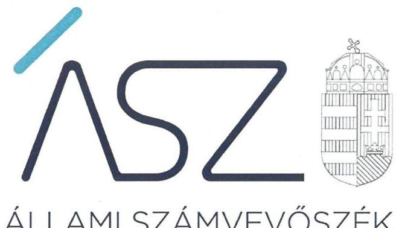
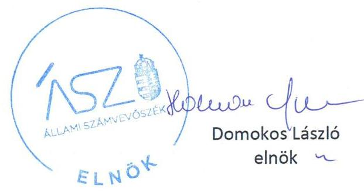
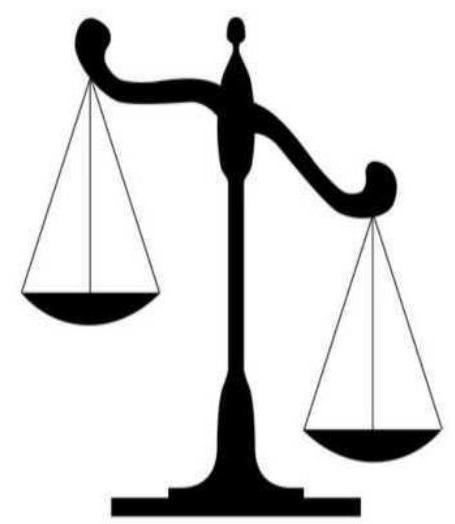

ÁLLAMI SZÁMVEVŐSZÉK

# JELENTÉS

A költségvetési támogatásban részesülő pártalapítványok 2017-2018. évi gazdálkodása törvényességének ellenőrzése

Megújuló Magyarországért Alapítvány

2020.

20171
www.asz.hu

---

ÁLLAMI SZÁMVEVŐSZÉK

# JELENTÉS

A költségvetési támogatásban részesülő pártalapítványok 2017-2018. évi gazdálkodása törvényességének ellenőrzése

Megújuló Magyarországért Alapítvány

2020.  08.  hó 17. nap

20171
www.asz.hu

---

# AZ ELLENŐRZÉST FELÜGYELTE: 

KAKAS SÁNDOR felügyeleti vezető

## AZ ELLENŐRZÉST VEZETTE ÉS A VÉGREHAJTÁSÁÉRT FELELŐS:

GÁL MAGDOLNA ellenőrzésvezető

## A PROGRAM ÖSSZEÁLLÍTÁSÁÉRT FELELŐS:

BERTALAN RUDOLF GYULA projektvezető

## A TÉMÁHOZ KAPCSOLÓDÓ KORÁBBI SZÁMVEVŐSZÉKI JELENTÉSEK:

- címe: Jelentés - A költségvetési támogatásban részesülő pártalapítványok 2015-2016. évi gazdálkodása törvényességének ellenőrzése Megújuló Magyarországért Alapítvány
- sorszáma: 18186

IKTATÓSZÁM: EL-2839-001/2020.
TÉMASZÁM: 2521
ELLENŐRZÉS-AZONOSÍTÓ SZÁM: V086507

---

# TARTALOMJEGYZÉK 

■ ÖSSZEGZÉS ..... 5
■ AZ ELLENŐRZÉS CÉLJA ..... 6
■ AZ ELLENŐRZÉS TERÜLETE ..... 7
■ AZ ELLENŐRZÉS HÁTTERE, INDOKOLTSÁGA ..... 8
■ A JELENTÉS LÉNYEGES KÉRDÉSKÖREI ..... 9
■ AZ ELLENŐRZÉS HATÓKÖRE ÉS MÓDSZEREI ..... 10
■ MEGÁLLAPÍTÁSOK ..... 13
■ JAVASLATOK ..... 16
■ MELLÉKLETEK ..... 17
I. sz. melléklet: Értelmező szótár ..... 17
II. sz. melléklet: Az ÁSZ 18186 számú jelentéséhez kapcsolódó intézkedési terv végrehajtásáról ..... 18
■ FÜGGELÉK: ÉSZREVÉTELEK ..... 21
■ RÖVIDÍTÉSEK JEGYZÉKE ..... 25

---

.

---

# ÖSSZEGZÉS 

A Megújuló Magyarországért Alapítvány 2017-2018. évi gazdálkodására vonatkozó belső szabályozása nem volt szabályszerű. A 2017-2018. években a könyvvezetés és a gazdálkodás során a jogszabályi rendelkezéseket nem tartotta be, a tevékenységéről szóló éves jelentések készítése során nem biztosította a költségvetési támogatás felhasználásának átláthatóságát, elszámoltathatóságát, az egyszerűsített éves beszámolók mérlegtételeit leltárral nem támasztotta alá. Az ÁSZ által a korábbi ellenőrzés során feltárt gazdálkodási szabálytalanságok továbbra is fennálltak.

## Az ellenőrzés társadalmi indokoltsága

A Párt tv. ${ }^{1} 9 / A$ § (1) bekezdése alapján a politikai kultúra fejlesztése érdekében tudományos, ismeretterjesztő, kutatási, oktatási tevékenység folytatása céljából létrehozott pártalapítványok gazdálkodása törvényességének ellenőrzése - Pártalapítványi tv. ${ }^{2}$ 4. § (2) bekezdése értelmében - az ÁSZ ${ }^{3}$ feladata. E törvény 4. § (4) bekezdése alapján az ÁSZ kétévente - kötelező jelleggel - ellenőrzi azoknak a pártalapítványoknak a gazdálkodását, amelyek állami költségvetési támogatásban részesültek.

Az ÁSZ, mint az Országgyűlés ellenőrző szerve a pártalapítványok gazdálkodása törvényességének/szabályszerűségének értékelésével hozzájárul ahhoz, hogy a társadalom objektív képet alkothasson a pártalapítványok működéséről. A jelentésben foglalt megállapítások, következtetések és javaslatok alapján a törvényalkotók konkrét lépéseket tehetnek a pártalapítványokra vonatkozó szabályozások megváltoztatása, átláthatóbbá, ellenőrizhetőbbé tétele irányába. Az ellenőrzött szervezetek szintjén a hiányosságok, szabálytalanságok feltárása, az ennek kapcsán megfogalmazott megállapítások elősegíthetik a pártalapítványok szabályszerű gazdálkodását.

Az ÁSZ stratégiájában megfogalmazta, hogy az államháztartáson kívülre nyújtott költségvetési támogatások és az ingyenes vagyonjuttatás ellenőrzésével hozzájárul ahhoz, hogy a közpénzeket a civil szervezetek is átlátható módon használják fel. A pártalapítványok gazdálkodása szabályszerűségének bemutatásával az ellenőrzés értékteremtő módon járul hozzá az ÁSZ stratégiai céljainak megvalósításához, a nyilvánosság megfelelő tájékoztatásához.

Az ÁSZ 2018. évben ellenőrizte a Pártalapítvány ${ }^{4}$ 2015-2016. évi gazdálkodásának törvényességét.

## Főbb megállapítások, következtetések, javaslatok

A Megújuló Magyarországért Alapítvány a 2017-2018. években a gazdálkodására vonatkozó belső szabályait nem a jogszabályi előírásoknak megfelelően alakította ki, nem határozta meg a költségvetési támogatás felhasználásának nyilvántartási szabályait. Megújuló Magyarországért Alapítvány az alkalmazott könyvviteli rendszereiben nem biztosította a tevékenységéről közzétett éves jelentések részeként elkészített - a költségvetési támogatás felhasználására vonatkozó - kimutatás adatainak alátámasztását, így nem teremtette meg a költségvetési támogatás felhasználásának elszámoltathatóságát.

A Megújuló Magyarországért Alapítvány ráfordításainak elszámolása a 2017-2018. években nem volt szabályszerű. A Megújuló Magyarországért Alapítvány a 2017-2018. évi egyszerűsített éves beszámolói mérlegtételeinek alátámasztásához nem állított össze leltárt, ezáltal nem igazolta, hogy a beszámolói a vagyoni helyzetéről megbízható és valós összképet mutatnak.

A Megújuló Magyarországért Alapítvány a 2015-2016. évi gazdálkodása ellenőrzéséről szóló 18186. számú számvevőszéki jelentésben foglalt megállapításokhoz kapcsolódó intézkedések közül négyet határidőben, négyet határidőn túl hajtott végre, két intézkedés végrehajtása elmaradt. A Megújuló Magyarországért Alapítványnál a végrehajtott intézkedések ellenére az alapvető szabályozási hiányosságok továbbra is fennálltak, nem biztosították az egyszerűsített éves beszámolók leltárral történő alátámasztását.

---

# AZ ELLENŐRZÉS CÉLJA 

Az ellenőrzés célja annak megállapítása volt, hogy a pártalapítvány törvényesen gazdálkodott-e, az éves számviteli beszámolók és a pártalapítvány tevékenységéről szóló éves jelentések a jogszabályi előírásoknak megfeleltek-e, a könyvvezetés és gazdálkodás során a vonatkozó jogszabályi rendelkezéseket és belső előírásokat betartották-e. Az ellenőrzés célja továbbá annak értékelése volt, hogy az előző számvevőszéki jelentésben foglalt megállapításokkal összhangban készített intézkedési tervben meghatározott feladatokat az ellenőrzött szervezet végrehajtottae.

---

# AZ ELLENŐRZÉS TERÜLETE 

## Megújuló Magyarországért Alapítvány

Az ellenőrzés a Párt tv. alapján a politikai kultúra fejlesztése érdekében tudományos, ismeretterjesztő, kutatási, oktatási tevékenység folytatása céljából, a Ptk. ${ }^{5}$ szerinti létesítő/alapító okiraton alapuló bírósági nyilvántartásba vétellel létrejött pártalapítvány gazdálkodására terjedt ki.

A pártalapítvány törvényes gazdálkodásának (könyvvezetése, beszámolása, jelentéstétele) szabályait alapvetően a Pártalapítványi tv-en túl, a Számv. tv. ${ }^{6}$ és a Számviteli vhr. ${ }^{7}$ határozzák meg.

Az utóellenőrzés az ÁSZ tv. ${ }^{8}$-nek megfelelően a Pártalapítványnál 2018. évben végzett ellenőrzés alapján készített 18186. számú jelentésben foglalt megállapításokra készített intézkedési tervben foglaltak végrehajtásának ellenőrzésére terjedt ki.

A Pártalapítványt a Párbeszéd Magyarországért Párt - a Párt tv-ben és a Pártalapítványi tv-ben biztosított lehetőséggel élve - 2014-ben alapította, 0,2 millió Ft induló vagyonnal.

Az Alapító okirat ${ }^{9}$ szerint a Pártalapítvány célja a politikai kultúra fejlesztése érdekében történő tudományos, ismeretterjesztő, kutatási és oktatási tevékenység volt. A Pártalapítvány legfőbb döntést hozó és kezelő szerve a hét taggal múködő Kuratórium ${ }^{10}$ volt.

A Pártalapítvány a 2017. évben 23,6 millió Ft, 2018. évben 14,5 millió Ft költségvetési támogatásban részesült, vállalkozási tevékenységet nem folytatott.

A Pártalapítvány az ellenőrzött időszakban nem alapított más jogalanyt, nem volt tagja más jogalanynak, illetve nem csatlakozott más jogalanyhoz.

---

# AZ ELLENŐRZÉS HÁTTERE, INDOKOLTSÁGA 

Társadalmi elvárás a közpénzek értékelvű, rendeltetésszerű felhasználása, a közpénzekből nyújtott támogatások átláthatóságának megteremtése, amelyhez az ÁSZ az államháztartásból nyújtott támogatások ellenőrzésével kíván hozzájárulni. A Párt tv. 9/A § (1) bekezdése alapján a politikai kultúra fejlesztése érdekében tudományos, ismeretterjesztő, kutatási, oktatási tevékenység folytatása céljából létrehozott pártalapítványok gazdálkodása törvényességének ellenőrzése - Pártalapítványi tv. 4. § (2) bekezdése értelmében - az ÁSZ feladata. E törvény 4. § (4) bekezdése alapján az ÁSZ kétévente - kötelező jelleggel - ellenőrzi azoknak a pártalapítványoknak a gazdálkodását, amelyek állami költségvetési támogatásban részesültek.

Az ÁSZ, mint az Országgyűlés ellenőrző szerve a pártalapítványok gazdálkodása törvényességének/szabályszerűségének értékelésével hozzájárul ahhoz, hogy a társadalom objektív képet alkothasson a pártalapítványok működéséről. Az ellenőrzés eredményeinek célzott felhasználói a nyilvánosság, a jogalkotó, továbbá a pártalapítványok esetén azok alapítója és szervei. A jelentésben foglalt megállapítások, következtetések és javaslatok alapján a törvényalkotók konkrét lépéseket tehetnek a pártalapítványokra vonatkozó szabályozások megváltoztatása, átláthatóbbá, ellenőrizhetőbbé tétele irányába. Az ellenőrzött szervezetek szintjén a hiányosságok, szabálytalanságok feltárása, az ennek kapcsán megfogalmazott megállapítások elősegíthetik a pártalapítványok szabályszerű gazdálkodását.

Az ÁSZ tv. 33. § (1) bekezdése értelmében az ellenőrzött szervezet vezetője köteles a jelentésben foglalt megállapításokhoz kapcsolódó intézkedési tervet összeállítani, és azt a jelentés kézhezvételétől számított harminc napon belül az ÁSZ részére megküldeni.

Az ÁSZ által befogadott intézkedési tervben foglaltak megvalósítását az ÁSZ törvény 33. § (7) bekezdésében foglaltak alapján - az ÁSZ utóellenőrzés keretében ellenőrizheti. Az utóellenőrzések keretében - az intézkedések értékelése során - az ÁSZ figyelembe veszi az ellenőrzött szervezetek működési feltételeiben, valamint a jogszabályi előírásokban bekövetkezett változásokat.

---

# A JELENTÉS LÉNYEGES KÉRDÉSKÖREI 

1. A Megújuló Magyarországért Alapítvány gazdálkodásának törvényessége biztositott volt-e?
2. A Megújuló Magyarországért Alapítvány könyvvezetése és gazdálkodása során a vonatkozó jogszabályi rendelkezéseket és belső elöírásokat betartották-e?
3. A Megújuló Magyarországért Alapítvány tevékenységéről szóló éves jelentések, az éves számviteli beszámolók a jogszabályi elöírásoknak megfeleltek-e?
4. A Megújuló Magyarországért Alapítvány az intézkedési tervben meghatározott feladatokat végrehajtotta-e?

---

# AZ ELLENŐRZÉS HATÓKÖRE ÉS MÓDSZEREI 

## Az ellenőrzés típusa

Szabályszerúségi ellenőrzés.

## Az ellenőrzött időszak

2017-2018. évek
Az utóellenőrzés tekintetében a 18186. számú számvevőszéki jelentés közzétételének napjától (2018. július 30.) a kiértesítő levél keltéig (2019. október 29.) tartó időszak.

## Az ellenőrzés tárgya

Az ellenőrzés tárgyát képezte a pártalapítvány gazdálkodása, a könyvvezetés szabályozása és gyakorlata szabályszerűsége, az éves számviteli beszámolókra és az alapítvány tevékenységéről szóló éves jelentésekre vonatkozó kötelezettség teljesítése, valamint a gazdálkodáshoz kapcsolódó ellenőrzések javaslatainak hasznosítására irányuló tevékenység.

Az ellenőrzés kiterjedt minden olyan körülményre és adatra, amely az ÁSZ jogszabályban meghatározott feladatainak teljesítéséhez, valamint a program végrehajtása folyamán felmerült újabb összefüggések feltárásához szükséges.

## Az ellenőrzött szervezet

Megújuló Magyarországért Alapítvány

## Az ellenőrzés jogalapja

Az ÁSZ tv. 1. § (3) bekezdése, 5. § (3) bekezdése, 33. § (7) bekezdése, a Pártalapítványi tv. 4. § (2) és (4) bekezdései.

## Az ellenőrzés módszerei

Az ellenőrzést az ÁSZ az Ellenőrzési program szempontjai, az ellenőrzött időszakban hatályos jogszabályok, a jelen ellenőrzésre irányadó ÁSZ módszertan figyelembe vételével végezte el.

Az ellenőrzés ideje alatt az ellenőrzött szervezettel történő kapcsolattartás az ÁSZ SZMSZ ${ }^{11}$-ének vonatkozó előírásai alapján történt.

---

Az ellenőrzést az ÁSZ az ellenőrzött szervezet által rendelkezésre bocsátott dokumentumokra, adatokra alapozta. A rendelkezésre bocsátott adatok, információk kontrollja az ellenőrzés keretében történt. Az ellenőrzés céljának eléréséhez szükséges bizonyítékok megszerzése az egyes adatok közvetlen, részletes elemzésével történt a következő ellenőrzési eljárások alkalmazásával: szemrevételezés, mintavétel, valamint elemző eljárás.

Mintavétellel ellenőrizte az ÁSZ a Pártalapítvány 2017-2018. évi kiadásai, ráfordításai elszámolásának, és a Pártalapítvány 2017. évi beszámolóinál a mérlegtételek besorolása, év végi értékelése, azok leltárral való alátámasztottsága szabályszerűségét.

A 2017-2018. évi, a Pártalapítvány által nyújtott támogatások elszámolásának, és a Pártalapítvány 2018. évi beszámolóinál a mérlegtételek besorolása, év végi értékelése, azok leltárral való alátámasztottsága szabályszerűsége esetében tételes ellenőrzésre került sor.

A mintavétellel ellenőrzött területek esetében minden egyes tétel vonatkozásában a szabályszerűségre vonatkozó kérdéseket tett fel az ÁSZ. Szabályszerűnek minősült egy ellenőrzött területet, amennyiben 95\%-os bizonyossággal az ellenőrzött sokaságban az átlagos hibaarány legfeljebb 10\%, nem szabályszerűnek, amennyiben 10\%-nál magasabb arányt képviselt.

Abban az esetben, ha az ellenőrzött sokaság tekintetében a 10\%-os hibaarányhoz való viszony megítélésnek megbízhatósága nem érte el a 95\%ot, annak elérése érdekében az értékelést további szempontokkal egészítette ki az ÁSZ, és figyelembe vette a feltárt hibák értékét.

Az ellenőrzési bizonyítékként felhasználható adatforrások közé tartoztak egyrészt az Ellenőrzési program részletes szempontjainál felsorolt adatforrások, másrészt minden egyéb - az ellenőrzés folyamán - feltárt, az ellenőrzés szempontjából információt tartalmazó dokumentum.

Az ellenőrzés lefolytatásához az ellenőrzött a tanúsítványok kitöltésével, valamint az ÁSZ által kért dokumentumok elektronikus megküldésével szolgáltatott adatokat. Az így rendelkezésre bocsátott adatok, információk, a tanúsítványok adatai valódiságának kontrollja az ellenőrzés keretében történt.

Az utóellenőrzés megállapításait az ÁSZ rendelkezésére álló dokumentumok, valamint az ÁSZ adatbekérése szerint, az ellenőrzött szervezetek által elektronikusan rendelkezésre bocsátott dokumentumok, adatok alapján értékelte. Az ÁSZ az ellenőrzés során az intézkedési tervekben előírt feladatokat, azok végrehajthatósága, illetve végrehajtása szempontjából az alábbiak szerint értékelte:
"határidőben végrehajtott" a feladat, ha a teljesítés dokumentáltan, az intézkedési tervben előírt határidőben és tartalommal megtörtént;
"határidőn túl végrehajtott" a feladat, ha annak teljesítése az intézkedési tervben meghatározott módon, de az abban előírt határidőn túl történt meg;
"nem végrehajtott" a feladat, ha a végrehajtás nem történt meg, vagy amennyiben a teljesítést/végrehajtást nem dokumentálták, dokumentumokkal nem tudták igazolni annak teljesítését;
"okafogyottá vált" a feladat, ha végrehajtására - meghatározott esemény bekövetkezése, továbbá külső körülmény, a működést

---

érintő feltétel változása miatt - már nem volt szükség, illetve lehetőség, és egyértelműen megállapítható, hogy az intézkedést szükségessé tevő körülmény a jövőben nem fordulhat elő;
„nem időszerű" az a feladat, amelynek ellenőrzési időszakon belüli végrehajtására azért nem került (kerülhetett) sor, mert az intézkedés alapjául szolgáló esemény nem következett be, de annak jövőbeni előfordulása lehetséges, a végrehajtása nem volt esedékes, vagy a végrehajtás határideje még nem járt le.

---

# 1. A Megújuló Magyarországért Alapítvány gazdálkodásának törvényessége biztosított volt-e? 

Összegző megállapítás

Az ellenőrzött időszakban a Pártalapítvány gazdálkodására vonatkozó belső szabályozása nem felelt meg a jogszabályi előírásoknak.

A Pártalapítvány kialakította a számviteli politikáját ${ }^{12}$, és annak keretében a leltározási szabályzatot ${ }^{13}$, az értékelési szabályzatot ${ }^{14}$ és a pénzkezelési szabályzatot ${ }^{15}$.

A Pártalapítvány számlarendje ${ }^{16}$ a 2017-2018. években a Számv. tv. 161. § (2) bekezdése b)-d) pontjaiban foglaltak ellenére nem tartalmazta az alkalmazásra kijelölt számlák értéke növekedésének, csökkenésének jogcímeit, a számlákat érintő gazdasági eseményeket, azok más számlákkal való kapcsolatát, a főkönyvi számlák és az analitikus nyilvántartás kapcsolatát, továbbá a számlarendben foglaltakat alátámasztó bizonylati rendet.

A 2017-2018. években a Számv. tv. 161/A. § (2) bekezdése, a Számviteli vhr. 2 14. § (1) bekezdése, továbbá a számviteli politika IV. pontjában előírtak ellenére a Pártalapítvány a nyilvántartási rendszerét nem alakította ki olyan részletezettséggel, hogy abból a Pártalapítványi tv. 3/A. §. (3) bekezdés b) pontja szerinti - a költségvetési támogatás felhasználására vonatkozó kimutatás adataival kapcsolatos - információk rendelkezésre álljanak.

## 2. A Megújuló Magyarországért Alapítvány könyvvezetése és gazdálkodása során a vonatkozó jogszabályi rendelkezéseket és belső előírásokat betartották-e?

## Összegző megállapítás

A Pártalapítvány a 2017-2018. években a könyvvezetése és gazdálkodása során a vonatkozó jogszabályi rendelkezéseket nem tartotta be.

A Pártalapítvány a 2017. és a 2018. években a Számv. tv. 161/A. § (2) bekezdésének előírása ellenére a közpénzek felhasználásának ellenőrizhetősége érdekében a nyilvántartási (könyvvezetési) rendszerében nem alkalmazott olyan részletezést, amely biztosítja a Pártalapítványi tv. 3/A. § (3) bekezdés b) pontjában előírt, a költségvetési támogatás felhasználására vonatkozó kimutatás adatainak alátámasztását.

A Pártalapítvány ráfordításainak elszámolása a 2017-2018. években nem volt szabályszerű, mert:
$\longrightarrow$ a Pártalapítvány a Számv. tv. 165. § (2) bekezdése előírása ellenére bizonylat nélkül rögzített 2017. évi gazdasági eseményt a könyvviteli nyilvántartásba,

---

$\longrightarrow$ a Pártalapítvány a 2017-2018. években a Számv. tv. 165. § (1) bekezdésében foglaltak ellenére a kifizetett munkabér összegét bizonylattal nem támasztotta alá, mert a munkavállaló munkaszerződésében szereplő munkabér összege és a kifizetett összeg eltérő volt,
$\longrightarrow$ a kiadásokat alátámasztó bizonylatok nem feleltek meg a 20172018. években a Számv. tv. 167. § (1) bekezdés c) pontjában előírt követelményeknek, mert nem tartalmazták az utalványozó és a rendelkezés végrehajtását igazoló személy aláírását, a 2018. évben a Számv. tv. 167. § (1) bekezdés h) pontjában foglaltak ellenére a bizonylatokon nem tüntették fel az érintett könyvviteli számlákra történő hivatkozást.
A Pártalapítvány által a 2017-2018. években harmadik fél részére nyújtott támogatások elbírálása, a támogatási szerződések megkötése szabályszerű volt, azonban a támogatások számviteli elszámolását alátámasztó bizonylatok a Számv. tv. 167. § (1) bekezdés c) pontjában foglaltak ellenére nem tartalmazták az utalványozó személy aláírását.

A 2017. évben a támogatások számviteli elszámolása nem volt szabályszerű, mert az elektronikus pénz formájában kapott adományokat a Pártalapítvány a Számv. tv. 31. §-ában foglaltak ellenére a pénzeszközök helyett a követelések között számolta el. A Pártalapítvány a Számv. tv. 165. § (3) bekezdés a) pontjában előírtakat megsértve 2017. évben az egyéb pénzeszközöket érintő tételeket nem a tárgyhót követő hó 15 -ig rögzítette a könyvekben, hanem 2017. évben az év utolsó napján, egyösszegben.

Az ellenőrzött időszakban a Pártalapítvány az alapító párt részére vagyoni hozzájárulást nem nyújtott.

# 3. A Megújuló Magyarországért Alapítvány tevékenységéről szóló éves jelentések, az éves számviteli beszámolók a jogszabályi előírásoknak megfeleltek-e? 

## Összegző megállapítás

A 2017-2018. években a Pártalapítvány tevékenységéről szóló éves jelentések, és az éves számviteli beszámolók elkészítésénél nem tartották be a jogszabályi előírásokat.

A Pártalapítvány által a 2017. évi és 2018. évi tevékenységéről készített éves jelentéseiben a költségvetési támogatás felhasználására vonatkozó kimutatás adatai a 2. pontban leírt könyvvezetési hiányosságok miatt nem voltak nyilvántartással alátámasztottak.

A Pártalapítvány a 2017. évi tevékenységéről szóló éves jelentése közzététele vonatkozásában nem tartotta be a Pártalapítványi tv. 3/A. § (5) bekezdésének előírásait, mert az éves jelentését a Magyar Közlöny mellékleteként megjelenő Hivatalos Értesítőben a 2018. június 30-i határidő helyett 2018. szeptember 20-án tette közzé.

A Pártalapítvány a 2017-2018. évi egyszerűsített éves beszámolói elkészítéséhez, a mérleg-tételek alátámasztásához a Számv. tv. 69. § (1) bekezdésében foglaltak ellenére nem állított össze leltárt, mely tételesen és ellenőrizhető módon tartalmazza a mérleg fordulónapján meglévő eszközeit és forrásait mennyiségben és értékben.

---

# 4. A Megújuló Magyarországért Alapítvány az intézkedési tervben meghatározott feladatokat végrehajtotta-e? 

## Összegző megállapítás

A Pártalapítvány az intézkedési tervben meghatározott feladatok közül négyet határidőben, négyet határidőn túl hajtott végre, két feladat végrehajtása elmaradt.

A 18186. számú számvevőszéki jelentésben ${ }^{17}$ megfogalmazott intézkedést igénylő megállapításokkal összhangban a Pártalapítvány 10 pontból álló intézkedési tervet készített.

A Pártalapítvány az előírt határidőben gondoskodott:

- a pénzkezelési szabályzatban annak előírásáról, hogy kizárólag alapbizonylat megléte esetén indítható átutalás,
- a pénzkezelési szabályzatban a könyvviteli elszámolást alátámasztó bizonylat alaki és formai kellékeinek rögzítéséről,
a 2014-2016. évi beszámolók módosításáról,
- a módosított beszámolók közzétételéről.

A Pártalapítvány az intézkedési tervben vállalt határidőn túl:
alkotta meg a kapott támogatások közzétételéről szóló eljárásrendjét,
módosította a számviteli politikát a továbbutalási céllal kapott támogatások egyéb bevételkénti elszámolása tekintetében,
alakította ki a Pártalapítvány SZMSZ4-ében az ügyvezető igazgató operatív irányító és adminisztratív vezetői jogkört, annak érdekében, hogy kizárólag befogadott, ellenőrzött és utalványozott számla kerüljön kifizetésre,
rendelte el a Felügyelő Bizottság útján a bizonylatok meglétének ellenőrzését, a hiányzó dokumentumok beszerzését.
A Pártalapítvány az alábbi intézkedési tervben vállalt feladatait nem hajtotta végre:
a Pártalapítvány az SZMSZ4-ét nem egészítette ki a tevékenységéről szóló éves jelentés határidőben történő közzététele érdekében,
a Pártalapítvány nem írta elő az SZMSZ4-ében a Kuratórium számára a beszámolót alátámasztó leltár ellenőrzését, így nem gondoskodott a leltározási szabályzatban foglaltak maradéktalan teljesüléséről.
Az intézkedési tervben meghatározott feladatokat, határidőket, felelősöket és a feladatok végrehajtását a II. számú melléklet mutatja be.

---

# JAVASLATOK 

Az ÁSZ tv. 33. § (1) bekezdésében foglaltak értelmében az ellenőrzött szervezet vezetője köteles a jelentésben foglalt megállapításokhoz kapcsolódó intézkedési tervet összeállítani és azt a jelentés kézhezvételétől számított 30 napon belül az ÁSZ részére megküldeni. Amennyiben az ellenőrzött szervezet vezetője nem küldi meg határidőben az intézkedési tervet, vagy továbbra sem elfogadható intézkedési tervet küld, az Állami Számvevőszék elnöke az ÁSZ tv. 33. § (3) bekezdése a) és b) pontjaiban foglaltakat érvényesítheti.

## A Megújuló Magyarországért Alapítvány kuratóriumi elnökének

1. Gondoskodjon arról, hogy a számlarend feleljen meg a Számv. tv. előírásainak.
(1. megállapítás 2. bekezdése alapján)
2. Intézkedjen a nyilvántartási (könyvvezetési) rendszerének továbbrészletezéséről, oly módon, hogy abból a közpénzek felhasználásával kapcsolatos információk rendelkezésre álljanak.
(2. megállapítás 1. bekezdése alapján)
3. Intézkedjen a ráfordítások elszámolása során a Számv. tv. előírásainak betartására.
(2. megállapítás 2. bekezdés 2. és 3. francia bekezdése és a 3. bekezdése alapján)
4. Gondoskodjon a beszámolók mérlegtételeinek alátámasztásához a Számv. tv. előírásai szerinti leltár összeállításáról.
(3. megállapítás 3. bekezdése alapján)

---

# MELLÉKLETEK 

- I. SZ. MELLÉKLET: ÉRTELMEZŐ SZÓTÁR
alapítvány
gazdasági-vállalkozási tevékenység
költségvetésből juttatott/nyújtott forrás/támogatás
pártalapítvány

Az alapítvány az alapító által az alapító okiratban meghatározott tartós cél folyamatos megvalósítására létrehozott jogi személy. Az alapító az alapító okiratban meghatározza az alapítványnak juttatott vagyont és az alapítvány szervezetét. Alapítvány nem alapítható gaz-dasági-vállalkozási tevékenység folytatására. Az alapítvány az alapítványi cél megvalósításával közvetlenül összefüggő gazdasági tevékenység végzésére jogosult. Alapítvány nem lehet korlátlan felelősségű tagja más jogalanynak, nem létesíthet alapítványt és nem csatlakozhat alapítványhoz. (Forrás: Ptk. 3:378. §, 3:379. § (1) - (3) bekezdés)
A jövedelem- és vagyonszerzésre irányuló vagy azt eredményező, üzletszerűen végzett gazdasági tevékenység, kivéve az adomány (ajándék) elfogadását, a létesítő okiratban meghatározott cél szerinti tevékenységet (ideértve a közhasznú tevékenységet is), - 2015. november 28 -tól - a pénzeszközök betétbe, értékpapírba, társasági részesedésbe történő elhelyezését és az ingatlan megszerzését, használatának átengedését és átruházását. (Forrás: Ectv. ${ }^{18}$ 2. § 11. pont.)
A pártalapítványoknak a Párt tv. 9/A. § (1) bekezdése és a Pártalapítványi tv. 1. § előírásainak értelmében, az éves költségvetési törvények szerint - jellemzően az 1. számú melléklet I. Országgyűlés fejezet 9. Pártalapítványok támogatás címen - az állami költségvetésből juttatott forrás/támogatás.
Az államháztartás központi alrendszeréből - a Tb alap kivételével - ellenérték nélkül, pénzben nyújtott költségvetési támogatás (Forrás: Áht ${ }^{19}$. 1. § 14. pont)
A politikai kultúra fejlesztése érdekében, tudományos, ismeretterjesztő, kutatási és oktatási tevékenység folytatása céljából pártok által létrehozott, külön jogszabályban - a Pártalapítványi tv. 1. § és 3. § (1) bekezdése - meghatározott, jogi személynek minősülő egyéb szervezet, speciális jogállású alapítvány (Forrás: Párt tv. 9/A. § (1) bekezdés, Pártalapítványi tv. 1. §, Ectv. 1. § (2) bekezdés, 2. § 6. c) pont, Számv. tv. 3. § (1) bekezdése 4. pont, Számviteli vhr. 2. § (1) bekezdés I) pont)

---

|  1. | Az Alapítvány könyvviteli szolgáltatását végző könyvelő gazdasági társaság útján módosította az Alapítvány Számv. tv-nek megfelelő éves beszámolóját és a továbbutalási céllal kapott támogatást a Számviteli vhr. ${ }^{20}$ 16. § (6) bekezdésének megfelelően egyéb bevételként mutatta ki. Az Alapítvány Kuratóriuma 2018. június 21. napi határozatával a módosított 2016. évi beszámolót elfogadta. | 2018. évben a megjelentetés megindítása tekintetében 2018. június 21. | dr. Csomós Lilla Annamária ügyvéd és az alapítvány könyvelési feladatait ellátó megbízottja | Az Alapítvány Kuratóriuma 2018. június 21. napi határozatával a módosított 2016. évi egyszerűsített éves beszámolót elfogadta.  |
| --- | --- | --- | --- | --- |
|  2. | Az Alapítvány Kuratóriuma az intézkedési javaslat elfogadását követő 30 napon belül felülvizsgálja a bizonylatok utalványozásának és a rendelkezést végrehajtó általi igazolás rendjét és ennek megfelelően módosítja az Alapítvány számviteli politikáját és annak vonatkozó mellékleteit. |  | A Felügyelő Bizottság elnöke,
Szűcs Balázs ügyvezető igazgató és az Alapítvány könyvelési feladatait ellátó megbízottja | A pártalapítvány 2018. december 14-én hatályba helyezte az új számviteli politikáját, illetve annak mellékleteit. A Pénzkezelési szabályzat VI. pontjában rögzítette, hogy átutalás indítása kizárólag Számv. tv. szerinti alapbizonylattal történhet, a VIII. pontja alatt rögzítette a könyvviteli elszámolást közvetlenül alátámasztó bizonylat általános alaki és tartalmi kellékeit a Számv. tv. 167. §-ának megfelelően.  |
|  3. | Az intézkedési javaslat elfogadását követő 60 napon belül az Alapítvány könyvviteli szolgáltatását végző gazdasági társasága útján gondoskodik arról, hogy a kifizetést alátámasztó dokumentumokon érintett könyvviteli számlákra történő hivatkozás feltüntetésre kerüljön. |  | Intézkedési javaslat elfogadását követő 60 napon belül | A pártalapítvány 2018. december 14-én hatályba helyezte az új számviteli politikáját, illetve annak mellékleteit. A Pénzkezelési szabályzat VII. pontja alatt rögzítette, hogy "A könyvelést végző személy feladata: h) a könyvelés módjára, az érintett könyvviteli számlákra történő hivatkozás"  |
|  4. | Az Alapítvány intézkedett a 2014-2015-2016. évi éves beszámolójának a Számviteli törvény alapján történő módosításáról. Az Alapítvány Kuratóriuma a módosított éves beszámolókat elfogadta. Az Alapítvány intézkedik a módosított éves beszámolók 2018. június 30-ig a Magyar Közlöny Hivatalos Értesítőjében történő megjelentetéséről, annak megrendelésével, ezáltal teljesíti jogszabályi kötelezettségét. A módosított éves beszámolóknak az Alapítvány honlapján történő közzétételéről az Alapítvány gondoskodik.
A Kuratórium elnöke és az ügyvezető igazgató intézkedik arról, hogy az Alapítvány éves mérlege, éves jelentése és beszámolója, valamint rövid tartalmi beszámolója minden év április 20. napjáig elkészüljön, azt a Felügyelő Bizottság és a Kuratórium április 30. napjáig elfogadja és a megjelentetés megkezdésére minden év május 10. napjáig sor kerüljön. | 2018. évben a megjelentetés megindítása tekintetében 2018. június 21.
2018. június 30. | Kuratórium elnöke és Szűcs Balázs ügyvezető igazgató | A Pártalapítvány 2014-2016. évi Számvitel tv-nek megfelelő egyszerűsített éves beszámolóit, a módosított éves szöveges beszámolóit a Pártalapítvány Kuratóriuma 2018. június 21-ei határozatával elfogadta és intézkedett annak közzétételéről. A módosított éves jelentések a Magyar Közlöny Hivatalos Értesítőjében történő megjelentetéséről gondoskodott, a megjelenés 2018. szeptember 20-án valósult meg a Hivatalos Értesítő 51. számában. A módosított beszámolót a Pártalapítvány a honlapján is közzétette. A Pártalapítvány 2018. évi jelentését a Kuratórium 2019. március 1-jén elfogadta.  |

---

|  Sorszám | Intézkedési |  | Az intézkedési | Az intézkedési  |
| --- | --- | --- | --- | --- |
|   |  |  | tervben meghatározott határidő | tervben meghatározott feladat felelőse  |
|   |  | Határidőn túl végrehajtott feladatok |  |   |
|  5. | A Pártalapítvány támogatásának 30 napon belül történő közzétételi rendjéről szóló belső, a Kuratórium által elfogadott szabályzat hatálybaléptetése. Minden Alapítványi támogatás 30 napon belüli közzététele felelősének kinevezése. A honlapra történő felvitel 30 naponkénti aktualizálása. | 2018. augusztus 30. ezt követően folyamatosan | Szűcs Balázs ügyvezető igazgató (Zeislerné Hernádi Eszter 2018. augusztus 30-ig) | A Pártalapítvány megalkotta a 2019. január 03-ától hatályos „Megújuló Magyarországért Alapítvány támogatások törvényi előírásokkal egyező honlapon történő közzététellel kapcsolatos Eljárás rendjét", amely rendelkezik a támogatások közzétételéről, továbbá 2019. július 10-én készült jegyzőkönyvben (és az eljárásrendben is) az ügyvezető igazgató lett megjelölve a támogatások honlapon közzétételének felelősévé, a közzététel ellenőrzését pedig a Kuratórium elnöke látja el.  |
|  6. | Az Alapítvány módosítja a Számviteli szabályzatának azt a részét, amely a továbbutalási céllal kapott bevételeket szabályozza annak érdekében, hogy a jövőben a jogszabályi előírásoknak megfelelően történjen ezen tételek kimutatása. | 2018. június 21. | dr. Csomós Lilla Annamária ügyvéd és az Alapítvány könyvelési feladatait ellátó megbízottja | A Pártalapítvány módosította a Számviteli politikáját, a 2018. december 14-étől hatályos Számviteli Politika 9. oldalán az eredmény-kimutatáshoz kapcsolódó kiegészítések között a Számviteli vhr. 16. § (6) bekezdésének megfelelően a továbbutalási céllal kapott támogatások tekintetében az egyéb bevételkénti kimutatását írta elő.  |
|  7. | Az Alapítvány az ügyvezető igazgató operatív irányítói feladatkör és jogkör kialakításával folyamatosan gondoskodik arról, hogy kizárólag befogadott, ellenőrzött és utalványozott számla alapján kerüljön számla ellenértéke kifizetésre és átutalásra. Az Alapítvány a Felügyelő Bizottság útján ellenőrzi a korábban kifizetett és utalványozott számlákat és kifizetéseket, annak érdekében, hogy az esetleges szervezeti működési rendszerben még fellelhető hiányosságok visszamenőlegesen is megszüntetésre kerüljenek. | 2018. október 26. napjától folyamatosan | A Felügyelő Bizottság elnöke, Szűcs Balázs ügyvezető igazgató és az Alapítvány könyvelési feladatait ellátó megbízottja. | A Pártalapítvány a 2018. december 14-étől a hatályos SZMSZs 9. pontjában kialakította az ügyvezető igazgató operatív irányító és adminisztratív vezetői feladatkört. A Felügyelő Bizottság 2019. január 18-án készült jegyzőkönyvében rendelte el a számlák ellenőrzését, melyet a 2019. július 10-én jegyzőkönyv alapján elvégeztek.  |
|  8. | Az intézkedési javaslat elfogadását követő 90 napon belül az Alapítvány átvizsgálja 2014-2016 évi könyvelési bizonylatait annak megállapítására, hogy Számv. tv. 165. § (1)-(2) bekezdéseinek előírása ellenére a könyvviteli nyilvántartásban rögzítettek mely gazdasági események kerültek bizonylat nélkül rögzítésre és azok eredetivel mindenben megegyező hiteles másolatának beszerzéséről gondoskodik. Az Alapítvány ügyvezető igazgatója útján gondoskodik, az utalványozás, ellenőrzés és a számlázás rendjének számviteli tv. szerinti rendszerének betartásáról. | intézkedési javaslat elfogadását követő 90 napon belül | Szűcs Balázs ügyvezető igazgató | A Felügyelő Bizottság 2019. január 18-án készült jegyzőkönyvében rendelte el a bizonylatok meglétének ellenőrzését, melyet a 2019. július 10-én jegyzőkönyv alapján a bizonylat nélkül rögzítésre került tételekhez tartozó eredetivel mindenben megegyező hiteles másolatok, hiányzó dokumentumok maradéktalanul beszerzésre kerültek.  |

---

|  9. | Az Alapítvány módosítja Szervezeti és Működési Szabályzatát annak érdekében, hogy a Pártalapítványi tv. 3/A § (5) pontja szerint a tevékenységéről szóló jelentését a tárgyévet követő évben, legkésőbb június 30-áig a Magyar Közlöny mellékleteként megjelenő Hivatalos Értesítőben, továbbá honlapján közzétegye. | 2018. június 30 | Szűcs Balázs ügyvezető igazgató | A 2018. december 14-étől hatályos SZMSZ₄ a vállalt intézkedésre nézve nem tartalmaz rendelkezéseket  |
| --- | --- | --- | --- | --- |
|  10. | A Pártalapítvány a Számv. tv. 96. § (1) bekezdésének rendelkezéseiben foglaltakra tekintettel a Számv. tv. 69 § (1) bekezdésében foglaltaknak megfelelően, aktuális tárgyi eszköz leltára alapján, 2014-2015-2016. évi beszámolók mérlegtételeit alátámasztó leltárját módosítja 2016. december 31. napi fordulónappal, amely tételesen, ellenőrizhető módon tartalmazza a mérleg fordulónapján meglévő eszközöket és forrásokat mennyiségben és értékben. |  |  | Az elkészített leltárak nem voltak teljes körűek. Nem tartalmazták valamennyi mérlegtétel vonatkozásában a mérleg tételek alátámasztására vonatkozó adatokat.  |
|   | Az Alapítvány intézkedik, hogy a jövőben a Leltározási és Értékkezelési Szabályzatban foglaltak maradéktalanul teljesüljenek. Ennek érdekében módosítja a Szervezeti és Működési Szabályzatát az alábbiak szerint: "A kuratórium feladata: az éves beszámoló elfogadása előtt ellenőrizni, hogy a mérleget alátámasztó leltárak tételesen, ellenőrizhető módon tartalmazzák a mérleg fordulónapján meglévő eszközöket és forrásokat mennyiségben és értékben." | intézkedési javaslat elfogadását követő 30 napon belül | Szűcs Balázs ügyvezető igazgató és a Kuratórium | A 2018. december 14-étől hatályos SZMSZ₄ a vállalt intézkedésre nézve nem tartalmaz rendelkezéseket. A 2017-2018. évi egyszerűsített éves beszámoló mérlegtételeit nem támasztotta alá leltárral, a pénzeszközök, a követelések, az aktív időbeli elhatárolások és a rövid lejáratú kötelezettségek leltározását nem végezte el.  |

---

# FÜGGELÉK: ÉSZREVÉTELEK 

A jelentéstervezetet a Számvevőszék 15 napos észrevételezésre megküldte az ellenőrzött szervezet vezetőjének az ÁSZ tv. 29. §* (1) bekezdése előírásának megfelelően.

A Megújuló Magyarországért Alapítvány kuratóriumi elnöke a jelentéstervezet megállapításaira észrevételt tett.
Az ÁSZ tv. 29. § (3) bekezdésével összhangban az Állami Számvevőszék a Függelékben feltünteti az ellenőrzés megállapításaival kapcsolatban tett, figyelembe nem vett észrevételeket, és megindokolja, hogy azokat miért nem fogadta el.

A Megújuló Magyarországért Alapítvány (továbbiakban: Pártalapítvány) kuratóriumi elnöke által a 2020. július 8-án kelt levélben tett észrevételek és azok kezelésének indokolása:

1. A gazdálkodásra vonatkozó belső szabályozással kapcsolatban tett észrevétel (Jelentéstervezet 1. megállapítás 12. bekezdése)

A Megújuló Magyarországért Alapítvány kuratóriumi elnöke észrevételében elfogadta a jelentéstervezet megállapítását, és arról számolt be, hogy a Pártalapítvány 30 napon belül, az Állami Számvevőszék részére megküldendő intézkedési tervében részletesen meghatározza a Számv. tv. 161. § (2) bekezdése b)-d) pontjaiban meghatározottak szerint elkészítésre kerülő számlarend elkészítésének határidejét, egyeztetve a Pártalapítvány számára könyvviteli szolgáltatást végző megbízottjával. A hatályos jogszabályi rendelkezéseknek megfelelő számlarendjének a Pártalapítvány felügyelőbizottságának ellenőrzését és jóváhagyását követően, a Pártalapítvány kuratóriuma fogja elfogadni és hatályba léptetni.

A Pártalapítvány kuratóriumi elnöke észrevételében elfogadta a jelentéstervezet megállapítását, és jövőbeni tervezett intézkedésről számolt be. Az észrevétel alapján a jelentéstervezet megállapításának módosítása nem indokolt.
2. A gazdálkodásra vonatkozó belső szabályozással kapcsolatban tett észrevétel (Jelentéstervezet 1. megállapítás 3. bekezdése)

A Pártalapítvány kuratóriumi elnöke észrevételében leírta, hogy a Pártalapítvány mérlegének kiegészítő melléklete, valamint a minden évben elkészített és az ellenőrzés során az ÁSZ részére átadott költségvetési-terv alapján készített kiadási kimutatással meg kívánt felelni a Számv. tv. 161/A. § (2) bekezdése, a Számviteli vhr. 14. § (1) bekezdése és a Pártalapítványi tv. 3/A. §. (3) bekezdés b) pontja szerinti - a költségvetési támogatás felhasználására vonatkozó

[^0]
[^0]:    * 29. § (1) Az Állami Számvevőszék az ellenőrzési megállapításait megküldi az ellenőrzött szervezet vezetőjének vagy az általa megbízott személynek, és annak, akinek személyes felelősségét állapította meg.
    (2) Az ellenőrzött szervezet vezetője és a felelősként megjelölt személy az ellenőrzés megállapításaira tizenöt napon belül írásban észrevételt tehet.
    (3) Az Állami Számvevőszék az észrevételre a beérkezésétől számított harminc napon belül írásban válaszol. A figyelembe nem vett észrevételeket köteles a jelentésben feltüntetni, és megindokolni, hogy azokat miért nem fogadta el.

---

kimutatási követelménynek. A Pártalapítvány bevételei megbontásra kerültek költségvetési és egyéb bevételekre. A Pártalapítvány a kiadási oldalon a költségvetési támogatás felhasználására külön kimutatást eddig nem készített. A Pártalapítvány kuratóriumi elnöke arról számolt be, hogy a jelentéstervezet kézhezvételét követően elkészítésre kerülő intézkedési tervben részletesen meghatározzák a költségvetési támogatás felhasználása kimutatásának módját.

A Pártalapítvány kuratóriumi elnöke észrevételében elfogadta a jelentéstervezet megállapítását, és jövőbeni tervezett intézkedésről számolt be. Az észrevétel alapján a jelentéstervezet megállapításának módosítása nem indokolt.

# 3. A könyvvezetés és a gazdálkodás során a vonatkozó jogszabályi rendelkezésekkel kapcsolatban tett észrevétel (Jelentéstervezet 2. megállapítás 1. bekezdése) 

A Pártalapítvány kuratóriumi elnöke észrevételében arról számolt be, hogy a Pártalapítvány az 1. számú észrevételben részletezett módon az intézkedési tervében meghatározott határidőben módosításra kerülő számlatükörben és számlarendben részletesen szabályozza a Pártalapítványnak a Számv. tv. 161/A. § (2) bekezdése szerinti, a közpénzek felhasználásának ellenőrizhetősége érdekében módosított nyilvántartási (könyvvezetési) rendszerét és nyilvántartását.

A Pártalapítvány kuratóriumi elnöke észrevételében elfogadta a jelentéstervezet megállapítását, és jövőbeni tervezett intézkedésről számolt be. Az észrevétel alapján a jelentéstervezet megállapításának módosítása nem indokolt.

## 4. A könyvvezetés és a gazdálkodás során a vonatkozó jogszabályi rendelkezésekkel kapcsolatban tett észrevétel (Jelentéstervezet 2. megállapítás 2. bekezdés 3. francia bekezdése)

A Pártalapítvány kuratóriumi elnökének észrevétele szerint a Pártalapítvány által befogadott számlákon a teljesítési igazolás és az utalványozó aláírása, a könyvviteli számlára történő hivatkozás minden esetben megtalálható volt. A rendelkezés végrehajtását igazoló személy aláírását a számlák nem tartalmazzák, ezen eljárás módosításáról az intézkedési tervben fog a Pártalapítvány rendelkezni.

A Pártalapítvány kuratóriumi elnökét az észrevételben foglaltakra válaszolva tájékoztattuk, hogy az ÁSZ az EL-1659015/2019. iktatószámú adatbekérő levél 2/A. számú mellékletében szereplő mintatételekhez kapcsolódóan a 3. számú melléklet dokumentumjegyzék szerint kérte az anyag- és szolgáltatás beszerzési eljárással kapcsolatos (Kbt., ajánlatkérési) dokumentumok, szerződések, számlák, a teljesítést igazoló bizonylatok, a pénzügyi kifizetést alátámasztó kiadási bizonylatok/bankértesítők, elszámolások, számviteli számlákra történt hivatkozást tartalmazó bizonylatok dokumentumait, valamint 2/D. számú mellékletében szereplő mintatételekhez kapcsolódóan a 3. számú melléklet dokumentumjegyzék szerint kérte a megbízási szerződések, külső személyi jellegű kifizetésekhez kapcsolódó egyéb dokumentumok, bérkartonok, juttatások és költségtérítés számfejtését, kifizetését alátámasztó bizonylatok, teljesítésigazolások dokumentumait.

Az ÁSZ mintavétellel ellenőrizte a Pártalapítvány 2017-2018. évi kiadásai, ráfordításai elszámolásának szabályszerűségét. A mintavétellel ellenőrzött területek esetében minden egyes tétel vonatkozásában a szabályszerűségre vonatkozó kérdéseket tett fel az ÁSZ. Szabályszerűnek minősült egy ellenőrzött területet, amennyiben 95\%-os bizonyossággal az ellenőrzött sokaságban az átlagos hibaarány legfeljebb 10\%, nem szabályszerűnek, amennyiben 10\%-nál magasabb arányt képviselt. Abban az esetben, ha az ellenőrzött sokaság tekintetében a 10\%-os hibaarányhoz való viszony megítélésnek megbízhatósága nem érte el a 95\%-ot, annak elérése érdekében az értékelést további szempontokkal egészítette ki az ÁSZ, és figyelembe vette a feltárt hibák értékét.

A 2017-2018. évi mintatételek ismételt felülvizsgálata során megállapítottuk, hogy a Számv. tv. 167. § (1) bekezdés c) pontjában foglaltak ellenére a bizonylatok több esetben nem tartalmazták az utalványozó és a rendelkezés végrehajtását igazoló személy aláírását. Továbbá megállapítottuk, hogy a 2018. évi mintatételek esetében a Számv. tv. 167. § (1) bekezdés h) pontjában foglaltak ellenére a bizonylatokon több esetben nem tüntették fel az érintett könyvviteli számlákra történő hivatkozást

A 2019. december 13-án kelt teljességi és hitelességi nyilatkozatban az átadott dokumentumok hitelességéért, valódiságáért, hiánytalanságáért és hatályosságáért felelősséget vállaltak. Az ÁSZ az ellenőrzési megállapításait az ellen-

---

őrzési adatszolgáltatás során a részére törvényi határidőben rendelkezésre bocsátott hiteles dokumentumokra alapozva fogalmazza meg.

A fentiek alapján az észrevételt nem fogadom el, így a jelentéstervezet megállapításának módosítása nem indokolt.
5. A Pártalapítvány tevékenységéről szóló éves jelentéseknek, az éves számviteli beszámolóknak a jogszabályi előírásoknak való megfelelésével kapcsolatban tett észrevétel (Jelentéstervezet 3. megállapítás 2. bekezdése)

A Pártalapítvány kuratóriumi elnöke észrevételében leírta, hogy a 2018. május 28. napján átvett, „A költségvetési támogatásban részesülő pártalapítványok 2015-2016. évi gazdálkodása törvényességének ellenőrzése" című jelentéstervezet átvételét követően a Pártalapítvány ismételten elkészítette 2014-2016. évi éves jelentését, valamint felülvizsgálta a már akkor elkészült és meghirdetés előtt álló 2017. évi éves jelentését.

A Pártalapítvány azonnal intézkedett a 2014-2017. évi éves jelentéseknek az ÁSZ megállapításai szerinti elkészítéséről. A vizsgálat során becsatolásra került, miszerint a felügyelőbizottság jelentése alapján a Kuratórium 2018. június 21. napján az éves, módosított beszámolókat, így a 2017. évi éves beszámoló közzétételét 2018. június 28. napján megkezdte, azokat közzétételre az Igazságügyi Minisztériumnak megküldte.

A Magyar Közlöny mellékleteként megjelenő Hivatalos Értesítő szerkesztősége 2018. június 28-án a megjelentetést visszaigazolta, majd 2018. augusztus 7. napján, a Pártalapítvány többszöri sürgetésére hiánypótlást adott ki, amit a Pártalapítvány haladéktalanul teljesített. Mivel nem a Pártalapítványon múlt a határidőben történő meghirdetés elmaradása és mivel ezeket a dokumentumokat a Pártalapítvány beadta, ezért a kuratóriumi elnöke kérte a jelentéstervezet e pontjának módosítását.

Ezen okok miatt a Pártalapítvány Számviteli politikáját úgy módosították 2018. december 14-én, hogy a mérleg elkészítésének legkésőbbi időpontja minden tárgyévet követő év április 30. napja, hogy elegendő idő legyen egy esetlegesen elhúzódó közzététel esetén is a június 30. napjáig történő közzétételre.

A Pártalapítvány kuratóriumi elnökét az észrevételben foglaltakra válaszolva tájékoztattuk, hogy az ÁSZ az EL-1655001/2019. iktatószámú adatbekérő levél 2. melléklet 27. pont b) alpontjában kérte az éves jelentésnek a Magyar Közlöny Hivatalos Értesítőjében és a Pártalapítvány saját honlapján történt közzétételt igazoló dokumentumot.

A 2017. évi tevékenységéről szóló éves jelentés közzététele vonatkozásában a Magyar Közlöny mellékleteként megjelenő Hivatalos Értesítő 2018. szeptember 20-ai 51. száma került az ellenőrzés részére átadásra, melyben a Pártalapítvány 2017. évi éves jelentésének ismételt, javított megjelentetésére került sor. Ez alapján a Pártalapítványi tv. 3/A. § (5) bekezdésének előírásában szereplő 2018. június 30-i határidő helyett a Pártalapítvány a tevékenységéről szóló éves jelentését 2018. szeptember 20-án tette közzé.

A 2019. október 02-án kelt teljességi és hitelességi nyilatkozatban az átadott dokumentumok hitelességéért, valódiságáért, hiánytalanságáért és hatályosságáért felelősséget vállaltak. Az ÁSZ az ellenőrzési megállapításait az ellenőrzési adatszolgáltatás során a részére törvényi határidőben rendelkezésre bocsátott hiteles dokumentumokra alapozva fogalmazza meg.

A fentiek alapján a jelentéstervezet módosítása nem indokolt.
6. A Pártalapítvány tevékenységéről szóló éves jelentéseknek, az éves számviteli beszámolóknak a jogszabályi előírásoknak való megfelelésével kapcsolatban tett észrevétel (Jelentéstervezet 3. megállapítás 2. bekezdése)

A Pártalapítvány kuratóriumi elnökének észrevétele szerint a Pártalapítvány a 2017-2018. évi egyszerűsített éves beszámolói elkészítéséhez, a mérlegtételek alátámasztásához becsatolt kartonokat használta leltárként, melyeket a jövőben leltár elnevezéssel is el fognak készíteni, egyeztetve a könyvviteli szolgáltatást végző megbízottal.

A Pártalapítvány kuratóriumi elnöke észrevételében elfogadta a jelentéstervezet megállapítását, és jövőbeni tervezett intézkedésről számolt be. Az észrevétel alapján a jelentéstervezet megállapításának módosítása nem indokolt.
7. Az intézkedési tervben meghatározott feladatok végrehajtásával kapcsolatban tett észrevétel (Jelentéstervezet 4. megállapítás 3. bekezdés 1-2. francia bekezdései)

---

A Pártalapítvány kuratóriumi elnöke észrevételében leírta, hogy a Pártalapítvány intézkedési tervének megfelelően Számviteli politikáját kiegészítette a Pártalapítványi tv. 3/A § (5) pontja szerinti szövegezésű közzététel szabályozásával, amely rendelkezéseket a 30 napon belül elkészítésre kerülő intézkedési terve alapján módosításra került SZMSZen át fog vezetni. Továbbá a Pártalapítvány intézkedési tervének megfelelően Számviteli politikáját kiegészítette a Pártalapítványi tv. 3/A §.(5) pontja szerinti közzététel szabályozását, amelyet az 30 napon belül elkészítésre kerülő intézkedési terv alapján módosításra került SZMSZ-en át fog vezetni.

A Pártalapítvány kuratóriumi elnöke észrevételében elfogadta a jelentéstervezet megállapítását, és jövőbeni tervezett intézkedésről számolt be. Az észrevétel alapján a jelentéstervezet megállapításának módosítása nem indokolt.

---

# RÖVIDÍTÉSEK JEGYZÉKE 

${ }^{1}$ Párt tv.
${ }^{2}$ Pártalapítványi tv.
${ }^{3}$ ÁSZ
${ }^{4}$ Pártalapítvány
${ }^{5}$ Ptk.
${ }^{6}$ Számv. tv
${ }^{7}$ Számviteli vhr. 3
${ }^{8}$ ÁSZ tv.
${ }^{9}$ Alapító Okirat
${ }^{10}$ Kuratórium
${ }^{11}$ ÁSZ SZMSZ
${ }^{12}$ számviteli politika
${ }^{13}$ leltározási szabályzat
${ }^{14}$ értékelési szabályzat
${ }^{15}$ pénzkezelési szabályzat
1989. évi XXXIII. törvény a pártok működéséről és gazdálkodásáról
2003. évi XLVII. törvény a pártok müködését segítő tudományos, ismeretterjesztő, kutatási, oktatási tevékenységet végző alapítványokról
Állami Számvevőszék
Megújuló Magyarországért Alapítvány
a 2013. évi V. törvény a Polgári Törvénykönyvről (hatályos: 2014. március 15-től)
2000. évi C. törvény a számvitelről

479/2016. (XII.28.) Korm. rendelet a számviteli törvény szerinti egyes egyéb szervezetek beszámoló készítési és könyvvezetési kötelezettségének sajátosságairól (hatályos: 2017. január 1-jétől)
2011. évi LXVI. törvény az Állami Számvevőszékről

Megújuló Magyarországért Alapítvány Alapító Okirata. (hatályos: 2017. május 12től 2017. december 30-ig)
Megújuló Magyarországért Alapítvány Alapító Okirat. (hatályos: 2017. december 31-től 2018. augusztus 14-ig)
Megújuló Magyarországért Alapítvány Alapító Okirata. (hatályos: 2018. augusztus 15-től 2018. október 25-ig)
Megújuló Magyarországért Alapítvány Alapító Okirata. (hatályos: 2018. október 26-tól)
A Megújuló Magyarországért Alapítvány Kuratóriuma
Állami Számvevőszék Szervezeti és Működési Szabályzata
Megújuló Magyarországért Alapítvány Számviteli politikája. (hatályos: 2015. február 20-tól 2017. február 28-ig)
Megújuló Magyarországért Alapítvány Számviteli politikája. (hatályos: 2017. március 1-től 2018. december 13-ig)
Megújuló Magyarországért Alapítvány Számviteli politikája. (hatályos: 2018. december 14-től)
Megújuló Magyarországért Alapítvány eszközök és a források leltárkészítési és leltározási szabályzata. (hatályos: 2015. február 20-tól 2017. február 28-ig)
Megújuló Magyarországért Alapítvány eszközök és a források leltárkészítési és leltározási szabályzata. (hatályos: 2017. március 01-től 2018. december 13-ig)
Megújuló Magyarországért Alapítvány eszközök és a források leltárkészítési és leltározási szabályzata. (hatályos: 2018. december 14-től)
Megújuló Magyarországért Alapítvány eszközök és a források értékelési szabályzata. (hatályos: 2015. február 20-tól 2017. február 28-ig)
Megújuló Magyarországért Alapítvány eszközök és a források értékelési szabályzata. (hatályos: 2017. március 01-től 2018. december 13-ig)
Megújuló Magyarországért Alapítvány eszközök és a források értékelési szabályzata. (hatályos: 2018. december 14-től)
Megújuló Magyarországért Alapítvány pénzkezelési szabályzata. (hatályos: 2015. február 20-tól 2017. február 28-ig)
Megújuló Magyarországért Alapítvány pénzkezelési szabályzata. (hatályos: 2017. március 01-től 2018. december 13-ig)

---

${ }^{16}$ számlarend
${ }^{17}$ számvevőszéki jelentés
${ }^{18}$ Ectv.
${ }^{19}$ Áht.
${ }^{20}$ Számviteli vhr. 1

Megújuló Magyarországért Alapítvány pénzkezelési szabályzata. (hatályos: 2018. december 14-től)
Megújuló Magyarországért Alapítvány számlatükör. (hatályos: 2016. január 1-től) az Állami Számvevőszék 18186. számú jelentése A költségvetési támogatásban részesülő pártalapítványok 2015-2016. évi gazdálkodása törvényességének ellenőrzése - Megújuló Magyarországért Alapítvány
2011. évi CLXXV. törvény az egyesülési jogról, a közhasznú jogállásról, valamint a civil szervezetek múködéséről és támogatásáról
2011. évi CXCV. törvény az államháztartásról

224/2000. (XII. 19.) Korm. rendelet a számviteli törvény szerinti egyes egyéb szervezetek beszámolókészítési és könyvvezetési kötelezettségének sajátosságairól (hatályos: 2016. december 31-ig)

---

# ASZ 

ALLAMI SZAMVEVOSZEK
1052 Budapest, Apáczai Cs. J. u. 10. I 1364 Budapest 4. Pf. 54 TEL: +36 14849100
email: szamvevoszek@asz.hu
web: www.asz.hu | www.aszhirportal.hu