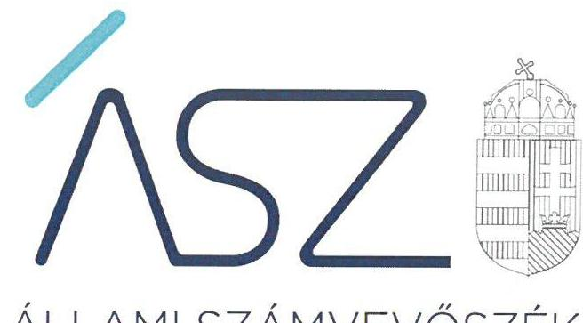
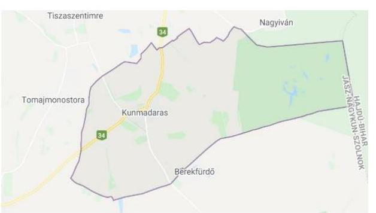

ÁLLAMI SZÁMVEVŐSZÉK

# JELENTÉS

Önkormányzati intézmények integritás és belső kontroll ellenőrzése

Madarasi Településellátó, Beruházó és Szolgáltató Szervezet

2020.

20172
www.asz.hu

---

ÁLLAMI SZÁMVEVŐSZÉK

# JELENTÉS

Önkormányzati intézmények integritás és belső kontroll ellenőrzése

Madarasi Településellátó, Beruházó és Szolgáltató Szervezet

2020. 11. hó 12. nap

20172
www.asz.hu

---

# AZ ELLENŐRZÉST FELÜGYELTE: 

PETŐ KRISZTINA felügyeleti vezető

## AZ ELLENŐRZÉST VEZETTE ÉS A VÉGREHAJTÁSÁÉRT FELELŐS:

RÁCZKEVI KATALIN ellenőrzésvezető

## A PROGRAM ÖSSZEÁLLÍTÁSÁÉRT FELELŐS:

BERTALAN RUDOLF GYULA ellenőrzési program készítéséért felelős vezető

IKTATÓSZÁM: EL-2840-001/2020.
TÉMASZÁM: 2511
ELLENŐRZÉS-AZONOSÍTÓ SZÁM: V085501
Jelentéseink az Országgyúlés számítógépes hálózatán és az interneten a www.asz.hu címen is olvashatóak.

---

# TARTALOMJEGYZÉK 

■ ÖSSZEGZÉS ..... 5
■ AZ ELLENŐRZÉS CÉLJA ..... 6
■ AZ ELLENŐRZÉS TERÜLETE ..... 7
■ AZ ELLENŐRZÉS HÁTTERE, INDOKOLTSÁGA ..... 8
■ AZ ELLENŐRZÉS LÉNYEGES KÉRDÉSEI ..... 9
■ AZ ELLENŐRZÉS HATÓKÖRE ÉS MÓDSZEREI ..... 10
■ MEGÁLLAPÍTÁSOK ..... 12
■ JAVASLATOK ..... 14
■ MELLÉKLETEK ..... 17
I. sz. melléklet: Értelmező szótár ..... 17
■ FÜGGELÉK: ÉSZREVÉTELEK ..... 19
■ RÖVIDÍTÉSEK JEGYZÉKE ..... 21

---

.

---

# ÖSSZEGZÉS 

2018-ban a kunmadarasi székhelyű Madarasi Településellátó, Beruházó és Szolgáltató Szervezet a közpénzek átlátható és elszámoltatható felhasználását biztosító belső kontrollrendszerét nem müködtette. Az integritási kontrollokat nem építették ki, így a korrupciós kockázatokkal szemben nem volt védett a szervezet.

## Az ellenőrzés társadalmi indokoltsága

Az Állami Számvevőszék alapvető feladata a közpénzekkel, az állami és önkormányzati vagyonnal való gazdálkodás ellenőrzése. Az Állami Számvevőszék az ÁSZ törvényben kapott felhatalmazással élve ellenőrzi az önkormányzati intézmények gazdálkodását, működését, hogy az ellenőrzések megállapításaival támogassa az ellenőrzött szervezetek szabályszerű gazdálkodását, javaslataival elősegítse az Alaptörvényben megfogalmazott alapvetések érvényesülését a mindennapi életben az önkormányzatok szintjén. Az Állami Számvevőszék stratégiájában megfogalmazott célkitűzése az integritás alapú, átlátható és elszámoltatható közpénzfelhasználás elősegítése. Ennek megvalósítása érdekében az Állami Számvevőszék prioritásként kezeli a közpénzzel gazdálkodó szervezetek esetében a belső kontrollrendszer működésének ellenőrzését.

## Főbb megállapítások, következtetések, javaslatok

A Madarasi Településellátó, Beruházó és Szolgáltató Szervezet vezetője a jogszabályban előírtak ellenére a 2018. évi belső kontrollrendszer minőségét nem értékelte. Az Állami Számvevőszék elvégezte a belső kontrollrendszer értékelését és megállapította, hogy a belső kontrollrendszerét nem működtette.

A Madarasi Településellátó, Beruházó és Szolgáltató Szervezet vezetője nem működtette az integrált kockázatkezelési rendszert, az információs és kommunikációs rendszert, valamint a monitoring rendszert. A Madarasi Településellátó, Beruházó és Szolgáltató Szervezet vezetője a szabályszer ű működést biztosító első védelmi vonalat nem biztosította.

Az Intézményen belül a szervezet integritását támogató kontrollokat nem alakították ki, az integrált kockázatkezelési rendszert nem működtették, a vagyonnyilatkozat tételei kötelezettséggel járó munkaköröket szervezeti és müködési szabályzatban nem tüntették fel.

Az Intézménynél a szervezeti teljesítmény mérésére alkalmas követelményeket nem alakították ki, így a teljesítmény mérésének feltételeit nem biztosították.

Az Állami Számvevőszék az ellenőrzés megállapításai alapján a Madarasi településellátó, Beruházó és Szolgáltató Szervezet intézményvezetője részére 7 javaslatot fogalmazott meg.

---

# AZ ELLENŐRZÉS CÉLJA 

AZ ELLENŐRZÉS CÉLJA annak megállapítása volt, hogy az önkormányzati intézmény belső kontrollrendszere biztosította-e az átlátható, szabályszerű, gazdaságos, hatékony és eredményes gazdálkodás feltételeit. Az ellenőrzés keretében az ÁSZ értékelte, hogy a költségvetési szervnél kiépítették-e a korrupciós kockázatok kezelését szolgáló integritási kontrollokat, továbbá adottake egy teljesítményellenőrzés lefolytatásának a feltételei.

---

# **AZ ELLENŐRZÉS TERÜLETE**

## **Madarasi Településellátó, Beruházó és Szolgáltató Szervezet**

A Madarasi Településellátó, Beruházó és Szolgáltató Szervezetet a Kunmadaras Nagyközség Önkormányzata alapította, működését 2006. január 1-jén kezdte meg.

Kunmadaras nagyközség Jász-Nagykun-Szolnok megyében, a karcagi járásban található, lakóinak száma a Központi Statisztikai Hivatal nyilvántartása szerint 2018. január 1. napján 5 306 fő volt.

Az Intézmény1 az ellenőrzött időszakban több telephelyen látta el a feladatait – felvásárló-telep, köztemető, piactér, vásártér, sportpálya, sporttelep, diákélelmezési konyha – működési köre, területe Kunmadaras nagyközség és Berekfürdő község területe volt.

Az Intézmény alaptevékenysége keretében önkormányzati vagyontárgyak kezelésével, hasznosításával, továbbá településüzemeltetéssel és diákélelmezéssel összefüggő feladatokat látott el.

Az ellenőrzött időszakban az Intézményvezető2 személyében nem történt változás. Az ellenőrzött évben az Intézmény gazdasági szervezettel nem rendelkező költségvetési szerv volt, gazdálkodási tevékenységét a Hivatal3 látta el Munkamegosztási megállapodásban4 rögzítettek alapján.

A Madarasi Településellátó, Beruházó és Szolgáltató Szervezet 2018. évi költségvetési beszámolója szerint a 2018. évben 390 millió Ft bevételt ért el és 518,5 millió Ft kiadást teljesített.

---

# AZ ELLENŐRZÉS HÁTTERE, INDOKOLTSÁGA 

A BELSŐ KONTROLLRENDSZER kialakítása és múködtetése nélkül nem valósítható meg a közpénzek, a közvagyon átlátható, szabályos, gazdaságos, hatékony és eredményes felhasználása. A belső kontrollrendszer azt a célt szolgálja, hogy a költségvetési szervek múködésük és gazdálkodásuk során a tevékenységeket szabályszerűen hajtsák végre, teljesítsék elszámolási kötelezettségeiket és megvédjék az erőforrásokat a veszteségektől, a károktól és a nem rendeltetésszerű használattól.

A belső kontrollrendszer magában foglalja mindazon elveket, eljárásokat és belső szabályzatokat, melyek biztosítják, hogy a költségvetési szerv valamennyi tevékenysége és célja összhangban legyen a szabályszerűséggel, szabályozottsággal, valamint a gazdaságosság, hatékonyság és eredményesség követelményeivel, az eszközökkel és forrásokkal való gazdálkodásban ne kerüljön sor pazarlásra, visszaélésre, rendeltetésellenes felhasználásra. Megfelelő, pontos és naprakész információk álljanak rendelkezésre a költségvetési szerv múködésével kapcsolatosan, és a belső kontrollrendszer harmonizációjára, össze-hangolására vonatkozó jogszabályok végrehajtásra kerüljenek. Az integritás kontrollok kiépítése, erősítése a szervezet korrupciós kockázatainak kezelését szolgálja. A teljesítménykövetelmények meghatározása megalapozhatja a teljesítményellenőrzés lefolytatását.

---

# AZ ELLENŐRZÉS LÉNYEGES KÉRDÉSEI 

1. Az önkormányzati Intézmény belső kontrollrendszerének kialakítása és müködtetése szabályszerű volt-e?
2. Az önkormányzati Intézménynél kiépítették-e az integritás kontrollrendszerét?
3. Az önkormányzati Intézménynél alakítottak-e ki a teljesítmény mérésére alkalmas követelményeket?

---

# AZ ELLENŐRZÉS HATÓKÖRE ÉS MÓDSZEREI 

## Az ellenőrzés típusa

Megfelelőségi ellenőrzés.

## Az ellenőrzött időszak

2018. év

## Az ellenőrzés tárgya

Az önkormányzati intézmény belső kontrollrendszerének kialakítása és múködtetése, valamint az integritás kontrollok kiépítettsége, a teljesítményellenőrzés feltételeinek kialakítása.

## Az ellenőrzött szervezet

Madarasi Településellátó, Beruházó és Szolgáltató Szervezet

## Az ellenőrzés jogalapja

Az ellenőrzés jogszabályi alapját az ÁSZ tv. ${ }^{5}$ 1. § (3) bekezdés, 5. § (6) bekezdése, valamint az Áht. ${ }^{6}$ 61. § (2) bekezdésének előírásai képezik.

## Az ellenőrzés módszerei

Az ÁSZ ${ }^{7}$ az ellenőrzést az ellenőrzési program szempontjai, az ellenőrzött időszakban hatályos jogszabályok, az ellenőrzés szakmai szabályai, az ÁSZ által meghatározott és honlapján nyilvánosságra hozott helyénvalósági kritériumok, valamint a jelen ellenőrzésre irányadó ÁSZ módszertanok figyelembevételével hajtotta végre. Az ellenőrzési kérdések megválaszolásához szükséges bizonyítékok megszerzése az ellenőrzött által rendelkezésre bocsátott dokumentumokra, adatokra alapozva megfigyelés, szemle (szemrevételezés), kérdésfeltevés (információkérés), mintavételezés, valamint elemző eljárás útján történt. Az ellenőrzési bizonyítékként felhasználható adatforrások közé tartoztak az ellenőrzési program részletes szempontjainál felsorolt adatforrások, valamint minden egyéb - az ellenőrzés folyamán feltárt, az ellenőrzés szempontjából információt tartalmazó - dokumentum.

---

Az ellenőrzés lefolytatásához az ellenőrzött szervezet tanúsítvány kitöltésével, valamint az ÁSZ által kért dokumentumok megküldésével szolgáltatott adatokat, amelyek valódiságát és teljes körűségét az ellenőrzött szervezet vezetője által tett teljességi és hitelességi nyilatkozat igazolta. A rendelkezésre bocsátott adatok, információk kontrollja az ellenőrzés keretében történt.

Az önkormányzati intézmény belső kontrollrendszere egyes pilléreinek kialakítására és működtetésére vonatkozó értékelés:
$\longrightarrow$ „szabályszerü", amennyiben az értékelt területen az elért „igen" válaszok százalékban kifejezett, egész számra kerekített aránya legalább $85 \%$,
$\longrightarrow$ „nem szabályszerű", ha nem éri el a $85 \%$-ot.
Az önkormányzati intézmény belső kontrollrendszerének összesített értékelése (a kontrollrendszer egésze) esetében a „szabályszerű" értékelésnek a feltétele volt, hogy egyik kontrollterület sem kapott „nem szabályszerű" értékelést. A belső kontrollrendszer szabálytalansága esetén az integritás kontrollok kiépítése és működtetése „nem megfelelő".

A kontrolltevékenységek gyakorlása és a bevételek elszámolása esetében az ellenőrzés azokra a legnagyobb értékű tételekre - a lényeges sokaságra - terjedt ki, melyek összértéke eléri a teljes sokaság összértékének $50 \%$-át.

A bevételek (szolgáltatások ellenértéke, térítési díj, ellátási díj) esetében tételes ellenőrzést folytatott le az ÁSZ.

A kiadások (felhalmozási kiadások, dologi kiadások) esetében a lényeges sokaságból véletlen mintavétellel kijelölt tételek kerültek ellenőrzésre.
„Szabályszerű" értékelést kapott egy mintavétellel ellenőrzött területet, amennyiben 95\%-os megbízhatósággal az ellenőrzött sokaságban az átlagos hibaarány legfeljebb 10\%, „nem szabályszerűt", amennyiben 10\%nál magasabb arányt képviselt. Abban az esetben, ha az ellenőrzött sokaság tekintetében a 10\%-os hibaarányhoz való viszony megítélésnek megbízhatósága nem érte el a 95\%-ot, annak elérése érdekében az értékelést további szempontokkal egészítette ki az ÁSZ, és figyelembe vette a feltárt hibák értékét.

Az önkormányzati intézmény vezetője által kiépített integritás kontrollrendszer értékeléséhez helyénvalósági kritériumok is megfogalmazásra kerültek.

Az ellenőrzés ideje alatt az ellenőrzött szervezettel történő kapcsolattartást az ÁSZ SZMSZ ${ }^{\circledR}$-ének vonatkozó előírásai alapján biztosította az ÁSZ.

---

# 1. Az önkormányzati Intézmény belső kontrollrendszerének kialakítása és múködtetése szabályszerű volt-e? 

Összegző megállapítás

Az Intézmény belső kontrollrendszerének kialakítása és múködtetése 2018. évben nem volt szabályszerű.

Az Intézményvezető az Intézmény belső kontrollrendszer minőségének értékelését a Bkr. ${ }^{9} 11 . \S$ (1) bekezdésében előírtak ellenére 2018. évre nem végezte el. Az Intézményvezető felelősségi körében az Intézmény átláthatósága és elszámoltathatóság érdekében nem tárta fel, és nem rögzítette, hogy az általa vezetett szervezet a jogszabálynak megfelelő folyamatokat működtetett-e. A belső kontrollrendszer értékelésének hiánya miatt az Intézményvezető a fenntartó Önkormányzat ${ }^{10}$ részére nem nyújtott valós képet az Intézmény működéséről.

Az ÁSZ ellenőrzése során a belső kontrollrendszer kialakítása és múködtetése értékelése vonatkozásában a következő megállapításokat tette:

A KONTROLLKÖRNYEZET kialakítása szabályszerű volt. Az Intézmény Áht. előírásai szerinti SZMSZ ${ }^{11}$-ét elkészítették, amelyet a Képvi-selő-testület ${ }^{12}$ jóváhagyott. A Vnytv. ${ }^{13} 4 . \S$ a) pontja ellenére az Intézmény SZMSZ-ében nem tüntették fel a vagyonnyilatkozat-tételi kötelezettséggel járó munkaköröket.

Az Intézmény Bkr. előírásai szerint rendelkezett ellenőrzési nyomvonallal ${ }^{14}$. Az Etikai Kódexben ${ }^{15}$ meghatározták az etikai elvárásokat az Intézmény minden szintjén. Az Intézményvezető a jogszabályi előírás szerint elkészítette az integritást sértő események kezelésének eljárásrendjét ${ }^{16}$.

Az Intézmény 2018. február 1-jétől rendelkezett a jogszabályok által előírt Gazdálkodási szabályzattal ${ }^{17}$. A gazdálkodási jogkörök gyakorlására jogosult személyekről és aláírás-mintájukról a jogszabályoknak megfelelő nyilvántartást vezettek.

Az Intézmény rendelkezett a Számv.tv. ${ }^{18}$ előírása szerint Számviteli politikával és annak keretén belül elkészítendő szabályzatokkal ${ }^{19}$.

Az Intézmény a Számv.tv. 161. § (1) bekezdése, az Áhsz. ${ }^{20}$ 51. § (2) bekezdése ellenére nem rendelkezett számlarenddel a 2018 évben. Az Intézmény nem rendelkezett az Ltv. ${ }^{21} 10 . \S$ (1) bekezdés a) pontjában előírtak ellenére iratkezelési szabályzattal.

Az Intézményvezető a Bkr. előírásai szerint az integrált kockázatkezelés eljárásrendjét szabályozta, az integrált kockázatkezelési szabályzatot ${ }^{22}$ elkészítette.

## AZ INTEGRÁLT KOCKÁZATKEZELÉSI RENDSZERT az Intézményvezető a Bkr. 7. § (1)-(2) bekezdései ellenére nem múködtetette, mert nem mérte fel és nem állapította meg az Intézmény tevékenységében rejlő és a szervezeti célokkal összefüggő kockázatokat,

---

továbbá nem határozta meg az egyes kockázatokkal kapcsolatban szükséges intézkedéseket, valamint azok teljesítésének folyamatos nyomon követésének módját.

A KONTROLLTEVÉKENYSÉGEK gyakorlása szabályszerű volt, 2018. évben a kiadási előirányzatok terhére történt kifizetéseknél és a bevételek elszámolásánál az Intézmény betartotta a jogszabályi előírásokat.

# AZ INFORMÁCIÓS ÉS KOMMUNIKÁCIÓS RENDSZERT az Intézményvezető a Bkr. 3. § d) pontjában, továbbá az Információs és kommunikációs szabályzatban ${ }^{23}$ előírtak ellenére 2018. évben nem múködtette. 

A MONITORING RENDSZER nem volt szabályszerű, mert az Intézményvezető a Bkr. 10. §-ában előírtak ellenére az Intézménynél a szervezet tevékenységének, a célok megvalósításának folyamatos és eseti nyomon követését biztosító rendszert nem alakított ki.

## 2. Az önkormányzati Intézménynél kiépítették-e az integritás kontrollrendszerét?

## Összegző megállapítás Az önkormányzati Intézmény vezetője nem építette ki az integritás kontrollrendszerét.

Az Intézmény integrált kockázatkezelési rendszert a Bkr.-ben előírtak ellenére nem múködtetett, a szervezeten belül nem végeztek kockázatelemzést, azáltal nem azonosították az integritást veszélyeztető kockázatokat sem.

A vagyonnyilatkozat-tételi kötelezettséggel járó munkaköröket a jogszabályi előírás ellenére az SZMSZ-ben nem tüntették fel.

Az Intézmény nem alakított ki teljesítményértékelési rendszert. Az Intézmény munkatársai korrupcióellenes képzésben nem vettek részt.

## 3. Az önkormányzati Intézménynél alakítottak-e ki a teljesítmény mérésére alkalmas követelményeket?

Összegző megállapítás Az önkormányzati Intézménynél a teljesítmény mérés feltételeit nem alakították ki.

Az Intézményvezető nem alakította ki a szervezet vonatkozásában a teljesítmény mérésének feltételeit, továbbá a szervezeti célok elérését szolgáló feladatok, tevékenységek mérését szolgáló indikátorokat, mérőszámokat, feladat és teljesítmény-mutatókat sem határozott meg.

---

# JAVASLATOK 

Az ÁSZ tv. 33. § (1) bekezdésében foglaltak értelmében az ellenőrzött szervezet vezetője köteles a jelentésben foglalt megállapításokhoz kapcsolódó intézkedési tervet összeállítani és azt a jelentés kézhezvételétől számított 30 napon belül az ÁSZ részére megküldeni. Amennyiben az intézkedési tervet az ellenőrzött szervezet vezetője nem küldi meg határidőben, vagy továbbra sem elfogadható intézkedési tervet küld, az ÁSZ elnöke az ÁSZ törvény 33. § (3) bekezdés a)-b) pontjaiban foglaltakat érvényesitheti.

## Madarasi Településellátó, Beruházó és Szolgáltató Szervezet intézményvezetőjének

1. Végezze el a Bkr. előírása szerint a belső kontrollrendszer minőségének értékelését és küldje meg a polgármester részére.
(1. összegző megállapítás 1. bekezdésének 1. mondata alapján)
2. Intézkedjen az SZMSZ módosításáról a vagyonnyilatkozat-tételi kötelezettséggel járó munkakörök feltüntetése érdekében és kezdeményezze a módosított SZMSZ Képviselő-testület általi jóváhagyását.
(1. összegző megállapítás 3. bekezdésének 3. mondata alapján)
3. Intézkedjen a jogszabályban elöirt számlarend elkészitése érdekében.
(1. összegző megállapítás 7. bekezdésének 1. mondata alapján)
4. Intézkedjen a jogszabályi előírás szerinti iratkezelési szabályzat kiadása érdekében.
(1. összegző megállapítás 7. bekezdésének 2. mondata alapján)
5. Intézkedjen az integrált kockázatkezelési rendszer müködtetése során a költségvetési szerv tevékenységében rejlő és szervezeti célokkal öszszefüggő kockázatok felméréséről és megállapításáról, valamint az egyes kockázatokkal kapcsolatban szükséges intézkedések és azok teljesitésének folyamatos nyomon követése módjának meghatározásáról.
(1. összegző megállapítás 9. bekezdése alapján)
6. Intézkedjen a jogszabályban és belső szabályzatban foglalt elöírások szerint az információs és kommunikációs rendszer müködtetéséről.
(1. összegző megállapítás 11. bekezdése alapján)

---

7. Intézkedjen a szervezet tevékenységének, a célok megvalósitásának folyamatos és eseti nyomon követését biztositó rendszer kialakításáról.
(1. összegző megállapítás 12. bekezdése alapján)

---

.

---

# MELLÉKLETEK 

- I. SZ. MELLÉKLET: ÉRTELMEZŐ SZÓTÁR
belső kontrollrendszer
belső kontrollrendszer pillérei, kontrollterületei
helyénvalósági ellenőrzés
információs és kommunikációs rendszer
integrált kockázatkezelési rendszer
kontrollkörnyezet
kontrolltevékenységek
monitoring rendszer

A belső kontrollrendszer a kockázatok kezelése és tárgyilagos bizonyosság megszerzése érdekében kialakított folyamatrendszer, amely azt a célt szolgálja, hogy a múködés és gazdálkodás során a tevékenységeket szabályszerűen, gazdaságosan, hatékonyan, eredményesen hajtsák végre, az elszámolási kötelezettségeket teljesítsék, megvédjék az erőforrásokat a veszteségektől, károktól és nem rendeltetésszerű használattól. (Forrás: Áht. 69. § (1) bekezdése)
A kontrollkörnyezet, az (integrált) kockázatkezelési rendszer, a kontrolltevékenységek, az információs és kommunikációs rendszer, valamint a nyomon követési (monitoring) rendszer. (Forrás: Bkr. 3. §-a)
A helyénvalósági ellenőrzés a megfelelőségi ellenőrzés azon altípusa, amelyet azokban az esetekben kell alkalmazni, amelyekre jogszabályi előírások nem alkalmazhatóak, illetve amennyiben egyes kérdések megítélésénél nyilvánvaló jogszabályi hiányosságok vannak. Helyénvalósági ellenőrzés során az ellenőrzést végző személynek a közszféra intézményeinek helyes gazdálkodására, a közpénzek eredményes és megfelelő felhasználására és a közszféra tisztviselőinek magatartására vonatkozó általános elvek mentén kell az ellenőrzést lefolytatnia. A helyénvalósági ellenőrzés kritériumait az ellenőrzés tárgyában általánosan elfogadott, illetve nemzetközi vagy hazai „jó gyakorlatok" is meghatározhatják. (Forrás: Állami Számvevőszék, A megfelelőségi ellenőrzés alapelvei 2015. július)
A költségvetési szerv vezetője által kialakított és múködtetett olyan rendszer, mely biztosítja, hogy a megfelelő információk a megfelelő időben eljutnak az illetékes szervezethez, szervezeti egységhez, illetve személyhez. (Forrás: Bkr. 9. § (1) bekezdés)
Olyan folyamatalapú kockázatkezelési rendszer, amely a szervezet min-den tevékenységére kiterjed, egységes módszertan és eljárások alkalmazásával, a szervezet célkitűzéseinek és értékeinek figyelembevételével biztosítja a szervezet kockázatainak teljes körű azonosítását, azok meg-határozott kritériumok szerinti értékelését, valamint a kockázatok keze-lésére vonatkozó intézkedési terv elkészítését és az abban foglaltak nyomon követését. (Forrás: Bkr. 2. § m) pontja, 2016. október 1-jétől)
A költségvetési szerv vezetője által kialakított olyan elvek, eljárások, belső szabályzatok összessége, amelyben világos a szervezeti struktúra, a folyamatok átláthatók, egyértelműek a felelősségi, hatásköri viszonyok és feladatok, meghatározottak, ismertek és elfogadottak az etikai elvárások a szervezet minden szintjén, átlátható a humánerőforráskezelés, biztosított a szervezeti célok és értékek irányában való elkötelezettség fejlesztése és elősegítése. (Forrás: Bkr. 6. § (1) bekezdés)
A költségvetési szerv vezetője által a szervezeten belül kialakított (kontroll) tevékenységek, melyek biztosítják a kockázatok kezelését, hozzájárulnak a szervezet céljainak eléréséhez és erősítik a szervezet integritását. (Forrás: Bkr. 8. § (1) bekezdés)
A költségvetési szerv vezetője köteles kialakítani a szervezet tevékenységének a célok megvalósításának nyomon követését biztosító rendszert, amely az operatív tevékenységek keretében megvalósuló folyamatos és eseti nyomon követésből, valamint az operatív tevékenységektől függetlenül múködő belső ellenőrzésből állhat. (Forrás: Bkr. 10. §)

---

.

---

# FÜGGELÉK: ÉSZREVÉTELEK 

A jelentéstervezetet a Számvevőszék 15 napos észrevételezésre megküldte az ellenőrzött szervezet vezetőjének az ÁSZ tv. 29. §* (1) bekezdése előírásának megfelelően.

A Madarasi Településellátó, Beruházó és Szolgáltató Szervezet intézményvezetője az ÁSZ tv. 29. § (2) bekezdésében foglalt észrevételezési jogával nem élt, a jelentéstervezetre észrevételt nem tett.

[^0]
[^0]:    * 29. § (1) Az Állami Számvevőszék az ellenőrzési megállapításait megküldi az ellenőrzött szervezet vezetőjének vagy az általa megbízott személynek, és annak, akinek személyes felelősségét állapította meg.
    (2) Az ellenőrzött szervezet vezetője és a felelősként megjelölt személy az ellenőrzés megállapításaira tizenöt napon belül írásban észrevételt tehet.
    (3) Az Állami Számvevőszék az észrevételre a beérkezésétől számított harminc napon belül írásban válaszol. A figyelembe nem vett észrevételeket köteles a jelentésben feltüntetni, és megindokolni, hogy azokat miért nem fogadta el.

---

.

---

# RÖVIDÍTÉSEK JEGYZÉKE 

${ }^{1}$ Intézmény
${ }^{2}$ Intézményvezető
${ }^{3}$ Hivatal
${ }^{4}$ Munkamegosztási megállapodás
${ }^{5}$ ÁSZ tv.
${ }^{6}$ Áht.
${ }^{7}$ ÁSZ
${ }^{8}$ ÁSZ SZMSZ
${ }^{9}$ Bkr.
${ }^{10}$ Önkormányzat
${ }^{11}$ SZMSZ
${ }^{12}$ Képviselő-testület
${ }^{13}$ Vnytv.
${ }^{14}$ ellenőrzési nyomvonal
${ }^{15}$ Etika Kódex
${ }^{16}$ integritást sértő események kezelésének eljárásrendje
${ }^{17}$ Gazdálkodási szabályzat
${ }^{18}$ Számv.tv.
${ }^{19}$ számviteli szabályzatok
${ }^{20}$ Áhsz.
${ }^{21}$ Ltv.
${ }^{22}$ integrált kockázatkezelési szabályzat
${ }^{23}$ Információs és kommunikációs szabályzat

Madarasi Településellátó, Beruházó és Szolgáltató Szervezet
Madarasi Településellátó, Beruházó és Szolgáltató Szervezet vezetője
Kunmadarasi Közös Önkormányzati Hivatal
Kunmadarasi Közös Önkormányzati Hivatal és a Madarasi Településellátó, Beruházó és Szolgáltató Szervezet között létrejött Munkamegosztási megállapodás (hatályos: 2015. május 1-jétől)
2011. évi LXVI. törvény az Állami Számvevőszékről (hatályos: 2011. július 1-jétől) 2011. évi CXCV. törvény az államháztartásról (hatályos: 2011. január 1-jétől) Állami Számvevőszék
az Állami Számvevőszék elnökének 3/2019. (XII.23.) ÁSZ utasítása az Állami Számvevőszék Szervezeti és Múködési Szabályzata
370/2011. (XII. 31.) Korm. rendelet a költségvetési szervek belső kontrollrendszeréről és belső ellenőrzéséről
Kunmadaras Nagyközség Önkormányzat
Madarasi Településellátó, Beruházó és Szolgáltató Szervezet Szervezeti és Múködési Szabályzata (hatályos: 2015. szeptember 24-től)
Kunmadaras Nagyközség Önkormányzat Képviselő-testülete
2007. évi CLII. törvény egyes vagyonnyilatkozat-tételi kötelezettségekről
Madarasi Településellátó, Beruházó és Szolgáltató Szervezet ellenőrzési nyomvonala
Madarasi Településellátó, Beruházó és Szolgáltató Szervezet Etikai kódexe (hatályos: 2017. január 4-től)
Madarasi Településellátó, Beruházó és Szolgáltató Szervezet Szervezeti integritást sértő események kezelésének eljárásrendje (hatályos: 2017. június 1-től)
Madarasi Településellátó, Beruházó és Szolgáltató Szervezet Gazdálkodási szabályzata
a számvitelről szóló 2000. évi C. törvény (hatályos: 2001. január 1-jétől)
Kunmadarasi Közös Önkormányzati Hivatal számviteli politikája (hatályos: 2018. január 1-jétől); Kunmadarasi Közös Önkormányzati Hivatal leltározási szabályzata (hatályos: 2018. január 1-jétől); Kunmadarasi Közös Önkormányzati Hivatal Eszközök és források értékelési szabályzata (hatályos: 2018. január 1-jétől); Kunmadarasi Közös Önkormányzati Hivatal pénzkezelési szabályzata (hatályos: 2018. február 1-jétől)
4/2013. (I.11.) Korm. rendelet az államháztartás számviteléről
1995. évi LXVI. törvény a közokiratokról, közlevéltárakról és a magánlevéltárak védelméről
Madarasi Településellátó, Beruházó és Szolgáltató Szervezet Integrált Kockázatkezelési szabályzata (hatályos: 2017. január 4-től)
Információs és kommunikációs szabályzat (hatályos: 2017. január 1-jétől)

---

# ASZ 

ALLAMI SZAMVEVOSZEK
1052 Budapest, Apáczai Cs. J. u. 10. I 1364 Budapest 4. Pf. 54 TEL: +36 14849100
email: szamvevoszek@asz.hu
web: www.asz.hu | www.aszhirportal.hu