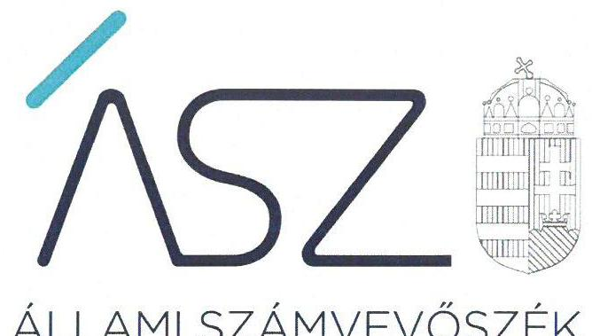
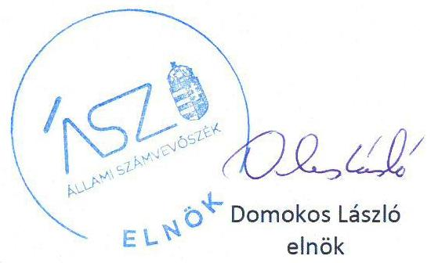
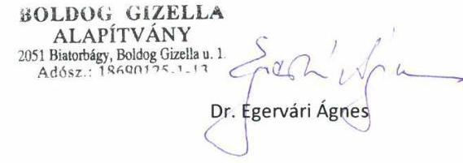
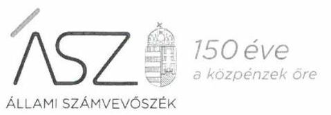
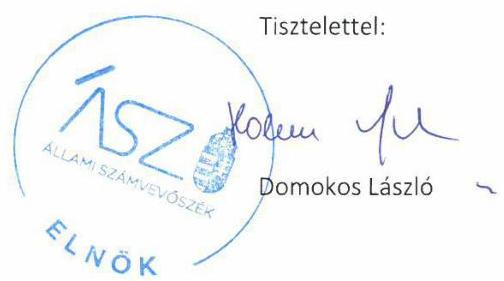
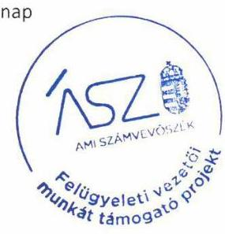

ÁLLAMI SZÁMVEVŐSZÉK

# JELENTÉS 

## Nem állami humánszolgáltatók ellenőrzése

A szociális humánszolgáltatást nyújtó intézmények, szolgáltatók államháztartáson kívüli fenntartói központi költségvetésből kapott támogatásai felhasználásának ellenőrzése Boldog Gizella Alapítvány

2020
20173
www.asz.hu

---

ÁLLAMI SZÁMVEVŐSZÉK

# JELENTÉS

## Nem állami humánszolgáltatók ellenőrzése

A szociális humánszolgáltatást nyújtó intézmények, szolgáltatók államháztartáson kívüli fenntartói központi költségvetésből kapott támogatásai felhasználásának ellenőrzése – Boldog Gizella Alapítvány

2020. 08. hó 27. nap

2017. 3. www.asz.hu

---

# AZ ELLENŐRZÉST FELÜGYELTE: 

KAKAS SÁNDOR felügyeleti vezető

## AZ ELLENŐRZÉST VEZETTE ÉS A VÉGREHAJTÁSÁÉRT FELELŐS:

DÉZSINÉ KIS HAJNALKA ellenőrzésvezető

## A PROGRAM ÖSSZEÁLLÍTÁSÁÉRT FELELŐS:

FEKETE-NAGY ANDRÁS GÁBOR ellenőrzési program készítéséért felelős vezető beosztás

TÓTPÁL SZABOLCS osztályvezető

IKTATÓSZÁM: EL-2843-001/2020.

## Jelentéseink az Országgyúlés számítógépes hálózatán és az interneten a www.asz.hu címen is olvashatóak.

TÉMASZÁM: 2491
ELLENŐRZÉS-AZONOSÍTÓ SZÁM: V083535; V0867109

---

# TARTALOMJEGYZÉK 

- ÖSSZEGZÉS ..... 5
- AZ ELLENŐRZÉS CÉLJA ..... 6
- AZ ELLENŐRZÉS TERÜLETE ..... 7
- AZ ELLENŐRZÉS HÁTTERE, INDOKOLTSÁGA ..... 8
- AZ ELLENŐRZÉS LÉNYEGES KÉRDÉSKÖREI. ..... 9
- AZ ELLENŐRZÉS HATÓKÖRE ÉS MÓDSZEREI ..... 10
- MELLÉKLETEK ..... 13
I. sz. melléklet: Értelmező szótár ..... 13
- FÜGGELÉK: ÉSZREVÉTELEK ..... 15
- RÖVIDÍTÉSEK JEGYZÉKE ..... 23

---

.

---

# ÖSSZEGZÉS 

A biatorbágyi székhelyű Boldog Gizella Alapítvány szociális közfeladat ellátásához rendelt költségvetési támogatásainak felhasználása, a közpénzekkel való gazdálkodása nem volt átlátható és elszámoltatható.

## Az ellenőrzés társadalmi indokoltsága

A szociális gondoskodást igénylők védelme, illetve a köznevelési feladatok ellátása az Alaptörvényben meghatározott, a társadalom szempontjából fontos tevékenységek. Jogszabályok teszik lehetővé, hogy államháztartáson kívüli szervezetek - így például az egyházi fenntartók, alapítványok, gazdasági társaságok, egyesületek - által fenntartott intézmények is végezzenek köznevelési, szociális és gyermekvédelmi feladatokat. Mindehhez a központi költségvetés évente jelentős összegű támogatással járul hozzá. Az államháztartáson kívüli, humánszolgáltatást végző intézmények az igényelt közpénzekből társadalmilag hasznos, közösségteremtő, közérdekű, illetve közhasznú tevékenységet végeznek, illetve közfeladatokat látnak el.

Az intézményfenntartók ellenőrzésével az Állami Számvevőszék hozzájárul ahhoz, hogy ezen közpénzeket az államháztartáson kívüli szervezetek is ellenőrizhető, átlátható és elszámoltatható módon használják fel a közfeladatok ellátása során. Az ellenőrzések célja továbbá, hogy a nyilvánosság és az igénybevevők megfelelő tájékoztatást kapjanak az államháztartáson kívüli közfeladatot ellátók múködéséről.

Az ÁSZ ellenőrzései arra adnak választ, hogy az intézményfenntartók arra használták-e fel a közpénzeket, amire igényelték.

A szabályszerű gazdálkodás elengedhetetlen a közfeladat ellátás szakmai céljainak megvalósításához, valamint a társadalmi közbizalom fenntartásához.

## Megállapítások, következtetések

A Boldog Gizella Alapítvány a 2015-2018. évekre vonatkozóan a Számv.tv. ${ }^{1}$ 161/A § (1) bekezdésében előírtak ellenére nem alakította ki a beszámolója alátámasztását biztosító, könyvvezetésre vonatkozó belső szabályait, és nem tett eleget éves beszámoló készítési kötelezettségének sem a Számv. tv. 4. § (1) bekezdésében valamint a Civilszr. ${ }^{2}$ 6. § (1) bekezdésében, 2017. január 1-től 7. § (1) bekezdésében foglaltak ellenére. Ezáltal a közfeladatok ellátására kapott, közpénzre vonatkozó gazdálkodása nem volt elszámoltatható.

A Boldog Gizella Alapítvány mindezek alapján az Alaptörvény 39. cikk (2) bekezdésében foglaltak ellenére a felhasznált közpénzekre vonatkozó gazdálkodása átláthatóságát nem biztosította. Ezáltal nem igazolta, hogy a közpénzt a szociális humánszolgáltatási közfeladatra fordította.

---

# AZ ELLENŐRZÉS CÉLJA

**AZ ELLENŐRZÉS CÉLJA** annak értékelése volt, hogy a nem állami, nem önkormányzati szociális intézmények fenntartói központi költségvetésből kapott támogatásainak felhasználása szabályszerű volt-e.

---

# **AZ ELLENŐRZÉS TERÜLETE**

## **Boldog Gizella Alapítvány**

A biatorbágyi székhelyű Boldog Gizella Alapítványt természetes személy hozta létre 2000. október 2-án. Az alapító induló vagyonként 1,0 millió Ft pénzeszközt bocsátott rendelkezésre az Alapító okirat szerinti szociális humánszolgáltatási feladatellátáshoz. Az Alapítvány közhasznú jogállású volt.

Az Alapítvány által fenntartott intézmény az önálló jogi személyiséggel nem rendelkező Gizella Otthon, amely idősek átmeneti és tartós bentlakásos ellátása mellett, támogató szolgálatot, idősek és demens betegek nappali ellátását, valamint szociális étkeztetést biztosított.

Az ellenőrzött időszakban az Alapítvány vezető szerve a három fős Kuratórium volt.

A Fenntartó³ részére a Magyar Államkincstár az intézményi szociális feladatellátásra 2015. évben 87,2 M Ft, a 2016. évben 110,2 M Ft, a 2017. évben 118,3 M Ft, 2018. évben 125,4 M Ft költségvetési támogatást utalt ki.

---

# AZ ELLENŐRZÉS HÁTTERE, INDOKOLTSÁGA 

A szociális feladatokat ellátó nem állami intézményfenntartók részére közfeladataik ellátására évente jelentős összegű pénzügyi támogatást biztosítottak a mindenkori költségvetési törvények a bennük megfogalmazott feltételek mellett. A felhasználható állami támogatások a Kvtv.1-44-ekben a 2015-2018. években a szociális ágazatra vonatkozóan 360 Mrd Ft előirányzatot határoztak meg.

Az ÁSZ ${ }^{5}$ a stratégiájában célul tűzte ki, hogy az államháztartáson kívülre nyújtott költségvetési támogatások ellenőrzésével hozzájárul ahhoz, hogy a közpénzeket az államháztartáson kívüli szervezetek is átlátható módon használják fel a közfeladatok szerződésben vállalt ellátása érdekében. Az ÁSZ a stratégiájában foglaltak alapján is indokolt az ellenőrzés, amely a társadalom számára jelzi, hogy a közpénz államháztartáson kívüli felhasználása sem maradhat ellenőrizetlenül. Az államháztartáson kívülre nyújtott költségvetési támogatások ellenőrzésével az ÁSZ hozzájárul ahhoz, hogy a közpénzeket a nem állami fenntartók átlátható módon használják fel a közfeladatok ellátására kötött szerződésekben vállalt kötelezettségek teljesítése érdekében. Az ÁSZ az ellenőrzés javaslataival hozzájárulhat az említett rendszerek szabályszerű támogatás-felhasználásához, javíthatja a társa-dalmi-gazdasági döntések megalapozottságát, amely a „jól irányított állam müködésének" feltétele.

---

# AZ ELLENŐRZÉS LÉNYEGES KÉRDÉSKÖREI 

1. A szociális humánszolgáltató közfeladatot ellátó államháztartáson kívüli fenntartó szabályszerű müködési - és gazdálkodási környezet kialakításával megteremtette-e a költségvetési támogatások átlátható, elszámoltatható igénybevételének, felhasználásának feltételeit?
2. Az államháztartáson kívüli fenntartó az átvállalt szociális humánszolgáltatási közfeladathoz biztositott költségvetési támogatásokat szabályszerűen fordította-e a humánszolgáltató intézménye müködtetésére?
3. Az államháztartáson kívüli fenntartó a szociális humánszolgáltató intézménye müködtetéséhez felhasznált közpénzekre vonatkozó gazdálkodásával a nyilvánosság előtt elszámolt-e, ennek érdekében ellenőrzési, értékelési és a külső ellenőrzésekkel kapcsolatos intézkedési feladatait szabályszerűen látta-e el?

---

# AZ ELLENŐRZÉS HATÓKÖRE ÉS MÓDSZEREI 

## Az ellenőrzés típusa

Megfelelőségi ellenőrzés.

## Az ellenőrzött időszak

A 2015. január 1-je és 2018. december 31-e közötti időszak.

## Az ellenőrzés tárgya

Az ellenőrzés a szociális humánszolgáltatási közfeladatokat ellátó államháztartáson kívüli fenntartók, humánszolgáltatási közfeladatai ellátásához a központi költségvetésből kapott támogatásaik humánszolgáltatási közfeladatokra való fenntartó általi felhasználása szabályszerűségének értékelésére terjedt ki.

## Az ellenőrzött szervezet

Boldog Gizella Alapítvány

## Az ellenőrzés jogalapja

Az ellenőrzés jogszabályi alapját az ÁSZ tv6. 1. § (3) bekezdése, 5. § (3) bekezdésben foglalt előírások adják.

## Az ellenőrzés módszerei

Az ellenőrzést az ellenőrzési program annak szempontjai, kérdései, az ellenőrzött időszakban hatályos jogszabályok, a nemzetközi standardokat irányadónak tekintve, az ellenőrzés szakmai szabályok és módszertanok figyelembe vételével rendelte elvégezni. A közpénzekkel való felelős gazdálkodás segítésére irányuló javaslatok kidolgozásakor a hatályos jogszabályok voltak az irányadóak.

Az ellenőrzés ideje alatt az ellenőrzött szervezettel történő kapcsolattartást az ÁSZ SZMSZ ${ }^{7}$-ének vonatkozó előírásai alapján biztosította az ÁSZ.

Az ellenőrzési kérdések megválaszolásához szükséges bizonyítékok megszerzése az ellenőrzött által rendelkezésre bocsátott dokumentumokra, adatokra alapozva megfigyelés, szemle (szemrevételezés), kérdésfeltevés (információkérés), valamint elemző eljárással történt.

---

Az ellenőrzési bizonyítékként felhasználható adatforrások közé tartoztak egyrészt az ellenőrzési program részletes szempontjainál felsorolt adatforrások, másrészt minden - az ellenőrzés folyamán feltárt, az ellenőrzés szempontjából információt tartalmazó - dokumentum.

Az ellenőrzés lefolytatásához az ellenőrzött szervezet a kitöltött tanúsítványok, valamint az ÁSZ által kért dokumentumok elektronikus úton való megküldésével szolgáltatott adatokat, információkat. Az így rendelkezésre bocsátott adatok, információk és a tanúsítványok adatai valódiságának kontrollja az ellenőrzés keretében történt.

Az egységes értelmezést az ellenőrzési program mellékletét képező fogalomtár és rövidítésjegyzék támogatatta.

Az ellenőrzést alapvetően a köznevelési és szociális humánszolgáltatások esetében a központi költségvetési támogatások igénylésével, módosításával, felhasználásával, elszámolásával kapcsolatos feladatokat ellátó államháztartáson kívüli fenntartóknál/szervezeteinél végezte az ÁSZ.

A szociális humánszolgáltatások központi költségvetési támogatásaival kapcsolatos, államháztartáson kívüli fenntartó jogszabályokban előírt feladatai betartása, továbbá a központi költségvetési támogatások szabályszerű nyilvántartását ellenőrizte az ÁSZ a Fenntartónál rendelkezésre álló nyilvántartások, beszámolók és egyéb dokumentumok alapján. Az ellenőrzés nem terjedt ki a szociális humánszolgáltatások központi költségvetési támogatásai igénylése, módosítása, elszámolása valódiságának, megalapozottságának, helyességének - sem a fenntartónál, sem a székhely intézményeinél való - értékelésére (mivel ennek felülvizsgálata, ellenőrzése a finanszírozó jogszabályban előírt feladata, határozatai kiadása előtt). Továbbá nem terjedt ki az ellenőrzés e források, intézmények általi szabályszerű felhasználásának értékelésére.

---

.

---

# MELLÉKLETEK 

- I. SZ. MELLÉKLET: ÉRTELMEZŐ SZÓTÁR
humánszolgáltatás
kültségvetési támogatás
nem állami, nem önkormányzati (államháztartáson kívüli) intézmény fenntartó

Külön törvényben meghatározott szociális, gyermekjóléti, gyermekvédelmi, közoktatási, felsőoktatási, kulturális közfeladatok (2014. évi Kvtv. 34. § (1), (4) bekezdés, 1. számú melléklet XX/20/2. alcím, 19. alcím, 2015. évi Kvtv. ${ }^{8}$ 43. § (1), (4) bekezdés, 1. számú melléklet XX/20/2/3. jogcím csoport, 19. alcím, 2016. évi Kvtv. 41. § (1), (4) bekezdés, 1. számú melléklet XX/20/2/3. jogcím csoport, 19. alcím).
a társadalombiztosítás pénzügyi alapjai kivételével az államháztartás központi alrendszeréből ellenérték nélkül, pénzben nyújtott támogatások (Áht. ${ }^{9}$ 1. § 14. pont)
A költségvetési törvényekben (2013. évi CCXXX. törvény 33-34. §, 2014. évi C. törvény 42-43. §, 2015. évi C. törvény 40-41. §) megállapított támogatás. Például a 2015. évi C. törvény 40-41. § szerint többek között: Az Országgyűlés a szociális, gyermekjóléti, gyermekvédelmi közfeladatot ellátó intézményt, szolgáltatást fenntartó egyházi jogi személy, civil szervezet, közalapítvány, országos nemzetiségi önkormányzat, települési vagy területi nemzetiségi önkormányzat, gazdasági társaság, és a humánszolgáltatást alaptevékenységként végző, az Szja tv. hatálya alá tartozó egyéni vállalkozó (a továbbiakban együtt: nem állami szociális fenntartó) részére támogatást állapít meg a következők szerint: a támogatás a nem állami szociális fenntartót a települési önkormányzatok 2. melléklet III. pont 3. alpont c)-k) pontjában és III. pont 5. alpont a) pontjában meghatározott támogatásaival azonos jogcímeken, összegben és feltételek mellett illeti meg. A szociális, gyermekjóléti és gyermekvédelmi közfeladatokat/humánszolgáltatásokat ellátó intézményt fenntartó egyházi jogi személy, társadalmi szervezet, alapítvány, közalapítvány, civil szervezet, országos nemzetiségi önkormányzat, nonprofit gazdasági társaság, gazdasági társaság és a humánszolgáltatást alaptevékenységként végző, Szja tv. hatálya alá tartozó egyéni vállalkozó. (2015. évi Kvtv. 42. §, 43. § (1), (4) bekezdés, 2016. évi Kvtv. 40. §, 41. § (1), (4) bekezdés, 2017. évi Kvtv. 41. § (1), (4)),

---

.

---

# FÜGGELÉK: ÉSZREVÉTELEK 

A jelentéstervezetet a Számvevőszék 15 napos észrevételezésre megküldte az ellenőrzött szervezet vezetőjének az ÁSZ tv. 29. §* (1) bekezdése előírásának megfelelően.

A Boldog Gizella Alapítvány kuratóriumi elnöke élt az ÁSZ tv. 29. § (2) bekezdésében foglalt észrevételezési jogával, a jelentéstervezet megállapításaira a törvényes határidőn belül észrevételt tett.
A Boldog Gizella Alapítvány kuratóriumi elnökének észrevételét és az arra adott választ a függelék tartalmazza.

[^0]
[^0]:    * 29. § (1) Az Állami Számvevőszék az ellenőrzési megállapításait megküldi az ellenőrzött szervezet vezetőjének vagy az általa megbízott személynek, és annak, akinek személyes felelősségét állapította meg.
    (2) Az ellenőrzött szervezet vezetője és a felelősként megjelölt személy az ellenőrzés megállapításaira tizenöt napon belül írásban észrevételt tehet.
    (3) Az Állami Számvevőszék az észrevételre a beérkezésétől számított harminc napon belül írásban válaszol. A figyelembe nem vett észrevételeket köteles a jelentésben feltüntetni, és megindokolni, hogy azokat miért nem fogadta el.

---

# 1052 Budapest 

Apáczai Csere János u. 10.

Domokos László
Állami Számvevőszék elnöke részére

Tisztelt Elnök Úr!
2020. július 8-án kézhez vettük a „Nem állami humánszolgáltatók ellenőrzése- A szociális humánszolgáltatást nyújtó intézmények, szolgáltatók államháztartáson kívüli fenntartói központi költségvetésböl kapott támogatásai felhasználásának ellenőrzése- Boldog Gizella Alapítvány" című számvevőszéki jelentéstervezetüket.

Hivatkozással az EL-1175/048/2020. sz. iktatószámú értesítésükre, a Boldog Gizella Alapítvány a következő észrevételeket kívánja tenni.

A jelentéstervezetben kifogásolták, hogy a beszámolók nem tartalmazták a Civil tv-ben előírt kiegészítő mellékleteket. Ezúton tájékoztatom, hogy a kiegészítő mellékletek rendelkezésre állnak, de nem kerültek benyújtásra, mivel az éves beszámolói közzétételnek - amelynek minden esztendőben eleget tettünk - sem része a dokumentum. A kétségtelen formai hibák ellenére, a beszámolók minden évben elfogadásra kerültek. Jelentéstervezetükben fentiek miatt nem látják alátámasztottnak, hogy a Fenntartó a költségvetésből származó pénzeszközöket a jóváhagyott célnak megfelelően, szociális humánszolgáltatási közfeladat ellátásra fordította.

Tisztelettel tájékoztatom, hogy a Boldog Gizella Alapítvány a vizsgált időszakban is rendelkezett, és jelenleg is rendelkezik érvényes számviteli politikával és az előírt szabályzatokkal.

Az ÁSZ vizsgálathoz benyújtandó dokumentumok összeállításakor észlelve a formai hibákat, a 2019. évi dokumentumok esetében már törekedtünk a jogszabályi előírásoknak pontosan megfelelni. Jelen levelünkhöz csatolva küldjük a 2019-es évben hatályos szabályzatainkat.

Az Alapítvány tevékenysége kizárólagosan szociális alap- és szakellátások müködtetése, ehhez a jogszabályi előírásoknak megfelelő igénylési és jelentési kötelezettségek teljesítése alapján kap állami támogatást. Ezen tevékenységét a Kormányhivatal Szociális és Gyámhivatala valamint a Magyar Államkincstár minden évben elszámoltatja és elisnőrzi a bevételek jogszerú felhasználását.

Jelen levelünkhöz csatolva megküldjük a 2019. évi költségvetési támogatás elszámolásáról a Magyar Államkincstár részére 2020.01.27-én megküldött dokumentumokat.

---

2020 tavaszán a 2019-es felhasználást a Magyar Államkincstár már ellenőrizte. A BPM-ÁHI/9113/2020 határozat szerint 7284222 Ft többlettámogatást állapítottak meg. Néhány ellátott esetében az alátámasztó dokumentumok hiányosságai miatt módosult az elszámolás, 229598 Ft visszafizetési kötelezettséget állapított meg az ellenőrzés. Ezt 2020. július 3-án teljesítettük a mellékelt jegyzőkönyv és befizetési igazoló banki átutalás igazoló bizonylat szerint.

Tisztelettel kérem, hogy az ellenőrzési jelentés véglegesítése során észrevételeinket figyelembe venni szíveskedjen.

Biatorbágy, 2020.07.09.

Tisztelettel:

Mellékletek:

- belső szabályzatok (számlarend, számviteli politika, belső szabályzatok)
- 2019. évi költségvetési támogatás elszámolásáról a Magyar Államkincstár részére megküldött dokumentum
- Magyar Államkincstár jegyzőkönyve a 2019. évi ellenőrzésről és banki kifizetés bizonylat (2020.07.03.)
- Fenntartó 2019. évi záró főkönyvi kivonata
- Fenntartó Kuratóriuma által elfogadott 2019. évi számviteli beszámoló

---

Kulyassa Bálintné úrhölgy
kuratóriumi elnök
Boldog Gizella Alapítvány

# Biatorbágy 

Tisztelt Elnök Úrhölgy!

A „Nem állami humánszolgáltatók ellenőrzése - A szociális humánszolgáltatást nyújtó intézmények, szolgáltatók államháztartáson kívüli fenntartói központi költségvetésből kapott támogatásai felhasználásának ellenőrzése - Boldog Gizella Alapítvány" címmel készített számvevőszéki jelentéstervezetre a 2020. július 9-én kelt, 45-1/2020. iktatószámú észrevételét megkaptam.

Az Állami Számvevőszék észrevételekre vonatkozó álláspontjáról a felügyeleti vezető által készített részletes tájékoztatást csatoltan megküldöm.

Tájékoztatom Elnök úrhölgyet, hogy a számvevőszéki jelentésben - az Állami Számvevőszékről szóló 2011. évi LXVI. törvény 29. § (3) bekezdése alapján - a figyelembe nem vett észrevételeket szerepeltetjük az elutasítás indokának feltüntetésével.
Budapest, 2020. 08 hónap 12 nap

Melléklet: Tájékoztatás az észrevételek kezeléséről

---

# Tájékoztatás az észrevételek kezeléséről 

A „Nem állami humánszolgáltatók ellenőrzése - A szociális humánszolgáltatást nyújtó intézmények, szolgáltatók államháztartáson kívüli fenntartói központi költségvetésből kapott támogatásai felhasználásának ellenőrzése - Boldog Gizella Alapítvány" címú jelentéstervezettel (továbbiakban: jelentéstervezet) kapcsolatosan a 2020. július 9-én kelt, 45-1/2020. iktatószámú levélben tett észrevételeket áttekintettem. Az észrevételek kezeléséről az alábbi tájékoztatást adom.

Intézményvezető úrhölgy ugyanazon levélben reagált az Állami Számvevőszék (továbbiakban: ÁSZ) EL-1175-051/2020. iktatószámú - a jelentéstervezet észrevételezésére vonatkozó -, valamint az EL-1175-048/2020. iktatószámú és EL-1175-049/2020. iktatószámú - vagyonmegóvási intézkedés kilátásba helyezésével kapcsolatos - leveleire. Tájékoztatom, hogy az ÁSZ tárgyi ellenőrzésének időszaka 2015-2018. volt, a megállapítások ezen időszak vonatkozásában átadott dokumentumokra vonatkoznak, míg a vagyonmegóvási intézkedés kilátásba helyezésével kapcsolatos leveleinkben kért, 2019. évre vonatkozó dokumentumok értékelésével arról szeretnénk meggyőződni, hogy a feltárt jogszabályellenes gyakorlatot megszüntették-e.
Jelen levélben az észrevételek kezeléséről tájékoztatom. A vagyonmegóvási intézkedés kilátásba helyezésével kapcsolatban küldött dokumentumokat az ÁSZ külön ügymenetben értékeli, az arról szóló tájékoztatásunkat külön levélben küldjük meg.

## 1. A jelentéstervezet I. sz. függelék 3. bekezdésével kapcsolatos észrevétel

A Boldog Gizella Alapítvány (továbbiakban: Fenntartó) nevében eljáró képviselő észrevételében leírta, hogy a kiegészítő mellékletek rendelkezésre állnak, de nem kerültek benyújtásra, mivel az éves beszámolói közzétételnek - amelynek minden esztendőben eleget tettek - sem része a dokumentum. A kétségtelen formai hibák ellenére a beszámolók minden évben elfogadásra kerültek.
Az Állami Számvevőszék az EL-1175-001/2018. iktatószámú adatbekérő levél 2. számú melléklet Dokumentumok jegyzéke 2. pontjában kérte az államháztartáson kívüli Fenntartó 2015-2017. évi számviteli beszámolóit, valamint az EL-1175-018/2019. iktatószámú adatbekérő levél 2. számú melléklet Dokumentumok jegyzéke 1. Sarkalatos dokumentumok 5. pontjában kérte az államháztartáson kívüli Fenntartó képviseletére jogosult személy által aláírt 2018. évi számviteli beszámolót.

A beküldött dokumentumok felülvizsgálata alapján a Fenntartó az éves egyszerűsített beszámolónak az egyesülési jogról, a közhasznú jogállásról, valamint a civil szervezetek müködéséről és támogatásáról szóló 2011. évi CLXXV. törvény (továbbiakban: Civil tv.) 29. § (2) bekezdés c) pontja szerint előírt, a beszámolónak részét képező kiegészítő mellékletet nem bocsátotta az ÁSZ rendelkezésére, amelyet az ellenőrzött el is ismert észrevételében.
A 2015-2017. évi beszámolók nem voltak hitelesek, mert a Fenntartó képviseletére jogosult személy aláírását nem tartalmazták, emiatt az Alapítvány a számvitelről szóló 2000. évi C. törvény (továbbiakban: Számv. tv.) 4. § (1) bekezdésében előírt beszámolási kötelezettségének nem tett eleget. 2018. évben a beszámolót nem fogadta el a jóváhagyásra jogosult testület - Kuratórium az Alapító okirat 8.6.3. pontja, 8.6.6. pontja és 12.2 pontja, valamint a Civil tv. 30. § (1) bekezdésében foglaltak ellenére. A beszámolót az Alapító okirat 8.6.3. és 8.6.6. pontban foglalt előírása szerint teljes létszámú határozatképes Kuratóriumnak kellett volna jóváhagynia, de a

---

Kuratórium nem volt határozatképes. Az ellenőrzés részére bemutatatott éves beszámolót és a közhasznúsági jelentést az átadott jegyzőkönyv szerint 2019. május 11-én nem az arra jogosultak, hanem az Alapító okirat 8.1.2. pont szerint a Kuratórium elnöke, az Alapítvány képviseletére az Alapító okirat 8.1.4. pontjában felhatalmazott intézményvezető, aki nem tagja a Kuratóriumnak, és az Intézmény két munkatársa fogadta el. Továbbá nem teljesült az Alapító okirat 14.1.2. pontja, amely szerint az éves beszámolót és a közhasznúsági jelentést csak a Felügyelőbizottság egyetértésével fogadja el a Kuratórium.

A 2018. október 26-án és 2019. október 16-án kelt, Intézményvezető úrhölgy által aláírt teljességi és hitelességi nyilatkozatokban az átadott dokumentumok hitelességéért, valódiságáért, hiánytalanságáért és hatályosságáért felelősséget vállaltak. Az ÁSZ az ellenőrzési megállapításait az ellenőrzési adatszolgáltatás során a részére törvényi határidőben - az Állami Számvevőszékről szóló 2011. évi LXVI. törvény (továbbiakban: ÁSZ tv.) 28. § (2) bekezdés szerint - rendelkezésre bocsátott hiteles dokumentumokra alapozva fogalmazza meg.
A fentiek alapján az észrevételt nem fogadom el, így a jelentéstervezet megállapításai helytállóak, módosításuk nem indokolt.
2. A jelentéstervezet Megállapítások, következtetések fejezet 1. bekezdés 1. mondat 1. tagmondatával kapcsolatos észrevétel
A Fenntartó nevében eljáró képviselő az észrevételben leírta, hogy a Fenntartó a vizsgált időszakban is rendelkezett és jelenleg is rendelkezik érvényes számviteli politikával és az előírt szabályzatokkal.
Az ÁSZ az EL-1175-001/2018. iktatószámú adatbekérő levél 2. számú melléklet Dokumentumok jegyzéke 1. pontjában kérte az államháztartáson kívüli Fenntartó vonatkozásában a 2015-2017. években hatályos számviteli politikát és az ennek keretében kialakítandó szabályzatokat a Számv.tv. 14. § (3)-(12) bekezdései szerint. Továbbá az EL-1175-018/2019. iktatószámú adatbekérő levél 2. számú melléklet Dokumentumok jegyzéke 1. Sarkalatos dokumentumok 4. pontjában kérte az államháztartáson kívüli Fenntartó vonatkozásában a 2018. évben hatályos számviteli politikát és ennek keretében kialakítandó szabályzatokat, az eszközök és források leltározási és leltárkészítési szabályzatát, az eszközök és források értékelési szabályzatát és a pénzkezelési szabályzatot.
A beküldött dokumentumok felülvizsgálata alapján a Fenntartó Számviteli politikája nem volt szabályos a Számv. tv. 14. § (5) bekezdés b) pontja alapján, mert a 2015-2016. évben nem állt rendelkezésre a számviteli politika kötelező melléklete, az eszközök és források értékelési szabályzata. A számviteli politika kialakítása nem felelt meg a Számv. tv. 14. § (4) bekezdésnek, mert nem tartalmazott rendelkezést arról, hogy a Fenntartó mit tekint a számviteli elszámolás, az értékelés szempontjából lényegesnek, jelentősnek, nem lényegesnek, nem jelentősnek, kivételes nagyságú vagy előfordulású bevételnek, költségnek, ráfordításnak, továbbá nem határozta meg azt, hogy a törvényben biztosított választási, minősítési lehetőségek közül melyeket, milyen feltételek fennállása esetén alkalmaz, az alkalmazott gyakorlatot milyen okok miatt kell megváltoztatni. A Fenntartó a Számv. tv. 14. § (11) bekezdés előírása ellenére törvénymódosítás esetén a változásokat annak hatálybalépését követő 90 napon belül nem vezette keresztül a számviteli politikáján a 2015-2018 közötti időszakban.
Fentiek alapján a Fenntartó nem felelt meg a Számv. tv. 161/A. § (1) bekezdése előírásainak, amely szerint a gazdálkodónak a könyvvezetésre, a bizonylatolásra vonatkozó részletes belső szabályait úgy kell kialakítania, hogy az a mérleg és az eredménykimutatás alátámasztásán túlmenően a kiegészítő melléklet adatainak közvetlen alátámasztására is alkalmas legyen.

---

A 2018. október 26-án és 2019. október 16-án kelt, Intézményvezető úrhölgy által aláírt teljességi és hitelességi nyilatkozatokban az átadott dokumentumok hitelességéért, valódiságáért, hiánytalanságáért és hatályosságáért felelősséget vállaltak. Az ÁSZ az ellenőrzési megállapításait az ellenőrzési adatszolgáltatás során a részére törvényi határidőben - az ÁSZ tv. 28. § (2) bekezdés szerint - rendelkezésre bocsátott hiteles dokumentumokra alapozva fogalmazza meg.
A fentiek alapján az észrevételt nem fogadom el, így a jelentéstervezet megállapításai helytállóak, módosításuk nem indokolt.

Budapest, 2020. 08 hónap 12 nap

Kakas Sándor s.k. felügyeleti vezető A kiadmány hiteles

---

.

---

# RÖVIDÍTÉSEK JEGYZÉKE 

${ }^{1}$ Számv.tv.
${ }^{2}$ Civilszr.
${ }^{3}$ Fenntartó
${ }^{4}$ Kvtv. 1-4
${ }^{5}$ ÁSZ
${ }^{6}$ ÁSZ tv.
${ }^{7}$ ÁSZ SZMSZ
${ }^{8}$ 2015. évi Kvtv.
${ }^{9}$ Áht.
2000.évi C. törvény a számvitelről (hatályos 2001. január 1-jétől)
479/2016. (XII. 28.) Korm. rendelet a számviteli törvény szerinti egyes egyéb szervezetek beszámoló készítési és könyvvezetési kötelezettségének sajátosságairól (hatályos 2017. január 1-től)
Boldog Gizella Alapítvány
Kvtv.1: Magyarország 2015. évi központi költségvetéséről szóló 2014. évi C. törvény (hatályos: 2015. január 1-jétől 2018. december 31-éig)

Kvtv.2: Magyarország 2016. évi központi költségvetéséről szóló 2015. évi C. törvény (hatályos: 2015. július 4-étől)
Kvtv.3: Magyarország 2017. évi központi költségvetéséről szóló 2016. évi XC. törvény (hatályos: 2016. november 1-jétől)
Kvtv.4: Magyarország 2018. évi központi költségvetéséről szóló 2017. évi C. törvény (hatályos: 2017. november 1-jétől)
Állami Számvevőszék
2011. évi LXVI. törvény az Állami Számvevőszékről

Az Állami Számvevőszék elnökének 3/2019. (XII. 23.) ÁSZ utasítása az Állami Számvevőszék Szervezeti és Működési Szabályzatáról (hatályos 2020. január 1-jétől),
2014. évi C. törvény Magyarország 2015. évi központi költségvetéséről
2011. évi CXCV. törvény az államháztartásról

---

# ASZ 

ALLAMI SZAMVEVOSZEK
1052 Budapest, Apáczai Cs. J. u. 10. I 1364 Budapest 4. Pf. 54
TEL: +36 14849100
email: szamvevoszek@asz.hu
web: www.asz.hu | www.aszhirportal.hu