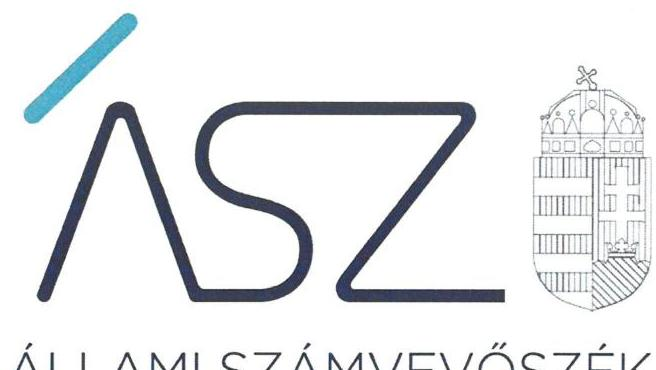
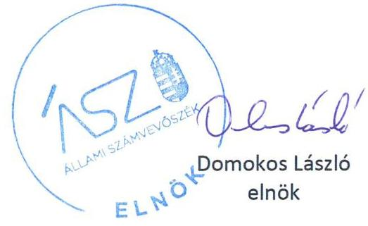
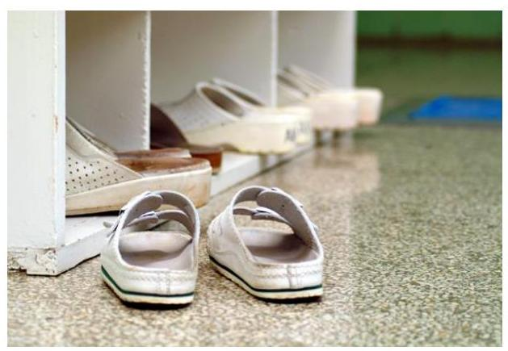
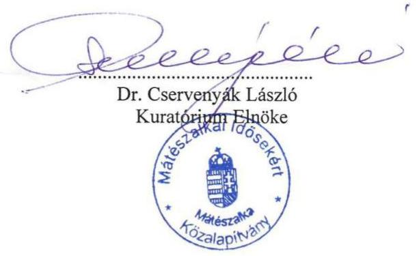
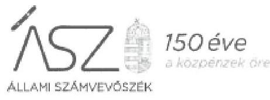
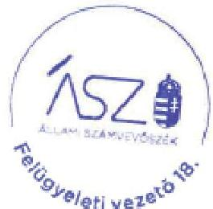

ÁLLAMI SZÁMVEVŐSZÉK

# JELENTÉS 

## Nem állami humánszolgáltatók ellenőrzése

A szociális humánszolgáltatást nyújtó intézmények, szolgáltatók államháztartáson kívüli fenntartói központi költségvetésből kapott támogatásai felhasználásának ellenőrzése Mátészalkai Idősekért Közalapítvány

2020
20174
www.asz.hu

---

ÁLLAMI SZÁMVEVŐSZÉK

# JELENTÉS

## Nem állami humánszolgáltatók ellenőrzése

A szociális humánszolgáltatást nyújtó intézmények, szolgáltatók államháztartáson kívüli fenntartói központi költségvetésből kapott támogatásai felhasználásának ellenőrzése – Mátészalkai Idősekért Közalapítvány

2020. 08. hó 27. nap

2017. 4. www.asz.hu

---

# AZ ELLENŐRZÉST FELÜGYELTE: 

KAKAS SÁNDOR felügyeleti vezető

## AZ ELLENŐRZÉST VEZETTE ÉS A VÉGREHAJTÁSÁÉRT FELELŐS:

RÁCZKEVI KATALIN ellenőrzésvezető
KUSZINGER ANDREA ellenőrzésvezető

## A PROGRAM ÖSSZEÁLLÍTÁSÁÉRT FELELŐS:

TÓTPÁL SZABOLCS osztályvezető
FEKETE-NAGY ANDRÁS GÁBOR ellenőrzési program készítéséért felelős vezető

Jelentéseink az Országgyúlés számítógépes hálózatán és az interneten a www.asz.hu címen is olvashatóak.

IKTATÓSZÁM: EL-2844-001/2020
TÉMASZÁM: 2491
ELLENŐRZÉS-AZONOSÍTÓ SZÁM: V083596; V0867113

---

# TARTALOMJEGYZÉK 

■ ÖSSZEGZÉS ..... 5
■ AZ ELLENŐRZÉS CÉLJA ..... 6
■ AZ ELLENŐRZÉS TERÜLETE ..... 7
■ AZ ELLENŐRZÉS HÁTTERE, INDOKOLTSÁGA ..... 8
■ A JELENTÉS LÉNYEGES KÉRDÉSKÖREI ..... 9
■ AZ ELLENŐRZÉS HATÓKÖRE ÉS MÓDSZEREI ..... 10
■ MELLÉKLETEK ..... 13
I. sz. melléklet: Értelmező szótár ..... 13
■ FÜGGELÉK: ÉSZREVÉTELEK ..... 15
■ RÖVIDÍTÉSEK JEGYZÉKE ..... 21

---

.

---

# ÖSSZEGZÉS 

A Mátészalkai Idősekért Közalapítvány, mint intézményfenntartó szociális humánszolgáltatási közfeladatok ellátására kapott költségvetési támogatásainak felhasználása a 20152018. években nem volt elszámoltatható és átlátható.

## Az ellenőrzés társadalmi indokoltsága

A szociális gondoskodást igénylők védelme, illetve a köznevelési feladatok ellátása az Alaptörvényben meghatározott, a társadalom szempontjából fontos tevékenységek. Jogszabályok teszik lehetővé, hogy államháztartáson kívüli szervezetek - így például az egyházi fenntartók, alapítványok, gazdasági társaságok, egyesületek - által fenntartott intézmények is végezzenek köznevelési, szociális és gyermekvédelmi feladatokat. Mindehhez a központi költségvetés évente jelentős összegű támogatással járul hozzá. Az államháztartáson kívüli, humánszolgáltatást végző intézmények az igényelt közpénzekből társadalmilag hasznos, közösségteremtő, közérdekű, illetve közhasznú tevékenységet végeznek, illetve közfeladatokat látnak el.

Az intézményfenntartók ellenőrzésével az Állami Számvevőszék hozzájárul ahhoz, hogy ezen közpénzeket az államháztartáson kívüli szervezetek is ellenőrizhető, átlátható és elszámoltatható módon használják fel a közfeladatok ellátása során. Az ellenőrzések célja továbbá, hogy a nyilvánosság és az igénybevevők megfelelő tájékoztatást kapjanak az államháztartáson kívüli közfeladatot ellátók múködéséről.

Az ÁSZ ellenőrzései arra adnak választ, hogy az intézményfenntartók arra használták-e fel a közpénzeket, amire igényelték.

A szabályszerű gazdálkodás elengedhetetlen a közfeladat ellátás szakmai céljainak megvalósításához, valamint a társadalmi közbizalom fenntartásához.

## Megállapítások, következtetések

A Mátészalkai Idősekért Közalapítvány a 2015-2017. években a Számv. tv. ${ }^{1}$ 14. § (5) bekezdés b) pontjában foglaltak ellenére eszközök és források értékelési szabályzatával, valamint a Számv. tv. 161. § (1) bekezdésében foglaltak ellenére számlarenddel nem rendelkezett. A Mátészalkai Idősekért Közalapítvány 2015. július 4-től nem rendelkezett jogszabályi előírás szerinti számviteli politikával, mert a Számv. tv. 14. § (4) bekezdésben foglaltak ellenére nem rögzítette azokat a gazdálkodóra jellemző szabályokat, előírásokat, módszereket, amelyekkel meghatározza, hogy mit tekint a számviteli elszámolás és értékelés szempontjából kivételes nagyságú vagy előfordulású bevételnek, költségnek és ráfordításnak. A 2018. évben a Mátészalkai Idősekért Közalapítvány számlarendje a Számv. tv. 161. § (2) bekezdés c) pontjában foglaltak ellenére nem tartalmazta a költségszámlák és az eredményszámlák analitikus nyilvántartással való kapcsolatát.

Fentiek alapján a Mátészalkai Idősekért Közalapítvány a 2015-2018. években a Számv. tv. 161/A. § (1) bekezdésében foglaltak ellenére a könyvezetésre, a bizonylatolásra vonatkozó részletes belső szabályokat a beszámolók adatainak közvetlen alátámasztására alkalmas módon nem alakította ki, ezzel nem biztosította a beszámolók megbízhatóságát, szabályszerű könyvvezetéssel történő alátámasztását, valamint a támogatásokkal való elszámoltathatóság feltételeit.

A Fenntartó mindezek alapján az Alaptörvény² 39. cikk (2) bekezdésében foglaltak ellenére a felhasznált közpénzekre vonatkozó gazdálkodása átláthatóságát nem biztosította. Ezáltal a Fenntartó nem igazolta, hogy a közpénzt a szociális humánszolgáltatási közfeladatra fordította.

---

# AZ ELLENŐRZÉS CÉLJA

**AZ ELLENŐRZÉS CÉLJA** annak értékelése volt, hogy a nem állami, nem önkormányzati szociális intézmények fenntartói központi költségvetésből kapott támogatásainak felhasználása szabályszerű volt-e.

---

# AZ ELLENŐRZÉS TERÜLETE 

## Mátészalkai Idősekért Közalapítvány, mint fenntartó

A Mátészalkai Idősekért Közalapítványt Mátészalka Város Önkormányzata alapította az 1997. évben. Az Alapító okirat szerinti feladatellátáshoz az Önkormányzat ${ }^{3}$ beépített belterületi ingatlant (az Intézmény épületét), továbbá 200 ezer Ft pénzeszközt biztosított. A Fenntartó ${ }^{4}$ fő tevékenységi köre az idősek, demens személyek bentlakásos ellátása volt.

A Fenntartó az ellenőrzött időszakban egy integrált intézmény, a Mátészalkai Idősekért Közalapítvány Idősek Bentlakásos Otthona intézményfenntartójaként müködött. Az intézményben ellátott feladatok demens személyek nappali intézményi ellátása, idősek otthona átlagos szintű ellátás, idősek otthona demens betegek ellátása, időskorúak nappali intézményi ellátása, szociális étkeztetés volt. Az intézmény fenntartói feladatait 2019. január 1-jétől a Szatmári Református Egyházmegye vette át.

A fenntartott Intézmény ${ }^{5}$ az ellenőrzött időszakban nem volt önálló jogi személy, önállóan nem gazdálkodott.

Az Alapító Okirat szerint a Fenntartó nem volt közhasznú jogállású.
A Fenntartó ügyvezető szerve az öt főből álló Kuratórium ${ }^{6}$ volt, képviseletét a Kuratórium elnöke önállóan gyakorolta.

A Fenntartó részére a Magyar Államkincstár az intézményi szociális feladatellátásra 2015. évben 49,3 M Ft, 2016. évben 53,5 M Ft, 2017. évben 61,2 M Ft, 2018. évben 62,7 M Ft támogatást utalt ki.

---

# AZ ELLENŐRZÉS HÁTTERE, INDOKOLTSÁGA 

A szociális feladatokat ellátó nem állami intézményfenntartók részére közfeladataik ellátására évente jelentős összegű pénzügyi támogatást biztosítottak a mindenkori költségvetési törvények a bennük megfogalmazott feltételek mellett. A felhasználható állami támogatások a Kvtv.1-47-ekben a 2015-2018. években a szociális ágazatra vonatkozóan 360 Mrd Ft előirányzatot határoztak meg.

Az ÁSZ ${ }^{8}$ a stratégiájában célul tűzte ki, hogy az államháztartáson kívülre nyújtott költségvetési támogatások ellenőrzésével hozzájárul ahhoz, hogy a közpénzeket az államháztartáson kívüli szervezetek is átlátható módon használják fel a közfeladatok szerződésben vállalt ellátása érdekében. Az ÁSZ a stratégiájában foglaltak alapján is indokolt az ellenőrzés, amely a társadalom számára jelzi, hogy a közpénz államháztartáson kívüli felhasználása sem maradhat ellenőrizetlenül. Az államháztartáson kívülre nyújtott költségvetési támogatások ellenőrzésével az ÁSZ hozzájárul ahhoz, hogy a közpénzeket a nem állami fenntartók átlátható módon használják fel a közfeladatok ellátására kötött szerződésekben vállalt kötelezettségek teljesítése érdekében. Az ÁSZ az ellenőrzés javaslataival hozzájárulhat az említett rendszerek szabályszerű támogatás-felhasználásához, javíthatja a társa-dalmi-gazdasági döntések megalapozottságát, amely a „jól irányított állam müködésének" feltétele.

---

# A JELENTÉS LÉNYEGES KÉRDÉSKÖREI 

1. A szociális humánszolgáltató közfeladatot ellátó államháztartáson kívüli fenntartó szabályszerű müködési - és gazdálkodási környezet kialakításával megteremtette-e a költségvetési támogatások átlátható, elszámoltatható igénybevételének, felhasználásának feltételeit?
2. Az államháztartáson kívüli fenntartó az átvállalt szociális humánszolgáltatási közfeladathoz biztositott költségvetési támogatásokat szabályszerűen fordította-e a humánszolgáltató intézménye müködtetésére?
3. Az államháztartáson kívüli fenntartó a szociális humánszolgáltató intézménye müködtetéséhez felhasznált közpénzekre vonatkozó gazdálkodásával a nyilvánosság előtt elszámolt-e, ennek érdekében ellenőrzési, értékelési és a külső ellenőrzésekkel kapcsolatos intézkedési feladatait szabályszerűen látta-e el?

---

# AZ ELLENŐRZÉS HATÓKÖRE ÉS MÓDSZEREI 

## Az ellenőrzés típusa

Megfelelőségi ellenőrzés.

## Az ellenőrzött időszak

A 2015. január 1-je és 2018. december 31-e közötti időszak.

## Az ellenőrzés tárgya

Az ellenőrzés a szociális humánszolgáltatási közfeladatokat ellátó államháztartáson kívüli fenntartók humánszolgáltatási közfeladatai ellátásához a központi költségvetésből kapott támogatásaik humánszolgáltatási közfeladatokra való fenntartó általi felhasználása szabályszerűségének értékelésére terjedt ki.

## Az ellenőrzött szervezet

Mátészalkai Idősekért Közalapítvány

## Az ellenőrzés jogalapja

Az ellenőrzés jogszabályi alapját az ÁSZ tv. ${ }^{9}$ 1. § (3) bekezdése, 5. § (3) bekezdésben foglalt előírások adják.

## Az ellenőrzés módszerei

Az ellenőrzést az ellenőrzési program annak szempontjai, kérdései, az ellenőrzött Időszakban hatályos jogszabályok, a nemzetközi standardokat irányadónak tekintve, az ellenőrzés szakmai szabályok és módszertanok figyelembevételével rendelte elvégezni. A közpénzekkel való felelős gazdálkodás segítésére irányuló javaslatok kidolgozásakor a hatályos jogszabályok voltak irányadóak.

Az ÁSZ az ellenőrzés ideje alatt az ellenőrzött szervezettel történő kapcsolattartást az ÁSZ SZMSZ ${ }^{10}$-ének vonatkozó előírásai alapján biztosította.

Az ellenőrzési kérdések megválaszolásához szükséges bizonyítékok megszerzése az ellenőrzött által rendelkezésre bocsátott dokumentumokra, adatokra alapozva megfigyelés, szemle (szemrevételezés), kérdésfeltevés (információkérés), valamint elemző eljárással történt.

---

Az ellenőrzési bizonyítékként felhasználható adatforrások közé tartoztak egyrészt az ellenőrzési program részletes szempontjainál felsorolt adatforrások, másrészt minden - az ellenőrzés folyamán feltárt, az ellenőrzés szempontjából információt tartalmazó - dokumentum.

Az ellenőrzés lefolytatásához az ellenőrzött szervezet a kitöltött tanúsítványok, valamint az ÁSZ által kért dokumentumok elektronikus úton való megküldésével szolgáltatott adatokat, információkat. Az így rendelkezésre bocsátott adatok, információk és a tanúsítványok adatai valódiságának kontrollja az ellenőrzés keretében történt.

Az egységes értelmezést támogatta a jelentés mellékletét képező fogalomtár és rövidítésjegyzék.

Az ellenőrzést a szociális humánszolgáltatások esetében a központi költségvetési támogatások igénylésével, módosításával, felhasználásával, elszámolásával kapcsolatos feladatokat ellátó államháztartáson kívüli fenntartónál végezte az ÁSZ. A fenntartott intézményeknél helyszíni szemle keretében győződött meg a tényleges feladatellátásról (verifikáció).

A szociális humánszolgáltatások központi költségvetési támogatásaival kapcsolatos, államháztartáson kívüli fenntartó jogszabályokban előírt feladatai betartását, továbbá a központi költségvetési támogatások szabályszerű nyilvántartását ellenőrizte az ÁSZ a fenntartónál rendelkezésre álló nyilvántartások, beszámolók és egyéb dokumentumok alapján. Az ellenőrzés nem terjedt ki a szociális humánszolgáltatások központi költségvetési támogatásai igénylése, módosítása, elszámolása valódiságának, megalapozottságának, helyességének - sem a fenntartónál, sem a székhely intézményeinél való - értékelésére (mivel ennek felülvizsgálata, ellenőrzése a finanszírozó jogszabályban előírt feladata, határozatai kiadása előtt). Továbbá nem terjedt ki az ellenőrzés e források, intézmények általi szabályszerű felhasználásának értékelésére.

---

.

---

# MELLÉKLETEK 

- I. SZ. MELLÉKLET: ÉRTELMEZŐ SZÓTÁR
közalapítvány
humánszolgáltatás
költségvetési támogatás
nem állami, nem önkormányzati (államháztartáson kívüli) intézmény fenntartó
székhely intézmény

A közalapítvány olyan alapítvány, amelyet az Országgyűlés, a Kormány, valamint a helyi önkormányzat vagy kisebbségi önkormányzat képviselő-testülete közfeladat ellátásának folyamatos biztosítása céljából hozhatott létre 2006. augusztus 24-ig. Közalapítvány alapítására jogosult szerv alapítványt csak közalapítványként hozhatott létre. Közalapítvány létesítése esetén az alapító okiratban a kezelő szervet is meg kell jelölni, vagy ilyen célra külön szervezet - ideértve a kezelő szerv ellenőrzésére jogosult szervet is - létrehozásáról kell gondoskodni. (Forrás: a Polgári Törvénykönyvről szóló 1956. évi IV. törvény 74/G. §, 2006. évi LXV. törvény ${ }^{11}$ 1. §-a alapján).
Külön törvényben meghatározott szociális, gyermekjóléti, gyermekvédelmi, közoktatási, felsőoktatási, kulturális közfeladatok (2014. évi Kvtv. 34. § (1), (4) bekezdés, 1. számú melléklet XX/20/2. alcím, 19. alcím, 2015. évi Kvtv. ${ }^{12}$ 43. § (1), (4) bekezdés, 1. számú melléklet XX/20/2/3. jogcím csoport, 19. alcím, 2016. évi Kvtv. 41. § (1), (4) bekezdés, 1. számú melléklet XX/20/2/3. jogcím csoport, 19. alcím).
a társadalombiztosítás pénzügyi alapjai kivételével az államháztartás központi alrendszeréből ellenérték nélkül, pénzben nyújtott támogatások (Áht. ${ }^{13}$ 1. § 14. pont)
A költségvetési törvényekben (2013. évi CCXXX. törvény 33-34. §, 2014. évi C. törvény 42-43. §, 2015. évi C. törvény 40-41. §) megállapított támogatás. Például a 2015. évi C. törvény 40-41. § szerint többek között: Az Országgyűlés a szociális, gyermekjóléti, gyermekvédelmi közfeladatot ellátó intézményt, szolgáltatást fenntartó egyházi jogi személy, civil szervezet, közalapítvány, országos nemzetiségi önkormányzat, települési vagy területi nemzetiségi önkormányzat, gazdasági társaság, és a humánszolgáltatást alaptevékenységként végző, az Szja tv. hatálya alá tartozó egyéni vállalkozó (a továbbiakban együtt: nem állami szociális fenntartó) részére támogatást állapít meg a következők szerint: a támogatás a nem állami szociális fenntartót a települési önkormányzatok 2. melléklet III. pont 3. alpont c)-k) pontjában és III. pont 5. alpont a) pontjában meghatározott támogatásaival azonos jogcímeken, összegben és feltételek mellett illeti meg.
A szociális, gyermekjóléti és gyermekvédelmi közfeladatokat/humánszolgáltatásokat ellátó intézményt fenntartó egyházi jogi személy, társadalmi szervezet, alapítvány, közalapítvány, civil szervezet, országos nemzetiségi önkormányzat, nonprofit gazdasági társaság, gazdasági társaság és a humánszolgáltatást alaptevékenységként végző, Szja tv. hatálya alá tartozó egyéni vállalkozó. (2015. évi Kvtv. 42. §, 43. § (1), (4) bekezdés, 2016. évi Kvtv. 40. §, 41. § (1), (4) bekezdés, 2017. évi Kvtv. 41. § (1), (4)),
a szolgáltató székhelye, azaz a szolgáltató központi ügyintézésének helye, függetlenül attól, hogy használják-e szolgáltatás nyújtására (Sznyvhr ${ }^{14}$. 1.§ k) pont) (hatályos: 2013. december 1-től)

---

.

---

# FÜGGELÉK: ÉSZREVÉTELEK 

A jelentéstervezetet a Számvevőszék 15 napos észrevételezésre megküldte az ellenőrzött szervezet vezetőjének az ÁSZ tv. 29. §* (1) bekezdése előírásának megfelelően.

Az ÁSZ a jelentéstervezetet észrevételezésre megküldte a Mátészalkai Idősekért Közalapítvány kuratóriumi elnöke részére.
A Mátészalkai Idősekért Közalapítvány kuratóriumi elnöke élt az ÁSZ tv. 29. § (2) bekezdésében foglalt észrevételezési jogával, a jelentéstervezet megállapításaira a törvényes határidőn belül észrevételt tett.
A Mátészalkai Idősekért Közalapítvány kuratóriumi elnökének észrevételét és az arra adott választ a függelék tartalmazza.

[^0]
[^0]:    * 29. § (1) Az Állami Számvevőszék az ellenőrzési megállapításait megküldi az ellenőrzött szervezet vezetőjének vagy az általa megbízott személynek, és annak, akinek személyes felelősségét állapította meg.
    (2) Az ellenőrzött szervezet vezetője és a felelősként megjelölt személy az ellenőrzés megállapításaira tizenöt napon belül írásban észrevételt tehet.
    (3) Az Állami Számvevőszék az észrevételre a beérkezésétől számított harminc napon belül írásban válaszol. A figyelembe nem vett észrevételeket köteles a jelentésben feltüntetni, és megindokolni, hogy azokat miért nem fogadta el.

---

# Mátészalkai Idősekért Közalapítvány 

## IDÖSEK BENTLAKÁSOS OTTHONA

H-4700 Mátészalkai, Móricz Zsigmond út 73. szám Tel.: 00-36 (44) 502-590 Fax: 00-36 (44) 502-591 E mail: nukalap@ freemail.hu Számlaszám: 11744041 - 20090285

## ÁLLAMI SZÁMVEVŐSZÉK

1052 BUDAPEST, APÁCZAI CSERE JÁNOS U. 10.

Tárgy: Jelentés tervezettel kapcsolatos észrevétel

Tisztelt Elnök Úr!

A Mátészalkai Idősekért Közalapítvány, mint humánszolgáltatást nyújtó intézmény, államháztartáson belüli fenntartó, költségvetési támogatásban részesül. Az Állami Számvevőszék ellenőrizte a költségvetési támogatás felhasználását 2015-2018 évekre vonatkozóan.

Az ellenőrzést végző munkatársak és az ellenőrzés megállapításait tartalmazó jelentéstervezet több olyan elemet tartalmaz, amely a munkánk szabályszerű, hatékony és eredményes végzését elősegíti.

Az ellenőrzés során tapasztalt megállapításokkal és következtetésekkel egyetértek.
Az ellenőrzésről készült jelentéstervezettel kapcsolatosan észrevételt kívánok tenni az alábbiak szerint:

- A számviteli politika és a számlarend 2020.01.17.-én lett megküldve az Állami Számvevőszék részére, melyről hitelességi és teljességi nyilatkozat készült.
- A fent említett szabályzatok 2013-ban készültek, az aktualizálásuk időszerű.

A megküldött számviteli politika nem tartalmazza a Számv. tv. 14. § (4) bekezdésében foglaltak szerint a gazdálkodásra jellemző szabályokat, elírásokat, módszereket, a kivételes nagyságú vagy előfordulású bevételnek, költségnek és ráfordításnak az elszámolását.

- Ennek ellenére a normatív támogatás számvitel elszámolásának elkülönítése és felhasználásának dokumentálása megtörtént.
- A Mátészalkai Idősekért Közalapítványt, mint intézményfenntartó civil szervezetet a Magyar Államkincstár kétévente általános és részletes ellenőrzés alá vonja.
- A Magyar Államkincstár jogtalan igénybevételt és a céltól eltérő felhasználást nem tapasztalt. Az Állami Számvevőszék az ellenőrzés időintervallumában nem tapasztalt hiányosságot.

---

- A Mátészalkai Idősekért Közalapítvány, mint intézményfenntartó 2019-től átadta a feladatot a Szatmári Református Egyházmegyének. Az átadás alkalmával ezek a szabályzatok már az új fenntartó jóváhagyásával készültek el. Az átadás-átvétel teljes részletességgel és szakhatósági engedélyezéssel történt.

Mátészalka, 2020. július 13.

Megköszönve az ellenőrzés során tapasztalt segítő együttműködésüket,

Tisztelettel és Nagyrabecsüléssel:

---

Ikt. szám: EL-1414-059/2020.

dr. Cservenyák László
kuratóriumi elnök

Mátészalkai Idősekért Közalapítvány

Mátészalka

Tisztelt Elnök Úr!

A „Nem állami humánszolgáltatók ellenőrzése – A szociális humánszolgáltatást nyújtó intézmények, szolgáltatók államháztartáson kívüli fenntartói központi költségvetésből kapott támogatásai felhasználásának ellenőrzése – Mátészalkai Idősekért Közalapítvány” címmel készített számvevőszéki jelentéstervezetre a 2020. július 13-án kelt észrevételét megkaptam.

Az Állami Számvevőszék (továbbiakban: ÁSZ) észrevételekre vonatkozó álláspontjáról a felügyeleti vezető által készített részletes tájékoztatást csatoltan megküldöm.

Tájékoztatom Elnök urat, hogy a számvevőszéki jelentésben – az Állami Számvevőszékről szóló 2011. évi LXVI. törvény 29. § (3) bekezdése alapján – a figyelembe nem vett észrevételeket szerepeltetjük az elutasítás indokának feltüntetésével.

Budapest, 2020. 08. hónap 01. nap

Tisztelettel:

Domokos László

Melléklet: Tájékoztatás az észrevételek kezeléséről

3052 BUDAPEST, APÁCZAI CSERE JÁNOS UTCA 10, 1364 Budapest 4, Pf. 54. teleffers +36 1 484 9001, fax: +36 1 484 9201

---

# Tájékoztatás az észrevételek kezeléséről 

A „Nem állami humánszolgáltatók ellenőrzése - A szociális humánszolgáltatást nyújtó intézmények, szolgáltatók állomháztartáson kívüli fenntartói központi költségvetésből kapott támogatásai felhasználásának ellenőrzése - Mátészalkai idősekért Közalapítvány" című jelentéstervezettel (továbbiakban: jelentéstervezet) kapcsolatosan a 2020. július 13-án kelt levelében tett észrevételét áttekintettem. Az észrevétel kezeléséről az alábbi tájékoztatást adom.
A jelentéstervezet Megállapítások, következtetések rész 1-3. bekezdéseivel kapcsolatos észrevétel
Elnök úr észrevételében leírta, hogy az ellenőrzés során tapasztalt megállapításokkal és következtetésekkel egyetért.
Elnök úr észrevétele szerint a számviteli politika és számlarend 2020.01.17-én megküldésre került az Állami Számvevőszék részére, melyről teljességi és hitelességi nyilatkozat készült. Hozzátette, hogy a szabályzatok 2013. évben készültek, aktualizálásuk időszerű, továbbá elismerte, hogy a megküldött számviteli politika nem tartalmazza a Számv. tv. 14.§ (4) bekezdésében foglaltak szerint a gazdálkodásra jellemző szabályokat, előírásokat, módszereket, a kivételes nagyságú vagy előfordulású bevételnek, költségnek és ráfordításnak az elszámolását. Elnök úr észrevétele szerint a fenti hiányosság ellenére a normatív támogatás számviteli elkülönítése és felhasználásának dokumentálása megtörtént.
Elnök úr tájékoztatott, hogy a Mátészalkai idősekért Közalapítványt, mint intézményfenntartó civil szervezetet a Magyar Államkincstár kétévente általános és részletes ellenőrzés alá vonja. Elnök úr észrevételében leírta, hogy a Magyar Államkincstár jogtalan igénybevételt és a céltól eltérő felhasználást nem tapasztalt, valamint hogy az Állami Számvevőszék az ellenőrzés időintervallumában nem tapasztalt hiányosságot.
Elnök úr tájékoztatott továbbá, hogy a Mátészalkai Idősekért Közalapítvány, mint fenntartó 2019. évtől - teljes részletességgel és szakhatósági engedélyezéssel történt átadás-átvétel keretében átadta a feladatot a Szatmári Református Egyházmegyének, a szabályzatok már az új fenntartó jóváhagyásával készültek el.
Az ÁSZ az ellenőrzési megállapításait az egyéb ellenőrzést végző szervek ellenőrzési megállapításaitól függetlenül, kizárólag az Állami Számvevőszékről szóló 2011. évi LXVI. törvény. (továbbiakban: ÁSZ tv.) 28. § (2) bekezdésben meghatározott adatszolgáltatási időszakon belül megküldött, teljességi és hitelességi nyilatkozattal alátámasztott dokumentumokra alapozva teszi. Az ellenőrzött az általa beküldött dokumentumokra vonatkozóan teljességi és hitelességi nyilatkozatokat állított ki, melyekben az ÁSZ részére átadott dokumentumok, adatok hitelességéért, valódiságáért, hiánytalanságáért és hatályosságáért teljes körű felelősséget vállalt.
Az ÁSZ az EL-1414-003/2018. iktatószámú 2019. január 4-én kelt adatbekérő levelében kérte a Mátészalkai Idősekért Közalapítványtól (továbbiakban: Fenntartó) az ÁSZ ellenőrzés rendelkezésére bocsátani az azokban felsorolt dokumentumokat, közöttük a Fenntartó 20152017. évekre vonatkozó számviteli politikáját és számlarendjét. Az adatszolgáltatás teljesítése során a Fenntartó számlarendet nem bocsátott az ellenőrzés rendelkezésére, az adatbekérés vonatkozó pontjára hivatkozva - aláírás, pecsét nélküli - Számlatükröt töltött fel. A megküldött dokumentumok, adatok hitelességét, valódiságát, hiánytalanságát és hatályosságát a 2019. január 24-én kiállított és átadott teljességi és hitelességi nyilatkozat igazolja.

---

# Függelék: Észrevételek

Elnök úr észrevételében hivatkozott 2020. január 17-i adatszolgáltatás (számviteli politika és számlarend megküldése) az ÁSZ EL-1414-0017 iktatószámú adatbekérő levelében kért 2018. évre vonatkozó adatszolgáltatás része volt. Az ÁSZ által bekért és a Fenntartó által rendelkezésére bocsátott 2018. évi dokumentumokat – így a 2018. évben hatályos számviteli politikát és számlarendet is – az ellenőrzés a 2018. évre vonatkozó megállapítások során figyelembe vette.

Elnök úr észrevételében elismeri, hogy az ellenőrzés rendelkezésére bocsátott számviteli politika a számvitelről szóló 2000. évi C. törvény (Számv. tv.) 14. § (4) bekezdése - 2015. július 4-től hatályos - rendelkezése ellenére nem tartalmazza, hogy mit tekint a számviteli elszámolás és értékelés szempontjából kivételes nagyságú vagy előfordulású bevételnek, költségnek és ráfordításnak. Elnök úr észrevétele megerősíti a jelentéstervezet megállapítását, miszerint a Fenntartó 2015. július 4-ét követően nem rendelkezett a jogszabályi előírás szerinti számviteli politikával.

A normatív támogatás számviteli elkülönítése megvalósulására és felhasználásának tényleges dokumentálására vonatkozóan a jelentéstervezet megállapítást nem tartalmaz, ezért Elnök úr észrevétele a jelentéstervezetet megállapításait nem befolyásolja.

Más hatóság, egyéb szervezet által a Fenntartónál lefolytatott ellenőrzések az ÁSZ ellenőrzéseinek megállapításait nem befolyásolják.

Az ellenőrzött időszakot követő hatályú feladat átadás-átvételre vonatkozó tájékoztatását köszönöm, az a jelentéstervezet megállapítását nem befolyásolja.

A fentiekre tekintettel az észrevételt az ÁSZ nem fogadja el, a jelentéstervezet megállapítása helytálló, módosítása nem indokolt.

Budapest, 2020. 08. hónap 04. nap

Kakas Sándor s.k.
felügyeleti vezető

A kiadmány hiteles

---

# RÖVIDÍTÉSEK JEGYZÉKE 

${ }^{1}$ Számv. tv.
${ }^{2}$ Alaptörvény
${ }^{3}$ Önkormányzat
${ }^{4}$ Fenntartó
${ }^{5}$ Intézmény
${ }^{6}$ Kuratórium
${ }^{7}$ Kvtv.1-4
${ }^{8}$ ÁSZ
${ }^{9}$ ÁSZ tv.
${ }^{10}$ ÁSZ SZMSZ
${ }^{11}$ 2006. évi LXV. törvény
${ }^{12}$ 2015. évi Kvtv.
${ }^{13}$ Áht.
${ }^{14}$ Sznyvhr.
2000. évi C. törvény a számvitelről (hatályos: 2001. január 1-jétől)

Magyarország Alaptörvénye
Mátészalka Város Önkormányzata
Mátészalkai Idősekért Közalapítvány (2018. december 31-ig)
Mátészalkai Idősekért Közalapítvány Idősek Bentlakásos Otthona
(4700 Mátészalka, Móricz Zsigmond utca 73.)
Mátészalkai Idősekért Közalapítvány Kuratóriuma
Kvtv.1: Magyarország 2015. évi központi költségvetéséről szóló 2014. évi C. törvény (hatályos: 2015. január 1-jétől 2018. december 31-éig)
Kvtv.2: Magyarország 2016. évi központi költségvetéséről szóló 2015. évi C. törvény (hatályos: 2015. július 4-étől)
Kvtv.3: Magyarország 2017. évi központi költségvetéséről szóló 2016. évi XC. törvény (hatályos: 2016. november 1-jétől)
Kvtv.4: Magyarország 2018. évi központi költségvetéséről szóló 2017. évi C. törvény (hatályos: 2017. november 1-jétől)
Állami Számvevőszék
2011. évi LXVI. törvény az Állami Számvevőszékről (hatályos: 2011. július 1-jétől)

Az Állami Számvevőszék elnökének 3/2019. (XII. 23.) ÁSZ utasítása az Állami
Számvevőszék Szervezeti és Müködési Szabályzatáról
(hatályos: 2020. január 1-jétől),
az államháztartásról szóló 1992. évi XXXVIII. törvény és egyes kapcsolódó
törvények módosításáról (hatályos: 2006. augusztus 24-től)
2014. évi C. törvény Magyarország 2015. évi központi költségvetéséről
2011. évi CXCV. törvény az államháztartásról (hatályos: 2012. január 1-jétől)
369/2013. (X. 24.) Korm. rendelet a szociális, gyermekjóléti és gyermekvédelmi
szolgáltatók, intézmények és hálózatok hatósági nyilvántartásáról és
ellenőrzéséről (hatályos: 2013. december 1-jétől)

---

# ASZ 

ALLAMI SZAMVEVOSZEK
1052 Budapest, Apáczai Cs. J. u. 10. I 1364 Budapest 4. Pf. 54 TEL: +36 14849100
email: szamvevoszek@asz.hu
web: www.asz.hu | www.aszhirportal.hu