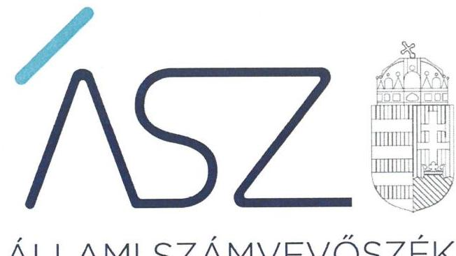
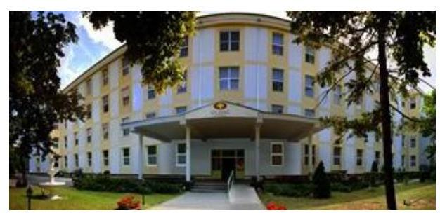
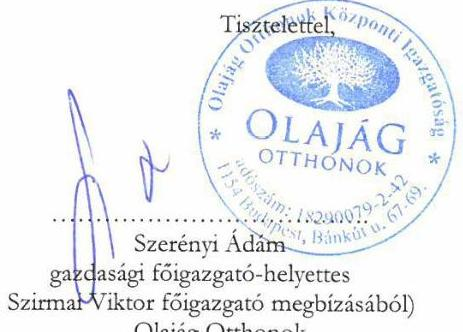
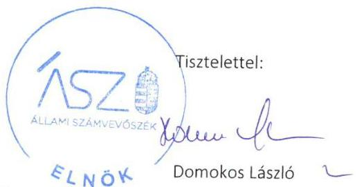
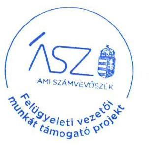

ÁLLAMI SZÁMVEVŐSZÉK

# JELENTÉS 

## Nem állami humánszolgáltatók ellenőrzése

A szociális humánszolgáltatást nyújtó intézmények, szolgáltatók államháztartáson kívüli fenntartói központi költségvetésből kapott támogatásai felhasználásának ellenőrzése Olajág Otthonok

2020
20175
www.asz.hu

---

ÁLLAMI SZÁMVEVŐSZÉK

# JELENTÉS 

## Nem állami humánszolgáltatók ellenőrzése

A szociális humánszolgáltatást nyújtó intézmények, szolgáltatók államháztartáson kívüli fenntartói központi költségvetésből kapott támogatásai felhasználásának ellenőrzése Olajág Otthonok

2020. 09. hó 14. nap

20175
www.asz.hu

---

# AZ ELLENŐRZÉST FELÜGYELTE: 

VARGA EDIT felügyeleti vezető

## AZ ELLENŐRZÉST VEZETTE ÉS A VÉGREHAJTÁSÁÉRT FELELŐS:

HUDÁK KATALIN ellenőrzésvezető
KUSZINGER ANDREA ellenőrzésvezető
KISAPÁTI ANGÉLA ellenőrzésvezetőként eljáró elemző számvevő

## A PROGRAM ÖSSZEÁLLÍTÁSÁÉRT FELELŐS:

TÓTPÁL SZABOLCS osztályvezető
FEKETE NAGY ANDRÁS GÁBOR projektvezető

Jelentéseink az Országgyúlés számítógépes hálózatán és az interneten a www.asz.hu címen is olvashatóak.

IKTATÓSZÁM: EL-2845-001/2020
TÉMASZÁM: 2491
ELLENŐRZÉS-AZONOSÍTÓ SZÁM: V083558, V0867090

---

# TARTALOMJEGYZÉK 

■ ÖSSZEGZÉS ..... 5
■ AZ ELLENŐRZÉS CÉLJA ..... 6
■ AZ ELLENŐRZÉS TERÜLETE ..... 7
■ AZ ELLENŐRZÉS HÁTTERE, INDOKOLTSÁGA ..... 8
■ AZ ELLENŐRZÉS KÉRDÉSKÖREI ..... 9
■ AZ ELLENŐRZÉS HATÓKÖRE ÉS MÓDSZEREI ..... 10
■ JAVASLATOK ..... 12
■ MELLÉKLET ..... 13
I. sz. melléklet: Értelmező szótár ..... 13
■ FÜGGELÉK: ÉSZREVÉTELEK ..... 15
■ RÖVIDÍTÉSEK JEGYZÉKE ..... 21

---

.

---

# ÖSSZEGZÉS 

A budapesti székhelyű Olajág Otthonok belső egyházi jogi személy a 2015-2018. években nem biztosította a szociális humánszolgáltatási közfeladatok ellátására kapott költségvetési támogatások felhasználásának ellenőrizhetőségét.

## Az ellenőrzés társadalmi indokoltsága

A szociális gondoskodást igénylők védelme, illetve a köznevelési feladatok ellátása az Alaptörvényben meghatározott, a társadalom szempontjából fontos tevékenységek. Jogszabályok teszik lehetővé, hogy államháztartáson kívüli szervezetek - így például az egyházi fenntartók, alapítványok, gazdasági társaságok, egyesületek - által fenntartott intézmények is végezzenek köznevelési, szociális és gyermekvédelmi feladatokat. Mindehhez a központi költségvetés évente jelentős összegű támogatással járul hozzá. Az államháztartáson kívüli, humánszolgáltatást végző intézmények az igényelt közpénzekből társadalmilag hasznos, közösségteremtő, közérdekű, illetve közhasznú tevékenységet végeznek, illetve közfeladatokat látnak el.

Az intézményfenntartók ellenőrzésével az Állami Számvevőszék hozzájárul ahhoz, hogy ezen közpénzeket az államháztartáson kívüli szervezetek is ellenőrizhető, átlátható és elszámoltatható módon használják fel a közfeladatok ellátása során. Az ellenőrzések célja továbbá, hogy a nyilvánosság és az igénybevevők megfelelő tájékoztatást kapjanak az államháztartáson kívüli közfeladatot ellátók múködéséről.

Az ÁSZ ellenőrzései arra adnak választ, hogy az intézményfenntartók arra használták-e fel a közpénzeket, amire igényelték.

A szabályszerű gazdálkodás elengedhetetlen a közfeladat ellátás szakmai céljainak megvalósításához, valamint a társadalmi közbizalom fenntartásához.

## Megállapítások, következtetések

A budapesti székhelyű Olajág Otthonok belső egyházi jogi személy, mint Fenntartó ${ }^{1}$ a 2015-2018. években szociális humánszolgáltatási közfeladatait nem önállóan gazdálkodó intézményeiben ${ }^{2}$ látta el. Az intézményei által ellátott közfeladatok idősek otthonában nyújtott átlagos szintű ellátás, valamint demens betegek ellátása, és időskorúak gondozóházának működtetése volt. A Fenntartó az ellenőrzött időszakban a könyvvezetésében a kapott költségvetési támogatások felhasználását a jogszabályok által előírt módon nem különítette el, valamint a könyvvezetésében a Fenntartó és intézményei közötti, valamint az intézményei által ellátott közfeladatok szerinti bontásban nem rögzítette.

A Fenntartó a 2015-2018. években a szociális humánszolgáltatási közfeladat ellátására kapott költségvetési támogatás felhasználásának a Számv. tv. ${ }^{3}$ 161/A. § (2) bekezdésében előírt ellenőrizhetőségét nem biztosította. Mivel az Atr. ${ }^{4}$ 16. § (1) bekezdésében foglalt szabályozás ellenére nem gondoskodott arról, hogy a költségvetési támogatások felhasználásának feladatonkénti bontásban történő elszámolásáról, illetve az egyházi kiegészítő támogatásnak a többi támogatástól elkülönített kezeléséről az adatok rendelkezésre álljanak.

Ezáltal a Fenntartó nem igazolta, hogy a közpénzt a szociális humánszolgáltatási közfeladatra fordította.
Az Állami Számvevőszék az Olajág Otthonok belső egyházi jogi személy vezetőjének a jelentésben javaslatot fogalmazott meg, akinek a javaslatot megalapozó megállapításokra 30 napon belül intézkedési tervet kell készíteni.

---

# AZ ELLENŐRZÉS CÉLJA

**AZ ELLENŐRZÉS CÉLJA** annak értékelése volt, hogy a nem állami, nem önkormányzati szociális intézmények fenntartói központi költségvetésből kapott támogatásainak felhasználása szabályszerű volt-e.

---

# AZ ELLENŐRZÉS TERÜLETE 

## Olajág Otthonok

Az Egységes Magyarországi Izraelita Hitközség által alapított, budapesti székhelyű, „Olajág Otthonok" elnevezésű belső egyházi jogi személyt 2012. június 25 -én vette nyilvántartásba az EMMI ${ }^{6}$.

Az Olajág Otthonok, mint Fenntartó kilenc, a szociális szolgáltatók nyilvántartásába bejegyzett intézménye révén országos jelleggel nyújtott szociális humánszolgáltatást, összesen 1675 férőhelyen. Ebből 1634 férőhelyen átlagos szintű ellátást, illetve demens betegek ellátását végző idősek otthonát, 41 férőhelyen időskorúak gondozóházát működtetett.

A közfeladat ellátás törvényességi felügyeletét az ellenőrzött időszakban az EMMI látta el, a törvényességi ellenőrzési feladatokat a területileg illetékes kormányhivatalok ${ }^{6}$ végezték.

Az Alapító okirata ${ }^{7}$ alapján az intézmények nem önálló jogi személyek, önálló gazdálkodási jogkörrel nem rendelkeztek.

A szociális humánszolgáltatási feladatok ellátására a Fenntartót megillető költségvetési támogatás - a Kincstár ${ }^{8}$ adatszolgáltatása alapján - a 2015. évre 1656,8 millió Ft, a 2016. évre 1764,0 millió Ft, a 2017. évre 1891,0 millió Ft, a 2018. évre 2285,9 millió Ft volt.

---

# AZ ELLENŐRZÉS HÁTTERE, INDOKOLTSÁGA 

A szociális feladatokat ellátó nem állami intézményfenntartók részére közfeladataik ellátására évente jelentős összegű pénzügyi támogatást biztosítottak a mindenkori költségvetési törvények a bennük megfogalmazott feltételek mellett.

A Kvtv.-ekben ${ }^{9}$ (a 2014. évi C. törvény Magyarország 2015. évi központi költségvetéséről, 2015. évi C. törvény Magyarország 2016. évi központi költségvetéséről, 2016. évi XC. törvény Magyarország 2017. évi központi költségvetéséről, 2017. évi C. törvény Magyarország 2018. évi központi költségvetéséről) a szociális célú nem állami humánszolgáltatások támogatására vonatkozóan 360 milliárd Ft előirányzatot határoztak meg a 20152018. évekre. A 2013. évben jelentős változások következtek be a normatív finanszírozás rendszerében. Az Országgyűlés elfogadta a nemzeti köznevelésről szóló 2011. évi CXC. törvényt, amely jelentősen átalakította a korábbi finanszírozási rendszert 2013 szeptemberétől. Az ellenőrzések indokoltságát az is alátámasztja, hogy az ÁSZ ${ }^{10}$ számos szervezetet még nem ellenőrzött ezen a területen.

Az ÁSZ stratégiájában foglaltak alapján is indokolt az ellenőrzés, amely a társadalom számára jelzi, hogy a közpénz államháztartáson kívüli felhasználása sem maradhat ellenőrizetlenül. Az államháztartáson kívülre nyújtott költségvetési támogatások ellenőrzésével az ÁSZ hozzájárul ahhoz, hogy a közpénzeket a nem állami humán fenntartók átlátható módon használják fel a közfeladatok ellátására kötött szerződésekben vállalt kötelezettségek teljesítése érdekében. Az ellenőrzés javaslataival hozzájárulhat az említett rendszerek szabályszerű támogatás felhasználásához, javíthatja a társa-dalmi-gazdasági döntések megalapozottságát, amely a „jól irányított állam működésének" feltétele.

---

# AZ ELLENŐRZÉS KÉRDÉSKÖREI 

1. A szociális humánszolgáltató közfeladatot ellátó fenntartó szabályszerű múködési - és gazdálkodási környezet kialakításával megteremtette-e a költségvetési támogatások átlátható, elszámoltatható igénybevételének, felhasználásának feltételeit?
2. Az államháztartáson kívüli fenntartó az átvállalt szociális humánszolgáltatási közfeladathoz biztositott költségvetési támogatásokat szabályszerűen fordította-e a humánszolgáltató intézményei müködtetésére?
3. Az államháztartáson kívüli fenntartó a szociális humánszolgáltató intézményei müködtetéséhez felhasznált közpénzekre vonatkozó gazdálkodásával a nyilvánosság előtt elszámolt-e, ennek érdekében ellenőrzési, értékelési és a külső ellenőrzésekkel kapcsolatos intézkedési feladatait szabályszerűen látta-e el?

---

# AZ ELLENŐRZÉS HATÓKÖRE ÉS MÓDSZEREI 

## Az ellenőrzés típusa

Megfelelőségi ellenőrzés.

## Az ellenőrzött időszak

A 2015. január 1-je és 2018. december 31-e közötti időszak.

## Az ellenőrzés tárgya

Az ellenőrzés a szociális humánszolgáltatási közfeladatokat ellátó államháztartáson kívüli fenntartók humánszolgáltatási közfeladatai ellátásához a központi költségvetésből kapott támogatásaik humánszolgáltatási közfeladatokra való fenntartó általi felhasználása szabályszerűségének értékelésére terjedt ki.

## Az ellenőrzött szervezet

Olajág Otthonok belső egyházi jogi személy, mint intézményfenntartó

## Az ellenőrzés jogalapja

Az ellenőrzés jogszabályi alapját az ÁSZ tv. ${ }^{11}$ 1. § (3) bekezdése, 5. § (3) bekezdés, valamint az 5. § (11) bekezdés c) pontjában foglalt előírások adták.

## Az ellenőrzés módszerei

Az ellenőrzést az ellenőrzési program, annak szempontjai, kérdései, az ellenőrzött időszakban hatályos jogszabályok, a nemzetközi standardokat irányadónak tekintve, az ellenőrzés szakmai szabályok és módszertanok figyelembevételével rendelte elvégezni az ÁSZ.

Az ellenőrzés ideje alatt az ellenőrzött szervezettel történő kapcsolattartást az ÁSZ SZMSZ ${ }^{12}$-ének vonatkozó előírásai alapján biztosította az ÁSZ.

Az ellenőrzési kérdések megválaszolásához szükséges bizonyítékok megszerzése az ellenőrzött által rendelkezésre bocsátott dokumentumokra, adatokra alapozva megfigyelés, szemle (szemrevételezés), kérdésfeltevés (információkérés), valamint elemző eljárással történt.

---

Az ellenőrzési bizonyítékként felhasználható adatforrások közé tartoztak egyrészt az ellenőrzési program részletes szempontjainál felsorolt adatforrások, másrészt minden - az ellenőrzés folyamán feltárt, az ellenőrzés szempontjából információt tartalmazó - dokumentum.

Az ellenőrzés lefolytatásához az ellenőrzött szervezet a kitöltött tanúsítványok, valamint az ÁSZ által kért dokumentumok elektronikus úton való megküldésével szolgáltatott adatokat, információkat. Az így rendelkezésre bocsátott adatok, információk és a tanúsítványok adatai valódiságának kontrollja az ellenőrzés keretében történt.

Az ellenőrzést alapvetően a központi költségvetési támogatások igénylésével, módosításával, felhasználásával, elszámolásával kapcsolatos feladatokat ellátó Fenntartónál végeztük.

A szociális humánszolgáltatások központi költségvetési támogatásaival kapcsolatos, államháztartáson kívüli fenntartó jogszabályokban előírt feladatai betartását, továbbá a központi költségvetési támogatások szabályszerű nyilvántartását ellenőriztük a Fenntartónál rendelkezésre álló nyilvántartások, beszámolók és egyéb dokumentumok alapján. Az ellenőrzés nem terjedt ki a szociális humánszolgáltatások központi költségvetési támogatásai igénylése, módosítása, elszámolása valódiságának, megalapozottságának, helyességének - sem a fenntartónál, sem a székhely intézményénél való - értékelésére. Továbbá nem terjedt ki az ellenőrzés e források szabályszerű felhasználásának értékelésére.

---

# JAVASLATOK 

Az ÁSZ tv. 33. § (1) bekezdésében foglaltak értelmében az ellenőrzött szervezet vezetője köteles a jelentésben foglalt megállapításokhoz kapcsolódó intézkedési tervet összeállítani és azt a jelentés kézhezvételétől számított 30 napon belül az ÁSZ részére megküldeni. Amennyiben az ellenőrzött szervezet vezetője nem küldi meg határidőben az intézkedési tervet, vagy továbbra sem elfogadható intézkedési tervet küld, az Állami Számvevőszék elnöke az ÁSZ tv. 33. § (3) bekezdése a) és b) pontjaiban foglaltakat érvényesítheti.

## Olajág Otthonok belső egyházi jogi személy föigazgatójának

1. A költségvetési támogatások szabályszerű felhasználása és ellenőrizhetősége érdekében gondoskodjon a Fenntartó számviteli rendjében a támogatások felhasználásának feladatonként elkülönítve történő kimutatásáról és az egyházi kiegészítő támogatásnak a többi támogatástól való elkülönített kezeléséről.
(5. oldal megállapítások, következtetések 2. bekezdése alapján)

---

# MELLÉKLET 

- I. SZ. MELLÉKLET: ÉRTELMEZŐ SZÓTÁR
szociális humánszolgáltatás
egyházi fenntartó
feladatok
költségvetési támogatás
nem állami humánszolgáltató

A Kvtv. 1 34. § (1), (4) bekezdés, 1. számú melléklet XX/20/2. alcím, 19. alcím, Kvtv. 243. § (1), (4) bekezdés, 1. számú melléklet XX/20/2/3. jogcím csoport, 19. alcím, Kvtv. 41. § (1), (4) bekezdés, 1. számú melléklet XX/20/2/3. jogcím csoport, 19. alcím, Kvtv. 41. § (1), (4) bekezdés, 1. számú melléklet XX/20/2/3. jogcím csoport, 19. alcím alapján támogatott szociális közfeladatok.
az egyházi jogi személy (Szoctv. ${ }^{13}$ 2018. december 31-én hatályos 4. § (1) bekezdés mb) pontja). Egyházi jogi személy a bevett egyház és annak belső egyházi jogi személye (Ehtv. ${ }^{14}$ 2018. december 31-én hatályos 10. §-a). Az Ehtv. 14-15. §-a tartalmazza a bevett egyház elismerésének feltételeit.
az Olajág Otthonok tekintetében a 2013. november 25-én kelt alapító okirat 16. pontja alapján ellátott két feladat az idősek otthona és az időskorúak gondozóháza fenntartása.
a társadalombiztosítás pénzügyi alapjai kivételével az államháztartás központi alrendszeréből ellenérték nélkül, pénzben nyújtott támogatások, ide nem értve az adományokat, segélyeket, felajánlásokat, a pártok és pártalapítványok támogatását, az országgyűlési képviselők választása kampányköltségeinek támogatásait, a tanulóknak, hallgatóknak biztosított ösztöndíjakat, kitüntetéshez kapcsolódóan nyújtott pénzjutalmakat, a fogyatékos és a súlyos mozgáskorlátozott személyeknek ezen élethelyzetére tekintettel nyújtott pénzbeli ellátásokat, a szociális igazgatásról és szociális ellátásokról szóló törvény, valamint a gyermekek védelméről és a gyámügyi igazgatásról szóló törvény szerinti pénzbeli és természetbeni szociális és gyermekvédelmi ellátásokat, a foglalkoztatás elősegítéséről és a munkanélküliek ellátásáról szóló törvény szerinti foglalkoztatást elősegítő képzési támogatásokat, álláskeresési ellátásokat, bérgarancia támogatásokat, valamint a foglalkoztatási támogatásokra vonatkozó rendeletekben meghatározott magánszemélyek részére nyújtható támogatásokat, a jogszabály alapján nyújtott családtámogatásokat, korhatár alatti ellátásokat, jövedelempótló és jövedelemkiegészítő szociális támogatásokat, az apákat megillető pótszabadsággal összefüggő költségek megtérítését, az energiafelhasználási támogatásokat, a helyi önkormányzatok általános működésének és ágazati feladatainak támogatásait, a közfoglalkoztatási támogatásokat, a szociálpolitikai menetdíj-támogatásokat, a vis maior támogatásokat, a határon túli, magát magyar nemzetiségűnek valló természetes személy részére jogszabály alapján nyújtható támogatásokat. (Áht. ${ }^{15}$ 1. § 14. pont) Például a költségvetési törvényekben a nem állami humánszolgáltatók részére megállapított támogatás (Kvtv. 1 43. §, Kvtv. 2 41. §, Kvtv. 3 41. §, Kvtv. 4 41. §).
a szociális, gyermekjóléti, gyermekvédelmi közfeladatot ellátó intézményt, szolgáltatást fenntartó egyházi jogi személy, civil szervezet, közalapítvány, országos nemzetiségi önkormányzat, települési vagy területi nemzetiségi önkormányzat, gazdasági társaság, és a humánszolgáltatást alaptevékenységként végző, a személyi jövedelemadóról szóló törvény hatálya alá tartozó egyéni vállalkozó (Kvtv. 1 43. § (1) bekezdése, Kvtv. 2 41. § (1) bekezdés, Kvtv. 3 41. § (1) bekezdés, Kvtv. 4 41. § (1) bekezdés).

---

.

---

# FÜGGELÉK: ÉSZREVÉTELEK 

A jelentéstervezetet a Számvevőszék 15 napos észrevételezésre megküldte az ellenőrzött szervezet vezetőjének az ÁSZ tv. 29. §* (1) bekezdése előírásának megfelelően.

Az Olajág Otthonok belső egyházi jogi személy föigazgatója a jelentéstervezet megállapításaira írásban észrevételt tett.
Az Olajág Otthonok belső egyházi jogi személy föigazgatójának észrevételét és az arra adott választ a függelék tartalmazza.

[^0]
[^0]:    * 29. § (1) Az Állami Számvevőszék az ellenőrzési megállapításait megküldi az ellenőrzött szervezet vezetőjének vagy az általa megbízott személynek, és annak, akinek személyes felelősségét állapította meg.
    (2) Az ellenőrzött szervezet vezetője és a felelősként megjelölt személy az ellenőrzés megállapításaira tizenöt napon belül írásban észrevételt tehet.
    (3) Az Állami Számvevőszék az észrevételre a beérkezésétől számított harminc napon belül írásban válaszol. A figyelembe nem vett észrevételeket köteles a jelentésben feltüntetni, és megindokolni, hogy azokat miért nem fogadta el.

---

# Tisztelt Domokos László Elnök úr! 

Köszönettel megkaptuk az Állami Számvevőszék „Nem állami humánszolgáltatók ellenőrzése - A szociális humánszolgáltatást nyújtó intézmények, szolgáltatók államháztartáson kívüli fenntartói költségvetésből kapott támogatásai felhasználásának ellenőrzése - Olajág Otthonok" címe ellenőrzésüknek megállapításait. Átnézve az ellenőrzés megállapításait, azzal kapcsolatban az alábbi észrevételeket kívánom tenni:

- Az Olajág Otthonok a számviteli törvénynek (2000. évi C. tv.)-nek és az egyházi jogi személyek beszámolókészítési és könyvvezetési kötelezettségének sajátosságairól szóló (296/2013. (VII.29.) Kormányrendeletnek megfelelően vezeti a könyveit, melyen túlmenően intézményünk további megbontásokat alkalmaz: minden felmerült bevételt, költséget és ráfordítást költséghely szerinti megbontásban is könyvelünk, így az intézményenkénti megbontás - a megküldött főkönyvből ugyan nem, de a könyvvezetésünkből kinyerhető. Az adatok intézményenkénti megbontására amúgy nem csak könyvvezetési, hanem belső, menedzsment riport rendszerünk, valamint a 1993. évi III. törvény által előírt, minden évben legkésőbb április 1-éig kihirdetni szükséges intézményi térítési díj vonatkozásában is szükség van. Az intézményi megbontást az éves beszámoló részeként, analitikus nyilvántartás formájában a jövőben megtesszük és e megbontást természetesen a még nem lezárt 2019-s éves beszámoló vonatkozásában is már alkalmazni fogjuk
- A feladatonkénti megbontást a továbbiakban az alábbiak szerint fogjuk teljesíteni: az Olajág Otthonok intézményeinek éves összesített lakói gondozási napjait, feladatonkénti megbontás szerint készítünk egy analitikus nyilvántartást, amely tartalmazza az alaptevékenységhez kapcsolódó költség és ráfordítás összegeket, az aktuális évben járó költségvetési támogatás az összes bevételhez viszonyított arányának figyelembevételével, amely igazodik a Magyar Államkincstár által vezetett ún. KENYSZI rendszerhez, melyet szintén az Olajág Otthonok éves beszámolójának kötelező tartalmi részévé teszünk.

Ezen intézkedéseket tartalmazó utasításomat jelen levél mellékleteként küldjük Önnek, valamint ez évre vonatkozó előzetes főkönyvi kivonatunkat és annak költséghely megbontását, valamint a számviteli politikánkat a számlatükörrel kiegészítve!

Budapest, 2020.július „ZO,,

---

# 150 éve   a közpénzek öre 

ÁLLAMI SZÁMVEVÓSZÉK

Ikt. szám: EL-1308-096/2020.

Dr. Szirmai Viktor úr
főigazgató
Olajág Otthonok belső egyházi jogi személy

## Budapest

Tisztelt Főigazgató Úr!
„Nem állami humánszolgáltatók ellenőrzése - A szociális humánszolgáltatást nyújtó intézmények, szolgáltatók államháztartáson kívüli fenntartói központi költségvetésből kapott támogatásai felhasználásának ellenőrzése - Olajág Otthonok" címmel készített számvevőszéki jelentéstervezetre a 2020. július 20-án kelt levélben megküldött észrevételüket megkaptam.

Az Állami Számvevőszék észrevételekre vonatkozó álláspontjáról a felügyeleti vezető által készített részletes tájékoztatást csatoltan megküldöm.

Tájékoztatom Főigazgató urat, hogy a számvevőszéki jelentésben - az Állami Számvevőszékről szóló 2011. évi LXVI. törvény 29. § (3) bekezdése alapján - a figyelembe nem vett észrevételeket szerepeltetjük az elutasítás indokának feltüntetésével.

Budapest, 2020. O6 hónap 10 nap

Melléklet: Tájékoztatás az észrevételek kezeléséről

---

# Tájékoztatás az észrevételek kezeléséről 

„Nem állami humánszolgáltatók ellenőrzése - A szociális humánszolgáltatást nyújtó intézmények, szolgáltatók államháztartáson kívüli fenntartói központi költségvetésből kapott támogatásai felhasználásának ellenőrzése - Olajág Otthonok" címú jelentéstervezetre (továbbiakban: jelentéstervezet) a 2020. július 20-án kelt levelében megküldött észrevételüket áttekintettem. Az észrevétel kezeléséről az alábbi tájékoztatást adom.

A jelentéstervezet megállapítások, következtetések részének 1. bekezdésében szereplő megállapításra vonatkozó észrevételükkel kapcsolatban

Az észrevételben jelezték, hogy az Olajág Otthonok belső egyházi jogi személy (továbbiakban: Fenntartó) a számvitelről szóló 2000. évi C. törvény és az egyházi jogi személyek beszámolókészítési és könyvvezetési kötelezettségének sajátosságairól szóló 296/2013. (VII. 29.) Korm. rendelet előírásainak megfelelően vezeti a könyveit, azon túlmenően további megbontásokat alkalmaznak: minden felmerült bevételt, költséget és ráfordítást költséghely szerinti megbontásban is könyvelnek, így az intézményenkénti megbontás - a megküldött főkönyvből ugyan nem, de a könyvvezetésükből kinyerhető.
A jelentéstervezet megállapítások, következtetések részének 1. bekezdése megállapította, hogy a Fenntartó könyvvezetésében a kapott költségvetési támogatások felhasználását 2015-2018. években a Fenntartó és intézményei közötti, valamint az intézményei által ellátott közfeladatok szerinti bontásban nem rögzítette.
A Fenntartó által az Állami Számvevőszéket (továbbiakban: ÁSZ) rendelkezésére bocsátott 20152018. évi főkönyvi kivonatai, ahogy azt az észrevételben is elismerik, nem támasztják alá az észrevételben szereplő azon állítást, hogy a Fenntartó az ellenőrzött időszakban költségeit és ráfordításait intézményenkénti bontásban elkülönítetten tartotta nyilván. A Fenntartó 2015-2018. évi főkönyvi kivonatai a támogatások felhasználásának feladatonkénti (idősek otthonában nyújtott átlagos szintű ellátás, demens betegek ellátása, és időskorúak gondozóházának működtetése) bontásban történő elkülönítését sem támasztják alá. A Fenntartó főkönyvi kivonataiból megállapítható, hogy a Fenntartó főkönyvi könyvelésében nem alkalmazza a költségek és ráfordítások intézményi, illetve feladatonkénti bontású elkülönítését lehetővé tevő főkönyvi számlákat (alábontásokat), sem a költséghelyek, költségviselők nyilvántartására szolgáló 6-7-es számlaosztályt. A Fenntartó 2018. évre a támogatás felhasználásának elkülönített nyilvántartását alátámasztandóan megküldött kimutatásból nem azonosíthatóak be az egyes intézmények, nem állapítható meg belőle, hogy a kimutatás milyen időszakra vonatkozik, továbbá nem tartalmazza a költségek és ráfordításoknak a támogatott feladatok szerinti elkülönítését sem. Fentiek alapján megállapítottam, hogy a Fenntartó nem igazolta a támogatások felhasználásának a Fenntartó és intézményei közötti, valamint az intézményei által ellátott közfeladatok szerinti bontásban történő nyilvántartását 2015-2018. évek vonatkozásában.

---

Az ÁSZ az ellenőrzési megállapításait az adatszolgáltatás során a részére törvényi határidőben rendelkezésre bocsátott dokumentumokra alapozva fogalmazta meg. Főigazgató úr 2019. január 16-án, 2019. november 15-én és 2019. december 11-én kelt nyilatkozatai szerint az ÁSZ részére átadott dokumentumok, adatok megbízhatóak, és a bekért adatokra, dokumentumokra vonatkozóan teljes körű információt tartalmaznak.

Fentiek alapján az ellenőrzés megállapítása helytálló. Az észrevételt nem fogadjuk el, a jelentéstervezet módosítása nem indokolt.

Budapest, 2020. 08 hónap 17. nap

Varga Edit
felügyeleti vezető s.k.

A kiadmány hiteles

---

.

---

# RÖVIDÍTÉSEK JEGYZÉKE 

${ }^{1}$ Fenntartó
${ }^{2}$ intézmények
${ }^{3}$ Számv. tv.
${ }^{4}$ Atr.
${ }^{5}$ EMMI
${ }^{6}$ illetékes kormányhivatalok
${ }^{7}$ Alapító okirat
${ }^{8}$ Kincstár
${ }^{9}$ Kvtv.
${ }^{10}$ ÁSZ
${ }^{11}$ ÁSZ tv.
${ }^{12}$ ÁSZ SZMSZ
${ }^{13}$ Szoctv.
${ }^{14}$ Ehtv.
${ }^{15}$ Áht.

Olajág Otthonok belső egyházi jogi személy
Olajág Idősek Otthona I-IX. számú intézmények, azaz szolgáltatók, amelyek az Olajág Otthonok belső egyházi jogi személy által fenntartott bejegyzett szociális szolgáltatók és egyben az Olajág Otthonok, mint fenntartó telephelyei
2000. évi C. törvény a számvitelről (hatályos: 2001. január 1-jétől)

489/2013. (XII. 18.) Korm. rendelet az egyházi és nem állami fenntartású szociális, gyermekjóléti és gyermekvédelmi szolgáltatók, intézmények és hálózatok állami támogatásokról (hatályos: 2014. január 1-jétől)
Emberi Erőforrások Minisztériuma
Budapest Főváros Kormányhivatala és a Pest Megyei Kormányhivatal
Olajág Otthonok belső egyházi jogi személy alapító okirata
(hatályos: 2013. november 25-től)
Magyar Államkincstár
Kvtv.1: 2014. évi C. törvény Magyarország 2015. évi központi költségvetéséről (hatályos: 2015. január 1-jétől 2018. december 30-ig)
Kvtv.2: 2015. évi C. törvény Magyarország 2016. évi központi költségvetéséről (hatályos: 2015. július 4-től)
Kvtv.3: 2016. évi XC. törvény Magyarország 2017. évi központi költségvetéséről (hatályos: 2016. november 1-jétől)
Kvtv.4: 2017. évi C. törvény Magyarország 2018. évi központi költségvetéséről (hatályos: 2017. november 1-jétől)
Állami Számvevőszék
2011. évi LXVI. törvény az Állami Számvevőszékről (hatályos: 2011. július 1-jétől)

Állami Számvevőszék Szervezeti és Müködési Szabályzata
1993. évi III. törvény a szociális igazgatásról és szociális ellátásokról (hatályos: 1993. február 26-tól)
2011. évi CCVI. törvény a lelkiismereti és vallásszabadság jogáról, valamint az egyházak, vallásfelekezetek és vallási közösségek jogállásáról (hatályos: 2012. január 1-jétől)
2011. évi CXCV. törvény az államháztartásról (hatályos: 2011. december 31-étől)

---

# ASZ 

ALLAMI SZAMVEVOSZEK
1052 Budapest, Apáczai Cs. J. u. 10. I 1364 Budapest 4. Pf. 54 TEL: +36 14849100
email: szamvevoszek@asz.hu
web: www.asz.hu | www.aszhirportal.hu