ÁLLAMI SZÁMVEVŐSZÉK

# JELENTÉS 

## Utóellenőrzések

Az egészségügyi és szociális ellátó intézmények kockázatalapú utóellenőrzése (24 intézmény)

2020.

20176
www.asz.hu

---

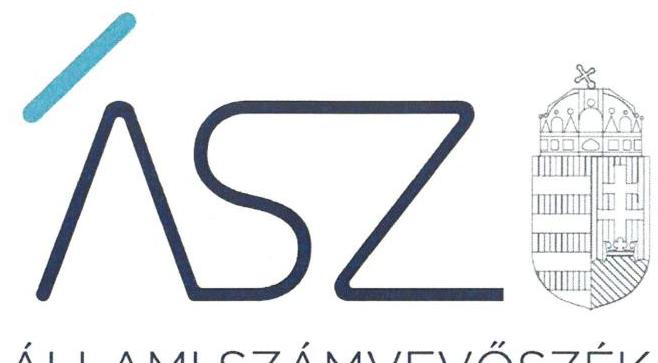

ÁLLAMI SZÁMVEVŐSZÉK

# JELENTÉS

## Utóellenőrzések

Az egészségügyi és szociális ellátó intézmények kockázatalapú utóellenőrzése (24 intézmény)

2020. 09. hó 03. nap

2017. www.asz.hu

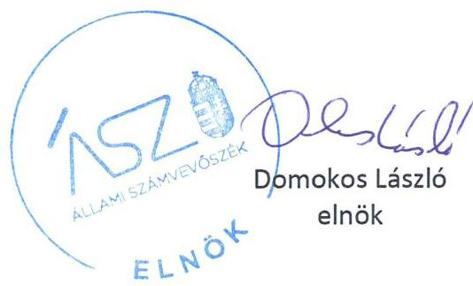

---

# AZ ELLENŐRZÉST FELÜGYELTE: 

MAKKAI MÁRIA felügyeleti vezető

## AZ ELLENŐRZÉST VEZETTE ÉS A VÉGREHAJTÁSÁÉRT FELELŐS:

ÓDOR ZOLTÁN TAMÁS ellenőrzésvezető

## A PROGRAM ÖSSZEÁLLÍTÁSÁÉRT FELELŐS:

HOLMAN MAGDOLNA JULIANNA főtitkár

IKTATÓSZÁM EL-2854-001/2020
TÉMASZÁM: 2509
ELLENŐRZÉS-AZONOSÍTÓ SZÁM: V0853

Jelentéseink az Országgyúlés számítógépes hálózatán és az interneten a www.asz.hu címen is olvashatóak.

---

# TARTALOMJEGYZÉK 

■ ÖSSZEGZÉS ..... 5
■ AZ ELLENŐRZÉS CÉLJA ..... 6
■ AZ ELLENŐRZÉS TERÜLETE ..... 7
■ AZ ELLENŐRZÉS HÁTTERE, INDOKOLTSÁGA ..... 8
■ A JELENTÉS LÉNYEGES KÉRDÉSKÖRE ..... 9
■ AZ ELLENŐRZÉS HATÓKÖRE ÉS MÓDSZEREI ..... 10
■ MEGÁLLAPÍTÁSOK ..... 12
■ MELLÉKLETEK ..... 13
I. sz. melléklet: A törvényi megfelelés irányítási és gazdálkodási kockázata az intézményeknél ..... 13
II. sz. melléklet: Ellenőrzött időszak intézményenként ..... 14
III. sz. melléklet: Intézményekkel kapcsolatos egyedi megállapítások ..... 15
IV. sz. melléklet: Értelmező szótár ..... 19
■ FÜGGELÉK: ÉSZREVÉTELEK ..... 21
■ RÖVIDÍTÉSEK JEGYZÉKE ..... 39

---

.

---

# ÖSSZEGZÉS 

Az utóellenőrzéssel érintett 24 intézmény közül 22 intézmény vezetője a törvényi megfelelés irányítási és gazdálkodási kockázatok csökkentése érdekében intézkedéseket tett, ezáltal a közpénzügyi helyzet javult. 15 intézmény vezetője jelentősen, 7 intézmény vezetője részben csökkentette a kockázatokat, 2 vezető nem tett intézkedéseket a kockázatok csökkentése érdekében.

## Az ellenőrzés társadalmi indokoltsága

Az Állami Számvevőszék stratégiájában célul tűzte ki a számvevőszéki munka hasznosulásának javítását. Ezzel összhangban ellenőrzi, hogy az ellenőrzött szervezetek megvalósították-e a korábbi ellenőrzései által feltárt hibák, hiányosságok és szabálytalanságok megszüntetése céljából elkészített intézkedési tervekben foglaltakat. A rendszeres utóellenőrzések hozzájárulnak a szükséges intézkedések tényleges végrehajtásához, ezáltal a közpénzügyek rendezettségének javulásához.

A központi alrendszer részét képező intézmények alapvető rendeltetése a közfeladatok ellátásának biztosítása. A közpénzek felhasználásában meghatározó, központi alrendszerbe tartozó intézmények pénzügyi és vagyongazdálkodási tevékenységük és/vagy feladatellátásuk súlya miatt jelentős hatást gyakorolhatnak a költségvetés egyensúlyának fenntartására. A központi költségvetésből az egyik legjelentősebb kiadást az egészségügyi ellátásokra fordított kiadások jelentik, amelyekből a kórházak kapják a legtöbb támogatást.

Utóellenőrzésünk 24, a központi alrendszer részét képező intézményt - 16 kórház és nyolc szakosított szociális ellátást nyújtó intézmény - érintő kockázat alapú értékelése a korábbiaktól eltérő, megközelítési módot alkalmaz, és az ellenőrzött szervezet vezetőjének a szervezet működésében betöltött felelősségét helyezi előtérbe. Mindez azt jelenti, hogy az utóellenőrzés során a szervezet vezetőjének a korábbi ÁSZ ellenőrzések megállapításaihoz kapcsolódó intézkedési tervekben meghatározott feladatok végrehajtásáról készített állítását helyezi a középpontba. Ennek eredményeként az ÁSZ azt értékeli, hogy az intézkedési tervében meghatározott feladatok végrehajtásának értékelésével az ellenőrzött szervezet vezetője csökkentette-e a szabálytalan működésből adódó kockázatokat.

## Főbb megállapítások, következtetések

Az alacsony kockázati kategóriába sorolt 15 intézménynél a korábbi ellenőrzések javaslatai hasznosultak, a külső ellenőrzések intézkedési terveivel kapcsolatos jogszabályi előírásokat betartották, az intézkedési tervekben szereplő feladatokat végrehajtották, így a szabálytalan működés kockázata ezeknél az intézményeknél csökkent, a hiányosságok javításra kerültek.

A kockázatos kategóriába sorolt 7 intézménynél nem tartották be maradéktalanul az intézkedési tervvel, nyilvántartással és a fejezetet irányító szerv felé történő beszámolással kapcsolatos jogszabályi előírásokat, azonban az ebből fakadó fennmaradt kockázatok mérséklését az előírásoknak megfelelően kialakított belső ellenőrzésük működtetése biztosította.

A magas kockázati kategóriába sorolt intézmények esetében egy intézménynél nem készült az intézkedési tervben meghatározott feladatokról beszámoló a fejezetet irányító szerv felé, egy intézménynél nem készült az intézkedési tervben meghatározott feladatokról nyilvántartás. Ezeknél az intézményeknél nem tartották be a külső ellenőrzéshez kapcsolódó jogszabályi előírásokat, ezért működésük kiemelt kockázatot hordoz.

---

# AZ ELLENŐRZÉS CÉLJA 

Az ellenőrzés célja annak értékelése, hogy a belső kontrollrendszer kialakítására és működtetésére kötelezett szervezet vezetője csökkentette-e a szervezet szabálytalan működésének kockázatát az intézkedési tervében meghatározott feladatok végrehajtásának értékelése alapján.

---

# AZ ELLENŐRZÉS TERÜLETE

## Egészségügyi és szociális intézmények

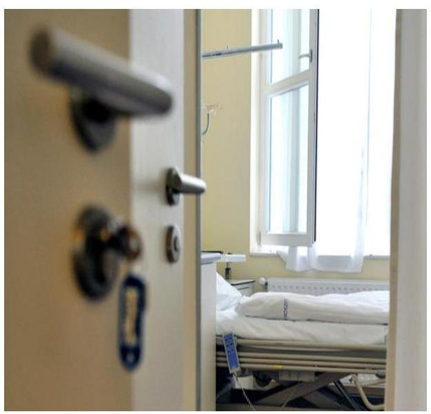

Az utóellenőrzés 24 kockázatelemzés alapján kiválasztott egészségügyi és szociális intézménynél értékelte a külső ellenőrzések nyilvántartásához kapcsolódó jogszabályi előírások betartását, valamint a belső ellenőrzés kialakítását és működtetését.

Az utóellenőrzés alapjául szolgáló ellenőrzések 2016-2018. években kerültek nyilvánosságra. A jelentések megállapításokat és javaslatokat tartalmaztak az intézményi belső kontrollrendszer kialakítására és működtetésére, a pénzügyi és vagyongazdálkodására az integritás kontrollrendszer kiépítettségével, az átlátható és elszámoltatható közpénzfelhasználás érvényesülésére.

A 24 ellenőrzött intézményből 16 kórház, ebből 6 ellátási területe város és annak vonzáskörzete, 6 megyei, 3 budapesti és 1 országos járó- és fekvőbetegek diagnosztikus és terápiás szakorvosi, rehabilitációt és követéses gondozási ellátást biztosít. 8 intézmény nyújt személyes gondoskodás keretébe tartozó szakosított szociális ellátást, ezek közül 3 gyermekjóléti, gyermekvédelmi ellátórendszer részeként végzi tevékenységét.

Az ellenőrzés az intézkedési tervben szereplő feladatok végrehajtásának és a belső ellenőrzés értékelésével arra kereste a választ, hogy az egyes intézmények csökkentették-e a szabálytalan működésből adódó kockázatokat.

---

# AZ ELLENŐRZÉS HÁTTERE, INDOKOLTSÁGA 

Az ÁSZ tv. 33. § (1) bekezdése értelmében a számvevőszéki jelentésben foglalt javaslatokat megalapozó ÁSZ megállapítások alapján az ellenőrzött szervezet vezetője intézkedési tervet köteles összeállítani, és az Állami Számvevőszék részére megküldeni.

A költségvetési szervek belső kontrollrendszeréről és belső ellenőrzéséről szóló 370/2011. (XII. 31.) Korm. rendelet (Bkr.) előírása alapján az intézkedési terv elkészítéséért, végrehajtásáért és a megtett intézkedésekről történő beszámolásért az ellenőrzött, valamint a javaslattal érintett szerv, illetve szervezeti egység vezetője a felelős. E jogszabály a költségvetési szerv vezetője részére évente beszámolási kötelezettséget határoz meg. Előírja, hogy a költségvetési szerv vezetője évente beszámol a külső ellenőrzések javaslatai alapján készült intézkedési tervek végrehajtásáról a fejezetet irányító szerv vezetőjének és a fejezetet irányító szerv belső ellenőrzési vezetőjének.

Az utóellenőrzés keretében az ÁSZ ${ }^{1}$ azt értékeli, hogy a költségvetési szerv vezetője az érintett számvevőszéki jelentésben foglalt javaslatokat megalapozó ÁSZ megállapításokkal összhangban készített intézkedési tervében meghatározott feladatok végrehajtásának értékelésével megtette-e a közpénz, közvagyon szabályos felhasználása érdekében szükséges intézkedéseket és ezzel csökkent-e a szabálytalan működés kockázata. Az utóellenőrzésnél az ÁSZ kockázati értékelésen alapuló ellenőrzési megközelítést alkalmaz.

A vezetői intézkedések elmaradása esetén, annak a közpénzek, közvagyon veszélyeztetettségére gyakorolt valószínűsített hatásának számvevőszéki értékelése további intézkedéseket vonhat maga után.

---

# A JELENTÉS LÉNYEGES KÉRDÉSKÖRE 

- Csökkent-e a szabálytalan működés kockázata az ellenőrzött intézményeknél?

---

# AZ ELLENŐRZÉS HATÓKÖRE ÉS MÓDSZEREI 

## Az ellenőrzés típusa

Megfelelőségi ellenőrzés.

## Az ellenőrzött időszak

Az utóellenőrzés alapját képező ÁSZ jelentés közzétételének napjától az utóellenőrzésről szóló adatbekérő levél keltének napjáig tartó időszak, intézményenként a II. melléklet szerint.

## Az ellenőrzés tárgya

Az intézkedési tervben meghatározott feladatok végrehajtásával kapcsolatban az ellenőrzött szervezet vezetője által vezetett nyilvántartás és az elkészített beszámolók.

## Az ellenőrzött szervezet

A kockázati alapon kiválasztott 24, a központi alrendszer részét képező intézmény az I. számú melléklet szerint.

## Az ellenőrzés jogalapja

Az ellenőrzés jogszabályi alapját az ÁSZ tv. 1.§ (3) bekezdésének és 33. § (7) bekezdésének az előírásai képezik.

## Az ellenőrzés módszerei

Az ellenőrzést az ellenőrzési program ellenőrzési kérdései, az ellenőrzött időszakban hatályos jogszabályok, az ellenőrzés szakmai szabályok és módszertanok figyelembe vételével az ellenőrzési programban foglalt értékelési szempontok szerint végezzük.

Az ellenőrzés ideje alatt az ellenőrzött szervezettel történő kapcsolattartást az ÁSZ SZMSZ-ének vonatkozó előírásai alapján biztosítjuk.

Az utóellenőrzés megállapításait az ÁSZ rendelkezésére álló dokumentumok, valamint az ÁSZ adatbekérése szerint, az ellenőrzött szervezetek által rendelkezésre bocsátott dokumentumok, adatok alapján kell megfogalmazni, amely indokolt esetén kiegészülhet az ellenőrzött szervezet székhelyén történő adatbetekintéssel, helyszíni ellenőrzéssel is.

---

Az ellenőrzési kérdések megválaszolásához szükséges bizonyítékok megszerzése az ellenőrzött által rendelkezésre bocsátott dokumentumokra, adatokra alapozva megfigyelés, szemle (szemrevételezés), kérdésfeltevés (információkérés), valamint elemző eljárás alkalmazásával történik.

Az ellenőrzés lefolytatásához az ellenőrzött szervezet az ÁSZ által kért dokumentumok elektronikus megküldésével szolgáltatnak adatot, melyek valódiságát és teljes körűségét az ellenőrzött szervezet vezetője által tett teljességi és hitelességi nyilatkozat igazolja. Az így rendelkezésre bocsátott adatok, információk megbízhatóságának kontrollja az ellenőrzés keretében történik.

Az ellenőrzés kiterjed minden olyan körülményre és adatra, amely az ÁSZ jogszabályban meghatározott feladataiban, valamint a program végrehajtása folyamán felmerült újabb összefüggések feltárásához szükséges, az ellenőrzés döntés alapján kiterjedhet kiemelt kockázati ügyekre is.

Az ÁSZ az utóellenőrzéseknél az ellenőrzési kérdésekre adott válaszok alapján több lépcsőben értékeli az ellenőrzött szervezeteket a kockázati értékelésen alapuló ellenőrzési megközelítés alkalmazásával.

Minden ellenőrzött szervezet esetében az ellenőrzési kérdésekre adott válaszok alapján értékelni kell, hogy az ÁSZ által a szervezet szabálytalan működését érintően feltárt - javaslatokat megalapozó - megállapítások kezelése megtörtént-e, csökkent-e a szervezet szabálytalan működésének kockázata. Az ÁSZ esetenként értékeli, hogy az ellenőrzött szervezet belső ellenőrzése alkalmas-e a fennmaradt kockázatok mérséklésére.

Az értékelés eredménye alapján az ÁSZ további intézkedéseket kezdeményezhet.

Az ellenőrzés során első lépésként értékeltük az intézkedési tervvel kapcsolatos jogszabályi előírások betartását az egyes szervezeteknél, azokat magas, kockázatos és alacsony kockázati kategóriákba soroltuk. Azokat az intézményeket, amelyek az intézkedési tervben meghatározott feladatok végrehajtásával kapcsolatban nem rendelkezett az ellenőrzött szervezet vezetője által vezetett nyilvántartással vagy a fejezetet irányító szerv felé, az intézkedési tervben meghatározott feladatok végrehajtásáról beszámolóval, magas kockázati kategóriába soroltuk. A belső ellenőrzés kialakításának és működtetésének értékelésére azon szervezetek esetében került sor, melyeknél az intézkedési tervvel kapcsolatos jogszabályi előírások betartása értékelésének eredménye kockázatos volt. Amennyiben a belső ellenőrzés kialakítása és működtetése nem felelt meg a jogszabályi előírásoknak, ezáltal nem volt biztosított a hibák kijavításának a kontrollja, a szabálytalan működés kockázatát magasra módosítottuk. Hasonlóan magas kockázatúnak értékeltük a szabálytalan működés kockázatát azon szervezeteknél, melyek nem rendelkeztek a működést meghatározó, gazdálkodás kereteit biztosító szabályzatokkal. A szabálytalan működés kockázata egy értékelt szervezetnél akkor csökkent, ha annak kockázati kategóriája alacsony.

---

# Csökkent-e a szabálytalan működés kockázata az ellenőrzött intézményeknél? 

Összegző megállapítás

1. ábra
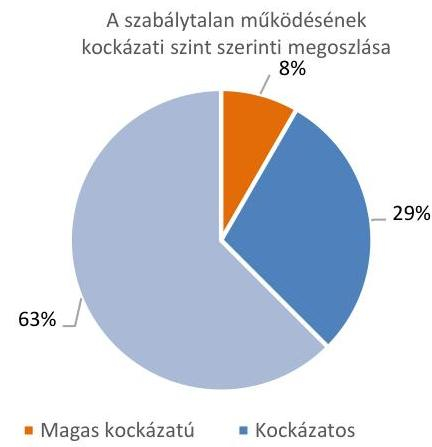

24 központi alrendszerhez tartozó intézmény közül 22 szervezet esetében csökkent a szabálytalan működés kockázata.

Az ellenőrzés a szabálytalan működés kockázatát a 24 intézményből 2 esetben magasnak, 7 esetben kockázatosnak, 15 esetben alacsonynak értékelte. A kockázati szintek százalékos megoszlását az 1. ábra mutatja be.

A szabálytalan működés intézményenkénti kockázati értékelését az I. számú melléklet tartalmazza, amely intézményenként és intézkedési pontonként külön-külön lett minősítve.

Az ellenőrzött időszakokban 24 intézményből 6 nem, vagy nem megfelelő tartalommal készített beszámolót a fejezetet irányító szerv felé a javaslatokat megalapozó ÁSZ megállapításokhoz kapcsolódó intézkedési tervben meghatározott feladatok végrehajtásáról. Ezzel az érintett intézmények nem tettek eleget a Bkr. 14.§ (2) bekezdésének.

24 intézményből 9 nem, vagy nem megfelelő tartalommal vezette a Bkr. 14.§ (1) bekezdésének és a Bkr. 47.§ (2) bekezdésében előírtak szerinti, külső ellenőrzések javaslatai alapján készült, az ÁSZ megállapításaihoz kapcsolódó intézkedési tervben szereplő feladatokat tartalmazó nyilvántartást.

24 intézményből 7 esetében, nyilvántartásuk alapján megállapítható, hogy a Bkr. 13.§ (2) bekezdés ellenére az ÁSZ megállapításokhoz kapcsolódó intézkedési tervben meghatározott valamennyi feladat nem került végrehajtásra.

Mind a 7 kockázatos kategóriába sorolt intézménynél a belső ellenőrzés jogszabályok szerinti kialakítása és működtetése alkalmas volt a beszámolási, nyilvántartási és feladat végrehajtási kötelezettségek hiányosságai miatt kialakult kockázatok mérséklésére.

15 intézmény a
 külső ellenőrzések esetében az intézkedési tervvel kapcsolatos jogszabályi előírásokat betartotta, az intézkedési tervben meghatározott valamennyi feladatot végrehajtotta.

Az ellenőrzött szervezetek egyedi megállapításait, amelyek az egyes intézmények intézkedési tervében meghatározott feladatok végrehajtásának értékelését részletezik, a III. számú melléklet tartalmazza.

---

# MELLÉKLETEK

I. SZ. MELLÉKLET: A TÖRVÉNYI MEGFELELÉS IRÁNYÍTÁSI ÉS GAZDÁLKODÁSI KOCKÁZATA AZ INTÉZMÉNYEKNÉL

|  Sorszám | Ellenőrzött szervezetek | Kockázat értékelése  |
| --- | --- | --- |
|  1. | Tolna Megyei Balassa János Kórház | ALACSONY  |
|  2. | Csongrád Megyei Gesztenyeliget Otthon | KOCKÁZATOS  |
|  3. | Komárom-Esztergom Megyei Integrált Szociális Intézmény | ALACSONY  |
|  4. | Pilisi Gyermekotthon, Óvoda, Általános Iskola, Szakiskola és Készségfejlesztő Iskola | KOCKÁZATOS  |
|  5. | Zala Megyei Szent Rafael Kórház | ALACSONY  |
|  6. | Észak-Közép-budai Centrum, Új Szent János Kórház és Szakrendelő | ALACSONY  |
|  7. | Jahn Ferenc Dél-Pesti Kórház és Rendelőintézet | KOCKÁZATOS  |
|  8. | Péterfy Kórház-Rendelőintézet és Manninger Jenő Országos Traumatológiai Intézet | ALACSONY  |
|  9. | Szent Kozma és Damján Rehabilitációs Szakkórház | ALACSONY  |
|  10. | Bács-Kiskun Megyei Kórház a Szegedi Tudományegyetem Általános Orvostudományi Kar Oktató Kórháza | ALACSONY  |
|  11. | Csongrád Megyei Egészségügyi Ellátó Központ Hódmezővásárhely - Makó | KOCKÁZATOS  |
|  12. | Kátai Gábor Kórház | KOCKÁZATOS  |
|  13. | Túdőgyógyintézet Törökbálint | MAGAS  |
|  14. | Fejér Megyei Gyermekvédelmi Központ és Területi Gyermekvédelmi Szakszolgálat | ALACSONY  |
|  15. | Soproni Erzsébet Oktató Kórház és Rehabilitációs Intézet* | ALACSONY  |
|  16. | Gróf Tisza István Kórház | ALACSONY  |
|  17. | Albert Schweitzer Kórház-Rendelőintézet | KOCKÁZATOS  |
|  18. | Karolina Kórház-Rendelőintézet | ALACSONY  |
|  19. | Országos Orvosi Rehabilitációs Intézet | ALACSONY  |
|  20. | Pest Megyei Viktor Egyesített Szociális Intézmény | KOCKÁZATOS  |
|  21. | „Tóparti Otthon" Jász-Nagykun-Szolnok Megyei Fogyatékosok Otthona és Rehabilitációs Intézménye | ALACSONY  |
|  22. | Győr-Moson-Sopron Megyei Dr. Piróth Endre Szociális Központ | MAGAS  |
|  23. | Felső-Szabolcsi Kórház | ALACSONY  |
|  24. | Borsod-Abaúj-Zemplén Megyei Dr. Csiba László Integrált Szociális Intézmény | ALACSONY  |

---

|  Sorszám | Ellenőrzött szervezetek | Utóellenőrzés alapját képező ASZ jelentés száma | Utóellenőrzéssel ellenőrzött időszak  |
| --- | --- | --- | --- |
|  1. | Tolna Megyei Balassa János Kórház | 18250 | 2018. szeptember 13.-2019. november 29.  |
|  2. | Csongrád Megyei Gesztenyeliget Otthon | 17209 | 2017. október 13.-2019. november 29.  |
|  3. | Komárom-Esztergom Megyei Integrált Szociális Intézmény | 17142 | 2017. augusztus 18.-2019. november 29.  |
|  4. | Pilisi Gyermekotthon, Óvoda, Általános Iskola, Szakiskola és Készségfejlesztő Iskola | 17210 | 2017. október 13.-2019. november 29.  |
|  5. | Zala Megyei Szent Rafael Kórház | 16002 | 2016. február 04.- 2019. november 29.  |
|  6. | Észak-Közép-budai Centrum, Új Szent János Kórház és Szakrendelő | 16005 | 2016. február 04. - 2019. november 29.  |
|  7. | Jahn Ferenc Dél-Pesti Kórház és Rendelőintézet | 16004 | 2016. február 11. - 2019. november 29.  |
|  8. | Péterfy Kórház-Rendelőintézet és Manninger Jenő Országos Traumatológiai Intézet | 16003 | 2016. február 11. - 2019. november 29.  |
|  9. | Szent Kozma és Damján Rehabilitációs Szakkórház | 17053 | 2017. március 23. - 2019. november 29.  |
|  10. | Bács-Kiskun Megyei Kórház a Szegedi Tudományegyetem Általános Orvostudományi Kar Oktató Kórháza | 16051 | 2016. április 26. - 2019. november 29.  |
|  11. | Csongrád Megyei Egészségügyi Ellátó Központ Hódmezővásárhely - Makó | 16068 | 2016. április 7. - 2019. november 29.  |
|  12. | Kátai Gábor Kórház | 16049 | 2016. május 06. - 2019. november 29.  |
|  13. | Tüdőgyógyintézet Törökbálint | 16140 | 2016. szeptember 20. - 2019. november 29.  |
|  14. | Fejér Megyei Gyermekvédelmi Központ és Területi Gyermekvédelmi Szakszolgálat | 17198 | 2017. október 06. - 2019. november 29.  |
|  15. | Soproni Erzsébet Oktató Kórház és Rehabilitációs Intézet | 18249 | 2018. szeptember 13. - 2019. november 29.  |
|  16. | Gróf Tisza István Kórház | 18242 | 2018. szeptember 13. - 2019. november 29.  |
|  17. | Albert Schweitzer Kórház-Rendelőintézet | 18248 | 2018. szeptember 13. - 2019. november 29.  |
|  18. | Karolina Kórház-Rendelőintézet | 18243 | 2018. szeptember 13. - 2019. november 29  |
|  19. | Országos Orvosi Rehabilitációs Intézet | 17083 | 2017. május 16. - 2019. november 29.  |
|  20. | Pest Megyei Viktor Egyesített Szociális Intézmény | 16165 | 2016. november 3. - 2019. november 29.  |
|  21. | „Tóparti Otthon" Jász-Nagykun-Szolnok Megyei Fogyatékosok Otthona és Rehabilitációs Intézménye | 17048 | 2017. február 28. - 2019. november 29.  |
|  22. | Győr-Moson-Sopron Megyei Dr. Piróth Endre Szociális Központ | 16133 | 2016. szeptember 8. - 2019. november 29.  |
|  23. | Felső-Szabolcsi Kórház | 17066 | 2017. július 18. - 2019. november 29.  |
|  24. | Borsod-Abaúj-Zemplén Megyei Dr. Csiba László Integrált Szociális Intézmény | 17199 | 2017. október 6. - 2019. november 29.  |

---

# Magas kockázatú szervezetek 

A külső ellenőrzésekhez kapcsolódó intézkedési tervvel, valamint a belső ellenőrzés kialakításával és működtetésével kapcsolatos jogszabályi előírások betartásának értékelése, továbbá a működés, gazdálkodás kereteit biztosító szabályzatok, a dokumentumok értékelése alapján megállapítható, hogy ezen intézmények nem hasznosították a korábbi ellenőrzések javaslatait, így a szabálytalan működés kockázata ezeknél az intézményeknél: MAGAS.

## Tüdőgyógyintézet Törökbálint

Az intézmény vezetője a javaslatokat megalapozó ÁSZ megállapításhoz kapcsolódó intézkedési tervben meghatározott feladatok végrehajtásáról a Bkr. 14. § (2) bekezdés szerinti beszámolóját az irányító szerv felé nem készítette el.

Az intézmény vezetője a Bkr. 14. § (1) bekezdésében előírtakkal ellentétben nem gondoskodott a külső ellenőrzések javaslatai alapján készült, az ÁSZ megállapításaihoz kapcsolódó intézkedési tervben szereplő feladatokat tartalmazó nyilvántartás vezetéséről.

## Győr-Moson-Sopron Megyei Dr. Piróth Endre Szociális Központ

Az intézmény vezetője a javaslatokat megalapozó ÁSZ megállapításhoz kapcsolódó intézkedési tervében meghatározott feladatok végrehajtásáról a Bkr. 14. § (2) bekezdésében foglaltak ellenére nem készített beszámolót az irányító szerv felé.

A Bkr. 14. § (1) ellenére az intézmény vezetője nem gondoskodott a külső ellenőrzések 47. § (2) bekezdés előírásainak megfelelő nyilvántartás vezetéséről, mivel az nem tartalmazta az ellenőrzési jelentésben szereplő javaslatokat, az elfogadott intézkedési tervet, az intézkedési terv alapján végrehajtott intézkedések rövid leírását.

Az intézmény vezetője az ÁSZ ellenőrzésének javaslatait megalapozó megállapításokhoz kapcsolódó, intézkedési tervben meghatározott feladatokat a Bkr. 13. § (2) bekezdésének előírása ellenére nem hajtotta végre.

---

# Kockázatos besorolású szervezetek 

A külső ellenőrzésekhez kapcsolódó intézkedési tervvel kapcsolatos jogszabályi előírások betartásának értékelése, továbbá a működés, gazdálkodás kereteit biztosító szabályzatok, dokumentumok értékelése alapján, - belső ellenőrzésük előírás szerinti kialakítása és működtetése mellett - nem hasznosították teljes mértékben a korábbi ellenőrzések javaslatait, valamennyi hiányosság kijavítása nem történt meg, így a szabálytalan működés kockázata ezeknél az intézményeknél: KOCKÁZATOS.

## Csongrád Megyei Egészségügyi Ellátó Központ Hódmezővásárhely - Makó

Az intézmény vezetője nem a Bkr. 14. § (2) bekezdése szerint készítette el beszámolóját, mivel a beszámolóként megküldött nyilvántartás nem a Bkr. 14. § (1) bekezdése szerint tartalmazta a javaslatokat megalapozó ÁSZ megállapításhoz kapcsolódó intézkedési tervben meghatározott feladatokat.

Az intézmény vezetője az ÁSZ ellenőrzésének javaslatait megalapozó megállapításokhoz kapcsolódó, intézkedési tervben meghatározott feladatokat a Bkr. 13. § (2) bekezdésének előírása ellenére nem hajtotta végre.

Az intézmény a Számv. tv. 14. § (5) bekezdés d) pontja ellenére nem készítette el az ellenőrzött időszakra a Pénzkezelési szabályzatát.

## Jahn Ferenc Dél-Pesti Kórház és Rendelőintézet

Az intézkedési tervben meghatározott feladatok végrehajtásával összefüggő nyilvántartás vezetése során az intézmény vezetője nem tartotta be a jogszabályi előírásokat, mivel a Bkr. 14. § (1) szerinti nyilvántartás a Bkr. 47. § (2) bekezdésében előírtak ellenére nem tartalmazta az elfogadott intézkedési terv valamennyi javaslatát.

Az intézmény nem rendelkezett a 2016, 2017., 2018. évi beszámoló mérleg tételeit alátámasztó leltárral, ezzel megsértette a Számv. tv. 69. § (1) bekezdését, valamint az Áhsz. 22. § (1) bekezdését.

## Kátai Gábor Kórház

Az intézmény vezetője nem készítette el a Bkr. ³ 14. § (2) bekezdésében rögzítettek szerinti beszámolóját az irányító szerv felé az intézkedési tervben meghatározott feladatok végrehajtásáról, mivel az intézkedési tervben meghatározott feladatok végrehajtásának értékelését nem a nyilvántartás szerinti részletességgel végezte el.

Az intézkedési tervben meghatározott feladatok végrehajtásával kapcsolatos nyilvántartás vezetése során az intézmény vezetője nem tartotta be jogszabályi előírásokat, mivel a Bkr. 14. § (1) szerinti nyilvántartás a Bkr. 47. § (2) bekezdésében előírtak ellenére nem tartalmazta az elfogadott intézkedési terv valamennyi pontját.

---

Az intézmény vezetője az ÁSZ ellenőrzésének javaslatait megalapozó megállapításokhoz kapcsolódó intézkedési tervben meghatározott feladatokat a Bkr. 13. § (2) bekezdésének előírása ellenére nem hajtotta végre, mivel beszámolójában és nyilvántartásában a teljesítést nem értékelte.

# Csongrád Megyei Gesztenyeliget Otthon 

Az intézmény vezetője a Bkr. 14. § (1) bekezdés előírásai ellenére nem gondoskodott a külső ellenőrzésekkel kapcsolatos nyilvántartás jogszabály szerinti vezetéséről, mivel a nyilvántartás nem tartalmazott két részfeladatot a kapcsolódó intézkedési tervben meghatározott feladatok közül.

Az intézmény vezetője a Bkr. 13. § (2) bekezdésében foglaltak ellenére nem hajtotta végre az ÁSZ megállapításhoz kapcsolódó intézkedési tervben meghatározott bér- és létszámgazdálkodással, valamint vagyongazdálkodással kapcsolatos feladatot.

## Pilisi Gyermekotthon, Óvoda, Általános Iskola, Szakiskola és Készségfejlesztő Iskola

Az intézmény vezetője nem gondoskodott a külső ellenőrzésekkel kapcsolatos nyilvántartás Bkr. 14. § (1) bekezdés előírásai szerinti vezetéséről, valamint a Bkr. 13. § (2) bekezdésében foglaltak ellenére a külső ellenőrzések javaslatai alapján készült intézkedési terv végrehajtásáról.

A Számv. tv. 69. § (1), valamint az Áhsz. 22. § (1) bekezdés előírásainak ellenére az intézmény a 2016, 2017, 2018. évi számviteli beszámolójának mérlegtételeit leltárral nem támasztotta alá.

## Albert Schweitzer Kórház- Rendelőintézet

Az intézmény vezetője az intézkedési tervben meghatározott feladatok végrehajtásával összefüggő, a Bkr. 14. § (1) bekezdésében előírt nyilvántartás vezetése során nem tartotta be a jogszabályi előírásokat, mivel a külső ellenőrzésekről vezetett 2018. évi
 nyilvántartás a Bkr. 47. § (2) bekezdésében előírtak ellenére nem tartalmazta az elfogadott intézkedési terv valamennyi javaslatát.

Az intézmény vezetője az ÁSZ ellenőrzésének javaslatait megalapozó megállapításokhoz kapcsolódó, intézkedési tervben meghatározott, gazdálkodási jogkörök gyakorlásával, maradvány kimutatással, valamint mérlegtételeit leltárral való alátámasztásával kapcsolatos feladatokat a Bkr. 13. § (2) bekezdésének előírása ellenére nem hajtotta végre.

## Pest Megyei Viktor Egyesített Szociális Intézmény

Az Intézmény vezetője elkészítette az irányító szerv felé az ÁSZ megállapításhoz kapcsolódó intézkedési tervben meghatározott feladatok végrehajtásáról a jogszabály által előírt éves beszámolót, azonban a beszámoló a Bkr.

---

14. § (2) bekezdésében előírtak ellenére nem a nyilvántartással megegyezően tartalmazta az intézkedési tervben meghatározott feladatok végrehajtásának értékelését.

Az intézkedési tervben meghatározott feladatok végrehajtásával összefüggő nyilvántartás vezetése során az intézmény vezetője nem tartotta be jogszabályi előírásokat, mivel a külső ellenőrzésekről vezetett nyilvántartás a Bkr. 47. § (2) bekezdésében foglaltaknak ellenére nem tartalmazta az ellenőrzési jelentésben szereplő javaslatokat, az elfogadott intézkedési tervet, valamint az intézkedési terv alapján végrehajtott intézkedések rövid leírását.

# Alacsony kockázati besorolású szervezetek 

Az alacsony kockázati besorolású intézmények esetében csökkent a szabálytalan működés kockázata. Ezen intézmények a külső ellenőrzések esetében az intézkedési tervvel kapcsolatos jogszabályi előírásoknak megfelelően vezették az intézkedési tervben meghatározott feladatok végrehajtásával összefüggő nyilvántartást, beszámoltak az az intézkedési tervben meghatározott feladatok maradéktalan végrehajtásáról.

- Észak-Közép-budai Centrum, Új Szent János Kórház és Szakrendelő
- Szent Kozma és Damján Rehabilitációs Szakkórház
- Bács-Kiskun Megyei Kórház a Szegedi Tudományegyetem Általános Orvostudományi Kar Oktató Kórháza
- Fejér Megyei Gyermekvédelmi Központ és Területi Gyermekvédelmi Szakszolgálat
- „Tóparti Otthon" Jász-Nagykun-Szolnok Megyei Fogyatékosok Otthona és Rehabilitációs Intézménye
- Tolna Megyei Balassa János Kórház
- Komárom-Esztergom Megyei Integrált Szociális Intézmény
- Országos Orvosi Rehabilitációs Intézet
- Borsod-Abaúj-Zemplén Megyei Dr. Csiba László Integrált Szociális Intézmény
- Soproni Erzsébet Oktató Kórház és Rehabilitációs Intézet
- Zala Megyei Szent Rafael Kórház
- Karolina Kórház- Rendelőintézet
- Felső-Szabolcsi Kórház
- Gróf Tisza István Kórház
- Péterfy Kórház- Rendelőintézet és Manninger Jenő Országos Traumatológiai Intézet

---

# - IV. SZ. MELLÉKLET: ÉRTELMEZŐ SZÓTÁR 

belső kontrollrendszer

intézkedési terv
belső ellenőrzés

Bkr. hatálya alá tartozó szervezet

A belső kontrollrendszer a kockázatok kezelése és tárgyilagos bizonyosság megszerzése érdekében kialakított folyamatrendszer, amely azt a célt szolgálja, hogy a működés és gazdálkodás során a tevékenységeket szabályszerűen, gazdaságosan, hatékonyan, eredményesen hajtsák végre, az elszámolási kötelezettségeket teljesítsék, megvédjék az erőforrásokat a veszteségektől, károktól és nem rendeltetésszerű használattól. (Forrás: Áht. 69. § (1) bekezdése).
Az ellenőrzési javaslatok alapján az ellenőrzött szervezet, szervezeti egység által készített intézkedések végrehajtásának ütemezése a végrehajtásért felelős személyek és a vonatkozó határidők megjelölésével. (Bkr. 2. § k) pont).
Független, tárgyilagos bizonyosságot adó és tanácsadó tevékenység, amelynek célja, hogy az ellenőrzött szervezet működését fejlessze és eredményességét növelje, az ellenőrzött szervezet céljai elérése érdekében rendszerszemléletű megközelítéssel és módszeresen értékeli, illetve fejleszti az ellenőrzött szervezet irányítási és belső kontrollrendszerének hatékonyságát (Bkr. 2. § b) pont).
A Bkr. 1. § (2) bekezdésben felsorolt szervezetek köre a Bkr. 1. § (2) bekezdés d) pont (a kormányzati szektorba sorolt egyéb szervezetek) kivételével.

---

.

---

# FÜGGELÉK: ÉSZREVÉTELEK 

A jelentéstervezetet a Számvevőszék 15 napos észrevételezésre megküldte az ellenőrzött szervezetek vezetőinek az ÁSZ tv. 29. § (1) bekezdése előírásának megfelelően.

Az Albert Schweitzer Kórház-Rendelőintézet, a Győr-Moson-Sopron Megyei Dr. Piróth Endre Szociális Központ, a Jahn Ferenc Dél-Pesti Kórház és Rendelőintézet és a Tüdőgyógyintézet Törökbálint vezetőinek észrevételeit és az arra adott válaszokat a függelék az alábbiakban tartalmazza.
A Borsod-Abaúj-Zemplén Megyei Dr. Csiba László Integrált Szociális Intézmény vezetője nemleges észrevételt tett, amelyet a függelékben szerepeltetünk. A többi ellenőrzött szervezet vezetője nem tett észrevételt.

[^0]
[^0]:    * 29. § (1) Az Állami Számvevőszék az ellenőrzési megállapításait megküldi az ellenőrzött szervezet vezetőjének vagy az általa megbízott személynek, és annak, akinek személyes felelősségét állapította meg.
    (2) Az ellenőrzött szervezet vezetője és a felelősként megjelölt személy az ellenőrzés megállapításaira tizenöt napon belül írásban észrevételt tehet.
    (3) Az Állami Számvevőszék az észrevételre a beérkezésétől számított harminc napon belül írásban válaszol. A figyelembe nem vett észrevételeket köteles a jelentésben feltüntetni, és megindokolni, hogy azokat miért nem fogadta el.

---

# Albert Schweitzer   Kórház-Rendelőintézet HATVAN 

## Bizalom, Biztonság, Gondoskodás

## Állami Számvevőszék

## Domokos László

elnök
részére

## Budapest

Apáczai Csere János utca 10. 1052

Iktatószám: IG/2/9/2020
Hivatkozási szám: EL-2291-042/2020.
Tárgy: Jelentéstervezet

## Tisztelt Elnök Úr!

Köszönettel megkaptunk az egészségügyi és szociális ellátó intézmények kockázatalapú utóellenőrzése tárgyú jelentéstervezetüket.

Az abban szereplő intézményünkre - az Albert Schweitzer Kórház és Rendelőintézetre vonatkozó megállapításaikat elfogadjuk.

Vizsgálva a jelentéstervezetben írt részletes megállapításokat, mi is észleltük, hogy a 2018. évi ellenőrzésekről készült nyilvántartásunk nem volt a jogszabályokban rögzítetteknek mindenben megfelelő tartalmú. Az ÁSZ ellenőrzést végző munkatársai pedig nyilvánvalóan ezen nyilvántartásban rögzítettek alapján tették a megállapításaikat.
Örömmel olvastam, hogy azt az ellenőrzés is megállapította, hogy a nyilvántartás vezetésére vonatkozó adminisztratív hiányosságok ellenére a működés szabálytalanságának kockázata mérséklődött az intézményünknek, mely jelentős részben köszönhető az ÁSZ ellenőrzéseinek, melyek a hiányosságokra rávilágítottak.

Ismételten megköszönve az ellenőrzést végző kollégák munkáját, szeretném tájékoztatni, hogy az utóellenőrzés adatbekéréséhez feltöltött és a 2019. évi ellenőrzésekről készült nyilvántartás már valamennyi jogszabályban rögzített adatot tartalmaz.

Segítő együttműködését ezúton is köszönöm!

Hatvan, 2020. július 13.
Tisztelettel:
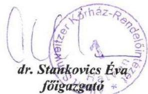

Albert Schweitzer Kórház-Rendelőintézet $\cdot$ 3000 Hatvan, Balassi Bálint u. 16.

---

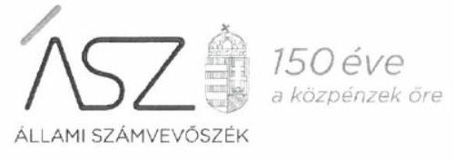

Ikt. szám: EL-2291-059/2020.

Dr. Stankovics Éva úrhölgy
főigazgató
Albert Schweitzer Kórház-Rendelőintézet

# Hatvan 

Tisztelt Főigazgató Úrhölgy!
„Az egészségügyi és szociális ellátó intézmények kockázatalapú utóellenőrzése" címmel készített számvevőszéki jelentéstervezetre tett IG/2/9/2020. iktatószámú észrevételét köszönettel megkaptam.

Az Állami Számvevőszék észrevételre vonatkozó álláspontjáról a felügyeleti vezető által készített részletes tájékoztatást mellékelten megküldöm.

Tájékoztatom Főigazgató úrhölgyet, hogy a számvevőszéki jelentésben - az Állami Számvevőszékről szóló 2011. évi LXVI. törvény 29. § (3) bekezdése alapján - a figyelembe nem vett észrevételt szerepeltetjük, annak indoklásával, hogy azt az Állami Számvevőszék miért nem fogadta el.

Budapest, 2020. 08. hó 0. nap

Melléklet: Tájékoztatás az észrevétel kezeléséről
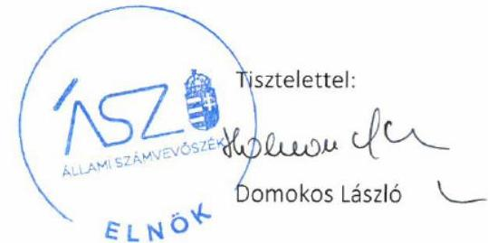

---

Melléklet
Ikt.szám: EL-2291-059/2020.

# Tájékoztatás   az észrevétel kezeléséről 

"Az egészségügyi és szociális ellátó intézmények kockázatalapú utóellenőrzése" címú jelentéstervezetre 2020. július 15-én érkezett észrevételt áttekintettük, annak kezelésével kapcsolatban a következő tájékoztatást adom.

Az Albert Schweitzer Kórház- Rendelőintézet észrevételében Főigazgató úrhölgy az ellenőrzések 2018. évi nyilvántartásával kapcsolatban megerősítette az Állami Számvevőszék vonatkozó megállapítását, a jelentéstervezet módosítása nem indokolt.

Budapest, 2020. 08. hó 0. nap
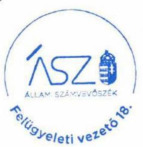

Makkai Mária s.k. felügyeleti vezető

A kiadmány hiteles.

---

# Győr-Moson-Sopron Megyei Dr. Piróth Endre Szociális Központ 

Székhely: 9086 Töltéstava, Táplánypuszta
Tel./Fax: 96/548-280, 96/548-289
E-mail: titkarsag@drpirothotthon.hu
Telephely 1.: Győr-Moson-Sopron Megyei Dr. Piróth Endre Szociális Központ Rehabilitációs Intézménye
Cim: $\quad 9113$ Koroncó - Zöldmajor
Tel./Fax: $\quad 96 / 556-082$
E-mail: zoldmajor@efrikoronco.t-online.hu
Telephely 2.: Győr-Moson-Sopron-Megyei Dr. Piróth Endre Szociális Központ Átmeneti Gondozóháza
Cim: $\quad 9023$ Győr, Török István utca 1.
Tel.: $\quad 96 / 519-026,20 / 337-2123 \quad$ E-mail: fgg.gyor@gmail.com
Állami Számvevőszék
1052 Budapest
Apáczai Csere János utca 10.
Domokos László
Elnök Úr
részére

Ikt. Szám: PESZK-A/1360/2020
Tárgy: Észrevételezés „Az
egészségügyi és szociális ellátó
intézmények kockázatalapú
utóellenőrzése" címmel készített
számvevőszéki jelentéstervezettel kapcsolatosan

## Tisztelt Elnök Úr!

Hivatkozással az EL-2291-042/2020. iktatószámon, 2020. június 30. napján kelt tájékoztatására, az alábbi észrevételeket teszem a „Jelentéstervezet, Utóellenőrzések, Az egészségügyi és szociális ellátó intézmények kockázatalapú utóellenőrzése" címmel megküldött dokumentumban foglaltakhoz kapcsolódóan.

A költségvetési szervek belső kontrollrendszeréről és belső ellenőrzéséről szóló 370/2011. (XII. 31.) Korm. rendelet (továbbiakban: Bkr.) 14. § (1) bekezdésében rögzített külső ellenőrzések megállapításaihoz kapcsolódó intézkedési tervek végrehajtásáról táblázatos formában készítettünk beszámolót az irányító szerv felé, amit az Állami Számvevőszék részére 1.1.1; 1.1.2; 1.1.3; pont alatt 2019. december 10. napján megküldtünk.

Az intézkedések végrehajtását az irányító szerv belső ellenőre helyszíni ellenőrzés keretében megvizsgálta, melyet az SZGYF-IKT-11637- /2016 iktatószámú dokumentumhoz kapcsolódó SZGYF-IKT-477/2017 iktatószámú belső ellenőrzési jelentésben rögzített.
A hivatkozott belső ellenőrzési jelentést pótlólag csatoljuk a Tisztelt Állami Számvevőszék részére.

Az éves beszámolókon kívül - a belső és külső ellenőrzésekhez kapcsolódóan - az ellenőrzés javaslatai alapján minden alkalommal készült intézkedési terv, melyet a fenntartó illetve külső ellenőrzés során az ellenőrzést végző hatóság részére egyaránt megküldtünk, majd a terv elfogadását követően végrehajtottunk.

---

Az Állami Számvevőszék ellenőrzésének javaslatait megalapozó megállapításokhoz kapcsolódó, intézkedési tervben meghatározott feladatokat a Bkr. 13. § (2) bekezdésének megfelelően végrehajtottuk, melyet a belső ellenőrzési jelentésben foglaltak támasztanak alá.

Kérem, hogy a végleges jelentés elkészítésekor a belső ellenőrzési jelentésben foglaltakat figyelembe venni szíveskedjék.

Észrevételeit és megállapításait köszönettel fogadtuk.
Töltéstava, Táplánypuszta, 2020. július 8.
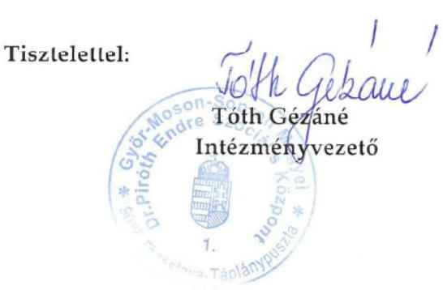

---

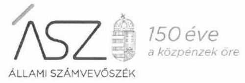

Ikt. szám: EL-2291-060/2020.

Tóth Gézáné úrhölgy
intézményvezető

Győr-Moson-Sopron Megyei Dr. Piróth Endre Szociális Központ

# Töltéstava 

Tisztelt Intézményvezető Úrhölgy!
„Az egészségügyi és szociális ellátó intézmények kockázatalapú utóellenőrzése" címmel készített számvevőszéki jelentéstervezetre tett PESZK-A/1360/2020. iktatószámú észrevételét köszönettel megkaptam.

Az Állami Számvevőszék észrevételre vonatkozó álláspontjáról a felügyeleti vezető által készített részletes tájékoztatást mellékelten megküldöm.

Tájékoztatom Intézményvezető úrhölgyet, hogy a számvevőszéki jelentésben - az Állami Számvevőszékről szóló 2011. évi LXVI. törvény 29. § (3) bekezdése alapján - a figyelembe nem vett észrevételt szerepeltetjük, annak indoklásával, hogy azt az Állami Számvevőszék miért nem fogadta el.

Budapest, 2020. 06. hó 04. nap

Melléklet: Tájékoztatás az észrevétel kezeléséről
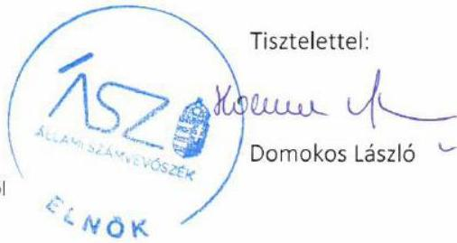

---

Melléklet
Ikt.szám: EL-2291-060/2020.

# Tájékoztatás   az észrevétel kezeléséről 

„Az egészségügyi és szociális ellátó intézmények kockázatalapú utóellenőrzése" címú jelentéstervezetre 2020. július 17-én érkezett észrevételt áttekintettük, annak kezelésével kapcsolatban a következő tájékoztatást adom.

Észrevételében Intézményvezető úrhölgy tájékoztatott, hogy a külső ellenőrzések megállapításaihoz kapcsolódó intézkedési tervek végrehajtásáról táblázatos formában készítettek beszámolót az irányító szerv felé, melyet az Állami Számvevőszék (továbbiakban ÁSZ) részére korábban az adatszolgáltatás során megküldtek. Továbbá tájékoztatott, hogy az irányító szerv belső ellenőre helyszíni ellenőrzés keretében megvizsgálta az intézkedések végrehajtását, amelyről készített belső ellenőrzési jegyzőkönyvet észrevételéhez csatolta.

Tájékoztatom Intézményvezető úrhölgyet, hogy az ÁSZ ellenőrzési megállapításai minden esetben az ellenőrzés során, az arra nyitva álló határidőben rendelkezésre bocsátott dokumentumokon alapulnak, az észrevétel mellékleteként megküldött dokumentumot nem értékeltük.
A Győr-Moson-Sopron Megyei Dr. Piróth Endre Szociális Központ az ellenőrzés során nem bocsátott az ÁSZ rendelkezésére olyan dokumentumot, amely igazolná, hogy az intézkedési tervben vállalt és végrehajtott 11 intézkedésről, azok rövid leírásával beszámolt az irányító szerv felé. Fentiek alapján az észrevételt nem fogadjuk el, a jelentéstervezet módosítása nem indokolt.

Budapest, 2020. 04. hó 09. nap
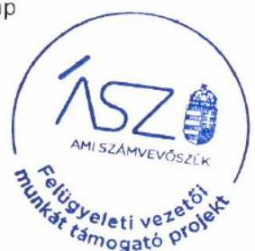

Makkai Mária s.k. felügyeleti vezető

A kiadmány hiteles.

---

# FŐIGAZGATÓSÁG 

## - DR. RALOVICH ZSOLT   Főigazgató

Ikt.sz.: JFKH-3161-4/2020
Hiv.sz.: EL-2291-042/2020
Tárgy: észrevételek ÁSZ
jelentéstervezetre
Budapest, 2020. július 9.

Állami Számvevőszék

## Domokos László

elnök

## Budapest

Apáczai Csere János u. 10.
1052

## Tisztelt Elnök Úr!

Az EL-2291-042/2020 iktatószámú „Az egészségügyi és szociális ellátó intézmények kockázatalapú utóellenőrzése" tárgyú jelentéstervezetet köszönettel megkaptam.

A jelentéstervezettel összefüggésben az alábbi észrevételt kívánom előterjeszteni, a jelentés tervezet 16. oldalán foglaltak vonatkozásában:

Állami Számvevőszék megállapítása: „Az intézkedési tervben meghatározott feladatok végrehajtásával összefüggő nyilvántartás vezetése során az intézmény vezetője nem tartotta be a jogszabályi előírásokat, mivel a Bkr. 14. § (1) szerinti nyilvántartás a Bkr. 47 § (2) bekezdésében előírtak ellenére nem tartalmazta az elfogadott intézkedési terv valamennyi javaslatát"

A Kórház észrevétele: A 16004.sz. Állami Számvevőszék jelentés Intézményünk működése kapcsán 6 pontban 10 javaslatot fogalmazott meg a Kórház vezetője
 számára. Az Állami Számvevőszék jelentésében megfogalmazottak megfelelő végrehajtása céljából kiadott főigazgatói intézkedés 12 feladatot tartalmazott, felelősök és határidők kijelölésével. A főigazgatói intézkedést határidőben, 2016. március 9-én megküldtük az Állami Számvevőszék részére. Az Állami Számvevőszék V-0743-298/2016. iktatószámú tájékoztatója alapján „az intézkedési terv tervezett intézkedései összhangban vannak a számvevőszéki jelentésben foglalt intézkedést igénylő megállapításokkal, javaslatokkal”.

---

# - FŐIGAZGATÓSÁG   - DR. RALOVICH ZSOLT   Főigazgató 

Intézményünk belső ellenőrzése által készített 2016. évi külső ellenőrzésekről szóló nyilvántartás idevonatkozó részének szövegezése eltér ugyan az Állami Számvevőszék jelentésében foglalt javaslatok szövegezésétől, azonban a belső ellenőr által felsorolt 11 javaslat tartalmilag megegyezik az Állami Számvevőszék jelentésében megfogalmazottakkal, csak nem szó szerint és más sorrendben. A 2016. évi külső ellenőrzésekről szóló belső ellenőri nyilvántartás 4. sorának 16. és 17. oszlopa tartalmazza a főigazgatói intézkedésben meghatározott mind a 12 feladat maradéktalan végrehajtását, mely lefedi az Állami Számvevőszék jelentésének javaslatait.

Állami Számvevőszék megállapítása: „Az intézmény nem rendelkezett a 2016, 2017, 2018. évi beszámoló mérleg tételeit alátámasztó leltárral, ezzel megsértette a Számv. tv. 69. § (1) bekezdését, valamint az Alssz. 22. § (1) bekezdését.”

A Kórház észrevétele: Intézményünk a 2016., 2017., 2018. évi beszámoló mérleg tételeit alátámasztó leltár dokumentumait az Állami Számvevőszék által biztosított felületre feltöltötte, ennek tényét a 2020. január 24-én kelt teljességi és hitelességi nyilatkozat 1.7.1. pontja, 1.7.2. pontja valamint 1.7.3. pontja alátámasztja. A korábban megküldött, aláírt teljességi és hitelességi nyilatkozatot jelen levelemhez csatoltan ismételten továbbítom.

Kérem Tisztelt Elnök Urat, hogy a fentiek szerint előterjesztett észrevételek és indokaink figyelembe vételével „Az egészségügyi és szociális ellátó intézmények kockázatalapú utóellenőrzése” tárgyú Állami Számvevőszék jelentés véglegesítése során, Intézményünknek az Állami Számvevőszék jelentés tervezetben megjelenített kockázati besorolását felülvizsgálni és megfelelően alacsony kockázatúra módosítani szíveskedjen, tekintettel arra, hogy Intézményünk az Állami Számvevőszék által elfogadott intézkedési tervünkben meghatározott feladatokat maradéktalanul végrehajtotta.
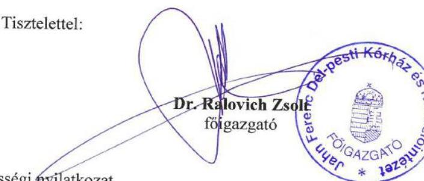

Melléklet: Teljességi és hitelességi nyilatkozat

Jahn Ferenc Dél-pesti Kórház és Rendelőintézet

- 1204 Budapest, Köves u. 1. - fog@delpestikorkazh.

---

# 150 éve   a közpénzek őre 

ÁLLAMI SZÁMVEVŐSZÉK

Ikt. szám: EL-2291-058/2020.

Dr. Ralovich Zsolt Gábor úr
főigazgató
Jahn Ferenc Dél-pesti Kórház és Rendelőintézet

## Budapest

Tisztelt Főigazgató Úr!
„Az egészségügyi és szociális ellátó intézmények kockázatalapú utóellenőrzése” címmel készített számvevőszéki jelentéstervezetre tett JFKH-3161-4/2020. iktatószámú észrevételét köszönettel megkaptam.

Az Állami Számvevőszék észrevételre vonatkozó álláspontjáról a felügyeleti vezető által készített részletes tájékoztatást mellékelten megküldöm.

Tájékoztatom Főigazgató urat, hogy a számvevőszéki jelentésben - az Állami Számvevőszékről szóló 2011. évi LXVI. törvény 29. § (3) bekezdése alapján - a figyelembe nem vett észrevételt szerepeltetjük, annak indoklásával, hogy azt az Állami Számvevőszék miért nem fogadta el.

Budapest, 2020. 08. hó 0. nap

Melléklet: Tájékoztatás az észrevétel kezeléséről
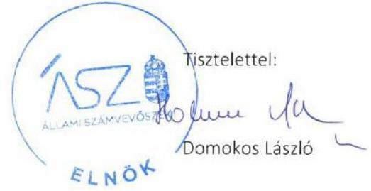

---

Melléklet
Ikt.szám: EL-2291-058/2020.

# Tájékoztatás   az észrevétel kezeléséről 

„Az egészségügyi és szociális ellátó intézmények kockázatalapú utóellenőrzése” című jelentéstervezetre 2020. július 15-én érkezett észrevételt áttekintettük, annak kezelésével kapcsolatban a következő tájékoztatást adom.

A Jahn Ferenc Dél-pesti Kórház és Rendelőintézet (továbbiakban Intézmény) intézkedési tervben meghatározott feladatok végrehajtásával összefüggő nyilvántartás vezetésével kapcsolatban tett észrevételében Főigazgató úr tájékoztatott arról, hogy a 2016. évi külső ellenőrzésekről szóló nyilvántartás vonatkozó részének szövegezése eltér ugyan az Állami Számvevőszék (továbbiakban ÁSZ) jelentésében foglalt javaslatok szövegezésétől, azonban a felsorolt 11 javaslat megegyezik az ÁSZ jelentésében megfogalmazottakkal.

Tájékoztatom Főigazgató urat, hogy az ÁSZ az ellenőrzés során rendelkezésre bocsátott dokumentumok alapján figyelembe vette, hogy az Intézmény által vállalt 11. és 12. intézkedési tervpont a nyilvántartásban összevontan szerepel, azonban egy konkrét közbeszerzési szerződésre vonatkozó belső vizsgálatot és a felelősségre vonás jogi kereteinek meghatározását tartalmazó feladat sem a 2016. évi, sem a későbbi évek nyilvántartásában nem szerepel. Fentiek alapján az észrevételt nem fogadjuk el, a jelentéstervezet módosítása nem indokolt.

Az Intézmény 2016., 2017. és 2018. évi beszámoló mérleg tételeit alátámasztó leltárral kapcsolatban tett észrevétel tájékoztat arról, hogy az leltár dokumentumait az ellenőrzés során az ÁSZ rendelkezésére bocsátották. Az észrevételben hivatkozott, Főigazgató Úr által adott teljességi és hitelességi nyilatkozatban is rögzítettek szerint, a 2016., 2017., 2018. évi mérleg tételeit alátámasztó leltárak dokumentumaiként csatolt leltárösszesítő jegyzőkönyvek nem fogadhatóak el. A jegyzőkönyvek nem feleltethetők meg a számvitelről szóló 2000. évi C. törvény 69. § (1) bekezdés, valamint az államháztartás számviteléről szóló 4/2013. (I.11.) Korm. rendelet 22. § (1) bekezdés előírásának, nem tartalmazzák az Intézmény eszközeit és forrásait tételesen, ellenőrizhető módon. Fentiek alapján az észrevételt nem fogadjuk el, a jelentéstervezet módosítása nem indokolt.

Budapest, 2020. 08. hó 0. nap
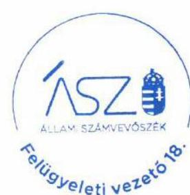

Makkai Mária s.k.
felügyeleti vezető

A kladmány hiteles.

---

# TÜDŐGYÓGYINTÉZET 

TÖRÖKBALINT
2045 Törökbálint, Munkácsy Mihály u. 70. Tel: 06-23/511-570, 338-052 Fax: 06-23-335-012
E-MAIL: tbtig.torokbalintkorhas.hu
Web: www.torokbalintkorhas.hu

## Tisztelt Elnök Úr!

2020. július 2-án kézhezvettem „Az egészségügyi és szociális ellátó intézmények kockázatalapú utóellenőrzése” címmel készített számvevőszéki jelentéstervezetet. A Törökbálinti Tüdőgyógyintézetet érintő megállapításokra - a rendelkezésemre álló határidőn belül - a következő észrevételt teszem:
Megköszönöm az Állami Számvevőszék munkatársainak szakmai munkáját és segítő észrevételeit.
A Tüdőgyógyintézet a számvevőszéki jelentések megállapításai alapján előírt intézkedési terveket elkészítette, az abban foglalt feladatokat végrehajtotta és beszámolt az elrendelt intézkedések végrehajtásáról.
A Tüdőgyógyintézet a Számvevőszék - és további külső ellenőrző szervek - által előírt intézkedési tervek végrehajtásáról szóló beszámolási kötelezettségének minden évben, az Állami Egészségügyi Ellátó Központ Főigazgatói rendelkezése értelmében, a kötelezően előírt melléklet szerinti tartalommal eleget tett. A beszámolót minden évben - a vizsgálattal érintett időszakban is -, az előírt, január 31-iki határidőig az Állami Egészségügyi Ellátó Központ részére megküldte.
Az ÁEEK Főigazgatója rendelkezésében a Bkr. 14. § (1)-(2) bek.-ben előírtakra hivatkozott, miszerint „A költségvetési szerv vezetője az (1) bekezdésben meghatározott nyilvántartás alapján a tárgyévet követő év január 31-ig beszámol a fejezetet irányító szerv vezetőjének és a fejezetet irányító szerv belső ellenőrzési vezetőjének.”
A Tüdőgyógyintézet a számvevőszéki jelentéstervezetben a törvényi megfelelés irányítási és gazdálkodási kockázat tekintetében „MAGAS” kockázati besorolást kapott az ellenőrzéssel érintett 2016. szeptember 20. - 2019. november 29-ig terjedő időszakra. Az egyedi megállapítás szerint:
„Az intézmény vezetője a javaslatokat megalapozó ÁSZ megállapításhoz kapcsolódó intézkedési tervben meghatározott feladatok végrehajtásáról a Bkr. 14. § (2) bekezdés szerinti beszámolóját az irányító szerv felé nem készítette el.
Az intézmény vezetője a Bkr. 14. § (1) bekezdésében előírtakkal ellentétben nem gondoskodott a külső ellenőrzések javaslatai alapján készült, az ÁSZ megállapításához kapcsolódó intézkedési tervben szereplő feladatokat tartalmazó nyilvántartás vezetéséről.”

---

Tisztelettel kérem a számvevőszéki jelentéstervezet előbb idézett megállapításának kiegészítését azzal, hogy a Tüdőgyógyintézet a Bkr. 14. § (1)-(2) bek.-ben előírt jogszabályi kötelezettségének a fenntartói, középirányítói jogokat gyakorló Állami Egészségügyi Ellátó Központ Főigazgatójának rendelkezése szerint tett eleget.

Megjegyzem, a Bkr. 13. § (4) bek.-e a külső ellenőrzések intézkedési tervével kapcsolatban előírja: „Az ellenőrzött, valamint a javaslattal érintett szerv, illetve szervezeti egység vezetője a külső ellenőrzést végzők részére a külön jogszabályban vagy annak hiányában az általuk meghatározott módon és határidőre számol be az intézkedési tervben meghatározott egyes feladatok végrehajtásáról.”

Tisztelt Elnök Úr!
Engedje meg, hogy az előadott indokok alapján, a Tüdőgyógyintézet magas szintű orvosszakmai, gazdasági és pénzügyi eredményeire alapozva, a leköszönt Főigazgató és a magam nevében kifogásoljam a magas kockázatú minősítést és kérjem annak átminősítését.
A Tüdőgyógyintézet Törökbálint vezetése folyamatosan törekedett és jelenleg is törekszik a gazdaságosság, hatékonyság és eredményesség követelményeinek betartására, az intézetnek nincs és korábban sem volt lejárt szállítói tartozásállománya, fedezet nélküli kötelezettségvállalása nincs és a múltban sem volt.
Az ÁEEK-nak megküldött „Külső ellenőrzésekhez kapcsolódó intézkedések nyilvántartása” tartalmilag minden tekintetben kielégítette a rendeletben előírtakat, a tábla 17. oszlopa részletesen tartalmazta az intézkedésekről szóló beszámolót. (Szakmai ismereteim szerint az ÁEEK koordinálta a fenntartása alá tartozó intézmények jelentéseit és továbbította az Irányító szerv felé.)
Bízom abban, hogy az Állami Egészségügyi Ellátó Központ Főigazgatójának 2020. március 3-án kiadott rendelkezése, amely az Emberi Erőforrások Minisztériuma Egészségügyért Felelős Államtitkára 39611/2019/EGSTRAT számú elrendelése alapján feladatul szabta az Állami Számvevőszék javaslatai hasznosulásának monitorozását, az egyértelművé tett eljárásrendben lehetővé teszi a számvevőszéki figyelemfelhívó levelek, az intézményi intézkedési tervek, azok módosításainak követését és a végrehajtásról szóló beszámolók ellenőrizhetőségét.

Törökbálint, 2020. július 15.

Tisztelettel,
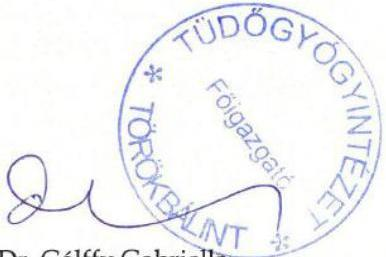

Dr. Gálffy Gabriella
oktatási és kutatási igazgató
Főigazgatót helyettesítő jogkörben

---

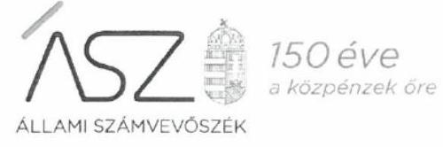

Ikt. szám: EL-2291-061/2020.

Dr. Gálffy Gabriella úrhölgy
Főigazgató
Tüdőgyógyintézet Törökbálint
Törökbálint

Tisztelt Főigazgató Úrhölgy!
„Az egészségügyi és szociális ellátó intézmények kockázatalapú utóellenőrzése” címmel készített számvevőszéki jelentéstervezetre tett 579-2/2020. iktatószámú észrevételét köszönettel megkaptam.

Az Állami Számvevőszék észrevételre vonatkozó álláspontjáról a felügyeleti vezető által készített részletes tájékoztatást mellékelten megküldöm.

Tájékoztatom Főigazgató úrhölgyet, hogy a számvevőszéki jelentésben - az Állami Számvevőszékről szóló 2011. évi LXVI. törvény 29. § (3) bekezdése alapján - a figyelembe nem vett észrevételt szerepeltetjük, annak indoklásával, hogy azt az Állami Számvevőszék miért nem fogadta el.

Budapest, 2020. 08. hó 07. nap
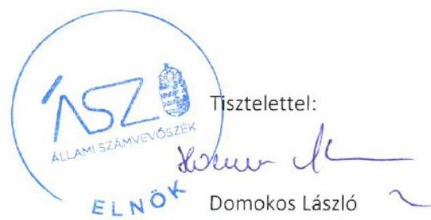

Melléklet: Tájékoztatás az észrevétel kezeléséről

---

# Tájékoztatás 

az észrevétel kezeléséről
„Az egészségügyi és szociális ellátó intézmények kockázatalapú utóellenőrzése” című jelentéstervezetre 2020. július 21-én érkezett észrevételt áttekintettük, annak kezelésével kapcsolatban a következő tájékoztatást adom.

Az észrevételben Főigazgató úrhölgy tájékoztat arról, hogy a Tüdőgyógyintézet Törökbálint (továbbiakban Intézmény) az Állami Egészségügyi Ellátó Központ (továbbiakban ÁEEK) Főigazgatójának a „Bkr. 14. § (1)-(2) bek.-ben előírtakra hivatkozott” rendelkezése alapján a külső ellenőrző szervek által előírt intézkedési tervek végrehajtásáról szóló beszámolási kötelezettségének minden évben eleget tett és a beszámolót a vizsgálattal érintett időszakban is megküldte az ÁEEK részére. Továbbá Főigazgató úrhölgy a magas kockázatú minősítést kifogásolja és kéri annak átminősítését.

Tájékoztatom Főigazgató úrhölgyet, hogy az Állami Számvevőszék (továbbiakban ÁSZ) az ellenőrzés során az Intézmény által rendelkezésére bocsátott dokumentumok alapján állapította meg, hogy a vonatkozó jogszabályi előírás - a költségvetési szervek belső kontrollrendszeréről és belső ellenőrzéséről szóló 370/2011. (XII. 31.) Korm. rendelet (továbbiakban Bkr.) 14. § (2) bekezdés előírása ellenére az intézmény a fejezetet irányító szerv vezetőjének nem készítette el beszámolóját.

Az ÁEEK részére megküldött, hivatkozott beszámoló nem fogadható el a fejezetet irányító szerv vezetőjének küldendő beszámolóként, amelyet az észrevételben leírtak is megerősítenek. Az ÁEEK részére készített beszámolót az észrevétel utolsó bekezdése szerint ugyanis az ÁEEK főigazgatója rendelte el, „amely az Emberi Erőforrások Minisztériuma Egészségügyért felelős Államtitkára 39611/2019/EGSTRAT számú elrendelése alapján feladatul szabta az Állami Számvevőszék javaslatai hasznosulásának monitorozását, az egyértelművé tett eljárásrendben lehetővé teszi a számvevőszéki figyelemfelhívó levelek, az intézményi intézkedési tervek, azok módosításainak követését és a végrehajtásról szóló beszámolók ellenőrizhetőségét.”

Az előzőekkel összefüggésben észrevételében Főigazgató úrhölgy megjegyzésként a Bkr. 13. § (4) bekezdését idézi. A hivatkozott jogszabályi rendelkezés az ÁSZ megállapítása esetében nem releváns, mivel az nem az irányító szerv felé történő, hanem a külső ellenőrzést végzők részére szóló beszámolásra vonatkozik.

A magas kockázatú besorolást az előzőeken túl az is indokolja, hogy a külső ellenőrzések javaslatai alapján készült nyilvántartás az ÁSZ megállapításaihoz kapcsolódó intézkedési tervben szereplő feladatokat nem tartalmazza. A Bkr. 47. § (2) bekezdése szerint a nyilvántartásnak tartalmaznia
 kell az ellenőrzési jelentésben szereplő javaslatot, az elfogadott intézkedési tervet, az intézkedési terv

---

alapján végrehajtott intézkedések rövid leírását, és a végre nem hajtott intézkedések okát. Az ÁSZ rendelkezésére bocsátott 2016. évi nyilvántartásban mindössze az szerepel, hogy „Elkészült jelentéstervezetre intézkedés kérése”. A 2017. és a 2018. évi nyilvántartásban az utóellenőrzéssel érintett ÁSZ jelentéssel kapcsolatban semmi nem szerepel.

A fentiek alapján az észrevételt nem fogadjuk el, a jelentéstervezet módosítása nem indokolt.

Budapest, 2020. 08. hó 07. nap
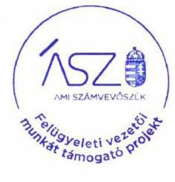

Makkai Mária s.k. felügyeleti vezető

A kiadmány hiteles.

---

# Borsod-Abaúj-Zemplén Megyei   Dr. Csiba László Integrált Szociális Intézmény 3770 Sajószentpéter, Csiba L.u.1. 

Iktatószám: 90505-A/2505/2020
Ügyintéző: Mondreán-Veréb Erzsébet
Tárgy: Jelentéstervezet elfogadása

## Állami Számvevőszék

## Domokos László

Elnök Úr részére

## Budapest

Apáczai Csere János utca 10. 1052

## Tisztelt Elnök Úr!

„Az egészségügyi és szociális ellátó intézmények kockázatalapú utóellenőrzése” címû számvevőszéki jelentéstervezet megállapításaira nem kívánok észrevételt tenni, az abban foglaltakat elfogadom.

Sajószentpéter, 2020. július 3.
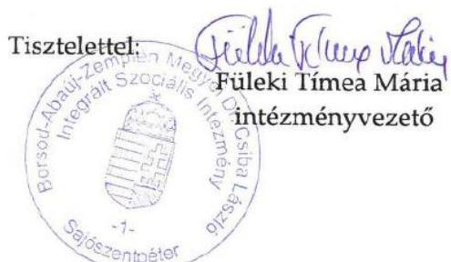

---

# RÖVIDÍTÉSEK JEGYZÉKE 

${ }^{1}$ ÁSZ
${ }^{2}$ Bkr.
${ }^{3}$ Bkr.
${ }^{4}$ Számv tv.

Állami Számvevőszék
a költségvetési szervek belső kontrollrendszeréről és belső ellenőrzéséről szóló 370/2011. (XII. 31.) Korm. rendelet (hatályos: 2012. január 1-jétől)
a költségvetési szervek belső kontrollrendszeréről és belső ellenőrzéséről szóló 370/2011. (XII. 31.) Korm. rendelet (hatályos: 2012. január 1-jétől)
2000. évi C. törvény a számvitelről

---

# ÁSZ 

ÁLLAMI SZÁMVEVŐSZÉK
1052 Budapest, Apáczai Cs. J. u. 10. I 1364 Budapest 4. Pf. 54 TEL: +36 14849100
email: szamvevoszek@asz.hu
web: www.asz.hu | www.aszhirportal.hu

